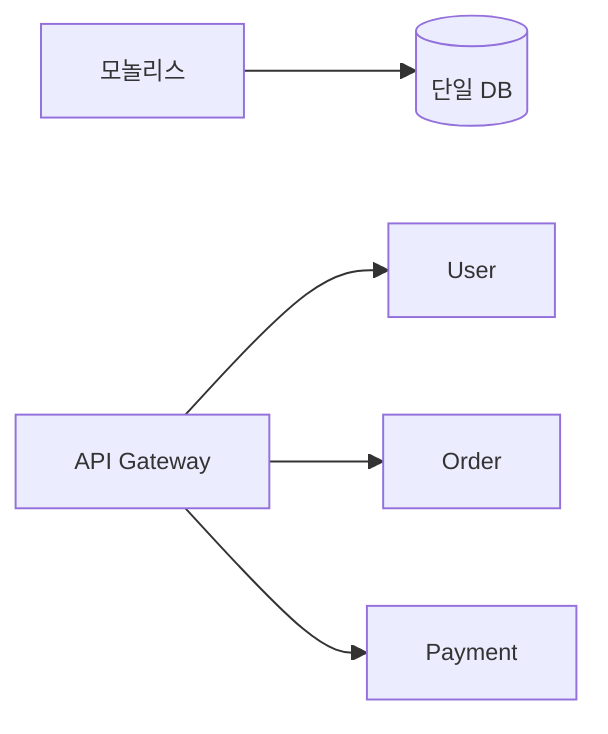
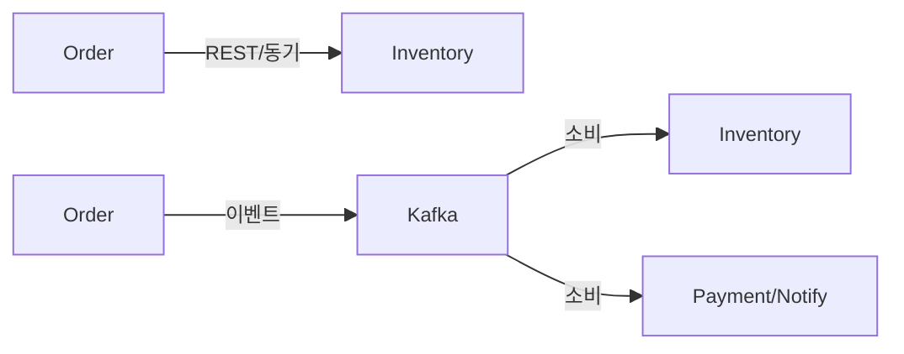
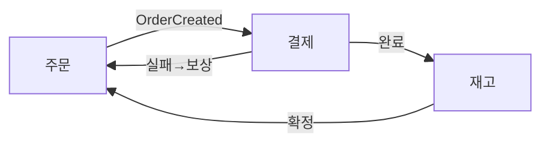
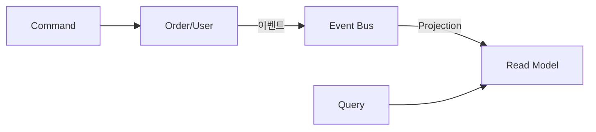

처음에는 작은 쇼핑몰 하나였다. 코드 한 곳에서 회원, 주문, 결제, 배송을 모두 처리했다. 팀이 커지고 기능이 늘면서 빌드는 30분, 배포는 하루에 한 번, 한 줄 수정이 전체 서비스를 다운시킨다. MSA는 이 문제를 해결하기 위해 시스템을 독립적으로 배포 가능한 작은 서비스들로 나눈다.

> **비유**: 큰 백화점 하나(모놀리스)를 개별 매장들이 모인 쇼핑몰(MSA)로 바꾸는 것이다. 각 매장은 독립적으로 운영되고, 인테리어를 바꿔도 옆 매장에 영향을 주지 않는다. 하지만 쇼핑몰 전체 운영(인프라, 보안, 주차)은 공통으로 관리된다.

---

## 모놀리스 vs MSA



### 모놀리스의 장단점

| 장점 | 단점 |
|---|---|
| 개발 초기 단순함 | 코드베이스 복잡도 폭증 |
| 단일 트랜잭션 처리 용이 | 빌드/배포 시간 증가 |
| 분산 시스템 문제 없음 | 특정 컴포넌트만 스케일 불가 |
| 트레이싱 단순 | 기술 스택 교체 어려움 |
| 테스트 용이 | 팀 간 코드 충돌 빈발 |

### MSA의 장단점

| 장점 | 단점 |
|---|---|
| 독립 배포/스케일링 | 분산 시스템 복잡도 |
| 기술 스택 자유 선택 | 네트워크 레이턴시 추가 |
| 장애 격리 | 분산 트랜잭션 관리 필요 |
| 팀 독립성 (Conway's Law) | 테스트/모니터링 복잡 |
| 서비스별 최적 DB 선택 | 운영 오버헤드 증가 |

---

## 서비스 분리 기준

MSA에서 가장 어려운 결정은 "어떻게 나눌 것인가"다.

### DDD 바운디드 컨텍스트

```
도메인 주도 설계(DDD)에서 바운디드 컨텍스트 = 마이크로서비스 경계

예시: 이커머스 도메인 분리
  - User Context:    회원가입, 로그인, 프로필
  - Order Context:   주문 생성, 조회, 취소
  - Payment Context: 결제 처리, 환불, 정산
  - Inventory Context: 재고 관리, 입출고
  - Delivery Context: 배송 추적, 택배사 연동
  - Notification Context: 이메일, SMS, Push

각 컨텍스트는 독립적 모델과 언어를 가짐
User Context의 "고객" ≠ Payment Context의 "결제자" (같은 개념이라도 다른 속성)
```

### 분리 원칙

```
1. 단일 책임 원칙: 하나의 서비스 = 하나의 비즈니스 능력
2. 독립 배포 가능: 다른 서비스 수정 없이 배포 가능해야 함
3. 데이터 소유권: 각 서비스는 자신의 DB를 소유, 다른 서비스 DB에 직접 접근 금지
4. 느슨한 결합: 서비스 간 인터페이스만 공유, 구현 공유 금지
5. 높은 응집도: 같이 변경되는 것들은 같은 서비스에

나쁜 분리 예시:
  User Service와 Profile Service가 항상 같이 배포됨 → 합쳐야 함
  Order Service가 Payment DB에 직접 쿼리 → 캡슐화 위반
```

---

## 서비스 간 통신

### 동기 통신 (Synchronous)

```
REST API / gRPC
  장점: 즉시 응답, 단순한 프로그래밍 모델
  단점: 강한 결합, 호출된 서비스 다운 시 호출자도 영향

적합한 경우:
  - 실시간 응답이 필요한 경우 (장바구니 조회, 재고 확인)
  - 사용자가 기다리는 동기적 흐름
```

```java
// FeignClient로 동기 호출
@FeignClient(name = "inventory-service")
public interface InventoryClient {
    @GetMapping("/inventory/{productId}")
    InventoryDto checkInventory(@PathVariable Long productId);
}

@Service
public class OrderService {
    private final InventoryClient inventoryClient;

    public OrderResult createOrder(OrderRequest request) {
        // 동기 호출: inventory-service가 다운되면 예외 발생
        InventoryDto inventory = inventoryClient.checkInventory(request.getProductId());
        if (inventory.getStock() < request.getQuantity()) {
            throw new OutOfStockException();
        }
        return processOrder(request);
    }
}
```

### 비동기 통신 (Asynchronous)

```
메시지 브로커 (Kafka, RabbitMQ)
  장점: 느슨한 결합, 수신자 다운 시에도 발신자 정상 동작
  단점: 최종 일관성, 복잡한 오류 처리, 디버깅 어려움

적합한 경우:
  - 즉시 응답이 불필요한 작업 (이메일 발송, 데이터 동기화)
  - 여러 서비스에 동일 이벤트 전파
  - 높은 처리량이 필요한 경우
```

```java
// 주문 생성 이벤트 발행
@Service
public class OrderService {
    private final KafkaTemplate<String, OrderEvent> kafkaTemplate;

    public OrderResult createOrder(OrderRequest request) {
        Order order = orderRepository.save(new Order(request));

        // 비동기 이벤트 발행: Payment, Inventory, Notification이 각자 처리
        kafkaTemplate.send("order.created", new OrderCreatedEvent(order));

        return OrderResult.accepted(order.getId());  // 즉시 반환
    }
}

// 각 서비스가 독립적으로 이벤트 소비
@KafkaListener(topics = "order.created")
public void onOrderCreated(OrderCreatedEvent event) {
    paymentService.initiatePayment(event);
}
```



---

## Saga 패턴 (분산 트랜잭션)

MSA에서 여러 서비스에 걸친 트랜잭션은 DB 레벨에서 처리할 수 없다. Saga는 로컬 트랜잭션의 연쇄와 보상 트랜잭션으로 최종 일관성을 달성한다.

> **비유**: Saga는 릴레이 경주다. 각 주자(서비스)가 자기 구간만 뛰고 바통(이벤트)을 넘긴다. 한 주자가 넘어지면(실패) 이전 주자들이 역순으로 돌아와 출발선까지 되감는다(보상 트랜잭션). 모놀리스의 단일 트랜잭션은 혼자 전 구간을 뛰는 마라톤이라, 중간에 넘어지면 `ROLLBACK` 한 줄이면 끝이지만, 릴레이는 각 주자가 개별적으로 되돌아와야 하므로 복잡하다.

### Choreography Saga (이벤트 기반)

```
서비스들이 이벤트를 발행/구독하며 스스로 조율
중앙 조율자 없음 → 느슨한 결합
단점: 전체 흐름 파악 어려움, 순환 의존 위험
```



### Orchestration Saga (중앙 조율)

```
중앙 Saga Orchestrator가 각 서비스에 명령을 보내며 조율
흐름 파악 용이, 복잡한 로직 처리 쉬움
단점: 오케스트레이터가 너무 많은 것을 알게 됨 (결합도 증가 위험)
```

```java
@Service
public class OrderSagaOrchestrator {

    public void executeOrderSaga(OrderRequest request) {
        // 1. 주문 생성
        Order order = orderService.create(request);

        try {
            // 2. 결제 처리
            paymentService.charge(order.getId(), request.getAmount());

            try {
                // 3. 재고 차감
                inventoryService.reserve(request.getProductId(), request.getQty());

                // 4. 알림 발송
                notificationService.sendConfirmation(order);

                order.confirm();

            } catch (InventoryException e) {
                // 재고 실패 → 결제 보상 트랜잭션
                paymentService.refund(order.getId());
                order.cancel("재고 부족");
            }

        } catch (PaymentException e) {
            // 결제 실패 → 주문 취소
            order.cancel("결제 실패");
        }
    }
}
```

---

## CQRS (Command Query Responsibility Segregation)

명령(쓰기)과 조회(읽기)를 분리하는 패턴이다.

> **비유**: CQRS는 은행의 창구 분리다. 입금/출금 창구(Command)와 잔액 조회 창구(Query)를 물리적으로 나눈다. 입금 창구에서는 원장(정규화된 DB)에 정확히 기록하고, 조회 창구에서는 잔액 전광판(비정규화된 Read Model)만 보여준다. 전광판은 원장에서 주기적으로 업데이트되므로 약간의 지연이 있지만, 수천 명이 동시에 잔액을 확인해도 입금 창구가 느려지지 않는다.

```
문제:
  주문 목록 API: 주문 + 상품명 + 사용자명 + 배송 상태를 한 화면에 표시
  → 여러 서비스 DB에 걸친 복잡한 JOIN 불가 (각 서비스가 자기 DB만 접근)

CQRS 해결책:
  Command 모델: 각 서비스의 정규화된 도메인 DB
  Query 모델: 읽기 전용 비정규화된 통합 뷰 (Read Model)
```



```java
// Command: 각 서비스의 도메인 DB에 저장
@Service
public class OrderCommandService {
    public void createOrder(CreateOrderCommand cmd) {
        Order order = new Order(cmd);
        orderRepository.save(order);
        eventPublisher.publish(new OrderCreatedEvent(order));
    }
}

// Event Handler: Read Model 업데이트
@KafkaListener(topics = {"order.created", "user.updated", "delivery.updated"})
public class OrderReadModelProjection {
    public void on(OrderCreatedEvent event) {
        // 비정규화된 조회용 데이터 생성
        OrderListView view = OrderListView.builder()
            .orderId(event.getOrderId())
            .userId(event.getUserId())
            // 이 시점에 user-service에서 사용자명을 fetch하거나
            // 이벤트에 포함된 스냅샷 데이터 사용
            .userName(event.getUserName())
            .build();
        orderListViewRepository.save(view);
    }
}

// Query: Read Model에서 단순 조회
@Service
public class OrderQueryService {
    public List<OrderListView> getOrderList(Long userId) {
        // 복잡한 JOIN 없이 단순 조회
        return orderListViewRepository.findByUserId(userId);
    }
}
```

---

## API Composition

여러 서비스의 데이터를 합쳐서 하나의 응답을 만드는 패턴이다.

> **비유**: API Composition은 여행사 패키지 상품이다. 고객이 "파리 3박 4일" 하나만 요청하면, 여행사(Aggregator)가 항공사(Flight Service), 호텔(Hotel Service), 렌터카(Car Service)에 각각 연락해서 결과를 묶어 하나의 패키지로 돌려준다. 고객은 여행사 하나만 상대하면 되고, 뒤에서 세 곳에 병렬로 요청이 나가므로 빠르다. 단, 한 곳이 응답을 안 하면 전체 패키지를 만들 수 없는 것이 약점이다.

```java
// API Gateway 또는 BFF(Backend for Frontend)에서 수행
@Service
public class OrderDetailAggregator {

    private final OrderServiceClient orderClient;
    private final UserServiceClient userClient;
    private final ProductServiceClient productClient;
    private final DeliveryServiceClient deliveryClient;

    public OrderDetailResponse getOrderDetail(Long orderId) {
        // 병렬로 각 서비스 조회 (CompletableFuture)
        CompletableFuture<OrderDto> orderFuture =
            CompletableFuture.supplyAsync(() -> orderClient.getOrder(orderId));

        CompletableFuture<UserDto> userFuture = orderFuture.thenCompose(order ->
            CompletableFuture.supplyAsync(() -> userClient.getUser(order.getUserId()))
        );

        CompletableFuture<ProductDto> productFuture = orderFuture.thenCompose(order ->
            CompletableFuture.supplyAsync(() -> productClient.getProduct(order.getProductId()))
        );

        CompletableFuture<DeliveryDto> deliveryFuture =
            CompletableFuture.supplyAsync(() -> deliveryClient.getDelivery(orderId));

        // 모든 결과 합치기
        return CompletableFuture.allOf(orderFuture, userFuture, productFuture, deliveryFuture)
            .thenApply(v -> OrderDetailResponse.builder()
                .order(orderFuture.join())
                .user(userFuture.join())
                .product(productFuture.join())
                .delivery(deliveryFuture.join())
                .build())
            .join();
    }
}
```

---


## 극한 시나리오

### 시나리오 1: 서비스 간 데이터 일관성 붕괴

```
상황: Order가 생성됐지만 Payment 이벤트가 유실됨
결과: 주문은 PENDING, 결제는 처리됨 → 불일치

방어:
1. Transactional Outbox 패턴: DB 트랜잭션과 이벤트 발행을 원자적으로
   → 이벤트를 Kafka가 아닌 DB outbox 테이블에 같이 저장
   → CDC(Change Data Capture) 또는 Polling이 Kafka로 전달

2. Saga + 보상 트랜잭션: 실패 시 자동 롤백
3. 주기적 조정(Reconciliation): 배치로 불일치 탐지 및 수정
```

### 시나리오 2: 모놀리스에서 MSA 전환 전략

```
Strangler Fig Pattern (점진적 전환):

1단계: 모놀리스 앞에 API Gateway 배치
2단계: 새 기능은 별도 마이크로서비스로 구현
3단계: 기존 기능 하나씩 새 서비스로 추출 (가장 독립적인 것부터)
       예: Notification → Payment → Inventory → Order → User
4단계: 모놀리스 기능이 모두 빠지면 제거

핵심: 빅뱅 전환 금지. 단계적으로, 항상 롤백 가능하게.
```

### 시나리오 3: 분산 시스템 디버깅

```
문제: 주문 API가 가끔 실패하는데 원인 불명

해결 도구:
1. 분산 추적 (Zipkin/Jaeger): TraceId로 전체 흐름 추적
2. 중앙 로그 수집 (ELK): 모든 서비스 로그를 TraceId로 검색
3. 메트릭 수집 (Prometheus/Grafana): 서비스별 에러율/레이턴시
4. 서킷 브레이커 대시보드: 어떤 의존성이 불안정한지 실시간 확인

없으면: 각 서버에 SSH로 접속해서 로그 뒤지기 → 사실상 불가능
```

---
## MSA로 나누면 확장성이 좋다는 착각

MSA를 도입하면 시스템이 유연해지고 개발 속도가 빨라진다고 기대한다. 하지만 이 기대가 역효과로 바뀌는 지점이 분명히 존재한다.

**함정 1: 분산 트랜잭션 — Saga 구현 복잡도가 10배다**

```java
// 모놀리스: 트랜잭션 하나로 끝
@Transactional
public void createOrder(OrderRequest req) {
    orderRepository.save(order);
    paymentRepository.charge(req.getAmount());
    inventoryRepository.decrease(req.getProductId());
}
// 실패 시 DB가 자동 롤백. 코드 3줄.

// MSA: Saga 패턴 필요 → 보상 트랜잭션 각각 구현
// 결제 성공 후 재고 실패 → 결제 환불 보상 트랜잭션
// 환불 보상도 실패하면? → Dead Letter Queue + 운영자 알림 + 수동 처리
// 이 "절망적 불일치" 처리 코드가 전체 결제 로직의 30%를 차지한다
```

**함정 2: 네트워크 장애 — 모놀리스에 없던 실패 경우의 수가 폭발한다**

```java
// 주문 서비스가 재고 서비스를 동기 호출할 때 발생 가능한 실패:
// 1. 재고 서비스 다운 → 주문 실패
// 2. 재고 서비스 응답 지연 → 주문 타임아웃
// 3. 재고 차감은 됐는데 응답이 유실 → 주문은 실패, 재고는 차감됨 (불일치)
// 4. Circuit Breaker가 열려 있음 → Fallback 로직 필요
// 5. 재시도 중 중복 요청 → 멱등성 처리 필요

// 이 모든 경우를 처리하지 않으면 운영 중 데이터 불일치가 발생한다
@FeignClient(name = "inventory-service")
public interface InventoryClient {
    @GetMapping("/inventory/{productId}/decrease")
    void decrease(@PathVariable Long productId, @RequestParam int qty);
    // 이 한 줄 뒤에 위의 5가지 장애 시나리오가 숨어 있다
}
```

**함정 3: 데이터 조인 불가 — 간단한 목록 조회가 API Composition 지옥이 된다**

```java
// 모놀리스: JOIN 한 방
SELECT o.*, u.name, p.title FROM orders o
JOIN users u ON o.user_id = u.id
JOIN products p ON o.product_id = p.id;

// MSA: 서비스마다 DB가 분리됨 → JOIN 불가
// 옵션 1: API Composition — 3번의 네트워크 호출, 부분 실패 처리 필요
// 옵션 2: CQRS — Read Model 별도 구축, 이벤트 동기화 지연 허용
// 옵션 3: 각 서비스가 필요한 데이터를 이벤트로 복제 → 데이터 중복 관리 부담
// 어떤 옵션도 JOIN보다 간단하지 않다
```

**최종 방어선: 조건 기반으로 판단하라**

MSA 전환은 팀 규모가 아니라 **실제 고통이 발생하는가**로 결정한다:

```
다음 중 2개 이상 해당하면 MSA 검토:
□ 한 모듈 배포가 전체 서비스를 월 2회 이상 방해하는가?
□ 여러 팀이 같은 코드베이스에서 PR 충돌이 일상적인가?
□ 특정 기능의 트래픽이 나머지와 10배 이상 차이나는가?
□ 한 기능 장애가 전체 서비스를 중단시키는가?
□ DevOps 팀이 K8s, CI/CD, 분산 추적을 운영할 역량이 있는가?

해당하지 않으면 모놀리스가 더 효율적이다.

"모놀리스로 시작해서 필요할 때 분리하라" — Martin Fowler
MSA의 복잡도 비용은 반드시 팀 규모와 도메인 복잡도로 정당화되어야 한다.
```

---

## MSA 적용 체크리스트

```
MSA를 선택하기 전 확인:
□ 팀 규모가 서비스 수를 감당할 만큼 큰가? (서비스당 최소 2인 팀)
□ DevOps/SRE 역량이 있는가? (컨테이너, K8s, CI/CD)
□ 분산 추적, 중앙 로깅 인프라를 구축할 수 있는가?
□ 비즈니스 도메인 경계가 명확히 정의됐는가?
□ 모놀리스로 충분히 검증된 제품인가?

"모놀리스로 시작해서 필요할 때 분리하라" - Martin Fowler
```

---
## 실무에서 자주 하는 실수

**실수 1: 모놀리스를 분리할 때 DB를 공유한 채로 서비스만 나눔**
"서비스는 분리했지만 DB는 공유"는 MSA가 아닙니다. 서비스 A가 서비스 B의 테이블을 직접 조인하면 스키마 변경 시 양 서비스가 동시 배포해야 합니다. 독립 배포가 불가능해지므로 MSA의 핵심 장점이 사라집니다. 각 서비스는 자체 DB를 소유해야 하며, 필요한 데이터는 API 호출 또는 이벤트 구독으로 가져옵니다.

**실수 2: 모든 서비스 간 통신을 동기 REST로 구현**
주문 서비스가 결제 → 재고 → 알림 서비스를 순차 동기 호출하면, 알림 서비스 응답 지연(500ms)이 주문 전체 응답 시간에 더해집니다. 알림 서비스가 다운되면 주문 자체가 실패합니다. 결과에 의존하지 않는 후속 작업(알림, 포인트 적립, 로그)은 비동기 이벤트로 처리합니다.

```java
// 잘못된 방식: 모든 것을 동기 호출
@Transactional
public Order createOrder(CreateOrderCommand command) {
    Order order = orderRepository.save(new Order(command));
    paymentClient.charge(order.getId(), command.getAmount());    // 동기
    inventoryClient.decrease(command.getProductId());            // 동기
    notificationClient.sendOrderConfirmation(order.getId());     // 동기 → 불필요
    return order;
}

// 올바른 방식: 비동기 이벤트로 후속 작업 분리
@Transactional
public Order createOrder(CreateOrderCommand command) {
    Order order = orderRepository.save(new Order(command));
    paymentClient.charge(order.getId(), command.getAmount());    // 동기 (결과 필요)
    // 재고 차감, 알림은 이벤트로 비동기 처리
    eventPublisher.publish(new OrderCreatedEvent(order.getId(), command.getProductId()));
    return order;
}
```

**실수 3: 서비스 분리 기준을 팀 조직도가 아닌 기술 계층으로 설정**
"Frontend 서비스, Backend 서비스, DB 서비스"로 나누는 것은 기술 계층 분리이지 MSA가 아닙니다. Conway's Law: 시스템 구조는 조직 구조를 따릅니다. 주문팀, 회원팀, 결제팀처럼 비즈니스 도메인 단위로 서비스를 나눠야 각 팀이 독립적으로 개발·배포할 수 있습니다.

---
## 면접 포인트

**Q1. MSA 도입 시기를 어떻게 판단하는가?**
마이크로서비스는 복잡성을 팀 간 분산으로 해결합니다. 팀이 10명 이하이면 모놀리스의 단순함이 MSA의 이점을 압도합니다. 도입 신호: ① 특정 모듈 배포 시 전체 서비스 재배포가 반복적으로 문제가 됨 ② 팀이 50명+ 이상으로 코드 충돌과 코드 리뷰 병목 ③ 특정 기능의 스케일 요구가 다른 기능과 극단적으로 다름(결제 서비스는 10 TPS, 피드는 10K TPS). 이 세 가지 중 하나라도 해당되면 MSA 전환을 검토합니다.

**Q2. Saga 패턴에서 보상 트랜잭션이 실패하면 어떻게 되는가?**
보상 트랜잭션도 실패할 수 있습니다("절망적 불일치"). 이 경우: ① 보상 트랜잭션을 지수 백오프로 최대 5회 재시도 ② 모든 재시도 실패 시 Dead Letter Queue에 적재 ③ 운영자 알림 발송 및 수동 처리 ④ 고객에게는 "처리 중" 상태 유지 후 해결 시 완료 처리. 결제 시스템에서 이 "절망적 불일치"를 처리하는 코드가 전체 결제 로직의 30%를 차지한다는 통계가 있습니다.

**Q3. 서비스 간 API 버전 관리 전략은?**
URL 버전(`/v1/orders`, `/v2/orders`): 명시적이고 단순하지만 클라이언트가 마이그레이션해야 합니다. Header 버전(`Accept: application/vnd.company.v2+json`): RESTful하지만 구현 복잡. 실무 권장: URL 버전 방식 + 이전 버전 최소 6개월 유지. Consumer-Driven Contract Testing(Pact)으로 서비스 간 API 계약을 자동 검증해 하위 호환성 파괴를 배포 전에 감지합니다.

**Q4. 분산 추적(Distributed Tracing)이 없으면 어떤 문제가 생기는가?**
서비스 A → B → C → D를 거치는 요청에서 사용자 응답이 느릴 때 어느 서비스가 느린지 알 수 없습니다. 각 서비스 로그를 따로 열어 시간대를 수동으로 맞춰야 합니다. `X-Trace-Id` 헤더를 모든 서비스 간 전파하고, OpenTelemetry + Jaeger/Zipkin으로 전체 요청 흐름을 단일 뷰로 시각화해야 합니다. SLA 위반의 근본 원인을 수분 내 파악 가능해집니다.

**Q5. Circuit Breaker의 세 가지 상태와 전환 조건은?**
Closed(정상): 요청이 통과. 실패율이 임계값(예: 5초 내 50%) 초과 시 Open으로 전환. Open(차단): 모든 요청을 즉시 실패 처리(Fallback 반환). 일정 시간(30초) 후 Half-Open으로 전환. Half-Open(탐색): 소수 요청만 통과. 성공하면 Closed, 실패하면 Open으로 재전환. Resilience4j에서 `slidingWindowSize=10, failureRateThreshold=50, waitDurationInOpenState=30s`가 일반적인 설정입니다.

---

## 왜 이 아키텍처인가

**MSA를 선택하는 이유는 팀과 서비스가 독립적으로 개발, 배포, 확장할 수 있게 하기 위해서다.**

| 대안 | 문제점 | MSA의 해결 |
|------|--------|-----------|
| 모놀리스 | 전체 재배포, 특정 기능만 확장 불가 | 서비스별 독립 배포 및 확장 |
| 공유 DB 모놀리스 | 스키마 변경이 전체에 영향 | 서비스별 독립 DB로 격리 |
| 단일 팀 대형 코드베이스 | 빌드/배포 느리고 충돌 많음 | 팀별 서비스 소유로 자율성 확보 |

결제 트래픽만 급증할 때 결제 서비스만 스케일아웃하면 되고, 특정 서비스 장애가 전체로 전파되지 않는다. 단, 서비스 간 통신 복잡도와 분산 트랜잭션 관리 비용이 증가하므로 팀 규모와 도메인 복잡도를 고려해야 한다.
