## 실생활 비유: 해외 송금과 공중 증발하는 돈

A가 한국 은행에서 미국 은행으로 100만원을 송금합니다. 두 가지 일이 **원자적으로** 일어나야 합니다.

1. 한국 은행 DB: 잔액 100만원 차감
2. 미국 은행 DB: 잔액 100만원 입금

단일 DB라면 `BEGIN; 차감; 입금; COMMIT;`으로 ACID가 보장됩니다. 하지만 두 DB가 물리적으로 다른 서버에 있다면? 두 DB를 묶는 단일 트랜잭션 매니저가 없습니다. 1번은 커밋됐는데 네트워크 순단으로 2번이 실패하면 돈은 공중에 증발합니다. 반대로 2번이 됐는데 1번 롤백이 실패하면 돈이 복제됩니다.

이것이 **분산 트랜잭션 문제**의 본질입니다. 이 글에서는 이 문제를 해결하는 모든 핵심 패턴을 내부 메커니즘 수준으로 파헤칩니다.

---

## 1. CAP 정리 — 왜 셋 다 가질 수 없는가

### 세 가지 속성의 정의

분산 시스템에는 동시에 달성하고 싶은 세 가지 속성이 있습니다.

- **C (Consistency, 일관성)**: 모든 노드가 동시에 동일한 데이터를 본다. 어떤 노드에 읽기 요청을 보내도 항상 최신 쓰기 결과가 반환된다.
- **A (Availability, 가용성)**: 모든 요청이 (오류 없이) 응답을 받는다. 단, 최신 데이터임은 보장하지 않는다.
- **P (Partition Tolerance, 분단 내성)**: 네트워크 분단(일부 노드 간 통신 불가)이 발생해도 시스템이 계속 동작한다.

### 왜 셋 다 불가능한가 — 수학적 근거

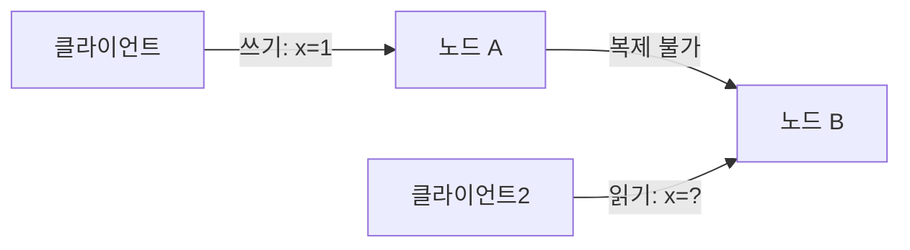

네트워크 분단이 발생하면 노드 A에 쓴 `x=1`이 노드 B에 전파되지 않습니다. 이때 두 가지 선택지밖에 없습니다.

- **C 선택(CP)**: 노드 B가 "나는 최신 데이터를 모른다"며 읽기 요청을 **거부**한다. 일관성은 지키지만 가용성을 포기.
- **A 선택(AP)**: 노드 B가 자신이 가진 오래된 `x=0`을 **응답**한다. 가용성은 지키지만 일관성을 포기.

P(네트워크 분단)는 실제 분산 환경에서 항상 일어납니다. AWS us-east-1 내에서도 가끔 AZ 간 통신이 수백ms 단절됩니다. P를 포기하는 선택지는 현실에서 없습니다. 결국 **CP vs AP** 선택만 남습니다.

### CP vs AP — 실전 트레이드오프

| 구분 | CP 시스템 | AP 시스템 |
|------|-----------|-----------|
| 대표 사례 | ZooKeeper, HBase, etcd | Cassandra, DynamoDB, CouchDB |
| 분단 시 동작 | 소수 파티션은 요청 거부 | 모든 노드가 응답, 단 오래된 데이터 가능 |
| 적합한 도메인 | 분산 락, 리더 선출, 설정 관리 | 쇼핑카트, 소셜 피드, 세션 데이터 |
| 일관성 모델 | 강한 일관성(Linearizability) | 최종 일관성(Eventual Consistency) |

CP를 선택한 ZooKeeper는 쿼럼(과반수 노드)이 없으면 쓰기를 거부합니다. 5노드 클러스터에서 3개가 죽으면 서비스 자체가 멈춥니다. 가용성을 희생해 일관성을 지킵니다.

AP를 선택한 Cassandra는 네트워크 분단 시 양쪽 파티션이 각자 쓰기를 받습니다. 복구 후 충돌을 Last-Write-Wins나 벡터 클락으로 해소합니다. 일관성을 희생해 가용성을 지킵니다.

### CAP과 분산 트랜잭션의 관계

2PC는 CP 선택입니다. 코디네이터와 모든 참여자가 동의해야만 커밋합니다. 네트워크 분단 시 진행을 멈추고 일관성을 지킵니다. Saga는 AP 선택입니다. 각 서비스가 독립적으로 커밋하고, 최종 일관성을 목표로 합니다. 이 선택의 차이가 모든 하위 설계를 결정합니다.

---

## 2. BASE vs ACID — 분산 환경의 현실적 타협

### ACID의 의미

단일 DB 트랜잭션은 ACID를 보장합니다.

- **Atomicity**: 트랜잭션 내 모든 연산이 전부 성공하거나 전부 실패
- **Consistency**: 트랜잭션 전후로 DB의 불변식(constraints)이 유지
- **Isolation**: 동시 실행 트랜잭션이 서로 간섭하지 않음
- **Durability**: 커밋된 데이터는 장애 후에도 보존

ACID는 DB가 모든 상태를 직접 관리하기 때문에 가능합니다. `COMMIT`이라는 단일 명령으로 락 해제, 로그 플러시, 버퍼 반영이 원자적으로 일어납니다.

### BASE의 의미

분산 시스템에서 ACID의 Isolation을 전역적으로 보장하려면 모든 서비스가 같은 락을 공유해야 합니다. 현실적으로 불가능합니다. BASE는 이 현실을 인정한 모델입니다.

- **Basically Available**: 부분 장애가 있어도 시스템의 대부분은 응답
- **Soft state**: 데이터가 외부 입력 없이도 시간이 지나면 바뀔 수 있음 (동기화 진행 중)
- **Eventually consistent**: 충분한 시간이 지나면 모든 노드가 동일한 상태로 수렴

쇼핑몰 장바구니를 예시로 들면, 두 탭에서 동시에 상품을 추가했을 때 1초 뒤에는 두 상품이 모두 담겨 있습니다. 그 1초 사이에 잠깐 불일치가 있었지만 결국 일관된 상태로 수렴했습니다. 이것이 BASE입니다.

---

## 3. 2PC (2단계 커밋) — 프로토콜 내부 동작과 근본적 한계

### 프로토콜 전체 흐름

2PC는 분산 환경에서 원자적 커밋을 보장하려는 시도입니다. 코디네이터(보통 애플리케이션 서버나 트랜잭션 매니저)가 모든 참여자(DB들)를 조율합니다.

**Phase 1 — Prepare:**
코디네이터가 모든 참여자에게 `PREPARE` 메시지를 보냅니다. 각 참여자는 트랜잭션을 실행하고(아직 커밋 안 함), WAL(Write-Ahead Log)에 PREPARE 레코드를 플러시하고, "커밋할 수 있다"는 `VOTE_COMMIT`을 응답합니다. 이 시점부터 참여자는 커밋도 롤백도 하지 않은 **잠금 상태**가 됩니다.

**Phase 2 — Commit/Rollback:**
모든 참여자가 `VOTE_COMMIT`을 보냈으면 코디네이터는 `GLOBAL_COMMIT`을 브로드캐스트합니다. 하나라도 `VOTE_ABORT`를 보냈으면 `GLOBAL_ROLLBACK`을 브로드캐스트합니다.

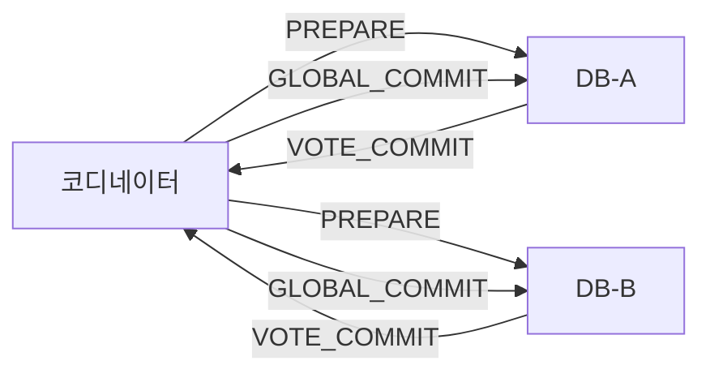

### XA 트랜잭션 — Java에서 2PC 사용법

Java에서 2PC는 JTA(Java Transaction API)와 XA 드라이버를 통해 구현합니다. Spring Boot + Atomikos 조합이 가장 많이 쓰입니다.

```java
// build.gradle
// implementation 'org.springframework.boot:spring-boot-starter-jta-atomikos'

@Configuration
public class XADataSourceConfig {

    // XA를 지원하는 MySQL 드라이버 사용
    @Bean(name = "orderDataSource")
    @Primary
    public DataSource orderDataSource() {
        MysqlXADataSource xaDataSource = new MysqlXADataSource();
        xaDataSource.setUrl("jdbc:mysql://order-db:3306/orders");
        xaDataSource.setUser("user");
        xaDataSource.setPassword("password");

        AtomikosDataSourceBean ds = new AtomikosDataSourceBean();
        ds.setXaDataSource(xaDataSource);
        ds.setUniqueResourceName("orderDS");
        return ds;
    }

    @Bean(name = "paymentDataSource")
    public DataSource paymentDataSource() {
        MysqlXADataSource xaDataSource = new MysqlXADataSource();
        xaDataSource.setUrl("jdbc:mysql://payment-db:3306/payments");
        xaDataSource.setUser("user");
        xaDataSource.setPassword("password");

        AtomikosDataSourceBean ds = new AtomikosDataSourceBean();
        ds.setXaDataSource(xaDataSource);
        ds.setUniqueResourceName("paymentDS");
        return ds;
    }

    // JTA 트랜잭션 매니저 — 2PC 코디네이터 역할
    @Bean
    public UserTransactionManager atomikosTransactionManager() {
        UserTransactionManager manager = new UserTransactionManager();
        manager.setForceShutdown(false);
        return manager;
    }

    @Bean
    public JtaTransactionManager transactionManager(
            UserTransactionManager atomikosTransactionManager) {
        return new JtaTransactionManager(atomikosTransactionManager);
    }
}

// 2PC를 사용한 서비스 — @Transactional 하나로 두 DB를 원자적으로 처리
@Service
@Transactional  // JTA 트랜잭션 매니저가 두 XA 데이터소스에 PREPARE/COMMIT 전송
public class TransferService {

    @Autowired
    @Qualifier("orderRepository")
    private OrderRepository orderRepository;  // orderDataSource 사용

    @Autowired
    @Qualifier("paymentRepository")
    private PaymentRepository paymentRepository;  // paymentDataSource 사용

    public void transfer(String fromAccount, String toAccount, BigDecimal amount) {
        // JTA가 두 DB 연결을 하나의 XID로 묶어 관리
        // 이 메서드가 성공하면 두 DB 모두 커밋
        // 예외가 발생하면 두 DB 모두 롤백
        accountRepository.debit(fromAccount, amount);
        accountRepository.credit(toAccount, amount);
    }
}
```

내부적으로 Atomikos는 `TransactionManager.commit()` 호출 시 등록된 모든 XA 리소스에 `XAResource.prepare(xid)`를 순서대로 호출합니다. 모두 `XA_OK`를 반환하면 `XAResource.commit(xid, false)`를 호출합니다. 하나라도 실패하면 모두에게 `XAResource.rollback(xid)`를 호출합니다.

### 블로킹 문제 — 코디네이터 장애 시나리오

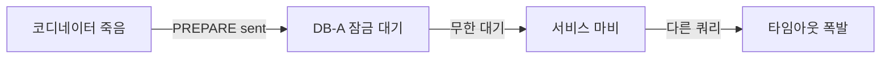

PREPARE를 받은 DB-A는 해당 행에 **엑스클루시브 락**을 보유하고 코디네이터의 다음 명령을 기다립니다. 이 시점에 코디네이터가 죽으면 DB-A는 락을 언제 해제해야 할지 알 수 없습니다. 독단적으로 커밋하면 DB-B가 롤백했을 경우 불일치가 생기고, 독단적으로 롤백하면 DB-B가 커밋했을 경우 불일치가 생기기 때문입니다.

결과: 해당 행을 수정하려는 모든 쿼리가 락 대기로 쌓입니다. 30초 타임아웃이 설정된 API가 모두 `504 Gateway Timeout`을 반환하기 시작합니다. 서비스가 마비됩니다. 유일한 해결책은 DBA가 수동으로 `XA RECOVER; XA ROLLBACK 'xid';`를 실행하는 것입니다. 야간에 장애가 나면 아무도 깨어있지 않습니다.

### 2PC를 MSA에서 쓰면 안 되는 이유

첫 번째, **네트워크 지연 증폭**: 단일 DB 커밋이 2ms라면, 2PC는 최소 `2 * (코디네이터-참여자 왕복 지연) * 참여자 수`가 됩니다. 참여자가 5개이고 각 왕복이 5ms면 커밋 하나에 50ms 이상이 걸립니다.

두 번째, **서비스 간 결합**: 결제 서비스 DB가 느려지면 주문 서비스 트랜잭션도 블록됩니다. MSA의 독립성 원칙과 정면 충돌합니다.

세 번째, **마이크로서비스는 자체 DB를 가진다**: 서로 다른 팀이 관리하는 DB에 코디네이터가 접근해 PREPARE를 보내는 것 자체가 서비스 경계 위반입니다.

**2PC가 적합한 환경:**

- 같은 조직이 관리하는 2~3개 DB (같은 데이터센터)
- 짧은 트랜잭션 (밀리초 단위)
- 낮은 동시성 (초당 수백 건 이하)
- XA를 지원하는 DB (MySQL InnoDB, PostgreSQL, Oracle)

---

## 4. 3PC (3단계 커밋) — 블로킹 개선 시도와 한계

### 왜 3단계가 필요한가

2PC의 핵심 문제는 "PREPARE 완료 후 코디네이터가 죽으면 참여자가 어떻게 해야 하는지 알 방법이 없다"는 것입니다. 3PC는 **PreCommit 단계**를 추가해 이 불확실성을 줄입니다.

- **CanCommit**: 2PC의 PREPARE와 동일. 커밋 가능 여부만 묻고 아직 리소스 잠금 없음
- **PreCommit**: "모두 동의했다"는 사실을 알림. 참여자는 이 시점에 잠금을 획득하고 준비
- **DoCommit**: 실제 커밋 명령

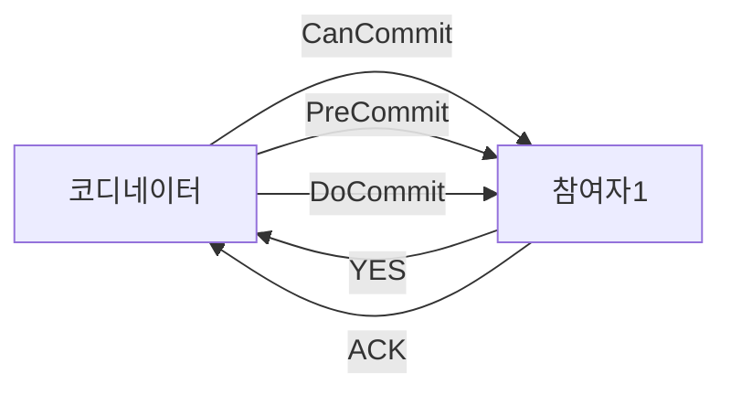

PreCommit을 받은 참여자는 "코디네이터가 모든 참여자의 YES를 확인했다"는 것을 압니다. DoCommit 전에 코디네이터가 죽어도 타임아웃 후 독단적으로 커밋할 수 있습니다. PreCommit을 받지 못한 참여자는 타임아웃 후 독단적으로 롤백합니다.

### 3PC도 완전하지 않은 이유

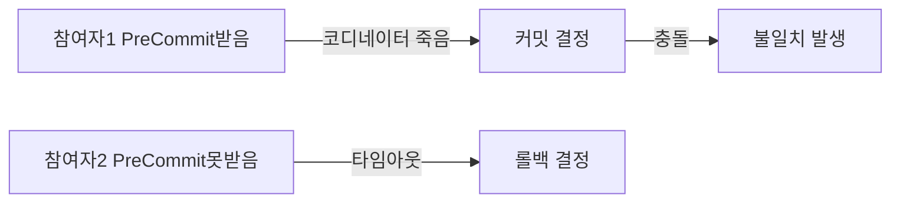

네트워크 분단이 발생한 경우, PreCommit 메시지가 일부 참여자에게는 도달하고 일부에게는 도달하지 않은 상태에서 코디네이터가 죽으면 PreCommit을 받은 참여자는 커밋하고, 못 받은 참여자는 롤백합니다. 데이터 불일치가 발생합니다.

결국 3PC는 코디네이터 단순 장애에는 강해졌지만 네트워크 분단에는 여전히 취약합니다. 단계가 하나 늘어 통신 오버헤드는 더 크고, 실제 분산 환경의 주 장애 원인인 네트워크 분단에 대응하지 못해 실무에서 거의 사용하지 않습니다.

---

## 5. Saga 패턴 — MSA 분산 트랜잭션의 실질적 해법

### Saga란 무엇인가

1987년 Hector Garcia-Molina가 제안한 패턴입니다. 긴 트랜잭션(Long-Lived Transaction, LLT)을 여러 개의 짧은 로컬 트랜잭션으로 분해하고, 실패 시 이미 완료된 트랜잭션을 **보상 트랜잭션(Compensating Transaction)**으로 되돌립니다.

비유: 항공권, 호텔, 렌터카를 각각 예약합니다. 렌터카가 매진이면 항공권과 호텔을 직접 취소해야 합니다. 세 가지를 하나의 트랜잭션으로 묶을 수는 없지만, 보상 절차가 있어 결국 일관된 상태(예약 전)로 돌아갑니다.

핵심은 **보상 트랜잭션은 완전히 새로운 트랜잭션**이라는 점입니다. 롤백이 아니라 역방향 비즈니스 로직입니다. "결제 취소"는 "결제"의 DB 롤백이 아니라 환불이라는 새 레코드를 만드는 것입니다.

### 보상 트랜잭션 설계 원칙

보상 트랜잭션에는 세 가지 종류가 있습니다.

**Compensatable 트랜잭션**: 보상 가능. 결제 완료 후 취소 요청이 오면 환불 처리.

**Pivot 트랜잭션**: 보상 불가. 이 단계가 커밋되면 이후 단계는 무조건 진행. 예: "상품 발송 완료"는 물리적으로 되돌릴 수 없음.

**Retriable 트랜잭션**: 실패 시 재시도 보장. Pivot 이후 단계에 해당. 반드시 멱등성 보장 필요.

```java
// 보상 트랜잭션 설계 예시
@Service
public class OrderCompensationService {

    // Compensatable: 결제 취소 (환불 레코드 생성)
    @Transactional
    public void cancelPayment(String orderId, String reason) {
        Payment payment = paymentRepository.findByOrderId(orderId)
            .orElseThrow(() -> new PaymentNotFoundException(orderId));

        // 이미 취소된 경우 멱등성 보장
        if (payment.getStatus() == PaymentStatus.CANCELLED) {
            log.info("이미 취소된 결제: orderId={}", orderId);
            return;
        }

        // 환불 레코드 생성 — DB 롤백이 아닌 새 비즈니스 이벤트
        Refund refund = Refund.builder()
            .orderId(orderId)
            .amount(payment.getAmount())
            .reason(reason)
            .processedAt(LocalDateTime.now())
            .build();

        refundRepository.save(refund);
        payment.cancel(reason);
        paymentRepository.save(payment);
    }

    // Compensatable: 재고 복원
    @Transactional
    public void restoreInventory(String orderId) {
        List<OrderItem> items = orderItemRepository.findByOrderId(orderId);

        for (OrderItem item : items) {
            // 재고 복원도 멱등성 필요 — inventoryRestorationId로 중복 방지
            boolean alreadyRestored = inventoryRepository
                .existsByOrderIdAndItemId(orderId, item.getItemId());

            if (!alreadyRestored) {
                inventoryRepository.restore(item.getItemId(), item.getQuantity());
                inventoryRepository.saveRestorationRecord(orderId, item.getItemId());
            }
        }
    }

    // Pivot (보상 불가): 배송 완료 이후는 되돌릴 수 없음
    // 이 단계 이후는 고객 서비스 통해 반품 프로세스 별도 진행
    public boolean isCompensatable(SagaStep step) {
        return step != SagaStep.SHIPPED && step != SagaStep.DELIVERED;
    }
}
```

---

## 6. Saga Orchestration — Spring Kafka 전체 구현

### 상태 머신 기반 설계

오케스트레이션 Saga의 핵심은 **Saga 인스턴스**가 현재 상태를 DB에 영속화한다는 것입니다. 오케스트레이터 서버가 재시작돼도 상태가 남아있어 이어서 진행할 수 있습니다.

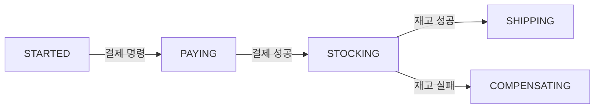

```java
// Saga 상태 엔티티
@Entity
@Table(name = "order_sagas")
public class OrderSaga {

    @Id
    private String sagaId;  // UUID

    private String orderId;

    @Enumerated(EnumType.STRING)
    private SagaState currentState;

    // 완료된 단계 목록 — 보상 시 역순 실행에 사용
    @ElementCollection
    @CollectionTable(name = "saga_completed_steps")
    @Enumerated(EnumType.STRING)
    private List<SagaStep> completedSteps = new ArrayList<>();

    private String failureReason;

    @Version
    private Long version;  // 낙관적 잠금 — 동시 업데이트 방지

    private LocalDateTime createdAt;
    private LocalDateTime updatedAt;

    // 상태 전이 — 잘못된 전이 방지
    public void transitionTo(SagaState newState) {
        if (!currentState.canTransitionTo(newState)) {
            throw new InvalidSagaTransitionException(
                "Cannot transition from " + currentState + " to " + newState
            );
        }
        this.currentState = newState;
        this.updatedAt = LocalDateTime.now();
    }

    public void markStepCompleted(SagaStep step) {
        completedSteps.add(step);
    }
}

public enum SagaState {
    STARTED, PAYING, PAYMENT_COMPLETED,
    STOCKING, INVENTORY_REDUCED,
    SHIPPING, COMPLETED,
    COMPENSATING, COMPENSATED, FAILED;

    public boolean canTransitionTo(SagaState next) {
        return switch (this) {
            case STARTED -> next == PAYING;
            case PAYING -> next == PAYMENT_COMPLETED || next == COMPENSATING;
            case PAYMENT_COMPLETED -> next == STOCKING;
            case STOCKING -> next == INVENTORY_REDUCED || next == COMPENSATING;
            case INVENTORY_REDUCED -> next == SHIPPING;
            case SHIPPING -> next == COMPLETED || next == COMPENSATING;
            case COMPENSATING -> next == COMPENSATED || next == FAILED;
            default -> false;
        };
    }
}
```

### 오케스트레이터 구현

```java
@Service
@Slf4j
public class OrderSagaOrchestrator {

    private final OrderSagaRepository sagaRepository;
    private final KafkaTemplate<String, Object> kafkaTemplate;

    // Saga 시작 — 주문 생성 이벤트 수신 시 트리거
    @KafkaListener(topics = "order-created", groupId = "saga-orchestrator")
    @Transactional
    public void onOrderCreated(OrderCreatedEvent event) {
        OrderSaga saga = OrderSaga.builder()
            .sagaId(UUID.randomUUID().toString())
            .orderId(event.getOrderId())
            .currentState(SagaState.STARTED)
            .createdAt(LocalDateTime.now())
            .build();

        sagaRepository.save(saga);
        sendPaymentCommand(saga, event);
    }

    // 결제 성공 응답 처리
    @KafkaListener(topics = "payment-reply", groupId = "saga-orchestrator")
    @Transactional
    public void onPaymentReply(PaymentReplyEvent reply) {
        OrderSaga saga = sagaRepository.findByOrderId(reply.getOrderId())
            .orElseThrow(() -> new SagaNotFoundException(reply.getOrderId()));

        if (reply.isSuccess()) {
            saga.transitionTo(SagaState.PAYMENT_COMPLETED);
            saga.markStepCompleted(SagaStep.PAYMENT);
            sagaRepository.save(saga);

            // 재고 차감 명령 발행
            sendInventoryCommand(saga, reply);
        } else {
            // 결제 실패 — 보상할 완료 단계 없음, 바로 실패
            log.warn("결제 실패: sagaId={}, reason={}", saga.getSagaId(), reply.getFailureReason());
            saga.transitionTo(SagaState.FAILED);
            saga.setFailureReason("Payment failed: " + reply.getFailureReason());
            sagaRepository.save(saga);

            publishSagaFailedEvent(saga);
        }
    }

    // 재고 차감 응답 처리
    @KafkaListener(topics = "inventory-reply", groupId = "saga-orchestrator")
    @Transactional
    public void onInventoryReply(InventoryReplyEvent reply) {
        OrderSaga saga = sagaRepository.findByOrderId(reply.getOrderId())
            .orElseThrow(() -> new SagaNotFoundException(reply.getOrderId()));

        if (reply.isSuccess()) {
            saga.transitionTo(SagaState.INVENTORY_REDUCED);
            saga.markStepCompleted(SagaStep.INVENTORY);
            sagaRepository.save(saga);

            sendShippingCommand(saga, reply);
        } else {
            // 재고 부족 — 완료된 결제를 보상해야 함
            log.warn("재고 부족: sagaId={}", saga.getSagaId());
            saga.transitionTo(SagaState.COMPENSATING);
            saga.setFailureReason("Inventory insufficient");
            sagaRepository.save(saga);

            // 역순으로 보상 실행 — 결제만 완료됐으므로 결제만 취소
            startCompensation(saga);
        }
    }

    // 보상 트랜잭션 체인 실행
    private void startCompensation(OrderSaga saga) {
        // 완료된 단계를 역순으로 보상
        // 예: [PAYMENT, INVENTORY] 중 INVENTORY 실패면 역순으로 [PAYMENT] 보상
        List<SagaStep> completedSteps = new ArrayList<>(saga.getCompletedSteps());
        Collections.reverse(completedSteps);

        for (SagaStep step : completedSteps) {
            switch (step) {
                case PAYMENT -> {
                    kafkaTemplate.send("payment-commands",
                        saga.getOrderId(),
                        new CancelPaymentCommand(saga.getOrderId(), saga.getSagaId())
                    );
                }
                case INVENTORY -> {
                    kafkaTemplate.send("inventory-commands",
                        saga.getOrderId(),
                        new RestoreInventoryCommand(saga.getOrderId(), saga.getSagaId())
                    );
                }
                case SHIPPING -> {
                    kafkaTemplate.send("shipping-commands",
                        saga.getOrderId(),
                        new CancelShippingCommand(saga.getOrderId(), saga.getSagaId())
                    );
                }
            }
        }
    }

    private void sendPaymentCommand(OrderSaga saga, OrderCreatedEvent event) {
        saga.transitionTo(SagaState.PAYING);
        sagaRepository.save(saga);

        kafkaTemplate.send("payment-commands",
            saga.getOrderId(),
            new ProcessPaymentCommand(
                saga.getOrderId(),
                saga.getSagaId(),
                event.getAmount(),
                event.getCustomerId()
            )
        );
    }

    private void sendInventoryCommand(OrderSaga saga, PaymentReplyEvent reply) {
        saga.transitionTo(SagaState.STOCKING);
        sagaRepository.save(saga);

        kafkaTemplate.send("inventory-commands",
            saga.getOrderId(),
            new ReduceInventoryCommand(
                saga.getOrderId(),
                saga.getSagaId(),
                reply.getItems()
            )
        );
    }
}
```

### Saga 참여자 — 결제 서비스 구현

```java
// 결제 서비스 — Saga 오케스트레이터의 명령을 처리
@Service
@Slf4j
public class PaymentCommandHandler {

    @KafkaListener(topics = "payment-commands", groupId = "payment-service")
    @Transactional
    public void handlePaymentCommand(Object command) {
        if (command instanceof ProcessPaymentCommand cmd) {
            handleProcessPayment(cmd);
        } else if (command instanceof CancelPaymentCommand cmd) {
            handleCancelPayment(cmd);
        }
    }

    private void handleProcessPayment(ProcessPaymentCommand cmd) {
        // 멱등성 체크 — sagaId로 중복 처리 방지
        if (paymentRepository.existsBySagaId(cmd.getSagaId())) {
            log.warn("이미 처리된 결제 명령: sagaId={}", cmd.getSagaId());
            // 기존 결과로 응답 (재전송에 대한 동일 응답)
            Payment existing = paymentRepository.findBySagaId(cmd.getSagaId());
            replySuccess(cmd.getOrderId(), cmd.getSagaId(), existing);
            return;
        }

        try {
            // 잔액 차감
            Account account = accountRepository.findByCustomerId(cmd.getCustomerId())
                .orElseThrow(() -> new AccountNotFoundException(cmd.getCustomerId()));

            if (account.getBalance().compareTo(cmd.getAmount()) < 0) {
                replyFailure(cmd.getOrderId(), cmd.getSagaId(), "INSUFFICIENT_BALANCE");
                return;
            }

            account.debit(cmd.getAmount());
            accountRepository.save(account);

            Payment payment = Payment.builder()
                .orderId(cmd.getOrderId())
                .sagaId(cmd.getSagaId())
                .amount(cmd.getAmount())
                .status(PaymentStatus.COMPLETED)
                .processedAt(LocalDateTime.now())
                .build();

            paymentRepository.save(payment);
            replySuccess(cmd.getOrderId(), cmd.getSagaId(), payment);

        } catch (Exception e) {
            log.error("결제 처리 실패: orderId={}", cmd.getOrderId(), e);
            replyFailure(cmd.getOrderId(), cmd.getSagaId(), e.getMessage());
        }
    }

    private void replySuccess(String orderId, String sagaId, Payment payment) {
        kafkaTemplate.send("payment-reply",
            orderId,
            PaymentReplyEvent.success(orderId, sagaId, payment.getAmount())
        );
    }

    private void replyFailure(String orderId, String sagaId, String reason) {
        kafkaTemplate.send("payment-reply",
            orderId,
            PaymentReplyEvent.failure(orderId, sagaId, reason)
        );
    }
}
```

---

## 7. Saga Choreography — 이벤트 주도 방식과 의미적 결합 문제

### 코레오그래피 방식의 내부 흐름

코레오그래피는 중앙 오케스트레이터 없이 각 서비스가 이벤트를 구독하고 반응합니다. 각 서비스는 자신의 로컬 트랜잭션을 수행하고 결과 이벤트를 발행합니다.

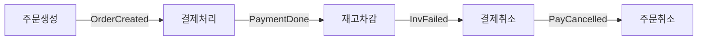

```java
// 주문 서비스 — 이벤트 발행 후 응답 대기
@Service
@Slf4j
public class OrderEventHandler {

    @Transactional
    public Order createOrder(CreateOrderRequest request) {
        Order order = Order.builder()
            .orderId(UUID.randomUUID().toString())
            .customerId(request.getCustomerId())
            .items(request.getItems())
            .totalAmount(request.getTotalAmount())
            .status(OrderStatus.PENDING)
            .createdAt(LocalDateTime.now())
            .build();

        orderRepository.save(order);

        // Outbox 패턴으로 이벤트 안전 발행 (아래 섹션에서 상세 설명)
        outboxRepository.save(OutboxEvent.of(
            "Order", order.getOrderId(), "OrderCreated",
            objectMapper.writeValueAsString(OrderCreatedEvent.from(order))
        ));

        return order;
    }

    // 결제 취소 이벤트 수신 → 주문 취소
    @KafkaListener(topics = "payment-cancelled", groupId = "order-service")
    @Transactional
    public void onPaymentCancelled(PaymentCancelledEvent event) {
        Order order = orderRepository.findById(event.getOrderId())
            .orElseThrow(() -> new OrderNotFoundException(event.getOrderId()));

        order.cancel("Payment cancelled: " + event.getReason());
        orderRepository.save(order);

        log.info("주문 취소 완료: orderId={}, reason={}", event.getOrderId(), event.getReason());
    }
}

// 결제 서비스 — OrderCreated 이벤트를 직접 구독
@Service
@Slf4j
public class PaymentChoreographyHandler {

    @KafkaListener(topics = "order-created", groupId = "payment-service")
    @Transactional
    public void onOrderCreated(OrderCreatedEvent event) {
        // 멱등성 체크
        if (paymentRepository.existsByOrderId(event.getOrderId())) {
            log.warn("중복 이벤트 무시: orderId={}", event.getOrderId());
            return;
        }

        try {
            Account account = accountRepository.findByCustomerId(event.getCustomerId())
                .orElseThrow(() -> new AccountNotFoundException(event.getCustomerId()));

            account.debit(event.getTotalAmount());
            accountRepository.save(account);

            Payment payment = paymentRepository.save(
                Payment.of(event.getOrderId(), event.getTotalAmount())
            );

            // 성공 이벤트 발행 → 재고 서비스가 구독
            outboxRepository.save(OutboxEvent.of(
                "Payment", payment.getId(), "PaymentCompleted",
                objectMapper.writeValueAsString(PaymentCompletedEvent.from(payment))
            ));

        } catch (InsufficientBalanceException e) {
            // 실패 이벤트 발행 → 주문 서비스가 구독하여 취소
            outboxRepository.save(OutboxEvent.of(
                "Payment", event.getOrderId(), "PaymentFailed",
                objectMapper.writeValueAsString(
                    new PaymentFailedEvent(event.getOrderId(), e.getMessage())
                )
            ));
        }
    }

    // 재고 부족 이벤트 수신 → 이미 완료한 결제를 보상으로 취소
    @KafkaListener(topics = "inventory-failed", groupId = "payment-service")
    @Transactional
    public void onInventoryFailed(InventoryFailedEvent event) {
        Payment payment = paymentRepository.findByOrderId(event.getOrderId())
            .orElseThrow(() -> new PaymentNotFoundException(event.getOrderId()));

        // 이미 취소됐으면 멱등성 보장
        if (payment.getStatus() == PaymentStatus.CANCELLED) {
            return;
        }

        // 환불 처리
        Account account = accountRepository.findByCustomerId(payment.getCustomerId());
        account.credit(payment.getAmount());
        accountRepository.save(account);

        payment.cancel();
        paymentRepository.save(payment);

        outboxRepository.save(OutboxEvent.of(
            "Payment", payment.getId(), "PaymentCancelled",
            objectMapper.writeValueAsString(
                new PaymentCancelledEvent(event.getOrderId(), "Inventory insufficient")
            )
        ));
    }
}
```

### 의미적 결합(Semantic Coupling) 문제

코레오그래피가 복잡해지면 각 서비스가 다른 서비스의 이벤트 의미를 너무 많이 알게 됩니다. 결제 서비스가 `InventoryFailedEvent`를 구독한다는 것은 재고 서비스의 실패 시나리오를 알고 있다는 뜻입니다. 서비스 간 숨겨진 결합이 생깁니다.

서비스가 4개를 넘어 흐름이 복잡해지면 "누가 어떤 이벤트를 구독하는지"를 추적하기 어려워집니다. 보상 체인이 여러 서비스에 분산되어 디버깅이 매우 힘듭니다. 이 시점에 오케스트레이션으로 전환을 고려해야 합니다.

### Choreography vs Orchestration 선택 기준

| 특성 | Choreography | Orchestration |
|------|-------------|---------------|
| 중앙 조율자 | 없음 | Saga 오케스트레이터 |
| 흐름 가시성 | 낮음 (여러 서비스 로그 추적) | 높음 (오케스트레이터 상태 확인) |
| 서비스 결합 | 이벤트 이름으로 느슨한 결합 | Command/Reply 채널로 명시적 결합 |
| SPOF | 없음 | 오케스트레이터 (단, HA 구성 가능) |
| 적합 단계 수 | 3단계 이하 | 4단계 이상 |
| 테스트 용이성 | 낮음 (전체 흐름 통합 테스트 필요) | 높음 (오케스트레이터 단위 테스트 가능) |

---

## 8. TCC (Try-Confirm-Cancel) — 비즈니스 레벨 2PC

### TCC의 핵심 아이디어

TCC는 2PC를 DB 레벨이 아닌 **비즈니스 레벨**에서 구현합니다. 각 서비스가 세 가지 인터페이스를 직접 구현합니다.

- **Try**: 리소스를 예약(reserve)한다. 아직 확정하지 않고 잠근다.
- **Confirm**: Try에서 예약한 리소스를 확정한다.
- **Cancel**: Try에서 예약한 리소스를 해제한다.

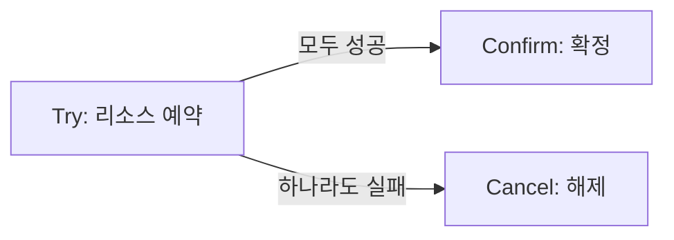

비유: 식당 예약과 같습니다. "오늘 저녁 7시 4인석 예약 가능한가요?" → 가능하면 4인석을 임시로 블록합니다 (Try). 손님이 예약을 확정하면 4인석이 확정됩니다 (Confirm). 손님이 취소하면 4인석 블록을 해제합니다 (Cancel).

### TCC 구현 — 재고 서비스 예시

```java
// 재고 TCC 인터페이스
public interface InventoryTccService {
    ReservationId tryReserve(String orderId, List<OrderItem> items, Duration timeout);
    void confirm(ReservationId reservationId);
    void cancel(ReservationId reservationId);
}

// 재고 테이블 — 실제 재고와 예약된 재고를 분리
@Entity
@Table(name = "inventory")
public class Inventory {
    @Id
    private String itemId;

    private int totalQuantity;      // 전체 재고
    private int reservedQuantity;   // TCC Try로 예약된 수량
    private int availableQuantity;  // totalQuantity - reservedQuantity

    // Try: 예약 수량 증가 (실제 차감 아님)
    public void reserve(int quantity) {
        if (availableQuantity < quantity) {
            throw new InsufficientInventoryException(
                "Available: " + availableQuantity + ", Requested: " + quantity
            );
        }
        this.reservedQuantity += quantity;
        this.availableQuantity -= quantity;
    }

    // Confirm: 예약 수량을 실제 차감으로 전환
    public void confirmReservation(int quantity) {
        this.reservedQuantity -= quantity;
        this.totalQuantity -= quantity;
    }

    // Cancel: 예약 수량 해제
    public void cancelReservation(int quantity) {
        this.reservedQuantity -= quantity;
        this.availableQuantity += quantity;
    }
}

// 예약 레코드 — 타임아웃 관리용
@Entity
@Table(name = "inventory_reservations")
public class InventoryReservation {
    @Id
    private String reservationId;

    private String orderId;
    private String itemId;
    private int quantity;

    @Enumerated(EnumType.STRING)
    private ReservationStatus status;  // RESERVED, CONFIRMED, CANCELLED

    private LocalDateTime expiresAt;   // 타임아웃 시각
    private LocalDateTime confirmedAt;
    private LocalDateTime cancelledAt;
}

@Service
@Slf4j
public class InventoryTccServiceImpl implements InventoryTccService {

    // Try: 모든 아이템에 대해 예약 시도
    @Override
    @Transactional
    public ReservationId tryReserve(String orderId, List<OrderItem> items, Duration timeout) {
        String reservationId = UUID.randomUUID().toString();
        LocalDateTime expiresAt = LocalDateTime.now().plus(timeout);

        for (OrderItem item : items) {
            Inventory inventory = inventoryRepository.findById(item.getItemId())
                .orElseThrow(() -> new ItemNotFoundException(item.getItemId()));

            // 예약 — InsufficientInventoryException 발생 시 전체 롤백 (로컬 트랜잭션)
            inventory.reserve(item.getQuantity());
            inventoryRepository.save(inventory);

            InventoryReservation reservation = InventoryReservation.builder()
                .reservationId(reservationId + "_" + item.getItemId())
                .orderId(orderId)
                .itemId(item.getItemId())
                .quantity(item.getQuantity())
                .status(ReservationStatus.RESERVED)
                .expiresAt(expiresAt)
                .build();

            reservationRepository.save(reservation);
        }

        log.info("재고 예약 완료: reservationId={}, expiresAt={}", reservationId, expiresAt);
        return new ReservationId(reservationId);
    }

    // Confirm: 예약을 실제 차감으로 확정
    @Override
    @Transactional
    public void confirm(ReservationId reservationId) {
        List<InventoryReservation> reservations =
            reservationRepository.findByReservationIdPrefix(reservationId.getValue());

        for (InventoryReservation reservation : reservations) {
            // 멱등성 — 이미 확정된 경우 무시
            if (reservation.getStatus() == ReservationStatus.CONFIRMED) {
                log.warn("이미 확정된 예약: {}", reservation.getReservationId());
                continue;
            }

            // 만료 체크
            if (LocalDateTime.now().isAfter(reservation.getExpiresAt())) {
                throw new ReservationExpiredException(
                    "예약 만료: " + reservation.getReservationId()
                );
            }

            Inventory inventory = inventoryRepository.findById(reservation.getItemId())
                .orElseThrow();

            inventory.confirmReservation(reservation.getQuantity());
            inventoryRepository.save(inventory);

            reservation.confirm();
            reservationRepository.save(reservation);
        }
    }

    // Cancel: 예약 해제
    @Override
    @Transactional
    public void cancel(ReservationId reservationId) {
        List<InventoryReservation> reservations =
            reservationRepository.findByReservationIdPrefix(reservationId.getValue());

        for (InventoryReservation reservation : reservations) {
            // 멱등성 — 이미 취소된 경우 무시
            if (reservation.getStatus() == ReservationStatus.CANCELLED) {
                continue;
            }

            // CONFIRMED 상태도 Cancel 가능 — 단, 비즈니스 규칙에 따라 처리
            Inventory inventory = inventoryRepository.findById(reservation.getItemId())
                .orElseThrow();

            inventory.cancelReservation(reservation.getQuantity());
            inventoryRepository.save(inventory);

            reservation.cancel();
            reservationRepository.save(reservation);
        }
    }
}

// TCC 코디네이터 — Try 성공 시 모두 Confirm, 실패 시 모두 Cancel
@Service
public class OrderTccCoordinator {

    @Transactional
    public void processOrder(CreateOrderRequest request) {
        ReservationId inventoryReservationId = null;
        ReservationId paymentReservationId = null;

        try {
            // Try 단계 — 모든 서비스에서 리소스 예약
            Duration timeout = Duration.ofSeconds(30);
            inventoryReservationId = inventoryTccService.tryReserve(
                request.getOrderId(), request.getItems(), timeout
            );
            paymentReservationId = paymentTccService.tryHold(
                request.getOrderId(), request.getTotalAmount(), timeout
            );

            // 모든 Try 성공 → Confirm
            inventoryTccService.confirm(inventoryReservationId);
            paymentTccService.confirm(paymentReservationId);

            orderRepository.updateStatus(request.getOrderId(), OrderStatus.CONFIRMED);

        } catch (Exception e) {
            log.error("TCC 처리 실패, 취소 시작: orderId={}", request.getOrderId(), e);

            // Cancel — 예약된 것만 취소 (null 체크)
            if (inventoryReservationId != null) {
                try {
                    inventoryTccService.cancel(inventoryReservationId);
                } catch (Exception cancelEx) {
                    // Cancel 실패는 스케줄러가 만료 처리
                    log.error("재고 취소 실패 — 만료 처리 예정", cancelEx);
                }
            }
            if (paymentReservationId != null) {
                try {
                    paymentTccService.cancel(paymentReservationId);
                } catch (Exception cancelEx) {
                    log.error("결제 홀드 취소 실패 — 만료 처리 예정", cancelEx);
                }
            }

            throw new OrderProcessingException("주문 처리 실패", e);
        }
    }
}

// 타임아웃 만료 스케줄러 — Cancel 실패나 코디네이터 죽음 대비
@Component
public class ReservationExpiryScheduler {

    @Scheduled(fixedDelay = 10_000)  // 10초마다 실행
    @Transactional
    public void expireStaleReservations() {
        List<InventoryReservation> expired = reservationRepository
            .findByStatusAndExpiresAtBefore(
                ReservationStatus.RESERVED,
                LocalDateTime.now()
            );

        for (InventoryReservation reservation : expired) {
            log.warn("만료된 예약 자동 취소: {}", reservation.getReservationId());
            Inventory inventory = inventoryRepository.findById(reservation.getItemId())
                .orElseThrow();
            inventory.cancelReservation(reservation.getQuantity());
            inventoryRepository.save(inventory);
            reservation.cancel();
            reservationRepository.save(reservation);
        }
    }
}
```

### TCC vs Saga 비교

| 특성 | TCC | Saga |
|------|-----|------|
| 격리 수준 | 예약 상태로 부분 격리 제공 | 격리 없음 (중간 상태 노출) |
| 보상 복잡도 | Try/Confirm/Cancel 3개 메서드 필요 | 보상 트랜잭션만 필요 |
| 비즈니스 로직 침투 | 높음 (모든 서비스가 TCC 인터페이스 구현) | 낮음 (기존 로직에 이벤트 추가) |
| 적합 도메인 | 재고, 계좌 잔액 (강한 예약 의미 필요) | 주문 처리 (느슨한 결합 선호) |

---

## 9. Outbox 패턴 — 이중 쓰기 문제의 근본 해결

### 이중 쓰기(Dual Write) 문제

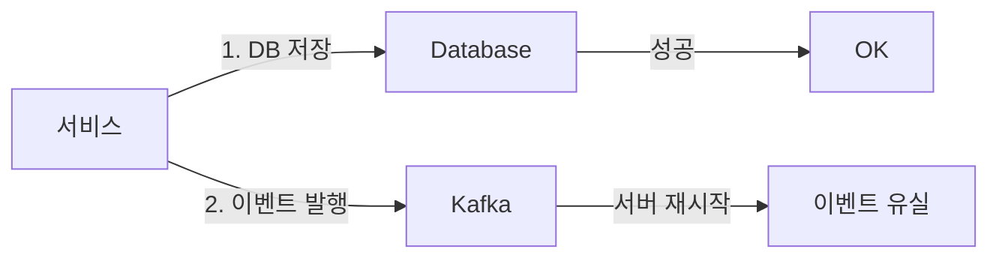

DB 저장과 Kafka 발행은 서로 다른 시스템입니다. 하나의 트랜잭션으로 묶을 수 없습니다. 세 가지 실패 시나리오가 있습니다.

**시나리오 1**: DB 저장 성공 → Kafka 발행 전 서버 재시작 → 이벤트 영구 유실. 결제 서비스는 주문 생성을 영원히 모릅니다.

**시나리오 2**: DB 저장 성공 → Kafka 발행 성공 → 오프셋 커밋 전 서버 재시작 → 이벤트 재발행 → 중복 처리. 결제가 두 번 됩니다.

**시나리오 3**: DB 저장 실패 → Kafka 발행만 성공 → 이벤트는 있는데 데이터 없음. 결제 서비스가 존재하지 않는 주문을 처리하려 합니다.

### Outbox 패턴의 해법

핵심 아이디어: **이벤트를 Kafka에 직접 보내지 말고, 같은 DB 트랜잭션 안에 outbox 테이블에 먼저 저장한다.** 별도 워커(Relay)가 outbox를 읽어 Kafka에 발행한다.

DB 트랜잭션이 커밋되면 비즈니스 데이터와 outbox 이벤트가 **원자적으로** 저장됩니다. Kafka 발행은 나중에 별도로 처리하므로 실패해도 재시도할 수 있습니다.

```java
// Outbox 테이블 엔티티
@Entity
@Table(name = "outbox_events",
    indexes = {
        @Index(name = "idx_status_created", columnList = "status, created_at"),
        @Index(name = "idx_aggregate", columnList = "aggregate_type, aggregate_id")
    }
)
public class OutboxEvent {

    @Id
    private String id;  // UUID

    @Column(nullable = false)
    private String aggregateType;   // "Order", "Payment"

    @Column(nullable = false)
    private String aggregateId;     // 애그리게이트 ID

    @Column(nullable = false)
    private String eventType;       // "OrderCreated", "PaymentCompleted"

    @Column(nullable = false, columnDefinition = "TEXT")
    private String payload;         // JSON 직렬화된 이벤트

    @Enumerated(EnumType.STRING)
    @Column(nullable = false)
    private EventStatus status;     // PENDING → PUBLISHED (또는 FAILED)

    @Column(nullable = false)
    private LocalDateTime createdAt;

    private LocalDateTime publishedAt;

    private int retryCount = 0;

    private String lastError;

    public void markPublished() {
        this.status = EventStatus.PUBLISHED;
        this.publishedAt = LocalDateTime.now();
    }

    public void recordFailure(String error) {
        this.retryCount++;
        this.lastError = error;
        if (this.retryCount >= 10) {
            this.status = EventStatus.DEAD_LETTERED;
        }
    }
}

// 주문 서비스 — 단일 트랜잭션으로 원자적 저장
@Service
@Slf4j
public class OrderService {

    private final OrderRepository orderRepository;
    private final OutboxRepository outboxRepository;
    private final ObjectMapper objectMapper;

    @Transactional
    public Order createOrder(CreateOrderRequest request) {
        // 1. 주문 도메인 객체 생성 및 유효성 검증
        Order order = Order.builder()
            .orderId(UUID.randomUUID().toString())
            .customerId(request.getCustomerId())
            .items(request.getItems())
            .totalAmount(calculateTotal(request.getItems()))
            .status(OrderStatus.PENDING)
            .createdAt(LocalDateTime.now())
            .build();

        orderRepository.save(order);

        // 2. 동일 트랜잭션 내에서 outbox에 이벤트 저장
        // 왜 같은 트랜잭션? 주문 저장과 이벤트 저장이 원자적이어야 함.
        // 주문은 됐는데 이벤트가 없거나, 이벤트는 있는데 주문이 없는 상황을 방지.
        OrderCreatedEvent event = OrderCreatedEvent.builder()
            .orderId(order.getOrderId())
            .customerId(order.getCustomerId())
            .items(order.getItems())
            .totalAmount(order.getTotalAmount())
            .occurredAt(order.getCreatedAt())
            .build();

        OutboxEvent outboxEvent = OutboxEvent.builder()
            .id(UUID.randomUUID().toString())
            .aggregateType("Order")
            .aggregateId(order.getOrderId())
            .eventType("OrderCreated")
            .payload(toJson(event))
            .status(EventStatus.PENDING)
            .createdAt(LocalDateTime.now())
            .build();

        outboxRepository.save(outboxEvent);

        // Kafka 직접 호출 없음 — 폴러가 처리
        log.info("주문 생성 및 outbox 저장 완료: orderId={}", order.getOrderId());
        return order;
    }
}
```

### Outbox Relay — 폴링 방식

```java
@Component
@Slf4j
public class OutboxEventRelay {

    private final OutboxRepository outboxRepository;
    private final KafkaTemplate<String, String> kafkaTemplate;
    private final Map<String, String> eventTopicMapping;

    public OutboxEventRelay() {
        eventTopicMapping = Map.of(
            "OrderCreated", "order-created",
            "PaymentCompleted", "payment-completed",
            "PaymentFailed", "payment-failed",
            "InventoryReduced", "inventory-reduced"
        );
    }

    // 100ms마다 PENDING 이벤트 발행
    // 단점: 100ms 지연, 폴링 DB 부하, 단일 인스턴스 처리량 한계
    @Scheduled(fixedDelay = 100)
    @Transactional
    public void relayPendingEvents() {
        // 한 번에 100개씩 배치 처리
        List<OutboxEvent> pendingEvents = outboxRepository
            .findTop100ByStatusOrderByCreatedAtAsc(EventStatus.PENDING);

        if (pendingEvents.isEmpty()) return;

        log.debug("발행 대기 이벤트: {}개", pendingEvents.size());

        for (OutboxEvent event : pendingEvents) {
            try {
                String topic = eventTopicMapping.getOrDefault(
                    event.getEventType(),
                    "unknown-events"
                );

                // 동기 발행 — 성공 확인 후 상태 업데이트
                // 비동기도 가능하지만 실패 감지가 복잡해짐
                kafkaTemplate.send(
                    topic,
                    event.getAggregateId(),  // 파티션 키 — 같은 집합체는 같은 파티션
                    event.getPayload()
                ).get(5, TimeUnit.SECONDS);

                event.markPublished();
                outboxRepository.save(event);

            } catch (Exception e) {
                log.error("이벤트 발행 실패: eventId={}, type={}",
                    event.getId(), event.getEventType(), e);

                event.recordFailure(e.getMessage());
                outboxRepository.save(event);

                if (event.getStatus() == EventStatus.DEAD_LETTERED) {
                    log.error("DLQ 이동 필요: eventId={}", event.getId());
                    alertService.sendAlert("Outbox DLQ: " + event.getId());
                }
            }
        }
    }
}
```

### CDC 방식 — Debezium으로 폴링 없애기

폴링 방식의 한계: 100ms 지연, DB 폴링 부하, 다중 인스턴스 시 중복 발행 가능성.

Debezium은 MySQL binlog(변경 로그)를 직접 읽어 Kafka에 이벤트를 전달합니다. 폴러 없이 수십ms 지연으로 동일한 보장을 제공합니다.

```yaml
# Debezium MySQL Connector 설정
{
  "name": "outbox-connector",
  "config": {
    "connector.class": "io.debezium.connector.mysql.MySqlConnector",
    "database.hostname": "mysql",
    "database.port": "3306",
    "database.user": "debezium",
    "database.password": "dbz_password",
    "database.server.id": "184054",
    "database.server.name": "mydb",
    "table.include.list": "orders.outbox_events",
    "database.history.kafka.bootstrap.servers": "kafka:9092",
    "database.history.kafka.topic": "schema-changes.orders",
    "transforms": "outbox",
    "transforms.outbox.type": "io.debezium.transforms.outbox.EventRouter",
    "transforms.outbox.table.field.event.id": "id",
    "transforms.outbox.table.field.event.key": "aggregate_id",
    "transforms.outbox.table.field.event.type": "event_type",
    "transforms.outbox.table.field.event.payload": "payload",
    "transforms.outbox.route.by.field": "aggregate_type"
  }
}
```

Debezium의 Outbox Event Router 트랜스폼은 `outbox_events` 테이블의 INSERT를 감지해 `aggregate_type` 필드를 토픽 이름으로 매핑해 발행합니다. DELETE도 함께 처리해 outbox 테이블이 무한정 커지지 않도록 합니다.

---

## 10. 최종 일관성과 Read-Your-Writes 보장

### 최종 일관성의 실제 의미

최종 일관성(Eventual Consistency)은 "언젠가는 일관될 것"이라는 약속입니다. 구체적으로 말하면 "새 업데이트가 없으면 결국 모든 읽기가 마지막으로 쓴 값을 반환한다"입니다.

문제는 사용자 경험입니다. 주문을 방금 생성했는데 목록 조회에서 안 보입니다. 사용자는 "주문이 안 됐나?"라고 생각합니다. 이것이 Read-Your-Writes 일관성 문제입니다.

### Read-Your-Writes 보장 전략

```java
@Service
public class OrderReadService {

    private final OrderElasticsearchRepository esRepository;  // 읽기 모델 (비동기 업데이트)
    private final OrderRepository mysqlRepository;            // 쓰기 모델 (즉시 반영)
    private final StringRedisTemplate redisTemplate;

    // 방법 1: 쓰기 직후 Redis에 "방금 쓴 ID" 표시
    // 조회 시 Redis에 있으면 MySQL에서 직접 읽음
    public Order getOrderById(String orderId, String userId) {
        String cacheKey = "recent-write:" + userId + ":" + orderId;

        if (redisTemplate.hasKey(cacheKey)) {
            // 최근에 쓴 데이터 — 쓰기 모델에서 직접 조회 (일관성 보장)
            log.debug("최근 쓰기 감지, MySQL에서 직접 조회: orderId={}", orderId);
            return mysqlRepository.findById(orderId)
                .orElseThrow(() -> new OrderNotFoundException(orderId));
        }

        // 그 외 — 읽기 모델 사용 (성능 우선)
        return esRepository.findById(orderId)
            .map(this::toOrder)
            .orElseGet(() -> mysqlRepository.findById(orderId)
                .orElseThrow(() -> new OrderNotFoundException(orderId)));
    }

    // 주문 생성 후 Redis에 표시 (TTL 5초 — 복제 지연보다 길게)
    @Transactional
    public Order createOrder(CreateOrderRequest request) {
        Order order = orderWriteService.createOrder(request);

        String cacheKey = "recent-write:" + request.getUserId() + ":" + order.getOrderId();
        redisTemplate.opsForValue().set(cacheKey, "1", Duration.ofSeconds(5));

        return order;
    }

    // 방법 2: 버전 기반 대기 — ES 뷰가 최신 버전을 가질 때까지 폴링
    public Order getOrderWithVersionWait(String orderId, long expectedVersion) {
        for (int i = 0; i < 10; i++) {
            Order esOrder = esRepository.findById(orderId).map(this::toOrder).orElse(null);

            if (esOrder != null && esOrder.getVersion() >= expectedVersion) {
                return esOrder;
            }

            try {
                Thread.sleep(100);  // 100ms 대기
            } catch (InterruptedException e) {
                Thread.currentThread().interrupt();
                break;
            }
        }

        // 최대 대기 후에도 ES 미반영 → MySQL 폴백
        log.warn("ES 복제 지연으로 MySQL 폴백: orderId={}", orderId);
        return mysqlRepository.findById(orderId)
            .orElseThrow(() -> new OrderNotFoundException(orderId));
    }
}
```

---

## 11. 멱등성 — Exactly-Once 의미론의 실제 구현

### 왜 At-Least-Once가 기본값인가

Kafka는 기본적으로 At-Least-Once 전달을 보장합니다. 컨슈머가 메시지를 처리한 후 오프셋을 커밋하기 전에 죽으면, 재시작 시 같은 메시지를 다시 처리합니다.

Exactly-Once를 Kafka 레벨에서 구현할 수 있지만 (Kafka Transactions + `enable.idempotence=true`) 성능 오버헤드가 크고 구성이 복잡합니다. 실무에서는 **At-Least-Once + 컨슈머 멱등성**으로 Exactly-Once 효과를 냅니다.

### 멱등성 키 설계

```java
@Service
@Slf4j
public class IdempotentPaymentService {

    // 처리된 이벤트 저장 테이블
    // CREATE TABLE processed_events (
    //     event_id VARCHAR(36) PRIMARY KEY,
    //     aggregate_id VARCHAR(36) NOT NULL,
    //     event_type VARCHAR(100) NOT NULL,
    //     processed_at TIMESTAMP NOT NULL,
    //     INDEX idx_aggregate_type (aggregate_id, event_type)
    // );

    @KafkaListener(topics = "order-created", groupId = "payment-service")
    public void handleOrderCreated(
            ConsumerRecord<String, String> record,
            Acknowledgment ack) {

        OrderCreatedEvent event = deserialize(record.value());

        try {
            processWithIdempotency(event);
            // 수동 ACK — 처리 성공 후에만 오프셋 커밋
            ack.acknowledge();
        } catch (DuplicateEventException e) {
            // 중복 이벤트도 ACK 필요 — 아니면 무한 재처리
            log.warn("중복 이벤트 ACK: eventId={}", event.getEventId());
            ack.acknowledge();
        } catch (Exception e) {
            // 처리 실패 — ACK 안 함 → 재시도
            log.error("이벤트 처리 실패, 재시도 예정: eventId={}", event.getEventId(), e);
            // ACK 하지 않으면 다음 poll에서 재처리
        }
    }

    @Transactional(isolation = Isolation.READ_COMMITTED)
    public void processWithIdempotency(OrderCreatedEvent event) {
        // 멱등성 체크 — SELECT FOR UPDATE로 레이스 컨디션 방지
        Optional<ProcessedEvent> existing = processedEventRepository
            .findByEventIdForUpdate(event.getEventId());

        if (existing.isPresent()) {
            log.info("중복 이벤트 무시: eventId={}", event.getEventId());
            throw new DuplicateEventException(event.getEventId());
        }

        // 실제 결제 처리
        Payment payment = doProcessPayment(event);

        // 처리 완료 기록 — 결제와 같은 트랜잭션!
        // 왜 같은 트랜잭션? 결제는 됐는데 처리 기록 저장이 실패하면
        // 재시도 시 중복 처리됨
        ProcessedEvent processed = ProcessedEvent.builder()
            .eventId(event.getEventId())
            .aggregateId(event.getOrderId())
            .eventType("OrderCreated")
            .processedAt(LocalDateTime.now())
            .build();

        processedEventRepository.save(processed);
    }

    // HTTP API 멱등성 — Idempotency-Key 헤더 사용
    @PostMapping("/payments")
    public ResponseEntity<PaymentResponse> createPayment(
            @RequestHeader("Idempotency-Key") String idempotencyKey,
            @RequestBody CreatePaymentRequest request) {

        // 이미 처리한 요청인지 확인
        Optional<PaymentResponse> cached = idempotencyStore.get(idempotencyKey);
        if (cached.isPresent()) {
            log.info("멱등성 캐시 히트: key={}", idempotencyKey);
            return ResponseEntity.ok(cached.get());
        }

        // 락 획득 후 처리 — 동시에 같은 키로 두 요청이 오는 경우 방지
        try {
            return idempotencyLock.executeWithLock(idempotencyKey, () -> {
                // 다시 확인 (Double-Checked Locking)
                Optional<PaymentResponse> doubleCheck = idempotencyStore.get(idempotencyKey);
                if (doubleCheck.isPresent()) {
                    return ResponseEntity.ok(doubleCheck.get());
                }

                PaymentResponse response = paymentService.process(request);
                // TTL 24시간 — 클라이언트 재시도 시간보다 길게
                idempotencyStore.set(idempotencyKey, response, Duration.ofHours(24));
                return ResponseEntity.ok(response);
            });
        } catch (LockAcquisitionException e) {
            // 동시에 같은 키로 처리 중 — 잠시 후 재시도 요청
            return ResponseEntity.status(HttpStatus.CONFLICT)
                .header("Retry-After", "1")
                .build();
        }
    }
}
```

### 중복 제거 전략 비교

| 전략 | 구현 복잡도 | 성능 | 적합 상황 |
|------|------------|------|---------|
| DB unique constraint | 낮음 | 높음 (인덱스) | 이벤트 ID가 있는 경우 |
| Redis SET NX | 낮음 | 매우 높음 | 짧은 TTL, 느슨한 보장 |
| 비관적 락 (SELECT FOR UPDATE) | 중간 | 낮음 (락 경합) | 높은 중복 빈도 |
| Kafka Transactions | 높음 | 낮음 | Kafka→Kafka 흐름 전용 |

---

## 12. 분산 락 — Redis, ZooKeeper, DB 비교

### 왜 분산 락이 필요한가

단일 서버에서는 `synchronized` 블록이나 `ReentrantLock`으로 동시성을 제어합니다. 하지만 여러 서버(Pod)가 동시에 실행되면 로컬 락은 의미가 없습니다. 결제 서비스가 3개 Pod로 수평 확장됐을 때, 같은 주문에 대한 요청이 각각 다른 Pod에서 동시에 처리되는 것을 막으려면 분산 락이 필요합니다.

### Redis Redisson — 가장 많이 쓰이는 분산 락

```java
// build.gradle
// implementation 'org.redisson:redisson-spring-boot-starter:3.24.0'

@Service
@Slf4j
public class DistributedLockPaymentService {

    @Autowired
    private RedissonClient redissonClient;

    // 단순 분산 락
    public PaymentResult processPaymentWithLock(String orderId, BigDecimal amount) {
        String lockKey = "payment:lock:" + orderId;
        RLock lock = redissonClient.getLock(lockKey);

        try {
            // 최대 10초 대기, 락 TTL 30초
            // TTL이 중요: 락을 획득한 서버가 죽어도 30초 후 자동 해제
            boolean acquired = lock.tryLock(10, 30, TimeUnit.SECONDS);

            if (!acquired) {
                throw new LockAcquisitionException(
                    "결제 처리 중: orderId=" + orderId
                );
            }

            log.info("분산 락 획득: lockKey={}", lockKey);
            return doProcessPayment(orderId, amount);

        } catch (InterruptedException e) {
            Thread.currentThread().interrupt();
            throw new LockInterruptedException(e);
        } finally {
            // 내가 보유한 락만 해제 (다른 스레드/서버의 락은 해제 안 함)
            if (lock.isHeldByCurrentThread()) {
                lock.unlock();
                log.info("분산 락 해제: lockKey={}", lockKey);
            }
        }
    }

    // Fair Lock — 대기 순서 보장 (FIFO)
    // 락 경합이 많을 때 starvation 방지
    public void processWithFairLock(String resourceId) {
        RLock fairLock = redissonClient.getFairLock("resource:" + resourceId);
        // 이후 사용법은 일반 락과 동일
    }

    // MultiLock — 여러 리소스를 원자적으로 락
    // 예: 두 계좌 간 이체 시 두 계좌 모두 락
    public void transferWithMultiLock(String fromAccount, String toAccount, BigDecimal amount) {
        RLock lock1 = redissonClient.getLock("account:" + fromAccount);
        RLock lock2 = redissonClient.getLock("account:" + toAccount);
        RLock multiLock = redissonClient.getMultiLock(lock1, lock2);

        try {
            multiLock.lock(30, TimeUnit.SECONDS);
            doTransfer(fromAccount, toAccount, amount);
        } finally {
            multiLock.unlock();
        }
    }
}
```

### Redisson의 내부 동작 — Lua 스크립트로 원자적 락 획득

Redisson은 `SET key value NX PX ttl` 명령으로 락을 획득합니다. 이 명령은 원자적입니다. 여러 서버가 동시에 시도해도 하나만 성공합니다.

락 갱신(Watchdog): 락 보유 중 TTL이 만료되면 자동 해제됩니다. Redisson은 백그라운드 스레드(Watchdog)가 TTL의 1/3마다 `PEXPIRE` 명령으로 TTL을 연장합니다. 작업이 30초를 넘어도 Watchdog이 살아있는 한 락이 유지됩니다. 서버가 죽으면 Watchdog도 죽으므로 TTL이 만료되어 자동 해제됩니다.

```java
// Redisson이 내부적으로 사용하는 Lua 스크립트 (개념적 표현)
// tryLock 내부:
// EVAL "if redis.call('exists', KEYS[1]) == 0 then
//         redis.call('hincrby', KEYS[1], ARGV[2], 1)
//         redis.call('pexpire', KEYS[1], ARGV[1])
//         return nil
//       end
//       return redis.call('pttl', KEYS[1])" 1 lockKey ttl threadId
```

### RedLock — 단일 Redis 장애 대비 (논란 있음)

단일 Redis 노드 기반 분산 락은 Redis 장애 시 락이 사라집니다. Sentinel이나 Cluster를 써도 페일오버 중에는 같은 키에 두 클라이언트가 락을 획득할 수 있습니다.

RedLock은 5개의 독립 Redis 인스턴스에서 과반수(3개) 획득을 요구합니다. 그러나 Martin Kleppmann이 시스템 클락 드리프트와 GC 일시 정지 상황에서 안전하지 않다는 것을 수학적으로 증명했습니다. 중요한 비즈니스 로직(결제, 송금)에는 RedLock 대신 ZooKeeper를 권장합니다.

### ZooKeeper 분산 락 — Curator Recipe

```java
// build.gradle
// implementation 'org.apache.curator:curator-recipes:5.5.0'

@Service
public class ZookeeperDistributedLock {

    @Autowired
    private CuratorFramework curatorClient;

    public void executeWithLock(String resourceId, Runnable task) throws Exception {
        // ZooKeeper ephemeral sequential node 기반 락
        // /locks/resourceId/lock- 하위에 임시 순번 노드 생성
        // 가장 작은 순번을 가진 노드가 락 획득
        // 이전 노드가 삭제될 때까지 Watch 대기
        InterProcessMutex lock = new InterProcessMutex(
            curatorClient,
            "/locks/" + resourceId
        );

        try {
            if (lock.acquire(10, TimeUnit.SECONDS)) {
                try {
                    task.run();
                } finally {
                    lock.release();
                }
            } else {
                throw new LockAcquisitionException("락 획득 타임아웃: " + resourceId);
            }
        } catch (Exception e) {
            throw new RuntimeException("분산 락 오류", e);
        }
    }
}
```

ZooKeeper 분산 락의 장점은 **Ephemeral 노드**에 있습니다. 락을 획득한 클라이언트의 세션이 끊기면 (서버 죽음, GC 일시 정지 후 세션 만료) ZooKeeper가 자동으로 그 노드를 삭제합니다. 락이 자동 해제됩니다. Redis의 TTL 기반보다 훨씬 안전합니다.

### DB Advisory Lock — 추가 인프라 없이

```java
@Repository
public class DatabaseAdvisoryLock {

    @Autowired
    private JdbcTemplate jdbcTemplate;

    // MySQL GET_LOCK / RELEASE_LOCK
    // 세션 범위 — 연결이 끊기면 자동 해제
    public boolean acquireLock(String lockName, int timeoutSeconds) {
        Integer result = jdbcTemplate.queryForObject(
            "SELECT GET_LOCK(?, ?)",
            Integer.class,
            lockName, timeoutSeconds
        );
        return Integer.valueOf(1).equals(result);
    }

    public void releaseLock(String lockName) {
        jdbcTemplate.queryForObject(
            "SELECT RELEASE_LOCK(?)",
            Integer.class,
            lockName
        );
    }

    // PostgreSQL pg_advisory_lock
    // 트랜잭션 범위 — 트랜잭션 커밋/롤백 시 자동 해제
    @Transactional
    public void executeWithPgAdvisoryLock(long lockId, Runnable task) {
        jdbcTemplate.execute("SELECT pg_advisory_xact_lock(" + lockId + ")");
        task.run();
        // 트랜잭션 종료 시 락 자동 해제
    }
}
```

### 분산 락 비교 요약

| 구현 | 내결함성 | 성능 | 운영 복잡도 | 적합 상황 |
|------|---------|------|-----------|---------|
| Redis (단일) | 낮음 (Redis 죽으면 끝) | 매우 높음 | 낮음 | 일반 중복 방지, 캐시 갱신 |
| Redis Redisson | 중간 (Sentinel/Cluster) | 높음 | 중간 | 대부분의 분산 락 |
| ZooKeeper | 높음 (CP) | 중간 | 높음 | 리더 선출, 중요 자원 제어 |
| DB Advisory Lock | 중간 (DB HA에 의존) | 낮음 | 매우 낮음 | 추가 인프라 불가, 저빈도 |

---

## 13. 실전 패턴 — 주문 + 결제 + 재고 전체 흐름

### 아키텍처 전체 구조

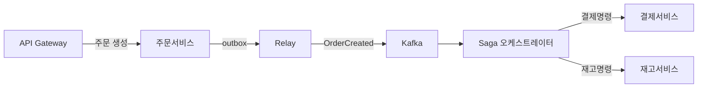

### 전체 흐름 시나리오

**성공 시나리오 (Happy Path):**

1. 사용자가 주문 API를 호출합니다.
2. 주문 서비스가 `PENDING` 상태로 주문을 저장하고, 동일 트랜잭션에 outbox 이벤트를 저장합니다. 즉시 `202 Accepted`를 반환합니다.
3. Outbox Relay가 `OrderCreated` 이벤트를 Kafka에 발행합니다.
4. Saga 오케스트레이터가 `OrderCreated` 이벤트를 수신하고, Saga 인스턴스를 DB에 생성합니다.
5. `ProcessPaymentCommand`를 Kafka에 발행합니다.
6. 결제 서비스가 명령을 수신하고 계좌에서 금액을 차감합니다. `PaymentReplyEvent(success=true)`를 발행합니다.
7. 오케스트레이터가 응답을 수신하고 Saga 상태를 `PAYMENT_COMPLETED`로 업데이트합니다. `ReduceInventoryCommand`를 발행합니다.
8. 재고 서비스가 재고를 차감하고 `InventoryReplyEvent(success=true)`를 발행합니다.
9. 오케스트레이터가 Saga를 `COMPLETED`로 업데이트하고, 주문 서비스에 완료 이벤트를 발행합니다.
10. 주문 서비스가 주문 상태를 `CONFIRMED`로 업데이트하고 사용자에게 알림을 발송합니다.

**실패 시나리오 (재고 부족):**

1~7번까지 성공. 8번에서 재고 서비스가 `InventoryReplyEvent(success=false, reason="OUT_OF_STOCK")`을 발행합니다.

8. 오케스트레이터가 보상 시작: `CancelPaymentCommand`를 Kafka에 발행합니다.
9. 결제 서비스가 환불을 처리하고 `PaymentCancelledEvent`를 발행합니다.
10. 오케스트레이터가 Saga를 `COMPENSATED`로 업데이트합니다.
11. 주문 서비스가 주문 상태를 `CANCELLED`로 업데이트하고 사용자에게 "재고 부족으로 주문이 취소됐습니다" 알림을 발송합니다.

### 보상 체인 실패 처리

```java
@Service
@Slf4j
public class SagaCompensationHandler {

    // 보상 실패 시 재시도 전략
    @Retryable(
        value = {CompensationException.class},
        maxAttempts = 5,
        backoff = @Backoff(delay = 1000, multiplier = 2, maxDelay = 30000)
    )
    @Transactional
    public void compensatePayment(String orderId, String sagaId) {
        try {
            paymentService.cancelPayment(orderId);
        } catch (PaymentAlreadyCancelledException e) {
            // 멱등성 — 이미 취소됐으면 성공으로 처리
            log.info("결제 이미 취소됨 (멱등): orderId={}", orderId);
        } catch (Exception e) {
            log.error("결제 보상 실패: orderId={}, attempt 재시도", orderId, e);
            throw new CompensationException("결제 보상 실패", e);
        }
    }

    // 5회 재시도 후에도 실패 시 — 인간 개입 필요
    @Recover
    public void handleCompensationFailure(CompensationException e, String orderId, String sagaId) {
        log.error("보상 트랜잭션 최종 실패 — 수동 개입 필요: orderId={}, sagaId={}", orderId, sagaId);

        // 1. 경보 발송
        alertService.sendCriticalAlert(
            "Saga 보상 실패",
            "orderId=" + orderId + ", sagaId=" + sagaId + "\n" + e.getMessage()
        );

        // 2. 실패 기록 (수동 처리를 위한 대기열)
        deadLetterRepository.save(DeadLetterEntry.builder()
            .sagaId(sagaId)
            .orderId(orderId)
            .type(DeadLetterType.COMPENSATION_FAILURE)
            .error(e.getMessage())
            .createdAt(LocalDateTime.now())
            .build()
        );

        // 3. Saga를 FAILED 상태로 마킹
        sagaRepository.updateStatus(sagaId, SagaState.FAILED);
    }
}
```

---

## 14. 극한 시나리오 분석

### 시나리오 1: 초당 100,000건 주문 폭주

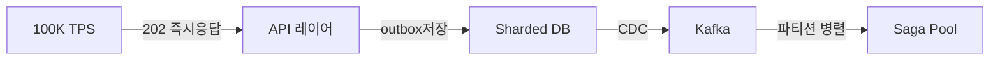

이 규모에서 동기 2PC를 쓰면 무슨 일이 생길까요?

코디네이터가 초당 100,000건을 조율합니다. 각 트랜잭션이 10ms 걸리면 스레드 100,000개가 동시에 락 대기합니다. DB 커넥션 풀이 고갈됩니다. 코디네이터 서버 메모리가 부족해 OOM Killer가 프로세스를 종료합니다. 전체 시스템이 멈춥니다.

비동기 Saga + Kafka 조합은 이 부하를 완전히 분리합니다. API 레이어는 즉시 응답하고 outbox만 씁니다. Kafka 파티션 수를 늘리면 Saga 오케스트레이터를 수평 확장할 수 있습니다. 50개 파티션이면 50개 오케스트레이터 인스턴스가 병렬 처리합니다.

### 시나리오 2: Saga 오케스트레이터 장애 중 50,000건 진행 중

오케스트레이터가 죽으면 진행 중인 Saga는 어떻게 될까요?

각 Saga는 DB에 상태가 영속화되어 있습니다. 오케스트레이터가 재시작되면 `IN_PROGRESS` 상태의 Saga를 스캔하고 이어서 처리합니다. 단, 명령을 이미 보냈는데 응답을 못 받은 경우가 문제입니다.

```java
@Component
@Slf4j
public class SagaRecoveryScheduler {

    // 5분마다 오래된 IN_PROGRESS Saga 복구
    @Scheduled(fixedDelay = 300_000)
    @Transactional
    public void recoverStuckSagas() {
        // 10분 이상 진행 중인 Saga는 뭔가 잘못됨
        LocalDateTime threshold = LocalDateTime.now().minusMinutes(10);
        List<OrderSaga> stuck = sagaRepository
            .findByStatusInAndUpdatedAtBefore(
                List.of(SagaState.PAYING, SagaState.STOCKING, SagaState.SHIPPING),
                threshold
            );

        log.info("고착 Saga 복구 시작: {}건", stuck.size());

        for (OrderSaga saga : stuck) {
            try {
                // 현재 단계의 명령을 재전송 — 참여자는 멱등성으로 중복 처리
                sagaOrchestrator.retryCurrentStep(saga);
            } catch (Exception e) {
                log.error("Saga 복구 실패: sagaId={}", saga.getSagaId(), e);
            }
        }
    }
}
```

### 시나리오 3: 결제는 됐는데 보상 트랜잭션이 실패하는 경우

"결제 취소" 명령을 보냈는데 결제 서비스가 다운됐습니다. 사용자는 돈이 빠져나갔는데 주문은 취소됐습니다. 최악의 시나리오입니다.

방어 전략:
1. 보상 트랜잭션은 지수 백오프로 최대 5회 재시도합니다.
2. 5회 실패 시 Dead Letter Queue에 저장하고 운영팀에 즉시 경보를 보냅니다.
3. 운영팀이 수동으로 환불을 처리합니다.
4. Saga 상태를 `MANUAL_INTERVENTION_REQUIRED`로 마킹합니다.
5. 사용자에게 "처리 중 오류가 발생했습니다. 영업일 기준 1일 내 환불 처리됩니다"라는 알림을 발송합니다.

완전한 자동화보다 인간 개입 경로를 명확히 설계하는 것이 더 현실적입니다.

---

## 15. 패턴 선택 가이드

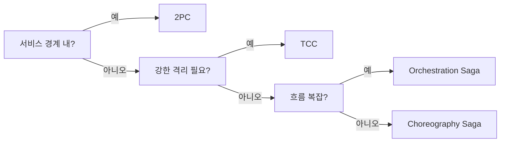

| 패턴 | 일관성 모델 | 가용성 | 성능 | 적합 시나리오 |
|------|------------|--------|------|-------------|
| 2PC/XA | 강한 일관성 | 낮음 | 낮음 | 같은 DC, 짧은 트랜잭션, XA 지원 DB |
| TCC | 예약 기반 격리 | 높음 | 중간 | 재고/계좌 예약, 강한 격리 필요 |
| Orchestration Saga | 최종 일관성 | 높음 | 높음 | 4단계+ 복잡한 비즈니스 흐름 |
| Choreography Saga | 최종 일관성 | 높음 | 높음 | 3단계 이하 단순 흐름 |
| Outbox Pattern | 최소 1회 전달 | 높음 | 높음 | 이벤트 유실 방지 (모든 패턴과 함께 사용) |

---

## 면접 포인트 — 시니어 레벨 심층 답변

### Q1. CAP 정리에서 P를 포기할 수 없는 이유는?

**단순 답변**: 분산 시스템에서 네트워크 장애는 반드시 발생하기 때문입니다.

**심층 답변**: P를 포기한다는 것은 "네트워크 분단이 발생하면 시스템을 멈춘다"는 뜻입니다. 단일 데이터센터 내에서도 스위치 장애, 케이블 불량, NIC 오작동으로 순간적 분단이 발생합니다. 멀티 AZ, 멀티 리전 아키텍처에서는 더욱 빈번합니다. AWS의 SLA(99.99%)도 연간 52분의 다운타임을 허용합니다.

P를 포기한 시스템은 분단이 발생할 때마다 완전히 멈춰야 합니다. 이는 가용성 0과 같습니다. 따라서 실질적으로 CP 또는 AP를 선택해야 합니다. 결제 시스템처럼 정확성이 중요하면 CP, 소셜 피드처럼 가용성이 중요하면 AP를 선택합니다.

### Q2. 2PC와 Saga의 근본적 차이와 선택 기준은?

**단순 답변**: 2PC는 강한 일관성, Saga는 최종 일관성입니다.

**심층 답변**: 2PC는 분산 환경에서 ACID의 Isolation을 전역적으로 보장하려는 시도입니다. 모든 참여자가 PREPARE 상태에서 잠금을 유지하므로 중간 상태가 외부에 노출되지 않습니다. 하지만 코디네이터 장애 시 모든 참여자가 블록되는 블로킹 프로토콜입니다. CAP에서 CP를 선택하며 가용성을 희생합니다.

Saga는 각 서비스가 로컬 트랜잭션을 독립적으로 커밋합니다. 중간 상태가 외부에 노출되고(Dirty Read 가능), 실패 시 보상 트랜잭션으로 이전 상태를 복구합니다. CAP에서 AP를 선택하며 일관성을 희생합니다.

선택 기준: MSA에서 서비스마다 독립 DB를 가지고 네트워크를 통해 통신하는 환경에서는 2PC를 쓰면 모든 서비스가 결합됩니다. 결제 서비스 DB가 느려지면 주문 서비스 트랜잭션도 블록됩니다. MSA의 독립성 원칙과 충돌합니다. 일반적으로 MSA에서는 Saga, 단일 조직 내 동일 DC의 소수 DB는 2PC를 선택합니다.

### Q3. Outbox 패턴과 CDC의 차이와 선택 기준은?

**단순 답변**: 둘 다 이중 쓰기 문제를 해결하지만, Outbox는 폴링 기반이고 CDC는 binlog 기반입니다.

**심층 답변**: Outbox 폴링 방식의 문제는 세 가지입니다. 첫째, 100ms 폴링 간격만큼 지연이 있습니다. 둘째, `SELECT WHERE status='PENDING'` 쿼리가 DB에 주기적 부하를 줍니다. 셋째, 다중 인스턴스 배포 시 `SELECT FOR UPDATE SKIP LOCKED`를 사용해야 중복 발행을 방지할 수 있는데 이것도 DB 부하입니다.

CDC(Debezium)는 DB의 WAL(Write-Ahead Log)을 직접 읽으므로 DB에 추가 쿼리 부하가 없고, binlog 전파 시간만큼(수십ms)의 지연밖에 없습니다. 단, Debezium 설정이 복잡하고 binlog 접근 권한 관리, schema 변경 시 영향도 분석이 필요합니다.

선택 기준: 지연에 민감하지 않고 운영 복잡도를 낮추고 싶으면 폴링 Outbox, 낮은 지연과 DB 부하 최소화가 중요하면 CDC를 선택합니다.

### Q4. TCC와 Saga의 격리 수준 차이는?

**단순 답변**: TCC는 예약 상태로 부분 격리를 제공하고, Saga는 격리가 없습니다.

**심층 답변**: Saga의 핵심 문제는 Lost Update와 Dirty Read입니다. 주문 A가 재고 10개를 차감하고 아직 커밋하지 않은 상태에서 주문 B가 같은 재고를 조회하면 10개가 있어 보입니다. 두 주문이 모두 성공하면 재고가 음수가 됩니다. 이것이 Saga의 Dirty Read 문제입니다.

TCC의 Try 단계는 `reservedQuantity`를 증가시켜 다른 트랜잭션이 `availableQuantity`를 읽을 때 예약분을 제외한 값을 봅니다. 완전한 Isolation은 아니지만 비즈니스적으로 의미 있는 격리를 제공합니다. 이중 예약을 방지합니다.

하지만 TCC는 비용이 큽니다. 모든 서비스가 Try/Confirm/Cancel 세 가지 메서드를 구현해야 하고, 비즈니스 도메인 모델에 예약 개념이 침투합니다. 재고나 계좌처럼 강한 예약 의미가 필요한 경우에만 쓰고, 일반적인 주문 처리 흐름에는 Saga가 더 적합합니다.

### Q5. 분산 락에서 Redis와 ZooKeeper의 안전성 차이는?

**단순 답변**: ZooKeeper가 더 안전합니다.

**심층 답변**: Redis 분산 락의 취약점은 두 가지입니다. 첫 번째는 GC Pause입니다. 클라이언트 A가 락을 획득하고 처리 중 Full GC가 30초간 멈춥니다. 그 사이 TTL이 만료되어 클라이언트 B가 락을 획득합니다. GC에서 깨어난 A는 자신이 여전히 락을 갖고 있다고 생각하고 처리를 계속합니다. 두 클라이언트가 동시에 임계 구역을 실행합니다.

두 번째는 Redis 페일오버입니다. Sentinel 구성에서 마스터가 죽고 슬레이브가 승격되는 사이(수초), 마스터에는 있고 슬레이브에는 아직 복제되지 않은 락이 사라집니다. 두 클라이언트가 락을 획득합니다.

ZooKeeper Ephemeral 노드는 이 문제를 해결합니다. 클라이언트 세션이 끊기면 ZooKeeper가 노드를 자동 삭제합니다. GC Pause로 세션이 만료되면 락이 즉시 해제됩니다. ZooKeeper는 CP 시스템이므로 쿼럼 없이는 쓰기가 불가능하고, 페일오버 시에도 일관된 상태를 유지합니다.

다만 ZooKeeper도 완벽하지 않습니다. 클라이언트가 락을 획득했다고 판단하는 시점과 실제 처리 사이에 GC Pause가 오면 여전히 문제가 생깁니다. 완전한 안전성을 위해서는 Fencing Token을 함께 사용해야 합니다. 락과 함께 단조 증가하는 토큰을 발급하고, 서버는 최신 토큰의 요청만 수락합니다.

---

## 핵심 요약

분산 트랜잭션 문제의 본질은 **두 개 이상의 독립 리소스를 원자적으로 업데이트할 방법이 없다**는 것입니다.

2PC는 이 문제를 중앙 코디네이터로 해결하려 했지만 블로킹 문제와 단일 장애점이 MSA에서 치명적입니다. Saga는 강한 일관성을 포기하고 최종 일관성과 보상 트랜잭션으로 실용적인 해법을 제시합니다. TCC는 비즈니스 레벨에서 예약 패턴으로 부분 격리를 더합니다. Outbox는 이벤트 유실이라는 이중 쓰기 문제를 DB 원자성으로 해결합니다.

실무에서 이 패턴들은 단독으로 쓰이지 않습니다. "Orchestration Saga + Outbox + 멱등 컨슈머 + 분산 락"이 하나의 조합으로 작동합니다. 각 패턴이 어떤 실패 시나리오를 방어하는지 이해하면, 어떤 조합이 필요한지 스스로 설계할 수 있습니다.
