## 실생활 비유: 해외 송금

A가 한국 은행에서 미국 은행으로 100만원을 송금합니다. 두 가지 일이 동시에 일어나야 합니다.
1. 한국 은행: 잔액 100만원 차감
2. 미국 은행: 잔액 100만원 입금

만약 1번은 됐는데 2번이 실패하면? 돈이 공중에 증발합니다. 이것이 **분산 트랜잭션**의 핵심 문제입니다.

---

## 1. 분산 트랜잭션이란?

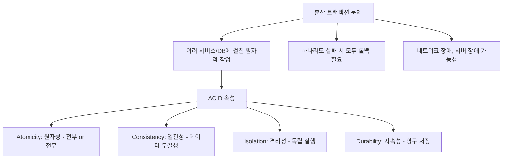

---

## 2. 2PC (2단계 커밋)

### 개념

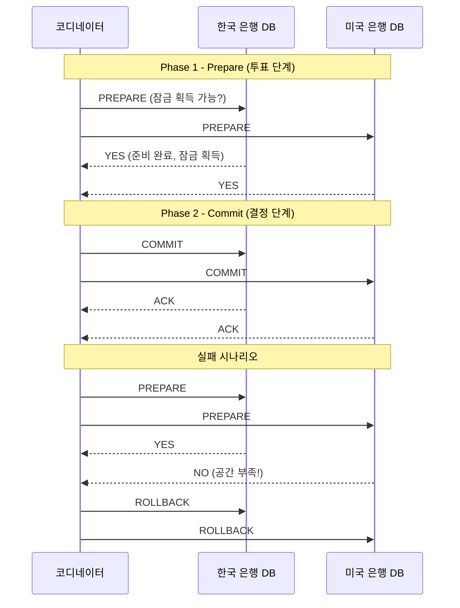

### 2PC의 문제점

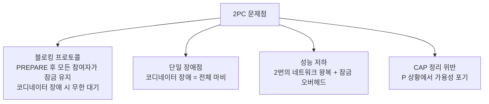

**2PC는 언제 사용하는가:**
- 단일 조직 내 DB (같은 데이터센터)
- XA 트랜잭션 지원하는 DB (MySQL, PostgreSQL)
- 짧은 트랜잭션, 낮은 동시성

---

## 3. 3PC (3단계 커밋)

2PC의 블로킹 문제를 해결하기 위한 개선안:

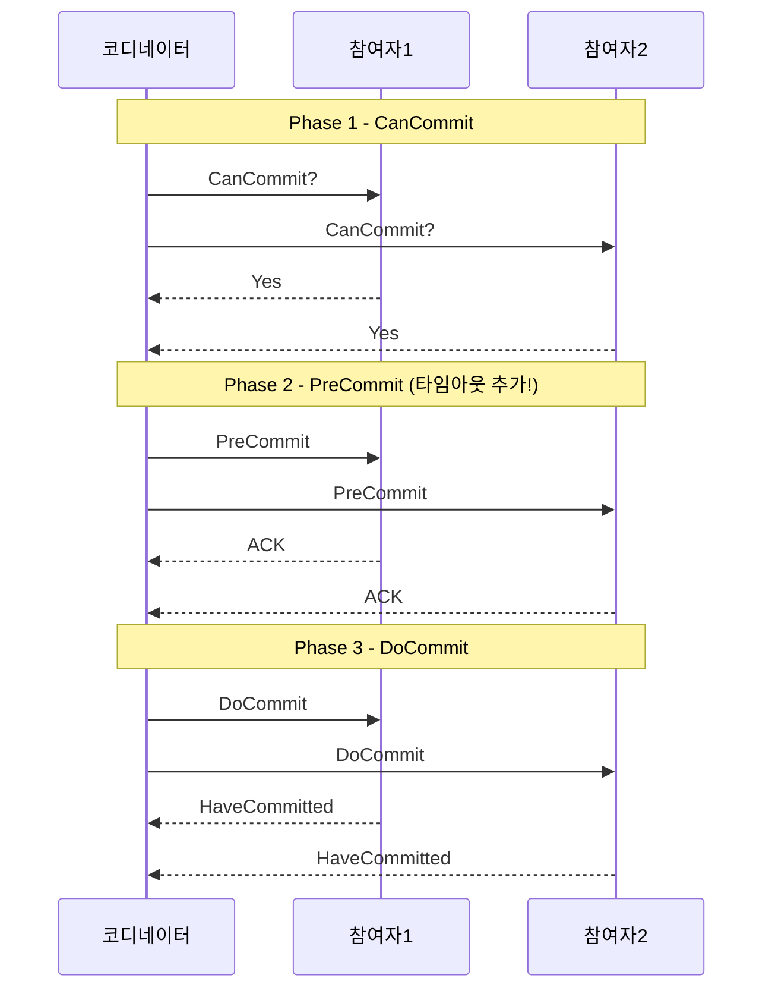

**3PC의 한계**: 네트워크 분할 시 여전히 문제. 실제로는 잘 사용하지 않습니다.

---

## 4. Saga 패턴 ⭐ 현재 가장 많이 사용

### Saga란?

각 서비스가 로컬 트랜잭션을 수행하고, 실패 시 **보상 트랜잭션(Compensating Transaction)**으로 이전 상태를 복구합니다.

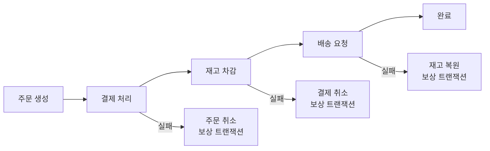

### 방식 1: Choreography (안무) Saga

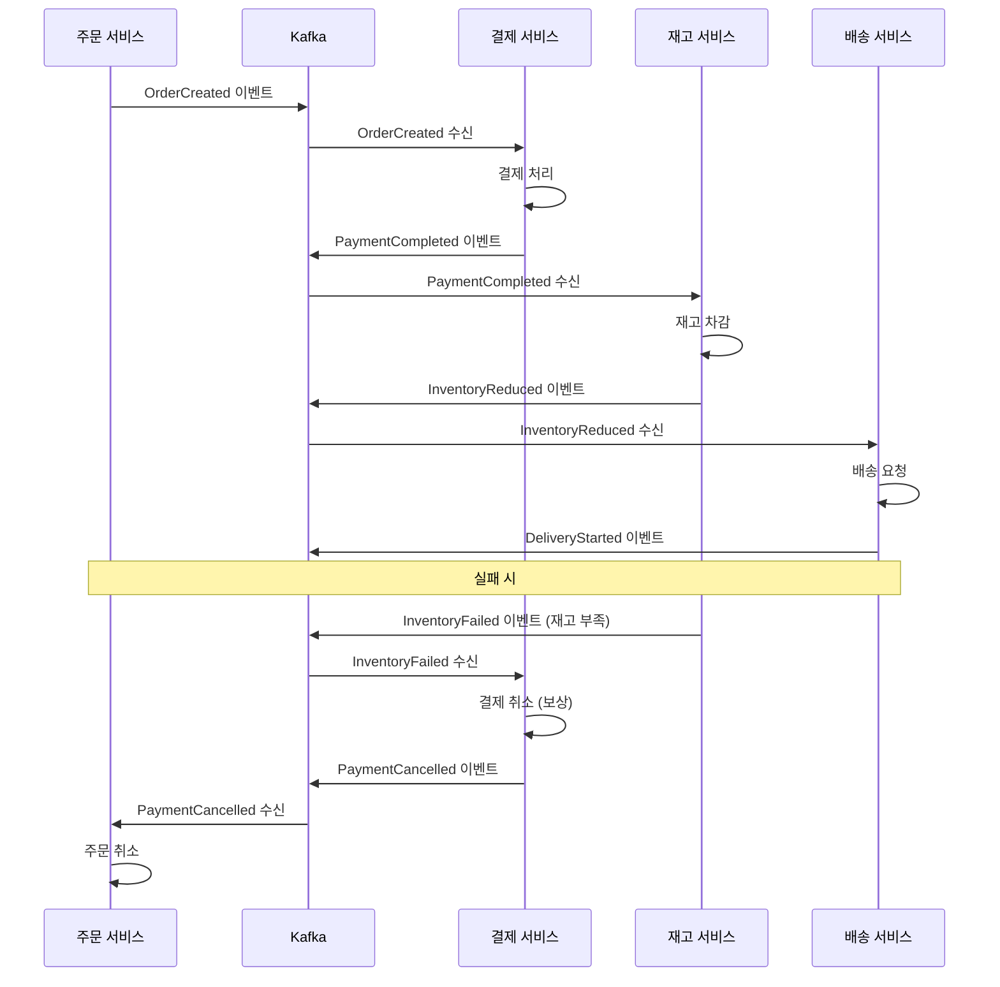

**Choreography Saga 구현:**
```java
// 주문 서비스
@Service
public class OrderService {

    @Transactional
    public Order createOrder(OrderRequest request) {
        Order order = Order.create(request);
        orderRepository.save(order);

        // 트랜잭션 완료 후 이벤트 발행 (Outbox 패턴과 함께)
        eventPublisher.publish(new OrderCreatedEvent(order));

        return order;
    }

    @KafkaListener(topics = "payment-cancelled")
    public void handlePaymentCancelled(PaymentCancelledEvent event) {
        Order order = orderRepository.findById(event.getOrderId());
        order.cancel("Payment failed");
        orderRepository.save(order);

        eventPublisher.publish(new OrderCancelledEvent(order));
    }
}

// 결제 서비스
@Service
public class PaymentService {

    @KafkaListener(topics = "order-created")
    public void handleOrderCreated(OrderCreatedEvent event) {
        try {
            Payment payment = processPayment(event.getOrderId(), event.getAmount());
            eventPublisher.publish(new PaymentCompletedEvent(payment));
        } catch (InsufficientFundsException e) {
            eventPublisher.publish(new PaymentFailedEvent(event.getOrderId(), e.getMessage()));
        }
    }

    @KafkaListener(topics = "inventory-failed")
    public void handleInventoryFailed(InventoryFailedEvent event) {
        // 보상 트랜잭션: 결제 취소
        cancelPayment(event.getOrderId());
        eventPublisher.publish(new PaymentCancelledEvent(event.getOrderId()));
    }
}
```

### 방식 2: Orchestration (오케스트레이션) Saga

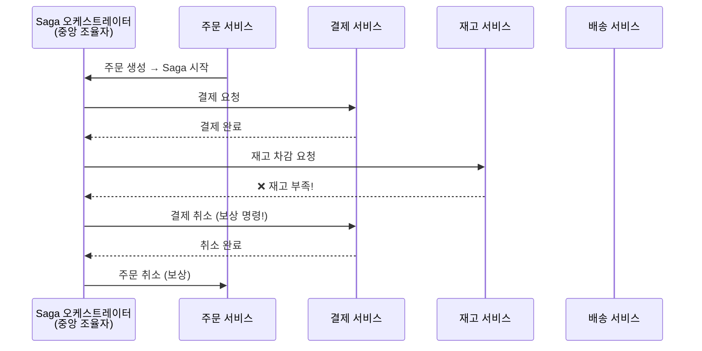

**Orchestration Saga 구현 (Spring State Machine):**
```java
@Component
public class OrderSagaOrchestrator {

    public void startOrderSaga(OrderCreatedEvent event) {
        SagaExecution saga = SagaExecution.create(event.getOrderId());
        sagaRepository.save(saga);

        executeNextStep(saga);
    }

    private void executeNextStep(SagaExecution saga) {
        switch (saga.getCurrentStep()) {
            case STARTED -> {
                paymentService.processPayment(saga.getOrderId(), saga.getAmount());
                saga.advance(SagaStep.PAYMENT_PROCESSING);
            }
            case PAYMENT_COMPLETED -> {
                inventoryService.reduceInventory(saga.getOrderId(), saga.getItems());
                saga.advance(SagaStep.INVENTORY_REDUCING);
            }
            case INVENTORY_REDUCED -> {
                deliveryService.createDelivery(saga.getOrderId());
                saga.advance(SagaStep.DELIVERY_CREATING);
            }
            case DELIVERY_CREATED -> {
                orderService.complete(saga.getOrderId());
                saga.complete();
            }
        }
        sagaRepository.save(saga);
    }

    public void handleStepFailed(String orderId, SagaStep failedStep, String reason) {
        SagaExecution saga = sagaRepository.findByOrderId(orderId);
        saga.fail(failedStep, reason);

        // 보상 트랜잭션 역순 실행
        compensate(saga);
    }

    private void compensate(SagaExecution saga) {
        // 실패 이전 완료된 단계들을 역순으로 보상
        for (SagaStep completedStep : saga.getCompletedSteps().reversed()) {
            switch (completedStep) {
                case PAYMENT_COMPLETED -> paymentService.cancelPayment(saga.getOrderId());
                case INVENTORY_REDUCED -> inventoryService.restoreInventory(saga.getOrderId());
                case DELIVERY_CREATED -> deliveryService.cancelDelivery(saga.getOrderId());
            }
        }
    }
}
```

### Choreography vs Orchestration 비교

| 특성 | Choreography | Orchestration |
|------|-------------|---------------|
| 중앙 조율자 | 없음 | 있음 |
| 결합도 | 낮음 | 중간 |
| 추적/디버깅 | 어려움 | 쉬움 |
| 복잡도 | 분산됨 | 집중됨 |
| 단일 장애점 | 없음 | 오케스트레이터 |
| 추천 상황 | 간단한 흐름 | 복잡한 비즈니스 로직 |

---

## 5. Outbox 패턴

### 문제: 이벤트 발행의 원자성

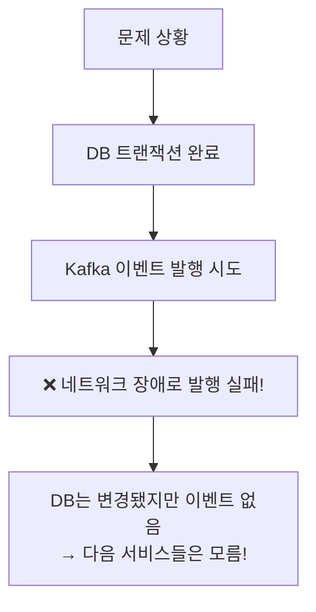

### 해결: Outbox 패턴

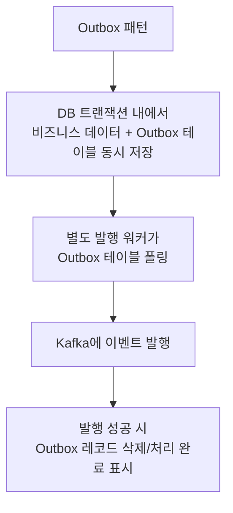

**Outbox 패턴 구현:**
```java
// Outbox 테이블 엔티티
@Entity
@Table(name = "outbox_events")
public class OutboxEvent {
    @Id
    private String id;

    private String aggregateType;   // "Order"
    private String aggregateId;     // "order-123"
    private String eventType;       // "OrderCreated"
    private String payload;         // JSON

    @Enumerated(EnumType.STRING)
    private EventStatus status;     // PENDING, PUBLISHED, FAILED

    private LocalDateTime createdAt;
    private LocalDateTime publishedAt;
    private int retryCount;
}

// 주문 서비스 - 하나의 트랜잭션으로 처리
@Service
public class OrderService {

    @Transactional  // 이 트랜잭션이 커밋되면 둘 다 저장됨
    public Order createOrder(OrderRequest request) {
        // 1. 주문 저장
        Order order = Order.create(request);
        orderRepository.save(order);

        // 2. Outbox에 이벤트 저장 (같은 트랜잭션!)
        OutboxEvent outboxEvent = OutboxEvent.builder()
            .id(UUID.randomUUID().toString())
            .aggregateType("Order")
            .aggregateId(order.getId())
            .eventType("OrderCreated")
            .payload(objectMapper.writeValueAsString(new OrderCreatedEvent(order)))
            .status(EventStatus.PENDING)
            .createdAt(LocalDateTime.now())
            .build();

        outboxRepository.save(outboxEvent);

        // Kafka 발행 안 함! 별도 워커가 처리
        return order;
    }
}

// Outbox 발행 워커
@Component
public class OutboxPublisher {

    @Scheduled(fixedDelay = 100)  // 100ms마다 실행
    @Transactional
    public void publishPendingEvents() {
        List<OutboxEvent> pendingEvents = outboxRepository
            .findByStatusOrderByCreatedAtAsc(EventStatus.PENDING, PageRequest.of(0, 100));

        for (OutboxEvent event : pendingEvents) {
            try {
                kafkaTemplate.send(
                    getTopicForEventType(event.getEventType()),
                    event.getAggregateId(),
                    event.getPayload()
                ).get(5, TimeUnit.SECONDS);

                event.markPublished();
                outboxRepository.save(event);

            } catch (Exception e) {
                event.incrementRetry();
                if (event.getRetryCount() > 10) {
                    event.markFailed();
                }
                outboxRepository.save(event);
            }
        }
    }
}
```

---

## 6. 이벤트 소싱 (Event Sourcing)

### 개념

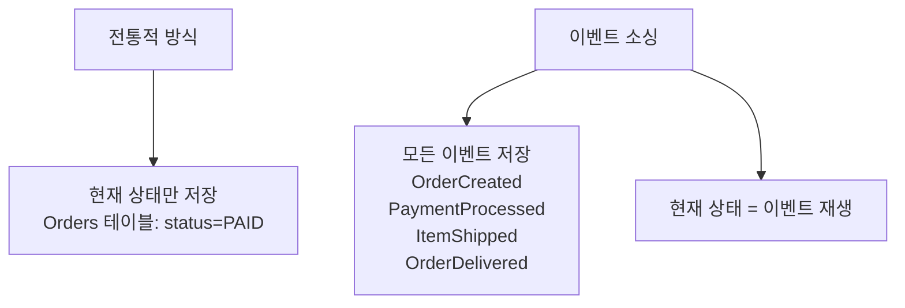

**이벤트 소싱 구현:**
```java
// 이벤트 스토어
@Entity
@Table(name = "event_store")
public class EventRecord {
    @Id
    @GeneratedValue
    private Long id;

    private String aggregateId;
    private String eventType;
    private String payload;        // JSON
    private Long version;          // 낙관적 잠금용
    private LocalDateTime occurredAt;
}

// Order 애그리게이트
public class Order {
    private String id;
    private String status;
    private BigDecimal totalAmount;
    private List<OrderItem> items;
    private Long version;

    // 이벤트로부터 상태 재구성
    public static Order reconstruct(List<EventRecord> events) {
        Order order = new Order();
        for (EventRecord event : events) {
            order.apply(event);
        }
        return order;
    }

    private void apply(EventRecord event) {
        switch (event.getEventType()) {
            case "OrderCreated" -> {
                OrderCreatedEvent e = deserialize(event.getPayload());
                this.id = e.getOrderId();
                this.status = "CREATED";
                this.items = e.getItems();
                this.totalAmount = e.getTotalAmount();
            }
            case "PaymentCompleted" -> this.status = "PAID";
            case "ItemShipped" -> this.status = "SHIPPED";
            case "OrderDelivered" -> this.status = "DELIVERED";
            case "OrderCancelled" -> this.status = "CANCELLED";
        }
        this.version = event.getVersion();
    }
}
```

**이벤트 소싱의 장단점:**

| 장점 | 단점 |
|------|------|
| 완전한 감사 로그 | 쿼리 복잡도 증가 |
| 타임 트래블 (과거 상태 조회) | 이벤트 스키마 진화 어려움 |
| 이벤트 재생으로 버그 수정 | 이벤트 수 증가 시 재구성 느림 |
| CQRS와 궁합 좋음 | 러닝 커브 높음 |

---

## 7. CQRS (Command Query Responsibility Segregation)

```mermaid
graph TD
    Client["클라이언트"]

    subgraph "Command Side 쓰기"
        Write["쓰기 모델<br>Command"]
        Write --> EventStore["("이벤트 스토어")"]
        EventStore --> Projector["프로젝터"]
    end

    subgraph "Query Side 읽기"
        Read["읽기 모델<br>Query"]
        ReadDB["("읽기 최적화 DB<br>Elasticsearch, Redis")"]
    end

    Client -->|"명령 Command"| Write
    Client -->|"조회 Query"| Read

    Projector --> ReadDB
```

**CQRS 구현:**
```java
// Command Handler (쓰기)
@Service
public class OrderCommandHandler {

    @CommandHandler
    @Transactional
    public String handle(CreateOrderCommand cmd) {
        Order order = Order.create(cmd);
        eventStore.save(order.getUncommittedEvents());
        return order.getId();
    }
}

// Query Handler (읽기) - 완전히 다른 모델
@Service
public class OrderQueryHandler {

    @QueryHandler
    public OrderSummaryView handle(GetOrderQuery query) {
        // 읽기에 최적화된 뷰 테이블 조회
        return orderSummaryRepository.findById(query.getOrderId());
    }

    @QueryHandler
    public Page<OrderListView> handle(GetOrderListQuery query) {
        return orderListRepository.findByUserId(
            query.getUserId(),
            PageRequest.of(query.getPage(), query.getSize())
        );
    }
}

// 이벤트 프로젝터 (이벤트 → 읽기 모델 업데이트)
@Service
public class OrderProjector {

    @EventHandler
    public void on(OrderCreatedEvent event) {
        OrderSummaryView view = OrderSummaryView.from(event);
        orderSummaryRepository.save(view);
    }

    @EventHandler
    public void on(PaymentCompletedEvent event) {
        orderSummaryRepository.updateStatus(event.getOrderId(), "PAID");
    }
}
```

---

## 8. 실전 주문 시스템 예제

쿠팡 주문 처리를 분산 트랜잭션으로 구현하는 전체 흐름:

```mermaid
graph TD
    User["사용자: 주문 버튼 클릭"]

    subgraph "주문 서비스 Transactional"
        CreateOrder["주문 생성 PENDING"]
        SaveOutbox["Outbox에 OrderCreated 저장"]
        CreateOrder --> SaveOutbox
    end

    SaveOutbox --> OutboxWorker["Outbox 워커"]
    OutboxWorker --> Kafka["Kafka: order-created"]

    Kafka --> PaymentSaga["결제 Saga"]
    PaymentSaga --> CheckBalance{"잔액 확인"}
    CheckBalance -->|"부족"| CompensateOrder["주문 취소 보상"]
    CheckBalance -->|"충분"| DeductBalance["잔액 차감"]
    DeductBalance --> Kafka2["Kafka: payment-completed"]

    Kafka2 --> InventorySaga["재고 Saga"]
    InventorySaga --> CheckInventory{"재고 확인"}
    CheckInventory -->|"부족"| CompensatePayment["결제 취소 보상"]
    CheckInventory -->|"있음"| ReduceInventory["재고 차감"]
    ReduceInventory --> Kafka3["Kafka: inventory-reduced"]

    Kafka3 --> DeliverySaga["배송 Saga"]
    DeliverySaga --> CreateDelivery["배송 생성"]
    CreateDelivery --> Kafka4["Kafka: delivery-created"]

    Kafka4 --> CompleteOrder["주문 완료"]
    Kafka4 --> SendNotification["알림 발송"]

    User -->|"즉시 응답"| Response["주문이 접수됐습니다 ("비동기 처리중")"]
```

---

## 9. 멱등성 보장

같은 요청이 여러 번 처리되어도 결과가 같아야 합니다.

```java
@Service
public class PaymentService {

    @KafkaListener(topics = "order-created")
    public void handleOrderCreated(OrderCreatedEvent event) {
        // 멱등성 체크: 이미 처리한 이벤트인가?
        if (processedEventRepository.existsByEventId(event.getEventId())) {
            log.warn("중복 이벤트 무시: {}", event.getEventId());
            return;
        }

        try {
            Payment payment = processPayment(event);

            // 처리 완료 기록 (트랜잭션 내)
            processedEventRepository.save(
                new ProcessedEvent(event.getEventId(), LocalDateTime.now())
            );

            eventPublisher.publish(new PaymentCompletedEvent(payment));

        } catch (Exception e) {
            eventPublisher.publish(new PaymentFailedEvent(event.getOrderId()));
        }
    }
}
```

---

## 10. 극한 시나리오: 11번가 블랙프라이데이

초당 10만 건의 주문이 들어올 때 분산 트랜잭션 처리:

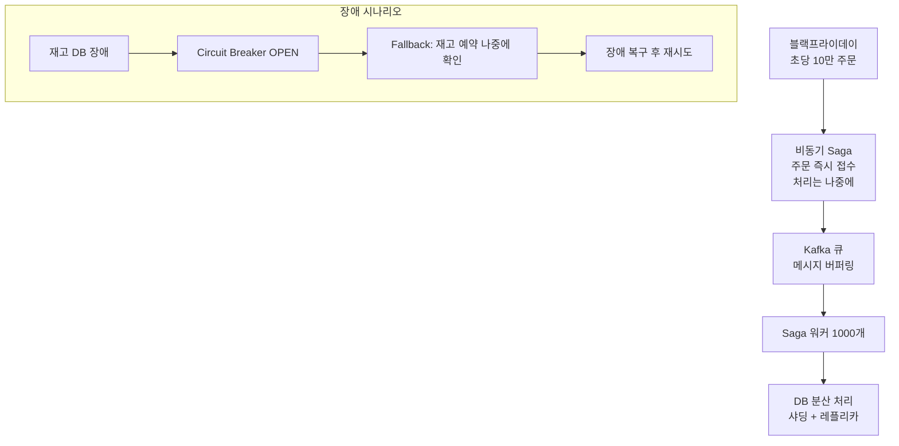

---

## 핵심 패턴 선택 가이드

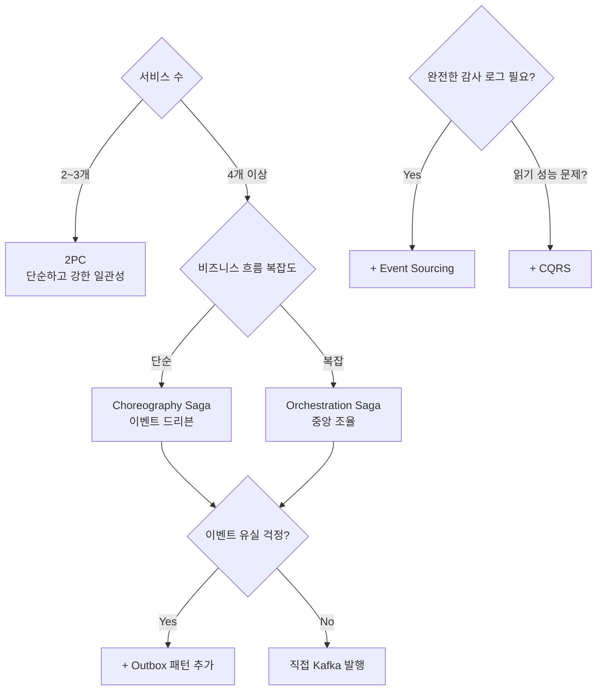

| 패턴 | 일관성 | 가용성 | 복잡도 | 추천 상황 |
|------|--------|--------|--------|---------|
| 2PC | 강함 | 낮음 | 낮음 | 소규모, 같은 DC |
| Choreography Saga | 최종 | 높음 | 중간 | 단순 흐름 |
| Orchestration Saga | 최종 | 높음 | 높음 | 복잡한 흐름 |
| Outbox | 최소1회 | 높음 | 중간 | 이벤트 유실 방지 |
| Event Sourcing | 최종 | 높음 | 매우 높음 | 감사 로그 필수 |
