## 실생활 비유: 해외 송금과 사라지는 돈

A가 한국 은행에서 미국 은행으로 100만원을 송금합니다. 두 가지 일이 **동시에** 일어나야 합니다.
1. 한국 은행: 잔액 100만원 차감
2. 미국 은행: 잔액 100만원 입금

만약 1번은 됐는데 네트워크가 끊겨 2번이 실패하면? 돈은 한국에서 사라졌는데 미국에는 안 들어옵니다. 공중에 증발한 것입니다. 반대로 2번은 됐는데 1번 롤백이 실패하면? 돈이 복제됩니다.

이것이 **분산 트랜잭션**의 핵심 문제입니다. 단일 DB라면 `BEGIN; 차감; 입금; COMMIT;`으로 원자적 처리가 됩니다. 하지만 두 DB가 다른 서버에 있다면? 두 DB를 묶는 단일 트랜잭션이 없습니다. 이 문제를 해결하는 여러 패턴을 하나씩 이해해 보겠습니다.

---

## 1. 분산 트랜잭션이란? — ACID를 분산 환경에서 보장하는 방법

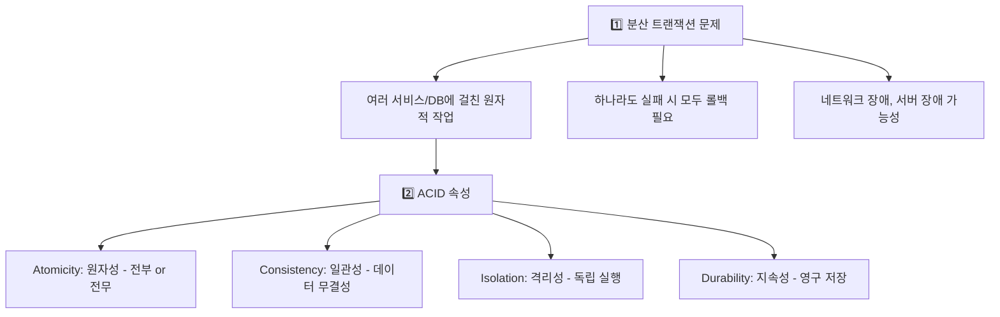

왜 단순히 각 서비스에서 트랜잭션을 실행하면 안 될까요? 결제 서비스가 DB에 성공적으로 커밋했습니다. 그 다음 재고 서비스에 요청을 보내는 도중 네트워크가 끊겼습니다. 결제는 됐는데 재고 차감은 안 됐습니다. 각 서비스의 DB는 일관되지만, **전체 비즈니스 관점에서는 불일치**합니다. 이것이 분산 트랜잭션이 어려운 이유입니다.

---

## 2. 2PC (2단계 커밋) — 모두 동의할 때만 커밋

### 개념

2PC는 "투표하고 결정한다"는 방식입니다. 선거 관리위원회(코디네이터)가 모든 참여자에게 "지금 커밋 가능한가?" 물어보고, 모두 YES면 커밋, 하나라도 NO면 전부 롤백합니다.

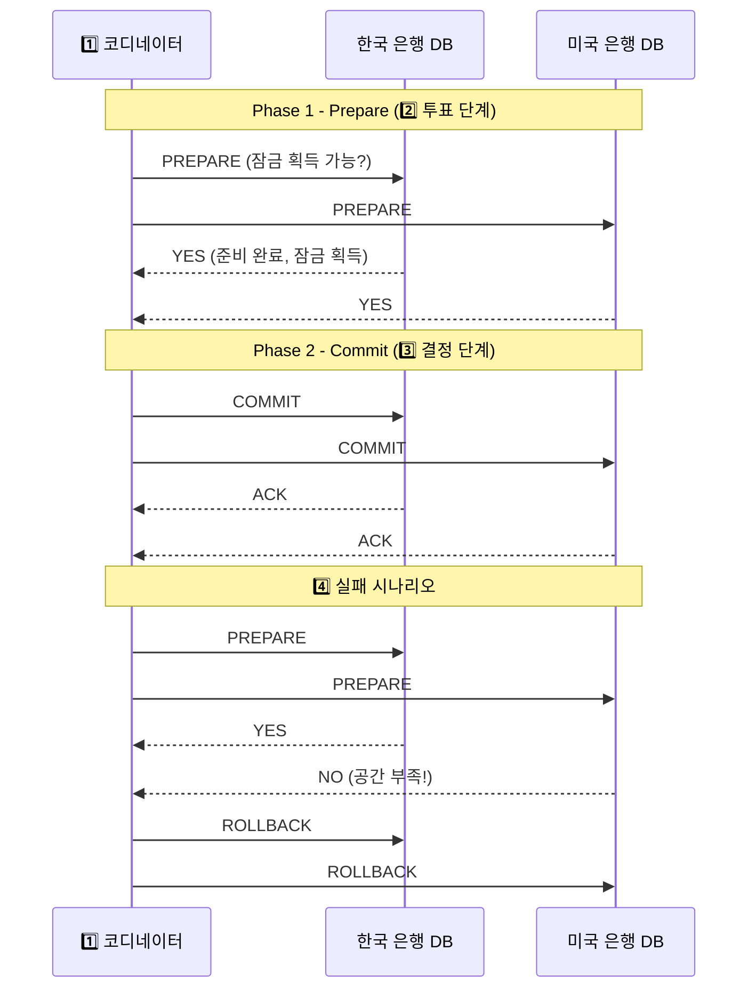

### 2PC의 문제점 — 왜 잘 안 쓰이나

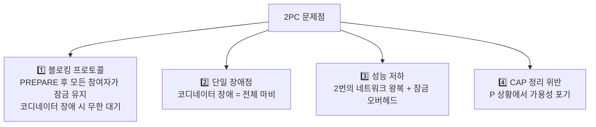

PREPARE 단계에서 DB_A가 잠금을 획득하고 코디네이터의 COMMIT/ROLLBACK을 기다립니다. 이때 코디네이터 서버가 죽으면? DB_A는 잠금을 쥐고 영원히 기다립니다. 다른 트랜잭션이 그 데이터에 접근하지 못합니다. 서비스가 서서히 마비됩니다. 이것이 "블로킹 프로토콜"의 실제 장애 시나리오입니다.

**2PC는 언제 사용하는가:**
- 단일 조직 내 DB (같은 데이터센터, 네트워크 장애 가능성 낮음)
- XA 트랜잭션을 지원하는 DB (MySQL, PostgreSQL)
- 짧은 트랜잭션, 낮은 동시성 환경

---

## 3. 3PC (3단계 커밋) — 2PC의 블로킹 문제 개선 시도

2PC의 블로킹 문제를 해결하기 위한 개선안입니다. CanCommit → PreCommit → DoCommit 세 단계로 나눠 타임아웃을 추가합니다.

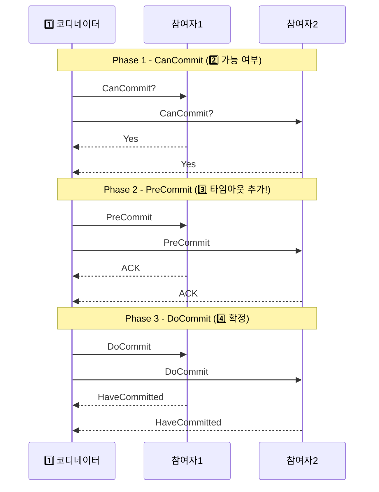

PreCommit 단계가 추가되어 코디네이터 장애 시 참여자가 타임아웃 후 자율적으로 커밋할 수 있습니다. 하지만 **네트워크 분할 시 여전히 문제가 남습니다.** 일부 참여자는 PreCommit을 받았고 일부는 못 받은 상황에서 코디네이터가 죽으면, 받은 쪽은 커밋하고 못 받은 쪽은 롤백합니다. 데이터 불일치가 생깁니다. 이론상으로는 개선이지만 실제로는 거의 사용하지 않습니다.

---

## 4. Saga 패턴 — 현재 MSA에서 가장 많이 사용

### Saga란?

"긴 이야기"라는 뜻에서 왔습니다. 각 서비스가 로컬 트랜잭션을 수행하고, 실패 시 **보상 트랜잭션(Compensating Transaction)**으로 이전 상태를 복구합니다.

비유하자면 여행사를 통하지 않고 직접 항공권, 호텔, 렌터카를 예약할 때와 같습니다. 각각 예약하다가 렌터카가 매진이면 이미 예약한 항공권과 호텔을 직접 취소(보상)해야 합니다. 전체를 묶는 단일 트랜잭션은 없지만, 보상 절차가 있어 결국 일관된 상태로 되돌아갑니다.

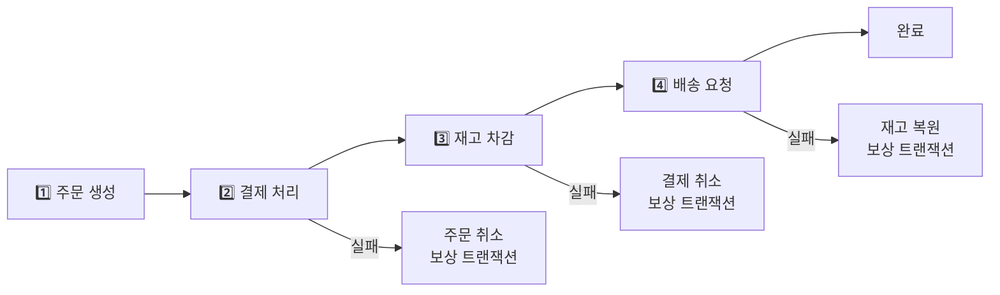

### 방식 1: Choreography (안무) Saga — 각자 알아서

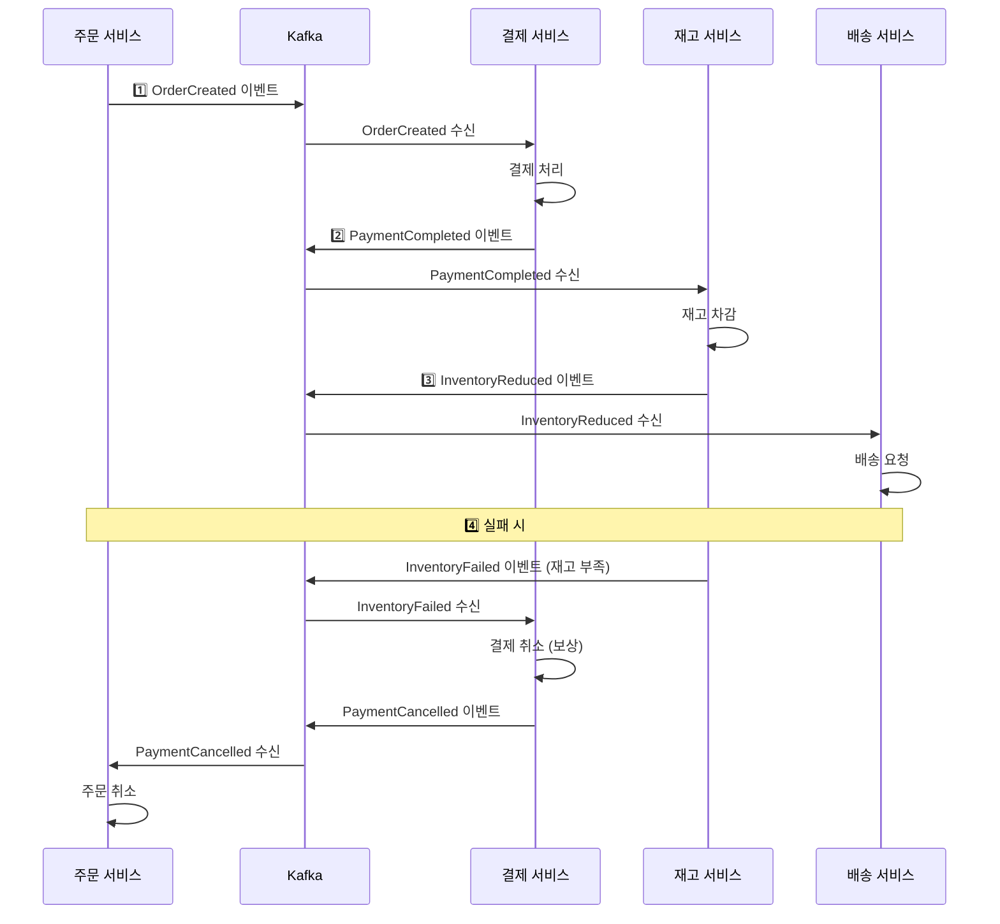

안무 방식은 "공연 지시자 없이 무용수들이 서로의 동작을 보고 반응하며 춤추는 것"과 같습니다. 중앙 조율자가 없어 결합도가 낮습니다. 하지만 전체 흐름을 추적하기 어렵습니다. "결제는 됐는데 배송 요청이 안 됐다"는 버그를 찾으려면 여러 서비스의 로그를 모두 뒤져야 합니다.

**Choreography Saga 구현:**
```java
// 주문 서비스
@Service
public class OrderService {

    @Transactional
    public Order createOrder(OrderRequest request) {
        Order order = Order.create(request);
        orderRepository.save(order);

        // 트랜잭션 완료 후 이벤트 발행 (Outbox 패턴과 함께 사용)
        eventPublisher.publish(new OrderCreatedEvent(order));

        return order;
    }

    @KafkaListener(topics = "payment-cancelled")
    public void handlePaymentCancelled(PaymentCancelledEvent event) {
        Order order = orderRepository.findById(event.getOrderId());
        order.cancel("Payment failed");
        orderRepository.save(order);

        eventPublisher.publish(new OrderCancelledEvent(order));
    }
}

// 결제 서비스 — OrderCreated 이벤트를 보고 자율적으로 처리
@Service
public class PaymentService {

    @KafkaListener(topics = "order-created")
    public void handleOrderCreated(OrderCreatedEvent event) {
        try {
            Payment payment = processPayment(event.getOrderId(), event.getAmount());
            eventPublisher.publish(new PaymentCompletedEvent(payment));
        } catch (InsufficientFundsException e) {
            // 잔액 부족 → 실패 이벤트 발행하면 주문 서비스가 취소 처리
            eventPublisher.publish(new PaymentFailedEvent(event.getOrderId(), e.getMessage()));
        }
    }

    @KafkaListener(topics = "inventory-failed")
    public void handleInventoryFailed(InventoryFailedEvent event) {
        // 재고 부족으로 실패 → 이미 처리한 결제를 보상으로 취소
        cancelPayment(event.getOrderId());
        eventPublisher.publish(new PaymentCancelledEvent(event.getOrderId()));
    }
}
```

### 방식 2: Orchestration (오케스트레이션) Saga — 중앙 지휘자가 조율

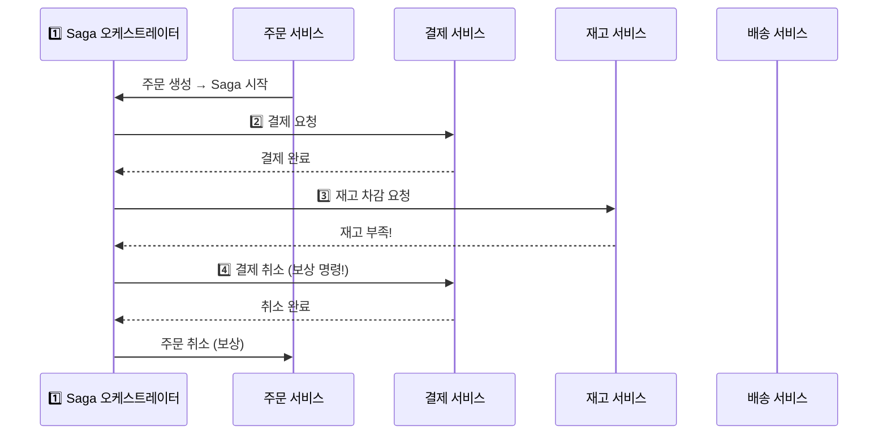

오케스트레이션 방식은 "지휘자가 악기별로 언제 어떻게 연주할지 지시하는 것"과 같습니다. 전체 흐름이 오케스트레이터 한 곳에 집중되어 디버깅이 쉽습니다. 단, 오케스트레이터가 단일 장애점이 될 수 있습니다.

**Orchestration Saga 구현 (Spring State Machine):**
```java
@Component
public class OrderSagaOrchestrator {

    public void startOrderSaga(OrderCreatedEvent event) {
        SagaExecution saga = SagaExecution.create(event.getOrderId());
        sagaRepository.save(saga);

        executeNextStep(saga);
    }

    private void executeNextStep(SagaExecution saga) {
        switch (saga.getCurrentStep()) {
            case STARTED -> {
                paymentService.processPayment(saga.getOrderId(), saga.getAmount());
                saga.advance(SagaStep.PAYMENT_PROCESSING);
            }
            case PAYMENT_COMPLETED -> {
                inventoryService.reduceInventory(saga.getOrderId(), saga.getItems());
                saga.advance(SagaStep.INVENTORY_REDUCING);
            }
            case INVENTORY_REDUCED -> {
                deliveryService.createDelivery(saga.getOrderId());
                saga.advance(SagaStep.DELIVERY_CREATING);
            }
            case DELIVERY_CREATED -> {
                orderService.complete(saga.getOrderId());
                saga.complete();
            }
        }
        sagaRepository.save(saga);
    }

    public void handleStepFailed(String orderId, SagaStep failedStep, String reason) {
        SagaExecution saga = sagaRepository.findByOrderId(orderId);
        saga.fail(failedStep, reason);

        // 보상 트랜잭션 역순 실행
        compensate(saga);
    }

    private void compensate(SagaExecution saga) {
        // 실패 이전 완료된 단계들을 역순으로 보상
        // 왜 역순? DELIVERY_CREATED가 먼저 취소돼야 PAYMENT를 취소할 수 있음
        for (SagaStep completedStep : saga.getCompletedSteps().reversed()) {
            switch (completedStep) {
                case PAYMENT_COMPLETED -> paymentService.cancelPayment(saga.getOrderId());
                case INVENTORY_REDUCED -> inventoryService.restoreInventory(saga.getOrderId());
                case DELIVERY_CREATED -> deliveryService.cancelDelivery(saga.getOrderId());
            }
        }
    }
}
```

### Choreography vs Orchestration 비교

| 특성 | Choreography | Orchestration |
|------|-------------|---------------|
| 중앙 조율자 | 없음 | 있음 |
| 결합도 | 낮음 | 중간 |
| 추적/디버깅 | 어려움 (여러 서비스 로그 추적) | 쉬움 (오케스트레이터 로그 하나) |
| 복잡도 | 분산됨 | 집중됨 |
| 단일 장애점 | 없음 | 오케스트레이터 |
| 추천 상황 | 단순한 흐름 (3단계 이하) | 복잡한 비즈니스 로직 |

---

## 5. Outbox 패턴 — "이벤트가 절대 유실되지 않게"

### 문제: 이벤트 발행의 원자성

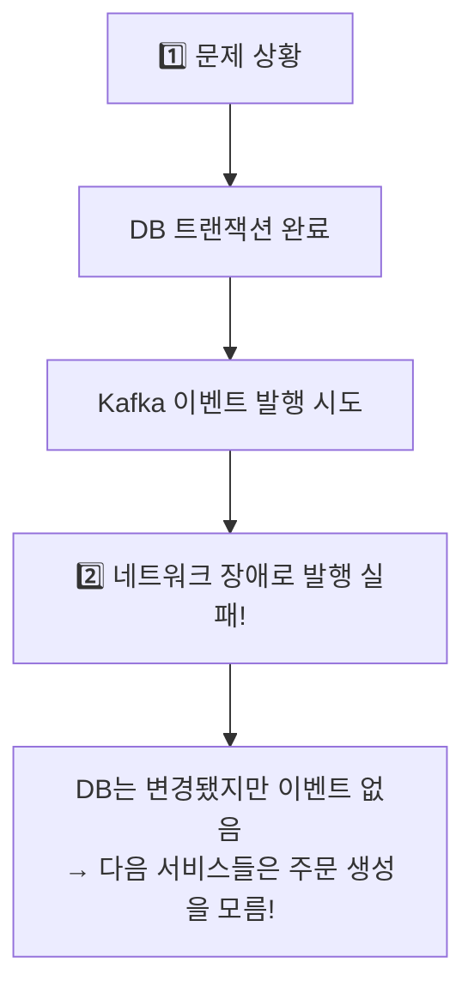

이 문제가 왜 생기냐고요? DB 트랜잭션과 Kafka 발행은 서로 다른 시스템이라 하나의 트랜잭션으로 묶을 수 없습니다. DB 커밋은 됐는데 Kafka 발행이 실패하면 데이터는 있지만 이벤트는 없습니다. 결제 서비스는 주문이 생성됐는지 모릅니다.

실제 장애 시나리오: 주문이 생성됐는데 결제 요청 이벤트가 유실됐습니다. 고객은 주문이 됐다고 생각하고 기다립니다. 결제는 영원히 안 됩니다. 고객 문의가 폭발합니다.

### 해결: Outbox 패턴 — "같은 트랜잭션에 이벤트를 먼저 DB에 저장"

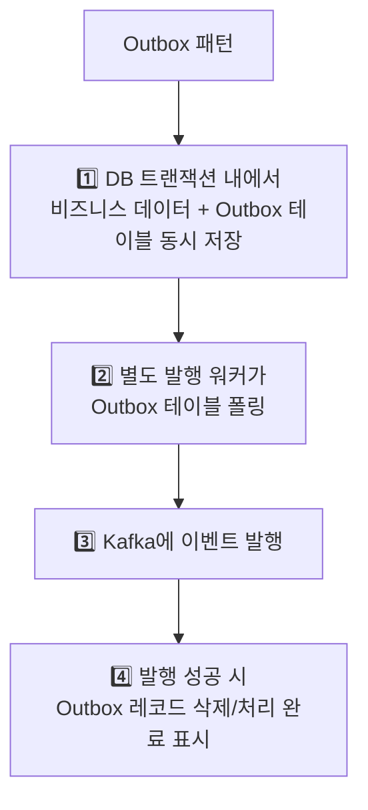

핵심 아이디어는 "이벤트를 Kafka에 직접 보내지 말고, 같은 DB 트랜잭션 안에 있는 outbox 테이블에 먼저 저장하자"입니다. DB 트랜잭션이 커밋되면 비즈니스 데이터와 이벤트 레코드가 함께 저장됩니다. 나중에 별도 워커가 outbox를 읽어 Kafka에 발행합니다.

Kafka 발행이 실패해도 outbox 레코드는 DB에 남아있으므로 재시도할 수 있습니다. **이벤트 유실이 원천적으로 불가능**합니다.

**Outbox 패턴 구현:**
```java
// Outbox 테이블 엔티티
@Entity
@Table(name = "outbox_events")
public class OutboxEvent {
    @Id
    private String id;

    private String aggregateType;   // "Order"
    private String aggregateId;     // "order-123"
    private String eventType;       // "OrderCreated"
    private String payload;         // JSON

    @Enumerated(EnumType.STRING)
    private EventStatus status;     // PENDING, PUBLISHED, FAILED

    private LocalDateTime createdAt;
    private LocalDateTime publishedAt;
    private int retryCount;
}

// 주문 서비스 - 하나의 트랜잭션으로 처리
@Service
public class OrderService {

    @Transactional  // 이 트랜잭션이 커밋되면 주문 + 이벤트 동시 저장
    public Order createOrder(OrderRequest request) {
        // 1. 주문 저장
        Order order = Order.create(request);
        orderRepository.save(order);

        // 2. Outbox에 이벤트 저장 (같은 트랜잭션!)
        // 왜 같은 트랜잭션? 주문 저장과 이벤트 저장이 원자적으로 되어야 함
        OutboxEvent outboxEvent = OutboxEvent.builder()
            .id(UUID.randomUUID().toString())
            .aggregateType("Order")
            .aggregateId(order.getId())
            .eventType("OrderCreated")
            .payload(objectMapper.writeValueAsString(new OrderCreatedEvent(order)))
            .status(EventStatus.PENDING)
            .createdAt(LocalDateTime.now())
            .build();

        outboxRepository.save(outboxEvent);

        // Kafka 발행 안 함! 별도 워커가 처리
        return order;
    }
}

// Outbox 발행 워커
@Component
public class OutboxPublisher {

    @Scheduled(fixedDelay = 100)  // 100ms마다 실행
    @Transactional
    public void publishPendingEvents() {
        List<OutboxEvent> pendingEvents = outboxRepository
            .findByStatusOrderByCreatedAtAsc(EventStatus.PENDING, PageRequest.of(0, 100));

        for (OutboxEvent event : pendingEvents) {
            try {
                kafkaTemplate.send(
                    getTopicForEventType(event.getEventType()),
                    event.getAggregateId(),
                    event.getPayload()
                ).get(5, TimeUnit.SECONDS);

                event.markPublished();
                outboxRepository.save(event);

            } catch (Exception e) {
                event.incrementRetry();
                if (event.getRetryCount() > 10) {
                    event.markFailed();  // 10번 이상 실패하면 DLQ나 알림
                }
                outboxRepository.save(event);
            }
        }
    }
}
```

Outbox 패턴의 단점은 지연입니다. DB 커밋 후 워커가 폴링해서 Kafka에 보내기까지 수백ms 지연이 생깁니다. 더 빠른 대안은 **Debezium CDC(Change Data Capture)**를 사용하는 것입니다. Debezium은 DB의 변경 로그(binlog)를 직접 읽어 Kafka에 발행하므로 별도 워커 없이 수십ms 지연으로 동일한 보장을 제공합니다.

---

## 6. 이벤트 소싱 (Event Sourcing) — 상태 대신 이벤트를 저장

### 개념

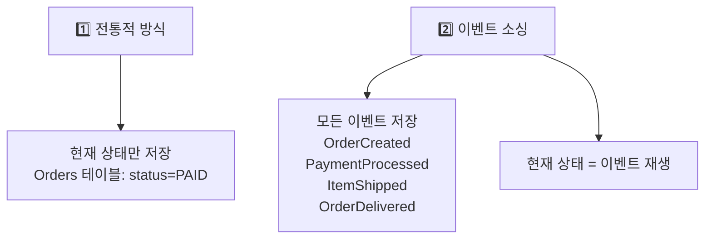

전통 방식은 주문의 현재 상태만 저장합니다. "왜 이 주문이 CANCELLED가 됐지?"를 알려면 별도 감사 로그가 필요합니다. 이벤트 소싱은 처음부터 모든 사건을 저장합니다. 마치 회계 장부처럼 "잔액은 모든 거래의 합산"입니다. 현재 잔액만 저장하는 게 아니라 모든 입출금 내역을 저장하고, 잔액은 그걸 더하고 빼서 계산합니다.

이 방식이 강력한 이유: 버그가 발생해서 어떤 주문이 잘못 처리됐을 때, 이벤트를 특정 시점까지만 재생해서 당시 상태를 재현할 수 있습니다. 또 새로운 분석 서비스를 만들면 처음부터 모든 이벤트를 재생해 원하는 뷰를 만들 수 있습니다.

**이벤트 소싱 구현:**
```java
// 이벤트 스토어
@Entity
@Table(name = "event_store")
public class EventRecord {
    @Id
    @GeneratedValue
    private Long id;

    private String aggregateId;
    private String eventType;
    private String payload;        // JSON
    private Long version;          // 낙관적 잠금용 — 동시 수정 방지
    private LocalDateTime occurredAt;
}

// Order 애그리게이트 — 이벤트로부터 상태를 재구성
public class Order {
    private String id;
    private String status;
    private BigDecimal totalAmount;
    private List<OrderItem> items;
    private Long version;

    public static Order reconstruct(List<EventRecord> events) {
        Order order = new Order();
        for (EventRecord event : events) {
            order.apply(event);
        }
        return order;
    }

    private void apply(EventRecord event) {
        switch (event.getEventType()) {
            case "OrderCreated" -> {
                OrderCreatedEvent e = deserialize(event.getPayload());
                this.id = e.getOrderId();
                this.status = "CREATED";
                this.items = e.getItems();
                this.totalAmount = e.getTotalAmount();
            }
            case "PaymentCompleted" -> this.status = "PAID";
            case "ItemShipped" -> this.status = "SHIPPED";
            case "OrderDelivered" -> this.status = "DELIVERED";
            case "OrderCancelled" -> this.status = "CANCELLED";
        }
        this.version = event.getVersion();
    }
}
```

이벤트 수가 수천 개가 쌓이면 매번 처음부터 재생하는 게 느려집니다. 이를 해결하는 방법이 **스냅샷**입니다. 1000개 이벤트마다 현재 상태를 스냅샷으로 저장하고, 다음 조회 시 스냅샷부터 시작해 이후 이벤트만 재생합니다.

**이벤트 소싱의 장단점:**

| 장점 | 단점 |
|------|------|
| 완전한 감사 로그 (법적 요구사항 충족) | 쿼리 복잡도 증가 (읽기 모델 별도 필요) |
| 타임 트래블 (과거 상태 재현 가능) | 이벤트 스키마 진화 어려움 |
| 이벤트 재생으로 버그 사후 수정 | 이벤트 수 증가 시 재구성 느림 (스냅샷으로 완화) |
| CQRS와 궁합 완벽 | 러닝 커브 높음, 팀 전체 이해 필요 |

---

## 7. CQRS (Command Query Responsibility Segregation) — 읽기와 쓰기를 분리

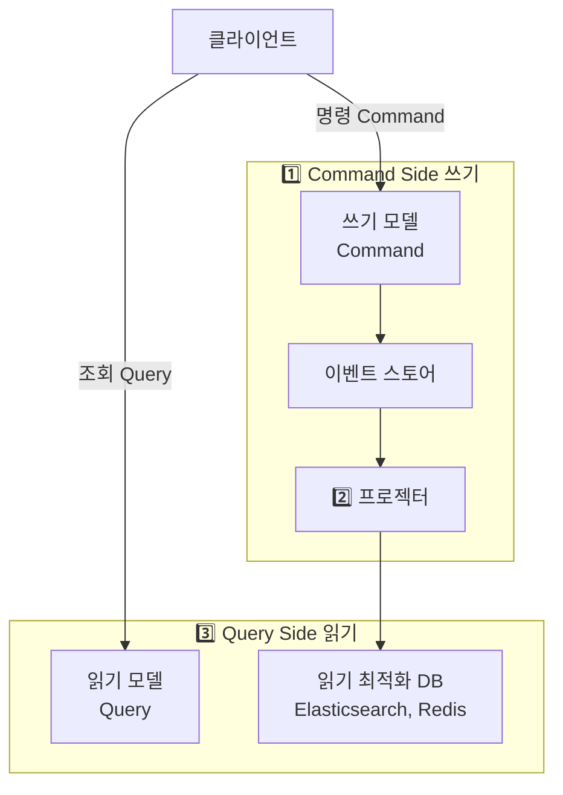

왜 읽기와 쓰기를 분리할까요? 쓰기에 최적화된 DB(정규화된 테이블, ACID 보장)와 읽기에 최적화된 DB(비정규화, 검색 최적화)의 요구사항이 서로 다르기 때문입니다.

주문 내역 페이지를 보여주려면 주문, 상품, 사용자 테이블을 JOIN해야 합니다. 트래픽이 많으면 이 JOIN 쿼리가 DB에 부하를 줍니다. CQRS에서는 이벤트가 발생할 때마다 이미 JOIN된 "주문 내역 뷰"를 Elasticsearch에 업데이트해둡니다. 읽기 요청은 이 뷰를 그냥 가져오면 됩니다.

읽기와 쓰기의 비율이 10:1이 넘는 시스템에서 CQRS는 읽기 성능을 10배 이상 개선할 수 있습니다.

**CQRS 구현:**
```java
// Command Handler (쓰기)
@Service
public class OrderCommandHandler {

    @CommandHandler
    @Transactional
    public String handle(CreateOrderCommand cmd) {
        Order order = Order.create(cmd);
        eventStore.save(order.getUncommittedEvents());
        return order.getId();
    }
}

// Query Handler (읽기) — 완전히 다른 모델, 다른 DB
@Service
public class OrderQueryHandler {

    @QueryHandler
    public OrderSummaryView handle(GetOrderQuery query) {
        // 읽기에 최적화된 뷰 테이블 조회 (JOIN 없음, 이미 합쳐진 데이터)
        return orderSummaryRepository.findById(query.getOrderId());
    }

    @QueryHandler
    public Page<OrderListView> handle(GetOrderListQuery query) {
        return orderListRepository.findByUserId(
            query.getUserId(),
            PageRequest.of(query.getPage(), query.getSize())
        );
    }
}

// 이벤트 프로젝터 (이벤트 → 읽기 모델 업데이트)
// 이 컴포넌트가 쓰기 모델에서 읽기 모델로 데이터를 동기화
@Service
public class OrderProjector {

    @EventHandler
    public void on(OrderCreatedEvent event) {
        OrderSummaryView view = OrderSummaryView.from(event);
        orderSummaryRepository.save(view);
    }

    @EventHandler
    public void on(PaymentCompletedEvent event) {
        orderSummaryRepository.updateStatus(event.getOrderId(), "PAID");
    }
}
```

---

## 8. 실전 주문 시스템 예제 — 쿠팡 주문 처리 전체 흐름

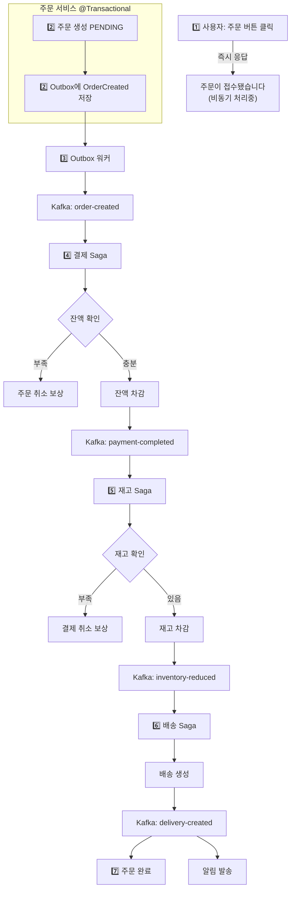

이 흐름에서 사용자는 즉시 응답을 받습니다. 실제 처리는 Kafka를 통해 비동기로 이루어집니다. 각 단계가 독립적으로 실패하고 보상할 수 있습니다. 어떤 서비스가 잠깐 다운돼도 Kafka에 메시지가 쌓여 있다가 복구 후 처리됩니다.

---

## 9. 멱등성 보장 — "같은 요청을 두 번 처리해도 한 번 처리한 것처럼"

Kafka 컨슈머는 At-Least-Once를 보장합니다. 즉 네트워크 문제로 같은 메시지를 두 번 받을 수 있습니다. 결제 이벤트를 두 번 처리하면 결제가 두 번 됩니다. 이를 방지하는 것이 멱등성 처리입니다.

```java
@Service
public class PaymentService {

    @KafkaListener(topics = "order-created")
    public void handleOrderCreated(OrderCreatedEvent event) {
        // 멱등성 체크: 이미 처리한 이벤트인가?
        // eventId는 Snowflake처럼 전역 유일 ID
        if (processedEventRepository.existsByEventId(event.getEventId())) {
            log.warn("중복 이벤트 무시: {}", event.getEventId());
            return;
        }

        try {
            Payment payment = processPayment(event);

            // 처리 완료 기록 (트랜잭션 내)
            // 왜 같은 트랜잭션? 결제와 처리 기록이 원자적으로 저장되어야 함
            processedEventRepository.save(
                new ProcessedEvent(event.getEventId(), LocalDateTime.now())
            );

            eventPublisher.publish(new PaymentCompletedEvent(payment));

        } catch (Exception e) {
            eventPublisher.publish(new PaymentFailedEvent(event.getOrderId()));
        }
    }
}
```

멱등성 체크 레코드는 얼마나 보관해야 할까요? Kafka 메시지 보관 기간(기본 7일)보다 길어야 합니다. 7일이 지난 메시지는 재전송될 일이 없으므로, 멱등성 레코드도 7일 이후 삭제해도 안전합니다.

---

## 10. 극한 시나리오: 11번가 블랙프라이데이

초당 10만 건의 주문이 들어올 때 분산 트랜잭션 처리:

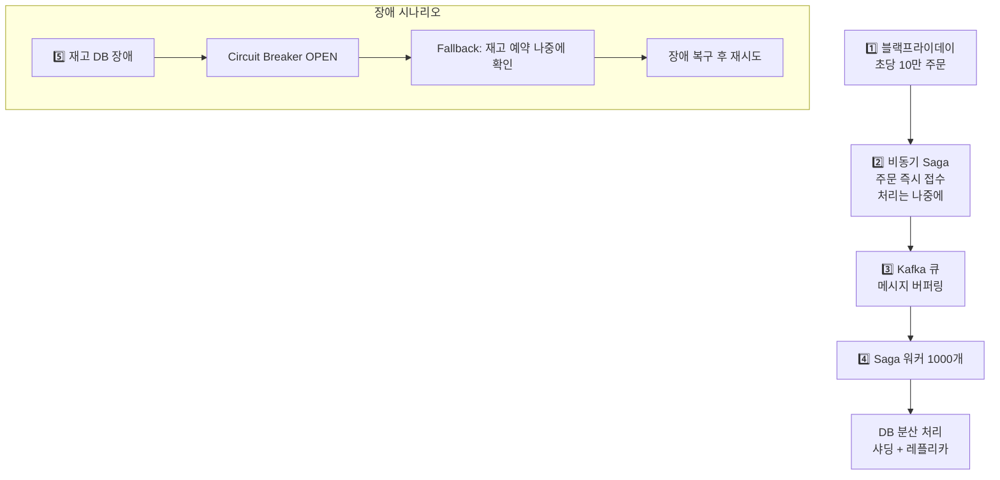

이 규모에서 동기적 2PC를 사용하면 어떻게 될까요? 코디네이터 하나가 초당 10만 건을 조율하는 건 물리적으로 불가능합니다. 잠금 경합으로 DB가 멈춥니다. 비동기 Saga + Kafka 조합이 이 규모를 감당할 수 있는 유일한 현실적 선택입니다.

---

## 핵심 패턴 선택 가이드

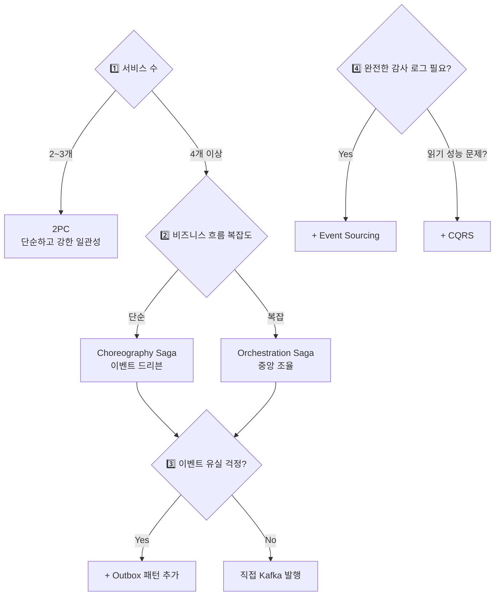

| 패턴 | 일관성 | 가용성 | 복잡도 | 추천 상황 |
|------|--------|--------|--------|---------|
| 2PC | 강함 | 낮음 | 낮음 | 소규모, 같은 DC, 짧은 트랜잭션 |
| Choreography Saga | 최종 | 높음 | 중간 | 단순 흐름, 느슨한 결합 선호 |
| Orchestration Saga | 최종 | 높음 | 높음 | 복잡한 흐름, 추적 중요 |
| Outbox | 최소1회 | 높음 | 중간 | 이벤트 유실 방지 필수 |
| Event Sourcing | 최종 | 높음 | 매우 높음 | 감사 로그 필수, 타임 트래블 필요 |
