## 실생활 비유: 백화점 vs 전문점 거리

**모놀리식 아키텍처**는 백화점입니다. 의류, 식품, 가전 모두 한 건물 안에 있어서 관리가 쉽지만, 식품관에 화재가 나면 전체 백화점이 닫힙니다.

**MSA**는 명동 같은 전문점 거리입니다. 각 가게(서비스)가 독립적으로 운영됩니다. 옷 가게가 휴업해도 밥은 먹을 수 있습니다. 장사가 잘 되는 가게만 직원을 더 뽑을 수 있습니다.

---

## 1. 모놀리스의 문제점

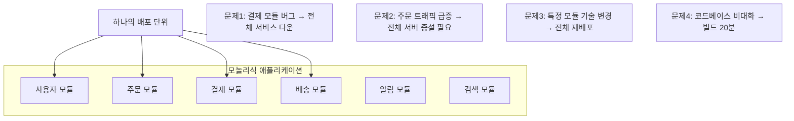

---

## 2. MSA 핵심 원칙

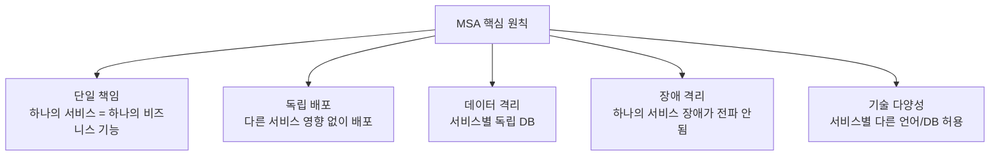

---

## 3. 모놀리스 → MSA 전환 전략

### Strangler Fig Pattern (교살자 무화과 패턴)

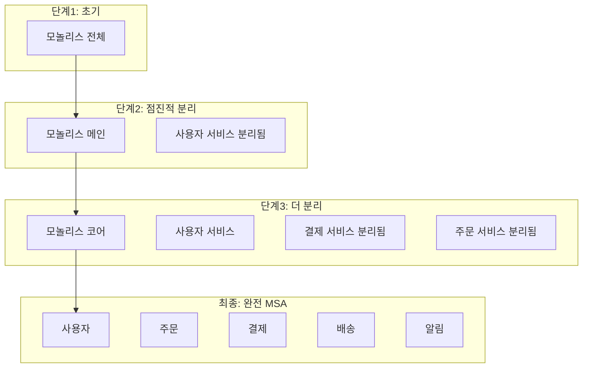

### 서비스 분리 기준 (DDD — Domain Driven Design)

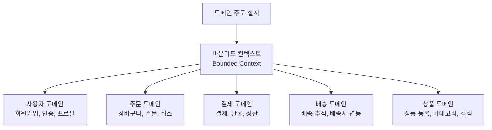

---

## 4. 전체 MSA 아키텍처

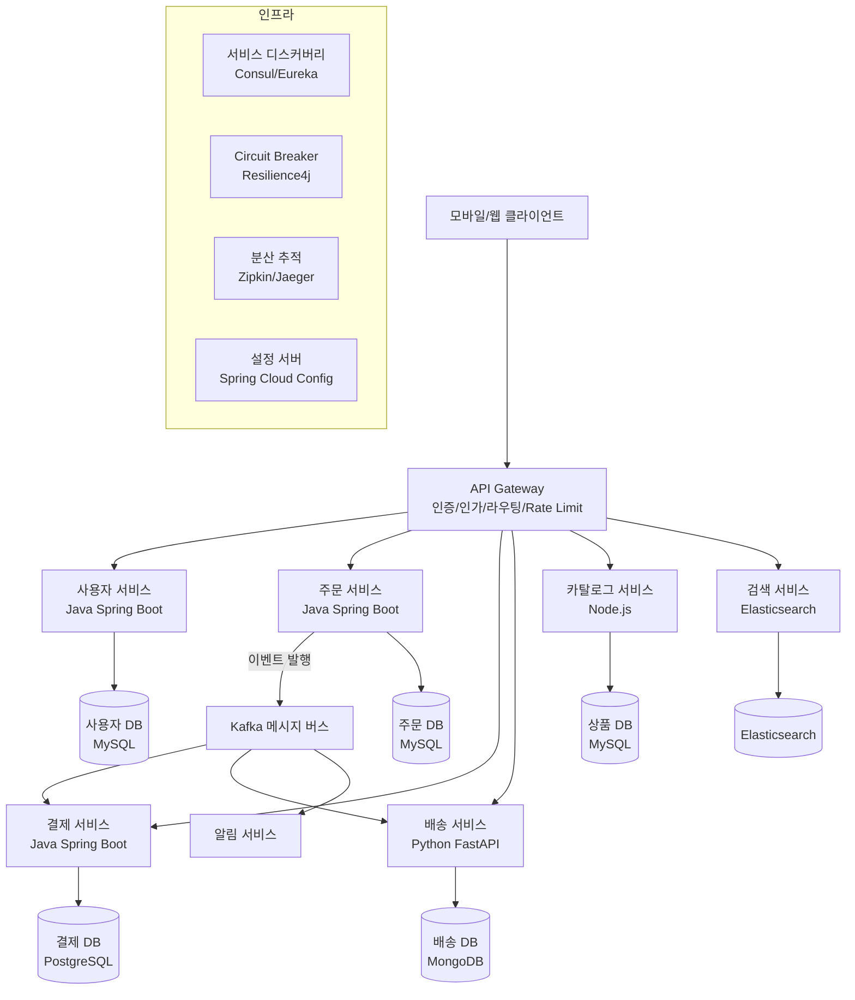

---

## 5. API Gateway

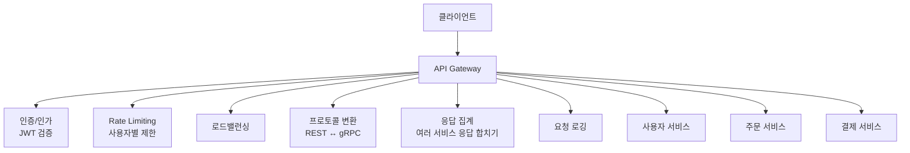

**Spring Cloud Gateway 설정:**
```yaml
# application.yml
spring:
  cloud:
    gateway:
      routes:
        - id: user-service
          uri: lb://user-service        # 로드밸런서 자동 연결
          predicates:
            - Path=/api/users/**
          filters:
            - StripPrefix=2             # /api/users → /users
            - name: RequestRateLimiter
              args:
                redis-rate-limiter.replenishRate: 100
                redis-rate-limiter.burstCapacity: 200

        - id: order-service
          uri: lb://order-service
          predicates:
            - Path=/api/orders/**
          filters:
            - name: CircuitBreaker
              args:
                name: orderCircuitBreaker
                fallbackUri: forward:/fallback/orders

        - id: auth-route
          uri: lb://auth-service
          predicates:
            - Path=/api/auth/**
          filters:
            - RemoveRequestHeader=Cookie

      globalcors:
        corsConfigurations:
          '[/**]':
            allowedOrigins: "https://myapp.com"
            allowedMethods: "*"
            allowedHeaders: "*"
```

---

## 6. 서비스 간 통신

### 동기 통신: REST vs gRPC

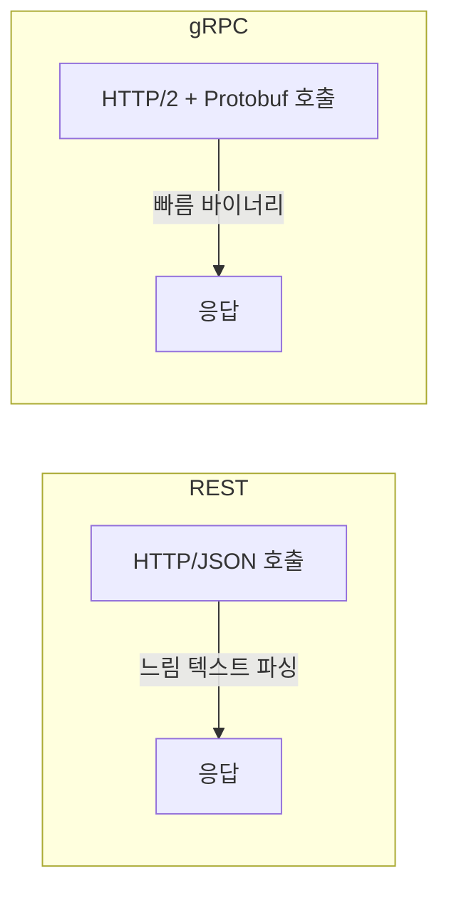

**gRPC 서비스 정의:**
```protobuf
// order.proto
syntax = "proto3";

service OrderService {
  rpc CreateOrder (CreateOrderRequest) returns (OrderResponse);
  rpc GetOrder (GetOrderRequest) returns (OrderResponse);
  rpc ListOrders (ListOrdersRequest) returns (stream OrderResponse);
}

message CreateOrderRequest {
  string user_id = 1;
  repeated OrderItem items = 2;
  string delivery_address = 3;
}

message OrderResponse {
  string order_id = 1;
  string status = 2;
  int64 total_amount = 3;
  string created_at = 4;
}
```

### 비동기 통신: Kafka 이벤트

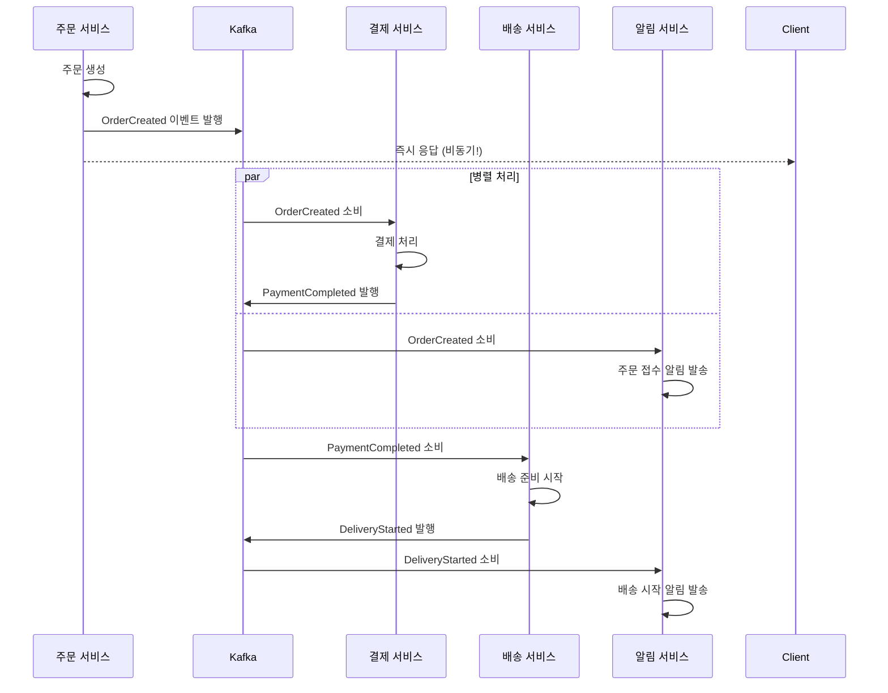

| 통신 방식 | 프로토콜 | 장점 | 단점 | 사용 예 |
|---------|---------|------|------|---------|
| REST | HTTP/JSON | 단순, 범용 | 느림 | 외부 API |
| gRPC | HTTP2/Protobuf | 빠름, 타입 안전 | 설정 복잡 | 내부 서비스 |
| Kafka | TCP | 비동기, 내구성 | 복잡도 높음 | 이벤트 드리븐 |

---

## 7. 서비스 디스커버리

### 왜 필요한가?

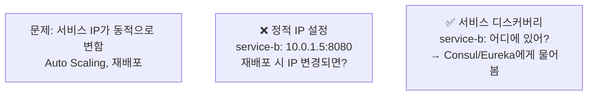

**Eureka 서비스 등록:**
```java
// OrderServiceApplication.java
@SpringBootApplication
@EnableEurekaClient
public class OrderServiceApplication {
    public static void main(String[] args) {
        SpringApplication.run(OrderServiceApplication.class, args);
    }
}
```

```yaml
# application.yml
spring:
  application:
    name: order-service

eureka:
  client:
    service-url:
      defaultZone: http://eureka-server:8761/eureka/
  instance:
    prefer-ip-address: true
    lease-renewal-interval-in-seconds: 10
    lease-expiration-duration-in-seconds: 30
```

**서비스 호출 (클라이언트 사이드 로드밸런싱):**
```java
@Service
public class OrderService {

    @Autowired
    private WebClient.Builder webClientBuilder;

    public PaymentResponse processPayment(PaymentRequest request) {
        // "payment-service" → Eureka에서 실제 IP:Port 자동 조회
        return webClientBuilder.build()
            .post()
            .uri("http://payment-service/api/payments")
            .bodyValue(request)
            .retrieve()
            .bodyToMono(PaymentResponse.class)
            .block();
    }
}
```

---

## 8. Circuit Breaker (서킷 브레이커)

> 비유: 집의 두꺼비집(차단기). 과전류가 흐르면 자동으로 차단하여 더 큰 피해를 막습니다.

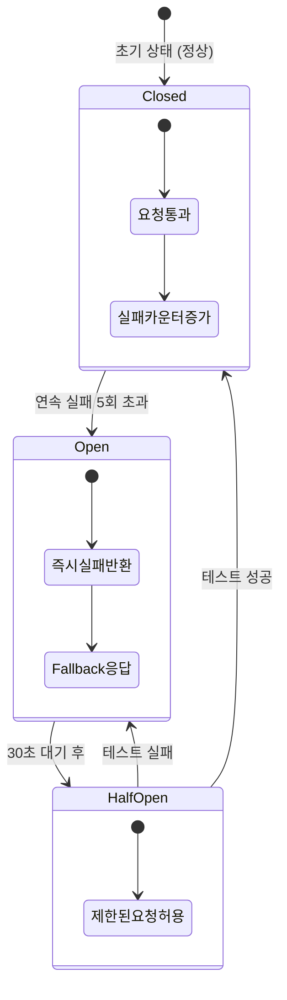

**Resilience4j 구현:**
```java
@Service
public class PaymentService {

    private final CircuitBreaker circuitBreaker;
    private final Retry retry;

    public PaymentService(CircuitBreakerRegistry registry) {
        // CircuitBreaker 설정
        CircuitBreakerConfig config = CircuitBreakerConfig.custom()
            .failureRateThreshold(50)           // 50% 실패율에서 OPEN
            .slowCallRateThreshold(100)         // 느린 호출 100%면 OPEN
            .slowCallDurationThreshold(Duration.ofSeconds(2))
            .waitDurationInOpenState(Duration.ofSeconds(30))
            .permittedNumberOfCallsInHalfOpenState(5)
            .slidingWindowSize(10)
            .build();

        this.circuitBreaker = registry.circuitBreaker("paymentService", config);

        // Retry 설정
        RetryConfig retryConfig = RetryConfig.custom()
            .maxAttempts(3)
            .waitDuration(Duration.ofMillis(500))
            .retryOnException(e -> e instanceof NetworkException)
            .build();

        this.retry = Retry.of("paymentRetry", retryConfig);
    }

    public PaymentResult charge(PaymentRequest request) {
        // CircuitBreaker + Retry 체인
        Supplier<PaymentResult> decoratedSupplier = CircuitBreaker
            .decorateSupplier(circuitBreaker,
                Retry.decorateSupplier(retry,
                    () -> paymentApiClient.charge(request)
                )
            );

        return Try.ofSupplier(decoratedSupplier)
            .recover(throwable -> fallbackPayment(request))  // Fallback
            .get();
    }

    private PaymentResult fallbackPayment(PaymentRequest request) {
        // 결제 서비스 장애 시 → 임시 처리 (나중에 재시도)
        log.warn("Payment service unavailable, queuing for retry");
        paymentRetryQueue.add(request);
        return PaymentResult.pending(request.getOrderId());
    }
}
```

---

## 9. Saga 패턴 (분산 트랜잭션)

MSA에서는 하나의 비즈니스 트랜잭션이 여러 서비스에 걸쳐 있습니다. 분산 트랜잭션을 어떻게 관리할까요?

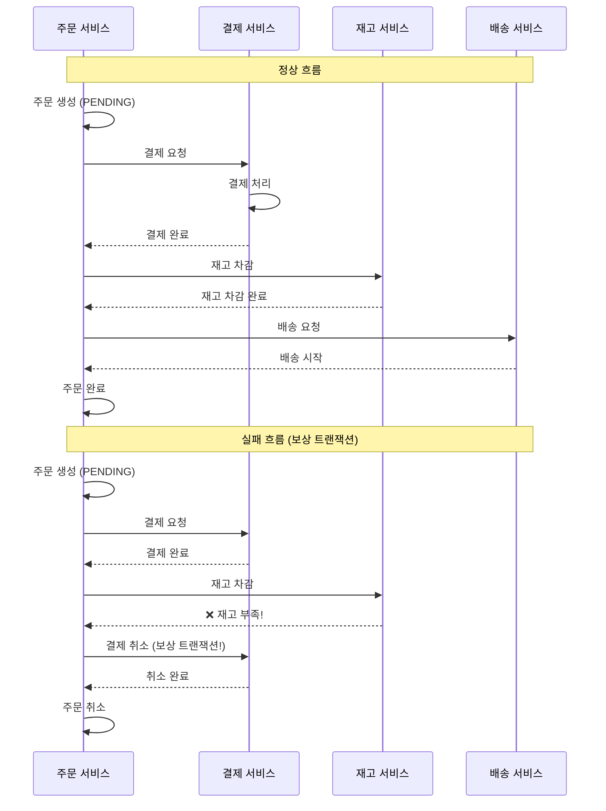

---

## 10. 분산 추적 (Distributed Tracing)

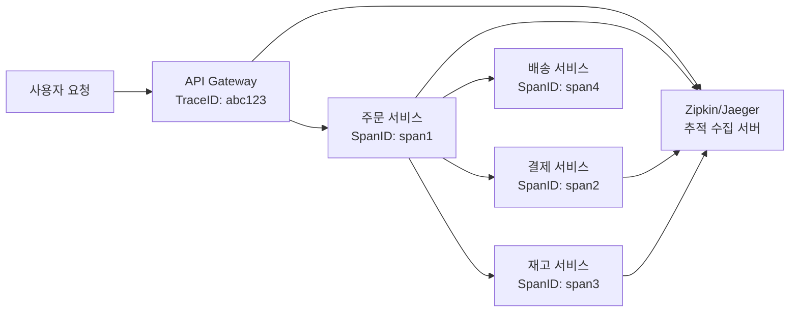

**Spring Sleuth + Zipkin 설정:**
```yaml
# application.yml
spring:
  sleuth:
    sampler:
      probability: 1.0  # 100% 샘플링 (프로덕션은 0.1)
  zipkin:
    base-url: http://zipkin-server:9411
```

```java
@RestController
public class OrderController {

    private static final Logger log = LoggerFactory.getLogger(OrderController.class);

    @PostMapping("/orders")
    public ResponseEntity<Order> createOrder(@RequestBody OrderRequest request) {
        // Trace ID가 자동으로 로그에 포함됨
        // 2024-01-01 [abc123,span1] Creating order for user: 1001
        log.info("Creating order for user: {}", request.getUserId());

        Order order = orderService.createOrder(request);
        // 다른 서비스 호출 시 Trace ID 자동 전파 (HTTP 헤더)
        return ResponseEntity.ok(order);
    }
}
```

---

## 11. 카나리 배포 (Canary Deployment)

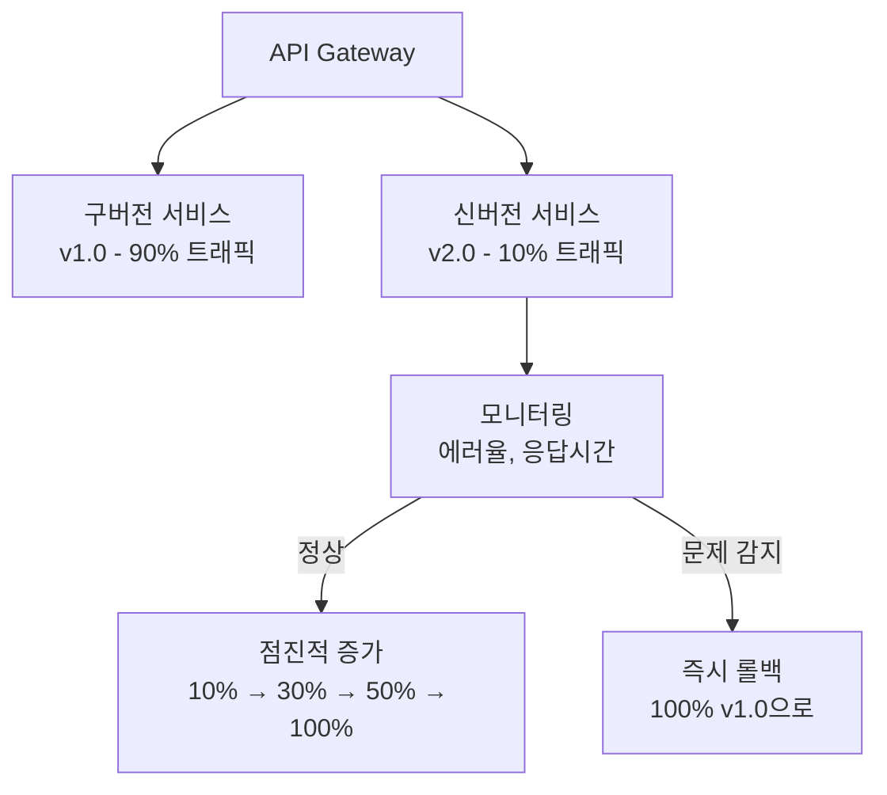

---

## 12. 극한 시나리오: 카카오 주문하기 MSA

카카오 선물하기 같은 서비스를 MSA로 설계할 때:

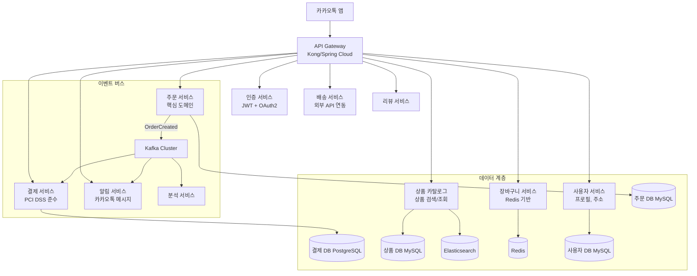

---

## MSA 도입 판단 기준

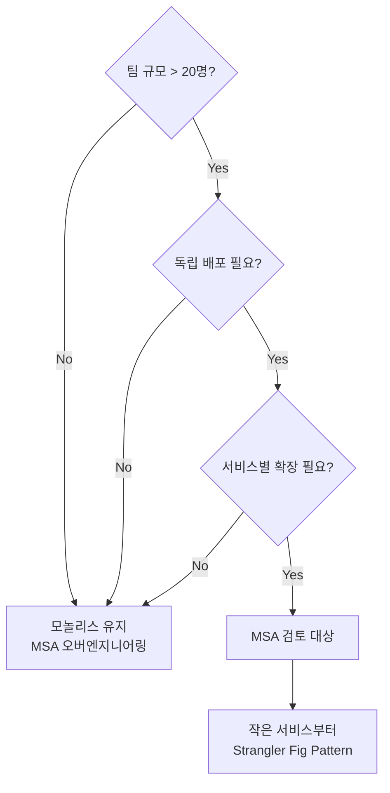

| 조건 | 모놀리스 | MSA |
|------|---------|-----|
| 팀 규모 | < 10명 | > 20명 |
| 서비스 규모 | 초기 스타트업 | 성숙한 서비스 |
| 배포 빈도 | 주 1회 | 하루 수십 회 |
| 독립 확장 필요 | 없음 | 있음 |
| 기술 다양성 | 필요 없음 | 필요 |

> **결론**: MSA는 문제를 해결하지만 새로운 복잡도를 만듭니다. "필요할 때" 도입하세요. 모놀리스가 나쁜 것이 아닙니다.
