## 실생활 비유: 백화점 vs 전문점 거리

**모놀리식 아키텍처**는 대형 백화점입니다. 의류, 식품, 가전 모두 한 건물 안에 있어 내부 물류가 빠릅니다. 하지만 식품관에 화재가 나면 전체 백화점이 폐쇄됩니다. 가전 코너에 손님이 몰려도 식품관 직원을 임시 차출하기 어렵습니다. 빌딩 전체를 증축해야만 수용 인원이 늘어납니다.

**MSA**는 명동 같은 전문점 거리입니다. 각 가게가 독립적으로 운영됩니다. 옷 가게가 휴업해도 식당은 영업합니다. 장사가 잘 되는 가게만 직원을 추가 채용합니다. 단, 가게 수가 늘수록 거리 전체 관리 비용이 올라가고, 가게 간 "배달"(API 호출)이 시간을 소요합니다.

MSA는 "더 좋은 아키텍처"가 아닙니다. **"더 큰 팀과 더 복잡한 비즈니스를 위한 아키텍처"**입니다. 이 차이를 모르고 5명 팀이 MSA를 도입하면 인프라 운영에 치여 기능 개발을 못 합니다.

---

## 1. 서비스 분해 — 경계를 어떻게 그을 것인가

### 1-1. Bounded Context 정렬

DDD(Domain-Driven Design)의 Bounded Context는 "같은 언어(Ubiquitous Language)가 통용되는 경계"입니다. 결제팀이 "주문"이라고 하면 "결제 대상 금액 묶음"을 의미하고, 배송팀이 "주문"이라고 하면 "배송지와 품목 목록"을 의미합니다. **같은 단어가 다른 모델을 가리키는 지점이 바로 서비스 경계**입니다.

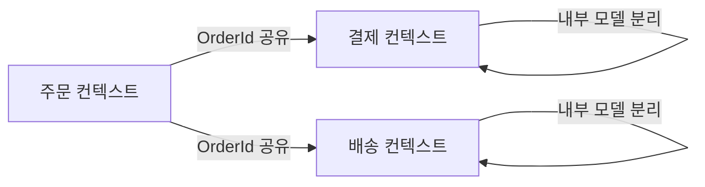

**내부 메커니즘**: Order 서비스의 `Order` 엔티티는 장바구니 항목, 할인 쿠폰, 총액을 가집니다. Payment 서비스의 `PaymentOrder`는 결제 수단, 승인번호, 부분 취소 내역을 가집니다. 두 모델이 `orderId`라는 키로만 연결되어야 하며, Payment 서비스가 Order 테이블에 JOIN을 걸어서는 안 됩니다. JOIN을 허용하는 순간 두 서비스의 스키마 변경이 서로를 깨뜨립니다.

```java
// 잘못된 패턴: Payment 서비스가 Order DB에 직접 접근
@Repository
public class PaymentRepository {
    @Query("SELECT o.total, o.userId FROM orders o WHERE o.id = :orderId")
    OrderInfo findOrderInfo(@Param("orderId") String orderId); // 절대 안 됨
}

// 올바른 패턴: Order 서비스 API를 통해 필요한 정보만 조회
@Service
public class PaymentService {
    private final OrderClient orderClient; // Feign or WebClient

    public PaymentResult initiate(String orderId, PaymentMethod method) {
        OrderSummary summary = orderClient.getSummary(orderId); // REST or gRPC
        // Payment 서비스는 orderId, amount, currency 만 알면 됨
        return processPayment(orderId, summary.getAmount(), method);
    }
}
```

### 1-2. 왜 서비스가 너무 작으면 안 되는가 — Distributed Monolith

서비스를 세게 쪼개면 "분산 모놀리스(Distributed Monolith)"가 됩니다. 주문 하나를 처리하는 데 10개 서비스가 동기 호출 체인으로 연결되어 있다면, 실질적으로 그 10개가 하나의 트랜잭션 단위입니다. 장점은 사라지고 네트워크 레이턴시와 운영 복잡도만 늘어납니다.

**잘못된 분해 신호**:
- 기능 하나를 추가하려면 항상 3개 이상의 서비스를 동시에 배포해야 한다.
- 서비스 A가 서비스 B의 내부 데이터 구조를 직접 알아야 한다.
- 서비스 간 동기 호출 깊이가 4단계 이상이다.

**적절한 분해 신호**:
- Conway의 법칙: 팀 구조가 서비스 경계와 일치한다. 결제팀이 결제 서비스를 단독 소유한다.
- 각 서비스가 독립적으로 배포, 장애, 확장 사이클을 가진다.
- 서비스 간 계약(API)이 안정적이고, 내부 구현은 자유롭게 변경 가능하다.

### 1-3. Strangler Fig 패턴 — 모놀리스를 죽이지 말고 포위하라

교살자 무화과(Strangler Fig)는 열대우림 식물입니다. 숙주 나무를 감싸며 자라다가 결국 숙주를 완전히 대체합니다. 숙주를 갑자기 베는 것이 아니라 점진적으로 대체합니다.

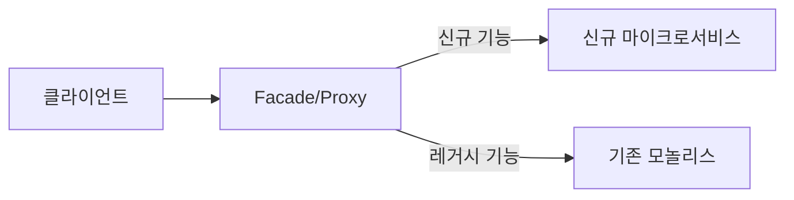

**왜 Big Bang 전환이 실패하는가**: 대규모 리팩토링에 6~12개월이 걸리는 동안 비즈니스는 새로운 기능을 계속 요구합니다. 절반만 전환된 상태에서 두 시스템의 데이터 일관성을 맞추는 비용이 폭발합니다. Strangler Fig는 "가장 자주 변경되고, 독립 확장이 필요하고, 장애 격리가 필요한 서비스"부터 하나씩 분리합니다.

**Spring Boot 구현 — Facade 패턴으로 점진적 전환**:

```java
// StranglerFigFilter.java — 신규 서비스로 점진적 트래픽 전환
@Component
@Order(1)
public class StranglerFigFilter implements WebFilter {

    private final FeatureToggleService featureToggle;
    private final WebClient newPaymentClient;

    @Override
    public Mono<Void> filter(ServerWebExchange exchange, WebFilterChain chain) {
        String path = exchange.getRequest().getPath().value();

        // Feature toggle: 결제 API를 신규 서비스로 전환 여부 확인
        if (path.startsWith("/api/payments") && featureToggle.isEnabled("new-payment-service")) {
            // 신규 마이크로서비스로 라우팅
            return routeToNewService(exchange, newPaymentClient);
        }

        // 아직 전환 안 된 경로는 기존 모놀리스로
        return chain.filter(exchange);
    }

    private Mono<Void> routeToNewService(ServerWebExchange exchange, WebClient client) {
        return client.method(exchange.getRequest().getMethod())
            .uri(exchange.getRequest().getURI())
            .headers(h -> h.addAll(exchange.getRequest().getHeaders()))
            .body(exchange.getRequest().getBody(), DataBuffer.class)
            .retrieve()
            .bodyToMono(byte[].class)
            .flatMap(body -> {
                exchange.getResponse().getHeaders().setContentType(MediaType.APPLICATION_JSON);
                return exchange.getResponse().writeWith(
                    Mono.just(exchange.getResponse().bufferFactory().wrap(body))
                );
            });
    }
}
```

---

## 2. 서비스 간 통신 — 동기 vs 비동기

### 2-1. 동기 통신: REST vs gRPC — 내부 메커니즘 비교

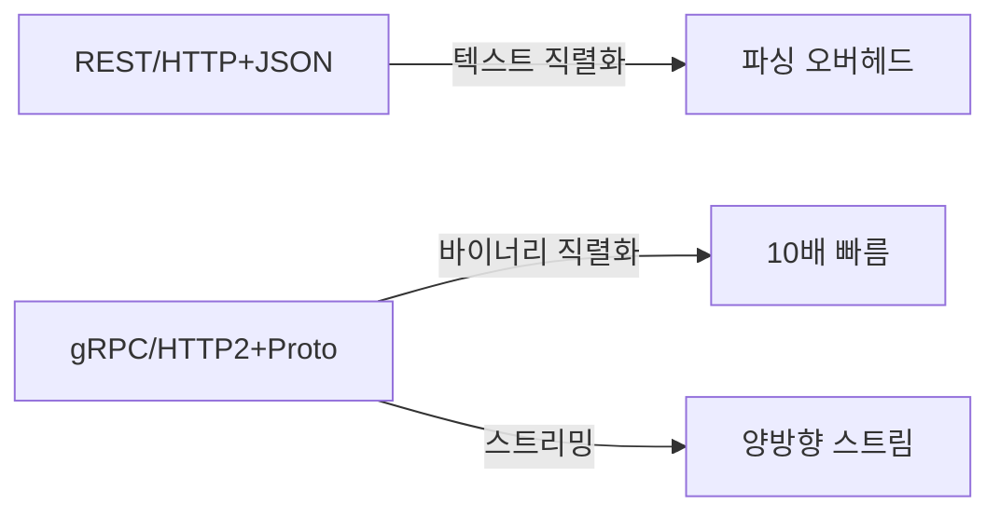

**왜 gRPC가 내부 통신에 더 빠른가**:

JSON은 사람이 읽을 수 있는 텍스트 포맷입니다. `{"orderId":"abc123","amount":50000}`를 파싱하려면 바이트 스트림을 문자열로 해석하고, key-value를 추출하고, 타입을 추론해야 합니다. Protobuf는 필드 번호와 와이어 타입을 바이트로 인코딩합니다. 스키마를 미리 알기 때문에 파싱 없이 메모리에 직접 매핑합니다. 크기는 JSON 대비 30~70% 작고, 파싱 속도는 5~10배 빠릅니다.

HTTP/1.1은 요청당 TCP 연결을 맺거나 Keep-Alive로 재사용하지만 헤더 압축이 없습니다. HTTP/2는 단일 연결에서 다수 스트림을 다중화(Multiplexing)하고, HPACK으로 헤더를 압축합니다. 내부 서비스가 초당 수만 건 통신하면 이 차이가 레이턴시와 CPU 비용에 직접 나타납니다.

**Protobuf 서비스 정의와 Spring Boot 구현**:

```protobuf
// order.proto
syntax = "proto3";
package order;

option java_multiple_files = true;
option java_package = "com.example.order.grpc";

service OrderService {
  rpc CreateOrder(CreateOrderRequest) returns (OrderResponse);
  rpc GetOrder(GetOrderRequest) returns (OrderResponse);
  // 서버 스트리밍: 대용량 주문 목록을 페이지 없이 스트리밍
  rpc ListOrders(ListOrdersRequest) returns (stream OrderResponse);
  // 클라이언트 스트리밍: 배치 주문 생성
  rpc BulkCreateOrders(stream CreateOrderRequest) returns (BulkOrderResponse);
}

message CreateOrderRequest {
  string user_id = 1;
  repeated OrderItem items = 2;
  string delivery_address = 3;
  PaymentMethod payment_method = 4;
}

message OrderItem {
  string product_id = 1;
  int32 quantity = 2;
  int64 unit_price = 3;
}

message OrderResponse {
  string order_id = 1;
  string status = 2;
  int64 total_amount = 3;
  int64 created_at_epoch = 4; // epoch millis — Timestamp보다 파싱 빠름
}

enum PaymentMethod {
  PAYMENT_METHOD_UNSPECIFIED = 0;
  CREDIT_CARD = 1;
  BANK_TRANSFER = 2;
  VIRTUAL_ACCOUNT = 3;
}
```

```java
// OrderGrpcService.java — gRPC 서버 구현
@GrpcService
public class OrderGrpcService extends OrderServiceGrpc.OrderServiceImplBase {

    private final OrderDomainService orderDomainService;

    @Override
    public void createOrder(CreateOrderRequest request,
                            StreamObserver<OrderResponse> responseObserver) {
        try {
            Order order = orderDomainService.create(toCommand(request));
            responseObserver.onNext(toProto(order));
            responseObserver.onCompleted();
        } catch (InsufficientStockException e) {
            // gRPC Status 코드로 에러 전파 — HTTP 상태 코드와 매핑됨
            responseObserver.onError(
                Status.FAILED_PRECONDITION
                    .withDescription("재고 부족: " + e.getProductId())
                    .withCause(e)
                    .asRuntimeException()
            );
        }
    }

    @Override
    public void listOrders(ListOrdersRequest request,
                           StreamObserver<OrderResponse> responseObserver) {
        // 서버 스트리밍: DB 커서로 대용량 데이터를 메모리 없이 전송
        orderDomainService.streamByUserId(request.getUserId(), order -> {
            responseObserver.onNext(toProto(order));
        });
        responseObserver.onCompleted();
    }
}
```

```java
// OrderGrpcClient.java — gRPC 클라이언트
@Service
public class OrderGrpcClient {

    @GrpcClient("order-service") // spring-grpc가 채널 풀 자동 관리
    private OrderServiceGrpc.OrderServiceBlockingStub blockingStub;

    @GrpcClient("order-service")
    private OrderServiceGrpc.OrderServiceStub asyncStub;

    public OrderResponse getOrder(String orderId) {
        return blockingStub
            .withDeadlineAfter(500, TimeUnit.MILLISECONDS) // 타임아웃 필수
            .getOrder(GetOrderRequest.newBuilder().setOrderId(orderId).build());
    }
}
```

### 2-2. 비동기 통신: Kafka vs RabbitMQ — 언제 어떤 것을 쓰는가

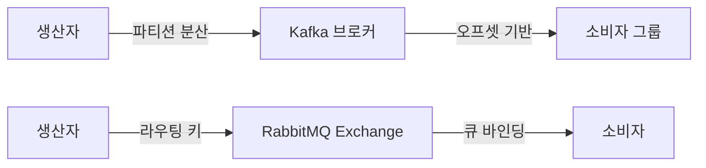

**Kafka의 내부 메커니즘**:

Kafka는 이벤트를 **디스크에 append-only로 저장**합니다. 소비자는 "오프셋"이라는 포인터로 어디까지 읽었는지 추적합니다. 소비자가 죽었다가 살아나도 오프셋부터 다시 읽으면 됩니다. 메시지를 소비해도 즉시 삭제하지 않고 보존 기간(기본 7일) 동안 유지합니다. 덕분에 다른 소비자 그룹이 같은 메시지를 독립적으로 처리할 수 있습니다.

파티션이 Kafka 처리량의 핵심입니다. 토픽에 파티션이 3개이면 소비자 그룹에 최대 3개 인스턴스가 병렬로 처리합니다. 파티션 키(예: userId)로 특정 사용자의 주문은 항상 같은 파티션, 즉 같은 소비자에게 갑니다. 순서 보장이 파티션 단위로 이루어집니다.

**RabbitMQ의 내부 메커니즘**:

RabbitMQ는 **큐 기반 메시지 브로커**입니다. 메시지를 큐에 쌓고 소비자가 Ack를 보내면 삭제합니다. Exchange 타입(Direct, Fanout, Topic, Headers)으로 라우팅 규칙을 정의합니다. 복잡한 라우팅 로직(예: VIP 고객 주문은 우선 큐로, 일반 주문은 일반 큐로)이 필요하면 RabbitMQ가 Kafka보다 표현력이 높습니다.

| 기준 | Kafka | RabbitMQ |
|------|-------|----------|
| 처리량 | 초당 수백만 건 | 초당 수만 건 |
| 메시지 보존 | 디스크 보존 (재처리 가능) | Ack 후 삭제 |
| 순서 보장 | 파티션 단위 | 큐 단위 |
| 라우팅 복잡도 | 낮음 | 높음 (Exchange 유형) |
| 재처리 | 오프셋 리셋으로 간단 | DLQ 필요 |
| 적합 사례 | 이벤트 로그, 대용량 스트림 | 작업 큐, 복잡 라우팅 |

**Spring Kafka 구현**:

```java
// OrderEventProducer.java
@Service
@Slf4j
public class OrderEventProducer {

    private final KafkaTemplate<String, OrderEvent> kafkaTemplate;

    // 파티션 키를 userId로 설정: 같은 사용자 주문은 순서 보장
    public void publishOrderCreated(Order order) {
        OrderCreatedEvent event = OrderCreatedEvent.builder()
            .orderId(order.getId())
            .userId(order.getUserId())
            .totalAmount(order.getTotalAmount())
            .items(order.getItems().stream().map(this::toEventItem).toList())
            .occurredAt(Instant.now())
            .build();

        ProducerRecord<String, OrderEvent> record =
            new ProducerRecord<>("order-events", order.getUserId(), event); // userId가 파티션 키

        kafkaTemplate.send(record)
            .whenComplete((result, ex) -> {
                if (ex != null) {
                    log.error("Failed to publish OrderCreated event for orderId={}", order.getId(), ex);
                    // 실패 시 Outbox 패턴으로 저장 (2-3절 참고)
                } else {
                    log.info("Published OrderCreated: orderId={}, partition={}, offset={}",
                        order.getId(),
                        result.getRecordMetadata().partition(),
                        result.getRecordMetadata().offset());
                }
            });
    }
}
```

```java
// PaymentEventConsumer.java
@Component
@Slf4j
public class PaymentEventConsumer {

    private final PaymentService paymentService;

    @KafkaListener(
        topics = "order-events",
        groupId = "payment-service",
        containerFactory = "kafkaListenerContainerFactory"
    )
    public void handleOrderCreated(
            @Payload OrderCreatedEvent event,
            @Header(KafkaHeaders.RECEIVED_PARTITION) int partition,
            @Header(KafkaHeaders.OFFSET) long offset,
            Acknowledgment ack) {

        log.info("Processing OrderCreated: orderId={}, partition={}, offset={}",
            event.getOrderId(), partition, offset);

        try {
            paymentService.initiatePayment(event.getOrderId(), event.getTotalAmount());
            ack.acknowledge(); // 성공 시에만 Ack — 실패하면 재처리
        } catch (DuplicatePaymentException e) {
            // 멱등성: 이미 처리된 이벤트는 Ack만 보내고 통과
            log.warn("Duplicate payment event ignored: orderId={}", event.getOrderId());
            ack.acknowledge();
        } catch (Exception e) {
            log.error("Failed to process OrderCreated: orderId={}", event.getOrderId(), e);
            // Ack 안 보내면 같은 파티션/오프셋 재처리
            // 영구 실패는 DLQ(Dead Letter Queue)로 이동
            throw e;
        }
    }
}
```

### 2-3. 언제 동기, 언제 비동기를 선택하는가

동기(REST/gRPC)는 "즉각적인 응답이 비즈니스 흐름에 필수인 경우"에 씁니다. 상품 재고 확인 후 주문 가능 여부를 사용자에게 즉시 알려야 한다면 동기 호출이 맞습니다. 비동기(Kafka/RabbitMQ)는 "처리 결과가 지금 당장 필요하지 않고, 느슨한 결합이 중요한 경우"에 씁니다. 주문 완료 후 이메일 알림, 포인트 적립, 분석 데이터 저장은 주문 성공과 독립적으로 처리할 수 있습니다.

**결정 매트릭스**:

| 조건 | 선택 |
|------|------|
| 응답을 즉시 반환해야 한다 | 동기 |
| 호출 대상이 다운돼도 서비스가 계속돼야 한다 | 비동기 |
| 여러 소비자가 같은 이벤트를 처리해야 한다 | 비동기 |
| 처리 순서가 중요하고 복잡한 보상 로직이 필요하다 | 비동기(Saga) |
| 데이터 조회(Read)가 목적이다 | 동기 |

---

## 3. 서비스 디스커버리 — 동적 위치 파악

### 3-1. 왜 필요한가 — 동적 IP 문제

쿠버네티스나 ECS 같은 환경에서 Pod/Task가 재시작될 때마다 IP가 바뀝니다. Auto Scaling으로 인스턴스가 추가/제거됩니다. 정적 IP 설정 파일로는 이 변화를 따라갈 수 없습니다. 서비스 디스커버리는 각 서비스가 자신의 위치를 레지스트리에 등록하고, 다른 서비스가 이름으로 조회하도록 합니다.

### 3-2. 클라이언트 사이드 vs 서버 사이드 디스커버리

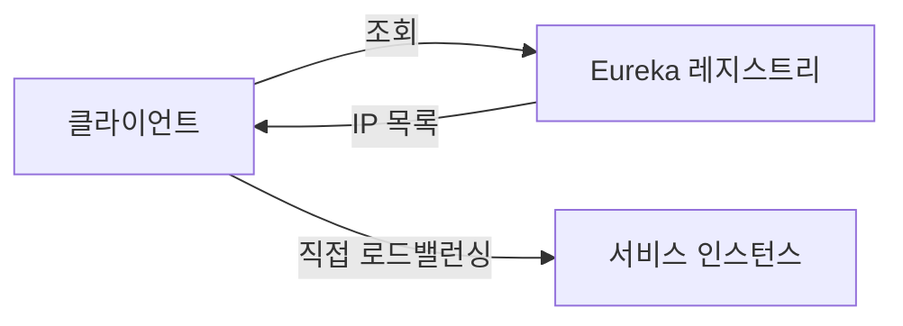

**클라이언트 사이드 디스커버리 (Spring Cloud Eureka)**:

클라이언트가 Eureka 레지스트리에서 인스턴스 목록을 가져와 직접 로드밸런싱합니다. Spring Cloud LoadBalancer가 Round Robin, Weighted, Zone-Aware 전략을 지원합니다.

**헬스 체크 내부 메커니즘**: Eureka 클라이언트는 기본 30초마다 Heartbeat를 서버에 보냅니다. 서버는 90초(기본 3 * 30초) 이상 Heartbeat가 없으면 해당 인스턴스를 레지스트리에서 제거합니다. Spring Boot Actuator의 `/actuator/health` 엔드포인트가 헬스 정보를 제공합니다.

```java
// EurekaServerApplication.java
@SpringBootApplication
@EnableEurekaServer
public class EurekaServerApplication {
    public static void main(String[] args) {
        SpringApplication.run(EurekaServerApplication.class, args);
    }
}
```

```yaml
# order-service application.yml
spring:
  application:
    name: order-service

eureka:
  client:
    service-url:
      defaultZone: http://eureka-primary:8761/eureka/,http://eureka-secondary:8762/eureka/
    registry-fetch-interval-seconds: 5   # 기본 30초 → 5초로 단축 (빠른 반영)
    instance-info-replication-interval-seconds: 5
  instance:
    prefer-ip-address: true
    lease-renewal-interval-in-seconds: 10    # Heartbeat 주기
    lease-expiration-duration-in-seconds: 30 # 이 시간 안에 Heartbeat 없으면 제거
    health-check-url-path: /actuator/health
    metadata-map:
      version: "2.1.0"
      zone: "ap-northeast-2a"  # Zone-Aware 로드밸런싱용
```

```java
// WebClientConfig.java — Spring Cloud LoadBalancer 연동
@Configuration
public class WebClientConfig {

    @Bean
    @LoadBalanced // 이 어노테이션 하나로 Eureka 기반 로드밸런싱 활성화
    public WebClient.Builder loadBalancedWebClientBuilder() {
        return WebClient.builder()
            .defaultHeader(HttpHeaders.CONTENT_TYPE, MediaType.APPLICATION_JSON_VALUE);
    }
}

// OrderService.java — 서비스 이름으로 호출
@Service
public class OrderService {

    private final WebClient.Builder webClientBuilder;

    public PaymentResult requestPayment(String orderId, long amount) {
        // "payment-service"라는 이름을 Eureka에서 실제 IP:Port로 자동 변환
        // 인스턴스가 3대이면 Round Robin으로 자동 분산
        return webClientBuilder.build()
            .post()
            .uri("http://payment-service/internal/payments")
            .bodyValue(new PaymentRequest(orderId, amount))
            .retrieve()
            .onStatus(HttpStatusCode::is5xxServerError, response ->
                Mono.error(new PaymentServiceException("Payment service error")))
            .bodyToMono(PaymentResult.class)
            .timeout(Duration.ofMillis(800))
            .block();
    }
}
```

**서버 사이드 디스커버리 (Kubernetes DNS)**:

K8s에서는 클라이언트가 레지스트리를 직접 조회하지 않습니다. `payment-service.default.svc.cluster.local`이라는 DNS 이름을 조회하면 CoreDNS가 Service IP(ClusterIP)로 변환합니다. kube-proxy가 iptables/IPVS 규칙으로 실제 Pod에 로드밸런싱합니다. 애플리케이션 코드에 디스커버리 로직이 전혀 없습니다.

```yaml
# payment-service K8s Service 정의
apiVersion: v1
kind: Service
metadata:
  name: payment-service
  namespace: default
spec:
  selector:
    app: payment-service
  ports:
    - port: 8080
      targetPort: 8080
  type: ClusterIP

---
# Readiness Probe: 준비 안 된 Pod에 트래픽 안 보냄
apiVersion: apps/v1
kind: Deployment
metadata:
  name: payment-service
spec:
  replicas: 3
  template:
    spec:
      containers:
        - name: payment-service
          image: payment-service:2.1.0
          readinessProbe:
            httpGet:
              path: /actuator/health/readiness
              port: 8080
            initialDelaySeconds: 10
            periodSeconds: 5
            failureThreshold: 3  # 3회 실패하면 트래픽 차단
          livenessProbe:
            httpGet:
              path: /actuator/health/liveness
              port: 8080
            initialDelaySeconds: 30
            periodSeconds: 10
```

---

## 4. API Gateway — 단일 진입점의 내부 구조

### 4-1. 왜 API Gateway가 필요한가

인증 검증 로직이 10개 서비스에 각각 있다면, JWT 시크릿 키가 바뀌거나 인증 알고리즘이 변경될 때 10개 서비스를 동시에 배포해야 합니다. Rate Limiting이 각 서비스에 있다면 DDoS가 이미 내부 서비스에 도달한 뒤에야 차단합니다. Gateway는 "공통 관심사를 한 곳에서" 처리합니다.

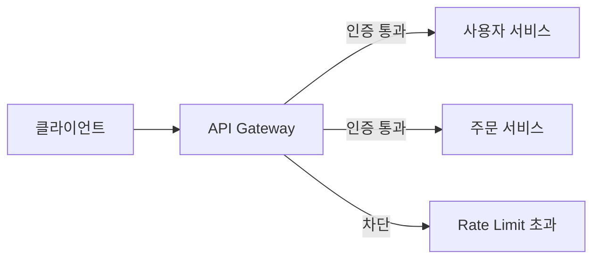

### 4-2. Spring Cloud Gateway 내부 동작

Spring Cloud Gateway는 Netty 기반 비동기 리액티브 서버입니다. 요청이 들어오면 **Predicate → Filter Chain → Proxy → Response Filter** 순서로 처리합니다. Filter는 Pre(요청 전 처리)와 Post(응답 후 처리)로 나뉩니다. `GlobalFilter`는 모든 라우트에, `GatewayFilter`는 특정 라우트에만 적용됩니다.

```yaml
# application.yml
spring:
  cloud:
    gateway:
      default-filters:
        - name: RequestRateLimiter
          args:
            redis-rate-limiter.replenishRate: 1000   # 초당 토큰 보충량
            redis-rate-limiter.burstCapacity: 2000   # 순간 최대 허용
            redis-rate-limiter.requestedTokens: 1
            key-resolver: "#{@userKeyResolver}"      # 사용자별 Rate Limit
        - AddResponseHeader=X-Gateway-Version, 2.0
        - name: CircuitBreaker
          args:
            name: defaultCircuitBreaker
            fallbackUri: forward:/fallback/default

      routes:
        - id: order-service
          uri: lb://order-service
          predicates:
            - Path=/api/v1/orders/**
            - Header=X-API-Version, v1
          filters:
            - StripPrefix=2
            - name: Retry
              args:
                retries: 3
                statuses: BAD_GATEWAY,SERVICE_UNAVAILABLE
                methods: GET  # GET만 재시도 (POST는 멱등성 없음)
                backoff:
                  firstBackoff: 50ms
                  maxBackoff: 500ms
                  factor: 2

        - id: payment-service
          uri: lb://payment-service
          predicates:
            - Path=/api/v1/payments/**
          filters:
            - name: CircuitBreaker
              args:
                name: paymentCircuitBreaker
                fallbackUri: forward:/fallback/payment
```

```java
// JwtAuthenticationFilter.java — Global Pre-Filter
@Component
@Slf4j
public class JwtAuthenticationFilter implements GlobalFilter, Ordered {

    private final JwtTokenProvider jwtProvider;
    private final Set<String> publicPaths = Set.of("/api/auth/", "/actuator/health");

    @Override
    public Mono<Void> filter(ServerWebExchange exchange, GatewayFilterChain chain) {
        String path = exchange.getRequest().getPath().value();

        // 공개 경로는 인증 건너뜀
        if (publicPaths.stream().anyMatch(path::startsWith)) {
            return chain.filter(exchange);
        }

        String authHeader = exchange.getRequest().getHeaders().getFirst(HttpHeaders.AUTHORIZATION);

        if (authHeader == null || !authHeader.startsWith("Bearer ")) {
            return unauthorized(exchange, "Missing Authorization header");
        }

        String token = authHeader.substring(7);

        return jwtProvider.validate(token)
            .flatMap(claims -> {
                // 검증된 사용자 정보를 헤더에 추가 → 다운스트림 서비스가 신뢰하고 사용
                ServerHttpRequest mutatedRequest = exchange.getRequest().mutate()
                    .header("X-User-Id", claims.getSubject())
                    .header("X-User-Roles", String.join(",", claims.get("roles", List.class)))
                    .header("X-Correlation-Id", UUID.randomUUID().toString())
                    .build();

                return chain.filter(exchange.mutate().request(mutatedRequest).build());
            })
            .onErrorResume(JwtException.class, e -> unauthorized(exchange, "Invalid token: " + e.getMessage()));
    }

    @Override
    public int getOrder() {
        return -100; // 가장 먼저 실행
    }

    private Mono<Void> unauthorized(ServerWebExchange exchange, String message) {
        exchange.getResponse().setStatusCode(HttpStatus.UNAUTHORIZED);
        exchange.getResponse().getHeaders().setContentType(MediaType.APPLICATION_JSON);
        byte[] body = ("{\"error\":\"" + message + "\"}").getBytes(StandardCharsets.UTF_8);
        DataBuffer buffer = exchange.getResponse().bufferFactory().wrap(body);
        return exchange.getResponse().writeWith(Mono.just(buffer));
    }
}
```

```java
// UserKeyResolver.java — 사용자별 Rate Limiting
@Bean
public KeyResolver userKeyResolver() {
    return exchange -> {
        String userId = exchange.getRequest().getHeaders().getFirst("X-User-Id");
        if (userId != null) {
            return Mono.just(userId); // 사용자별 Rate Limit
        }
        // 인증 전 요청은 IP 기반
        String ip = Objects.requireNonNull(exchange.getRequest().getRemoteAddress())
            .getAddress().getHostAddress();
        return Mono.just("ip:" + ip);
    };
}
```

---

## 5. Circuit Breaker — 장애 전파 차단의 내부 상태 머신

### 5-1. 왜 Circuit Breaker가 없으면 카스케이딩 장애가 발생하는가

결제 서비스 응답 시간이 갑자기 3초로 늘었습니다. 주문 서비스의 스레드 풀이 100개라고 가정합니다. 초당 50개 요청이 오면, 각 요청이 결제 서비스 응답을 3초 대기합니다. 2초 후 이미 100개 스레드가 모두 점유됩니다. 이후 들어오는 주문 요청은 스레드를 얻지 못해 타임아웃됩니다. 결제 서비스 느려짐 하나가 주문 서비스 완전 장애로 번집니다. 이것이 **카스케이딩 장애(Cascading Failure)**입니다.

Circuit Breaker는 결제 서비스가 느려지기 시작하면 즉시 에러를 반환(Fallback)합니다. 스레드가 대기하지 않으므로 주문 서비스는 살아있습니다.

### 5-2. Resilience4j 상태 머신

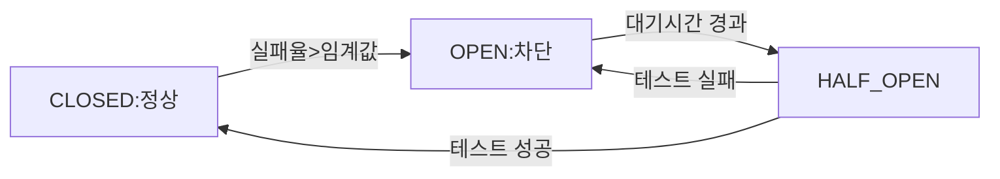

**CLOSED 상태**: 모든 요청을 통과시킵니다. 슬라이딩 윈도우(마지막 N건 또는 최근 N초)에서 실패율을 계산합니다. 실패율이 임계값(예: 50%)을 초과하면 OPEN으로 전환합니다.

**OPEN 상태**: 모든 요청을 즉시 `CallNotPermittedException`으로 차단합니다. 다운스트림 서비스에 요청을 전혀 보내지 않습니다. `waitDurationInOpenState`(기본 60초) 후 HALF_OPEN으로 전환합니다.

**HALF_OPEN 상태**: `permittedNumberOfCallsInHalfOpenState`만큼 테스트 요청을 허용합니다. 테스트 성공률이 임계값 이상이면 CLOSED, 아니면 다시 OPEN으로 전환합니다.

```java
// CircuitBreakerConfig.java
@Configuration
public class ResilienceConfig {

    @Bean
    public CircuitBreakerRegistry circuitBreakerRegistry() {
        CircuitBreakerConfig config = CircuitBreakerConfig.custom()
            // 슬라이딩 윈도우 타입: COUNT_BASED(건수) or TIME_BASED(시간)
            .slidingWindowType(CircuitBreakerConfig.SlidingWindowType.COUNT_BASED)
            .slidingWindowSize(20)               // 최근 20건 기준
            .minimumNumberOfCalls(10)            // 최소 10건 이후부터 상태 전환 검토
            .failureRateThreshold(50.0f)         // 50% 실패 시 OPEN
            .slowCallRateThreshold(80.0f)        // 80% 느린 호출 시 OPEN
            .slowCallDurationThreshold(Duration.ofSeconds(2)) // 2초 이상이면 느린 호출
            .waitDurationInOpenState(Duration.ofSeconds(30))  // OPEN 유지 시간
            .permittedNumberOfCallsInHalfOpenState(5)         // HALF_OPEN 테스트 건수
            .automaticTransitionFromOpenToHalfOpenEnabled(true)
            .recordExceptions(IOException.class, TimeoutException.class)
            .ignoreExceptions(BusinessException.class) // 비즈니스 예외는 실패로 카운트 안 함
            .build();

        return CircuitBreakerRegistry.of(config);
    }

    @Bean
    public BulkheadRegistry bulkheadRegistry() {
        // Bulkhead: 동시 호출 수 제한으로 스레드 소진 방지
        BulkheadConfig bulkheadConfig = BulkheadConfig.custom()
            .maxConcurrentCalls(25)              // 최대 동시 호출 25개
            .maxWaitDuration(Duration.ofMillis(100)) // 100ms 대기 후 거부
            .build();

        return BulkheadRegistry.of(bulkheadConfig);
    }
}
```

```java
// PaymentServiceClient.java — CB + Bulkhead + Retry + TimeLimiter 조합
@Service
@Slf4j
public class PaymentServiceClient {

    private final CircuitBreaker circuitBreaker;
    private final Bulkhead bulkhead;
    private final Retry retry;
    private final TimeLimiter timeLimiter;
    private final WebClient webClient;

    public PaymentServiceClient(CircuitBreakerRegistry cbRegistry,
                                BulkheadRegistry bhRegistry,
                                RetryRegistry retryRegistry) {
        this.circuitBreaker = cbRegistry.circuitBreaker("payment-service");
        this.bulkhead = bhRegistry.bulkhead("payment-service");

        RetryConfig retryConfig = RetryConfig.custom()
            .maxAttempts(3)
            .waitDuration(Duration.ofMillis(200))
            .exponentialBackoff(2, Duration.ofSeconds(2)) // 지수 백오프
            .retryOnException(e -> e instanceof WebClientException && isRetryable(e))
            .build();
        this.retry = retryRegistry.retry("payment-service", retryConfig);

        TimeLimiterConfig tlConfig = TimeLimiterConfig.custom()
            .timeoutDuration(Duration.ofMillis(800)) // 전체 타임아웃
            .build();
        this.timeLimiter = TimeLimiter.of(tlConfig);

        // Circuit Breaker 이벤트 모니터링
        circuitBreaker.getEventPublisher()
            .onStateTransition(event ->
                log.warn("CircuitBreaker state changed: {} -> {}",
                    event.getStateTransition().getFromState(),
                    event.getStateTransition().getToState()));
    }

    public CompletableFuture<PaymentResult> charge(PaymentRequest request) {
        // 적용 순서: TimeLimiter → CircuitBreaker → Bulkhead → Retry
        // 바깥에서 안쪽으로: 타임아웃이 가장 먼저 잡음
        Supplier<CompletableFuture<PaymentResult>> futureSupplier =
            () -> CompletableFuture.supplyAsync(() -> callPaymentApi(request));

        Callable<PaymentResult> decorated = TimeLimiter.decorateFutureSupplier(timeLimiter, futureSupplier);
        decorated = CircuitBreaker.decorateCallable(circuitBreaker, decorated);
        decorated = Bulkhead.decorateCallable(bulkhead, decorated);
        decorated = Retry.decorateCallable(retry, decorated);

        return CompletableFuture.supplyAsync(Try.ofCallable(decorated)
            .recover(CallNotPermittedException.class, e -> fallback(request, "Circuit open"))
            .recover(BulkheadFullException.class, e -> fallback(request, "Bulkhead full"))
            .recover(TimeoutException.class, e -> fallback(request, "Timeout"))
            ::get);
    }

    private PaymentResult fallback(PaymentRequest request, String reason) {
        log.warn("Payment fallback triggered: orderId={}, reason={}", request.getOrderId(), reason);
        // 결제 요청을 Outbox에 저장 → 비동기 재처리
        paymentOutboxRepository.save(PaymentOutbox.pending(request));
        return PaymentResult.deferred(request.getOrderId());
    }
}
```

---

## 6. 분산 추적 — 세 서비스에 걸친 병목 5초 안에 찾기

### 6-1. 상관 ID(Correlation ID) 전파 메커니즘

분산 시스템에서 단일 요청이 게이트웨이 → 주문 → 결제 → 재고 서비스를 거칩니다. 각 서비스 로그가 별도 파일에 있습니다. "주문 API가 3초 걸렸다"는 장애 보고에서 병목이 어디인지 찾으려면 4개 서비스 로그를 연결해야 합니다. Correlation ID 없이 시각과 사용자 ID만으로 연결하면 수 시간이 걸립니다.

Trace ID가 전파되는 방식: 게이트웨이가 Trace ID를 생성하고 HTTP 헤더(`traceparent: 00-{traceId}-{spanId}-01`)에 담아 전달합니다. 각 서비스는 이 헤더를 읽어 자신의 Span을 생성하고, 하위 서비스 호출 시 동일한 Trace ID로 새 Span을 생성해 전달합니다. Zipkin/Jaeger가 이 Span들을 수집해 타임라인으로 시각화합니다.

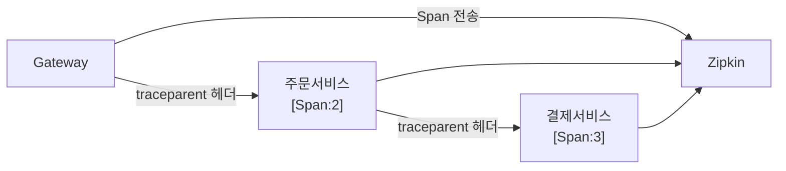

### 6-2. Micrometer Tracing + OpenTelemetry 구현

Spring Boot 3.x에서는 Spring Sleuth 대신 Micrometer Tracing + OpenTelemetry를 사용합니다. OpenTelemetry는 CNCF 표준으로, Zipkin/Jaeger/Grafana Tempo 등 다양한 백엔드와 호환됩니다.

```xml
<!-- pom.xml -->
<dependency>
    <groupId>io.micrometer</groupId>
    <artifactId>micrometer-tracing-bridge-otel</artifactId>
</dependency>
<dependency>
    <groupId>io.opentelemetry</groupId>
    <artifactId>opentelemetry-exporter-zipkin</artifactId>
</dependency>
<dependency>
    <groupId>io.micrometer</groupId>
    <artifactId>micrometer-registry-prometheus</artifactId>
</dependency>
```

```yaml
# application.yml
management:
  tracing:
    sampling:
      probability: 0.1   # 10% 샘플링 (프로덕션)
      # 오류 요청은 항상 100% 샘플링하려면 커스텀 Sampler 필요
  zipkin:
    tracing:
      endpoint: http://zipkin:9411/api/v2/spans

logging:
  pattern:
    # traceId, spanId 자동 포함 — Loki/ELK에서 Trace ID로 로그 연결
    level: "%5p [${spring.application.name:},%X{traceId:-},%X{spanId:-}]"
```

```java
// OrderController.java — 자동 계측
@RestController
@Slf4j
public class OrderController {

    private final OrderService orderService;
    private final MeterRegistry meterRegistry;
    private final Tracer tracer;

    @PostMapping("/orders")
    @Observed(name = "order.create", contextualName = "createOrder") // 자동 Span 생성
    public ResponseEntity<OrderResponse> createOrder(@RequestBody OrderRequest request) {
        // 로그에 자동으로 [traceId,spanId] 포함
        log.info("Creating order: userId={}", request.getUserId());

        // 커스텀 Span 속성 추가
        Span currentSpan = tracer.currentSpan();
        if (currentSpan != null) {
            currentSpan.tag("order.user_id", request.getUserId());
            currentSpan.tag("order.item_count", String.valueOf(request.getItems().size()));
        }

        // RED 메트릭: Rate, Errors, Duration 자동 기록
        return meterRegistry.timer("order.create.duration",
            "service", "order").record(() -> {
                Order order = orderService.create(request);
                return ResponseEntity.ok(toResponse(order));
        });
    }
}
```

```java
// TracingConfig.java — 에러 요청 100% 샘플링
@Configuration
public class TracingConfig {

    @Bean
    public Sampler customSampler() {
        return (traceId, name, spanContext, tags, parentContext) -> {
            // 에러 관련 태그가 있으면 항상 샘플링
            if (tags.containsKey("error") || name.contains("payment")) {
                return SamplingResult.create(SamplingDecision.RECORD_AND_SAMPLE,
                    Attributes.empty());
            }
            // 나머지는 10% 샘플링
            return Math.random() < 0.1
                ? SamplingResult.create(SamplingDecision.RECORD_AND_SAMPLE, Attributes.empty())
                : SamplingResult.drop();
        };
    }
}
```

```java
// W3C TraceContext 전파 — WebClient 자동 처리
@Bean
public WebClient tracingWebClient(WebClient.Builder builder, Tracer tracer) {
    return builder
        .filter((request, next) -> {
            // Micrometer Tracing이 W3C traceparent 헤더를 자동으로 주입
            // 수동으로 할 경우:
            Span span = tracer.currentSpan();
            if (span != null) {
                return next.exchange(ClientRequest.from(request)
                    .header("traceparent",
                        "00-" + span.context().traceId() +
                        "-" + span.context().spanId() + "-01")
                    .build());
            }
            return next.exchange(request);
        })
        .build();
}
```

---

## 7. Saga 패턴 — 분산 트랜잭션 없이 데이터 일관성

### 7-1. 왜 분산 트랜잭션(2PC)을 쓰지 않는가

2PC(Two-Phase Commit)는 코디네이터가 모든 참여자에게 "준비됐나?"를 묻고(Phase 1), 모두 OK이면 "커밋해"를 명령하는(Phase 2) 프로토콜입니다. 코디네이터가 Phase 2 명령을 보내다가 죽으면 일부 참여자는 커밋, 일부는 대기 상태로 남습니다. **코디네이터가 SPOF**가 됩니다. 참여자들이 모두 "준비됨" 상태로 Lock을 잡고 코디네이터를 기다리므로 처리량이 낮습니다. MSA 규모에서 수십 개 서비스에 2PC를 적용하면 성능과 가용성 모두 붕괴합니다.

### 7-2. 코레오그래피 vs 오케스트레이션

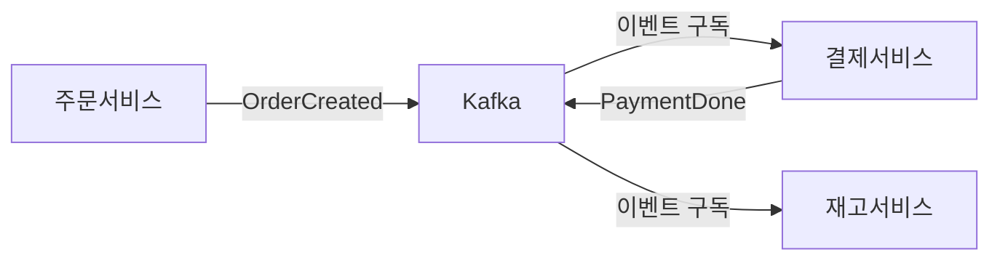

**코레오그래피(Choreography)**: 각 서비스가 이벤트를 발행하고 구독합니다. 중앙 오케스트레이터가 없습니다. 서비스들이 이벤트 체인으로 자율 조율합니다.

장점: 느슨한 결합, 단일 장애점 없음. 단점: 전체 흐름을 한눈에 보기 어렵고, 보상 트랜잭션 추적이 복잡합니다.

**오케스트레이션(Orchestration)**: 중앙 Saga Orchestrator가 각 서비스에 명령을 보내고 응답을 받아 다음 단계를 결정합니다.

장점: 전체 흐름이 한 곳에 있어 디버깅 쉬움. 단점: Orchestrator 자체가 복잡해지고 SPOF 위험.

```java
// OrderSaga.java — 오케스트레이션 방식 (Spring State Machine 사용)
@Component
@Slf4j
public class OrderSaga {

    private final PaymentServiceClient paymentClient;
    private final InventoryServiceClient inventoryClient;
    private final ShippingServiceClient shippingClient;
    private final SagaStateRepository sagaStateRepository;

    @Transactional
    public void execute(String orderId, OrderDetails details) {
        SagaState state = SagaState.begin(orderId);
        sagaStateRepository.save(state);

        try {
            // Step 1: 결제
            PaymentResult payment = paymentClient.charge(
                new PaymentRequest(orderId, details.getAmount()));
            state.recordStep("PAYMENT_COMPLETED", payment.getTransactionId());
            sagaStateRepository.save(state);

            // Step 2: 재고 차감
            InventoryResult inventory = inventoryClient.reserve(
                new ReserveRequest(orderId, details.getItems()));
            state.recordStep("INVENTORY_RESERVED", inventory.getReservationId());
            sagaStateRepository.save(state);

            // Step 3: 배송 생성
            ShippingResult shipping = shippingClient.createShipment(
                new ShipmentRequest(orderId, details.getAddress()));
            state.complete(shipping.getShipmentId());
            sagaStateRepository.save(state);

        } catch (PaymentException e) {
            // 결제 실패: 보상 없음 (아무것도 안 됨)
            state.fail("PAYMENT_FAILED", e.getMessage());
            sagaStateRepository.save(state);

        } catch (InventoryException e) {
            // 재고 부족: 결제 취소(보상 트랜잭션)
            log.warn("Inventory failed, compensating payment: orderId={}", orderId);
            safeCompensate(() -> paymentClient.refund(state.getStepId("PAYMENT_COMPLETED")));
            state.fail("INVENTORY_FAILED_PAYMENT_REFUNDED", e.getMessage());
            sagaStateRepository.save(state);

        } catch (ShippingException e) {
            // 배송 실패: 재고 복구 + 결제 취소
            log.warn("Shipping failed, compensating: orderId={}", orderId);
            safeCompensate(() -> inventoryClient.release(state.getStepId("INVENTORY_RESERVED")));
            safeCompensate(() -> paymentClient.refund(state.getStepId("PAYMENT_COMPLETED")));
            state.fail("SHIPPING_FAILED_ALL_COMPENSATED", e.getMessage());
            sagaStateRepository.save(state);
        }
    }

    private void safeCompensate(Runnable compensation) {
        try {
            compensation.run();
        } catch (Exception e) {
            // 보상 트랜잭션 실패 → 수동 처리 필요 → 알림 발송
            log.error("Compensation failed! Manual intervention required.", e);
            alertService.notifyCompensationFailure(e);
        }
    }
}
```

```java
// 코레오그래피 방식 — 결제 서비스의 이벤트 소비와 발행
@Component
public class PaymentSagaHandler {

    private final PaymentService paymentService;
    private final KafkaTemplate<String, Object> kafkaTemplate;

    @KafkaListener(topics = "order-events", groupId = "payment-saga")
    public void handleOrderCreated(OrderCreatedEvent event, Acknowledgment ack) {
        try {
            PaymentResult result = paymentService.charge(event.getOrderId(), event.getAmount());

            // 성공: PaymentCompleted 이벤트 발행 → 재고 서비스가 이를 구독
            kafkaTemplate.send("payment-events",
                event.getOrderId(),
                new PaymentCompletedEvent(event.getOrderId(), result.getTransactionId()));

            ack.acknowledge();

        } catch (InsufficientFundsException e) {
            // 실패: PaymentFailed 이벤트 → 주문 서비스가 이를 구독해 주문 취소
            kafkaTemplate.send("payment-events",
                event.getOrderId(),
                new PaymentFailedEvent(event.getOrderId(), e.getMessage()));

            ack.acknowledge(); // 실패도 Ack — 재처리 안 함
        }
    }
}
```

**언제 어느 방식을 선택하는가**:

| 기준 | 코레오그래피 | 오케스트레이션 |
|------|------------|--------------|
| 단계 수 | 3개 이하 | 4개 이상 |
| 흐름 복잡도 | 단순 | 복잡한 조건 분기 |
| 디버깅 용이성 | 낮음 | 높음 |
| 결합도 | 낮음 | 중간 |
| 적합 상황 | 이벤트 체인이 명확한 경우 | 복잡한 보상 로직 |

---

## 8. 이벤트 소싱 — 상태 대신 이력을 저장하는 이유

### 8-1. 왜 이벤트 소싱인가

전통적인 CRUD는 현재 상태만 저장합니다. 주문 테이블에 `status = CANCELLED`라고 기록되면, 언제 왜 취소됐는지, 중간에 어떤 상태 변화가 있었는지 알 수 없습니다. 감사(Audit) 로그를 별도로 만들더라도 종종 누락됩니다.

이벤트 소싱은 **상태 변화 이벤트를 append-only로 저장**합니다. 현재 상태는 이벤트를 순서대로 재처리(Replay)해 계산합니다. "주문이 생성됐다 → 결제됐다 → 부분 취소됐다 → 전체 취소됐다"라는 이벤트 이력이 진실입니다.

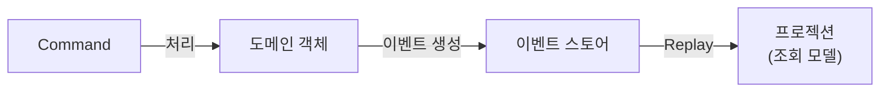

### 8-2. 이벤트 스토어, 프로젝션, 스냅샷

**이벤트 스토어**: `(aggregateId, version, eventType, payload, occurredAt)` 구조입니다. `version`이 낙관적 동시성 제어에 사용됩니다. 같은 aggregateId에 같은 version으로 저장하려 하면 충돌이 감지됩니다.

**프로젝션**: 이벤트를 읽어 조회에 최적화된 뷰를 만듭니다. CQRS의 Read 모델과 자연스럽게 결합됩니다. 프로젝션 로직이 바뀌면 처음부터 Replay해 새 뷰를 만들 수 있습니다. 이것이 이벤트 소싱의 강력한 장점입니다.

**스냅샷**: 이벤트가 수천 개 쌓이면 Replay가 느려집니다. N개 이벤트마다 현재 상태 스냅샷을 저장합니다. 조회 시 최신 스냅샷 이후 이벤트만 Replay합니다.

```java
// OrderAggregate.java — 이벤트 소싱 기반 집계
@Aggregate
public class OrderAggregate {

    @AggregateIdentifier
    private String orderId;
    private OrderStatus status;
    private List<OrderItem> items;
    private long totalAmount;
    private int version; // 낙관적 동시성 제어

    // Command Handler: 명령을 받아 이벤트를 발행
    @CommandHandler
    public OrderAggregate(CreateOrderCommand cmd) {
        // 비즈니스 유효성 검사
        if (cmd.getItems().isEmpty()) {
            throw new InvalidOrderException("Order must have at least one item");
        }
        // 이벤트 발행 — 상태 변경은 @EventSourcingHandler에서
        AggregateLifecycle.apply(new OrderCreatedEvent(
            cmd.getOrderId(),
            cmd.getUserId(),
            cmd.getItems(),
            calculateTotal(cmd.getItems())
        ));
    }

    @CommandHandler
    public void handle(CancelOrderCommand cmd) {
        if (status == OrderStatus.SHIPPED) {
            throw new InvalidOrderStateException("Cannot cancel shipped order");
        }
        AggregateLifecycle.apply(new OrderCancelledEvent(orderId, cmd.getReason()));
    }

    // Event Sourcing Handler: 이벤트로부터 상태 복원
    @EventSourcingHandler
    public void on(OrderCreatedEvent event) {
        this.orderId = event.getOrderId();
        this.status = OrderStatus.PENDING;
        this.items = event.getItems();
        this.totalAmount = event.getTotalAmount();
        this.version = 0;
    }

    @EventSourcingHandler
    public void on(OrderCancelledEvent event) {
        this.status = OrderStatus.CANCELLED;
        this.version++;
    }
}
```

```java
// OrderEventStore.java — 이벤트 스토어 구현
@Repository
public class OrderEventStore {

    private final JdbcTemplate jdbc;
    private final ObjectMapper objectMapper;

    @Transactional
    public void append(String aggregateId, int expectedVersion, List<DomainEvent> events) {
        // 낙관적 동시성 제어: 현재 버전 확인
        Integer currentVersion = jdbc.queryForObject(
            "SELECT MAX(version) FROM order_events WHERE aggregate_id = ?",
            Integer.class, aggregateId);

        int actualVersion = currentVersion != null ? currentVersion : -1;
        if (actualVersion != expectedVersion) {
            throw new OptimisticLockingException(
                "Version conflict: expected " + expectedVersion + " but was " + actualVersion);
        }

        // 이벤트 저장 (append-only)
        int version = expectedVersion;
        for (DomainEvent event : events) {
            jdbc.update(
                "INSERT INTO order_events(aggregate_id, version, event_type, payload, occurred_at) " +
                "VALUES (?, ?, ?, ?, ?)",
                aggregateId, ++version, event.getClass().getSimpleName(),
                serialize(event), Instant.now()
            );
        }
    }

    public List<DomainEvent> loadEvents(String aggregateId, int fromVersion) {
        return jdbc.query(
            "SELECT event_type, payload FROM order_events " +
            "WHERE aggregate_id = ? AND version > ? ORDER BY version ASC",
            (rs, rowNum) -> deserialize(rs.getString("event_type"), rs.getString("payload")),
            aggregateId, fromVersion
        );
    }
}
```

---

## 9. 데이터 일관성 — 최종 일관성과 Outbox 패턴

### 9-1. 왜 최종 일관성이 불가피한가

서비스별 독립 DB를 갖는 MSA에서 두 DB에 걸친 원자적 쓰기는 불가능합니다. 주문 DB에 주문을 저장하고, Kafka에 이벤트를 발행하는 두 작업은 원자적이지 않습니다. 주문 저장 성공 후 Kafka 발행 실패하면 결제 서비스는 이벤트를 받지 못합니다. 이것이 **이중 쓰기(Dual Write) 문제**입니다.

### 9-2. Outbox 패턴 — 이중 쓰기 없이 신뢰 가능한 이벤트 발행

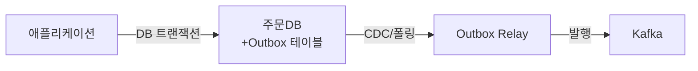

Outbox 패턴은 이벤트를 Kafka에 직접 발행하지 않고 **같은 DB 트랜잭션 안에 Outbox 테이블에 저장**합니다. 별도 프로세스(Relay)가 Outbox 테이블을 읽어 Kafka에 발행하고 발행 완료된 행을 지웁니다. 주문 저장과 이벤트 기록이 같은 트랜잭션이므로 원자성이 보장됩니다.

```java
// OrderService.java — Outbox 패턴
@Service
@Transactional
public class OrderService {

    private final OrderRepository orderRepository;
    private final OutboxRepository outboxRepository;

    public Order createOrder(CreateOrderCommand cmd) {
        Order order = Order.create(cmd);
        orderRepository.save(order); // 주문 저장

        // 같은 트랜잭션에서 Outbox에 이벤트 기록
        OrderCreatedEvent event = new OrderCreatedEvent(order.getId(), order.getUserId(),
            order.getTotalAmount());
        outboxRepository.save(OutboxEntry.builder()
            .aggregateId(order.getId())
            .aggregateType("ORDER")
            .eventType("OrderCreated")
            .payload(serialize(event))
            .status(OutboxStatus.PENDING)
            .createdAt(Instant.now())
            .build());

        // 이 시점에 트랜잭션이 커밋되면 order + outbox 모두 저장됨
        // Kafka 발행은 별도 Relay가 담당
        return order;
    }
}
```

```java
// OutboxRelay.java — Outbox 폴링 및 Kafka 발행
@Component
@Slf4j
public class OutboxRelay {

    private final OutboxRepository outboxRepository;
    private final KafkaTemplate<String, String> kafkaTemplate;

    @Scheduled(fixedDelay = 1000) // 1초마다 폴링
    @Transactional
    public void relay() {
        List<OutboxEntry> pending = outboxRepository
            .findTop100ByStatusOrderByCreatedAtAsc(OutboxStatus.PENDING);

        for (OutboxEntry entry : pending) {
            try {
                kafkaTemplate.send(
                    toTopicName(entry.getEventType()),
                    entry.getAggregateId(),
                    entry.getPayload()
                ).get(500, TimeUnit.MILLISECONDS); // 동기 확인

                entry.markPublished();
                outboxRepository.save(entry);

            } catch (Exception e) {
                log.error("Failed to publish outbox entry: id={}", entry.getId(), e);
                entry.incrementRetryCount();
                if (entry.getRetryCount() > 5) {
                    entry.markFailed(); // 수동 처리 필요
                    alertService.notifyOutboxFailure(entry);
                }
                outboxRepository.save(entry);
            }
        }
    }
}
```

**CDC(Change Data Capture) — Debezium으로 Outbox 폴링 대체**:

폴링 방식은 DB에 지속적인 SELECT 부하를 줍니다. Debezium은 MySQL binlog/PostgreSQL WAL을 읽어 DB 변경을 실시간으로 감지합니다. Outbox 테이블에 INSERT가 발생하면 Debezium이 즉시 Kafka에 발행합니다. 폴링 없이 레이턴시가 낮고 DB 부하가 없습니다.

```yaml
# Debezium Connector 설정
connector.class: io.debezium.connector.mysql.MySqlConnector
database.hostname: mysql
database.port: 3306
database.user: debezium
database.password: secret
database.include.list: orderdb
table.include.list: orderdb.outbox_entries
transforms: outbox
transforms.outbox.type: io.debezium.transforms.outbox.EventRouter
transforms.outbox.table.fields.additional.placement: aggregate_type:header,event_type:header
```

---

## 10. 테스팅 전략 — 계약 테스트와 통합 테스트 비용

### 10-1. 왜 통합 테스트가 MSA에서 비싼가

서비스가 10개일 때 전체 통합 테스트를 실행하려면 10개 서비스, Kafka, 10개 DB를 모두 띄워야 합니다. Docker Compose로 가능하지만 시작에 수 분이 걸리고, 어느 서비스가 먼저 뜨는지 순서에 따라 테스트가 불안정합니다. CI 파이프라인에서 매번 이 비용을 치릅니다. 서비스가 늘수록 비용은 선형 이상으로 증가합니다.

### 10-2. Spring Cloud Contract — 소비자 주도 계약 테스트

소비자(Consumer)가 "나는 이런 응답을 기대한다"는 계약(Contract)을 정의합니다. 공급자(Provider)가 이 계약을 자동 테스트로 검증합니다. 실제 서비스를 띄우지 않아도 계약이 지켜지는지 단위 테스트 수준의 속도로 확인합니다.

```groovy
// contracts/shouldReturnOrderById.groovy — 소비자가 작성
Contract.make {
    description "should return order by id"
    request {
        method GET()
        url "/internal/orders/order-123"
        headers {
            header("X-User-Id", "user-456")
        }
    }
    response {
        status OK()
        headers {
            contentType(applicationJson())
        }
        body([
            orderId: "order-123",
            status: "PENDING",
            totalAmount: 50000,
            userId: "user-456"
        ])
        bodyMatchers {
            jsonPath('$.orderId', byRegex('[a-z0-9-]+'))
            jsonPath('$.totalAmount', byType()) // 타입만 확인
        }
    }
}
```

```java
// OrderControllerContractTest.java — 공급자(Order 서비스)가 검증
@SpringBootTest(webEnvironment = SpringBootTest.WebEnvironment.MOCK)
@AutoConfigureMockMvc
@AutoConfigureJsonTesters
// 이 어노테이션이 groovy 계약을 읽어 자동으로 테스트 생성
public class OrderControllerContractTest extends ContractVerifierBase {

    @Autowired
    private WebApplicationContext context;

    @BeforeEach
    public void setup() {
        RestAssuredMockMvc.webAppContextSetup(context);
    }
}

// ContractVerifierBase.java — 테스트 베이스 클래스 (데이터 세팅)
public abstract class ContractVerifierBase {

    @MockBean
    private OrderRepository orderRepository;

    @BeforeEach
    public void setupData() {
        Order mockOrder = Order.builder()
            .id("order-123")
            .userId("user-456")
            .status(OrderStatus.PENDING)
            .totalAmount(50000L)
            .build();
        when(orderRepository.findById("order-123")).thenReturn(Optional.of(mockOrder));
    }
}
```

```java
// OrderClientStubTest.java — 소비자(Payment 서비스)가 Stub으로 테스트
@SpringBootTest
@AutoConfigureStubRunner(
    ids = "com.example:order-service:+:stubs:8080", // 자동 Stub 다운로드
    stubsMode = StubRunnerProperties.StubsMode.LOCAL
)
public class PaymentServiceOrderClientTest {

    @Autowired
    private OrderClient orderClient; // 실제 Order 서비스 없이 Stub으로 테스트

    @Test
    public void shouldGetOrderSummary() {
        OrderSummary summary = orderClient.getSummary("order-123");

        assertThat(summary.getOrderId()).isEqualTo("order-123");
        assertThat(summary.getTotalAmount()).isEqualTo(50000L);
        // Order 서비스가 없어도 계약 기반 Stub으로 테스트 통과
    }
}
```

### 10-3. 테스트 피라미드 전략

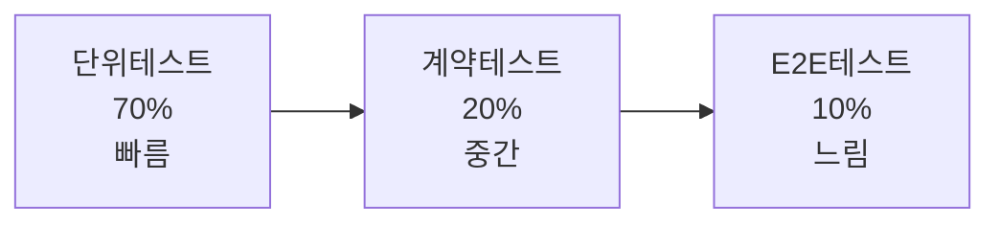

단위 테스트(70%)는 도메인 로직, 비즈니스 규칙을 검증합니다. 외부 의존성을 모두 Mock합니다. 수백 개가 수 초 안에 실행됩니다.

계약 테스트(20%)는 서비스 간 API 계약을 검증합니다. 실제 서비스 없이 Stub으로 실행합니다. 배포 전 계약 깨짐을 조기 발견합니다.

E2E 테스트(10%)는 핵심 사용자 시나리오만 커버합니다. 전체 시스템을 띄워 실행합니다. 비용이 비싸므로 행복한 경로(Happy Path)만 포함합니다.

---

## 11. 관측가능성 — 세 기둥(Pillars of Observability)

### 11-1. RED 메트릭 — 무엇을 측정하는가

Rate(처리율), Errors(오류율), Duration(응답 시간) 세 가지가 서비스 건강의 핵심입니다. "서비스가 살아있나"가 아니라 "서비스가 잘 일하고 있나"를 측정합니다.

```java
// MetricsConfig.java — Micrometer + Prometheus
@Configuration
public class MetricsConfig {

    @Bean
    public MeterRegistryCustomizer<MeterRegistry> metricsCommonTags(
            @Value("${spring.application.name}") String appName) {
        return registry -> registry.config()
            .commonTags("service", appName, "env", System.getenv("SPRING_PROFILES_ACTIVE"));
    }
}
```

```java
// OrderService.java — RED 메트릭 수동 기록
@Service
public class OrderService {

    private final MeterRegistry meterRegistry;
    private final Counter orderCreatedCounter;
    private final Counter orderFailedCounter;
    private final Timer orderCreateDuration;

    public OrderService(MeterRegistry meterRegistry) {
        this.meterRegistry = meterRegistry;
        this.orderCreatedCounter = Counter.builder("orders.created")
            .description("Total orders successfully created")
            .tag("version", "v2")
            .register(meterRegistry);
        this.orderFailedCounter = Counter.builder("orders.failed")
            .description("Total orders failed to create")
            .register(meterRegistry);
        this.orderCreateDuration = Timer.builder("orders.create.duration")
            .description("Order creation latency")
            .publishPercentiles(0.5, 0.95, 0.99) // P50, P95, P99
            .publishPercentileHistogram()
            .register(meterRegistry);
    }

    public Order createOrder(CreateOrderCommand cmd) {
        return orderCreateDuration.record(() -> {
            try {
                Order order = doCreateOrder(cmd);
                orderCreatedCounter.increment();
                // 주문 금액 분포 히스토그램
                meterRegistry.summary("orders.amount").record(order.getTotalAmount());
                return order;
            } catch (Exception e) {
                orderFailedCounter.increment(Tags.of("error", e.getClass().getSimpleName()));
                throw e;
            }
        });
    }
}
```

### 11-2. 구조화된 로깅 — 기계가 파싱할 수 있는 로그

```java
// logback-spring.xml — JSON 구조화 로그
// 의존성: logstash-logback-encoder
```

```xml
<configuration>
    <springProfile name="prod">
        <appender name="STDOUT" class="ch.qos.logback.core.ConsoleAppender">
            <encoder class="net.logstash.logback.encoder.LogstashEncoder">
                <includeMdcKeyName>traceId</includeMdcKeyName>
                <includeMdcKeyName>spanId</includeMdcKeyName>
                <customFields>{"service":"order-service","env":"prod"}</customFields>
            </encoder>
        </appender>
        <root level="INFO">
            <appender-ref ref="STDOUT"/>
        </root>
    </springProfile>
</configuration>
```

```java
// 구조화 로그 사용
@Slf4j
public class OrderService {

    public Order createOrder(CreateOrderCommand cmd) {
        // 잘못된 방식: 문자열 연결 — 파싱 불가
        // log.info("Creating order for user " + cmd.getUserId() + " amount " + cmd.getAmount());

        // 올바른 방식: 구조화된 Key-Value
        log.info("Creating order",
            kv("userId", cmd.getUserId()),
            kv("itemCount", cmd.getItems().size()),
            kv("totalAmount", cmd.getAmount()));

        // 이 로그는 JSON으로 출력됨:
        // {"timestamp":"...","level":"INFO","message":"Creating order",
        //  "userId":"user-123","itemCount":3,"totalAmount":50000,
        //  "traceId":"abc123","spanId":"def456","service":"order-service"}
    }
}
```

### 11-3. 세 기둥의 연결 — Logs, Metrics, Traces

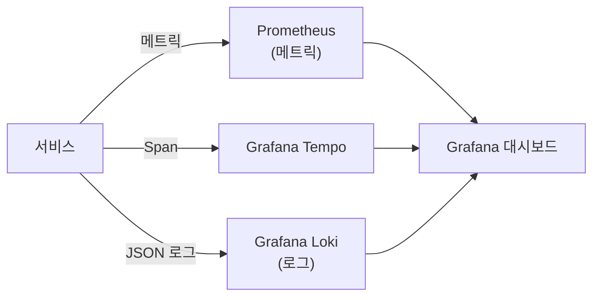

Grafana에서 P99 레이턴시 스파이크를 발견합니다(Metrics). 해당 시간대의 Trace ID를 클릭합니다(Traces). Trace의 특정 Span에서 에러 로그를 바로 확인합니다(Logs). 세 기둥이 연결되어 문제 진단 시간을 분에서 초로 단축합니다.

---

## 12. 극한 시나리오 — 결제 서비스가 블랙 프라이데이에 응답 불가

**상황**: 블랙 프라이데이 오후 8시, 결제 서비스 인스턴스 5개 중 4개가 DB 연결 풀 소진으로 응답 불가. Circuit Breaker가 OPEN 상태로 전환. 주문 요청이 초당 5,000건 들어오는 상황.

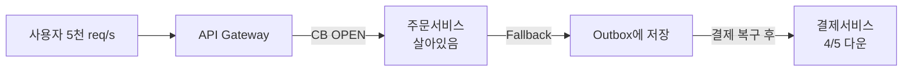

**방어 레이어별 동작**:

1. **Rate Limiter**: 초당 5,000건 중 설정된 임계값(초당 3,000건) 초과분은 Gateway에서 즉시 429 반환. 결제/주문 서비스에 도달하지 않음.

2. **Circuit Breaker**: 주문 서비스의 결제 클라이언트 Circuit Breaker가 OPEN 상태. 결제 서비스에 요청 보내지 않고 즉시 Fallback.

3. **Fallback + Outbox**: 결제 요청을 주문 DB의 Outbox 테이블에 `PENDING` 상태로 저장. 사용자에게는 "결제 처리 중입니다. 곧 완료 이메일을 보내드립니다" 응답.

4. **Saga 보상 준비**: Outbox Relay가 결제 서비스 복구를 감지하면(Circuit Breaker HALF_OPEN 테스트 성공) 지연된 결제를 순서대로 처리. 멱등성 키(orderId)로 중복 결제 방지.

5. **Auto Scaling**: K8s HPA가 CPU/메모리 메트릭 기반으로 결제 서비스 인스턴스를 5 → 20으로 자동 확장. 약 2분 소요.

6. **Observability**: Grafana 대시보드에서 Circuit Breaker OPEN 알람 → P99 레이턴시 → Zipkin Trace → 결제 서비스 DB 연결 풀 소진 로그까지 2분 내 근본 원인 파악.

**핵심 교훈**: 결제 서비스가 부분 장애 상황에서도 주문 서비스가 정상 응답을 유지하고, 복구 후 자동으로 밀린 결제를 처리했습니다. 이것이 MSA 장애 격리의 실질적 가치입니다.

---

## 면접 포인트 5가지

### Q1. 서비스 경계를 어떻게 결정하는가? Distributed Monolith를 어떻게 피하는가?

**표면 답변**: Bounded Context 기준으로 나눈다.

**깊은 답변**: Bounded Context는 같은 Ubiquitous Language가 통용되는 경계입니다. 실용적 판단 기준은 세 가지입니다. 첫째, 팀 소유권: 한 팀이 독립적으로 개발·배포·장애 대응할 수 있어야 합니다(Conway의 법칙). 둘째, 변경 빈도: 함께 자주 변경되는 코드는 같은 서비스에 있어야 합니다. 셋째, 트랜잭션 경계: 하나의 비즈니스 트랜잭션이 반드시 원자적이어야 하는 엔티티 묶음은 같은 서비스에 있어야 합니다.

Distributed Monolith 신호는 "기능 하나에 항상 3개 이상 서비스가 동시 배포되어야 한다"입니다. 이는 서비스가 논리적으로 분리됐을 뿐 실제로는 단단히 결합된 상태입니다. 해결책은 관련 서비스를 합치거나, 계약 인터페이스를 명확히 하고 비동기로 전환하는 것입니다.

### Q2. Saga 패턴에서 보상 트랜잭션 실패 시 어떻게 처리하는가?

**표면 답변**: 재시도한다.

**깊은 답변**: 보상 트랜잭션 자체가 실패하는 것은 심각한 데이터 불일치 상황입니다. 결제는 성공했으나 환불(보상) 실패 — 고객 돈이 증발하는 상황입니다. 재시도는 기본이지만 충분하지 않습니다.

설계 원칙은 보상 트랜잭션을 **멱등하게(Idempotent)** 만드는 것입니다. 환불 요청에 idempotencyKey(orderId + "\_refund")를 포함해 여러 번 시도해도 한 번만 실행됩니다. 재시도 후에도 실패하면 즉시 인간 개입 알람을 발송합니다(P0 알람). 해당 Saga 인스턴스를 `MANUAL_INTERVENTION_REQUIRED` 상태로 기록합니다. 운영팀이 수동으로 보상 처리하고 상태를 업데이트합니다. 이런 경우를 위한 운영 콘솔과 프로세스가 시스템 설계의 일부여야 합니다.

### Q3. Circuit Breaker의 임계값을 어떻게 설정하는가? 너무 민감하거나 둔하면?

**표면 답변**: 실패율 50%, 30초로 설정한다.

**깊은 답변**: 임계값은 측정에서 나옵니다. 우선 서비스의 정상 실패율 베이스라인을 측정합니다(예: 결제 서비스 정상 상태에서 네트워크 오류 0.5%). 임계값은 이 베이스라인의 10배 이상으로 설정합니다(5%이상이면 OPEN).

너무 민감한 경우: 일시적 네트워크 글리치에 Circuit이 OPEN되어 정상 서비스를 차단합니다. 해결: minimumNumberOfCalls를 높이고(최소 20건 이상), slidingWindowType을 TIME_BASED(60초)로 변경합니다.

너무 둔한 경우: 실제 장애에도 오래 요청을 보내 스레드 풀이 소진됩니다. slowCallDurationThreshold로 느린 호출을 실패로 카운트하는 것이 중요합니다. 완전 실패가 아닌 성능 저하도 감지해야 합니다.

OPEN 후 HALF_OPEN 대기시간은 다운스트림 서비스의 평균 복구 시간을 참고합니다. K8s Pod 재시작이 30초이면 waitDurationInOpenState를 45초로 설정합니다.

### Q4. Outbox 패턴과 CDC 중 어떤 것을 선택하는가?

**표면 답변**: CDC가 더 실시간이므로 CDC를 선택한다.

**깊은 답변**: 선택 기준은 운영 복잡도와 레이턴시 요구사항의 균형입니다.

Outbox 폴링은 구현이 단순합니다. 추가 인프라(Debezium, Kafka Connect)가 없습니다. 폴링 주기(1~5초) 만큼의 추가 레이턴시가 있습니다. DB에 SELECT 부하가 지속적으로 발생합니다. 소규모 시스템이나 팀이 Debezium을 운영할 역량이 없을 때 적합합니다.

CDC(Debezium)는 DB 바이너리 로그를 직접 읽어 밀리초 단위 레이턴시입니다. DB 부하가 없습니다. 단, Debezium 클러스터 운영, MySQL binlog 설정, 스키마 변경 시 Connector 재설정 등 운영 부담이 큽니다. 대용량 또는 레이턴시에 민감한 시스템에 적합합니다.

두 경우 모두 이벤트 발행의 At-Least-Once 보장이 핵심입니다. 소비자의 멱등성 처리가 필수입니다.

### Q5. MSA에서 분산 추적의 샘플링 전략을 어떻게 설계하는가?

**표면 답변**: 10% 샘플링한다.

**깊은 답변**: 고정 비율 샘플링(10%)은 단순하지만 문제가 있습니다. 에러 요청도 10%만 추적하면 근본 원인 분석에 실패합니다. 트래픽이 적은 시간대에는 샘플이 너무 적습니다.

**적응형 샘플링(Adaptive Sampling)** 전략:
- 기본: 1~10% 랜덤 샘플링
- 에러 상태(5xx): 100% 강제 샘플링
- 느린 요청(P99 초과): 100% 강제 샘플링
- 특정 사용자(VIP, 테스트 계정): 100% 강제 샘플링
- Tail-based 샘플링(OpenTelemetry Collector): 요청 완료 후 결과를 보고 샘플링 여부를 결정합니다. 에러이거나 느리면 전체 Span을 유지합니다.

Head-based(시작 시 결정) vs Tail-based(완료 후 결정)의 차이가 중요합니다. Head-based는 구현이 단순하지만 에러 요청을 놓칠 수 있습니다. Tail-based는 OpenTelemetry Collector에서 버퍼링이 필요하지만 중요한 Trace를 모두 잡습니다.

---

## MSA 도입 판단 기준

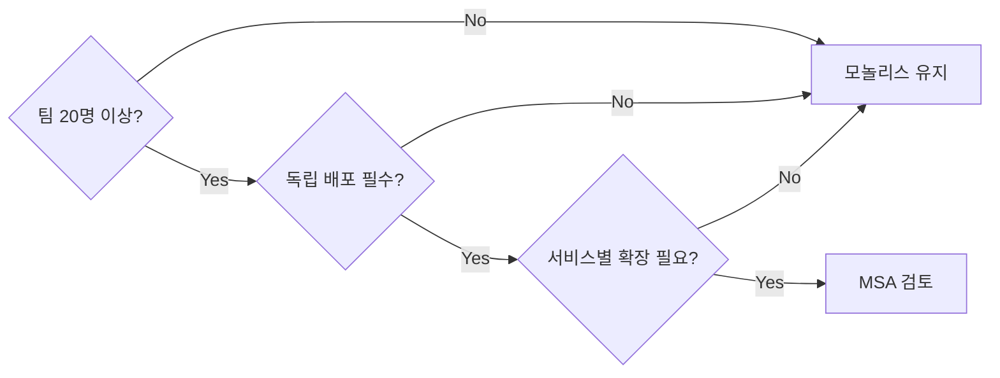

| 조건 | 모놀리스 | MSA |
|------|---------|-----|
| 팀 규모 | 10명 이하 | 20명 이상 |
| 배포 빈도 | 주 1~2회 | 하루 수십 회 |
| 서비스 경계 | 불명확 | 명확한 Bounded Context |
| 장애 격리 요구 | 낮음 | 높음 |
| 조직 DevOps 성숙도 | 낮음 | 높음 |

> **결론**: MSA는 복잡도를 제거하지 않습니다. **복잡도의 위치를 코드에서 인프라와 운영으로 옮깁니다.** 모놀리스로 실제 고통이 느껴질 때 분리하세요. Strangler Fig로 점진적으로, DDD Bounded Context 기준으로, 팀 소유권과 함께 분리하면 MSA 전환의 성공률이 높습니다.
