## 실생활 비유: 백화점 vs 전문점 거리

**모놀리식 아키텍처**는 백화점입니다. 의류, 식품, 가전 모두 한 건물 안에 있어서 관리가 쉽습니다. 하지만 식품관에 화재가 나면 전체 백화점이 닫힙니다. 가전 코너에 손님이 몰려도 식품관 직원을 빌려 쓸 수 없습니다. 빌딩 전체를 증축해야 합니다.

**MSA**는 명동 같은 전문점 거리입니다. 각 가게(서비스)가 독립적으로 운영됩니다. 옷 가게가 휴업해도 밥은 먹을 수 있습니다. 장사가 잘 되는 가게만 직원을 더 뽑을 수 있습니다. 단, 건물이 많아지면 관리 비용이 올라가고, 서비스 간 "배달"(API 호출)이 느려질 수 있습니다.

MSA는 "더 좋은 아키텍처"가 아닙니다. **"더 큰 팀과 더 복잡한 서비스를 위한 아키텍처"**입니다. 이 차이를 모르고 도입하면 복잡도 폭탄만 맞습니다.

---

## 1. 모놀리스의 문제점 — 왜 고통스러운가

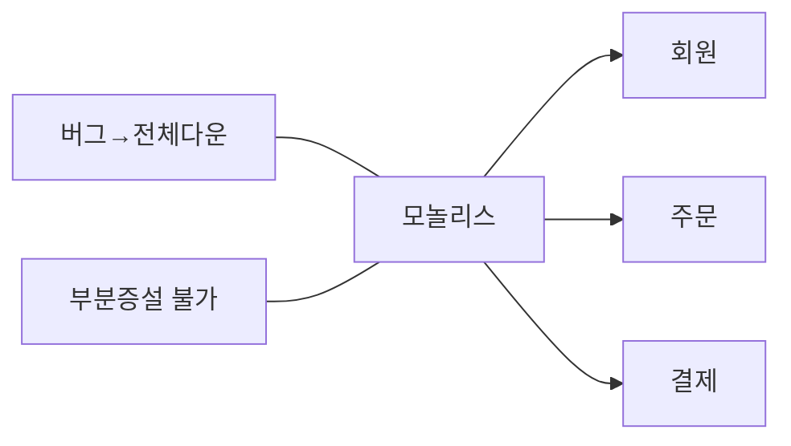

모놀리스의 고통은 규모가 커질수록 기하급수적으로 늘어납니다. 초기 스타트업 5명이 개발할 때는 전혀 문제없습니다. 팀이 50명으로 늘고, 하루에 기능 배포를 10번씩 해야 하고, 트래픽이 100배 늘었을 때 진짜 문제가 드러납니다.

실제 장애 시나리오를 보면 이해가 빠릅니다. 개발자가 알림 서비스에 메모리 누수 버그를 배포했습니다. 알림 모듈이 메모리를 다 먹으면 같은 프로세스의 결제 모듈도 OOM(Out of Memory)으로 죽습니다. 알림 버그가 결제 장애로 이어지는 것입니다. MSA에서는 알림 서비스 하나만 재시작하면 됩니다.

---

## 2. MSA 핵심 원칙 — 왜 이 원칙들인가

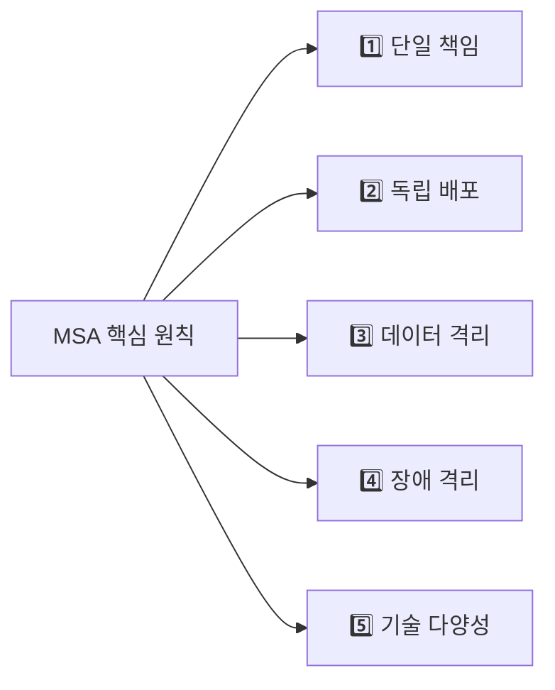

이 중에서 **데이터 격리가 가장 중요하고 가장 많이 위반됩니다.** "서비스는 분리했는데 DB는 하나"인 경우, 결제 서비스가 주문 테이블에 직접 JOIN을 걸기 시작합니다. 이 순간 두 서비스는 사실상 하나입니다. 결제 서비스 배포가 주문 DB 스키마에 의존하게 되고, 독립 배포가 불가능해집니다.

DB를 분리하면 JOIN이 안 됩니다. 이건 불편하지 않냐고요? 맞습니다. 그래서 **이 불편함을 감수할 만한 조직 규모와 비즈니스 복잡도일 때만** MSA가 의미있습니다.

---

## 3. 모놀리스 → MSA 전환 전략

### Strangler Fig Pattern (교살자 무화과 패턴)

교살자 무화과라는 이름이 직관적이지 않지만, 실제 식물에서 왔습니다. 이 식물은 큰 나무에 기생하며 천천히 자라서 결국 원래 나무를 대체합니다. 기존 나무(모놀리스)를 갑자기 없애는 게 아니라 서서히 둘러싸며 대체합니다.


왜 한 번에 다 분리하지 않을까요? 대규모 리팩토링은 6~12개월이 걸리고, 그 사이에 비즈니스는 계속 새로운 기능을 요구합니다. Big Bang 전환은 실패 확률이 매우 높습니다. Strangler Fig는 "가장 독립적이고, 변경이 잦고, 확장이 필요한 서비스"부터 하나씩 분리합니다. 단계마다 비즈니스 가치를 검증할 수 있습니다.

### 서비스 분리 기준 (DDD — Domain Driven Design)

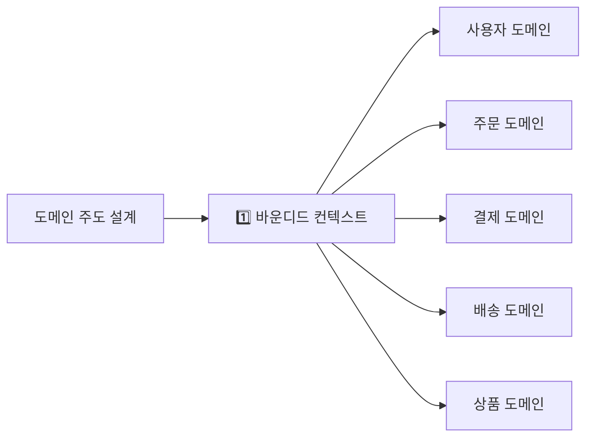

"같은 언어를 쓰는 사람들의 경계"라는 게 바운디드 컨텍스트의 핵심입니다. 결제팀이 "주문"이라고 하면 "결제 대상"을 의미하고, 배송팀이 "주문"이라고 하면 "배송해야 할 물건 목록"을 의미합니다. 같은 단어가 다른 의미를 가지는 경계가 바로 서비스 분리 지점입니다.

---

## 4. 전체 MSA 아키텍처

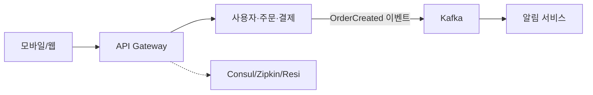

각 서비스가 다른 언어/DB를 쓰는 것이 눈에 띕니다. 이게 MSA의 "기술 다양성"입니다. 배송 서비스는 반정형 데이터가 많아 MongoDB, 결제 서비스는 강한 ACID가 필요해 PostgreSQL을 씁니다. 모놀리스에서는 이게 불가능합니다. 하나의 DB 선택이 전체를 제약합니다.

---

## 5. API Gateway — 단일 진입점의 역할

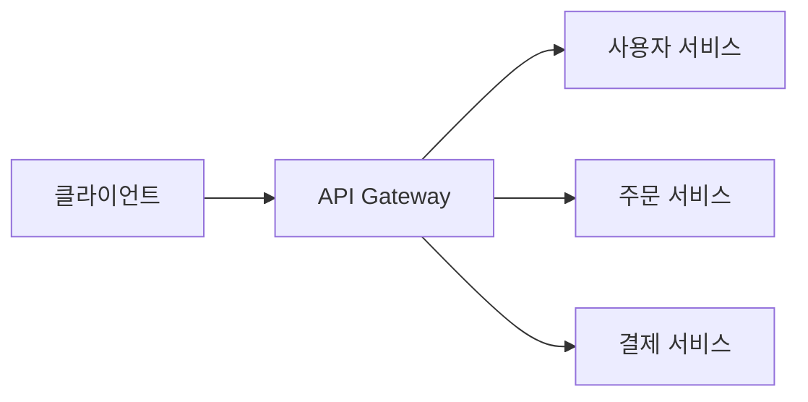

API Gateway가 없으면 클라이언트가 서비스마다 직접 JWT를 검증하는 로직을 호출해야 합니다. 인증 로직이 10개 서비스에 흩어집니다. 인증 정책이 바뀌면 10개 서비스를 동시에 수정해야 합니다. Gateway는 "공통 관심사는 한 곳에서"를 실현합니다.

Rate Limiting은 왜 여기서 할까요? DDoS나 실수로 과도한 요청을 보내는 클라이언트를 각 서비스가 개별적으로 막으면 이미 서비스에 부하가 들어간 뒤입니다. Gateway에서 일찍 막아야 내부 서비스가 보호됩니다.

**Spring Cloud Gateway 설정:**
```yaml
# application.yml
spring:
  cloud:
    gateway:
      routes:
        - id: user-service
          uri: lb://user-service        # 로드밸런서 자동 연결
          predicates:
            - Path=/api/users/**
          filters:
            - StripPrefix=2             # /api/users → /users
            - name: RequestRateLimiter
              args:
                redis-rate-limiter.replenishRate: 100
                redis-rate-limiter.burstCapacity: 200

        - id: order-service
          uri: lb://order-service
          predicates:
            - Path=/api/orders/**
          filters:
            - name: CircuitBreaker
              args:
                name: orderCircuitBreaker
                fallbackUri: forward:/fallback/orders

        - id: auth-route
          uri: lb://auth-service
          predicates:
            - Path=/api/auth/**
          filters:
            - RemoveRequestHeader=Cookie

      globalcors:
        corsConfigurations:
          '[/**]':
            allowedOrigins: "https://myapp.com"
            allowedMethods: "*"
            allowedHeaders: "*"
```

---

## 6. 서비스 간 통신 — 동기 vs 비동기 선택 기준

### 동기 통신: REST vs gRPC

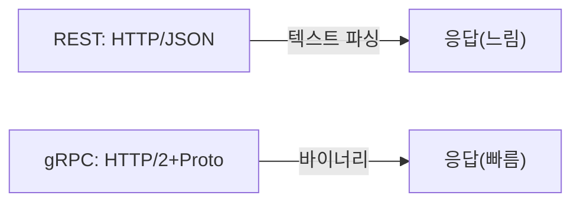

JSON은 사람이 읽기 좋은 포맷이지만, 기계가 파싱하기에는 비효율적입니다. Protobuf는 바이너리 포맷이라 사람은 못 읽지만, 크기가 JSON의 1/3~1/5이고 파싱이 10배 빠릅니다. 내부 서비스 간 통신에서 하루 수억 건을 주고받는다면 이 차이가 비용과 지연에 직접 영향을 줍니다.

REST를 외부 API에, gRPC를 내부 서비스 간 통신에 쓰는 이유가 여기 있습니다.

**gRPC 서비스 정의:**
```protobuf
// order.proto
syntax = "proto3";

service OrderService {
  rpc CreateOrder (CreateOrderRequest) returns (OrderResponse);
  rpc GetOrder (GetOrderRequest) returns (OrderResponse);
  rpc ListOrders (ListOrdersRequest) returns (stream OrderResponse);
}

message CreateOrderRequest {
  string user_id = 1;
  repeated OrderItem items = 2;
  string delivery_address = 3;
}

message OrderResponse {
  string order_id = 1;
  string status = 2;
  int64 total_amount = 3;
  string created_at = 4;
}
```

### 비동기 통신: Kafka 이벤트 — 왜 동기보다 강력한가

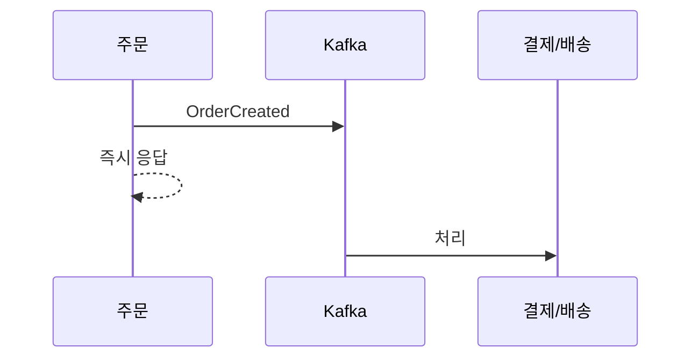

동기 방식으로 주문 → 결제 → 재고 → 배송을 순서대로 호출하면? 결제 서비스가 느리면 주문 API 응답이 느려집니다. 배송 서비스가 다운되면 주문 자체가 실패합니다. 전체가 가장 느린 서비스에 묶입니다.

비동기 이벤트 방식에서는 주문 서비스는 "주문 생성 이벤트"만 Kafka에 발행하고 즉시 응답합니다. 결제, 배송, 알림은 **병렬로, 독립적으로** 처리됩니다. 배송 서비스가 잠시 다운돼도 Kafka에 이벤트가 쌓여 있다가 복구 후 처리됩니다. 주문 서비스는 전혀 모릅니다.

| 통신 방식 | 프로토콜 | 장점 | 단점 | 사용 예 |
|---------|---------|------|------|---------|
| REST | HTTP/JSON | 단순, 범용 | 느림, 동기적 결합 | 외부 API |
| gRPC | HTTP2/Protobuf | 빠름, 타입 안전 | 설정 복잡 | 내부 서비스 |
| Kafka | TCP | 비동기, 내구성, 느슨한 결합 | 복잡도, 최종 일관성 | 이벤트 드리븐 |

---

## 7. 서비스 디스커버리 — "이 서비스 어디 있어?"

### 왜 필요한가

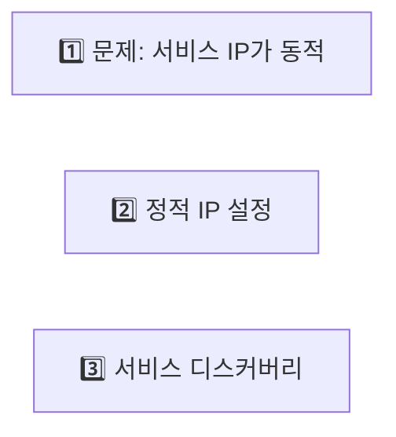

쿠버네티스나 클라우드 환경에서는 Pod/인스턴스가 배포될 때마다 IP가 바뀝니다. Auto Scaling으로 서버가 추가/제거됩니다. 정적으로 IP를 설정하면 재배포할 때마다 설정을 바꿔야 합니다. 서비스 디스커버리는 각 서비스가 "나 여기 있어요(등록)"라고 알리면, 다른 서비스가 이름으로 찾을 수 있게 하는 DNS 같은 역할입니다.

서비스 디스커버리가 없으면 어떤 장애가 날까요? Auto Scaling으로 결제 서비스 인스턴스가 10대로 늘었는데, 주문 서비스는 기존 3대 IP만 알고 있습니다. 7대는 노는 것입니다. 결제 서비스가 과부하에 걸려도 주문 서비스는 새 인스턴스를 모릅니다.

**Eureka 서비스 등록:**
```java
// OrderServiceApplication.java
@SpringBootApplication
@EnableEurekaClient
public class OrderServiceApplication {
    public static void main(String[] args) {
        SpringApplication.run(OrderServiceApplication.class, args);
    }
}
```

```yaml
# application.yml
spring:
  application:
    name: order-service

eureka:
  client:
    service-url:
      defaultZone: http://eureka-server:8761/eureka/
  instance:
    prefer-ip-address: true
    lease-renewal-interval-in-seconds: 10
    lease-expiration-duration-in-seconds: 30
```

**서비스 호출 (클라이언트 사이드 로드밸런싱):**
```java
@Service
public class OrderService {

    @Autowired
    private WebClient.Builder webClientBuilder;

    public PaymentResponse processPayment(PaymentRequest request) {
        // "payment-service"라는 이름으로 Eureka에서 실제 IP:Port 자동 조회
        // Auto Scaling으로 인스턴스가 추가/제거돼도 코드 변경 없음
        return webClientBuilder.build()
            .post()
            .uri("http://payment-service/api/payments")
            .bodyValue(request)
            .retrieve()
            .bodyToMono(PaymentResponse.class)
            .block();
    }
}
```

---

## 8. Circuit Breaker (서킷 브레이커) — 장애가 전파되지 않게

> 비유: 집의 두꺼비집(차단기). 과전류가 흐르면 자동으로 차단하여 더 큰 피해(화재)를 막습니다. 문제가 해결되면 다시 올립니다.

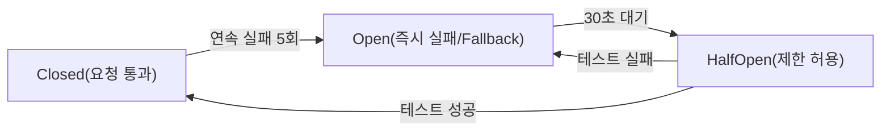

Circuit Breaker가 없으면 무슨 일이 생길까요? 결제 서비스가 느려지기 시작합니다. 주문 서비스가 결제 API를 동기로 호출하면 응답 대기 중 스레드가 묶입니다. 점점 더 많은 스레드가 결제 응답을 기다리며 블록됩니다. 결국 주문 서비스의 모든 스레드가 소진되어 주문 서비스 자체가 다운됩니다. 결제 서비스 하나의 느려짐이 주문 서비스 전체 장애로 번지는 **장애 전파(Cascading Failure)**입니다.

Circuit Breaker는 일정 횟수 이상 실패가 감지되면 즉시 에러를 반환(Fallback)합니다. 결제 서비스에 더 이상 요청을 보내지 않으니 스레드가 묶이지 않고, 주문 서비스는 살아있습니다. Fallback으로 "결제 서비스가 일시 불가합니다. 잠시 후 다시 시도하세요"를 반환하거나, 결제 요청을 큐에 저장해두고 나중에 처리합니다.

**Resilience4j 구현:**
```java
@Service
public class PaymentService {

    private final CircuitBreaker circuitBreaker;
    private final Retry retry;

    public PaymentService(CircuitBreakerRegistry registry) {
        // CircuitBreaker 설정
        CircuitBreakerConfig config = CircuitBreakerConfig.custom()
            .failureRateThreshold(50)           // 50% 실패율에서 OPEN
            .slowCallRateThreshold(100)         // 느린 호출 100%면 OPEN
            .slowCallDurationThreshold(Duration.ofSeconds(2))
            .waitDurationInOpenState(Duration.ofSeconds(30))
            .permittedNumberOfCallsInHalfOpenState(5)
            .slidingWindowSize(10)
            .build();

        this.circuitBreaker = registry.circuitBreaker("paymentService", config);

        // Retry 설정 — Circuit Breaker 전에 먼저 재시도
        RetryConfig retryConfig = RetryConfig.custom()
            .maxAttempts(3)
            .waitDuration(Duration.ofMillis(500))
            .retryOnException(e -> e instanceof NetworkException)
            .build();

        this.retry = Retry.of("paymentRetry", retryConfig);
    }

    public PaymentResult charge(PaymentRequest request) {
        // CircuitBreaker + Retry 체인
        Supplier<PaymentResult> decoratedSupplier = CircuitBreaker
            .decorateSupplier(circuitBreaker,
                Retry.decorateSupplier(retry,
                    () -> paymentApiClient.charge(request)
                )
            );

        return Try.ofSupplier(decoratedSupplier)
            .recover(throwable -> fallbackPayment(request))  // Fallback
            .get();
    }

    private PaymentResult fallbackPayment(PaymentRequest request) {
        // 결제 서비스 장애 시 → 큐에 저장해두고 나중에 재시도
        log.warn("Payment service unavailable, queuing for retry");
        paymentRetryQueue.add(request);
        return PaymentResult.pending(request.getOrderId());
    }
}
```

---

## 9. Saga 패턴 (분산 트랜잭션) — 여러 서비스에 걸친 원자적 작업

MSA에서는 하나의 비즈니스 트랜잭션이 여러 서비스에 걸쳐 있습니다. 주문 하나를 처리하는 데 결제, 재고, 배송 서비스가 모두 개입합니다. 전통적인 DB 트랜잭션(BEGIN/COMMIT)은 단일 DB에서만 동작합니다. 서비스별로 DB가 다르면 사용할 수 없습니다.

Saga는 "각 서비스가 로컬 트랜잭션을 하고, 실패하면 이전 서비스에 보상 트랜잭션을 요청한다"는 패턴입니다. 호텔, 항공, 렌터카를 각각 예약하다가 렌터카가 없으면 이미 예약한 호텔과 항공을 취소하는 것과 같습니다.

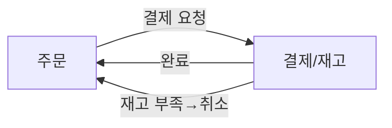

---

## 10. 분산 추적 (Distributed Tracing) — "어디서 느려졌나"를 찾는 법

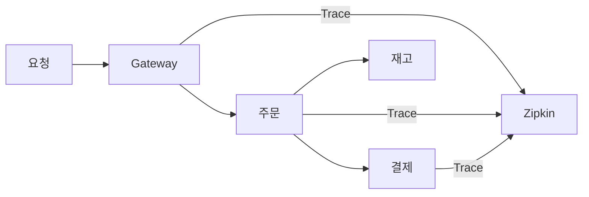

분산 추적이 없으면 어떻게 될까요? "주문 API가 3초나 걸렸다"는 장애 보고가 들어왔습니다. 주문 서비스 로그를 봐도 자체 처리는 빠릅니다. 결제 서비스, 재고 서비스 로그를 각각 뒤져 TraceID 없이 연결하려면... 개발자가 몇 시간을 보냅니다. Zipkin 같은 분산 추적 도구는 요청 하나가 어느 서비스를 얼마나 거쳤는지 타임라인으로 보여줍니다. 병목이 어디인지 5초만에 찾을 수 있습니다.

**Spring Sleuth + Zipkin 설정:**
```yaml
spring:
  sleuth:
    sampler:
      probability: 1.0  # 100% 샘플링 (프로덕션은 0.1 — 10%만 추적)
  zipkin:
    base-url: http://zipkin-server:9411
```

```java
@RestController
public class OrderController {

    private static final Logger log = LoggerFactory.getLogger(OrderController.class);

    @PostMapping("/orders")
    public ResponseEntity<Order> createOrder(@RequestBody OrderRequest request) {
        // Trace ID가 자동으로 로그에 포함됨
        // 2024-01-01 [abc123,span1] Creating order for user: 1001
        log.info("Creating order for user: {}", request.getUserId());

        Order order = orderService.createOrder(request);
        // 다른 서비스 호출 시 Trace ID가 HTTP 헤더(X-B3-TraceId)에 자동 전파
        return ResponseEntity.ok(order);
    }
}
```

---

## 11. 카나리 배포 (Canary Deployment) — 안전한 신버전 출시

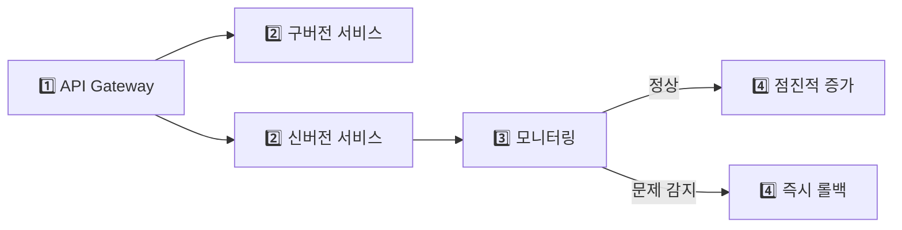

카나리 배포는 광산에서 유해 가스를 감지하기 위해 카나리아 새를 먼저 들여보내던 관행에서 왔습니다. 신버전을 일부 트래픽(10%)에만 먼저 노출합니다. 에러율이 올라가거나 응답이 느려지면 즉시 롤백합니다. 전체 배포보다 리스크가 1/10입니다.

이 방법이 없으면 어떤 일이 생길까요? 신버전에 메모리 누수 버그가 있습니다. 전체 배포를 했습니다. 수분 후 전체 서비스가 OOM으로 죽기 시작합니다. 롤백까지 5~10분이 걸리고, 그 동안 모든 사용자가 영향을 받습니다.

---


## 극한 시나리오

카카오 선물하기 같은 서비스를 MSA로 설계할 때의 실제 아키텍처입니다.

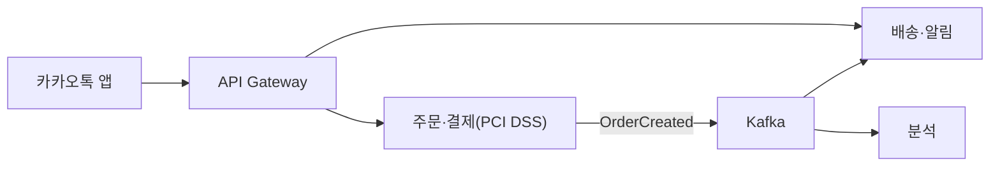

결제 서비스가 PCI DSS(금융 보안 표준)를 준수해야 한다는 점이 중요합니다. 이 서비스는 별도 보안 환경에서 운영되고, 다른 서비스와 네트워크 분리가 됩니다. 모놀리스였다면 전체 시스템에 PCI DSS를 적용해야 해서 비용과 복잡도가 폭발합니다. MSA에서는 결제 서비스만 적용하면 됩니다.

---
## MSA 도입 판단 기준

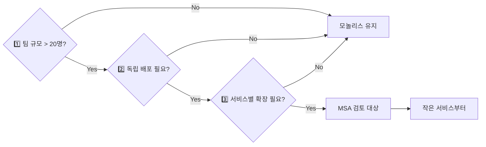

| 조건 | 모놀리스 | MSA |
|------|---------|-----|
| 팀 규모 | < 10명 | > 20명 |
| 서비스 규모 | 초기 스타트업 | 성숙한 서비스 |
| 배포 빈도 | 주 1회 | 하루 수십 회 |
| 독립 확장 필요 | 없음 | 있음 |
| 기술 다양성 | 필요 없음 | 필요 |

> **결론**: MSA는 복잡도를 없애는 게 아니라 **복잡도의 위치를 바꿉니다.** 코드 복잡도는 줄지만 인프라와 운영 복잡도가 늘어납니다. 모놀리스로 시작하고, 실제 고통이 느껴질 때 분리하세요. "언젠가 필요할 것 같아서" MSA를 도입하는 것은 거의 예외 없이 고통입니다.

---

## 실무에서 자주 하는 실수

1. **서비스 경계를 기술 기준으로 나눔** — "인증 서비스", "DB 서비스" 식으로 나누면 기능 하나에 여러 서비스를 수정해야 한다. Bounded Context 기반으로 비즈니스 도메인 단위로 나눠야 한다.

2. **서비스 간 DB 직접 공유** — 두 서비스가 같은 DB 테이블을 읽고 쓰면 스키마 변경 시 동시 배포가 필요하다. 서비스별 독립 DB와 이벤트 기반 동기화로 격리해야 한다.

3. **분산 트레이싱 없이 운영** — 요청이 5개 서비스를 거칠 때 어디서 지연이 발생했는지 파악하는 데 수 시간이 걸린다. Jaeger나 Zipkin으로 Correlation ID 기반 분산 트레이싱을 초기부터 적용해야 한다.

---

## 면접 포인트

**Q1. MSA 전환 시 가장 먼저 분리해야 할 서비스는?**
A. 변경 빈도가 높거나 확장 요구가 다른 도메인부터 분리한다. 예를 들어 결제와 검색은 트래픽 패턴과 배포 주기가 달라 분리 효과가 크다. 모놀리스에서 가장 자주 배포 충돌이 나는 모듈이 첫 번째 후보다.

**Q2. API Gateway의 역할과 한계는?**
A. 인증, 라우팅, 속도 제한, 로깅을 단일 진입점에서 처리해 클라이언트 복잡도를 낮춘다. 단, API Gateway 자체가 SPOF가 될 수 있어 고가용성 구성이 필수다. 모든 로직을 Gateway에 넣으면 병목이 되므로 라우팅과 공통 처리만 담당해야 한다.

**Q3. 서비스 디스커버리를 어떻게 구현하나요?**
A. Client-side discovery(Eureka + Ribbon)는 클라이언트가 직접 서비스 레지스트리를 조회해 로드밸런싱한다. Server-side discovery(AWS ALB, Kubernetes Service)는 인프라가 처리해 클라이언트 코드가 단순하다. 쿠버네티스 환경에서는 Service + DNS가 기본이다.
