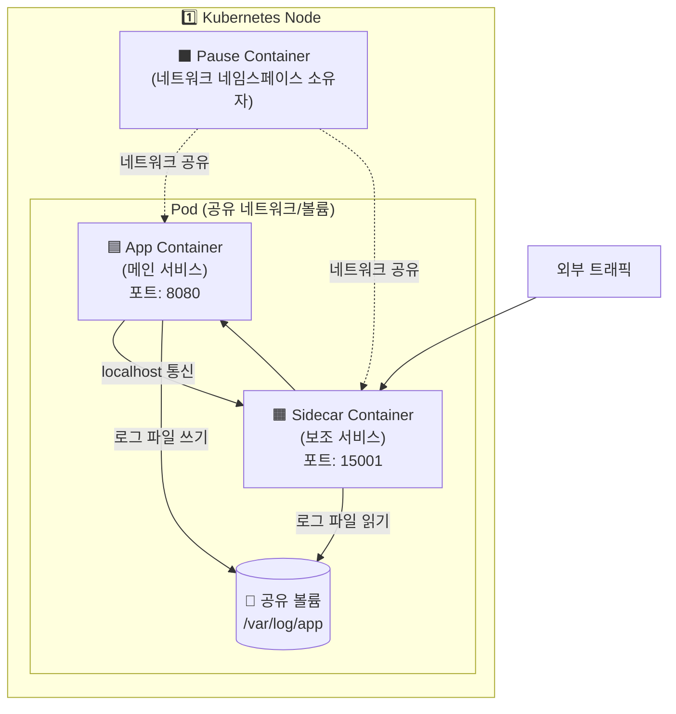
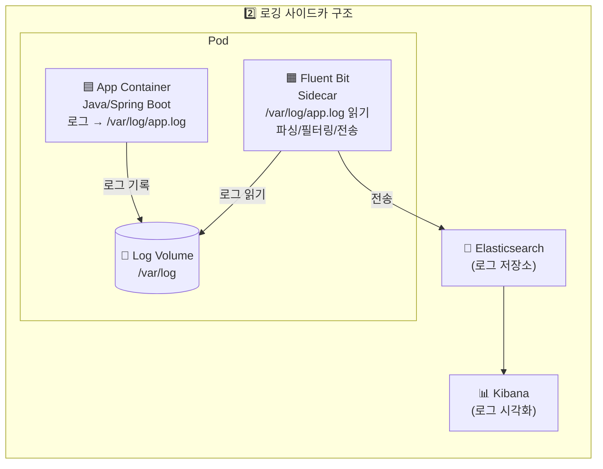
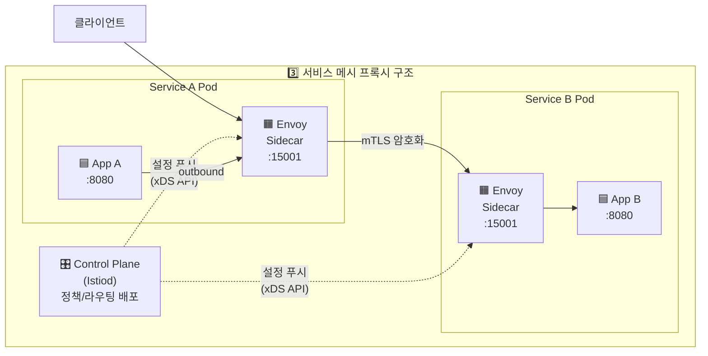
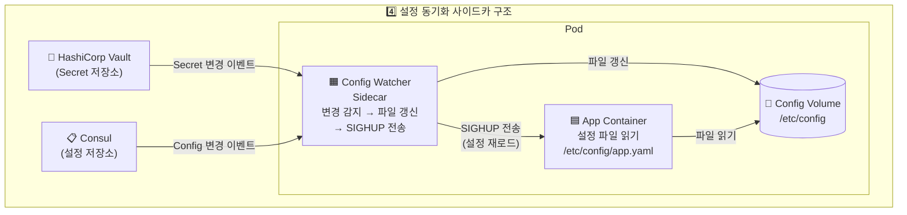
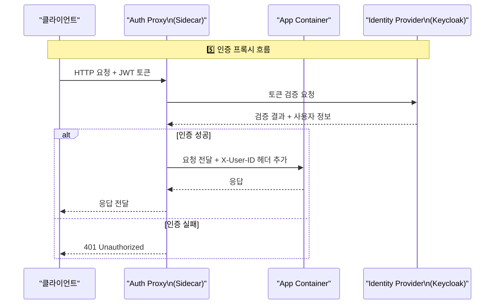
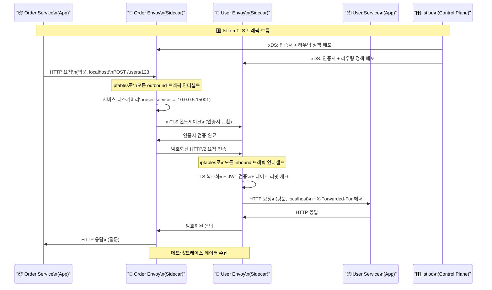
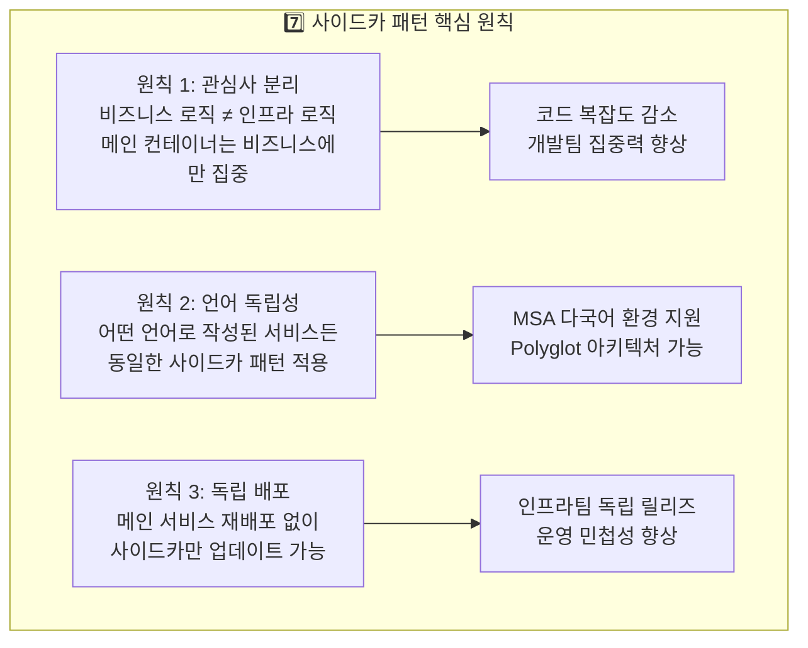
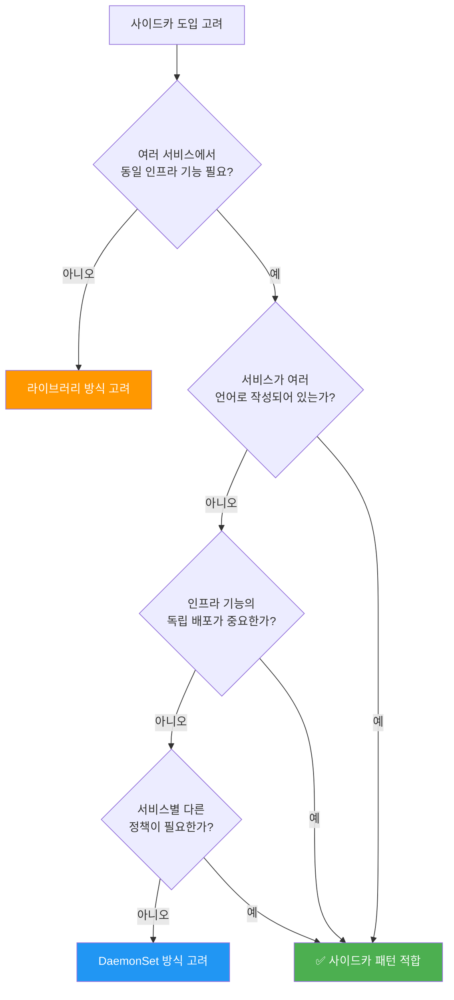

## 한 줄 요약

사이드카 패턴은 메인 애플리케이션 컨테이너 옆에 보조 컨테이너를 나란히 배치해서, 로깅·보안·네트워크·설정 동기화 같은 인프라 관심사를 메인 코드에서 완전히 분리하는 아키텍처 패턴입니다.

---

## 실생활 비유: 오토바이 사이드카

오토바이 사이드카를 떠올려 보십시오. 오토바이(메인 서비스)는 앞을 보며 달리는 데만 집중합니다. 사이드카(보조 컨테이너)에는 짐을 싣거나, 네비게이션을 달거나, 무선 통신 장비를 올려놓을 수 있습니다. 오토바이가 어떤 엔진을 쓰든, 어떤 브랜드든 상관없이 사이드카는 붙일 수 있습니다. 오토바이 엔진을 바꿔도 사이드카는 그대로입니다. 반대로 사이드카를 업그레이드해도 오토바이 엔진에는 아무 영향이 없습니다.

마이크로서비스 세계에서도 똑같습니다. Java로 짠 주문 서비스 옆에 Go로 짠 Envoy 프록시를 붙여도 됩니다. Python으로 짠 추천 서비스 옆에 Fluentd 로그 수집기를 붙여도 됩니다. 메인 서비스는 비즈니스 로직에만 집중하고, 나머지 인프라 관심사는 사이드카가 전담합니다.

---

## 1. 사이드카 패턴이란?

### 1-1. 개념과 정의

사이드카 패턴(Sidecar Pattern)은 컨테이너 오케스트레이션 환경에서 하나의 Pod 또는 VM 안에 메인 애플리케이션 컨테이너와 보조 컨테이너를 함께 실행하는 설계 방식입니다. 두 컨테이너는 같은 네트워크 네임스페이스와 스토리지 볼륨을 공유하므로, 마치 하나의 프로세스처럼 긴밀하게 협력할 수 있습니다.

이 패턴은 2016년 마이크로소프트 리서치가 발표한 논문에서 공식적으로 정의되었지만, 실제로는 Docker와 Kubernetes가 보급되면서 업계 표준 패턴으로 자리 잡았습니다. 특히 서비스 메시(Service Mesh) 구현 방식으로 사이드카 패턴이 채택되면서 대규모 MSA 환경에서는 사실상 필수 패턴이 되었습니다.

사이드카의 핵심 특징을 정리하면 다음과 같습니다. 첫째, 메인 컨테이너와 같은 라이프사이클을 가집니다. Pod가 생성되면 함께 시작되고, Pod가 종료되면 함께 종료됩니다. 둘째, 동일한 localhost 네트워크를 공유합니다. 메인 컨테이너가 8080 포트로 통신하면 사이드카는 localhost:8080으로 바로 접근할 수 있습니다. 셋째, 동일한 볼륨을 마운트할 수 있습니다. 메인 컨테이너가 로그 파일을 `/var/log/app`에 쓰면, 사이드카는 같은 경로를 읽어서 외부로 전송합니다.

### 1-2. 왜 사이드카 패턴이 필요한가?

소규모 서비스 하나를 운영할 때는 별 문제가 없습니다. 그런데 서비스가 수십, 수백 개로 늘어나면 상황이 달라집니다. 모든 서비스가 각자 TLS 인증서 관리 코드를 갖고 있다면, 인증서 갱신 로직을 바꿀 때 수백 개의 서비스를 모두 수정하고 재배포해야 합니다. 모든 서비스가 각자 Prometheus 메트릭 수집 코드를 갖고 있다면, 메트릭 포맷 변경 시 역시 수백 개를 건드려야 합니다.

사이드카 패턴은 이 문제를 "코드 변경 없이" 해결합니다. 인프라 관심사를 별도 컨테이너로 분리해 두면, 해당 사이드카 이미지만 업데이트하면 전체 서비스에 변경이 적용됩니다. 메인 서비스는 재배포할 필요조차 없습니다.

관심사 분리(Separation of Concerns) 측면에서도 중요합니다. 개발자는 비즈니스 로직에만 집중할 수 있고, 인프라 엔지니어는 사이드카 컨테이너만 관리하면 됩니다. 둘의 배포 사이클이 완전히 독립됩니다. 또한 언어 독립성도 확보됩니다. 메인 서비스가 어떤 언어로 작성되었든 사이드카는 독립적으로 동작합니다. Go로 짠 Envoy가 Python 서비스를 보호하고, Java로 짠 Filebeat가 Node.js 서비스의 로그를 수집합니다.

### 1-3. 관련 패턴: 앰배서더와 어댑터

사이드카 패턴과 함께 자주 언급되는 패턴이 앰배서더(Ambassador) 패턴과 어댑터(Adapter) 패턴입니다. 세 패턴 모두 사이드카 컨테이너를 사용하지만 목적이 다릅니다.

**앰배서더 패턴**은 메인 서비스가 외부 서비스에 접근할 때 앞단에서 대신 처리해 주는 역할을 합니다. 마치 외교관(Ambassador)이 본국을 대신해서 협상하듯, 앰배서더 컨테이너는 복잡한 원격 서비스 접근(레트리, 타임아웃, 서킷브레이커)을 대신 처리합니다. 메인 서비스는 로컬 앰배서더에게 요청을 보내고, 앰배서더가 외부 통신의 복잡성을 감춥니다.

**어댑터 패턴**은 메인 서비스의 출력을 외부 시스템이 이해할 수 있는 형식으로 변환합니다. 예를 들어, 레거시 서비스가 독자적인 메트릭 포맷을 사용하는데 Prometheus가 이를 읽을 수 없을 때, 어댑터 사이드카가 포맷을 변환해 줍니다. 전원 어댑터처럼 양쪽의 인터페이스를 맞춰주는 역할입니다.

이 세 가지는 모두 사이드카 패턴의 구체적인 변형입니다. 가장 넓은 의미의 사이드카 패턴이 앰배서더와 어댑터를 포함하는 상위 개념이라고 이해하면 됩니다.

### 1-4. Pod 구조 다이어그램

아래 다이어그램은 Kubernetes Pod 안에서 메인 컨테이너와 사이드카 컨테이너가 어떻게 공존하는지 보여줍니다.



이 다이어그램의 핵심은 Pause 컨테이너입니다. Kubernetes에서 Pod 안의 모든 컨테이너는 Pause 컨테이너가 소유한 네트워크 네임스페이스를 공유합니다. 그래서 App Container에서 localhost:15001로 접근하면 Sidecar Container에 직접 도달합니다. 외부에서 들어오는 트래픽은 먼저 Sidecar를 거쳐 App에 전달될 수 있습니다. 이 구조가 서비스 메시의 트래픽 인터셉트를 가능하게 합니다.

---

## 2. 사이드카의 핵심 역할

### 2-1. 로깅/모니터링 수집

가장 고전적인 사이드카 활용 사례입니다. 애플리케이션은 파일이나 stdout에 로그를 기록하고, 사이드카 컨테이너가 이를 읽어서 중앙 로그 저장소(Elasticsearch, Loki, Splunk)로 전송합니다.

비유를 들자면, 식당(메인 서비스)이 주문서(로그)를 테이블 위에 쌓아두면, 서빙 직원(사이드카)이 주문서를 본사(로그 저장소)로 보내는 구조입니다. 식당 주인은 요리에만 집중하고, 서빙 직원은 배달에만 집중합니다.

대표적인 도구로는 Fluentd, Fluent Bit, Filebeat, Logstash가 있습니다. 특히 Fluent Bit은 경량화되어 있어 사이드카 컨테이너로 많이 사용됩니다. Fluentd는 풍부한 플러그인 생태계를 가지고 있어 복잡한 로그 변환이 필요할 때 적합합니다.



이 구조의 핵심은 App Container가 로그 전송 로직을 전혀 갖지 않는다는 점입니다. 로그 저장소가 Elasticsearch에서 Loki로 변경되어도 App은 재배포할 필요가 없습니다. Fluent Bit 사이드카 이미지만 바꾸면 됩니다.

### 2-2. 서비스 메시 프록시

가장 강력한 사이드카 활용 사례입니다. Envoy 프록시를 사이드카로 붙이면 모든 트래픽이 Envoy를 통해 흐르게 되어, 트래픽 라우팅·로드밸런싱·mTLS·서킷브레이커·관찰가능성을 메인 서비스 코드 변경 없이 구현할 수 있습니다.

비유하자면, 모든 전화 통화가 반드시 교환원(Envoy)을 거쳐야 하는 구조입니다. 교환원은 통화를 연결해 줄 뿐 아니라, 도청 방지 암호화(mTLS), 통화 기록(액세스 로그), 특정 번호 차단(서킷브레이커), 통화량 제한(레이트 리미팅)도 수행합니다. 통화 당사자들은 교환원의 존재를 의식하지 않아도 됩니다.



이 구조의 핵심은 Control Plane(Istiod)이 모든 Envoy 사이드카에 xDS 프로토콜로 라우팅 정책과 보안 정책을 동적으로 푸시한다는 점입니다. 수백 개의 서비스가 있어도 정책 변경은 Control Plane에서 한 번만 하면 됩니다.

### 2-3. 설정 동기화

설정을 동적으로 갱신해야 하는 경우에 사이드카가 활약합니다. Vault, Consul, Kubernetes ConfigMap/Secret의 변경을 감지해서 메인 컨테이너에 전달하는 역할을 사이드카가 담당합니다.

도서관 사서(사이드카)가 책 목록(설정)이 변경될 때마다 연구원(메인 서비스)에게 알려주는 모습을 떠올리십시오. 연구원은 사서가 가져다주는 최신 책 목록만 보면 됩니다. 목록을 직접 찾아다닐 필요가 없습니다.



이 구조의 핵심은 메인 앱이 재시작 없이 설정을 동적으로 갱신할 수 있다는 점입니다. Config Watcher 사이드카가 외부 저장소의 변경을 감지해서 파일을 업데이트하고, SIGHUP 시그널로 메인 앱에게 재로드를 요청합니다.

### 2-4. 인증/인가 프록시

OAuth2 Proxy, OPA(Open Policy Agent), SPIFFE 같은 보안 사이드카를 붙이면 메인 서비스 코드에 인증 로직을 전혀 포함하지 않아도 됩니다. 모든 요청이 먼저 보안 사이드카를 통과해야 메인 서비스에 도달합니다.

건물 입구의 보안 요원(사이드카)이 출입증을 확인한 후에만 건물 안(메인 서비스)으로 들여보내는 구조입니다. 건물 내부에 있는 사람들(개발자)은 보안 절차를 신경 쓸 필요가 없습니다.



이 구조의 핵심은 App Container가 인증 로직을 전혀 모른다는 점입니다. App은 X-User-ID 헤더만 읽으면 누가 요청했는지 알 수 있습니다. 인증 방식을 JWT에서 SAML로 변경해도 App 코드는 전혀 바꿀 필요가 없습니다.

---

## 3. Kubernetes에서의 사이드카

### 3-1. Pod 내 멀티 컨테이너 구조

Kubernetes에서 Pod는 하나 이상의 컨테이너를 실행하는 최소 배포 단위입니다. Pod 안의 모든 컨테이너는 다음을 공유합니다.

- **네트워크 네임스페이스**: 동일한 IP 주소, 동일한 localhost
- **IPC 네임스페이스**: 프로세스 간 통신(공유 메모리, 세마포어)
- **볼륨**: 명시적으로 마운트한 Volume은 공유 가능

이 특성이 사이드카 패턴을 실용적으로 만드는 핵심입니다. 네트워크 호출 없이 localhost로 통신하기 때문에 지연 시간이 극도로 낮습니다. 볼륨을 공유하기 때문에 파일 기반의 로그 수집도 자연스럽습니다.

메인 컨테이너와 사이드카 컨테이너는 Pod YAML의 `spec.containers` 배열에 나란히 정의됩니다. 이름에서 알 수 있듯 Kubernetes 입장에서는 둘 다 "컨테이너"이고, 둘의 라이프사이클은 Pod와 함께합니다.

### 3-2. Init Container vs Sidecar Container

Init Container는 메인 컨테이너들이 시작하기 전에 순차적으로 실행되고 완료되어야 하는 컨테이너입니다. 데이터베이스 마이그레이션, 설정 파일 생성, 의존 서비스 헬스체크 같은 초기화 작업에 사용됩니다.

사이드카 컨테이너는 메인 컨테이너와 동시에 실행되며 Pod의 전체 생애 동안 함께 동작합니다. 둘의 핵심 차이는 다음과 같습니다.

| 특성 | Init Container | Sidecar Container |
|------|---------------|-------------------|
| 실행 시점 | 메인 컨테이너 이전 | 메인 컨테이너와 동시 |
| 종료 | 작업 완료 후 종료 | Pod 종료 시까지 실행 |
| 재시작 | 실패 시 재실행 | Pod 정책에 따라 |
| 용도 | 초기화, 의존성 체크 | 지속적 보조 기능 |
| 순서 | 순차적 실행 | 병렬 실행 |

실제로 Istio의 Envoy 사이드카 주입 방식을 보면 Init Container도 함께 사용됩니다. `istio-init`이라는 Init Container가 먼저 iptables 규칙을 설정해서 모든 트래픽이 Envoy로 리다이렉트되도록 구성한 후에, `istio-proxy`(Envoy) 사이드카가 실제 프록시로 동작합니다.

### 3-3. Kubernetes 1.28+ Native Sidecar

Kubernetes 1.28부터 사이드카 컨테이너를 공식적으로 지원하는 Native Sidecar 기능이 알파로 도입되었고, 1.29에서 베타가 되었습니다. 기존에는 `spec.containers`에 사이드카를 넣으면 Kubernetes가 메인 컨테이너와 사이드카를 구분하지 못했습니다.

Native Sidecar는 `spec.initContainers`에 `restartPolicy: Always`를 설정해서 지정합니다. 이렇게 하면 Kubernetes가 해당 컨테이너를 사이드카로 인식해서 다음 장점을 제공합니다.

첫째, 사이드카가 메인 컨테이너보다 먼저 시작되도록 보장합니다. 이전에는 사이드카가 준비되기 전에 메인 컨테이너가 먼저 시작되어 통신 실패가 발생할 수 있었습니다. 둘째, Pod 종료 시 사이드카가 메인 컨테이너보다 나중에 종료되도록 보장합니다. 이전에는 메인 컨테이너가 로그를 쓰는 도중 Fluent Bit 사이드카가 먼저 종료되어 마지막 로그가 유실될 수 있었습니다. 셋째, 사이드카 재시작이 메인 컨테이너에 영향을 미치지 않습니다.

### 3-4. 기본 YAML 예제: 로그 수집 사이드카

아래 YAML은 Spring Boot 애플리케이션과 Fluent Bit 로그 수집 사이드카를 함께 배포하는 예제입니다. 두 컨테이너가 동일한 emptyDir 볼륨을 공유해서 로그 파일을 주고받습니다.

```yaml
apiVersion: apps/v1
kind: Deployment
metadata:
  name: order-service
  namespace: production
spec:
  replicas: 3
  selector:
    matchLabels:
      app: order-service
  template:
    metadata:
      labels:
        app: order-service
    spec:
      # 공유 볼륨 정의
      volumes:
        - name: log-volume
          emptyDir: {}
        - name: fluent-bit-config
          configMap:
            name: fluent-bit-config

      containers:
        # ------ 메인 컨테이너 ------
        - name: order-service
          image: myregistry/order-service:v2.1.0
          ports:
            - containerPort: 8080
          env:
            - name: LOG_PATH
              value: /var/log/app
            - name: SPRING_PROFILES_ACTIVE
              value: production
          resources:
            requests:
              cpu: "500m"
              memory: "512Mi"
            limits:
              cpu: "1000m"
              memory: "1Gi"
          volumeMounts:
            - name: log-volume
              mountPath: /var/log/app  # 로그 파일을 이 경로에 기록
          livenessProbe:
            httpGet:
              path: /actuator/health
              port: 8080
            initialDelaySeconds: 30
            periodSeconds: 10
          readinessProbe:
            httpGet:
              path: /actuator/health/readiness
              port: 8080
            initialDelaySeconds: 20
            periodSeconds: 5

        # ------ 사이드카 컨테이너: Fluent Bit 로그 수집기 ------
        - name: fluent-bit
          image: fluent/fluent-bit:2.2.0
          resources:
            requests:
              cpu: "50m"      # 메인 컨테이너 대비 1/10 수준
              memory: "64Mi"
            limits:
              cpu: "100m"
              memory: "128Mi"
          volumeMounts:
            - name: log-volume
              mountPath: /var/log/app    # 메인 컨테이너와 동일 경로
              readOnly: true             # 사이드카는 읽기만 함
            - name: fluent-bit-config
              mountPath: /fluent-bit/etc
```

이 YAML에서 주목할 점은 리소스 할당입니다. 메인 컨테이너(order-service)에는 CPU 500m, 메모리 512Mi를 요청하고, 사이드카(fluent-bit)에는 CPU 50m, 메모리 64Mi만 요청합니다. 사이드카는 대체로 메인 컨테이너보다 훨씬 적은 리소스를 사용합니다. 사이드카 리소스를 너무 작게 잡으면 로그 백압력(backpressure)이 발생하고, 너무 크게 잡으면 낭비가 되므로 운영 중 모니터링을 통해 적정값을 찾아야 합니다.

### 3-5. Native Sidecar YAML 예제 (K8s 1.29+)

```yaml
apiVersion: apps/v1
kind: Deployment
metadata:
  name: order-service-v2
spec:
  template:
    spec:
      volumes:
        - name: log-volume
          emptyDir: {}

      # Native Sidecar: initContainers에 restartPolicy: Always 지정
      initContainers:
        - name: fluent-bit-sidecar
          image: fluent/fluent-bit:2.2.0
          restartPolicy: Always    # 이 설정이 Native Sidecar를 활성화
          resources:
            requests:
              cpu: "50m"
              memory: "64Mi"
          volumeMounts:
            - name: log-volume
              mountPath: /var/log/app
              readOnly: true

      # 메인 컨테이너
      containers:
        - name: order-service
          image: myregistry/order-service:v2.1.0
          ports:
            - containerPort: 8080
          volumeMounts:
            - name: log-volume
              mountPath: /var/log/app
```

이 코드의 핵심은 `restartPolicy: Always`가 붙은 initContainer가 바로 Native Sidecar라는 점입니다. Kubernetes가 이를 인식해서 메인 컨테이너보다 먼저 시작하고, Pod 종료 시에는 메인 컨테이너보다 나중에 종료합니다. 로그 유실 없이 안전한 순서가 보장됩니다.

### 3-6. Fluent Bit ConfigMap 예제

Fluent Bit 사이드카가 어떻게 설정되는지도 함께 살펴보겠습니다.

```yaml
apiVersion: v1
kind: ConfigMap
metadata:
  name: fluent-bit-config
  namespace: production
data:
  fluent-bit.conf: |
    [SERVICE]
        Flush         5
        Log_Level     info
        Daemon        off
        Parsers_File  parsers.conf

    [INPUT]
        Name              tail
        Path              /var/log/app/*.log
        Parser            json
        Tag               order-service.*
        Refresh_Interval  5
        Mem_Buf_Limit     10MB

    [FILTER]
        Name   record_modifier
        Match  order-service.*
        Record service order-service
        Record environment production
        Record cluster prod-k8s-01

    [OUTPUT]
        Name            es
        Match           *
        Host            elasticsearch.logging.svc.cluster.local
        Port            9200
        Index           order-service-logs
        Logstash_Format On
        Logstash_Prefix order-service
        Retry_Limit     5

  parsers.conf: |
    [PARSER]
        Name        json
        Format      json
        Time_Key    timestamp
        Time_Format %Y-%m-%dT%H:%M:%S.%L%z
```

이 ConfigMap의 핵심은 `[FILTER]` 섹션에서 `service`, `environment`, `cluster` 필드를 자동으로 추가한다는 점입니다. 메인 앱은 이런 메타데이터를 로그에 포함할 필요가 없습니다. 사이드카가 자동으로 붙여줍니다. 수백 개의 서비스가 있어도 각 서비스의 사이드카 ConfigMap만 수정하면 로그 메타데이터를 일관성 있게 관리할 수 있습니다.

---

## 4. 서비스 메시와 사이드카

### 4-1. Istio + Envoy 구조

서비스 메시(Service Mesh)는 현재 사이드카 패턴의 가장 강력한 활용 사례입니다. Istio는 Kubernetes 클러스터 내 모든 Pod에 Envoy 프록시를 사이드카로 자동 주입합니다. 이 과정은 완전히 자동화되어 있어서 개발자가 YAML을 수정할 필요가 없습니다.

비유하자면 도시의 모든 도로에 자동으로 교통 카메라와 신호등을 설치하는 것과 같습니다. 도로를 달리는 자동차(메인 서비스)는 교통 인프라의 존재를 의식하지 않아도 됩니다. 그러나 도시 교통 관제 센터(Control Plane)에서는 실시간으로 모든 교통 흐름을 파악하고, 특정 도로에 교통 제한을 걸거나, 우회로를 안내할 수 있습니다.

Istio 아키텍처는 크게 Data Plane과 Control Plane으로 나뉩니다. Data Plane은 각 Pod에 주입된 Envoy 사이드카들의 집합입니다. 실제 트래픽이 흐르는 계층입니다. Control Plane(Istiod)은 각 Envoy 사이드카에 라우팅 정책, 보안 정책, 서비스 디스커버리 정보를 xDS API를 통해 동적으로 배포합니다.

### 4-2. 사이드카 자동 주입 원리

Istio는 Kubernetes의 MutatingWebhook을 활용해서 사이드카를 자동 주입합니다. Pod가 생성될 때 Kubernetes API Server가 Istio의 WebHook을 호출하고, Istio는 Pod YAML을 수정해서 `istio-proxy`(Envoy) 컨테이너와 `istio-init`(Init Container)를 추가합니다. 개발자는 네임스페이스에 `istio-injection: enabled` 레이블만 붙이면 됩니다.

```yaml
# Istio 사이드카 자동 주입 활성화
apiVersion: v1
kind: Namespace
metadata:
  name: production
  labels:
    istio-injection: enabled    # 이 레이블 하나로 자동 주입 활성화
```

### 4-3. Envoy 사이드카 직접 설정 예제

자동 주입을 사용하지 않고 직접 Envoy를 사이드카로 배포하는 경우의 예제입니다. 이 방식은 Istio 없이 Envoy 단독으로 L7 프록시 기능을 사용하고 싶을 때 사용합니다.

```yaml
apiVersion: apps/v1
kind: Deployment
metadata:
  name: user-service
spec:
  template:
    spec:
      volumes:
        - name: envoy-config
          configMap:
            name: envoy-config

      containers:
        # 메인 컨테이너
        - name: user-service
          image: myregistry/user-service:v1.5.0
          ports:
            - containerPort: 8080
          # 실제 서비스는 localhost:8080에서만 수신 (외부 직접 접근 차단)
          env:
            - name: SERVER_HOST
              value: "127.0.0.1"  # localhost에서만 수신

        # Envoy 사이드카 프록시
        - name: envoy-proxy
          image: envoyproxy/envoy:v1.28.0
          args:
            - -c
            - /etc/envoy/envoy.yaml
            - --service-cluster
            - user-service
          ports:
            - containerPort: 8443  # 외부에서 접근하는 TLS 포트
            - containerPort: 9901  # Envoy 관리 인터페이스
          resources:
            requests:
              cpu: "100m"
              memory: "128Mi"
            limits:
              cpu: "200m"
              memory: "256Mi"
          volumeMounts:
            - name: envoy-config
              mountPath: /etc/envoy
```

```yaml
# Envoy 설정 ConfigMap
apiVersion: v1
kind: ConfigMap
metadata:
  name: envoy-config
data:
  envoy.yaml: |
    static_resources:
      listeners:
        - name: listener_0
          address:
            socket_address:
              address: 0.0.0.0
              port_value: 8443
          filter_chains:
            - filters:
                - name: envoy.filters.network.http_connection_manager
                  typed_config:
                    "@type": type.googleapis.com/envoy.extensions.filters.network.http_connection_manager.v3.HttpConnectionManager
                    stat_prefix: ingress_http
                    route_config:
                      name: local_route
                      virtual_hosts:
                        - name: local_service
                          domains: ["*"]
                          routes:
                            - match:
                                prefix: "/"
                              route:
                                cluster: local_app
                                timeout: 30s
                    http_filters:
                      - name: envoy.filters.http.router
                        typed_config:
                          "@type": type.googleapis.com/envoy.extensions.filters.http.router.v3.Router
              # TLS 설정
              transport_socket:
                name: envoy.transport_sockets.tls
                typed_config:
                  "@type": type.googleapis.com/envoy.extensions.transport_sockets.tls.v3.DownstreamTlsContext
                  common_tls_context:
                    tls_certificates:
                      - certificate_chain:
                          filename: /etc/certs/tls.crt
                        private_key:
                          filename: /etc/certs/tls.key

      clusters:
        - name: local_app
          connect_timeout: 5s
          type: STATIC
          load_assignment:
            cluster_name: local_app
            endpoints:
              - lb_endpoints:
                  - endpoint:
                      address:
                        socket_address:
                          address: 127.0.0.1  # 같은 Pod의 메인 컨테이너
                          port_value: 8080

    admin:
      access_log_path: /dev/stdout
      address:
        socket_address:
          address: 0.0.0.0
          port_value: 9901
```

이 코드의 핵심은 메인 서비스가 `127.0.0.1:8080`에서만 수신한다는 점입니다. 외부에서는 직접 접근이 불가능하고 반드시 `Envoy:8443`을 통해서만 도달할 수 있습니다. Envoy가 TLS 종료, 요청 로깅, 타임아웃 관리를 모두 처리한 후 localhost:8080으로 전달합니다.

### 4-4. mTLS 트래픽 흐름 시퀀스 다이어그램

서비스 간 mTLS 통신이 어떻게 이루어지는지 단계별로 살펴보겠습니다. mTLS(Mutual TLS)는 클라이언트와 서버가 서로의 인증서를 검증하는 양방향 TLS입니다. 사이드카 패턴이 없으면 메인 서비스 코드에서 인증서 관리를 해야 하지만, Envoy 사이드카가 이를 완전히 대신합니다.



이 시퀀스의 핵심은 OrderApp과 UserApp 모두 평문 HTTP로 통신한다는 점입니다. 두 App은 서로가 누구인지, TLS가 어떻게 작동하는지 전혀 모릅니다. 모든 암호화와 인증은 Envoy 사이드카 레이어에서 투명하게 처리됩니다.

### 4-5. 서킷 브레이커 설정 (Istio VirtualService)

Istio를 사용하면 Kubernetes YAML로 서킷 브레이커, 레이트 리미팅, 카나리 배포를 코드 변경 없이 설정할 수 있습니다.

```yaml
# 서킷 브레이커 설정 (DestinationRule)
apiVersion: networking.istio.io/v1beta1
kind: DestinationRule
metadata:
  name: user-service-circuit-breaker
  namespace: production
spec:
  host: user-service
  trafficPolicy:
    outlierDetection:
      consecutive5xxErrors: 5         # 5번 연속 5xx 에러 시 제거
      interval: 30s                    # 30초마다 상태 점검
      baseEjectionTime: 60s            # 최소 60초 동안 제외
      maxEjectionPercent: 50           # 최대 50%의 엔드포인트만 제외
    connectionPool:
      tcp:
        maxConnections: 100
      http:
        http1MaxPendingRequests: 50
        http2MaxRequests: 1000
        maxRequestsPerConnection: 10
        maxRetries: 3
---
# 트래픽 라우팅 (카나리 배포)
apiVersion: networking.istio.io/v1beta1
kind: VirtualService
metadata:
  name: user-service-routing
  namespace: production
spec:
  hosts:
    - user-service
  http:
    - name: "canary-route"
      route:
        - destination:
            host: user-service
            subset: stable
          weight: 90   # 90%는 안정 버전으로
        - destination:
            host: user-service
            subset: canary
          weight: 10   # 10%는 카나리 버전으로
      retries:
        attempts: 3
        perTryTimeout: 5s
        retryOn: gateway-error,connect-failure,refused-stream
```

이 코드의 핵심은 메인 서비스 코드 한 줄도 변경하지 않고 서킷 브레이커와 카나리 배포를 구현했다는 점입니다. 운영팀이 YAML만 적용하면 즉시 효과가 납니다. Envoy 사이드카가 실시간으로 새로운 정책을 받아서 적용합니다.

---

## 5. 트래픽 규모별 시나리오

### 5-1. 100 TPS — 소규모 서비스

초당 100건 수준의 트래픽에서는 사이드카 오버헤드가 사실상 무시할 수 있는 수준입니다. Envoy의 추가 지연 시간은 평균 0.1~0.5ms이며, 리소스 오버헤드는 CPU 5~10m, 메모리 20~50Mi 정도입니다. 이 규모에서는 사이드카 패턴의 장점(관찰가능성, mTLS, 서킷 브레이커)을 얻으면서 비용은 거의 없는 이상적인 상황입니다.

이 규모에서의 권장 리소스 설정은 다음과 같습니다.

```yaml
# 100 TPS 규모 사이드카 리소스 설정
containers:
  - name: envoy-proxy
    resources:
      requests:
        cpu: "50m"
        memory: "64Mi"
      limits:
        cpu: "200m"
        memory: "128Mi"
```

트레이드오프를 굳이 찾자면, 운영 복잡성이 약간 증가한다는 점입니다. Pod 당 컨테이너가 2개 이상이므로 kubectl 명령에서 `-c envoy-proxy` 같은 컨테이너 지정이 필요합니다. `kubectl logs -n production pod-name -c fluent-bit`처럼 로그를 볼 때도 컨테이너를 명시해야 합니다.

### 5-2. 10,000 TPS — 중규모 서비스

초당 1만 건 수준에서는 사이드카 리소스를 본격적으로 고민해야 합니다. Envoy는 고성능 L7 프록시지만, 이 트래픽 수준에서는 CPU 사용이 눈에 띄게 증가합니다. 각 요청마다 HTTP 파싱, TLS 처리, 헤더 조작, 메트릭 기록이 이루어지기 때문입니다.

일반적인 경험치로, 10,000 TPS 환경에서 Envoy 사이드카는 다음 리소스가 필요합니다.

```yaml
# 10,000 TPS 규모 사이드카 리소스 설정
containers:
  - name: envoy-proxy
    resources:
      requests:
        cpu: "500m"         # 메인 서비스와 비슷한 수준까지 올라갈 수 있음
        memory: "256Mi"
      limits:
        cpu: "1000m"
        memory: "512Mi"
    env:
      - name: ENVOY_CONCURRENCY
        value: "2"          # 워커 스레드 수 (CPU 코어 수에 맞게 조정)
```

이 규모에서 주의해야 할 함정이 있습니다. 리소스 `limits`를 너무 낮게 설정하면 Envoy가 CPU throttling에 걸려서 메인 서비스보다 사이드카가 병목이 되는 역설적 상황이 발생합니다. 프로메테우스로 `envoy_http_downstream_rq_total`, `envoy_cluster_upstream_rq_time` 메트릭을 반드시 모니터링해야 합니다.

로그 수집 사이드카도 이 규모에서 주의가 필요합니다. 초당 1만 건의 요청이 각각 하나의 로그 라인을 생성하면, Fluent Bit이 처리해야 하는 양이 상당합니다. 로그 볼륨의 `Mem_Buf_Limit`을 충분히 확보하고, 백압력 모니터링을 설정해야 합니다.

```yaml
# 고트래픽 환경 Fluent Bit 설정
[SERVICE]
    Flush         1          # 1초마다 플러시 (기본 5초에서 단축)
    Mem_Buf_Limit 50MB       # 버퍼 크기 확대

[INPUT]
    Name              tail
    Mem_Buf_Limit     20MB   # 입력 버퍼도 확대
    Buffer_Max_Size   1MB
```

### 5-3. 100,000 TPS — 대규모 서비스

초당 10만 건 이상의 극대 트래픽에서는 사이드카 패턴의 누적 비용을 진지하게 고려해야 합니다. 단순한 수학을 해보겠습니다. Envoy 사이드카의 P99 지연 시간 오버헤드가 1ms라고 하면, 1초에 10만 건이 통과할 때 총 지연 시간 합계는 100초입니다. 단일 요청 입장에서는 1ms지만, 시스템 전체로는 큰 비용입니다.

또한 이 규모에서는 메모리 오버헤드도 중요합니다. 노드 하나에 50개의 Pod가 있고, 각 Pod마다 Envoy 사이드카가 256Mi를 사용한다면, 사이드카만으로 노드당 12.8GB가 소비됩니다. 이는 메인 서비스가 사용할 수 있는 메모리를 크게 잠식합니다.

이 규모에서의 최적화 전략을 살펴보겠습니다.

```yaml
# 대규모 환경 최적화된 Istio 설정
apiVersion: install.istio.io/v1alpha1
kind: IstioOperator
spec:
  meshConfig:
    # 고트래픽 서비스에는 사이드카 주입 제외 가능
    defaultConfig:
      proxyStatsMatcher:
        inclusionPrefixes:
          - "cluster.outbound"   # 꼭 필요한 메트릭만 수집
      # 액세스 로그 샘플링 (전체 대신 1%만 기록)
      accessLogEncoding: JSON

---
# 특정 Pod에는 사이드카 주입 제외
apiVersion: v1
kind: Pod
metadata:
  annotations:
    sidecar.istio.io/inject: "false"   # 초고트래픽 Pod는 사이드카 제외
```

대규모 환경에서는 모든 서비스에 무조건 사이드카를 붙이기보다, 사이드카가 반드시 필요한 서비스(외부 트래픽을 받는 서비스, 보안 민감 서비스)와 제외할 서비스(내부 배치 처리, 초고트래픽 캐시 레이어)를 구분해서 선택적으로 적용하는 전략이 효과적입니다.

---

## 6. 사이드카 vs 라이브러리 vs DaemonSet

### 6-1. 세 가지 접근 방식의 비교

동일한 기능(예: 분산 트레이싱)을 구현하는 세 가지 방법이 있습니다. 라이브러리로 코드에 직접 포함하거나, 사이드카 컨테이너로 분리하거나, 노드 레벨의 DaemonSet으로 공유하는 방식입니다.

각 방법은 트레이드오프가 명확합니다.

| 특성 | 라이브러리 | 사이드카 컨테이너 | DaemonSet |
|------|-----------|-----------------|-----------|
| **배포 단위** | 서비스와 함께 | Pod와 함께 | 노드당 하나 |
| **언어 독립성** | 언어별 SDK 필요 | 언어 무관 | 언어 무관 |
| **독립 배포** | 불가 (서비스 재배포 필요) | 가능 | 가능 |
| **리소스 오버헤드** | 서비스 내 포함 (낮음) | Pod당 추가 컨테이너 (중간) | 노드당 하나 (낮음) |
| **격리 수준** | 프로세스 공유 | 컨테이너 격리 | 노드 공유 |
| **지연 시간 오버헤드** | 없음 | 매우 낮음 (in-process 통신) | 네트워크 홉 발생 가능 |
| **세밀한 설정** | 서비스별 세밀하게 가능 | 서비스별 세밀하게 가능 | 노드 단위, 세밀함 제한 |
| **업그레이드 복잡성** | 전체 서비스 재배포 필요 | 사이드카 이미지만 교체 | DaemonSet만 업데이트 |
| **보안 격리** | 없음 | 컨테이너 수준 격리 | 최소 격리 |
| **적합한 상황** | 성능 최우선, 단일 언어 | MSA, 다중 언어, 보안 중요 | 노드 수준 모니터링, 로그 |

### 6-2. 왜 사이드카를 선택하는가?

DaemonSet은 노드 전체의 메트릭 수집(node-exporter)이나 네트워크 플러그인(CNI) 같이 노드 레벨의 관심사에 적합합니다. 그러나 서비스별로 다른 로그 포맷, 다른 인증 정책, 다른 트래픽 라우팅 규칙이 필요할 때는 Pod 수준의 격리가 필요합니다. DaemonSet으로는 "A 서비스의 로그는 Elasticsearch로, B 서비스의 로그는 Loki로"와 같은 세밀한 제어가 어렵습니다.

라이브러리 방식은 성능 오버헤드가 가장 낮지만, MSA 환경에서는 각 언어별로 SDK를 유지해야 하는 부담이 있습니다. 그리고 가장 치명적인 단점은, SDK에 버그가 발견되었을 때 수백 개의 서비스를 모두 재빌드하고 재배포해야 한다는 점입니다. "인프라 라이브러리 업데이트 때문에 전체 서비스를 재배포해야 한다"는 상황은 MSA의 독립 배포 원칙을 정면으로 위반합니다.

사이드카가 최적인 상황을 정리하면 다음과 같습니다.

- 서비스가 여러 언어/프레임워크로 작성되어 있는 경우
- 인프라 기능(로깅, 보안, 프록시)의 독립 배포가 중요한 경우
- 서비스별로 다른 정책을 적용해야 하는 경우
- 개발팀과 인프라팀이 독립적으로 릴리즈 사이클을 가져야 하는 경우
- 서비스 메시 도입을 고려하는 경우

---

## 7. 실무에서 자주 하는 실수 TOP 5

### 실수 1: 사이드카 리소스 미설정

가장 많이 하는 실수입니다. "사이드카는 작으니까 리소스 설정이 필요 없겠지"라는 생각으로 `resources` 블록을 생략하면, 사이드카가 노드의 CPU/메모리를 무제한 사용할 수 있습니다. 트래픽이 몰리는 순간 사이드카가 메인 컨테이너의 리소스를 빼앗아 전체 서비스가 느려집니다.

반대 실수도 있습니다. 리소스 `limits`를 너무 낮게 잡으면 사이드카가 CPU throttling에 걸려서 로그 처리가 지연되거나, Envoy가 연결을 거부하게 됩니다.

```yaml
# 잘못된 설정: 리소스 없음 (DANGER)
containers:
  - name: fluent-bit
    image: fluent/fluent-bit:2.2.0
    # resources 미설정: 리소스 무제한 사용 가능

# 올바른 설정: 적절한 requests/limits 설정
containers:
  - name: fluent-bit
    image: fluent/fluent-bit:2.2.0
    resources:
      requests:
        cpu: "50m"
        memory: "64Mi"
      limits:
        cpu: "200m"
        memory: "128Mi"
```

### 실수 2: 사이드카 종료 순서 미고려

메인 컨테이너가 종료되는 시점에 사이드카가 먼저 종료되면, 마지막 로그가 유실됩니다. 특히 배치 Job이나 graceful shutdown이 중요한 서비스에서 심각한 문제가 됩니다.

기존(K8s 1.29 이전) 방식에서는 `preStop` 훅에 `sleep`을 넣어서 사이드카가 나중에 종료되도록 강제하는 임시방편을 사용했습니다.

```yaml
# 임시방편: preStop으로 종료 지연 (K8s 1.29 이전)
containers:
  - name: fluent-bit
    lifecycle:
      preStop:
        exec:
          command: ["/bin/sleep", "10"]  # 메인 컨테이너보다 10초 늦게 종료

# 권장: K8s 1.29+ Native Sidecar 사용
initContainers:
  - name: fluent-bit
    restartPolicy: Always  # Native Sidecar로 지정하면 종료 순서 자동 보장
```

### 실수 3: 헬스체크 없이 사이드카 배포

메인 컨테이너에는 열심히 liveness/readiness probe를 설정하면서, 사이드카에는 설정하지 않는 경우가 많습니다. 사이드카가 죽거나 멈추면 Kubernetes가 이를 모르고 트래픽을 계속 보내게 됩니다. Envoy 사이드카가 멈추면 메인 서비스에 도달하는 트래픽이 없어지고, 로그 수집 사이드카가 멈추면 로그가 볼륨에 쌓이다가 디스크가 차오릅니다.

```yaml
# 사이드카에도 헬스체크 설정
containers:
  - name: envoy-proxy
    livenessProbe:
      httpGet:
        path: /ready
        port: 9901     # Envoy 관리 포트
      initialDelaySeconds: 5
      periodSeconds: 10
      failureThreshold: 3
    readinessProbe:
      httpGet:
        path: /ready
        port: 9901
      initialDelaySeconds: 3
      periodSeconds: 5
```

### 실수 4: 사이드카 로그 모니터링 미흡

사이드카 자체의 로그를 모니터링하지 않는 실수입니다. "사이드카는 인프라 도구니까 알아서 잘 돌아가겠지"라는 생각이 문제입니다. Fluent Bit이 Elasticsearch 연결에 실패하면 로그를 버리고 있고, 이를 모르고 몇 주가 지나면 중요한 로그 데이터가 영구적으로 사라집니다.

```yaml
# 사이드카 로그 확인 명령어
# kubectl logs <pod-name> -c fluent-bit -n production

# Fluent Bit 버퍼 가득 참 에러 예시
# [error] [input:tail:tail.0] chunk would exceed total limit size in plugin
# => Mem_Buf_Limit 증가 필요

# Prometheus 알럿: 사이드카 에러율 모니터링
apiVersion: monitoring.coreos.com/v1
kind: PrometheusRule
metadata:
  name: sidecar-health-alerts
spec:
  groups:
    - name: sidecar.rules
      rules:
        - alert: FluentBitBackpressure
          expr: fluentbit_output_retried_records_total > 100
          for: 5m
          annotations:
            summary: "Fluent Bit 로그 전송 재시도 급증"
            description: "로그 수집 사이드카가 백압력 상태입니다"
```

### 실수 5: 사이드카 이미지 버전 핀닝 미흡

`image: fluent/fluent-bit:latest`처럼 latest 태그를 사용하면, 다음 Pod 재시작 때 예상치 못한 버전으로 업그레이드될 수 있습니다. 사이드카는 메인 서비스와 독립적으로 업데이트될 수 있다는 장점이 있지만, 그렇다고 아무도 모르게 자동으로 업그레이드되어서는 안 됩니다.

```yaml
# 잘못된 설정: latest 태그
containers:
  - name: fluent-bit
    image: fluent/fluent-bit:latest    # DANGER: 언제 어떤 버전이 될지 모름

# 올바른 설정: 특정 버전 또는 이미지 다이제스트 핀닝
containers:
  - name: fluent-bit
    image: fluent/fluent-bit:2.2.0    # 버전 핀닝

  # 또는 더 엄격하게 다이제스트 핀닝
  - name: fluent-bit
    image: fluent/fluent-bit@sha256:abc123def456...  # 이미지 다이제스트 핀닝
```

---

## 8. 면접 포인트

### Q1. 사이드카 패턴이 무엇인지 설명하고, 어떤 상황에서 사용하는지 말씀해 주세요.

**핵심 답변 구조**: 정의 → 비유 → 사용 상황 → 장단점

사이드카 패턴은 메인 애플리케이션 컨테이너 옆에 보조 컨테이너를 배치해서 인프라 관심사를 분리하는 패턴입니다. 오토바이에 사이드카를 달아서 짐이나 장비를 별도로 싣는 것처럼, 메인 서비스(오토바이)는 비즈니스 로직에만 집중하고 사이드카는 로깅, 보안, 모니터링, 설정 동기화 같은 인프라 기능을 담당합니다. 로깅 사이드카, 서비스 메시 프록시(Envoy), 설정 동기화, 인증 프록시가 대표적인 사용 사례입니다.

### Q2. Istio와 사이드카의 관계를 설명해 주세요.

Istio는 Kubernetes MutatingWebhook을 이용해서 모든 Pod에 Envoy 프록시를 사이드카로 자동 주입합니다. 이 Envoy 사이드카들의 집합이 Data Plane을 형성하고, Istiod가 Control Plane으로서 각 Envoy에 라우팅 정책, 보안 정책, 서비스 디스커버리 정보를 xDS API로 배포합니다. 메인 서비스 코드 변경 없이 mTLS, 서킷 브레이커, 카나리 배포, 분산 트레이싱을 구현할 수 있습니다.

### Q3. 사이드카 패턴의 단점은 무엇인가요?

네 가지 주요 단점이 있습니다. 첫째, 리소스 오버헤드입니다. Pod마다 사이드카 컨테이너가 추가되므로 CPU와 메모리 소비가 증가합니다. 대규모 환경에서는 노드당 수십 GB의 추가 메모리가 필요할 수 있습니다. 둘째, 지연 시간 오버헤드입니다. 트래픽이 사이드카를 경유하면 0.1~1ms의 추가 지연이 발생합니다. 초고성능 요구 사항에서는 민감할 수 있습니다. 셋째, 운영 복잡성입니다. Pod당 컨테이너 수가 늘어나므로 디버깅, 로그 확인, 트러블슈팅이 복잡해집니다. 넷째, 사이드카 종료 순서 관리가 필요합니다. K8s 1.29 이전에는 사이드카가 메인 컨테이너보다 먼저 종료되는 문제가 있었습니다.

### Q4. DaemonSet과 사이드카의 차이는 무엇인가요?

DaemonSet은 노드 레벨에서 동작하여 노드당 하나의 Pod를 실행합니다. 노드 메트릭 수집(node-exporter), 네트워크 플러그인처럼 노드 전체에 적용되는 기능에 적합합니다. 반면 사이드카는 Pod 레벨에서 동작하여 서비스별로 다른 정책을 적용할 수 있습니다. "A 서비스 로그는 Loki로, B 서비스 로그는 Elasticsearch로" 같은 세밀한 제어가 사이드카로는 가능하지만 DaemonSet으로는 어렵습니다.

### Q5. K8s 1.29 Native Sidecar가 기존과 다른 점은 무엇인가요?

기존에는 사이드카를 `spec.containers`에 넣었기 때문에 Kubernetes가 메인 컨테이너와 사이드카를 구분하지 못했습니다. 이로 인해 사이드카가 메인 컨테이너보다 먼저 종료되거나, 사이드카가 준비되기 전에 메인 컨테이너가 시작되는 문제가 있었습니다. K8s 1.29 Native Sidecar는 `spec.initContainers`에 `restartPolicy: Always`를 설정하는 방식으로, 사이드카가 메인 컨테이너보다 먼저 시작되고 나중에 종료되는 순서를 Kubernetes가 자동으로 보장합니다.

---

## 9. 핵심 포인트 정리

### 사이드카 패턴 3대 원칙



### 사이드카 패턴 적용 결정 기준

아래 흐름도로 사이드카 패턴 도입 여부를 판단해 보십시오.



### 사이드카 도입 체크리스트

실제 프로젝트에 사이드카 패턴을 도입할 때 확인해야 할 항목들입니다.

**설계 단계**
- [ ] 사이드카가 담당할 기능이 명확히 정의되어 있는가?
- [ ] 메인 컨테이너와 사이드카 간의 통신 방식이 결정되었는가? (공유 볼륨 / localhost / 소켓)
- [ ] 사이드카의 라이프사이클 관리 방식이 결정되었는가? (K8s 1.29+ Native Sidecar 권장)

**리소스 설정**
- [ ] 사이드카 리소스 `requests`와 `limits`가 설정되어 있는가?
- [ ] 리소스 값이 부하 테스트를 통해 검증되었는가?

**관찰가능성**
- [ ] 사이드카 자체의 liveness/readiness probe가 설정되어 있는가?
- [ ] 사이드카 에러 메트릭을 모니터링하는 알럿이 있는가?
- [ ] 사이드카 로그를 별도로 확인할 수 있는가?

**운영**
- [ ] 사이드카 이미지 버전이 핀닝되어 있는가?
- [ ] 사이드카 업그레이드 절차가 문서화되어 있는가?
- [ ] 사이드카 장애 시 fallback 동작이 정의되어 있는가?

### 기술 스택별 대표 사이드카

| 역할 | 대표 도구 | 주요 특징 |
|------|-----------|----------|
| 서비스 메시 프록시 | Envoy, Linkerd2-proxy | L7 프록시, mTLS, 서킷 브레이커 |
| 로그 수집 | Fluent Bit, Filebeat | 경량, 플러그인 풍부 |
| 설정 동기화 | Vault Agent, Consul Template | Secret 관리, 동적 설정 |
| 인증 프록시 | OAuth2 Proxy, OPA | JWT 검증, 정책 기반 인가 |
| 분산 트레이싱 | Jaeger Agent, OpenTelemetry Collector | 트레이스 수집 및 전송 |
| 메트릭 수집 | Prometheus Pushgateway, statsd-exporter | 배치 메트릭 처리 |

---

사이드카 패턴은 MSA의 복잡성을 관리하는 핵심 인프라 패턴입니다. 오토바이와 사이드카처럼, 메인 서비스와 인프라 기능이 각자의 역할에 집중할 때 전체 시스템은 더 견고하고 유지보수하기 쉬워집니다. 처음에는 컨테이너 수가 늘어나는 것이 복잡해 보일 수 있지만, 수십 개의 서비스가 동일한 사이드카 패턴을 따를 때 생기는 일관성과 운영 효율성은 그 복잡성을 충분히 상쇄합니다.
