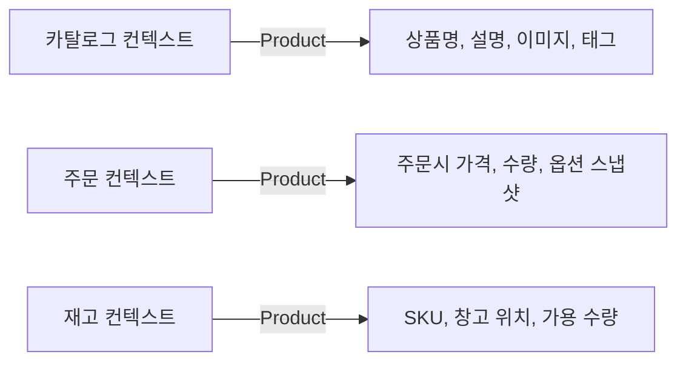
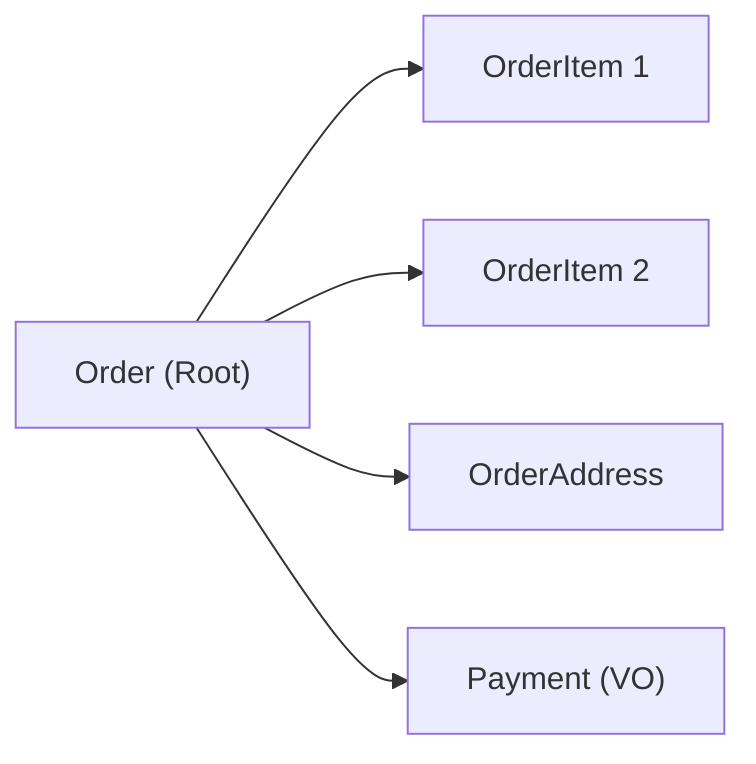
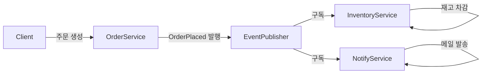
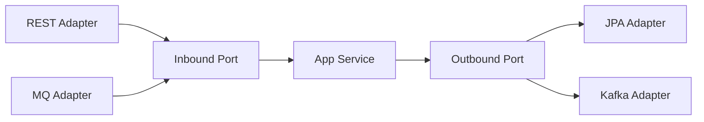
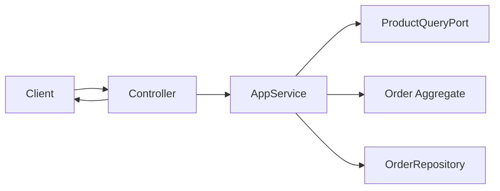
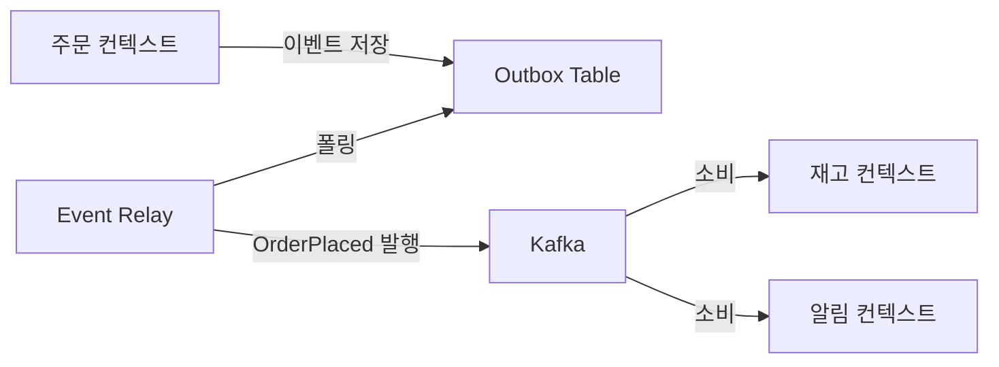
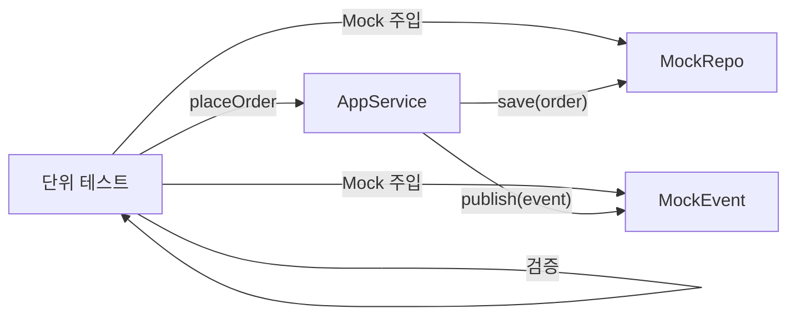

## 실생활 비유: 쇼핑몰을 DB 중심으로 설계하면 생기는 일

어느 스타트업이 이커머스 서비스를 만들었습니다. 처음에는 MySQL 테이블을 먼저 설계하고, 그 위에 Service 클래스를 얹었습니다. `orders` 테이블, `products` 테이블, `users` 테이블. 모두 JPA Entity로 매핑되어 `@OneToMany`, `@ManyToMany` 관계가 엉켜 있습니다.

6개월 후, 문제가 터집니다. "주문 취소 시 재고를 복구해야 하는데, 어디서 해야 하나?" — `OrderService`에서 `ProductService`를 호출해야 하는가? 아니면 `ProductService`에서 `OrderService`를 호출해야 하는가? 두 서비스가 서로를 호출하다 순환 의존성이 생깁니다. "쿠폰 적용 로직이 어디 있지?" — `OrderService`에 있는 것 같기도 하고, `CouponService`에 있는 것 같기도 합니다. 중복 구현이 양쪽에 흩어져 있습니다.

이것이 **DB 중심 설계**의 결말입니다. 비즈니스 규칙이 서비스 레이어에 흩어지고, DB 스키마 변경이 전체를 깨뜨리고, 무엇이 진짜 비즈니스 규칙인지 코드에서 찾을 수 없습니다.

**DDD(Domain-Driven Design)**는 이 문제를 정반대 방향에서 접근합니다. DB가 아니라 **비즈니스 도메인**을 먼저 설계하고, 기술은 그것을 지원하는 역할에 머물게 합니다.

---

## 1. DDD란 무엇인가 — 기술이 아닌 비즈니스를 코드에

DDD는 Eric Evans가 2003년에 정리한 소프트웨어 설계 철학입니다. 핵심 주장은 단순합니다: **코드는 비즈니스 전문가와 개발자가 공유하는 언어(Ubiquitous Language)로 표현되어야 하며, 그 중심에는 도메인 모델이 있어야 한다.**

기술적 용어가 아니라 비즈니스 전문가가 쓰는 말 — "주문", "배송", "환불", "재고 차감" — 이 그대로 코드에 나타나야 합니다. `OrderService.processPaymentAndUpdateInventory()`가 아니라 `Order.place()`, `Order.cancel()`, `Inventory.deduct()`처럼요.

왜 이것이 중요한가? 코드와 비즈니스가 같은 언어를 쓰면, 요구사항이 바뀔 때 "이 비즈니스 규칙이 코드 어디에 있지?"라는 질문에 즉시 답할 수 있습니다. 반대로 기술 용어로 가득한 코드에서 비즈니스 규칙을 찾는 일은 고고학적 발굴 작업과 다름없습니다.

---

## 2. Bounded Context — 왜 "상품"이 두 가지 의미를 가지는가



가장 먼저 이해해야 할 개념이 **Bounded Context(경계 있는 컨텍스트)**입니다.

이커머스 시스템에서 "상품"은 부서마다 다른 의미를 가집니다.

- **카탈로그 팀**이 말하는 "상품"은 이름, 설명, 이미지, 태그입니다. 검색 노출과 마케팅이 관심사입니다.
- **주문 팀**이 말하는 "상품"은 주문 당시의 가격과 옵션입니다. 나중에 가격이 바뀌어도 주문 당시 금액이 보존되어야 합니다.
- **재고 팀**이 말하는 "상품"은 SKU 코드와 창고 위치와 가용 수량입니다. 이름 같은 건 관심 없습니다.

이 세 "상품"을 하나의 `Product` 클래스로 표현하면 어떻게 될까요? 클래스에 관심사가 다른 필드들이 쏟아집니다. 카탈로그가 이미지 URL을 추가하면 재고 모듈도 재컴파일됩니다. 주문이 가격 스냅샷을 추가하면 카탈로그 팀이 영향을 받습니다.

**Bounded Context는 "이 모델이 유효한 경계"를 명시적으로 선언합니다.** 카탈로그 컨텍스트 안에서 `Product`는 마케팅 정보를 담습니다. 주문 컨텍스트 안에서 `OrderItem`은 스냅샷 가격을 담습니다. 두 `Product`는 같은 이름을 쓰지 않아도 됩니다 — 오히려 다른 이름을 쓰는 것이 명확합니다.

### Bounded Context 간 통신 방식

컨텍스트들은 완전히 격리되지 않습니다. 주문이 생성될 때 카탈로그에서 현재 가격을 가져와야 하고, 주문이 완료되면 재고를 차감해야 합니다. 이 통신 방식이 중요합니다.

가장 나쁜 방식은 **직접 DB 공유**입니다. 주문 서비스가 카탈로그 DB의 `products` 테이블을 직접 읽는 것. Bounded Context의 경계가 사라집니다.

좋은 방식은 두 가지입니다.

첫째, **API 호출**: 주문 서비스가 카탈로그 서비스의 API를 통해 가격을 조회합니다. 명시적인 계약이 생깁니다.

둘째, **Domain Event**: 주문이 완료되면 `OrderPlaced` 이벤트를 발행합니다. 재고 서비스가 이를 구독해 재고를 차감합니다. 주문 서비스는 재고 서비스의 존재를 알 필요가 없습니다.

---

## 3. Aggregate — 왜 트랜잭션 경계가 필요한가



**Aggregate**는 데이터 일관성을 함께 보장해야 하는 객체들의 묶음입니다. 그리고 **Aggregate Root**는 그 묶음의 유일한 진입점입니다.

왜 이것이 필요한가? 주문에는 여러 OrderItem이 있습니다. 주문 총액은 모든 OrderItem 금액의 합입니다. 만약 OrderItem을 직접 수정할 수 있다면 어떻게 될까요? 어디선가 OrderItem의 수량을 바꿨는데 주문 총액이 갱신되지 않는 상황이 발생합니다. 불일치입니다.

Aggregate Root가 모든 변경의 유일한 경로가 되면 이 문제가 사라집니다. `Order.addItem()`, `Order.removeItem()` — Order를 통해서만 OrderItem을 변경할 수 있습니다. Order는 변경 후 총액을 재계산합니다. 일관성이 항상 보장됩니다.

**왜 Aggregate Root가 트랜잭션 경계인가?**

하나의 트랜잭션은 하나의 Aggregate만 수정해야 한다는 규칙이 있습니다. 왜냐하면 Aggregate는 일관성 단위이기 때문입니다. 두 Aggregate를 하나의 트랜잭션으로 묶으면 잠금 범위가 커지고, 확장성이 떨어지고, Aggregate 경계가 흐려집니다.

주문 생성 시 재고를 차감해야 한다면? 같은 트랜잭션에서 `Order`와 `Inventory`를 동시에 수정하면 안 됩니다. `Order`를 저장하고 `OrderPlaced` 이벤트를 발행하면, `Inventory` Aggregate가 별도 트랜잭션으로 재고를 차감합니다. 최종 일관성(Eventual Consistency)을 수용하는 것입니다.

### Aggregate 설계 원칙

```java
// 잘못된 설계: 외부에서 OrderItem 직접 조작
order.getItems().add(new OrderItem(product, 3));
order.setTotalAmount(order.getTotalAmount() + product.getPrice() * 3);

// 올바른 설계: Aggregate Root를 통한 단일 진입점
order.addItem(product, 3);
// Order.addItem() 내부에서 OrderItem 생성 + 총액 재계산 + 불변식 검증
```

```java
@Entity
public class Order {
    @Id
    private OrderId id;

    @OneToMany(cascade = CascadeType.ALL, orphanRemoval = true)
    private List<OrderItem> items = new ArrayList<>();

    private Money totalAmount;

    private OrderStatus status;

    // Aggregate Root를 통한 유일한 진입점
    public void addItem(Product product, int quantity) {
        validateOrderable(); // 비즈니스 불변식 검증
        OrderItem item = OrderItem.of(product.getId(), product.getPrice(), quantity);
        items.add(item);
        recalculateTotalAmount(); // 일관성 유지
    }

    public void cancel() {
        if (status != OrderStatus.PENDING) {
            throw new IllegalStateException("배송 시작 이후 취소 불가");
        }
        this.status = OrderStatus.CANCELLED;
        registerEvent(new OrderCancelledEvent(this.id)); // 도메인 이벤트 등록
    }

    private void validateOrderable() {
        if (status != OrderStatus.DRAFT) {
            throw new IllegalStateException("초안 상태에서만 상품 추가 가능");
        }
    }
}
```

---

## 4. Entity vs Value Object — 식별자가 있는가, 값이 같으면 같은가

**Entity**는 식별자(ID)로 구분됩니다. 두 주문이 모든 내용이 같아도 ID가 다르면 다른 주문입니다. 주문의 상품이 바뀌어도 같은 주문 ID로 추적합니다. 시간에 따라 상태가 변하는 객체입니다.

**Value Object**는 속성 값으로 구분됩니다. 5000원짜리 두 객체는 같습니다. 배송 주소 "서울시 강남구 테헤란로"와 또 다른 "서울시 강남구 테헤란로"는 같습니다. 불변(Immutable)이고, 교체하면 됩니다. 수정하는 개념이 없습니다.

### 왜 Value Object가 중요한가

```java
// 원시값 집착 (Primitive Obsession) - 나쁜 예
public class Order {
    private int amount;        // 금액인지 수량인지 불명확
    private String currency;   // amount와 항상 함께 다녀야 하는데 분리됨
}

// Value Object - 좋은 예
public class Money {
    private final BigDecimal amount;
    private final Currency currency;

    // 불변: 새 객체 반환
    public Money add(Money other) {
        validateSameCurrency(other);
        return new Money(this.amount.add(other.amount), this.currency);
    }

    // 값 동등성
    @Override
    public boolean equals(Object o) {
        if (!(o instanceof Money)) return false;
        Money other = (Money) o;
        return this.amount.compareTo(other.amount) == 0
            && this.currency.equals(other.currency);
    }
}
```

`Money`는 금액과 통화를 하나의 개념으로 묶습니다. 메서드는 비즈니스 언어를 표현합니다. 불변이기 때문에 공유해도 안전합니다. 이것이 Value Object의 힘입니다.

---

## 5. Domain Event — 왜 컨텍스트 간 결합을 끊어야 하는가



**Domain Event**는 "도메인에서 중요한 일이 일어났다"는 사실을 표현합니다. `OrderPlaced`, `OrderCancelled`, `PaymentCompleted` — 과거형 이름이 핵심입니다. 이미 일어난 사실이므로 변경할 수 없습니다.

왜 Domain Event가 필요한가? 주문이 완료되면 여러 일이 일어나야 합니다.

1. 재고 차감
2. 결제 처리
3. 주문 확인 메일 발송
4. 포인트 적립
5. 마케팅 데이터 기록

이것들을 모두 `OrderService.placeOrder()`에 넣으면 어떻게 될까요? OrderService가 InventoryService, PaymentService, NotificationService, PointService, AnalyticsService를 모두 의존합니다. 포인트 서비스가 장애나면 주문 자체가 실패합니다. 마케팅 팀이 데이터 추가를 요청할 때마다 OrderService를 수정해야 합니다.

Domain Event를 사용하면 OrderService는 `OrderPlaced` 이벤트만 발행합니다. 각 서비스가 스스로 구독합니다. OrderService는 이들의 존재를 알 필요가 없습니다. 포인트 서비스가 추가되어도 OrderService는 변경 없습니다.

```java
public class Order {
    @Transient
    private List<DomainEvent> domainEvents = new ArrayList<>();

    public void place() {
        validateCanPlace();
        this.status = OrderStatus.PLACED;
        // 이벤트를 모아두고 저장 시점에 발행
        registerEvent(new OrderPlacedEvent(
            this.id,
            this.customerId,
            this.items,
            this.totalAmount,
            Instant.now()
        ));
    }

    public List<DomainEvent> getDomainEvents() {
        return Collections.unmodifiableList(domainEvents);
    }

    public void clearDomainEvents() {
        domainEvents.clear();
    }
}
```

---

## 6. Repository — 왜 컬렉션처럼 다루어야 하는가

**Repository**는 Aggregate의 저장과 조회를 담당합니다. 핵심은 Repository가 컬렉션처럼 보여야 한다는 것입니다. 호출자는 내부가 MySQL인지 MongoDB인지 Redis인지 알면 안 됩니다.

```java
// Repository 인터페이스 — 도메인 레이어에 위치
public interface OrderRepository {
    void save(Order order);
    Optional<Order> findById(OrderId id);
    List<Order> findByCustomerId(CustomerId customerId);
}

// JPA 구현체 — 인프라 레이어에 위치
@Repository
public class JpaOrderRepository implements OrderRepository {
    private final SpringDataOrderRepository jpaRepo;

    @Override
    public void save(Order order) {
        jpaRepo.save(orderMapper.toEntity(order));
        // 도메인 이벤트 발행
        order.getDomainEvents().forEach(eventPublisher::publish);
        order.clearDomainEvents();
    }

    @Override
    public Optional<Order> findById(OrderId id) {
        return jpaRepo.findById(id.getValue())
            .map(orderMapper::toDomain);
    }
}
```

왜 인터페이스가 도메인 레이어에 있어야 하는가? 도메인이 인프라를 모르기 위해서입니다. `Order` 클래스는 JPA의 존재를 몰라야 합니다. `@Entity`, `@Column` 같은 어노테이션이 도메인 클래스에 붙는 순간 도메인이 JPA에 오염됩니다. 순수한 도메인 모델은 어디에도 의존하지 않습니다.

---

## 7. 헥사고날 아키텍처 — 왜 레이어드보다 나은가



레이어드 아키텍처에서 의존성은 위에서 아래로 흐릅니다. Presentation → Service → Repository → DB. 이 구조에서 DB는 맨 아래에 있지만 사실상 모든 레이어가 DB에 종속됩니다. MySQL을 PostgreSQL로 바꾸려면? Service 레이어의 네이티브 쿼리들, Repository 레이어의 JPA 설정들을 모두 손대야 합니다. DB가 아키텍처를 지배합니다.

**헥사고날 아키텍처(Ports & Adapters)**는 의존성 방향을 역전시킵니다. 모든 의존성이 **도메인을 향합니다.** 도메인은 아무것도 모릅니다. REST가 있는지, Kafka가 있는지, MySQL이 있는지 — 아무것도요.

### Port와 Adapter의 의미

**Port**는 도메인과 외부 세계 사이의 **계약(인터페이스)**입니다.

- **Inbound Port**: 외부가 도메인을 호출하는 계약. `PlaceOrderUseCase` 인터페이스가 대표적입니다.
- **Outbound Port**: 도메인이 외부를 호출하는 계약. `OrderRepository` 인터페이스가 대표적입니다.

**Adapter**는 그 계약의 **구현체**입니다.

- **Inbound Adapter**: REST 컨트롤러, gRPC 핸들러, 메시지 컨슈머 — 외부 요청을 받아 UseCase를 호출합니다.
- **Outbound Adapter**: JPA Repository, Kafka Producer, HTTP Client — UseCase가 정의한 인터페이스를 실제 기술로 구현합니다.

### 왜 이 구조가 유연한가

MySQL을 MongoDB로 바꾼다고 가정합시다. Outbound Port인 `OrderRepository` 인터페이스는 그대로입니다. 도메인 로직도 그대로입니다. `JpaOrderRepository`를 `MongoOrderRepository`로 교체하면 끝입니다. 도메인은 변화를 전혀 모릅니다.

REST API를 gRPC로 추가한다고 가정합시다. `PlaceOrderUseCase` 인터페이스는 그대로입니다. `gRPCOrderAdapter`를 새로 만들어 UseCase를 호출하면 됩니다. 도메인 로직은 변화 없습니다.

---

## 8. Spring Boot 실전 — 헥사고날 패키지 구조

```
src/main/java/com/example/order/
├── domain/                          # 순수 도메인 (아무것도 의존 안 함)
│   ├── model/
│   │   ├── Order.java               # Aggregate Root
│   │   ├── OrderItem.java           # Entity
│   │   ├── OrderId.java             # Value Object
│   │   ├── Money.java               # Value Object
│   │   └── OrderStatus.java
│   ├── event/
│   │   ├── OrderPlacedEvent.java    # Domain Event
│   │   └── OrderCancelledEvent.java
│   └── service/
│       └── OrderDiscountService.java # Domain Service (순수 비즈니스 로직)
│
├── application/                     # 유스케이스 조율 (도메인만 의존)
│   ├── port/
│   │   ├── in/                      # Inbound Port (UseCase Interface)
│   │   │   ├── PlaceOrderUseCase.java
│   │   │   └── CancelOrderUseCase.java
│   │   └── out/                     # Outbound Port
│   │       ├── OrderRepository.java
│   │       ├── ProductQueryPort.java
│   │       └── EventPublisher.java
│   └── service/
│       └── OrderApplicationService.java  # UseCase 구현체
│
└── adapter/                         # 기술 세부사항 (도메인/앱 의존)
    ├── in/
    │   ├── web/
    │   │   └── OrderController.java  # Inbound Adapter (REST)
    │   └── messaging/
    │       └── PaymentEventConsumer.java
    └── out/
        ├── persistence/
        │   ├── JpaOrderRepository.java    # Outbound Adapter (JPA)
        │   └── OrderJpaEntity.java
        └── messaging/
            └── KafkaEventPublisher.java
```

### Inbound Port — UseCase 인터페이스

```java
// application/port/in/PlaceOrderUseCase.java
public interface PlaceOrderUseCase {
    OrderId placeOrder(PlaceOrderCommand command);

    @Value  // Lombok immutable DTO
    class PlaceOrderCommand {
        CustomerId customerId;
        List<OrderItemCommand> items;
        Address deliveryAddress;
    }
}
```

### Application Service — UseCase 구현 + 흐름 조율

```java
// application/service/OrderApplicationService.java
@Service
@Transactional
@RequiredArgsConstructor
public class OrderApplicationService implements PlaceOrderUseCase {

    private final OrderRepository orderRepository;
    private final ProductQueryPort productQueryPort;
    private final EventPublisher eventPublisher;

    @Override
    public OrderId placeOrder(PlaceOrderCommand command) {
        // 1. 외부 데이터 조회 (Outbound Port 사용)
        List<Product> products = productQueryPort.findByIds(
            command.getItems().stream()
                .map(PlaceOrderCommand.OrderItemCommand::getProductId)
                .collect(toList())
        );

        // 2. 도메인 객체 생성 및 비즈니스 규칙 실행
        Order order = Order.create(command.getCustomerId(), command.getDeliveryAddress());
        command.getItems().forEach(item -> {
            Product product = findProduct(products, item.getProductId());
            order.addItem(product, item.getQuantity());
        });
        order.place();

        // 3. 저장 및 이벤트 발행 (Outbound Port 사용)
        orderRepository.save(order);
        order.getDomainEvents().forEach(eventPublisher::publish);

        return order.getId();
    }
}
```

### Inbound Adapter — REST Controller

```java
// adapter/in/web/OrderController.java
@RestController
@RequestMapping("/api/orders")
@RequiredArgsConstructor
public class OrderController {

    private final PlaceOrderUseCase placeOrderUseCase;
    private final CancelOrderUseCase cancelOrderUseCase;

    @PostMapping
    public ResponseEntity<OrderResponse> placeOrder(@RequestBody @Valid PlaceOrderRequest request) {
        PlaceOrderCommand command = PlaceOrderCommand.builder()
            .customerId(CustomerId.of(request.getCustomerId()))
            .items(request.getItems().stream()
                .map(i -> new PlaceOrderCommand.OrderItemCommand(
                    ProductId.of(i.getProductId()), i.getQuantity()))
                .collect(toList()))
            .deliveryAddress(Address.of(request.getAddress()))
            .build();

        OrderId orderId = placeOrderUseCase.placeOrder(command);
        return ResponseEntity.created(URI.create("/api/orders/" + orderId.getValue()))
            .body(new OrderResponse(orderId));
    }
}
```

---

## 9. 주문 생성 전체 흐름 — sequenceDiagram



---

## 10. Domain Service vs Application Service — 어디에 로직을 두는가

이 질문은 DDD에서 가장 많이 헷갈리는 부분입니다.

**Domain Service**는 특정 Entity나 Value Object에 자연스럽게 속하지 않는 **도메인 로직**을 담습니다. 인프라 의존성이 없습니다. 외부 API를 호출하지 않습니다. 순수하게 도메인 규칙을 실행합니다.

```java
// 도메인 서비스: 복잡한 할인 계산 — 어느 Aggregate에 속하지 않음
public class OrderDiscountDomainService {
    public Money calculateDiscount(Order order, Customer customer, List<Coupon> coupons) {
        Money baseDiscount = calculateVolumeDiscount(order.getTotalAmount());
        Money memberDiscount = calculateMemberDiscount(customer.getMembershipLevel(), order.getTotalAmount());
        Money couponDiscount = calculateCouponDiscount(coupons, order);
        // 할인 중복 적용 규칙 (도메인 규칙)
        return applyDiscountCombinationRules(baseDiscount, memberDiscount, couponDiscount);
    }
}
```

**Application Service**는 **유스케이스를 조율**합니다. 트랜잭션을 관리하고, Repository에서 Aggregate를 가져오고, Domain Service를 호출하고, 이벤트를 발행합니다. 비즈니스 규칙 자체는 모릅니다. "어떤 순서로 호출할지"만 압니다.

구분 기준은 간단합니다: **이 로직이 DB나 외부 API 없이 실행될 수 있는가?** 그렇다면 Domain Service입니다. 그렇지 않다면 Application Service입니다.

---

## 11. 이벤트 기반 Bounded Context 간 통신 흐름



왜 Outbox 패턴이 필요한가? 주문 저장과 이벤트 발행이 원자적으로 이루어지지 않으면 문제가 생깁니다. 주문은 DB에 저장됐는데 Kafka 발행이 실패하면? 재고가 차감되지 않습니다. Outbox 패턴은 이벤트를 DB에 같은 트랜잭션으로 저장하고, 별도 프로세스가 안전하게 Kafka에 발행합니다. 이벤트 발행의 원자성을 보장합니다.

---

## 12. Port/Adapter 호출 흐름 — 테스트 관점



헥사고날 아키텍처의 가장 큰 장점 중 하나가 테스트입니다. Application Service를 테스트할 때 JPA나 Kafka 없이 Mock으로 대체할 수 있습니다. Outbound Port가 인터페이스이기 때문입니다. 도메인 로직 테스트에 DB 컨테이너가 필요 없습니다. 테스트가 빠르고 독립적입니다.

---

## 13. 극한 시나리오 3가지

### 시나리오 1: 트랜픽 폭증 중 Aggregate 설계 실수

블랙프라이데이 당일, 동시 주문 1만 건이 들어옵니다. 설계 실수로 `Cart` Aggregate가 `Customer`의 일부로 모델링되어 있습니다. 주문 하나를 처리할 때마다 `Customer` Aggregate 전체에 락이 걸립니다. 한 고객의 모든 동시 요청이 직렬화됩니다. 처리량이 급락합니다.

올바른 설계라면 `Cart`는 독립적인 Aggregate여야 합니다. `Customer`와 `Cart`는 ID로만 참조합니다. 락 범위가 최소화됩니다. 이것이 Aggregate 경계를 작게 유지해야 하는 이유입니다.

### 시나리오 2: Bounded Context 미분리로 인한 배포 지옥

카탈로그와 주문이 같은 `Product` 클래스를 공유합니다. 카탈로그 팀이 상품에 `videoUrl` 필드를 추가합니다. DB 마이그레이션을 실행합니다. 주문 서비스도 같은 DB를 씁니다. 주문 서비스를 재배포하지 않으면 `Product` 엔티티 매핑 오류가 납니다. 두 팀이 항상 함께 배포해야 합니다. Bounded Context를 나누지 않으면 **팀 자율성**도 사라집니다.

### 시나리오 3: Domain Event 미사용으로 인한 결합 폭발

결제, 재고, 알림, 포인트, 추천, 분석 — 6개 서비스가 모두 `OrderService.placeOrder()`에서 직접 호출됩니다. 추천 서비스가 응답 지연 500ms를 보입니다. 주문 응답이 500ms 느려집니다. 추천 서비스가 예외를 던집니다. 주문 자체가 실패합니다. 한 서비스의 장애가 주문 전체를 마비시킵니다. Domain Event + 비동기 소비가 아니었기 때문에 발생한 사태입니다.

---

## 14. 면접 포인트 5가지

<details>
<summary>펼쳐보기</summary>


### 면접 포인트 1: Bounded Context와 마이크로서비스의 관계

Bounded Context가 마이크로서비스와 1:1로 대응한다고 오해하는 경우가 많습니다. Bounded Context는 **개념적 경계**입니다. 하나의 마이크로서비스가 여러 Bounded Context를 포함할 수도 있고, 하나의 Bounded Context가 물리적으로 여러 서비스로 분리될 수도 있습니다. 시작할 때는 하나의 프로세스에 여러 Bounded Context를 두고, 팀 크기와 확장성 필요에 따라 물리적으로 분리하는 것이 현실적입니다.

### 면접 포인트 2: Aggregate 경계를 어떻게 결정하는가

두 가지 질문으로 판단합니다. 첫째, "이것들은 항상 함께 조회되는가?" — 그렇다면 같은 Aggregate일 가능성이 높습니다. 둘째, "이것들은 항상 함께 일관성이 유지되어야 하는가?" — 그렇다면 같은 Aggregate여야 합니다. 반면 "하나의 변경이 다른 것의 일관성에 즉시 영향을 주지 않아도 되는가?" — 그렇다면 다른 Aggregate로 분리하고 Domain Event로 통신합니다.

### 면접 포인트 3: 헥사고날 아키텍처에서 도메인이 JPA를 몰라야 하는 이유

도메인 클래스에 `@Entity`, `@Column`이 붙으면 JPA 라이프사이클에 종속됩니다. `@Transient` 필드를 주의해야 하고, 기본 생성자가 필요하고, Lazy 로딩 프록시가 도메인 메서드 호출에 영향을 줍니다. 순수 Java 객체여야 도메인 규칙 테스트가 JPA 없이 빠르게 실행됩니다. 실무에서는 트레이드오프를 고려해 Rich Domain Model에 JPA 어노테이션을 허용하는 팀도 있지만, 이는 편의와 순수성 사이의 의도적 타협입니다.

### 면접 포인트 4: Domain Service가 필요한 경우는 언제인가

단일 Entity나 Value Object에 자연스럽게 속하지 않는 비즈니스 로직이 있을 때입니다. 예를 들어 "두 계좌 간 이체" 로직은 `Account.transfer()`에 넣으면 어색합니다 — 어느 Account의 메서드여야 하는가? 이럴 때 `FundsTransferDomainService`를 만들어 두 Account를 받아 처리합니다. Domain Service는 Stateless이고, 인프라 의존성이 없어야 합니다.

### 면접 포인트 5: Eventual Consistency를 언제 수용하는가

Aggregate 경계를 넘는 일관성은 Eventual Consistency로 처리하는 것이 원칙입니다. 그런데 "지금 당장 재고가 0인데 주문이 들어오면?"처럼 즉시 일관성이 필요한 경우도 있습니다. 이 경우 두 가지 접근이 있습니다. 하나는 예외적으로 같은 트랜잭션에서 두 Aggregate를 처리하는 것(원칙 위반이지만 실용적). 다른 하나는 재고를 "예약"하는 별도 도메인 개념을 도입해 주문 Aggregate 안에서 처리하는 것. 비즈니스 요구사항과 일관성 필요도에 따라 선택합니다.

---

## 15. 실무 실수 Top 5

**실수 1: Anemic Domain Model (빈혈 도메인 모델)**

가장 흔한 실수입니다. `Order` 클래스는 Getter/Setter만 있는 데이터 컨테이너고, 모든 로직은 `OrderService`에 있습니다. 이건 DDD가 아니라 절차적 프로그래밍입니다. `Order.place()`, `Order.cancel()`, `Order.addItem()` — 비즈니스 행동이 도메인 객체 안에 있어야 합니다.

**실수 2: Aggregate를 너무 크게 설계**

주문에 관련된 모든 것 — 주문, 주문 항목, 배송, 결제, 환불 — 을 하나의 `Order` Aggregate로 묶는 실수입니다. 배송 상태 변경 시 주문 전체에 락이 걸립니다. 환불 조회 시 전체 Aggregate를 로드합니다. Aggregate는 가능한 작게 유지하고, `Order`, `Shipment`, `Payment`를 각각 독립 Aggregate로 분리하는 것이 낫습니다.

**실수 3: Application Service에 도메인 로직 누수**

```java
// 나쁜 예: Application Service에 도메인 로직
public void cancelOrder(OrderId id) {
    Order order = orderRepository.findById(id).orElseThrow();
    if (order.getStatus() == OrderStatus.SHIPPED) {  // 도메인 규칙이 여기 있음
        throw new BusinessException("배송 후 취소 불가");
    }
    order.setStatus(OrderStatus.CANCELLED);  // Setter 직접 호출
}

// 좋은 예: 도메인 로직은 도메인 객체에
public void cancelOrder(OrderId id) {
    Order order = orderRepository.findById(id).orElseThrow();
    order.cancel();  // 규칙과 상태 변경 모두 Order 내부
    orderRepository.save(order);
}
```

**실수 4: Bounded Context 없이 공유 도메인 모델 사용**

모든 서비스가 공통 라이브러리의 `Product`, `Customer` 클래스를 공유합니다. 공통 라이브러리 변경 시 모든 서비스를 재배포해야 합니다. Bounded Context별로 자체 모델을 가지고, 컨텍스트 간 번역(Anti-Corruption Layer)을 명시적으로 만드는 것이 맞습니다.

**실수 5: Domain Event를 CRUD 이벤트로 오용**

`ProductUpdatedEvent`, `UserDeletedEvent`처럼 기술적 CRUD를 표현하는 이벤트는 Domain Event가 아닙니다. `OrderPlacedEvent`, `PaymentCompletedEvent`, `ItemOutOfStockEvent`처럼 **비즈니스 의미**를 담아야 합니다. 이벤트 이름만 보고도 "무슨 일이 일어났는지" 이해할 수 있어야 합니다.

---

## 16. Anti-Corruption Layer — 외부 시스템의 오염을 막는 방패

레거시 시스템과 통합하거나 서드파티 API를 연동할 때, 외부 모델이 도메인에 직접 침투하면 안 됩니다. 외부 결제 게이트웨이의 `PaymentGatewayResponse` 객체가 도메인 코드 전반에 퍼지면, 결제 게이트웨이가 바뀔 때 도메인까지 수정해야 합니다.

**Anti-Corruption Layer(ACL)**는 외부 모델을 도메인 모델로 번역하는 계층입니다.

```java
// 외부 결제 게이트웨이 응답 (외부 모델)
public class TossPaymentResponse {
    private String paymentKey;
    private String orderId;
    private String status;     // "DONE", "CANCELED", "ABORTED"
    private Long totalAmount;
    private String approvedAt; // "2026-05-12T10:30:00+09:00" 형식
}

// Anti-Corruption Layer: 외부 모델 → 도메인 모델 번역
@Component
public class TossPaymentAcl {

    public Payment translate(TossPaymentResponse response) {
        return Payment.builder()
            .paymentId(PaymentId.of(response.getPaymentKey()))
            .orderId(OrderId.of(response.getOrderId()))
            .status(translateStatus(response.getStatus()))  // 외부 상태 → 도메인 상태
            .amount(Money.won(response.getTotalAmount()))
            .approvedAt(parseDateTime(response.getApprovedAt()))
            .build();
    }

    private PaymentStatus translateStatus(String externalStatus) {
        return switch (externalStatus) {
            case "DONE" -> PaymentStatus.COMPLETED;
            case "CANCELED" -> PaymentStatus.CANCELLED;
            case "ABORTED" -> PaymentStatus.FAILED;
            default -> throw new IllegalArgumentException("알 수 없는 결제 상태: " + externalStatus);
        };
    }
}
```

외부 게이트웨이가 KakaoPay로 교체되면 `KakaoPayAcl`을 새로 만들면 됩니다. 도메인 코드는 변경 없습니다. 헥사고날 아키텍처에서 ACL은 Outbound Adapter 내부에 위치합니다.

---

## 17. Value Object 심화 — 식별자(ID) Value Object

원시 타입으로 식별자를 표현하면 타입 혼동이 발생합니다.

```java
// 원시 타입 식별자의 문제
public Order findOrder(Long orderId, Long customerId) { ... }

// 실수로 파라미터 순서를 바꿔 호출 — 컴파일 오류 없음!
orderService.findOrder(customerId, orderId);
```

`Long orderId`와 `Long customerId`는 컴파일러 입장에서 동일한 타입입니다. 파라미터 순서를 실수로 바꿔 호출해도 컴파일 오류가 없습니다. 런타임에 잘못된 주문이 조회됩니다.

```java
// Value Object 식별자 — 타입 안전
public final class OrderId {
    private final Long value;

    private OrderId(Long value) {
        if (value == null || value <= 0) throw new IllegalArgumentException("유효하지 않은 OrderId: " + value);
        this.value = value;
    }

    public static OrderId of(Long value) {
        return new OrderId(value);
    }

    public Long getValue() { return value; }

    @Override
    public boolean equals(Object o) {
        if (!(o instanceof OrderId)) return false;
        return Objects.equals(value, ((OrderId) o).value);
    }

    @Override
    public int hashCode() { return Objects.hash(value); }
}

public final class CustomerId {
    private final Long value;
    // ... 동일 구조
}

// 이제 파라미터 순서를 바꾸면 컴파일 오류
public Order findOrder(OrderId orderId, CustomerId customerId) { ... }

// 컴파일 오류: CustomerId를 OrderId 자리에 넣을 수 없음
orderService.findOrder(customerId, orderId); // 컴파일 에러!
```

Java 14+의 `record`를 사용하면 더 간결합니다.

```java
public record OrderId(Long value) {
    public OrderId {
        if (value == null || value <= 0)
            throw new IllegalArgumentException("유효하지 않은 OrderId");
    }

    public static OrderId of(Long value) {
        return new OrderId(value);
    }
}
```

---

## 18. Outbound Adapter 테스트 전략 — 어떻게 인프라 없이 테스트하는가

헥사고날 아키텍처의 테스트 전략은 레이어별로 다릅니다.

```java
// 1. 도메인 단위 테스트 — 순수 Java, Spring 없음
class OrderTest {
    @Test
    void 주문_취소_배송시작후_실패() {
        Order order = Order.create(CustomerId.of(1L));
        order.place();
        order.startShipping();

        assertThatThrownBy(order::cancel)
            .isInstanceOf(IllegalStateException.class)
            .hasMessage("배송 시작 이후 취소 불가");
    }
}

// 2. Application Service 단위 테스트 — Mock 사용
class OrderApplicationServiceTest {
    private final OrderRepository orderRepository = mock(OrderRepository.class);
    private final ProductQueryPort productQueryPort = mock(ProductQueryPort.class);
    private final EventPublisher eventPublisher = mock(EventPublisher.class);

    private final OrderApplicationService service =
        new OrderApplicationService(orderRepository, productQueryPort, eventPublisher);

    @Test
    void 주문_생성_성공() {
        given(productQueryPort.findByIds(any())).willReturn(List.of(testProduct()));
        willDoNothing().given(orderRepository).save(any());

        OrderId orderId = service.placeOrder(testCommand());

        then(orderRepository).should().save(any(Order.class));
        then(eventPublisher).should().publish(any(OrderPlacedEvent.class));
    }
}

// 3. Outbound Adapter 슬라이스 테스트 — 실제 DB 사용
@DataJpaTest
class JpaOrderRepositoryTest {
    @Autowired
    private JpaOrderRepository repository;

    @Test
    void 주문_저장_조회() {
        Order order = Order.create(CustomerId.of(1L));
        order.place();

        repository.save(order);

        Optional<Order> found = repository.findById(order.getId());
        assertThat(found).isPresent();
        assertThat(found.get().getStatus()).isEqualTo(OrderStatus.PLACED);
    }
}

// 4. Inbound Adapter 슬라이스 테스트 — MockMvc 사용
@WebMvcTest(OrderController.class)
class OrderControllerTest {
    @MockBean
    private PlaceOrderUseCase placeOrderUseCase;

    @Autowired
    private MockMvc mockMvc;

    @Test
    void 주문_생성_API() throws Exception {
        given(placeOrderUseCase.placeOrder(any())).willReturn(OrderId.of(1L));

        mockMvc.perform(post("/api/orders")
                .contentType(MediaType.APPLICATION_JSON)
                .content("""
                    {"customerId": 1, "items": [{"productId": 10, "quantity": 2}]}
                    """))
            .andExpect(status().isCreated());
    }
}
```

이 네 가지 테스트 계층이 헥사고날의 핵심 장점입니다. 도메인 테스트는 JVM만 있으면 되고, Application Service 테스트는 Mock만 있으면 되고, Adapter 테스트는 필요한 인프라만 띄웁니다. `@SpringBootTest`로 전체를 올리는 무거운 테스트가 최소화됩니다.

---

## 19. ArchUnit으로 헥사고날 규칙 강제하기

아키텍처 규칙을 문서로만 관리하면 시간이 지나 무너집니다. 코드로 검증합니다.

```java
@AnalyzeClasses(packages = "com.example.order")
class HexagonalArchitectureTest {

    // 도메인은 Spring에 의존하지 않는다
    @ArchTest
    static final ArchRule domainShouldNotDependOnSpring =
        noClasses().that().resideInAPackage("..domain..")
            .should().dependOnClassesThat()
            .resideInAnyPackage("org.springframework..", "javax.persistence..");

    // Adapter는 다른 Adapter를 직접 의존하지 않는다
    @ArchTest
    static final ArchRule adaptersShouldNotDependOnEachOther =
        noClasses().that().resideInAPackage("..adapter.in..")
            .should().dependOnClassesThat()
            .resideInAPackage("..adapter.out..");

    // Application Service는 Port 인터페이스를 통해서만 외부와 통신한다
    @ArchTest
    static final ArchRule appServiceShouldOnlyDependOnPorts =
        noClasses().that().resideInAPackage("..application.service..")
            .should().dependOnClassesThat()
            .resideInAPackage("..adapter..");

    // Inbound Port는 인터페이스여야 한다
    @ArchTest
    static final ArchRule inboundPortsShouldBeInterfaces =
        classes().that().resideInAPackage("..port.in..")
            .should().beInterfaces();
}
```

이 테스트들은 CI 파이프라인에서 실행됩니다. 누군가 `adapter.in` 패키지에서 JPA 코드를 직접 쓰거나, `domain` 패키지에서 Spring 어노테이션을 쓰면 빌드가 실패합니다. 아키텍처 규칙이 코드 수준의 규율이 됩니다.

---

## 20. DDD + 헥사고날 도입 로드맵 — 어떤 순서로 시작하는가

기존 레이어드 서비스에 DDD + 헥사고날을 도입할 때 단계별 접근이 중요합니다.

**1단계: 도메인 모델 식별 (2~4주)**

현재 Service 클래스의 메서드들을 분석해 비즈니스 개념을 추출합니다. "주문 생성", "주문 취소", "재고 차감" — 이것들이 Aggregate와 도메인 메서드 후보입니다. 화이트보드에 Aggregate, Entity, Value Object, Bounded Context를 스케치합니다. 코드 변경 없이 개념 정리만 합니다.

**2단계: Value Object 도입 (1~2주)**

`Long orderId` → `OrderId`, `String currency + BigDecimal amount` → `Money`. 가장 안전한 변경입니다. 테스트가 그린이면 진행합니다.

**3단계: Repository 인터페이스 분리 (2~3주)**

`JpaRepository`를 상속하던 Repository를 순수 인터페이스로 추출합니다. JPA 구현체는 Adapter 패키지로 이동합니다. 이 단계에서 의존성 방향이 역전됩니다.

**4단계: Domain 메서드 이전 (3~6주)**

Service에 흩어진 도메인 로직을 Entity/Aggregate 메서드로 이동합니다. `OrderService.validateAndCancel()` → `Order.cancel()`. 가장 핵심적이고 가장 시간이 걸립니다.

**5단계: UseCase 인터페이스 + Controller 분리 (1~2주)**

Application Service에 UseCase 인터페이스를 붙이고 Controller가 인터페이스를 의존하게 합니다. 이제 Controller를 바꿔도 Application Service는 모릅니다.

이 다섯 단계를 완료하면 완전한 헥사고날 구조가 됩니다. 전체 마이그레이션에 2~4개월이 걸리지만, 각 단계마다 서비스는 계속 정상 운영됩니다.

---

## 정리

DDD와 헥사고날 아키텍처는 개별 기술이 아니라 **철학**입니다. DDD는 "코드가 비즈니스를 반영해야 한다"고 말하고, 헥사고날은 "비즈니스가 기술에 종속되면 안 된다"고 말합니다. 두 가지가 만나면 비즈니스 로직이 도메인 객체 안에 살고, 기술 세부사항은 교체 가능한 어댑터가 됩니다.

복잡한 비즈니스 도메인, 팀이 성장하는 서비스, 장기 운영이 예상되는 시스템 — 이 세 조건이 맞을 때 DDD + 헥사고날의 투자 대비 효과가 극대화됩니다. 단순한 CRUD 서비스에 억지로 적용하면 오버엔지니어링입니다. 맥락을 읽는 것이 가장 중요합니다.

</details>
