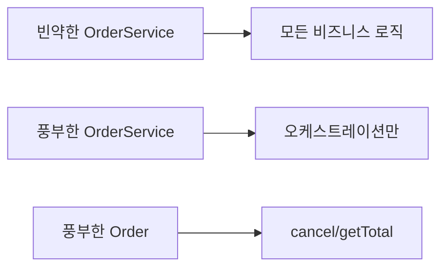
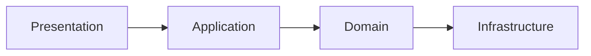
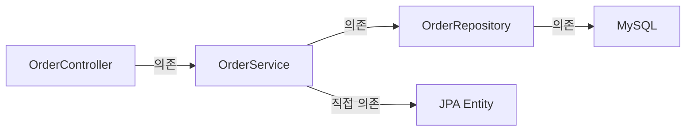
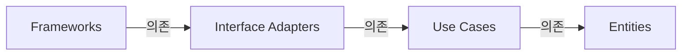
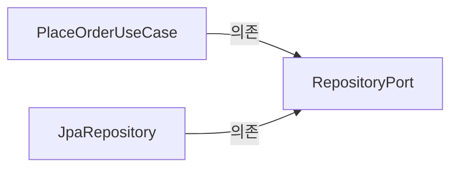
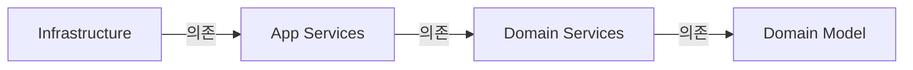
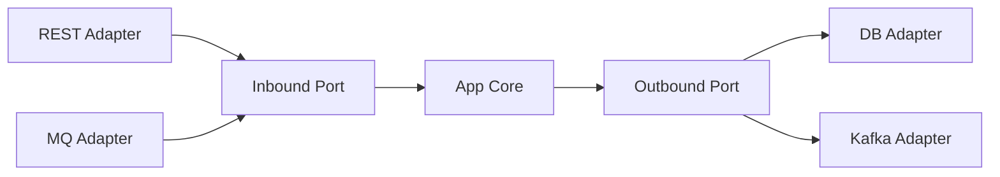
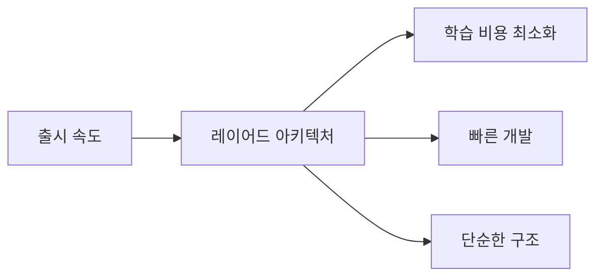
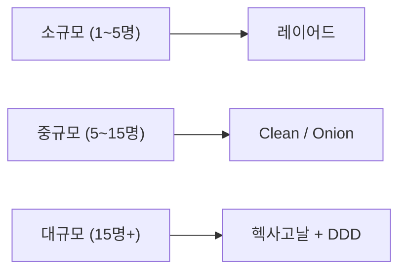

## 실생활 비유: 건물 설계와 자동차 엔진

> 건물을 지을 때 내부 구조(벽, 기둥, 배관)가 외부 마감재(타일, 페인트)에 종속되면 안 됩니다. 타일을 바꿀 때마다 벽을 허물어야 한다면 유지보수가 불가능합니다.

> 자동차의 핵심은 엔진입니다. 연료 주입 방식(주유구 vs 충전 포트)이 바뀌어도 엔진 설계는 동일합니다. 헥사고날 아키텍처에서 도메인(엔진)은 DB, API, 메시지큐 같은 외부 기술(외장 부품)에 의존하지 않습니다. 포트(인터페이스)를 통해 연결만 됩니다.

소프트웨어 아키텍처도 마찬가지입니다. **"무엇이 무엇에 의존하는가"**가 핵심입니다. 비즈니스 로직이 DB에 종속되면, DB를 바꿀 때 비즈니스 로직도 바뀝니다. 비즈니스 로직이 프레임워크에 종속되면, 프레임워크를 바꿀 때 모든 것이 흔들립니다.

이 글에서 다루는 네 가지 아키텍처 패턴은 결국 하나의 질문에 대한 각기 다른 답입니다: **"의존성이 어느 방향으로 흘러야 하는가?"**

---

## 1. 트랜잭션 스크립트 vs 도메인 모델 — 아키텍처 논의의 출발점

아키텍처 패턴을 이해하려면 먼저 비즈니스 로직을 **어디에 배치하는가**를 결정해야 합니다. 두 가지 대표 패턴이 있습니다.

### 1.1 트랜잭션 스크립트 패턴

비즈니스 로직이 서비스 계층에 절차적으로 집중됩니다.

```java
// 트랜잭션 스크립트 방식 — 서비스가 모든 것을 처리
@Service
@Transactional
public class OrderService {

    public void createOrder(Long memberId, Long itemId, int quantity) {
        Member member = memberRepository.findById(memberId).orElseThrow();
        Item item = itemRepository.findById(itemId).orElseThrow();

        if (item.getStockQuantity() < quantity) {
            throw new NotEnoughStockException("재고 부족");
        }

        int totalPrice = item.getPrice() * quantity;

        if (member.getMoney() < totalPrice) {
            throw new InsufficientFundsException("잔액 부족");
        }

        // 재고 차감
        item.setStockQuantity(item.getStockQuantity() - quantity);
        // 포인트 차감
        member.setMoney(member.getMoney() - totalPrice);

        // 주문 생성
        Order order = new Order();
        order.setMemberId(memberId);
        order.setItemId(itemId);
        order.setQuantity(quantity);
        order.setTotalPrice(totalPrice);
        order.setStatus(OrderStatus.ORDERED);
        order.setCreatedAt(LocalDateTime.now());

        orderRepository.save(order);
        itemRepository.save(item);
        memberRepository.save(member);
    }
}
```

문제점: 비즈니스 규칙이 서비스에 흩어짐, 테스트 시 Spring 컨텍스트 필요, 도메인 객체가 데이터 보관만 함(빈혈 도메인).

### 1.2 도메인 모델 패턴

비즈니스 로직이 도메인 객체에 있습니다.

```java
// 풍부한 도메인 모델 (Rich Domain Model)
public class Order {

    private Member member;
    private List<OrderItem> orderItems = new ArrayList<>();
    private OrderStatus status;

    // 팩토리 메서드 — 생성 규칙을 도메인에서 관리
    public static Order create(Member member, Item item, int quantity) {
        Order order = new Order();
        order.member = member;
        order.status = OrderStatus.ORDERED;

        OrderItem orderItem = OrderItem.create(order, item, quantity);
        order.orderItems.add(orderItem);
        return order;
    }

    // 비즈니스 메서드 — 도메인 로직을 도메인 객체에서 처리
    public void cancel() {
        if (status == OrderStatus.DELIVERY) {
            throw new IllegalStateException("배송 중에는 취소 불가");
        }
        this.status = OrderStatus.CANCELLED;
        orderItems.forEach(OrderItem::cancel);
    }

    public int getTotalPrice() {
        return orderItems.stream()
            .mapToInt(OrderItem::getTotalPrice)
            .sum();
    }
}

public class Item {

    private int stockQuantity;
    private int price;

    // 재고 관련 로직은 Item이 처리
    public void removeStock(int quantity) {
        int restStock = stockQuantity - quantity;
        if (restStock < 0) {
            throw new NotEnoughStockException("재고 부족. 현재: " + stockQuantity);
        }
        this.stockQuantity = restStock;
    }

    public void addStock(int quantity) {
        this.stockQuantity += quantity;
    }
}

// 서비스는 얇아짐 (Thin Service)
@Service
@Transactional
public class OrderService {

    public Long createOrder(Long memberId, Long itemId, int count) {
        Member member = memberRepository.findById(memberId).orElseThrow();
        Item item = itemRepository.findById(itemId).orElseThrow();

        Order order = Order.create(member, item, count); // 도메인에서 처리
        orderRepository.save(order);
        return order.getId();
    }

    public void cancelOrder(Long orderId) {
        Order order = orderRepository.findById(orderId).orElseThrow();
        order.cancel(); // 도메인에서 처리
    }
}
```



풍부한 도메인 모델에서 서비스는 **오케스트레이션**만 합니다. 실제 비즈니스 규칙(재고 차감, 취소 조건 검증)은 도메인 객체가 처리합니다. 이것이 이후 설명할 모든 아키텍처 패턴의 기반입니다.

---

## 2. 레이어드 아키텍처 — 가장 직관적이지만 함정이 있다

### 구조



레이어드 아키텍처는 대부분의 Spring Boot 입문 강의가 가르치는 구조입니다. Controller → Service → Repository → DB. 위에서 아래로 흐르는 단방향 의존성. 직관적이고 이해하기 쉽습니다.

각 레이어의 역할은 명확합니다.

- **Presentation Layer**: HTTP 요청을 받아 Service를 호출하고 응답을 반환합니다. Spring MVC의 `@Controller`, `@RestController`가 여기 있습니다.
- **Application Layer (Service)**: 비즈니스 흐름을 조율합니다. 트랜잭션을 관리하고 여러 Repository와 외부 서비스를 조합합니다.
- **Domain Layer**: 비즈니스 개념과 규칙을 담습니다. Entity, Value Object, 도메인 로직이 여기 있어야 합니다.
- **Infrastructure Layer**: DB, 파일 시스템, 외부 API 연동을 담당합니다.

### 실전 Spring Boot 패키지 구조

```
src/main/java/com/example/
├── presentation/
│   ├── OrderController.java
│   └── dto/
│       ├── OrderRequest.java
│       └── OrderResponse.java
├── application/
│   └── OrderService.java
├── domain/
│   ├── Order.java
│   ├── OrderItem.java
│   └── OrderStatus.java
└── infrastructure/
    ├── OrderRepository.java   // JpaRepository 상속
    └── OrderJpaEntity.java    // @Entity
```

### 왜 문제가 생기는가 — DB 변경이 전체를 깨뜨리는 이유



문제는 **의존성이 DB까지 관통한다**는 것입니다. `OrderRepository`가 `JpaRepository<OrderEntity, Long>`을 상속하는 순간, Service 레이어는 JPA에 간접 종속됩니다. `OrderEntity`에 `@OneToMany`, `@Column` 같은 JPA 어노테이션이 붙으면 도메인 객체가 ORM에 오염됩니다.

실제로 어떤 일이 일어나는가?

1. **MySQL → MongoDB 전환 시도**: `OrderRepository`의 상속을 `MongoRepository`로 바꿔야 합니다. `OrderEntity`의 모든 JPA 어노테이션을 MongoDB 어노테이션으로 바꿔야 합니다. Service 레이어에서 JPQL 쿼리를 쓴 곳이 있다면 모두 손봐야 합니다.

2. **단위 테스트의 어려움**: `OrderService`를 테스트하려면 `OrderRepository`를 Mock으로 대체해야 합니다. 그런데 `OrderRepository`가 `JpaRepository`를 상속하면 Mock 설정이 복잡해집니다. 결국 `@SpringBootTest`로 전체 컨텍스트를 띄우는 통합 테스트에 의존하게 됩니다.

3. **레이어 간 경계 붕괴**: 시간이 지나면 Controller에서 Repository를 직접 호출하거나, Service끼리 서로 호출하는 코드가 생깁니다. 레이어 규칙을 강제할 메커니즘이 없기 때문입니다.

### 레이어드 아키텍처가 빛나는 조건

레이어드 아키텍처가 나쁜 것은 아닙니다. 다음 조건에서 최적입니다.

- 팀 크기 2~5명의 스타트업 초기
- 비즈니스 로직이 단순한 CRUD 위주
- 빠른 프로토타이핑이 필요한 상황
- 팀이 아키텍처 학습 비용을 감당하기 어려운 경우

---

## 3. Clean Architecture — 의존성 역전의 원칙을 극단까지

Uncle Bob(Robert C. Martin)이 2012년에 제안한 아키텍처입니다. 핵심은 단 하나입니다: **의존성은 항상 안쪽(더 추상적인 방향)을 향한다.**

### 4개 원 구조



- **Entities**: 가장 안쪽. 엔터프라이즈 전체에서 재사용 가능한 핵심 비즈니스 규칙. 어떤 프레임워크에도 의존하지 않습니다. `Order`, `Money`, `Customer` 같은 핵심 도메인 객체입니다.
- **Use Cases**: Application 고유의 비즈니스 규칙. "주문을 생성한다", "결제를 처리한다" 같은 유스케이스 흐름입니다. Entities를 사용하지만, DB나 UI를 모릅니다.
- **Interface Adapters**: Controller, Presenter, Gateway. Use Cases와 외부 세계를 연결하는 변환기 역할입니다.
- **Frameworks & Drivers**: Spring, JPA, MySQL, React 등 세부 기술들. 가장 바깥에 있으며 쉽게 교체 가능합니다.

### 왜 의존성이 안쪽으로만 향해야 하는가



핵심은 **Dependency Inversion Principle (DIP)**입니다. Use Case가 Repository의 구현체를 직접 알면, Use Case → JPA가 됩니다. 의존성이 바깥쪽을 향합니다.

해결책: Use Case가 인터페이스(`OrderRepositoryPort`)를 정의하고, JPA 구현체가 그 인터페이스를 구현합니다. 이제 Use Case → 인터페이스 ← JPA 구현체. 화살표 방향이 역전됩니다. Use Case는 JPA를 모릅니다. 의존성이 안쪽을 향합니다.

### Spring Boot에서 Clean Architecture 적용

```java
// Entities (가장 안쪽)
public class Order {
    private OrderId id;
    private List<OrderItem> items;
    private Money totalAmount;

    public void addItem(Product product, int quantity) {
        // 순수 비즈니스 로직 — 어노테이션 없음
        items.add(OrderItem.of(product, quantity));
        recalculateTotalAmount();
    }
}

// Use Cases — 인터페이스 정의
public interface PlaceOrderUseCase {
    OrderId place(PlaceOrderRequest request);
}

// Use Cases — 구현 + Repository Port 정의
public class PlaceOrderInteractor implements PlaceOrderUseCase {
    private final OrderRepositoryPort orderRepository;  // 인터페이스만 알음
    private final ProductQueryPort productQuery;

    @Override
    public OrderId place(PlaceOrderRequest request) {
        List<Product> products = productQuery.findByIds(request.getProductIds());
        Order order = Order.create(request.getCustomerId());
        products.forEach(p -> order.addItem(p, request.getQuantity(p.getId())));
        order.place();
        return orderRepository.save(order);
    }
}

// Interface Adapters
@RestController
public class OrderController {
    private final PlaceOrderUseCase placeOrderUseCase;

    @PostMapping("/orders")
    public ResponseEntity<OrderResponse> place(@RequestBody PlaceOrderRequest req) {
        OrderId id = placeOrderUseCase.place(req);
        return ResponseEntity.ok(new OrderResponse(id));
    }
}

// Frameworks & Drivers — 가장 바깥
@Repository
public class JpaOrderRepositoryAdapter implements OrderRepositoryPort {
    private final SpringDataOrderRepo jpaRepo;

    @Override
    public OrderId save(Order order) {
        OrderEntity entity = OrderMapper.toEntity(order);
        return OrderId.of(jpaRepo.save(entity).getId());
    }
}
```

---

## 4. Onion Architecture — Clean과 닮았지만 강조점이 다르다

Jeffrey Palermo가 2008년에 제안한 아키텍처입니다. Clean Architecture(2012)보다 앞섰고, 헥사고날 아키텍처(2005)와도 유사합니다. 세 아키텍처는 같은 목표를 다른 언어로 표현한 것입니다.

### Onion의 레이어



Onion Architecture의 특징은 **Domain Model이 가장 안쪽에 있고, 모든 의존성이 안쪽을 향한다**는 것입니다.

- **Domain Model**: Entity, Value Object, Domain Event. 순수 비즈니스 개념. 어떤 것에도 의존하지 않습니다.
- **Domain Services**: 단일 Entity에 속하지 않는 비즈니스 로직. `FundsTransferService`, `OrderDiscountService` 등.
- **Application Services**: 유스케이스 조율. 트랜잭션 관리, Repository 호출, 이벤트 발행.
- **Infrastructure**: DB, Web, UI, 외부 서비스. 가장 바깥에 있고 교체 가능합니다.

### Clean Architecture와의 미묘한 차이

Clean Architecture는 **레이어의 경계를 더 엄격하게 정의**하고, 각 레이어 사이에 인터페이스(Port)를 명시합니다. 특히 Use Cases와 Interface Adapters 사이의 경계가 명확합니다.

Onion Architecture는 **도메인 레이어를 더 세분화**합니다. Domain Model과 Domain Services를 명시적으로 나눕니다. 그리고 Repository 인터페이스를 Domain 레이어에 위치시킵니다 — "도메인이 저장소의 계약을 소유한다"는 의미입니다.

헥사고날 아키텍처는 **Port와 Adapter의 명시적 구분**에 집중합니다. 인바운드/아웃바운드 방향을 명확히 합니다.

실질적으로 세 아키텍처는 같은 원칙을 공유하며, 팀마다 선호하는 언어가 다를 뿐입니다.

---

## 5. 헥사고날 아키텍처 — Ports & Adapters 완전 구현

### 5.1 구조 개요



헥사고날은 외부 세계를 **좌우**로 표현합니다. 왼쪽(Inbound)은 외부가 Core를 호출하는 방향, 오른쪽(Outbound)은 Core가 외부를 호출하는 방향. Core는 Port 인터페이스만 알고, 실제 구현은 Adapter가 담당합니다.

### 5.2 디렉토리 구조

```
src/main/java/com/example/
├── domain/                           # 도메인 계층 (순수 Java)
│   ├── order/
│   │   ├── Order.java                # 도메인 엔티티
│   │   ├── OrderItem.java
│   │   ├── OrderStatus.java
│   │   └── OrderValidator.java
│   └── member/
│       └── Member.java
│
├── application/                      # 애플리케이션 계층
│   ├── port/
│   │   ├── in/                       # 인바운드 포트 (Use Case)
│   │   │   ├── CreateOrderUseCase.java
│   │   │   └── CancelOrderUseCase.java
│   │   └── out/                      # 아웃바운드 포트
│   │       ├── LoadOrderPort.java
│   │       ├── SaveOrderPort.java
│   │       └── LoadMemberPort.java
│   └── service/
│       └── OrderService.java         # Use Case 구현
│
└── adapter/                          # 어댑터 계층
    ├── in/
    │   └── web/
    │       ├── OrderController.java  # REST 어댑터
    │       └── OrderRequest.java
    └── out/
        └── persistence/
            ├── OrderJpaEntity.java   # JPA 엔티티 (별도!)
            ├── OrderJpaRepository.java
            └── OrderPersistenceAdapter.java
```

### 5.3 인바운드 포트 (Use Case)

```java
// 인바운드 포트 — 무엇을 할 수 있는지 정의
public interface CreateOrderUseCase {

    Long createOrder(CreateOrderCommand command);

    // Command 객체로 입력 캡슐화
    record CreateOrderCommand(
        Long memberId,
        Long itemId,
        int quantity
    ) {
        public CreateOrderCommand {
            Objects.requireNonNull(memberId);
            Objects.requireNonNull(itemId);
            if (quantity <= 0) throw new IllegalArgumentException("수량은 1 이상");
        }
    }
}

public interface CancelOrderUseCase {
    void cancelOrder(Long orderId);
}
```

### 5.4 아웃바운드 포트

```java
// 아웃바운드 포트 — 외부 자원에 접근하는 방법 정의
public interface LoadOrderPort {
    Optional<Order> loadOrder(Long orderId);
    List<Order> loadOrdersByMember(Long memberId);
}

public interface SaveOrderPort {
    Order saveOrder(Order order);
}

public interface LoadMemberPort {
    Optional<Member> loadMember(Long memberId);
}

public interface LoadItemPort {
    Optional<Item> loadItem(Long itemId);
}

public interface PublishOrderEventPort {
    void publishOrderCreated(Long orderId);
    void publishOrderCancelled(Long orderId);
}
```

### 5.5 도메인 서비스 (Use Case 구현)

```java
@Service
@Transactional
@RequiredArgsConstructor
public class OrderService implements CreateOrderUseCase, CancelOrderUseCase {

    // 아웃바운드 포트에만 의존 (구현체 모름)
    private final LoadMemberPort loadMemberPort;
    private final LoadItemPort loadItemPort;
    private final SaveOrderPort saveOrderPort;
    private final LoadOrderPort loadOrderPort;
    private final PublishOrderEventPort publishOrderEventPort;

    @Override
    public Long createOrder(CreateOrderCommand command) {
        Member member = loadMemberPort.loadMember(command.memberId())
            .orElseThrow(() -> new MemberNotFoundException(command.memberId()));
        Item item = loadItemPort.loadItem(command.itemId())
            .orElseThrow(() -> new ItemNotFoundException(command.itemId()));

        // 도메인 로직 실행 (순수 Java)
        Order order = Order.create(member, item, command.quantity());

        Order saved = saveOrderPort.saveOrder(order);
        publishOrderEventPort.publishOrderCreated(saved.getId());
        return saved.getId();
    }

    @Override
    public void cancelOrder(Long orderId) {
        Order order = loadOrderPort.loadOrder(orderId)
            .orElseThrow(() -> new OrderNotFoundException(orderId));

        order.cancel(); // 도메인 로직

        saveOrderPort.saveOrder(order);
        publishOrderEventPort.publishOrderCancelled(orderId);
    }
}
```

### 5.6 웹 어댑터 (인바운드)

```java
@RestController
@RequestMapping("/api/orders")
@RequiredArgsConstructor
public class OrderController {

    // Use Case 인터페이스에만 의존
    private final CreateOrderUseCase createOrderUseCase;
    private final CancelOrderUseCase cancelOrderUseCase;

    @PostMapping
    public ResponseEntity<CreateOrderResponse> createOrder(
            @RequestBody @Valid CreateOrderRequest request,
            @AuthenticationPrincipal CustomUserDetails userDetails) {

        CreateOrderUseCase.CreateOrderCommand command =
            new CreateOrderUseCase.CreateOrderCommand(
                userDetails.getId(),
                request.itemId(),
                request.quantity()
            );

        Long orderId = createOrderUseCase.createOrder(command);
        return ResponseEntity.created(URI.create("/api/orders/" + orderId))
            .body(new CreateOrderResponse(orderId));
    }

    @DeleteMapping("/{orderId}")
    @ResponseStatus(HttpStatus.NO_CONTENT)
    public void cancelOrder(@PathVariable Long orderId) {
        cancelOrderUseCase.cancelOrder(orderId);
    }
}

record CreateOrderRequest(Long itemId, @Min(1) int quantity) {}
record CreateOrderResponse(Long orderId) {}
```

### 5.7 영속성 어댑터 (아웃바운드)

```java
// JPA Entity — 도메인과 분리
@Entity
@Table(name = "orders")
public class OrderJpaEntity {

    @Id @GeneratedValue
    private Long id;
    private Long memberId;
    private Long itemId;
    private int quantity;
    private int totalPrice;
    private String status;
    private LocalDateTime createdAt;

    // 도메인 객체 ↔ JPA 엔티티 변환
    public static OrderJpaEntity fromDomain(Order order) {
        OrderJpaEntity entity = new OrderJpaEntity();
        entity.id = order.getId();
        entity.memberId = order.getMember().getId();
        // ...
        return entity;
    }

    public Order toDomain() {
        return Order.reconstruct(id, /* ... */);
    }
}

// 영속성 어댑터 — 아웃바운드 포트 구현
@Component
@RequiredArgsConstructor
public class OrderPersistenceAdapter implements LoadOrderPort, SaveOrderPort {

    private final OrderJpaRepository jpaRepository;

    @Override
    public Optional<Order> loadOrder(Long orderId) {
        return jpaRepository.findById(orderId)
            .map(OrderJpaEntity::toDomain);
    }

    @Override
    public Order saveOrder(Order order) {
        OrderJpaEntity entity = OrderJpaEntity.fromDomain(order);
        OrderJpaEntity saved = jpaRepository.save(entity);
        return saved.toDomain();
    }
}
```

---

## 6. 도메인 이벤트 — 느슨한 결합의 핵심

```java
// 도메인 이벤트 정의
public record OrderCreatedEvent(Long orderId, Long memberId, int totalPrice) {}

// 도메인에서 이벤트 발생
public class Order {

    private final List<Object> domainEvents = new ArrayList<>();

    public static Order create(Member member, Item item, int quantity) {
        Order order = new Order();
        // ... 생성 로직 ...
        order.domainEvents.add(
            new OrderCreatedEvent(order.id, member.getId(), order.getTotalPrice()));
        return order;
    }

    public List<Object> getDomainEvents() {
        return Collections.unmodifiableList(domainEvents);
    }
}

// Spring의 ApplicationEventPublisher 활용
@Service
public class OrderService implements CreateOrderUseCase {

    private final ApplicationEventPublisher eventPublisher;

    @Override
    @Transactional
    public Long createOrder(CreateOrderCommand command) {
        // ...
        Order order = Order.create(member, item, command.quantity());
        Order saved = saveOrderPort.saveOrder(order);

        // 도메인 이벤트 발행
        saved.getDomainEvents().forEach(eventPublisher::publishEvent);
        return saved.getId();
    }
}

// 이벤트 리스너
@Component
public class OrderEventHandler {

    @EventListener
    public void handleOrderCreated(OrderCreatedEvent event) {
        log.info("주문 생성: orderId={}, totalPrice={}",
            event.orderId(), event.totalPrice());
    }

    @TransactionalEventListener(phase = TransactionPhase.AFTER_COMMIT)
    public void publishToKafka(OrderCreatedEvent event) {
        // 트랜잭션 커밋 후 Kafka 발행 (데이터 정합성 보장)
        kafkaTemplate.send("order-created", event);
    }
}
```

---

## 7. 테스트 용이성 — 아키텍처의 진짜 가치

### 7.1 도메인 단위 테스트 (Spring 불필요)

```java
class OrderTest {

    @Test
    void 주문_생성_시_재고가_차감된다() {
        Member member = Member.create("홍길동", 100000);
        Item item = Item.create("노트북", 50000, 10);

        Order order = Order.create(member, item, 2);

        assertThat(item.getStockQuantity()).isEqualTo(8);
        assertThat(order.getTotalPrice()).isEqualTo(100000);
        assertThat(order.getStatus()).isEqualTo(OrderStatus.ORDERED);
    }

    @Test
    void 재고_부족_시_예외가_발생한다() {
        Member member = Member.create("홍길동", 100000);
        Item item = Item.create("노트북", 50000, 1);

        assertThatThrownBy(() -> Order.create(member, item, 5))
            .isInstanceOf(NotEnoughStockException.class);
    }

    @Test
    void 배송_중에는_취소할_수_없다() {
        Order order = OrderFixture.deliveryOrder();

        assertThatThrownBy(order::cancel)
            .isInstanceOf(IllegalStateException.class)
            .hasMessage("배송 중에는 취소 불가");
    }
}
```

### 7.2 Use Case 단위 테스트 (Mock 활용)

```java
class OrderServiceTest {

    @Mock private LoadMemberPort loadMemberPort;
    @Mock private LoadItemPort loadItemPort;
    @Mock private SaveOrderPort saveOrderPort;
    @Mock private PublishOrderEventPort publishOrderEventPort;
    @InjectMocks private OrderService orderService;

    @Test
    void 주문_생성_성공() {
        Member member = MemberFixture.activeMember();
        Item item = ItemFixture.inStockItem();

        given(loadMemberPort.loadMember(1L)).willReturn(Optional.of(member));
        given(loadItemPort.loadItem(1L)).willReturn(Optional.of(item));
        given(saveOrderPort.saveOrder(any())).willAnswer(invoc -> {
            Order order = invoc.getArgument(0);
            return order;
        });

        CreateOrderUseCase.CreateOrderCommand command =
            new CreateOrderUseCase.CreateOrderCommand(1L, 1L, 2);
        orderService.createOrder(command);

        verify(saveOrderPort, times(1)).saveOrder(any());
        verify(publishOrderEventPort, times(1)).publishOrderCreated(any());
    }
}
```

### 7.3 어댑터 통합 테스트

```java
@DataJpaTest
class OrderPersistenceAdapterTest {

    @Autowired private OrderJpaRepository jpaRepository;
    private OrderPersistenceAdapter adapter;

    @BeforeEach
    void setUp() {
        adapter = new OrderPersistenceAdapter(jpaRepository);
    }

    @Test
    void 저장하고_조회할_수_있다() {
        Order order = OrderFixture.newOrder();
        Order saved = adapter.saveOrder(order);
        Optional<Order> loaded = adapter.loadOrder(saved.getId());

        assertThat(loaded).isPresent();
        assertThat(loaded.get().getTotalPrice()).isEqualTo(order.getTotalPrice());
    }
}
```

### 7.4 순수 도메인 극한 테스트 — Spring 의존성 0개

```java
class PureOrderDomainTest {

    @Test
    void 복잡한_주문_생성_시나리오() {
        // Spring, JPA, DB 없이 순수 Java로만 테스트
        Member vipMember = new Member("VIP", 500000, MemberGrade.VIP);
        Item laptop = new Item("노트북", 200000, 5);
        Item mouse = new Item("마우스", 30000, 20);

        Order order = Order.create(vipMember, List.of(
            OrderItemCommand.of(laptop, 2),
            OrderItemCommand.of(mouse, 3)
        ));

        assertThat(order.getTotalPrice()).isEqualTo(490000);
        assertThat(laptop.getStockQuantity()).isEqualTo(3);
        assertThat(mouse.getStockQuantity()).isEqualTo(17);
        assertThat(order.getDiscountedPrice()).isEqualTo(441000); // VIP 10% 할인
    }
}
```

---

## 8. 4가지 아키텍처 + 트랜잭션 스크립트 종합 비교

| 항목 | Transaction Script | Layered | Clean | Onion | Hexagonal |
|------|-------------------|---------|-------|-------|-----------|
| **의존성 방향** | 없음 (절차적) | 위 → 아래 (DB 방향) | 안쪽 (Entities 방향) | 안쪽 (Domain Model 방향) | Core 방향 (양방향 Port) |
| **DB 교체 용이성** | 매우 어려움 | 어려움 (전 레이어 영향) | 쉬움 (Adapter 교체) | 쉬움 (Infrastructure 교체) | 매우 쉬움 (Outbound Adapter 교체) |
| **단위 테스트** | 어려움 (Spring 필요) | 어려움 (DB Mock 복잡) | 쉬움 (Use Case 독립) | 쉬움 (Domain 독립) | 매우 쉬움 (Port Mock 간단) |
| **학습 곡선** | 매우 낮음 | 낮음 | 높음 | 높음 | 높음 |
| **코드량** | 최소 | 적음 | 많음 | 많음 | 많음 |
| **적합 규모** | 단순 CRUD | 소규모 CRUD | 중~대규모 | 중~대규모 | 대규모/MSA |
| **팀 규모** | 1~3명 | 1~5명 | 5~15명 | 5~15명 | 10명 이상 |
| **비즈니스 복잡도** | 매우 단순 | 단순 | 복잡 | 복잡 | 매우 복잡 |
| **프레임워크 독립성** | 매우 낮음 | 낮음 | 높음 | 높음 | 매우 높음 |
| **도메인 순수성** | 없음 (빈혈) | DB 기술에 오염 가능 | 높음 | 높음 | 완전 독립 가능 |
| **Bounded Context 표현** | 불가능 | 어려움 | 가능 | 가능 | 자연스러움 |

---

## 9. 왜 프로젝트 규모에 따라 선택이 달라지는가

### 스타트업 초기: 레이어드가 맞다



스타트업 초기에는 "이 비즈니스가 살아남을 것인가"가 가장 중요한 질문입니다. 아키텍처의 완성도보다 출시 속도가 우선입니다. 레이어드 아키텍처는 팀원 누구나 즉시 이해할 수 있고, Spring Boot 기본 구조와 자연스럽게 맞습니다.

**언제 레이어드에서 벗어나야 하는가?** 다음 신호가 나타날 때입니다.

- Service 클래스가 500줄을 넘기 시작함
- DB 교체나 외부 API 교체를 논의할 때 "전체 다 고쳐야 해"가 반복됨
- 테스트 작성 시 `@SpringBootTest`만 쓰고 단위 테스트가 없음
- 팀이 10명을 넘어 여러 팀이 같은 코드베이스에서 충돌

### 성장기 서비스: Clean / Onion 도입

팀이 성장하고 비즈니스 규칙이 복잡해지면 비즈니스 로직이 어디 있는지 찾기 어려워집니다. Clean이나 Onion 아키텍처를 도입해 도메인 레이어를 명확히 격리합니다.

이 시점에서 전체를 한 번에 바꾸는 Big Bang 마이그레이션은 위험합니다. 대신 **Strangler Fig 패턴**으로 점진 전환합니다. 새 기능은 새 아키텍처로 개발하고, 기존 레이어드 코드는 점차 교체합니다.

### 대규모 / 마이크로서비스: 헥사고날 + DDD

여러 팀이 독립적으로 개발하고 배포하는 환경에서는 Bounded Context 경계가 명확해야 합니다. 헥사고날 아키텍처는 Port 인터페이스가 팀 간 계약이 됩니다. Inbound Adapter가 REST인지 gRPC인지, Outbound Adapter가 MySQL인지 Cassandra인지 — 팀마다 독립적으로 선택합니다.

---

## 10. 의존성 방향 역전의 실전 예시

레이어드에서 헥사고날로 전환할 때 가장 큰 변화는 Repository 인터페이스의 위치입니다.

```java
// 레이어드: Repository가 인프라 기술에 종속
// domain 또는 application 레이어
@Service
public class OrderService {
    @Autowired
    private OrderRepository orderRepository;  // JpaRepository 상속 — JPA 종속
}

// infrastructure 레이어
public interface OrderRepository extends JpaRepository<OrderEntity, Long> {
    List<OrderEntity> findByCustomerId(Long customerId);
}
```

```java
// 헥사고날: Repository 인터페이스가 도메인 레이어에 위치
// application/port/out 레이어 (도메인 레이어의 일부)
public interface OrderRepository {
    void save(Order order);                              // 순수 도메인 타입
    Optional<Order> findById(OrderId id);
    List<Order> findByCustomerId(CustomerId customerId);
}

// application service
@Service
public class OrderApplicationService {
    private final OrderRepository orderRepository;  // 인터페이스만 알음 — JPA 모름
}

// adapter/out/persistence 레이어 (인프라 레이어)
@Repository
public class JpaOrderRepository implements OrderRepository {
    private final SpringDataOrderJpaRepo jpaRepo;

    @Override
    public void save(Order order) {
        jpaRepo.save(OrderEntityMapper.toEntity(order));
    }
}
```

의존성이 역전됩니다. Application Service → OrderRepository 인터페이스 ← JpaOrderRepository. Application Service는 JPA를 전혀 모릅니다.

---

## 11. 레이어드 아키텍처의 실전 함정 3가지

### 함정 1: 레이어 우회 (Layer Skipping)

```java
// 나쁜 예: Controller에서 Repository 직접 호출
@RestController
public class OrderController {
    @Autowired
    private OrderRepository orderRepository;  // Service 우회!

    @GetMapping("/orders/{id}")
    public Order getOrder(@PathVariable Long id) {
        return orderRepository.findById(id).orElseThrow();
    }
}
```

"단순 조회니까 Service 거치지 않아도 되지"라는 생각이 레이어를 무너뜨립니다. 나중에 조회 시 권한 체크, 로깅, 캐싱이 필요해지면 Controller를 직접 수정해야 합니다.

### 함정 2: 양방향 의존성

```java
// Service끼리 서로 호출 — 순환 의존성
@Service
public class OrderService {
    @Autowired
    private PaymentService paymentService;  // OrderService → PaymentService
}

@Service
public class PaymentService {
    @Autowired
    private OrderService orderService;  // PaymentService → OrderService
}
```

Service끼리 서로를 호출하는 순간 레이어드의 "단방향 의존성" 원칙이 깨집니다. 순환 의존성은 스프링 컨텍스트 로딩 실패나 런타임 `NullPointerException`의 원인이 됩니다.

### 함정 3: Fat Service (God Class)

`OrderService`가 주문 생성, 취소, 배송 조회, 환불, 통계, 알림 발송을 모두 처리합니다. 2000줄이 넘는 Service 클래스가 탄생합니다. 어떤 변경도 이 클래스를 건드려야 합니다. 팀원 간 충돌이 빈번합니다. 레이어드를 오래 유지할수록 이 함정에 빠집니다.

---

## 12. Clean Architecture의 실전 함정 3가지

### 함정 1: 과도한 레이어 분리

극단적인 Clean Architecture 적용 시, 단순한 `User` 조회도 다음을 거칩니다: `Controller` → `GetUserUseCase` → `UserInteractor` → `UserRepositoryPort` → `JpaUserRepository`. 단순 CRUD에 5개 클래스가 필요합니다. 코드량이 폭증하고 오히려 가독성이 떨어집니다.

### 함정 2: DTO 변환의 반복

각 레이어 경계마다 DTO가 달라집니다. `UserRequest` → `GetUserCommand` → `UserDomainObject` → `UserEntity` → `UserResponse`. 필드가 하나 추가될 때마다 5개 클래스와 mapper를 수정해야 합니다. 팀이 지칩니다.

### 함정 3: 의존성 방향만 지키고 도메인 로직이 빈약

의존성 방향은 완벽하게 지켰는데, `Entities` 레이어의 클래스들이 Getter/Setter만 있는 빈 껍데기입니다. 비즈니스 로직은 여전히 Use Cases 레이어에 전부 있습니다. 아키텍처 형식은 갖췄지만 Anemic Domain Model 문제는 그대로입니다.

---

## 13. 극한 시나리오 4가지

### 시나리오 1: 레이어드 아키텍처, DB 마이그레이션의 악몽

서비스가 성장해 MySQL에서 Aurora PostgreSQL로 이전해야 합니다. Repository 레이어의 JPA 설정을 바꾸면 된다고 생각했지만, Service 레이어에 네이티브 MySQL 함수(`DATE_FORMAT`, `GROUP_CONCAT`)를 쓴 JPQL이 43곳에 있습니다. `@Query`에 직접 SQL이 박혀 있습니다. Controller에서 직접 `EntityManager`를 쓴 곳도 3곳 있습니다. DB 교체가 전면 코드 수정으로 번집니다. 레이어드에서 "단 하나의 레이어만 교체"는 이론상 얘기입니다. 실제로는 의존성이 새어 나와 있습니다.

### 시나리오 2: Clean Architecture, 과도한 추상화로 인한 개발 속도 저하

비즈니스 초기, 요구사항이 하루에 세 번씩 바뀝니다. "상품에 컬러 필드 추가해주세요." `ProductEntity` 수정, `ProductMapper` 수정, `ProductDomainObject` 수정, `GetProductResponse` 수정, `ProductRequest` 수정, `ProductCommand` 수정 — 6개 파일을 수정해야 합니다. 2주째에 팀이 지쳐서 "그냥 레이어드로 돌아가자"는 목소리가 나옵니다. 아키텍처 선택이 비즈니스 단계와 맞지 않을 때 발생하는 비용입니다.

### 시나리오 3: Onion Architecture, 팀원 합류 시 학습 곡선

신규 개발자가 합류합니다. "이 비즈니스 로직이 어디 있나요?" "Domain Services 레이어에 있습니다." "Repository는요?" "Domain 레이어 안에 인터페이스가 있고, Infrastructure 레이어에 구현체가 있습니다." "그러면 이 DTO는요?" "Application Services 레이어의 Port 클래스 안에 있습니다." 첫 주는 코드보다 구조 파악에 대부분을 씁니다. 아키텍처 문서화와 팀 교육 없이는 복잡한 아키텍처가 오히려 생산성을 낮춥니다.

### 시나리오 4: 헥사고날, 도메인 순수성의 극한 검증

VIP 회원이 노트북 2대, 마우스 3개를 주문합니다. Spring, JPA, DB 없이 순수 Java만으로 재고 차감, 총액 계산, VIP 할인을 테스트합니다. 490,000원에서 10% 할인된 441,000원이 나와야 합니다. 이 테스트가 0.01초에 끝납니다. `@SpringBootTest`를 썼다면 30초가 걸렸을 것입니다. 이것이 도메인 분리의 실전 가치입니다.

---

## 14. 실무에서 자주 하는 실수 Top 7

**실수 1: 아키텍처를 먼저 정하고 비즈니스를 끼워맞춤**

"우리는 헥사고날 아키텍처를 쓴다"고 먼저 결정하고, CRUD만 하는 게시판 서비스에도 UseCase 인터페이스, Port, Adapter를 만듭니다. 오버엔지니어링입니다. 아키텍처는 비즈니스 복잡도와 팀 상황에 따라 선택해야 합니다.

**실수 2: 의존성 방향은 지켰지만 도메인이 빈약**

레이어 구조는 완벽한데 Entity는 Getter/Setter만 있습니다. `OrderService.placeOrder()`가 400줄입니다. 의존성 방향을 지키는 것은 필요조건이지 충분조건이 아닙니다. 도메인 레이어에 실제 비즈니스 로직이 있어야 합니다.

**실수 3: 레이어 간 DTO 변환을 모두 수동으로 구현**

각 레이어마다 다른 DTO를 쓰는 것은 맞지만, Mapper 클래스를 수십 개 수동으로 만드는 것은 과도합니다. MapStruct 같은 코드 생성 라이브러리를 쓰거나, 단순한 서비스에서는 동일한 DTO를 여러 레이어에서 공유하는 실용적 선택을 합니다.

**실수 4: 아키텍처 경계를 코드로 강제하지 않음**

아키텍처 규칙을 문서로만 정의하면 시간이 지나 무너집니다. ArchUnit을 사용해 "adapter 패키지는 domain 패키지를 직접 import할 수 없다", "domain 패키지는 Spring 어노테이션을 쓸 수 없다" 같은 규칙을 테스트로 명문화합니다.

**실수 5: 모든 팀이 동일한 아키텍처를 써야 한다는 강박**

인증 서비스는 단순 CRUD라 레이어드가 맞습니다. 주문 서비스는 복잡한 비즈니스 규칙이 있어 헥사고날이 맞습니다. 같은 회사 안에서도 서비스마다 다른 아키텍처를 쓸 수 있습니다. 마이크로서비스의 장점 중 하나가 바로 이 자율성입니다.

**실수 6: Port를 인터페이스가 아닌 구체 클래스로 정의**

`OrderRepository`를 JPA `JpaRepository` 인터페이스로 직접 의존하면 도메인이 JPA에 종속됩니다. Domain 레이어에 `OrderRepository` 포트 인터페이스를 정의하고, Infrastructure 레이어에서 JPA 구현체를 제공해야 합니다.

**실수 7: 도메인 객체에 JPA 어노테이션 사용**

`@Entity`, `@Column` 어노테이션을 도메인 모델에 붙이면 도메인이 JPA에 종속됩니다. 도메인 모델과 JPA 엔티티를 분리하고 매퍼로 변환하거나, JPA 어노테이션을 도메인에 허용하는 실용적 타협을 팀이 명시적으로 결정해야 합니다.

---

## 15. ArchUnit으로 레이어 경계를 코드로 강제하기

아키텍처 규칙을 문서에만 남기면 시간이 지나 무너집니다. ArchUnit을 사용해 레이어 경계를 테스트로 검증합니다.

```java
// 레이어드 아키텍처 규칙 강제
@AnalyzeClasses(packages = "com.example")
class LayeredArchitectureTest {

    @ArchTest
    static final ArchRule layeredRule =
        layeredArchitecture().consideringAllDependencies()
            .layer("Presentation").definedBy("..presentation..")
            .layer("Application").definedBy("..application..")
            .layer("Domain").definedBy("..domain..")
            .layer("Infrastructure").definedBy("..infrastructure..")
            .whereLayer("Presentation").mayOnlyAccessLayers("Application")
            .whereLayer("Application").mayOnlyAccessLayers("Domain", "Infrastructure")
            .whereLayer("Domain").mayNotAccessAnyLayer()
            .whereLayer("Infrastructure").mayOnlyAccessLayers("Domain");

    // Domain은 Spring에 의존하지 않는다
    @ArchTest
    static final ArchRule domainShouldNotDependOnSpring =
        noClasses().that().resideInAPackage("..domain..")
            .should().dependOnClassesThat()
            .resideInAPackage("org.springframework..");
}
```

```java
// Clean/Hexagonal 아키텍처 규칙 강제
@AnalyzeClasses(packages = "com.example")
class CleanArchitectureTest {

    // Use Cases는 프레임워크를 모른다
    @ArchTest
    static final ArchRule useCasesShouldNotDependOnFrameworks =
        noClasses().that().resideInAPackage("..usecase..")
            .should().dependOnClassesThat()
            .resideInAnyPackage(
                "org.springframework..",
                "javax.persistence..",
                "jakarta.persistence.."
            );

    // Repository 구현체는 Domain 패키지에 있으면 안 된다
    @ArchTest
    static final ArchRule repositoryImplShouldBeInInfrastructure =
        classes().that().haveNameMatching(".*RepositoryImpl")
            .should().resideInAPackage("..infrastructure..");
}
```

이 테스트들이 CI 파이프라인에 포함되면, 누군가 Controller에서 Repository를 직접 호출하거나 Domain에서 Spring 어노테이션을 쓰면 빌드가 실패합니다. 아키텍처 가이드가 코드 수준의 규율이 됩니다.

---

## 16. 아키텍처 패턴별 Spring Boot 패키지 구조 비교

### 레이어드 아키텍처 패키지 구조

```
com.example/
├── controller/
│   └── OrderController.java
├── service/
│   └── OrderService.java
├── repository/
│   └── OrderRepository.java          // JpaRepository 상속
└── entity/
    └── Order.java                     // @Entity
```

특징: 기술 역할 기준으로 패키지를 나눕니다. 기능이 여러 패키지에 분산됩니다. "주문" 기능을 이해하려면 4개 패키지를 모두 봐야 합니다.

### Clean Architecture 패키지 구조

```
com.example/
├── entities/
│   ├── Order.java                     // 순수 비즈니스 엔티티
│   └── Money.java
├── usecases/
│   ├── PlaceOrderUseCase.java         // 인터페이스
│   ├── PlaceOrderInteractor.java      // 구현
│   └── port/
│       ├── OrderRepositoryPort.java
│       └── PaymentGatewayPort.java
├── interfaceadapters/
│   ├── controller/
│   │   └── OrderController.java
│   └── gateway/
│       └── OrderGateway.java
└── frameworksdrivers/
    ├── web/
    │   └── SpringMvcConfig.java
    └── db/
        └── JpaOrderRepository.java
```

특징: Clean Architecture의 4개 원을 패키지로 표현합니다. 의존성 방향이 명확합니다.

### 헥사고날 아키텍처 패키지 구조 (기능 중심)

```
com.example/
└── order/                             // 도메인 기능 단위로 최상위 패키지
    ├── domain/
    │   ├── Order.java
    │   ├── OrderItem.java
    │   └── OrderStatus.java
    ├── application/
    │   ├── port/
    │   │   ├── in/
    │   │   │   └── PlaceOrderUseCase.java
    │   │   └── out/
    │   │       └── OrderRepository.java
    │   └── service/
    │       └── OrderApplicationService.java
    └── adapter/
        ├── in/
        │   └── web/
        │       └── OrderController.java
        └── out/
            └── persistence/
                └── JpaOrderRepository.java
```

특징: 기능(도메인) 중심으로 최상위 패키지를 나눕니다. "주문" 기능 전체가 `order/` 패키지 안에 응집됩니다. 마이크로서비스로 분리할 때 패키지 단위로 추출합니다.

---

## 17. 의존성 방향 검증 — 실전 테스트 시나리오

아키텍처를 바꿀 때 가장 먼저 해야 할 일은 현재 의존성 방향을 눈에 보이게 만드는 것입니다.

```java
// IntelliJ의 Dependency Matrix 또는 jdeps 도구 활용
// 터미널에서 의존성 분석
$ jdeps --print-module-deps -recursive target/classes/

// Maven Dependency Plugin으로 의존 관계 시각화
$ mvn dependency:tree -Dverbose
```

의존성 역전이 잘 됐는지 확인하는 간단한 휴리스틱:

1. `domain` 패키지의 import 목록에 `org.springframework`, `javax.persistence`가 없는가?
2. `application` 패키지의 import 목록에 `adapter` 패키지가 없는가?
3. `adapter.in` 패키지가 `adapter.out`을 직접 import하지 않는가?

이 세 가지만 지켜지면 의존성 방향이 올바릅니다.

---

## 18. 아키텍처와 팀 토폴로지 — Conway의 법칙

> "조직이 설계하는 시스템은 그 조직의 커뮤니케이션 구조를 닮는다." — Mel Conway (1967)

Conway의 법칙은 아키텍처 선택에 실질적인 영향을 줍니다. 팀이 하나이면 레이어드 아키텍처로 빠르게 진행합니다. 팀이 기능 단위로 나뉘어 있으면 (주문 팀, 결제 팀, 배송 팀) 기능 중심 패키지 구조의 헥사고날 아키텍처가 자연스럽습니다. 각 팀이 자신의 Bounded Context를 독립적으로 소유합니다.

반대로, 팀 구조와 아키텍처가 맞지 않으면 갈등이 생깁니다. 기능 팀 구조인데 레이어드 아키텍처를 쓰면, 주문 기능 하나를 바꾸는데 controller 팀, service 팀, repository 팀이 모두 모여야 합니다. 아키텍처를 팀 구조에 맞추거나, 팀 구조를 아키텍처에 맞추세요.



---

## 면접 포인트

<details>
<summary>Q1. 레이어드 아키텍처의 가장 큰 문제점은 무엇인가</summary>

의존성이 아래 방향(DB 방향)으로 흐른다는 것이 핵심 문제입니다. 이는 도메인 레이어가 인프라 레이어에 암묵적으로 종속됨을 의미합니다. `OrderEntity`에 `@Entity`가 붙으면 JPA가 도메인에 침투한 것입니다. "레이어 우회"도 문제입니다 — 아무것도 이를 막지 못합니다. `package-private` 접근 제어나 ArchUnit 같은 아키텍처 테스트 도구로 레이어 경계를 강제해야 합니다.

</details>

<details>
<summary>Q2. Clean Architecture에서 Use Cases 레이어가 DB를 모르는 방법은 무엇인가</summary>

Dependency Inversion Principle(DIP) 적용입니다. Use Cases 레이어가 `OrderRepositoryPort` 인터페이스를 **직접 정의**하고, 가장 바깥 레이어(Frameworks & Drivers)의 JPA 구현체가 이 인터페이스를 구현합니다. 의존성 방향이 역전됩니다. Use Cases → 인터페이스 ← JPA 구현체. Use Cases는 JPA 클래스를 import하지 않습니다.

</details>

<details>
<summary>Q3. Onion과 Clean의 차이를 한 문장으로 설명하라</summary>

Onion은 **도메인 레이어의 내부 구조(Domain Model vs Domain Services)를 더 명시적으로 계층화**하고, Clean은 **레이어 간 경계에 명시적인 인터페이스(Port)를 두는 것을 더 강조**합니다. 둘 다 "의존성은 안쪽으로"라는 원칙을 공유합니다.

</details>

<details>
<summary>Q4. 아키텍처 선택 기준을 어떻게 정하는가</summary>

세 가지 기준으로 판단합니다. 첫째, **비즈니스 복잡도**: 도메인 규칙이 복잡할수록 DDD + 헥사고날이 필요합니다. 둘째, **팀 규모와 성숙도**: 팀이 작고 학습 비용을 감당하기 어려우면 레이어드가 맞습니다. 셋째, **변경 예상 빈도**: DB나 프레임워크 교체 가능성이 높다면 의존성 역전이 필요합니다. 반대로 변경이 없는 단순 시스템이라면 레이어드도 충분합니다.

</details>

<details>
<summary>Q5. 레이어드에서 헥사고날로 점진 전환 방법</summary>

Big Bang 전환은 위험합니다. Strangler Fig 패턴을 씁니다. 첫째, 새 기능은 무조건 새 아키텍처로 개발합니다. 둘째, 기존 레이어드 코드에서 가장 자주 변경되는 부분(외부 API 연동, DB 쿼리 집중 영역)부터 Port/Adapter로 추출합니다. 셋째, Repository 인터페이스를 도메인 레이어로 이동시킵니다 — 이것이 가장 큰 구조 변화입니다. 넷째, 도메인 객체에서 JPA 어노테이션을 제거하고 별도 Entity 클래스를 만듭니다. 이 순서로 3~6개월에 걸쳐 전환합니다.

</details>

<details>
<summary>Q6. 헥사고날 아키텍처의 핵심 개념인 Port와 Adapter를 설명하라</summary>

Port는 도메인이 외부 세계와 소통하는 인터페이스입니다. Inbound Port(Driving): 외부에서 도메인으로 들어오는 계약(UseCase 인터페이스). Outbound Port(Driven): 도메인이 외부에 요구하는 계약(Repository, MessagePublisher 인터페이스). Adapter는 Port의 구현체로 실제 기술을 연결합니다(REST Controller, JPA Repository 구현).

</details>

<details>
<summary>Q7. 도메인 모델과 JPA 엔티티를 분리해야 하는 이유는</summary>

JPA 어노테이션(`@Entity`, `@Id`, `@Column`)은 영속성 기술에 종속된 메타데이터입니다. 도메인 모델에 이를 포함하면 DB 스키마 변경이 도메인을 수정하게 만듭니다. 분리하면 도메인 모델은 순수 Java 객체로 유지되고, JPA 엔티티는 별도로 DB 스키마에 맞게 설계할 수 있습니다.

</details>

<details>
<summary>Q8. 트랜잭션 스크립트와 도메인 모델 패턴의 차이는</summary>

트랜잭션 스크립트는 비즈니스 로직이 서비스 계층에 절차적으로 집중됩니다. 도메인 객체는 데이터만 보관하는 빈혈 모델입니다. 도메인 모델 패턴은 비즈니스 로직이 도메인 객체 자체에 있습니다. 서비스는 오케스트레이션만 합니다. 도메인 모델 패턴이 테스트 용이성과 응집도에서 우월하지만, 단순 CRUD에서는 트랜잭션 스크립트가 더 실용적입니다.

</details>

<details>
<summary>Q9. UseCase 인터페이스가 없어도 되는가</summary>

UseCase 인터페이스(Inbound Port)는 테스트 목적보다는 계약 명세 역할입니다. 구현체가 하나뿐이라면 인터페이스 없이 구체 클래스를 직접 사용하는 실용적 접근도 가능합니다. 단, Controller가 Application Service에 직접 의존하면 Controller 테스트 시 Application Service 전체가 실행됩니다.

</details>

---

## 정리

네 가지 아키텍처와 두 가지 로직 배치 패턴은 모두 "의존성 방향"이라는 하나의 질문에 대한 답입니다.

- **트랜잭션 스크립트**: 서비스가 전부 처리. 빠르지만 도메인이 빈혈입니다.
- **도메인 모델**: 비즈니스 로직이 도메인 객체에. 테스트와 응집도에서 우월합니다.
- **레이어드**: 위에서 아래로. 직관적이지만 DB에 종속됩니다.
- **Clean**: 안쪽으로. Entities가 아무것도 모릅니다.
- **Onion**: 안쪽으로. Domain Model이 가장 순수합니다.
- **헥사고날**: Core 방향으로. Port 인터페이스가 경계를 명확히 합니다.

모든 아키텍처가 공통으로 피하려는 것은 하나입니다 — **비즈니스 로직이 기술 세부사항에 종속되는 것**. DB가 바뀌어도, 프레임워크가 바뀌어도, UI가 바뀌어도, 비즈니스 로직은 살아남아야 합니다. 그것이 좋은 아키텍처의 목표입니다.

선택 기준은 간단합니다: 비즈니스가 단순하면 레이어드로 빠르게, 비즈니스가 복잡해지면 의존성을 역전시켜 도메인을 보호하세요.
