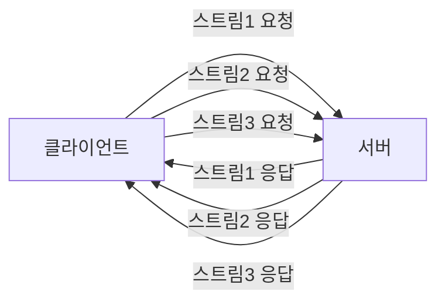
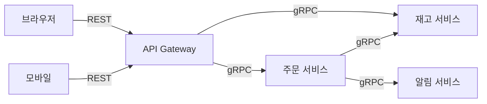

마이크로서비스 아키텍처를 설계한다. 서비스 간 통신 방식을 결정해야 한다. REST API를 쓰면 모두가 친숙하고 디버깅이 쉽다. gRPC를 쓰면 성능이 좋고 타입 안전성이 보장된다. 이 선택은 향후 몇 년간 시스템의 성능, 유지보수성, 팀 생산성에 영향을 준다. 이 포스트는 두 프로토콜의 **내부 동작 원리부터 실무 적용 전략**까지 비교한다.

---

## 두 프로토콜의 탄생 배경

REST(Representational State Transfer)는 2000년 Roy Fielding이 박사 논문에서 정의한 아키텍처 스타일이다. HTTP 위에 자원(Resource) 중심으로 API를 설계한다. 브라우저와 서버가 통신하기 위한 방식으로 자연스럽게 표준이 되었다.

gRPC는 2015년 Google이 내부 RPC 시스템 Stubby를 오픈소스화한 것이다. Protocol Buffers(Protobuf)를 기반으로 HTTP/2 위에서 동작한다. Google은 수십 년간 수천 개의 내부 마이크로서비스를 연결하며 얻은 교훈을 담았다.

> **비유**: REST는 이메일이다. 누구나 쓸 수 있고, 텍스트로 내용을 확인할 수 있다. 표준이 명확하다. gRPC는 사내 메신저다. 빠르고 구조화되어 있으며 타입이 강제된다. 하지만 같은 시스템 안에서만 잘 동작한다.

---

## 핵심 차이 한눈에 보기

| 항목 | REST | gRPC |
|------|------|------|
| 프로토콜 | HTTP/1.1 (주로) | HTTP/2 |
| 직렬화 | JSON (주로) | Protocol Buffers (바이너리) |
| API 계약 | OpenAPI/Swagger (선택) | .proto 파일 (필수) |
| 스트리밍 | 제한적 (SSE, WebSocket 별도) | 4가지 스트리밍 모드 내장 |
| 브라우저 지원 | 완전 지원 | gRPC-Web 필요 (제한적) |
| 타입 안전성 | 없음 (스키마 없으면) | 강제됨 |
| 코드 생성 | 선택적 | 필수 (proto 컴파일) |
| 디버깅 | curl, Postman으로 쉬움 | 전용 도구 필요 |
| 성능 | 기준 | 2-10배 빠름 |
| 생태계 | 매우 성숙 | 성장 중 |
| 언어 지원 | 모든 언어 | 주요 언어 (20+) |

---

## 직렬화 — JSON vs Protocol Buffers

### JSON의 인간 친화성

```json
{
  "userId": 1001,
  "name": "김철수",
  "email": "kim@example.com",
  "createdAt": "2026-05-17T09:00:00Z",
  "roles": ["USER", "ADMIN"]
}
```

위 JSON은 약 120바이트다. 사람이 읽을 수 있다. 브라우저 개발자 도구에서 바로 볼 수 있다. 하지만 파싱 비용이 있다. 모든 숫자가 문자열로 전송된다. 타입 정보가 없어서 `"userId": "1001"` 처럼 실수할 수 있다.

### Protocol Buffers의 효율성

```protobuf
// user.proto
syntax = "proto3";

package user;

message User {
  int64 user_id = 1;
  string name = 2;
  string email = 3;
  google.protobuf.Timestamp created_at = 4;
  repeated Role roles = 5;
}

enum Role {
  UNKNOWN = 0;
  USER = 1;
  ADMIN = 2;
}

service UserService {
  rpc GetUser(GetUserRequest) returns (User);
  rpc ListUsers(ListUsersRequest) returns (stream User);
  rpc UpdateUser(stream UpdateUserRequest) returns (UpdateUserResponse);
  rpc Chat(stream ChatMessage) returns (stream ChatMessage);
}
```

같은 데이터를 Protobuf로 직렬화하면 약 30-50바이트다. JSON 대비 60-70% 작다. 필드 이름이 숫자 태그로 대체되기 때문이다. 파싱은 바이너리 처리라 JSON보다 5-10배 빠르다.

> **비유**: JSON은 편지다. "수신인: 김철수, 주소: 서울시 강남구..."처럼 레이블을 달아 전달한다. Protobuf는 전보다. 미리 약속된 순서로 숫자만 전달한다. 내용을 이해하려면 약속(스키마)이 필요하지만 전송은 훨씬 효율적이다.

---

## HTTP/2 — gRPC의 성능 기반

gRPC가 HTTP/2를 필수로 요구하는 이유가 성능의 핵심이다.

### HTTP/1.1의 한계

```
[클라이언트] → GET /users/1    → [서버]
[클라이언트] ←  HTTP 200 응답  ← [서버]
[클라이언트] → GET /users/2    → [서버]  ← 이전 응답 완료 후에야 가능
[클라이언트] ←  HTTP 200 응답  ← [서버]
```

HTTP/1.1은 기본적으로 요청-응답이 순차적이다. 동시 처리를 위해 여러 TCP 연결을 열지만(브라우저는 보통 6개), 각 연결에 오버헤드가 있다. 헤더가 압축되지 않고 매 요청마다 반복 전송된다.

### HTTP/2의 멀티플렉싱



하나의 TCP 연결 위에서 여러 스트림이 동시에 흐른다. 헤더는 HPACK 알고리즘으로 압축되어 반복 전송이 없다. 서버가 클라이언트 요청 없이도 데이터를 푸시할 수 있다.

gRPC는 이 멀티플렉싱 위에 4가지 통신 패턴을 구현한다.

---

## gRPC의 4가지 통신 패턴

### 1. Unary RPC — 기본 요청-응답

```java
// 서버 구현 (Java)
public class UserServiceImpl extends UserServiceGrpc.UserServiceImplBase {

    @Override
    public void getUser(GetUserRequest request,
                        StreamObserver<User> responseObserver) {
        User user = userRepository.findById(request.getUserId());
        responseObserver.onNext(user);
        responseObserver.onCompleted();
    }
}

// 클라이언트 호출
UserServiceGrpc.UserServiceBlockingStub stub =
    UserServiceGrpc.newBlockingStub(channel);
User user = stub.getUser(GetUserRequest.newBuilder()
    .setUserId(1001).build());
```

### 2. Server Streaming — 서버가 스트림으로 응답

```java
// 대량 데이터 페이지네이션 없이 스트리밍
@Override
public void listUsers(ListUsersRequest request,
                      StreamObserver<User> responseObserver) {
    userRepository.findAll().forEach(user -> {
        responseObserver.onNext(user);
    });
    responseObserver.onCompleted();
}

// 클라이언트 — Iterator로 수신
Iterator<User> users = stub.listUsers(request);
while (users.hasNext()) {
    processUser(users.next());
}
```

### 3. Client Streaming — 클라이언트가 스트림으로 전송

```java
// 클라이언트가 대량 데이터를 업로드
StreamObserver<UpdateUserRequest> requestObserver =
    asyncStub.updateUser(new StreamObserver<UpdateUserResponse>() {
        @Override
        public void onNext(UpdateUserResponse response) {
            System.out.println("업데이트 완료: " + response.getUpdatedCount());
        }
        // onError, onCompleted 구현...
    });

for (User user : usersToUpdate) {
    requestObserver.onNext(UpdateUserRequest.newBuilder()
        .setUser(user).build());
}
requestObserver.onCompleted();
```

### 4. Bidirectional Streaming — 양방향 스트림

```java
// 실시간 채팅 — 양쪽 모두 스트리밍
StreamObserver<ChatMessage> requestObserver =
    asyncStub.chat(new StreamObserver<ChatMessage>() {
        @Override
        public void onNext(ChatMessage message) {
            System.out.println("수신: " + message.getText());
        }
        // ...
    });

// 메시지 전송
requestObserver.onNext(ChatMessage.newBuilder()
    .setText("안녕하세요").build());
```

---

## REST의 표현력과 설계 원칙

REST는 자원(Resource)과 HTTP 메서드의 의미를 활용한다.

```
GET    /users/1001          → 사용자 조회
POST   /users               → 사용자 생성
PUT    /users/1001          → 사용자 전체 수정
PATCH  /users/1001          → 사용자 부분 수정
DELETE /users/1001          → 사용자 삭제

GET    /users/1001/orders   → 사용자의 주문 목록
POST   /users/1001/orders   → 사용자의 새 주문 생성
```

```java
// Spring Boot REST Controller
@RestController
@RequestMapping("/users")
public class UserController {

    @GetMapping("/{userId}")
    public ResponseEntity<UserDto> getUser(@PathVariable Long userId) {
        UserDto user = userService.getUser(userId);
        return ResponseEntity.ok(user);
    }

    @PostMapping
    public ResponseEntity<UserDto> createUser(
            @Valid @RequestBody CreateUserRequest request) {
        UserDto created = userService.createUser(request);
        return ResponseEntity.status(HttpStatus.CREATED).body(created);
    }

    @PatchMapping("/{userId}")
    public ResponseEntity<UserDto> updateUser(
            @PathVariable Long userId,
            @RequestBody PatchUserRequest request) {
        UserDto updated = userService.updateUser(userId, request);
        return ResponseEntity.ok(updated);
    }
}
```

REST의 강점은 **캐싱**이다. GET 요청은 HTTP 표준 캐싱(`Cache-Control`, `ETag`, `Last-Modified`)을 그대로 활용할 수 있다. CDN, 브라우저 캐시, 프록시 모두 REST를 이해한다.

---

## 성능 벤치마크

동일한 하드웨어에서 1000개의 동시 요청, 각 요청이 사용자 정보를 반환하는 시나리오.

```
REST (HTTP/1.1 + JSON):
  평균 레이턴시: 45ms
  처리량: 8,000 req/s
  페이로드 크기: 120 bytes

gRPC (HTTP/2 + Protobuf):
  평균 레이턴시: 12ms
  처리량: 35,000 req/s
  페이로드 크기: 38 bytes
```

성능 차이가 나는 이유:
1. **HTTP/2 멀티플렉싱** — 연결 오버헤드 없음
2. **Protobuf** — 직렬화/역직렬화 5-10배 빠름
3. **헤더 압축** — HPACK으로 반복 헤더 제거
4. **연결 재사용** — 서비스 간 장기 연결 유지

하지만 성능 차이가 의미 있으려면 트래픽이 충분해야 한다. 초당 100요청 미만이라면 두 방식의 레이턴시 차이가 비즈니스 임팩트를 내지 못한다.

---

## 타입 안전성과 API 계약

### REST의 느슨한 계약

```java
// REST — 런타임에 발견되는 오류
// 서버가 "user_id"를 "userId"로 바꿨다면?
@GetMapping("/users/{id}")
public Map<String, Object> getUser(@PathVariable Long id) {
    // 필드명을 바꿔도 컴파일 오류 없음
    return Map.of(
        "userId", user.getId(),      // 클라이언트는 "user_id"를 기대
        "userName", user.getName()    // 클라이언트는 "name"을 기대
    );
}
```

OpenAPI(Swagger)로 계약을 명시할 수 있지만 강제성이 없다. 서버 코드와 스펙이 불일치해도 컴파일은 통과한다.

### gRPC의 강제된 계약

```protobuf
// user.proto — 계약이 곧 코드
message User {
  int64 user_id = 1;    // 필드명이나 번호를 바꾸면 하위 호환성 파괴
  string name = 2;
  string email = 3;
}
```

`.proto` 파일이 바뀌면 양쪽 서비스 모두 재컴파일해야 한다. 컴파일 타임에 타입 불일치를 잡는다. 필드 번호(`= 1`, `= 2`)는 하위 호환성의 핵심 — 번호를 재사용하면 구 클라이언트가 데이터를 잘못 해석한다.

```java
// gRPC — 컴파일 타임 타입 안전성
User user = User.newBuilder()
    .setUserId(1001)          // int64가 아닌 값 → 컴파일 오류
    .setName("김철수")
    .setEmail("kim@example.com")
    .build();
```

---

## 브라우저 지원 — gRPC의 약점

gRPC는 HTTP/2의 저수준 기능(trailer 헤더 등)을 사용한다. 브라우저의 Fetch API와 XMLHttpRequest는 이를 지원하지 않는다.

```
브라우저 → gRPC 서버: 직접 불가

해결책 1: gRPC-Web (Envoy 프록시 필요)
브라우저 → Envoy Proxy → gRPC 서버

해결책 2: REST Gateway
브라우저 → REST API → gRPC 서버
```

```yaml
# Envoy 설정 — gRPC-Web 변환
filters:
  - name: envoy.filters.http.grpc_web
  - name: envoy.filters.http.cors
  - name: envoy.filters.http.router
```

이 복잡성 때문에 **프론트엔드가 직접 통신하는 Public API는 REST, 서비스 간 Internal API는 gRPC**를 쓰는 하이브리드 전략이 일반적이다.

---

## 디버깅과 관찰 가능성

### REST 디버깅 — 직관적

```bash
# curl로 즉시 테스트
curl -X GET "https://api.example.com/users/1001" \
  -H "Authorization: Bearer token123" \
  -v  # 헤더 포함 전체 출력

# Postman, HTTPie, Insomnia 모두 사용 가능
http GET api.example.com/users/1001 Authorization:"Bearer token123"
```

네트워크 탭에서 응답을 그대로 볼 수 있다. 바이너리 인코딩이 없어서 중간에 로그를 찍어도 이해 가능하다.

### gRPC 디버깅 — 전용 도구 필요

```bash
# grpcurl — curl의 gRPC 버전
grpcurl -plaintext \
  -proto user.proto \
  -d '{"user_id": 1001}' \
  localhost:50051 \
  user.UserService/GetUser

# grpc_cli (공식 도구)
grpc_cli call localhost:50051 user.UserService.GetUser \
  "user_id: 1001"
```

Protobuf 바이너리는 그냥 읽을 수 없다. Wireshark로 패킷을 캡처해도 디코딩이 필요하다. 서비스 리플렉션(reflection)을 활성화하면 런타임에 스키마를 조회할 수 있다.

```java
// gRPC 서버에 리플렉션 추가
Server server = ServerBuilder.forPort(50051)
    .addService(new UserServiceImpl())
    .addService(ProtoReflectionService.newInstance())  // 리플렉션 활성화
    .build();
```

> **비유**: REST 디버깅은 투명한 파이프를 통해 흐르는 물을 보는 것이다. gRPC 디버깅은 불투명한 파이프 안의 물을 보는 것이다. 특수 장비(grpcurl, Bloomrpc)가 필요하다.

---

## 에러 처리 방식

### REST의 HTTP 상태 코드

```java
// REST — HTTP 상태 코드가 오류를 표현
// 200: 성공
// 400: 클라이언트 오류 (잘못된 요청)
// 401: 인증 실패
// 404: 리소스 없음
// 500: 서버 오류

@ExceptionHandler(UserNotFoundException.class)
public ResponseEntity<ErrorDto> handleUserNotFound(UserNotFoundException e) {
    return ResponseEntity.status(HttpStatus.NOT_FOUND)
        .body(new ErrorDto("USER_NOT_FOUND", e.getMessage()));
}
```

### gRPC의 Status Code

```java
// gRPC — 자체 상태 코드 체계 (17개)
// OK, CANCELLED, UNKNOWN, INVALID_ARGUMENT, NOT_FOUND
// ALREADY_EXISTS, PERMISSION_DENIED, RESOURCE_EXHAUSTED...

@Override
public void getUser(GetUserRequest request,
                    StreamObserver<User> responseObserver) {
    if (request.getUserId() <= 0) {
        responseObserver.onError(
            Status.INVALID_ARGUMENT
                .withDescription("userId는 양수여야 합니다")
                .asRuntimeException()
        );
        return;
    }

    userRepository.findById(request.getUserId())
        .ifPresentOrElse(
            user -> {
                responseObserver.onNext(user);
                responseObserver.onCompleted();
            },
            () -> responseObserver.onError(
                Status.NOT_FOUND
                    .withDescription("userId " + request.getUserId() + " 없음")
                    .asRuntimeException()
            )
        );
}
```

gRPC의 상태 코드는 HTTP 상태 코드보다 의미가 더 세분화되어 있다. `RESOURCE_EXHAUSTED`(429 역할), `DEADLINE_EXCEEDED`(타임아웃), `UNAVAILABLE`(서비스 일시 불가) 같은 구분이 유용하다.

---

## 하이브리드 전략 — 실무 적용



**Public API (외부 노출)**: REST
- 브라우저, 모바일 앱, 서드파티 파트너
- 디버깅과 문서화가 중요
- CDN 캐싱 활용 가능

**Internal API (서비스 간 통신)**: gRPC
- 마이크로서비스 간 고성능 통신
- 타입 안전성이 팀 협업에 도움
- 스트리밍이 필요한 경우 (파일 업로드, 실시간 데이터)

### gRPC-Gateway로 양쪽 동시 지원

```protobuf
// gRPC 서비스에 REST 어노테이션 추가
import "google/api/annotations.proto";

service UserService {
  rpc GetUser(GetUserRequest) returns (User) {
    option (google.api.http) = {
      get: "/v1/users/{user_id}"
    };
  }
}
```

하나의 proto 정의로 gRPC와 REST 모두 자동 생성. gRPC-Gateway가 REST 요청을 gRPC로 변환하는 프록시 역할을 한다.

---

## 생태계와 도구

### REST 생태계

```
문서화: Swagger UI, Redoc, Stoplight
테스트: Postman, Insomnia, REST Assured, WireMock
게이트웨이: Kong, AWS API Gateway, Nginx
모니터링: 표준 HTTP 메트릭 (레이턴시, 상태 코드)
```

### gRPC 생태계

```
문서화: protoc-gen-doc, buf.build
테스트: grpcurl, BloomRPC, Evans
게이트웨이: Envoy, gRPC-Gateway, Kong (플러그인)
모니터링: OpenTelemetry (gRPC 인터셉터), Prometheus
```

```java
// gRPC 인터셉터 — 공통 관심사 처리
public class MetricsInterceptor implements ServerInterceptor {

    @Override
    public <ReqT, RespT> ServerCall.Listener<ReqT> interceptCall(
            ServerCall<ReqT, RespT> call,
            Metadata headers,
            ServerCallHandler<ReqT, RespT> next) {

        String methodName = call.getMethodDescriptor().getFullMethodName();
        Timer.Sample sample = Timer.start(meterRegistry);

        return next.startCall(new ForwardingServerCall
                .SimpleForwardingServerCall<>(call) {
            @Override
            public void close(Status status, Metadata trailers) {
                sample.stop(meterRegistry.timer("grpc.requests",
                    "method", methodName,
                    "status", status.getCode().name()));
                super.close(status, trailers);
            }
        }, headers);
    }
}
```

---

## 극한 시나리오

### 시나리오 1: 실시간 스트리밍 — REST의 한계

금융 데이터 서비스. 100개 종목의 실시간 가격을 1초마다 구독하는 클라이언트.

**REST 방식**: 1초마다 100개 GET 요청. 또는 SSE(Server-Sent Events)로 구현하지만, 양방향이 안 되고 프록시 호환성 문제.

**gRPC 방식**: Server Streaming으로 하나의 연결에서 실시간 데이터 전송. 클라이언트가 구독 해지를 원하면 스트림을 취소.

```java
// gRPC Server Streaming — 실시간 주가 스트리밍
@Override
public void subscribePrice(PriceRequest request,
                           StreamObserver<PriceUpdate> responseObserver) {
    List<String> symbols = request.getSymbolsList();

    // 구독 취소 감지
    Context.CancellationListener listener = context -> {
        pricePublisher.unsubscribe(symbols);
    };
    Context.current().addListener(listener, executor);

    pricePublisher.subscribe(symbols, price -> {
        if (!Context.current().isCancelled()) {
            responseObserver.onNext(PriceUpdate.newBuilder()
                .setSymbol(price.getSymbol())
                .setPrice(price.getValue())
                .setTimestamp(Timestamps.now())
                .build());
        }
    });
}
```

이 시나리오에서 gRPC의 압도적 우위.

### 시나리오 2: Proto 스키마 변경 — 하위 호환성 파괴

팀이 proto 파일에서 필드 번호 3을 삭제하고 새 필드에 번호 3을 재사용했다. 구 클라이언트가 여전히 번호 3을 `email`로 해석하는데, 서버는 번호 3을 `phone_number`로 저장한다.

```protobuf
// 잘못된 변경 — 절대 하지 말 것
// 이전
message User {
  int64 user_id = 1;
  string name = 2;
  string email = 3;  // 삭제
}

// 이후 — 번호 3 재사용: 재앙
message User {
  int64 user_id = 1;
  string name = 2;
  string phone_number = 3;  // 이전 email과 같은 번호!
}
```

```protobuf
// 올바른 변경 — 필드 번호는 절대 재사용 금지
message User {
  int64 user_id = 1;
  string name = 2;
  reserved 3;  // email 필드 번호 영구 예약
  reserved "email";  // 필드명도 예약
  string phone_number = 4;  // 새 번호 사용
}
```

proto 계약의 엄격함이 실수를 방지하는 동시에, 실수 시 치명적 데이터 손상을 초래할 수 있다.

### 시나리오 3: 레이턴시 SLA — 어느 것이 유리한가

B2B API를 만든다. SLA가 P99 50ms. 요청이 초당 50,000개. JSON 페이로드 평균 2KB.

```
REST + JSON:
  직렬화: ~2ms
  네트워크: ~5ms (LAN)
  역직렬화: ~2ms
  합계: ~9ms (이상적)
  실제 P99: 35-60ms (연결 오버헤드, GC 포함)

gRPC + Protobuf:
  직렬화: ~0.3ms
  네트워크: ~5ms (LAN, 같은 조건)
  역직렬화: ~0.3ms
  합계: ~5.6ms (이상적)
  실제 P99: 15-25ms
```

SLA 50ms를 REST로도 맞출 수 있지만, 트래픽이 피크일 때 P99가 튄다. gRPC는 여유가 있다. 이 시나리오에서는 gRPC 선택이 합리적이다.

---

## 면접 포인트

### Q. gRPC가 REST보다 빠른 근본 이유는 무엇인가요?

세 가지입니다. 첫째, HTTP/2 멀티플렉싱으로 하나의 연결에서 여러 요청을 병렬 처리해 연결 오버헤드를 제거합니다. 둘째, Protobuf는 JSON보다 직렬화/역직렬화가 5-10배 빠르고 페이로드 크기가 60-70% 작습니다. 셋째, HTTP/2 헤더 압축(HPACK)으로 반복 전송되는 헤더 오버헤드를 줄입니다.

### Q. gRPC를 브라우저에서 직접 사용할 수 없는 이유는?

gRPC는 HTTP/2의 trailer 헤더를 사용하는데, 브라우저의 Fetch API와 XHR은 trailer 헤더를 노출하지 않습니다. 또한 HTTP/2 프레임 레벨의 제어가 필요한데 브라우저 API는 이를 허용하지 않습니다. 이를 해결하기 위해 gRPC-Web 스펙이 있으며, Envoy 같은 프록시가 브라우저의 HTTP/1.1 요청을 gRPC로 변환합니다.

### Q. Proto 파일에서 필드 번호를 재사용하면 안 되는 이유는?

Protobuf 인코딩에서 필드 이름은 전송되지 않고 필드 번호만 전송됩니다. 구 클라이언트가 번호 3을 `email`로 알고 있는 상태에서 서버가 번호 3을 `phone_number`로 바꾸면, 구 클라이언트는 전화번호 데이터를 이메일로 해석합니다. 데이터 손상이 발생합니다. `reserved` 키워드로 삭제된 번호를 영구적으로 예약해야 합니다.

### Q. gRPC의 4가지 통신 패턴을 설명하세요.

Unary(단일 요청-응답), Server Streaming(클라이언트 요청 1번, 서버 여러 번 응답), Client Streaming(클라이언트 여러 번 전송, 서버 1번 응답), Bidirectional Streaming(양방향 스트림)입니다. Bidirectional Streaming은 실시간 채팅, 주가 피드 같은 양방향 실시간 통신에 적합합니다.

### Q. 하이브리드 전략에서 외부는 REST, 내부는 gRPC를 쓰는 이유는?

외부 API는 브라우저와 서드파티가 소비하므로 표준 HTTP와 JSON이 필수입니다. CDN 캐싱, Swagger 문서화, 다양한 클라이언트 지원이 REST에서 자연스럽습니다. 내부 서비스 간 통신은 타입 안전성과 성능이 중요하고, 브라우저 지원이 불필요하므로 gRPC의 이점을 온전히 누릴 수 있습니다.

---

## 결론 — 선택 기준

**REST를 선택해야 할 때:**
- Public API (브라우저, 모바일, 파트너)
- 캐싱이 중요한 읽기 중심 API
- 팀이 gRPC 학습 비용을 감당하기 어려울 때
- 초당 수백 요청 미만의 소규모 서비스

**gRPC를 선택해야 할 때:**
- 서비스 간 Internal API
- 고성능이 요구되는 마이크로서비스 (초당 수천 요청 이상)
- 실시간 스트리밍이 필요한 경우
- 폴리글랏 환경에서 타입 안전성이 중요한 경우

**현실적 조언**: 새 마이크로서비스 아키텍처라면 API Gateway에서 REST를 받아 내부를 gRPC로 구성하는 하이브리드가 가장 실용적이다.
