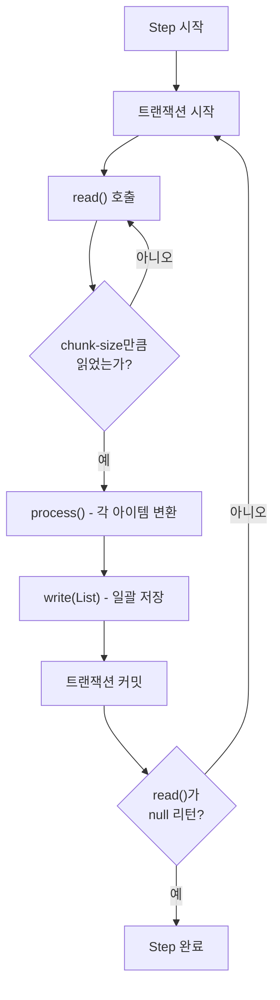
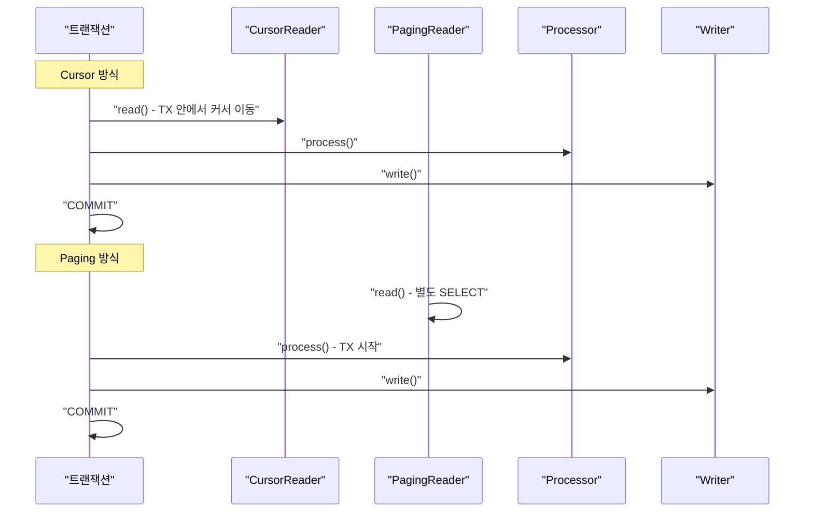
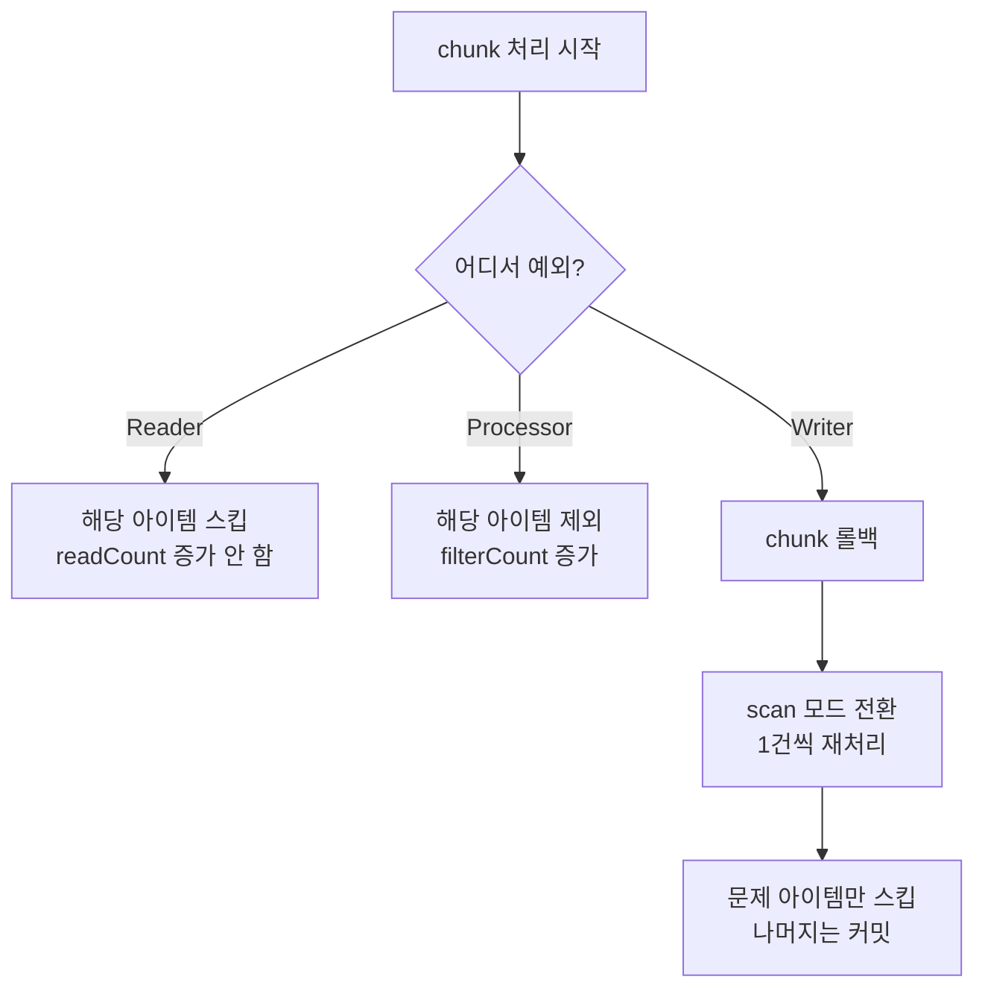
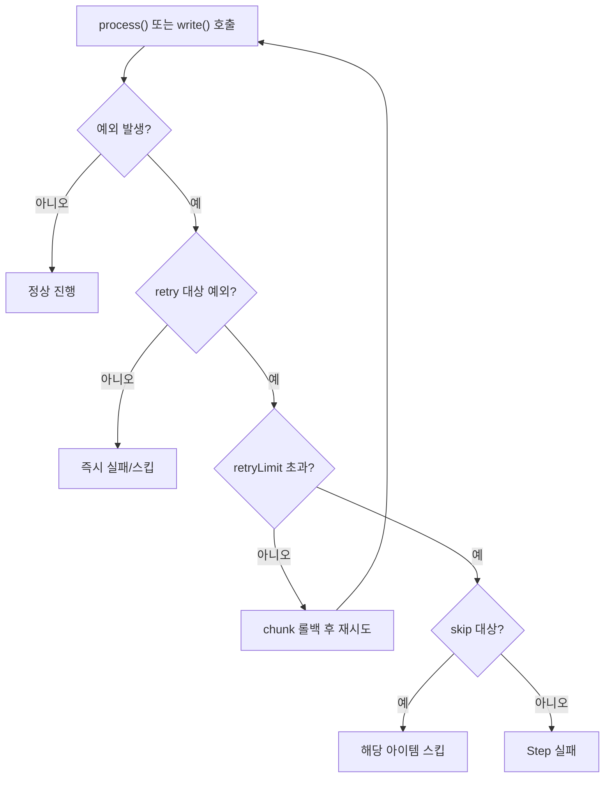
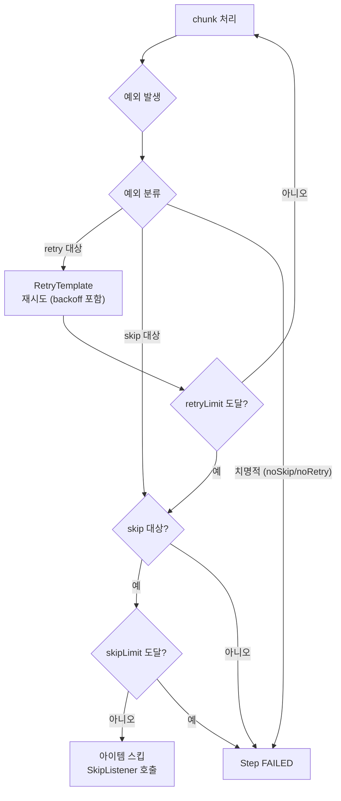
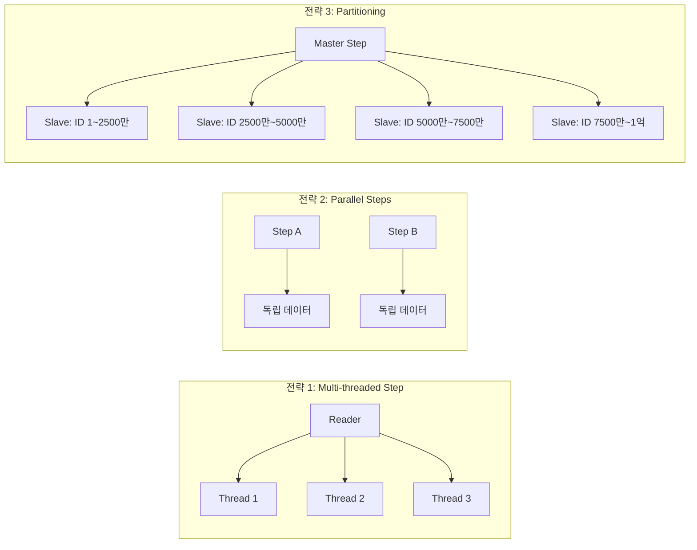

## 한 줄 요약

Chunk 처리는 **트랜잭션 경계를 chunk-size 단위로 분리**하여 대용량 데이터를 안전하게 처리하며, Skip/Retry 정책으로 장애에 유연하게 대응한다.

---

## 비유로 시작하기

> **비유:** Chunk 처리는 **이삿짐 옮기기**와 같습니다. 짐을 한 번에 다 옮기면(단일 트랜잭션) 트럭이 넘어졌을 때 전부 망가집니다. 대신 **박스 10개씩**(chunk-size) 나눠 옮기면, 한 트럭이 사고 나도 나머지 짐은 안전합니다. 깨진 그릇(오류 데이터)은 건너뛰고(Skip), 문이 잠겼으면 잠시 후 다시 시도(Retry)합니다.

---

## 1. Chunk 처리 내부 동작

### 1.1 Chunk가 실제로 어떻게 동작하는가

Chunk 기반 Step이 실행되면 내부적으로 `ChunkOrientedTasklet`이 동작합니다. 이 Tasklet은 **read → process → write** 사이클을 chunk-size만큼 반복합니다.

핵심은 **Reader는 1건씩, Writer는 묶음으로** 동작한다는 점입니다. Reader가 chunk-size만큼 아이템을 모으면, Processor를 거쳐 변환된 결과물 리스트를 Writer에 한 번에 전달합니다.



### 1.2 실행 순서 상세

실제 chunk-size=3인 경우를 단계별로 추적해보겠습니다.

1️⃣ **트랜잭션 시작**
2️⃣ `read()` → Item A 반환
3️⃣ `read()` → Item B 반환
4️⃣ `read()` → Item C 반환 (chunk-size 도달)
5️⃣ `process(A)` → A' 반환
6️⃣ `process(B)` → B' 반환
7️⃣ `process(C)` → null 반환 (필터링됨)
8️⃣ `write([A', B'])` → 2건 저장
9️⃣ **트랜잭션 커밋** → StepExecution의 readCount=3, writeCount=2, filterCount=1 갱신

> **비유:** 초밥 셰프가 재료를 3개씩 꺼내고(read), 각각 손질하되 상한 건 버리고(process), 나머지를 접시에 한꺼번에 올립니다(write). 접시가 완성되면 손님에게 서빙(커밋)합니다.

---

## 2. 트랜잭션 경계의 이해

Chunk 모델에서 **트랜잭션 경계는 chunk 단위**입니다. 이것이 Tasklet과의 가장 큰 차이점이며, 성능과 안정성 모두에 영향을 미칩니다.

### 2.1 트랜잭션과 chunk-size의 관계

chunk-size가 크면 한 트랜잭션에서 더 많은 데이터를 처리하므로 **커밋 횟수가 줄어들고 처리량(throughput)이 증가**합니다. 하지만 실패 시 **롤백 범위도 커지고**, DB 락 보유 시간이 길어집니다.

| chunk-size | 커밋 횟수 (10만건) | 실패 시 롤백 | 메모리 사용 |
|------------|-------------------|-------------|------------|
| 10 | 10,000회 | 최대 10건 | 낮음 |
| 100 | 1,000회 | 최대 100건 | 중간 |
| 1,000 | 100회 | 최대 1,000건 | 높음 |
| 10,000 | 10회 | 최대 10,000건 | 매우 높음 |

> **비유:** chunk-size는 **엘리베이터 정원**과 같습니다. 정원 5명이면 안전하지만 왕복이 많고, 정원 50명이면 빠르지만 사고 시 피해가 큽니다. 적정 정원을 찾는 것이 핵심입니다.

### 2.2 Reader의 트랜잭션 참여 여부

중요한 포인트입니다. **JdbcCursorItemReader는 트랜잭션에 참여**하지만, **JdbcPagingItemReader는 자체 트랜잭션으로 읽습니다**. Paging Reader는 read가 chunk 트랜잭션 밖에서 실행될 수 있으므로, 롤백 시 이미 읽은 데이터는 되돌아가지 않습니다. 이것이 재시작 시 ExecutionContext에 저장된 page 위치가 중요한 이유입니다.



---

## 3. PagingItemReader 실전

### 3.1 JdbcPagingItemReader

DB에서 대량 데이터를 읽을 때 가장 많이 사용하는 Reader입니다. **페이지 단위로 SELECT**하므로 메모리를 일정하게 유지할 수 있습니다.

PagingItemReader는 내부적으로 페이지 번호를 관리합니다. 첫 페이지를 읽고 chunk-size만큼 process/write를 수행한 뒤, 다음 페이지를 읽습니다. **page-size와 chunk-size는 동일하게 맞추는 것이 권장**됩니다. 다르면 불필요한 쿼리가 발생하거나 한 chunk에 여러 페이지의 데이터가 섞일 수 있습니다.

sortKey는 필수입니다. 페이징 쿼리의 일관성을 보장하기 위해 고유한 정렬 키가 필요합니다. 보통 PK를 사용합니다.

```java
@Bean
@StepScope
public JdbcPagingItemReader<Order> orderReader(
        DataSource dataSource,
        @Value("#{jobParameters['targetDate']}") String targetDate) {

    Map<String, Order> paramValues = new HashMap<>();
    paramValues.put("orderDate", targetDate);

    return new JdbcPagingItemReaderBuilder<Order>()
        .name("orderReader")
        .dataSource(dataSource)
        .queryProvider(createQueryProvider(dataSource))
        .parameterValues(paramValues)
        .pageSize(100)          // chunk-size와 동일하게
        .rowMapper(new OrderRowMapper())
        .build();
}

private PagingQueryProvider createQueryProvider(DataSource dataSource)
        throws Exception {
    SqlPagingQueryProviderFactoryBean factory =
        new SqlPagingQueryProviderFactoryBean();
    factory.setDataSource(dataSource);
    factory.setSelectClause("SELECT order_id, customer_id, amount");
    factory.setFromClause("FROM orders");
    factory.setWhereClause("WHERE order_date = :orderDate AND status = 'PENDING'");
    factory.setSortKey("order_id");   // 반드시 고유 키
    return factory.getObject();
}
```

**이 코드의 핵심:** `@StepScope`로 늦은 바인딩을 활성화하여 JobParameters를 주입받습니다. pageSize=100은 한 번에 100건씩 SELECT한다는 의미이며, chunk-size와 맞추는 것이 성능상 유리합니다.

### 3.2 JpaPagingItemReader

JPA를 사용하는 프로젝트에서는 JpaPagingItemReader를 사용합니다. 사용법은 비슷하지만 JPQL을 사용한다는 차이가 있습니다.

JPA Reader를 사용할 때 주의할 점은 **영속성 컨텍스트 관리**입니다. 기본적으로 각 페이지를 읽은 후 `EntityManager.clear()`를 호출하여 영속성 컨텍스트를 비웁니다. 이것은 메모리 누수를 방지하지만, Lazy Loading이 필요한 경우 문제가 될 수 있습니다. 이때는 fetch join이나 `@EntityGraph`를 활용해야 합니다.

```java
@Bean
@StepScope
public JpaPagingItemReader<Order> jpaOrderReader(
        EntityManagerFactory emf,
        @Value("#{jobParameters['targetDate']}") String targetDate) {
    return new JpaPagingItemReaderBuilder<Order>()
        .name("jpaOrderReader")
        .entityManagerFactory(emf)
        .queryString("SELECT o FROM Order o "
                   + "JOIN FETCH o.customer "    // Lazy 방지
                   + "WHERE o.orderDate = :date "
                   + "ORDER BY o.id")
        .parameterValues(Map.of("date", targetDate))
        .pageSize(100)
        .build();
}
```

**이 코드의 핵심:** `JOIN FETCH`로 N+1 문제를 방지합니다. JPA Reader에서 Lazy 엔티티에 접근하면 영속성 컨텍스트가 이미 clear된 상태이므로 `LazyInitializationException`이 발생합니다.

---

## 4. JdbcBatchItemWriter 실전

Writer는 **chunk 단위의 List를 받아 일괄 저장**합니다. JdbcBatchItemWriter는 JDBC의 `addBatch()/executeBatch()`를 내부적으로 사용하여 네트워크 라운드트립을 최소화합니다.

1건씩 INSERT하는 것과 배치 INSERT의 성능 차이는 극적입니다. 1,000건 기준으로 보통 **5~10배 성능 향상**이 있습니다. 이것이 Chunk 모델에서 Writer가 List를 받는 이유입니다.

아래는 정산 결과를 저장하는 Writer 예제입니다.

```java
@Bean
public JdbcBatchItemWriter<Settlement> settlementWriter(
        DataSource dataSource) {
    return new JdbcBatchItemWriterBuilder<Settlement>()
        .dataSource(dataSource)
        .sql("INSERT INTO settlement "
           + "(order_id, customer_id, amount, fee, net_amount, settled_at) "
           + "VALUES (:orderId, :customerId, :amount, :fee, :netAmount, NOW())")
        .beanMapped()    // Settlement 필드명을 파라미터에 매핑
        .build();
}
```

**이 코드의 핵심:** `beanMapped()`는 객체의 필드명을 SQL 파라미터(`:orderId` 등)에 자동 매핑합니다. `columnMapped()`는 Map 기반 매핑에 사용합니다.

### CompositeItemWriter — 여러 Writer 조합

한 chunk에서 여러 대상에 써야 할 때(예: DB + 파일) `CompositeItemWriter`를 사용합니다.

```java
@Bean
public CompositeItemWriter<Settlement> compositeWriter(
        JdbcBatchItemWriter<Settlement> dbWriter,
        FlatFileItemWriter<Settlement> fileWriter) {
    return new CompositeItemWriterBuilder<Settlement>()
        .delegates(List.of(dbWriter, fileWriter))
        .build();
}
```

**이 코드의 핵심:** delegates에 등록된 Writer들이 순서대로 실행됩니다. 모두 같은 트랜잭션 안에서 실행되므로, 하나라도 실패하면 전체가 롤백됩니다.

---

## 5. Skip 정책 — 오류 데이터 건너뛰기

### 5.1 Skip이 필요한 이유

대용량 배치에서 **1건의 불량 데이터 때문에 전체 Job이 실패하면 안 됩니다**. 예를 들어 1억 건 중 데이터 형식이 잘못된 100건이 있다면, 이 100건만 건너뛰고 나머지 99,999,900건은 정상 처리해야 합니다.

> **비유:** 공장 조립 라인에서 불량 부품이 나오면 **불량 박스에 던져두고(skip)** 라인을 멈추지 않습니다. 대신 불량 내역을 기록(SkipListener)하여 나중에 원인을 분석합니다.

### 5.2 Skip 동작 메커니즘

Skip이 발생하는 위치(Reader/Processor/Writer)에 따라 동작이 다릅니다.



Writer에서 skip이 발생했을 때의 **scan 모드**가 핵심입니다. chunk 전체가 롤백된 후, 해당 chunk의 아이템을 1건씩 다시 read-process-write합니다. 이때 문제를 일으킨 아이템만 스킵되고 나머지는 정상 커밋됩니다.

### 5.3 SkipListener로 스킵된 데이터 추적

실무에서는 스킵된 데이터를 반드시 기록해야 합니다. 그래야 나중에 데이터를 수정하고 재처리할 수 있습니다.

```java
@Component
@Slf4j
public class OrderSkipListener implements SkipListener<Order, Settlement> {

    private final JdbcTemplate jdbcTemplate;

    public OrderSkipListener(JdbcTemplate jdbcTemplate) {
        this.jdbcTemplate = jdbcTemplate;
    }

    @Override
    public void onSkipInRead(Throwable t) {
        log.warn("Reader에서 스킵 발생: {}", t.getMessage());
    }

    @Override
    public void onSkipInProcess(Order order, Throwable t) {
        log.warn("Processor에서 스킵: orderId={}, error={}",
                 order.getOrderId(), t.getMessage());
        saveSkipRecord(order.getOrderId(), "PROCESS", t);
    }

    @Override
    public void onSkipInWrite(Settlement item, Throwable t) {
        log.warn("Writer에서 스킵: orderId={}, error={}",
                 item.getOrderId(), t.getMessage());
        saveSkipRecord(item.getOrderId(), "WRITE", t);
    }

    private void saveSkipRecord(Long orderId, String phase, Throwable t) {
        jdbcTemplate.update(
            "INSERT INTO batch_skip_log (order_id, phase, error_msg, skipped_at) "
          + "VALUES (?, ?, ?, NOW())",
            orderId, phase, t.getMessage());
    }
}
```

**이 코드의 핵심:** 각 단계(Read/Process/Write)별로 스킵 핸들러를 분리하여, 어떤 단계에서 어떤 데이터가 스킵되었는지 정확히 추적합니다. 이 로그 테이블을 기반으로 운영팀이 데이터를 수정하고 재처리할 수 있습니다.

---

## 6. Retry 정책 — 일시적 장애 극복

### 6.1 Retry가 적합한 상황

Retry는 **일시적(transient) 오류**에만 사용해야 합니다. 네트워크 타임아웃, DB 데드락, 외부 API 일시 장애 등이 해당됩니다. 데이터 자체의 문제(형식 오류, 필수값 누락)에 Retry를 걸면 무의미한 반복만 발생합니다.

> **비유:** ATM에서 돈을 뽑는데 "일시적 오류"가 뜨면 다시 시도(Retry)합니다. 하지만 "잔액 부족"이면 몇 번을 눌러도 같은 결과이므로 포기(Skip 또는 실패)해야 합니다.

### 6.2 Retry 내부 동작

Retry는 **Processor와 Writer에서만 동작**합니다. Reader에서는 retry가 지원되지 않습니다(read()는 상태를 변경하므로 재시도 시 데이터 중복 위험).



### 6.3 RetryTemplate 커스터마이징

기본 retry는 즉시 재시도하지만, 실무에서는 **백오프(backoff) 전략**이 필수입니다. 외부 API가 과부하 상태인데 즉시 재시도하면 상황이 악화됩니다.

```java
@Bean
public Step apiCallStep(JobRepository jobRepository,
                        PlatformTransactionManager tx) {
    return new StepBuilder("apiCallStep", jobRepository)
        .<InputData, OutputData>chunk(50, tx)
        .reader(inputReader())
        .processor(apiProcessor())
        .writer(outputWriter())
        .faultTolerant()
        .retryLimit(3)
        .retry(RestClientException.class)
        .retry(DataAccessResourceFailureException.class)
        .backOffPolicy(exponentialBackOff())   // 지수 백오프
        .skipLimit(100)
        .skip(InvalidDataException.class)
        .listener(skipListener())
        .build();
}

private BackOffPolicy exponentialBackOff() {
    ExponentialBackOffPolicy policy = new ExponentialBackOffPolicy();
    policy.setInitialInterval(1000);    // 1초
    policy.setMultiplier(2.0);          // 1초 → 2초 → 4초
    policy.setMaxInterval(10000);       // 최대 10초
    return policy;
}
```

**이 코드의 핵심:** retry와 skip을 함께 사용하면, 먼저 retry를 시도하고 retryLimit를 초과하면 skip으로 전환됩니다. 지수 백오프는 외부 시스템의 부하를 줄여주는 필수 전략입니다.

---

## 7. Fault Tolerance 아키텍처

`faultTolerant()`를 선언하면 내부적으로 `FaultTolerantChunkProcessor`가 사용됩니다. 이것은 일반 `SimpleChunkProcessor`와 근본적으로 다른 처리 흐름을 가집니다.

일반 Chunk Processor는 예외가 발생하면 즉시 실패합니다. 반면 FaultTolerant Chunk Processor는 예외를 분류(retry 대상/skip 대상/치명적)하고, 각 분류에 맞는 복구 전략을 적용합니다.

이 전체 전략을 하나의 다이어그램으로 정리하면 다음과 같습니다.



### noRetry와 noSkip

특정 예외를 retry/skip 대상에서 명시적으로 제외할 수 있습니다. 이것은 **안전장치**로서, 절대 무시하면 안 되는 오류(예: 데이터 무결성 위반)를 확실히 실패로 처리합니다.

```java
.faultTolerant()
.retryLimit(3)
.retry(Exception.class)             // 모든 예외를 일단 재시도
.noRetry(NullPointerException.class) // 단, NPE는 재시도하지 않음
.skipLimit(100)
.skip(Exception.class)              // 모든 예외를 일단 스킵
.noSkip(CriticalException.class)    // 단, 치명적 예외는 스킵 불가
```

**이 코드의 핵심:** 광범위하게 retry/skip을 허용하되, noRetry/noSkip으로 특정 예외를 제외하는 **화이트리스트 + 블랙리스트 조합** 패턴입니다.

---

## 8. 대용량 데이터(1억 건) 처리 전략

### 8.1 핵심 원칙

1억 건을 처리할 때 가장 중요한 원칙은 **"메모리에 전체 데이터를 올리지 않는다"**입니다. 이것은 Reader 선택, chunk-size 설정, 쿼리 최적화 모든 곳에 적용됩니다.

> **비유:** 1억 개의 벽돌로 건물을 지을 때, 벽돌을 전부 현장에 쌓아놓으면 공간이 부족합니다. 대신 **트럭 한 대분(chunk)씩** 가져와서 쌓고, 다음 트럭을 부릅니다. 현장에는 항상 트럭 한 대분의 벽돌만 있습니다.

### 8.2 Reader 최적화

PagingItemReader 대신 **CursorItemReader**를 고려해야 합니다. 1억 건을 page-size=100으로 읽으면 **100만 번의 SELECT 쿼리**가 실행됩니다. CursorReader는 DB 커서를 열어 한 번의 쿼리로 스트리밍 방식으로 읽습니다.

단, CursorReader는 DB 커넥션을 Step이 끝날 때까지 유지하므로, 커넥션 풀과 타임아웃 설정에 주의해야 합니다.

| Reader | 쿼리 횟수 (1억건) | DB 커넥션 | 메모리 | 재시작 |
|--------|------------------|-----------|--------|--------|
| PagingReader (100) | 100만 회 | 짧은 점유 | 안정적 | 용이 |
| CursorReader | 1회 | 장기 점유 | 안정적 | 주의 필요 |
| 전체 조회 (List) | 1회 | 짧은 점유 | OOM 위험 | 불가 |

### 8.3 chunk-size와 page-size 튜닝

1억 건 처리에서 chunk-size는 **500~1,000** 사이가 일반적입니다. 너무 작으면 커밋 오버헤드가 크고, 너무 크면 실패 시 비용이 큽니다.

성능 테스트 가이드입니다. 실제로 측정하는 것이 가장 정확하지만, 보통 아래 순서로 접근합니다.

1️⃣ chunk-size=100으로 시작, 10만 건으로 테스트
2️⃣ 200, 500, 1000으로 늘려가며 처리 시간 측정
3️⃣ **처리 시간이 더 이상 줄지 않는 지점**이 최적값
4️⃣ Writer가 JDBC batch면 chunk-size 증가 효과가 큼, 외부 API 호출이면 효과 미미

### 8.4 인덱스와 쿼리 최적화

Reader의 WHERE/ORDER BY에 사용되는 컬럼에 **복합 인덱스**가 있어야 합니다. PagingReader는 매 페이지마다 ORDER BY + OFFSET 쿼리를 실행하므로, 인덱스 없이는 페이지가 뒤로 갈수록 극적으로 느려집니다.

```sql
-- 나쁜 예: 인덱스 없는 페이징
SELECT * FROM orders
WHERE order_date = '2026-05-03' AND status = 'PENDING'
ORDER BY order_id
LIMIT 100 OFFSET 999900;  -- 99만 건을 스캔 후 100건 반환

-- 좋은 예: 키셋 페이징 (Spring Batch가 내부적으로 사용)
SELECT * FROM orders
WHERE order_date = '2026-05-03' AND status = 'PENDING'
  AND order_id > ?  -- 이전 페이지의 마지막 ID
ORDER BY order_id
LIMIT 100;
```

**이 코드의 핵심:** Spring Batch의 `JdbcPagingItemReader`는 내부적으로 OFFSET이 아닌 **키셋 페이징**을 사용합니다. 이전 페이지의 마지막 sortKey 값을 기억하고 `WHERE id > ?`로 다음 페이지를 조회합니다. 이것이 대용량에서 PagingReader가 실용적인 이유입니다.

### 8.5 병렬 처리 고려

1억 건을 단일 스레드로 처리하면 수 시간이 걸릴 수 있습니다. 이때 세 가지 병렬화 전략이 있습니다.



이 중 **Partitioning이 가장 안전하고 확장성이 좋습니다**. 각 파티션이 독립적인 데이터 범위를 처리하므로 동시성 이슈가 없습니다. 자세한 내용은 파티셔닝 편에서 다루겠습니다.

---

<details class="extreme-scenario-details">
<summary class="extreme-scenario-summary">
<span class="extreme-scenario-icon">🔥</span>
<span class="extreme-scenario-label">극한 시나리오 — 클릭하여 펼치기</span>
<span class="extreme-scenario-toggle"></span>
</summary>
<div class="extreme-scenario-body">

<div class="extreme-scenario-content" markdown="1">

### 시나리오 1: Writer에서 1건이 실패했는데 chunk-size가 10,000이라면?

chunk 전체(10,000건)가 롤백됩니다. faultTolerant()+skip 설정이 있으면 **scan 모드로 전환되어 10,000건을 1건씩 재처리**합니다. 이때 9,999건은 정상 커밋되고 1건만 스킵됩니다. 하지만 10,000건을 1건씩 재처리하는 시간이 걸리므로, chunk-size가 너무 크면 scan 모드 비용이 급격히 증가합니다.

### 시나리오 2: Retry 중에 서버가 죽으면?

retry 도중의 상태는 메모리에만 있으므로 재시작 시 처음부터 다시 시도합니다. 하지만 JobRepository에 마지막 커밋된 chunk까지의 상태가 저장되어 있으므로, **이미 커밋된 chunk는 건너뛰고** 실패한 chunk부터 재시작합니다.

### 시나리오 3: Reader에서 읽은 데이터가 Writer 시점에 이미 다른 트랜잭션에 의해 변경되었다면?

PagingReader를 사용하면 read 시점과 write 시점에 시간차가 있으므로, Optimistic Locking이나 version 컬럼 체크를 통해 감지해야 합니다. 감지되면 retry 또는 skip 정책에 따라 처리됩니다. **이것이 Cursor Reader가 더 안전한 이유 중 하나입니다** — 하나의 트랜잭션 안에서 일관된 스냅샷을 봅니다.

### 시나리오 4: skip된 건이 skipLimit을 초과하면?

Step이 FAILED로 종료됩니다. skipLimit은 **전체 Step에서 허용하는 총 스킵 건수**입니다. chunk 단위가 아닙니다. 100만 건을 처리하면서 skipLimit=100이면, 전체 처리 과정에서 총 100건까지만 스킵이 허용됩니다.

---
</div>
</div>
</details>

## 10. 실무에서 자주 하는 실수

### 실수 1: page-size와 chunk-size가 다름

page-size=10, chunk-size=100이면, 하나의 chunk를 채우기 위해 10번의 SELECT가 실행됩니다. 반대로 page-size=1000, chunk-size=100이면 한 번에 1,000건을 메모리에 올리지만 100건씩만 처리합니다. **두 값을 동일하게 맞추세요.**

### 실수 2: Processor에서 외부 API를 동기 호출

chunk-size=100이면 100번의 외부 API 호출이 순차적으로 실행됩니다. 응답 시간이 100ms이면 chunk 하나에 10초가 걸립니다. **배치에서 외부 API 호출은 최소화**하고, 불가피하면 chunk-size를 줄이거나 CompletableFuture로 비동기 처리를 고려하세요.

### 실수 3: JPA Reader에서 Lazy Loading 의존

JpaPagingItemReader는 페이지를 읽은 후 EntityManager를 clear합니다. Processor에서 지연 로딩을 시도하면 `LazyInitializationException`이 발생합니다. **fetch join이나 DTO 프로젝션**을 사용하세요.

### 실수 4: skip 설정 없이 운영 배포

운영 데이터는 개발 환경보다 훨씬 다양합니다. 예상치 못한 데이터 형식, 인코딩 오류, null 값 등이 있을 수 있습니다. **최소한의 skipLimit과 SkipListener는 반드시 설정**하세요.

### 실수 5: CursorReader 사용 시 fetchSize 미설정

기본 fetchSize는 DB 드라이버에 따라 다릅니다(MySQL은 기본적으로 전체를 메모리에 로드). **fetchSize를 chunk-size와 동일하게 설정**하고, MySQL은 `Integer.MIN_VALUE`로 스트리밍 모드를 활성화해야 합니다.

---

## 11. 면접 포인트

### Q1. "Chunk 처리에서 트랜잭션 경계는 어떻게 되나요?"

**모범 답변:** chunk-size 단위로 트랜잭션이 분리됩니다. 하나의 chunk 안에서 read-process-write가 수행되고, write가 완료되면 커밋됩니다. 실패 시 해당 chunk만 롤백되므로 이전에 커밋된 데이터는 영향을 받지 않습니다. 단, PagingReader는 read가 chunk 트랜잭션 밖에서 실행될 수 있어 주의가 필요합니다.

### Q2. "Skip과 Retry를 함께 사용하면 어떤 순서로 동작하나요?"

**모범 답변:** 먼저 Retry를 시도합니다. retryLimit까지 재시도한 후에도 실패하면, 해당 예외가 skip 대상인지 확인합니다. skip 대상이면 아이템을 스킵하고 skipLimit을 차감합니다. skip 대상이 아니면 Step이 FAILED됩니다. 따라서 retry는 "일시적 오류 극복", skip은 "불가피한 오류 수용"으로 역할이 다릅니다.

### Q3. "Writer에서 skip이 발생하면 어떻게 문제 아이템만 식별하나요?"

**모범 답변:** Writer는 List 단위로 동작하므로 어떤 아이템이 문제인지 즉시 알 수 없습니다. 따라서 chunk 전체를 롤백한 후 scan 모드로 전환하여 1건씩 다시 처리합니다. 이때 문제 아이템을 정확히 식별하고 스킵합니다. 이것이 chunk-size가 너무 크면 안 되는 이유입니다 — scan 모드에서 전체 chunk를 1건씩 재처리해야 하기 때문입니다.

### Q4. "1억 건을 처리할 때 OOM을 방지하려면?"

**모범 답변:** 첫째, 전체 조회(findAll) 대신 PagingReader나 CursorReader를 사용합니다. 둘째, chunk-size를 적절히 설정하여(500~1,000) 한 번에 메모리에 올리는 양을 제한합니다. 셋째, JPA를 사용한다면 영속성 컨텍스트를 주기적으로 clear해야 합니다. 넷째, MySQL에서 CursorReader를 사용한다면 fetchSize를 Integer.MIN_VALUE로 설정하여 스트리밍 모드를 활성화해야 합니다.

---

## 핵심 정리

| 개념 | 요약 | 실무 팁 |
|------|------|---------|
| **chunk-size** | 트랜잭션 단위 = 커밋 단위 | 100~1,000, page-size와 동일하게 |
| **PagingReader** | 페이지 단위 SELECT | 키셋 페이징으로 대용량 안전 |
| **CursorReader** | DB 커서 스트리밍 | fetchSize 설정 필수, 커넥션 주의 |
| **Skip** | 불량 데이터 건너뛰기 | SkipListener로 반드시 추적 |
| **Retry** | 일시적 오류 재시도 | 백오프 필수, Reader에서 불가 |
| **Scan 모드** | Writer 스킵 시 1건씩 재처리 | chunk-size 클수록 비용 증가 |
| **Fault Tolerance** | Skip + Retry 통합 체계 | noSkip/noRetry로 안전장치 |

Chunk 기반 처리의 핵심은 **"적절한 크기로 나누어 안전하게 처리한다"**는 원칙입니다. chunk-size, skip/retry 정책, Reader 선택 모두 이 원칙에서 출발합니다.
