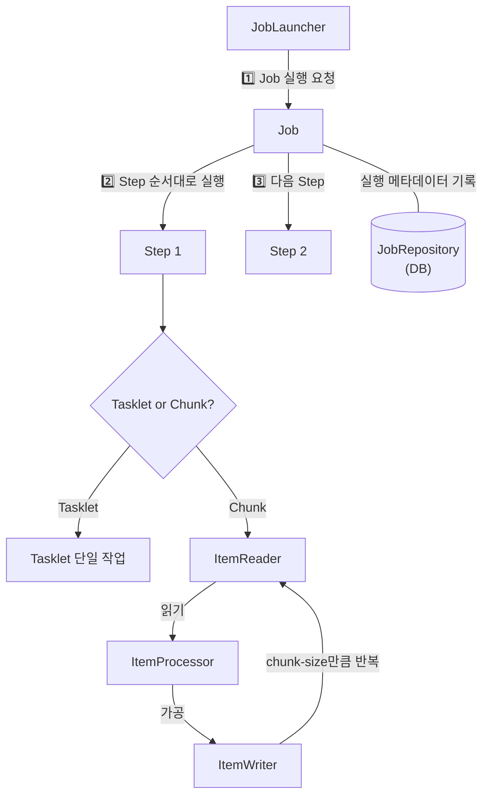
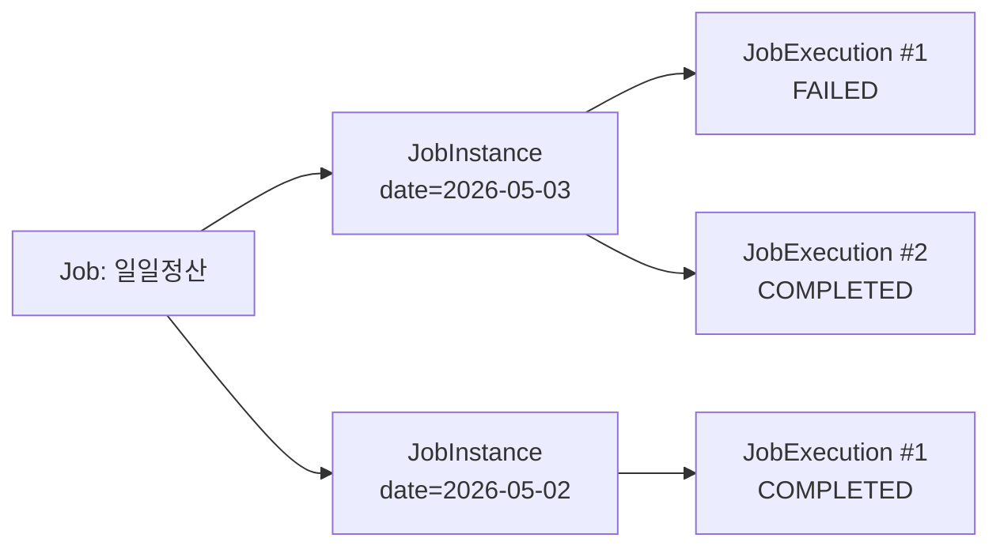
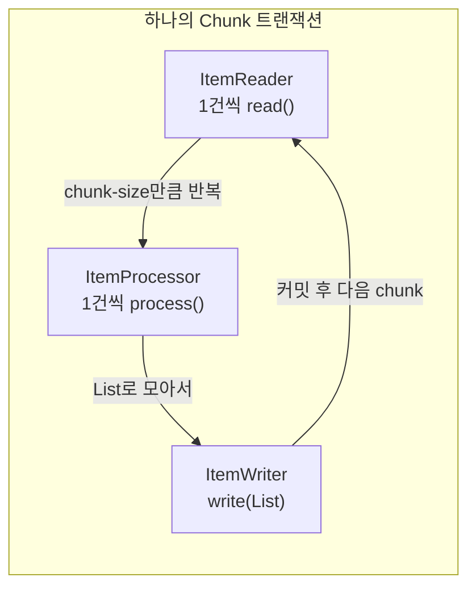
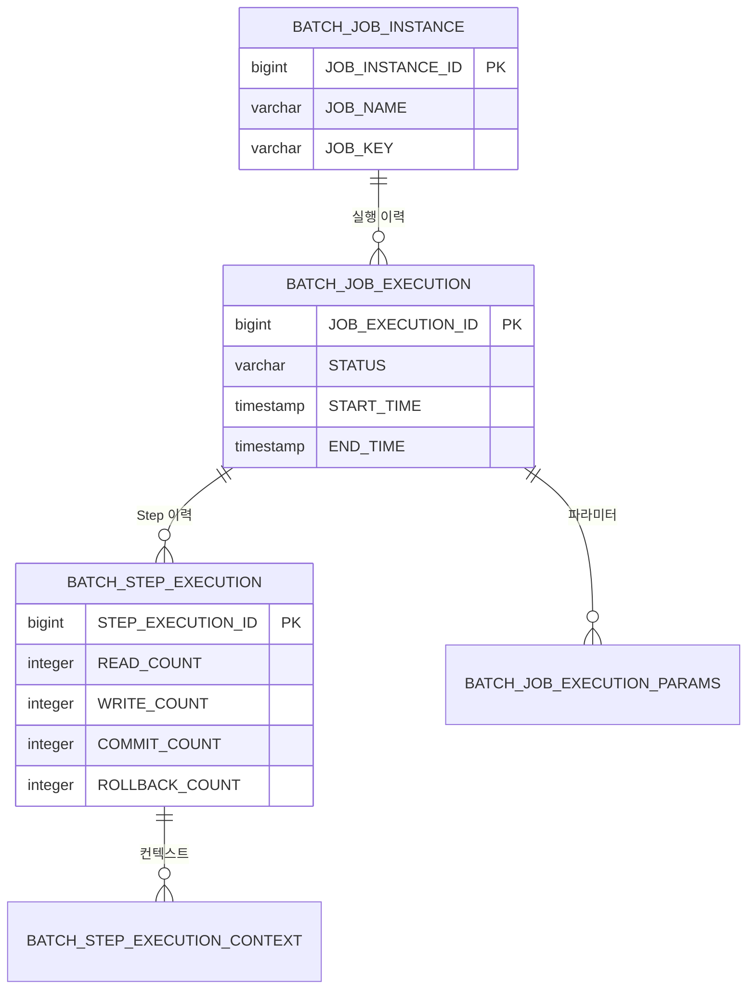
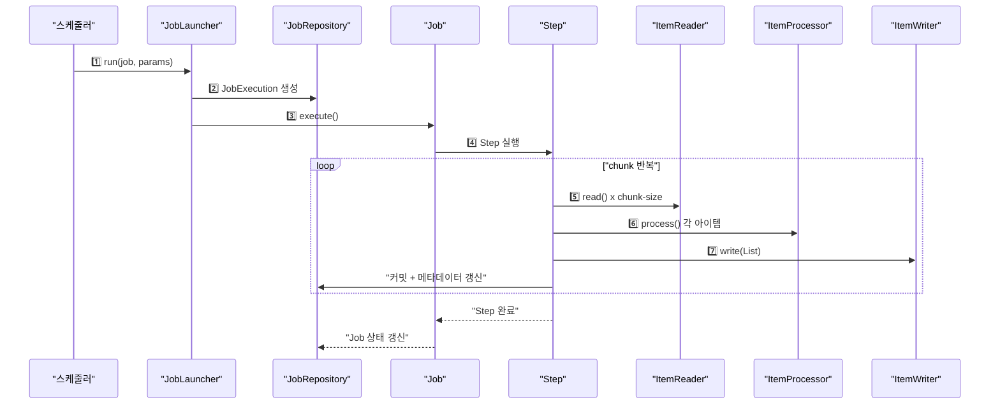

## 한 줄 요약

Spring Batch는 **대용량 데이터를 안정적으로 읽고-가공하고-쓰는** 프레임워크이며, Job → Step → Tasklet/Chunk 계층 구조로 모든 배치 작업을 표현한다.

---

## 비유로 시작하기

> **비유:** Spring Batch는 **자동차 조립 공장**과 같습니다. 공장(Job)에는 여러 공정 라인(Step)이 있고, 각 라인에서는 부품을 하나씩 꺼내(Reader) → 검수하고(Processor) → 조립(Writer)합니다. 공장장(JobLauncher)이 "시작!" 신호를 보내면, 생산 일지(JobRepository)에 매 공정의 진행 상황이 기록되어 중간에 전원이 나가도 이어서 작업할 수 있습니다.

이 비유를 머릿속에 두고 각 구성요소를 살펴보겠습니다.

---

## 1. Spring Batch 아키텍처 전체 그림

Spring Batch의 핵심 구조는 크게 **세 계층**으로 나뉩니다. Application(개발자가 작성하는 Job/Step), Core(프레임워크가 제공하는 실행 엔진), Infrastructure(Reader/Writer 등 인프라 컴포넌트)입니다.

이 세 계층이 어떻게 맞물리는지, 실행 흐름을 다이어그램으로 보겠습니다.



위 다이어그램에서 핵심은 **JobRepository가 모든 실행 상태를 DB에 기록**한다는 점입니다. 이 덕분에 실패 시 어디서 멈췄는지 알 수 있고, 재시작이 가능합니다.

---

## 2. Job — 배치 작업의 최상위 단위

Job은 **하나의 완결된 배치 작업**을 의미합니다. "매일 밤 주문 데이터를 정산한다"처럼 비즈니스 관점에서 의미 있는 단위가 하나의 Job이 됩니다.

> **비유:** Job은 **요리 레시피** 한 장입니다. "김치찌개 만들기"라는 레시피에는 "재료 손질(Step 1) → 끓이기(Step 2) → 담기(Step 3)"이라는 단계가 순서대로 적혀 있습니다.

Job은 하나 이상의 Step으로 구성되며, Step의 실행 순서와 조건(성공 시 다음 Step, 실패 시 특정 Step)을 정의합니다.

### JobInstance와 JobExecution

이 두 개념은 처음에 혼동하기 쉽지만, 명확히 구분해야 합니다.

- **JobInstance**: Job + JobParameters의 조합. "2026년 5월 3일 정산 Job"은 하나의 JobInstance입니다.
- **JobExecution**: JobInstance의 실제 실행 시도. 같은 JobInstance를 실패 후 재실행하면 JobExecution이 2개 생깁니다.



JobInstance가 COMPLETED 상태이면, 같은 파라미터로 다시 실행할 수 없습니다. 이것은 **같은 작업을 중복 실행하지 않도록** 보호하는 장치입니다.

---

## 3. Step — 실제 작업이 일어나는 곳

Step은 Job 내에서 **독립적으로 실행 가능한 작업 단위**입니다. 각 Step은 자체적인 StepExecution을 가지며, 읽은 건수/쓴 건수/스킵 건수 등의 통계를 기록합니다.

> **비유:** Step은 **공장의 공정 라인 하나**입니다. "도색 라인"이 멈춰도 "조립 라인"의 이전 결과물은 보존됩니다. 각 라인은 자신의 생산량을 별도로 기록합니다.

Step은 두 가지 모델 중 하나를 선택합니다: **Tasklet** 또는 **Chunk**.

---

## 4. Tasklet vs Chunk 모델

### Tasklet 모델

Tasklet은 **하나의 메서드(execute)를 호출하는 단순한 모델**입니다. 파일 삭제, 테이블 truncate, 알림 발송처럼 "읽고-가공하고-쓰기" 패턴에 맞지 않는 작업에 적합합니다.

Tasklet의 execute() 메서드는 `RepeatStatus.FINISHED`를 리턴할 때까지 반복 호출됩니다. 단순 작업이라면 한 번 실행하고 FINISHED를 리턴하면 됩니다.

아래는 임시 파일을 정리하는 간단한 Tasklet 예제입니다.

```java
@Bean
public Step cleanupStep(JobRepository jobRepository,
                        PlatformTransactionManager tx) {
    return new StepBuilder("cleanupStep", jobRepository)
        .tasklet((contribution, chunkContext) -> {
            Path tempDir = Path.of("/data/temp");
            Files.list(tempDir)
                 .filter(p -> p.toString().endsWith(".tmp"))
                 .forEach(p -> p.toFile().delete());
            return RepeatStatus.FINISHED;
        }, tx)
        .build();
}
```

**이 코드의 핵심:** Tasklet은 람다 하나로 작성할 수 있을 만큼 단순합니다. 트랜잭션 안에서 실행되며, FINISHED를 리턴하면 Step이 완료됩니다.

### Chunk 모델

Chunk 모델은 Spring Batch의 **핵심 처리 패턴**입니다. 데이터를 chunk-size만큼 묶어서 읽기 → 가공 → 쓰기를 반복합니다. 각 chunk는 하나의 트랜잭션 안에서 처리됩니다.

> **비유:** 편의점 택배 분류를 생각해보세요. 택배를 **10개씩(chunk-size)** 꺼내서, 주소를 확인하고(Processor), 지역별 박스에 넣습니다(Writer). 10개 단위로 "여기까지 완료" 체크를 합니다. 중간에 문제가 생기면 해당 10개만 다시 처리하면 됩니다.



---

## 5. ItemReader / ItemProcessor / ItemWriter

이 세 인터페이스가 Chunk 모델의 핵심입니다.

### ItemReader

데이터 소스에서 **한 건씩** 아이템을 읽어옵니다. null을 리턴하면 "더 이상 읽을 데이터가 없다"는 신호입니다.

Spring Batch는 다양한 Reader 구현체를 제공합니다:

| Reader | 용도 |
|--------|------|
| `JdbcPagingItemReader` | DB 페이징 조회 |
| `JpaPagingItemReader` | JPA 페이징 조회 |
| `FlatFileItemReader` | CSV/고정길이 파일 |
| `JsonItemReader` | JSON 파일 |
| `KafkaItemReader` | Kafka 토픽 |

### ItemProcessor

읽은 아이템을 **변환하거나 필터링**합니다. null을 리턴하면 해당 아이템은 Writer에 전달되지 않고 건너뜁니다. Processor는 **선택 사항**이며, 변환이 필요 없으면 생략 가능합니다.

### ItemWriter

가공된 아이템을 **List 단위(chunk 단위)로 한꺼번에 씁니다**. Reader/Processor와 달리 한 건이 아니라 chunk-size만큼의 목록을 받습니다. 이것이 성능의 핵심입니다 — DB INSERT를 1건씩 하는 대신 배치로 처리합니다.

아래는 DB에서 주문을 읽어 정산 테이블에 쓰는 전형적인 Chunk Step 예제입니다.

```java
@Bean
public Step settlementStep(JobRepository jobRepository,
                           PlatformTransactionManager tx,
                           ItemReader<Order> orderReader,
                           ItemProcessor<Order, Settlement> processor,
                           ItemWriter<Settlement> settlementWriter) {
    return new StepBuilder("settlementStep", jobRepository)
        .<Order, Settlement>chunk(100, tx)   // 100건씩 처리
        .reader(orderReader)
        .processor(processor)
        .writer(settlementWriter)
        .build();
}
```

**이 코드의 핵심:** 제네릭 `<Order, Settlement>`은 입력/출력 타입을 명시합니다. chunk(100)은 100건을 하나의 트랜잭션으로 묶어 처리한다는 뜻입니다.

---

## 6. JobRepository — 배치의 기억 장치

JobRepository는 **모든 배치 실행 메타데이터를 저장하는 저장소**입니다. 기본적으로 관계형 DB에 아래 테이블들을 생성합니다.

> **비유:** JobRepository는 **병원의 전자 차트 시스템**입니다. 환자(Job)가 언제 왔고, 어떤 검사(Step)를 받았고, 결과가 어땠는지 모두 기록합니다. 다음에 다시 방문하면 차트를 보고 이어서 진료할 수 있습니다.



이 메타데이터 덕분에 Spring Batch는 **멱등성 보장**(같은 파라미터로 중복 실행 방지)과 **재시작**(실패 지점부터 이어서 처리)이 가능합니다.

---

## 7. JobLauncher — 배치 실행의 시작점

JobLauncher는 Job을 실행하는 진입점입니다. `run(Job, JobParameters)`를 호출하면 JobRepository에 새 JobExecution을 생성하고 Job을 시작합니다.

> **비유:** JobLauncher는 **로켓 발사 버튼**입니다. 엔지니어(스케줄러/REST API)가 버튼을 누르면, 발사 기록(JobRepository)이 남고, 로켓(Job)이 출발합니다.

Spring Boot에서는 `spring.batch.job.enabled=true`(기본값)이면 애플리케이션 시작 시 자동 실행됩니다. 운영 환경에서는 보통 `false`로 두고, 스케줄러(Quartz, Kubernetes CronJob)나 REST API로 제어합니다.

```java
@RestController
@RequiredArgsConstructor
public class BatchController {
    private final JobLauncher jobLauncher;
    private final Job settlementJob;

    @PostMapping("/batch/settlement")
    public ResponseEntity<String> runSettlement(
            @RequestParam String date) throws Exception {
        JobParameters params = new JobParametersBuilder()
            .addString("targetDate", date)
            .addLong("timestamp", System.currentTimeMillis())
            .toJobParameters();

        JobExecution execution = jobLauncher.run(settlementJob, params);
        return ResponseEntity.ok(execution.getStatus().toString());
    }
}
```

**이 코드의 핵심:** timestamp를 파라미터에 추가하면 같은 날짜로도 재실행이 가능합니다(JobInstance가 달라지므로). 실무에서 자주 쓰는 패턴입니다.

---

## 8. 실행 흐름 전체 정리

전체 실행 흐름을 순서대로 정리하면 다음과 같습니다.



---

## 9. 재시작(Restart)과 재시도(Retry) 메커니즘

### 재시작 (Restart)

Spring Batch의 재시작은 **JobRepository에 저장된 StepExecution 정보**를 기반으로 동작합니다.

1️⃣ Job이 FAILED 상태로 종료됨
2️⃣ 같은 JobParameters로 다시 실행
3️⃣ JobRepository에서 마지막 StepExecution을 조회
4️⃣ COMPLETED된 Step은 건너뛰고, FAILED된 Step부터 재시작

> **비유:** 게임의 **체크포인트 세이브**와 같습니다. 3단계에서 죽으면 1단계부터 다시 하는 게 아니라, 3단계 시작 지점에서 다시 시작합니다.

Chunk 기반 Step에서는 더 세밀한 재시작이 가능합니다. 예를 들어 10,000건 중 7,000건까지 처리하고 실패했다면, 재시작 시 7,001번째부터 읽기 시작합니다. 이를 위해 Reader는 `ItemStream` 인터페이스를 구현하여 현재 위치를 ExecutionContext에 저장합니다.

```java
// allowStartIfComplete(false) — 기본값: 완료된 Step은 재실행 안 함
// allowStartIfComplete(true)  — 완료된 Step도 재실행
@Bean
public Step retryableStep(JobRepository jobRepository,
                          PlatformTransactionManager tx) {
    return new StepBuilder("retryableStep", jobRepository)
        .<String, String>chunk(100, tx)
        .reader(reader())
        .processor(processor())
        .writer(writer())
        .faultTolerant()
        .retryLimit(3)                           // 최대 3회 재시도
        .retry(TransientException.class)         // 이 예외만 재시도
        .skipLimit(10)                           // 최대 10건 스킵
        .skip(InvalidDataException.class)        // 이 예외는 스킵
        .build();
}
```

**이 코드의 핵심:** `faultTolerant()`를 선언해야 retry/skip 정책을 설정할 수 있습니다. retry는 같은 아이템을 다시 시도하고, skip은 해당 아이템을 건너뜁니다.

### 재시도 vs 스킵 판단 기준

| 상황 | 전략 | 이유 |
|------|------|------|
| 네트워크 일시 장애 | Retry | 일시적이므로 재시도하면 성공 가능 |
| 데이터 형식 오류 | Skip | 재시도해도 같은 결과 |
| DB 락 타임아웃 | Retry | 잠시 후 락이 풀릴 수 있음 |
| 필수 필드 누락 | Skip | 데이터 자체가 잘못됨 |

---

<details class="extreme-scenario-details">
<summary class="extreme-scenario-summary">
<span class="extreme-scenario-icon">🔥</span>
<span class="extreme-scenario-label">극한 시나리오 — 클릭하여 펼치기</span>
<span class="extreme-scenario-toggle"></span>
</summary>
<div class="extreme-scenario-body">

<div class="extreme-scenario-content" markdown="1">

### 시나리오 1: Job 실행 중 서버가 죽는다면?

JobExecution은 **STARTED 상태로 남아 있습니다**. Spring Batch는 이를 "비정상 종료"로 판단합니다. 동일 파라미터로 재실행하면 이전 STARTED 상태의 JobExecution을 FAILED로 변경한 뒤, 새로운 JobExecution을 생성하여 재시작합니다. 단, **Step의 재시작 가능 여부(restartable)**와 **Reader의 상태 저장 여부**에 따라 결과가 달라집니다.

### 시나리오 2: chunk 처리 도중 Writer에서 예외 발생

해당 chunk 전체가 롤백됩니다. 만약 faultTolerant() + skip 정책이 있다면, Spring Batch는 **chunk를 1건씩 다시 처리**하여 문제가 되는 아이템만 스킵하고 나머지는 정상 커밋합니다. 이것을 **scan 모드**라고 합니다.

### 시나리오 3: JobParameters가 없이 매번 같은 Job을 실행하고 싶다면?

`JobParametersIncrementer`를 사용합니다. 매 실행마다 자동으로 `run.id`를 증가시켜 새로운 JobInstance를 생성합니다.

---
</div>
</div>
</details>

## 11. 실무에서 자주 하는 실수

### 실수 1: JobParameters를 고정값으로 설정

같은 파라미터로 COMPLETED된 Job을 다시 실행하면 `JobInstanceAlreadyCompleteException`이 발생합니다. **timestamp나 incrementer를 반드시 추가**하세요.

### 실수 2: Tasklet에서 대량 데이터 처리

Tasklet은 하나의 트랜잭션에서 실행됩니다. 100만 건을 Tasklet으로 처리하면 메모리 부족과 트랜잭션 타임아웃이 발생합니다. **대량 데이터는 반드시 Chunk 모델을 사용**하세요.

### 실수 3: ItemReader를 @Bean이 아닌 @StepScope 없이 등록

JdbcPagingItemReader 같은 Stateful Reader는 **@StepScope**가 필수입니다. 그래야 Step마다 새 인스턴스가 생성되고, 늦은 바인딩(late binding)으로 JobParameters를 주입받을 수 있습니다.

### 실수 4: JobRepository를 인메모리(Map)로 운영 환경에 배포

개발 편의를 위해 MapJobRepositoryFactoryBean을 사용하면, 서버 재시작 시 **모든 실행 이력이 사라집니다**. 운영에서는 반드시 JDBC 기반 JobRepository를 사용하세요.

### 실수 5: chunk-size를 지나치게 크게 설정

chunk-size=10,000이면 한 트랜잭션에서 10,000건을 처리합니다. 실패 시 10,000건이 모두 롤백되고, 재처리 비용이 큽니다. **100~1,000 사이가 일반적**입니다.

---

## 12. 면접 포인트

### Q1. "Spring Batch에서 Job, JobInstance, JobExecution의 차이를 설명하세요."

**모범 답변:** Job은 배치 작업의 정의(설계도)이고, JobInstance는 Job + 특정 파라미터의 논리적 실행 단위입니다. JobExecution은 JobInstance의 물리적 실행 시도입니다. 하나의 JobInstance에 대해 실패 후 재실행하면 여러 JobExecution이 생길 수 있지만, 성공한 JobInstance는 재실행이 불가능합니다.

### Q2. "Tasklet과 Chunk 모델은 언제 각각 사용하나요?"

**모범 답변:** Tasklet은 파일 삭제, 테이블 초기화처럼 단순 작업에 적합합니다. Chunk는 대량 데이터를 읽고-변환-저장하는 ETL 패턴에 사용합니다. 핵심 차이는 트랜잭션 범위입니다 — Tasklet은 전체가 하나의 트랜잭션, Chunk는 chunk-size 단위로 트랜잭션이 분리됩니다.

### Q3. "Spring Batch의 재시작은 어떻게 동작하나요?"

**모범 답변:** JobRepository에 저장된 메타데이터를 기반으로 동작합니다. COMPLETED된 Step은 건너뛰고, FAILED된 Step부터 재시작합니다. Chunk 기반 Step은 ExecutionContext에 저장된 Reader의 위치 정보를 활용하여 마지막으로 커밋된 지점 이후부터 처리를 재개합니다.

### Q4. "ItemReader에서 null을 리턴하는 것의 의미는?"

**모범 답변:** 더 이상 읽을 데이터가 없다는 시그널입니다. Spring Batch는 null을 받으면 현재 chunk까지 write한 후 Step을 COMPLETED로 마킹합니다. Reader 구현 시 반드시 데이터가 끝나면 null을 리턴해야 무한 루프를 방지할 수 있습니다.

---

## 핵심 정리

| 구성요소 | 역할 | 비유 |
|----------|------|------|
| **Job** | 배치 작업 전체 정의 | 요리 레시피 |
| **Step** | 독립적 작업 단위 | 공정 라인 |
| **Tasklet** | 단순/일회성 작업 | 청소 담당 |
| **Chunk** | 읽기-가공-쓰기 반복 | 택배 분류 |
| **JobRepository** | 실행 메타데이터 저장소 | 전자 차트 |
| **JobLauncher** | 실행 트리거 | 발사 버튼 |
| **ItemReader** | 데이터 읽기 (1건씩) | 컨베이어에서 꺼내기 |
| **ItemProcessor** | 데이터 가공/필터링 | 검수대 |
| **ItemWriter** | 데이터 저장 (묶음) | 박스 포장 |

Spring Batch는 이 구성요소들의 **관심사 분리**와 **메타데이터 기반 상태 관리**로, 수십억 건의 데이터도 안정적으로 처리할 수 있는 기반을 제공합니다.
