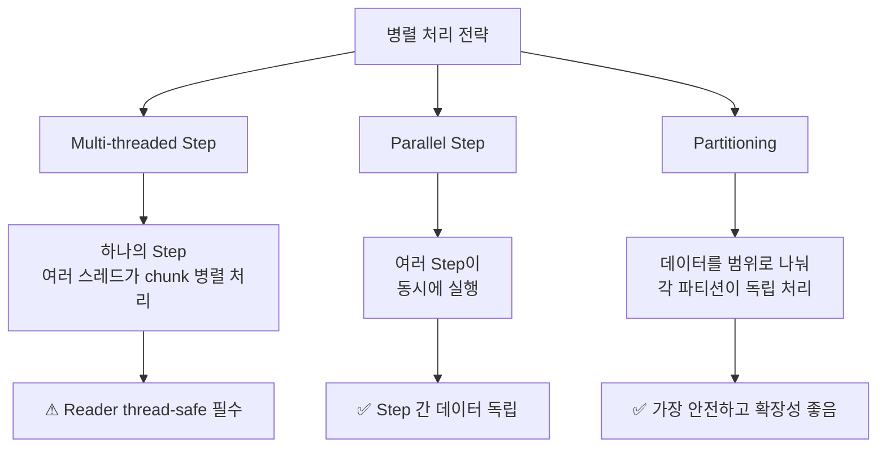
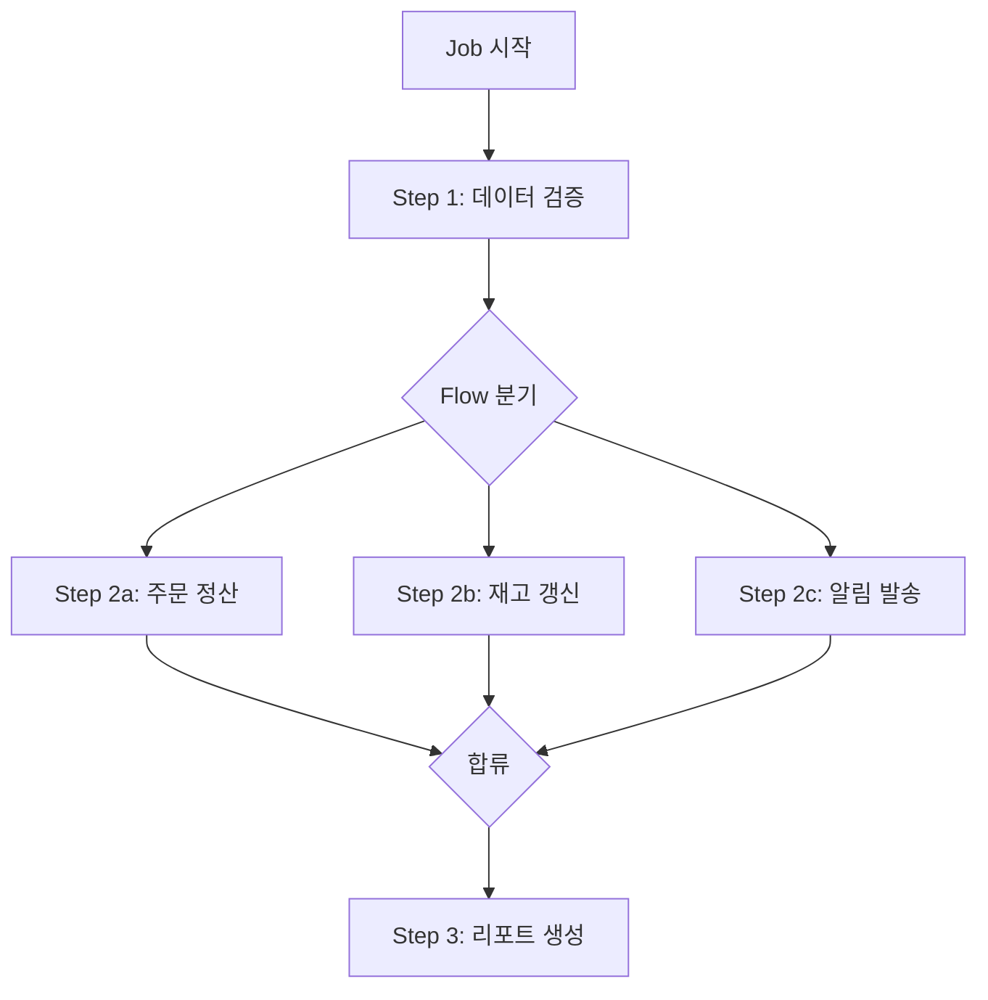
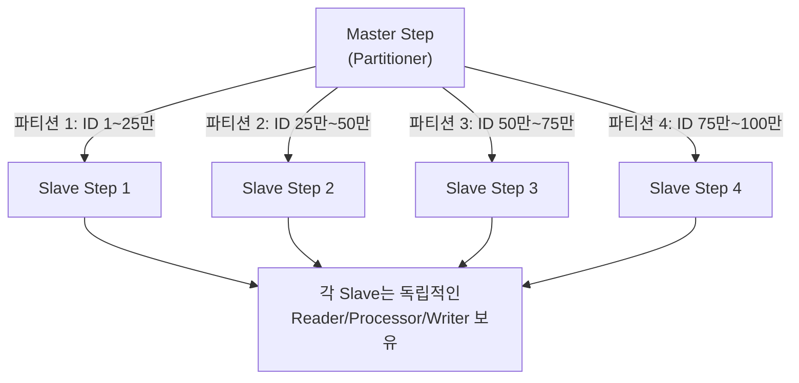
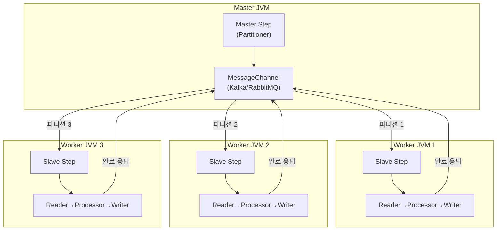
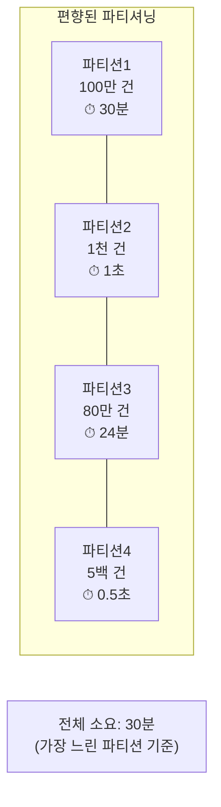
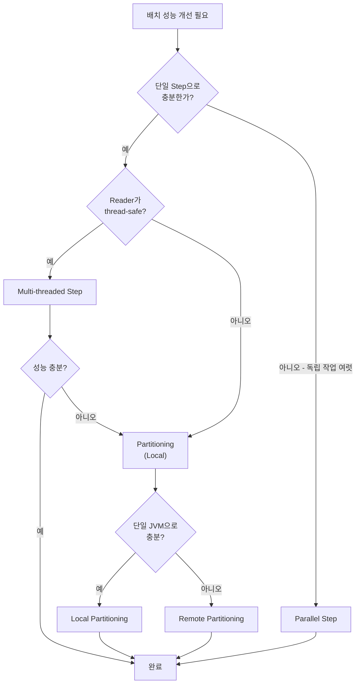

## 한 줄 요약

Spring Batch의 병렬 처리는 **Partitioning, Multi-threaded Step, Parallel Step** 세 가지 전략이 있으며, 데이터 특성과 인프라에 맞는 전략을 선택해야 한다.

---

## 비유로 시작하기

> **비유:** 대형마트 계산대를 생각해보세요. **Multi-threaded Step**은 하나의 계산대에 직원을 여러 명 배치하는 것(같은 데이터를 여러 스레드가 경쟁), **Parallel Step**은 과일 코너/정육 코너 계산대를 따로 운영하는 것(서로 다른 작업을 동시에), **Partitioning**은 고객을 성씨별로 나눠 전용 계산대에 배정하는 것(같은 작업을 데이터 범위로 분할)입니다. 가장 효율적이고 안전한 것은 Partitioning — 계산대마다 담당 고객이 정해져 있어 충돌이 없습니다.

---

## 1. 세 가지 병렬 처리 전략 비교

Spring Batch에서 성능을 높이는 병렬 처리 방법은 세 가지입니다. 각각의 특성이 뚜렷하므로 상황에 맞게 선택해야 합니다.



### 비교표

| 항목 | Multi-threaded Step | Parallel Step | Partitioning |
|------|-------------------|---------------|-------------|
| **데이터 분할** | 없음 (경쟁) | Step별 독립 | 범위별 분할 |
| **스레드 안전성** | Reader가 thread-safe 필수 | 불필요 | 불필요 |
| **재시작 지원** | 제한적 | 가능 | 가능 |
| **확장성** | 단일 JVM | 단일 JVM | 단일/다중 JVM |
| **구현 난이도** | 낮음 | 낮음 | 중간 |
| **적합한 경우** | 간단한 병렬화 | 독립적인 작업 | 대용량 데이터 |

---

## 2. Multi-threaded Step

### 2.1 동작 원리

가장 간단한 병렬화 방법입니다. Step에 `TaskExecutor`를 설정하면, **여러 스레드가 동시에 chunk를 처리**합니다. 각 스레드는 독립적으로 read-process-write 사이클을 수행합니다.

> **비유:** 하나의 우편함(Reader)에서 여러 배달원(Thread)이 동시에 편지를 꺼내가는 방식입니다. 빠르지만, 두 배달원이 동시에 같은 편지를 집으면 안 되므로 우편함에 잠금장치(thread-safety)가 필요합니다.

중요한 제약이 있습니다. **Reader가 thread-safe해야 합니다.** 여러 스레드가 동시에 `read()`를 호출하므로, 같은 아이템이 두 번 읽히거나 아이템이 누락되면 안 됩니다.

Spring Batch의 기본 Reader 중 thread-safe한 것과 아닌 것을 구분해야 합니다.

| Reader | Thread-safe | 비고 |
|--------|------------|------|
| `JdbcPagingItemReader` | 예 | `synchronized read()` |
| `JpaPagingItemReader` | 예 | `synchronized read()` |
| `JdbcCursorItemReader` | 아니오 | 커서는 공유 불가 |
| `FlatFileItemReader` | 아니오 | 파일 포인터 공유 불가 |

thread-safe하지 않은 Reader를 멀티스레드로 사용하려면 `SynchronizedItemStreamReader`로 감싸야 합니다. 하지만 이렇게 하면 read 자체가 직렬화되어 병렬화 효과가 줄어듭니다.

```java
@Bean
public Step multiThreadedStep(JobRepository jobRepository,
                               PlatformTransactionManager tx) {
    return new StepBuilder("multiThreadedStep", jobRepository)
        .<Order, Settlement>chunk(100, tx)
        .reader(orderPagingReader())      // thread-safe Reader
        .processor(settlementProcessor())
        .writer(settlementWriter())
        .taskExecutor(taskExecutor())
        .throttleLimit(4)                 // 동시 실행 스레드 수 (deprecated in 5.x)
        .build();
}

@Bean
public TaskExecutor taskExecutor() {
    ThreadPoolTaskExecutor executor = new ThreadPoolTaskExecutor();
    executor.setCorePoolSize(4);
    executor.setMaxPoolSize(8);
    executor.setQueueCapacity(25);
    executor.setThreadNamePrefix("batch-thread-");
    executor.initialize();
    return executor;
}
```

**이 코드의 핵심:** `taskExecutor()`만 설정하면 멀티스레드 처리가 활성화됩니다. corePoolSize가 실제 동시 처리 스레드 수를 결정합니다. Spring Batch 5.x부터 throttleLimit은 deprecated되었으므로 ThreadPool 크기로 제어합니다.

### 2.2 Multi-threaded Step의 재시작 문제

가장 큰 단점입니다. **멀티스레드 환경에서는 ExecutionContext에 상태를 안전하게 저장할 수 없습니다.** 여러 스레드가 동시에 상태를 갱신하면 경쟁 조건이 발생합니다. 따라서 `saveState(false)`를 설정하여 상태 저장을 비활성화해야 합니다.

상태 저장이 비활성화되면 **재시작 시 처음부터 다시 처리**합니다. 이것은 멱등성(idempotency)이 보장되어야 함을 의미합니다. Writer에서 `UPSERT`(INSERT ON DUPLICATE KEY UPDATE)를 사용하면 중복 처리를 방지할 수 있습니다.

---

## 3. Parallel Step — 독립 Step 동시 실행

### 3.1 동작 원리

서로 다른 Step을 동시에 실행합니다. 예를 들어 "주문 정산"과 "재고 갱신"은 서로 독립적인 작업이므로 병렬로 실행할 수 있습니다.

> **비유:** 식당에서 주방(조리 Step)과 홀(세팅 Step)이 동시에 준비하는 것입니다. 주방이 끝나야 홀이 시작되는 게 아니라, 두 팀이 동시에 일합니다. 단, **서로의 결과에 의존하지 않아야** 합니다.



Flow를 사용하여 Step 2a/2b/2c를 병렬로 실행하고, 모두 완료된 후 Step 3이 실행됩니다.

```java
@Bean
public Job parallelJob(JobRepository jobRepository,
                       Step validationStep,
                       Step settlementStep,
                       Step inventoryStep,
                       Step notificationStep,
                       Step reportStep) {
    // 병렬 실행할 Flow들
    Flow settlementFlow = new FlowBuilder<SimpleFlow>("settlementFlow")
        .start(settlementStep).build();
    Flow inventoryFlow = new FlowBuilder<SimpleFlow>("inventoryFlow")
        .start(inventoryStep).build();
    Flow notificationFlow = new FlowBuilder<SimpleFlow>("notificationFlow")
        .start(notificationStep).build();

    // Split으로 병렬 실행
    Flow parallelFlow = new FlowBuilder<SimpleFlow>("parallelFlow")
        .split(new SimpleAsyncTaskExecutor())
        .add(settlementFlow, inventoryFlow, notificationFlow)
        .build();

    return new JobBuilder("parallelJob", jobRepository)
        .start(validationStep)
        .next(parallelFlow)
        .next(reportStep)
        .build();
}
```

**이 코드의 핵심:** `split()`에 TaskExecutor를 전달하면 각 Flow가 별도 스레드에서 실행됩니다. 모든 Flow가 완료되어야 다음 Step으로 진행합니다. 하나의 Flow라도 FAILED이면 전체 Job이 FAILED됩니다.

---

## 4. Partitioning — 가장 강력한 병렬 처리

### 4.1 동작 원리

데이터를 **논리적인 범위(파티션)로 분할**하고, 각 파티션을 독립적인 Step으로 처리합니다. Master Step이 데이터를 분할하고, 여러 Slave Step이 각자 할당된 범위를 처리합니다.

> **비유:** 전화번호부를 10명의 사원에게 나눠주는 것입니다. 사원 1은 "가~나", 사원 2는 "다~라"를 담당합니다. 각 사원은 자기 범위만 처리하므로 **절대 충돌하지 않습니다.** 누가 빨리 끝나든 느리게 끝나든, 다른 사원에게 영향을 주지 않습니다.



### 4.2 Partitioner 구현

Partitioner는 데이터를 어떻게 분할할지 정의합니다. `partition()` 메서드가 파티션별 ExecutionContext를 담은 Map을 반환합니다.

가장 일반적인 방식은 **ID 범위 분할**입니다. 전체 데이터의 min/max ID를 조회한 뒤, gridSize로 균등 분할합니다.

아래 코드에서 Partitioner가 전체 ID 범위를 조회하고, gridSize에 맞게 나누는 과정을 보여줍니다. 각 파티션의 minId/maxId는 ExecutionContext에 저장되어 Slave Step의 Reader에서 사용됩니다.

```java
@Component
@RequiredArgsConstructor
public class OrderRangePartitioner implements Partitioner {

    private final JdbcTemplate jdbcTemplate;

    @Override
    public Map<String, ExecutionContext> partition(int gridSize) {
        // 1. 전체 데이터 범위 조회
        Long minId = jdbcTemplate.queryForObject(
            "SELECT MIN(order_id) FROM orders WHERE status = 'PENDING'",
            Long.class);
        Long maxId = jdbcTemplate.queryForObject(
            "SELECT MAX(order_id) FROM orders WHERE status = 'PENDING'",
            Long.class);

        // 2. gridSize로 균등 분할
        long range = (maxId - minId) / gridSize + 1;
        Map<String, ExecutionContext> partitions = new HashMap<>();

        long start = minId;
        for (int i = 0; i < gridSize; i++) {
            ExecutionContext context = new ExecutionContext();
            context.putLong("minId", start);
            context.putLong("maxId", Math.min(start + range - 1, maxId));
            partitions.put("partition" + i, context);
            start += range;
        }

        return partitions;
    }
}
```

**이 코드의 핵심:** gridSize는 파티션 수이며, 보통 스레드 수와 동일하게 설정합니다. ID 기반 범위 분할은 인덱스를 활용하므로 균등한 분배가 가능합니다. 단, 데이터가 ID 범위에 골고루 분포되어 있어야 효과적입니다.

### 4.3 Slave Step과 Master 구성

각 Slave Step은 자신에게 할당된 파티션의 minId/maxId를 받아 해당 범위의 데이터만 처리합니다.

```java
@Bean
public Step masterStep(JobRepository jobRepository,
                       Partitioner partitioner,
                       Step slaveStep) {
    return new StepBuilder("masterStep", jobRepository)
        .partitioner("slaveStep", partitioner)
        .step(slaveStep)
        .gridSize(8)                      // 8개 파티션
        .taskExecutor(partitionExecutor())
        .build();
}

@Bean
public Step slaveStep(JobRepository jobRepository,
                      PlatformTransactionManager tx) {
    return new StepBuilder("slaveStep", jobRepository)
        .<Order, Settlement>chunk(500, tx)
        .reader(partitionReader(null, null))  // @StepScope로 주입
        .processor(processor())
        .writer(writer())
        .build();
}

@Bean
@StepScope
public JdbcPagingItemReader<Order> partitionReader(
        @Value("#{stepExecutionContext['minId']}") Long minId,
        @Value("#{stepExecutionContext['maxId']}") Long maxId) {
    // minId~maxId 범위만 읽는 Reader
    Map<String, Object> params = new HashMap<>();
    params.put("minId", minId);
    params.put("maxId", maxId);

    return new JdbcPagingItemReaderBuilder<Order>()
        .name("partitionReader")
        .dataSource(dataSource)
        .selectClause("SELECT order_id, customer_id, amount")
        .fromClause("FROM orders")
        .whereClause("WHERE order_id BETWEEN :minId AND :maxId "
                   + "AND status = 'PENDING'")
        .sortKeys(Map.of("order_id", Order.ASCENDING))
        .parameterValues(params)
        .pageSize(500)
        .rowMapper(new OrderRowMapper())
        .build();
}
```

**이 코드의 핵심:** `@StepScope`와 `stepExecutionContext`의 조합이 핵심입니다. 각 파티션(Slave Step)은 자신만의 ExecutionContext를 가지며, Partitioner가 설정한 minId/maxId를 주입받습니다. 이렇게 하면 **같은 Reader 빈 정의로 서로 다른 범위를 처리**할 수 있습니다.

---

## 5. Local Partitioning vs Remote Partitioning

### 5.1 Local Partitioning

지금까지 설명한 방식입니다. **단일 JVM 안에서** TaskExecutor를 사용하여 여러 스레드가 각 파티션을 처리합니다. 구현이 간단하고, 대부분의 경우 충분합니다.

> **비유:** 한 사무실(JVM) 안에서 직원들(Thread)이 각자 서류 뭉치(파티션)를 처리하는 것입니다.

### 5.2 Remote Partitioning

Master가 파티션 정보만 **메시지 큐(Kafka, RabbitMQ)를 통해 원격 Worker에 전달**합니다. 각 Worker는 별도 JVM(별도 서버)에서 Slave Step을 실행합니다.

> **비유:** 본사(Master)가 지사(Remote Worker)에 업무 지시서를 팩스(메시지 큐)로 보내는 것입니다. 각 지사가 독립적으로 업무를 처리하고 결과를 보고합니다.



### 5.3 언제 Remote를 선택하는가

| 기준 | Local | Remote |
|------|-------|--------|
| 데이터 규모 | 수천만 건 이하 | 수억 건 이상 |
| CPU 부족 | 단일 서버로 충분 | 여러 서버 필요 |
| 인프라 | 단순 | 메시지 큐 필요 |
| 장애 격리 | 하나 실패 → 전체 영향 | Worker별 독립 |
| 운영 복잡도 | 낮음 | 높음 |

**실무 기준:** 단일 서버에서 chunk-size와 gridSize 튜닝으로 원하는 성능이 나오면 Local을 사용하세요. Local로 한계에 도달했을 때만 Remote를 고려합니다. Remote Partitioning의 운영 복잡도는 상당합니다.

---

## 6. 성능 튜닝 핵심 파라미터

### 6.1 commit-interval (chunk-size)

가장 중요한 파라미터입니다. chunk-size는 **트랜잭션 크기 = 커밋 빈도 = 메모리 사용량**을 결정합니다.

> **비유:** 세탁기 용량과 같습니다. 3kg 세탁기(chunk=100)로 빨래를 여러 번 돌리면 안전하지만 느립니다. 15kg 세탁기(chunk=1000)는 빠르지만, 고장 나면 한꺼번에 다시 빨아야 합니다.

최적값을 찾는 방법은 실제 측정입니다. 아래 그래프처럼 chunk-size를 늘릴수록 처리량이 증가하다가 **어느 지점에서 수렴**합니다. 그 지점이 최적값입니다.

```
처리량(건/초)
│        ┌────────────────── 수렴 지점
│       ╱
│      ╱
│     ╱
│    ╱
│   ╱
│  ╱
│ ╱
│╱
└───────────────────────── chunk-size
  50  100  200  500  1000  2000
```

### 6.2 page-size

Reader가 한 번에 DB에서 가져오는 건수입니다. **chunk-size와 동일하게 설정**하는 것이 원칙입니다.

page-size < chunk-size이면 하나의 chunk를 채우기 위해 여러 번 SELECT가 실행됩니다. page-size > chunk-size이면 읽었지만 사용하지 않는 데이터가 메모리에 남습니다.

### 6.3 gridSize (파티션 수)

파티셔닝에서 데이터를 몇 개로 나눌지 결정합니다. 보통 **CPU 코어 수 또는 DB 커넥션 풀 크기**를 기준으로 설정합니다.

gridSize가 너무 크면 파티션 당 데이터가 적어져 오버헤드가 커집니다. 너무 작으면 병렬화 효과가 줄어듭니다.

아래는 각 파라미터의 튜닝 가이드를 코드로 보여줍니다. 실무에서 자주 사용하는 설정값을 기반으로 구성하였습니다.

```java
@Bean
public Step tunedPartitionStep(JobRepository jobRepository,
                                PlatformTransactionManager tx) {
    // ThreadPool = gridSize와 동일하게
    ThreadPoolTaskExecutor executor = new ThreadPoolTaskExecutor();
    executor.setCorePoolSize(8);
    executor.setMaxPoolSize(8);         // gridSize와 동일
    executor.setQueueCapacity(0);       // 대기열 없이 즉시 실행
    executor.setRejectedExecutionHandler(
        new ThreadPoolExecutor.CallerRunsPolicy());  // 풀 포화 시 호출자가 실행
    executor.initialize();

    return new StepBuilder("masterStep", jobRepository)
        .partitioner("slaveStep", partitioner())
        .step(slaveStep())
        .gridSize(8)                    // 8개 파티션
        .taskExecutor(executor)
        .build();
}

@Bean
public Step slaveStep() {
    return new StepBuilder("slaveStep", jobRepository)
        .<Order, Settlement>chunk(500, tx)  // chunk-size=500
        .reader(reader())                   // page-size=500 (동일)
        .processor(processor())
        .writer(writer())
        .build();
}
```

**이 코드의 핵심:** gridSize=8이면 8개 스레드가 동시에 처리합니다. QueueCapacity=0으로 설정하면 풀이 가득 찼을 때 대기하지 않고 CallerRunsPolicy에 의해 호출 스레드가 직접 실행합니다. 이렇게 하면 과도한 스레드 생성을 방지합니다.

### 6.4 파라미터 조합 가이드

1억 건 데이터를 처리하는 시나리오별 권장 설정입니다.

| 시나리오 | chunk-size | gridSize | page-size | 예상 시간 |
|----------|-----------|----------|-----------|----------|
| 단순 변환 (CPU 경량) | 1,000 | 8 | 1,000 | ~30분 |
| DB 조인 + 계산 (CPU 중간) | 500 | 8 | 500 | ~1시간 |
| 외부 API 호출 (I/O 집중) | 50 | 16 | 50 | ~3시간 |
| 복잡한 비즈니스 로직 | 200 | 8 | 200 | ~2시간 |

---

## 7. 데이터 편향(Skew) 문제

### 7.1 문제 상황

ID 범위로 균등 분할해도, **실제 유효 데이터가 특정 범위에 몰릴 수 있습니다.** 예를 들어 ID 1~100만은 데이터가 100만 건이지만, ID 100만~200만은 삭제되어 1,000건만 있을 수 있습니다.

> **비유:** 피자를 8조각으로 나눴는데, 토핑이 한쪽에만 몰려있는 것과 같습니다. 크기는 같지만 실질적인 내용물이 편중되어 있습니다.



파티션 2와 4는 금방 끝나지만, 파티션 1이 30분 걸리면 전체도 30분이 걸립니다. 병렬 처리의 의미가 퇴색됩니다.

### 7.2 해결 방법

COUNT 기반 분할을 사용합니다. ID 범위가 아니라 **실제 데이터 건수를 기준으로 균등 분할**합니다.

```java
@Override
public Map<String, ExecutionContext> partition(int gridSize) {
    // 전체 건수 조회
    Long totalCount = jdbcTemplate.queryForObject(
        "SELECT COUNT(*) FROM orders WHERE status = 'PENDING'",
        Long.class);

    long partitionSize = totalCount / gridSize;
    Map<String, ExecutionContext> partitions = new HashMap<>();

    // ROW_NUMBER 기반으로 균등 분할할 offset/limit 계산
    for (int i = 0; i < gridSize; i++) {
        ExecutionContext context = new ExecutionContext();
        context.putLong("offset", (long) i * partitionSize);
        context.putLong("limit", (i == gridSize - 1)
            ? totalCount - i * partitionSize   // 마지막 파티션은 나머지 전부
            : partitionSize);
        partitions.put("partition" + i, context);
    }

    return partitions;
}
```

**이 코드의 핵심:** COUNT 기반으로 나누면 각 파티션의 처리량이 균등해집니다. 단, OFFSET 기반 쿼리는 뒤쪽 파티션이 느려질 수 있으므로, ID 목록을 미리 조회하여 경계값을 구하는 방식이 더 효율적입니다.

---

## 8. 모니터링과 운영

### 8.1 StepExecution 메트릭 활용

각 StepExecution에는 풍부한 메트릭이 기록됩니다. 이 정보를 활용하면 배치 성능을 정량적으로 분석할 수 있습니다.

파티셔닝 환경에서는 **각 파티션(Slave Step)의 StepExecution**이 별도로 기록됩니다. 이를 비교하면 편향 문제를 감지할 수 있습니다.

```java
@Component
@Slf4j
public class PartitionMetricsListener implements StepExecutionListener {

    @Override
    public ExitStatus afterStep(StepExecution stepExecution) {
        String stepName = stepExecution.getStepName();
        long readCount = stepExecution.getReadCount();
        long writeCount = stepExecution.getWriteCount();
        long skipCount = stepExecution.getSkipCount();
        long duration = Duration.between(
            stepExecution.getStartTime(),
            stepExecution.getEndTime()).toMillis();

        double throughput = readCount / (duration / 1000.0);

        log.info("[{}] read={}, write={}, skip={}, "
               + "duration={}ms, throughput={:.0f} items/sec",
            stepName, readCount, writeCount, skipCount,
            duration, throughput);

        // 처리량이 비정상적으로 낮으면 경고
        if (throughput < 100) {
            log.warn("[{}] 처리량이 비정상적으로 낮습니다: {:.0f} items/sec",
                stepName, throughput);
        }

        return stepExecution.getExitStatus();
    }
}
```

**이 코드의 핵심:** 각 파티션의 처리량(throughput)을 로그로 남기면 운영 중 성능 저하를 감지할 수 있습니다. 파티션 간 처리 시간 차이가 크면 데이터 편향을 의심해야 합니다.

### 8.2 운영 대시보드 구성

Spring Batch의 메타데이터 테이블을 조회하면 간단한 운영 대시보드를 구성할 수 있습니다.

```sql
-- 최근 Job 실행 현황
SELECT ji.JOB_NAME,
       je.STATUS,
       je.START_TIME,
       je.END_TIME,
       TIMESTAMPDIFF(SECOND, je.START_TIME, je.END_TIME) AS duration_sec
FROM BATCH_JOB_EXECUTION je
JOIN BATCH_JOB_INSTANCE ji ON je.JOB_INSTANCE_ID = ji.JOB_INSTANCE_ID
ORDER BY je.START_TIME DESC
LIMIT 20;

-- 파티션별 처리 현황
SELECT se.STEP_NAME,
       se.STATUS,
       se.READ_COUNT,
       se.WRITE_COUNT,
       se.SKIP_COUNT,
       se.ROLLBACK_COUNT,
       TIMESTAMPDIFF(SECOND, se.START_TIME, se.END_TIME) AS duration_sec
FROM BATCH_STEP_EXECUTION se
WHERE se.JOB_EXECUTION_ID = ?
ORDER BY se.STEP_NAME;
```

### 8.3 알림 설정

배치 실패 시 즉시 알림을 받아야 합니다. JobExecutionListener를 활용하여 실패 시 Slack/이메일 알림을 보냅니다.

```java
@Component
@RequiredArgsConstructor
public class BatchAlertListener implements JobExecutionListener {

    private final SlackNotifier slackNotifier;

    @Override
    public void afterJob(JobExecution jobExecution) {
        if (jobExecution.getStatus() == BatchStatus.FAILED) {
            String message = String.format(
                "[BATCH FAILED] Job: %s, 시작: %s, 종료: %s, 예외: %s",
                jobExecution.getJobInstance().getJobName(),
                jobExecution.getStartTime(),
                jobExecution.getEndTime(),
                jobExecution.getAllFailureExceptions()
                    .stream()
                    .map(Throwable::getMessage)
                    .collect(Collectors.joining("; "))
            );
            slackNotifier.send("#batch-alerts", message);
        }
    }
}
```

**이 코드의 핵심:** `getAllFailureExceptions()`로 모든 예외를 수집합니다. 파티셔닝 환경에서는 여러 Slave Step이 동시에 실패할 수 있으므로, 모든 예외를 수집하여 알림에 포함합니다.

---

<details class="extreme-scenario-details" ontoggle="if(this.open){var ad=this.querySelector('.extreme-scenario-ad');if(ad&&!ad.dataset.loaded){ad.dataset.loaded='1';(adsbygoogle=window.adsbygoogle||[]).push({});}}">
<summary class="extreme-scenario-summary">
<span class="extreme-scenario-icon">🔥</span>
<span class="extreme-scenario-label">극한 시나리오 — 클릭하여 펼치기</span>
<span class="extreme-scenario-toggle"></span>
</summary>
<div class="extreme-scenario-body">
<div class="extreme-scenario-ad" style="text-align:center; margin-bottom:1.5em;">
<ins class="adsbygoogle"
     style="display:block"
     data-ad-client="ca-pub-7225106491387870"
     data-ad-slot="0000000000"
     data-ad-format="auto"
     data-full-width-responsive="true"></ins>
</div>
<div class="extreme-scenario-content" markdown="1">

### 시나리오 1: 8개 파티션 중 1개만 실패하면?

해당 파티션의 StepExecution만 FAILED가 되고, Master Step과 Job 전체가 FAILED됩니다. **재시작 시 COMPLETED된 7개 파티션은 건너뛰고, FAILED된 1개 파티션만 재처리**합니다. 이것이 Partitioning의 핵심 장점입니다 — 99.99% 처리가 완료된 상태에서 0.01%만 재처리하면 됩니다.

### 시나리오 2: 파티셔닝 도중 DB 커넥션 풀이 고갈되면?

gridSize=16이고 DB 커넥션 풀 크기가 10이면, 6개 스레드가 커넥션을 얻지 못해 대기합니다. 대기 시간이 커넥션 타임아웃을 초과하면 `CannotGetJdbcConnectionException`이 발생합니다. **gridSize는 반드시 DB 커넥션 풀 크기보다 작아야** 합니다. 여유분까지 고려하면 `gridSize <= pool_size - 2` 정도가 안전합니다.

### 시나리오 3: Multi-threaded Step에서 데이터가 중복 처리되면?

Reader가 thread-safe하지 않으면 같은 아이템을 두 스레드가 읽을 수 있습니다. Writer에서 **UPSERT(멱등성)**를 보장하면 결과적으로 문제가 없지만, Processor에서 외부 API를 호출하는 경우 중복 호출이 발생합니다. **thread-safe하지 않은 Reader는 Partitioning으로 전환**하세요.

### 시나리오 4: Remote Partitioning에서 Worker가 죽으면?

Master는 Worker의 응답을 기다립니다. Worker가 죽으면 해당 파티션의 StepExecution은 STARTED 상태로 남습니다. Master의 타임아웃이 발동하면 해당 파티션은 FAILED 처리됩니다. Job을 재시작하면 FAILED된 파티션만 새 Worker에 할당됩니다. **메시지 큐의 메시지 보존 정책과 Worker의 헬스체크**가 중요합니다.

---
</div>
</div>
</details>

## 10. 실무에서 자주 하는 실수

### 실수 1: gridSize를 DB 커넥션 풀보다 크게 설정

gridSize=20인데 DB 커넥션 풀이 10이면 커넥션 경쟁이 발생합니다. 각 파티션이 Reader용 + Writer용 커넥션을 동시에 사용하면 실질적으로 gridSize x 2 이상의 커넥션이 필요합니다.

### 실수 2: Multi-threaded Step에서 상태 저장(saveState) 활성화

멀티스레드 환경에서 상태 저장이 활성화되면 ExecutionContext에 경쟁 조건이 발생합니다. `saveState(false)`를 설정하고, Writer에서 멱등성을 보장해야 합니다.

### 실수 3: Parallel Step에서 의존성 있는 Step을 병렬 실행

Step A의 결과를 Step B가 사용한다면 병렬 실행하면 안 됩니다. 데이터 의존성이 있는 Step은 반드시 순차 실행해야 합니다. Flow를 설계할 때 **데이터 흐름도를 먼저 그려보세요.**

### 실수 4: Partitioner에서 데이터가 없는 파티션 생성

ID 범위로 분할할 때 특정 범위에 데이터가 없을 수 있습니다. 빈 파티션은 문제를 일으키지 않지만(Reader가 즉시 null 반환), 스레드를 낭비합니다. 실제 데이터가 있는 범위만 파티션으로 생성하세요.

### 실수 5: 성능 튜닝 없이 기본값으로 운영

chunk-size 기본값(10)은 **개발 편의를 위한 값**이지 운영 최적값이 아닙니다. 반드시 실제 데이터 규모로 성능 테스트를 수행하고 최적값을 찾으세요. 10배 이상 성능 차이가 날 수 있습니다.

---

## 11. 전체 아키텍처 결정 플로우

어떤 병렬화 전략을 선택할지 판단하는 흐름입니다.



---

## 12. 면접 포인트

### Q1. "Partitioning과 Multi-threaded Step의 차이를 설명하세요."

**모범 답변:** Multi-threaded Step은 하나의 Step에서 여러 스레드가 같은 Reader를 공유하여 동시에 chunk를 처리합니다. Reader가 thread-safe해야 하고, 재시작이 제한됩니다. Partitioning은 데이터를 범위로 분할하여 각 파티션이 독립적인 Reader/Processor/Writer를 가지고 처리합니다. 스레드 안전성 걱정이 없고, 파티션 단위로 재시작이 가능하며, Remote Partitioning으로 확장할 수 있어 대용량 처리에 더 적합합니다.

### Q2. "gridSize는 어떻게 결정하나요?"

**모범 답변:** 기본적으로 CPU 코어 수를 기준으로 하되, DB 커넥션 풀 크기와의 균형을 고려합니다. gridSize x 필요 커넥션 수가 풀 크기를 초과하면 안 됩니다. 또한 데이터 편향을 고려하여 gridSize를 코어 수보다 2~3배 크게 잡고, ThreadPool 크기로 동시 실행을 제어하는 방법도 있습니다. 작은 파티션이 먼저 끝나면 다음 파티션을 가져가므로 부하 분산 효과가 있습니다.

### Q3. "Local Partitioning과 Remote Partitioning의 차이와 선택 기준은?"

**모범 답변:** Local은 단일 JVM에서 TaskExecutor로 병렬 처리하고, Remote는 메시지 큐를 통해 여러 JVM에 분산합니다. Local은 구현이 간단하지만 단일 서버의 CPU/메모리에 제한됩니다. Remote는 수평 확장이 가능하지만 메시지 큐 인프라와 Worker 관리 복잡도가 추가됩니다. 실무에서는 Local로 시작하여, 단일 서버의 한계에 도달했을 때 Remote로 전환합니다.

### Q4. "배치 처리 성능을 어떻게 튜닝하나요?"

**모범 답변:** 첫째, chunk-size를 점진적으로 늘려가며 최적값을 찾습니다. 둘째, page-size를 chunk-size와 동일하게 맞춥니다. 셋째, Reader의 쿼리에 적절한 인덱스가 있는지 확인합니다. 넷째, 단일 스레드로 한계가 있으면 Partitioning을 적용합니다. 다섯째, DB 커넥션 풀, JVM 힙 크기 등 인프라 설정도 함께 튜닝합니다. 각 단계에서 StepExecution의 메트릭을 기록하고 비교합니다.

---

## 핵심 정리

| 전략 | 핵심 특징 | 적합한 경우 |
|------|----------|------------|
| **Multi-threaded** | 간단, Reader thread-safe 필수 | 빠른 병렬화가 필요할 때 |
| **Parallel Step** | 독립 Step 동시 실행 | 서로 무관한 작업이 여럿일 때 |
| **Local Partitioning** | 데이터 범위 분할, 단일 JVM | 대용량의 일반적 선택 |
| **Remote Partitioning** | 다중 JVM 분산 처리 | 단일 서버 한계 초과 시 |

| 파라미터 | 권장값 | 주의사항 |
|----------|--------|---------|
| **chunk-size** | 100~1,000 | 성능 테스트로 최적값 도출 |
| **page-size** | chunk-size와 동일 | 불일치 시 성능 저하 |
| **gridSize** | CPU 코어 수 기준 | DB 풀 크기 초과 금지 |
| **ThreadPool** | gridSize와 동일 | QueueCapacity=0 권장 |

병렬 처리의 핵심은 **"데이터를 안전하게 분할하고, 각 조각을 독립적으로 처리한다"**는 원칙입니다. 이 원칙을 지키면 스레드 안전성 문제를 원천적으로 차단할 수 있고, 확장도 자연스럽습니다.
