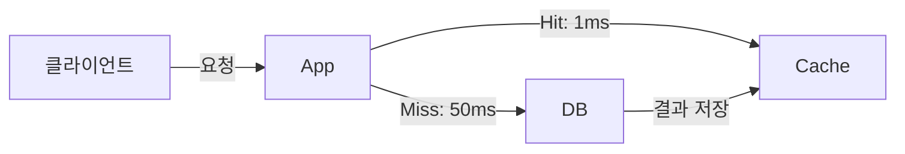
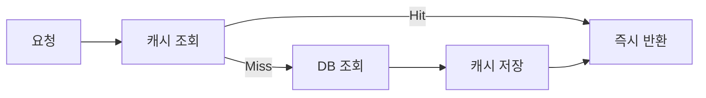
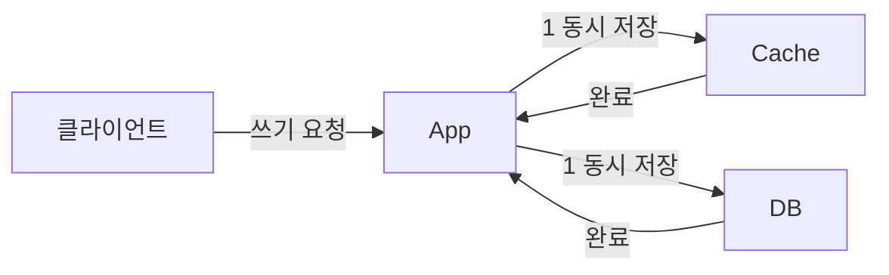
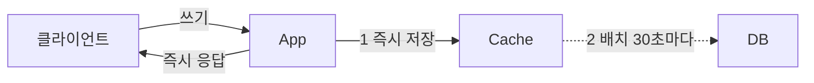
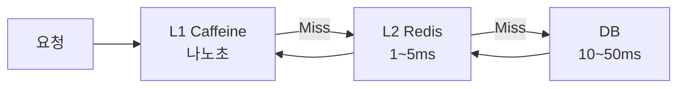
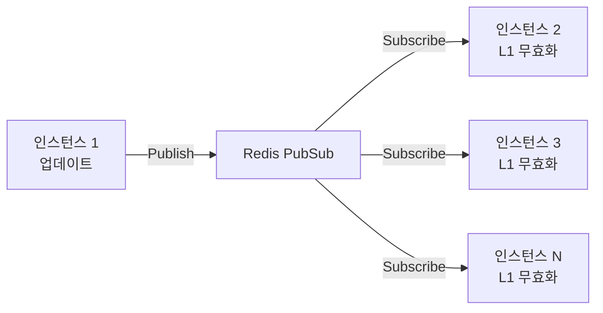

캐싱은 자주 사용되는 데이터를 빠른 저장소에 보관해 응답 속도를 높이고 원본 데이터 소스의 부하를 줄이는 기법이다. 이 글은 단순한 개념 소개를 넘어, 각 전략이 **왜** 그 방식으로 동작해야 하는지, 잘못 쓰면 **무슨 장애가** 발생하는지를 Spring/Java 실코드와 함께 설명한다.

> **비유**: 도서관(DB)에서 책을 빌릴 때마다 왕복 30분이 걸린다면, 자주 보는 책은 책상(캐시) 위에 두는 것이 훨씬 빠르다. 단, 도서관에서 내용이 개정되면 책상의 책은 구판이 된다. 언제 책상 책을 최신판으로 교체하느냐가 캐시 전략의 핵심이고, 잘못 교체하면 오히려 책상이 도서관을 무너뜨리는 역설이 발생한다.

---

## 1. 캐싱 핵심 개념과 측정 지표



**왜 이 지표들이 중요한가**

- **Hit Ratio** (캐시 히트율): 전체 요청 중 캐시에서 응답한 비율. 80% 미만이면 캐시가 오히려 시스템 복잡도만 높이고 성능 이득이 미미하다. 이유는 캐시 미스 시 캐시 조회 + DB 조회를 두 번 하기 때문이다.
- **Stale**: 캐시의 값이 DB 원본과 달라진 상태. 언제까지 허용하느냐는 비즈니스 요구사항이다(주가는 1초, 상품명은 1시간 허용 가능).
- **TTL (Time To Live)**: 캐시 유효 기간. 짧으면 항상 최신 데이터지만 DB 부하가 높고, 길면 Stale 위험이 높지만 Hit Ratio가 올라간다.
- **Eviction**: 캐시가 꽉 찼을 때 기존 항목 제거. 어떤 항목을 제거하느냐에 따라 Hit Ratio가 크게 달라진다.

```
캐싱 도입 판단 기준
- 읽기:쓰기 비율 > 10:1 → 캐싱 효과 큼
- 동일 데이터에 대한 반복 요청이 많음 → Hot Data 존재
- DB 쿼리 비용이 높음 (JOIN, 집계, 외부 API)
- 약간의 Stale을 허용할 수 있음
```

---

## 2. Cache-Aside (Lazy Loading) — 가장 범용적인 패턴

### 2-1. 내부 흐름과 왜 이 순서인가

애플리케이션이 캐시와 DB를 **직접** 모두 관리한다. "Aside"라는 이름처럼 캐시가 DB 옆에서 보조 역할을 한다.



흐름: ① 캐시 조회 → ② Hit이면 즉시 반환 / Miss이면 DB 조회 → ③ DB 결과를 캐시에 저장 → ④ 반환

**왜 "읽을 때만" 캐시에 저장하는가?** 쓸 때 캐시에 저장하면 절대 읽히지 않는 데이터도 메모리를 점유한다. Lazy Loading은 실제로 요청된 데이터만 캐싱하므로 파레토 법칙(20%의 데이터가 80%의 요청을 받는다)에 자연스럽게 적응한다.

### 2-2. Spring 구현 — RedisTemplate 직접 제어

```java
@Service
@RequiredArgsConstructor
@Slf4j
public class UserService {

    private final UserRepository userRepository;
    private final RedisTemplate<String, User> redisTemplate;
    private static final Duration TTL = Duration.ofMinutes(30);

    public User getUser(Long userId) {
        String key = "user:" + userId;

        // 1단계: 캐시 조회 (평균 1ms)
        User cached = redisTemplate.opsForValue().get(key);
        if (cached != null) {
            return cached;  // Cache Hit → 즉시 반환
        }

        // 2단계: Cache Miss → DB 조회 (평균 10~50ms)
        log.debug("Cache miss for user: {}", userId);
        User user = userRepository.findById(userId)
            .orElseThrow(() -> new UserNotFoundException(userId));

        // 3단계: 결과를 캐시에 저장 (다음 요청부터 Hit)
        redisTemplate.opsForValue().set(key, user, TTL);
        return user;
    }

    @Transactional
    public void updateUser(Long userId, UserUpdateRequest request) {
        User user = userRepository.findById(userId)
            .orElseThrow(() -> new UserNotFoundException(userId));
        user.update(request);
        userRepository.save(user);

        // DB 업데이트 후 캐시 삭제 (다음 조회 시 최신 데이터로 재캐싱)
        redisTemplate.delete("user:" + userId);
    }
}
```

**왜 업데이트 시 캐시를 삭제(evict)하고 즉시 저장하지 않는가?** 트랜잭션이 롤백될 경우 DB에는 구 데이터가 남는데 캐시에 신 데이터가 저장되어 영구적인 불일치가 발생한다. 삭제 후 다음 조회 시 DB에서 읽어오는 방식이 트랜잭션 롤백에 안전하다.

### 2-3. Cache-Aside의 실패 시나리오와 한계

| 실패 상황 | 원인 | 증상 |
|----------|------|------|
| Cold Start | 배포 직후 캐시 비어있음 | DB에 요청 집중, 응답 지연 |
| Cache Stampede | 인기 키 TTL 동시 만료 | DB 과부하, 장애 |
| Race Condition | 업데이트와 조회 타이밍 충돌 | Stale 데이터 재캐싱 |
| 캐시 장애 | Redis 다운 | DB Fallback은 작동하지만 부하 급증 |

---

## 3. Read-Through — 캐시가 DB 앞에 서는 패턴

### 3-1. Cache-Aside와 무엇이 다른가

Cache-Aside에서는 **애플리케이션 코드**가 "캐시 미스면 DB 조회 후 저장"을 처리한다. Read-Through에서는 이 로직이 **캐시 레이어**(라이브러리/프레임워크)에 위임된다. Spring Cache(`@Cacheable`)가 대표적인 Read-Through 구현이다.

**왜 이 차이가 중요한가?** 캐시 조회 로직이 비즈니스 코드에서 사라져 코드가 단순해지고, 캐시 전략 변경 시 비즈니스 코드를 건드리지 않아도 된다. 단, 캐시 미스 처리를 세밀하게 제어하기 어렵다.

### 3-2. Spring CacheManager 내부 동작 원리

Spring Cache는 AOP 기반으로 동작한다. `@Cacheable`이 붙은 메서드를 호출하면 `CacheInterceptor`가 가로채 다음 순서로 처리한다.

```
CacheInterceptor.invoke()
  → CacheAspectSupport.execute()
    → findCachedItem() : 캐시에서 키로 조회
      → Hit: 메서드 실행 없이 캐시 값 반환
      → Miss: 실제 메서드(DB 조회) 실행 → 결과를 캐시에 저장 → 반환
```

**CacheManager 설정 — TTL과 직렬화 방식이 핵심**

```java
@Configuration
public class CacheConfig {

    @Bean
    public CacheManager cacheManager(RedisConnectionFactory factory) {
        // 기본 설정: 모든 캐시에 적용
        RedisCacheConfiguration defaultConfig = RedisCacheConfiguration
            .defaultCacheConfig()
            .entryTtl(Duration.ofMinutes(30))
            // JSON 직렬화 — 왜? 기본 JDK 직렬화는 클래스 변경 시 역직렬화 오류 발생
            .serializeValuesWith(
                RedisSerializationContext.SerializationPair
                    .fromSerializer(new GenericJackson2JsonRedisSerializer()))
            // null 값 캐싱 허용 — 왜? null 캐싱 안 하면 존재하지 않는 ID로 반복 요청 시
            // DB를 계속 조회 (Cache Penetration 문제)
            .allowCacheNullValues();

        // 캐시별 개별 TTL 설정
        Map<String, RedisCacheConfiguration> cacheConfigs = new HashMap<>();
        cacheConfigs.put("products",
            defaultConfig.entryTtl(Duration.ofMinutes(10)));
        cacheConfigs.put("users",
            defaultConfig.entryTtl(Duration.ofMinutes(60)));
        cacheConfigs.put("categories",
            defaultConfig.entryTtl(Duration.ofHours(24)));  // 변경 드문 데이터

        return RedisCacheManager.builder(factory)
            .cacheDefaults(defaultConfig)
            .withInitialCacheConfigurations(cacheConfigs)
            .build();
    }
}
```

### 3-3. @Cacheable 어노테이션과 키 생성 전략

```java
@Service
@RequiredArgsConstructor
public class ProductService {

    private final ProductRepository productRepository;

    // 기본 키: SimpleKeyGenerator → "products::123" 형태
    @Cacheable(value = "products", key = "#productId")
    public Product getProduct(Long productId) {
        // Cache Miss 시에만 실행됨
        // Cache Hit 시 이 메서드 본문은 실행되지 않는다
        return productRepository.findById(productId).orElseThrow();
    }

    // SpEL 조건부 캐싱 — 왜? VIP 상품만 캐싱하고 싶을 때
    @Cacheable(
        value = "products",
        key = "#productId",
        condition = "#productId > 0",   // 조회 전 조건 (productId가 양수일 때만 캐싱)
        unless = "#result.stock == 0"   // 조회 후 조건 (재고 없으면 캐싱 제외)
    )
    public Product getProductWithCondition(Long productId) {
        return productRepository.findById(productId).orElseThrow();
    }

    // 업데이트 후 캐시에 새 값 저장 (캐시 삭제 후 재조회 왕복 없음)
    @CachePut(value = "products", key = "#result.id")
    @Transactional
    public Product updateProduct(Long productId, ProductUpdateRequest request) {
        Product product = productRepository.findById(productId).orElseThrow();
        product.update(request);
        return productRepository.save(product);
        // @CachePut: 반환값이 캐시에 자동 저장됨
    }

    // 캐시 삭제
    @CacheEvict(value = "products", key = "#productId")
    @Transactional
    public void deleteProduct(Long productId) {
        productRepository.deleteById(productId);
    }

    // 모든 products 캐시 삭제 — 주의: 대규모 캐시면 Redis 부하 급증
    @CacheEvict(value = "products", allEntries = true)
    public void clearAllProducts() { }
}
```

### 3-4. SimpleKeyGenerator vs 커스텀 키 생성 — 왜 중요한가

Spring의 기본 `SimpleKeyGenerator`는 파라미터가 없으면 `SimpleKey.EMPTY`, 파라미터가 1개면 그 값, 여러 개면 `SimpleKey(params...)`를 키로 사용한다. **문제**: 메서드가 다르더라도 같은 캐시 이름 + 같은 파라미터 값이면 동일한 키가 생성된다.

```java
// 문제 상황
@Cacheable("products")
public Product getById(Long id) { ... }  // 키: "products::1"

@Cacheable("products")
public Product getByCode(Long code) { ... }  // 키도 "products::1" → 충돌!
```

**커스텀 키 생성기로 해결**:

```java
@Configuration
public class CacheKeyConfig {

    @Bean("customKeyGenerator")
    public KeyGenerator customKeyGenerator() {
        return (target, method, params) -> {
            // "ClassName:methodName:param1:param2" 형태로 충돌 방지
            return target.getClass().getSimpleName()
                + ":" + method.getName()
                + ":" + Arrays.stream(params)
                              .map(Object::toString)
                              .collect(Collectors.joining(":"));
        };
    }
}

@Cacheable(value = "products", keyGenerator = "customKeyGenerator")
public Product getByCode(Long code) { ... }
// 키: "ProductService:getByCode:1" → 충돌 없음
```

### 3-5. Read-Through가 실패하는 상황

**Cache Penetration**: 존재하지 않는 ID로 계속 요청이 오면 캐시에 저장할 값이 없어서 매번 DB를 조회한다. 해결책은 null 결과도 캐싱하는 것이다.

```java
@Cacheable(value = "products", key = "#productId")
public Optional<Product> getProduct(Long productId) {
    // null 대신 Optional.empty()를 반환 → 캐시에 저장됨
    // allowCacheNullValues() 설정 필요
    return productRepository.findById(productId);
}
```

**왜 null을 캐싱하면 Cache Penetration이 해결되는가?** 악의적인 요청(존재하지 않는 ID 수백만 개)이 오면, 첫 요청은 DB 조회가 발생하지만 결과(null)가 캐시에 저장된다. 이후 같은 ID 요청은 캐시에서 null을 반환해 DB를 보호한다. 단, 수백만 개의 null을 Redis에 저장하는 메모리 낭비가 생기므로 Bloom Filter와 함께 사용하는 것이 이상적이다.

---

## 4. Write-Through — 쓸 때 캐시와 DB를 동시에

### 4-1. 내부 흐름과 왜 동시에 써야 하는가



**왜 캐시와 DB를 동시에 저장하는가?** 다음 읽기 요청이 즉시 캐시 히트를 얻을 수 있기 때문이다. 쓰기 직후에 읽기가 빈번한 패턴(사용자 프로필 수정 후 즉시 마이페이지 표시)에서 DB 왕복 없이 최신 데이터를 서빙할 수 있다.

**왜 쓰기 성능이 낮아지는가?** 캐시(1ms)와 DB(10~50ms) 두 곳 모두에 쓰기가 완료되어야 응답을 반환하므로, 쓰기 지연은 `MAX(캐시 쓰기, DB 쓰기)`가 아니라 `캐시 쓰기 + DB 쓰기`에 가깝다.

### 4-2. Spring 구현

```java
@Service
@RequiredArgsConstructor
public class InventoryService {

    private final InventoryRepository inventoryRepository;
    private final RedisTemplate<String, Integer> redisTemplate;

    // Write-Through: DB 저장 + 캐시 즉시 갱신
    @Transactional
    public void updateStock(Long productId, int quantity) {
        // 1. DB 업데이트 (트랜잭션 내)
        inventoryRepository.updateStock(productId, quantity);

        // 2. 캐시 즉시 갱신 (삭제가 아닌 갱신)
        // 왜 삭제 대신 갱신인가? 삭제 후 다음 요청까지 캐시 미스 발생 → DB 부하
        redisTemplate.opsForValue().set(
            "stock:" + productId,
            quantity,
            Duration.ofHours(1)
        );
        // 트랜잭션 롤백 시 DB는 롤백되지만 캐시는 롤백 안 됨 → 불일치 발생
        // 이를 방지하려면 @TransactionalEventListener를 사용해야 함 (7절 참고)
    }

    public int getStock(Long productId) {
        Integer cached = redisTemplate.opsForValue().get("stock:" + productId);
        if (cached != null) return cached;
        return inventoryRepository.findStock(productId);
    }
}
```

### 4-3. Write-Through가 실패하는 상황

**왜 읽기 빈도 낮은 데이터에 Write-Through를 쓰면 안 되는가?** 쓸 때마다 캐시에 저장하지만, 그 데이터가 만료 전에 한 번도 읽히지 않으면 메모리만 낭비한다. 예를 들어 배치 처리로 100만 건의 상품 가격을 업데이트하면, 그 중 실제로 조회되는 상품은 1만 건뿐인데 100만 건이 전부 Redis에 저장된다.

**해결**: 읽기 빈도 높은 데이터만 Write-Through, 나머지는 Cache-Aside(읽을 때 캐싱)를 사용한다.

---

## 5. Write-Behind (Write-Back) — 캐시에 먼저 쓰고 DB는 나중에

### 5-1. 왜 이 패턴이 필요한가

초당 수만 건의 쓰기가 발생하는 상황을 생각해보자. 인기 유튜브 영상에 조회수가 초당 10만 씩 쌓인다면, Write-Through로 매번 DB에 `UPDATE` 를 날리는 것은 불가능하다. Write-Behind는 이 문제를 캐시(메모리)를 버퍼로 사용해 해결한다.



**왜 즉시 응답이 가능한가?** 캐시(Redis) 쓰기는 1ms 미만이고, DB 쓰기는 10~50ms이다. Write-Behind는 느린 DB 쓰기를 비동기 배치로 처리해 클라이언트 응답 경로에서 제거한다.

### 5-2. Spring 구현

```java
@Component
@RequiredArgsConstructor
@Slf4j
public class ViewCountService {

    private final RedisTemplate<String, Long> redisTemplate;
    private final ArticleRepository articleRepository;

    // 조회수 증가: Redis에만 즉시 기록 (< 1ms)
    public void incrementViewCount(Long articleId) {
        String key = "viewcount:" + articleId;
        redisTemplate.opsForValue().increment(key);
        // 왜 increment인가? SET은 동시성 충돌로 카운트 유실 가능
        // Redis INCR는 원자적(atomic) 연산이므로 레이스 컨디션 없음
    }

    public Long getViewCount(Long articleId) {
        Long count = redisTemplate.opsForValue().get("viewcount:" + articleId);
        // Redis에 없으면 DB에서 (초기 로딩 또는 Redis 재시작 후)
        return count != null ? count : articleRepository.findViewCount(articleId);
    }

    // 30초마다 Redis → DB 동기화 (Write-Behind flush)
    @Scheduled(fixedDelay = 30_000)
    @Transactional
    public void flushViewCounts() {
        Set<String> keys = redisTemplate.keys("viewcount:*");
        if (keys == null || keys.isEmpty()) return;

        log.info("Flushing {} view count keys to DB", keys.size());

        for (String key : keys) {
            // GETDEL: 읽고 삭제를 원자적으로 → flush 중 새로 들어온 count를 잃지 않음
            // 왜 GET+DEL 분리하면 안 되나?
            // GET 후 DEL 전에 새 increment 발생하면 그 값이 사라짐
            Long count = redisTemplate.opsForValue().getAndDelete(key);
            if (count == null || count == 0) continue;

            Long articleId = Long.parseLong(key.replace("viewcount:", ""));
            // DB에는 누적 덧셈 (SET이 아닌 UPDATE ... + count)
            articleRepository.incrementViewCount(articleId, count);
        }
    }
}
```

**왜 `getAndDelete`(GETDEL)를 써야 하는가?** `GET` 후 `DEL`을 따로 호출하면 그 사이에 새 조회수가 increment되어 그 값이 DEL로 사라진다. GETDEL은 Redis의 원자적 명령이라 이 race condition이 없다.

### 5-3. Write-Behind의 치명적 한계

**캐시 장애 시 데이터 유실**: flush 주기(30초)마다 DB와 동기화되므로, 장애 발생 직전 30초치 데이터는 유실된다. 조회수 30초치 유실은 허용 가능하지만, 결제 금액 30초치 유실은 치명적이다. Write-Behind는 **유실이 허용되는** 데이터에만 써야 한다.

| 적합 | 부적합 |
|------|--------|
| 조회수, 좋아요 수 | 결제 금액, 재고 수량 |
| 게임 점수, 경험치 | 계좌 잔액, 주문 상태 |
| 로그, 실시간 통계 | 사용자 개인정보 |

---

## 6. Cache Stampede — 캐시가 DB를 죽이는 역설

### 6-1. Thundering Herd 문제의 메커니즘

캐시 스탬피드(Cache Stampede)는 캐시가 보호하러 들어왔다가 오히려 DB를 더 심하게 죽이는 역설이다. 원리를 정확히 이해해야 방어할 수 있다.

```
t = 0초:    "popular-product:1" TTL 만료
t = 0~0.1초: 동시 요청 1,000개 → 전부 Cache Miss
             → 1,000개 DB 쿼리 동시 발생
             → DB CPU 100% → DB 응답 지연
             → 더 많은 요청 큐에 적체
             → 큐 적체 → 더 많은 재시도 요청
             → DB 완전 다운 (Cascading Failure)
```

**왜 이게 "Thundering Herd"인가?** 수백 마리의 소 떼(요청)가 동시에 한 곳(DB)으로 몰려드는 상황에서 비롯된 이름이다. 평소에는 캐시가 DB 앞에서 소 떼를 막아주는데, 캐시 만료 순간 소 떼가 일제히 DB로 돌진한다.

### 6-2. 해결책 1: Mutex Lock — SETNX로 한 스레드만 DB 조회

**왜 Redis SETNX인가?** 일반 Lock(synchronized, ReentrantLock)은 단일 JVM 내에서만 유효하다. 여러 서버 인스턴스가 있는 분산 환경에서는 JVM Lock이 의미 없다. Redis SETNX(SET if Not eXists)는 Redis를 공유 뮤텍스로 사용해 여러 서버 인스턴스 간에도 단 하나의 서버만 DB를 조회하게 보장한다.

```java
@Service
@RequiredArgsConstructor
@Slf4j
public class ProductService {

    private final ProductRepository productRepository;
    private final RedisTemplate<String, Object> redisTemplate;

    public Product getProduct(Long productId) {
        String key = "product:" + productId;

        // 1단계: 캐시 조회
        Product cached = (Product) redisTemplate.opsForValue().get(key);
        if (cached != null) return cached;

        // 2단계: Cache Miss → 분산 락 획득 시도
        String lockKey = "lock:" + key;
        // SETNX + EXPIRE 원자적 실행 (setIfAbsent = SET key value NX PX milliseconds)
        // 왜 락에 TTL이 필요한가? 락 획득 후 서버가 죽으면 락이 영원히 해제 안 됨 → Deadlock
        Boolean acquired = redisTemplate.opsForValue()
            .setIfAbsent(lockKey, "LOCKED", Duration.ofSeconds(5));

        if (Boolean.TRUE.equals(acquired)) {
            // 락 획득 성공 → 이 서버만 DB 조회
            try {
                // Double-check: 락 기다리는 동안 다른 서버가 이미 캐싱했을 수 있음
                cached = (Product) redisTemplate.opsForValue().get(key);
                if (cached != null) return cached;

                Product product = productRepository.findById(productId).orElseThrow();
                // TTL 지터 추가 (6-3절 참고)
                Duration ttl = Duration.ofMinutes(10)
                    .plusSeconds(ThreadLocalRandom.current().nextInt(60));
                redisTemplate.opsForValue().set(key, product, ttl);
                return product;
            } finally {
                // 반드시 finally에서 락 해제 — 예외 발생해도 해제
                redisTemplate.delete(lockKey);
            }
        } else {
            // 락 획득 실패 → 다른 서버가 DB 조회 중
            // 잠시 대기 후 캐시 재조회 (이번엔 Hit 기대)
            try {
                Thread.sleep(50);
            } catch (InterruptedException e) {
                Thread.currentThread().interrupt();
            }
            // 재귀 호출 → 스택 오버플로우 방지를 위해 실제로는 루프 사용 권장
            return getProduct(productId);
        }
    }
}
```

**락 구현의 함정**: `setIfAbsent`를 사용하지 않고 `exists` + `set`을 따로 호출하면 두 연산 사이에 다른 서버가 끼어들 수 있다. 반드시 원자적인 단일 명령으로 처리해야 한다.

### 6-3. 해결책 2: TTL 지터 — 동시 만료 방지

**왜 같은 TTL을 쓰면 동시 만료가 발생하는가?** 예를 들어 부하 테스트로 10만 개의 캐시를 정확히 같은 시각에 저장하면, 10분 후 10만 개가 동시에 만료된다. 지터(jitter)는 TTL에 랜덤 값을 더해 만료 시점을 분산시킨다.

```java
@Component
public class JitteredTtlCache {

    private final RedisTemplate<String, Object> redisTemplate;
    private final ThreadLocalRandom random = ThreadLocalRandom.current();

    // 고정 TTL: 모두 정확히 10분 후 만료 → 동시 만료 문제
    public void setFixed(String key, Object value) {
        redisTemplate.opsForValue().set(key, value, Duration.ofMinutes(10));
    }

    // 지터 TTL: 10분 ± 30초 → 만료 시점 분산
    public void setWithJitter(String key, Object value) {
        long jitterSeconds = ThreadLocalRandom.current().nextLong(-30, 30);
        Duration ttl = Duration.ofMinutes(10).plusSeconds(jitterSeconds);
        redisTemplate.opsForValue().set(key, value, ttl);
    }

    // 지수 지터: 재시도 시 지터 범위를 점진적으로 늘림 (AWS에서 권장하는 방식)
    public void setWithExponentialJitter(String key, Object value, int retryCount) {
        long baseMs = 600_000L; // 10분
        long jitter = (long)(baseMs * 0.1 * Math.pow(2, retryCount) * Math.random());
        Duration ttl = Duration.ofMillis(baseMs + jitter);
        redisTemplate.opsForValue().set(key, value, ttl);
    }
}
```

**지터만으로는 부족한 이유**: 지터는 새로 저장할 때 TTL을 분산시키는 것이지, 이미 저장된 수백만 개의 캐시가 동시 만료되는 상황(ex. 서비스 재시작 후 웜업 데이터)을 막지는 못한다. 지터는 Stampede 확률을 줄이는 것이지 완전 방지는 아니다.

### 6-4. 해결책 3: XFetch 알고리즘 — 수학적 조기 갱신

**왜 이 알고리즘이 필요한가?** 뮤텍스 락은 Stampede가 발생한 **후** 한 스레드만 DB를 조회하게 막는다. XFetch는 Stampede가 발생하기 **전에** 확률적으로 캐시를 갱신해 TTL 만료 자체를 방지한다.

**핵심 공식**:

```
early_recompute = (current_time - delta * beta * ln(random())) > expiry_time
```

- `delta`: 마지막 DB 조회에 걸린 시간 (재계산 비용)
- `beta`: 조기 갱신 강도 (기본값 1.0, 높을수록 일찍 갱신)
- `ln(random())`: 항상 음수 → 조기 갱신 조건을 만족시키는 확률적 요소
- TTL이 많이 남았으면 `current_time < expiry_time`이므로 조기 갱신 안 함
- TTL이 거의 없으면 조건을 만족할 확률이 점점 높아짐

```java
@Value
@AllArgsConstructor
public class XFetchEntry<T> {
    private final T data;
    private final long expiryTimeMs;    // 논리적 만료 시각
    private final long computeTimeMs;   // 마지막 DB 조회 소요 시간
}

@Service
@RequiredArgsConstructor
public class XFetchCacheService {

    private final RedisTemplate<String, XFetchEntry> redisTemplate;
    private final ProductRepository productRepository;

    private static final double BETA = 1.0;  // 조기 갱신 강도

    public Product getProduct(Long productId) {
        String key = "product:" + productId;
        XFetchEntry<Product> entry = (XFetchEntry<Product>) redisTemplate.opsForValue().get(key);

        if (entry == null) {
            // 진짜 캐시 미스 → 동기 로딩 (뮤텍스 락 병행 권장)
            return loadAndCache(productId, key);
        }

        long now = System.currentTimeMillis();
        // XFetch 공식: 조기 갱신 여부 결정
        // ln(Math.random())은 항상 음수 → -delta * beta * ln(random()) 는 항상 양수
        double adjustedTime = now - (entry.getComputeTimeMs() * BETA * Math.log(Math.random()));

        if (adjustedTime >= entry.getExpiryTimeMs()) {
            // 확률적으로 조기 갱신 당첨 → 비동기로 갱신, 현재는 기존 데이터 반환
            // 왜 비동기인가? 동기로 하면 응답 지연 발생, 스탬피드 방지 효과 없음
            refreshAsync(productId, key);
        }

        return entry.getData();
    }

    private Product loadAndCache(Long productId, String key) {
        long start = System.currentTimeMillis();
        Product product = productRepository.findById(productId).orElseThrow();
        long computeTime = System.currentTimeMillis() - start;

        long expiryMs = System.currentTimeMillis() + Duration.ofMinutes(10).toMillis();
        XFetchEntry<Product> entry = new XFetchEntry<>(product, expiryMs, computeTime);

        // Redis TTL은 논리적 만료보다 훨씬 길게 (데이터 보존용)
        redisTemplate.opsForValue().set(key, entry, Duration.ofHours(2));
        return product;
    }

    @Async
    public void refreshAsync(Long productId, String key) {
        // 분산 락으로 중복 갱신 방지
        String lockKey = "xfetch-lock:" + productId;
        Boolean acquired = redisTemplate.opsForValue()
            .setIfAbsent(lockKey, "LOCKED", Duration.ofSeconds(10));
        if (!Boolean.TRUE.equals(acquired)) return; // 이미 다른 서버가 갱신 중

        try {
            long start = System.currentTimeMillis();
            Product product = productRepository.findById(productId).orElseThrow();
            long computeTime = System.currentTimeMillis() - start;

            long expiryMs = System.currentTimeMillis() + Duration.ofMinutes(10).toMillis();
            XFetchEntry<Product> newEntry = new XFetchEntry<>(product, expiryMs, computeTime);
            redisTemplate.opsForValue().set(key, newEntry, Duration.ofHours(2));
        } finally {
            redisTemplate.delete(lockKey);
        }
    }
}
```

**왜 XFetch가 여러 서버에서 동시 갱신을 수학적으로 방지하는가?** `Math.log(Math.random())`은 서버마다 다른 랜덤 값을 생성한다. TTL이 얼마 남지 않았을 때, 조기 갱신 조건을 동시에 만족하는 서버는 통계적으로 소수다. 완전한 방지는 아니므로 위 코드처럼 분산 락을 함께 사용한다.

### 6-5. 해결책 4: 논리적 만료 (Logical Expiration) — Stampede 원천 차단

**왜 이게 가장 강력한가?** Redis TTL을 설정하지 않으므로 캐시 키가 절대 만료되어 사라지지 않는다. Stale 여부는 캐시 값 안의 `expireAt` 필드로 앱이 판단한다. 만료되어도 즉시 stale 데이터를 반환하고 단 하나의 서버만 백그라운드에서 갱신한다.

```java
@Value
@AllArgsConstructor
public class LogicalCacheEntry<T> {
    private final T data;
    private final long expireAt;  // 논리적 만료 시각 (epoch ms)

    public boolean isExpired() {
        return System.currentTimeMillis() > expireAt;
    }
}

@Service
public class LogicalExpirationCache {

    private final RedisTemplate<String, LogicalCacheEntry> redisTemplate;
    private final ProductRepository productRepository;

    public Product getProduct(Long productId) {
        String key = "product:" + productId;
        LogicalCacheEntry<Product> entry =
            (LogicalCacheEntry<Product>) redisTemplate.opsForValue().get(key);

        // 키 자체가 없음 (최초 요청 또는 Redis 재시작)
        if (entry == null) {
            return loadWithLock(productId, key);
        }

        if (entry.isExpired()) {
            // 논리적으로 만료됨 → stale 데이터 즉시 반환 + 비동기 갱신
            // 1,000개 동시 요청 모두 stale 데이터를 받음 → DB에 단 1개 요청만 감
            refreshAsync(productId, key);
            return entry.getData();
        }

        return entry.getData();
    }

    private Product loadWithLock(Long productId, String key) {
        String lockKey = "init-lock:" + productId;
        Boolean acquired = redisTemplate.opsForValue()
            .setIfAbsent(lockKey, "LOCKED", Duration.ofSeconds(10));

        if (Boolean.TRUE.equals(acquired)) {
            try {
                Product product = productRepository.findById(productId).orElseThrow();
                long expiryMs = System.currentTimeMillis() + Duration.ofMinutes(10).toMillis();
                LogicalCacheEntry<Product> entry = new LogicalCacheEntry<>(product, expiryMs);
                // Redis TTL 없음 (또는 매우 길게) — 키가 사라지지 않음
                redisTemplate.opsForValue().set(key, entry);
                return product;
            } finally {
                redisTemplate.delete(lockKey);
            }
        }
        // 락 대기 중 잠시 후 재시도 (초기화 중)
        try { Thread.sleep(50); } catch (InterruptedException e) { Thread.currentThread().interrupt(); }
        return getProduct(productId);
    }

    @Async
    public void refreshAsync(Long productId, String key) {
        String lockKey = "refresh-lock:" + productId;
        Boolean acquired = redisTemplate.opsForValue()
            .setIfAbsent(lockKey, "LOCKED", Duration.ofSeconds(10));
        if (!Boolean.TRUE.equals(acquired)) return;  // 이미 갱신 중

        try {
            Product product = productRepository.findById(productId).orElseThrow();
            long expiryMs = System.currentTimeMillis() + Duration.ofMinutes(10).toMillis();
            redisTemplate.opsForValue().set(key, new LogicalCacheEntry<>(product, expiryMs));
        } finally {
            redisTemplate.delete(lockKey);
        }
    }
}
```

### 6-6. Stampede 방어 전략 종합 비교

| 전략 | 방지 수준 | 응답 지연 | 구현 난도 | stale 가능 | 적합한 상황 |
|------|:---:|:---:|:---:|:---:|-----------|
| TTL 지터 | 확률 감소 | 없음 | 매우 쉬움 | 아니오 | 기본 적용 |
| 뮤텍스 락 | 차단 | 락 대기 50ms+ | 쉬움 | 아니오 | 범용 |
| XFetch | 예방 | 없음 | 어려움 | 약간 | 대규모 분산 |
| 논리적 만료 | 원천 차단 | 없음 | 중간 | 예 | Hot Key 보호 |

**실무 추천**: TTL 지터(모든 캐시 기본 적용) + 뮤텍스 락(Cold Miss 보호) + 논리적 만료(Top 100 Hot Key). 이 조합이면 99.9%의 Stampede를 방어한다.

---

## 7. Cache Invalidation — 가장 어려운 분산 시스템 문제

### 7-1. 왜 캐시 무효화가 어려운가

Phil Karlton의 유명한 말: "컴퓨터 과학에서 정말 어려운 문제는 두 가지다: 캐시 무효화와 이름 짓기." 왜 어려운가?

DB가 변경되는 순간부터 캐시를 무효화하는 순간까지 **불일치 창(inconsistency window)**이 항상 존재하고, 이 창을 0으로 만드는 것은 분산 시스템에서 원리적으로 불가능하다(CAP 정리). 목표는 이 창을 비즈니스가 허용하는 범위로 줄이는 것이다.

### 7-2. 단순 삭제 패턴의 Race Condition 분석

가장 흔하게 보이는 "업데이트 후 캐시 삭제" 패턴에는 숨겨진 Race Condition이 있다.

```
[Thread A: 업데이트 요청]     [Thread B: 조회 요청]
① DB 업데이트
                              ② 캐시 Miss → DB 조회 시작 (구 값 읽기)
③ 캐시 삭제
                              ④ 읽어온 구 값을 캐시에 저장
                              → 캐시에 구 값이 재캐싱됨! (TTL 만료까지 지속)
```

**왜 이 순서로 Race Condition이 발생하는가?** DB 업데이트(①)와 캐시 삭제(③) 사이에 Thread B가 끼어들어 구 값을 DB에서 읽어온다. Thread A가 캐시를 삭제해도 Thread B가 방금 읽은 구 값을 바로 다시 캐시에 쓴다.

### 7-3. Double Delete 패턴 — 왜 sleep이 필요한가

```java
@Service
@RequiredArgsConstructor
public class UserCacheService {

    private final UserRepository userRepository;
    private final RedisTemplate<String, User> redisTemplate;

    @Transactional
    public void updateUser(Long userId, UserUpdateRequest request) {
        // 1차 삭제: 혹시 있을 stale 캐시를 먼저 제거
        // 왜 먼저 삭제하는가? 트랜잭션 도중 다른 Thread가 구 캐시를 읽지 못하게
        redisTemplate.delete("user:" + userId);

        // DB 업데이트 (트랜잭션)
        User user = userRepository.findById(userId).orElseThrow();
        user.update(request);
        userRepository.save(user);

        // 트랜잭션 커밋 후 이벤트 발행
        // 왜 커밋 후인가? 커밋 전에 삭제하면 트랜잭션 롤백 시 캐시만 삭제되고
        // DB는 구 값 유지 → 다음 조회가 구 값을 다시 캐싱
        eventPublisher.publishEvent(new UserUpdatedEvent(userId));
    }
}

@Component
@RequiredArgsConstructor
public class UserCacheInvalidator {

    private final RedisTemplate<String, User> redisTemplate;

    @TransactionalEventListener(phase = TransactionPhase.AFTER_COMMIT)
    public void onUserUpdated(UserUpdatedEvent event) {
        // 왜 여기서 sleep이 필요한가?
        // DB 업데이트(커밋) 직후, 아직 네트워크 지연으로
        // Replica DB에 변경이 전파되지 않았을 수 있음
        // 이 사이에 다른 Thread가 Replica에서 구 값을 읽어 캐시에 저장할 수 있음
        // sleep으로 Replica 동기화를 기다림
        try {
            Thread.sleep(500); // Replica lag 허용 시간
        } catch (InterruptedException e) {
            Thread.currentThread().interrupt();
        }

        // 2차 삭제: 1~3번 Race Condition으로 재캐싱된 구 값을 제거
        redisTemplate.delete("user:" + event.getUserId());
    }
}
```

**왜 `@TransactionalEventListener(phase = AFTER_COMMIT)`인가?** 기본 `@EventListener`는 트랜잭션 도중에도 실행된다. 트랜잭션이 롤백되면 DB는 구 값인데 캐시는 삭제된 상태가 된다. `AFTER_COMMIT`은 트랜잭션이 성공적으로 커밋된 후에만 실행을 보장한다.

**왜 sleep 500ms가 필요한가?** MySQL Replica(읽기 전용 슬레이브)는 Master에서 변경이 발생한 후 동기화되는 데 수백 ms의 지연(Replica Lag)이 있다. Thread B가 Read Replica에서 구 값을 조회해 캐시에 저장하는 것을 막으려면, Replica 동기화가 완료될 때까지 대기해야 한다.

### 7-4. 이벤트 기반 무효화 — 더 정확한 타이밍 보장

Sleep 방식의 문제: Replica Lag이 500ms보다 길면 여전히 Race Condition 발생. 더 정확한 방법은 DB 변경 이벤트(Binlog)를 구독해 실제 변경이 Replica에 전파된 후 캐시를 무효화하는 것이다.

```java
// Debezium CDC(Change Data Capture) 이벤트 소비 예시
@Component
@RequiredArgsConstructor
public class UserChangeEventConsumer {

    private final RedisTemplate<String, User> redisTemplate;

    // Kafka에서 MySQL Binlog 변경 이벤트 수신
    @KafkaListener(topics = "mysql.users")
    public void onUserChanged(UserChangeEvent event) {
        if (event.getOperation() == Operation.UPDATE
            || event.getOperation() == Operation.DELETE) {
            // Binlog 이벤트가 도착했다는 것 = Replica에 이미 반영됨
            // 이제 캐시 삭제는 안전 (Replica에서 구 값을 읽을 위험 없음)
            redisTemplate.delete("user:" + event.getPayload().getId());
            log.info("Cache invalidated for user: {} (CDC event)",
                event.getPayload().getId());
        }
    }
}
```

**이벤트 기반 무효화의 장점**: DB 변경과 캐시 무효화가 분리되어 애플리케이션 코드가 단순해진다. DB 변경이 발생하는 곳이 여러 서비스에 분산되어 있어도 단일 소비자가 캐시를 통합 관리할 수 있다.

---

## 8. 분산 캐시 정합성 — CAP 정리와 Split-Brain

### 8-1. CAP 정리가 캐싱에 미치는 영향

CAP 정리: 분산 시스템에서 Consistency(일관성), Availability(가용성), Partition Tolerance(네트워크 분리 허용) 세 가지를 동시에 보장하는 것은 불가능하다. 네트워크 장애(Partition)는 실제로 발생하므로, 실질적으로 C와 A 중 하나를 선택해야 한다.

**Redis Cluster의 선택**: 기본적으로 **AP(가용성 우선)**. 네트워크 장애 시 Consistency를 일부 포기하고 가용성을 유지한다. 이것이 캐시에 Stale 데이터가 발생하는 근본 이유다.

### 8-2. Redis Cluster Split-Brain 시나리오

```
정상 상태:
  Primary (Seoul)  ←→  Replica (Busan)
  key: "stock:1" = 100

네트워크 파티션 발생:
  Primary (Seoul)  ✗✗✗  Replica (Busan)

서비스 A → Primary 캐시 쓰기:
  "stock:1" = 50  (재고 50개 차감)

서비스 B → Replica 캐시 읽기:
  "stock:1" = 100  (구 값! Replica 동기화 안 됨)

→ 서비스 B는 재고가 100개라고 판단 → 중복 판매 발생

네트워크 복구 후 Replica가 Primary와 동기화:
  Replica "stock:1" = 50  (맞게 수정됨)
  but 이미 중복 판매 발생
```

**왜 이게 발생하는가?** Redis Cluster는 네트워크 파티션 시 Replica가 자동으로 Primary로 승격(Failover)된다. 이 Failover 과정(기본 30초)동안 Primary에 쓰인 데이터가 Replica에 전파되지 않는다. Failover 후 구 Primary는 Replica로 강등되며 데이터가 덮어씌워진다.

```java
// Split-Brain 위험을 완화하는 설계 패턴
@Service
public class StockService {

    private final RedisTemplate<String, Integer> redisTemplate;
    private final StockRepository stockRepository;

    public int getStock(Long productId) {
        Integer cached = redisTemplate.opsForValue().get("stock:" + productId);

        if (cached == null) {
            // 캐시 미스 → DB가 Source of Truth
            return stockRepository.findStock(productId);
        }

        // 캐시는 힌트로만 사용, 재고 0 이하면 DB에서 재확인
        // 왜? Split-Brain으로 캐시가 틀렸을 때 과판매 방지
        if (cached <= 10) {  // 임계값 이하면 DB 재확인
            int dbStock = stockRepository.findStock(productId);
            // DB 값으로 캐시 동기화
            redisTemplate.opsForValue().set("stock:" + productId, dbStock,
                Duration.ofMinutes(5));
            return dbStock;
        }

        return cached;
    }

    @Transactional
    public boolean decreaseStock(Long productId, int quantity) {
        // 재고 감소는 반드시 DB에서 직접 (낙관적 락 또는 DB 레벨 체크)
        // 캐시로 재고 판단하면 Split-Brain 시 과판매 발생
        int updated = stockRepository.decreaseStock(productId, quantity);
        if (updated == 0) return false;  // 재고 부족

        // DB 성공 후 캐시 동기화
        int newStock = stockRepository.findStock(productId);
        redisTemplate.opsForValue().set("stock:" + productId, newStock,
            Duration.ofMinutes(5));
        return true;
    }
}
```

**핵심 교훈**: 돈, 재고처럼 정확성이 중요한 데이터의 **쓰기 판단**을 캐시에 의존하면 안 된다. 캐시는 읽기 성능 최적화용이고, Source of Truth는 항상 DB여야 한다.

---

## 9. Spring Cache 내부 구조 심화

### 9-1. CacheInterceptor 동작 흐름

`@Cacheable`이 어떻게 동작하는지 내부를 이해해야 예상치 못한 동작을 디버깅할 수 있다.

```
메서드 호출 → CacheInterceptor.invoke()
  → CacheAspectSupport.execute()
    → inspectBeforeCacheEvicts()       // @CacheEvict(beforeInvocation=true) 처리
    → findCachedItem()                 // @Cacheable 키로 캐시 조회
      → Hit → 반환 (메서드 실행 안 함)
      → Miss → invokeOperation()       // 실제 메서드 실행 (DB 조회)
        → cachePutRequest()            // 결과를 캐시에 저장
    → inspectAfterCacheEvicts()        // @CacheEvict(beforeInvocation=false, 기본) 처리
    → processCachePuts()               // @CachePut 처리
```

**왜 `@CacheEvict`에 `beforeInvocation=true/false`가 중요한가?**

```java
// beforeInvocation=false (기본): 메서드 실행 성공 후 캐시 삭제
// → 메서드가 예외를 던지면 캐시 삭제 안 됨 (안전)
@CacheEvict(value = "products", key = "#productId")
public void deleteProduct(Long productId) {
    productRepository.deleteById(productId);
    // 삭제 성공 후 캐시 삭제 → 정합성 유지
}

// beforeInvocation=true: 메서드 실행 전 캐시 먼저 삭제
// → 메서드가 예외를 던져도 캐시는 이미 삭제됨
// → 다음 조회 시 DB에서 구 값을 다시 읽음 (캐시 미스 + DB 부하)
@CacheEvict(value = "products", key = "#productId", beforeInvocation = true)
public void deleteProductForced(Long productId) {
    productRepository.deleteById(productId);
    // 예외 발생해도 캐시는 이미 삭제된 상태
}
```

### 9-2. SpEL(Spring Expression Language) 조건 평가 심화

```java
@Service
public class ProductCacheService {

    // condition: 메서드 실행 전 평가 → 파라미터만 사용 가능
    // unless: 메서드 실행 후 평가 → 반환값(#result)도 사용 가능
    @Cacheable(
        value = "products",
        key = "#category + ':' + #page",
        condition = "#page < 10",       // 10페이지 이하만 캐싱 (뒷 페이지는 캐시 낭비)
        unless = "#result.isEmpty()"    // 결과가 비어있으면 캐싱 제외
    )
    public List<Product> getProductsByCategory(String category, int page) {
        return productRepository.findByCategory(category, PageRequest.of(page, 20))
            .getContent();
    }

    // 복합 키 생성 — SpEL로 객체 필드 접근
    @Cacheable(
        value = "products",
        key = "#searchRequest.category + ':' + #searchRequest.keyword + ':' + #searchRequest.page"
    )
    public List<Product> search(SearchRequest searchRequest) {
        return productRepository.search(searchRequest);
    }

    // 사용자별 캐시 — Spring Security와 연동
    @Cacheable(
        value = "user-products",
        key = "#root.target.currentUserId() + ':' + #productId"
    )
    public ProductDetail getProductDetail(Long productId) {
        return buildProductDetail(productId);
    }

    private Long currentUserId() {
        return ((UserDetails) SecurityContextHolder.getContext()
            .getAuthentication().getPrincipal()).getUserId();
    }
}
```

### 9-3. @Cacheable이 동작하지 않는 상황 — 자기 호출 문제

**가장 흔한 함정**: 같은 클래스 내에서 `@Cacheable` 메서드를 직접 호출하면 AOP 프록시를 우회해 캐시가 작동하지 않는다.

```java
@Service
public class ProductService {

    // 문제: 내부 호출 → AOP 프록시 우회 → 캐시 작동 안 함
    public void processOrder(Long productId) {
        Product product = getProduct(productId);  // this.getProduct() → AOP 바이패스!
        // ...
    }

    @Cacheable("products")
    public Product getProduct(Long productId) {
        return productRepository.findById(productId).orElseThrow();
    }
}

// 해결책 1: 자기 자신을 주입받아 프록시를 통해 호출
@Service
public class ProductService {

    @Autowired
    @Lazy  // 순환 의존성 방지
    private ProductService self;

    public void processOrder(Long productId) {
        Product product = self.getProduct(productId);  // 프록시를 통해 호출 → 캐시 동작
    }

    @Cacheable("products")
    public Product getProduct(Long productId) {
        return productRepository.findById(productId).orElseThrow();
    }
}

// 해결책 2: 캐시 레이어를 별도 클래스로 분리 (더 권장)
@Service
@RequiredArgsConstructor
public class ProductCacheService {

    private final ProductRepository productRepository;

    @Cacheable("products")
    public Product getProduct(Long productId) {
        return productRepository.findById(productId).orElseThrow();
    }
}

@Service
@RequiredArgsConstructor
public class ProductService {

    private final ProductCacheService productCacheService;

    public void processOrder(Long productId) {
        Product product = productCacheService.getProduct(productId);  // 프록시 통해 호출
    }
}
```

---

## 10. TTL 전략 — 언제 얼마나 오래 살려둘 것인가

### 10-1. 고정 TTL vs 지터 TTL vs 슬라이딩 윈도우

**고정 TTL**: 저장 시점부터 N분 후 만료. 가장 단순하지만 동시 저장된 많은 키가 동시에 만료되는 문제(6-3절).

**지터 TTL**: 고정 TTL ± 랜덤 값. 동시 만료 방지.

**슬라이딩 윈도우 TTL**: 접근할 때마다 TTL이 갱신됨. 자주 사용되는 데이터는 영구히 캐시에 남고, 오래 사용되지 않으면 만료.

```java
@Service
@RequiredArgsConstructor
public class TtlStrategyService {

    private final RedisTemplate<String, Object> redisTemplate;

    // 고정 TTL
    public void setFixed(String key, Object value, Duration ttl) {
        redisTemplate.opsForValue().set(key, value, ttl);
    }

    // 지터 TTL (±10% 랜덤)
    public void setWithJitter(String key, Object value, Duration baseTtl) {
        long baseMs = baseTtl.toMillis();
        long jitter = (long)(baseMs * 0.1 * (Math.random() * 2 - 1));  // ±10%
        Duration jitteredTtl = Duration.ofMillis(baseMs + jitter);
        redisTemplate.opsForValue().set(key, value, jitteredTtl);
    }

    // 슬라이딩 윈도우 TTL: 조회할 때마다 TTL 연장
    public Object getWithSliding(String key, Duration slidingTtl) {
        Object value = redisTemplate.opsForValue().get(key);
        if (value != null) {
            // 조회 성공 시 TTL 리셋
            redisTemplate.expire(key, slidingTtl);
        }
        return value;
    }

    // TTL 계층화: 데이터 특성에 따른 TTL 설정 가이드
    public Duration determineTtl(DataType dataType) {
        return switch (dataType) {
            case USER_SESSION -> Duration.ofHours(2);       // 세션: 활동 기반
            case PRODUCT_PRICE -> Duration.ofMinutes(5);    // 가격: 변동 잦음
            case PRODUCT_INFO -> Duration.ofHours(1);       // 상품 정보: 변동 드묾
            case CATEGORY_TREE -> Duration.ofHours(24);     // 카테고리: 거의 안 변함
            case USER_PROFILE -> Duration.ofMinutes(30);    // 프로필: 중간
            case SEARCH_RESULT -> Duration.ofMinutes(2);    // 검색: 실시간성 중요
        };
    }
}
```

**왜 슬라이딩 윈도우가 모든 경우에 좋지 않은가?** 인기 키가 TTL 없이 영원히 캐시에 남아 데이터 갱신이 안 될 수 있다. "최근 30일 접속 사용자 통계" 같은 데이터는 슬라이딩으로 캐시가 유지되면 오래된 통계를 서빙한다. 데이터 신선도 요구사항이 있으면 고정 TTL이 적합하다.

---

## 11. 다단계 캐시 (Multi-Level Cache) — L1 + L2 일관성 문제

### 11-1. 왜 다단계 캐시가 필요한가

Redis(L2) 조회도 네트워크 왕복이 필요해 1~5ms의 지연이 발생한다. 초당 수만 건의 요청을 처리하는 서비스에서 5ms × 수만 = 수백 초의 누적 지연이 된다. JVM 내 로컬 캐시(L1, Caffeine)는 네트워크 없이 나노초 단위로 응답한다.



### 11-2. Spring + Caffeine + Redis 다단계 구현

```java
@Configuration
public class MultiLevelCacheConfig {

    @Bean
    public Cache<Long, Product> localCache() {
        return Caffeine.newBuilder()
            .maximumSize(10_000)            // 최대 1만 개 (JVM 힙 메모리 주의)
            .expireAfterWrite(Duration.ofMinutes(5))  // L1 TTL은 L2보다 짧게
            .recordStats()                  // 히트율 모니터링
            .build();
    }
}

@Service
@RequiredArgsConstructor
@Slf4j
public class MultiLevelProductService {

    private final Cache<Long, Product> localCache;     // L1: Caffeine
    private final RedisTemplate<String, Product> redis; // L2: Redis
    private final ProductRepository repository;

    public Product getProduct(Long productId) {
        // L1 조회 (네트워크 없음, ~100ns)
        Product product = localCache.getIfPresent(productId);
        if (product != null) {
            log.trace("L1 Cache Hit: product={}", productId);
            return product;
        }

        // L2 조회 (Redis, ~2ms)
        product = redis.opsForValue().get("product:" + productId);
        if (product != null) {
            log.debug("L2 Cache Hit: product={}", productId);
            localCache.put(productId, product);  // L2 히트 → L1에도 저장
            return product;
        }

        // DB 조회 (~20ms)
        log.debug("DB Hit: product={}", productId);
        product = repository.findById(productId).orElseThrow();

        // L1 + L2 동시 저장
        Duration l2Ttl = Duration.ofMinutes(10).plusSeconds(
            ThreadLocalRandom.current().nextInt(60));  // 지터
        redis.opsForValue().set("product:" + productId, product, l2Ttl);
        localCache.put(productId, product);

        return product;
    }
}
```

### 11-3. L1 캐시 무효화 — Pub/Sub으로 모든 인스턴스 동기화

**핵심 문제**: 서버 인스턴스가 10대라면 L1 캐시도 10개가 존재한다. 한 인스턴스에서 상품을 업데이트하면 그 인스턴스의 L1은 즉시 무효화할 수 있지만, 나머지 9대의 L1 캐시에는 구 데이터가 남아있다.



```java
@Service
@RequiredArgsConstructor
public class CacheInvalidationService {

    private final RedisTemplate<String, String> redisTemplate;
    private static final String INVALIDATION_CHANNEL = "cache:invalidation:product";

    // 데이터 변경 시 모든 인스턴스에 무효화 이벤트 발행
    @Transactional
    public void updateProduct(Long productId, ProductUpdateRequest request) {
        Product product = productRepository.findById(productId).orElseThrow();
        product.update(request);
        productRepository.save(product);

        // Redis L2 무효화
        redisTemplate.delete("product:" + productId);

        // 모든 인스턴스의 L1 무효화 이벤트 발행
        // convertAndSend는 Redis PUBLISH 명령 — 현재 연결된 모든 구독자에게 브로드캐스트
        redisTemplate.convertAndSend(INVALIDATION_CHANNEL,
            String.valueOf(productId));
    }
}

@Component
@RequiredArgsConstructor
@Slf4j
public class LocalCacheInvalidationListener implements MessageListener {

    private final Cache<Long, Product> localCache;

    @Override
    public void onMessage(Message message, byte[] pattern) {
        String productIdStr = new String(message.getBody());
        try {
            Long productId = Long.parseLong(productIdStr);
            localCache.invalidate(productId);
            log.debug("L1 cache invalidated for product: {}", productId);
        } catch (NumberFormatException e) {
            log.warn("Invalid productId in invalidation message: {}", productIdStr);
        }
    }
}

@Configuration
@RequiredArgsConstructor
public class RedisMessageListenerConfig {

    private final LocalCacheInvalidationListener listener;
    private final RedisConnectionFactory connectionFactory;

    @Bean
    public RedisMessageListenerContainer messageListenerContainer() {
        RedisMessageListenerContainer container = new RedisMessageListenerContainer();
        container.setConnectionFactory(connectionFactory);
        container.addMessageListener(listener,
            new PatternTopic("cache:invalidation:*"));  // 모든 캐시 무효화 채널 구독
        return container;
    }
}
```

**Pub/Sub 방식의 한계**: Redis Pub/Sub은 fire-and-forget이다. 구독 서버가 다운된 상태에서 발행된 메시지는 유실된다. 따라서 L1 캐시 TTL을 L2보다 훨씬 짧게 설정해(예: L1 5분, L2 10분) 무효화 메시지가 유실되어도 최대 5분 후 L1이 자연 만료되도록 안전망을 둬야 한다.

---

## 12. Eviction 정책과 Redis 메모리 관리

### 12-1. LRU vs LFU — 언제 어떤 정책을 선택하는가

**LRU(Least Recently Used)**: 가장 최근에 사용되지 않은 항목 제거. 최근에 접근된 데이터가 미래에도 접근될 것이라는 가정.

**LFU(Least Frequently Used)**: 사용 빈도가 가장 낮은 항목 제거. 자주 접근되는 Hot Key는 유지하고 Cold Key를 제거.

```
# Redis maxmemory-policy 선택 기준

allkeys-lru:   일반적인 캐시 (최근 데이터 선호)
allkeys-lfu:   Hot Key 유지가 중요한 경우 (Redis 4.0+)
               → 상품 상세 조회: 인기 상품이 계속 히트되어야 하므로 LFU 적합
volatile-ttl:  TTL 있는 키 중 만료 임박한 것 먼저 제거
               → 세션 캐시: TTL이 짧은 곧 만료될 세션부터 제거
noeviction:    꽉 차면 에러 반환 (캐시 용도에 부적합)
               → DB 저장소로 Redis를 쓸 때만

# redis.conf
maxmemory 4gb
maxmemory-policy allkeys-lfu
```

**왜 `allkeys-lfu`가 `allkeys-lru`보다 캐시에 적합한 경우가 많은가?** LRU는 "최근에 접근됐으면 중요하다"고 가정하지만, 한번 스캔하는 쿼리(배치 처리)가 수십만 개의 Cold Key에 접근하면 Hot Key들이 LRU에서 밀려나는 Scan Resistance 문제가 발생한다. LFU는 접근 빈도로 판단하므로 일회성 접근 데이터가 Hot Key를 밀어내지 않는다.

---

## 13. 극한 시나리오

### 시나리오 1: 대규모 서비스 재배포 후 DB 과부하 (Cold Start)

```
상황: 100대 서버 인스턴스를 롤링 업데이트
→ 새 인스턴스가 순차적으로 뜨면서 L1 캐시 초기화
→ 10분 내 100대가 모두 교체 완료
→ L1 캐시 전부 비워짐 → 모든 요청이 L2(Redis)로

문제: Redis도 최근 배포로 TTL이 만료된 키가 많음
→ 대량 Cache Miss → DB 폭주
```

**방어책**:

```java
@Component
@RequiredArgsConstructor
public class StartupCacheWarmup implements ApplicationRunner {

    private final ProductCacheService productCacheService;
    private final ProductRepository productRepository;

    @Override
    public void run(ApplicationArguments args) {
        log.info("Starting cache warmup...");
        List<Long> hotProductIds = productRepository.findTopNByViewCount(100);

        // 병렬 워밍업 (단, DB 과부하 방지를 위해 제한된 병렬 수)
        ForkJoinPool customPool = new ForkJoinPool(5);  // 5개 스레드로 제한
        try {
            customPool.submit(() ->
                hotProductIds.parallelStream().forEach(id -> {
                    try {
                        productCacheService.getProduct(id);  // L1 + L2 채움
                    } catch (Exception e) {
                        log.warn("Cache warmup failed for product: {}", id);
                    }
                })
            ).get();
        } catch (Exception e) {
            log.error("Cache warmup interrupted", e);
        } finally {
            customPool.shutdown();
        }

        log.info("Cache warmup complete: {} products", hotProductIds.size());
    }
}
```

**왜 병렬 수를 5개로 제한하는가?** 100개를 모두 동시에 조회하면 DB에 100개의 동시 쿼리가 발생해 워밍업 자체가 DB 과부하를 유발한다. 제한된 병렬로 순차적으로 워밍업하면 DB 부하를 분산할 수 있다.

### 시나리오 2: Redis 장애 시 DB Fallback과 Thundering Herd

```
상황: Redis 클러스터 전체 다운 (네트워크 파티션)
→ 모든 캐시 조회 실패
→ 서초당 수만 건의 요청이 전부 DB로 폴백
→ DB도 과부하로 다운 → 전체 서비스 장애
```

**방어책: Circuit Breaker + 요청 제한**

```java
@Service
@RequiredArgsConstructor
public class ResilientProductService {

    private final ProductRepository productRepository;
    private final RedisTemplate<String, Product> redisTemplate;

    // Resilience4j Circuit Breaker: Redis 장애 감지 시 빠른 실패
    @CircuitBreaker(name = "redis", fallbackMethod = "getProductFromDb")
    public Product getProduct(Long productId) {
        Product cached = redisTemplate.opsForValue().get("product:" + productId);
        if (cached != null) return cached;

        Product product = productRepository.findById(productId).orElseThrow();
        redisTemplate.opsForValue().set("product:" + productId, product,
            Duration.ofMinutes(10));
        return product;
    }

    // Redis 장애 시 Fallback: DB에서 직접 조회
    // 왜 Circuit Breaker인가? Redis 연결 타임아웃 대기(수초) 없이 즉시 Fallback
    public Product getProductFromDb(Long productId, Exception e) {
        log.warn("Redis unavailable, falling back to DB for product: {}", productId, e);
        return productRepository.findById(productId).orElseThrow();
    }
}

# Resilience4j 설정 (application.yml)
# resilience4j:
#   circuitbreaker:
#     instances:
#       redis:
#         failure-rate-threshold: 50      # 50% 실패 시 OPEN
#         wait-duration-in-open-state: 30s # 30초 후 HALF-OPEN으로 전환
#         sliding-window-size: 10         # 최근 10번의 요청으로 판단
```

**왜 Circuit Breaker가 필요한가?** Redis 연결 타임아웃이 5초라면, Redis가 다운된 상태에서 매 요청마다 5초를 기다린다. 초당 1000건의 요청이면 5000초의 누적 대기 → 스레드 풀 포화 → 서비스 전체 응답 불가. Circuit Breaker는 Redis 장애를 감지한 즉시 Redis 조회를 건너뛰고 DB로 직접 폴백해 이 연쇄 장애를 막는다.

### 시나리오 3: Cache Stampede + Split-Brain 동시 발생

```
상황:
① Redis Primary-Replica 간 네트워크 파티션 (Split-Brain)
② 동시에 인기 상품 캐시 TTL 만료 (Stampede 조건 형성)

결과:
- Primary에서 뮤텍스 락 획득 성공 → DB 조회 → Primary에 새 값 저장
- Replica에서도 뮤텍스 락 획득 성공 (Primary 락을 못 봄) → DB 조회 중복
- 두 버전의 값이 Primary/Replica에 나뉘어 저장
- Failover 후 Replica 값이 Primary를 덮어씀 → 데이터 유실
```

**이 시나리오가 완전히 방어되지 않는 이유**: CAP 정리에 의해 네트워크 파티션 상황에서 완전한 일관성은 보장 불가능하다. 방어 가능한 것은 발생 확률을 줄이는 것이다:
- Primary 전용 읽기(`readFrom(ReadFrom.MASTER)`)로 항상 Primary에서 읽어 Split-Brain 영향 최소화
- TTL 지터로 Stampede 확률 감소
- Logical Expiration으로 Stampede 원천 차단

최종 방어선은 비즈니스 로직에서 캐시를 "최적화 도구"로만 사용하고, 결제/재고처럼 정확성이 중요한 로직은 항상 DB를 Source of Truth로 사용하는 설계 원칙이다.

---

## 14. 면접 포인트

<details>
<summary>펼쳐보기</summary>


**Q1. Cache-Aside와 Read-Through의 차이를 내부 동작 수준에서 설명하고, 각각 언제 선택하는가?**

Cache-Aside는 **애플리케이션 코드**가 캐시 미스 감지, DB 조회, 캐시 저장을 직접 처리한다. Read-Through는 이 로직이 **캐시 레이어**(Spring의 `CacheInterceptor`)에 위임된다. 실제 Spring에서 `@Cacheable`은 Read-Through다 — AOP 프록시가 메서드 호출을 가로채 캐시 조회 → 미스면 실제 메서드 실행 → 결과 저장의 흐름을 처리한다.

Cache-Aside를 선택하는 경우: 캐시 미스 처리를 세밀하게 제어해야 할 때(뮤텍스 락, 지터 TTL), 여러 데이터 소스(DB + 외부 API)를 조합해 캐시를 구성할 때, 캐시 장애 시 Fallback 로직이 복잡할 때.

Read-Through(`@Cacheable`)를 선택하는 경우: 단순한 "DB 조회 결과를 캐싱"이 전부일 때, 비즈니스 코드에서 캐시 로직을 분리하고 싶을 때.

**Q2. Cache Stampede 방어 방법을 아는 대로 설명하고, XFetch 알고리즘의 수학적 원리를 설명하라.**

방어 방법: ① TTL 지터(만료 시점 분산) ② 뮤텍스 락(Redis SETNX로 한 서버만 DB 조회) ③ 논리적 만료(TTL 제거, stale 즉시 반환 + 비동기 갱신) ④ XFetch(확률적 조기 갱신) ⑤ Refresh-Ahead(TTL 80% 시점 미리 갱신).

XFetch 원리: `early = now - (delta * beta * ln(random())) >= expiry`. delta는 DB 조회 소요 시간, beta는 갱신 강도, `ln(random())`은 항상 음수. TTL이 많이 남으면 `now < expiry`이므로 조기 갱신 안 됨. TTL이 거의 없으면 방정식을 만족할 확률이 높아짐. DB 조회가 느린 키는 delta가 크므로 더 일찍 갱신 시작. 여러 서버는 각자 다른 `random()` 값을 사용해 동시에 갱신 조건을 만족할 확률이 낮음 — 이것이 Thundering Herd를 수학적으로 분산시키는 핵심이다.

**Q3. Double Delete 패턴에서 왜 sleep이 필요하고, 더 나은 대안은 무엇인가?**

Double Delete에서 첫 번째 삭제(DB 업데이트 전)와 두 번째 삭제(커밋 후)를 사용하는 이유는 캐시 무효화와 DB 변경 사이에 발생하는 Race Condition을 커버하기 위해서다. 구체적으로: Thread B가 1차 삭제와 DB 업데이트 사이에 구 값을 DB에서 읽어 캐시에 저장할 수 있다. 2차 삭제가 그것을 제거한다.

sleep이 필요한 이유: DB에 Read Replica가 있을 때, 커밋 직후에도 Replica에 변경이 전파되지 않을 수 있다(Replica Lag). sleep으로 Replica 동기화를 기다려야 Thread B가 Replica에서 구 값을 읽어 재캐싱하는 것을 막을 수 있다.

더 나은 대안: Debezium 같은 CDC(Change Data Capture)로 MySQL Binlog를 구독하면, Binlog 이벤트 도착 = Replica 동기화 완료이므로 sleep 없이 정확한 타이밍에 캐시를 무효화할 수 있다. 또한 `@TransactionalEventListener(phase = AFTER_COMMIT)`으로 트랜잭션 커밋 후에만 무효화 이벤트를 발행하면 롤백 시 캐시 삭제 방지도 된다.

**Q4. Spring `@Cacheable`이 동작하지 않는 경우를 설명하고, 이유를 AOP 관점에서 설명하라.**

대표적인 케이스: 같은 클래스 내 자기 호출(self-invocation). `@Cacheable`은 Spring AOP의 CGLIB 프록시로 구현된다. 빈을 주입받아 사용하면 실제로는 프록시 객체가 주입되고, 메서드 호출이 프록시를 통과해 캐시 어드바이스(`CacheInterceptor`)가 실행된다. 그러나 같은 클래스 내에서 `this.method()`를 호출하면 프록시를 거치지 않고 실제 객체 메서드가 직접 호출된다 → `CacheInterceptor` 실행 안 됨 → 캐시 작동 안 함.

해결: ① 해당 메서드를 별도 빈(클래스)으로 분리 ② `@Lazy`로 자기 자신의 프록시를 주입받아 `self.method()` 호출.

다른 케이스: `@Cacheable` 메서드가 `private`이면 CGLIB 프록시가 오버라이드할 수 없어 동작 안 함. `condition`/`unless` SpEL에서 반환값 타입 불일치. `CacheManager` 빈이 없어 `NoSuchBeanDefinitionException`.

**Q5. Redis Cluster에서 캐시 일관성을 완벽하게 보장할 수 없는 이유를 CAP 정리와 연결해 설명하라.**

CAP 정리에 따르면 분산 시스템에서 Consistency(일관성), Availability(가용성), Partition Tolerance(네트워크 분리 허용) 세 가지를 동시에 만족하는 것은 불가능하다. 네트워크 파티션(P)은 현실에서 발생하므로, C와 A 중 하나를 선택해야 한다.

Redis Cluster는 기본적으로 AP를 선택한다. 즉, 네트워크 파티션이 발생해도 요청을 처리(A)하되, 파티션 양쪽에 다른 값이 쓰일 수 있음(C 포기)을 허용한다. 구체적으로 Split-Brain 시나리오에서: Primary-Replica 간 네트워크 분리 → Primary에 새 값 쓰기 → Replica에 전파 안 됨 → Replica가 Primary로 승격(Failover) → 두 Primary 공존 → 각각 다른 값 → 네트워크 복구 후 한 쪽 값 유실.

이 근본적 한계 때문에 Redis는 "캐시"로 사용해야 하며, DB는 항상 Source of Truth여야 한다. 정확성이 중요한 재고, 결제 판단은 캐시가 아닌 DB 트랜잭션(+ 비관적/낙관적 락)에서 처리해야 한다.

</details>
