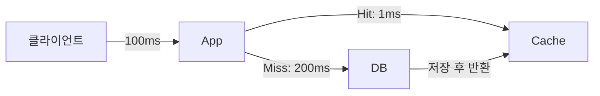
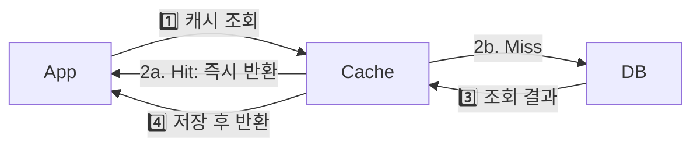
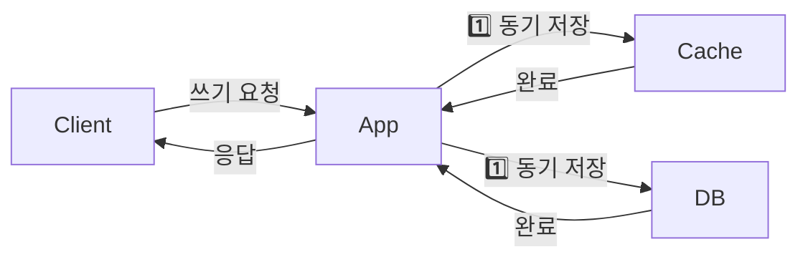
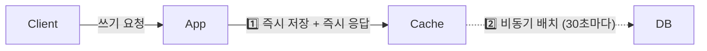
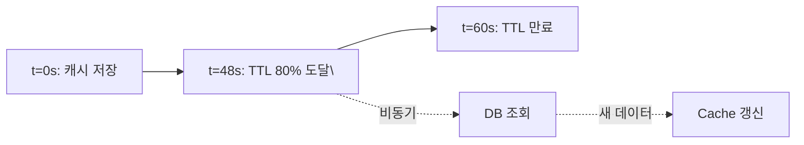
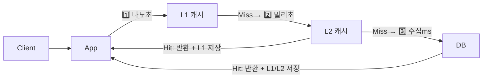

캐싱(Caching)은 자주 사용되는 데이터를 빠르게 접근 가능한 임시 저장소에 보관하여 응답 속도를 높이고 원본 데이터 소스의 부하를 줄이는 기법이다.

> **비유**: 도서관(DB)에서 책을 빌릴 때마다 왕복 30분이 걸린다면, 자주 보는 책은 책상(캐시) 위에 두는 것이 훨씬 빠르다. 단, 도서관에서 내용이 개정되면 책상의 책은 구판이 된다. 언제 책상 책을 최신판으로 교체할지가 캐시 전략의 핵심이다.

---

## 캐싱 핵심 개념



```
Cache Hit:   요청한 데이터가 캐시에 있음 → 빠른 응답
Cache Miss:  요청한 데이터가 캐시에 없음 → 원본 조회 필요
Hit Ratio:   Cache Hit 수 / 전체 요청 수 (높을수록 좋음)

Hot Data:  자주 접근되는 데이터 (캐싱 우선 대상)
Cold Data: 거의 접근되지 않는 데이터
Stale:     캐시 데이터가 원본과 달라진 상태
TTL:       Time To Live, 캐시 유효 기간
Eviction:  캐시가 꽉 찼을 때 기존 항목 제거
```

---

## Cache-Aside (Lazy Loading) — 가장 일반적인 패턴

애플리케이션이 직접 캐시와 DB를 모두 관리한다. 읽을 때 캐시를 먼저 확인하고 없으면 DB에서 조회 후 캐시에 저장한다.

1️⃣ 캐시 조회 → 2️⃣ Hit이면 즉시 반환 / Miss이면 DB 조회 → 3️⃣ 결과를 캐시에 저장 → 4️⃣ 반환



```java
@Service
@RequiredArgsConstructor
public class UserService {

    private final UserRepository userRepository;
    private final RedisTemplate<String, User> redisTemplate;
    private static final Duration TTL = Duration.ofMinutes(30);

    public User getUser(Long userId) {
        String key = "user:" + userId;
        User cached = redisTemplate.opsForValue().get(key);
        if (cached != null) {
            return cached;  // Cache Hit
        }

        // Cache Miss → DB 조회
        User user = userRepository.findById(userId)
            .orElseThrow(() -> new UserNotFoundException(userId));
        redisTemplate.opsForValue().set(key, user, TTL);
        return user;
    }

    @Transactional
    public void updateUser(Long userId, UserUpdateRequest request) {
        User user = userRepository.findById(userId).orElseThrow();
        user.update(request);
        userRepository.save(user);
        redisTemplate.delete("user:" + userId); // 캐시 무효화
    }
}
```

데이터 변경 시 캐시를 삭제(evict)하면 다음 조회 시 DB에서 최신 데이터를 로드한다.

| 구분 | 내용 |
|------|------|
| 장점 | 실제 요청된 데이터만 캐싱 (효율적 메모리 사용) |
| 장점 | 캐시 장애 시 DB 폴백으로 서비스 유지 |
| 단점 | 최초 요청은 항상 Cache Miss (초기 지연) |
| 단점 | 캐시 스탬피드 취약 |
| 적합 | 읽기 비율이 높고 데이터 접근 패턴이 불규칙한 경우 |

---

## Read-Through — 캐시가 DB 접근을 대신

캐시가 DB 앞에 위치해 모든 읽기 요청이 캐시를 통과한다. Cache Miss 시 캐시 자체가 DB를 조회하고 저장한다. 애플리케이션은 캐시만 바라본다.

```java
@Configuration
public class CacheConfig {

    @Bean
    public CacheManager cacheManager(RedisConnectionFactory factory) {
        RedisCacheConfiguration config = RedisCacheConfiguration.defaultCacheConfig()
            .entryTtl(Duration.ofMinutes(30))
            .serializeValuesWith(
                RedisSerializationContext.SerializationPair
                    .fromSerializer(new GenericJackson2JsonRedisSerializer()));
        return RedisCacheManager.builder(factory)
            .cacheDefaults(config)
            .build();
    }
}

@Service
public class ProductService {

    @Cacheable(value = "products", key = "#productId")
    public Product getProduct(Long productId) {
        // Cache Miss 시에만 실행 → 결과가 자동으로 캐시에 저장됨
        return productRepository.findById(productId).orElseThrow();
    }

    @CacheEvict(value = "products", key = "#productId")
    @Transactional
    public void updateProduct(Long productId, ProductUpdateRequest request) {
        Product product = productRepository.findById(productId).orElseThrow();
        product.update(request);
    }

    @CachePut(value = "products", key = "#result.id")
    @Transactional
    public Product createProduct(ProductCreateRequest request) {
        return productRepository.save(Product.from(request)); // 생성 후 즉시 캐시에도 저장
    }
}
```

Cache-Aside와 달리 애플리케이션 코드에 캐시 조회 로직이 없다. `@Cacheable`이 AOP로 자동 처리한다.

---

## Write-Through — 쓸 때 캐시와 DB 동시 저장

데이터를 쓸 때 캐시와 DB에 동시에 저장한다. 캐시와 DB가 항상 동기화된다.



```java
@Transactional
public void updateStock(Long productId, int quantity) {
    inventoryRepository.updateStock(productId, quantity);  // DB 업데이트
    // 캐시도 즉시 업데이트 (Write-Through)
    redisTemplate.opsForValue().set("stock:" + productId, quantity, Duration.ofHours(1));
}
```

| 구분 | 내용 |
|------|------|
| 장점 | 캐시와 DB 항상 일치 (강한 정합성) |
| 단점 | 쓰기 지연 증가 (캐시+DB 동시 쓰기) |
| 단점 | 읽히지 않는 데이터도 캐시에 저장 (메모리 낭비) |
| 적합 | 금융 잔액, 재고 등 정확성이 중요한 데이터 |

---

## Write-Behind (Write-Back) — 캐시에 먼저 쓰고 DB는 나중에

데이터를 캐시에만 먼저 쓰고 즉시 응답한다. DB 동기화는 나중에 비동기로 처리한다.



```java
@Component
@RequiredArgsConstructor
public class ViewCountService {

    private final RedisTemplate<String, Long> redisTemplate;
    private final ArticleRepository articleRepository;

    // 조회수 증가: Redis에만 즉시 기록 (매우 빠름)
    public void incrementViewCount(Long articleId) {
        redisTemplate.opsForValue().increment("viewcount:" + articleId);
    }

    // 30초마다 Redis → DB 동기화
    @Scheduled(fixedDelay = 30000)
    @Transactional
    public void flushViewCounts() {
        Set<String> keys = redisTemplate.keys("viewcount:*");
        if (keys == null || keys.isEmpty()) return;

        for (String key : keys) {
            Long count = redisTemplate.opsForValue().get(key);
            if (count == null || count == 0) continue;
            Long articleId = Long.parseLong(key.replace("viewcount:", ""));
            articleRepository.incrementViewCount(articleId, count);
            redisTemplate.opsForValue().set(key, 0L);
        }
    }
}
```

| 구분 | 내용 |
|------|------|
| 장점 | 쓰기 성능 극대화 |
| 장점 | DB 부하 대폭 감소 (배치로 묶어서 처리) |
| 단점 | 캐시 장애 시 미동기화 데이터 유실 |
| 적합 | 조회수, 좋아요 수 등 빈번한 갱신 + 일부 유실 허용 데이터 |

---

## Refresh-Ahead (Read-Ahead) — TTL 만료 전에 미리 갱신

캐시 만료 **전**에 미리 데이터를 갱신하는 전략이다. TTL 만료로 인한 Cache Miss와 지연을 방지한다.



```java
public BigDecimal getRate(String currency) {
    String key = "rate:" + currency;
    BigDecimal rate = redisTemplate.opsForValue().get(key);

    if (rate == null) {
        rate = refreshRate(currency);  // Cache Miss → 동기 갱신
    } else {
        Long ttl = redisTemplate.getExpire(key, TimeUnit.SECONDS);
        long threshold = (long)(TTL.toSeconds() * 0.2);  // TTL의 20% 미만이면
        if (ttl != null && ttl < threshold) {
            asyncRefresh(currency);  // 비동기 미리 갱신
        }
    }
    return rate;
}
```

| 적합한 데이터 | 환율, 주가 등 주기적으로 갱신되는 데이터 / 지연에 민감한 실시간 서비스 |
|-------------|---------------------------------------------------------------------|

---

## 패턴 비교

| 패턴 | 읽기 | 쓰기 | 정합성 | 쓰기 성능 | 복잡도 |
|------|------|------|--------|-----------|--------|
| Cache-Aside | App이 직접 | App이 직접 | 낮음 | 보통 | 낮음 |
| Read-Through | 캐시 통과 | App이 직접 | 낮음 | 보통 | 중간 |
| Write-Through | 캐시 통과 | 캐시+DB 동시 | 높음 | 낮음 | 중간 |
| Write-Behind | 캐시 통과 | 캐시만 → 나중에 DB | 낮음 | 높음 | 높음 |
| Refresh-Ahead | 캐시 통과 | 백그라운드 갱신 | 중간 | — | 높음 |

---

## 데이터 정합성 문제

### Cache Invalidation 타이밍

```
잘못된 순서:
1. DB 업데이트 성공
2. 캐시 삭제 실패 → 구 데이터 계속 서빙

해결: Double Delete 패턴 (트랜잭션 커밋 후 캐시 삭제 보장)
```

```java
@Transactional
public void updateUser(Long userId, UserUpdateRequest request) {
    redisTemplate.delete("user:" + userId);      // 1차 삭제
    userRepository.save(user);                   // DB 업데이트
    // 트랜잭션 커밋 후 이벤트 발행
    eventPublisher.publishEvent(new UserUpdatedEvent(userId));
}

@TransactionalEventListener(phase = TransactionPhase.AFTER_COMMIT)
public void onUserUpdated(UserUpdatedEvent event) {
    redisTemplate.delete("user:" + event.getUserId());  // 2차 삭제 (커밋 보장)
}
```

### 동시성 문제 (Race Condition)

```
Thread A: DB 읽기 → (구 데이터) 캐시 저장
Thread B: DB 업데이트 → 캐시 삭제
Thread A: 삭제된 캐시에 구 데이터 저장 → 캐시 오염!

해결:
1. 캐시 저장 시 버전 번호 포함 → 더 새로운 버전이 있으면 덮어쓰지 않음
2. Redisson 분산 락 사용
3. TTL을 짧게 설정해 자연 만료로 수렴
```

---

## 캐시 스탬피드 (Cache Stampede)

인기 캐시 키가 만료되는 순간 수많은 요청이 동시에 Cache Miss → DB 쿼리 폭주가 발생한다.

```
t=0: "popular-product:1" 캐시 만료
t=0~0.1s: 1000개 요청 동시 Cache Miss
→ 1000개 DB 쿼리 동시 발생 → DB 과부하 → 장애
```

### 해결책 1: 뮤텍스 락 — 한 스레드만 DB 조회

```java
public Product getProduct(Long productId) {
    String key = "product:" + productId;
    Product cached = redisTemplate.opsForValue().get(key);
    if (cached != null) return cached;

    String lockKey = "lock:" + key;
    Boolean acquired = redisTemplate.opsForValue()
        .setIfAbsent(lockKey, "1", Duration.ofSeconds(5));  // NX 잠금

    if (Boolean.TRUE.equals(acquired)) {
        try {
            Product product = productRepository.findById(productId).orElseThrow();
            redisTemplate.opsForValue().set(key, product, Duration.ofMinutes(10));
            return product;
        } finally {
            redisTemplate.delete(lockKey);
        }
    } else {
        Thread.sleep(50);  // 잠깐 대기 후 캐시 재조회 시도
        return getProduct(productId);
    }
}
```

### 해결책 2: TTL 지터(Jitter) — 만료 시점 분산

```java
// 모든 캐시가 같은 시각에 만료되지 않도록 TTL에 랜덤성 추가
Duration ttl = Duration.ofMinutes(10).plusSeconds(new Random().nextInt(60));
redisTemplate.opsForValue().set(key, value, ttl);
```

---

## 다단계 캐시 (Multi-Level Cache)

L1(로컬 메모리) + L2(Redis)를 계층적으로 사용해 네트워크 없이 나노초 응답을 달성한다.



```java
@Service
@RequiredArgsConstructor
public class ProductService {

    private final Cache<Long, Product> localCache;   // L1: Caffeine
    private final RedisTemplate<String, Product> redis;  // L2: Redis
    private final ProductRepository repository;

    public Product getProduct(Long productId) {
        // L1 조회 (네트워크 없음, 나노초)
        Product product = localCache.getIfPresent(productId);
        if (product != null) return product;

        // L2 조회 (Redis, 밀리초)
        product = redis.opsForValue().get("product:" + productId);
        if (product != null) {
            localCache.put(productId, product);
            return product;
        }

        // DB 조회
        product = repository.findById(productId).orElseThrow();
        redis.opsForValue().set("product:" + productId, product, Duration.ofMinutes(10));
        localCache.put(productId, product);
        return product;
    }
}
```

**주의**: 여러 인스턴스가 각자 L1 캐시를 가지므로 DB 업데이트 시 모든 인스턴스의 L1을 무효화해야 한다. Redis Pub/Sub으로 무효화 이벤트를 브로드캐스트한다.

```java
// 무효화 발행
redisTemplate.convertAndSend("cache-invalidation", "product:" + productId);

// 각 인스턴스에서 구독해 L1 무효화
@Component
public class CacheInvalidationListener implements MessageListener {
    @Override
    public void onMessage(Message message, byte[] pattern) {
        String key = new String(message.getBody()).replace("product:", "");
        localCache.invalidate(Long.parseLong(key));
    }
}
```

---

## 캐시 Eviction 정책

캐시가 꽉 찼을 때 어떤 항목을 제거할지 결정하는 정책이다.

| 정책 | 설명 | 적합한 상황 |
|------|------|------------|
| LRU (Least Recently Used) | 가장 오래 사용 안 한 항목 제거 | 최근 접근 데이터가 중요한 경우 |
| LFU (Least Frequently Used) | 사용 빈도가 가장 낮은 항목 제거 | 인기 데이터를 오래 유지해야 할 때 |
| TTL | 만료 시간 기준 제거 | 시간 기반 유효성이 중요한 경우 |

```
# Redis maxmemory-policy 설정 권장
allkeys-lru:      모든 키 중 LRU 제거 (일반적인 캐시에 권장)
allkeys-lfu:      모든 키 중 LFU 제거 (Redis 4.0+, 인기 데이터 유지)
volatile-ttl:     TTL 있는 키 중 TTL이 짧은 것부터 제거
noeviction:       꽉 차면 에러 반환 (캐시 용도엔 부적합)

# redis.conf
maxmemory 4gb
maxmemory-policy allkeys-lru
```

---

## 캐시 웜업 (Cache Warmup)

서비스 시작 직후 모든 요청이 Cache Miss가 되면 DB에 과부하가 걸린다. 시작 시 자주 사용되는 데이터를 미리 캐시에 로드한다.

```java
@Component
@RequiredArgsConstructor
public class CacheWarmup implements ApplicationRunner {

    private final ProductService productService;
    private final ProductRepository productRepository;

    @Override
    public void run(ApplicationArguments args) {
        List<Long> popularIds = productRepository.findTop100PopularIds();
        popularIds.parallelStream().forEach(id -> {
            try {
                productService.getProduct(id);  // 조회 시 캐시 자동 저장
            } catch (Exception e) {
                log.warn("캐시 웜업 실패 - productId: {}", id, e);
            }
        });
        log.info("캐시 웜업 완료: {}개 상품", popularIds.size());
    }
}
```

---
## 왜 이 캐싱 전략인가 — 비교와 선택 기준

### Cache-Aside vs Read-Through — 언제 무엇을 선택하는가

**Cache-Aside(Lazy Loading)를 선택해야 하는 경우:**
- 애플리케이션이 캐시 미스 처리를 직접 제어해야 할 때
- 읽기 패턴이 불규칙하고 전체 데이터셋의 일부만 자주 조회될 때(파레토 80/20)
- 다양한 DB(RDB, NoSQL, 외부 API)를 조합해 캐시를 구성해야 할 때

```java
// Cache-Aside: 애플리케이션이 캐시 로직을 직접 제어
public Product getProduct(Long id) {
    Product cached = cache.get(id);
    if (cached != null) return cached;       // 캐시 히트: < 1ms

    Product product = db.findById(id);       // 캐시 미스: 10~50ms
    cache.set(id, product, Duration.ofMinutes(10));
    return product;
}
// 이걸 안 하면: 초당 1만 건 상품 조회가 모두 DB에 도달 → DB CPU 100% → 장애
```

**Read-Through를 선택해야 하는 경우:**
- 캐시 레이어가 표준화되어 있고 애플리케이션 코드를 단순하게 유지하고 싶을 때
- 모든 읽기가 동일한 DB 접근 패턴을 사용할 때
- JPA 2nd Level Cache처럼 프레임워크 레벨에서 캐시를 제공할 때

**실무에서 Cache-Aside가 압도적으로 많이 사용되는 이유:**
1. 캐시 장애 시 애플리케이션이 DB로 Fallback 가능(유연성)
2. 캐시에 없는 데이터만 로드(메모리 효율)
3. 여러 소스(DB + API + 계산 결과)를 조합해 캐시 구성 가능

---

### Write-Through vs Write-Behind — 일관성 vs 성능의 트레이드오프

**Write-Through를 선택해야 하는 경우:**
```java
// Write-Through: 쓰기 시 캐시와 DB 동시 저장
@Transactional
public void updatePrice(Long productId, BigDecimal newPrice) {
    product.setPrice(newPrice);
    db.save(product);           // DB 저장
    cache.set(productId, product, Duration.ofMinutes(10));  // 캐시도 즉시 갱신
    // 이후 읽기 캐시 히트율 높음, 데이터 일관성 보장
}
```
선택 기준: 쓰기 직후 읽기가 빈번한 데이터(사용자 프로필 수정 후 즉시 조회). 데이터 일관성이 성능보다 중요한 경우.

**Write-Behind를 선택해야 하는 경우:**
```java
// Write-Behind: 캐시에만 쓰고 DB는 배치로 나중에
public void recordClick(Long postId) {
    cache.increment("clicks:" + postId);          // 즉시 응답 < 1ms
    // DB에는 10초마다 배치로 flush (초당 10만 건도 처리 가능)
}
// 이걸 안 하면: 인기 게시글 클릭마다 DB UPDATE → 초당 수천 건 → DB 과부하
```
선택 기준: 쓰기 빈도가 매우 높고 약간의 데이터 유실(캐시 장애 시 마지막 flush 전 데이터)을 허용할 수 있을 때. 조회수, 좋아요 수, 실시간 통계 등에 적합.

**선택이 잘못되면 발생하는 장애:**
- Write-Through를 조회수에 적용: 인기 영상 조회수 업데이트마다 DB WRITE → 초당 수만 건 WRITE 경합 → DB 응답 수십 배 증가
- Write-Behind를 결제 금액에 적용: 서버 장애 시 마지막 N분치 결제 데이터 유실 → 금전적 손해

---

### 캐시 전략 선택 결정 트리

```
데이터 읽기 빈도가 높은가?
├─ Yes → 캐시 도입 필요
│   ├─ 쓰기 빈도가 낮은가? (읽기 : 쓰기 > 10:1)
│   │   ├─ Yes → Cache-Aside (Read) + Write-Through
│   │   └─ No → 쓰기 빈도가 매우 높은가? (초당 수천 건+)
│   │           ├─ Yes + 유실 허용 → Write-Behind
│   │           └─ No → Cache-Aside + Write-Through
│   └─ 캐시 미스 시 DB 부하가 집중되는가? (Stampede 위험)
│       ├─ Yes → Mutex Lock 또는 PER 알고리즘
│       └─ No → 기본 Cache-Aside
└─ No → 캐시 불필요 (복잡도만 증가)
```

---

## 실무에서 자주 하는 실수

1. **Cache-Aside에서 캐시 미스 폭풍(Cache Stampede)** — 캐시가 만료되는 순간 수백 개의 요청이 동시에 DB를 직접 타격한다. Mutex Lock 또는 Probabilistic Early Expiration으로 한 요청만 DB를 조회하고 나머지는 대기하게 해야 한다.

2. **Write-Through를 읽기 빈도 낮은 데이터에 적용** — 거의 읽히지 않는 데이터도 쓸 때마다 캐시에 저장해 메모리를 낭비한다. 읽기 빈도가 낮은 데이터는 Cache-Aside로 Lazy Loading하는 것이 효율적이다.

3. **TTL 없이 캐시 무기한 유지** — 원본 데이터가 변경돼도 캐시가 영원히 오래된 값을 반환한다. 비즈니스 신선도 요구사항에 맞는 TTL을 반드시 설정해야 한다.

---

## 면접 포인트

**Q1. Cache-Aside와 Read-Through의 차이점은?**
A. Cache-Aside는 애플리케이션이 직접 캐시를 확인하고 미스 시 DB를 조회해 캐시를 채운다. Read-Through는 캐시 계층이 DB 조회를 대신 처리한다. Cache-Aside는 유연하지만 코드가 복잡하고, Read-Through는 캐시 라이브러리 지원이 필요하다.

**Q2. Write-Back과 Write-Through의 선택 기준은?**
A. Write-Through는 쓸 때마다 DB와 캐시를 동시에 업데이트해 데이터 손실이 없다. Write-Back은 캐시에만 먼저 쓰고 나중에 DB에 반영해 쓰기 성능이 좋지만, 캐시 장애 시 데이터 유실 위험이 있다. 금융 데이터는 Write-Through, 로그/분석 데이터는 Write-Back이 적합하다.

**Q3. Cache Stampede를 어떻게 방지하나요?**
A. 세 가지 방법이 있다. 첫째, Mutex Lock으로 한 요청만 DB를 조회하게 한다. 둘째, TTL에 랜덤 지터를 추가해 만료 시점을 분산시킨다. 셋째, Probabilistic Early Expiration으로 만료 전에 미리 갱신 요청을 발생시킨다.
