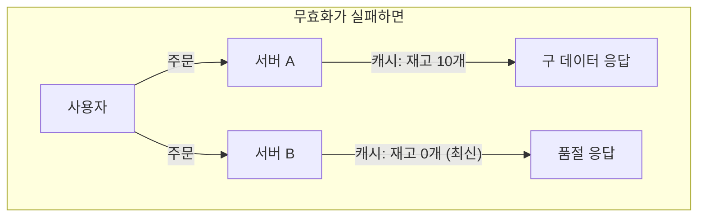
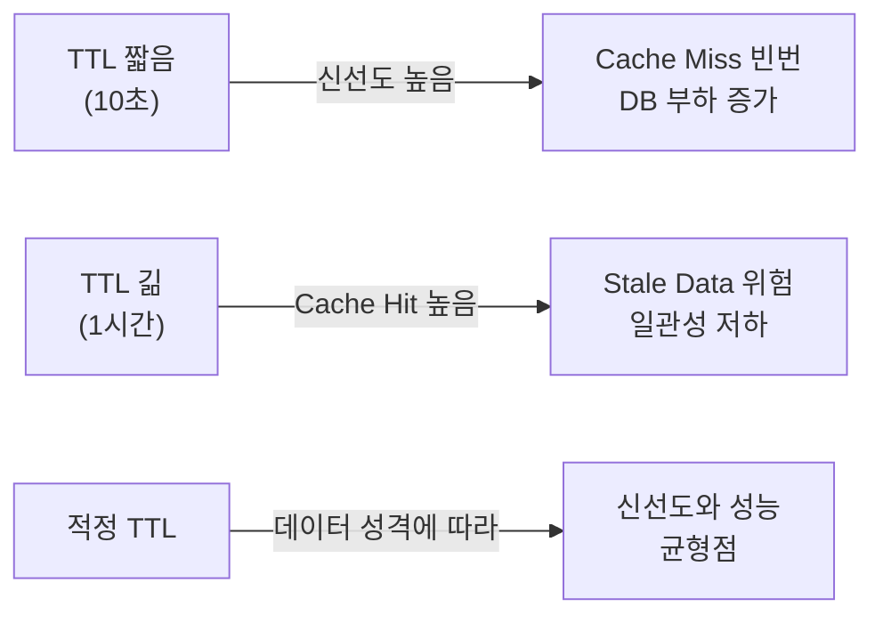
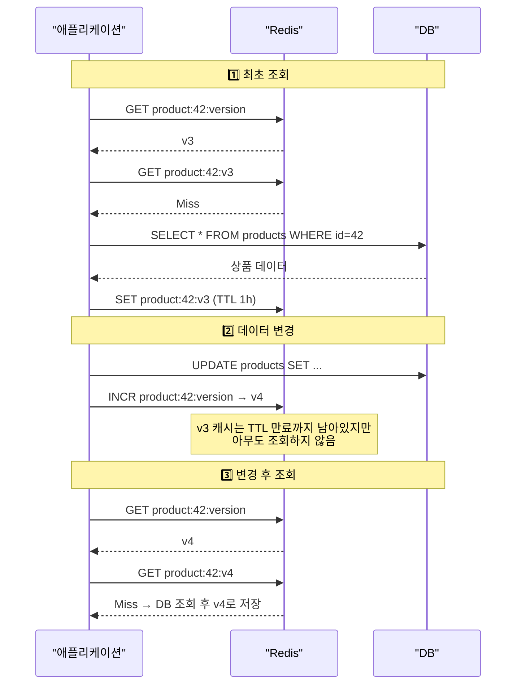
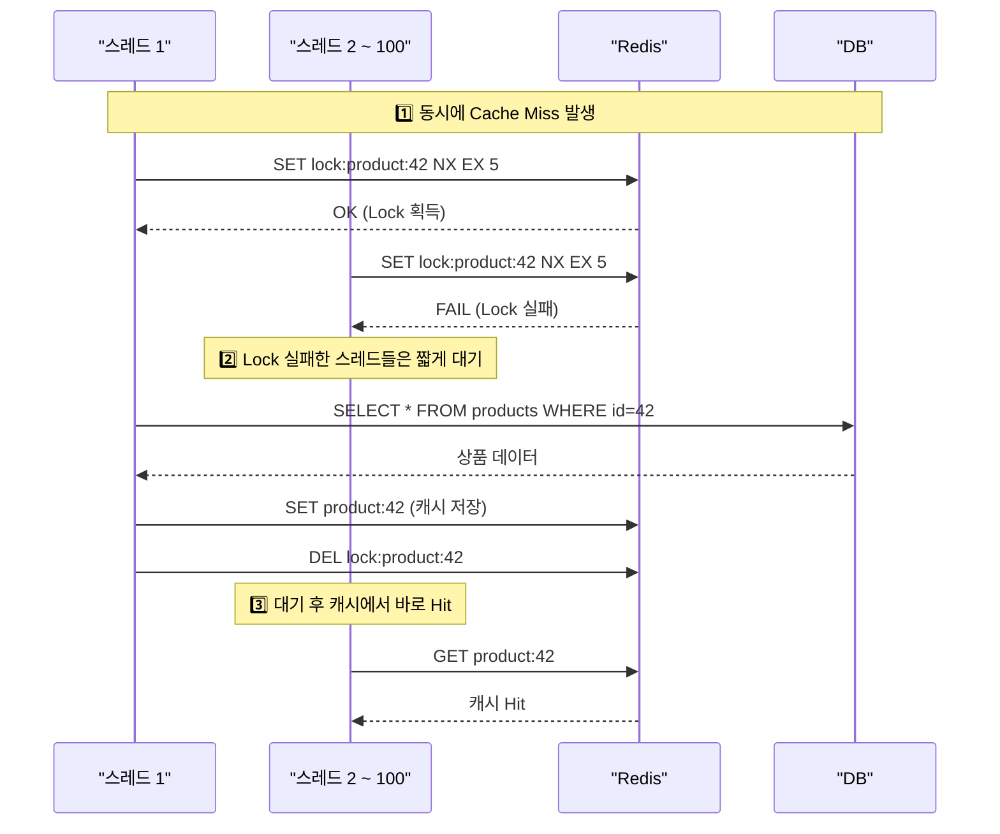
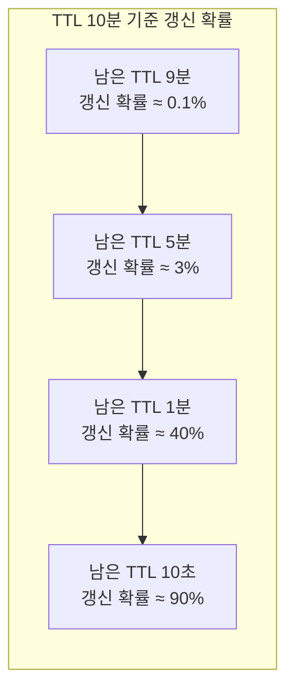
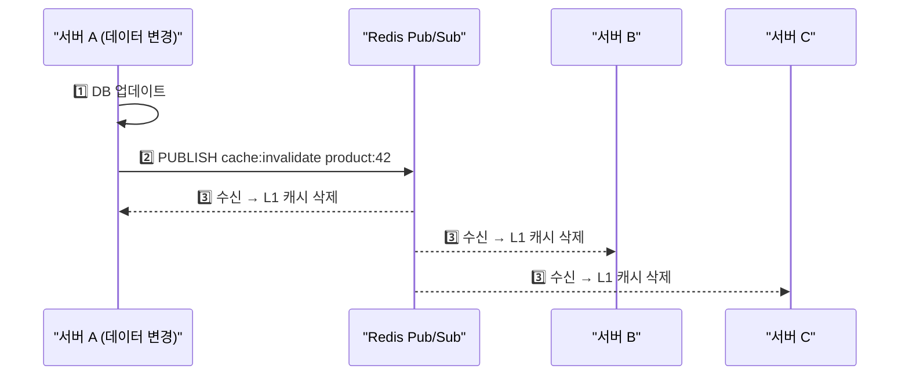
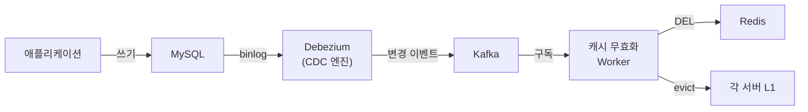
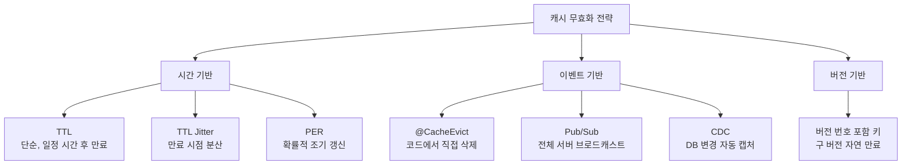

캐시 무효화(Cache Invalidation)는 캐시된 데이터가 원본과 달라졌을 때 이를 감지하고 제거하거나 갱신하는 기법이다. 컴퓨터 과학에서 "가장 어려운 두 가지 문제" 중 하나로 꼽힐 만큼, 올바르게 설계하지 않으면 사용자에게 오래된 데이터를 보여주거나 시스템 전체가 장애를 일으킨다.

> **비유:** 편의점 진열대에 유통기한이 지난 우유가 놓여 있다고 생각해보자. 손님이 이걸 사서 마시면 탈이 난다. "언제, 어떻게 유통기한 지난 상품을 치울 것인가"가 바로 캐시 무효화 문제다. 너무 자주 치우면 매대가 비어서 불편하고(Cache Miss), 너무 늦게 치우면 상한 우유를 파는 셈이다(Stale Data).

---

## 왜 캐시 무효화가 어려운가?

캐시를 넣는 것은 쉽다. 어려운 것은 "언제 버릴 것인가"다. 단일 서버라면 DB 업데이트 직후 캐시를 지우면 되지만, 분산 환경에서는 여러 서버가 각자의 로컬 캐시를 들고 있고, 네트워크 지연과 장애가 끼어든다.

> **비유:** 회사 전체에 "오늘부터 회의실 예약 규칙이 바뀌었다"는 공지를 내렸는데, 한 층만 공지를 못 봤다면? 그 층은 구 규칙대로 예약하고, 다른 층은 새 규칙으로 예약해서 충돌이 발생한다. 이것이 분산 캐시 무효화의 핵심 난제다.



같은 시점에 같은 상품을 조회했는데 서버마다 다른 답을 내놓는다. 이것이 실제 운영에서 발생하는 캐시 불일치 문제다.

---

## 1. TTL 기반 무효화 — 가장 단순한 방법

TTL(Time To Live)은 캐시에 저장할 때 "이 데이터는 N초 후에 자동 폐기하라"고 지정하는 방식이다. 구현이 가장 쉽고 대부분의 시스템에서 기본으로 사용한다.

> **비유:** 편의점 우유에 "유통기한 3일"이라고 찍혀 있으면, 3일이 지나면 자동으로 폐기한다. 그 사이에 우유 공장에서 성분이 바뀌어도 3일 동안은 구 우유가 팔린다. 유통기한이 길수록 폐기 비용은 줄지만, 오래된 상품이 팔릴 위험은 커진다.

### TTL 설정의 트레이드오프

TTL이 짧을수록 데이터 신선도는 올라가지만 Cache Miss가 자주 발생해 DB 부하가 커진다. 반대로 TTL이 길면 DB 부하는 줄지만 사용자가 오래된 데이터를 볼 확률이 높아진다.



데이터 성격별로 TTL을 달리 설정하는 것이 핵심이다. 아래 코드는 Spring에서 캐시 이름별로 서로 다른 TTL을 설정하는 방법이다.

실무에서는 모든 캐시에 동일한 TTL을 거는 실수를 자주 한다. 상품 정보처럼 하루에 한 번 바뀌는 데이터와, 재고처럼 초 단위로 바뀌는 데이터에 같은 TTL을 걸면 둘 중 하나는 반드시 문제가 된다. 상품 정보에 10초 TTL을 걸면 DB에 불필요한 부하가 가고, 재고에 1시간 TTL을 걸면 품절인데도 "재고 있음"이 표시된다.

따라서 데이터를 분류하고 각 카테고리에 맞는 TTL을 적용해야 한다. 아래 코드가 바로 그 구현이다.

```java
@Configuration
public class CacheConfig {

    @Bean
    public CacheManager cacheManager(RedisConnectionFactory factory) {
        // 데이터 성격별 TTL 분리
        Map<String, RedisCacheConfiguration> configs = Map.of(
            "userProfile",  cacheConfig(Duration.ofHours(1)),    // 자주 안 바뀜
            "productDetail", cacheConfig(Duration.ofMinutes(30)), // 가끔 바뀜
            "inventory",    cacheConfig(Duration.ofSeconds(30)),  // 자주 바뀜
            "exchangeRate", cacheConfig(Duration.ofSeconds(10))   // 실시간성
        );

        return RedisCacheManager.builder(factory)
            .cacheDefaults(cacheConfig(Duration.ofMinutes(10)))
            .withInitialCacheConfigurations(configs)
            .build();
    }

    private RedisCacheConfiguration cacheConfig(Duration ttl) {
        return RedisCacheConfiguration.defaultCacheConfig()
            .entryTtl(ttl)
            .serializeValuesWith(
                RedisSerializationContext.SerializationPair
                    .fromSerializer(new GenericJackson2JsonRedisSerializer()));
    }
}
```

**이 코드의 핵심:** 캐시 이름별로 서로 다른 TTL을 설정한다. `userProfile`은 1시간, `inventory`는 30초로, 데이터의 변경 빈도에 맞춘다. `cacheDefaults`로 명시하지 않은 캐시의 기본 TTL도 설정한다.

### TTL Jitter — 만료 시점 분산

모든 캐시가 정각에 동시 만료되면 DB에 순간적으로 엄청난 부하가 몰린다. 이를 방지하기 위해 TTL에 랜덤 편차(Jitter)를 추가한다.

> **비유:** 학교 종이 울리면 1000명이 동시에 매점으로 달려간다. 그런데 반마다 쉬는 시간이 1~2분씩 다르면? 매점은 분산된 인파를 감당할 수 있다. TTL Jitter가 바로 이 "시차 두기"다.

```java
public Duration jitteredTtl(Duration baseTtl) {
    // 기본 TTL의 ±20% 범위에서 랜덤 편차 추가
    long baseSeconds = baseTtl.toSeconds();
    long jitter = (long) (baseSeconds * 0.2 * (Math.random() * 2 - 1));
    return Duration.ofSeconds(baseSeconds + jitter);
}

// 사용 예: 기본 600초(10분) → 실제 TTL은 480~720초 사이
redisTemplate.opsForValue().set(key, value, jitteredTtl(Duration.ofMinutes(10)));
```

**이 코드의 핵심:** `Math.random() * 2 - 1`로 -1 ~ +1 사이의 값을 만들고, 기본 TTL의 20%를 곱해서 편차를 만든다. 10분 기준 8분~12분 사이에서 랜덤으로 만료된다.

---

## 2. 이벤트 기반 무효화 — 데이터가 바뀔 때 즉시 삭제

TTL 기반 무효화는 단순하지만, TTL이 만료되기 전까지는 구 데이터가 서빙된다는 근본적인 한계가 있다. 이벤트 기반 무효화는 데이터가 변경되는 순간 캐시를 즉시 삭제하거나 갱신한다.

> **비유:** 편의점 본사에서 "A우유 리콜 발생, 즉시 매대에서 치워라"라는 긴급 통보를 보내는 것이다. 유통기한이 남아있더라도 즉시 제거하니까 손님이 상한 우유를 살 일이 없다.

### Spring @CacheEvict 기반 무효화

가장 기본적인 이벤트 기반 무효화는 데이터를 수정하는 메서드에 `@CacheEvict`를 붙이는 것이다. 메서드가 성공적으로 완료되면 해당 캐시 항목이 자동으로 삭제된다.

하지만 단순히 `@CacheEvict`만 붙이면 문제가 생긴다. DB 트랜잭션이 커밋되기 전에 캐시가 먼저 삭제되면, 다른 스레드가 그 틈에 구 데이터를 DB에서 읽어와 캐시에 다시 넣을 수 있다. 따라서 트랜잭션 커밋 이후에 캐시를 삭제하는 것이 안전하다.

아래 코드는 Spring의 `@TransactionalEventListener`를 활용해 트랜잭션 커밋 후에만 캐시를 무효화하는 패턴이다.

```java
// 1. 도메인 이벤트 정의
public record ProductUpdatedEvent(Long productId) {}

// 2. 서비스에서 이벤트 발행
@Service
@RequiredArgsConstructor
public class ProductService {

    private final ProductRepository repository;
    private final ApplicationEventPublisher eventPublisher;

    @Transactional
    public void updateProduct(Long productId, ProductUpdateRequest request) {
        Product product = repository.findById(productId).orElseThrow();
        product.update(request);
        repository.save(product);
        // 트랜잭션 내에서 이벤트 발행 (아직 캐시 삭제 안 함)
        eventPublisher.publishEvent(new ProductUpdatedEvent(productId));
    }
}

// 3. 트랜잭션 커밋 후에만 캐시 무효화
@Component
@RequiredArgsConstructor
public class CacheInvalidationHandler {

    private final RedisTemplate<String, Object> redisTemplate;

    @TransactionalEventListener(phase = TransactionPhase.AFTER_COMMIT)
    public void handleProductUpdate(ProductUpdatedEvent event) {
        redisTemplate.delete("product:" + event.productId());
    }
}
```

**이 코드의 핵심:** `TransactionPhase.AFTER_COMMIT`으로 트랜잭션이 확실히 커밋된 후에만 캐시를 삭제한다. 롤백되면 캐시 삭제도 발생하지 않으므로 일관성이 보장된다.

---

## 3. 버전 기반 무효화 — 데이터에 버전 번호 부여

캐시 키에 버전 번호를 포함시켜 데이터가 변경될 때마다 새로운 버전의 캐시 키를 사용하는 방식이다. 구 버전의 캐시는 TTL에 의해 자연스럽게 만료된다.

> **비유:** 교과서가 개정될 때 "수학 7판"에서 "수학 8판"으로 바뀌는 것과 같다. 서점에 7판이 아직 남아있더라도, 학생들은 "8판"이라는 이름으로 검색하니까 구판을 살 일이 없다. 7판은 자연스럽게 창고에서 폐기된다.

### 동작 원리



이 방식의 장점은 구 버전 캐시를 명시적으로 삭제할 필요가 없다는 것이다. 키 자체가 달라지니까 구 데이터에 접근 자체가 불가능하다. 단점은 Redis에 키가 좀 더 많이 쌓인다는 것인데, TTL이 지나면 자동 정리되므로 큰 문제는 아니다.

아래 코드는 버전 기반 캐시의 구현이다. 핵심은 캐시 키에 버전 번호를 포함시키는 것과, 데이터 변경 시 버전만 올리면 된다는 점이다.

```java
@Service
@RequiredArgsConstructor
public class VersionedCacheService {

    private final RedisTemplate<String, Object> redis;
    private final ProductRepository repository;

    public Product getProduct(Long productId) {
        // 현재 버전 조회
        String versionKey = "product:" + productId + ":version";
        Long version = (Long) redis.opsForValue().get(versionKey);
        if (version == null) {
            version = 1L;
            redis.opsForValue().set(versionKey, version);
        }

        // 버전이 포함된 캐시 키로 조회
        String cacheKey = "product:" + productId + ":v" + version;
        Product cached = (Product) redis.opsForValue().get(cacheKey);
        if (cached != null) return cached;

        // Cache Miss → DB 조회 후 버전 키로 저장
        Product product = repository.findById(productId).orElseThrow();
        redis.opsForValue().set(cacheKey, product, Duration.ofHours(1));
        return product;
    }

    @Transactional
    public void updateProduct(Long productId, ProductUpdateRequest request) {
        Product product = repository.findById(productId).orElseThrow();
        product.update(request);
        repository.save(product);
        // 버전만 올리면 구 캐시는 자동으로 무시됨
        redis.opsForValue().increment("product:" + productId + ":version");
    }
}
```

**이 코드의 핵심:** `updateProduct`에서 캐시를 삭제하지 않는다. 버전 번호만 올리면 된다. 구 버전 캐시(`v3`)는 아무도 조회하지 않으니 TTL 만료 시 자연 삭제된다. 캐시 삭제 실패에 대한 걱정이 사라진다.

---

## 4. Cache Stampede 방지 — Mutex Lock

Cache Stampede는 인기 캐시 키가 만료되는 순간 수백~수천 요청이 동시에 Cache Miss를 겪고 모두 DB로 달려가는 현상이다. 이전 포스트에서 개념을 다뤘으므로, 여기서는 실전에서 안전하게 구현하는 방법에 집중한다.

> **비유:** 인기 식당이 오전 11시에 문을 여는데, 200명이 문 앞에서 대기하다가 문이 열리는 순간 동시에 밀려들면 아수라장이 된다. 해결책은 번호표(Lock)를 나눠주고, 1번만 먼저 들어가서 자리를 잡게 하고, 나머지는 "1번이 자리 잡으면 들어오세요"라고 안내하는 것이다.

### Mutex Lock의 위험과 안전한 구현

단순 Mutex Lock에는 세 가지 함정이 있다.

1. **데드락:** Lock을 잡은 스레드가 예외로 죽으면 Lock이 영원히 풀리지 않는다
2. **Lock 소유권:** 스레드 A가 잡은 Lock을 스레드 B가 풀어버릴 수 있다
3. **재귀 대기:** Lock을 못 잡은 스레드가 무한 재귀에 빠진다



아래 코드는 위 세 가지 함정을 모두 방어하는 안전한 Mutex Lock 구현이다. Lock에 고유 ID를 부여해 소유권을 확인하고, 최대 재시도 횟수를 두어 무한 루프를 방지하며, finally 블록에서 반드시 Lock을 해제한다.

```java
@Service
@RequiredArgsConstructor
public class StampedeProtectedCache {

    private final StringRedisTemplate redis;
    private final ProductRepository repository;
    private final ObjectMapper objectMapper;

    private static final int MAX_RETRIES = 10;
    private static final Duration LOCK_TTL = Duration.ofSeconds(5);
    private static final Duration CACHE_TTL = Duration.ofMinutes(10);

    public Product getProduct(Long productId) throws InterruptedException {
        String cacheKey = "product:" + productId;
        String cached = redis.opsForValue().get(cacheKey);
        if (cached != null) {
            return deserialize(cached);
        }

        String lockKey = "lock:" + cacheKey;
        String lockValue = UUID.randomUUID().toString(); // 소유권 식별용 고유 ID

        for (int retry = 0; retry < MAX_RETRIES; retry++) {
            Boolean acquired = redis.opsForValue()
                .setIfAbsent(lockKey, lockValue, LOCK_TTL);

            if (Boolean.TRUE.equals(acquired)) {
                try {
                    // Double-check: Lock 획득 후 다시 캐시 확인
                    cached = redis.opsForValue().get(cacheKey);
                    if (cached != null) return deserialize(cached);

                    Product product = repository.findById(productId).orElseThrow();
                    redis.opsForValue().set(cacheKey, serialize(product), CACHE_TTL);
                    return product;
                } finally {
                    // 내가 잡은 Lock만 해제 (다른 스레드의 Lock을 풀지 않음)
                    String currentLock = redis.opsForValue().get(lockKey);
                    if (lockValue.equals(currentLock)) {
                        redis.delete(lockKey);
                    }
                }
            }

            // Lock 실패 → 짧게 대기 후 캐시 재확인
            Thread.sleep(50 + (long)(Math.random() * 50));
            cached = redis.opsForValue().get(cacheKey);
            if (cached != null) return deserialize(cached);
        }

        // 모든 재시도 실패 → DB 직접 조회 (Fallback)
        return repository.findById(productId).orElseThrow();
    }
}
```

**이 코드의 핵심:** (1) `UUID`로 Lock 소유권을 식별해서 남의 Lock을 풀지 않는다. (2) Lock 획득 후 Double-check로 이미 다른 스레드가 캐시를 채웠는지 확인한다. (3) `MAX_RETRIES`로 무한 루프를 방지하고, 실패 시 DB Fallback으로 가용성을 보장한다.

---

## 5. PER 알고리즘 — 확률적 조기 갱신

PER(Probabilistic Early Recomputation)은 캐시가 만료되기 전에 확률적으로 미리 갱신하는 알고리즘이다. Lock 없이 Cache Stampede를 방지할 수 있어서, Mutex Lock보다 더 우아한 해결책으로 평가받는다.

> **비유:** 편의점 우유의 유통기한이 3일 남았다고 하자. 유통기한 당일에 한꺼번에 치우면 매대가 비는 시간이 생긴다. 대신 "유통기한 1일 전부터 30% 확률로 미리 새 우유로 교체"하면, 매대가 비는 일 없이 항상 신선한 우유가 진열된다.

### PER의 수학적 원리

PER의 핵심 공식은 다음과 같다.

```
현재시각 - (만료시각 - TTL × beta × log(random())) > 만료시각
```

- `beta`: 갱신 민감도 (보통 1.0). 클수록 더 일찍 갱신을 시도한다
- `log(random())`: 0~1 사이 랜덤 값의 로그. 만료 시점에 가까울수록 갱신 확률이 급격히 올라간다



만료 시점이 멀면 거의 갱신하지 않고, 가까워질수록 확률이 급등한다. 덕분에 만료 직전에 단 하나의 요청만이 DB를 조회해 캐시를 미리 갱신하게 된다.

아래 코드에서 `shouldRecompute` 메서드가 PER의 핵심이다. 현재 시각과 만료 시각의 거리를 기반으로 갱신 여부를 확률적으로 결정한다. Lock이 전혀 없다는 점을 주목하자.

```java
@Service
@RequiredArgsConstructor
public class PERCacheService {

    private final StringRedisTemplate redis;
    private final ProductRepository repository;
    private static final double BETA = 1.0;

    public Product getProduct(Long productId) {
        String key = "product:" + productId;
        String cached = redis.opsForValue().get(key);
        Long ttlSeconds = redis.getExpire(key, TimeUnit.SECONDS);

        if (cached != null && ttlSeconds != null && ttlSeconds > 0) {
            if (!shouldRecompute(ttlSeconds, Duration.ofMinutes(10))) {
                return deserialize(cached);  // 아직 갱신 불필요
            }
            // 확률적으로 "갱신 당첨" → 백그라운드에서 캐시 갱신
            CompletableFuture.runAsync(() -> recompute(productId, key));
            return deserialize(cached);  // 현재 값은 즉시 반환
        }

        // 캐시 없음 → 동기 조회
        return recompute(productId, key);
    }

    private boolean shouldRecompute(long remainingTtl, Duration originalTtl) {
        double delta = originalTtl.toSeconds() * BETA;
        double threshold = delta * (-Math.log(Math.random()));
        return remainingTtl <= threshold;
    }

    private Product recompute(Long productId, String key) {
        Product product = repository.findById(productId).orElseThrow();
        redis.opsForValue().set(key, serialize(product), Duration.ofMinutes(10));
        return product;
    }
}
```

**이 코드의 핵심:** `shouldRecompute`가 PER 공식을 구현한다. Lock이 없으므로 드물게 2~3개의 요청이 동시에 DB를 조회할 수 있지만, 수백 개가 몰리는 Stampede에 비하면 무시할 수준이다. 기존 캐시 값을 즉시 반환하면서 백그라운드에서 갱신하므로 사용자 응답 지연이 없다.

### Mutex Lock vs PER 비교

| 구분 | Mutex Lock | PER |
|------|-----------|-----|
| Stampede 방지 | 완벽 (1개만 통과) | 거의 완벽 (2~3개 통과 가능) |
| 구현 복잡도 | Lock 관리 필요 | 수학 공식만 적용 |
| 응답 지연 | Lock 대기 스레드 지연 발생 | 지연 없음 (기존 값 반환) |
| 장애 위험 | Lock 해제 실패 시 데드락 | 장애 요소 없음 |
| 적합한 상황 | DB 조회 비용이 매우 클 때 | 일반적인 캐시 갱신 |

---

## 6. 분산 환경에서의 캐시 일관성

서버가 여러 대이고 각각 로컬 캐시(L1)를 가지고 있을 때, 한 서버에서 데이터를 변경하면 다른 서버들의 L1 캐시도 무효화해야 한다. 이를 위한 두 가지 주요 방식이 있다.

### 6-1. Redis Pub/Sub 기반 무효화

> **비유:** 학교 방송 시스템과 같다. 교무실(데이터를 변경한 서버)에서 방송(Pub/Sub 메시지)을 하면, 모든 교실(서버)의 스피커가 동시에 울려서 "3학년 시간표 변경됨"이라는 안내를 받는다. 각 교실은 자기 칠판(L1 캐시)에 적힌 구 시간표를 지운다.



Redis Pub/Sub은 "fire and forget" 방식이다. 메시지를 보내는 시점에 구독자가 연결되어 있지 않으면 메시지를 받지 못한다. 따라서 서버가 재시작 중이거나 네트워크가 순간 끊기면 무효화 메시지를 놓칠 수 있다.

이 한계를 완화하기 위해 L1 캐시의 TTL을 짧게 설정(10~60초)하는 것이 핵심이다. Pub/Sub 메시지를 놓치더라도 짧은 TTL 내에 구 데이터가 자연 만료되어 결국 일관성이 수렴한다.

아래 코드는 Spring Boot에서 Redis Pub/Sub을 활용한 L1 캐시 무효화의 전체 구현이다. 메시지를 보내는 쪽(Publisher)과 받는 쪽(Listener) 모두를 포함한다.

```java
// === 1. Redis Pub/Sub 설정 ===
@Configuration
public class RedisPubSubConfig {

    @Bean
    public ChannelTopic cacheInvalidationTopic() {
        return new ChannelTopic("cache:invalidate");
    }

    @Bean
    public RedisMessageListenerContainer listenerContainer(
            RedisConnectionFactory factory,
            CacheInvalidationSubscriber subscriber,
            ChannelTopic topic) {
        RedisMessageListenerContainer container = new RedisMessageListenerContainer();
        container.setConnectionFactory(factory);
        container.addMessageListener(subscriber, topic);
        return container;
    }
}

// === 2. 무효화 메시지 발행 (데이터 변경 측) ===
@Service
@RequiredArgsConstructor
public class CacheInvalidationPublisher {

    private final StringRedisTemplate redis;
    private final ChannelTopic topic;

    public void publishInvalidation(String cacheName, String key) {
        String message = cacheName + ":" + key;
        redis.convertAndSend(topic.getTopic(), message);
    }
}

// === 3. 무효화 메시지 수신 (모든 서버) ===
@Component
@RequiredArgsConstructor
public class CacheInvalidationSubscriber implements MessageListener {

    private final CaffeineCacheManager localCacheManager;

    @Override
    public void onMessage(Message message, byte[] pattern) {
        String payload = new String(message.getBody());
        String[] parts = payload.split(":", 2);
        String cacheName = parts[0];
        String key = parts[1];

        Cache cache = localCacheManager.getCache(cacheName);
        if (cache != null) {
            cache.evict(key);
        }
    }
}

// === 4. 서비스에서 사용 ===
@Service
@RequiredArgsConstructor
public class ProductService {

    private final ProductRepository repository;
    private final CacheInvalidationPublisher invalidationPublisher;

    @Transactional
    public void updateProduct(Long productId, ProductUpdateRequest request) {
        Product product = repository.findById(productId).orElseThrow();
        product.update(request);
        repository.save(product);
        // 모든 서버의 L1 캐시 무효화
        invalidationPublisher.publishInvalidation("products", String.valueOf(productId));
    }
}
```

**이 코드의 핵심:** 데이터를 변경한 서버가 `publishInvalidation`을 호출하면, Redis Pub/Sub을 통해 모든 서버의 `CacheInvalidationSubscriber`가 메시지를 수신하고 자신의 L1 캐시에서 해당 키를 삭제한다.

### 6-2. CDC(Change Data Capture) 기반 무효화

> **비유:** 은행 거래가 발생하면 자동으로 감사 로그가 남고, 이 로그를 보고 있는 시스템들이 각자 업데이트하는 것과 같다. 애플리케이션 코드에서 "캐시도 지워야지"라고 신경 쓸 필요가 없다. DB 변경 자체가 이벤트를 발생시킨다.

CDC는 데이터베이스의 변경 로그(MySQL의 binlog, PostgreSQL의 WAL)를 직접 캡처해서 캐시 무효화 이벤트로 변환하는 방식이다. 애플리케이션 코드에 캐시 무효화 로직을 넣지 않아도 되므로, 캐시 무효화 누락이 구조적으로 불가능하다.



CDC의 가장 큰 장점은 **누락 방지**다. 직접 SQL로 데이터를 수정하든, 배치 작업으로 수정하든, 어떤 경로로 DB가 변경되든 binlog에 남으니까 캐시 무효화가 반드시 발생한다. Pub/Sub 방식에서는 애플리케이션이 `publishInvalidation`을 호출하는 것을 깜빡하면 캐시 불일치가 발생하지만, CDC에서는 이런 실수가 구조적으로 불가능하다.

단점은 인프라 복잡도다. Debezium, Kafka 등 추가 컴포넌트가 필요하고, binlog 파싱 지연(보통 수백 ms ~ 수 초)이 있어서 실시간성은 Pub/Sub보다 떨어진다.

아래 코드는 Debezium의 CDC 이벤트를 Kafka로 수신해서 Redis 캐시를 무효화하는 Consumer 구현이다.

```java
@Component
@RequiredArgsConstructor
public class CdcCacheInvalidator {

    private final StringRedisTemplate redis;
    private final CaffeineCacheManager localCache;

    @KafkaListener(topics = "dbserver1.mydb.products")
    public void handleProductChange(ConsumerRecord<String, String> record) {
        JsonNode payload = parsePayload(record.value());
        String operation = payload.get("op").asText(); // c=create, u=update, d=delete

        if ("u".equals(operation) || "d".equals(operation)) {
            Long productId = payload.get("after") != null
                ? payload.get("after").get("id").asLong()
                : payload.get("before").get("id").asLong();

            // Redis(L2) 캐시 삭제
            redis.delete("product:" + productId);

            // 로컬(L1) 캐시 삭제
            Cache cache = localCache.getCache("products");
            if (cache != null) {
                cache.evict(productId);
            }
        }
    }
}
```

**이 코드의 핵심:** Debezium이 MySQL binlog를 캡처해 Kafka 토픽 `dbserver1.mydb.products`로 전달하면, 이 Consumer가 `op` 필드로 변경 유형을 판단하고 캐시를 무효화한다. 애플리케이션 코드 어디에도 캐시 무효화 호출이 없어도 동작한다.

### Pub/Sub vs CDC 비교

| 구분 | Redis Pub/Sub | CDC (Debezium + Kafka) |
|------|--------------|----------------------|
| 지연 | 수 ms (거의 즉시) | 수백 ms ~ 수 초 |
| 누락 가능성 | 코드 누락 가능 | 구조적으로 불가능 |
| 인프라 복잡도 | 낮음 | 높음 (Kafka, Debezium 필요) |
| 메시지 보장 | At-most-once | At-least-once |
| 적합한 규모 | 중소 규모 | 대규모, 마이크로서비스 |

---

<details class="extreme-scenario-details" ontoggle="if(this.open){var ad=this.querySelector('.extreme-scenario-ad');if(ad&&!ad.dataset.loaded){ad.dataset.loaded='1';(adsbygoogle=window.adsbygoogle||[]).push({});}}">
<summary class="extreme-scenario-summary">
<span class="extreme-scenario-icon">🔥</span>
<span class="extreme-scenario-label">극한 시나리오 — 클릭하여 펼치기</span>
<span class="extreme-scenario-toggle"></span>
</summary>
<div class="extreme-scenario-body">
<div class="extreme-scenario-ad" style="text-align:center; margin-bottom:1.5em;">
<ins class="adsbygoogle"
     style="display:block"
     data-ad-client="ca-pub-7225106491387870"
     data-ad-slot="0000000000"
     data-ad-format="auto"
     data-full-width-responsive="true"></ins>
</div>
<div class="extreme-scenario-content" markdown="1">

### 시나리오 1: 블랙 프라이데이 — 100K TPS에서 인기 상품 캐시 만료

금요일 자정, 할인 상품 캐시의 TTL이 동시에 만료된다. 100K TPS 트래픽이 한꺼번에 DB로 몰린다.

> **비유:** 백화점 세일 오픈 시각에 1000명이 동시에 문을 밀면 유리문이 깨진다. 회전문(PER 알고리즘)을 설치하면 한 번에 2~3명씩만 통과한다.

**방어 전략:**
1. **TTL Jitter 필수**: 할인 상품 100개의 TTL을 모두 10분으로 설정하면, 10분 후에 100개가 동시 만료. Jitter로 8~12분에 분산시킨다
2. **PER 알고리즘 적용**: 만료 전에 확률적으로 미리 갱신해서, 만료 시점에 이미 새 캐시가 준비되어 있게 한다
3. **Cache Warmup**: 세일 시작 5분 전에 할인 상품 목록을 미리 캐시에 로드한다
4. **Circuit Breaker**: DB 응답 시간이 임계치를 넘으면 캐시 갱신 요청을 차단하고 구 데이터를 반환한다

### 시나리오 2: DB 마스터 장애 — 캐시 무효화 불가

DB 마스터가 죽으면 쓰기가 불가능하고, 이벤트 기반 무효화도 동작하지 않는다. 이 상태에서 캐시 TTL이 만료되면?

**방어 전략:**
1. **Stale-while-revalidate**: TTL 만료 후에도 구 데이터를 "grace period" 동안 반환하면서 백그라운드에서 갱신 시도
2. **TTL 연장**: DB 장애 감지 시 기존 캐시의 TTL을 자동 연장해서 데이터 유실을 방지
3. **Read Replica Fallback**: 마스터 장애 시 Replica에서 읽어서 캐시 갱신

```java
public Product getProductWithGracePeriod(Long productId) {
    String key = "product:" + productId;
    String graceKey = key + ":grace";

    // 1차: 메인 캐시 조회
    Product cached = redis.opsForValue().get(key);
    if (cached != null) return cached;

    // 2차: Grace 캐시 조회 (TTL 만료 후에도 사용 가능)
    Product graceCached = redis.opsForValue().get(graceKey);

    try {
        Product fresh = repository.findById(productId).orElseThrow();
        redis.opsForValue().set(key, fresh, Duration.ofMinutes(10));
        redis.opsForValue().set(graceKey, fresh, Duration.ofHours(24)); // Grace: 24시간
        return fresh;
    } catch (Exception e) {
        if (graceCached != null) {
            log.warn("DB 장애 — Grace 캐시 반환: productId={}", productId);
            return graceCached;  // 구 데이터라도 반환
        }
        throw e;
    }
}
```

### 시나리오 3: 캐시 서버(Redis) 전체 장애

Redis가 죽으면 모든 요청이 DB로 직행한다. 10K TPS 기준으로 DB가 평소 100 QPS만 처리하던 상태에서 갑자기 10,000 QPS를 감당해야 한다.

**방어 전략:**
1. **Local Cache Fallback**: Redis 장애 시 JVM 내 Caffeine 캐시로 전환 (네트워크 없이 동작)
2. **Rate Limiting**: DB로 향하는 쿼리에 Rate Limiter를 걸어서 초당 500건 이상 차단
3. **Redis Sentinel/Cluster**: Redis 자체를 HA 구성해서 단일 장애점 제거

---
</div>
</div>
</details>

## 실무에서 자주 하는 실수

### 실수 1: 캐시 삭제를 먼저 하고 DB를 나중에 업데이트

```java
// 잘못된 순서
public void updateProduct(Long id, Request req) {
    redis.delete("product:" + id);   // 1. 캐시 삭제
    repository.save(product);         // 2. DB 업데이트 (여기서 실패하면?)
}
// 캐시는 삭제됐는데 DB는 구 데이터 → 다음 조회 시 구 데이터가 캐시됨
```

**올바른 순서:** DB 업데이트 → 트랜잭션 커밋 확인 → 캐시 삭제

### 실수 2: 모든 캐시에 같은 TTL

상품 정보(일 1회 변경)와 재고(초 단위 변경)에 같은 30분 TTL을 적용하면, 재고는 30분간 틀린 정보를 보여주게 된다. 데이터 성격별로 TTL을 분리해야 한다.

### 실수 3: @CacheEvict 없이 @Cacheable만 사용

조회에만 `@Cacheable`을 붙이고, 수정/삭제 메서드에 `@CacheEvict`를 빠뜨리는 경우가 매우 흔하다. 코드 리뷰 시 "이 엔티티를 수정하는 모든 경로에 캐시 무효화가 있는가?"를 반드시 체크해야 한다.

### 실수 4: 네거티브 캐싱 미적용

존재하지 않는 데이터를 반복 조회하면 매번 Cache Miss → DB 쿼리가 발생한다. 악의적인 사용자가 없는 ID로 수만 건을 요청하면 DB가 죽는다.

```java
// 네거티브 캐싱: 없는 데이터도 짧은 TTL로 캐시
public Product getProduct(Long productId) {
    String key = "product:" + productId;
    ValueWrapper cached = cacheManager.getCache("products").get(key);
    if (cached != null) {
        return (Product) cached.get(); // null일 수도 있음 (네거티브 캐시)
    }

    Product product = repository.findById(productId).orElse(null);
    cacheManager.getCache("products").put(key, product); // null도 캐시
    return product;
}
```

### 실수 5: 분산 환경에서 로컬 캐시만 무효화

서버 A에서 상품을 수정하고 서버 A의 로컬 캐시만 지우면, 서버 B~Z는 여전히 구 데이터를 가지고 있다. Redis Pub/Sub 등으로 전체 서버에 무효화를 전파해야 한다.

---

## 면접 포인트

### Q1: "Cache Stampede가 뭐고, 어떻게 해결하나요?"

**모범 답변:** 인기 캐시 키가 만료되는 순간 다수의 요청이 동시에 DB로 몰리는 현상입니다. 해결 방법은 세 가지가 있습니다. (1) Mutex Lock으로 하나의 스레드만 DB를 조회하게 하고 나머지는 대기, (2) PER 알고리즘으로 만료 전에 확률적으로 미리 갱신, (3) TTL Jitter로 만료 시점을 분산시키는 것입니다. 실무에서는 PER + Jitter를 기본으로 적용하고, DB 조회 비용이 매우 큰 경우에만 Mutex Lock을 추가합니다.

### Q2: "캐시와 DB의 일관성을 어떻게 보장하나요?"

**모범 답변:** 완벽한 일관성은 분산 시스템의 CAP 정리에 의해 불가능합니다. 대신 "최종 일관성(Eventual Consistency)"을 목표로 합니다. 구체적으로는 (1) DB 트랜잭션 커밋 후 캐시 삭제, (2) Double Delete 패턴으로 Race Condition 방어, (3) 짧은 TTL로 자연 수렴, (4) CDC 기반으로 구조적 누락 방지를 조합합니다. 금융처럼 강한 일관성이 필요하면 Write-Through + 분산 락을 사용합니다.

### Q3: "TTL을 어떻게 설정하나요? 기준이 있나요?"

**모범 답변:** 데이터의 변경 빈도와 허용 가능한 Stale 시간을 기준으로 합니다. (1) 거의 안 바뀌는 데이터(약관, 설정): 1시간~24시간, (2) 가끔 바뀌는 데이터(상품 정보): 5~30분, (3) 자주 바뀌는 데이터(재고, 좌석): 10~60초, (4) 실시간 데이터(환율, 주가): TTL 대신 이벤트 기반 무효화. 추가로 모든 TTL에 ±20% Jitter를 적용해서 동시 만료를 방지합니다.

### Q4: "Pub/Sub과 CDC 중 어떤 걸 선택하나요?"

**모범 답변:** 규모와 인프라 성숙도에 따라 다릅니다. 중소 규모(서버 10대 이하)에서는 Redis Pub/Sub이 구현이 간단하고 지연이 낮아서 적합합니다. 대규모 마이크로서비스 환경에서는 CDC가 구조적으로 누락을 방지하고, 여러 서비스가 동일한 DB 변경 이벤트를 각자의 목적에 맞게 소비할 수 있어서 유리합니다. 다만 CDC는 Kafka, Debezium 등 추가 인프라가 필요하므로 운영 부담이 큽니다.

---

## 핵심 정리



| 전략 | 신선도 | 구현 난이도 | DB 부하 | 적합한 상황 |
|------|--------|-----------|---------|-----------|
| TTL | 낮음 | 매우 쉬움 | 보통 | 모든 캐시의 기본 설정 |
| 이벤트 기반 | 높음 | 중간 | 낮음 | 변경이 빈번한 데이터 |
| 버전 기반 | 높음 | 중간 | 낮음 | 삭제 실패 위험을 없애고 싶을 때 |
| PER | 높음 | 중간 | 매우 낮음 | Stampede 방지가 중요할 때 |
| CDC | 매우 높음 | 높음 | 매우 낮음 | 대규모 분산 시스템 |

캐시 무효화에 은탄환은 없다. TTL을 기본으로 깔고, 데이터 중요도에 따라 이벤트 기반이나 CDC를 계층적으로 적용하는 것이 실전의 정석이다.
