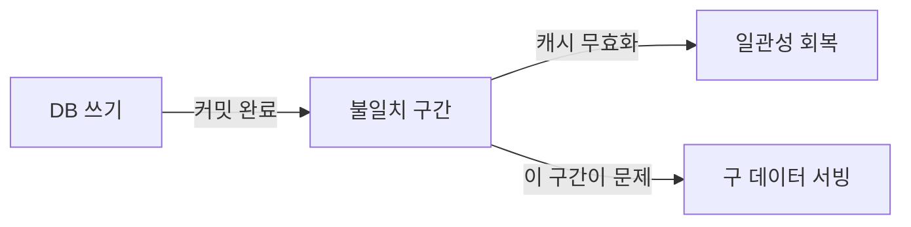
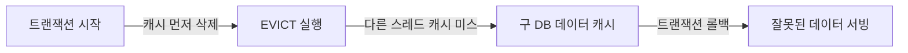
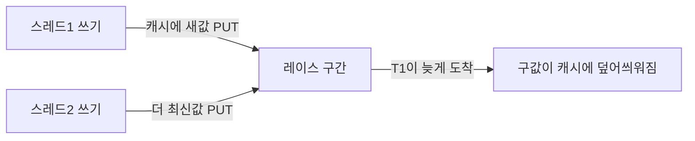
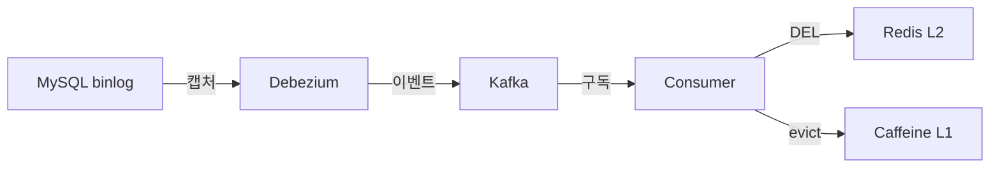
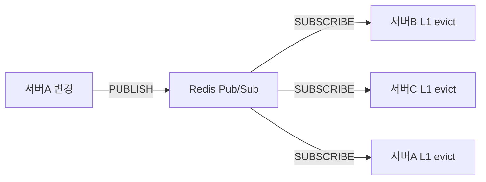
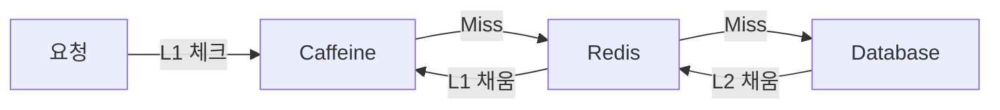
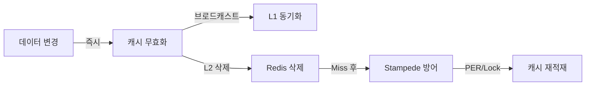

컴퓨터 과학에는 유명한 농담이 있다. Phil Karlton의 말이다.

> "There are only two hard things in Computer Science: cache invalidation and naming things."

이 농담이 오래도록 회자되는 이유는, 실제로 캐시 무효화가 **단순해 보이지만 극도로 어렵기** 때문이다. 데이터를 캐시에 넣는 것은 한 줄이다. 하지만 "언제, 어떤 방식으로, 어느 서버의 캐시를" 버려야 하는지는 분산 시스템의 모든 복잡성이 집약된 문제다.

이 글은 TTL 설정부터 CDC 파이프라인까지, 캐시 무효화의 모든 핵심 전략을 Java/Spring 실전 코드와 함께 깊이 다룬다.

---

## 왜 캐시 무효화는 어려운가

캐시 무효화가 어려운 이유를 세 가지 층위로 나누면 이해가 쉽다.

**첫째, Stale Data 문제.** DB에서 값이 바뀌어도 캐시는 그것을 모른다. 두 시스템 사이에는 물리적인 시간 격차가 존재한다. 이 격차를 0으로 만들려면 모든 쓰기를 캐시와 DB에 동시에 해야 하는데, 이는 원자적 트랜잭션이 불가능한 두 저장소 간의 일관성 문제로 이어진다.

**둘째, 분산 환경의 레이스 컨디션.** 서버가 10대 있고 각각 로컬 캐시(L1)를 가진다고 가정하자. 서버 1에서 데이터를 수정하고 자신의 L1 캐시를 삭제한다. 서버 2~10이 여전히 구 데이터를 캐시하고 있다면, 같은 순간 같은 데이터를 조회한 사용자가 서버에 따라 다른 결과를 받는다.

**셋째, 성능과 일관성의 트레이드오프.** CAP 정리에 따르면 분산 시스템에서 Consistency(일관성)와 Availability(가용성)는 동시에 완벽하게 달성할 수 없다. 캐시는 가용성과 성능을 택하는 대신 강한 일관성을 포기한다. 문제는 "얼마나 포기할 것인가"를 데이터 성격에 맞게 결정해야 한다는 것이다.

> **비유:** 병원 응급실의 재고 관리와 도서관 신간 목록을 생각해보자. 응급실 혈액 재고는 1분이라도 틀리면 안 된다(강한 일관성 필요). 도서관 신간 목록은 하루 정도 늦게 업데이트되어도 큰 문제가 없다(약한 일관성 허용). 같은 캐시 무효화 전략을 두 시스템에 동일하게 적용하는 것이 바로 실무에서 흔히 보는 설계 실수다.



이 "불일치 구간"을 최소화하는 것이 캐시 무효화 설계의 본질이다.

---

## 1. TTL 기반 무효화 — 단순하지만 함정이 많다

TTL(Time To Live)은 "이 캐시는 N초 후 자동 폐기"를 선언한다. 구현이 가장 단순하고 Redis, Caffeine 등 모든 캐시 라이브러리가 기본 지원한다.

> **비유:** 편의점 우유에 찍힌 유통기한과 같다. 유통기한이 지나면 자동 폐기된다. 문제는 유통기한 내에 우유가 상할 수도 있고(DB 먼저 변경), 유통기한이 너무 짧으면 멀쩡한 우유를 매일 버리는 낭비가 생긴다는 것이다.

### 고정 TTL의 트레이드오프

TTL이 짧을수록 DB 부하가 늘고, 길수록 Stale Data 위험이 커진다. 데이터 성격을 4개 계층으로 분류하면 TTL 설정이 명확해진다.

```java
@Configuration
public class CacheConfig {

    @Bean
    public CacheManager cacheManager(RedisConnectionFactory factory) {
        /*
         * 데이터 성격별 TTL 분류
         * - 정적 참조 데이터(약관, 설정): 변경 빈도 낮음 → 긴 TTL
         * - 도메인 데이터(상품, 사용자): 간헐적 변경 → 중간 TTL
         * - 트랜잭션 데이터(재고, 잔액): 빈번한 변경 → 짧은 TTL
         * - 실시간 데이터(환율, 주가): TTL 대신 이벤트 기반 무효화 권장
         */
        Map<String, RedisCacheConfiguration> configs = Map.of(
            "termsOfService",  ttlConfig(Duration.ofHours(24)),   // 정적 참조
            "userProfile",     ttlConfig(Duration.ofHours(1)),    // 도메인 데이터
            "productDetail",   ttlConfig(Duration.ofMinutes(30)), // 도메인 데이터
            "inventory",       ttlConfig(Duration.ofSeconds(30)), // 트랜잭션 데이터
            "seatAvailability",ttlConfig(Duration.ofSeconds(10))  // 트랜잭션 데이터
        );

        return RedisCacheManager.builder(factory)
            .cacheDefaults(ttlConfig(Duration.ofMinutes(10)))
            .withInitialCacheConfigurations(configs)
            .build();
    }

    private RedisCacheConfiguration ttlConfig(Duration ttl) {
        return RedisCacheConfiguration.defaultCacheConfig()
            .entryTtl(ttl)
            .disableCachingNullValues()
            .serializeValuesWith(
                RedisSerializationContext.SerializationPair
                    .fromSerializer(new GenericJackson2JsonRedisSerializer()));
    }
}
```

**설계 근거:** 재고(`inventory`)에 30분 TTL을 걸면 품절인데도 "재고 있음"이 30분간 서빙된다. 반대로 약관(`termsOfService`)에 10초 TTL을 걸면 불필요한 DB 부하만 생긴다. 데이터를 분류하지 않고 모두 같은 TTL로 설정하는 것이 가장 흔한 실수다.

### Jitter TTL — 왜 동시 만료가 위험한가

100개의 상품 캐시를 모두 TTL 10분으로 설정했다. 10분 후 100개가 동시에 만료된다. 그 순간 Cache Miss가 100개 동시에 발생하고 DB에 쿼리가 폭발한다. 이것이 **Thundering Herd(폭발적 군집 요청)**의 한 형태다.

Jitter는 TTL에 무작위 편차를 추가해 만료 시점을 분산시킨다.

```java
@Component
public class JitteredCacheService {

    private final StringRedisTemplate redis;
    private final Random random = new Random();

    /**
     * Jitter 적용 TTL 계산
     *
     * 원리: baseTtl의 ±20% 범위에서 무작위 편차 추가
     * 10분 기준 → 실제 TTL: 8분~12분 사이에서 균등 분포
     *
     * 왜 20%인가: 너무 작으면 분산 효과 미미, 너무 크면 신선도 예측이 어려워짐
     * 실무 권장: ±10%~±30% 범위에서 데이터 중요도에 따라 조정
     */
    public void setWithJitter(String key, Object value, Duration baseTtl) {
        long baseSeconds = baseTtl.toSeconds();
        // -0.2 ~ +0.2 범위의 jitter factor 계산
        double jitterFactor = (random.nextDouble() * 0.4) - 0.2;
        long jitteredSeconds = (long) (baseSeconds * (1 + jitterFactor));

        redis.opsForValue().set(key, serialize(value),
            Duration.ofSeconds(Math.max(1, jitteredSeconds)));
    }

    /**
     * 더 정밀한 제어가 필요할 때: 절대값 jitter
     * baseTtl=600초, maxJitter=120초 → 480~720초 사이
     */
    public void setWithAbsoluteJitter(String key, Object value,
                                       Duration baseTtl, Duration maxJitter) {
        long jitter = (long) (maxJitter.toSeconds() * (random.nextDouble() * 2 - 1));
        long finalTtl = baseTtl.toSeconds() + jitter;

        redis.opsForValue().set(key, serialize(value),
            Duration.ofSeconds(Math.max(1, finalTtl)));
    }

    private String serialize(Object value) {
        // ObjectMapper를 통한 직렬화 (생략)
        return value.toString();
    }
}
```

**왜 Jitter가 효과적인가:** 100개 캐시의 만료 시각이 8분~12분 사이에 균등 분포하면, 매 분당 약 25개씩 만료된다. 순간 폭발이 지속적인 소량 부하로 변환된다.

### Sliding TTL — 접근할 때마다 TTL 갱신

고정 TTL은 마지막 접근 시각과 관계없이 생성 시각 기준으로 만료된다. Sliding TTL은 접근할 때마다 TTL을 리셋한다. 자주 조회되는 인기 항목은 살아남고, 조회가 없는 항목은 자연 만료된다.

```java
@Component
@RequiredArgsConstructor
public class SlidingTtlCacheService {

    private final StringRedisTemplate redis;
    private static final Duration SLIDING_TTL = Duration.ofMinutes(30);

    public String get(String key) {
        String value = redis.opsForValue().get(key);
        if (value != null) {
            // 접근 시마다 TTL 리셋 → Sliding 효과
            redis.expire(key, SLIDING_TTL);
        }
        return value;
    }

    public void set(String key, String value) {
        redis.opsForValue().set(key, value, SLIDING_TTL);
    }

    /*
     * 주의: Sliding TTL의 함정
     * 매우 인기 있는 키는 영원히 만료되지 않을 수 있다.
     * 이를 방지하려면 최대 TTL(hardTtl)을 별도 키로 관리해야 한다.
     *
     * ex) "key:expire_at" 에 절대 만료 시각을 저장하고,
     *     GET 시 현재시각 > expire_at 이면 강제 evict
     */
}
```

---

## 2. 이벤트 기반 무효화 — DB 커밋 후 즉시 삭제

TTL 기반 무효화의 근본 한계는 "TTL이 만료되기 전까지는 반드시 구 데이터가 서빙된다"는 것이다. 이벤트 기반 무효화는 데이터가 변경되는 순간 캐시를 즉시 삭제한다.

> **비유:** 슈퍼마켓 본사에서 "A제품 리콜 발령"이라는 긴급 문자를 모든 매장에 보낸다. 각 매장은 유통기한 잔여와 관계없이 즉시 매대에서 해당 제품을 치운다. 이것이 이벤트 기반 무효화다.

### @TransactionalEventListener(AFTER_COMMIT) — 왜 AFTER_COMMIT인가

단순히 `@CacheEvict`를 서비스 메서드에 붙이면 위험한 레이스 컨디션이 발생한다.



캐시를 먼저 삭제한 직후, 트랜잭션이 커밋되기 전 그 찰나에 다른 스레드가 Cache Miss를 감지하고 DB에서 구 데이터를 읽어 캐시에 다시 넣을 수 있다. 그 상태에서 원래 트랜잭션이 롤백되면, 캐시에는 DB와도 다른 임시 상태가 들어가게 된다.

**AFTER_COMMIT이 해결책인 이유:** 트랜잭션이 DB에 영구 커밋된 후에만 캐시 삭제가 발생한다. 롤백 시에는 이벤트 자체가 발행되지 않는다.

```java
// 1. 도메인 이벤트 정의 (record로 불변 보장)
public record ProductUpdatedEvent(Long productId, String cacheName) {}
public record ProductDeletedEvent(Long productId) {}

// 2. 서비스: 트랜잭션 내에서 이벤트 발행 (캐시는 아직 건드리지 않음)
@Service
@RequiredArgsConstructor
public class ProductService {

    private final ProductRepository repository;
    private final ApplicationEventPublisher eventPublisher;

    @Transactional
    public void updateProduct(Long productId, ProductUpdateRequest request) {
        Product product = repository.findById(productId)
            .orElseThrow(() -> new EntityNotFoundException("Product: " + productId));

        product.update(request);
        repository.save(product);

        /*
         * 이벤트는 트랜잭션 컨텍스트 안에서 발행한다.
         * 실제 캐시 삭제는 AFTER_COMMIT 단계에서 발생하므로
         * 트랜잭션 커밋이 보장된 후에만 캐시가 삭제된다.
         */
        eventPublisher.publishEvent(new ProductUpdatedEvent(productId, "products"));
    }

    @Transactional
    public void deleteProduct(Long productId) {
        repository.deleteById(productId);
        eventPublisher.publishEvent(new ProductDeletedEvent(productId));
    }
}

// 3. 캐시 무효화 핸들러: AFTER_COMMIT 단계에서만 실행
@Component
@RequiredArgsConstructor
@Slf4j
public class CacheInvalidationHandler {

    private final RedisTemplate<String, Object> redisTemplate;
    private final CacheManager cacheManager;

    /*
     * TransactionPhase.AFTER_COMMIT:
     *   - 트랜잭션이 성공적으로 커밋된 후 실행
     *   - 롤백 시 실행되지 않음 → 잘못된 무효화 방지
     *
     * TransactionPhase.AFTER_COMPLETION (피해야 할 선택):
     *   - 커밋/롤백 모두 후 실행
     *   - 롤백되었는데도 캐시가 삭제되어, 다음 조회 시 DB에서 (롤백 전) 구 데이터가 캐시됨
     */
    @TransactionalEventListener(phase = TransactionPhase.AFTER_COMMIT)
    public void onProductUpdated(ProductUpdatedEvent event) {
        String redisKey = "product:" + event.productId();
        Boolean deleted = redisTemplate.delete(redisKey);

        // Spring Cache 추상화 계층도 함께 무효화
        Cache cache = cacheManager.getCache(event.cacheName());
        if (cache != null) {
            cache.evict(event.productId());
        }

        log.info("캐시 무효화 완료: key={}, deleted={}", redisKey, deleted);
    }

    @TransactionalEventListener(phase = TransactionPhase.AFTER_COMMIT)
    public void onProductDeleted(ProductDeletedEvent event) {
        redisTemplate.delete("product:" + event.productId());

        // 목록 캐시도 함께 무효화 (특정 상품 삭제 시 목록이 바뀌므로)
        redisTemplate.delete("products:list:*");
    }
}
```

**AFTER_COMMIT의 함정 하나:** AFTER_COMMIT 단계에서 예외가 발생해도 트랜잭션은 이미 커밋된 상태다. 따라서 캐시 무효화 실패를 감지해도 롤백이 불가능하다. 이 경우 짧은 TTL이 안전망이 된다. TTL이 만료되면 자연히 일관성이 회복된다.

---

## 3. Write-Through 무효화 — 왜 Update가 아닌 Delete인가

캐시 무효화에서 가장 많이 하는 질문이 있다. "데이터가 바뀌면 캐시를 삭제(delete)해야 하나요, 아니면 새 값으로 업데이트(update)해야 하나요?"

답은 **대부분의 경우 삭제(delete)가 안전하다**이다. 이유는 레이스 컨디션 때문이다.



두 스레드가 동시에 다른 값으로 업데이트할 때, 네트워크 지연으로 인해 나중에 쓴 스레드의 캐시 PUT이 먼저 도착하고, 먼저 쓴 스레드의 PUT이 늦게 도착하면, 최종적으로 캐시에는 구 값이 남는다.

삭제(delete)는 이 문제를 회피한다. 캐시를 삭제하면 다음 조회 시 Cache Miss가 발생하고, 그 시점의 DB 값(항상 최신)을 읽어 캐시를 채운다. 쓰기 순서가 어떻든 결과적으로 최신 DB 값이 캐시에 들어간다.

```java
@Service
@RequiredArgsConstructor
public class ProductWriteService {

    private final ProductRepository repository;
    private final StringRedisTemplate redis;

    /*
     * Cache-Aside Delete 패턴
     *
     * 잘못된 방법: 캐시를 새 값으로 업데이트
     *   redis.opsForValue().set("product:" + id, newProduct);
     *   → 동시 쓰기 시 레이스 컨디션 발생
     *
     * 올바른 방법: 캐시 삭제
     *   redis.delete("product:" + id);
     *   → 다음 조회 시 항상 DB에서 최신 값을 읽어옴
     */
    @Transactional
    public Product updateProduct(Long productId, ProductUpdateRequest request) {
        Product product = repository.findById(productId).orElseThrow();
        product.update(request);
        Product saved = repository.save(product);

        // DB 커밋 후 캐시 삭제 (update가 아닌 delete)
        // @TransactionalEventListener와 함께 쓸 때는 이벤트 발행으로 분리
        return saved;
    }
}
```

---

## 4. Double-Delete 패턴 — 레이스 컨디션의 완전한 방어

단순히 DB 업데이트 후 캐시를 한 번 삭제하는 것도 완벽하지 않다. 미묘한 레이스 컨디션이 여전히 존재한다.

**레이스 컨디션 타임라인:**

```
시각  스레드A (쓰기)           스레드B (읽기)
0ms   DB 업데이트 시작
5ms                            Cache Miss 감지
10ms  DB 업데이트 완료
15ms                            DB에서 구 값 읽기 (replication lag)
20ms  캐시 DELETE
25ms                            캐시에 구 값 PUT  ← 이미 삭제 후 구 값이 다시 들어옴
```

스레드 B가 캐시 Miss를 감지하고 DB에서 읽기 시작할 때, Read Replica의 replication lag 때문에 아직 구 값을 읽는다. 스레드 A가 캐시를 삭제한 후, 스레드 B가 그 구 값을 캐시에 저장하면 다시 stale cache가 만들어진다.

**Double-Delete는 이를 방어한다.**

```java
@Service
@RequiredArgsConstructor
@Slf4j
public class DoubleDeleteCacheService {

    private final ProductRepository repository;
    private final StringRedisTemplate redis;
    private final ScheduledExecutorService scheduler =
        Executors.newScheduledThreadPool(2);

    /*
     * Double-Delete 패턴
     *
     * 1차 삭제: DB 업데이트 전 → 쓰기 중 오래된 캐시 읽기 방지
     * DB 업데이트
     * 딜레이 (replication lag 대기)
     * 2차 삭제: DB 업데이트 후 → 1차 삭제 후 들어온 stale 캐시 제거
     *
     * 왜 딜레이가 필요한가:
     * - Read Replica의 replication lag이 보통 수십~수백 ms
     * - 그 사이에 스레드 B가 구 값을 읽어 캐시에 넣을 수 있음
     * - 딜레이 후 2차 삭제를 하면 그 stale 캐시까지 제거됨
     *
     * 최적 딜레이 계산:
     * delay = max(replication_lag_p99, 100ms) + 10ms (여유분)
     * 실무에서는 200~500ms를 많이 사용
     */
    @Transactional
    public Product updateProductWithDoubleDelete(Long productId,
                                                  ProductUpdateRequest request) {
        String cacheKey = "product:" + productId;

        // 1차 삭제: DB 업데이트 전
        redis.delete(cacheKey);
        log.debug("Double-Delete 1차: key={}", cacheKey);

        Product product = repository.findById(productId).orElseThrow();
        product.update(request);
        Product saved = repository.save(product);

        // 2차 삭제: DB 커밋 후 지연 실행
        // @Async나 ScheduledExecutor로 트랜잭션 밖에서 실행
        scheduleSecondDelete(cacheKey, Duration.ofMillis(300));

        return saved;
    }

    private void scheduleSecondDelete(String cacheKey, Duration delay) {
        scheduler.schedule(() -> {
            try {
                redis.delete(cacheKey);
                log.debug("Double-Delete 2차 완료: key={}", cacheKey);
            } catch (Exception e) {
                log.error("Double-Delete 2차 실패: key={}", cacheKey, e);
                // 실패해도 TTL에 의해 결국 만료됨 → 안전망
            }
        }, delay.toMillis(), TimeUnit.MILLISECONDS);
    }
}
```

**Double-Delete의 한계와 트레이드오프:**

Double-Delete 도입 후 2차 삭제까지의 딜레이(200~500ms) 동안은 Cache Miss가 지속된다. 이 구간에 들어오는 모든 조회가 DB를 직접 hit한다. 트래픽이 높은 서비스에서는 이 딜레이가 DB 부하 증가로 이어질 수 있으므로, Mutex Lock 또는 PER 알고리즘과 조합하는 것이 좋다.

---

## 5. CDC 기반 무효화 — Debezium + Kafka로 완전 자동화

이벤트 기반 무효화(`@TransactionalEventListener`)는 여전히 개발자가 모든 수정 경로에 이벤트 발행 코드를 넣어야 한다는 문제가 있다. 직접 SQL을 실행하는 배치 작업, 마이그레이션 스크립트, 다른 서비스의 직접 DB 접근 — 어느 하나라도 이벤트 발행이 누락되면 캐시 불일치가 발생한다.

CDC(Change Data Capture)는 이 문제를 구조적으로 해결한다. 애플리케이션 코드가 아닌 **DB 자체의 변경 로그(MySQL binlog, PostgreSQL WAL)**를 캡처해 이벤트를 생성한다. 어떤 경로로 DB가 변경되든 반드시 로그에 남으므로, 무효화 누락이 구조적으로 불가능하다.

> **비유:** 건물의 모든 출입구에 카메라를 설치하는 대신, 중앙 전력 미터 하나로 "전기가 얼마나 쓰였는지"를 측정하는 것과 같다. 누가 어느 출입구로 들어왔든, 전력계는 반드시 반응한다.

### CDC 파이프라인 전체 구조



### Debezium 설정 (MySQL)

```json
{
  "name": "product-cdc-connector",
  "config": {
    "connector.class": "io.debezium.connector.mysql.MySqlConnector",
    "database.hostname": "mysql-host",
    "database.port": "3306",
    "database.user": "debezium",
    "database.password": "secret",
    "database.server.name": "dbserver1",
    "database.include.list": "mydb",
    "table.include.list": "mydb.products,mydb.inventory",
    "database.history.kafka.bootstrap.servers": "kafka:9092",
    "database.history.kafka.topic": "schema-changes.mydb",
    "transforms": "route",
    "transforms.route.type": "org.apache.kafka.connect.transforms.ReplaceField$Value",
    "snapshot.mode": "initial"
  }
}
```

### Kafka Consumer — CDC 이벤트로 캐시 무효화

```java
@Component
@RequiredArgsConstructor
@Slf4j
public class ProductCdcCacheInvalidator {

    private final StringRedisTemplate redis;
    private final CaffeineCacheManager localCache;
    private final ObjectMapper objectMapper;

    /*
     * Debezium CDC 이벤트 구조 (MySQL 기준)
     * {
     *   "op": "u",           // c=create, u=update, d=delete, r=snapshot read
     *   "before": { "id": 1, "name": "구 이름", "price": 1000 },
     *   "after":  { "id": 1, "name": "새 이름", "price": 1200 },
     *   "ts_ms": 1714567890000
     * }
     *
     * 왜 eventually consistent인가:
     * - binlog 생성 → Debezium 캡처 → Kafka 전송 → Consumer 처리
     * - 이 파이프라인 지연: 수백 ms ~ 수 초
     * - 그러나 "반드시 처리됨"이 보장됨 (at-least-once delivery)
     * - 실시간성보다 신뢰성이 중요한 시스템에 적합
     */
    @KafkaListener(
        topics = "dbserver1.mydb.products",
        groupId = "cache-invalidator",
        containerFactory = "kafkaListenerContainerFactory"
    )
    public void handleProductChange(
            ConsumerRecord<String, String> record,
            Acknowledgment ack) {
        try {
            JsonNode payload = objectMapper.readTree(record.value()).get("payload");
            String operation = payload.get("op").asText();

            // snapshot read는 무효화 불필요
            if ("r".equals(operation)) {
                ack.acknowledge();
                return;
            }

            Long productId = extractProductId(payload, operation);
            if (productId == null) {
                log.warn("CDC 이벤트에서 productId 추출 실패: {}", record.value());
                ack.acknowledge();
                return;
            }

            invalidateProductCache(productId);
            log.info("CDC 캐시 무효화: op={}, productId={}", operation, productId);

            ack.acknowledge(); // 수동 커밋 → 처리 완료 후 오프셋 커밋

        } catch (Exception e) {
            log.error("CDC 캐시 무효화 실패: {}", record.value(), e);
            // ack 하지 않음 → Kafka가 재전송 → at-least-once 보장
            // 단, 무한 재시도 방지를 위해 DLT(Dead Letter Topic) 설정 권장
        }
    }

    @KafkaListener(topics = "dbserver1.mydb.inventory", groupId = "cache-invalidator")
    public void handleInventoryChange(ConsumerRecord<String, String> record,
                                       Acknowledgment ack) {
        try {
            JsonNode payload = objectMapper.readTree(record.value()).get("payload");
            String op = payload.get("op").asText();

            if (!"r".equals(op)) {
                JsonNode data = "d".equals(op) ? payload.get("before") : payload.get("after");
                Long productId = data.get("product_id").asLong();
                redis.delete("inventory:" + productId);

                Cache cache = localCache.getCache("inventory");
                if (cache != null) cache.evict(productId);
            }
            ack.acknowledge();
        } catch (Exception e) {
            log.error("재고 CDC 캐시 무효화 실패", e);
        }
    }

    private Long extractProductId(JsonNode payload, String operation) {
        try {
            JsonNode data = "d".equals(operation)
                ? payload.get("before")   // delete: before에 데이터
                : payload.get("after");    // create/update: after에 데이터
            return data != null ? data.get("id").asLong() : null;
        } catch (Exception e) {
            return null;
        }
    }

    private void invalidateProductCache(Long productId) {
        // L2(Redis) 캐시 무효화
        redis.delete("product:" + productId);

        // L1(Caffeine) 캐시 무효화
        Cache l1Cache = localCache.getCache("products");
        if (l1Cache != null) {
            l1Cache.evict(productId);
        }

        // 목록 캐시도 무효화 (상품 변경 시 목록에 반영되어야 함)
        // 패턴 삭제는 Redis Cluster에서 지원하지 않으므로 태그 방식 권장 (섹션 9 참고)
        redis.delete("products:list:all");
    }
}

// Kafka 설정 (수동 커밋 + 역직렬화)
@Configuration
public class KafkaConsumerConfig {

    @Bean
    public ConcurrentKafkaListenerContainerFactory<String, String>
            kafkaListenerContainerFactory(ConsumerFactory<String, String> cf) {
        ConcurrentKafkaListenerContainerFactory<String, String> factory =
            new ConcurrentKafkaListenerContainerFactory<>();
        factory.setConsumerFactory(cf);
        // 수동 커밋으로 처리 완료 후 오프셋 커밋 → at-least-once 보장
        factory.getContainerProperties().setAckMode(ContainerProperties.AckMode.MANUAL);
        return factory;
    }
}
```

### CDC vs 이벤트 기반 비교

| 항목 | @TransactionalEventListener | CDC (Debezium + Kafka) |
|------|-----------------------------|------------------------|
| 무효화 누락 | 코드 누락 시 발생 | 구조적으로 불가능 |
| 지연 | 수 ms (즉시) | 수백 ms ~ 수 초 |
| 인프라 | 추가 불필요 | Kafka, Debezium 필요 |
| 직접 SQL 대응 | 불가 | 가능 (binlog 캡처) |
| 메시지 보장 | 트랜잭션 연동 | at-least-once |
| 적합 규모 | 단일 서비스 | 마이크로서비스, 대규모 |

---

## 6. 버전 기반 무효화 — ETag와 낙관적 동시성

캐시 키에 버전 번호를 포함시켜, 데이터 변경 시 새 버전 키를 사용하는 방식이다. 구 버전 캐시를 명시적으로 삭제하지 않아도 된다. 버전이 바뀌면 구 키로는 접근 자체가 불가능하기 때문이다.

**HTTP ETag와 동일한 원리다.** 브라우저가 `If-None-Match: "v3"` 헤더로 요청하면, 서버는 현재 버전이 v4면 새 데이터를 반환하고, v3이면 `304 Not Modified`를 반환한다. 캐시와 원본의 버전을 비교해 동기화한다.

```java
@Service
@RequiredArgsConstructor
public class VersionedCacheService {

    private final StringRedisTemplate redis;
    private final ProductRepository repository;
    private final ObjectMapper objectMapper;

    private static final Duration VERSION_TTL = Duration.ofHours(1);
    private static final Duration DATA_TTL = Duration.ofHours(2);

    /*
     * 버전 기반 캐시 조회
     *
     * 키 구조:
     * - "product:{id}:version"  → 현재 버전 번호 (Long)
     * - "product:{id}:v{ver}"   → 실제 데이터
     *
     * 왜 삭제가 필요 없는가:
     * - updateProduct() 호출 시 버전만 올림 (v3 → v4)
     * - 이후 조회는 "product:{id}:v4"를 찾으므로 v3 데이터에 접근 불가
     * - v3 데이터는 DATA_TTL 만료 시 자동 정리
     */
    public Product getProduct(Long productId) throws Exception {
        String versionKey = "product:" + productId + ":version";

        String versionStr = redis.opsForValue().get(versionKey);
        if (versionStr == null) {
            // 버전 키가 없으면 DB에서 조회 후 초기화
            return loadAndCache(productId, 1L);
        }

        long version = Long.parseLong(versionStr);
        String dataKey = "product:" + productId + ":v" + version;
        String cached = redis.opsForValue().get(dataKey);

        if (cached != null) {
            return objectMapper.readValue(cached, Product.class);
        }

        // 버전 키는 있으나 데이터 캐시가 만료된 경우
        return loadAndCache(productId, version);
    }

    @Transactional
    public void updateProduct(Long productId, ProductUpdateRequest request) {
        Product product = repository.findById(productId).orElseThrow();
        product.update(request);
        repository.save(product);

        /*
         * 핵심: 캐시를 삭제하지 않고 버전만 증가
         * INCR은 원자적 연산 → 동시 업데이트 시 버전 충돌 없음
         *
         * 낙관적 동시성:
         * - v3을 읽은 클라이언트가 수정 후 저장 시도
         * - 그 사이 다른 클라이언트가 v4로 올렸다면
         * - v3 기반 수정은 거부 (버전 불일치)
         * → DB의 optimistic locking (@Version)과 동일한 원리
         */
        redis.opsForValue().increment("product:" + productId + ":version");

        // 버전 키 TTL 갱신 (데이터와 버전 키가 같이 살아있어야 함)
        redis.expire("product:" + productId + ":version", VERSION_TTL);
    }

    private Product loadAndCache(Long productId, long version) throws Exception {
        Product product = repository.findById(productId).orElseThrow();
        String dataKey = "product:" + productId + ":v" + version;
        redis.opsForValue().set(dataKey,
            objectMapper.writeValueAsString(product), DATA_TTL);
        return product;
    }
}
```

**버전 기반의 강점:** 캐시 삭제 실패에 대한 걱정이 없다. 버전만 올리면 된다. 네트워크 장애로 Redis에 연결할 수 없을 때도, 버전 증가만 재시도하면 된다. 구 버전 데이터는 자동으로 무시된다.

---

## 7. Redis Pub/Sub — 멀티 인스턴스 L1 캐시 동기화

서버 10대가 각각 Caffeine L1 캐시를 가지고 있을 때, 서버 1에서 데이터가 변경되면 서버 2~10의 L1 캐시도 즉시 무효화해야 한다. Redis Pub/Sub이 이 브로드캐스트 역할을 한다.

> **비유:** 학교 교내 방송 시스템이다. 교무실(변경 발생 서버)에서 마이크를 잡고 "3층 회의실 예약 취소됨"을 방송하면, 모든 교실(서버)의 스피커가 동시에 울린다. 각 교실은 자기 칠판(L1 캐시)에서 해당 예약을 지운다.



### 왜 Fire-and-Forget 한계가 있는가

Redis Pub/Sub은 메시지를 보내는 순간 구독자가 연결되어 있지 않으면 메시지를 잃는다. 서버가 재시작 중이거나 네트워크가 순간 단절되면 무효화 메시지를 못 받는다. 이것이 "fire-and-forget" 한계다.

이 한계를 완화하는 전략: L1 캐시 TTL을 짧게(30~60초) 설정한다. Pub/Sub 메시지를 놓쳐도 짧은 TTL 내에 자연 만료되어 최종 일관성이 수렴한다.

```java
// === Pub/Sub 설정 ===
@Configuration
public class RedisPubSubConfig {

    public static final String CACHE_INVALIDATION_CHANNEL = "cache:invalidate";

    @Bean
    public ChannelTopic cacheInvalidationTopic() {
        return new ChannelTopic(CACHE_INVALIDATION_CHANNEL);
    }

    @Bean
    public RedisMessageListenerContainer listenerContainer(
            RedisConnectionFactory factory,
            MessageListener cacheInvalidationListener,
            ChannelTopic topic) {
        RedisMessageListenerContainer container = new RedisMessageListenerContainer();
        container.setConnectionFactory(factory);
        container.addMessageListener(cacheInvalidationListener, topic);
        // 별도 스레드풀로 리스너 실행 (메인 이벤트 루프 블로킹 방지)
        container.setTaskExecutor(Executors.newFixedThreadPool(2));
        return container;
    }
}

// === 무효화 메시지 구조 ===
public record CacheInvalidationMessage(
    String cacheName,
    String key,
    long timestamp   // 오래된 메시지 필터링에 사용
) {
    public String serialize() {
        return cacheName + "|" + key + "|" + timestamp;
    }

    public static CacheInvalidationMessage deserialize(String payload) {
        String[] parts = payload.split("\\|", 3);
        return new CacheInvalidationMessage(
            parts[0], parts[1], Long.parseLong(parts[2]));
    }
}

// === 발행자: 데이터 변경 시 브로드캐스트 ===
@Service
@RequiredArgsConstructor
@Slf4j
public class L1CacheInvalidationPublisher {

    private final StringRedisTemplate redis;
    private final ChannelTopic topic;

    /*
     * @TransactionalEventListener(AFTER_COMMIT)와 조합:
     * 트랜잭션 커밋 후 Pub/Sub 메시지 발행 → 모든 서버 L1 무효화
     *
     * 주의: 이 메서드 자체에 @Transactional을 붙이지 않는다.
     * 트랜잭션 커밋 후 실행되므로 새 트랜잭션 컨텍스트가 없어야 한다.
     */
    @TransactionalEventListener(phase = TransactionPhase.AFTER_COMMIT)
    public void broadcastInvalidation(ProductUpdatedEvent event) {
        CacheInvalidationMessage message = new CacheInvalidationMessage(
            "products",
            String.valueOf(event.productId()),
            System.currentTimeMillis()
        );

        try {
            redis.convertAndSend(topic.getTopic(), message.serialize());
            log.debug("L1 무효화 브로드캐스트: {}", message);
        } catch (Exception e) {
            // Pub/Sub 실패 시 경고만 (캐시 일관성은 TTL로 수렴)
            log.warn("Pub/Sub 발행 실패, TTL 만료로 수렴 예정: {}", message, e);
        }
    }
}

// === 구독자: 모든 서버 인스턴스에서 실행 ===
@Component
@RequiredArgsConstructor
@Slf4j
public class L1CacheInvalidationSubscriber implements MessageListener {

    private final CaffeineCacheManager caffeineCacheManager;
    private static final long MAX_MESSAGE_AGE_MS = 5000; // 5초 이상 된 메시지 무시

    @Override
    public void onMessage(Message message, byte[] pattern) {
        try {
            String payload = new String(message.getBody(), StandardCharsets.UTF_8);
            CacheInvalidationMessage msg =
                CacheInvalidationMessage.deserialize(payload);

            // 오래된 메시지 필터링 (네트워크 지연으로 뒤늦게 도착한 메시지)
            long age = System.currentTimeMillis() - msg.timestamp();
            if (age > MAX_MESSAGE_AGE_MS) {
                log.warn("오래된 Pub/Sub 메시지 무시: age={}ms, key={}",
                    age, msg.key());
                return;
            }

            Cache cache = caffeineCacheManager.getCache(msg.cacheName());
            if (cache != null) {
                cache.evict(Long.parseLong(msg.key()));
                log.debug("L1 캐시 무효화 완료: cacheName={}, key={}",
                    msg.cacheName(), msg.key());
            }

        } catch (Exception e) {
            log.error("Pub/Sub 메시지 처리 실패: {}", new String(message.getBody()), e);
        }
    }
}
```

---

## 8. 태그 기반 무효화 — 관련 캐시 그룹 일괄 삭제

"이 사용자와 관련된 모든 캐시를 삭제하라"는 요구가 있을 때, 개별 키를 하나씩 삭제하는 것은 실수가 잦다. 태그 기반 무효화는 연관된 캐시들에 동일한 태그를 부여하고, 태그 단위로 일괄 무효화한다.

> **비유:** 슈퍼마켓 매대에 "유제품" 라벨이 붙은 상품들이 있다. 유제품 전체 리콜 시 "유제품" 라벨이 붙은 것을 모두 치우면 된다. 개별 상품 이름을 일일이 기억할 필요가 없다.

```java
@Service
@RequiredArgsConstructor
public class TagBasedCacheService {

    private final StringRedisTemplate redis;
    private static final String TAG_PREFIX = "cache:tag:";

    /*
     * 캐시 저장 시 태그 등록
     *
     * 사용 예:
     *   캐시 키 "product:1:detail" → 태그 "product:1", "category:electronics"
     *   캐시 키 "product:1:reviews" → 태그 "product:1"
     *   캐시 키 "user:42:orders" → 태그 "user:42"
     *
     * 태그 구조 (Redis Set):
     *   "cache:tag:product:1" → {"product:1:detail", "product:1:reviews"}
     */
    public void setWithTags(String cacheKey, String value,
                             Duration ttl, String... tags) {
        // 실제 데이터 저장
        redis.opsForValue().set(cacheKey, value, ttl);

        // 태그 → 캐시키 역인덱스 저장
        for (String tag : tags) {
            String tagKey = TAG_PREFIX + tag;
            redis.opsForSet().add(tagKey, cacheKey);
            // 태그 TTL은 데이터보다 여유 있게
            redis.expire(tagKey, ttl.plus(Duration.ofMinutes(10)));
        }
    }

    /*
     * 태그로 관련 캐시 일괄 삭제
     *
     * product:1 태그 무효화 → product:1:detail, product:1:reviews 모두 삭제
     * 상품 수정 시 해당 상품과 관련된 모든 캐시를 한 번에 제거
     */
    public void invalidateByTag(String tag) {
        String tagKey = TAG_PREFIX + tag;
        Set<String> cacheKeys = redis.opsForSet().members(tagKey);

        if (cacheKeys != null && !cacheKeys.isEmpty()) {
            redis.delete(cacheKeys);  // 배치 삭제 (파이프라인)
        }

        // 태그 키 자체도 삭제
        redis.delete(tagKey);
    }

    /*
     * Spring @CacheEvict allEntries=true vs 태그 방식 비교
     *
     * @CacheEvict(value = "products", allEntries = true)
     *   - 해당 캐시 이름의 모든 항목 삭제
     *   - 관계없는 항목까지 삭제됨 (과도한 무효화)
     *   - 구현 간단
     *
     * 태그 방식:
     *   - 정확히 연관된 항목만 삭제 (선택적 무효화)
     *   - 구현 복잡하지만 Cache Miss 최소화
     *   - 예: 상품 1 수정 → 상품 1 관련 캐시만 삭제 (다른 상품 캐시 보존)
     */
}

// 서비스에서 태그 기반 무효화 사용
@Service
@RequiredArgsConstructor
public class ProductCacheService {

    private final TagBasedCacheService tagCache;

    public void cacheProductDetail(Product product) {
        String key = "product:" + product.getId() + ":detail";
        tagCache.setWithTags(
            key,
            serialize(product),
            Duration.ofMinutes(30),
            "product:" + product.getId(),              // 상품별 태그
            "category:" + product.getCategoryId()      // 카테고리별 태그
        );
    }

    // 상품 수정 시: 해당 상품과 관련된 모든 캐시 삭제
    public void invalidateProduct(Long productId) {
        tagCache.invalidateByTag("product:" + productId);
    }

    // 카테고리 변경 시: 해당 카테고리의 모든 상품 캐시 삭제
    public void invalidateCategory(Long categoryId) {
        tagCache.invalidateByTag("category:" + categoryId);
    }

    private String serialize(Object obj) {
        return obj.toString(); // ObjectMapper 생략
    }
}
```

---

## 9. 멀티레이어 캐시 무효화 — L1(Caffeine) + L2(Redis) 일관성

L1(로컬 JVM 캐시)과 L2(Redis 분산 캐시)를 동시에 운영하면 성능이 극대화되지만, 두 계층의 일관성을 유지하는 것이 복잡해진다.

### 멀티레이어 읽기/쓰기 프로토콜



```java
@Service
@RequiredArgsConstructor
@Slf4j
public class MultiLayerCacheService {

    private final CaffeineCacheManager l1CacheManager;
    private final StringRedisTemplate redis;
    private final ProductRepository repository;
    private final ObjectMapper objectMapper;
    private final L1CacheInvalidationPublisher invalidationPublisher;

    private static final Duration L1_TTL = Duration.ofSeconds(30); // 짧게: Pub/Sub 실패 시 안전망
    private static final Duration L2_TTL = Duration.ofMinutes(30);

    @Cacheable(cacheNames = "products", cacheManager = "caffeineCacheManager")
    public Product getFromL1(Long productId) {
        // L1 Miss → L2 확인
        return getFromL2(productId);
    }

    private Product getFromL2(Long productId) {
        String l2Key = "product:" + productId;
        String cached = redis.opsForValue().get(l2Key);

        if (cached != null) {
            try {
                return objectMapper.readValue(cached, Product.class);
            } catch (Exception e) {
                log.warn("L2 역직렬화 실패, DB fallback: {}", productId);
            }
        }

        // L2 Miss → DB 조회 후 두 계층 채우기
        Product product = repository.findById(productId).orElseThrow();
        populateBothLayers(productId, product);
        return product;
    }

    private void populateBothLayers(Long productId, Product product) {
        try {
            String serialized = objectMapper.writeValueAsString(product);

            // L2 먼저 (영구 저장소에 가까운 계층)
            redis.opsForValue().set("product:" + productId, serialized, L2_TTL);

            // L1은 캐시 관리자를 통해 (TTL은 Caffeine 설정에서 관리)
            Cache l1Cache = l1CacheManager.getCache("products");
            if (l1Cache != null) {
                l1Cache.put(productId, product);
            }
        } catch (Exception e) {
            log.error("캐시 채우기 실패: productId={}", productId, e);
        }
    }

    /*
     * 멀티레이어 무효화 순서: L1 먼저, L2 나중
     *
     * 왜 L1 먼저인가:
     * - L2를 먼저 삭제하면, L1에 아직 구 데이터가 있는 상태에서
     *   다른 요청이 L1 Hit로 구 데이터를 계속 서빙함
     * - L1을 먼저 삭제하면 L1 Miss → L2 확인 → L2도 곧 삭제됨
     *   이 순서가 더 안전
     *
     * 단, 분산 환경에서는 다른 서버의 L1을 Pub/Sub으로 브로드캐스트해야 함
     */
    @TransactionalEventListener(phase = TransactionPhase.AFTER_COMMIT)
    public void invalidateMultiLayer(ProductUpdatedEvent event) {
        Long productId = event.productId();

        // 1. 자신의 L1 먼저 무효화
        Cache l1Cache = l1CacheManager.getCache("products");
        if (l1Cache != null) {
            l1Cache.evict(productId);
        }

        // 2. L2(Redis) 무효화
        redis.delete("product:" + productId);

        // 3. 다른 서버들의 L1 무효화 브로드캐스트
        invalidationPublisher.broadcastInvalidation(event);

        log.info("멀티레이어 캐시 무효화 완료: productId={}", productId);
    }
}

// Caffeine L1 설정 (짧은 TTL이 핵심)
@Configuration
public class CaffeineConfig {

    @Bean
    public CaffeineCacheManager caffeineCacheManager() {
        CaffeineCacheManager manager = new CaffeineCacheManager();
        manager.setCaffeine(Caffeine.newBuilder()
            .maximumSize(1000)
            .expireAfterWrite(30, TimeUnit.SECONDS)  // 짧은 TTL: Pub/Sub 실패 시 안전망
            .recordStats()  // 통계 수집 (Hit Rate 모니터링)
        );
        return manager;
    }
}
```

---

## 10. Thundering Herd 방어 — Mutex Lock과 확률적 조기 갱신

캐시가 무효화된 직후, 수백~수천의 요청이 동시에 Cache Miss를 겪고 DB로 몰리는 현상을 **Thundering Herd** 또는 **Cache Stampede**라고 한다. 무효화 전략이 완벽해도, 무효화된 직후의 이 순간을 방어하지 않으면 DB가 죽는다.

> **비유:** 콘서트 표 예매 사이트에서 티켓이 오픈되는 순간 10만 명이 동시에 새로고침을 누르는 것과 같다. 서버가 동시 요청을 감당하지 못하고 다운된다. 번호표를 나눠주고(Mutex Lock), 미리 준비를 마쳐두는 것(PER)이 해결책이다.

### Mutex Lock — 하나만 통과시키기

```java
@Service
@RequiredArgsConstructor
@Slf4j
public class MutexCacheService {

    private final StringRedisTemplate redis;
    private final ProductRepository repository;
    private final ObjectMapper objectMapper;

    private static final int MAX_RETRIES = 15;
    private static final Duration LOCK_TTL = Duration.ofSeconds(10);
    private static final Duration CACHE_TTL = Duration.ofMinutes(10);
    private static final long RETRY_BASE_MS = 30;

    public Product getProduct(Long productId) throws Exception {
        String cacheKey = "product:" + productId;

        // 빠른 경로: 캐시 있으면 즉시 반환
        String cached = redis.opsForValue().get(cacheKey);
        if (cached != null) {
            return objectMapper.readValue(cached, Product.class);
        }

        // 느린 경로: Mutex Lock 획득 시도
        return acquireAndLoad(productId, cacheKey);
    }

    private Product acquireAndLoad(Long productId, String cacheKey) throws Exception {
        String lockKey = "lock:" + cacheKey;
        // UUID로 소유권 식별: 내가 잡은 Lock만 내가 해제
        String lockOwner = UUID.randomUUID().toString();

        for (int retry = 0; retry < MAX_RETRIES; retry++) {
            // SET NX EX: 원자적 Lock 획득
            Boolean acquired = redis.opsForValue()
                .setIfAbsent(lockKey, lockOwner, LOCK_TTL);

            if (Boolean.TRUE.equals(acquired)) {
                return loadWithLock(productId, cacheKey, lockKey, lockOwner);
            }

            // Lock 획득 실패 → 대기 후 캐시 재확인
            long waitMs = RETRY_BASE_MS + (long)(Math.random() * RETRY_BASE_MS);
            Thread.sleep(waitMs); // Exponential backoff 적용 권장

            // 다른 스레드가 캐시를 채웠을 수 있음
            String recheckCached = redis.opsForValue().get(cacheKey);
            if (recheckCached != null) {
                return objectMapper.readValue(recheckCached, Product.class);
            }
        }

        // 모든 재시도 실패 → DB 직접 조회 (가용성 보장)
        log.warn("Lock 획득 실패, DB Fallback: productId={}", productId);
        return repository.findById(productId).orElseThrow();
    }

    private Product loadWithLock(Long productId, String cacheKey,
                                  String lockKey, String lockOwner) throws Exception {
        try {
            // Double-check: Lock 획득 후 캐시 재확인
            String cached = redis.opsForValue().get(cacheKey);
            if (cached != null) {
                return objectMapper.readValue(cached, Product.class);
            }

            // 실제 DB 조회
            Product product = repository.findById(productId).orElseThrow();
            redis.opsForValue().set(cacheKey,
                objectMapper.writeValueAsString(product), CACHE_TTL);

            log.debug("캐시 채우기 완료: productId={}", productId);
            return product;

        } finally {
            // 내가 잡은 Lock만 해제 (소유권 검증)
            // 주의: GET + DEL은 원자적이지 않음 → Lua 스크립트 사용
            releaseLockSafely(lockKey, lockOwner);
        }
    }

    /*
     * 원자적 Lock 해제 (Lua 스크립트)
     *
     * GET lockKey → lockOwner 비교 → DEL의 세 단계가 원자적이어야 함
     * 그렇지 않으면 GET 후 DEL 전에 Lock TTL 만료 → 다른 스레드가 Lock 획득
     * → 내가 남의 Lock을 삭제하는 사고 발생
     */
    private static final String RELEASE_LOCK_SCRIPT =
        "if redis.call('get', KEYS[1]) == ARGV[1] then " +
        "  return redis.call('del', KEYS[1]) " +
        "else " +
        "  return 0 " +
        "end";

    private void releaseLockSafely(String lockKey, String lockOwner) {
        try {
            redis.execute(
                new DefaultRedisScript<>(RELEASE_LOCK_SCRIPT, Long.class),
                Collections.singletonList(lockKey),
                lockOwner
            );
        } catch (Exception e) {
            log.error("Lock 해제 실패: lockKey={}", lockKey, e);
            // Lock TTL 만료로 자동 해제됨 → 데드락 없음
        }
    }
}
```

### PER(Probabilistic Early Recomputation) — 만료 전 확률적 갱신

Mutex Lock은 만료 후 첫 요청이 Lock을 잡을 때까지 나머지 요청이 대기한다. PER은 만료되기 **전에** 미리 갱신해 만료 시점에 이미 새 캐시가 준비되게 한다. Lock이 전혀 필요 없다.

**PER 수학적 원리:**

```
recompute = (현재시각) - (만료시각 - TTL × beta × log(random())) > 만료시각
          = 잔여TTL < TTL × beta × (-log(random()))
```

- `beta`: 갱신 민감도 (기본 1.0)
- `-log(random())`: 0~∞ 지수 분포. 만료 시점에 가까울수록 갱신 확률 급상승
- 만료 10분 전: 갱신 확률 ~0%, 만료 1분 전: 갱신 확률 급상승

```java
@Service
@RequiredArgsConstructor
@Slf4j
public class PERCacheService {

    private final StringRedisTemplate redis;
    private final ProductRepository repository;
    private final ObjectMapper objectMapper;
    private final Executor asyncExecutor = Executors.newFixedThreadPool(4);

    private static final double BETA = 1.0;
    private static final Duration CACHE_TTL = Duration.ofMinutes(10);

    public Product getProduct(Long productId) throws Exception {
        String key = "product:" + productId;
        String cached = redis.opsForValue().get(key);
        Long remainingTtl = redis.getExpire(key, TimeUnit.SECONDS);

        if (cached != null && remainingTtl != null && remainingTtl > 0) {
            if (shouldEarlyRecompute(remainingTtl, CACHE_TTL)) {
                /*
                 * "갱신 당첨": 백그라운드에서 비동기로 캐시 갱신
                 * 현재 요청은 기존 캐시 값을 즉시 반환 → 사용자 지연 없음
                 *
                 * 왜 비동기인가:
                 * - 갱신 당첨 여부는 확률적 → 여러 요청이 동시에 당첨될 수 있음
                 * - 하나가 DB 조회 중이더라도 나머지 2~3개도 DB를 조회할 수 있음
                 * - 이는 허용 가능한 수준 (수백 개 Stampede에 비해 무시할 수준)
                 */
                log.debug("PER 조기 갱신 트리거: productId={}, remainingTtl={}s",
                    productId, remainingTtl);
                asyncExecutor.execute(() -> backgroundRecompute(productId, key));
            }
            return objectMapper.readValue(cached, Product.class);
        }

        // 캐시 없음 → 동기 조회 (Cache Miss)
        return synchronousRecompute(productId, key);
    }

    /*
     * PER 갱신 여부 결정
     *
     * beta × (-log(random()))의 기대값 = beta
     * beta=1.0, TTL=600s → 평균 600s 전부터 갱신 시작이 아닌,
     * 만료 직전에 확률이 급상승하는 지수 분포
     *
     * 실제 갱신 시작 시점 기대값 = TTL × beta × e^(-1) ≈ TTL × 0.37
     * 즉, 잔여 TTL이 원래 TTL의 37% 이하로 떨어질 때부터 의미 있는 확률 발생
     */
    private boolean shouldEarlyRecompute(long remainingTtlSeconds, Duration originalTtl) {
        double delta = originalTtl.toSeconds() * BETA;
        double threshold = delta * (-Math.log(Math.random()));
        return remainingTtlSeconds <= threshold;
    }

    private void backgroundRecompute(Long productId, String key) {
        try {
            Product product = repository.findById(productId).orElseThrow();
            redis.opsForValue().set(key,
                objectMapper.writeValueAsString(product), CACHE_TTL);
            log.debug("PER 백그라운드 갱신 완료: productId={}", productId);
        } catch (Exception e) {
            log.error("PER 백그라운드 갱신 실패: productId={}", productId, e);
        }
    }

    private Product synchronousRecompute(Long productId, String key) throws Exception {
        Product product = repository.findById(productId).orElseThrow();
        redis.opsForValue().set(key,
            objectMapper.writeValueAsString(product), CACHE_TTL);
        return product;
    }
}
```

### Mutex Lock vs PER 선택 기준

| 구분 | Mutex Lock | PER |
|------|-----------|-----|
| DB 조회 동시성 | 정확히 1개 | 2~3개 허용 |
| 사용자 대기 | Lock 대기 발생 | 없음 (기존 캐시 즉시 반환) |
| 구현 복잡도 | Lua 스크립트, 소유권 관리 | 확률 공식만 |
| 데드락 위험 | Lock TTL로 방어 | 없음 |
| 적합한 상황 | DB 조회 1건이 매우 무거울 때 | 대부분의 일반 캐시 |

---

## 극한 시나리오

### 시나리오 1 — 블랙프라이데이 자정, 50만 TPS에서 인기 상품 캐시 동시 만료

상품 캐시 500개가 모두 같은 TTL로 설정되어 자정에 동시 만료된다. 50만 TPS 트래픽이 DB로 몰린다.

> **비유:** 백화점 자정 세일 오픈과 동시에 50만 명이 유리문을 밀면 유리가 박살난다. 회전문(Mutex Lock)을 설치하면 한 번에 1~2명만 통과하지만 줄이 끝없이 늘어선다. 해결책은 세일 5분 전에 이미 진열을 바꿔두는 것(PER + Cache Warmup)이다.

**방어 전략 조합:**

```java
@Service
@RequiredArgsConstructor
public class BlackFridayCacheStrategy {

    private final PERCacheService perCache;
    private final JitteredCacheService jitteredCache;
    private final ProductRepository repository;

    // 세일 시작 5분 전 미리 캐시 채우기 (Cache Warmup)
    @Scheduled(cron = "0 55 23 * * FRI") // 금요일 23:55
    public void warmupSaleCache() {
        List<Long> topProductIds = repository.findTopSaleProductIds(500);

        // 병렬로 캐시 채우기
        topProductIds.parallelStream().forEach(id -> {
            try {
                Product product = repository.findById(id).orElseThrow();
                // Jitter TTL로 만료 시점 분산: 1시간 ±20% (48분~72분)
                jitteredCache.setWithJitter("product:" + id,
                    product, Duration.ofHours(1));
            } catch (Exception e) {
                log.error("Warmup 실패: productId={}", id, e);
            }
        });
    }
}
```

**5중 방어:**
1. Jitter TTL로 만료 시점 분산
2. PER로 만료 전 조기 갱신
3. Cache Warmup으로 세일 전 캐시 준비
4. Mutex Lock으로 동시 DB 조회 1개로 제한
5. Circuit Breaker로 DB 부하 임계치 초과 시 구 데이터 반환

### 시나리오 2 — Redis 전체 장애, 모든 요청이 DB로 직행

Redis 클러스터가 죽으면 L2 캐시가 없어지고 10만 TPS가 DB로 직행한다. DB는 평소 1천 QPS 처리 용량인데 갑자기 10만 QPS를 감당해야 한다.

```java
@Service
@RequiredArgsConstructor
@Slf4j
public class RedisFailoverCacheService {

    private final CaffeineCacheManager l1CacheManager;
    private final StringRedisTemplate redis;
    private final ProductRepository repository;
    private final RateLimiter dbRateLimiter =
        RateLimiter.create(500); // DB로 초당 최대 500 요청

    public Product getProduct(Long productId) throws Exception {
        // L1 먼저 확인 (Redis 장애와 무관하게 동작)
        Cache l1 = l1CacheManager.getCache("products");
        if (l1 != null) {
            Cache.ValueWrapper v = l1.get(productId);
            if (v != null) return (Product) v.get();
        }

        // L2(Redis) 시도
        try {
            String cached = redis.opsForValue().get("product:" + productId);
            if (cached != null) {
                // L2 Hit → L1에도 채우기
                Product product = deserialize(cached);
                if (l1 != null) l1.put(productId, product);
                return product;
            }
        } catch (Exception e) {
            // Redis 장애 → L1 Fallback 모드
            log.warn("Redis 장애, L1 only 모드: {}", e.getMessage());
        }

        // Rate Limiting으로 DB 보호
        if (!dbRateLimiter.tryAcquire(100, TimeUnit.MILLISECONDS)) {
            throw new ServiceUnavailableException("DB 용량 초과, 잠시 후 재시도");
        }

        Product product = repository.findById(productId).orElseThrow();

        // L1에만 저장 (Redis 장애 상태)
        if (l1 != null) l1.put(productId, product);

        return product;
    }

    private Product deserialize(String json) throws Exception {
        return new ObjectMapper().readValue(json, Product.class);
    }
}
```

### 시나리오 3 — Pub/Sub 메시지 유실, 일부 서버의 L1 캐시가 24시간 구 데이터

서버 C가 배포 중 재시작하면서 Pub/Sub 구독이 끊겼다. 그 5분 동안의 캐시 무효화 메시지를 모두 놓쳤다. 이후 재연결했지만 이전 메시지는 받을 수 없다.

**방어 계층:**
1. L1 TTL 30초: 메시지를 놓쳐도 30초 내 자연 만료
2. 주기적 L1 전체 플러시: 1분마다 L1을 완전 비움
3. L2 Redis가 진실의 원천: L1 Miss 시 항상 L2에서 읽음

```java
// 주기적 L1 플러시 (보조 안전망)
@Scheduled(fixedDelay = 60_000) // 1분마다
public void periodicL1Flush() {
    caffeineCacheManager.getCacheNames()
        .forEach(name -> {
            Cache cache = caffeineCacheManager.getCache(name);
            if (cache != null) cache.clear();
        });
    log.debug("L1 캐시 주기적 플러시 완료");
}
```

---

## 면접 포인트 5개 — 깊은 WHY 답변

### Q1: "캐시 무효화가 왜 어렵다고 하나요? Phil Karlton 인용 이후로 실제로 무엇이 문제인가요?"

**핵심 WHY:** 어려운 이유는 세 가지다.

첫째, **두 저장소 간 원자성 부재**다. DB와 캐시에 동시에 쓰는 원자적 트랜잭션이 불가능하다. DB가 성공하고 캐시 삭제가 실패하거나, 삭제 명령이 전송 중에 서버가 죽는다. 2PC(Two-Phase Commit)로 해결하려면 캐시 서버가 XA 트랜잭션을 지원해야 하는데 Redis는 지원하지 않는다.

둘째, **레이스 컨디션**이다. DB 업데이트와 캐시 삭제 사이의 마이크로초 단위 틈새에 다른 요청이 구 데이터를 읽어 캐시에 다시 넣을 수 있다. Double-Delete로 완화하지만 완전 제거는 불가능하다.

셋째, **분산 시스템의 부분 실패**다. 10대 서버 중 1대의 Pub/Sub 구독이 끊기면, 그 서버만 구 데이터를 가진다. 사용자는 로드 밸런서에 따라 최신/구 데이터를 번갈아 받는다. 짧은 TTL만이 최후 안전망이다.

### Q2: "@CacheEvict(afterInvocation=true)와 @TransactionalEventListener(AFTER_COMMIT)의 차이는?"

**afterInvocation=true (기본값):** 메서드 실행 후 캐시 삭제. 트랜잭션 커밋 여부와 무관하다. 메서드는 성공했지만 트랜잭션이 롤백되면, 캐시는 삭제됐는데 DB는 구 데이터다. 다음 조회에서 DB 구 데이터가 캐시에 들어가 영구적으로 잘못된 상태가 된다.

**AFTER_COMMIT:** 트랜잭션이 DB에 영구 기록된 후에만 캐시 삭제. 롤백 시 캐시 삭제 자체가 발생하지 않는다. 트랜잭션 경계와 캐시 무효화가 완전히 정렬된다. 단점은 트랜잭션 없는 메서드에서는 동작하지 않는다는 것이다. 이 경우 `BEFORE_COMMIT` 또는 직접 삭제로 보완한다.

### Q3: "Double-Delete에서 딜레이는 얼마로 설정해야 하나요?"

**계산 공식:** `딜레이 = max(replication_lag_p99, 100ms) + 여유 10ms`

Read Replica의 replication lag을 측정해야 한다. MySQL `SHOW SLAVE STATUS`에서 `Seconds_Behind_Master` 값의 P99를 기준으로 한다. 대부분의 환경에서 100~200ms 이내이므로 실무에서는 200~300ms를 많이 사용한다. 단, 딜레이 동안은 Cache Miss가 지속되므로 DB 부하가 늘어난다. 트래픽이 높은 키에는 Mutex Lock이나 PER과 함께 사용해 DB 직접 조회를 제한해야 한다.

### Q4: "Redis Pub/Sub 대신 Redis Keyspace Notifications를 쓰면 안 되나요?"

**쓸 수 있지만 한계가 있다.** Redis Keyspace Notifications는 Redis 자체가 키 만료/삭제 이벤트를 Pub/Sub으로 발행하는 기능이다. `notify-keyspace-events KEA` 설정으로 활성화한다. 그러나 두 가지 문제가 있다.

첫째, **성능 오버헤드**다. 모든 키 이벤트를 추적하므로 Redis 자체 CPU가 10~30% 증가한다. 대규모 서비스에서는 부담이다.

둘째, **이벤트 유형 제한**다. 만료(`expired`)와 삭제(`del`) 이벤트만 받을 수 있다. SET 이벤트도 추적하면 더 많은 부하가 생긴다. 반면 애플리케이션 레벨 Pub/Sub은 정확히 필요한 이벤트만 발행할 수 있어 더 효율적이다.

### Q5: "CDC 기반 무효화에서 at-least-once delivery가 문제가 되는 경우는?"

**중복 무효화가 발생한다.** Kafka Consumer가 메시지를 처리하고 커밋하기 전에 재시작되면, 같은 메시지를 두 번 처리한다. 캐시 삭제는 **멱등적**이므로 두 번 삭제해도 결과가 동일하다. 따라서 at-least-once는 캐시 무효화에 적합하다.

문제가 되는 경우는 무효화 후 캐시를 **새 값으로 채우는 Write-Through 패턴**을 CDC와 함께 사용할 때다. 같은 이벤트가 두 번 처리되면 DB를 두 번 조회해 캐시를 두 번 채운다. 이 자체는 무해하지만, 첫 번째 처리와 두 번째 처리 사이에 다른 업데이트가 있었다면 순서가 뒤바뀔 수 있다. 이를 방지하려면 CDC 이벤트의 `ts_ms` 타임스탬프를 비교해 더 최신 이벤트만 처리하는 **이벤트 순서 보장 로직**이 필요하다.

---

## 전략 종합 비교

| 전략 | 신선도 | 구현 복잡도 | 누락 위험 | 적합한 상황 |
|------|--------|-----------|---------|-----------|
| 고정 TTL | 낮음 | 매우 쉬움 | 없음 (자동) | 참조 데이터 기본 설정 |
| Jitter TTL | 낮음 | 쉬움 | 없음 | Thundering Herd 방지 |
| 이벤트 기반 AFTER_COMMIT | 높음 | 중간 | 코드 누락 가능 | 도메인 데이터 변경 |
| Double-Delete | 높음 | 중간 | 낮음 | replication lag 환경 |
| CDC (Debezium+Kafka) | 중간(지연) | 높음 | 구조적 불가능 | 대규모 분산 시스템 |
| 버전 기반 | 높음 | 중간 | 없음 | 삭제 실패 없애고 싶을 때 |
| Pub/Sub L1 동기화 | 높음 | 중간 | Fire-and-forget | 멀티 인스턴스 L1 |
| 태그 기반 | 높음 | 높음 | 없음 | 그룹 단위 무효화 |
| Mutex Lock | 즉각 | 높음 | 없음 | Stampede 완전 차단 |
| PER | 높음 | 중간 | 없음 | Stampede 우아한 방지 |

캐시 무효화에 은탄환은 없다. 실전에서는 **TTL(기본) + Jitter(만료 분산) + AFTER_COMMIT(즉시 무효화) + PER(Stampede 방지) + Pub/Sub(L1 동기화)**를 계층적으로 조합한다. 데이터 중요도와 변경 빈도에 따라 CDC를 추가하고, 항상 짧은 TTL을 최후 안전망으로 유지한다.


