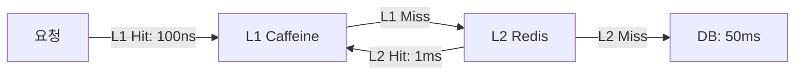
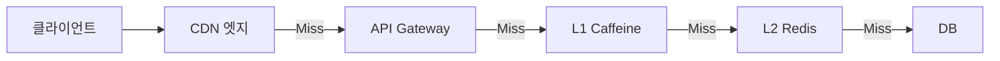
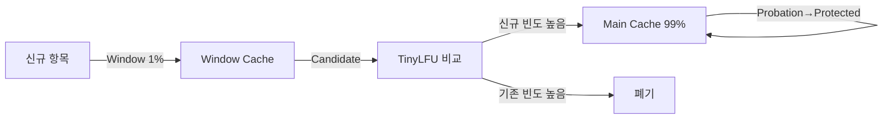
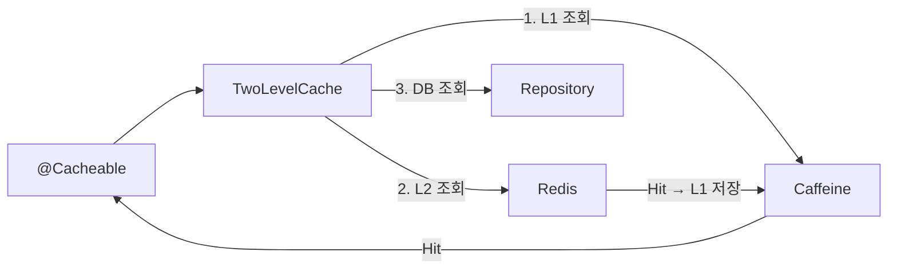
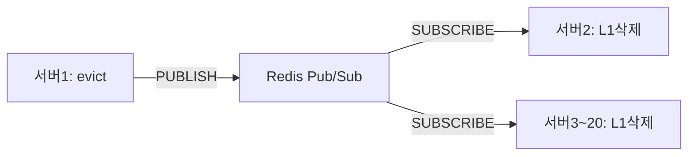
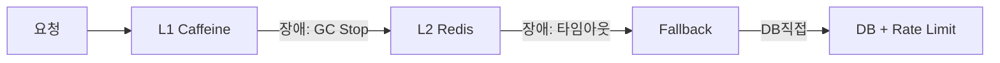
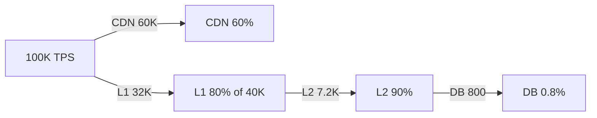
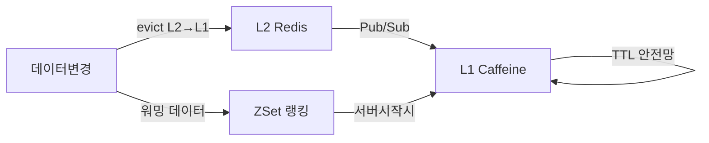

멀티 레이어 캐싱은 응답 속도가 다른 여러 계층의 캐시를 겹겹이 쌓아, 가장 빠른 계층에서 최대한 많은 요청을 소화하고 느린 계층으로는 최소한의 요청만 내려보내는 아키텍처다. 잘 설계된 멀티 레이어 캐시는 100K TPS 중 DB에 실제로 도달하는 요청을 0.5% 이하로 줄인다.

> **비유:** 도서관 사서가 책을 찾아주는 방식을 생각해보자. 사서의 책상 위에 오늘 가장 많이 찾은 10권(L1)이 있다. 그 뒤 열람실 서가에 이번 달 인기 도서 1,000권(L2)이 있다. 지하 서고에는 전체 장서 100만 권(DB)이 있다. 사서는 책상 위를 먼저 뒤지고, 없으면 서가로, 그래도 없으면 지하 서고까지 내려간다. 멀티 레이어 캐싱은 이 원리를 소프트웨어에 구현한 것이다.

---

## 왜 캐시를 여러 계층으로 나누는가 — 단일 Redis의 한계

단일 Redis(L2)만 사용해도 DB 대비 10~100배 빠르다. 하지만 트래픽이 임계점을 넘으면 세 가지 벽에 부딪힌다.

### 벽 1: 네트워크 RTT의 누적

Redis 응답이 아무리 빨라도 네트워크 왕복(RTT)은 0.5~2ms 걸린다. 한 API 요청이 캐시를 20번 조회하면 네트워크에서만 10~40ms가 소모된다. L1(JVM 힙)은 네트워크가 없으므로 100ns. 20번 조회해도 2μs에 불과하다. 차이가 10,000배다.

### 벽 2: Redis 집중 부하

서버 20대, 각 서버가 초당 5,000 요청을 처리한다고 가정하면 Redis는 100K ops/sec를 감당해야 한다. Redis 단일 인스턴스 한계는 약 100K~200K ops/sec다. L1으로 80%를 흡수하면 Redis에는 20K ops/sec만 도달한다. 같은 Redis가 5배 여유가 생긴다.

### 벽 3: 단일 장애점

Redis가 다운되면 모든 서버가 동시에 DB로 직행한다. L1이 버퍼로 존재하면 Redis 장애 동안에도 L1 TTL 시간(30초)만큼 서비스가 유지된다.



---

## 캐시 계층 전체 구조와 각 계층의 역할

실제 프로덕션에서는 최대 5단계 계층이 존재한다. 각 계층은 처리 속도, 용량, 일관성 보장 수준이 모두 다르다.



### 계층별 특성 비교

| 계층 | 응답 시간 | 용량 | 일관성 | 주요 데이터 |
|------|----------|------|--------|------------|
| CDN | 5~50ms | 사실상 무제한 | 낮음 | 정적 파일, 공개 API |
| API Gateway | 1~5ms | 수백 MB | 낮음 | 인증 토큰, Rate Limit |
| L1 Caffeine | ~100ns | 수백 MB (힙) | 서버별 상이 | Hot 데이터 |
| L2 Redis | 0.5~2ms | 수십 GB | 높음 | 세션, 상품, 공유 데이터 |
| DB | 5~200ms | 무제한 | 완벽 | 원본 데이터 |

> **비유:** 인체의 반응 계층과 같다. 뜨거운 것에 손이 닿으면 반사 신경(L1, 나노초)이 먼저 손을 뗀다. 뇌에서 "왜 뜨겁지?"를 생각하기(DB) 전에 이미 손이 피했다. 각 계층이 자신이 처리할 수 있는 수준의 자극을 맡아서, 전체 응답이 빨라진다.

---

## L1 Local Cache — Caffeine 내부 동작 완전 해부

### Caffeine을 선택하는 이유: W-TinyLFU 알고리즘

Java 로컬 캐시 라이브러리는 Guava Cache, EhCache, Caffeine이 있다. Caffeine이 표준이 된 이유는 **W-TinyLFU(Window TinyLeast Frequently Used)** 알고리즘 때문이다.

LRU의 치명적 약점은 **Cache Pollution**이다. 한 번만 접근되는 대용량 스캔(예: 새벽 배치 작업)이 자주 쓰이는 핫 데이터를 캐시에서 밀어낸다. LRU는 "최근에 접근했냐"만 보기 때문이다.

W-TinyLFU는 두 가지 질문을 동시에 묻는다.
- "최근에 접근했냐?" (Recency)
- "얼마나 자주 접근됐냐?" (Frequency)



**Frequency Count는 Count-Min Sketch로 구현된다.** 일반 HashMap으로 빈도를 세면 메모리가 폭발한다. Count-Min Sketch는 여러 개의 해시 함수와 2D 배열로 오차 허용 범위 내에서 빈도를 추정한다. 메모리는 O(1)이다.

```
Count-Min Sketch 예시 (4 hash functions × 8 buckets):
항목 A: hash1=2, hash2=5, hash3=1, hash4=6 → 각 위치에 +1
빈도 추정 = min(버킷[h1][2], 버킷[h2][5], 버킷[h3][1], 버킷[h4][6])
```

이 덕분에 Caffeine은 같은 메모리에서 LRU 대비 **15~20% 높은 Hit Rate**를 달성한다. 실측 데이터: Wikipedia 트래픽 기준 LRU 78% Hit Rate vs W-TinyLFU 93%.

### Caffeine Spring 통합 설정

```java
@Configuration
public class CaffeineL1Config {

    /**
     * 캐시별 세밀한 설정 — 데이터 성격에 따라 maximumSize와 TTL이 다르다.
     *
     * WHY maximumSize 분리:
     *   상품(hotProducts): 자주 바뀌므로 TTL 짧게, 수가 많으므로 용량 작게
     *   사용자(userProfile): 덜 바뀌므로 TTL 길게, 수가 더 많으므로 용량 크게
     */
    @Bean
    public CaffeineCacheManager caffeineCacheManager() {
        CaffeineCacheManager manager = new CaffeineCacheManager();

        // 기본 설정 (특별 설정이 없는 캐시에 적용)
        manager.setCaffeine(Caffeine.newBuilder()
            .maximumSize(5_000)
            .expireAfterWrite(Duration.ofSeconds(30))
            .recordStats());  // 반드시 켜야 Prometheus 메트릭 수집 가능

        // 캐시별 개별 설정
        manager.registerCustomCache("hotProducts",
            Caffeine.newBuilder()
                .maximumSize(1_000)
                .expireAfterWrite(Duration.ofSeconds(10))
                // WHY expireAfterWrite vs expireAfterAccess:
                //   - expireAfterWrite: 쓰기 후 고정 TTL. 데이터 신선도 보장
                //   - expireAfterAccess: 마지막 접근 후 TTL. 아무도 안 쓰면 자동 제거
                //   재고처럼 자주 바뀌는 데이터는 expireAfterWrite가 안전
                .recordStats()
                .build());

        manager.registerCustomCache("userProfile",
            Caffeine.newBuilder()
                .maximumSize(50_000)
                .expireAfterWrite(Duration.ofMinutes(5))
                .expireAfterAccess(Duration.ofMinutes(10))
                // WHY 두 가지 TTL 동시 적용:
                //   5분 write TTL: 최대 5분까지만 캐시 유지 (신선도)
                //   10분 access TTL: 5분이 지났어도 최근 10분 내 접근이 있으면 유지
                //   실제 만료 = min(write TTL 남은 시간, access TTL 남은 시간)
                .recordStats()
                .build());

        manager.registerCustomCache("categoryTree",
            Caffeine.newBuilder()
                .maximumSize(100)      // 카테고리 트리는 수가 적음
                .expireAfterWrite(Duration.ofMinutes(30))
                .refreshAfterWrite(Duration.ofMinutes(25))
                // WHY refreshAfterWrite:
                //   만료 전 25분에 백그라운드에서 미리 갱신
                //   사용자는 항상 캐시된 데이터를 받음 (만료 공백 없음)
                //   단, Executor를 별도 설정해야 함
                .executor(Executors.newSingleThreadExecutor())
                .recordStats()
                .build());

        return manager;
    }
}
```

### Caffeine의 비동기 Eviction 메커니즘

Caffeine은 Eviction을 **호출 스레드에서 동기 실행하지 않는다.** 내부적으로 링버퍼에 작업을 쌓고, 별도의 유지보수 스레드가 비동기로 처리한다. 이 덕분에 캐시 조회 성능이 일관되게 100ns 수준을 유지한다.

그런데 이 비동기 특성 때문에 `maximumSize(1000)` 설정이 있어도 순간적으로 1,005개가 들어갈 수 있다. 이는 버그가 아니라 의도된 설계다. 성능을 위해 엄격한 경계 대신 약간의 초과를 허용한다.

---

## L2 Remote Cache — Redis 직렬화 비용과 커넥션 풀 설계

### 직렬화 방식 선택이 L2 성능을 결정한다

Redis는 바이트 배열을 저장한다. Java 객체를 Redis에 저장하려면 직렬화가 필요하다. 직렬화 방식 선택이 잘못되면 캐시를 쓰는 의미가 없어진다.

**JDK 직렬화 (사용 금지):**
- 크기: Product 객체 → 수백 바이트 (클래스 메타정보 포함)
- 속도: 느림
- 치명적 단점: 클래스에 필드 하나 추가하면 기존 캐시 전체 역직렬화 실패. `InvalidClassException` 발생으로 전체 캐시 무효화

**GenericJackson2JsonRedisSerializer (권장):**
- 크기: JDK의 30~50% 수준
- 속도: 적당히 빠름
- 장점: 클래스 변경에 유연, 사람이 읽을 수 있어 디버깅 쉬움
- 단점: 타입 정보를 JSON에 포함(`@class` 필드)하므로 보안 주의

**Kryo 또는 MessagePack (극한 성능 요구 시):**
- 크기: JSON의 20~40% 수준
- 속도: JSON보다 5~10배 빠름
- 단점: 스키마 관리 필요, 디버깅 어려움

> **비유:** JDK 직렬화는 책 전체를 팩스로 보내는 것(느리고 형식 변경에 취약). JSON은 책을 타이핑해서 이메일로 보내는 것(읽기 쉽고 유연). Kryo는 책을 압축 파일로 보내는 것(빠르고 작지만 압축 해제 도구가 필요).

```java
@Configuration
public class RedisL2Config {

    /**
     * Lettuce 커넥션 풀 설정
     *
     * WHY Lettuce vs Jedis:
     *   Lettuce: Netty 기반 비동기 논블로킹, 커넥션 하나를 여러 스레드가 공유(멀티플렉싱)
     *   Jedis: 동기 블로킹, 스레드당 커넥션 필요 → 스레드 수만큼 커넥션 필요
     *
     *   서버가 200 스레드를 쓴다면:
     *   Jedis: 커넥션 200개 필요
     *   Lettuce: 커넥션 8~16개로 충분 (멀티플렉싱)
     */
    @Bean
    public LettuceConnectionFactory redisConnectionFactory() {
        // 커넥션 풀 설정 (Lettuce도 풀링 가능)
        GenericObjectPoolConfig<Object> poolConfig = new GenericObjectPoolConfig<>();
        poolConfig.setMaxTotal(16);      // 최대 커넥션 수
        poolConfig.setMaxIdle(8);        // 유휴 커넥션 최대
        poolConfig.setMinIdle(4);        // 유휴 커넥션 최소 (미리 확보)
        poolConfig.setMaxWait(Duration.ofMillis(50));  // 커넥션 대기 최대 50ms

        LettucePoolingClientConfiguration clientConfig =
            LettucePoolingClientConfiguration.builder()
                .poolConfig(poolConfig)
                .commandTimeout(Duration.ofMillis(200))
                // WHY 200ms timeout:
                //   Redis 정상 응답: 1~5ms
                //   200ms에서 타임아웃: Redis가 비정상임을 빠르게 감지
                //   이 타임아웃 없으면 Redis 장애 시 스레드가 수 초간 블로킹
                .build();

        RedisStandaloneConfiguration serverConfig =
            new RedisStandaloneConfiguration("redis-host", 6379);

        return new LettuceConnectionFactory(serverConfig, clientConfig);
    }

    @Bean
    public RedisCacheManager redisCacheManager(RedisConnectionFactory factory) {
        // 타입 정보를 JSON에 포함하되, 신뢰할 수 없는 클래스는 차단
        ObjectMapper objectMapper = new ObjectMapper()
            .activateDefaultTyping(
                LaissezFaireSubTypeValidator.instance,
                ObjectMapper.DefaultTyping.NON_FINAL,
                JsonTypeInfo.As.PROPERTY
            )
            .registerModule(new JavaTimeModule())
            .disable(SerializationFeature.WRITE_DATES_AS_TIMESTAMPS);

        GenericJackson2JsonRedisSerializer serializer =
            new GenericJackson2JsonRedisSerializer(objectMapper);

        RedisCacheConfiguration defaultConfig = RedisCacheConfiguration
            .defaultCacheConfig()
            .entryTtl(Duration.ofMinutes(10))
            .serializeKeysWith(
                RedisSerializationContext.SerializationPair
                    .fromSerializer(new StringRedisSerializer()))
            .serializeValuesWith(
                RedisSerializationContext.SerializationPair
                    .fromSerializer(serializer))
            .disableCachingNullValues();
            // WHY disableCachingNullValues:
            //   null을 캐시하면 DB 조회 시 존재하지 않는 키에 대한 반복 조회를 막을 수 있음
            //   (Cache Penetration 방어를 위해서는 별도로 null 캐싱을 구현해야 함)
            //   여기서는 null 캐싱 로직을 TwoLevelCache에서 별도 제어하므로 기본 비활성화

        // 캐시별 TTL 개별 설정
        Map<String, RedisCacheConfiguration> cacheConfigs = Map.of(
            "hotProducts",   defaultConfig.entryTtl(Duration.ofMinutes(2)),
            "userProfile",   defaultConfig.entryTtl(Duration.ofMinutes(30)),
            "categoryTree",  defaultConfig.entryTtl(Duration.ofHours(2)),
            "inventory",     defaultConfig.entryTtl(Duration.ofSeconds(10)),
            "userSession",   defaultConfig.entryTtl(Duration.ofHours(24))
        );

        return RedisCacheManager.builder(factory)
            .cacheDefaults(defaultConfig)
            .withInitialCacheConfigurations(cacheConfigs)
            .build();
    }

    /**
     * 직접 Redis 조작이 필요한 곳을 위한 템플릿
     * (Pub/Sub 발행, ZSet 조작 등 CacheManager로 추상화 불가한 기능)
     */
    @Bean
    public StringRedisTemplate stringRedisTemplate(RedisConnectionFactory factory) {
        return new StringRedisTemplate(factory);
    }

    @Bean
    public RedisTemplate<String, Object> objectRedisTemplate(
            RedisConnectionFactory factory) {
        RedisTemplate<String, Object> template = new RedisTemplate<>();
        template.setConnectionFactory(factory);
        template.setKeySerializer(new StringRedisSerializer());
        template.setValueSerializer(new GenericJackson2JsonRedisSerializer());
        template.setHashKeySerializer(new StringRedisSerializer());
        template.setHashValueSerializer(new GenericJackson2JsonRedisSerializer());
        return template;
    }
}
```

### 직렬화 비용 실측

실측 기준 (Product 객체, 필드 15개, 중첩 List 포함):

| 방식 | 직렬화 시간 | 크기 | 역직렬화 시간 |
|------|------------|------|-------------|
| JDK | ~450μs | 2,400 bytes | ~380μs |
| JSON (Jackson) | ~85μs | 680 bytes | ~95μs |
| Kryo | ~12μs | 210 bytes | ~8μs |

캐시 저장 시 85μs + Redis RTT 1ms = 총 약 1.1ms. Redis가 없었다면 DB 50ms. 캐시 효과는 여전히 45배다. 단, 직렬화 대상 객체가 매우 복잡하거나(수십 MB) 초당 수십만 번 직렬화한다면 Kryo로 전환을 고려해야 한다.

---

## L1 + L2 통합 구현 — TwoLevelCache 완전 구현

### 설계 원칙: L1은 L2의 프록시

`TwoLevelCache`는 Spring의 `Cache` 인터페이스를 구현해서, `@Cacheable`이 사용하는 캐시 추상화 뒤에서 L1/L2를 투명하게 처리한다. 서비스 코드는 캐시 계층을 전혀 모른다.

**TTL 규칙:** L1 TTL은 반드시 L2 TTL보다 짧아야 한다.
- L2(Redis) TTL: 10분
- L1(Caffeine) TTL: 30초

WHY: L1 TTL이 L2보다 길면, L2에서 데이터가 갱신된 후에도 L1에 구 데이터가 남는다. Pub/Sub 무효화가 실패한 최악의 경우에도 L1 TTL 내에 자동 수렴하도록 보장하는 안전망이다.



```java
/**
 * L1(Caffeine) + L2(Redis) 계층 캐시 구현체
 *
 * 핵심 설계 결정:
 * 1. get: L1 → L2 → null 순서. L2 Hit 시 L1에 승격(warming)
 * 2. put: L1과 L2 모두 동시 저장
 * 3. evict: L2 먼저 → L1 → Pub/Sub 브로드캐스트 (순서 중요)
 * 4. null 값 캐싱: Cache Penetration 방어용 별도 마커 사용
 */
public class TwoLevelCache implements Cache {

    private static final Object NULL_MARKER = new Object();
    private static final Logger log = LoggerFactory.getLogger(TwoLevelCache.class);

    private final String name;
    private final Cache l1;           // Caffeine
    private final Cache l2;           // Redis
    private final L1InvalidationPublisher publisher;
    private final MeterRegistry meterRegistry;

    public TwoLevelCache(String name, Cache l1, Cache l2,
                         L1InvalidationPublisher publisher,
                         MeterRegistry meterRegistry) {
        this.name = name;
        this.l1 = l1;
        this.l2 = l2;
        this.publisher = publisher;
        this.meterRegistry = meterRegistry;
    }

    @Override
    public String getName() { return name; }

    @Override
    public Object getNativeCache() { return this; }

    @Override
    public ValueWrapper get(Object key) {
        // 1단계: L1 조회 (~100ns, 네트워크 없음)
        ValueWrapper l1Val = l1.get(key);
        if (l1Val != null) {
            recordHit("l1");
            // null 마커 처리: Cache Penetration 방어용 저장값
            return (l1Val.get() == NULL_MARKER) ? () -> null : l1Val;
        }

        // 2단계: L2 조회 (~1ms, 네트워크 필요)
        ValueWrapper l2Val = l2.get(key);
        if (l2Val != null) {
            recordHit("l2");
            // L2 Hit → L1 승격 (다음 요청은 L1에서 처리)
            Object value = l2Val.get();
            l1.put(key, value == null ? NULL_MARKER : value);
            return (value == null) ? () -> null : l2Val;
        }

        recordMiss();
        return null;  // 전체 Miss → 호출자가 DB 조회
    }

    @Override
    @SuppressWarnings("unchecked")
    public <T> T get(Object key, Class<T> type) {
        ValueWrapper wrapper = get(key);
        if (wrapper == null) return null;
        Object value = wrapper.get();
        if (value == null) return null;
        if (type != null && !type.isInstance(value)) {
            throw new IllegalStateException("Cached value [" + value
                + "] is not of required type [" + type.getName() + "]");
        }
        return (T) value;
    }

    @Override
    public void put(Object key, Object value) {
        Object storeValue = (value == null) ? NULL_MARKER : value;
        // L1과 L2 동시 저장
        l1.put(key, storeValue);
        l2.put(key, value);  // Redis CacheManager가 null 처리
    }

    @Override
    public ValueWrapper putIfAbsent(Object key, Object value) {
        ValueWrapper existing = get(key);
        if (existing != null) return existing;
        put(key, value);
        return null;
    }

    @Override
    public void evict(Object key) {
        /**
         * WHY L2 먼저 삭제하는가:
         *
         * 잘못된 순서 (L1 먼저):
         *   1. L1 삭제 → 다른 스레드가 L2에서 구 데이터를 읽어 L1에 승격
         *   2. L2 삭제 → 이미 L1에 구 데이터가 다시 들어온 상태
         *   결과: L1에 구 데이터가 TTL 동안 잔존
         *
         * 올바른 순서 (L2 먼저):
         *   1. L2 삭제 → L2에 더 이상 구 데이터 없음
         *   2. L1 삭제 → 로컬 캐시 정리
         *   3. Pub/Sub → 다른 서버 L1 정리
         *   결과: 이후 어느 계층에서 조회해도 구 데이터 없음
         */
        l2.evict(key);      // L2(Redis) 먼저
        l1.evict(key);      // L1(로컬) 다음
        publisher.publishEviction(name, key.toString());  // 다른 서버 L1도 삭제
    }

    @Override
    public void clear() {
        l2.clear();
        l1.clear();
        publisher.publishClear(name);
    }

    private void recordHit(String layer) {
        meterRegistry.counter("cache.hit",
            "cache", name, "layer", layer).increment();
    }

    private void recordMiss() {
        meterRegistry.counter("cache.miss", "cache", name).increment();
    }
}
```

### CacheManager 등록과 서비스 사용

```java
@Configuration
@RequiredArgsConstructor
public class TwoLevelCacheConfig {

    private final CaffeineCacheManager caffeineManager;
    private final RedisCacheManager redisManager;
    private final L1InvalidationPublisher publisher;
    private final MeterRegistry meterRegistry;

    @Bean
    @Primary
    public CacheManager twoLevelCacheManager() {
        return new AbstractCacheManager() {
            @Override
            protected Collection<? extends Cache> loadCaches() {
                // Spring 초기화 시 등록된 캐시 이름 목록으로 TwoLevelCache 생성
                return caffeineManager.getCacheNames().stream()
                    .map(name -> {
                        Cache l1 = caffeineManager.getCache(name);
                        Cache l2 = redisManager.getCache(name);
                        return new TwoLevelCache(name, l1, l2,
                            publisher, meterRegistry);
                    })
                    .collect(Collectors.toList());
            }
        };
    }
}
```

```java
/**
 * 서비스 코드는 캐시 계층을 전혀 모른다 — Spring Cache 추상화의 핵심 가치
 *
 * @Cacheable: L1 Hit이면 메서드 자체를 실행하지 않음
 * @CacheEvict: 메서드 성공 후 L1/L2/Pub/Sub 순서로 자동 무효화
 * @CachePut: 무조건 실행하고 결과를 캐시에 저장 (갱신 시 사용)
 */
@Service
@RequiredArgsConstructor
public class ProductService {

    private final ProductRepository productRepository;

    @Cacheable(value = "hotProducts", key = "#productId",
               unless = "#result == null")
    public Product getProduct(Long productId) {
        // L1 Hit이면 이 메서드 자체가 호출되지 않음
        return productRepository.findById(productId)
            .orElseThrow(() -> new ProductNotFoundException(productId));
    }

    @CacheEvict(value = "hotProducts", key = "#productId")
    @Transactional
    public void updateProduct(Long productId, ProductUpdateRequest req) {
        // @CacheEvict가 트랜잭션 커밋 후 실행되도록 하려면
        // @TransactionalEventListener와 조합해야 함 (아래 심화 참고)
        Product product = productRepository.findById(productId).orElseThrow();
        product.update(req);
    }

    @CachePut(value = "hotProducts", key = "#result.id")
    @Transactional
    public Product createProduct(ProductCreateRequest req) {
        Product product = productRepository.save(Product.from(req));
        return product;
        // @CachePut: 메서드 반환값을 캐시에 저장. DB 저장 후 즉시 캐시도 갱신
    }

    /**
     * WHY @CacheEvict를 트랜잭션 커밋 후에 실행해야 하는가:
     *
     * 문제 시나리오:
     *   1. TX 시작 → DB 업데이트
     *   2. @CacheEvict 실행 → 캐시 삭제
     *   3. 다른 요청이 캐시 Miss → DB 조회 → 아직 TX 미커밋 구 데이터 읽음 → 캐시 저장
     *   4. TX 커밋 → DB에는 새 데이터, 캐시에는 구 데이터 잔존
     *
     * 해결: 트랜잭션 커밋 이벤트 후 캐시 무효화
     */
    @Transactional
    public void updateProductSafe(Long productId, ProductUpdateRequest req) {
        Product product = productRepository.findById(productId).orElseThrow();
        product.update(req);
        // 이벤트를 발행하면 TransactionSynchronizationManager가
        // 커밋 후 처리해줌
        eventPublisher.publishEvent(new ProductUpdatedEvent(productId));
    }
}

@Component
@RequiredArgsConstructor
class ProductCacheEvictListener {

    private final CacheManager cacheManager;

    @TransactionalEventListener(phase = TransactionPhase.AFTER_COMMIT)
    public void onProductUpdated(ProductUpdatedEvent event) {
        Cache cache = cacheManager.getCache("hotProducts");
        if (cache != null) {
            cache.evict(event.getProductId());
        }
        // evict 내부에서 Pub/Sub도 자동 발행됨
    }
}
```

---

## L1 일관성 프로토콜 — Pub/Sub 무효화 심층 분석

### 멀티 인스턴스 환경의 L1 불일치 문제

서버 20대가 모두 자체 JVM 힙에 L1 캐시를 가진다. 서버 1번에서 상품 가격을 수정하면:
- 서버 1번: L1 캐시 삭제 완료
- 서버 2~20번: L1에 여전히 구 가격이 캐시되어 있음

L2(Redis)는 서버 1번이 업데이트했으므로 최신이다. 하지만 서버 2~20번은 L1에서 구 데이터를 반환한다. L1 TTL(30초)이 지나야 자동 수렴한다. 30초 동안 잘못된 가격이 노출될 수 있다.

**Redis Pub/Sub으로 즉시 브로드캐스트:**



```java
/**
 * L1 무효화 메시지 발행
 *
 * 메시지 형식: "cacheName|key" (파이프 구분)
 * WHY 파이프 구분자: 캐시 이름과 키 모두 문자열이므로 구분자 필요
 *     콜론(:)은 Redis 키 네이밍에서 사용하므로 파이프 선택
 */
@Component
@RequiredArgsConstructor
@Slf4j
public class L1InvalidationPublisher {

    private final StringRedisTemplate redisTemplate;

    public static final String CHANNEL_INVALIDATE = "l1:invalidate";
    public static final String CHANNEL_CLEAR = "l1:clear";

    // 서버 식별자 — 자기 자신이 보낸 메시지를 구별하기 위함
    private final String serverId = UUID.randomUUID().toString();

    public void publishEviction(String cacheName, String key) {
        String message = serverId + "|" + cacheName + "|" + key;
        try {
            redisTemplate.convertAndSend(CHANNEL_INVALIDATE, message);
        } catch (Exception e) {
            // WHY 발행 실패를 무시하는가:
            //   Pub/Sub 발행 실패는 단지 다른 서버의 L1 삭제가 안 될 뿐
            //   L2(Redis)는 이미 삭제됨. 다른 서버는 L1 TTL 후 자연 수렴
            //   발행 실패를 던지면 원래 evict 연산 전체가 실패함 — 과도한 처리
            log.warn("L1 무효화 브로드캐스트 실패: cacheName={}, key={}", cacheName, key, e);
        }
    }

    public void publishClear(String cacheName) {
        String message = serverId + "|" + cacheName;
        try {
            redisTemplate.convertAndSend(CHANNEL_CLEAR, message);
        } catch (Exception e) {
            log.warn("L1 전체 무효화 브로드캐스트 실패: cacheName={}", cacheName, e);
        }
    }

    public String getServerId() { return serverId; }
}

/**
 * 다른 서버에서 보낸 L1 무효화 메시지 수신
 *
 * 모든 서버(자신 포함)가 이 Subscriber를 등록한다.
 * 자기 자신이 보낸 메시지도 수신하지만, 이미 evict했으므로 중복 삭제는 무해하다.
 */
@Component
@RequiredArgsConstructor
@Slf4j
public class L1InvalidationSubscriber implements MessageListener {

    private final CaffeineCacheManager caffeineManager;
    private final L1InvalidationPublisher publisher;

    @Override
    public void onMessage(Message message, byte[] pattern) {
        String payload = new String(message.getBody(), StandardCharsets.UTF_8);
        String[] parts = payload.split("\\|", 3);

        if (parts.length < 3) {
            log.warn("잘못된 무효화 메시지 형식: {}", payload);
            return;
        }

        String senderId = parts[0];
        String cacheName = parts[1];
        String key = parts[2];

        // 자신이 보낸 메시지: 이미 evict했으므로 건너뜀 (성능 최적화)
        // 단, 건너뛰지 않아도 중복 삭제라 부작용은 없음
        if (publisher.getServerId().equals(senderId)) {
            return;
        }

        Cache cache = caffeineManager.getCache(cacheName);
        if (cache != null) {
            cache.evict(key);
            log.debug("원격 L1 무효화 완료: cache={}, key={}", cacheName, key);
        }
    }
}

/**
 * Redis Pub/Sub 리스너 등록 설정
 */
@Configuration
@RequiredArgsConstructor
public class RedisPubSubConfig {

    private final L1InvalidationSubscriber invalidationSubscriber;
    private final RedisConnectionFactory connectionFactory;

    @Bean
    public RedisMessageListenerContainer redisMessageListenerContainer() {
        RedisMessageListenerContainer container =
            new RedisMessageListenerContainer();
        container.setConnectionFactory(connectionFactory);

        // L1 개별 키 무효화 구독
        container.addMessageListener(
            invalidationSubscriber,
            new ChannelTopic(L1InvalidationPublisher.CHANNEL_INVALIDATE));

        // L1 전체 캐시 무효화 구독
        container.addMessageListener(
            new L1ClearSubscriber(invalidationSubscriber),
            new ChannelTopic(L1InvalidationPublisher.CHANNEL_CLEAR));

        // WHY 별도 스레드 풀:
        //   기본 스레드 풀 공유 시, 무효화 메시지 처리 지연이 다른 Redis 작업 영향
        container.setTaskExecutor(Executors.newFixedThreadPool(4));

        return container;
    }
}
```

### Pub/Sub의 한계와 보완 전략

Pub/Sub은 **at-most-once** 전달을 보장한다. 메시지가 유실될 수 있다.

**유실 시나리오:**
1. 서버 B가 Redis에 연결되지 않은 순간 메시지 발행 → 서버 B 수신 불가
2. Redis 재시작 → 발행 중이던 메시지 유실

**보완 전략 조합:**

```java
/**
 * 보완 전략 1: 짧은 L1 TTL (최후 안전망)
 * L1 TTL = 30초. Pub/Sub 유실이 있어도 30초 후 자연 수렴.
 * 30초의 불일치를 수용할 수 없는 데이터라면 L1 캐시 자체를 쓰지 말 것.
 */

/**
 * 보완 전략 2: 버전 기반 무효화 (Pub/Sub 대체 또는 보완)
 * 데이터에 버전 번호를 부여. 캐시 조회 시 버전 비교.
 * 버전이 다르면 즉시 무효화.
 */
@Cacheable(value = "hotProducts", key = "#productId")
public VersionedProduct getProduct(Long productId) {
    String cacheVersion = redisTemplate.opsForValue()
        .get("product:version:" + productId);
    // 버전 불일치 시 강제 갱신 로직 필요 (복잡도 증가)
    return productRepository.findById(productId)
        .map(VersionedProduct::from).orElseThrow();
}

/**
 * 보완 전략 3: Redis Keyspace Notification 활용
 * Redis 자체에서 키 변경/만료 이벤트를 발행하게 해서
 * 별도 Pub/Sub 발행 없이 L1 동기화
 *
 * redis.conf: notify-keyspace-events "Ex"
 * 채널: __keyevent@0__:expired
 *
 * 단점: Redis 서버 부하 증가, 모든 키 이벤트가 발행됨
 */
@Component
public class RedisKeyspaceSubscriber implements MessageListener {
    @Override
    public void onMessage(Message message, byte[] pattern) {
        String expiredKey = new String(message.getBody());
        // "cache::hotProducts::12345" 형식으로 파싱
        if (expiredKey.startsWith("cache::")) {
            String[] parts = expiredKey.split("::", 3);
            // L1에서 해당 키 제거
        }
    }
}
```

---

## Cache Stampede 방어 — 각 계층별 전략

### Stampede란 무엇인가

인기 캐시 항목이 만료되는 순간, 동시에 수백~수천 개의 요청이 모두 캐시 Miss를 경험하고 DB로 동시에 몰린다. DB는 순간적으로 폭발적 부하를 받는다. 이를 **Cache Stampede** 또는 **Thundering Herd**라고 한다.

> **비유:** 인기 콘서트 티켓이 오전 10시에 풀린다. 10시 정각에 수십만 명이 동시에 예매 페이지에 접속한다. 서버가 이 순간 폭발한다. 멀티 레이어 캐시에서 한 계층의 인기 항목이 만료될 때 이런 현상이 발생한다.

### L1 계층 Stampede 방어: Caffeine의 refreshAfterWrite

```java
/**
 * refreshAfterWrite: 만료 전 백그라운드에서 미리 갱신
 *
 * expireAfterWrite(30s): 30초 후 완전 만료 → 요청 시 동기 재로딩 (Stampede 발생)
 * refreshAfterWrite(25s): 25초 후 백그라운드 재로딩 → 30초 전에 갱신 완료
 *
 * 주의: refreshAfterWrite는 CacheLoader가 필요.
 *       Spring Cache 추상화에서는 직접 Caffeine 캐시를 사용해야 함.
 */
@Bean
public com.github.benmanes.caffeine.cache.Cache<Long, Product> productL1Cache(
        ProductRepository productRepository) {
    return Caffeine.newBuilder()
        .maximumSize(1_000)
        .refreshAfterWrite(Duration.ofSeconds(25))
        .expireAfterWrite(Duration.ofSeconds(30))
        .build(key -> productRepository.findById(key).orElse(null));
        // CacheLoader: 캐시 Miss 또는 refresh 시 자동 호출
        // 단일 요청만 DB 조회, 나머지는 구 데이터 반환 (스탬피드 방어)
}
```

### L2 계층 Stampede 방어: Redis 분산 락

```java
/**
 * Redis 분산 락으로 L2 Miss 시 단 하나의 요청만 DB 조회
 *
 * 문제: 100개 요청이 동시에 L2 Miss → 100개가 동시에 DB 조회
 * 해결: 락 획득한 1개만 DB 조회 → L2 저장 → 나머지 99개는 L2에서 반환
 */
@Component
@RequiredArgsConstructor
@Slf4j
public class StampedeProtectedCache {

    private final RedisTemplate<String, Object> redisTemplate;
    private final ProductRepository productRepository;

    private static final Duration LOCK_TIMEOUT = Duration.ofSeconds(5);
    private static final Duration WAIT_TIMEOUT = Duration.ofSeconds(3);
    private static final String LOCK_PREFIX = "lock:cache:";

    public Product getProductWithProtection(Long productId) {
        String cacheKey = "product:" + productId;
        String lockKey = LOCK_PREFIX + cacheKey;

        // 1단계: L2 조회
        Product cached = (Product) redisTemplate.opsForValue().get(cacheKey);
        if (cached != null) return cached;

        // 2단계: L2 Miss → 분산 락 시도
        String lockValue = UUID.randomUUID().toString();
        Boolean locked = redisTemplate.opsForValue()
            .setIfAbsent(lockKey, lockValue, LOCK_TIMEOUT);

        if (Boolean.TRUE.equals(locked)) {
            // 락 획득 성공 → 이 서버만 DB 조회
            try {
                // Double-check: 락 대기 중 다른 서버가 이미 캐시했을 수 있음
                cached = (Product) redisTemplate.opsForValue().get(cacheKey);
                if (cached != null) return cached;

                Product product = productRepository.findById(productId).orElseThrow();
                redisTemplate.opsForValue().set(cacheKey, product,
                    Duration.ofMinutes(10));
                return product;
            } finally {
                // 자신이 건 락만 해제 (Lua 스크립트로 원자적 실행)
                releaseLock(lockKey, lockValue);
            }
        } else {
            // 락 획득 실패 → 다른 서버가 DB 조회 중. 완료될 때까지 대기 후 재시도
            return waitAndRetry(cacheKey, productId);
        }
    }

    private Product waitAndRetry(String cacheKey, Long productId) {
        long deadline = System.currentTimeMillis() + WAIT_TIMEOUT.toMillis();
        while (System.currentTimeMillis() < deadline) {
            try {
                Thread.sleep(50);  // 50ms 간격 폴링
            } catch (InterruptedException e) {
                Thread.currentThread().interrupt();
                break;
            }
            Product product = (Product) redisTemplate.opsForValue().get(cacheKey);
            if (product != null) return product;
        }
        // 타임아웃: 락 보유자가 실패한 경우. DB 직접 조회 (폴백)
        log.warn("캐시 대기 타임아웃, DB 직접 조회: productId={}", productId);
        return productRepository.findById(productId).orElseThrow();
    }

    /**
     * Lua 스크립트로 원자적 락 해제
     * WHY Lua: GET → 비교 → DEL을 단일 원자 연산으로 실행
     *          GET과 DEL 사이에 다른 서버가 락을 재획득했을 경우를 방지
     */
    private static final String RELEASE_SCRIPT =
        "if redis.call('get', KEYS[1]) == ARGV[1] then " +
        "  return redis.call('del', KEYS[1]) " +
        "else " +
        "  return 0 " +
        "end";

    private void releaseLock(String lockKey, String lockValue) {
        redisTemplate.execute(
            new DefaultRedisScript<>(RELEASE_SCRIPT, Long.class),
            Collections.singletonList(lockKey),
            lockValue
        );
    }
}
```

### 확률적 조기 만료 (Probabilistic Early Expiration)

분산 락은 구현 복잡도가 높다. 더 간단한 대안이 **XFetch 알고리즘** 기반의 확률적 조기 만료다.

```java
/**
 * XFetch: 만료가 가까울수록 더 높은 확률로 조기 갱신
 *
 * 공식: currentTime - delta * beta * ln(random()) > expireTime - ttl
 * 만료까지 시간이 짧을수록 ln(random())이 음수가 되면서 조기 갱신 확률 증가
 *
 * delta: 재계산 소요 시간 (DB 조회 시간, 예: 0.05초)
 * beta: 조기 갱신 적극성 (기본 1.0, 높을수록 더 일찍 갱신)
 */
@Component
@RequiredArgsConstructor
public class XFetchCache {

    private final RedisTemplate<String, Object> redisTemplate;
    private final ProductRepository productRepository;

    private static final double BETA = 1.0;

    public Product getWithXFetch(Long productId) {
        String key = "product:xfetch:" + productId;
        String metaKey = key + ":meta";  // TTL 메타 정보 저장

        Product cached = (Product) redisTemplate.opsForValue().get(key);

        if (cached != null) {
            // 남은 TTL 확인
            Long remainingTtl = redisTemplate.getExpire(key, TimeUnit.MILLISECONDS);
            Long originalTtl = (Long) redisTemplate.opsForValue().get(metaKey);

            if (remainingTtl != null && originalTtl != null && remainingTtl > 0) {
                // 재계산 소요 시간 추정 (여기서는 50ms로 가정)
                double delta = 0.05;  // 50ms = 0.05초

                // XFetch 공식으로 조기 갱신 여부 결정
                double randomFactor = -Math.log(Math.random()) * delta * BETA;
                double threshold = (double) remainingTtl / 1000;  // 초 단위

                if (randomFactor > threshold) {
                    // 조기 갱신 결정: 백그라운드에서 갱신
                    CompletableFuture.runAsync(() -> refresh(productId, key, metaKey));
                }
            }
            return cached;
        }

        return refresh(productId, key, metaKey);
    }

    private Product refresh(Long productId, String key, String metaKey) {
        Duration ttl = Duration.ofMinutes(10);
        Product product = productRepository.findById(productId).orElseThrow();
        redisTemplate.opsForValue().set(key, product, ttl);
        redisTemplate.opsForValue().set(metaKey,
            ttl.toMillis(), ttl.plus(Duration.ofMinutes(1)));
        return product;
    }
}
```

---

## Cache Warming 전략 — Cold Start를 막아라

### Cold Start가 위험한 이유

서버 20대를 동시 재시작하면 모든 L1이 비어있다. 재시작 직후 25K TPS가 L2(Redis)로 몰리고, Redis Hit이라도 Redis 부하가 5배 증가한다. Redis마저 Miss라면 5K TPS가 DB로 몰린다. DB가 순식간에 폭발한다.

> **비유:** 새벽에 편의점 점장이 교체됐다. 신임 점장은 어떤 상품이 인기인지 모른다. 매장 앞에는 이미 고객 100명이 줄 서 있다. 점장이 "어떤 거 드릴까요?"를 100번 반복하면서 창고를 왔다 갔다 하면 혼란이 온다. 미리 인수인계 리스트를 받아서 진열해두면 고객이 와도 즉시 응대 가능하다.

### 계층 1: ApplicationRunner 기반 동기 워밍

```java
/**
 * 서버 시작 시 L2(Redis)에서 인기 데이터를 L1(Caffeine)에 미리 로드
 *
 * 워밍 전략:
 *   1. Redis ZSet "cache:access:rank"에 접근 횟수를 기록해둠
 *   2. 서버 시작 시 상위 N개 키를 L1에 미리 로드
 *   3. L1이 채워진 후 트래픽 수신 시작
 */
@Component
@RequiredArgsConstructor
@Slf4j
public class CacheWarmupRunner implements ApplicationRunner {

    private final RedisTemplate<String, Object> redisTemplate;
    private final CaffeineCacheManager caffeineManager;
    private final ProductRepository productRepository;

    private static final int WARMUP_SIZE = 1_000;
    private static final String RANK_KEY = "cache:access:rank:hotProducts";

    @Override
    public void run(ApplicationArguments args) throws Exception {
        log.info("L1 캐시 워밍 시작");
        Instant start = Instant.now();

        try {
            warmupHotProducts();
            warmupCategoryTree();
        } catch (Exception e) {
            // WHY 예외를 삼키는가:
            //   워밍 실패는 치명적 오류가 아님. L1이 비어도 L2/DB 폴백 동작
            //   워밍 실패로 서버 시작 자체를 막으면 장애 복구가 더 어려워짐
            log.error("L1 캐시 워밍 실패 — L2/DB 폴백으로 운영 계속", e);
        }

        Duration elapsed = Duration.between(start, Instant.now());
        log.info("L1 캐시 워밍 완료: {}ms 소요", elapsed.toMillis());
    }

    private void warmupHotProducts() {
        Cache l1 = caffeineManager.getCache("hotProducts");
        if (l1 == null) return;

        // Redis ZSet에서 접근 횟수 상위 N개 키 조회
        Set<String> hotKeys = redisTemplate.<String, Double>opsForZSet()
            .reverseRange(RANK_KEY, 0, WARMUP_SIZE - 1);

        if (hotKeys == null || hotKeys.isEmpty()) {
            // 첫 배포: 접근 기록 없음 → DB에서 최신 인기 상품 쿼리
            log.info("접근 기록 없음 — DB 기반 초기 워밍 실행");
            productRepository.findTop1000ByOrderByViewCountDesc()
                .forEach(p -> l1.put(p.getId(), p));
            return;
        }

        // L2(Redis)에서 배치 조회 (파이프라인으로 최적화)
        List<Object> values = redisTemplate.executePipelined((RedisCallback<Object>) conn -> {
            for (String key : hotKeys) {
                conn.stringCommands().get(key.getBytes(StandardCharsets.UTF_8));
            }
            return null;
        });

        int loaded = 0;
        List<String> keyList = new ArrayList<>(hotKeys);
        for (int i = 0; i < keyList.size(); i++) {
            Object value = values.get(i);
            if (value instanceof Product product) {
                String rawKey = keyList.get(i);
                // "hotProducts::12345" → "12345"
                String cacheKey = rawKey.contains("::")
                    ? rawKey.substring(rawKey.lastIndexOf("::") + 2)
                    : rawKey;
                l1.put(cacheKey, product);
                loaded++;
            }
        }
        log.info("hotProducts L1 워밍: {}/{} 항목 로드", loaded, hotKeys.size());
    }

    private void warmupCategoryTree() {
        Cache l1 = caffeineManager.getCache("categoryTree");
        if (l1 == null) return;
        // 카테고리는 수가 적으므로 전체 로드
        Object tree = redisTemplate.opsForValue().get("categoryTree::all");
        if (tree != null) {
            l1.put("all", tree);
        }
    }
}
```

### 계층 2: 접근 횟수 기록 (워밍 데이터 수집)

```java
/**
 * 캐시 접근 시 Redis ZSet에 접근 횟수 기록
 * 다음 서버 시작 시 워밍에 활용
 *
 * WHY ZSet:
 *   ZINCRBY: 카운터 원자적 증가
 *   ZREVRANGE: 상위 N개 조회 O(log N)
 *   ZREMRANGEBYRANK: 오래된 통계 정리 O(log N + M)
 */
@Aspect
@Component
@RequiredArgsConstructor
public class CacheAccessRecorder {

    private final StringRedisTemplate redisTemplate;

    @AfterReturning(
        pointcut = "@annotation(cacheable)",
        returning = "result")
    public void recordAccess(JoinPoint jp, Cacheable cacheable, Object result) {
        if (result == null) return;

        String cacheName = cacheable.value()[0];
        Object key = jp.getArgs()[0];  // 단순화: 첫 번째 인자를 키로 사용
        String rankKey = "cache:access:rank:" + cacheName;

        // 비동기 기록 — 기록 실패가 메인 플로우에 영향 없도록
        CompletableFuture.runAsync(() -> {
            try {
                String cacheKey = cacheName + "::" + key;
                redisTemplate.opsForZSet().incrementScore(rankKey, cacheKey, 1);

                // 상위 10,000개만 유지 (메모리 폭발 방지)
                Long size = redisTemplate.opsForZSet().size(rankKey);
                if (size != null && size > 10_000) {
                    redisTemplate.opsForZSet().removeRange(rankKey, 0, size - 10_001);
                }
            } catch (Exception ignored) {
                // 기록 실패는 무시
            }
        });
    }
}
```

### 계층 3: 점진적 트래픽 증가 (Traffic Ramping)

워밍 완료 후에도 트래픽을 한 번에 100% 보내지 말고 점진적으로 늘린다.

```java
/**
 * 서버 시작 후 준비 완료 신호를 단계적으로 전달
 * (쿠버네티스 Readiness Probe 활용)
 *
 * 0~10초: 워밍 중, readiness=false (트래픽 0%)
 * 10초: 워밍 완료, readiness=true (트래픽 100%)
 *
 * 더 세밀한 제어는 로드밸런서 가중치(Weight) 조정으로 구현
 * 예: Nginx upstream weight, AWS ALB target group weight
 */
@Component
@Slf4j
public class WarmupReadinessIndicator implements HealthIndicator {

    private volatile boolean warmupComplete = false;

    public void markWarmupComplete() {
        this.warmupComplete = true;
        log.info("캐시 워밍 완료 — readiness 활성화");
    }

    @Override
    public Health health() {
        return warmupComplete
            ? Health.up().build()
            : Health.down().withDetail("reason", "cache warming in progress").build();
    }
}
```

---

## Fallback 전략 — 각 계층 장애 시 동작

### 계층별 장애 시나리오와 대응



```java
/**
 * 멀티 레이어 Fallback 전략
 *
 * L1 장애 (GC Stop, OOM):
 *   → L2로 바로 진행. L1은 자동 복구. 특별 처리 불필요.
 *
 * L2(Redis) 장애:
 *   → L1으로만 서비스. L1 Miss 시 DB 직접 조회.
 *   → DB 과부하 방지를 위해 Rate Limiter 적용
 *   → Circuit Breaker로 Redis 연속 실패 감지 후 Redis 호출 자체를 건너뜀
 *
 * L1 + L2 동시 장애:
 *   → DB 직접 조회 + 강력한 Rate Limiting
 *   → 일부 요청은 의도적으로 503 반환
 */
@Component
@RequiredArgsConstructor
@Slf4j
public class FallbackAwareProductService {

    private final ProductRepository productRepository;
    private final TwoLevelCacheManager cacheManager;

    // Resilience4j Circuit Breaker — Redis 연속 실패 감지
    @CircuitBreaker(name = "redis", fallbackMethod = "getProductWithoutL2")
    // Resilience4j Rate Limiter — DB 직접 조회 수 제한
    @RateLimiter(name = "dbFallback")
    // Resilience4j Bulkhead — 동시 실행 스레드 제한
    @Bulkhead(name = "dbFallback")
    public Product getProduct(Long productId) {
        // 정상 경로: L1 → L2 → DB
        Cache cache = cacheManager.getCache("hotProducts");
        if (cache != null) {
            Product cached = cache.get(productId, Product.class);
            if (cached != null) return cached;
        }
        Product product = productRepository.findById(productId).orElseThrow();
        if (cache != null) cache.put(productId, product);
        return product;
    }

    /**
     * Circuit Breaker가 OPEN 상태 (Redis 연속 실패)일 때 호출되는 폴백
     * L2 건너뛰고 L1 → DB 직접 조회
     */
    public Product getProductWithoutL2(Long productId, Exception ex) {
        log.warn("Redis Circuit OPEN — L1+DB 직접 조회: productId={}", productId);

        // L1만 조회
        com.github.benmanes.caffeine.cache.Cache<Long, Product> caffeineCache =
            directCaffeineAccess("hotProducts");
        if (caffeineCache != null) {
            Product cached = caffeineCache.getIfPresent(productId);
            if (cached != null) return cached;
        }

        // DB 직접 조회 (Rate Limiter가 과부하 방지)
        Product product = productRepository.findById(productId).orElseThrow();
        if (caffeineCache != null) {
            caffeineCache.put(productId, product);
        }
        return product;
    }
}
```

```yaml
# application.yml — Resilience4j 설정
resilience4j:
  circuitbreaker:
    instances:
      redis:
        slidingWindowSize: 20        # 최근 20회 요청 기준
        failureRateThreshold: 50     # 50% 실패 시 OPEN
        waitDurationInOpenState: 30s # 30초 후 HALF_OPEN
        permittedCallsInHalfOpenState: 5

  ratelimiter:
    instances:
      dbFallback:
        limitForPeriod: 1000          # 1초당 최대 DB 직접 조회 1,000건
        limitRefreshPeriod: 1s
        timeoutDuration: 100ms

  bulkhead:
    instances:
      dbFallback:
        maxConcurrentCalls: 50        # 동시 DB 조회 최대 50개
        maxWaitDuration: 50ms
```

---

## Cache Penetration — 존재하지 않는 키 방어

### 문제: 악의적 또는 잘못된 요청이 캐시를 우회

존재하지 않는 `productId=99999999`로 반복 요청하면:
1. L1 Miss (캐시에 없음)
2. L2 Miss (Redis에도 없음)
3. DB 조회 → 없음 (null 반환)
4. null은 캐시 안 함 → 다음 요청도 1~3 반복
5. 대량 요청 시 DB 폭발

```java
/**
 * Cache Penetration 방어 전략 1: Null 캐싱
 *
 * 없는 데이터도 "없다"는 사실 자체를 캐시
 * 단, 짧은 TTL로 실제로 생성될 경우에 대비
 */
@Cacheable(value = "hotProducts", key = "#productId",
           unless = "false")  // null도 캐시 허용
public Optional<Product> getProductOptional(Long productId) {
    return productRepository.findById(productId);
}

// TwoLevelCache에서 null 마커 처리 (앞서 구현한 NULL_MARKER 활용)
// L1: NULL_MARKER 저장 → get 시 () -> null 반환
// L2: null 값으로 Redis에 저장 (별도 처리 필요)
```

```java
/**
 * Cache Penetration 방어 전략 2: Bloom Filter
 *
 * 존재하는 productId 집합을 Bloom Filter로 관리
 * 요청이 들어오면 Filter에 없으면 즉시 404 반환 (캐시/DB 조회 없음)
 *
 * WHY Bloom Filter:
 *   False Positive(있다고 했는데 없음): 드물게 발생 → DB 조회 → 404 반환 (허용 가능)
 *   False Negative(없다고 했는데 있음): 발생하지 않음 (Bloom Filter 보장)
 *   메모리 효율: 1억 개 ID를 120MB로 관리 (HashMap이면 수 GB 필요)
 */
@Component
@RequiredArgsConstructor
public class ProductBloomFilter {

    private final RedisTemplate<String, Object> redisTemplate;

    // Guava Bloom Filter (로컬) 또는 Redis Bloom (분산)
    private final BloomFilter<Long> localFilter = BloomFilter.create(
        Funnels.longFunnel(),
        100_000_000L,  // 예상 최대 항목 수
        0.01           // 허용 오탐율 1%
    );

    public boolean mightExist(Long productId) {
        return localFilter.mightContain(productId);
        // false: 절대 없음 → 즉시 404
        // true: 있을 수 있음 → 캐시/DB 조회 진행
    }

    public void markExist(Long productId) {
        localFilter.put(productId);
    }

    // 서버 시작 시 기존 ID 모두 로드
    @PostConstruct
    public void init() {
        productRepository.findAllIds()
            .forEach(localFilter::put);
    }
}
```

---

## 직렬화 심층 분석 — GenericJackson2Json의 내부

### @class 필드가 왜 생기는가

`GenericJackson2JsonRedisSerializer`는 역직렬화 시 어떤 클래스로 복원할지 알아야 한다. 이를 위해 JSON에 `@class` 필드를 자동 삽입한다.

```json
{
  "@class": "com.example.domain.Product",
  "id": 12345,
  "name": "맥북 프로",
  "price": 3990000
}
```

**문제:** 패키지 이동(`com.example.domain` → `com.example.catalog`)이나 클래스명 변경 시 기존 캐시 전체 역직렬화 실패.

**해결책 1: @JsonTypeName으로 논리적 이름 부여**

```java
@JsonTypeName("Product")  // 실제 클래스명 대신 논리적 이름 사용
@JsonTypeInfo(use = JsonTypeInfo.Id.NAME)
public class Product {
    // ...
}
```

**해결책 2: TypeResolverBuilder 커스터마이징**

```java
ObjectMapper mapper = new ObjectMapper();
mapper.setDefaultTyping(new ObjectMapper.DefaultTypeResolverBuilder(
    ObjectMapper.DefaultTyping.NON_FINAL) {
    @Override
    public boolean useForType(JavaType t) {
        // 인터페이스와 추상 클래스만 타입 정보 포함
        // 구체 클래스는 타입 정보 제외 → @class 필드 없음
        return t.isAbstract() || t.isInterface();
    }
});
```

**해결책 3: 별도 DTO 사용**

도메인 모델(JPA 엔티티)을 직접 캐시하지 말고 전용 캐시 DTO를 만든다.

```java
/**
 * 캐시 전용 DTO
 *
 * WHY 도메인 모델을 직접 캐시하면 안 되는가:
 *   1. JPA Lazy Loading: 직렬화 시 프록시 객체가 N+1 쿼리 유발
 *   2. 순환 참조: Product → Category → Product → ...
 *   3. 불필요한 필드: 내부 필드가 캐시를 통해 외부 노출
 *   4. 클래스 변경 취약성: 도메인 변경이 캐시 직렬화에 영향
 */
@Value  // Lombok immutable DTO
public class ProductCacheDto {
    Long id;
    String name;
    int price;
    String categoryName;
    // 필요한 필드만 포함

    public static ProductCacheDto from(Product product) {
        return new ProductCacheDto(
            product.getId(),
            product.getName(),
            product.getPrice(),
            product.getCategory().getName()  // Lazy 필드 명시적 접근
        );
    }
}
```

---

## 면접 포인트 5개 — 깊은 WHY 답변

<details>
<summary>펼쳐보기</summary>


### Q1: "L1과 L2 캐시를 왜 분리하나요? Redis만 쓰면 안 되나요?"

**표면 답변:** L1은 네트워크가 없어서 빠릅니다.

**깊은 WHY 답변:**

Redis만 쓸 때의 세 가지 물리적 한계를 극복하기 위해서입니다.

**첫 번째는 네트워크 RTT 누적입니다.** Redis 응답은 1~2ms지만, 한 API 요청에 캐시 조회가 20회이면 순수 네트워크 대기만 20~40ms입니다. L1(JVM 힙)은 RTT가 0이므로 20회 조회해도 2μs입니다. 이 차이가 전체 응답 지연의 대부분을 차지합니다.

**두 번째는 Redis 스케일 한계입니다.** 서버 20대, 각 서버 5K TPS면 Redis에 100K ops/sec가 몰립니다. Redis 단일 인스턴스 한계입니다. L1이 80%를 흡수하면 Redis에는 20K ops/sec만 도달합니다. L1 Hit Rate 80%가 Redis 비용을 5배 절감합니다.

**세 번째는 장애 격리입니다.** Redis가 다운되면 L1이 TTL 시간(30초)만큼 서비스를 유지합니다. 단일 Redis라면 즉시 DB로 모든 트래픽이 몰려 연쇄 장애가 발생합니다.

**극한 시나리오:** Redis 장애 + L1 TTL 30초. 30초 동안 L1에서 서비스하고 Redis 복구를 기다립니다. 단일 Redis였다면 30초 동안 DB에 풀 트래픽이 몰려 DB도 다운됩니다.

---

### Q2: "L1 캐시 일관성은 어떻게 보장하나요?"

**표면 답변:** Redis Pub/Sub으로 다른 서버 L1을 삭제합니다.

**깊은 WHY 답변:**

세 가지 메커니즘을 계층적으로 조합합니다.

**첫 번째는 TTL 기반 자연 수렴(최후 안전망)입니다.** L1 TTL을 30초로 설정하면, Pub/Sub이 완전히 실패해도 30초 후에는 모든 서버가 L2에서 최신 데이터를 읽습니다. 30초의 불일치를 수용할 수 없는 데이터(결제 잔액, 쿠폰 사용 여부)는 애초에 L1에 캐시하지 않습니다.

**두 번째는 Redis Pub/Sub 즉시 무효화입니다.** 데이터 변경 시 `publishEviction(cacheName, key)` 호출로 모든 서버의 L1을 즉시 삭제합니다. 단, Pub/Sub은 at-most-once이므로 유실 가능성이 있습니다. 이때 TTL이 안전망으로 동작합니다.

**세 번째는 evict 순서 제어(Race Condition 방지)입니다.** L2를 먼저 삭제하고 L1을 나중에 삭제합니다. 반대로 하면 L1 삭제 후 다른 스레드가 L2에서 구 데이터를 읽어 L1에 승격시키고, 이후 L2를 삭제해도 L1에 구 데이터가 잔존합니다.

**극한 시나리오:** Redis 재시작 중 Pub/Sub 채널 유실. 이 경우 30초 TTL이 단독으로 일관성을 책임집니다. Redis 재시작 완료 후 모든 서버의 L1이 자연 수렴합니다.

---

### Q3: "Cache Stampede를 어떻게 방어하나요?"

**표면 답변:** 분산 락을 사용합니다.

**깊은 WHY 답변:**

Stampede는 인기 캐시 항목의 만료 순간 수백~수천 개 요청이 동시에 DB로 몰리는 현상입니다. 계층별로 다른 전략을 씁니다.

**L1 계층에서는 Caffeine의 refreshAfterWrite를 사용합니다.** TTL 만료 전에 백그라운드에서 미리 갱신합니다. 만료 순간이 없으므로 Stampede 자체가 발생하지 않습니다. 단, CacheLoader가 필요해서 Spring Cache 추상화와는 직접 통합이 어렵습니다.

**L2 계층에서는 Redis 분산 락을 사용합니다.** 100개 요청이 동시에 L2 Miss를 경험하면, 락을 획득한 1개만 DB를 조회하고 L2에 저장합니다. 나머지 99개는 락 해제를 기다렸다가 L2에서 반환받습니다. 락은 Lua 스크립트로 원자적으로 해제해서 자신이 건 락만 해제합니다.

**더 간단한 대안은 XFetch(확률적 조기 만료)입니다.** 만료까지 남은 시간이 짧을수록 조기 갱신 확률이 높아집니다. 분산 락 없이 구현 가능하고, 여러 서버가 독립적으로 판단하므로 락 경합이 없습니다.

**극한 시나리오:** 1,000K MAU 서비스, 인기 상품 캐시 동시 만료, 10K req/s. 분산 락 없이 10K 요청이 DB로 동시 진입 시 DB 커넥션 풀 고갈(보통 50~100개)로 즉시 장애. 분산 락으로 1개만 통과시키면 DB 부하 99.99% 감소.

---

### Q4: "직렬화 방식이 왜 중요한가요?"

**표면 답변:** JDK 직렬화는 느리고, JSON이 더 좋습니다.

**깊은 WHY 답변:**

직렬화는 L2(Redis) 캐시 성능의 숨겨진 병목입니다. 세 가지 차원에서 영향을 미칩니다.

**첫 번째는 속도입니다.** JDK 직렬화는 450μs, JSON(Jackson)은 85μs, Kryo는 12μs입니다. Redis RTT가 1ms인데 직렬화에 450μs를 쓰면 캐시의 절반이 직렬화에 소모됩니다. JSON을 쓰면 직렬화가 전체 시간의 8%로 줄어듭니다.

**두 번째는 크기입니다.** 크기가 크면 Redis 메모리 사용량 증가, 네트워크 전송 시간 증가, 역직렬화 시간 증가의 삼중 손해입니다. JDK 2,400 bytes, JSON 680 bytes, Kryo 210 bytes. Redis 메모리가 부족하면 Eviction이 더 자주 발생해서 Hit Rate가 낮아집니다.

**세 번째는 호환성입니다.** JDK 직렬화는 클래스에 필드 추가만 해도 `serialVersionUID` 불일치로 기존 캐시 전체가 `InvalidClassException`을 던집니다. 배포 순간 캐시가 전체 무효화되면서 DB로 트래픽이 몰립니다. JSON은 필드 추가/삭제에 유연하고, 없는 필드는 null로 처리합니다.

**극한 시나리오:** 배포 중 JDK 직렬화 불호환 → 캐시 전체 Miss → 100K TPS가 DB로 → DB 장애. JSON 또는 Kryo를 쓰면 클래스 변경이 있어도 캐시가 살아남습니다.

---

### Q5: "Cache Warming이 왜 필요하고 어떻게 구현하나요?"

**표면 답변:** 서버 재시작 후 캐시가 비어있어서 미리 채워야 합니다.

**깊은 WHY 답변:**

Cold Start는 단순한 성능 저하가 아니라 **순간 장애의 원인**입니다. 메커니즘을 이해해야 합니다.

서버 20대를 동시 재시작하면 모든 L1이 비어있습니다. 재시작 직후 25K TPS(서버당 1.25K)가 L2(Redis)로 집중됩니다. 평소에는 Redis에 5K TPS만 왔는데 갑자기 25K가 오면 Redis 응답 지연이 증가합니다. Redis에도 없으면(L2도 비어있다면) 25K가 DB로 집중됩니다. DB 커넥션 풀이 고갈되면서 장애 발생입니다.

**워밍 구현은 세 단계로 합니다.**

1단계: 접근 횟수를 Redis ZSet에 기록합니다. 모든 캐시 Hit 시 `ZINCRBY`로 카운터 증가. 배포 주기에 상관없이 항상 최신 인기 순위가 유지됩니다.

2단계: `ApplicationRunner`에서 워밍합니다. 서버 시작 시 ZSet 상위 1,000개 키를 Redis 파이프라인으로 배치 조회해서 L1에 저장합니다. 파이프라인을 쓰면 1,000번 개별 조회 대신 한 번의 왕복으로 처리합니다.

3단계: 워밍 완료 후 트래픽을 받습니다. Kubernetes Readiness Probe를 워밍 완료 후 true로 설정하면, 로드밸런서가 워밍 중인 서버에는 트래픽을 보내지 않습니다.

**극한 시나리오:** 20대 동시 재시작, 워밍 없음 → DB 25K TPS 순간 폭발 → 장애. 워밍 있음 → 재시작 10초 후 L1 Hit Rate 75% 확보 → Redis 6K TPS, DB 1.5K TPS로 정상 운영.

---

## 극한 시나리오 분석 — 100K TPS 서비스의 캐시 계층

서버 20대, Redis Cluster 3샤드, CDN을 운영하는 서비스에 100K TPS가 유입되는 상황을 레이어별로 분해한다.



### 트래픽 분산 계산

| 계층 | 처리량 | Hit Rate | 응답 시간 | 비고 |
|------|--------|----------|----------|------|
| CDN | 60,000 TPS | 60% | 10~50ms | 정적+공개 API |
| L1 Caffeine | 32,000 TPS | 80% of 40K | ~100ns | 서버당 1,600 TPS |
| L2 Redis | 7,200 TPS | 90% of 8K | ~1ms | Redis 샤드당 2,400 ops |
| DB | 800 TPS | - | 20~50ms | RDS 충분히 처리 가능 |

**핵심 포인트:** 100K TPS 중 DB 실제 도달은 800 TPS (0.8%). 멀티 레이어 없이 100K가 DB로 직행하면 125배 부하 → 즉시 장애.

### L1 제거 시 영향 분석

L1이 없으면 40K TPS가 L2로 집중된다. Redis 샤드당 13K+ ops/sec. 기존 7.2K에서 5.5배 증가. Redis 응답 지연 시작 → 타임아웃 → DB로 폴백 → DB 장애 연쇄.

### 장애 시나리오: Redis 샤드 1개 다운

Redis Cluster에서 샤드 1개가 다운되면:
- 해당 샤드 키들은 L2 Miss
- L1이 30초 TTL로 버팀
- 30초 후 해당 키들은 DB로 폴백 → DB 부하 증가
- Redis Cluster 자동 페일오버 완료(보통 15~30초)하면 정상화

**대응:** L1 TTL을 Redis 페일오버 시간(30초)보다 길게 설정하면 페일오버 완료까지 L1이 모든 트래픽을 소화 가능.

---

## 모니터링 — Hit Rate가 모든 지표의 시작

```java
/**
 * 각 캐시 계층의 Hit Rate를 Prometheus + Grafana로 가시화
 *
 * 핵심 메트릭:
 *   cache.hit{layer="l1"}: L1 히트 수
 *   cache.hit{layer="l2"}: L2 히트 수
 *   cache.miss: 전체 미스 수 (DB 조회로 이어짐)
 *   cache.l1.size: L1 현재 항목 수
 *   cache.l1.eviction: L1 제거 수 (급증 시 maximumSize 증가 필요)
 */
@Component
@RequiredArgsConstructor
public class CacheMetricsCollector {

    private final CaffeineCacheManager caffeineManager;
    private final MeterRegistry meterRegistry;

    @Scheduled(fixedDelay = 10_000)
    public void collect() {
        caffeineManager.getCacheNames().forEach(name -> {
            Cache springCache = caffeineManager.getCache(name);
            if (!(springCache instanceof CaffeineCache caffeineCache)) return;

            com.github.benmanes.caffeine.cache.Cache<?, ?> native_ =
                (com.github.benmanes.caffeine.cache.Cache<?, ?>)
                    caffeineCache.getNativeCache();

            CacheStats stats = native_.stats();
            Tags tags = Tags.of("cache", name);

            // 핵심 메트릭
            Gauge.builder("cache.l1.hit.rate", stats::hitRate)
                .tags(tags).register(meterRegistry);

            Gauge.builder("cache.l1.size", native_::estimatedSize)
                .tags(tags).register(meterRegistry);

            // 제거율 급증 = maximumSize가 너무 작다는 신호
            Gauge.builder("cache.l1.eviction.count", stats::evictionCount)
                .tags(tags).register(meterRegistry);

            // 로드 시간 평균 = DB 조회 시간 프록시
            Gauge.builder("cache.l1.load.avg.ms",
                () -> stats.averageLoadPenalty() / 1_000_000.0)
                .tags(tags).register(meterRegistry);
        });
    }
}
```

### 알람 기준

| 메트릭 | 정상 | 주의 | 위험 | 대응 |
|--------|------|------|------|------|
| L1 Hit Rate | > 90% | 80~90% | < 80% | maximumSize 증가 또는 TTL 조정 |
| L2 Hit Rate | > 95% | 90~95% | < 90% | Redis 용량 증가 또는 TTL 증가 |
| L1 Eviction Rate | 안정적 | 10% 급증 | 50% 이상 급증 | maximumSize 즉시 증가 |
| Redis 응답 시간 | < 2ms | 2~10ms | > 10ms | Redis 부하 확인, 클러스터 확장 |
| DB TPS | < 1K | 1K~5K | > 5K | 캐시 설정 전면 재검토 |

---

## 실무에서 자주 하는 실수

### 실수 1: L1 TTL을 L2보다 길게 설정

```
잘못된 설정:
  L1 TTL = 10분, L2 TTL = 5분

발생 과정:
  t=0:   L1(구 데이터), L2(구 데이터) 동시 저장
  t=5분: L2 만료 → 다른 요청이 DB에서 신 데이터 읽어 L2 갱신
  t=5~10분: L1에 구 데이터 잔존 → 구 데이터 서빙
  t=10분: L1 만료 → 비로소 신 데이터 반환

올바른 설정:
  L1 TTL = 30초, L2 TTL = 10분
  규칙: L1 TTL < L2 TTL (항상)
```

### 실수 2: 도메인 엔티티를 직접 캐시

JPA 엔티티는 LazyLoading 프록시, 순환 참조, 불필요한 필드를 포함한다. 직렬화 시 Hibernate 세션이 없으면 `LazyInitializationException`, 순환 참조면 `StackOverflowError`. 항상 전용 DTO로 변환 후 캐시한다.

### 실수 3: Pub/Sub 발행 실패를 throw

Pub/Sub 발행이 실패해도 L2(Redis) evict는 이미 완료됐다. 발행 실패로 원래 메서드가 예외를 던지면 호출자는 캐시 삭제가 실패했다고 착각한다. 발행 실패는 경고 로그만 남기고 무시한다.

### 실수 4: 무효화 없이 TTL에만 의존

TTL이 10분이면 최대 10분 동안 구 데이터가 서빙된다. 상품 가격이 변경됐는데 10분 후에야 반영되면 사용자 신뢰 손상, 결제 오류 가능성이 있다. 변경 시점에 반드시 명시적 evict를 실행한다.

### 실수 5: maximumSize를 너무 크게 설정

L1은 JVM 힙을 사용한다. 힙 4GB 서버에서 L1에 2GB를 할당하면 GC가 2GB를 스캔해야 한다. Major GC 시간이 길어져서 Stop-the-World가 수백 ms 발생한다. 이 시간에 들어온 요청이 모두 L2로 몰린다. L1은 힙의 10~20% 이내로 제한한다.

---

## 핵심 정리



| 설계 원칙 | 핵심 이유 |
|----------|----------|
| L1 TTL < L2 TTL | Pub/Sub 실패 시 자연 수렴 보장 |
| evict: L2 먼저 → L1 | L1 삭제 후 L2에서 구 데이터 재승격 Race 방지 |
| Pub/Sub 발행 실패 무시 | L2 삭제는 완료됨, TTL이 안전망 |
| 도메인 DTO 분리 | LazyLoading/순환참조 직렬화 오류 방지 |
| refreshAfterWrite | 만료 순간 Stampede 원천 차단 |
| 분산 락 (Lua script) | L2 Miss 순간 DB 동시 폭발 방지 |
| Bloom Filter | 없는 키 반복 요청으로 인한 DB Penetration 차단 |
| Cache Warming | Cold Start 순간 DB 폭발 방지 |
| Circuit Breaker | Redis 장애 시 DB 과부하 방지 |
| maximumSize 10~20% 힙 | GC Stop-the-World 방지 |

멀티 레이어 캐싱은 단순히 "빠르게 하기" 위한 기술이 아니다. **상위 계층에서 최대한 흡수해서 하위 계층을 보호하는 방어 아키텍처**다. 각 계층의 내부 동작(W-TinyLFU, Count-Min Sketch, 직렬화 비용, Pub/Sub at-most-once)을 이해해야 올바른 설계 결정을 내릴 수 있다. Hit Rate 80% 이상, DB TPS 1% 이하를 항상 목표로 삼고 모니터링으로 지속 검증한다.

</details>
