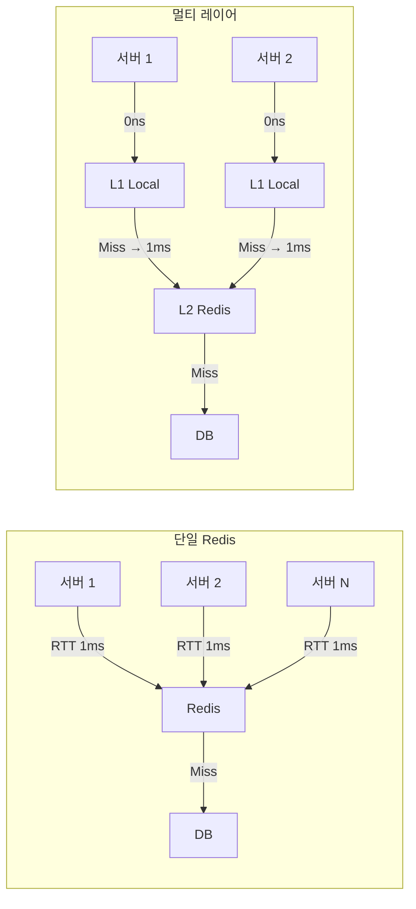
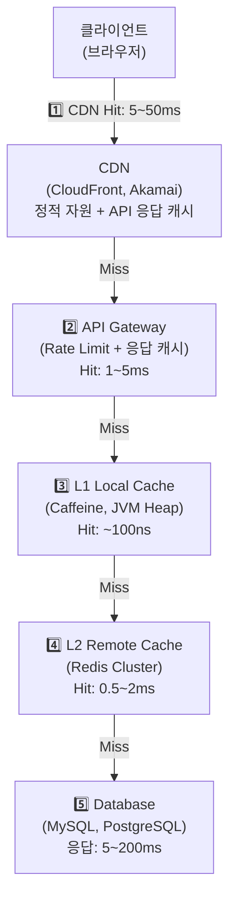
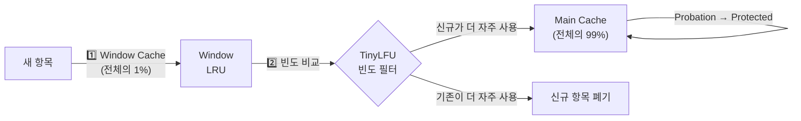
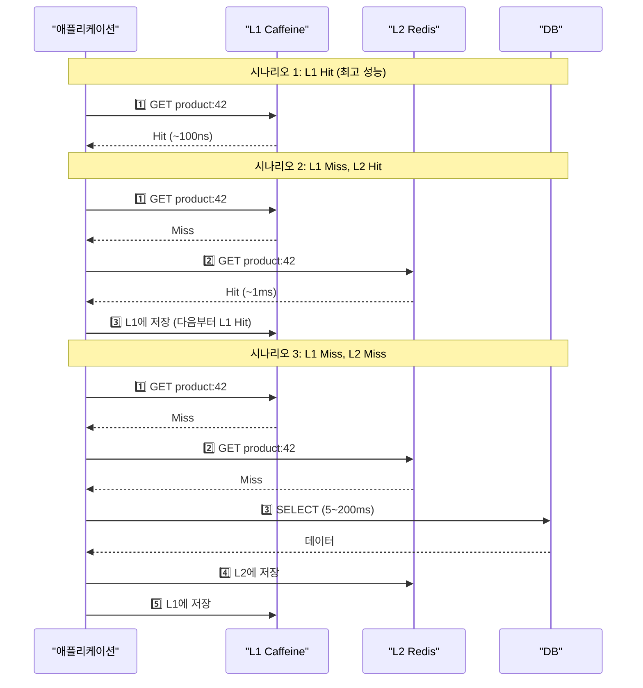
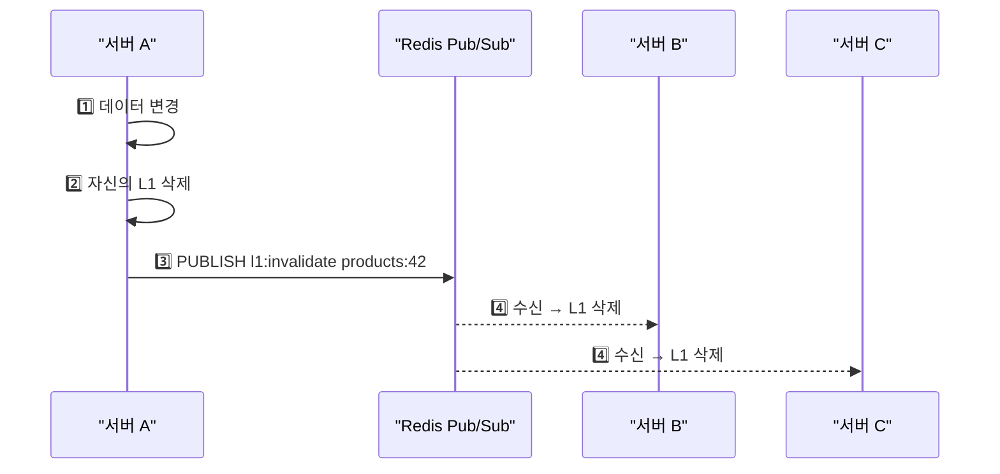
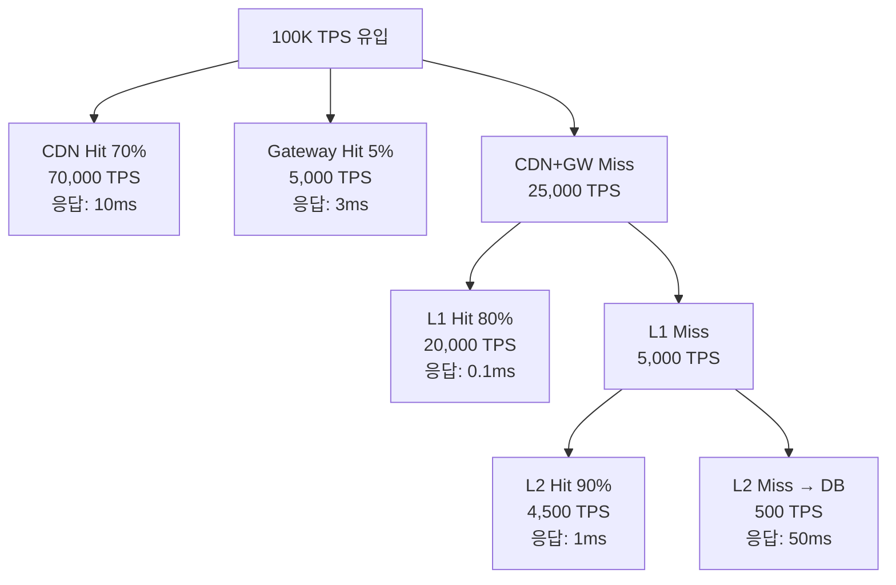
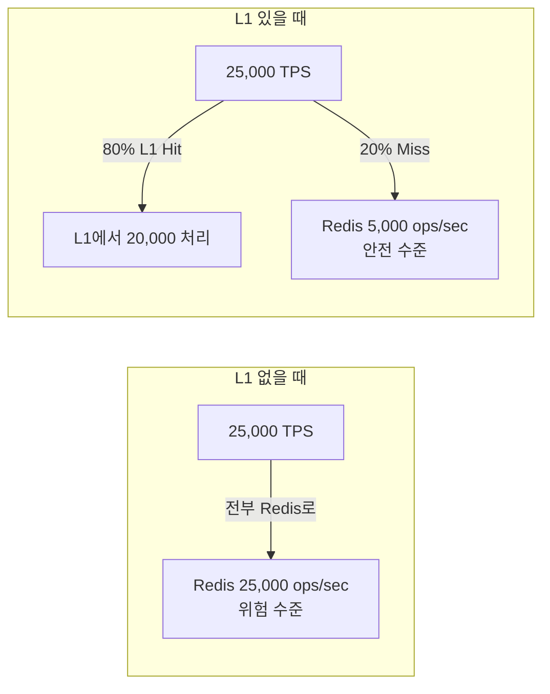
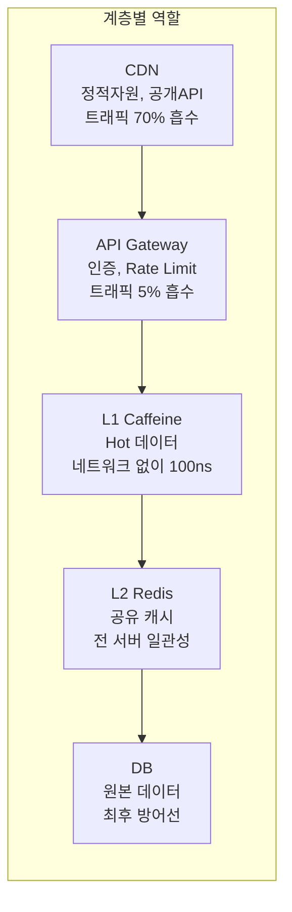

멀티 레이어 캐싱은 속도가 다른 여러 계층의 캐시를 겹겹이 쌓아서, 가장 빠른 계층에서 최대한 많은 요청을 처리하고 느린 계층으로는 최소한의 요청만 내려보내는 아키텍처다.

> **비유:** 주방에서 요리할 때를 생각해보자. 소금은 손 닿는 곳의 양념통(L1)에, 간장은 냉장고(L2)에, 된장은 창고(DB)에 보관한다. 소금이 떨어지면 냉장고에서 꺼내 양념통을 채우고, 냉장고도 비면 창고까지 가야 한다. 자주 쓰는 재료일수록 가까운 곳에 두는 것이 핵심이다. 멀티 레이어 캐싱은 이 원리를 소프트웨어에 적용한 것이다.

---

## 왜 캐시를 여러 계층으로 나누는가?

단일 캐시(Redis만 사용)로도 충분한 서비스가 많다. 하지만 트래픽이 일정 수준을 넘으면 Redis 한 대로는 감당이 안 되고, 네트워크 왕복 시간도 무시할 수 없게 된다.

> **비유:** 동네 편의점(Redis) 하나면 주민 100명은 충분하다. 그런데 주민이 10만 명이면? 각 아파트 단지마다 자판기(L1 Local Cache)를 놓고, 자판기에 없는 것만 편의점(L2 Redis)에 가게 하면 편의점이 터지지 않는다. 편의점도 품절이면 마트(DB)까지 가야 한다.

단일 Redis만 사용할 때의 문제점 세 가지를 살펴보자.

1. **네트워크 지연:** 아무리 빠른 Redis라도 네트워크 왕복(RTT)이 0.5~2ms 걸린다. 한 페이지에 캐시 조회가 20번이면 10~40ms가 네트워크에서만 소모된다.
2. **Redis 부하 집중:** 모든 서버의 모든 요청이 Redis로 몰린다. 10K TPS에서 서버 20대면 Redis는 200K ops/sec를 감당해야 한다.
3. **단일 장애점:** Redis가 죽으면 모든 서버가 동시에 DB로 직행한다.

이 세 가지 문제를 멀티 레이어 캐싱이 해결한다.



---

## 캐시 계층 전체 그림

실제 프로덕션 환경에서의 캐시 계층은 최대 5단계까지 존재할 수 있다. 각 계층마다 응답 속도, 용량, 비용이 다르다.



### 계층별 특성 비교

| 계층 | 위치 | 응답 시간 | 용량 | 일관성 | 적합한 데이터 |
|------|------|----------|------|--------|-------------|
| CDN | 엣지 서버 | 5~50ms | 무제한 | 낮음 | 정적 자원, 공개 API |
| API Gateway | 게이트웨이 | 1~5ms | 중간 | 낮음 | 인증 토큰, Rate Limit |
| L1 Local | JVM Heap | ~100ns | 작음 (수MB) | 서버별 상이 | Hot 데이터 |
| L2 Remote | Redis | 0.5~2ms | 큼 (수GB) | 높음 | 세션, 상품 정보 |
| DB | 디스크 | 5~200ms | 매우 큼 | 완벽 | 원본 데이터 |

> **비유:** 인체의 기억 시스템과 비슷하다. 반사 신경(L1, 나노초)은 뜨거운 냄비에서 즉시 손을 뗀다. 단기 기억(L2, 밀리초)은 방금 본 전화번호를 기억한다. 장기 기억(DB, 수십ms)은 오래 전 일을 떠올리려면 시간이 걸린다. 각 계층이 각자의 역할을 하면서 전체 시스템의 응답 속도를 극대화한다.

---

## L1 Local Cache — Caffeine

L1 캐시는 애플리케이션 서버의 JVM 힙 메모리 안에 존재하는 캐시다. 네트워크 통신이 전혀 없으므로 나노초 단위로 응답한다. Java 생태계에서 가장 성능이 좋은 로컬 캐시 라이브러리가 Caffeine이다.

Caffeine은 Google Guava Cache의 후속작으로, W-TinyLFU 알고리즘을 사용해 Hit Rate가 가장 높다. 같은 메모리를 사용해도 LRU 기반 캐시보다 15~20% 더 높은 Hit Rate를 달성한다.

> **비유:** 책상 위 공간은 한정되어 있다. LRU는 "가장 오래 안 본 책"을 치우는데, 가끔 한 번 본 두꺼운 백과사전이 자주 보는 얇은 공식집을 밀어낼 수 있다. W-TinyLFU는 "최근에 봤냐"와 "얼마나 자주 봤냐"를 모두 고려해서, 자주 보는 공식집은 절대 치우지 않는다.

### W-TinyLFU 동작 원리



새로 들어온 항목은 먼저 Window 영역(1%)에 들어간다. Window에서 밀려날 때 TinyLFU 필터가 "이 신규 항목의 접근 빈도"와 "Main 영역에서 쫓겨날 후보의 접근 빈도"를 비교한다. 신규가 더 자주 사용될 것으로 예측되면 Main에 입성하고, 아니면 바로 폐기된다. 이 메커니즘 덕분에 한 번만 접근되는 데이터가 자주 접근되는 데이터를 밀어내는 "cache pollution"을 방지한다.

아래 코드는 Caffeine 캐시를 Spring에 통합하는 설정이다. `maximumSize`와 `expireAfterWrite`가 핵심 설정인데, 각각 메모리 사용량과 데이터 신선도를 제어한다.

```java
@Configuration
public class CaffeineConfig {

    @Bean
    public CaffeineCacheManager caffeineCacheManager() {
        CaffeineCacheManager manager = new CaffeineCacheManager();
        manager.setCaffeine(Caffeine.newBuilder()
            .maximumSize(10_000)                    // 최대 10,000개 항목
            .expireAfterWrite(Duration.ofSeconds(30)) // 30초 후 만료
            .recordStats());                         // Hit/Miss 통계 수집
        return manager;
    }

    // 캐시별 세밀한 설정이 필요할 때
    @Bean
    public CaffeineCacheManager detailedCacheManager() {
        CaffeineCacheManager manager = new CaffeineCacheManager();
        manager.registerCustomCache("hotProducts",
            Caffeine.newBuilder()
                .maximumSize(1_000)
                .expireAfterWrite(Duration.ofSeconds(10))
                .build());
        manager.registerCustomCache("userProfiles",
            Caffeine.newBuilder()
                .maximumSize(50_000)
                .expireAfterWrite(Duration.ofMinutes(5))
                .build());
        return manager;
    }
}
```

**이 코드의 핵심:** `maximumSize(10_000)`은 캐시에 최대 10,000개 항목만 유지하겠다는 뜻이다. 10,001번째 항목이 들어오면 W-TinyLFU 알고리즘이 가장 "덜 중요한" 항목을 자동 제거한다. `recordStats()`를 켜면 Hit Rate를 모니터링할 수 있다.

---

## L2 Remote Cache — Redis

L2 캐시는 별도의 서버(Redis)에 존재하는 캐시다. 모든 애플리케이션 서버가 공유하므로, 서버 A에서 캐시한 데이터를 서버 B에서도 사용할 수 있다. 네트워크 통신이 필요하지만, DB보다 10~100배 빠르다.

> **비유:** L1이 각 직원의 책상 서랍이라면, L2는 사무실 공용 캐비닛이다. 서랍에 없으면 캐비닛까지 걸어가야 하지만(네트워크 지연), 창고(DB)까지 가는 것보다는 훨씬 빠르다. 그리고 캐비닛은 모든 직원이 공유하므로, 누군가 넣어둔 서류를 다른 직원도 사용할 수 있다.

### Redis를 L2로 설정하는 핵심 포인트

Redis를 L2 캐시로 사용할 때 고려해야 할 핵심은 직렬화 방식이다. 기본 JDK 직렬화는 크기가 크고 느리며, 클래스 변경 시 역직렬화에 실패한다. JSON 직렬화를 사용하면 사람이 읽을 수 있고, 클래스 변경에 유연하며, 크기도 작다.

또한 커넥션 풀 설정이 중요하다. 서버당 Redis 커넥션이 부족하면 커넥션을 얻기 위해 대기하는 시간이 캐시 조회 시간보다 더 걸릴 수 있다.

```java
@Configuration
public class RedisL2Config {

    @Bean
    public LettuceConnectionFactory redisConnectionFactory() {
        LettuceClientConfiguration clientConfig = LettuceClientConfiguration.builder()
            .commandTimeout(Duration.ofMillis(100))   // 100ms 초과 시 타임아웃
            .build();

        RedisStandaloneConfiguration serverConfig =
            new RedisStandaloneConfiguration("redis-host", 6379);

        return new LettuceConnectionFactory(serverConfig, clientConfig);
    }

    @Bean
    public RedisCacheManager redisCacheManager(RedisConnectionFactory factory) {
        RedisCacheConfiguration defaultConfig = RedisCacheConfiguration.defaultCacheConfig()
            .entryTtl(Duration.ofMinutes(30))
            .serializeKeysWith(
                RedisSerializationContext.SerializationPair
                    .fromSerializer(new StringRedisSerializer()))
            .serializeValuesWith(
                RedisSerializationContext.SerializationPair
                    .fromSerializer(new GenericJackson2JsonRedisSerializer()))
            .disableCachingNullValues();

        return RedisCacheManager.builder(factory)
            .cacheDefaults(defaultConfig)
            .withInitialCacheConfigurations(Map.of(
                "inventory", defaultConfig.entryTtl(Duration.ofSeconds(30)),
                "userSession", defaultConfig.entryTtl(Duration.ofHours(2))
            ))
            .build();
    }
}
```

**이 코드의 핵심:** `commandTimeout(100ms)`로 Redis가 느릴 때 빠르게 타임아웃 시켜서 전체 응답 지연을 방지한다. `GenericJackson2JsonRedisSerializer`로 JSON 직렬화를 사용하고, `disableCachingNullValues()`로 null 값 캐싱을 막는다.

---

## L1 + L2 통합 구현 — Spring Cache 추상화

Spring의 Cache 추상화를 활용하면 L1(Caffeine)과 L2(Redis)를 투명하게 계층화할 수 있다. 핵심은 `CompositeCacheManager` 대신 커스텀 `CacheManager`를 만들어서 "L1 먼저 조회 → L1 Miss이면 L2 조회 → L2 Hit이면 L1에도 저장" 로직을 구현하는 것이다.

> **비유:** 도서관에서 책을 찾을 때, 사서(CacheManager)가 "1층 열람실(L1) 확인 → 없으면 2층 서고(L2) 확인 → 2층에 있으면 1층에도 한 권 비치"하는 것과 같다. 다음에 같은 책을 찾으면 1층에서 바로 꺼낸다.

### 동작 흐름



아래 코드는 L1+L2 계층형 캐시의 전체 구현이다. `TwoLevelCache` 클래스가 Spring의 `Cache` 인터페이스를 구현하며, 내부적으로 Caffeine(L1)과 Redis(L2)를 순차적으로 조회한다.

이 구현에서 가장 신경 써야 할 부분은 L1과 L2의 TTL 관계다. L1 TTL은 반드시 L2 TTL보다 짧아야 한다. L1이 L2보다 오래 살아남으면, L2는 이미 갱신되었는데 L1에 구 데이터가 남아서 일관성이 깨진다.

```java
public class TwoLevelCache implements Cache {

    private final Cache caffeineCache;   // L1
    private final Cache redisCache;      // L2
    private final String name;

    public TwoLevelCache(String name, Cache caffeineCache, Cache redisCache) {
        this.name = name;
        this.caffeineCache = caffeineCache;
        this.redisCache = redisCache;
    }

    @Override
    public String getName() {
        return this.name;
    }

    @Override
    public Object getNativeCache() {
        return this;
    }

    @Override
    public ValueWrapper get(Object key) {
        // 1단계: L1 (Caffeine) 조회 — 네트워크 없음, ~100ns
        ValueWrapper l1Value = caffeineCache.get(key);
        if (l1Value != null) {
            return l1Value;
        }

        // 2단계: L2 (Redis) 조회 — 네트워크 필요, ~1ms
        ValueWrapper l2Value = redisCache.get(key);
        if (l2Value != null) {
            // L2 Hit → L1에도 저장 (다음부터 L1에서 바로 반환)
            caffeineCache.put(key, l2Value.get());
            return l2Value;
        }

        return null; // 전체 Miss → 호출자가 DB 조회
    }

    @Override
    public void put(Object key, Object value) {
        // 양쪽 모두에 저장
        caffeineCache.put(key, value);
        redisCache.put(key, value);
    }

    @Override
    public void evict(Object key) {
        // 양쪽 모두에서 삭제
        caffeineCache.evict(key);
        redisCache.evict(key);
    }

    @Override
    public void clear() {
        caffeineCache.clear();
        redisCache.clear();
    }
}
```

**이 코드의 핵심:** `get`에서 L1 → L2 순서로 조회하고, L2 Hit 시 L1에 자동 승격(put)한다. `put`과 `evict`는 양쪽 모두에 적용해서 일관성을 유지한다.

### CacheManager 등록

위에서 만든 `TwoLevelCache`를 Spring의 `CacheManager`로 등록하면, `@Cacheable` 어노테이션만으로 2단계 캐시가 투명하게 동작한다.

```java
@Configuration
@RequiredArgsConstructor
public class TwoLevelCacheConfig {

    private final CaffeineCacheManager caffeineManager;
    private final RedisCacheManager redisManager;

    @Bean
    @Primary
    public CacheManager twoLevelCacheManager() {
        return new CacheManager() {

            private final ConcurrentMap<String, Cache> cacheMap =
                new ConcurrentHashMap<>();

            @Override
            public Cache getCache(String name) {
                return cacheMap.computeIfAbsent(name, n -> {
                    Cache l1 = caffeineManager.getCache(n);
                    Cache l2 = redisManager.getCache(n);
                    if (l1 == null || l2 == null) return null;
                    return new TwoLevelCache(n, l1, l2);
                });
            }

            @Override
            public Collection<String> getCacheNames() {
                return cacheMap.keySet();
            }
        };
    }
}
```

**이 코드의 핵심:** `@Primary`로 이 CacheManager를 기본으로 등록한다. 이제 서비스 코드에서 `@Cacheable("products")`만 붙이면 L1 → L2 → DB 순서로 자동 조회된다.

```java
// 서비스 코드는 캐시 계층을 전혀 모른다 — Spring 추상화의 힘
@Service
public class ProductService {

    @Cacheable(value = "products", key = "#productId")
    public Product getProduct(Long productId) {
        return productRepository.findById(productId).orElseThrow();
    }

    @CacheEvict(value = "products", key = "#productId")
    @Transactional
    public void updateProduct(Long productId, ProductUpdateRequest request) {
        Product product = productRepository.findById(productId).orElseThrow();
        product.update(request);
    }
}
```

---

## L1 동기화 전략 — 멀티 인스턴스 환경의 핵심 난제

L2(Redis)는 모든 서버가 공유하므로 일관성 문제가 없다. 진짜 문제는 L1이다. 서버 A에서 데이터를 변경하고 자신의 L1을 지워도, 서버 B~Z의 L1에는 구 데이터가 남아있다.

> **비유:** 본사에서 가격표를 바꿨는데, 직영점 A에만 알려주고 가맹점 B~Z에는 안 알려주면? 가맹점들은 구 가격으로 판매해서 손해가 발생한다. 모든 매장에 "가격 변경 공지"를 동시에 보내야 한다.

### Redis Pub/Sub 기반 L1 동기화



L1 동기화에서 중요한 설계 결정이 있다. "내가 보낸 무효화 메시지를 내가 또 처리할 것인가?" 서버 A가 이미 자신의 L1을 지웠는데, 자신이 보낸 Pub/Sub 메시지를 자기도 수신해서 또 지울 필요는 없다. 하지만 이를 구분하는 로직이 더 복잡하고, 한 번 더 지워도 부작용이 없으므로 보통은 구분 없이 처리한다.

아래 코드는 L1 무효화 메시지를 발행하고 수신하는 전체 구현이다. `TwoLevelCache`의 `evict`에서 Pub/Sub 메시지를 자동 발행하고, `L1InvalidationSubscriber`가 수신해서 로컬 L1 캐시를 삭제한다.

```java
// === 무효화 이벤트 발행 ===
@Component
@RequiredArgsConstructor
public class L1InvalidationPublisher {

    private final StringRedisTemplate redis;
    private static final String CHANNEL = "l1:invalidate";

    public void publishEviction(String cacheName, Object key) {
        String message = cacheName + "|" + key.toString();
        redis.convertAndSend(CHANNEL, message);
    }
}

// === 무효화 이벤트 수신 (모든 서버) ===
@Component
@RequiredArgsConstructor
public class L1InvalidationSubscriber implements MessageListener {

    private final CaffeineCacheManager caffeineManager;

    @Override
    public void onMessage(Message message, byte[] pattern) {
        String payload = new String(message.getBody());
        String[] parts = payload.split("\\|", 2);
        String cacheName = parts[0];
        String key = parts[1];

        Cache cache = caffeineManager.getCache(cacheName);
        if (cache != null) {
            cache.evict(key);
        }
    }
}

// === TwoLevelCache에 Pub/Sub 통합 ===
public class TwoLevelCache implements Cache {

    private final Cache caffeineCache;
    private final Cache redisCache;
    private final String name;
    private final L1InvalidationPublisher publisher;

    // ... 생성자, get 등 동일 ...

    @Override
    public void evict(Object key) {
        caffeineCache.evict(key);
        redisCache.evict(key);
        // 다른 서버들의 L1도 무효화
        publisher.publishEviction(name, key);
    }
}
```

**이 코드의 핵심:** `evict`가 호출되면 자신의 L1/L2를 지우는 것에 더해, Pub/Sub으로 다른 서버들에게도 "이 키 지워라"고 알린다. 모든 서버의 `L1InvalidationSubscriber`가 이를 수신해서 자신의 Caffeine 캐시에서 해당 키를 제거한다.

---

## CDN 캐시 계층

CDN(Content Delivery Network)은 사용자에게 물리적으로 가장 가까운 엣지 서버에서 응답하는 최외곽 캐시 계층이다. 정적 파일(이미지, CSS, JS)뿐 아니라 API 응답도 캐시할 수 있다.

> **비유:** 본사 창고(Origin)에서 전국 배송하면 하루 걸리지만, 각 지역 물류센터(CDN 엣지)에 미리 재고를 쌓아두면 당일 배송이 된다. 주문이 들어오면 가장 가까운 물류센터에서 출고한다.

### CDN 캐시 제어 헤더

CDN의 캐시 동작은 HTTP 헤더로 제어한다. Spring에서 API 응답에 캐시 헤더를 추가하는 방법이다.

CDN 캐시에서 가장 중요한 개념은 `s-maxage`와 `max-age`의 차이다. `max-age`는 브라우저 캐시의 TTL이고, `s-maxage`는 CDN(공유 캐시)의 TTL이다. 보통 CDN TTL을 브라우저 TTL보다 길게 설정하고, 데이터가 변경되면 CDN만 즉시 무효화(purge)한다.

`stale-while-revalidate`는 CDN 캐시가 만료된 후에도 지정된 시간 동안 구 데이터를 반환하면서 백그라운드에서 원본을 갱신하는 전략이다. 사용자는 항상 즉시 응답을 받고, 데이터 신선도는 백그라운드에서 유지된다.

```java
@RestController
@RequestMapping("/api/products")
public class ProductController {

    @GetMapping("/{id}")
    public ResponseEntity<Product> getProduct(@PathVariable Long id) {
        Product product = productService.getProduct(id);

        return ResponseEntity.ok()
            .cacheControl(CacheControl
                .maxAge(Duration.ofMinutes(5))        // 브라우저 캐시 5분
                .sMaxAge(Duration.ofMinutes(30))       // CDN 캐시 30분
                .staleWhileRevalidate(Duration.ofMinutes(5))) // 만료 후 5분간 구 데이터 허용
            .eTag(String.valueOf(product.getVersion())) // 버전 기반 검증
            .body(product);
    }

    // 목록 API는 더 짧은 TTL
    @GetMapping
    public ResponseEntity<List<Product>> getProducts() {
        return ResponseEntity.ok()
            .cacheControl(CacheControl
                .maxAge(Duration.ofMinutes(1))
                .sMaxAge(Duration.ofMinutes(5)))
            .body(productService.getAllProducts());
    }
}
```

**이 코드의 핵심:** `sMaxAge(30분)`으로 CDN에서 30분간 캐시하고, `staleWhileRevalidate(5분)`으로 만료 후에도 5분간 구 데이터를 반환하면서 백그라운드 갱신한다. `eTag`로 데이터가 실제로 변경되었는지 검증해서 불필요한 전송을 방지한다.

---

## API Gateway 캐시 계층

API Gateway(Kong, Nginx, Spring Cloud Gateway)에서 응답을 캐시하면 애플리케이션 서버에 요청이 도달하기 전에 응답을 반환할 수 있다. 인증/인가 처리와 함께 캐시를 적용하면 효과가 극대화된다.

> **비유:** 회사 건물 입구의 안내 데스크와 같다. "5층 회의실이 어디냐"는 질문에 매번 5층까지 올라가서 확인할 필요 없이, 안내 데스크에서 바로 답할 수 있다. 자주 묻는 질문은 안내 데스크에 답변을 미리 준비해둔다.

```java
@Configuration
public class GatewayCacheConfig {

    @Bean
    public RouteLocator routes(RouteLocatorBuilder builder) {
        return builder.routes()
            .route("cached-products", r -> r
                .path("/api/products/**")
                .filters(f -> f
                    .filter(new ResponseCacheFilter(
                        Duration.ofMinutes(5),    // 캐시 TTL
                        Set.of(200),              // 200 응답만 캐시
                        Set.of("GET")))           // GET 요청만 캐시
                    .addResponseHeader("X-Cache-Status", "HIT"))
                .uri("lb://product-service"))
            .build();
    }
}
```

**이 코드의 핵심:** GET 요청의 200 응답만 5분간 캐시한다. POST/PUT/DELETE는 캐시하지 않는다. `X-Cache-Status` 헤더로 캐시 Hit 여부를 클라이언트가 확인할 수 있다.

---

<details class="extreme-scenario-details">
<summary class="extreme-scenario-summary">
<span class="extreme-scenario-icon">🔥</span>
<span class="extreme-scenario-label">극한 시나리오 — 클릭하여 펼치기</span>
<span class="extreme-scenario-toggle"></span>
</summary>
<div class="extreme-scenario-body">

<div class="extreme-scenario-content" markdown="1">

서버 20대, Redis Cluster 3대, CDN을 운영하는 서비스에 100K TPS가 들어오는 상황을 분석해보자.

> **비유:** 고속도로 톨게이트에 비유하면, 하이패스(CDN)로 70%가 무정차 통과하고, 카드결제(L1)로 20%가 5초 만에 통과하고, 현금결제(L2)로 8%가 20초 걸리고, 나머지 2%만 관리소(DB)에서 1분 걸리는 셈이다.

### 트래픽 분산 시뮬레이션



### 계층별 부하 분석

| 계층 | 처리량 | 응답 시간 | 서버 부하 |
|------|--------|----------|----------|
| CDN | 70,000 TPS | 10ms | CDN 엣지에 분산, Origin 부하 0 |
| API Gateway | 5,000 TPS | 3ms | Gateway 메모리 캐시 |
| L1 Caffeine | 20,000 TPS (서버당 1,000) | 0.1ms | JVM Heap, CPU 무시 가능 |
| L2 Redis | 4,500 TPS | 1ms | Redis Cluster 분산 |
| DB | 500 TPS | 50ms | DB 감당 가능 범위 |

**핵심 포인트:** 100K TPS 중 DB에 실제 도달하는 것은 500 TPS, 즉 0.5%에 불과하다. 멀티 레이어 캐싱 없이 100K TPS가 DB로 직행하면 즉시 장애가 발생한다.

### 계층이 빠지면 어떻게 되나?



L1을 빼면 Redis 부하가 5배로 증가한다. Redis Cluster의 단일 샤드 한계는 보통 100K ops/sec이므로, L1 없이 여러 샤드로 분산해야 같은 성능을 내려면 Redis 비용이 5배 증가한다.

### Cold Start 시나리오

서버 20대를 동시에 재시작하면 모든 L1 캐시가 비어있다. 25,000 TPS가 한꺼번에 L2(Redis)로 몰린다.

**방어 전략:**

1. **Rolling Restart:** 서버를 한 대씩 재시작해서, 이미 워밍업된 서버들이 트래픽을 분산 처리
2. **Cache Warmup:** 시작 시 인기 데이터를 미리 L1에 로드
3. **Traffic Ramping:** 새로 시작한 서버에 트래픽을 10% → 50% → 100%로 점진적 증가

```java
@Component
@RequiredArgsConstructor
public class L1CacheWarmup implements ApplicationRunner {

    private final RedisTemplate<String, Object> redis;
    private final CaffeineCacheManager caffeineManager;

    @Override
    public void run(ApplicationArguments args) {
        // Redis(L2)에서 인기 데이터를 읽어 L1에 미리 로드
        Set<String> hotKeys = redis.opsForZSet()
            .reverseRange("cache:access-count", 0, 999); // 상위 1000개

        if (hotKeys == null) return;

        Cache l1 = caffeineManager.getCache("products");
        int loaded = 0;
        for (String key : hotKeys) {
            Object value = redis.opsForValue().get(key);
            if (value != null && l1 != null) {
                l1.put(key, value);
                loaded++;
            }
        }
        log.info("L1 캐시 웜업 완료: {}개 항목 로드", loaded);
    }
}
```

**이 코드의 핵심:** Redis의 Sorted Set에 캐시 접근 횟수를 기록해두고, 서버 시작 시 상위 1,000개를 L1에 미리 로드한다. 이렇게 하면 서버 시작 직후에도 L1 Hit Rate가 높다.

---
</div>
</div>
</details>

## 캐시 모니터링 — Hit Rate가 생명이다

멀티 레이어 캐싱을 구축했으면 각 계층의 Hit Rate를 반드시 모니터링해야 한다. Hit Rate가 떨어지면 하위 계층에 부하가 몰리고, 이는 곧 장애로 이어진다.

> **비유:** 자동차 계기판에 속도계, 연료계, 수온계가 있듯이, 캐시 시스템에도 Hit Rate, 지연 시간, 메모리 사용량을 실시간으로 보여주는 계기판이 필요하다. 수온(Hit Rate)이 경고 수준으로 떨어지면 즉시 조치해야 엔진(DB)이 과열되지 않는다.

```java
@Component
@RequiredArgsConstructor
public class CacheMetrics {

    private final CaffeineCacheManager caffeineManager;
    private final MeterRegistry meterRegistry;

    @Scheduled(fixedDelay = 10000) // 10초마다 수집
    public void recordCacheStats() {
        caffeineManager.getCacheNames().forEach(name -> {
            Cache cache = caffeineManager.getCache(name);
            if (cache == null) return;

            com.github.benmanes.caffeine.cache.Cache<?, ?> nativeCache =
                (com.github.benmanes.caffeine.cache.Cache<?, ?>) cache.getNativeCache();

            CacheStats stats = nativeCache.stats();

            // Prometheus 메트릭으로 노출
            meterRegistry.gauge("cache.l1.hit.rate",
                Tags.of("cache", name), stats.hitRate());
            meterRegistry.gauge("cache.l1.size",
                Tags.of("cache", name), nativeCache.estimatedSize());
            meterRegistry.gauge("cache.l1.eviction.count",
                Tags.of("cache", name), stats.evictionCount());
        });
    }
}
```

**이 코드의 핵심:** Caffeine의 `recordStats()`를 활성화해야 통계가 수집된다. `hitRate()`는 0.0~1.0 사이 값으로, 0.95(95%) 이상이면 건강하고, 0.80 이하로 떨어지면 즉시 원인을 분석해야 한다.

### 경고 기준

| 메트릭 | 정상 | 주의 | 위험 |
|--------|------|------|------|
| L1 Hit Rate | > 90% | 80~90% | < 80% |
| L2 Hit Rate | > 95% | 90~95% | < 90% |
| L1 Eviction Rate | 안정적 | 급증 | 지속 급증 |
| Redis 응답 시간 | < 1ms | 1~5ms | > 5ms |

---

## 실무에서 자주 하는 실수

### 실수 1: L1 TTL을 L2보다 길게 설정

```
잘못된 설정:
  L1 TTL = 10분, L2 TTL = 5분

무슨 일이 발생하나:
  t=0: L1/L2 모두 캐시 저장
  t=5: L2 만료 → DB에서 새 데이터로 갱신
  t=5~10: L1에 구 데이터가 남아있어 구 데이터 서빙

올바른 설정:
  L1 TTL = 30초, L2 TTL = 10분
  L1은 항상 L2보다 짧게!
```

### 실수 2: L1 캐시에 너무 많은 메모리 할당

L1 캐시는 JVM Heap을 사용한다. Heap 4GB 중 L1에 2GB를 할당하면 GC 압박이 심해져서 Stop-the-World가 자주 발생한다. L1 캐시는 Heap의 10~20% 이내로 제한하는 것이 안전하다.

### 실수 3: 직렬화 비용 무시

L2(Redis)에 저장할 때 직렬화가 필요하다. 복잡한 객체를 JSON으로 직렬화하면 수 ms가 걸릴 수 있다. 이러면 캐시를 쓰는 의미가 퇴색된다. 캐시 대상 객체는 가능한 단순하게 유지하고, 필요 없는 필드는 `@JsonIgnore`로 제외한다.

### 실수 4: 캐시 계층 간 무효화 순서 실수

```
잘못된 순서:
  1. L1 삭제 → 2. L2 삭제
  문제: L1 삭제 후 다른 요청이 L2에서 구 데이터를 읽어 L1에 다시 저장

올바른 순서:
  1. L2 삭제 → 2. L1 삭제 → 3. Pub/Sub으로 다른 서버 L1 삭제
```

### 실수 5: CDN 캐시 무효화를 잊음

API 응답에 `Cache-Control: max-age=3600`을 설정해놓고, 긴급 데이터 수정 후 CDN purge를 하지 않으면 최대 1시간 동안 구 데이터가 전 세계에 서빙된다. 긴급 변경 시에는 CDN purge API를 반드시 호출해야 한다.

---

## 면접 포인트

### Q1: "L1 캐시와 L2 캐시를 왜 분리하나요? Redis만 쓰면 안 되나요?"

**모범 답변:** Redis만 써도 DB 대비 10~100배 빠르지만, 네트워크 왕복이 0.5~2ms 걸립니다. 한 페이지에 캐시 조회가 20회이면 네트워크에서만 10~40ms가 소모됩니다. L1(JVM 내 Caffeine)은 네트워크 없이 100ns에 응답하므로, L1 Hit Rate가 80%이면 20회 중 16회를 네트워크 없이 처리해서 전체 응답 시간을 크게 줄입니다. 또한 Redis 장애 시 L1이 버퍼 역할을 해서 가용성도 높아집니다.

### Q2: "멀티 레이어 캐시에서 일관성은 어떻게 유지하나요?"

**모범 답변:** 세 가지를 조합합니다. (1) L1 TTL을 L2보다 항상 짧게 설정해서 자연 수렴, (2) 데이터 변경 시 Redis Pub/Sub으로 모든 서버의 L1을 즉시 무효화, (3) 무효화 순서는 L2 먼저 → L1 나중으로 하여 Race Condition을 최소화합니다. 완벽한 Strong Consistency는 보장하지 않지만, 수백 ms 이내의 Eventual Consistency를 달성합니다.

### Q3: "Caffeine을 선택한 이유는?"

**모범 답변:** W-TinyLFU 알고리즘 덕분에 같은 메모리에서 LRU 대비 15~20% 높은 Hit Rate를 달성합니다. 또한 비동기 갱신, 통계 수집, 크기/시간/참조 기반 Eviction을 모두 지원합니다. 벤치마크에서도 EhCache, Guava Cache보다 처리량이 높아서, Java 생태계에서 사실상 표준 로컬 캐시입니다.

### Q4: "100K TPS를 처리하려면 캐시를 어떻게 설계하나요?"

**모범 답변:** 5단계 계층으로 설계합니다. CDN(정적+공개API, 70% 흡수) → API Gateway(인증 캐시, 5%) → L1 Caffeine(Hot 데이터, 20% 흡수) → L2 Redis Cluster(세션/상품, 4.5%) → DB(0.5%). 100K TPS 중 DB에 실제 도달하는 것은 500 TPS로, 일반적인 RDS가 감당 가능한 수준입니다. 핵심은 상위 계층에서 최대한 흡수하고, 각 계층의 TTL과 크기를 적절히 설정하는 것입니다.

### Q5: "CDN에서 API 응답을 캐시해도 되나요?"

**모범 답변:** 공개 데이터(상품 목록, 검색 결과)는 CDN 캐시가 매우 효과적입니다. 단, 사용자별 개인화 데이터(마이페이지, 장바구니)는 CDN 캐시하면 다른 사용자에게 노출될 위험이 있으므로 `Cache-Control: private`로 설정합니다. `Vary` 헤더로 캐시 키를 세분화하거나, 인증이 필요한 API는 CDN 캐시를 아예 비활성화하는 것이 안전합니다.

---

## 핵심 정리



| 설계 원칙 | 설명 |
|----------|------|
| TTL 계층 | L1 < L2 < CDN (안쪽이 항상 짧게) |
| 크기 제한 | L1은 Heap의 10~20% 이내 |
| 동기화 | Redis Pub/Sub으로 L1 크로스 서버 무효화 |
| 모니터링 | Hit Rate, Eviction Rate 실시간 추적 |
| Cold Start | Cache Warmup + Rolling Restart + Traffic Ramping |
| Fallback | Redis 장애 시 L1으로, L1+Redis 장애 시 DB + Rate Limit |

멀티 레이어 캐싱은 "트래픽을 상위 계층에서 최대한 흡수해서 하위 계층을 보호하는" 아키텍처다. 각 계층의 특성을 이해하고, TTL과 크기를 데이터 성격에 맞게 설정하며, 계층 간 동기화를 빠뜨리지 않는 것이 성공의 열쇠다.
