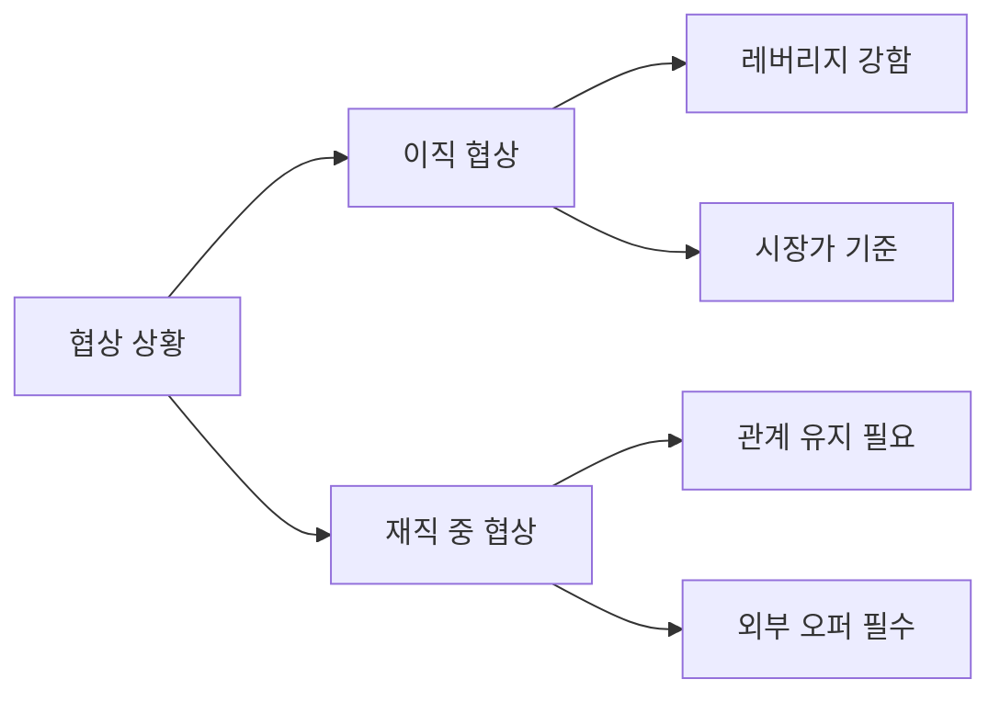

연봉 협상은 불편한 대화입니다. 하지만 이 불편함을 회피하면 매년 수백만 원을 잃습니다. 5년간의 협상 회피는 복리로 환산하면 1억 원 이상의 차이를 만들 수 있습니다. 이 글은 협상이 어색한 개발자를 위한 구체적인 스크립트와 전략을 담고 있습니다.

---

## 1. 왜 개발자는 연봉 협상을 못 하는가

### 1-1. 기술 중심 사고의 함정

개발자는 "실력이 있으면 알아서 올려주겠지"라고 생각하는 경향이 있습니다. 하지만 회사는 비용을 최소화하는 방향으로 움직입니다.

> **비유:** 주식 시장에서 내재 가치가 높아도 투자자가 사지 않으면 주가는 오르지 않습니다. 연봉도 마찬가지입니다. 실력이라는 내재 가치가 있어도, 협상이라는 가격 발견 과정을 거쳐야 시장 가격을 받을 수 있습니다.

### 1-2. 첫 제안이 앵커가 된다

협상 심리학에서 가장 중요한 개념은 **앵커링(Anchoring)**입니다. 먼저 제시된 숫자가 이후 협상의 기준점이 됩니다.

```
앵커링 예시:
HR: "현재 연봉이 얼마세요?"
→ 당신: "5,000만원입니다"
→ HR 내부 생각: "6,000~6,500 제시하면 되겠다"

만약 당신이 먼저 앵커를 설정했다면:
→ 당신: "저는 7,000만원 수준을 목표로 하고 있습니다"
→ HR 내부 생각: "6,500이면 받아들이겠지"
```

### 1-3. 협상하지 않으면 손해

```
협상하지 않았을 때의 5년 비용 (단리 계산):
- 미협상으로 500만원 덜 받은 경우
- 5년 누적: 2,500만원
- 퇴직금 기준 불이익: 500만원 추가
- 다음 이직 협상 불리: 기준점 500만원 낮음
- 총 손실 추정: 3,500만원+
```

---

## 2. 협상 타이밍 — 언제 협상하는가

### 2-1. 최고의 타이밍: 오퍼 수령 직후

오퍼를 받은 순간이 협상력이 가장 높습니다. 회사는 당신을 선택했고, 다시 채용 프로세스를 시작하고 싶지 않습니다.

```
타이밍별 협상 여지:
1위. 최종 오퍼 수령 직후    → 협상 여지 최대 (100%)
2위. 최종 면접 합격 직후    → 협상 여지 높음 (80%)
3위. 재직 중 성과 리뷰 시기 → 협상 여지 보통 (50%)
4위. 임의 요청              → 협상 여지 낮음 (20%)
최악. 입사 후 수습 종료     → 협상 여지 거의 없음 (5%)
```

### 2-2. 재직 중 협상 타이밍

현 직장에서 협상할 때의 최적 타이밍입니다.

```
재직 중 연봉 협상 최적 시기:
1. 연간 성과 평가 직전 (10~11월)
   → 평가 결과를 기다리지 말고 먼저 의사 표명

2. 큰 프로젝트 성공 직후
   → "방금 해낸 것"의 가치가 가장 신선할 때

3. 승진 논의 시기
   → 역할 변경과 함께 보상 재협상 정당화

4. 외부 오퍼를 받은 시점 (카운터 오퍼)
   → 가장 강력한 레버리지, 단 진정성 있게
```

> **비유:** 협상 타이밍은 파도타기와 같습니다. 파도가 올 때 올라타야 합니다. 파도가 없을 때 억지로 서핑하면 에너지만 낭비합니다.

---

## 3. 시장 데이터 조사 — 숫자로 무장하기

### 3-1. 시장 조사 소스

협상에서 숫자가 없는 주장은 "저는 더 받을 자격이 있어요"와 다를 바 없습니다.

```
국내 연봉 데이터 소스:
1. 크레딧잡 (credijob.com)
   → 실제 신고 연봉 기반, 회사별 분포 확인

2. 잡플래닛 (jobplanet.co.kr)
   → 현직자 연봉 공유, 연차별 분포

3. 블라인드 (teamblind.com)
   → 현직 개발자 연봉 공유 (가장 현실적)

4. 링크드인 Salary Insights
   → 글로벌 비교 가능

5. 채용 공고 분석
   → "경력 5년, 연봉 6,000~8,000" 명시 공고들
```

### 3-2. 시장 데이터 수집 방법

```python
# 연봉 데이터 분석 예시 (수집한 데이터 기반)

data = {
    "직무": "백엔드 개발자",
    "경력": "5년",
    "지역": "서울",
    "샘플": [
        {"회사": "대기업IT", "연봉": 8000},
        {"회사": "핀테크스타트업", "연봉": 7500},
        {"회사": "중견IT", "연봉": 6500},
        {"회사": "외국계IT", "연봉": 9000},
        {"회사": "게임회사", "연봉": 7000},
    ]
}

연봉들 = [d["연봉"] for d in data["샘플"]]
평균 = sum(연봉들) / len(연봉들)
중앙값 = sorted(연봉들)[len(연봉들)//2]

print(f"시장 평균: {평균:,.0f}만원")   # 7,600만원
print(f"시장 중앙값: {중앙값:,}만원")  # 7,500만원
```

### 3-3. 나의 시장 가치 계산

```
나의 시장 가치 = 기본 시장가 + 프리미엄

프리미엄 요소:
+10~15%: 희소한 기술 스택 (예: Rust, 임베디드)
+10%: 대형 서비스 운영 경험 (DAU 100만+)
+5~10%: 특정 도메인 깊은 경험 (핀테크, 헬스케어)
+5%: 오픈소스 기여, 기술 발표 경험
+5%: 복수 기술 스택 숙련 (풀스택)

디스카운트 요소:
-10~20%: 기술 스택이 JD와 불일치
-5%: 공백기 6개월 이상
```

---

## 4. 협상 전 준비 — 숫자 세 개를 준비하라

### 4-1. BATNA, 목표, 최고 희망

협상 전에 반드시 세 가지 숫자를 결정합니다.

```
세 가지 숫자:

1. BATNA (Best Alternative to Negotiated Agreement)
   = 협상 결렬 시 차선책 (현재 연봉 또는 다른 오퍼)
   → 이 숫자 아래로는 절대 동의 안 함

2. 목표 연봉 (Target)
   = 합리적으로 기대하는 금액
   → 시장 75th 퍼센타일 기준

3. 최고 희망 (Aspiration)
   = 이상적인 최대치
   → 첫 제시 숫자로 사용

예시:
BATNA: 6,500만원 (현재 연봉)
목표: 7,500만원 (시장 75th 퍼센타일)
최고 희망: 8,500만원 (첫 제시 숫자)
```

> **비유:** 중고차 판매와 같습니다. 최저 판매가(BATNA), 적정가(목표), 부르는 가격(최고 희망)을 미리 정해두지 않으면 협상 중에 흔들립니다.

### 4-2. 총 보상 패키지 계산

연봉만 보면 안 됩니다. 총 보상(Total Compensation)을 계산해야 합니다.

```
총 보상 패키지 계산표:

기본 항목:
- 기본급: 6,000만원
- 성과급 (평균 지급률 기준): 600만원 (10%)
- 소계: 6,600만원

주식/인센티브:
- 스톡옵션 (연간 베스팅): 500만원
- RSU (연간 베스팅): 0
- 사이닝 보너스 (1회성, 4년 분할): 250만원

복리후생 환산:
- 중식비 (월 10만): 120만원/년
- 교통비 지원: 60만원/년
- 의료비 지원: 100만원/년
- 교육비 지원: 200만원/년
- 재택 장비 지원 (연간화): 50만원/년

총합: 7,880만원/년
```

### 4-3. 복리후생 환산 계산기

```python
def calculate_total_comp(
    base_salary: int,
    bonus_rate: float = 0.1,
    stock_options_annual: int = 0,
    rsu_annual: int = 0,
    signing_bonus: int = 0,
    signing_bonus_years: int = 4,
    meal_monthly: int = 0,
    transport_monthly: int = 0,
    medical_annual: int = 0,
    education_annual: int = 0,
) -> dict:

    bonus = int(base_salary * bonus_rate)
    signing_annual = signing_bonus // signing_bonus_years
    benefits = (
        meal_monthly * 12
        + transport_monthly * 12
        + medical_annual
        + education_annual
    )

    total = (
        base_salary + bonus + stock_options_annual
        + rsu_annual + signing_annual + benefits
    )

    return {
        "기본급": base_salary,
        "성과급": bonus,
        "주식/옵션": stock_options_annual + rsu_annual,
        "사이닝(연간화)": signing_annual,
        "복리후생": benefits,
        "총합": total,
    }

result = calculate_total_comp(
    base_salary=6000,
    bonus_rate=0.10,
    stock_options_annual=500,
    signing_bonus=1000,
    meal_monthly=10,
    transport_monthly=5,
    medical_annual=100,
    education_annual=200,
)

for k, v in result.items():
    print(f"{k}: {v:,}만원")
```

---

## 5. 협상 스크립트 — 실제 대화

### 5-1. 현재 연봉 질문 방어하기

```
HR: "현재 연봉이 얼마세요?"

❌ 나쁜 대응:
"6,000만원입니다."
(앵커를 낮게 설정)

✅ 좋은 대응 A (돌려 말하기):
"현재 연봉보다는 이 포지션에 적합한 시장 가치를
기준으로 논의하고 싶습니다.
저는 유사 경력의 시장 데이터를 검토했을 때
7,500~8,000만원 수준을 기대하고 있습니다."

✅ 좋은 대응 B (솔직하게 + 앵커 설정):
"현재는 6,500만원이지만, 스톡옵션과 성과급을
포함한 총 보상은 7,200만원 수준입니다.
이번엔 8,000만원 이상을 목표로 하고 있습니다."
```

### 5-2. 오퍼 받은 직후 협상

```
HR: "최종 연봉은 6,800만원으로 결정했습니다.
    어떻게 생각하세요?"

❌ 나쁜 대응:
"감사합니다! 수락하겠습니다."

✅ 좋은 대응:
"감사합니다. 정말 기쁘고 이 팀에서 기여하고 싶습니다.
한 가지 여쭤봐도 될까요?

제가 유사 포지션의 시장 데이터를 조사해보니
7,500만원 수준이었습니다. 제 [구체적 경험/기술]을
고려하면 7,500만원으로 조정이 가능할까요?"
```

### 5-3. 반박이 왔을 때

```
HR: "지금 오퍼가 우리 밴드의 최상단입니다."

✅ 대응:
"이해합니다. 밴드 제약이 있다는 것을 압니다.
그렇다면 기본급 외에 조정 가능한 부분이 있을까요?
사이닝 보너스, 스톡옵션, 원격 근무 유연성,
교육비 등을 함께 고려할 수 있을까요?"
```

```
HR: "다른 후보자도 있습니다."

✅ 대응:
"물론 그러실 수 있습니다. 저도 다른 기회를 살펴보고
있습니다. 다만, 저는 이 팀에서 정말 일하고 싶고,
제 기여로 만들 수 있는 가치를 생각하면
7,000만원이 합리적이라고 생각합니다.
이 차이를 해결할 방법이 있을까요?"
```

### 5-4. 침묵을 활용하는 법

```
핵심 전술: 숫자를 제시한 뒤 입을 닫아라

당신: "7,500만원이 제 목표입니다."
[침묵 — 절대로 먼저 말하지 않는다]

대부분의 사람은 침묵이 불편해서
"뭐, 7,000도 괜찮아요"처럼 스스로 양보합니다.
협상에서 먼저 말하는 쪽이 지는 경우가 많습니다.
```

---

## 6. 스톡옵션/RSU 계산법

### 6-1. 스톡옵션(Stock Option) 이해

스톡옵션은 정해진 가격(행사가)으로 주식을 살 수 있는 권리입니다.

```
스톡옵션 계산:

예시:
- 행사가: 주당 10,000원
- 부여 수량: 10,000주
- 현재 주가: 15,000원
- 베스팅 일정: 4년 (1년 cliff + 월별)

단순 가치 = (현재가 - 행사가) × 수량
         = (15,000 - 10,000) × 10,000
         = 50,000,000원 (5,000만원)

연간 가치 (4년 베스팅) = 5,000만원 ÷ 4 = 1,250만원/년
```

### 6-2. RSU(Restricted Stock Unit) 이해

RSU는 조건 달성 시 주식을 무상으로 받는 제도입니다.

```
RSU 계산:

예시:
- 부여 수량: 1,000주
- 현재 주가: 50,000원
- 베스팅: 4년 (연 25%)

연간 수령 주식 = 1,000 ÷ 4 = 250주
연간 가치 = 250 × 50,000 = 12,500,000원 (1,250만원/년)

주의: 주가 변동으로 가치가 달라짐
- 주가 상승 시 → 수령 금액 증가
- 주가 하락 시 → 수령 금액 감소 (하지만 옵션과 달리 0이 되진 않음)
```

### 6-3. 스타트업 스톡옵션 위험도 평가

```
스타트업 스톡옵션 가치 평가 체크리스트:

높음 (×0.7로 할인 적용):
[ ] 시리즈 A 이전
[ ] 수익화 모델 불명확
[ ] 경쟁사 대비 차별점 불명확

보통 (×0.5로 할인):
[ ] 시리즈 B~C
[ ] 매출 성장 중이나 흑자 전환 미정

낮음 (×0.3으로 할인):
[ ] 시리즈 D+
[ ] 흑자 또는 IPO 추진 중

현실적 가치 = 액면 가치 × 할인율 × IPO/M&A 확률
```

> **비유:** 스타트업 스톡옵션은 복권과 비슷합니다. 당첨 가능성과 당첨금을 함께 고려해야 합니다. "10억짜리 복권이 있어요"라고 해도 당첨 확률이 0.1%면 기대값은 100만원입니다.

---

## 7. 카운터 오퍼 전략

### 7-1. 카운터 오퍼란

현 직장에서 이직 의사를 밝혔을 때, 현 회사가 잔류를 위해 제안하는 연봉 인상 제안입니다.

```
카운터 오퍼 받았을 때 판단 기준:

수락을 고려할 때:
- 이직 이유가 '연봉'이 유일한 경우
- 현 직장의 팀/문화에 만족
- 새 직장이 불확실한 요소 多

거절해야 할 때:
- 이직 이유가 성장, 문화, 관계인 경우
- 카운터 오퍼 후 1년 내 퇴직률 80% (통계적 사실)
- 협상으로 억지로 올린 연봉 → 다음 인상 시 불이익
```

### 7-2. 카운터 오퍼 협상 스크립트

```
상황: 현 회사에서 잔류 요청

상사: "어디로 가려고? 얼마 줬어?"

❌ 나쁜 대응:
"A사에서 7,500 줬어요."
(정보를 너무 많이 줌)

✅ 좋은 대응:
"솔직히 말씀드리면, 외부에서 시장가 기준
제 가치를 다시 확인했습니다.
잔류를 원하신다면 7,000만원으로
조정해주실 수 있을까요?"
```

### 7-3. 카운터 오퍼 후 협상 결과 유형별 대응

```
결과 A: 원하는 금액 제시
→ 1~2일 숙고 후 수락 여부 결정
→ 수락 시 "감사합니다. 앞으로 더 기여하겠습니다."
→ 거절 시 정중하게 이직 진행

결과 B: 부족한 금액 제시
→ "감사합니다. 7,000 기준으로 최종 확인 부탁드립니다."
→ 협상 공간이 없으면 이직 진행

결과 C: 협상 거부
→ 이직 진행
→ 조용히 진행, 마지막까지 전문성 유지
```

---

## 8. 복리후생 협상 — 연봉 외 가치 극대화

### 8-1. 협상 가능한 비금전 항목

연봉 밴드에 걸렸다면 비금전 항목을 공략합니다.

```
협상 가능한 비금전 항목 (가치 환산):

원격 근무 (주 2일):
→ 교통비 월 20만 × 12 = 240만원/년
→ 시간 절약 (왕복 2시간 × 40일) = 삶의 질

교육비 지원:
→ Udemy, 컨퍼런스, 도서 구매 = 연 100~300만원

장비 지원:
→ 맥북 프로 4년 사용 = 연 75만원

성과급 조기 지급:
→ 분기별 vs 연간 = 현금 흐름 개선

입사 시기 조정:
→ 현 직장 연말 성과급 수령 후 입사 = 수백만원
```

### 8-2. 비금전 협상 스크립트

```
HR: "연봉은 7,000만원이 최대입니다."

당신: "이해합니다. 그렇다면 몇 가지 여쭤봐도 될까요?

첫째, 교육비 지원은 어느 수준인가요?
제가 연간 컨퍼런스 참석과 도서 구매에
150만원 정도를 쓰는데, 회사 지원이 가능한지요.

둘째, 재택 근무 정책은 어떻게 되나요?
주 2일 정도 유연하게 운용이 가능한지요.

셋째, 사이닝 보너스가 가능한지요.
1회성으로 현 직장의 성과급 손실분을
보전해주실 수 있을까요?"
```

---

## 9. 연봉 협상 사례 연구 (익명)

### 9-1. 사례 1 — 이직으로 1,500만원 인상

```
배경:
- 4년차 백엔드 개발자
- 현재 연봉: 5,500만원 (중견 SI)
- 이직 타겟: 핀테크 스타트업 (시리즈 C)

준비 과정:
1. 블라인드, 잡플래닛으로 시장 조사 → 7,000~7,500 확인
2. 총 보상 패키지 계산 (현 회사 복리후생 포함)
3. 협상 숫자 설정: BATNA 5,500 / 목표 7,000 / 희망 8,000

협상 진행:
- 최초 오퍼: 6,500
- 1차 협상: "시장 데이터 기준 7,500 기대" → "7,000이 최대"
- 2차 협상: "7,000 + 사이닝 보너스 500" → 수락

최종 결과:
- 기본급: 7,000만원 (+1,500)
- 사이닝: 500만원 (1회성)
- 스톡옵션: 연간 300만원 (4년 베스팅)
- 총 보상 증가: +2,300만원/년 효과
```

### 9-2. 사례 2 — 재직 중 협상으로 800만원 인상

```
배경:
- 6년차 시니어 개발자
- 현재 연봉: 7,000만원 (대형 IT)
- 직접 이직 대신 내부 협상 선택

준비 과정:
1. 외부 오퍼 1개 미리 확보 (레버리지용)
2. 최근 6개월 성과 문서화 (서버 비용 40% 절감)
3. 팀장에게 미팅 요청: "처우 관련 논의"

협상 진행:
상사: "지금도 좋은 대우인데?"
본인: "팀장님, 솔직하게 말씀드리면 외부에서
       7,800에 오퍼를 받았습니다.
       저는 이 팀에서 계속 일하고 싶습니다.
       7,800으로 조정이 가능한지요?"
→ HR 검토 후 7,500 제시
→ 2차 협상: 7,800 재요청
→ 최종 합의: 7,800

교훈: 외부 오퍼가 가장 강력한 레버리지
```

### 9-3. 사례 3 — 신입의 첫 협상

```
배경:
- 개발 부트캠프 출신 신입
- 초기 오퍼: 3,400만원

준비 과정:
1. 부트캠프 동기들의 평균 초봉 조사 → 3,600~3,800
2. 자신만의 차별점 파악:
   - 오픈소스 기여 3건 (Star 50+)
   - 사이드 프로젝트 실사용자 200명
3. 협상 숫자: BATNA 3,400 / 목표 3,800 / 희망 4,000

협상:
"감사합니다. 한 가지 여쭤봐도 될까요?
동종 업계 신입 기준 3,600~3,800이 평균인 것을
확인했습니다. 제 오픈소스 기여와 프로젝트를
고려하면 3,800이 가능할까요?"

결과: 3,700 합의
인상액: 300만원 (8.8% 인상)
교훈: 신입도 협상할 수 있다
```

---

## 10. 이직 협상 vs 재직 중 협상 비교



| 항목 | 이직 협상 | 재직 중 협상 |
|------|-----------|-------------|
| 레버리지 | 강함 | 약함 (외부 오퍼 없으면) |
| 기준점 | 시장 데이터 | 현재 연봉 |
| 위험 | 낮음 | 관계 악화 가능 |
| 인상 폭 | 20~40% 가능 | 5~15% 일반적 |
| 준비 기간 | 2~4주 | 1~3개월 |

---

## 11. 협상 후 관계 관리

### 11-1. 수락 후 첫 3개월

협상에서 이겼다는 느낌을 주면 안 됩니다. 협상은 끝이 아니라 관계의 시작입니다.

```
입사 후 첫 3개월 행동 원칙:

1. 과잉 기여로 투자 회수 증명
   → 입사 첫 달에 눈에 띄는 기여 1개 만들기

2. 약속한 것 이상 보여주기
   → 협상 중 강조한 스킬을 빠르게 증명

3. 팀 적응 우선
   → 기술 자랑보다 신뢰 구축 먼저
```

### 11-2. 거절당한 뒤 관계 유지

```
협상 실패 후 대응:

오퍼 거절 시:
"정말 좋은 기회였고, 팀도 매력적이었습니다.
아쉽지만 이번엔 다른 방향을 선택하게 되었습니다.
언제든 다시 인연이 닿을 수 있기를 바랍니다."

→ 링크드인 연결 유지
→ 6~12개월 후 재지원 가능성 열어두기
```

---

## 12. 체크리스트 — 협상 전날 준비

```
협상 전날 체크리스트:

데이터 준비:
[ ] 시장 연봉 데이터 3개 소스 확인
[ ] 총 보상 패키지 계산 완료
[ ] BATNA / 목표 / 희망 숫자 확정

멘탈 준비:
[ ] 협상 스크립트 소리 내어 연습 (3회)
[ ] "No" 받았을 때 대응 방법 준비
[ ] 침묵 견디기 연습

실전 준비:
[ ] 화상/전화 협상이면 조용한 장소 확보
[ ] 노트와 펜 준비 (숫자 메모용)
[ ] 대화 후 이메일 확인 요청 계획

협상 직후:
[ ] 합의 내용 이메일로 확인 요청
[ ] "X월 Y일 Z만원으로 합의한 것 확인합니다" 형식
[ ] 서면 오퍼 수령 전까지 현 직장에 퇴직 통보 금지
```

---

## 마무리 — 협상은 기술이다

연봉 협상을 잘 못하는 것은 성격 탓이 아닙니다. 연습 부족 탓입니다. 스크립트를 외우고, 거울 앞에서 연습하고, 작은 협상(중고 거래, 통신사 요금 협상)부터 시작하세요.

> **비유:** 수영을 배우는 것과 같습니다. 물에 들어가기 전에는 누구나 무섭습니다. 하지만 한 번 배우면 평생 쓸 수 있는 기술입니다. 연봉 협상도 처음이 가장 어렵습니다.

가장 중요한 것은 **하는 것**입니다. 준비가 부족해도 시도하는 사람이 시도하지 않는 사람보다 항상 더 많이 받습니다. 지금 당장 내년 연봉 협상을 위한 시장 데이터 조사부터 시작해보세요.

---

*댓글로 협상 경험을 공유해주세요. 익명 상담도 환영합니다.*
