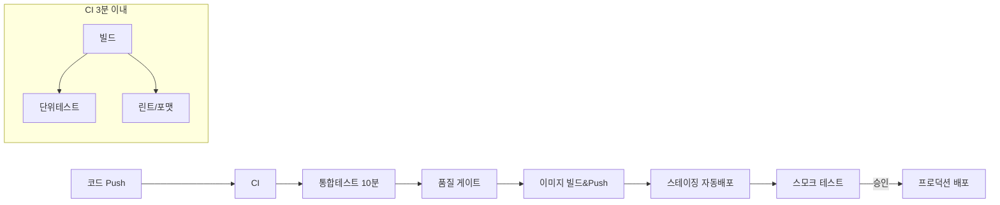

## 비유로 시작하기

자동차 공장을 생각해보세요. 과거에는 차 한 대를 완성한 뒤 검사를 했습니다. 문제가 발견되면 이미 수백 대가 같은 문제를 안고 있습니다. 현대 공장은 **컨베이어벨트에서 단계마다 자동 검사**를 합니다. 문제가 발견되면 즉시 라인이 멈추고 수정됩니다.

CI/CD는 소프트웨어 개발의 컨베이어벨트입니다. 코드 변경이 **자동으로 빌드 → 테스트 → 배포**되며, 각 단계에서 품질이 검증됩니다.

---

## CI와 CD의 차이

<div class="mermaid">
graph LR
    DEV[개발자 코드 Push]
    CI_START[CI 시작]
    BUILD[빌드]
    TEST[자동 테스트]
    LINT[코드 품질 검사]
    CD_START[CD 시작]
    STAGE[스테이징 배포]
    PROD[프로덕션 배포]

    DEV --> CI_START
    CI_START --> BUILD
    BUILD --> TEST
    TEST --> LINT
    LINT --> CD_START
    CD_START --> STAGE
    STAGE -->|수동 승인| PROD

    style CI_START fill:#AED6F1
    style CD_START fill:#A9DFBF
</div>

| 개념 | 의미 | 목적 |
|------|------|------|
| CI (Continuous Integration) | 지속적 통합 | 빌드/테스트 자동화, 조기 버그 발견 |
| CD (Continuous Delivery) | 지속적 제공 | 스테이징까지 자동 배포, 프로덕션은 수동 승인 |
| CD (Continuous Deployment) | 지속적 배포 | 프로덕션까지 완전 자동 배포 |

---

## CI/CD 도구 비교

### Jenkins

오픈소스 CI/CD 서버. 가장 오래되고 플러그인 생태계가 방대합니다.

```groovy
// Jenkinsfile (Declarative Pipeline)
pipeline {
    agent any

    environment {
        DOCKER_REGISTRY = 'registry.example.com'
        IMAGE_NAME = 'myapp'
        KUBECONFIG = credentials('kubeconfig-prod')
    }

    stages {
        stage('Checkout') {
            steps {
                git branch: 'main', url: 'https://github.com/org/myapp.git'
            }
        }

        stage('Build') {
            steps {
                sh './gradlew clean bootJar --no-daemon'
            }
            post {
                always {
                    archiveArtifacts artifacts: 'build/libs/*.jar'
                }
            }
        }

        stage('Test') {
            parallel {
                stage('Unit Test') {
                    steps {
                        sh './gradlew test --no-daemon'
                    }
                    post {
                        always {
                            junit 'build/test-results/test/*.xml'
                            publishHTML(target: [
                                reportDir: 'build/reports/tests/test',
                                reportFiles: 'index.html',
                                reportName: 'Test Report'
                            ])
                        }
                    }
                }
                stage('Integration Test') {
                    steps {
                        sh './gradlew integrationTest --no-daemon'
                    }
                }
            }
        }

        stage('Code Quality') {
            steps {
                withSonarQubeEnv('sonarqube') {
                    sh './gradlew sonarqube'
                }
                waitForQualityGate abortPipeline: true
            }
        }

        stage('Docker Build & Push') {
            steps {
                script {
                    def imageTag = "${env.BUILD_NUMBER}-${env.GIT_COMMIT.take(7)}"
                    docker.withRegistry("https://${DOCKER_REGISTRY}", 'docker-credentials') {
                        def image = docker.build("${IMAGE_NAME}:${imageTag}")
                        image.push()
                        image.push('latest')
                    }
                }
            }
        }

        stage('Deploy to Staging') {
            steps {
                sh """
                    kubectl set image deployment/myapp-deployment \
                        myapp=${DOCKER_REGISTRY}/${IMAGE_NAME}:${BUILD_NUMBER} \
                        -n staging
                    kubectl rollout status deployment/myapp-deployment -n staging
                """
            }
        }

        stage('Deploy to Production') {
            when { branch 'main' }
            input {
                message "프로덕션 배포 승인?"
                ok "배포"
                submitter "ops-team"
            }
            steps {
                sh """
                    kubectl set image deployment/myapp-deployment \
                        myapp=${DOCKER_REGISTRY}/${IMAGE_NAME}:${BUILD_NUMBER} \
                        -n production
                    kubectl rollout status deployment/myapp-deployment -n production
                """
            }
        }
    }

    post {
        success {
            slackSend channel: '#deployments',
                color: 'good',
                message: "빌드 성공: ${env.JOB_NAME} #${env.BUILD_NUMBER}"
        }
        failure {
            slackSend channel: '#deployments',
                color: 'danger',
                message: "빌드 실패: ${env.JOB_NAME} #${env.BUILD_NUMBER}"
        }
    }
}
```

### GitHub Actions

GitHub에 내장된 CI/CD. YAML로 워크플로우를 정의하며 별도 서버가 불필요합니다.

```yaml
# .github/workflows/ci-cd.yml
name: CI/CD Pipeline

on:
  push:
    branches: [main, develop]
  pull_request:
    branches: [main]

env:
  REGISTRY: ghcr.io
  IMAGE_NAME: ${{ github.repository }}

jobs:
  test:
    runs-on: ubuntu-latest
    services:
      mysql:
        image: mysql:8.0
        env:
          MYSQL_ROOT_PASSWORD: rootpass
          MYSQL_DATABASE: testdb
        options: >-
          --health-cmd "mysqladmin ping"
          --health-interval 10s
          --health-timeout 5s
          --health-retries 5

    steps:
      - uses: actions/checkout@v4

      - name: Set up JDK 17
        uses: actions/setup-java@v4
        with:
          java-version: '17'
          distribution: 'temurin'
          cache: 'gradle'

      - name: Run tests
        run: ./gradlew test integrationTest --no-daemon
        env:
          SPRING_DATASOURCE_URL: jdbc:mysql://localhost:3306/testdb

      - name: Upload test results
        uses: actions/upload-artifact@v4
        if: always()
        with:
          name: test-results
          path: build/reports/tests/

      - name: SonarQube analysis
        uses: sonarsource/sonarqube-scan-action@master
        env:
          SONAR_TOKEN: ${{ secrets.SONAR_TOKEN }}
          SONAR_HOST_URL: ${{ secrets.SONAR_HOST_URL }}

  build-and-push:
    needs: test
    runs-on: ubuntu-latest
    if: github.ref == 'refs/heads/main'
    outputs:
      image-tag: ${{ steps.meta.outputs.tags }}

    steps:
      - uses: actions/checkout@v4

      - name: Log in to registry
        uses: docker/login-action@v3
        with:
          registry: ${{ env.REGISTRY }}
          username: ${{ github.actor }}
          password: ${{ secrets.GITHUB_TOKEN }}

      - name: Extract metadata
        id: meta
        uses: docker/metadata-action@v5
        with:
          images: ${{ env.REGISTRY }}/${{ env.IMAGE_NAME }}
          tags: |
            type=sha,prefix=,suffix=,format=short
            type=raw,value=latest

      - name: Build and push
        uses: docker/build-push-action@v5
        with:
          context: .
          push: true
          tags: ${{ steps.meta.outputs.tags }}
          cache-from: type=gha
          cache-to: type=gha,mode=max

  deploy-staging:
    needs: build-and-push
    runs-on: ubuntu-latest
    environment: staging

    steps:
      - name: Deploy to staging
        uses: appleboy/ssh-action@master
        with:
          host: ${{ secrets.STAGING_HOST }}
          username: ${{ secrets.STAGING_USER }}
          key: ${{ secrets.STAGING_KEY }}
          script: |
            kubectl set image deployment/myapp \
              myapp=${{ needs.build-and-push.outputs.image-tag }} \
              -n staging
            kubectl rollout status deployment/myapp -n staging

  deploy-production:
    needs: deploy-staging
    runs-on: ubuntu-latest
    environment:
      name: production
      url: https://app.example.com

    steps:
      - name: Deploy to production
        run: |
          echo "프로덕션 배포 실행"
          # Kubernetes 배포 명령
```

### GitLab CI

```yaml
# .gitlab-ci.yml
stages:
  - test
  - build
  - deploy-staging
  - deploy-production

variables:
  DOCKER_IMAGE: $CI_REGISTRY_IMAGE:$CI_COMMIT_SHORT_SHA

test:
  stage: test
  image: gradle:8-jdk17-alpine
  script:
    - gradle test --no-daemon
  artifacts:
    reports:
      junit: build/test-results/test/*.xml
    expire_in: 1 week
  cache:
    paths:
      - .gradle/wrapper
      - .gradle/caches

build:
  stage: build
  image: docker:latest
  services:
    - docker:dind
  script:
    - docker login -u $CI_REGISTRY_USER -p $CI_REGISTRY_PASSWORD $CI_REGISTRY
    - docker build -t $DOCKER_IMAGE .
    - docker push $DOCKER_IMAGE
  only:
    - main
    - develop

deploy-staging:
  stage: deploy-staging
  environment:
    name: staging
    url: https://staging.example.com
  script:
    - kubectl set image deployment/myapp myapp=$DOCKER_IMAGE -n staging
  only:
    - develop

deploy-production:
  stage: deploy-production
  environment:
    name: production
    url: https://app.example.com
  script:
    - kubectl set image deployment/myapp myapp=$DOCKER_IMAGE -n production
  when: manual  # 수동 승인 필요
  only:
    - main
```

### 도구 비교

| 항목 | Jenkins | GitHub Actions | GitLab CI |
|------|---------|---------------|-----------|
| 인프라 | 자체 서버 필요 | 불필요 (SaaS) | 내장 (GitLab) |
| 비용 | 서버 비용 | 무료 2000분/월 | 내장 400분/월 |
| 유연성 | 매우 높음 | 높음 | 높음 |
| 학습 곡선 | 가파름 | 완만 | 보통 |
| 플러그인 | 1800+ | 마켓플레이스 | 내장 |
| 추천 상황 | 레거시/온프레미스 | GitHub 사용 팀 | GitLab 사용 팀 |

---

## 배포 전략

### Rolling Update (롤링 업데이트)

기본 전략. Pod를 하나씩 교체합니다.

<div class="mermaid">
sequenceDiagram
    participant LB as Load Balancer
    participant P1 as Pod v1 (1)
    participant P2 as Pod v1 (2)
    participant P3 as Pod v2 (New)

    Note over P1,P2: 초기 상태: v1 x2
    LB->>P1: 트래픽
    LB->>P2: 트래픽
    Note over P3: v2 Pod 시작
    P3-->>LB: Ready
    LB->>P3: 트래픽 추가
    Note over P1: v1 Pod 제거
    Note over LB: v1(1개) + v2(1개) 운영
</div>

장점: 무중단, 추가 인프라 불필요
단점: 배포 중 v1/v2 혼재 상태 존재

### Blue-Green 배포

<div class="mermaid">
graph LR
    LB[Load Balancer]
    subgraph Blue 현재 운영
        B1[Pod v1]
        B2[Pod v1]
    end
    subgraph Green 새 버전
        G1[Pod v2]
        G2[Pod v2]
    end

    LB -->|현재| B1
    LB -->|현재| B2
    LB -.->|전환 후| G1
    LB -.->|전환 후| G2
</div>

```bash
# Blue-Green 전환 (Kubernetes Service selector 변경)
# 현재: Blue (app=myapp, version=blue)
kubectl patch service myapp-service \
  -p '{"spec":{"selector":{"version":"green"}}}'

# 문제 발생 시 즉시 롤백
kubectl patch service myapp-service \
  -p '{"spec":{"selector":{"version":"blue"}}}'
```

장점: 즉시 롤백, 배포 중 버전 혼재 없음
단점: 2배 인프라 비용

### Canary 배포

소수 트래픽만 새 버전으로 보내 점진적으로 전환합니다.

```yaml
# Nginx Ingress Canary
apiVersion: networking.k8s.io/v1
kind: Ingress
metadata:
  name: myapp-canary
  annotations:
    nginx.ingress.kubernetes.io/canary: "true"
    nginx.ingress.kubernetes.io/canary-weight: "10"  # 10% 트래픽
spec:
  rules:
  - host: api.example.com
    http:
      paths:
      - path: /
        pathType: Prefix
        backend:
          service:
            name: myapp-v2-service
            port:
              number: 80
```

단계적 증가: 10% → 30% → 50% → 100%
각 단계에서 에러율, 레이턴시 모니터링.

### Feature Flag

코드 배포와 기능 활성화를 분리합니다.

```java
@Service
public class OrderService {
    private final FeatureFlagService featureFlags;

    public Order createOrder(CreateOrderCommand command) {
        if (featureFlags.isEnabled("new-pricing-algorithm", command.getCustomerId())) {
            return createOrderWithNewPricing(command);
        }
        return createOrderLegacy(command);
    }
}
```

---

## 파이프라인 설계 원칙

1. **Fail Fast**: 빠른 테스트 먼저, 느린 테스트 나중에
2. **병렬 실행**: 단위 테스트 + 통합 테스트 + 정적 분석 동시 실행
3. **불변 아티팩트**: 한 번 빌드한 이미지를 모든 환경에 배포
4. **환경 분리**: dev → staging → production (같은 이미지, 다른 설정)
5. **자동 롤백**: 배포 후 헬스체크 실패 시 자동 롤백



---

## 극한 시나리오

### 시나리오: 배포 직후 에러율 급증

**감지 → 자동 롤백 파이프라인**:

```bash
# 배포 후 헬스체크 스크립트
deploy_and_verify() {
    kubectl set image deployment/myapp myapp=$NEW_IMAGE -n production
    kubectl rollout status deployment/myapp -n production --timeout=5m

    # 1분간 에러율 모니터링
    sleep 60
    ERROR_RATE=$(curl -s "http://prometheus:9090/api/v1/query" \
        --data-urlencode 'query=rate(http_requests_total{status=~"5.."}[1m])' \
        | jq '.data.result[0].value[1]' | tr -d '"')

    if (( $(echo "$ERROR_RATE > 0.01" | bc -l) )); then
        echo "에러율 1% 초과 감지 → 자동 롤백"
        kubectl rollout undo deployment/myapp -n production
        send_alert "프로덕션 자동 롤백 실행됨"
    fi
}
```
