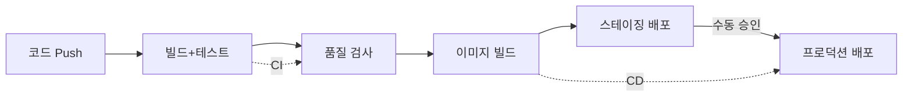
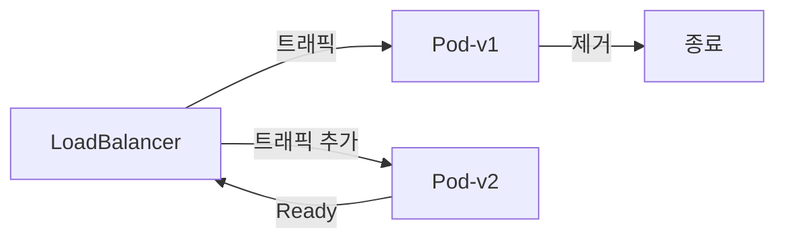
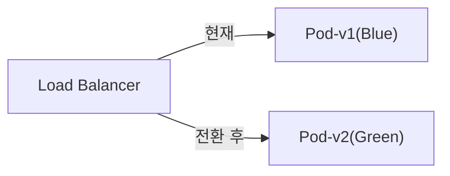
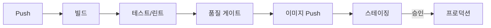

CI/CD는 소프트웨어 개발의 컨베이어벨트다. 코드 변경이 자동으로 빌드 → 테스트 → 배포되며, 각 단계에서 품질이 검증된다. 수동 배포 과정에서 발생하는 휴먼 에러를 제거하고, 배포 주기를 단축한다.

> **비유**: 현대 자동차 공장과 같다. 컨베이어벨트에서 단계마다 자동 검사가 이루어진다. 문제가 발견되면 즉시 라인이 멈추고 수정된다. 과거처럼 완성 후 검사하면 이미 수백 대가 같은 결함을 안고 있다.

---

## CI와 CD의 차이



| 개념 | 의미 | 목적 |
|------|------|------|
| CI (Continuous Integration) | 지속적 통합 | 빌드/테스트 자동화, 조기 버그 발견 |
| CD (Continuous Delivery) | 지속적 제공 | 스테이징까지 자동 배포, 프로덕션은 수동 승인 |
| CD (Continuous Deployment) | 지속적 배포 | 프로덕션까지 완전 자동 배포 |

---

## Jenkins

오픈소스 CI/CD 서버. 가장 오래되고 플러그인 생태계가 방대하다. 자체 서버가 필요하다.

```groovy
// Jenkinsfile (Declarative Pipeline)
pipeline {
    agent any

    environment {
        DOCKER_REGISTRY = 'registry.example.com'
        IMAGE_NAME = 'myapp'
        KUBECONFIG = credentials('kubeconfig-prod')
    }

    stages {
        stage('Build') {
            steps {
                sh './gradlew clean bootJar --no-daemon'
            }
        }

        stage('Test') {
            parallel {
                stage('Unit Test') {
                    steps {
                        sh './gradlew test --no-daemon'
                    }
                    post {
                        always {
                            junit 'build/test-results/test/*.xml'
                        }
                    }
                }
                stage('Integration Test') {
                    steps {
                        sh './gradlew integrationTest --no-daemon'
                    }
                }
            }
        }

        stage('Code Quality') {
            steps {
                withSonarQubeEnv('sonarqube') {
                    sh './gradlew sonarqube'
                }
                waitForQualityGate abortPipeline: true  // 품질 기준 미달 시 파이프라인 중단
            }
        }

        stage('Docker Build & Push') {
            steps {
                script {
                    def imageTag = "${env.BUILD_NUMBER}-${env.GIT_COMMIT.take(7)}"
                    docker.withRegistry("https://${DOCKER_REGISTRY}", 'docker-credentials') {
                        def image = docker.build("${IMAGE_NAME}:${imageTag}")
                        image.push()
                        image.push('latest')
                    }
                }
            }
        }

        stage('Deploy to Staging') {
            steps {
                sh """
                    kubectl set image deployment/myapp-deployment \
                        myapp=${DOCKER_REGISTRY}/${IMAGE_NAME}:${BUILD_NUMBER} \
                        -n staging
                    kubectl rollout status deployment/myapp-deployment -n staging
                """
            }
        }

        stage('Deploy to Production') {
            when { branch 'main' }
            input {
                message "프로덕션 배포 승인?"
                ok "배포"
                submitter "ops-team"  // ops-team만 승인 가능
            }
            steps {
                sh """
                    kubectl set image deployment/myapp-deployment \
                        myapp=${DOCKER_REGISTRY}/${IMAGE_NAME}:${BUILD_NUMBER} \
                        -n production
                    kubectl rollout status deployment/myapp-deployment -n production
                """
            }
        }
    }

    post {
        success {
            slackSend channel: '#deployments', color: 'good',
                message: "빌드 성공: ${env.JOB_NAME} #${env.BUILD_NUMBER}"
        }
        failure {
            slackSend channel: '#deployments', color: 'danger',
                message: "빌드 실패: ${env.JOB_NAME} #${env.BUILD_NUMBER}"
        }
    }
}
```

`parallel` 블록으로 단위 테스트와 통합 테스트를 동시에 실행해 파이프라인 시간을 단축한다.

---

## GitHub Actions

GitHub에 내장된 CI/CD다. YAML로 워크플로우를 정의하며 별도 서버가 불필요하다.


```yaml
# .github/workflows/ci-cd.yml
name: CI/CD Pipeline

on:
  push:
    branches: [main, develop]
  pull_request:
    branches: [main]

env:
  REGISTRY: ghcr.io
  IMAGE_NAME: ${{ github.repository }}

jobs:
  test:
    runs-on: ubuntu-latest
    services:
      mysql:
        image: mysql:8.0
        env:
          MYSQL_ROOT_PASSWORD: rootpass
          MYSQL_DATABASE: testdb
        options: >-
          --health-cmd "mysqladmin ping"
          --health-interval 10s
          --health-retries 5

    steps:
      - uses: actions/checkout@v4

      - name: Set up JDK 17
        uses: actions/setup-java@v4
        with:
          java-version: '17'
          distribution: 'temurin'
          cache: 'gradle'   # Gradle 캐시로 빌드 속도 향상

      - name: Run tests
        run: ./gradlew test integrationTest --no-daemon
        env:
          SPRING_DATASOURCE_URL: jdbc:mysql://localhost:3306/testdb

      - name: SonarQube analysis
        uses: sonarsource/sonarqube-scan-action@master
        env:
          SONAR_TOKEN: ${{ secrets.SONAR_TOKEN }}
          SONAR_HOST_URL: ${{ secrets.SONAR_HOST_URL }}

  build-and-push:
    needs: test               # test job 성공 후에만 실행
    runs-on: ubuntu-latest
    if: github.ref == 'refs/heads/main'
    outputs:
      image-tag: ${{ steps.meta.outputs.tags }}

    steps:
      - uses: actions/checkout@v4

      - name: Log in to registry
        uses: docker/login-action@v3
        with:
          registry: ${{ env.REGISTRY }}
          username: ${{ github.actor }}
          password: ${{ secrets.GITHUB_TOKEN }}

      - name: Extract metadata
        id: meta
        uses: docker/metadata-action@v5
        with:
          images: ${{ env.REGISTRY }}/${{ env.IMAGE_NAME }}
          tags: |
            type=sha,prefix=,suffix=,format=short
            type=raw,value=latest

      - name: Build and push
        uses: docker/build-push-action@v5
        with:
          context: .
          push: true
          tags: ${{ steps.meta.outputs.tags }}
          cache-from: type=gha   # GitHub Actions 캐시 사용
          cache-to: type=gha,mode=max

  deploy-staging:
    needs: build-and-push
    runs-on: ubuntu-latest
    environment: staging       # GitHub Environment protection rules 적용

    steps:
      - name: Deploy to staging
        uses: appleboy/ssh-action@master
        with:
          host: ${{ secrets.STAGING_HOST }}
          username: ${{ secrets.STAGING_USER }}
          key: ${{ secrets.STAGING_KEY }}
          script: |
            kubectl set image deployment/myapp \
              myapp=${{ needs.build-and-push.outputs.image-tag }} \
              -n staging
            kubectl rollout status deployment/myapp -n staging

  deploy-production:
    needs: deploy-staging
    runs-on: ubuntu-latest
    environment:
      name: production          # required_reviewers 설정으로 수동 승인 필요
      url: https://app.example.com

    steps:
      - name: Deploy to production
        run: |
          kubectl set image deployment/myapp \
            myapp=${{ needs.build-and-push.outputs.image-tag }} \
            -n production
          kubectl rollout status deployment/myapp -n production
```


---

## GitLab CI

```yaml
# .gitlab-ci.yml
stages:
  - test
  - build
  - deploy-staging
  - deploy-production

variables:
  DOCKER_IMAGE: $CI_REGISTRY_IMAGE:$CI_COMMIT_SHORT_SHA

test:
  stage: test
  image: gradle:8-jdk17-alpine
  script:
    - gradle test --no-daemon
  artifacts:
    reports:
      junit: build/test-results/test/*.xml
    expire_in: 1 week
  cache:
    paths:
      - .gradle/wrapper
      - .gradle/caches

build:
  stage: build
  image: docker:latest
  services:
    - docker:dind
  script:
    - docker login -u $CI_REGISTRY_USER -p $CI_REGISTRY_PASSWORD $CI_REGISTRY
    - docker build -t $DOCKER_IMAGE .
    - docker push $DOCKER_IMAGE
  only:
    - main
    - develop

deploy-production:
  stage: deploy-production
  environment:
    name: production
    url: https://app.example.com
  script:
    - kubectl set image deployment/myapp myapp=$DOCKER_IMAGE -n production
  when: manual    # 수동 승인 필요
  only:
    - main
```

### 도구 비교

| 항목 | Jenkins | GitHub Actions | GitLab CI |
|------|---------|---------------|-----------|
| 인프라 | 자체 서버 필요 | 불필요 (SaaS) | 내장 (GitLab) |
| 비용 | 서버 비용 | 무료 2000분/월 | 내장 400분/월 |
| 유연성 | 매우 높음 | 높음 | 높음 |
| 학습 곡선 | 가파름 | 완만 | 보통 |
| 추천 상황 | 레거시/온프레미스 | GitHub 사용 팀 | GitLab 사용 팀 |

---

## 배포 전략

### Rolling Update — 기본 전략

Pod를 하나씩 순차적으로 교체한다.



**장점**: 무중단, 추가 인프라 불필요
**단점**: 배포 중 v1/v2 혼재 상태 → API 하위 호환성 필수

### Blue-Green 배포 — 즉시 전환



```bash
# Blue-Green 전환: Service의 selector만 변경 → 즉시 전환
kubectl patch service myapp-service \
  -p '{"spec":{"selector":{"version":"green"}}}'

# 문제 발생 시 즉시 롤백 (1초 이내)
kubectl patch service myapp-service \
  -p '{"spec":{"selector":{"version":"blue"}}}'
```

**장점**: 즉시 롤백 가능, 배포 중 버전 혼재 없음
**단점**: 2배 인프라 비용

### Canary 배포 — 점진적 전환

소수 트래픽만 새 버전으로 보내 이상 없으면 점진적으로 확대한다.

```yaml
# Nginx Ingress Canary — 10% 트래픽을 v2로 보냄
apiVersion: networking.k8s.io/v1
kind: Ingress
metadata:
  name: myapp-canary
  annotations:
    nginx.ingress.kubernetes.io/canary: "true"
    nginx.ingress.kubernetes.io/canary-weight: "10"  # 10% 트래픽
spec:
  rules:
  - host: api.example.com
    http:
      paths:
      - path: /
        pathType: Prefix
        backend:
          service:
            name: myapp-v2-service
            port:
              number: 80
```

단계적 증가: 10% → 30% → 50% → 100%. 각 단계에서 에러율, 레이턴시를 모니터링하다 이상이 있으면 weight를 0으로 되돌린다.

### Feature Flag — 코드 배포와 기능 활성화 분리

배포와 기능 노출을 분리하면 언제든 코드를 배포하고 기능은 나중에 켤 수 있다.

```java
@Service
public class OrderService {
    private final FeatureFlagService featureFlags;

    public Order createOrder(CreateOrderCommand command) {
        if (featureFlags.isEnabled("new-pricing-algorithm", command.getCustomerId())) {
            return createOrderWithNewPricing(command);   // 새 알고리즘
        }
        return createOrderLegacy(command);               // 기존 알고리즘
    }
}
```

특정 사용자(내부 직원, 베타 테스터)에게만 먼저 기능을 활성화해 실제 트래픽으로 검증할 수 있다.

---

## 파이프라인 설계 원칙

1️⃣ **Fail Fast**: 빠른 테스트 먼저, 느린 테스트 나중에 (단위 테스트 → 통합 테스트 순서)
2️⃣ **병렬 실행**: 단위 테스트 + 통합 테스트 + 정적 분석을 동시에 실행
3️⃣ **불변 아티팩트**: 한 번 빌드한 이미지를 dev → staging → production 모든 환경에 배포 (환경마다 재빌드 금지)
4️⃣ **환경 분리**: 같은 이미지, 다른 설정 (ConfigMap/Secret으로 주입)
5️⃣ **자동 롤백**: 배포 후 헬스체크 실패 시 자동 롤백



---


## 극한 시나리오

### 시나리오 1: 배포 직후 에러율 급증 — 자동 롤백

```bash
deploy_and_verify() {
    kubectl set image deployment/myapp myapp=$NEW_IMAGE -n production
    kubectl rollout status deployment/myapp -n production --timeout=5m

    # 1분간 에러율 모니터링
    sleep 60
    ERROR_RATE=$(curl -s "http://prometheus:9090/api/v1/query" \
        --data-urlencode 'query=rate(http_requests_total{status=~"5.."}[1m])' \
        | jq '.data.result[0].value[1]' | tr -d '"')

    if (( $(echo "$ERROR_RATE > 0.01" | bc -l) )); then
        echo "에러율 1% 초과 감지 → 자동 롤백"
        kubectl rollout undo deployment/myapp -n production
        send_alert "프로덕션 자동 롤백 실행됨"
    fi
}
```

### 시나리오 2: 파이프라인이 20분 넘게 걸림

단위 테스트, 통합 테스트, Docker 빌드가 순차 실행되는 경우다.

```
해결:
1. 단위 테스트 + 통합 테스트 병렬 실행
2. Docker 레이어 캐시 활용 (cache-from: type=gha)
3. Gradle 빌드 캐시 활성화
4. 테스트 컨테이너(TestContainers) 재사용 모드 사용
```

### 시나리오 3: main 브랜치 직접 푸시로 불안정한 코드 배포

Branch Protection Rule과 필수 리뷰를 설정해 main 브랜치 직접 푸시를 막는다.

```
GitHub 설정:
- Require pull request reviews before merging (최소 1명)
- Require status checks to pass (CI 통과 필수)
- Restrict who can push to matching branches
```

### 시나리오 4: 환경마다 다른 이미지 빌드 — 운영 환경 재현 불가

"스테이징에서는 됐는데 운영에서 안 됩니다"의 원인 중 하나다. 환경마다 빌드하면 같은 소스도 빌드 시점 의존성 차이로 다르게 동작할 수 있다.

```
해결: 불변 아티팩트 원칙
- CI에서 이미지를 한 번만 빌드 (SHA 태그 부여)
- 같은 이미지를 dev → staging → production 순서로 승격
- 환경 차이는 ConfigMap/Secret/환경변수로만 주입
```

---

## 왜 GitHub Actions인가? (vs Jenkins vs GitLab CI)

| 도구 | 호스팅 | 설정 방법 | 생태계 | 선택 기준 |
|------|--------|---------|--------|---------|
| **GitHub Actions** | SaaS (GitHub 내장) | YAML, Marketplace Action | 매우 풍부 | GitHub 저장소 사용 시 가장 간편 |
| **Jenkins** | 자체 서버 필요 | Groovy Jenkinsfile | 방대한 플러그인 | 복잡한 커스터마이징, 온프레미스 환경 |
| **GitLab CI** | GitLab SaaS/Self-hosted | YAML (.gitlab-ci.yml) | GitLab 내장 | GitLab 저장소 사용 시 |
| **CircleCI** | SaaS | YAML | 중간 | 빠른 빌드, Docker 최적화 |
| **ArgoCD** | 쿠버네티스 내 | Application CRD | K8s 네이티브 | GitOps 배포에 특화 |

```
GitHub Actions를 선택하는 이유:
1. GitHub 저장소와 완벽 통합 (PR 상태 체크, 이슈 연동)
2. Marketplace에 수천 개 Action — 대부분 무료
3. 별도 서버 불필요, 즉시 사용 가능
4. Matrix Strategy로 다중 환경 병렬 테스트

Jenkins를 선택하는 경우:
1. 온프레미스 환경 (외부 SaaS 사용 불가)
2. 수십 년간 쌓인 복잡한 파이프라인 커스터마이징 필요
3. 방대한 플러그인 생태계 활용 필요
```

---

## 실무에서 자주 하는 실수

#### 실수 1: CI 파이프라인에 시크릿 하드코딩

```yaml
# 나쁜 예 — 소스코드에 비밀번호 노출
steps:
  - run: docker login -u myuser -p MyPassword123 registry.example.com
  # → Git 이력에 영구 기록, 보안 사고의 시작

# 좋은 예 — GitHub Secrets 사용
steps:
  - run: docker login -u ${{ secrets.DOCKER_USERNAME }} -p ${{ secrets.DOCKER_PASSWORD }} registry.example.com
```

#### 실수 2: 모든 환경에 동일한 이미지를 새로 빌드

```
나쁜 패턴:
  dev 배포 → dev용 이미지 빌드
  staging 배포 → staging용 이미지 빌드  (같은 소스지만 다시 빌드)
  production 배포 → prod용 이미지 빌드  (또 다시 빌드)
  → 빌드 시점 의존성 차이로 환경마다 다르게 동작할 수 있음

올바른 패턴 (불변 아티팩트):
  CI에서 이미지 한 번만 빌드 → SHA 태그 부여
  → dev, staging, production 모두 같은 이미지 사용
  → 환경 차이는 ConfigMap/환경변수로만 주입
```

#### 실수 3: 테스트 없이 main 브랜치에 직접 Push

```
증상: "로컬에서는 됐는데 운영에서 안 됩니다"
원인: CI 통과 없이 직접 배포

해결:
1. Branch Protection Rule 설정
   - Require status checks to pass before merging
   - Require pull request reviews (최소 1명)
   - Restrict pushes that create matching branches

2. 필수 체크 항목
   - 단위 테스트 통과
   - 통합 테스트 통과
   - 정적 분석 (SonarQube Quality Gate)
```

#### 실수 4: 배포 실패 시 자동 롤백 없음

```yaml
# 자동 롤백 패턴
- name: Deploy and verify
  run: |
    kubectl set image deployment/myapp myapp=$IMAGE -n production
    kubectl rollout status deployment/myapp -n production --timeout=5m || {
      echo "배포 실패 → 롤백 실행"
      kubectl rollout undo deployment/myapp -n production
      exit 1
    }
```

#### 실수 5: 빌드 캐시 미활용으로 느린 파이프라인

```yaml
# Gradle 빌드 캐시 활용
- uses: actions/cache@v4
  with:
    path: |
      ~/.gradle/caches
      ~/.gradle/wrapper
    key: gradle-${{ hashFiles('**/*.gradle*') }}

# Docker 레이어 캐시 활용
- uses: docker/build-push-action@v5
  with:
    cache-from: type=gha
    cache-to: type=gha,mode=max
```

---

## 면접 포인트

### Q. CI와 CD의 차이점은?

```
CI (Continuous Integration — 지속적 통합):
  코드 변경 시 자동으로 빌드 + 테스트 실행
  목적: 통합 문제를 조기 발견
  범위: 코드 Push → 빌드 → 테스트 → 코드 품질 검사

CD (Continuous Delivery — 지속적 제공):
  CI 통과 후 스테이징까지 자동 배포
  프로덕션 배포는 수동 승인 필요

CD (Continuous Deployment — 지속적 배포):
  테스트 통과 후 프로덕션까지 완전 자동 배포
  수동 개입 없음 (높은 테스트 신뢰도 필수)
```

### Q. 블루-그린 배포와 카나리 배포의 차이는?

```
블루-그린 배포:
  블루(구버전) + 그린(신버전) 동시 운영
  → 전환 시 트래픽을 한 번에 100% 전환
  → 롤백: 즉시 블루로 되돌림
  → 비용: 서버 2배
  → 적합: 대규모 변경, 즉시 롤백 필요

카나리 배포:
  신버전에 트래픽 일부(5~10%)만 먼저 전달
  → 이상 없으면 점진적으로 100%까지 확대
  → 장애 시 영향 범위 최소화
  → 적합: 점진적 검증, 리스크 최소화
```

### Q. GitOps와 기존 CI/CD의 차이는?

```
기존 CI/CD (Push 모델):
  CI 서버가 kubectl apply로 클러스터에 직접 배포
  → CI 서버가 클러스터 접근 권한(kubeconfig) 보유 → 보안 위험
  → 배포 후 클러스터 상태 감시 없음

GitOps (Pull 모델):
  모든 배포 상태를 Git YAML로 선언
  → ArgoCD가 클러스터 내부에서 Git을 감시
  → Git과 클러스터 불일치 시 자동 복원 (자가 치유)
  → 모든 변경 이력이 Git에 남음 (감사 로그)
```
