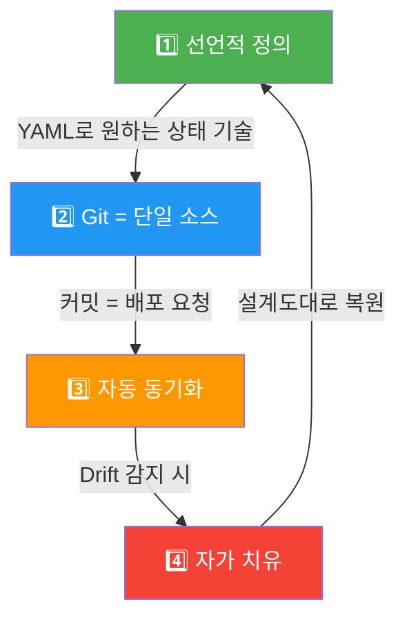
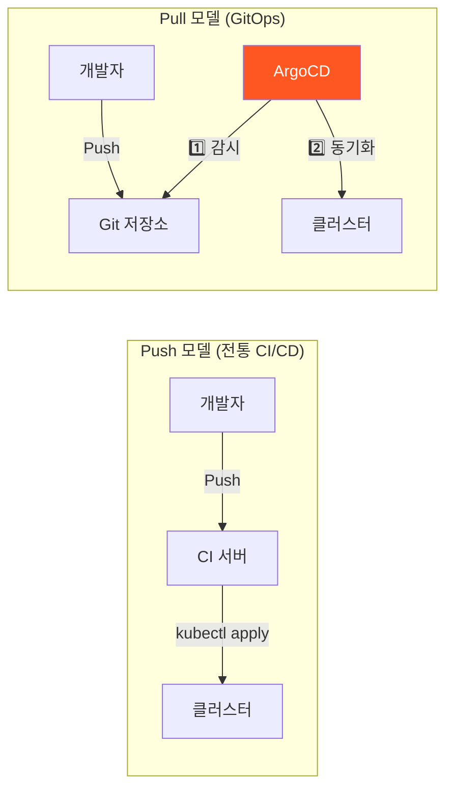
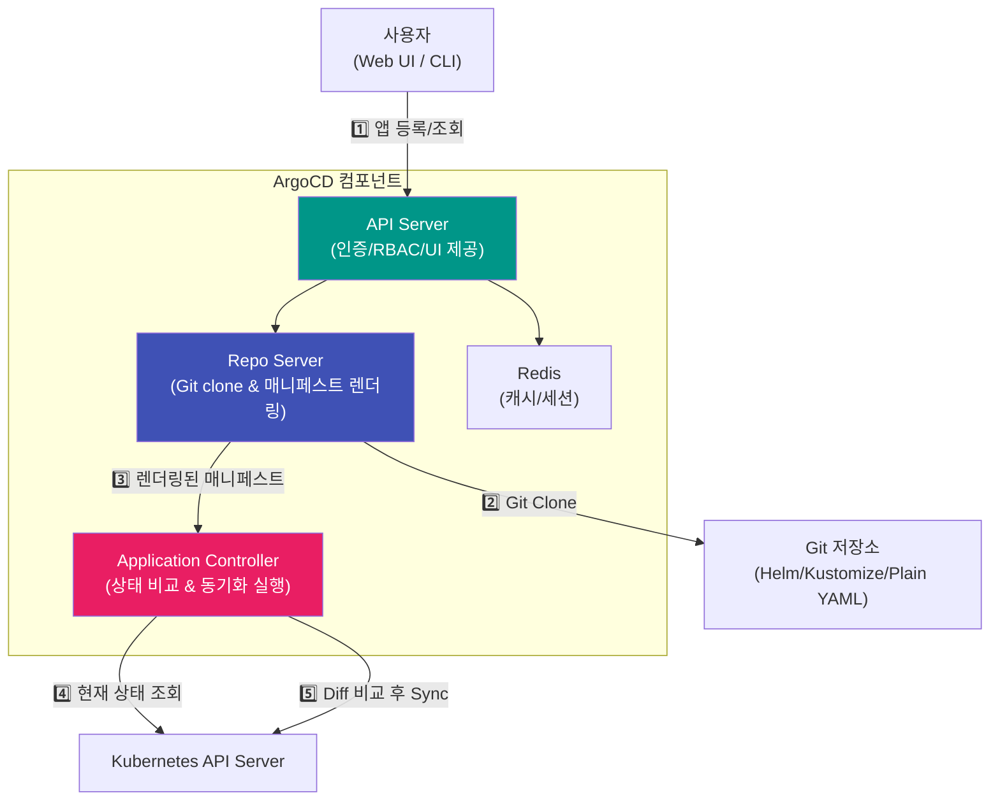
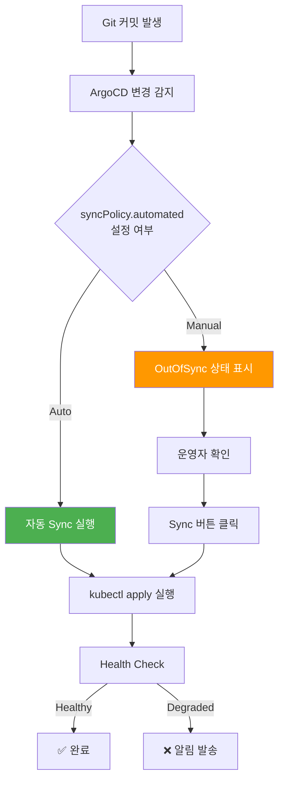
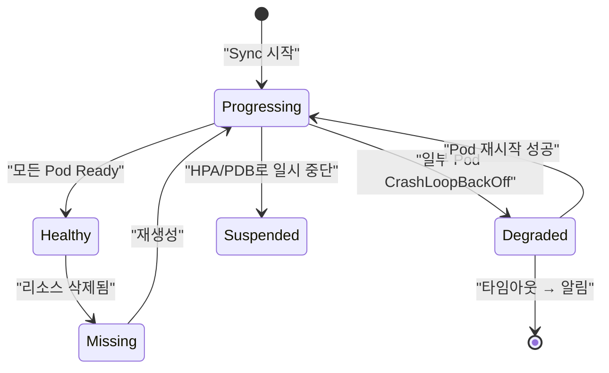
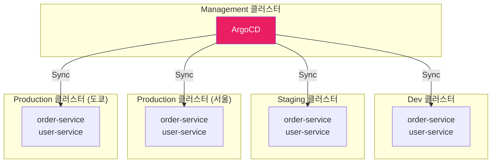
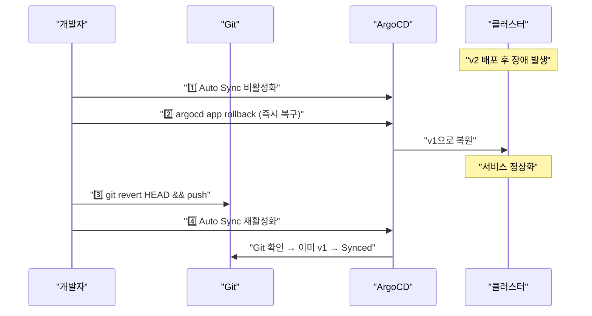

GitOps는 Git 저장소를 인프라와 애플리케이션의 **단일 진실 공급원(Single Source of Truth)**으로 삼아, 클러스터 상태를 선언적으로 관리하는 운영 모델이다. ArgoCD는 이 GitOps 원칙을 Kubernetes 위에서 구현한 대표적인 도구다.

> **비유:** 건축 설계도와 시공 현장의 관계를 떠올려 보자. 설계도(Git)에 "3층 건물, 창문 12개"라고 적혀 있으면, 시공 현장(클러스터)은 반드시 그 설계도대로 지어져야 한다. 누군가 현장에서 임의로 창문을 15개로 바꾸면, 감리관(ArgoCD)이 즉시 감지하고 설계도대로 되돌린다.

---

## GitOps란 무엇인가

전통적인 배포는 **명령적(Imperative)** 방식이다. 운영자가 `kubectl apply`, `helm install` 같은 명령을 직접 실행한다. 누가, 언제, 어떤 명령을 실행했는지 추적하기 어렵고, 여러 사람이 동시에 클러스터를 수정하면 상태가 꼬인다.

GitOps는 이를 뒤집는다. 원하는 상태를 YAML 파일로 Git에 저장하고, 에이전트(ArgoCD 등)가 Git과 클러스터를 지속적으로 비교해서 **차이가 발생하면 자동으로 맞춘다**. 사람은 Git에만 커밋하고, 클러스터에는 직접 손대지 않는다.

> **비유:** 가전제품의 에어컨 리모컨과 같다. 리모컨에서 25도를 설정하면(Git 커밋), 에어컨(에이전트)이 현재 온도와 설정 온도를 계속 비교하며 알아서 냉방/난방을 조절한다. 사람이 에어컨 내부 부품을 직접 건드리지 않는다.

### GitOps 4대 원칙



| 원칙 | 의미 | 왜 중요한가 |
|------|------|-------------|
| 선언적(Declarative) | 시스템의 원하는 상태를 YAML/JSON으로 기술 | "어떻게(How)"가 아닌 "무엇(What)"에 집중, 재현 가능 |
| Git 단일 소스 | 모든 인프라/앱 설정이 Git에만 존재 | 변경 이력 추적, 코드 리뷰로 배포 승인, 감사 로그 자동 생성 |
| 자동 동기화 | Git 변경이 감지되면 자동으로 클러스터에 적용 | 사람의 개입 없이 일관된 배포, 수동 실수 제거 |
| 자가 치유(Self-Healing) | 클러스터 상태가 Git과 다르면 자동 복원 | kubectl로 임의 변경해도 원래 상태로 되돌림 |

**선언적 정의**는 Kubernetes 자체가 선언적 시스템이기 때문에 자연스럽게 맞아떨어진다. Deployment에 `replicas: 3`이라고 적으면 Kubernetes가 알아서 3개를 유지한다. GitOps는 이 선언적 개념을 Git 저장소 레벨로 확장한 것이다.

**Git 단일 소스**가 핵심이다. 운영자가 `kubectl edit`으로 직접 변경한 것은 Git에 기록되지 않는다. 다음 동기화 때 Git 상태로 덮어쓰여 사라진다. 모든 변경은 반드시 Git PR을 통해야 한다. 이것이 곧 감사 로그(Audit Log)가 된다.

**자가 치유**는 가장 강력한 특성이다. 누군가 실수로 프로덕션에서 `kubectl delete pod`를 실행하거나, `kubectl scale deployment --replicas=1`로 줄여도, ArgoCD가 Git의 원래 상태로 복원한다.

> **비유:** 자가 치유는 GPS 내비게이션과 같다. 운전자가 잘못된 길로 빠져도 내비게이션이 즉시 "경로를 이탈했습니다"라고 알려주고, 원래 경로로 재안내한다. ArgoCD도 클러스터가 Git 상태에서 이탈하면 즉시 감지하고 원래 경로로 되돌린다.

---

## Push vs Pull 배포 모델

GitOps를 이해하려면 기존 CI/CD(Push 모델)와의 차이를 명확히 알아야 한다.



**Push 모델**에서는 CI 서버(Jenkins, GitHub Actions)가 빌드 후 `kubectl apply`로 클러스터에 직접 배포한다. CI 서버가 클러스터 접근 권한(kubeconfig)을 가져야 하며, 이는 보안 위험이다. CI 파이프라인 실행이 끝나면 그 이후 클러스터 상태는 아무도 감시하지 않는다.

**Pull 모델**에서는 클러스터 내부의 ArgoCD가 Git을 주기적으로(기본 3분) 폴링하거나 Webhook으로 변경을 감지한다. CI 서버에 클러스터 접근 권한을 줄 필요가 없다. ArgoCD가 클러스터 내부에서 동작하므로, 외부에서 클러스터로의 인바운드 접근이 불필요하다.

> **비유:** Push 모델은 택배 기사가 집 열쇠를 가지고 있어서 직접 문을 열고 택배를 놓는 것이다(보안 위험). Pull 모델은 집 안의 로봇 청소기가 현관 앞에 택배가 있는지 주기적으로 확인하고, 있으면 스스로 가져오는 것이다(외부 접근 불필요).

---

## ArgoCD 아키텍처

ArgoCD는 Kubernetes 네이티브 컨트롤러다. 클러스터 내부에 설치되어 Git 저장소와 클러스터 상태를 지속적으로 비교한다.



### 각 컴포넌트의 역할

**API Server**는 ArgoCD의 관문이다. Web UI, CLI(`argocd`), Webhook 요청을 모두 이 서버가 받는다. 사용자 인증(SSO/OIDC/LDAP), RBAC 정책을 처리한다. Dex를 내장하고 있어 GitHub, GitLab, SAML 등 다양한 IdP와 연동할 수 있다.

**Repo Server**는 Git 저장소를 clone하고, Helm 차트나 Kustomize 오버레이를 **최종 Kubernetes 매니페스트로 렌더링**하는 역할이다. `helm template`이나 `kustomize build`를 실행하여 순수 YAML을 생성한다. 이 컴포넌트가 분리된 이유는 보안이다. Git 자격 증명을 Repo Server만 가지고 있으면 되므로, 공격 표면이 줄어든다.

> **비유:** Repo Server는 건축 사무소의 CAD 엔지니어와 같다. 설계 도면(Helm 차트)을 받아서 실제 시공에 필요한 상세 도면(렌더링된 YAML)으로 변환한다. 현장 감독(Controller)은 이 상세 도면만 보고 시공한다.

**Application Controller**가 ArgoCD의 심장이다. 3분마다(설정 가능) Git에서 렌더링된 "원하는 상태"와 클러스터의 "현재 상태"를 비교한다. 차이가 있으면 `OutOfSync` 상태로 표시하고, 자동 동기화가 켜져 있으면 클러스터를 Git 상태로 맞춘다. 자동 동기화가 꺼져 있으면 대시보드에 경고만 표시하고 사람의 승인을 기다린다.

**Redis**는 Repo Server가 렌더링한 매니페스트 캐시와 API Server의 세션 데이터를 저장한다. Git 저장소를 매번 clone/render하면 느리기 때문에, 변경이 없으면 캐시를 재사용한다.

---

## Application CRD

ArgoCD에서 배포 단위는 **Application**이라는 Custom Resource다. "어떤 Git 저장소의 어떤 경로를 어떤 클러스터의 어떤 네임스페이스에 배포할 것인가"를 정의한다.

Application CRD는 ArgoCD의 핵심 추상화이다. 하나의 Application은 하나의 Git 경로와 하나의 Kubernetes 네임스페이스를 연결한다. 이 매핑 관계가 명확하기 때문에, 수백 개의 마이크로서비스도 각각 독립적인 Application으로 관리할 수 있다.

source 필드에는 Git 저장소 URL, 브랜치/태그, 경로를 지정한다. destination 필드에는 배포 대상 클러스터와 네임스페이스를 지정한다. syncPolicy 필드에서 자동 동기화, 자가 치유, 가지치기(Prune) 정책을 결정한다.

```yaml
# ArgoCD Application CRD
apiVersion: argoproj.io/v1alpha1
kind: Application
metadata:
  name: order-service
  namespace: argocd
spec:
  project: default

  source:
    repoURL: https://github.com/myorg/k8s-manifests.git
    targetRevision: main        # 브랜치, 태그, 커밋 SHA 모두 가능
    path: apps/order-service    # 이 경로의 매니페스트를 배포

  destination:
    server: https://kubernetes.default.svc  # in-cluster
    namespace: production

  syncPolicy:
    automated:
      prune: true       # Git에서 삭제된 리소스는 클러스터에서도 삭제
      selfHeal: true    # kubectl로 직접 변경해도 Git 상태로 복원
    syncOptions:
      - CreateNamespace=true   # 네임스페이스 없으면 자동 생성
    retry:
      limit: 5
      backoff:
        duration: 5s
        factor: 2
        maxDuration: 3m
```

**이 코드의 핵심:**
- `automated.prune: true` — Git에서 리소스를 삭제하면 클러스터에서도 자동 삭제된다. false이면 고아 리소스가 남는다.
- `automated.selfHeal: true` — 자가 치유 활성화. 누군가 `kubectl edit`으로 변경해도 Git 상태로 되돌린다.
- `retry` — Sync 실패 시 지수 백오프로 재시도. 일시적 API Server 부하 등에 대응한다.

---

## Sync 전략: Auto vs Manual

ArgoCD의 동기화 전략은 "자동(Auto)"과 "수동(Manual)" 두 가지다. 환경에 따라 적절히 선택해야 한다.



**Auto Sync**는 Git에 커밋하면 자동으로 배포된다. 개발/스테이징 환경에 적합하다. 빠른 피드백 루프가 가능하지만, 잘못된 커밋이 즉시 반영되는 위험이 있다.

**Manual Sync**는 Git 변경을 감지하면 `OutOfSync` 상태로 표시만 하고 대기한다. 운영자가 대시보드에서 diff를 확인하고 Sync 버튼을 눌러야 반영된다. 프로덕션 환경에 적합하다.

> **비유:** Auto Sync는 자동문이다. 사람이 다가가면(커밋) 알아서 열린다. Manual Sync는 인터폰이 있는 출입문이다. 방문자가 오면(커밋) 경비원(운영자)이 CCTV(diff)로 확인한 후 문을 열어준다(Sync).

### 실무 권장 설정

| 환경 | Sync 방식 | prune | selfHeal | 이유 |
|------|-----------|-------|----------|------|
| dev | Auto | true | true | 빠른 반복 개발, 실험 |
| staging | Auto | true | false | 자동 배포하되, 디버깅 시 수동 변경 허용 |
| production | Manual | false | true | 사람이 승인, 실수 삭제 방지, 임의 변경 복원 |

프로덕션에서 `prune: false`로 설정하는 이유는 안전이다. 개발자가 실수로 Git에서 Deployment YAML을 삭제하면 프로덕션 서비스가 내려간다. prune을 끄면 이런 사고를 방지할 수 있다. 대신 고아 리소스가 쌓이므로 주기적으로 정리해야 한다.

---

## Health Check

ArgoCD는 Kubernetes 리소스의 **Health Status**를 자체적으로 판단한다. 단순히 리소스가 존재하는지가 아니라, 실제로 정상 동작하는지를 확인한다.



| 상태 | 의미 | 예시 |
|------|------|------|
| Healthy | 리소스가 정상 동작 중 | Deployment의 모든 Pod가 Ready |
| Progressing | 아직 원하는 상태에 도달하지 않음 | 롤링 업데이트 진행 중 |
| Degraded | 비정상 상태 | Pod가 CrashLoopBackOff |
| Suspended | 의도적으로 일시 중단 | CronJob 대기 중 |
| Missing | 리소스가 존재하지 않음 | 클러스터에서 삭제됨 |

기본 Health Check 외에 **커스텀 Health Check**도 정의할 수 있다. 예를 들어, CRD(Custom Resource Definition)로 만든 리소스는 ArgoCD가 기본적으로 Health를 판단할 수 없다. 이 경우 Lua 스크립트로 Health 로직을 추가한다.

ArgoCD의 Health Check는 Kubernetes의 Readiness Probe와 다른 레벨의 검사다. Readiness Probe는 개별 Pod가 트래픽을 받을 준비가 됐는지 확인하고, ArgoCD Health Check는 Deployment 전체가 원하는 replicas 수만큼 Ready Pod를 확보했는지를 확인한다. 상위 레벨의 통합적인 건강 판단이다.

> **비유:** Readiness Probe는 각 선수의 체력 테스트이고, ArgoCD Health Check는 팀 전체의 출전 가능 여부를 판단하는 감독의 결정이다. 선수 11명 중 3명이 부상이면 개별 테스트는 8명이 통과해도, 감독은 "팀 상태 비정상"으로 판단한다.

---

## Helm + Kustomize 연동

실무에서는 Plain YAML만으로 관리하기 어렵다. 환경(dev/staging/prod)마다 설정이 다르고, 공통 템플릿을 재사용해야 한다. ArgoCD는 Helm과 Kustomize를 네이티브로 지원한다.

### Helm 차트 연동

Helm 차트를 사용하면 values 파일로 환경별 설정을 분리할 수 있다. ArgoCD의 Repo Server가 `helm template`을 실행하여 최종 매니페스트를 생성한다. Tiller가 필요 없다(Helm 3 기준).

Helm 연동의 핵심은 **Git 저장소에 values 파일을 함께 관리하는 것**이다. 차트는 공용 Helm Repository에서 가져오되, 우리 조직에 맞는 values만 Git에서 관리하면 된다. 이렇게 하면 차트 업그레이드와 설정 변경을 독립적으로 관리할 수 있다.

```yaml
# ArgoCD Application — Helm 차트 사용
apiVersion: argoproj.io/v1alpha1
kind: Application
metadata:
  name: order-service
  namespace: argocd
spec:
  source:
    repoURL: https://github.com/myorg/k8s-manifests.git
    targetRevision: main
    path: charts/order-service
    helm:
      valueFiles:
        - values.yaml                # 공통 설정
        - values-production.yaml     # 환경별 오버라이드
      parameters:                    # 개별 값 오버라이드
        - name: image.tag
          value: "v2.3.1"
        - name: replicaCount
          value: "5"
  destination:
    server: https://kubernetes.default.svc
    namespace: production
```

**이 코드의 핵심:**
- `valueFiles`로 공통 설정과 환경별 설정을 분리한다. 파일 순서가 중요하다 — 뒤의 파일이 앞의 값을 오버라이드한다.
- `parameters`로 개별 값을 직접 지정할 수 있다. CI에서 이미지 태그를 동적으로 변경할 때 유용하다.

### Kustomize 연동

Kustomize는 base(기본 매니페스트)와 overlay(환경별 패치)로 구성된다. Helm처럼 템플릿 문법을 배울 필요 없이, 순수 YAML 패치만으로 환경별 차이를 관리한다.

디렉토리 구조가 명확해야 한다. base에는 모든 환경에 공통인 매니페스트를, overlays에는 환경별로 다른 부분만 패치로 작성한다. ArgoCD가 `kustomize build`를 실행하여 base + overlay를 합친 최종 매니페스트를 생성한다.

```
k8s-manifests/
├── base/
│   ├── kustomization.yaml
│   ├── deployment.yaml
│   ├── service.yaml
│   └── configmap.yaml
└── overlays/
    ├── dev/
    │   ├── kustomization.yaml
    │   └── replica-patch.yaml    # replicas: 1
    ├── staging/
    │   ├── kustomization.yaml
    │   └── replica-patch.yaml    # replicas: 2
    └── production/
        ├── kustomization.yaml
        ├── replica-patch.yaml    # replicas: 5
        └── resource-patch.yaml   # CPU/Memory 상향
```

```yaml
# overlays/production/kustomization.yaml
apiVersion: kustomize.config.k8s.io/v1beta1
kind: Kustomization

resources:
  - ../../base

namePrefix: prod-

patches:
  - path: replica-patch.yaml
  - path: resource-patch.yaml

configMapGenerator:
  - name: app-config
    behavior: merge
    literals:
      - LOG_LEVEL=WARN
      - DB_POOL_SIZE=20
```

**이 코드의 핵심:**
- `resources: ../../base`로 기본 매니페스트를 참조한다.
- `patches`로 프로덕션에서만 다른 부분(replicas, 리소스 제한 등)을 오버라이드한다.
- `namePrefix`로 환경별 리소스 이름 충돌을 방지한다.

> **비유:** Kustomize는 옷의 기본형과 맞춤 수선이다. 기본형(base) 셔츠를 만들고, 고객(환경)마다 소매 길이(replicas)나 단추 색상(설정값)만 다르게 수선(overlay)한다. 새 셔츠를 처음부터 만들 필요 없다.

### Helm vs Kustomize 비교

| 항목 | Helm | Kustomize |
|------|------|-----------|
| 학습 곡선 | Go 템플릿 문법 학습 필요 | 순수 YAML, 낮은 진입장벽 |
| 유연성 | 조건문, 반복문 가능 | 단순 패치/오버레이만 가능 |
| 패키지 배포 | 차트로 패키지화, 공유 쉬움 | 패키지 개념 없음 |
| 디버깅 | `helm template`로 렌더링 확인 | `kustomize build`로 결과 확인 |
| 추천 상황 | 복잡한 템플릿, 외부 공유 | 환경별 간단한 차이 관리 |

---

## 멀티 클러스터 관리

ArgoCD 하나로 여러 Kubernetes 클러스터를 관리할 수 있다. 중앙의 Management 클러스터에 ArgoCD를 설치하고, 원격 클러스터를 등록하면 된다.

멀티 클러스터 관리가 필요한 이유는 실무에서 대부분의 조직이 dev/staging/production 클러스터를 분리하기 때문이다. 더 나아가 리전별(서울/도쿄/버지니아)로 클러스터를 운영하는 경우도 있다. 각 클러스터마다 ArgoCD를 설치하면 관리 포인트가 급증한다.



원격 클러스터를 등록하고 Application에서 대상 클러스터를 지정하면 된다. 각 클러스터별로 다른 Git 경로(overlay)를 사용하여 환경별 설정을 분리한다.

```bash
# 1. 원격 클러스터 등록
argocd cluster add production-seoul \
  --kubeconfig ~/.kube/prod-seoul.conf \
  --name prod-seoul

argocd cluster add production-tokyo \
  --kubeconfig ~/.kube/prod-tokyo.conf \
  --name prod-tokyo

# 2. 등록된 클러스터 확인
argocd cluster list
```

```yaml
# 서울 프로덕션 Application
apiVersion: argoproj.io/v1alpha1
kind: Application
metadata:
  name: order-service-prod-seoul
  namespace: argocd
spec:
  source:
    repoURL: https://github.com/myorg/k8s-manifests.git
    path: overlays/production-seoul
  destination:
    server: https://prod-seoul.k8s.example.com  # 서울 클러스터
    namespace: production
```

**이 코드의 핵심:**
- `destination.server`를 변경하는 것만으로 배포 대상 클러스터를 전환할 수 있다.
- 같은 Git 저장소에서 클러스터별 overlay를 분리하여 관리한다.

### ApplicationSet으로 대량 관리

클러스터가 10개, 마이크로서비스가 50개면 Application을 500개 수동으로 만들 수 없다. **ApplicationSet**은 템플릿으로 Application을 자동 생성한다.

ApplicationSet의 Generator가 클러스터 목록, Git 디렉토리 목록, JSON 파일 등에서 파라미터를 읽어와 Application 템플릿에 주입한다. 새 클러스터를 추가하거나 새 서비스 디렉토리를 만들면 Application이 자동 생성된다.

```yaml
apiVersion: argoproj.io/v1alpha1
kind: ApplicationSet
metadata:
  name: order-service-all-clusters
  namespace: argocd
spec:
  generators:
    - clusters:
        selector:
          matchLabels:
            env: production     # production 라벨이 붙은 모든 클러스터
  template:
    metadata:
      name: 'order-service-{{name}}'
    spec:
      source:
        repoURL: https://github.com/myorg/k8s-manifests.git
        path: 'overlays/{{metadata.labels.region}}'
      destination:
        server: '{{server}}'
        namespace: production
      syncPolicy:
        automated:
          prune: true
          selfHeal: true
```

**이 코드의 핵심:**
- `clusters` Generator가 ArgoCD에 등록된 클러스터 중 `env: production` 라벨이 있는 것만 선택한다.
- `{{name}}`, `{{server}}`, `{{metadata.labels.region}}`이 각 클러스터의 값으로 치환되어 Application이 자동 생성된다.

> **비유:** ApplicationSet은 우편물 대량 발송이다. 수신자 명단(클러스터 목록)과 편지 템플릿(Application)을 주면, 이름과 주소만 바꿔서 자동으로 모든 수신자에게 발송한다.

---

## Rollback 전략

ArgoCD에서 롤백은 두 가지 방식이 있다. Git 기반 롤백(권장)과 ArgoCD 자체 롤백이다.

### Git 기반 롤백 (권장)

GitOps 원칙에 충실한 방법이다. Git에서 이전 커밋으로 되돌리면, ArgoCD가 변경을 감지하고 자동으로 이전 버전을 배포한다.

```bash
# 방법 1: git revert (기록 보존 — 권장)
git revert HEAD
git push origin main
# ArgoCD가 자동으로 이전 상태로 Sync

# 방법 2: values 파일의 이미지 태그만 변경
# values-production.yaml에서 image.tag를 이전 버전으로 수정 후 커밋
```

Git 기반 롤백의 장점은 **롤백 자체도 Git 이력으로 남는다**는 것이다. "언제, 누가, 왜 롤백했는지"가 커밋 메시지에 기록된다. `git revert`를 사용하면 롤백을 다시 롤백하는 것도 쉽다.

### ArgoCD 자체 롤백

긴급 상황에서 Git 커밋을 기다릴 수 없을 때 사용한다. ArgoCD가 이전 Sync 히스토리를 기억하고 있어, 즉시 이전 상태로 되돌릴 수 있다.

```bash
# ArgoCD CLI로 즉시 롤백
argocd app history order-service
# ID  DATE                 REVISION
# 3   2026-05-03 10:00:00  abc1234    ← 현재 (문제 버전)
# 2   2026-05-02 15:00:00  def5678    ← 이전 (정상 버전)

argocd app rollback order-service 2
```

**주의:** ArgoCD 자체 롤백은 Git과 클러스터 상태가 불일치(OutOfSync)하게 된다. 자동 동기화가 켜져 있으면 곧 다시 문제 버전으로 Sync된다. 따라서 ArgoCD 롤백 후 반드시 Git에서도 revert하고, 그 사이에 자동 Sync가 실행되지 않도록 일시적으로 Auto Sync를 끄는 것이 안전하다.

> **비유:** Git 기반 롤백은 법적 절차를 밟아 계약을 해지하는 것이다(기록이 남고 안전). ArgoCD 자체 롤백은 구두로 "그 계약 없던 걸로"라고 하는 것이다(빠르지만 나중에 혼란 발생 가능).



---

<details class="extreme-scenario-details">
<summary class="extreme-scenario-summary">
<span class="extreme-scenario-icon">🔥</span>
<span class="extreme-scenario-label">극한 시나리오 — 클릭하여 펼치기</span>
<span class="extreme-scenario-toggle"></span>
</summary>
<div class="extreme-scenario-body">

<div class="extreme-scenario-content" markdown="1">

### 시나리오 1: Git 저장소 장애 — ArgoCD가 Git에 접근 불가

Git 서버(GitHub/GitLab)가 30분간 다운되면 어떻게 되는가?

ArgoCD는 Git에 접근할 수 없으므로 새로운 변경을 감지할 수 없다. 하지만 **기존에 배포된 서비스는 영향 없다**. Kubernetes는 이미 배포된 Pod를 독립적으로 관리한다. ArgoCD는 마지막으로 캐시한 상태를 유지하며, Git이 복구되면 자동으로 정상 동작한다.

위험한 상황은 Git 장애 중에 긴급 핫픽스가 필요할 때다. GitOps 원칙을 깨고 `kubectl apply`로 직접 배포해야 할 수 있다. 이 경우 Git 복구 후 반드시 해당 변경을 Git에 커밋해야 한다. 안 그러면 ArgoCD가 직접 배포한 변경을 "Drift"로 감지하고 되돌려 버린다.

### 시나리오 2: 잘못된 매니페스트가 main에 머지 — 프로덕션 서비스 다운

Auto Sync가 켜진 프로덕션에서 문법 오류가 있는 YAML이 main에 머지되면, ArgoCD가 즉시 잘못된 매니페스트를 적용한다. 다행히 Kubernetes는 잘못된 매니페스트를 거부하므로 기존 리소스는 유지된다. 하지만 유효한 매니페스트지만 논리적으로 잘못된 경우(예: `replicas: 0`)는 바로 적용되어 서비스가 내려간다.

**방어 전략:**
1. PR에서 `kubeval`이나 `kustomize build | kubectl apply --dry-run=server`로 매니페스트 검증
2. ArgoCD의 **Sync Window**를 설정하여 업무 시간에만 Sync 허용
3. 프로덕션은 Manual Sync로 운영

### 시나리오 3: 100개 마이크로서비스 동시 배포 — ArgoCD 과부하

모노레포에서 공통 라이브러리를 변경하면 100개 서비스가 동시에 빌드되고, 100개 Application이 동시에 Sync를 시도한다. Application Controller가 과부하에 걸려 Sync가 느려지거나 실패한다.

**방어 전략:**
1. Application Controller의 `--status-processors`와 `--operation-processors` 수를 늘린다 (기본 20 → 50)
2. **Sync Wave**를 사용하여 배포 순서를 제어한다. DB 마이그레이션 → 핵심 서비스 → 부가 서비스 순서로 단계별 배포
3. Repo Server를 수평 확장한다 (replicas 증가)

> **비유:** 100명이 동시에 엘리베이터를 타려면 과부하가 걸린다. Sync Wave는 "1층 사람 먼저, 2층 사람 다음, 3층 사람 마지막"으로 순서를 정해 안전하게 운반하는 것이다.

---
</div>
</div>
</details>

## 실무에서 자주 하는 실수

### 실수 1: 앱 소스 코드와 매니페스트를 같은 저장소에 관리

앱 코드가 변경될 때마다 ArgoCD가 매니페스트 변경을 감지하려고 전체 저장소를 스캔한다. 빌드 결과물인 이미지 태그 변경을 위해 앱 코드 저장소에 커밋하면 CI가 다시 트리거되는 무한 루프가 발생할 수 있다.

**해결:** 앱 소스 코드 저장소와 Kubernetes 매니페스트 저장소를 분리한다. CI는 소스 저장소에서 트리거되고, 빌드 완료 후 매니페스트 저장소의 이미지 태그만 업데이트한다.

### 실수 2: selfHeal을 켜놓고 디버깅할 때 혼란

프로덕션 장애 시 `kubectl edit`으로 환경 변수를 변경하며 디버깅하는데, 몇 분 뒤 ArgoCD가 원래 상태로 되돌려 버린다. 디버깅 중에 설정이 계속 리셋되어 원인 파악이 어려워진다.

**해결:** 긴급 디버깅 시 해당 Application의 Auto Sync를 일시적으로 끈다. `argocd app set order-service --sync-policy none` 명령으로 자동 동기화를 중지하고, 디버깅이 끝나면 Git에 수정사항을 반영한 후 다시 활성화한다.

### 실수 3: Secret을 Git에 평문으로 저장

GitOps는 모든 것을 Git에 저장하라고 했는데, 그 말을 그대로 따라 DB 비밀번호, API 키를 평문 YAML로 커밋한다. Git 이력에 영구적으로 남아 보안 사고의 원인이 된다.

**해결:** Sealed Secrets, SOPS, HashiCorp Vault, AWS Secrets Manager 등 외부 시크릿 관리 도구를 사용한다. Git에는 암호화된 시크릿만 저장하고, 클러스터 내에서 복호화한다.

### 실수 4: targetRevision을 `HEAD`로 설정

`targetRevision: HEAD`는 모든 브랜치의 최신 커밋을 추적한다. feature 브랜치가 머지되기 전에 프로덕션에 반영될 수 있다.

**해결:** 프로덕션은 반드시 `targetRevision: main` 또는 특정 태그를 사용한다.

### 실수 5: Sync Wave 없이 의존 관계가 있는 리소스 배포

ConfigMap이 아직 생성되지 않은 상태에서 Deployment가 먼저 배포되면 Pod가 시작 실패한다.

**해결:** `argocd.argoproj.io/sync-wave` 어노테이션으로 배포 순서를 지정한다.

```yaml
# 1단계: ConfigMap/Secret 먼저
metadata:
  annotations:
    argocd.argoproj.io/sync-wave: "0"
---
# 2단계: Deployment
metadata:
  annotations:
    argocd.argoproj.io/sync-wave: "1"
---
# 3단계: Ingress
metadata:
  annotations:
    argocd.argoproj.io/sync-wave: "2"
```

---

## 면접 포인트

### Q1: GitOps가 기존 CI/CD와 다른 점은?

핵심 차이는 **배포 방향**이다. 기존 CI/CD는 Push 모델로 CI 서버가 클러스터에 명령을 보낸다. GitOps는 Pull 모델로 클러스터 내부 에이전트가 Git을 감시한다. 이로 인해 (1) CI 서버에 클러스터 접근 권한을 줄 필요가 없어 보안이 강화되고, (2) 배포 후에도 지속적으로 상태를 감시하여 Drift를 감지하고, (3) 모든 변경이 Git PR로 이루어져 감사 추적이 가능하다.

### Q2: ArgoCD에서 selfHeal과 prune의 차이는?

`selfHeal`은 **외부 변경으로부터 보호**한다. 누군가 `kubectl`로 직접 클러스터 상태를 변경하면 Git 상태로 되돌린다. `prune`은 **삭제 동기화**다. Git에서 리소스 파일을 삭제하면 클러스터에서도 해당 리소스를 삭제한다. prune이 꺼져 있으면 Git에서 파일을 지워도 클러스터에 고아 리소스가 남는다.

### Q3: 프로덕션에서 긴급 롤백 순서는?

1️⃣ Auto Sync 비활성화 → 2️⃣ ArgoCD CLI로 즉시 롤백(`argocd app rollback`) → 3️⃣ 서비스 정상화 확인 → 4️⃣ Git에서 `git revert`로 원인 커밋 되돌리기 → 5️⃣ Git 상태와 클러스터 상태 일치 확인 후 Auto Sync 재활성화. 핵심은 "먼저 복구, 나중에 정리"이며, Git과 클러스터의 최종 상태는 반드시 일치해야 한다.

### Q4: Helm과 Kustomize 중 어떤 것을 선택해야 하는가?

외부에 배포 가능한 패키지(차트)로 공유해야 한다면 Helm이다. 사내에서 환경별 설정만 분리하면 된다면 Kustomize가 간단하다. 실무에서는 둘을 함께 사용하기도 한다 — 외부 Helm 차트를 가져오되, Kustomize로 조직에 맞게 패치하는 방식이다.

### Q5: ArgoCD의 Application Controller가 죽으면 운영 중인 서비스에 영향이 있는가?

없다. ArgoCD는 배포 도구일 뿐, 런타임에 트래픽을 처리하지 않는다. Controller가 죽어도 이미 배포된 Pod는 Kubernetes가 독립적으로 관리한다. 다만 새로운 배포, 롤백, Drift 감지가 불가능해진다. ArgoCD 자체의 고가용성을 위해 Controller를 2개 이상 실행하고, Redis를 HA 모드로 구성하는 것이 권장된다.

---

## 핵심 정리

| 개념 | 한 줄 요약 |
|------|-----------|
| GitOps | Git = 인프라의 단일 진실 공급원, Pull 모델로 동기화 |
| ArgoCD | Kubernetes 네이티브 GitOps 컨트롤러 |
| Application CRD | "Git 경로 → 클러스터 네임스페이스" 매핑 |
| Auto Sync | Git 변경 시 자동 배포 (dev/staging 권장) |
| Manual Sync | 사람이 확인 후 배포 (production 권장) |
| Self-Heal | 클러스터 Drift를 Git 상태로 자동 복원 |
| Prune | Git에서 삭제된 리소스를 클러스터에서도 삭제 |
| ApplicationSet | 템플릿으로 Application 대량 자동 생성 |
| Sync Wave | 리소스 배포 순서 제어 |
| Health Check | 리소스의 실제 동작 상태 판단 (Healthy/Degraded 등) |
