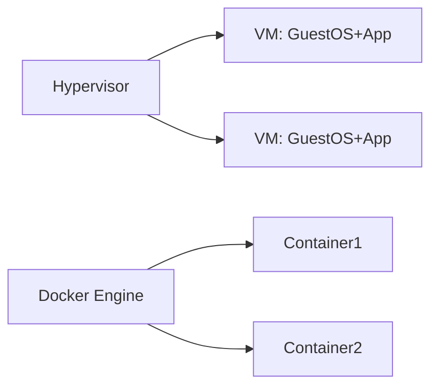

Docker는 소프트웨어를 컨테이너라는 표준 단위로 포장하는 기술이다. "내 로컬에서는 되는데 서버에서 안 돼요" 문제를 근본적으로 해결한다. 애플리케이션과 그 실행에 필요한 모든 것(라이브러리, 설정, 런타임)을 하나의 이미지에 담아 어떤 환경에서도 동일하게 실행된다.

> **비유**: 이사할 때 규격화된 컨테이너 박스에 짐을 넣는 것과 같다. 박스 규격이 표준화돼 있으므로 어떤 이사업체든, 어떤 트럭이든 동일하게 처리할 수 있다. 개발 환경과 운영 환경이 같은 컨테이너를 쓰므로 환경 차이로 인한 문제가 사라진다.

---

## 컨테이너 vs 가상머신

가상머신은 하이퍼바이저 위에 Guest OS 전체를 올리지만, 컨테이너는 Host OS 커널을 공유하고 네임스페이스/cgroup으로만 격리한다.



| 항목 | VM | Container |
|------|----|-----------|
| 크기 | GB 단위 (Guest OS 포함) | MB 단위 |
| 시작 시간 | 수분 | 수초 |
| OS | 별도 Guest OS 필요 | Host OS 커널 공유 |
| 격리 수준 | 강함 (하이퍼바이저) | 보통 (네임스페이스/cgroup) |
| 사용 목적 | 완전한 OS 격리 필요 시 | 애플리케이션 배포 |

---

## 핵심 개념

### Image (이미지) — 읽기 전용 템플릿

컨테이너를 만들기 위한 읽기 전용 템플릿이다. **레이어(Layer) 구조**로 이루어져 있어 변경된 레이어만 재빌드한다.


소스 코드만 변경되면 L4만 다시 빌드되고 L1~L3는 캐시를 사용한다. Dockerfile 명령 순서가 빌드 속도에 직접 영향을 미치는 이유다.

### Container (컨테이너) — 실행 인스턴스

이미지 위에 읽기/쓰기 레이어를 추가한 실행 인스턴스다. 이미지 하나로 컨테이너를 수십 개 생성할 수 있다. 컨테이너를 종료하면 읽기/쓰기 레이어(변경사항)는 사라진다.

### Registry — 이미지 저장소

이미지를 저장하고 배포하는 저장소다. Docker Hub(공개), AWS ECR, GCR, Harbor(사설) 등이 있다.

---

## Dockerfile

이미지를 만드는 설계도다. 각 명령이 하나의 레이어를 생성한다.

### 기본 Spring Boot 애플리케이션

```dockerfile
FROM eclipse-temurin:17-jre-alpine

WORKDIR /app

COPY build/libs/app.jar app.jar

EXPOSE 8080

ENTRYPOINT ["java", "-jar", "app.jar"]
```

### 멀티스테이지 빌드 — 이미지 크기 최소화

빌드 환경(JDK, Gradle, 소스코드)과 실행 환경(JRE + JAR)을 분리한다. 최종 이미지에는 실행에 필요한 것만 포함된다.

```dockerfile
# Stage 1: 빌드 (최종 이미지에 포함되지 않음)
FROM gradle:8-jdk17-alpine AS builder
WORKDIR /build
COPY . .
RUN gradle bootJar --no-daemon

# Stage 2: 실행 환경만
FROM eclipse-temurin:17-jre-alpine
WORKDIR /app

# 보안: 비 root 사용자로 실행
RUN addgroup -S appgroup && adduser -S appuser -G appgroup
USER appuser

COPY --from=builder /build/build/libs/app.jar app.jar

EXPOSE 8080
ENTRYPOINT ["java", \
    "-XX:+UseContainerSupport", \
    "-XX:MaxRAMPercentage=75.0", \
    "-jar", "app.jar"]
```

빌드 전: ~500MB (JDK + Gradle + 소스) / 빌드 후: ~150MB (JRE + JAR만)

`-XX:+UseContainerSupport`는 JVM이 컨테이너 메모리 제한을 인식하도록 한다. 없으면 JVM이 Host 전체 메모리를 기준으로 Heap을 설정해 OOM이 발생할 수 있다.

### 레이어 캐시 최적화

```dockerfile
# 나쁜 예: 소스 변경 시 의존성도 매번 재다운로드
COPY . .
RUN gradle bootJar

# 좋은 예: 의존성 레이어 먼저 캐시, 소스만 변경 시 재빌드
COPY build.gradle settings.gradle ./
COPY gradle ./gradle
RUN gradle dependencies --no-daemon  # 1️⃣ 의존성 레이어 캐시

COPY src ./src
RUN gradle bootJar --no-daemon       # 2️⃣ 소스 변경 시 여기서부터 재빌드
```

### .dockerignore

```
.git
build/
*.log
.gradle
node_modules
target/
```

빌드 컨텍스트에서 불필요한 파일을 제외해 빌드 속도와 이미지 크기를 줄인다.

---

## 주요 명령어

```bash
# 이미지 빌드
docker build -t myapp:1.0 .
docker build -t myapp:1.0 --build-arg PROFILE=prod .

# 컨테이너 실행
docker run -d \
  --name myapp \
  -p 8080:8080 \
  -e SPRING_PROFILES_ACTIVE=prod \
  -v /host/logs:/app/logs \
  --memory="512m" \
  --cpus="0.5" \
  myapp:1.0

# 컨테이너 관리
docker ps                          # 실행 중인 컨테이너
docker ps -a                       # 전체 컨테이너 (종료된 것 포함)
docker logs -f myapp               # 로그 스트리밍
docker exec -it myapp /bin/sh      # 컨테이너 내부 접속
docker stats                       # CPU/메모리 실시간 모니터링

# 이미지 관리
docker images
docker image prune -a              # 미사용 이미지 전부 정리

# 레지스트리 push/pull
docker tag myapp:1.0 registry.example.com/myapp:1.0
docker push registry.example.com/myapp:1.0
docker pull registry.example.com/myapp:1.0
```

---

## 네트워킹

```bash
# 커스텀 네트워크 생성
docker network create mynetwork

# 같은 네트워크의 컨테이너는 이름으로 통신 가능
docker run -d --name mysql --network mynetwork mysql:8
docker run -d --name myapp --network mynetwork \
  -e DB_HOST=mysql \   # 컨테이너 이름(mysql)으로 DB 접근
  myapp:1.0
```

| 드라이버 | 특성 | 사용 시점 |
|---------|------|---------|
| bridge (기본) | 단일 호스트 내 컨테이너 간 통신 | 개발 환경, 단일 서버 |
| host | 컨테이너가 Host 네트워크 직접 사용 | 성능이 최우선일 때 |
| overlay | 멀티 호스트 통신 | Swarm, Kubernetes |
| none | 네트워크 완전 격리 | 보안이 최우선인 배치 작업 |

---

## 볼륨 (Volume) — 데이터 영속성

컨테이너는 기본적으로 Stateless다. 컨테이너를 삭제하면 내부 데이터도 사라진다. 데이터를 유지하려면 볼륨을 사용한다.

```bash
# Named Volume (권장): Docker가 관리하는 볼륨
docker volume create mydata
docker run -v mydata:/var/lib/mysql mysql:8

# Bind Mount (개발 시 편리): Host 디렉토리를 직접 마운트
docker run -v /host/path:/container/path myapp

# tmpfs (임시 데이터): 메모리에만 저장, 컨테이너 종료 시 삭제
docker run --tmpfs /tmp myapp
```

Named Volume은 Docker가 관리하므로 백업, 마이그레이션이 쉽다. Bind Mount는 개발 시 소스 코드를 실시간으로 반영할 때 유용하다.

---

## docker-compose — 멀티 컨테이너 선언적 관리

여러 컨테이너를 선언적으로 정의하고 한 번에 관리한다.

```yaml
# docker-compose.yml
version: '3.8'

services:
  app:
    build:
      context: .
      dockerfile: Dockerfile
    ports:
      - "8080:8080"
    environment:
      - SPRING_PROFILES_ACTIVE=docker
      - DB_HOST=mysql
      - REDIS_HOST=redis
    depends_on:
      mysql:
        condition: service_healthy  # MySQL 헬스체크 통과 후 앱 시작
      redis:
        condition: service_started
    networks:
      - backend
    restart: unless-stopped
    deploy:
      resources:
        limits:
          memory: 512m
          cpus: '0.5'

  mysql:
    image: mysql:8.0
    environment:
      MYSQL_ROOT_PASSWORD: rootpass
      MYSQL_DATABASE: mydb
      MYSQL_USER: appuser
      MYSQL_PASSWORD: apppass
    volumes:
      - mysql_data:/var/lib/mysql
      - ./init.sql:/docker-entrypoint-initdb.d/init.sql
    healthcheck:
      test: ["CMD", "mysqladmin", "ping", "-h", "localhost"]
      interval: 10s
      timeout: 5s
      retries: 5
    networks:
      - backend

  redis:
    image: redis:7-alpine
    command: redis-server --appendonly yes --maxmemory 256mb
    volumes:
      - redis_data:/data
    networks:
      - backend

  nginx:
    image: nginx:alpine
    ports:
      - "80:80"
      - "443:443"
    volumes:
      - ./nginx.conf:/etc/nginx/nginx.conf:ro
    depends_on:
      - app
    networks:
      - backend

volumes:
  mysql_data:
  redis_data:

networks:
  backend:
    driver: bridge
```

```bash
# 전체 스택 시작 (백그라운드)
docker-compose up -d

# 로그 확인
docker-compose logs -f app

# 특정 서비스만 재시작
docker-compose restart app

# 스케일 아웃 (앱 인스턴스 3개)
docker-compose up -d --scale app=3

# 전체 종료 + 볼륨까지 삭제
docker-compose down -v
```

---

## 헬스체크

```dockerfile
HEALTHCHECK --interval=30s --timeout=3s --retries=3 \
  CMD curl -f http://localhost:8080/actuator/health || exit 1
```

헬스체크가 있으면 `docker ps`에서 `(healthy)` / `(unhealthy)` 상태를 확인할 수 있고, docker-compose의 `depends_on condition: service_healthy`에서 활용된다.

---


## 극한 시나리오

### 시나리오 1: 컨테이너 메모리 OOM — 갑자기 죽고 재시작 반복

```bash
# OOM 여부 확인
docker inspect myapp | grep OOMKilled
# "OOMKilled": true
```

JVM이 컨테이너 메모리 제한을 인식하지 못하고 Host 전체 메모리 기준으로 Heap을 설정하면 컨테이너 제한을 초과해 OOM이 발생한다.

```dockerfile
# 해결: UseContainerSupport로 컨테이너 메모리 인식
ENTRYPOINT ["java", \
    "-XX:+UseContainerSupport", \
    "-XX:MaxRAMPercentage=75.0", \
    "-jar", "app.jar"]
```

### 시나리오 2: 이미지 용량 2GB 이상 — 배포/푸시 느림

```bash
# 레이어별 용량 확인
docker history myapp:latest

# 해결: 멀티스테이지 빌드 + Alpine 베이스
# 2.1GB → 150MB 절감 가능
```

빌드 산출물(JDK, Gradle, 소스코드)이 최종 이미지에 포함되는 것이 주요 원인이다. 멀티스테이지 빌드로 실행 환경만 분리한다.

### 시나리오 3: 컨테이너 내부에서 DB 연결 안 됨

같은 docker-compose 내에서 `localhost`로 DB를 참조하면 연결되지 않는다. 컨테이너끼리는 각각 독립된 네트워크 네임스페이스를 가지므로 `localhost`는 자기 자신을 가리킨다.

```yaml
# 잘못된 예: localhost로 참조
- DB_HOST=localhost

# 올바른 예: 서비스 이름(컨테이너 이름)으로 참조
- DB_HOST=mysql    # docker-compose의 서비스 이름
```

### 시나리오 4: root 권한으로 컨테이너 실행 — 보안 취약

기본적으로 컨테이너는 root로 실행된다. 컨테이너 탈출 취약점이 있을 때 Host에 root 접근이 가능해진다.

```dockerfile
# 비 root 사용자로 실행
RUN addgroup -S appgroup && adduser -S appuser -G appgroup
USER appuser
```

---

## 왜 Docker인가? (vs VM vs 베어메탈)

| 항목 | 베어메탈 | VM | Docker 컨테이너 |
|------|---------|-----|----------------|
| 시작 시간 | — | 수분 | 수초 |
| 이미지 크기 | — | GB 단위 (Guest OS 포함) | MB 단위 |
| 격리 수준 | 없음 | 강함 (하이퍼바이저) | 보통 (네임스페이스) |
| 리소스 효율 | 100% | 낮음 (Guest OS 오버헤드) | 높음 (커널 공유) |
| 이식성 | 없음 | 높음 | 매우 높음 |

**Docker를 선택하는 이유**: "내 로컬에서는 됩니다" 문제를 근본 해결한다. CI/CD 파이프라인에서 빌드→테스트→배포 환경을 동일하게 유지한다. 마이크로서비스에서 서비스별 독립 배포를 가능하게 한다.

**VM을 선택하는 이유**: 커널 수준 완전 격리가 필요할 때(보안 샌드박스, 멀티 테넌시). 다른 OS가 필요할 때.

**베어메탈을 선택하는 이유**: 극한 성능이 필요할 때(HPC, DB). 하이퍼바이저·컨테이너 오버헤드가 허용되지 않는 지연 민감 시스템.

---

## 추가 실무 실수

**실수 1: .dockerignore 없이 빌드 — node_modules가 빌드 컨텍스트 포함**

```
# .dockerignore 없으면 node_modules(수백 MB)가 컨텍스트에 포함
# → docker build 시작부터 느려지고 이미지 크기 폭증

node_modules
.git
build/
target/
*.log
```

**실수 2: Dockerfile 레이어 캐시 순서 잘못 배치**

```dockerfile
# ❌ 소스 변경마다 의존성 재다운로드
COPY . .
RUN npm install

# ✅ 의존성 파일 먼저 복사 → npm install 캐시 활용
COPY package*.json ./
RUN npm install
COPY . .
```

**실수 3: 컨테이너 내에서 localhost로 다른 컨테이너 접근**

```yaml
# ❌ 각 컨테이너는 독립 네트워크 네임스페이스 → localhost = 자기 자신
- DB_HOST=localhost

# ✅ docker-compose 서비스 이름으로 접근 (내부 DNS 자동 제공)
- DB_HOST=mysql
```

---

## 면접 포인트

### Q1. 컨테이너와 VM의 가장 큰 차이는?
VM은 하이퍼바이저 위에 Guest OS 전체를 올려 완전한 OS 수준 격리를 제공한다. 컨테이너는 Host OS 커널을 공유하고 네임스페이스(프로세스·네트워크·파일시스템 격리)와 cgroup(리소스 제한)으로만 격리한다. 덕분에 컨테이너는 수초 내 시작, MB 단위 이미지, 높은 밀도 배포가 가능하다.

### Q2. Docker 이미지의 레이어 구조가 주는 이점은?
각 Dockerfile 명령이 하나의 레이어를 생성하고, 레이어는 내용 기반 해시로 캐싱된다. 소스 코드만 변경됐으면 의존성 레이어는 캐시를 재사용해 빌드가 빠르다. 여러 이미지가 공통 베이스 레이어를 공유하므로 디스크와 네트워크 전송도 절약된다.

### Q3. ENTRYPOINT와 CMD의 차이는?
`ENTRYPOINT`는 컨테이너의 실행 파일을 고정한다. `CMD`는 기본 인수를 정의하되 `docker run` 시 덮어쓸 수 있다. 둘을 함께 쓰면 `ENTRYPOINT`가 실행 파일, `CMD`가 기본 인수가 된다. 실행 파일을 고정하려면 `ENTRYPOINT`, 유연한 기본값은 `CMD`로 분리하는 것이 권장 패턴이다.

### Q4. 멀티스테이지 빌드가 필요한 이유는?
빌드 도구(JDK, Gradle, npm)와 소스코드가 최종 이미지에 포함되면 이미지 크기가 GB 단위로 커진다. 멀티스테이지 빌드는 빌드 환경과 실행 환경을 분리해 최종 이미지에는 런타임과 실행 파일만 포함한다. 전형적으로 2GB → 150MB 수준으로 절감된다.

### Q5. depends_on만으로 서비스 시작 순서가 보장되는가?
보장되지 않는다. `depends_on`은 컨테이너 시작 순서만 제어하고, 서비스가 실제로 준비됐는지는 확인하지 않는다. MySQL 컨테이너가 시작됐어도 DB가 초기화되기 전에 앱이 연결을 시도하면 실패한다. `condition: service_healthy`와 `healthcheck`를 함께 사용해야 한다.

---

## 왜 이 기술인가

**Docker를 선택하는 이유는 "내 로컬에서는 됐는데 서버에서 안 된다"는 환경 불일치 문제를 근본적으로 해결하기 위해서다.**

| 대안 | 문제점 | Docker의 해결 |
|------|--------|--------------|
| 직접 서버 설치 | 환경별 라이브러리 버전 충돌, 재현 불가 장애 | 컨테이너가 실행 환경을 완전히 캡슐화 |
| VM | 수 GB OS 이미지, 분 단위 부팅 | 레이어 이미지로 MB 단위, 초 단위 시작 |
| 수동 배포 스크립트 | 멱등성 없음, 환경마다 다른 결과 | Dockerfile로 선언적이고 재현 가능한 빌드 |

개발/스테이징/운영 환경이 동일한 이미지를 사용하므로 "동작 환경 차이"로 인한 버그가 사라진다. CI/CD 파이프라인에서 이미지를 한 번 빌드하면 어느 환경에서든 동일하게 실행된다.

---

## 면접 포인트

### Q1. Docker 레이어 캐시를 최대한 활용하는 Dockerfile 작성법은?
A. 변경 빈도가 낮은 명령을 위쪽에 배치한다. 의존성 파일(pom.xml, package.json)을 먼저 COPY하고 install한 뒤, 소스 코드를 COPY하면 소스 변경 시 의존성 레이어를 재사용할 수 있다.

### Q2. 컨테이너와 VM의 핵심 차이점은?
A. VM은 하이퍼바이저 위에 독립 OS를 실행해 강한 격리를 제공하지만 무겁다. 컨테이너는 호스트 OS 커널을 공유하고 네임스페이스/cgroup으로 격리해 가볍고 빠르다. 보안 격리가 최우선이면 VM, 밀도와 속도가 중요하면 컨테이너를 선택한다.

### Q3. Docker 이미지 크기를 줄이는 방법은?
A. Alpine 같은 경량 베이스 이미지를 사용하고, Multi-stage build로 빌드 도구를 최종 이미지에서 제외한다. RUN 명령을 체이닝(`&&`)해 중간 레이어를 줄이고, .dockerignore로 불필요한 파일 복사를 방지한다.
