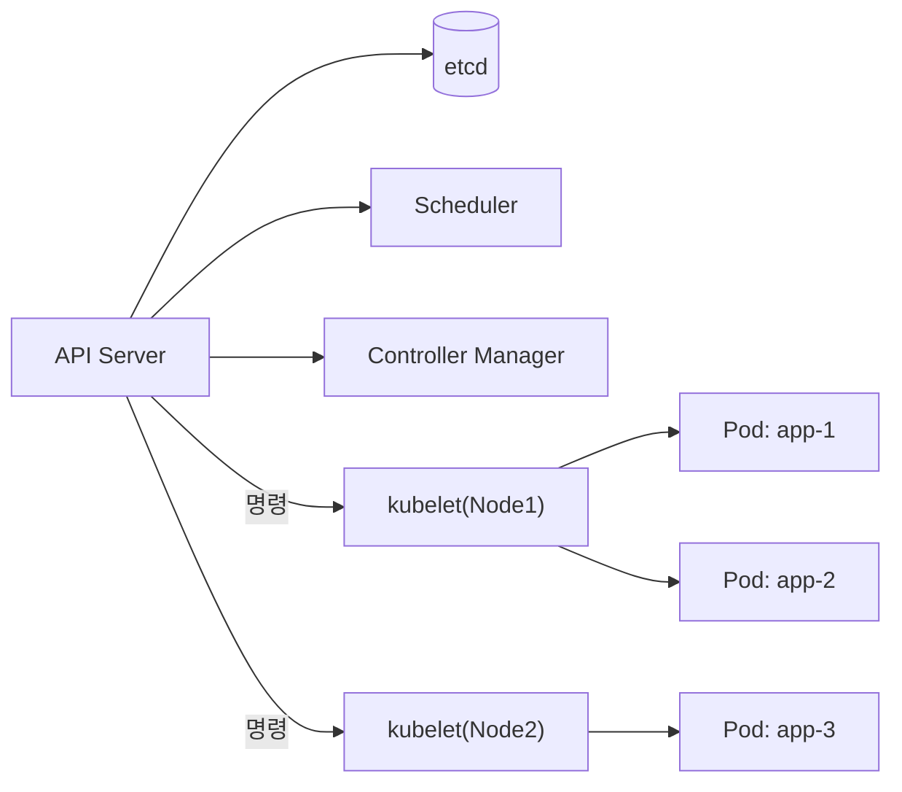
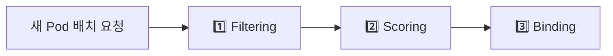

Kubernetes(K8s)는 컨테이너 오케스트레이션 플랫폼이다. 수백 개의 컨테이너를 자동으로 배포, 스케일링, 복구한다. 개발자가 "3개의 인스턴스를 실행해"라고 선언하면, K8s는 그 상태를 항상 유지하려고 동작한다.

> **비유**: 대형 물류 센터 관리자와 같다. 수백 명의 작업자(컨테이너)가 있고, 관리자(K8s)가 일을 배분한다. 작업자가 쓰러지면 다른 작업자가 즉시 대체하고, 주문량이 많아지면 인력을 더 투입(스케일 아웃)하고, 줄어들면 퇴근(스케일 인)시킨다.

---

## 아키텍처

K8s 클러스터는 Control Plane(마스터)과 Worker Node로 구성된다. Control Plane이 전체 클러스터를 조율하고, Worker Node가 실제 컨테이너를 실행한다.



### Control Plane 컴포넌트

| 컴포넌트 | 역할 |
|---------|------|
| API Server | 모든 요청의 진입점. `kubectl` 명령을 받아 etcd에 저장 |
| etcd | 클러스터 상태를 저장하는 분산 Key-Value DB. etcd 장애 = 클러스터 마비 |
| Scheduler | 새로운 Pod를 어느 Node에 배치할지 결정 (리소스, 어피니티 기반) |
| Controller Manager | 실제 상태가 원하는 상태와 일치하도록 지속 감시 및 교정 |

### Worker Node 컴포넌트

| 컴포넌트 | 역할 |
|---------|------|
| kubelet | API Server와 통신하며 Pod를 실행/관리. Node의 에이전트 |
| kube-proxy | Service의 네트워크 라우팅 규칙 관리 (iptables/ipvs) |
| Container Runtime | containerd, CRI-O — 실제 컨테이너 실행 |

---

## 핵심 리소스

### Pod — 가장 작은 배포 단위

하나 이상의 컨테이너가 같은 네트워크/스토리지를 공유하는 단위다. Pod 내 컨테이너들은 `localhost`로 서로 통신한다.

```yaml
apiVersion: v1
kind: Pod
metadata:
  name: myapp-pod
  labels:
    app: myapp
spec:
  containers:
  - name: myapp
    image: myapp:1.0
    ports:
    - containerPort: 8080
    resources:
      requests:          # 스케줄링 시 보장되는 최소 리소스
        memory: "256Mi"
        cpu: "250m"      # 250 밀리코어 = 0.25 CPU
      limits:            # 이 이상 사용 시 OOM Kill (메모리) 또는 Throttle (CPU)
        memory: "512Mi"
        cpu: "500m"
    livenessProbe:       # 실패 시 컨테이너 재시작
      httpGet:
        path: /actuator/health/liveness
        port: 8080
      initialDelaySeconds: 30
      periodSeconds: 10
    readinessProbe:      # 실패 시 Service 트래픽에서 제외 (재시작 안 함)
      httpGet:
        path: /actuator/health/readiness
        port: 8080
      initialDelaySeconds: 10
      periodSeconds: 5
    env:
    - name: SPRING_PROFILES_ACTIVE
      value: "prod"
    - name: DB_PASSWORD
      valueFrom:
        secretKeyRef:    # Secret에서 값 주입 (평문 하드코딩 금지)
          name: db-secret
          key: password
```

`livenessProbe`와 `readinessProbe`의 차이를 혼동하면 안 된다. liveness는 앱이 죽었는지 확인해 재시작하고, readiness는 앱이 트래픽을 받을 준비가 됐는지 확인해 Service에서 제외한다. 배포 중 앱이 초기화 중이면 readiness가 실패해 트래픽을 차단하므로 무중단 배포가 가능하다.

### Deployment — Pod 선언적 관리

원하는 상태(replicas, image 등)를 선언하면 Controller Manager가 실제 상태를 맞춘다. Pod는 직접 배포하지 않고 Deployment를 통해 관리한다.

```yaml
apiVersion: apps/v1
kind: Deployment
metadata:
  name: myapp-deployment
  namespace: production
spec:
  replicas: 3
  selector:
    matchLabels:
      app: myapp
  strategy:
    type: RollingUpdate
    rollingUpdate:
      maxSurge: 1        # 배포 중 추가로 생성할 수 있는 최대 Pod 수
      maxUnavailable: 0  # 배포 중 사용 불가 Pod 수 (0 = 무중단 배포)
  template:
    metadata:
      labels:
        app: myapp
    spec:
      containers:
      - name: myapp
        image: myapp:1.1
```

```bash
# 배포
kubectl apply -f deployment.yaml

# 배포 진행 상태 확인
kubectl rollout status deployment/myapp-deployment

# 롤백
kubectl rollout undo deployment/myapp-deployment

# 특정 버전으로 롤백
kubectl rollout undo deployment/myapp-deployment --to-revision=2
```

### Service — 안정적인 접근 엔드포인트

Pod IP는 재시작마다 바뀐다. Service는 고정 IP와 DNS 이름을 제공해 Pod 집합에 안정적으로 접근할 수 있게 한다.

```yaml
# ClusterIP: 클러스터 내부 통신 전용 (기본값)
apiVersion: v1
kind: Service
metadata:
  name: myapp-service
spec:
  type: ClusterIP
  selector:
    app: myapp          # 이 라벨의 Pod들로 트래픽 분산
  ports:
  - port: 80
    targetPort: 8080
---
# NodePort: 외부에서 노드 IP:포트로 직접 접근 (개발/테스트)
spec:
  type: NodePort
  ports:
  - port: 80
    targetPort: 8080
    nodePort: 30080     # 30000-32767 범위
---
# LoadBalancer: 클라우드 LB와 연동 (AWS ELB, GCP LB 등)
spec:
  type: LoadBalancer
  ports:
  - port: 80
    targetPort: 8080
```

### ConfigMap & Secret — 설정 외부화

```yaml
# ConfigMap: 일반 설정값
apiVersion: v1
kind: ConfigMap
metadata:
  name: myapp-config
data:
  LOG_LEVEL: "INFO"
  application.properties: |
    server.port=8080
    spring.datasource.url=jdbc:mysql://mysql-service:3306/mydb
---
# Secret: 민감 정보 (base64 인코딩 저장)
apiVersion: v1
kind: Secret
metadata:
  name: db-secret
type: Opaque
stringData:
  password: "mypassword"    # stringData는 자동으로 base64 인코딩
  api-key: "my-api-key"
```

Secret은 base64로 인코딩되지만 암호화는 아니다. 실제 암호화를 위해서는 etcd 암호화 또는 외부 비밀 관리자(AWS Secrets Manager, Vault)를 사용해야 한다.

---

## 스케줄링

Scheduler가 Pod를 어느 Node에 배치할지 결정하는 과정이다.



### Node Affinity — 특정 Node에만 배치

```yaml
spec:
  affinity:
    nodeAffinity:
      requiredDuringSchedulingIgnoredDuringExecution:
        nodeSelectorTerms:
        - matchExpressions:
          - key: node-type
            operator: In
            values: ["high-memory"]   # high-memory 라벨의 Node에만 배치
```

### Pod Anti-Affinity — 같은 Node에 중복 배치 방지

가용성을 위해 같은 앱의 Pod가 서로 다른 Node에 분산되도록 강제한다.

```yaml
spec:
  affinity:
    podAntiAffinity:
      requiredDuringSchedulingIgnoredDuringExecution:
      - labelSelector:
          matchLabels:
            app: myapp
        topologyKey: kubernetes.io/hostname
        # 같은 Node에 app=myapp Pod 두 개 배치 불가
```

### Taint & Toleration — Node 접근 제한

특정 Node에 특수 작업만 배치할 때 사용한다.

```bash
# GPU Node에 Taint 설정 (GPU 작업만 허용)
kubectl taint nodes gpu-node1 gpu=true:NoSchedule
```

```yaml
# GPU 작업 Pod에 Toleration 설정
spec:
  tolerations:
  - key: "gpu"
    operator: "Equal"
    value: "true"
    effect: "NoSchedule"
```

---

## HPA (Horizontal Pod Autoscaler) — 자동 스케일링

부하에 따라 Pod 수를 자동으로 조절한다.

```yaml
apiVersion: autoscaling/v2
kind: HorizontalPodAutoscaler
metadata:
  name: myapp-hpa
spec:
  scaleTargetRef:
    apiVersion: apps/v1
    kind: Deployment
    name: myapp-deployment
  minReplicas: 2
  maxReplicas: 20
  metrics:
  - type: Resource
    resource:
      name: cpu
      target:
        type: Utilization
        averageUtilization: 70   # CPU 평균 70% 초과 시 스케일 아웃
  - type: Resource
    resource:
      name: memory
      target:
        type: Utilization
        averageUtilization: 80
  behavior:
    scaleUp:
      stabilizationWindowSeconds: 30   # 30초 안정화 후 스케일 아웃 (급격한 증가 방지)
    scaleDown:
      stabilizationWindowSeconds: 300  # 5분 안정화 후 스케일 인 (조기 축소 방지)
```

`stabilizationWindowSeconds`는 메트릭이 임계치를 넘었다고 바로 스케일하지 않고 일정 시간 관찰 후 결정한다. 순간적인 스파이크로 인한 불필요한 스케일 아웃/인을 방지한다.

---

## Ingress — L7 외부 트래픽 라우팅

클러스터 외부에서 내부 Service로 URL 경로/호스트 기반 라우팅하는 규칙이다.

```yaml
apiVersion: networking.k8s.io/v1
kind: Ingress
metadata:
  name: myapp-ingress
  annotations:
    nginx.ingress.kubernetes.io/rewrite-target: /
    nginx.ingress.kubernetes.io/ssl-redirect: "true"
    cert-manager.io/cluster-issuer: "letsencrypt-prod"
spec:
  ingressClassName: nginx
  tls:
  - hosts:
    - api.example.com
    secretName: api-tls-secret
  rules:
  - host: api.example.com
    http:
      paths:
      - path: /api/orders
        pathType: Prefix
        backend:
          service:
            name: order-service
            port:
              number: 80
      - path: /api/products
        pathType: Prefix
        backend:
          service:
            name: product-service
            port:
              number: 80
```

---

## Helm — K8s 패키지 매니저

K8s 리소스를 패키지(Chart)로 관리한다. 환경별 값만 바꿔서 배포할 수 있다.

```bash
# Chart 구조
myapp-chart/
├── Chart.yaml          # 차트 메타데이터 (이름, 버전)
├── values.yaml         # 기본값 (환경별 override 가능)
├── templates/
│   ├── deployment.yaml
│   ├── service.yaml
│   ├── ingress.yaml
│   └── hpa.yaml
└── charts/             # 의존 차트
```

```yaml
# values.yaml
replicaCount: 3
image:
  repository: myregistry/myapp
  tag: "1.0.0"
resources:
  limits:
    cpu: 500m
    memory: 512Mi
  requests:
    cpu: 250m
    memory: 256Mi
autoscaling:
  enabled: true
  minReplicas: 2
  maxReplicas: 10
  targetCPUUtilizationPercentage: 70
```

```bash
# 배포
helm install myapp ./myapp-chart -f values-prod.yaml

# 이미지 태그만 변경해서 업그레이드
helm upgrade myapp ./myapp-chart --set image.tag=1.1.0

# 롤백
helm rollback myapp 1

# 배포된 릴리즈 목록
helm list -A
```

---

## 실무 운영 명령어

```bash
# 전체 리소스 확인
kubectl get all -n production

# Pod 상태 상세 확인 (이벤트 포함)
kubectl describe pod myapp-xxx -n production

# 로그 확인 (이전 컨테이너 포함)
kubectl logs myapp-xxx -n production -f --previous

# Pod 내부 접속
kubectl exec -it myapp-xxx -n production -- /bin/sh

# 로컬 포트 포워딩 (디버깅)
kubectl port-forward pod/myapp-xxx 8080:8080 -n production

# 리소스 사용량
kubectl top pods -n production
kubectl top nodes

# 강제 재시작 (이미지 재다운로드 없이)
kubectl rollout restart deployment/myapp-deployment -n production
```

---


## 극한 시나리오

### 시나리오 1: 배포 중 서비스 다운 — Pod 0개 순간 발생

`maxUnavailable: 1`이고 `replicas: 1`이면 구 Pod 종료 후 신 Pod 시작 전 순간적으로 서비스가 다운된다.

```yaml
strategy:
  rollingUpdate:
    maxSurge: 1
    maxUnavailable: 0  # 배포 중 절대 Pod 수를 줄이지 않음
```

`maxUnavailable: 0`이면 신 Pod가 Ready 상태가 되기 전까지 구 Pod를 종료하지 않는다. readinessProbe와 함께 사용해야 완전한 무중단 배포가 된다.

### 시나리오 2: Node 장애 시 Pod 재배치 5분 대기

기본 tolerationSeconds가 300초(5분)이므로 Node 장애 후 Pod 재배치까지 5분이 걸린다.

```yaml
spec:
  tolerations:
  - key: "node.kubernetes.io/unreachable"
    effect: "NoExecute"
    tolerationSeconds: 30  # 기본 300초 → 30초로 단축
  - key: "node.kubernetes.io/not-ready"
    effect: "NoExecute"
    tolerationSeconds: 30
```

### 시나리오 3: HPA가 스케일 아웃 안 됨

`kubectl top pods` 명령이 동작하지 않으면 Metrics Server가 설치되지 않은 것이다. HPA는 Metrics Server에서 CPU/메모리 사용량을 가져온다.

```bash
# Metrics Server 설치
kubectl apply -f https://github.com/kubernetes-sigs/metrics-server/releases/latest/download/components.yaml

# HPA 상태 확인
kubectl describe hpa myapp-hpa
```

### 시나리오 4: Secret 평문 노출

ConfigMap과 Secret의 차이를 모르고 DB 비밀번호를 ConfigMap에 저장하거나, Secret을 `kubectl get secret -o yaml`로 노출하는 경우다.

```bash
# Secret 값 확인 (base64 디코딩)
kubectl get secret db-secret -o jsonpath='{.data.password}' | base64 --decode
```

운영 환경에서는 RBAC으로 Secret 조회 권한을 제한하고, Sealed Secrets 또는 AWS Secrets Manager 연동을 사용해야 한다.

---

## 왜 Kubernetes인가? (vs Docker Compose vs Nomad vs ECS)

| 항목 | Docker Compose | HashiCorp Nomad | AWS ECS | Kubernetes |
|---|---|---|---|---|
| 학습 곡선 | 낮음 | 중간 | 중간 | 높음 |
| 멀티노드 | 제한적 | 지원 | 지원 | 완전 지원 |
| 자가 복구 | 기본 수준 | 지원 | 지원 | 고급 (liveness/readiness probe) |
| 오토스케일링 | 없음 | 지원 | ECS Auto Scaling | HPA/VPA/KEDA |
| 에코시스템 | 제한 | 중간 | AWS 종속 | 압도적 (Helm, Istio, ArgoCD 등) |
| 멀티클라우드 | 불가 | 가능 | AWS 종속 | 가능 |
| 적합 규모 | 단일 서버, 로컬 개발 | 혼합 워크로드 | AWS 종속 팀 | 대규모 마이크로서비스 |

**언제 K8s를 선택하지 않는가**: 서비스가 5개 미만이고 단일 서버면 Docker Compose가 훨씬 단순하다. K8s는 운영 오버헤드가 크다 — etcd 백업, 노드 업그레이드, 네트워크 플러그인(CNI) 관리 등이 따라온다.

---

## 실무에서 자주 하는 실수

### 실수 1: resource request/limit 미설정

`requests`와 `limits`를 설정하지 않으면 Scheduler가 노드 배치를 제대로 못 하고, 한 Pod가 노드 전체 CPU를 독점할 수 있다.

```yaml
# 나쁜 예 — resource 없음
spec:
  containers:
  - name: app
    image: myapp:latest

# 좋은 예
spec:
  containers:
  - name: app
    image: myapp:latest
    resources:
      requests:
        cpu: "250m"
        memory: "256Mi"
      limits:
        cpu: "500m"
        memory: "512Mi"
```

`requests`는 Scheduler가 노드 선택 기준으로 사용하고, `limits`는 실제 사용 상한이다. `limits`만 설정하고 `requests`를 생략하면 `requests = limits`로 자동 설정된다.

### 실수 2: liveness probe와 readiness probe 혼동

`livenessProbe`는 "컨테이너를 재시작할 것인가"를 결정하고, `readinessProbe`는 "트래픽을 보낼 것인가"를 결정한다. 두 가지를 같은 엔드포인트로 설정하면 DB 연결이 끊어졌을 때 무한 재시작 루프가 발생한다.

```yaml
livenessProbe:
  httpGet:
    path: /healthz        # 프로세스 자체가 살아있는가
    port: 8080
  initialDelaySeconds: 30
  periodSeconds: 10

readinessProbe:
  httpGet:
    path: /ready          # 실제 요청 처리 가능한가 (DB 연결 포함)
    port: 8080
  initialDelaySeconds: 5
  periodSeconds: 5
```

**원칙**: `livenessProbe`는 단순하게 (프로세스 생존만), `readinessProbe`는 의존성 포함해서.

### 실수 3: imagePullPolicy: Always를 프로덕션에서 사용

`imagePullPolicy: Always`는 Pod가 시작할 때마다 레지스트리에서 이미지를 pull한다. 레지스트리 장애 시 Pod 재시작이 불가능해진다.

```yaml
# 프로덕션에서 위험
image: myapp:latest
imagePullPolicy: Always

# 안전한 방식 — 구체적 태그 + IfNotPresent
image: myapp:v1.2.3
imagePullPolicy: IfNotPresent
```

`latest` 태그를 사용하면 어떤 이미지가 실행 중인지 추적이 불가능하다. 항상 SHA256 또는 시맨틱 버전 태그를 사용해야 한다.

### 실수 4: Deployment 롤링 업데이트 중 다운타임 발생

`terminationGracePeriodSeconds`를 설정하지 않으면 진행 중인 요청이 강제 종료된다.

```yaml
spec:
  terminationGracePeriodSeconds: 60  # 기본값 30초
  containers:
  - name: app
    lifecycle:
      preStop:
        exec:
          command: ["/bin/sh", "-c", "sleep 5"]  # 로드밸런서 업데이트 대기
```

`preStop` 훅에서 5초 sleep을 주면, 로드밸런서가 해당 Pod를 엔드포인트 목록에서 제거할 시간을 확보할 수 있다.

### 실수 5: namespace를 default만 사용

모든 리소스를 `default` 네임스페이스에 배포하면, 팀/환경별 RBAC 적용과 `kubectl` 명령 실수로 인한 사고 위험이 높아진다.

```bash
# 환경별 네임스페이스 분리
kubectl create namespace production
kubectl create namespace staging
kubectl create namespace monitoring

# 기본 네임스페이스 변경 (실수 방지)
kubectl config set-context --current --namespace=staging
```

---

## 면접 포인트

**Q1. Pod와 Container의 차이는?**

Pod는 하나 이상의 컨테이너를 감싸는 K8s의 최소 배포 단위다. 같은 Pod 내 컨테이너는 네트워크 네임스페이스(IP, 포트)와 볼륨을 공유한다. 사이드카 패턴(로그 수집, 프록시)이 이 구조를 활용한다. 실제 운영에서는 대부분 컨테이너 1개 = Pod 1개지만, Envoy 사이드카(Istio), Fluentd 로그 수집기는 메인 앱과 같은 Pod에 배치된다.

**Q2. Deployment, StatefulSet, DaemonSet의 차이는?**

- **Deployment**: 무상태 앱. Pod 이름이 랜덤(app-abc123). 어느 노드에 배치되든 상관없음. 롤링 업데이트 기본 지원.
- **StatefulSet**: 상태 있는 앱(DB, Kafka). Pod 이름 고정(mysql-0, mysql-1). 순서대로 시작/종료. 각 Pod에 고정된 PersistentVolume 연결.
- **DaemonSet**: 모든 노드에 1개씩 배포. 로그 수집기(Fluentd), 모니터링 에이전트(Prometheus Node Exporter)에 사용.

**Q3. Service의 ClusterIP, NodePort, LoadBalancer 차이는?**

- **ClusterIP**: 클러스터 내부에서만 접근 가능한 가상 IP. 기본값. 마이크로서비스 간 통신에 사용.
- **NodePort**: 모든 노드의 특정 포트(30000~32767)로 외부 접근. 테스트/개발용.
- **LoadBalancer**: 클라우드 프로바이더의 외부 로드밸런서를 자동 프로비저닝. 프로덕션 외부 노출.

실무에서는 외부 트래픽을 Ingress → ClusterIP Service → Pod 순으로 라우팅하고, LoadBalancer는 Ingress Controller 하나에만 사용한다.

**Q4. HPA가 스케일 아웃을 안 하는 이유는?**

세 가지를 확인한다. 첫째, Metrics Server 미설치 (`kubectl top pods` 실패). 둘째, Pod의 `resources.requests.cpu`가 미설정 (HPA는 requests 대비 사용률로 계산). 셋째, `minReplicas`와 `maxReplicas`가 같거나 현재 Pod 수가 이미 최대. `kubectl describe hpa` 명령으로 `Conditions`와 `Events` 항목을 확인하면 원인이 나온다.

**Q5. K8s에서 무중단 배포를 보장하려면?**

다섯 가지를 조합해야 한다: (1) `readinessProbe` — 준비된 Pod에만 트래픽 전달, (2) `PodDisruptionBudget` — 동시에 내려가는 Pod 수 제한, (3) `rollingUpdate.maxUnavailable: 0` — 항상 기존 Pod 유지 후 신규 시작, (4) `preStop` 훅 — 로드밸런서 제거 대기, (5) `terminationGracePeriodSeconds` — 진행 중 요청 완료 대기. 이 다섯 가지 중 하나라도 빠지면 다운타임이 발생할 수 있다.

---

## 왜 이 기술인가

**Kubernetes를 선택하는 이유는 수십~수백 개의 컨테이너를 수동으로 관리하는 것이 불가능하기 때문이다.**

| 대안 | 문제점 | Kubernetes의 해결 |
|------|--------|-----------------|
| 직접 Docker 실행 | 장애 시 수동 재시작, 배포 자동화 없음 | Self-healing, 자동 재시작 |
| Docker Compose | 단일 호스트 제한, 오토스케일링 없음 | 멀티 노드 클러스터, HPA 자동 확장 |
| 수동 로드밸런싱 | 새 인스턴스 추가 시 수동 등록 | Service가 Pod 등록/해제 자동화 |

트래픽 급증 시 HPA가 CPU 메트릭 기반으로 Pod를 자동 증가시키고, 장애 Pod는 Kubelet이 감지해 자동으로 재시작한다. Rolling Update로 무중단 배포가 가능하고, Rollback도 명령 한 줄로 처리된다.
