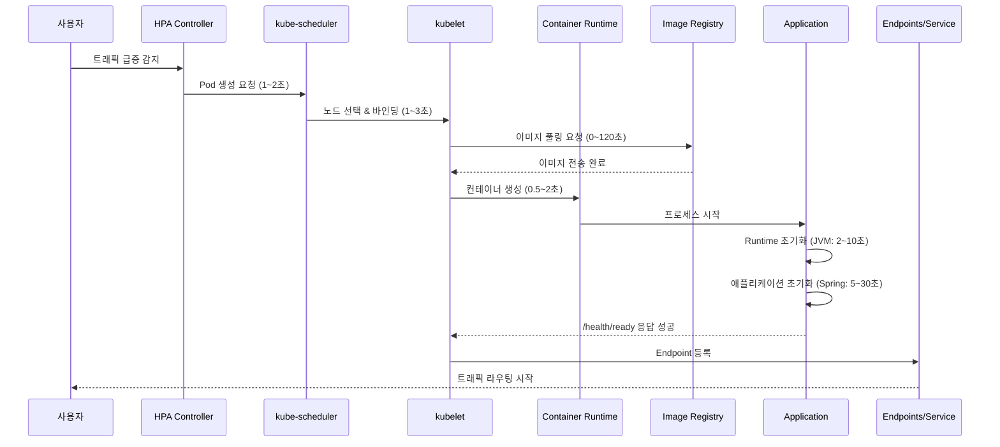
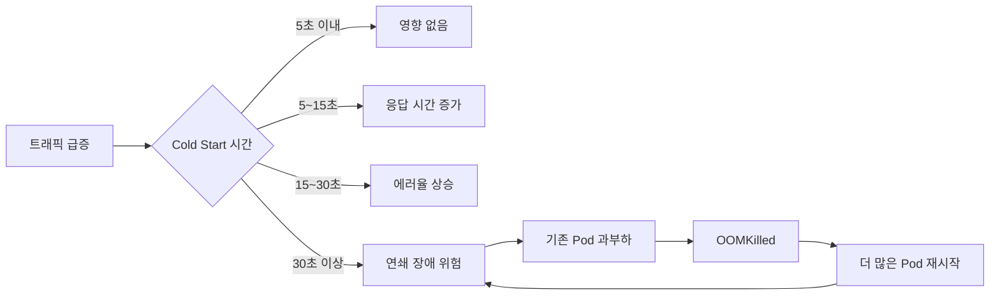
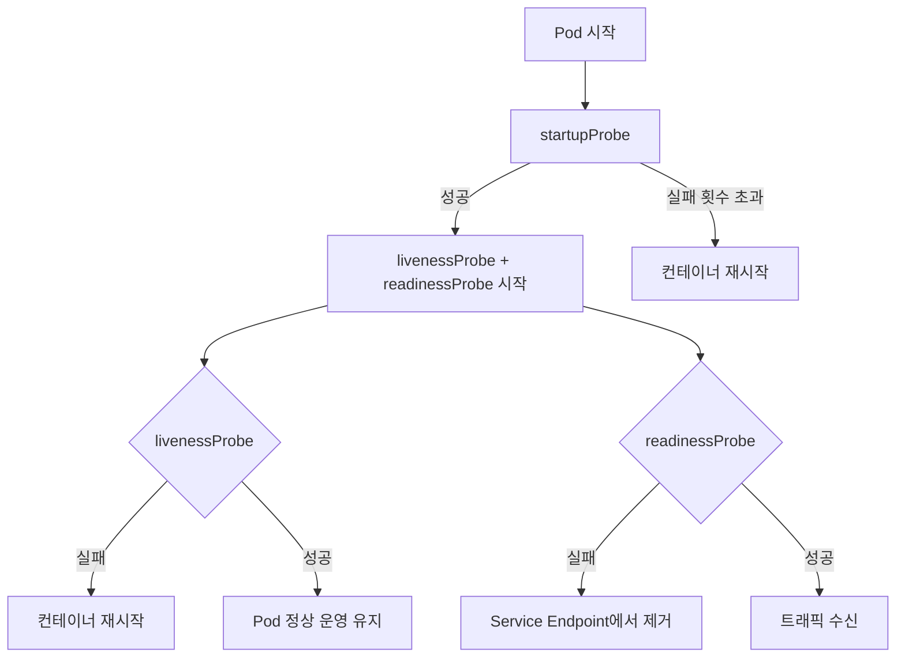
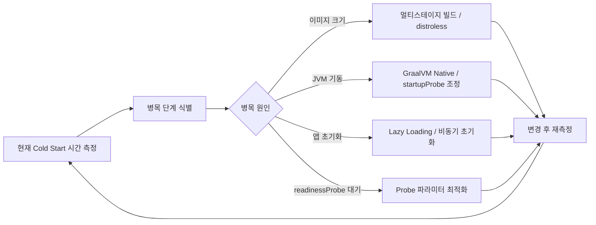
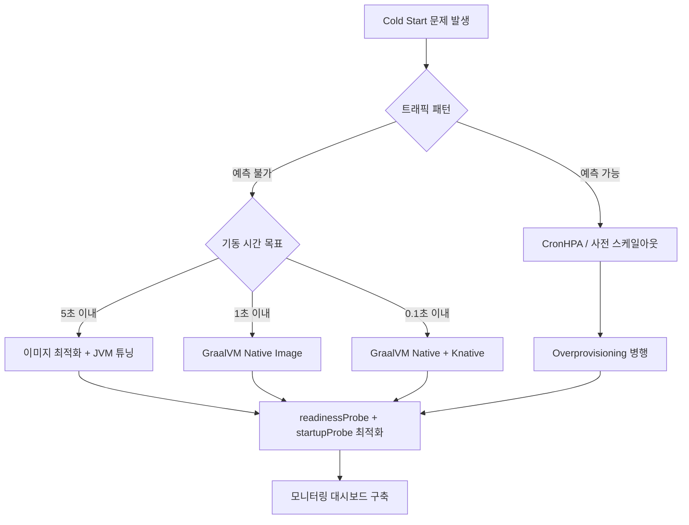

**한 줄 요약**: Kubernetes Cold Start는 Pod가 스케줄링된 순간부터 실제 트래픽을 처리할 수 있을 때까지의 지연 시간이며, 이미지 최적화 · 예열 전략 · 선제적 스케일링의 3축으로 해결한다.

---

## 도입 비유 — 새벽 식당 오픈

새벽 6시, 식당 문을 열기 전을 상상해보세요.

1. **가스 밸브를 연다** (컨테이너 런타임 시작)
2. **냉장고에서 재료를 꺼낸다** (이미지 풀링)
3. **프라이팬을 예열한다** (JVM / Runtime 초기화)
4. **소스를 미리 끓여놓는다** (애플리케이션 컨텍스트 로딩)
5. **첫 손님이 들어와 주문한다** (첫 번째 HTTP 요청 수신)

첫 손님은 식당이 준비되기까지 기다려야 합니다. 식당이 하나뿐이라면 괜찮지만, 점심 피크에 갑자기 10개 지점을 동시에 오픈해야 한다면? 모든 지점이 준비되는 동안 손님들은 줄을 서야 합니다.

이것이 바로 **Kubernetes Cold Start 문제**입니다.

---

## 1. Kubernetes Cold Start란?

### 1-1. 정의

**Cold Start**는 Pod가 스케줄링된 시점부터 실제로 서비스 트래픽을 받을 수 있는 상태가 되기까지 걸리는 총 시간입니다.

```
T(cold start) = T(scheduling) + T(image pull) + T(container start)
              + T(runtime init) + T(app init) + T(health check pass)
              + T(service registration)
```

단순히 "컨테이너가 Running 상태가 됐다"는 것과 "실제 트래픽을 정상 처리한다"는 것은 다릅니다. 많은 장애가 이 차이를 무시하는 데서 발생합니다.

### 1-2. 왜 문제가 되는가?

| 상황 | Cold Start가 문제가 되는 이유 |
|---|---|
| **오토스케일링 (HPA)** | 트래픽 급증 → HPA가 Pod 추가 → Cold Start 30초+ → 그 사이 기존 Pod 과부하 |
| **배포 (Rolling Update)** | 새 Pod가 Ready 상태가 될 때까지 구 Pod를 종료하지 않으므로 배포 시간 증가 |
| **장애 복구** | 노드 장애 → Pod 재스케줄링 → Cold Start → 복구 지연 → SLA 위반 |
| **Scale-to-zero (Knative)** | 트래픽이 없을 때 Pod를 0으로 줄이면, 첫 요청 시 Cold Start 발생 |

### 1-3. Cold Start가 없는 것처럼 보이는 경우

- **Warm Pod**: 이미 실행 중인 Pod에 요청이 들어오는 경우 — Cold Start 없음
- **Pre-provisioned Pod**: 트래픽 없이도 Pod를 미리 띄워두는 경우 — Cold Start 비용을 운영 비용으로 전환한 것

---

## 2. Cold Start 구성 요소 — 단계별 상세 분해

### 전체 흐름



### 2-1. Pod 스케줄링 (kube-scheduler)

**소요 시간**: 일반적으로 1~5초, 리소스 부족 시 무한정

kube-scheduler는 새 Pod를 어느 노드에 배치할지 결정합니다.

**스케줄링 과정**:
1. **Filtering**: 자원 부족, Taint/Toleration 불일치, Affinity 규칙 위반 노드 제거
2. **Scoring**: 남은 노드들에 점수를 부여 (리소스 균형, 이미지 존재 여부 등)
3. **Binding**: 최고 점수 노드에 Pod 바인딩

**지연 원인**:
- 클러스터 전체 노드가 리소스 부족 (Pending 상태 지속)
- PodAntiAffinity 규칙이 너무 엄격
- kube-scheduler 큐 밀림 (대량 배포 시)

```yaml
# 스케줄링 지연을 줄이는 우선순위 설정
apiVersion: scheduling.k8s.io/v1
kind: PriorityClass
metadata:
  name: high-priority-app
value: 1000000
globalDefault: false
description: "긴급 서비스용 높은 스케줄링 우선순위"
```

### 2-2. 이미지 풀링 (Image Pull)

**소요 시간**: 캐시 히트 시 0초, 캐시 미스 시 10~120초 (이미지 크기에 따라)

이미지 풀링은 Cold Start에서 가장 큰 변수입니다.

**imagePullPolicy 옵션**:

| 정책 | 동작 | Cold Start 영향 |
|---|---|---|
| `Always` | 매번 레지스트리에서 확인 | 최악 — 항상 레지스트리 왕복 |
| `IfNotPresent` | 노드에 없을 때만 풀링 | 최선 — 캐시 히트 시 0초 |
| `Never` | 로컬에 없으면 실패 | 사전 배포 시나리오 전용 |

```yaml
# 운영 환경 권장 설정
spec:
  containers:
  - name: app
    image: myapp:v1.2.3  # latest 태그 금지 — IfNotPresent와 충돌
    imagePullPolicy: IfNotPresent
```

**이미지 크기별 풀링 시간 벤치마크** (100Mbps 네트워크 기준):

| 이미지 | 압축 크기 | 풀링 시간 | 대표 예시 |
|---|---|---|---|
| 1.5GB | ~500MB | 40~80초 | OpenJDK + 앱 빌드 결과물 통째로 |
| 500MB | ~200MB | 15~30초 | Ubuntu + JRE + Spring Boot |
| 200MB | ~80MB | 5~15초 | Alpine + JRE + Spring Boot |
| 80MB | ~30MB | 2~5초 | Distroless + Spring Native |
| 15MB | ~5MB | 0.5~1초 | Alpine + Go 바이너리 |

### 2-3. 컨테이너 시작

**소요 시간**: 0.1~2초

컨테이너 런타임(containerd, CRI-O)이 컨테이너 네임스페이스, 네트워크 인터페이스, 볼륨 마운트를 설정합니다.

**지연 원인**:
- 대용량 ConfigMap/Secret 마운트
- 복잡한 init containers
- 느린 CSI(Container Storage Interface) 볼륨 마운트

```yaml
# init container로 설정 파일 생성 — Cold Start에 추가됨
initContainers:
- name: config-init
  image: busybox:1.35
  # 이 작업이 완료될 때까지 메인 컨테이너 시작 안 됨
  command: ['sh', '-c', 'echo "설정 초기화 중..."']
```

### 2-4. JVM/Runtime 초기화

**소요 시간**: JVM 2~5초, Python 1~3초, Node.js 0.5~2초, Go 0.01~0.1초

Java 애플리케이션은 특히 Cold Start가 깁니다.

**JVM Cold Start 원인**:
1. **클래스 로딩**: JVM이 수천 개의 .class 파일을 메모리에 로드
2. **JIT 컴파일 없음**: 처음 실행하는 바이트코드는 인터프리터 모드로 실행 → 느림
3. **JIT Warm-up**: 반복 실행 후 JIT 컴파일러가 핫스팟 감지 → 네이티브 코드로 컴파일
4. **Heap 초기화**: GC를 위한 메모리 영역 설정

**언어/런타임별 Cold Start 비교**:

| 런타임 | Cold Start | Warm 이후 처리량 | 메모리 사용 |
|---|---|---|---|
| Java (JVM) | 5~20초 | 매우 높음 | 높음 (JIT 최적화) |
| Java (GraalVM Native) | 0.05~0.3초 | 높음 | 낮음 (AOT 컴파일) |
| Python | 1~3초 | 중간 | 중간 |
| Node.js | 0.5~2초 | 높음 | 중간 |
| Go | 0.01~0.1초 | 높음 | 낮음 |
| Rust | 0.01~0.05초 | 매우 높음 | 매우 낮음 |

### 2-5. 애플리케이션 초기화

**소요 시간**: Spring Boot 5~30초, Express.js 0.5~2초, FastAPI 1~5초

Spring Boot는 구성 요소 스캔, Bean 생성, DB 커넥션 풀 초기화, 캐시 워밍업 등 다양한 작업을 기동 시 수행합니다.

```
Spring Boot 초기화 타임라인 (일반적인 엔터프라이즈 앱):
[0ms]    JVM 시작
[500ms]  Spring ApplicationContext 생성 시작
[2000ms] ComponentScan 완료 (Bean 500개+)
[5000ms] DB ConnectionPool 초기화 (HikariCP)
[8000ms] JPA EntityManager Factory 초기화
[12000ms] Cache 초기화 (Ehcache / Redis 연결)
[15000ms] /actuator/health READY 응답 시작
```

### 2-6. Health Check 통과 (readinessProbe)

**소요 시간**: readinessProbe 설정에 따라 0~60초 추가 가능

readinessProbe가 통과하기 전까지 Service는 이 Pod에 트래픽을 보내지 않습니다. 잘못 설정하면 실제로 준비된 Pod도 한참 기다려야 합니다.

### 2-7. Service/Endpoints 등록

**소요 시간**: 0.5~3초

kubelet이 readinessProbe 성공을 확인하면 kube-apiserver에 보고하고, Endpoints 오브젝트가 업데이트되어 kube-proxy가 iptables/IPVS 규칙을 갱신합니다.

---

## 3. 트래픽별 Cold Start 영향 분석

### 3-1. 저부하 환경 (100 TPS)

```
상황: 평소 2개 Pod로 운영, 트래픽 2배 → HPA가 Pod 1개 추가
Cold Start: 15~30초
영향: 기존 2개 Pod가 30초간 150% 부하 → 응답 시간 약간 증가
결론: 감내 가능한 수준
```

### 3-2. 중부하 환경 (10,000 TPS)

```
상황: 평소 20개 Pod, 갑자기 트래픽 3배 (30,000 TPS)
HPA 반응: 60개 Pod 필요 감지 → 40개 신규 Pod 생성 요청
Cold Start: 각 Pod 20~30초

타임라인:
[0초]   트래픽 3배 급증
[5초]   HPA가 스케일아웃 결정
[35초]  새 Pod들이 Ready 상태
[25초간] 기존 20개 Pod가 30,000 TPS 처리 시도
        → 1개 Pod당 1,500 TPS (정상의 3배)
        → 응답 시간 폭증, 에러율 증가
        → 최악의 경우 기존 Pod들도 OOMKilled → 연쇄 장애
```

### 3-3. 극한 환경 (100,000+ TPS — 블랙프라이데이/대규모 이벤트)

```
상황: 평소 50개 Pod (10,000 TPS), 이벤트 당일 100,000 TPS
필요 Pod: 500개
Cold Start 병목:
  - 이미지 풀링: 500개 Pod × 노드당 동시 풀링 제한 (보통 3~5개)
  - 실제 새 Pod 준비 완료: 5~10분 소요
  - 그 사이 기존 50개 Pod: 200% 이상 과부하

결과:
  → 스케일링 속도 < 트래픽 증가 속도
  → 시스템 다운
```

**Cold Start 시간 vs 트래픽 허용 한계**:



---

## 4. Cold Start 해결 전략

### 4-1. 이미지 최적화

#### 멀티스테이지 빌드

빌드 도구는 빌드 시에만 필요합니다. 운영 이미지에 Maven, Gradle, 소스코드를 포함할 이유가 없습니다.

```dockerfile
# 잘못된 방법 — 빌드 도구와 소스코드가 모두 포함됨 (1.5GB+)
FROM openjdk:17
COPY . /app
WORKDIR /app
RUN apt-get install -y maven && mvn package
CMD ["java", "-jar", "target/app.jar"]
```

```dockerfile
# 올바른 방법 — 멀티스테이지 빌드 (200MB 수준)
# 1단계: 빌드 환경
FROM gradle:8.5-jdk17 AS builder
WORKDIR /build
COPY build.gradle settings.gradle ./
COPY src ./src
# 의존성 캐시 레이어 분리로 빌드 캐시 최대화
RUN gradle bootJar --no-daemon

# 2단계: 실행 환경 (JRE만 포함)
FROM eclipse-temurin:17-jre-alpine
WORKDIR /app
# 빌드 결과물만 복사
COPY --from=builder /build/build/libs/*.jar app.jar
# 보안: non-root 실행
RUN addgroup -S appgroup && adduser -S appuser -G appgroup
USER appuser
ENTRYPOINT ["java", "-jar", "app.jar"]
```

#### Distroless 이미지 사용

```dockerfile
# distroless: OS 유틸리티 없이 런타임만 포함 (80MB 수준)
FROM gcr.io/distroless/java17-debian12
COPY --from=builder /build/build/libs/*.jar /app.jar
ENTRYPOINT ["/app.jar"]
```

#### 이미지 레이어 최적화

```dockerfile
FROM eclipse-temurin:17-jre-alpine

# 의존성 레이어 (변경 빈도: 낮음 — 캐시 잘 됨)
COPY --from=builder /build/build/libs/dependencies/ ./dependencies/
COPY --from=builder /build/build/libs/spring-boot-loader/ ./spring-boot-loader/
COPY --from=builder /build/build/libs/snapshot-dependencies/ ./snapshot-dependencies/

# 애플리케이션 레이어 (변경 빈도: 높음 — 항상 새로 빌드)
COPY --from=builder /build/build/libs/application/ ./application/

ENTRYPOINT ["java", "org.springframework.boot.loader.JarLauncher"]
```

#### Pre-pull DaemonSet

새 버전 배포 전에 모든 노드에 이미지를 미리 캐싱합니다.

```yaml
# 배포 전 이미지 사전 배포용 DaemonSet
apiVersion: apps/v1
kind: DaemonSet
metadata:
  name: image-prepuller
  namespace: default
spec:
  selector:
    matchLabels:
      app: image-prepuller
  template:
    metadata:
      labels:
        app: image-prepuller
    spec:
      # 즉시 종료되는 init container로 이미지만 풀링
      initContainers:
      - name: pull-app-image
        image: myapp:v2.0.0  # 배포 예정 이미지
        command: ["sh", "-c", "echo '이미지 사전 다운로드 완료'"]
        resources:
          requests:
            cpu: "10m"
            memory: "10Mi"
      containers:
      - name: pause
        image: gcr.io/google_containers/pause:3.9
        resources:
          requests:
            cpu: "1m"
            memory: "1Mi"
```

### 4-2. Pod 예열 (Warm-up)

#### startupProbe vs readinessProbe vs livenessProbe 조합

```yaml
spec:
  containers:
  - name: spring-app
    image: myapp:v1.2.3
    ports:
    - containerPort: 8080

    # startupProbe: 애플리케이션 기동 완료 확인
    # 기동 중 livenessProbe가 Pod를 죽이지 않도록 보호
    startupProbe:
      httpGet:
        path: /actuator/health/liveness
        port: 8080
      # 최대 대기: 30 * 10 = 300초
      failureThreshold: 30
      periodSeconds: 10
      # startupProbe 성공 후 livenessProbe 시작

    # livenessProbe: Pod가 살아있는지 확인 (실패 시 재시작)
    livenessProbe:
      httpGet:
        path: /actuator/health/liveness
        port: 8080
      initialDelaySeconds: 0  # startupProbe 이후이므로 0
      periodSeconds: 10
      failureThreshold: 3
      timeoutSeconds: 5

    # readinessProbe: 트래픽 수신 가능 여부 확인
    # 실패 시 Service에서 제외 (재시작 없음)
    readinessProbe:
      httpGet:
        path: /actuator/health/readiness
        port: 8080
      initialDelaySeconds: 0
      periodSeconds: 5
      failureThreshold: 3
      successThreshold: 1
      timeoutSeconds: 5
```

#### Spring Boot Actuator Health Endpoint 설계

```yaml
# application.yml
management:
  endpoint:
    health:
      probes:
        enabled: true          # /health/liveness, /health/readiness 활성화
      show-details: always
      group:
        liveness:
          include: ping         # 프로세스가 살아있는지만 확인
        readiness:
          include: db, redis, diskSpace  # 의존성 모두 확인
  endpoints:
    web:
      exposure:
        include: health, info, metrics, prometheus
```

#### preStop Hook으로 Graceful Shutdown

```yaml
spec:
  containers:
  - name: app
    lifecycle:
      preStop:
        exec:
          # Service에서 제거되기 전 진행 중인 요청 처리 완료
          command: ["sh", "-c", "sleep 5"]
  # 컨테이너 종료 최대 대기 시간 (기본값 30초)
  terminationGracePeriodSeconds: 60
```

#### JVM Warm-up 스크립트

```dockerfile
# 컨테이너 기동 후 JIT Warm-up을 위한 HTTP 요청 자동화
FROM eclipse-temurin:17-jre-alpine
COPY warmup.sh /warmup.sh
COPY app.jar /app.jar
RUN chmod +x /warmup.sh
```

```bash
#!/bin/sh
# warmup.sh — readinessProbe 통과 후 JIT Warm-up
# Spring Boot의 /actuator/health가 UP이 될 때까지 대기
until curl -sf http://localhost:8080/actuator/health; do
  echo "애플리케이션 기동 대기 중..."
  sleep 2
done

echo "JVM Warm-up 시작..."
# 주요 엔드포인트에 더미 요청 전송 (JIT 컴파일 유도)
for i in $(seq 1 50); do
  curl -sf http://localhost:8080/api/warmup > /dev/null 2>&1
done
echo "JVM Warm-up 완료"
```

### 4-3. 선제적 스케일링

#### HPA 기본 설정

```yaml
apiVersion: autoscaling/v2
kind: HorizontalPodAutoscaler
metadata:
  name: app-hpa
spec:
  scaleTargetRef:
    apiVersion: apps/v1
    kind: Deployment
    name: my-app
  minReplicas: 3
  maxReplicas: 100
  metrics:
  # CPU 기반 스케일링
  - type: Resource
    resource:
      name: cpu
      target:
        type: Utilization
        averageUtilization: 60  # 60% 이상 시 스케일아웃
  # 메모리 기반 스케일링
  - type: Resource
    resource:
      name: memory
      target:
        type: Utilization
        averageUtilization: 70
  behavior:
    scaleUp:
      # 빠른 스케일아웃
      stabilizationWindowSeconds: 30
      policies:
      - type: Percent
        value: 100      # 현재 Pod 수의 100%씩 증가 가능
        periodSeconds: 15
    scaleDown:
      # 느린 스케일인 (갑작스러운 축소 방지)
      stabilizationWindowSeconds: 300
      policies:
      - type: Pods
        value: 2
        periodSeconds: 60
```

#### KEDA (이벤트 기반 스케일링)

KEDA는 Kafka 토픽 큐 깊이, RabbitMQ 메시지 수, Prometheus 메트릭 등 다양한 이벤트 소스로 스케일링합니다.

```yaml
# Kafka 메시지 수 기반 스케일링
apiVersion: keda.sh/v1alpha1
kind: ScaledObject
metadata:
  name: kafka-consumer-scaler
spec:
  scaleTargetRef:
    name: kafka-consumer-deployment
  minReplicaCount: 2
  maxReplicaCount: 50
  triggers:
  - type: kafka
    metadata:
      bootstrapServers: kafka:9092
      consumerGroup: my-consumer-group
      topic: orders
      # 파티션당 메시지 100개 초과 시 Pod 추가
      lagThreshold: "100"
      activationLagThreshold: "10"
```

#### CronHPA (예측 기반 사전 스케일아웃)

이벤트/점심시간 등 예측 가능한 트래픽 증가에 미리 스케일아웃합니다.

```yaml
# kubernetes-cronhpa-controller 사용 예시
apiVersion: autoscaling.alibabacloud.com/v1beta1
kind: CronHorizontalPodAutoscaler
metadata:
  name: app-cronhpa
spec:
  scaleTargetRef:
    apiVersion: apps/v1
    kind: Deployment
    name: my-app
  jobs:
  # 평일 오전 8시 50분 — 점심 트래픽 대비 미리 스케일아웃
  - name: morning-scaleout
    schedule: "50 8 * * 1-5"
    targetSize: 20
  # 평일 오전 11시 50분 — 점심 피크 대비
  - name: lunch-scaleout
    schedule: "50 11 * * 1-5"
    targetSize: 50
  # 평일 오후 2시 — 점심 후 축소
  - name: afternoon-scalein
    schedule: "0 14 * * 1-5"
    targetSize: 20
  # 새벽 시간 — 최소 유지
  - name: night-scalein
    schedule: "0 22 * * *"
    targetSize: 5
```

#### Overprovisioning (여유 Pod 미리 배치)

낮은 우선순위의 "자리 지킴이" Pod를 배치해두고, 실제 Pod가 필요할 때 자리를 빼앗는 방식입니다.

```yaml
# 1. 매우 낮은 우선순위 클래스 생성
apiVersion: scheduling.k8s.io/v1
kind: PriorityClass
metadata:
  name: overprovisioning
value: -1
globalDefault: false
description: "자리 지킴이 Pod — 실제 Pod에 의해 선점됨"
---
# 2. pause 컨테이너로 CPU/메모리 예약
apiVersion: apps/v1
kind: Deployment
metadata:
  name: overprovisioning
spec:
  replicas: 5  # 노드 5개 분량 자원 예약
  selector:
    matchLabels:
      app: overprovisioning
  template:
    metadata:
      labels:
        app: overprovisioning
    spec:
      priorityClassName: overprovisioning
      containers:
      - name: pause
        image: gcr.io/google_containers/pause:3.9
        resources:
          requests:
            cpu: "1000m"     # 1 CPU 예약
            memory: "1024Mi" # 1GB 메모리 예약
```

### 4-4. GraalVM Native Image

Java 애플리케이션의 Cold Start를 0.1초 수준으로 줄이는 가장 강력한 방법입니다.

#### JVM vs Native Image 비교

| 항목 | JVM (기존) | GraalVM Native Image |
|---|---|---|
| **기동 시간** | 10~30초 | 0.05~0.3초 |
| **첫 요청 응답** | 느림 (JIT 미적용) | 빠름 (AOT 컴파일) |
| **최대 처리량** | 매우 높음 (JIT 최적화 후) | 높음 (JIT 없음) |
| **메모리 사용** | 높음 | 낮음 (50~70% 절감) |
| **빌드 시간** | 30초~2분 | 5~15분 |
| **빌드 메모리** | 2~4GB | 4~16GB |
| **리플렉션** | 완전 지원 | 제한적 (사전 등록 필요) |
| **동적 클래스 로딩** | 지원 | 불가 |
| **Kubernetes Cold Start** | 나쁨 | 매우 좋음 |

#### Spring Boot Native 빌드

```dockerfile
# Spring Boot 3.x + GraalVM Native Image Dockerfile
FROM ghcr.io/graalvm/native-image:21 AS builder
WORKDIR /build
COPY . .
# Native Image 빌드 (시간이 오래 걸림 — CI에서 수행 권장)
RUN ./gradlew nativeCompile --no-daemon

# 실행 이미지 — distroless로 최소화
FROM gcr.io/distroless/base-debian12
COPY --from=builder /build/build/native/nativeCompile/myapp /myapp
ENTRYPOINT ["/myapp"]
```

```gradle
// build.gradle — Native Image 빌드 설정
plugins {
    id 'org.springframework.boot' version '3.2.0'
    id 'org.graalvm.buildtools.native' version '0.9.28'
}

graalvmNative {
    binaries {
        main {
            buildArgs.add("--initialize-at-build-time")
            buildArgs.add("-H:+ReportExceptionStackTraces")
            // 리플렉션 사용 클래스 등록
            buildArgs.add("-H:ReflectionConfigurationFiles=reflect-config.json")
        }
    }
}
```

#### Cold Start 비교 실측값

```
Spring Boot 3.2 (JVM, JRE 17):
  이미지 크기: 350MB
  기동 시간: 12.3초
  첫 요청 응답: 450ms (JIT 미적용)
  안정 응답 시간: 8ms (JIT 적용 후)

Spring Boot 3.2 (GraalVM Native):
  이미지 크기: 85MB
  기동 시간: 0.09초
  첫 요청 응답: 12ms
  안정 응답 시간: 11ms

  → 기동 시간 136배 단축
  → 이미지 크기 75% 감소
```

### 4-5. Knative / Serverless와 Cold Start 트레이드오프

Knative는 Scale-to-zero를 지원하여 트래픽이 없을 때 Pod를 0개로 줄입니다. 비용 효율은 좋지만 Cold Start가 발생합니다.

```yaml
apiVersion: serving.knative.dev/v1
kind: Service
metadata:
  name: my-service
spec:
  template:
    metadata:
      annotations:
        # 최소 인스턴스 유지 — Cold Start 방지 (비용 발생)
        autoscaling.knative.dev/minScale: "2"
        # 최대 인스턴스 수
        autoscaling.knative.dev/maxScale: "100"
        # 동시 요청 수 기반 스케일링
        autoscaling.knative.dev/target: "50"
        # Cold Start 후 유지 시간
        autoscaling.knative.dev/scaleDownDelay: "5m"
    spec:
      containers:
      - image: myapp:v1.2.3
        resources:
          requests:
            cpu: 100m
            memory: 128Mi
```

**minScale 전략**:

| minScale | Cold Start 가능성 | 비용 |
|---|---|---|
| 0 | 항상 발생 (트래픽 없을 시) | 최저 |
| 1 | 없음 (단일 Pod 과부하 위험) | 낮음 |
| 2 | 없음 (가용성 확보) | 중간 |
| 3+ | 없음 (권장 운영 환경) | 높음 |

---

## 5. readinessProbe vs livenessProbe vs startupProbe

### 역할 구분



### 세부 비교표

| 항목 | startupProbe | livenessProbe | readinessProbe |
|---|---|---|---|
| **목적** | 기동 완료 확인 | 프로세스 생존 확인 | 트래픽 수신 가능 확인 |
| **실패 시** | 컨테이너 재시작 | 컨테이너 재시작 | Service에서 제거 (재시작 없음) |
| **없으면** | livenessProbe가 기동 중 죽일 수 있음 | 데드락 감지 불가 | 준비 안 된 Pod에 트래픽 전달 |
| **언제 확인** | 기동 시에만 | 기동 후 계속 | 기동 후 계속 |
| **용도** | 느린 기동 앱 보호 | 데드락/OOM 감지 | 의존성 장애 대응 |

### 잘못된 설정 사례

**사례 1: startupProbe 없이 짧은 initialDelaySeconds**

```yaml
# 잘못된 설정 — Spring Boot (15초 기동)에 짧은 initialDelay
livenessProbe:
  httpGet:
    path: /health
    port: 8080
  initialDelaySeconds: 10  # 15초 걸리는 앱에 10초 후 확인
  periodSeconds: 10
  failureThreshold: 3
# 결과: 10초에 첫 확인 → 실패 → 20초에 두 번째 실패
#       → 30초에 세 번째 실패 → 재시작 → 무한 재시작 루프 (CrashLoopBackOff)
```

```yaml
# 올바른 설정
startupProbe:
  httpGet:
    path: /actuator/health
    port: 8080
  failureThreshold: 30  # 300초(5분) 허용
  periodSeconds: 10
livenessProbe:
  httpGet:
    path: /actuator/health/liveness
    port: 8080
  periodSeconds: 10
  failureThreshold: 3
```

**사례 2: readinessProbe를 livenessProbe와 동일하게 설정**

```yaml
# 위험한 설정 — readinessProbe 실패 시 Pod 재시작됨
livenessProbe:
  httpGet:
    path: /health
    port: 8080
  failureThreshold: 3
readinessProbe:
  httpGet:
    path: /health  # 동일한 엔드포인트
    port: 8080
  failureThreshold: 1  # 1번만 실패해도 → livenessProbe도 곧 실패 → 재시작
```

**사례 3: 너무 엄격한 readinessProbe로 서비스 전체 불능**

```yaml
# 위험한 설정 — DB 연결 확인 포함
readinessProbe:
  httpGet:
    path: /health/ready  # DB 상태 포함
    port: 8080
  failureThreshold: 1
  periodSeconds: 5
# DB 순간 부하 → /health/ready 실패 → 모든 Pod Service에서 제거
# → 트래픽 받는 Pod 0개 → 서비스 완전 다운
```

```yaml
# 개선: 실패 허용 횟수 증가
readinessProbe:
  httpGet:
    path: /actuator/health/readiness
    port: 8080
  failureThreshold: 3    # 연속 3번 실패 시에만 제거
  periodSeconds: 10
  successThreshold: 1    # 1번 성공 시 즉시 복구
```

### Probe 타입별 특성

```yaml
# HTTP GET 방식 (가장 일반적)
readinessProbe:
  httpGet:
    path: /actuator/health/readiness
    port: 8080
    httpHeaders:
    - name: Custom-Header
      value: readiness-check

# TCP Socket 방식 (HTTP 엔드포인트 없는 경우)
readinessProbe:
  tcpSocket:
    port: 8080
  initialDelaySeconds: 5

# Exec 방식 (커맨드 종료 코드 확인)
readinessProbe:
  exec:
    command:
    - sh
    - -c
    - "redis-cli ping | grep -q PONG"
  periodSeconds: 10

# gRPC 방식 (gRPC Health Protocol)
readinessProbe:
  grpc:
    port: 9090
    service: "grpc.health.v1.Health"
```

---

## 6. 배포 전략과 Cold Start

### 6-1. Rolling Update

가장 기본적인 배포 방식. 구 Pod를 하나씩 새 Pod로 교체합니다.

```yaml
apiVersion: apps/v1
kind: Deployment
metadata:
  name: my-app
spec:
  replicas: 10
  strategy:
    type: RollingUpdate
    rollingUpdate:
      # 배포 중 추가로 생성할 수 있는 Pod 수
      maxSurge: 3        # 최대 13개 Pod (10 + 3)
      # 배포 중 사용 불가 상태가 될 수 있는 Pod 수
      maxUnavailable: 0  # 항상 10개 이상 Ready 유지
  template:
    spec:
      containers:
      - name: app
        image: myapp:v2.0.0
        readinessProbe:
          httpGet:
            path: /actuator/health/readiness
            port: 8080
          periodSeconds: 5
          failureThreshold: 3
```

**Cold Start 영향 최소화 설정**:
- `maxUnavailable: 0`: 기존 Pod가 트래픽 처리하는 동안 새 Pod 준비
- `maxSurge` 증가: 병렬 배포로 전체 배포 시간 단축
- readinessProbe 필수: 준비 안 된 Pod에 트래픽 전달 방지

### 6-2. Blue-Green 배포

새 버전(Green)을 완전히 워밍업한 후 트래픽을 전환합니다.

```yaml
# Blue (현재 운영 중)
apiVersion: apps/v1
kind: Deployment
metadata:
  name: my-app-blue
  labels:
    version: blue
spec:
  replicas: 10
  selector:
    matchLabels:
      app: my-app
      version: blue
---
# Green (새 버전 — 미리 워밍업)
apiVersion: apps/v1
kind: Deployment
metadata:
  name: my-app-green
  labels:
    version: green
spec:
  replicas: 10
  selector:
    matchLabels:
      app: my-app
      version: green
---
# Service — 현재 Blue로 연결
apiVersion: v1
kind: Service
metadata:
  name: my-app
spec:
  selector:
    app: my-app
    version: blue  # green으로 변경하면 전환 완료
  ports:
  - port: 80
    targetPort: 8080
```

**Blue-Green Cold Start 시나리오**:
```
1. Green Deployment 생성 (10개 Pod)
2. 모든 Green Pod readinessProbe 통과 대기
3. (선택) JVM Warm-up 스크립트 실행
4. Service selector 변경: blue → green (트래픽 전환)
5. Blue Deployment 종료 (graceful shutdown)

결과: 사용자는 Cold Start를 전혀 경험하지 않음
```

### 6-3. Canary 배포

트래픽을 점진적으로 새 버전으로 전환하여 Cold Start 영향을 최소화합니다.

```yaml
# Argo Rollouts를 이용한 Canary 배포
apiVersion: argoproj.io/v1alpha1
kind: Rollout
metadata:
  name: my-app-rollout
spec:
  replicas: 20
  strategy:
    canary:
      steps:
      # 1단계: 5% 트래픽으로 새 버전 검증 (1개 Pod)
      - setWeight: 5
      - pause: {duration: 5m}
      # 2단계: 25% 트래픽 (5개 Pod)
      - setWeight: 25
      - pause: {duration: 10m}
      # 3단계: 50% 트래픽 (10개 Pod)
      - setWeight: 50
      - pause: {duration: 10m}
      # 4단계: 100% 전환
      - setWeight: 100
  template:
    spec:
      containers:
      - name: app
        image: myapp:v2.0.0
```

**배포 전략 Cold Start 영향 비교**:

| 전략 | Cold Start 노출 | 배포 속도 | 롤백 속도 | 리소스 비용 |
|---|---|---|---|---|
| Rolling Update | 있음 (제한적) | 중간 | 중간 | 낮음 |
| Blue-Green | 없음 | 빠름 | 매우 빠름 | 높음 (2배) |
| Canary | 거의 없음 | 느림 | 빠름 | 중간 |
| Recreate | 전면 노출 | 빠름 | 느림 | 없음 |

---

## 7. 실전 Cold Start 측정 & 모니터링

### 7-1. kubectl로 Pod 기동 시간 측정

```bash
# Pod 이벤트로 단계별 시간 확인
kubectl describe pod my-app-xxx-yyy | grep -A 30 "Events:"

# 예시 출력:
# Events:
#   Type    Reason     Age   From               Message
#   Normal  Scheduled  45s   default-scheduler  Successfully assigned default/my-app-xxx to node-1
#   Normal  Pulling    44s   kubelet            Pulling image "myapp:v1.2.3"
#   Normal  Pulled     32s   kubelet            Successfully pulled image (12.3s)
#   Normal  Created    32s   kubelet            Created container app
#   Normal  Started    31s   kubelet            Started container app
#   Normal  Ready      18s   kubelet/probe      Container is ready

# Pod 전체 기동 시간 계산 스크립트
kubectl get pods -o json | jq -r '
  .items[] |
  .metadata.name as $name |
  (.metadata.creationTimestamp | fromdateiso8601) as $created |
  (.status.conditions[] | select(.type == "Ready") | .lastTransitionTime | fromdateiso8601) as $ready |
  [$name, ($ready - $created | tostring) + "초"] |
  @tsv
'
```

```bash
# 배포 후 Rolling Update 진행 상황 모니터링
kubectl rollout status deployment/my-app --watch

# 각 Pod의 Ready까지 걸린 시간 (배포 직후)
watch -n 2 'kubectl get pods -l app=my-app \
  -o custom-columns="NAME:.metadata.name,STATUS:.status.phase,READY:.status.conditions[?(@.type==\"Ready\")].status,AGE:.metadata.creationTimestamp"'
```

### 7-2. Prometheus 메트릭으로 Cold Start 측정

```yaml
# kube-state-metrics 기반 Pod 기동 시간 메트릭
# Pod가 생성된 시간
kube_pod_created{pod="my-app-xxx"}

# Pod의 각 컨테이너가 Ready가 된 시간
kube_pod_container_status_ready{pod="my-app-xxx", container="app"}

# 커스텀 메트릭: 애플리케이션 기동 완료 시간
# Spring Boot Actuator 메트릭 활용
management_startup_time_seconds{application="my-app"}
```

```yaml
# Prometheus Rule — Cold Start SLA 경보
apiVersion: monitoring.coreos.com/v1
kind: PrometheusRule
metadata:
  name: cold-start-alerts
spec:
  groups:
  - name: cold-start
    rules:
    # Pod가 5분 이상 Ready 상태가 안 됨
    - alert: PodColdStartTimeout
      expr: |
        (kube_pod_status_phase{phase="Running"} == 1)
        and
        (kube_pod_container_status_ready == 0)
        and
        (time() - kube_pod_created > 300)
      for: 1m
      labels:
        severity: warning
      annotations:
        summary: "Pod {{ $labels.pod }} Cold Start 5분 초과"
        description: "Cold Start가 너무 오래 걸립니다. 이미지 크기나 startupProbe를 확인하세요."

    # 평균 Cold Start 시간 30초 초과
    - alert: ColdStartSLABreach
      expr: |
        avg(
          (kube_pod_start_time - kube_pod_created)
        ) by (namespace, pod) > 30
      for: 5m
      labels:
        severity: warning
      annotations:
        summary: "Cold Start SLA 위반 — 평균 {{ $value }}초"
```

### 7-3. Grafana 대시보드 구성

```json
// Grafana 패널 — Pod 기동 시간 히스토그램
{
  "title": "Pod Cold Start 시간 분포",
  "type": "histogram",
  "targets": [
    {
      "expr": "histogram_quantile(0.50, rate(pod_startup_duration_seconds_bucket[5m]))",
      "legendFormat": "p50"
    },
    {
      "expr": "histogram_quantile(0.95, rate(pod_startup_duration_seconds_bucket[5m]))",
      "legendFormat": "p95"
    },
    {
      "expr": "histogram_quantile(0.99, rate(pod_startup_duration_seconds_bucket[5m]))",
      "legendFormat": "p99"
    }
  ]
}
```

### 7-4. Cold Start 최적화 사이클



---

## 8. 실무에서 자주 하는 실수 TOP 5

### 실수 1: latest 태그 사용

```yaml
# 잘못된 설정
image: myapp:latest
imagePullPolicy: Always  # latest + Always → 항상 레지스트리 확인

# 문제:
# 1. 레지스트리 왕복 시간 추가
# 2. 어떤 버전인지 추적 불가
# 3. imagePullPolicy: IfNotPresent와 함께 쓰면 의도치 않은 구 버전 실행
```

```yaml
# 올바른 설정
image: myapp:v1.2.3  # 정확한 태그 또는 이미지 다이제스트
imagePullPolicy: IfNotPresent
```

### 실수 2: resource requests/limits 미설정

```yaml
# 잘못된 설정 — requests 없음
containers:
- name: app
  image: myapp:v1
  # resources 없음 → BestEffort QoS → 노드 메모리 부족 시 가장 먼저 종료

# 잘못된 설정 — limits만 있고 requests 없음
resources:
  limits:
    cpu: "2"
    memory: "2Gi"
  # requests 없으면 limits와 동일하게 처리됨
  # → 스케줄러가 노드 리소스를 과대 예약할 수 있음
```

```yaml
# 올바른 설정
resources:
  requests:
    cpu: "500m"     # 스케줄링 기준 — 실제 평균 사용량으로 설정
    memory: "512Mi"
  limits:
    cpu: "2"        # requests의 2~4배 권장
    memory: "1Gi"   # OOM 방지를 위해 반드시 설정
```

### 실수 3: readinessProbe 없이 배포

```yaml
# 잘못된 설정 — readinessProbe 없음
spec:
  containers:
  - name: app
    image: myapp:v1
    # readinessProbe 없음
    # → Pod가 Running 상태만 되면 즉시 트래픽 전달
    # → 아직 초기화 중인 Pod에 요청 → 에러 응답
```

### 실수 4: terminationGracePeriodSeconds 너무 짧게 설정

```yaml
# 잘못된 설정
spec:
  terminationGracePeriodSeconds: 5  # 5초는 대부분 너무 짧음
  containers:
  - name: app
    lifecycle:
      preStop:
        exec:
          command: ["sleep", "30"]  # preStop이 30초인데 grace period가 5초
    # 결과: 5초 후 SIGKILL → 진행 중인 요청 강제 종료
```

```yaml
# 올바른 설정
spec:
  terminationGracePeriodSeconds: 60  # preStop + 앱 종료 시간보다 길게
  containers:
  - name: app
    lifecycle:
      preStop:
        exec:
          command: ["sh", "-c", "sleep 10"]  # Service에서 제거 대기
```

### 실수 5: HPA minReplicas를 1로 설정

```yaml
# 잘못된 설정
spec:
  minReplicas: 1
  # → 트래픽 감소 시 Pod 1개로 축소
  # → 해당 노드 장애 시 서비스 완전 중단
  # → 트래픽 급증 시 단일 Pod가 버티는 동안 스케일아웃 대기

# 올바른 설정
spec:
  minReplicas: 3  # 가용성 확보 + Cold Start 버퍼
  # → 노드 1개 장애 시에도 2개 Pod 운영
  # → 트래픽 급증 시 기존 3개 Pod가 버티는 동안 스케일아웃 가능
```

---

## 9. JVM Cold Start와의 관계

### Java 앱이 K8s에서 특히 느린 이유

#### 9-1. JVM 기동 메커니즘

```
JVM 기동 과정 (OpenJDK 17 기준, 일반적인 Spring Boot):

[0ms]    java 프로세스 시작
[50ms]   JVM 자체 초기화 (힙 할당, GC 설정)
[100ms]  Bootstrap ClassLoader 시작
[200ms]  rt.jar / JDK 모듈 로딩
[300ms]  Spring ApplicationContext 생성 시작
[500ms]  @ComponentScan 시작 (수백~수천 클래스 스캔)
[2000ms] Bean 인스턴스화 시작
[5000ms] DB ConnectionPool 초기화 (TCP 연결)
[8000ms] JPA/Hibernate Schema 검증
[12000ms] Spring Security 필터 체인 구성
[15000ms] /actuator/health UP 상태
[30000ms] JIT 컴파일 Warm-up 완료 (안정적인 응답 시간)
```

#### 9-2. JIT 컴파일러와 Warm-up 문제

```
JVM JIT 컴파일 과정:

1. 인터프리터 모드 (0~1000번 실행):
   - 바이트코드를 한 줄씩 해석
   - 느리지만 즉시 실행 가능

2. C1 컴파일러 (1000~10000번 실행):
   - 자주 실행되는 메서드 감지
   - 빠른 기계어 코드로 컴파일
   - CPU 타임라인에 컴파일 비용 발생

3. C2 컴파일러 (10000번+ 실행):
   - 핫스팟 메서드 최적화 컴파일
   - 인라이닝, 루프 최적화 등 고급 최적화
   - 최고 성능 달성 (하지만 몇 분 소요)

문제:
- K8s에서 Pod가 자주 재시작되면 JIT 캐시가 초기화됨
- 새 Pod는 항상 인터프리터 모드에서 시작
- 트래픽 폭주 시 새 Pod의 JIT Warm-up 중 느린 응답 발생
```

#### 9-3. 컨테이너 환경에서의 JVM 튜닝

```dockerfile
# JVM 컨테이너 인식 플래그 (Java 11+에서는 기본값)
ENTRYPOINT ["java",
  # 컨테이너 cgroup 메모리 제한 인식
  "-XX:+UseContainerSupport",
  # 힙 크기를 컨테이너 메모리의 75%로 설정
  "-XX:MaxRAMPercentage=75.0",
  # G1GC 사용 (Java 9+ 기본값)
  "-XX:+UseG1GC",
  # JIT 컴파일 스레드 수 제한 (CPU 오버헤드 감소)
  "-XX:CICompilerCount=2",
  # 클래스 데이터 공유 (Cold Start 감소 효과)
  "-Xshare:on",
  # Spring Boot 최적화
  "-Dspring.jmx.enabled=false",
  "-Dspring.backgroundpreinitializer.ignore=true",
  "-jar", "app.jar"]
```

#### 9-4. Class Data Sharing (CDS)로 Cold Start 개선

```dockerfile
FROM eclipse-temurin:17-jre-alpine AS cds-builder
WORKDIR /app
COPY app.jar .

# 1단계: 클래스 목록 추출
RUN java -XX:DumpLoadedClassList=classes.lst \
    -cp app.jar org.springframework.boot.loader.JarLauncher &
    sleep 30 && kill $! || true

# 2단계: CDS 아카이브 생성
RUN java -Xshare:dump \
    -XX:SharedClassListFile=classes.lst \
    -XX:SharedArchiveFile=app-cds.jsa \
    -cp app.jar

FROM eclipse-temurin:17-jre-alpine
WORKDIR /app
COPY --from=cds-builder /app/app.jar .
COPY --from=cds-builder /app/app-cds.jsa .

# CDS 아카이브 사용 → Cold Start 20~40% 감소
ENTRYPOINT ["java",
  "-Xshare:on",
  "-XX:SharedArchiveFile=app-cds.jsa",
  "-jar", "app.jar"]
```

#### 9-5. JVM vs GraalVM vs Quarkus Cold Start 비교

| 프레임워크 | 런타임 | Cold Start | 메모리 | 처리량 |
|---|---|---|---|---|
| Spring Boot 3 | JVM | 12~20초 | 300~500MB | 매우 높음 (JIT 후) |
| Spring Boot 3 | GraalVM Native | 0.05~0.3초 | 50~100MB | 높음 |
| Quarkus | JVM | 2~5초 | 200~400MB | 매우 높음 |
| Quarkus | GraalVM Native | 0.01~0.1초 | 30~80MB | 높음 |
| Micronaut | JVM | 1~3초 | 150~300MB | 높음 |
| Micronaut | GraalVM Native | 0.01~0.05초 | 20~60MB | 높음 |

---

## 10. 면접 포인트

### Q1. Kubernetes Cold Start란 무엇인가요?

> Pod가 스케줄링된 시점부터 실제 트래픽을 처리할 수 있는 상태(readinessProbe 통과 + Service 등록)까지의 총 지연 시간입니다. 이미지 풀링, JVM 초기화, 애플리케이션 기동 등 여러 단계의 합산입니다.

### Q2. readinessProbe와 livenessProbe의 차이는?

> readinessProbe는 트래픽 수신 가능 여부를 판단하며, 실패 시 Service에서 제외합니다(재시작 없음). livenessProbe는 프로세스 생존을 확인하며, 실패 시 컨테이너를 재시작합니다. startupProbe는 기동 중 livenessProbe가 조기 재시작하지 않도록 보호합니다.

### Q3. HPA 스케일아웃 시 Cold Start로 인한 장애를 어떻게 막나요?

> 세 가지 접근법이 있습니다. 첫째, GraalVM Native Image로 Cold Start 자체를 0.1초 수준으로 줄입니다. 둘째, CronHPA나 predictive scaling으로 트래픽 급증 전에 미리 스케일아웃합니다. 셋째, Overprovisioning으로 여유 Pod를 미리 배치해 스케일아웃 시 즉시 전환합니다.

### Q4. 이미지 크기가 Cold Start에 미치는 영향은?

> 이미지 캐시 미스 시 이미지 크기에 비례하는 풀링 시간이 발생합니다. 1.5GB 이미지는 100Mbps 네트워크에서 40~80초가 소요됩니다. 멀티스테이지 빌드와 distroless 베이스로 이미지를 80~200MB 수준으로 줄이면 풀링 시간이 2~5초로 단축됩니다.

### Q5. Spring Boot 앱의 Cold Start를 줄이는 방법은?

> 단기적으로는 startupProbe 설정으로 안정성을 확보하고, 레이지 로딩(-Dspring.main.lazy-initialization=true)으로 기동 시간을 줄입니다. 중기적으로는 이미지 최적화(멀티스테이지 빌드, JRE만 포함)와 JVM 플래그 튜닝(-XX:+UseContainerSupport, CDS)을 적용합니다. 장기적으로는 GraalVM Native Image로 전환하여 기동 시간을 0.1초 이내로 줄입니다.

### Q6. Scale-to-zero와 Cold Start 트레이드오프를 설명해주세요.

> Scale-to-zero는 트래픽이 없을 때 Pod를 0개로 줄여 비용을 절감하지만, 첫 요청 시 전체 Cold Start가 발생합니다. 비용 최적화가 중요하다면 minScale: 0으로 설정하고 GraalVM Native로 Cold Start를 최소화합니다. 응답 시간 SLA가 중요하다면 minScale: 2~3으로 유지 비용을 지불합니다.

---

## 11. 핵심 포인트 정리

### Cold Start 단계별 최적화 요약

| 단계 | 소요 시간 | 최적화 방법 | 효과 |
|---|---|---|---|
| 스케줄링 | 1~5초 | PriorityClass, 충분한 노드 리소스 | 2~3초 단축 |
| 이미지 풀링 | 0~120초 | 멀티스테이지 빌드, Pre-pull DaemonSet | 10~100초 단축 |
| 컨테이너 시작 | 0.5~2초 | Init Container 최소화 | 1~1.5초 단축 |
| JVM 초기화 | 2~10초 | CDS, GraalVM Native | 2~10초 단축 |
| 앱 초기화 | 5~30초 | Lazy Loading, GraalVM Native | 5~30초 단축 |
| Health Check | 0~60초 | startupProbe + 적절한 파라미터 | 최대 60초 단축 |
| **총합** | **~230초** | **조합 적용 시** | **~5초 이내 가능** |

### Cold Start 대응 전략 선택 기준



### 체크리스트

**이미지 최적화**
- [ ] 멀티스테이지 빌드 적용
- [ ] JRE만 포함 (JDK 제거)
- [ ] 이미지 크기 200MB 이하
- [ ] `latest` 태그 대신 버전 태그 사용
- [ ] `imagePullPolicy: IfNotPresent` 설정

**Probe 설정**
- [ ] `startupProbe` 설정 (특히 JVM 앱)
- [ ] `readinessProbe`와 `livenessProbe` 분리
- [ ] `readinessProbe` 실패 허용 횟수 적절히 설정
- [ ] `terminationGracePeriodSeconds` > `preStop` 시간

**스케일링**
- [ ] `minReplicas` 최소 2 이상 설정
- [ ] HPA `scaleUp.stabilizationWindowSeconds` 최적화
- [ ] 예측 가능한 트래픽에 CronHPA 적용
- [ ] 이벤트 기반 스케일링에 KEDA 검토

**리소스**
- [ ] `resources.requests` 실제 사용량 기반으로 설정
- [ ] `resources.limits` 반드시 설정 (메모리)
- [ ] JVM: `-XX:+UseContainerSupport`, `-XX:MaxRAMPercentage` 설정

**모니터링**
- [ ] Pod 기동 시간 메트릭 수집
- [ ] Cold Start SLA 경보 설정
- [ ] 배포 후 기동 시간 추이 대시보드 구성

---

Cold Start는 단일 원인이 아닌 여러 단계의 합산입니다. 병목 단계를 정확히 측정하고, 가장 큰 효과를 내는 최적화부터 적용하는 것이 핵심입니다. 대부분의 경우 이미지 경량화와 적절한 Probe 설정만으로도 Cold Start를 50~70% 줄일 수 있습니다.
