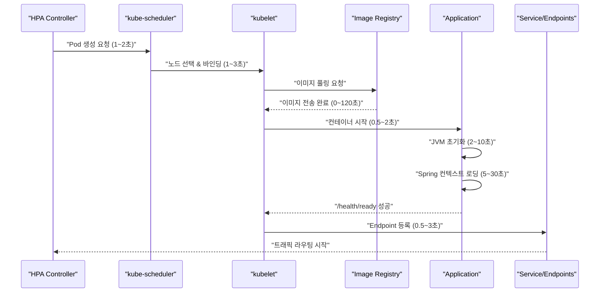
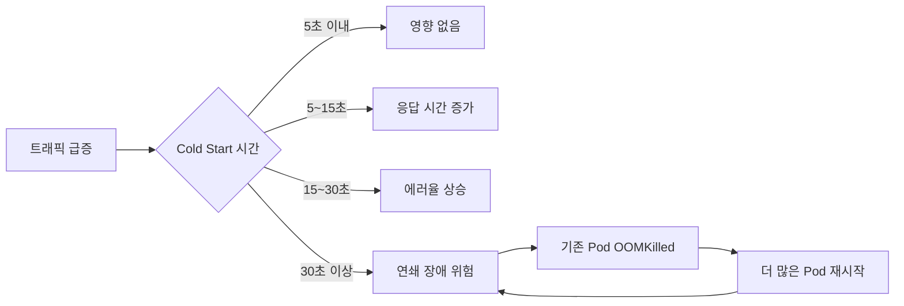
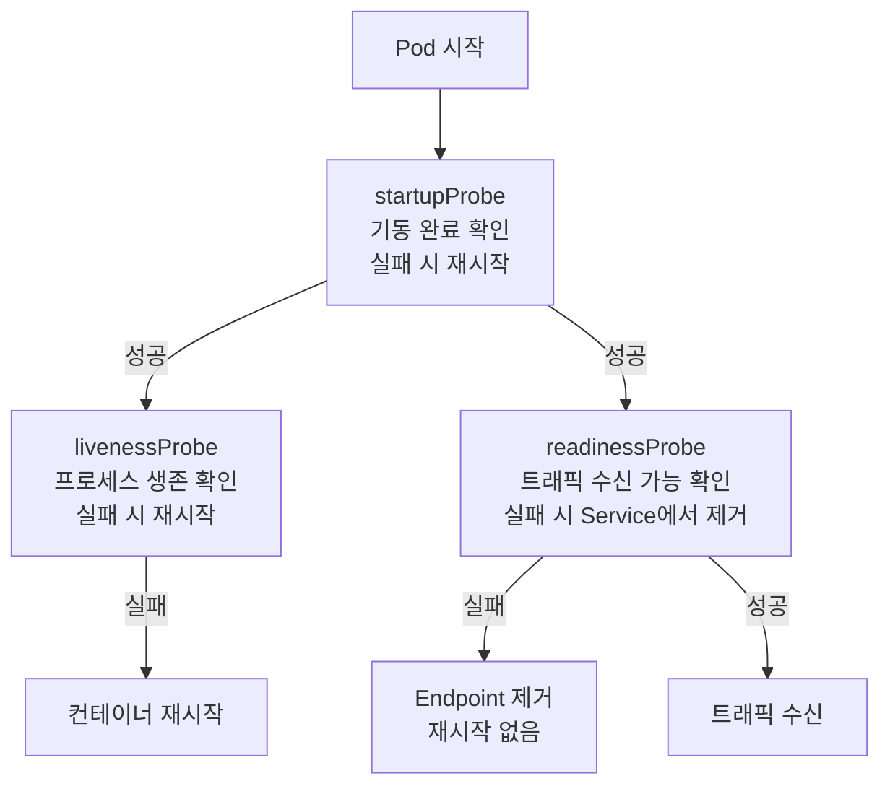
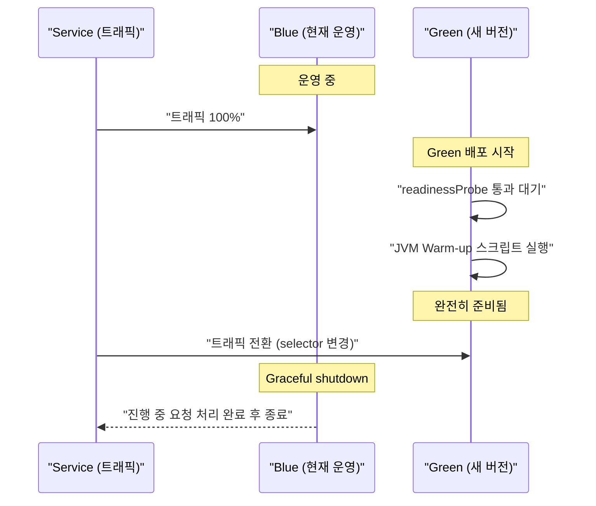
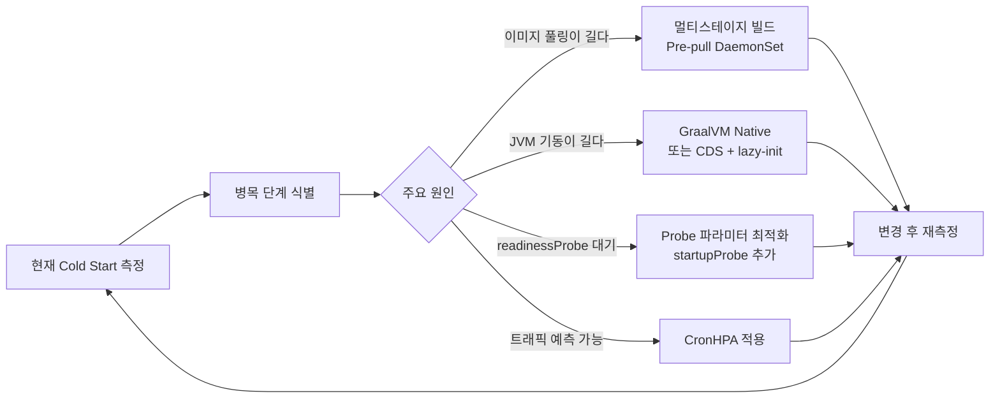

블랙프라이데이 오전 9시, 트래픽이 갑자기 10배로 폭증했다. HPA가 Pod를 50개에서 500개로 늘리라는 신호를 보냈다. 그런데 새 Pod들이 실제로 트래픽을 받을 준비가 되는 데 5분이 걸렸다. 그 5분 동안 기존 50개 Pod가 500개 분량의 트래픽을 혼자 버텼고, 연쇄 OOMKilled로 전체 서비스가 다운됐다. **Cold Start는 "Pod가 Running 상태가 됐다"와 "실제로 요청을 처리할 수 있다" 사이의 간격이다.**

## 비유 — 새벽 식당 오픈

새벽 6시, 식당 문을 열기 전 상황이다.

1. **가스 밸브를 연다** — 컨테이너 런타임 시작
2. **냉장고에서 재료를 꺼낸다** — 이미지 풀링
3. **프라이팬을 예열한다** — JVM/런타임 초기화
4. **소스를 미리 끓여놓는다** — 애플리케이션 컨텍스트 로딩
5. **웨이터가 서비스 가능 확인** — readinessProbe 통과
6. **첫 손님이 들어와 주문** — 트래픽 수신 시작

5번까지 끝나지 않으면 손님을 받지 않는 게 맞다. 그런데 readinessProbe가 없거나 잘못 설정되면? 아직 재료도 안 꺼냈는데 손님이 들어온다.

---

## Cold Start란 정확히 무엇인가

```
T(cold start) = T(스케줄링)
              + T(이미지 풀링)
              + T(컨테이너 시작)
              + T(JVM/런타임 초기화)
              + T(애플리케이션 초기화)
              + T(readinessProbe 통과)
              + T(Service 등록)
```

`Running` 상태 ≠ 트래픽 처리 가능. 많은 장애가 이 차이를 무시하는 데서 시작한다.

| 상황 | Cold Start가 문제인 이유 |
|------|----------------------|
| HPA 스케일아웃 | 트래픽 급증 → Pod 추가 → Cold Start 30초 → 그 사이 기존 Pod 과부하 |
| 롤링 업데이트 | 새 Pod Ready 전까지 구 Pod 유지 → 배포 시간 증가 |
| 장애 복구 | 노드 장애 → Pod 재스케줄링 → Cold Start → SLA 위반 |
| Scale-to-zero | 트래픽 없을 때 Pod 0개 → 첫 요청 시 전체 Cold Start |

---

## 단계별 상세 분해



### 이미지 풀링 — 가장 큰 변수 (0~120초)

이미지가 노드에 캐시되어 있으면 0초, 없으면 이미지 크기에 비례한다.

| 이미지 크기 | 압축 후 | 풀링 시간 (100Mbps) | 대표 예시 |
|-----------|---------|-------------------|---------|
| 1.5GB | ~500MB | 40~80초 | OpenJDK + 소스 빌드 결과 통째로 |
| 500MB | ~200MB | 15~30초 | Ubuntu + JRE + Spring Boot |
| 200MB | ~80MB | 5~15초 | Alpine + JRE + Spring Boot |
| 80MB | ~30MB | 2~5초 | Distroless + Spring Native |
| 15MB | ~5MB | 0.5~1초 | Alpine + Go 바이너리 |

`imagePullPolicy: Always`는 매번 레지스트리에 확인하므로 캐시가 있어도 네트워크 왕복이 발생한다. 운영 환경에서는 `IfNotPresent`를 사용하고 이미지에 `latest` 태그 대신 버전 태그를 붙여야 한다.

### JVM 초기화 — Java 앱이 특히 느린 이유

```
Spring Boot 초기화 타임라인 (일반 엔터프라이즈 앱):
[0ms]     JVM 프로세스 시작
[500ms]   Spring ApplicationContext 생성 시작
[2000ms]  @ComponentScan 완료 (Bean 500개+)
[5000ms]  DB ConnectionPool 초기화 (HikariCP TCP 연결)
[8000ms]  JPA EntityManager Factory 초기화
[12000ms] Cache 초기화 (Ehcache / Redis 연결)
[15000ms] /actuator/health READY 응답 시작
```

JIT 컴파일이 없는 상태에서 처음 요청들은 인터프리터 모드로 느리게 실행된다. 1000번 반복 실행 후 C1 컴파일러가 최적화하고, 10000번 후 C2 컴파일러가 최고 성능을 낸다. **새 Pod가 스케일아웃된 직후가 응답이 가장 느리다.**

---

<details class="extreme-scenario-details">
<summary class="extreme-scenario-summary">
<span class="extreme-scenario-icon">🔥</span>
<span class="extreme-scenario-label">극한 시나리오 — 클릭하여 펼치기</span>
<span class="extreme-scenario-toggle"></span>
</summary>
<div class="extreme-scenario-body">

<div class="extreme-scenario-content" markdown="1">

```
평소: Pod 20개, 10,000 TPS
갑자기 30,000 TPS 급증

[0초]   트래픽 3배 급증
[5초]   HPA가 스케일아웃 결정 — 60개 Pod 필요
[35초]  새 Pod 40개가 readinessProbe 통과 — Ready 상태

30초 동안:
  - 기존 20개 Pod가 30,000 TPS 처리 시도
  - Pod당 1,500 TPS (정상의 3배)
  - 응답 시간 폭증, 에러율 상승
  - 기존 Pod들도 OOMKilled → 연쇄 장애 시작
```



---
</div>
</div>
</details>

## 해결 전략 1 — 이미지 최적화

빌드 도구(Maven, Gradle)와 소스코드는 빌드 시에만 필요하다. 운영 이미지에 들어갈 이유가 없다.

```dockerfile
# 잘못된 방법 — 빌드 도구와 소스코드가 운영 이미지에 포함 (1.5GB+)
FROM openjdk:17
COPY . /app
WORKDIR /app
RUN apt-get install -y maven && mvn package
CMD ["java", "-jar", "target/app.jar"]
```

```dockerfile
# 올바른 방법 — 멀티스테이지 빌드 (200MB 수준)
# 1단계: 빌드 환경 — 이 레이어는 최종 이미지에 포함되지 않음
FROM gradle:8.5-jdk17 AS builder
WORKDIR /build
# 의존성을 별도 레이어로 — 소스 변경 시 의존성 레이어 재사용 가능
COPY build.gradle settings.gradle ./
RUN gradle dependencies --no-daemon
COPY src ./src
RUN gradle bootJar --no-daemon

# 2단계: 실행 환경 — JRE만 포함 (JDK, 소스, 빌드 도구 없음)
FROM eclipse-temurin:17-jre-alpine
WORKDIR /app
COPY --from=builder /build/build/libs/*.jar app.jar
# 보안: non-root 실행
RUN addgroup -S appgroup && adduser -S appuser -G appgroup
USER appuser
ENTRYPOINT ["java", "-jar", "app.jar"]
```

### 레이어 최적화 — 변경 빈도별 분리

```dockerfile
FROM eclipse-temurin:17-jre-alpine

# 자주 안 바뀌는 것부터 — 캐시 히트율 높임
COPY --from=builder /build/build/libs/dependencies/ ./dependencies/
COPY --from=builder /build/build/libs/spring-boot-loader/ ./spring-boot-loader/

# 자주 바뀌는 것은 마지막에 — 앞 레이어만 캐시되면 됨
COPY --from=builder /build/build/libs/application/ ./application/

ENTRYPOINT ["java", "org.springframework.boot.loader.JarLauncher"]
```

### Pre-pull DaemonSet — 배포 전 모든 노드에 이미지 캐싱

```yaml
# 새 버전 배포 전 모든 노드에 이미지를 미리 다운로드
apiVersion: apps/v1
kind: DaemonSet
metadata:
  name: image-prepuller
spec:
  selector:
    matchLabels:
      app: image-prepuller
  template:
    metadata:
      labels:
        app: image-prepuller
    spec:
      # 즉시 종료되는 init container로 이미지만 풀링
      initContainers:
      - name: pull-app-image
        image: myapp:v2.0.0   # 배포 예정 이미지
        command: ["sh", "-c", "echo '이미지 사전 다운로드 완료'"]
        resources:
          requests:
            cpu: "10m"
            memory: "10Mi"
      containers:
      - name: pause
        image: gcr.io/google_containers/pause:3.9
        resources:
          requests:
            cpu: "1m"
            memory: "1Mi"
```

DaemonSet이 모든 노드에서 성공하면 배포 시 이미지 풀링 시간이 0이 된다.

---

## 해결 전략 2 — Probe 올바르게 설정

세 가지 Probe의 역할을 혼동하면 "기동 중인 Pod가 계속 재시작되는" 문제나 "초기화 안 된 Pod에 트래픽이 들어오는" 문제가 생긴다.



| Probe | 실패 시 | 없으면 |
|-------|---------|-------|
| startupProbe | 재시작 | livenessProbe가 기동 중 Pod를 죽일 수 있음 |
| livenessProbe | 재시작 | 데드락 상태의 Pod가 트래픽 계속 받음 |
| readinessProbe | Service에서 제거 | 초기화 안 된 Pod에 트래픽 전달 |

### 잘못된 설정 — 가장 흔한 실수

```yaml
# 위험한 설정 — startupProbe 없이 짧은 initialDelaySeconds
livenessProbe:
  httpGet:
    path: /health
    port: 8080
  initialDelaySeconds: 10  # Spring Boot는 15초+ 기동
  periodSeconds: 10
  failureThreshold: 3
# 결과:
# 10초 → 첫 확인 → 실패 (아직 기동 중)
# 20초 → 두 번째 실패
# 30초 → 세 번째 실패 → 재시작
# → 재시작 → 10초 → 실패 → ... CrashLoopBackOff
```

```yaml
# 올바른 설정
startupProbe:
  httpGet:
    path: /actuator/health
    port: 8080
  failureThreshold: 30   # 최대 300초 (30 × 10초) 허용
  periodSeconds: 10
  # startupProbe 성공 후 livenessProbe 시작

livenessProbe:
  httpGet:
    path: /actuator/health/liveness  # 프로세스 생존만 확인
    port: 8080
  periodSeconds: 10
  failureThreshold: 3
  timeoutSeconds: 5

readinessProbe:
  httpGet:
    path: /actuator/health/readiness  # DB, Redis 등 의존성도 확인
    port: 8080
  periodSeconds: 5
  failureThreshold: 3   # 연속 3번 실패 시에만 제거 (순간 부하에 흔들리지 않게)
  successThreshold: 1
  timeoutSeconds: 5
```

### 지나치게 엄격한 readinessProbe — 서비스 전체 다운

```yaml
# 위험한 설정
readinessProbe:
  httpGet:
    path: /health/ready   # DB 상태 포함
    port: 8080
  failureThreshold: 1     # 1번만 실패해도 제거
  periodSeconds: 5
# DB 순간 부하 → /health/ready 실패
# → 모든 Pod가 Endpoint에서 제거
# → 트래픽 받는 Pod 0개 → 서비스 완전 다운
```

```yaml
# Spring Boot Actuator 설정 — liveness와 readiness 분리
management:
  endpoint:
    health:
      probes:
        enabled: true
      group:
        liveness:
          include: ping          # 프로세스 살아있는지만
        readiness:
          include: db, redis     # 의존성 모두 확인
```

---

## 해결 전략 3 — 선제적 스케일링

트래픽이 폭증하고 나서 스케일아웃하면 이미 늦다. Cold Start 시간만큼 서비스가 과부하 상태를 견뎌야 한다.

### HPA 설정 — 빠르게 늘리고 천천히 줄이기

```yaml
apiVersion: autoscaling/v2
kind: HorizontalPodAutoscaler
spec:
  minReplicas: 3      # 1로 설정하면 노드 장애 시 서비스 다운
  maxReplicas: 100
  metrics:
  - type: Resource
    resource:
      name: cpu
      target:
        type: Utilization
        averageUtilization: 60  # 60%에서 스케일아웃 — 80%로 설정하면 이미 과부하
  behavior:
    scaleUp:
      stabilizationWindowSeconds: 30    # 30초간 증가 추세면 스케일아웃
      policies:
      - type: Percent
        value: 100      # 한 번에 현재 Pod의 100%까지 추가 가능
        periodSeconds: 15
    scaleDown:
      stabilizationWindowSeconds: 300   # 5분간 감소 추세여야 스케일인
      policies:
      - type: Pods
        value: 2
        periodSeconds: 60
```

### CronHPA — 예측 가능한 트래픽에 미리 대응

점심시간, 퇴근 후, 이벤트 시작 전에 미리 Pod를 늘려두면 Cold Start 문제 자체가 발생하지 않는다.

```yaml
apiVersion: autoscaling.alibabacloud.com/v1beta1
kind: CronHorizontalPodAutoscaler
spec:
  scaleTargetRef:
    apiVersion: apps/v1
    kind: Deployment
    name: my-app
  jobs:
  # 점심 피크 10분 전 미리 스케일아웃
  - name: lunch-prep
    schedule: "50 11 * * 1-5"
    targetSize: 50
  # 점심 후 축소
  - name: lunch-end
    schedule: "0 14 * * 1-5"
    targetSize: 20
  # 퇴근 후 최소
  - name: night
    schedule: "0 22 * * *"
    targetSize: 5
```

### Overprovisioning — 빈 자리를 미리 만들어두기

낮은 우선순위의 "자리 지킴이" Pod를 배치해두고, 실제 Pod가 필요할 때 즉시 그 자리를 차지하게 한다. 새 Pod는 이미지 풀링이나 스케줄링 없이 바로 시작한다.

```yaml
# 낮은 우선순위 클래스 — 실제 Pod에 의해 선점됨
apiVersion: scheduling.k8s.io/v1
kind: PriorityClass
metadata:
  name: overprovisioning
value: -1
---
# 자리 지킴이 Pod 배치
apiVersion: apps/v1
kind: Deployment
metadata:
  name: overprovisioning
spec:
  replicas: 5
  template:
    spec:
      priorityClassName: overprovisioning
      containers:
      - name: pause
        image: gcr.io/google_containers/pause:3.9
        resources:
          requests:
            cpu: "1000m"
            memory: "1024Mi"  # 실제 앱이 필요한 크기만큼 예약
```

---

## 해결 전략 4 — GraalVM Native Image

JVM Cold Start의 근본 원인인 클래스 로딩, JIT 컴파일 warm-up을 없애는 방법이다. AOT(Ahead-of-Time) 컴파일로 빌드 시점에 네이티브 실행 파일을 생성한다.

| 항목 | JVM (Spring Boot) | GraalVM Native |
|------|------------------|---------------|
| 기동 시간 | 12~20초 | 0.05~0.3초 |
| 첫 요청 응답 | 느림 (JIT 미적용) | 빠름 (AOT 컴파일) |
| 메모리 사용 | 300~500MB | 50~100MB |
| 이미지 크기 | 350MB | 85MB |
| 빌드 시간 | 30초~2분 | 5~15분 |
| 리플렉션 | 완전 지원 | 제한적 (사전 등록 필요) |

```dockerfile
# Spring Boot 3.x + GraalVM Native Image
FROM ghcr.io/graalvm/native-image:21 AS builder
WORKDIR /build
COPY . .
# Native Image 빌드 — 시간이 오래 걸림 (CI에서 수행 권장)
RUN ./gradlew nativeCompile --no-daemon

# 실행 이미지 — distroless로 최소화
FROM gcr.io/distroless/base-debian12
COPY --from=builder /build/build/native/nativeCompile/myapp /myapp
ENTRYPOINT ["/myapp"]
# 기동 시간: 0.09초, 이미지 크기: 85MB
```

GraalVM Native의 단점: 동적 클래스 로딩이 불가하고 리플렉션 사용 클래스를 사전 등록해야 한다. Spring Boot 3.x는 대부분 자동 처리하지만, 커스텀 리플렉션 코드가 있으면 `reflect-config.json`에 명시해야 한다.

---

## 배포 전략과 Cold Start

### Blue-Green — Cold Start를 사용자가 경험하지 않는 방법



사용자는 Cold Start를 전혀 경험하지 않는다. 비용은 배포 중 Pod가 2배 필요하다.

### Rolling Update — Cold Start를 최소화하는 설정

```yaml
strategy:
  type: RollingUpdate
  rollingUpdate:
    maxSurge: 3        # 배포 중 추가 생성 Pod 수
    maxUnavailable: 0  # 항상 기존 Pod가 트래픽 처리 — 이게 핵심
```

`maxUnavailable: 0`이 없으면? 기존 Pod를 먼저 종료하고 새 Pod가 준비될 때까지 트래픽 처리 Pod 수가 감소한다.

---

## JVM 컨테이너 최적화

컨테이너 환경에서 JVM은 기본적으로 cgroup 메모리 제한을 인식하지 못하고 호스트 전체 메모리를 기준으로 힙을 설정한다. 결과적으로 힙이 너무 커져서 OOMKilled가 발생한다.

```dockerfile
ENTRYPOINT ["java",
  # 컨테이너 cgroup 메모리 제한 인식 (Java 11+에서 기본값)
  "-XX:+UseContainerSupport",
  # 힙 크기를 컨테이너 메모리의 75%로 설정
  "-XX:MaxRAMPercentage=75.0",
  # G1GC 사용
  "-XX:+UseG1GC",
  # JIT 컴파일 스레드 제한 (기동 시 CPU 오버헤드 감소)
  "-XX:CICompilerCount=2",
  # Class Data Sharing — 클래스 로딩 시간 감소 (Cold Start 20~40% 감소)
  "-Xshare:on",
  # Spring Boot 불필요한 기능 비활성화
  "-Dspring.jmx.enabled=false",
  "-Dspring.main.lazy-initialization=true",  # 지연 로딩으로 기동 시간 단축
  "-jar", "app.jar"]
```

`-XX:MaxRAMPercentage=75.0` 없이 4GB 컨테이너에서 JVM을 실행하면? JVM이 호스트 메모리(예: 64GB)를 기준으로 힙을 설정해서 25GB 힙을 잡으려 하고, 컨테이너가 즉시 OOMKilled된다.

---

## Cold Start 측정 — 병목을 먼저 찾아라

```bash
# Pod 이벤트로 단계별 시간 확인
kubectl describe pod my-app-xxx | grep -A 20 "Events:"

# 예시 출력:
# Normal  Scheduled  45s   kube-scheduler  assigned to node-1
# Normal  Pulling    44s   kubelet         Pulling image "myapp:v1.2.3"
# Normal  Pulled     32s   kubelet         Successfully pulled image (12.3s)
# Normal  Started    31s   kubelet         Started container
# Normal  Ready      18s   kubelet         Container is ready
# → 이미지 풀링: 12초, JVM+앱 초기화: 13초

# Pod Ready까지 걸린 시간 일괄 계산
kubectl get pods -o json | jq -r '
  .items[] |
  .metadata.name as $name |
  (.metadata.creationTimestamp | fromdateiso8601) as $created |
  (.status.conditions[] | select(.type == "Ready") | .lastTransitionTime | fromdateiso8601) as $ready |
  [$name, (($ready - $created | tostring) + "초")] | @tsv
'
```



---

## 실무에서 자주 하는 실수

| 실수 | 증상 | 해결 |
|------|------|------|
| `latest` 태그 + `imagePullPolicy: Always` | 배포 때마다 이미지 풀링 발생 | 버전 태그 + `IfNotPresent` |
| `resources.requests` 미설정 | 노드 메모리 부족 시 가장 먼저 종료 | 실제 사용량 기반으로 설정 |
| `readinessProbe` 없음 | 기동 중인 Pod에 트래픽 → 에러 | readinessProbe 필수 |
| `minReplicas: 1` | 노드 장애 시 서비스 완전 중단 | `minReplicas: 3` 이상 |
| `terminationGracePeriodSeconds` 너무 짧음 | 처리 중인 요청 강제 종료 | preStop 시간보다 길게 설정 |
| startupProbe 없는 Spring Boot | 기동 중 livenessProbe 실패 → CrashLoopBackOff | startupProbe 필수 |

---

## 핵심 요약 — Cold Start 단계별 최적화

| 단계 | 소요 시간 | 최적화 방법 | 단축 효과 |
|------|----------|-----------|---------|
| 스케줄링 | 1~5초 | PriorityClass, 노드 여유 확보 | 2~3초 |
| 이미지 풀링 | 0~120초 | 멀티스테이지 빌드, Pre-pull | 10~100초 |
| JVM 초기화 | 2~10초 | CDS, GraalVM Native | 2~10초 |
| 앱 초기화 | 5~30초 | Lazy Loading, GraalVM Native | 5~30초 |
| readinessProbe 대기 | 0~60초 | startupProbe + 적절한 파라미터 | 최대 60초 |
| **합산** | **~230초** | **조합 적용** | **5초 이내 가능** |

Cold Start는 단일 원인이 아닌 여러 단계의 합산이다. 병목 단계를 먼저 측정하고, 가장 큰 효과를 내는 최적화부터 적용하는 것이 핵심이다. 대부분의 경우 이미지 경량화와 올바른 Probe 설정만으로 Cold Start를 50~70% 줄일 수 있다.
