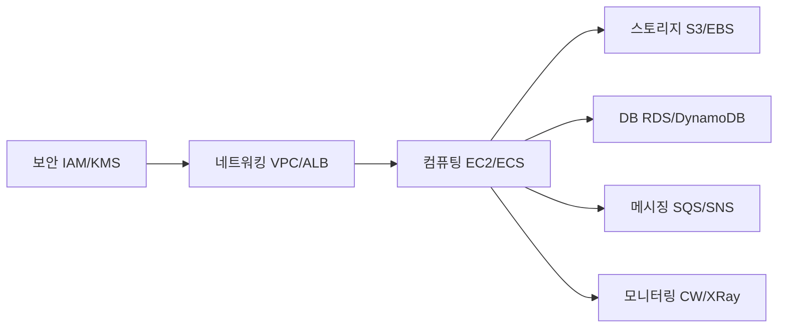
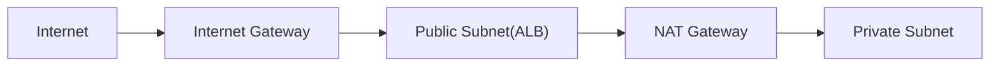
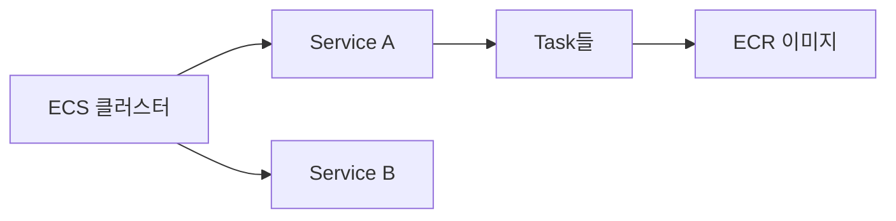
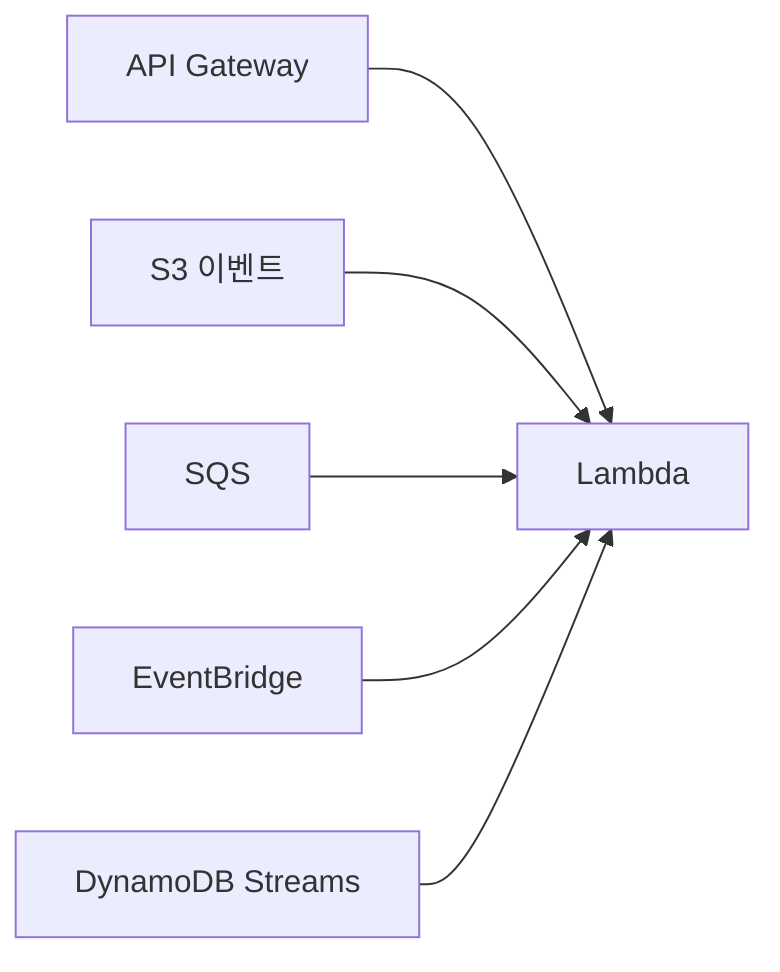
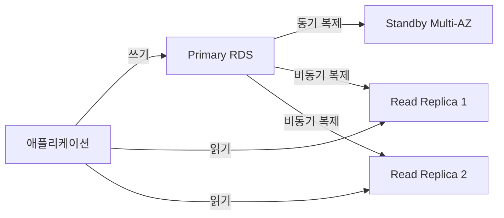
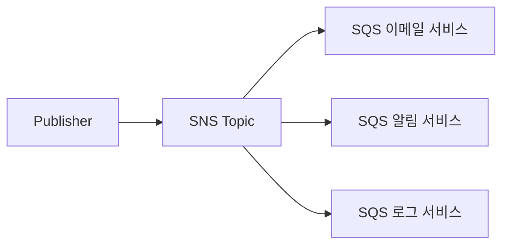
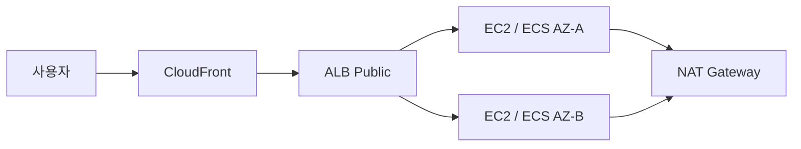
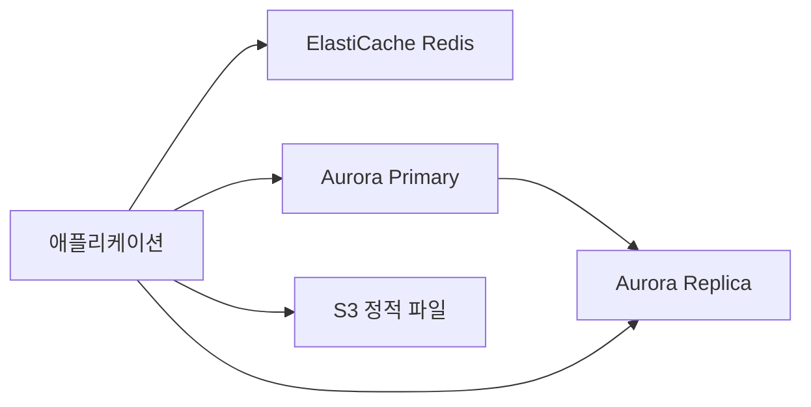
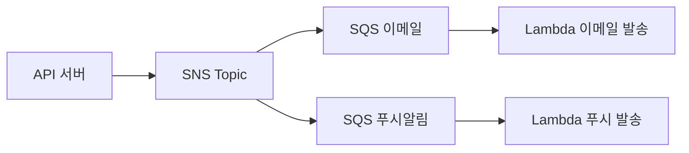

AWS는 200개가 넘는 서비스를 제공한다. 처음 마주하면 지도 없이 미로에 들어선 기분이다. 이 글은 백엔드 개발자가 실무에서 반드시 마주치는 핵심 서비스를 **레이어별로 정리**하고, 각 서비스가 왜 필요한지, 어떻게 연결되는지를 짚는다. 면접 포인트와 실무 실수도 함께 다룬다.

---

## 1. 전체 서비스 맵 개요

AWS 서비스는 크게 **네트워킹 → 컴퓨팅 → 스토리지 → 데이터베이스 → 메시징 → 모니터링 → 보안** 레이어로 나뉜다. 각 레이어가 아래 레이어 위에 쌓이는 구조다.



> **비유:** AWS 전체 구조는 건물과 같다. IAM은 출입 카드 시스템, VPC는 건물 외벽과 내부 복도, EC2/Lambda는 각 사무실, S3/RDS는 창고와 서류함, SQS/SNS는 사내 메신저다.

---

## 2. 네트워킹 레이어

### 2-1. VPC (Virtual Private Cloud)

VPC는 AWS 클라우드 안에 **논리적으로 격리된 나만의 네트워크**다. 온프레미스 데이터센터의 내부 네트워크를 클라우드로 옮긴 것이라 보면 된다.

> **비유:** VPC는 아파트 단지다. 단지 안은 외부와 격리되어 있고, 단지 내 동(Subnet)마다 역할이 다르다. 경비실(Internet Gateway)을 통해서만 외부와 왕래한다.

**핵심 구성 요소:**

1️⃣ **Subnet**: VPC를 더 작은 네트워크로 나눈 것. Public Subnet은 인터넷에 직접 노출되고, Private Subnet은 인터넷에서 직접 접근 불가.

2️⃣ **Internet Gateway (IGW)**: VPC와 인터넷 사이의 문. Public Subnet에 있는 리소스가 인터넷과 통신하려면 IGW가 필요하다.

3️⃣ **NAT Gateway**: Private Subnet의 리소스가 **인터넷으로 나가는 것**만 허용 (들어오는 트래픽은 차단). EC2가 외부 패키지를 다운로드할 때 필요하다.

4️⃣ **Route Table**: 패킷이 어디로 가야 할지 결정하는 라우팅 규칙 테이블.



**실전 구현 — VPC + Subnet + NAT Gateway (Terraform):**

```hcl
# VPC 생성
resource "aws_vpc" "main" {
  cidr_block           = "10.0.0.0/16"
  enable_dns_hostnames = true
  enable_dns_support   = true

  tags = { Name = "main-vpc" }
}

# Internet Gateway
resource "aws_internet_gateway" "main" {
  vpc_id = aws_vpc.main.id
  tags   = { Name = "main-igw" }
}

# Public Subnet (AZ-A)
resource "aws_subnet" "public_a" {
  vpc_id                  = aws_vpc.main.id
  cidr_block              = "10.0.1.0/24"
  availability_zone       = "ap-northeast-2a"
  map_public_ip_on_launch = true
  tags = { Name = "public-subnet-a" }
}

# Private Subnet (AZ-A)
resource "aws_subnet" "private_a" {
  vpc_id            = aws_vpc.main.id
  cidr_block        = "10.0.11.0/24"
  availability_zone = "ap-northeast-2a"
  tags = { Name = "private-subnet-a" }
}

# NAT Gateway (Elastic IP 필요)
resource "aws_eip" "nat" {
  domain = "vpc"
}

resource "aws_nat_gateway" "main" {
  allocation_id = aws_eip.nat.id
  subnet_id     = aws_subnet.public_a.id
  tags          = { Name = "main-nat-gw" }
}

# Public Route Table: 인터넷으로 라우팅
resource "aws_route_table" "public" {
  vpc_id = aws_vpc.main.id

  route {
    cidr_block = "0.0.0.0/0"
    gateway_id = aws_internet_gateway.main.id
  }
  tags = { Name = "public-rt" }
}

resource "aws_route_table_association" "public_a" {
  subnet_id      = aws_subnet.public_a.id
  route_table_id = aws_route_table.public.id
}

# Private Route Table: NAT Gateway로 라우팅
resource "aws_route_table" "private" {
  vpc_id = aws_vpc.main.id

  route {
    cidr_block     = "0.0.0.0/0"
    nat_gateway_id = aws_nat_gateway.main.id
  }
  tags = { Name = "private-rt" }
}

resource "aws_route_table_association" "private_a" {
  subnet_id      = aws_subnet.private_a.id
  route_table_id = aws_route_table.private.id
}

# Security Group — ALB용
resource "aws_security_group" "alb" {
  name   = "alb-sg"
  vpc_id = aws_vpc.main.id

  ingress {
    from_port   = 443
    to_port     = 443
    protocol    = "tcp"
    cidr_blocks = ["0.0.0.0/0"]
  }

  egress {
    from_port   = 0
    to_port     = 0
    protocol    = "-1"
    cidr_blocks = ["0.0.0.0/0"]
  }
}

# Security Group — EC2용 (ALB에서만 인바운드 허용)
resource "aws_security_group" "app" {
  name   = "app-sg"
  vpc_id = aws_vpc.main.id

  ingress {
    from_port       = 8080
    to_port         = 8080
    protocol        = "tcp"
    security_groups = [aws_security_group.alb.id]
  }

  egress {
    from_port   = 0
    to_port     = 0
    protocol    = "-1"
    cidr_blocks = ["0.0.0.0/0"]
  }
}
```

### 2-2. Security Group (SG)

Security Group은 EC2 인스턴스 단위의 **가상 방화벽**이다. Inbound/Outbound 트래픽 규칙을 포트와 IP 단위로 정의한다.

> **비유:** SG는 각 사무실 문의 전자 잠금장치다. "443 포트만 허용"이라고 설정하면, 다른 포트 노크는 전부 무시된다.

**실무 실수:** SG의 Outbound는 기본적으로 전체 허용(0.0.0.0/0)이다. 보안 강화를 위해 Outbound도 명시적으로 제한하는 걸 잊지 말 것.

**면접 포인트:** NACL(Network ACL)과 SG의 차이를 물어본다.
- NACL: Subnet 레벨, Stateless (요청/응답 각각 규칙 필요)
- SG: 인스턴스 레벨, Stateful (요청 허용 시 응답 자동 허용)

### 2-3. ALB / NLB

**ALB (Application Load Balancer)**는 L7(HTTP/HTTPS) 레이어에서 동작한다. URL 경로, 호스트 헤더, HTTP 메서드 기준으로 트래픽을 라우팅할 수 있다.

**NLB (Network Load Balancer)**는 L4(TCP/UDP) 레이어에서 동작한다. 초고속 처리(수백만 RPS)와 고정 IP가 필요할 때 쓴다.

> **비유:** ALB는 패키지 내용물을 보고 배달지를 결정하는 스마트 택배 분류기. NLB는 봉투를 열지도 않고 주소만 보고 초고속으로 분류하는 기계.

**ALB 핵심 기능:**
- **Target Group**: 트래픽을 받는 대상 집합 (EC2, ECS Task, Lambda, IP)
- **Listener Rule**: 요청 조건별로 Target Group을 선택하는 규칙
- **Health Check**: 대상의 건강 상태를 주기적으로 확인

### 2-4. Route 53

Route 53은 AWS의 **DNS 서비스**다. 도메인 등록, DNS 쿼리 해석, 헬스체크 기반 장애 조치(Failover)를 한 번에 제공한다.

라우팅 정책 종류:

| 정책 | 설명 | 사용 사례 |
|------|------|-----------|
| Simple | 단순 A레코드 | 단일 서버 |
| Weighted | 가중치 기반 분산 | Blue/Green 배포 |
| Latency | 지연시간 기준 최적 리전 | 글로벌 서비스 |
| Failover | 헬스체크 기반 장애 조치 | DR 구성 |
| Geolocation | 사용자 위치 기반 | 콘텐츠 지역화 |

### 2-5. CloudFront

CloudFront는 AWS의 **CDN(Content Delivery Network)**이다. 전 세계 450개 이상의 엣지 로케이션에 콘텐츠를 캐싱해 사용자에게 가장 가까운 서버에서 응답한다.

> **비유:** CloudFront는 편의점 체인이다. 본사(오리진 서버)에 재고가 있지만, 소비자는 집 근처 편의점(엣지 로케이션)에서 구매한다. 본사 부하가 줄고, 소비자는 빠르게 받는다.

**S3 + CloudFront 조합**은 정적 웹사이트 배포의 표준 패턴이다.

---

## 3. 컴퓨팅 레이어

### 3-1. EC2 (Elastic Compute Cloud)

EC2는 AWS의 **가상 서버**다. CPU, 메모리, 네트워크, 스토리지 사양을 선택해 수 분 만에 서버를 띄울 수 있다.

**인스턴스 타입 분류:**

| 패밀리 | 특징 | 예시 |
|--------|------|------|
| t (버스터블) | CPU 크레딧 방식, 저비용 | 개발/테스트 |
| m (범용) | CPU/메모리 균형 | 일반 백엔드 |
| c (컴퓨팅 최적화) | CPU 집약 | 배치 처리 |
| r (메모리 최적화) | 대용량 메모리 | 인메모리 DB |

**구매 옵션:**

1️⃣ **On-Demand**: 시간 단위 과금. 예측 불가능한 워크로드.

2️⃣ **Reserved**: 1~3년 약정. On-Demand 대비 최대 72% 절감. 안정적 워크로드.

3️⃣ **Spot**: 남는 용량을 경매 방식으로 구매. 최대 90% 절감. 중단 허용 가능한 배치 작업.

4️⃣ **Savings Plans**: 특정 인스턴스 타입 약정 없이 사용량 약정으로 할인.

> **비유:** On-Demand는 일반 택시, Reserved는 월정액 출퇴근 차량, Spot은 빈자리 있을 때 타는 카풀. 목적에 맞게 섞어서 쓰는 게 핵심이다.

**Auto Scaling Group (ASG):**

ASG는 트래픽에 따라 EC2 인스턴스를 자동으로 늘리고 줄이는 서비스다. CloudWatch 메트릭(CPU, 네트워크 등)을 기준으로 Scale Out/In 정책을 설정한다.

**실무 실수:** Launch Template 없이 ASG를 구성하면 인스턴스 타입 유연성이 없어 Spot 인스턴스 활용이 제한된다. 항상 Launch Template + 다중 인스턴스 타입 설정을 권장한다.

### 3-2. ECS (Elastic Container Service)

ECS는 **Docker 컨테이너 오케스트레이션** 서비스다. Kubernetes보다 AWS에 깊게 통합되어 있어 운영 오버헤드가 낮다.

**핵심 개념:**

- **Cluster**: 컨테이너를 실행하는 논리적 그룹
- **Task Definition**: 컨테이너 스펙(이미지, CPU, 메모리, 환경변수) 설계도
- **Service**: 특정 수의 Task를 항상 유지하는 관리자
- **Task**: 실제로 실행 중인 컨테이너 인스턴스



**ECS 실행 유형:**

- **EC2 Launch Type**: EC2 인스턴스를 직접 관리. 인스턴스 비용 최적화 가능.
- **Fargate Launch Type**: 서버리스 컨테이너. 인프라 관리 불필요.

### 3-3. Fargate

Fargate는 **서버리스 컨테이너 플랫폼**이다. EC2 인스턴스를 프로비저닝하거나 관리할 필요 없이 컨테이너를 실행한다. ECS와 EKS 모두에서 사용 가능하다.

> **비유:** EC2 기반 ECS는 직접 주방을 운영하는 식당, Fargate는 조리만 하면 되는 공유 주방 서비스. 주방 관리(OS 패치, 인스턴스 관리)는 AWS가 담당한다.

**Fargate 비용 구조:** vCPU/GB 시간당 과금. 소규모 서비스는 Fargate가 저렴하지만, 대규모에서는 EC2 + Spot 조합이 더 경제적일 수 있다.

### 3-4. Lambda

Lambda는 **이벤트 기반 서버리스 함수 실행** 서비스다. 코드를 업로드하면 AWS가 인프라를 완전히 관리한다. 함수 호출이 없으면 비용이 0원이다.

**Lambda 핵심 특성:**

- **최대 실행 시간**: 15분
- **메모리**: 128MB ~ 10GB (vCPU도 비례해서 증가)
- **동시 실행**: 기본 1,000 (리전별, 증가 요청 가능)
- **콜드 스타트**: 처음 실행 시 초기화 지연 (Java/Spring은 1~3초)

**Lambda 이벤트 소스:**



**면접 포인트:** Lambda 콜드 스타트 해결 방법을 물어본다.
- Provisioned Concurrency: 미리 초기화된 인스턴스 유지 (비용 발생)
- 워밍업 스케줄: EventBridge로 주기적 호출
- 런타임 선택: Python/Node.js가 Java보다 콜드 스타트 빠름

**실무 실수:** Lambda에서 DB 연결을 함수 내부에서 매번 생성하면 연결 풀 고갈이 발생한다. RDS Proxy를 앞에 두거나, 연결 객체를 핸들러 바깥(전역 스코프)에서 초기화해 재사용해야 한다.

**실전 구현 — Lambda 핸들러 (Java + Spring Cloud Function):**

```java
// build.gradle 의존성
// implementation 'org.springframework.cloud:spring-cloud-function-adapter-aws'
// implementation 'com.amazonaws:aws-lambda-java-core:1.2.3'
// implementation 'com.amazonaws:aws-lambda-java-events:3.11.3'

@Component
public class OrderEventHandler
        implements Function<APIGatewayProxyRequestEvent, APIGatewayProxyResponseEvent> {

    // 핸들러 바깥에서 초기화 → warm 상태에서 재사용
    private final ObjectMapper objectMapper = new ObjectMapper();
    private final OrderService orderService;

    public OrderEventHandler(OrderService orderService) {
        this.orderService = orderService;
    }

    @Override
    public APIGatewayProxyResponseEvent apply(APIGatewayProxyRequestEvent request) {
        try {
            OrderRequest orderReq = objectMapper.readValue(
                    request.getBody(), OrderRequest.class);

            OrderResponse response = orderService.processOrder(orderReq);

            return new APIGatewayProxyResponseEvent()
                    .withStatusCode(200)
                    .withHeaders(Map.of("Content-Type", "application/json"))
                    .withBody(objectMapper.writeValueAsString(response));

        } catch (JsonProcessingException e) {
            return new APIGatewayProxyResponseEvent()
                    .withStatusCode(400)
                    .withBody("{\"error\": \"Invalid request body\"}");
        } catch (Exception e) {
            // Lambda 환경에서 예외 로깅 — CloudWatch Logs로 자동 수집됨
            System.err.println("Order processing failed: " + e.getMessage());
            return new APIGatewayProxyResponseEvent()
                    .withStatusCode(500)
                    .withBody("{\"error\": \"Internal server error\"}");
        }
    }
}

// SQS 이벤트 처리 핸들러
@Component("sqsOrderHandler")
public class SqsOrderHandler implements Consumer<SQSEvent> {

    private final OrderService orderService;
    private final ObjectMapper objectMapper = new ObjectMapper();

    public SqsOrderHandler(OrderService orderService) {
        this.orderService = orderService;
    }

    @Override
    public void accept(SQSEvent event) {
        for (SQSEvent.SQSMessage message : event.getRecords()) {
            try {
                OrderRequest order = objectMapper.readValue(
                        message.getBody(), OrderRequest.class);
                orderService.processOrder(order);
                System.out.println("Processed order: " + order.getOrderId());
            } catch (Exception e) {
                // 예외 발생 시 해당 메시지만 실패 → DLQ로 이동
                System.err.println("Failed to process message: "
                        + message.getMessageId() + " - " + e.getMessage());
                throw new RuntimeException(e); // Lambda가 배치 실패로 처리
            }
        }
    }
}

// Terraform으로 Lambda 배포
// resource "aws_lambda_function" "order_handler" {
//   function_name = "order-handler"
//   role          = aws_iam_role.lambda_exec.arn
//   handler       = "org.springframework.cloud.function.adapter.aws.FunctionInvoker"
//   runtime       = "java21"
//   memory_size   = 512
//   timeout       = 30
//
//   environment {
//     variables = {
//       SPRING_CLOUD_FUNCTION_DEFINITION = "orderEventHandler"
//       DB_HOST = aws_db_proxy.main.endpoint
//     }
//   }
//
//   # Provisioned Concurrency로 콜드 스타트 방지
//   # provisioned_concurrent_executions = 2
// }
```

---

## 4. 스토리지 레이어

### 4-1. S3 (Simple Storage Service)

S3는 AWS의 **객체 스토리지**다. 파일(객체)을 버킷에 저장하며, 이론적으로 무제한 용량을 지원한다. 99.999999999%(11 9's) 내구성을 보장한다.

> **비유:** S3는 무한 용량의 구글 드라이브다. 파일을 폴더 구조처럼 키(Key)로 관리하지만, 실제로는 플랫한 키-값 구조다. `/images/user/123/avatar.jpg`처럼 보이지만 이 전체가 하나의 키다.

**S3 스토리지 클래스:**

| 클래스 | 접근 빈도 | 비용 | 용도 |
|--------|-----------|------|------|
| Standard | 자주 | 높음 | 서비스 에셋 |
| Standard-IA | 가끔 | 중간 | 백업 |
| One Zone-IA | 가끔, 단일 AZ | 낮음 | 재현 가능한 데이터 |
| Glacier Instant | 분기별 | 매우 낮음 | 아카이브 |
| Glacier Deep Archive | 연간 | 최저 | 규정 준수 보관 |
| Intelligent-Tiering | 불규칙 | 자동 조정 | 접근 패턴 불명확 |

**S3 Lifecycle Policy:** 객체를 일정 기간 후 자동으로 다른 스토리지 클래스로 이동하거나 삭제하는 정책.

**실무 실수:** S3 버킷을 Public으로 열어두는 건 대형 보안 사고의 시작이다. 항상 Block Public Access를 활성화하고, CloudFront나 Presigned URL을 통해 접근을 제어해야 한다.

**Presigned URL:** 특정 시간 동안만 유효한 임시 접근 URL. 파일 다운로드 링크를 외부에 제공할 때 사용.

### 4-2. EBS (Elastic Block Store)

EBS는 EC2에 **블록 스토리지**를 제공하는 서비스다. 하드디스크처럼 EC2에 마운트해서 사용한다.

> **비유:** EBS는 EC2라는 컴퓨터에 꽂는 외장 SSD다. EC2 인스턴스가 종료돼도 EBS는 독립적으로 존재한다. 다른 EC2에 재연결도 가능하다.

**EBS 볼륨 타입:**

| 타입 | IOPS | 용도 |
|------|------|------|
| gp3 | 최대 16,000 IOPS | 범용 (권장) |
| io2 Block Express | 최대 256,000 IOPS | 고성능 DB |
| st1 | 처리량 최적화 | 빅데이터, 로그 |
| sc1 | 저비용 | 콜드 데이터 |

**주의:** EBS는 **단일 AZ**에 존재하며, 기본적으로 **단일 EC2에만** 연결 가능(io1/io2의 Multi-Attach 예외).

### 4-3. EFS (Elastic File System)

EFS는 AWS의 **관리형 NFS(네트워크 파일 시스템)**다. 여러 EC2 인스턴스가 동시에 같은 파일 시스템을 마운트할 수 있다.

> **비유:** EFS는 사무실 공용 네트워크 드라이브다. 모든 직원(EC2)이 같은 폴더에 접근하고, 한 명이 파일을 바꾸면 모두가 최신 버전을 본다.

**EBS vs EFS 선택 기준:**

- 단일 EC2 전용 고성능 스토리지 → EBS (gp3)
- 여러 EC2가 공유해야 하는 데이터 → EFS
- ECS/Fargate 컨테이너 간 공유 볼륨 → EFS

---

## 5. 데이터베이스 레이어

### 5-1. RDS (Relational Database Service)

RDS는 MySQL, PostgreSQL, MariaDB, Oracle, SQL Server를 **관리형으로 제공**하는 서비스다. OS 패치, 백업, 복제, 장애 조치를 AWS가 자동으로 처리한다.

> **비유:** RDS는 DBA(데이터베이스 관리자)가 딸려 있는 DB 서버 임대 서비스다. 직접 DB를 설치·운영하는 것보다 관리 부담이 훨씬 적다.

**Multi-AZ 배포:** Primary DB와 Standby DB를 다른 AZ에 동기식으로 복제. Primary 장애 시 자동으로 Standby로 Failover. **읽기 분산은 불가** (Standby는 대기 전용).

**Read Replica:** 읽기 트래픽을 분산하기 위한 비동기 복제본. 최대 5개 생성 가능. 다른 리전에도 생성 가능(Cross-Region Read Replica).



**면접 포인트:** Multi-AZ와 Read Replica의 차이
- Multi-AZ: 고가용성(HA) 목적, 동기 복제, 자동 Failover
- Read Replica: 성능 향상 목적, 비동기 복제, 수동 승격 가능

### 5-2. Aurora

Aurora는 AWS가 직접 만든 **클라우드 최적화 관계형 DB**다. MySQL, PostgreSQL 호환이며, RDS보다 최대 5배(MySQL 기준) 빠르다.

**Aurora의 핵심 아키텍처 차별점:**

1️⃣ **공유 스토리지**: 최대 6개의 컴퓨팅 노드가 동일한 스토리지 레이어를 공유. 쓰기는 Primary 1개, 읽기는 모든 노드 가능.

2️⃣ **3 AZ × 2 복사 = 6중 복제**: 스토리지 레벨에서 자동으로 6개 복사본 유지. 최대 2개 복사본 손실에도 쓰기 가능, 3개 손실에도 읽기 가능.

3️⃣ **Auto Scaling 스토리지**: 10GB에서 시작해 128TB까지 자동 확장.

**Aurora Serverless v2:** 트래픽에 따라 Aurora 용량(ACU, Aurora Capacity Unit)을 자동 조정. 사용하지 않을 때는 거의 0으로 스케일 다운.

> **비유:** 일반 RDS가 세탁소에 세탁기를 두고 쓰는 것이라면, Aurora는 빨래감을 맡기면 알아서 처리해주는 세탁 서비스다. 세탁기 성능도 더 좋고, 관리도 훨씬 편하다.

### 5-3. DynamoDB

DynamoDB는 AWS의 **완전관리형 NoSQL 키-값/도큐먼트 DB**다. 테이블 스키마 없이도 사용 가능하며, 초당 수백만 요청을 처리할 수 있다.

**핵심 개념:**

- **Primary Key**: Partition Key 단독 또는 Partition Key + Sort Key 조합
- **Partition Key**: 데이터를 물리적으로 분산 저장하는 키. 카디널리티가 높아야 함.
- **Sort Key**: 같은 Partition Key 내에서 정렬 및 범위 쿼리 가능
- **GSI (Global Secondary Index)**: 다른 속성으로 조회하기 위한 보조 인덱스

> **비유:** DynamoDB는 초대형 해시 테이블이다. Partition Key로 데이터가 저장된 서랍을 찾고, Sort Key로 서랍 안의 파일을 정렬해 꺼낸다. 서랍 번호(Partition Key) 없이는 전체를 뒤져야 한다(Scan = 비효율).

**DynamoDB 용량 모드:**

| 모드 | 특징 | 사용 사례 |
|------|------|-----------|
| On-Demand | 실제 요청량 과금 | 트래픽 예측 불가 |
| Provisioned | WCU/RCU 사전 할당 | 안정적 트래픽 |

**실무 실수:** Hot Partition 문제. 특정 Partition Key에 트래픽이 집중되면 해당 파티션이 병목이 된다. 사용자 ID보다 `userId#date` 같은 복합 키 설계나, Write Sharding 기법으로 분산시켜야 한다.

### 5-4. ElastiCache

ElastiCache는 **Redis 또는 Memcached를 완전관리형으로 제공**하는 인메모리 캐시 서비스다.

> **비유:** DB가 도서관이라면, ElastiCache는 책상 위에 펼쳐둔 자주 보는 책이다. 도서관까지 가지 않아도 빠르게 참조할 수 있다.

**Redis vs Memcached:**

| 항목 | Redis | Memcached |
|------|-------|-----------|
| 자료구조 | String, Hash, List, Set, ZSet, Stream | String만 |
| 복제 | 지원 (Primary/Replica) | 미지원 |
| 지속성 | AOF/RDB 백업 | 미지원 |
| 클러스터 | Cluster Mode 지원 | 단순 수평 확장 |
| 사용 사례 | 세션, 리더보드, 분산 락 | 단순 캐시 |

**Redis 활용 패턴:**

1️⃣ **Cache-Aside (Lazy Loading)**: 캐시 미스 시 DB 조회 후 캐시에 저장. 가장 일반적인 패턴.

2️⃣ **Write-Through**: DB 쓰기와 동시에 캐시도 업데이트. 캐시 데이터 항상 최신.

3️⃣ **Session Store**: 서버 간 세션 공유. ALB Sticky Session 없이도 로드밸런싱 가능.

---

## 6. 메시징 레이어

### 6-1. SQS (Simple Queue Service)

SQS는 AWS의 **완전관리형 메시지 큐** 서비스다. 생산자(Producer)가 메시지를 큐에 넣으면, 소비자(Consumer)가 폴링해서 처리한다.

> **비유:** SQS는 은행 대기표 시스템이다. 손님(메시지)이 도착하면 번호표를 받고 대기열에 들어간다. 은행원(Consumer)은 자기 속도에 맞게 번호를 불러 처리한다. 순간 손님이 몰려도 은행원이 지치지 않는다.

**SQS 두 가지 유형:**

- **Standard Queue**: 초당 무제한 처리량. 메시지 순서 보장 안 됨. 최소 1회 전달 (중복 가능).
- **FIFO Queue**: 순서 보장. 정확히 1회 전달. 초당 최대 3,000 메시지 (배치 처리 시).

**Dead Letter Queue (DLQ):** 처리 실패 메시지를 별도 큐로 분리하는 기능. `maxReceiveCount` 초과 시 DLQ로 이동. 장애 메시지 분석과 재처리에 필수.

**Visibility Timeout:** Consumer가 메시지를 꺼낸 후 처리 완료 전까지 다른 Consumer에게 보이지 않는 시간. 처리 시간보다 충분히 크게 설정해야 한다.

**실무 실수:** Visibility Timeout을 너무 짧게 설정하면 처리 중인 메시지가 다시 큐에 보여서 중복 처리가 발생한다. 반드시 처리 예상 시간 × 2 이상으로 설정할 것.

### 6-2. SNS (Simple Notification Service)

SNS는 **Pub/Sub 메시징** 서비스다. Publisher가 Topic에 메시지를 발행하면, Topic을 구독한 모든 Subscriber에게 동시에 전달한다.

> **비유:** SNS는 방송국이다. 기자(Publisher)가 뉴스를 방송(Topic)에 송출하면, 각 채널을 시청하는 시청자(Subscriber)에게 동시에 전달된다. 각 시청자가 뭘 하는지는 기자가 신경 쓰지 않는다.

**SNS Subscriber 종류:** SQS, Lambda, HTTP/S Endpoint, Email, SMS, Mobile Push

**SNS + SQS Fan-Out 패턴:**



이 패턴의 핵심: SNS가 메시지를 여러 SQS에 동시 전달하면, 각 서비스는 자기 큐에서 독립적으로 처리한다. 한 서비스가 다운돼도 다른 서비스에 영향 없다.

### 6-3. EventBridge

EventBridge는 **이벤트 기반 아키텍처를 위한 서버리스 이벤트 버스**다. AWS 서비스, SaaS 앱, 자체 앱에서 발생하는 이벤트를 룰 기반으로 라우팅한다.

> **비유:** EventBridge는 스마트 우체국이다. 어디서 편지가 오든, 수신자 주소(룰)를 보고 해당 부서(Target)로 자동 분류해서 배달한다.

**주요 구성:**

- **Event Bus**: 이벤트를 수신하는 파이프라인
- **Rule**: 이벤트 패턴 매칭 조건
- **Target**: 이벤트를 전달할 대상 (Lambda, SQS, ECS Task, Step Functions 등)

**EventBridge Scheduler:** 크론식 또는 고정 주기로 이벤트를 발행하는 스케줄러. CloudWatch Events의 후속 서비스.

### 6-4. Kinesis

Kinesis는 **실시간 스트리밍 데이터 처리** 서비스다. 초당 수 GB의 데이터를 수집·처리·분석할 수 있다.

**Kinesis 패밀리:**

| 서비스 | 역할 |
|--------|------|
| Kinesis Data Streams | 실시간 스트리밍 데이터 수집 |
| Kinesis Data Firehose | 스트림 데이터를 S3/Redshift로 적재 |
| Kinesis Data Analytics | 스트리밍 SQL 분석 |

> **비유:** Kinesis는 강(Stream)이다. 물(데이터)이 끊임없이 흐르고, 여러 물레방아(Consumer)가 동시에 물을 퍼서 활용한다. SQS가 저수지(큐)라면 Kinesis는 흐르는 강이다.

**SQS vs Kinesis 선택 기준:**

| 기준 | SQS | Kinesis |
|------|-----|---------|
| 처리 순서 | FIFO 큐만 보장 | Shard 내 순서 보장 |
| 소비자 수 | 단일 소비자 그룹 | 여러 소비자 동시 |
| 보존 기간 | 최대 14일 | 최대 365일 |
| 사용 사례 | 작업 큐, 디커플링 | 로그, 클릭스트림, IoT |

---

## 7. 모니터링 레이어

### 7-1. CloudWatch

CloudWatch는 AWS 리소스와 애플리케이션의 **모니터링·관측 플랫폼**이다.

**CloudWatch의 핵심 구성:**

1️⃣ **Metrics**: 시계열 지표 데이터. AWS 서비스는 기본 메트릭 자동 수집. 커스텀 메트릭도 API로 발행 가능.

2️⃣ **Logs**: 로그 수집·저장·조회. CloudWatch Logs Insights로 SQL 유사 쿼리 가능.

3️⃣ **Alarms**: 메트릭 임계값 도달 시 알림 또는 자동 조치 실행.

4️⃣ **Dashboards**: 여러 메트릭을 시각화하는 커스텀 대시보드.

5️⃣ **Events (EventBridge)**: 시간 기반 또는 이벤트 기반 규칙 실행.

**Composite Alarm:** 여러 Alarm을 AND/OR 조건으로 조합. "CPU > 80% AND 에러율 > 5%일 때만 알림" 같은 정교한 알람 설계 가능. 알람 피로도 감소에 효과적.

**실전 구현 — CloudWatch Alarm + 커스텀 메트릭 (Terraform + Java):**

```hcl
# SNS 토픽 (알람 수신용)
resource "aws_sns_topic" "alerts" {
  name = "app-alerts"
}

resource "aws_sns_topic_subscription" "alert_email" {
  topic_arn = aws_sns_topic.alerts.arn
  protocol  = "email"
  endpoint  = "ops-team@example.com"
}

# EC2 CPU 사용률 알람
resource "aws_cloudwatch_metric_alarm" "cpu_high" {
  alarm_name          = "app-cpu-high"
  comparison_operator = "GreaterThanThreshold"
  evaluation_periods  = 2          # 연속 2번 측정
  metric_name         = "CPUUtilization"
  namespace           = "AWS/EC2"
  period              = 60         # 1분 간격
  statistic           = "Average"
  threshold           = 80         # 80% 초과 시
  alarm_description   = "CPU 사용률 80% 초과"
  alarm_actions       = [aws_sns_topic.alerts.arn]
  ok_actions          = [aws_sns_topic.alerts.arn]

  dimensions = {
    AutoScalingGroupName = aws_autoscaling_group.app.name
  }
}

# ALB 5xx 에러율 알람
resource "aws_cloudwatch_metric_alarm" "alb_5xx" {
  alarm_name          = "alb-5xx-errors"
  comparison_operator = "GreaterThanThreshold"
  evaluation_periods  = 1
  threshold           = 10

  metric_query {
    id          = "error_rate"
    expression  = "errors / requests * 100"
    label       = "5xx Error Rate (%)"
    return_data = true
  }

  metric_query {
    id = "errors"
    metric {
      metric_name = "HTTPCode_Target_5XX_Count"
      namespace   = "AWS/ApplicationELB"
      period      = 60
      stat        = "Sum"
      dimensions = {
        LoadBalancer = aws_lb.main.arn_suffix
      }
    }
  }

  metric_query {
    id = "requests"
    metric {
      metric_name = "RequestCount"
      namespace   = "AWS/ApplicationELB"
      period      = 60
      stat        = "Sum"
      dimensions = {
        LoadBalancer = aws_lb.main.arn_suffix
      }
    }
  }

  alarm_actions = [aws_sns_topic.alerts.arn]
}

# Composite Alarm — CPU 높고 에러율도 높을 때만 알림 (알람 피로도 방지)
resource "aws_cloudwatch_composite_alarm" "critical" {
  alarm_name = "app-critical"
  alarm_rule = "ALARM(${aws_cloudwatch_metric_alarm.cpu_high.alarm_name}) AND ALARM(${aws_cloudwatch_metric_alarm.alb_5xx.alarm_name})"
  alarm_actions = [aws_sns_topic.alerts.arn]
}
```

```java
// 커스텀 메트릭 발행 (Java + AWS SDK v2)
@Component
public class BusinessMetricPublisher {

    private final CloudWatchClient cloudWatch;
    private static final String NAMESPACE = "MyApp/Business";

    public BusinessMetricPublisher(CloudWatchClient cloudWatch) {
        this.cloudWatch = cloudWatch;
    }

    // 주문 처리 성공/실패 메트릭 발행
    public void recordOrderProcessed(String status, double latencyMs) {
        List<MetricDatum> metrics = List.of(
            MetricDatum.builder()
                .metricName("OrderCount")
                .value(1.0)
                .unit(StandardUnit.COUNT)
                .dimensions(Dimension.builder()
                    .name("Status").value(status).build())
                .timestamp(Instant.now())
                .build(),
            MetricDatum.builder()
                .metricName("OrderLatency")
                .value(latencyMs)
                .unit(StandardUnit.MILLISECONDS)
                .timestamp(Instant.now())
                .build()
        );

        cloudWatch.putMetricData(r -> r
            .namespace(NAMESPACE)
            .metricData(metrics));
    }
}

// 주문 처리 지연시간 기반 알람 (AWS CLI)
// aws cloudwatch put-metric-alarm \
//   --alarm-name "order-latency-high" \
//   --metric-name "OrderLatency" \
//   --namespace "MyApp/Business" \
//   --statistic Average \
//   --period 60 \
//   --evaluation-periods 3 \
//   --threshold 500 \
//   --comparison-operator GreaterThanThreshold \
//   --alarm-actions arn:aws:sns:ap-northeast-2:123456789:app-alerts
```

**실무 실수:** 기본 메트릭의 수집 간격은 5분이다. 1분 세부 모니터링(Detailed Monitoring)은 추가 비용이 발생한다. 필요한 인스턴스에만 활성화하는 게 비용 효율적이다.

### 7-2. X-Ray

X-Ray는 **분산 추적(Distributed Tracing)** 서비스다. 마이크로서비스 환경에서 요청이 여러 서비스를 거칠 때 전체 경로와 성능 병목을 시각화한다.

> **비유:** X-Ray는 택배 추적 시스템이다. 발송에서 배달까지 각 물류 센터(서비스)를 통과하는 시간과 경로를 모두 기록해, 어디서 지연됐는지 한눈에 파악할 수 있다.

**핵심 개념:**

- **Trace**: 하나의 요청이 거치는 전체 여정
- **Segment**: 각 서비스에서 처리한 작업 단위
- **Subsegment**: DB 쿼리, HTTP 호출 등 세부 작업
- **Service Map**: 서비스 간 의존관계와 지연시간 시각화

**X-Ray 적용 방법:** SDK를 코드에 추가하거나, Lambda/ECS에서 X-Ray Daemon을 활성화하는 방식으로 계측(Instrumentation)한다.

---

## 8. 보안 레이어

### 8-1. IAM (Identity and Access Management)

IAM은 AWS 리소스에 대한 **인증(Authentication)과 인가(Authorization)**을 관리하는 서비스다. 누가(Who), 무엇을(What), 어떤 조건에서(Condition) 할 수 있는지 정의한다.

> **비유:** IAM은 회사 인사부서 + 보안부서의 합체다. 직원(User/Role)별로 출입 카드(Credential)를 발급하고, 각 시스템(리소스)에 대한 접근 권한을 세밀하게 제어한다.

**IAM 구성 요소:**

| 구성 | 설명 |
|------|------|
| User | 사람 또는 애플리케이션을 위한 영구 자격증명 |
| Group | 여러 User에게 동일한 정책 적용 |
| Role | AWS 서비스나 외부 ID가 임시로 권한을 위임받는 수단 |
| Policy | 허용/거부 권한을 JSON으로 정의한 문서 |

**IAM Role의 중요성:** EC2, Lambda, ECS Task가 다른 AWS 서비스에 접근할 때 Access Key를 하드코딩하지 말고, IAM Role을 인스턴스/태스크에 연결해야 한다. Role은 임시 자격증명(STS)을 자동 발급·갱신한다.

**최소 권한 원칙 (Least Privilege):** 필요한 최소한의 권한만 부여. `"Action": "*"` 같은 와일드카드 권한은 운영 환경에서 절대 금지.

**면접 포인트:** IAM Policy의 평가 로직 — 명시적 Deny가 있으면 무조건 거부. Allow가 없으면 기본 거부(Implicit Deny). Deny > Allow 순서.

### 8-2. KMS (Key Management Service)

KMS는 **암호화 키를 생성·관리·사용**하는 서비스다. S3, RDS, EBS, Secrets Manager 등 대부분의 AWS 서비스와 통합된다.

> **비유:** KMS는 은행 금고 열쇠 관리 시스템이다. 열쇠(CMK)를 직접 다루지 않아도, KMS가 열쇠로 잠그고 여는 작업을 대신해준다. 열쇠 자체는 절대 외부로 나오지 않는다.

**CMK (Customer Managed Key):** 고객이 직접 만들고 관리하는 키. 키 정책으로 사용 권한 제어. 자동 연간 갱신 설정 가능.

**봉투 암호화 (Envelope Encryption):**

1️⃣ KMS CMK로 데이터 암호화 키(DEK)를 생성·암호화

2️⃣ DEK로 실제 데이터를 암호화

3️⃣ 암호화된 DEK와 암호화된 데이터를 함께 저장

이 방식으로 대용량 데이터도 KMS API를 직접 호출하지 않고 효율적으로 암호화할 수 있다.

### 8-3. Secrets Manager

Secrets Manager는 **DB 비밀번호, API 키 등 시크릿 값을 안전하게 저장·관리**하는 서비스다.

> **비유:** Secrets Manager는 회사 공용 비밀번호 금고다. 코드에 비밀번호를 적지 않고, 애플리케이션이 금고에서 필요할 때 꺼내 쓴다. 비밀번호가 바뀌어도 코드는 손대지 않아도 된다.

**핵심 기능:**

- **자동 교체(Rotation)**: Lambda 함수로 시크릿 자동 갱신. RDS 비밀번호 90일 교체 자동화 가능.
- **KMS 통합**: 저장된 시크릿 값을 KMS로 암호화.
- **VPC Endpoint**: 시크릿 조회 트래픽이 인터넷을 거치지 않음.

**SSM Parameter Store와 비교:**

| 항목 | Secrets Manager | SSM Parameter Store |
|------|-----------------|---------------------|
| 비용 | 시크릿당 월 $0.40 | 표준 파라미터 무료 |
| 자동 교체 | 내장 | 직접 구현 필요 |
| 시크릿 버전 관리 | 지원 | 지원 |
| 용도 | 비밀번호, API 키 | 설정값, 비밀값 모두 |

---

## 9. 실전 3-Tier 아키텍처

이제 위의 서비스들을 조합해 실제 서비스 아키텍처를 설계해보자. 3-Tier 아키텍처는 **프레젠테이션 → 애플리케이션 → 데이터** 계층으로 구성된다.

### 9-1. 네트워크 구성



### 9-2. 데이터 및 캐시 구성



### 9-3. 메시징 및 비동기 처리



### 9-4. 전체 아키텍처 설명

실제 3-Tier 서비스의 요청 흐름을 따라가 보자.

1️⃣ **사용자 요청 진입**: Route 53이 DNS를 해석해 CloudFront로 라우팅. 정적 자산(JS, CSS, 이미지)은 CloudFront 엣지 캐시에서 즉시 반환.

2️⃣ **동적 요청 처리**: CloudFront에서 캐시 미스 발생 시 ALB로 전달. ALB가 Health Check를 통과한 EC2/ECS 인스턴스로 로드밸런싱.

3️⃣ **애플리케이션 처리**: EC2는 Private Subnet에 위치. ElastiCache에서 캐시 조회. 미스 시 Aurora Primary/Read Replica에서 DB 조회.

4️⃣ **비동기 이벤트**: 주문 완성 등 이벤트 발생 시 SNS에 발행. 이메일·푸시 서비스가 각자 SQS를 통해 독립적으로 처리.

5️⃣ **보안 레이어**: 모든 데이터는 KMS 암호화. IAM Role로 서비스 간 권한 제어. Secrets Manager로 DB 비밀번호 관리.

---

## 10. 비용 최적화 전략

### 컴퓨팅 비용 절감

1️⃣ **Savings Plans 적용**: 안정적 워크로드에 1년 약정 Compute Savings Plans 적용. On-Demand 대비 최대 66% 절감.

2️⃣ **Spot 인스턴스 활용**: 배치 처리, CI/CD 빌드 서버, 개발 환경에 Spot 적용. 최대 90% 절감.

3️⃣ **올바른 인스턴스 사이징**: CloudWatch 메트릭 기반 Compute Optimizer 권고사항 적용. 과도하게 프로비저닝된 인스턴스를 다운사이징.

4️⃣ **스케줄 기반 ASG**: 야간/주말 트래픽이 적은 시간대에 최소 용량으로 자동 축소.

### 스토리지 비용 절감

1️⃣ **S3 Lifecycle Policy**: 30일 이후 Standard-IA, 90일 이후 Glacier로 자동 전환.

2️⃣ **S3 Intelligent-Tiering**: 접근 패턴 불명확한 데이터에 적용. AWS가 자동으로 최적 스토리지 클래스 선택.

3️⃣ **EBS 볼륨 감사**: 연결되지 않은 EBS 볼륨과 오래된 스냅샷을 주기적으로 정리.

### 데이터 전송 비용 절감

AWS의 숨겨진 비용 함정은 **데이터 전송 비용(Data Transfer)**이다. 인터넷으로 나가는 트래픽은 GB당 과금된다.

1️⃣ **CloudFront 활용**: 오리진에서 CloudFront로의 전송은 무료. CloudFront에서 인터넷으로 나가는 비용이 직접 전송보다 저렴.

2️⃣ **VPC Endpoint 사용**: S3, DynamoDB에 VPC Endpoint 설정 시 NAT Gateway를 거치지 않아 데이터 전송 비용 절감.

3️⃣ **같은 AZ 내 통신**: EC2 → RDS를 같은 AZ에 배치. AZ 간 데이터 전송은 GB당 $0.01 과금.

---

## 11. 극한 시나리오 대응

### 시나리오 1: 트래픽 10배 스파이크

> 이벤트 프로모션으로 평소 10배 트래픽이 순간적으로 발생했다.

**대응 방안:**
- ALB + ASG가 자동으로 EC2 Scale Out (수 분 소요)
- CloudFront 캐시로 정적 자산 요청은 오리진에 도달하지 않음
- ElastiCache가 DB 부하의 80%를 흡수
- Aurora Auto Scaling으로 Read Replica 자동 추가
- Lambda는 동시 실행이 자동으로 확장 (서버리스의 장점)

**실무 준비:** ASG의 예열(Warm-up) 시간을 고려해 **예측 기반 스케일링(Predictive Scaling)** 또는 **미리 증설(Scheduled Scaling)**을 사용해야 실시간 대응이 가능하다.

### 시나리오 2: AZ 전체 장애

> us-east-1a AZ 전체가 다운됐다.

**대응 방안:**
- Multi-AZ RDS/Aurora: 수십 초 내 Standby로 자동 Failover
- ALB: Health Check 실패한 AZ의 인스턴스 자동 제외
- ASG: 남은 AZ에 인스턴스 재배포 (여러 AZ에 균등 분산 설정 필수)
- ElastiCache Multi-AZ: Replica로 자동 승격

**사전 준비:** 각 AZ에 최소 2개 이상의 인스턴스가 있어야 한다. `minHealthyPercentage`를 적절히 설정해 롤링 배포 시 전체 가용성 유지.

### 시나리오 3: 갑작스러운 비용 폭증

> 이달 AWS 비용이 전월 대비 300% 증가했다.

**원인 파악 순서:**
1️⃣ AWS Cost Explorer에서 서비스별, 리전별 비용 급증 항목 식별

2️⃣ CloudWatch 메트릭으로 비정상 트래픽이나 데이터 전송량 확인

3️⃣ EC2 인스턴스 목록 확인: 종료 누락된 대형 인스턴스 없는지 점검

4️⃣ S3 버킷 정책 확인: 공개 버킷으로 인한 대량 다운로드 확인

**예방 대책:**
- AWS Budget 설정: 예산 임계값(80%, 100%) 알림 이메일 등록
- Cost Anomaly Detection: 이상 비용 자동 탐지 및 알림
- S3 Block Public Access: 계정 레벨에서 강제 적용

---

## 12. 면접 포인트 총정리

### 자주 출제되는 질문 1: S3의 데이터 일관성 모델

S3는 2020년 12월부터 **강한 일관성(Strong Consistency)**을 모든 작업에 지원한다. 그 이전에는 PUT 후 GET에서 이전 데이터가 반환될 수 있었다(Eventually Consistent). 현재는 PUT, GET, DELETE, LIST 모두 즉시 일관성이 보장된다.

### 자주 출제되는 질문 2: Lambda와 Fargate 선택 기준

| 기준 | Lambda | Fargate |
|------|--------|---------|
| 실행 시간 | 최대 15분 | 무제한 |
| 상태 | Stateless | Stateful 가능 |
| 콜드 스타트 | 있음 | 없음 (Service) |
| 비용 | 호출당 | vCPU/GB 시간당 |
| 사용 사례 | 이벤트 처리, 짧은 작업 | 장기 실행 서비스 |

### 자주 출제되는 질문 3: RDS Multi-AZ Failover 과정

1️⃣ Primary DB 장애 감지 (약 30초~1분)

2️⃣ Route 53의 CNAME이 Standby 엔드포인트로 업데이트

3️⃣ Standby가 Primary로 승격

4️⃣ 애플리케이션은 DB 엔드포인트 URL 변경 없이 재연결

**중요:** 애플리케이션 단에서 DB 연결 실패 시 재시도 로직이 없으면 Failover 시간 동안 에러가 발생한다. 항상 재시도 + Exponential Backoff를 구현해야 한다.

### 자주 출제되는 질문 4: SQS 메시지 순서 보장

Standard SQS는 **순서를 보장하지 않는다**. 높은 처리량을 위해 의도적으로 순서를 포기한 설계다. 순서가 필요하면 FIFO Queue를 사용하되, 처리량 한계(3,000 msg/s)를 고려해야 한다. 또는 메시지에 시퀀스 번호를 포함해 Consumer에서 재정렬하는 방법도 있다.

### 자주 출제되는 질문 5: CloudFront와 S3 연동 보안

S3 버킷을 직접 공개하지 않고 CloudFront로만 접근을 제한하려면 **Origin Access Control (OAC)**을 사용한다. OAC는 CloudFront가 S3에 접근할 때 서명된 요청을 사용해, S3 버킷 정책에서 CloudFront만 허용할 수 있다. (기존 OAI는 레거시로 OAC 사용 권장)

---

## 마무리

AWS 서비스 맵은 처음엔 방대하게 느껴지지만, **레이어와 역할을 기준으로 분류**하면 패턴이 보인다. 네트워킹이 기반을 잡고, 컴퓨팅이 처리하고, 스토리지/DB가 보관하고, 메시징이 연결하고, 모니터링이 관찰하고, 보안이 전체를 감싼다.

핵심은 **어떤 서비스를 쓰느냐**보다 **왜 그 서비스를 선택했느냐**다. EC2 대신 Lambda를 쓰는 이유, SQS 대신 Kinesis를 쓰는 이유, RDS 대신 DynamoDB를 쓰는 이유를 설명할 수 있어야 진짜 AWS를 이해한 것이다.

---

## 왜 AWS인가? (vs GCP vs Azure vs 온프레미스)

| 항목 | 온프레미스 | Azure | GCP | AWS |
|---|---|---|---|---|
| 시장 점유율 | - | 2위 (~23%) | 3위 (~12%) | 1위 (~32%) |
| 서비스 수 | - | 200+ | 150+ | 200+ |
| 강점 | 완전 통제, 규정 준수 | MS 엔터프라이즈 연동 | 데이터/ML, GKE | 가장 성숙한 에코시스템 |
| 초기 비용 | 높음 (서버 구매) | 낮음 | 낮음 | 낮음 |
| 글로벌 리전 수 | 자체 구축 필요 | 60+ | 40+ | 33+ (AZ 포함) |
| 적합 팀 | 금융/공공 규제 | MS 스택 팀 | ML/데이터 팀 | 스타트업~대기업 범용 |

**온프레미스를 유지하는 이유**: 금융/공공기관의 데이터 주권 규제, 예측 가능한 고정 비용(클라우드 비용이 장기적으로 더 비싼 경우), 레이턴시 극한 요구사항이 있을 때다.

---

## 실무에서 자주 하는 실수

### 실수 1: S3 퍼블릭 접근 차단 설정을 놓침

S3 버킷 생성 시 "Block all public access"가 기본 활성화되어 있지만, 정적 웹사이트 호스팅을 위해 비활성화한 후 버킷 정책을 잘못 작성하면 모든 데이터가 공개된다.

```json
// 잘못된 정책 — 모든 사용자에게 모든 작업 허용
{
  "Effect": "Allow",
  "Principal": "*",
  "Action": "s3:*",
  "Resource": "arn:aws:s3:::my-bucket/*"
}

// 올바른 정책 — CloudFront OAC만 허용
{
  "Effect": "Allow",
  "Principal": {
    "Service": "cloudfront.amazonaws.com"
  },
  "Action": "s3:GetObject",
  "Resource": "arn:aws:s3:::my-bucket/*",
  "Condition": {
    "StringEquals": {
      "AWS:SourceArn": "arn:aws:cloudfront::123456789:distribution/ABCDEF"
    }
  }
}
```

### 실수 2: Lambda 콜드 스타트를 고려하지 않은 설계

Lambda는 일정 시간 미사용 시 컨테이너가 종료되고, 다음 호출 시 초기화(콜드 스타트)가 발생한다. Node.js는 200ms~1초, Java는 최대 10초가 걸린다.

```python
# 나쁜 예 — 핸들러 내부에서 DB 연결 초기화
def handler(event, context):
    conn = db.connect(host=os.environ['DB_HOST'])  # 매번 연결 생성
    result = conn.execute("SELECT ...")
    return result

# 좋은 예 — 핸들러 외부에서 초기화 (warm 상태에서 재사용)
conn = db.connect(host=os.environ['DB_HOST'])  # 컨테이너 초기화 시 1회

def handler(event, context):
    result = conn.execute("SELECT ...")  # 기존 연결 재사용
    return result
```

VPC 내 Lambda는 ENI 생성 시간이 추가되어 콜드 스타트가 더 길다. Provisioned Concurrency로 사전 워밍하거나, VPC Lambda 사용을 최소화한다.

### 실수 3: IAM 권한 과다 부여 (iam:*나 *:*)

개발 편의를 위해 Admin 권한을 EC2 인스턴스나 Lambda에 부여하면, 인스턴스 탈취 시 전체 AWS 계정이 위험해진다.

```json
// 나쁜 예 — 과도한 권한
{
  "Effect": "Allow",
  "Action": "*",
  "Resource": "*"
}

// 좋은 예 — 최소 권한 원칙 (Least Privilege)
{
  "Effect": "Allow",
  "Action": [
    "s3:GetObject",
    "s3:PutObject"
  ],
  "Resource": "arn:aws:s3:::my-specific-bucket/*"
}
```

**IAM Access Analyzer**를 사용하면 실제로 사용되지 않는 과도한 권한을 자동으로 감지할 수 있다.

### 실수 4: 멀티 AZ를 비용 절감 이유로 비활성화

RDS Multi-AZ나 ALB를 단일 AZ로만 배포하면, 해당 AZ 장애 시 서비스 전체가 다운된다. AWS는 연간 AZ 장애가 실제로 발생한다.

```bash
# RDS Multi-AZ 활성화 확인
aws rds describe-db-instances \
  --query 'DBInstances[*].[DBInstanceIdentifier,MultiAZ]'

# ALB 서브넷이 최소 2개 AZ에 걸쳐 있는지 확인
aws elbv2 describe-load-balancers \
  --query 'LoadBalancers[*].[LoadBalancerName,AvailabilityZones]'
```

### Q1. EC2, ECS, Lambda의 선택 기준은?
처리 시간과 트래픽 패턴으로 결정한다. Lambda는 요청당 최대 15분, 이벤트 드리븐, 트래픽이 불규칙할 때 최적이다. ECS/EKS는 항상 실행 중인 서비스, 컨테이너 기반 MSA에 적합하다. EC2는 OS 수준 제어가 필요하거나, 특수 하드웨어(GPU, 고메모리)가 필요할 때 선택한다. 비용 관점에서 Lambda는 호출 없으면 0원, EC2는 24시간 과금이다.

### Q2. SQS와 SNS의 차이와 함께 사용하는 이유는?
SQS는 메시지 큐 — 메시지를 보관하고 Consumer가 pull해서 처리한다. 하나의 Consumer가 하나의 메시지를 처리한다. SNS는 Pub/Sub — 메시지를 여러 구독자에게 동시에 push한다. Fan-out 패턴이 필요할 때(주문 완료 이벤트를 이메일, SMS, 재고 서비스에 동시 전달) SNS → 여러 SQS 큐를 구성한다. SQS가 버퍼 역할을 하여 각 서비스가 독립적인 속도로 처리할 수 있다.

### Q3. RDS와 DynamoDB의 선택 기준은?
RDS(관계형 DB)는 복잡한 JOIN, 트랜잭션, 정규화된 데이터 구조가 필요할 때 선택한다. DynamoDB는 단순한 Key-Value/Document 접근, 예측 불가한 트래픽 스파이크(자동 스케일링), 글로벌 복제가 필요할 때 선택한다. DynamoDB의 한계: 복잡한 쿼리 불가, 테이블 설계 시 액세스 패턴을 미리 정의해야 하며 나중에 변경이 어렵다.

### Q4. VPC, 서브넷, 보안 그룹의 관계는?
VPC는 AWS 내 논리적 네트워크 경계다. 서브넷은 VPC를 AZ별로 나눈 IP 범위로, Public(인터넷 게이트웨이 연결)과 Private(NAT 게이트웨이만 연결)으로 구분한다. 보안 그룹은 인스턴스 레벨의 상태 기반(Stateful) 방화벽이다. 실무 구성: ALB는 Public 서브넷, EC2/ECS는 Private 서브넷, RDS는 Private 서브넷(보안 그룹으로 EC2에서만 허용).

### Q5. CloudFront를 S3, ALB와 각각 연동하는 차이는?
S3 연동은 정적 콘텐츠 배포에 사용하며, OAC(Origin Access Control)로 S3 버킷을 직접 공개하지 않고 CloudFront만 접근 허용한다. ALB 연동은 동적 콘텐츠(API, SSR)에 사용하며, 커스텀 헤더를 CloudFront에서 ALB로 전달하여 CloudFront를 우회한 직접 ALB 접근을 차단한다. 두 방식 모두 CloudFront의 엣지 캐싱, DDoS 방어(AWS Shield), WAF 통합의 이점을 누릴 수 있다.

각 서비스의 제약(한계), 비용 구조, 장애 패턴을 알아야 프로덕션에서 살아남을 수 있다. 이 글이 그 출발점이 되길 바란다.

---


---
## 왜 이 기술인가

**AWS 핵심 서비스를 선택하는 이유는 인프라 구축과 운영 비용을 낮추고 필요할 때 즉시 확장할 수 있기 때문이다.**

| 대안 | 문제점 | AWS의 해결 |
|------|--------|-----------|
| 온프레미스 서버 | 초기 구매 비용, 용량 예측 오류, 유지보수 | 사용량 기반 과금, 즉시 확장/축소 |
| 단일 리전 운영 | 재해 시 서비스 전체 중단 | 멀티 AZ/멀티 리전으로 고가용성 |
| 직접 미들웨어 운영 | DB, 캐시, 메시지 큐 운영 인력 필요 | RDS, ElastiCache, SQS로 관리형 서비스 |

EC2 대신 Lambda를 쓰면 요청이 없을 때 비용이 0이고, Auto Scaling Group으로 트래픽에 따라 자동으로 인스턴스가 증감된다. 관리형 서비스(RDS Multi-AZ, S3 99.999999999% 내구성)는 직접 구현하기 어려운 고가용성을 기본으로 제공한다.
