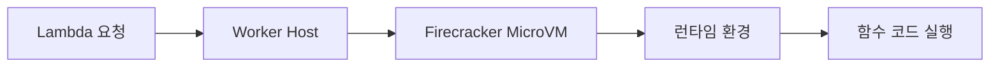
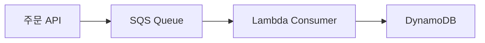

"서버리스"라는 이름은 반은 거짓말이다. 서버가 없는 게 아니라, 서버를 내가 관리하지 않는다는 뜻이다. 하지만 그 차이가 개발 방식을 근본적으로 바꾼다.

---

## 1. 서버리스란 무엇인가

### 택시 vs 자가용 비유

전통적인 서버 운영은 자가용을 소유하는 것과 같다. 주차 공간이 필요하고, 보험을 유지하고, 정기 점검을 해야 한다. 차를 타지 않는 시간에도 비용이 발생한다.

서버리스는 택시(또는 우버)를 타는 것과 같다. 이동이 필요한 순간에만 호출하고, 이동한 거리만큼 요금을 낸다. 차량 유지는 전혀 신경 쓰지 않는다.

AWS Lambda는 이 개념의 극단적 구현이다. 코드가 실행되는 시간(밀리초 단위)만큼만 비용을 낸다. 요청이 없으면 비용이 0에 가깝다.

### FaaS, BaaS, 서버리스의 관계

서버리스는 두 가지 형태로 존재한다.

**FaaS(Function as a Service)**: 코드를 함수 단위로 배포하고 실행. AWS Lambda, Google Cloud Functions, Azure Functions.

**BaaS(Backend as a Service)**: 백엔드 기능 자체를 서비스로 제공. Firebase Auth(인증), DynamoDB(DB), S3(스토리지).

완전한 서버리스 애플리케이션은 FaaS + BaaS 조합이다. Lambda로 비즈니스 로직을 실행하고, DynamoDB로 데이터를 저장하고, Cognito로 인증을 처리하면 서버 관리가 전혀 필요 없다.

### 서버리스가 해결하는 문제

```
전통적 서버 모델의 비효율
├── 피크 트래픽을 위한 용량을 항상 유지
│   → 평소 80%의 서버가 유휴 상태
├── 서버 패치, OS 업데이트, 보안 설정 직접 관리
│   → 개발자 시간의 30~40%가 운영에 소비
└── 트래픽 급증 시 스케일 업에 수 분~수십 분 소요
    → 그 사이에 요청 실패
```

Lambda는 이 세 문제를 구조적으로 제거한다.

---

## 2. Lambda 내부 동작 — Firecracker와 microVM

Lambda의 가장 중요한 특성은 **격리(isolation)**다. 내 함수가 다른 고객의 함수와 같은 물리 서버에서 실행되지만, 서로 간섭하지 않는다. 이것을 가능하게 하는 것이 **Firecracker**다.

### Firecracker의 탄생 배경

AWS는 2018년 Firecracker를 오픈소스로 공개했다. 기존의 선택지는 두 가지였다.

**VM(가상머신)**: 완전한 격리, 높은 보안. 하지만 시작 시간이 수 초~수십 초, 메모리 오버헤드가 크다. Lambda처럼 수백만 개의 함수를 동시에 실행하기에 너무 무겁다.

**컨테이너(Docker)**: 빠른 시작, 낮은 오버헤드. 하지만 커널을 공유하기 때문에 멀티테넌트 환경에서 보안 위협이 존재한다. 커널 취약점을 통해 다른 컨테이너에 접근할 수 있다.

Firecracker는 이 둘의 중간을 택했다. **KVM 기반 경량 VM**으로, VM의 보안 격리와 컨테이너의 속도를 동시에 달성한다.



### MicroVM의 특성

Firecracker microVM의 주요 특성:

- **시작 시간**: 125ms 이하 (일반 VM은 수 초)
- **메모리 오버헤드**: 5MB 이하 (일반 VM은 수백 MB)
- **디바이스 지원 최소화**: 네트워크, 스토리지, 시리얼 포트만 지원. 불필요한 장치를 제거해서 공격 표면을 줄임
- **단일 프로세스**: 한 microVM에 하나의 Lambda 실행 환경

AWS Lambda 내부에서는 수백만 개의 microVM이 동시에 실행된다. 요청이 들어오면 기존에 준비된 microVM을 재사용하거나(Warm), 새로 생성한다(Cold Start).

---

## 3. Cold Start — Lambda의 가장 큰 약점

### Cold Start란

식당에 비유하면 이렇다. 식당이 영업 중일 때는 주문하면 바로 조리를 시작한다(Warm Start). 하지만 아침 첫 손님이 오면 식당 문을 열고, 조리 기구를 준비하고, 재료를 꺼내는 시간이 필요하다(Cold Start).

Lambda에서 Cold Start는 함수가 오랫동안 호출되지 않아 실행 환경이 제거된 뒤 새 요청이 들어왔을 때 발생한다.

```
Cold Start 단계
1. microVM 생성 (Firecracker) — ~10ms
2. 런타임 초기화 (JVM, Node.js 등) — 수십ms ~ 수백ms
3. 함수 패키지 다운로드 및 압축 해제 — 패키지 크기에 비례
4. 초기화 코드 실행 (핸들러 외부 코드) — 코드 양에 비례
5. 핸들러 실행 — 실제 비즈니스 로직
```

1~4단계가 Cold Start 지연이다. 핸들러 실행은 항상 일어나므로 Warm Start는 5단계만 있다.

### 언어별 Cold Start 시간

런타임에 따라 Cold Start 시간이 크게 다르다.

| 런타임 | Cold Start (대략) | 이유 |
|--------|------------------|------|
| Python 3.x | 100~300ms | 인터프리터, 의존성 로딩 |
| Node.js | 100~400ms | V8 초기화 |
| Go | 50~150ms | 컴파일된 단일 바이너리 |
| Java (JVM) | 1~5초 | JVM 시작, 클래스 로딩 |
| Java (GraalVM) | 100~300ms | AOT 컴파일로 JVM 시작 제거 |
| .NET 6+ | 200~500ms | CLR 초기화 |

Java의 Cold Start가 압도적으로 길다. JVM 시작 시간이 포함되기 때문이다. Spring Boot + Lambda는 특히 심각해서 초기화 시간이 5~10초에 달하기도 한다.

### Cold Start 대응 전략

**1) Provisioned Concurrency**

```yaml
# serverless.yml
functions:
  api:
    handler: handler.main
    provisionedConcurrency: 10  # 10개의 환경을 항상 Warm 상태로 유지
```

Provisioned Concurrency는 Lambda 실행 환경을 항상 초기화된 상태로 유지한다. Cold Start가 완전히 사라지지만 비용이 발생한다. 사용 여부와 상관없이 예약된 환경에 대한 비용을 낸다.

**2) 패키지 크기 최소화**

```bash
# 개발 의존성 제외
npm install --production

# 사용하지 않는 모듈 제거 (tree-shaking)
# webpack, esbuild로 번들링

# Lambda Layer로 공통 의존성 분리
```

Lambda 패키지가 작을수록 다운로드와 압축 해제 시간이 짧아진다. 250MB 제한 내에서 가능한 작게 유지한다.

**3) 초기화 코드 최적화**

```python
import json
import boto3

# ❌ 핸들러 내부에서 클라이언트 초기화 — 매 호출마다 실행
def handler(event, context):
    dynamodb = boto3.resource('dynamodb')  # 매번 생성
    table = dynamodb.Table('users')
    # ...

# ✅ 핸들러 외부에서 초기화 — Cold Start 시 한 번만 실행
dynamodb = boto3.resource('dynamodb')  # 재사용
table = dynamodb.Table('users')

def handler(event, context):
    # 이미 초기화된 클라이언트 사용
    response = table.get_item(Key={'userId': event['userId']})
    return response
```

핸들러 외부에 선언된 코드는 Cold Start 시 한 번만 실행되고, 이후 Warm Start에서는 재사용된다. DB 연결, SDK 클라이언트 초기화, 설정 로딩은 핸들러 외부에 두는 것이 기본 패턴이다.

**4) SnapStart (Java 전용)**

```yaml
functions:
  java-api:
    handler: com.example.Handler::handleRequest
    runtime: java21
    snapStart: true  # 초기화 스냅샷 저장
```

SnapStart는 Lambda 함수의 초기화 완료 시점의 메모리 스냅샷을 저장한다. 이후 Cold Start 시 JVM을 처음부터 시작하는 대신 스냅샷을 복원한다. Java Cold Start를 수 초에서 수백ms로 줄인다.

---

## 4. API Gateway + Lambda 패턴

API Gateway는 Lambda의 HTTP 진입점이다. REST API, HTTP API, WebSocket API 세 가지 타입이 있다.

### REST API vs HTTP API

| 구분 | REST API | HTTP API |
|------|---------|---------|
| 비용 | 높음 | 낮음 (70% 저렴) |
| 지연 시간 | 높음 | 낮음 |
| 기능 | 풍부 (캐싱, 사용 계획, API 키 등) | 제한적 |
| JWT 인증 | 커스텀 authorizer | 기본 내장 |

새 프로젝트라면 HTTP API를 기본으로 선택하는 것이 합리적이다. 특별한 기능(캐싱, WAF 통합, API 키 관리)이 필요할 때만 REST API를 사용한다.

### Lambda Proxy Integration

```python
# Lambda 함수 — API Gateway 프록시 통합
def handler(event, context):
    # event에 HTTP 요청 정보가 담김
    method = event['httpMethod']
    path = event['path']
    query_params = event.get('queryStringParameters', {})
    body = json.loads(event.get('body', '{}'))
    headers = event['headers']

    # 비즈니스 로직
    if method == 'GET' and path == '/users':
        users = get_all_users()
        return {
            'statusCode': 200,
            'headers': {
                'Content-Type': 'application/json',
                'Access-Control-Allow-Origin': '*'
            },
            'body': json.dumps(users)
        }

    return {
        'statusCode': 404,
        'body': json.dumps({'error': 'Not Found'})
    }
```

Lambda Proxy Integration은 HTTP 요청 전체를 Lambda event로 전달하고, Lambda가 반환하는 딕셔너리를 HTTP 응답으로 변환한다. 가장 유연한 방식이며 대부분의 경우 이 패턴을 사용한다.

### 인증 — Lambda Authorizer


```python
# authorizer.py — JWT 검증
import jwt

def handler(event, context):
    token = event['authorizationToken'].replace('Bearer ', '')

    try:
        payload = jwt.decode(token, SECRET_KEY, algorithms=['HS256'])
        user_id = payload['sub']

        # Allow 정책 반환
        return {
            'principalId': user_id,
            'policyDocument': {
                'Version': '2012-10-17',
                'Statement': [{
                    'Action': 'execute-api:Invoke',
                    'Effect': 'Allow',
                    'Resource': event['methodArn']
                }]
            },
            'context': {
                'userId': user_id,
                'role': payload.get('role', 'user')
            }
        }
    except jwt.ExpiredSignatureError:
        raise Exception('Unauthorized')  # 401 반환
```

Lambda Authorizer의 결과는 캐시된다. 같은 토큰으로 반복 요청이 오면 Authorizer Lambda를 다시 호출하지 않고 캐시된 정책을 사용한다. TTL을 적절히 설정해서 토큰 만료를 반영해야 한다.

---

## 5. Step Functions — 복잡한 워크플로우 오케스트레이션

Lambda 함수를 체이닝하는 가장 단순한 방법은 함수 안에서 다른 함수를 직접 호출하는 것이다. 하지만 이 방식은 재시도, 에러 처리, 상태 추적이 복잡해진다.

Step Functions는 워크플로우를 상태 머신으로 정의한다.

### 주문 처리 워크플로우 예시

```json
{
  "Comment": "전자상거래 주문 처리",
  "StartAt": "ValidateOrder",
  "States": {
    "ValidateOrder": {
      "Type": "Task",
      "Resource": "arn:aws:lambda:ap-northeast-2:123:function:validate-order",
      "Next": "ProcessPayment",
      "Catch": [{
        "ErrorEquals": ["ValidationError"],
        "Next": "OrderFailed"
      }]
    },
    "ProcessPayment": {
      "Type": "Task",
      "Resource": "arn:aws:lambda:ap-northeast-2:123:function:process-payment",
      "Retry": [{
        "ErrorEquals": ["PaymentGatewayError"],
        "IntervalSeconds": 2,
        "MaxAttempts": 3,
        "BackoffRate": 2
      }],
      "Next": "FulfillOrder",
      "Catch": [{
        "ErrorEquals": ["PaymentDeclinedError"],
        "Next": "OrderFailed"
      }]
    },
    "FulfillOrder": {
      "Type": "Parallel",
      "Branches": [
        {
          "StartAt": "UpdateInventory",
          "States": {
            "UpdateInventory": {
              "Type": "Task",
              "Resource": "arn:aws:lambda:ap-northeast-2:123:function:update-inventory",
              "End": true
            }
          }
        },
        {
          "StartAt": "SendConfirmationEmail",
          "States": {
            "SendConfirmationEmail": {
              "Type": "Task",
              "Resource": "arn:aws:lambda:ap-northeast-2:123:function:send-email",
              "End": true
            }
          }
        }
      ],
      "Next": "OrderComplete"
    },
    "OrderComplete": {
      "Type": "Succeed"
    },
    "OrderFailed": {
      "Type": "Fail",
      "Error": "OrderProcessingFailed"
    }
  }
}
```

Step Functions의 핵심 장점은 각 단계의 실행 상태가 영구적으로 기록된다는 점이다. 어느 단계에서 실패했는지, 재시도를 몇 번 했는지, 각 단계의 입출력이 무엇이었는지 AWS 콘솔에서 시각적으로 확인할 수 있다.

### Express vs Standard 워크플로우

**Standard**: 최대 1년 실행, 상태 이력 완전 보존, 정확히 한 번(Exactly-Once) 실행. 비용이 높다. 장기 실행 프로세스, 결제처럼 중복 실행이 치명적인 경우에 적합.

**Express**: 최대 5분 실행, 초당 수십만 건, 비용이 낮다. 최소 한 번(At-Least-Once) 실행. 실시간 데이터 처리, 멱등성이 보장된 작업에 적합.

---

## 6. DynamoDB + SQS 이벤트 드리븐 패턴

서버리스 아키텍처에서 서비스 간 통신은 동기 호출보다 이벤트 드리븐 방식이 더 자연스럽다.

### SQS → Lambda 패턴



```python
# SQS 이벤트를 처리하는 Lambda
def handler(event, context):
    failed_records = []

    for record in event['Records']:
        try:
            message = json.loads(record['body'])
            order_id = message['orderId']
            process_order(order_id)

        except Exception as e:
            print(f"Failed to process record: {record['messageId']}, error: {e}")
            # 실패한 레코드의 messageId를 반환하면
            # 해당 메시지만 DLQ로 이동
            failed_records.append({'itemIdentifier': record['messageId']})

    return {'batchItemFailures': failed_records}
```

`batchItemFailures`를 반환하면 배치 내에서 실패한 메시지만 재시도한다. 전체 배치를 실패 처리하지 않으므로 성공한 메시지를 중복 처리하지 않는다. **Partial Batch Response**라고 불리는 이 패턴은 SQS + Lambda 통합의 핵심 패턴이다.

### DLQ(Dead Letter Queue) 설정

```hcl
# SQS 큐와 DLQ
resource "aws_sqs_queue" "orders" {
  name                       = "orders-queue"
  visibility_timeout_seconds = 300  # Lambda 타임아웃보다 크게 설정

  redrive_policy = jsonencode({
    deadLetterTargetArn = aws_sqs_queue.orders_dlq.arn
    maxReceiveCount     = 3  # 3번 실패하면 DLQ로 이동
  })
}

resource "aws_sqs_queue" "orders_dlq" {
  name                      = "orders-dlq"
  message_retention_seconds = 1209600  # 14일 보관
}
```

DLQ는 처리에 계속 실패하는 메시지를 격리해서 보관한다. DLQ의 메시지는 나중에 원인을 분석하고 수동으로 재처리할 수 있다.

### DynamoDB Streams → Lambda

DynamoDB 테이블의 모든 변경(INSERT/MODIFY/REMOVE)이 실시간 이벤트로 Lambda에 전달된다.

```python
def handler(event, context):
    for record in event['Records']:
        event_name = record['eventName']  # INSERT, MODIFY, REMOVE

        if event_name == 'INSERT':
            new_item = deserialize(record['dynamodb']['NewImage'])
            # 새 주문 생성 시 처리
            send_order_notification(new_item)

        elif event_name == 'MODIFY':
            old_item = deserialize(record['dynamodb']['OldImage'])
            new_item = deserialize(record['dynamodb']['NewImage'])

            # 주문 상태 변경 감지
            if old_item['status'] != new_item['status']:
                handle_status_change(old_item, new_item)

        elif event_name == 'REMOVE':
            deleted_item = deserialize(record['dynamodb']['OldImage'])
            archive_order(deleted_item)
```

DynamoDB Streams는 CDC(Change Data Capture) 패턴의 서버리스 구현이다. 이벤트 소싱, 캐시 무효화, 검색 인덱스 동기화 등 다양한 용도로 활용된다.

---

## 7. 비용 분석 — EC2 vs Lambda 손익분기점

서버리스가 항상 저렴한 것은 아니다. 트래픽 패턴에 따라 비용 구조가 전혀 다르다.

### Lambda 비용 구조

```
Lambda 요금 (2024년 기준, ap-northeast-2)
- 요청 수: $0.20 / 백만 건
- 컴퓨트: $0.0000166667 / GB-초

예시: 메모리 512MB, 평균 실행 시간 200ms, 월 1,000만 건
- 요청 비용: 10 × $0.20 = $2.00
- 컴퓨트: 10,000,000 × 0.2초 × 0.5GB × $0.0000166667 = $16.67
- 월 총비용: ~$18.67

프리 티어: 월 1,000,000 건 요청, 400,000 GB-초 무료
```

### EC2 vs Lambda 손익분기점

**시나리오**: API 서버, 1초 처리 시간, 512MB 메모리

```
Lambda 월 비용 = 요청 수 × (요청 단가 + 컴퓨트 단가)
EC2 월 비용  = t3.small 인스턴스 × 730시간 ≈ $16.79

Lambda가 EC2보다 비싸지는 시점:
월 요청 수 = 약 830,000건/월 = 약 320건/시간

→ 초당 0.1건 미만이면 Lambda가 저렴
→ 초당 0.1건 이상이면 EC2가 더 경제적
```

실제로는 단순히 비용만 비교하면 안 된다. Lambda는 관리 비용이 없고, 급격한 트래픽 증가에 자동으로 대응하며, 운영 인력이 절약된다. 이 간접 비용까지 포함하면 손익분기점은 훨씬 높아진다.

### 실전 비용 최적화

```python
# 메모리 설정이 비용과 성능 모두에 영향
# Lambda Power Tuning 도구로 최적 메모리 찾기
# https://github.com/alexcasalboni/aws-lambda-power-tuning

# 결과 예시:
# 128MB: 실행 2000ms, 비용 $0.000001667
# 512MB: 실행  500ms, 비용 $0.000001250  ← 더 싸고 더 빠름
# 1024MB: 실행 260ms, 비용 $0.000001300

# 메모리를 늘리면 CPU 비율도 증가 → 실행 시간 감소
# 비용 = 메모리 × 시간이므로 빠른 게 더 저렴할 수 있음
```

---

## 8. 서버리스 안티패턴

서버리스를 도입하면서 흔히 저지르는 실수들이 있다.

### 안티패턴 1: Lambda Monolith

```python
# ❌ 하나의 Lambda에 모든 비즈니스 로직
def handler(event, context):
    path = event['path']
    if path.startswith('/users'):
        return handle_users(event)
    elif path.startswith('/orders'):
        return handle_orders(event)
    elif path.startswith('/products'):
        return handle_products(event)
    elif path.startswith('/payments'):
        return handle_payments(event)
    # ... 수백 줄의 라우팅 로직
```

하나의 Lambda에 모든 기능을 넣으면 배포 단위, 스케일링 단위, 장애 단위가 모두 커진다. 패키지가 거대해져서 Cold Start가 길어지고, 메모리 설정을 기능 중 가장 메모리를 많이 쓰는 것에 맞춰야 한다.

**해결**: 도메인별 또는 기능별로 Lambda를 분리한다.

### 안티패턴 2: Lambda에서 VPC 남용

Lambda를 VPC에 연결하면 Cold Start가 수 초 늘어난다. VPC에 Lambda를 넣으면 ENI(Elastic Network Interface)를 생성해야 하는데 이 과정이 오래 걸린다(개선됐지만 여전히 오버헤드 존재).

**해결**: 반드시 VPC 내 리소스(RDS, ElastiCache)에 접근해야 할 때만 VPC에 연결한다. DynamoDB, S3, SQS 같은 AWS 서비스는 VPC Gateway Endpoint를 사용하면 VPC 없이도 프라이빗하게 접근할 수 있다.

### 안티패턴 3: 동기 Lambda 체이닝

```python
# ❌ Lambda가 Lambda를 동기 호출
def handler(event, context):
    lambda_client = boto3.client('lambda')

    # 동기 호출 — 결과를 기다림
    response = lambda_client.invoke(
        FunctionName='processing-function',
        InvocationType='RequestResponse',  # 동기
        Payload=json.dumps({'data': event['data']})
    )
    # 처리 시간만큼 비용 지불 + 타임아웃 리스크
```

Lambda가 Lambda를 동기로 호출하면 두 Lambda가 동시에 실행되는 시간의 비용을 모두 낸다. 호출된 Lambda가 느리면 호출한 Lambda도 타임아웃이 날 수 있다.

**해결**: SQS나 SNS를 통한 비동기 이벤트 드리븐 방식으로 전환한다.

### 안티패턴 4: Lambda에서 장기 폴링

```python
# ❌ Lambda에서 작업 완료를 기다리는 루프
def handler(event, context):
    job_id = start_long_running_job()

    while True:  # 최대 15분 실행 가능
        status = check_job_status(job_id)
        if status == 'COMPLETE':
            return get_result(job_id)
        time.sleep(5)  # 비용이 계속 발생
```

Lambda의 최대 실행 시간은 15분이다. 그 이상 걸리는 작업은 Lambda로 처리할 수 없다. 또한 대기 시간 동안에도 비용이 발생한다.

**해결**: Step Functions의 `.waitForTaskToken` 패턴을 사용한다. Lambda가 작업을 시작하고 콜백 토큰을 남긴 뒤 즉시 종료한다. 작업이 완료되면 그 토큰으로 Step Functions을 깨운다.

---

## 9. 극한 시나리오

### 시나리오 1: 동시성 폭발 — Thundering Herd

**상황**: 마케팅 이메일 100만 건을 일제히 발송했다. 수신자들이 동시에 링크를 클릭해서 Lambda에 10만 건의 동시 요청이 몰렸다.

**문제**: Lambda의 계정당 기본 동시성 한도는 1,000이다. 나머지 99,000건의 요청은 스로틀링(429 Too Many Requests)을 받는다.

**대응**:
```hcl
# 예약 동시성 — 특정 함수에 최소 실행 환경 보장
resource "aws_lambda_function_event_invoke_config" "api" {
  function_name = aws_lambda_function.api.function_name

  maximum_retry_attempts = 0
}

resource "aws_lambda_provisioned_concurrency_config" "api" {
  function_name                  = aws_lambda_function.api.function_name
  qualifier                      = aws_lambda_alias.live.name
  provisioned_concurrent_executions = 100
}
```

AWS에 한도 증가를 요청(Service Quota)하거나, SQS로 요청을 버퍼링해서 Lambda가 처리 가능한 속도로 소비하도록 설계한다.

### 시나리오 2: Cold Start Storm — 전체 재배포 후 첫 트래픽

**상황**: 새 버전을 배포한 직후 트래픽이 들어왔다. 기존 Warm 컨테이너가 모두 교체됐기 때문에 첫 100개의 동시 요청이 모두 Cold Start를 겪었다. API 응답 시간이 5초로 치솟았다.

**대응**:

```python
# 배포 후 Warm-up 스크립트
import boto3
import concurrent.futures

def warmup_lambda(function_name, count=50):
    client = boto3.client('lambda')

    def invoke():
        client.invoke(
            FunctionName=function_name,
            InvocationType='Event',  # 비동기 호출
            Payload=json.dumps({'source': 'warmup'})
        )

    with concurrent.futures.ThreadPoolExecutor(max_workers=count) as executor:
        futures = [executor.submit(invoke) for _ in range(count)]
        concurrent.futures.wait(futures)

# 배포 파이프라인 마지막 단계에서 실행
warmup_lambda('prod-api', count=50)
```

또는 Lambda 함수 자체에서 워밍업 이벤트를 처리한다.

```python
def handler(event, context):
    # 워밍업 이벤트 처리
    if event.get('source') == 'warmup':
        print('Warming up')
        return {'statusCode': 200}

    # 실제 요청 처리
    return process_request(event)
```

### 시나리오 3: Lambda 타임아웃 연쇄 실패

**상황**: DynamoDB가 일시적으로 느려졌다. Lambda가 15초 타임아웃으로 설정됐는데, SQS 메시지를 처리하는 Lambda의 visibility timeout이 20초로 설정됐다.

**문제 연쇄**: Lambda가 14초에 타임아웃 → SQS 메시지가 visibility timeout 이후 다시 큐에 반환 → 다음 Lambda 인스턴스가 또 14초에 타임아웃 → maxReceiveCount를 초과하면 DLQ로 이동.

하지만 DynamoDB가 느린 동안 계속 Lambda가 생성되고 타임아웃되면서 동시성을 소비한다. 다른 함수들도 동시성 부족으로 스로틀링을 받는다.

**해결**:
1. SQS visibility timeout = Lambda timeout × 6 배 이상으로 설정
2. Lambda 함수 내부에 timeout보다 짧은 DynamoDB 요청 타임아웃 설정
3. Circuit Breaker 패턴 — DynamoDB 연속 실패 시 SQS Event Source Mapping을 일시 비활성화

```python
import boto3
from botocore.config import Config

# DynamoDB 요청 타임아웃 설정
dynamodb = boto3.resource('dynamodb', config=Config(
    connect_timeout=2,
    read_timeout=5,
    retries={'max_attempts': 2}
))
```

### 시나리오 4: Step Functions 실행 폭발

**상황**: Standard 워크플로우 Step Functions를 사용해서 실시간 이벤트를 처리하도록 설계했다. 초당 1,000건의 이벤트가 들어오자 Step Functions Standard의 계정 한도(초당 2,000 StartExecution)에 근접하고 비용이 폭발했다.

Standard 워크플로우는 상태 전이당 $0.000025을 과금한다. 10단계 워크플로우, 초당 1,000건이면 하루 $2,160이다.

**해결**: Standard → Express로 전환한다. Express는 실행당 과금이 아니라 실행 시간과 메모리 기준으로 과금해서 고빈도 단기 워크플로우에 훨씬 저렴하다.

---

## 면접 포인트

### Lambda Cold Start의 발생 원인과 줄이는 방법

Cold Start는 Lambda 실행 환경이 새로 초기화될 때 발생한다. 함수가 오랫동안 호출되지 않아 환경이 회수되거나, 동시성이 급격히 증가해서 새 환경을 생성할 때 일어난다.

발생 단계는 microVM 생성, 런타임 초기화, 코드 패키지 다운로드, 초기화 코드 실행으로 구성된다. 이 중 개발자가 제어할 수 있는 부분은 패키지 크기와 초기화 코드다.

줄이는 방법은 네 가지다. 첫째, 패키지 최소화 — 번들러로 트리셰이킹, 개발 의존성 제외. 둘째, 초기화 코드 최적화 — SDK 클라이언트를 핸들러 외부에 선언해서 재사용. 셋째, Provisioned Concurrency — 비용을 내고 항상 Warm 상태 유지. 넷째, 런타임 선택 — Go나 Python이 Java보다 Cold Start가 짧다. Java라면 SnapStart 활성화를 검토한다.

### API Gateway REST API와 HTTP API의 차이

HTTP API는 REST API보다 약 70% 저렴하고 지연 시간이 짧다. 대신 REST API가 제공하는 캐싱, API 키 관리, 사용 계획, WAF 통합 같은 고급 기능이 없다.

JWT 인증은 HTTP API에 기본 내장돼 있지만, REST API에서는 Lambda Authorizer를 직접 구현해야 한다.

새 프로젝트에서 선택 기준: 특별한 이유가 없다면 HTTP API를 사용한다. AWS WAF를 통합하거나, API 키 기반 사용량 제한이 필요하거나, 응답 캐싱이 필요하면 REST API를 선택한다.

### 서버리스 아키텍처에서 상태 관리

Lambda는 기본적으로 무상태(Stateless)다. 함수 실행이 끝나면 메모리의 내용이 사라진다. 단, 핸들러 외부에 선언된 전역 변수는 Warm Start에서 재사용될 수 있어서 이를 통한 연결 풀링이나 캐싱은 가능하지만 영구적이지 않다.

상태를 유지해야 하는 경우: DynamoDB(영구 저장), ElastiCache(세션, 임시 캐시), S3(대용량 객체)를 외부 상태 저장소로 사용한다. Step Functions은 워크플로우 실행 간 상태를 관리한다.

### 이벤트 드리븐 아키텍처에서 메시지 중복 처리

SQS + Lambda는 기본적으로 At-Least-Once 전달을 보장한다. 같은 메시지가 두 번 처리될 수 있다. 이를 해결하는 방법은 멱등성(Idempotency) 구현이다.

처리 방법은 두 가지다. 첫째, 멱등 키 — 메시지 ID를 DynamoDB에 저장하고, 이미 처리된 메시지면 건너뛴다. DynamoDB의 조건부 쓰기를 사용하면 원자적으로 처리할 수 있다. 둘째, SQS FIFO 큐 — 동일한 MessageGroupId와 MessageDeduplicationId를 사용하면 5분 내 중복 메시지를 자동으로 제거한다. 단, FIFO 큐는 초당 처리량이 낮다.

### Lambda 비용이 EC2보다 비싸지는 시점

Lambda 비용은 요청 수와 실행 시간(메모리×시간)에 비례한다. EC2는 사용 여부와 무관하게 인스턴스 시간 기준으로 과금한다.

단순 계산으로 t3.small(월 약 $17) 기준, 1초 처리 시간의 512MB Lambda는 월 약 83만 건 처리 시점에서 EC2와 비용이 같아진다. 이보다 많은 트래픽이면 EC2가 저렴하다.

하지만 트래픽이 고르지 않거나 예측이 어려운 경우, Lambda는 유휴 시간 비용이 0에 가까워서 실질적인 비용 효율이 높다. 또한 서버 관리 인력 비용이 절약된다. 일반적으로 초당 수 건 미만의 산발적 트래픽에서 Lambda가 유리하고, 지속적인 고빈도 트래픽에서는 EC2나 컨테이너가 유리하다.
