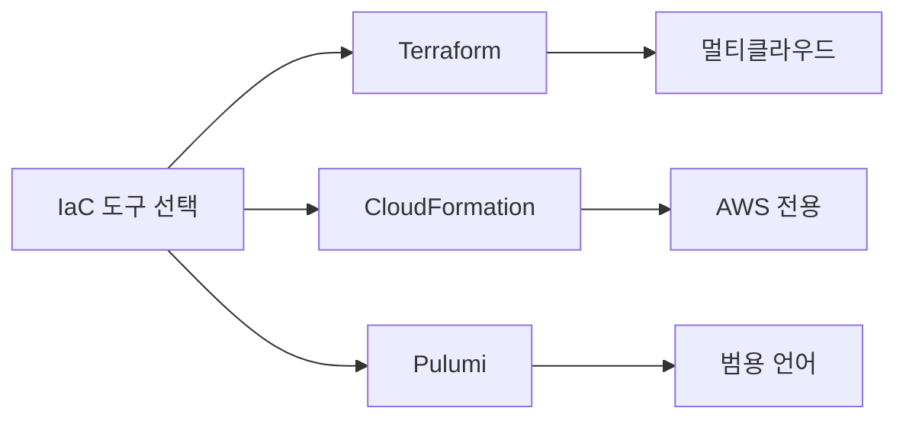
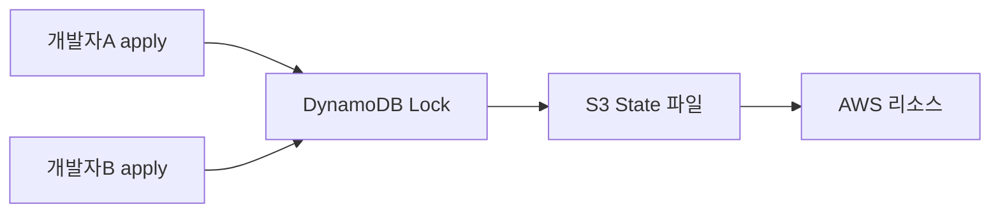
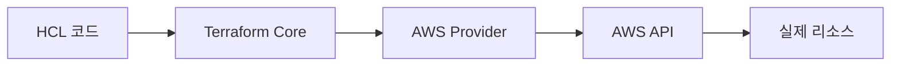

인프라를 손으로 클릭해서 만들던 시대는 끝났다. 클릭으로 만든 서버는 누가, 언제, 어떤 설정으로 만들었는지 아무도 모른다. 이것이 IaC(Infrastructure as Code)가 등장한 이유다.

---

## 1. IaC가 필요한 이유

### 클릭 인프라의 저주

AWS 콘솔에서 EC2를 직접 만들어본 경험이 있다면 이 장면을 상상할 수 있다. 신입 개발자가 운영 환경에서 보안 그룹 설정을 "잠깐 테스트"하려고 포트를 열었다. 그리고 닫는 것을 잊었다. 6개월 뒤 보안 감사에서 발각됐다. 누가 열었는지, 왜 열었는지 아무 기록이 없다.

이것이 **스노우플레이크 서버(Snowflake Server)** 문제다. 눈송이처럼 세상에 하나뿐인 서버 — 아무도 재현하지 못하고, 건드리면 부서질 것 같아 아무도 손대지 않는다.

IaC는 이 문제를 코드로 해결한다.

```
인프라 상태 = Git에 저장된 코드
변경 이력   = Git commit history
코드 리뷰   = 인프라 변경 리뷰
롤백        = git revert
```

코드로 관리하면 인프라도 소프트웨어처럼 버전 관리, 리뷰, 자동화가 가능해진다.

### IaC의 네 가지 원칙

**1) 멱등성(Idempotency)**: 같은 코드를 열 번 실행해도 결과가 같다. 이미 존재하는 S3 버킷을 다시 생성하는 코드를 실행하면 오류 없이 "이미 있음"을 확인하고 넘어간다.

**2) 선언적 정의**: "어떻게 만들어라"가 아니라 "이런 상태여야 한다"고 선언한다. Terraform은 현재 상태와 원하는 상태의 차이를 계산해서 필요한 작업만 수행한다.

**3) 버전 관리**: 모든 인프라 변경이 코드 커밋으로 남는다. 언제 누가 왜 변경했는지 추적 가능하다.

**4) 자동화**: 사람이 콘솔을 클릭하지 않아도 CI/CD 파이프라인이 인프라를 배포한다.

---

## 2. Terraform vs CloudFormation vs Pulumi

세 도구는 같은 목표를 다른 방식으로 달성한다.



### Terraform

HashiCorp가 만든 오픈소스 도구. HCL(HashiCorp Configuration Language)이라는 전용 언어를 사용한다. AWS, GCP, Azure, Kubernetes 등 거의 모든 클라우드와 서비스를 지원한다.

장점:
- 멀티클라우드 단일 워크플로우
- 커뮤니티가 방대하고 Provider 생태계가 풍부
- Plan으로 변경사항 미리 확인 가능

단점:
- HCL을 새로 배워야 함
- 2023년 라이선스 BSL로 변경(엔터프라이즈 사용 주의)
- State 파일 관리가 별도로 필요

### CloudFormation

AWS 네이티브 IaC. JSON 또는 YAML로 작성하며 AWS 서비스와 가장 빠르게 통합된다.

장점:
- AWS 서비스 출시와 동시에 지원
- IAM 권한 관리가 간단
- 추가 비용 없음

단점:
- AWS 전용 — 멀티클라우드 불가
- YAML/JSON이 복잡해지면 가독성 저하
- Plan 기능 없음(Change Set이 유사하지만 제한적)

### Pulumi

TypeScript, Python, Go 같은 범용 언어로 인프라를 정의한다.

장점:
- 익숙한 언어로 for loop, if 문 사용 가능
- 테스트 코드 작성이 자연스러움
- 복잡한 로직 표현에 유리

단점:
- 프로그래밍 언어 의존성이 생김
- Terraform보다 커뮤니티가 작음

실무 선택 기준: **AWS 단독**이면 CloudFormation 또는 CDK, **멀티클라우드**이면 Terraform, **복잡한 로직**이 필요하면 Pulumi.

---

## 3. HCL 문법 핵심

HCL은 JSON보다 읽기 쉽고 프로그래밍 언어보다 단순하다. 레고 블록처럼 리소스를 정의하고 연결한다.

### 기본 구조

```hcl
# provider.tf — AWS를 사용하겠다고 선언
terraform {
  required_providers {
    aws = {
      source  = "hashicorp/aws"
      version = "~> 5.0"
    }
  }
  required_version = ">= 1.6.0"
}

provider "aws" {
  region = var.aws_region
}
```

```hcl
# variables.tf — 입력 변수 정의
variable "aws_region" {
  description = "배포할 AWS 리전"
  type        = string
  default     = "ap-northeast-2"
}

variable "environment" {
  description = "환경 구분 (dev/staging/prod)"
  type        = string
  validation {
    condition     = contains(["dev", "staging", "prod"], var.environment)
    error_message = "environment는 dev, staging, prod 중 하나여야 합니다."
  }
}
```

```hcl
# main.tf — 실제 리소스 정의
resource "aws_vpc" "main" {
  cidr_block           = "10.0.0.0/16"
  enable_dns_hostnames = true

  tags = {
    Name        = "${var.environment}-vpc"
    Environment = var.environment
    ManagedBy   = "terraform"
  }
}

resource "aws_subnet" "public" {
  count             = 2
  vpc_id            = aws_vpc.main.id
  cidr_block        = "10.0.${count.index}.0/24"
  availability_zone = data.aws_availability_zones.available.names[count.index]

  tags = {
    Name = "${var.environment}-public-subnet-${count.index + 1}"
  }
}
```

```hcl
# outputs.tf — 출력값 정의
output "vpc_id" {
  description = "생성된 VPC의 ID"
  value       = aws_vpc.main.id
}

output "public_subnet_ids" {
  description = "퍼블릭 서브넷 ID 목록"
  value       = aws_subnet.public[*].id
}
```

### 표현식과 함수

HCL에는 내장 함수가 풍부하다.

```hcl
locals {
  # 문자열 합치기
  bucket_name = "${var.environment}-${var.project_name}-assets"

  # 조건식
  instance_type = var.environment == "prod" ? "t3.medium" : "t3.micro"

  # 리스트 변환
  azs = slice(data.aws_availability_zones.available.names, 0, 3)

  # map 생성
  common_tags = {
    Environment = var.environment
    Project     = var.project_name
    CreatedBy   = "terraform"
    CreatedAt   = timestamp()
  }
}
```

```hcl
# for_each로 여러 리소스 생성
variable "s3_buckets" {
  type = map(object({
    versioning = bool
    lifecycle  = number
  }))
  default = {
    "logs"    = { versioning = false, lifecycle = 30 }
    "backups" = { versioning = true,  lifecycle = 90 }
    "assets"  = { versioning = true,  lifecycle = 0  }
  }
}

resource "aws_s3_bucket" "buckets" {
  for_each = var.s3_buckets
  bucket   = "${var.environment}-${each.key}-${data.aws_caller_identity.current.account_id}"

  tags = merge(local.common_tags, {
    BucketType = each.key
  })
}

resource "aws_s3_bucket_versioning" "buckets" {
  for_each = { for k, v in var.s3_buckets : k => v if v.versioning }
  bucket   = aws_s3_bucket.buckets[each.key].id

  versioning_configuration {
    status = "Enabled"
  }
}
```

---

## 4. State 관리 — Terraform의 심장

State는 Terraform이 관리하는 인프라의 현재 상태를 기록한 파일이다. 레스토랑의 주문 대장과 같다. 무엇을 주문했고(원하는 상태), 무엇이 나왔는지(실제 상태)를 비교해서 무엇을 더 해야 하는지 결정한다.

### State 파일의 역할

```json
// terraform.tfstate (일부 발췌)
{
  "version": 4,
  "terraform_version": "1.6.0",
  "resources": [
    {
      "type": "aws_vpc",
      "name": "main",
      "instances": [
        {
          "attributes": {
            "id": "vpc-0a1b2c3d4e5f",
            "cidr_block": "10.0.0.0/16",
            "arn": "arn:aws:ec2:ap-northeast-2:123456789:vpc/vpc-0a1b2c3d4e5f"
          }
        }
      ]
    }
  ]
}
```

State 파일 없이는 Terraform이 "이 VPC가 이미 내가 만든 것인가, 다른 사람이 만든 것인가"를 구별할 수 없다.

### Remote Backend — State를 팀과 공유

로컬에만 State를 저장하면 팀 협업이 불가능하다. Remote Backend로 State를 중앙에 저장한다.

```hcl
# backend.tf
terraform {
  backend "s3" {
    bucket         = "my-company-terraform-state"
    key            = "prod/network/terraform.tfstate"
    region         = "ap-northeast-2"
    encrypt        = true

    # DynamoDB로 State 잠금
    dynamodb_table = "terraform-state-lock"
  }
}
```

S3 + DynamoDB 조합이 AWS에서 가장 일반적이다. S3는 State를 저장하고, DynamoDB는 동시에 두 명이 `terraform apply`를 실행할 때 충돌을 막는 잠금(locking)을 담당한다.



### State Locking의 원리

개발자 A가 `terraform apply`를 시작하면 DynamoDB에 잠금 레코드를 생성한다. 개발자 B가 동시에 `apply`를 시도하면 "State is locked"라는 오류가 나온다. A의 작업이 완료되면 잠금이 해제되고 B가 진행할 수 있다.

잠금 레코드가 남아있는 상황(apply 도중 강제 종료 등)에서는 수동으로 해제해야 한다.

```bash
terraform force-unlock LOCK_ID
```

이 명령은 신중하게 사용해야 한다. 실제로 다른 프로세스가 실행 중인데 잠금을 풀면 State 손상이 일어날 수 있다.

### State 조작 명령어

```bash
# 현재 State에 있는 리소스 목록
terraform state list

# 특정 리소스의 State 상세 보기
terraform state show aws_vpc.main

# 리소스를 State에서 제거 (실제 리소스는 유지)
terraform state rm aws_s3_bucket.old_bucket

# 기존 리소스를 State로 가져오기
terraform import aws_s3_bucket.existing my-existing-bucket

# State를 다른 경로로 이동
terraform state mv aws_instance.old aws_instance.new
```

`terraform import`는 콘솔에서 수동으로 만든 리소스를 Terraform 관리 하에 편입시킬 때 사용한다. 단, import는 State만 업데이트하고 코드는 직접 작성해야 한다.

---

## 5. Module 설계 — 재사용 가능한 인프라 블록

Module은 인프라 코드의 함수다. 같은 패턴을 반복하지 않고 한 번 정의해서 여러 곳에서 호출한다.

### Module 구조

```
modules/
  vpc/
    main.tf       # 리소스 정의
    variables.tf  # 입력 변수
    outputs.tf    # 출력값
    README.md     # 사용 방법
  eks-cluster/
    main.tf
    variables.tf
    outputs.tf
  rds/
    main.tf
    variables.tf
    outputs.tf

environments/
  dev/
    main.tf       # 모듈 호출
    terraform.tfvars
  prod/
    main.tf
    terraform.tfvars
```

### Module 정의

```hcl
# modules/vpc/main.tf
resource "aws_vpc" "this" {
  cidr_block           = var.cidr_block
  enable_dns_hostnames = var.enable_dns_hostnames

  tags = merge(var.tags, {
    Name = var.name
  })
}

resource "aws_internet_gateway" "this" {
  count  = var.create_igw ? 1 : 0
  vpc_id = aws_vpc.this.id

  tags = merge(var.tags, {
    Name = "${var.name}-igw"
  })
}

resource "aws_subnet" "public" {
  count = length(var.public_subnets)

  vpc_id                  = aws_vpc.this.id
  cidr_block              = var.public_subnets[count.index]
  availability_zone       = var.azs[count.index]
  map_public_ip_on_launch = true

  tags = merge(var.tags, {
    Name = "${var.name}-public-${count.index + 1}"
    Tier = "public"
  })
}
```

### Module 호출

```hcl
# environments/prod/main.tf
module "vpc" {
  source = "../../modules/vpc"

  name       = "prod-vpc"
  cidr_block = "10.0.0.0/16"
  azs        = ["ap-northeast-2a", "ap-northeast-2b", "ap-northeast-2c"]

  public_subnets  = ["10.0.1.0/24", "10.0.2.0/24", "10.0.3.0/24"]
  private_subnets = ["10.0.11.0/24", "10.0.12.0/24", "10.0.13.0/24"]

  create_igw = true

  tags = {
    Environment = "prod"
    Team        = "platform"
  }
}

# 모듈 출력값 참조
module "eks" {
  source = "../../modules/eks-cluster"

  cluster_name = "prod-cluster"
  vpc_id       = module.vpc.vpc_id           # vpc 모듈 출력값 사용
  subnet_ids   = module.vpc.private_subnet_ids
}
```

### Terraform Registry Module

HashiCorp가 운영하는 공개 레지스트리에는 검증된 모듈이 있다.

```hcl
# 공식 AWS VPC 모듈 사용
module "vpc" {
  source  = "terraform-aws-modules/vpc/aws"
  version = "~> 5.0"

  name = "my-vpc"
  cidr = "10.0.0.0/16"
  azs  = ["ap-northeast-2a", "ap-northeast-2b"]

  private_subnets = ["10.0.1.0/24", "10.0.2.0/24"]
  public_subnets  = ["10.0.101.0/24", "10.0.102.0/24"]

  enable_nat_gateway = true
}
```

버전을 `~> 5.0`으로 고정하면 5.x 마이너 버전 업데이트는 자동으로 허용하되 6.0 메이저 버전 업그레이드는 명시적으로 허용해야 한다. 버전 고정은 예기치 않은 모듈 변경으로 인한 장애를 막는 기본 수칙이다.

---

## 6. Provider 구조

Provider는 Terraform과 클라우드 API 사이의 번역기다. AWS Provider는 Terraform HCL 코드를 AWS REST API 호출로 변환한다.



### 멀티 Provider 설정

한 프로젝트에서 여러 리전이나 계정을 다룰 때 alias를 사용한다.

```hcl
# 기본 provider — 서울 리전
provider "aws" {
  region = "ap-northeast-2"
}

# 별칭 provider — 미국 동부 리전
provider "aws" {
  alias  = "us_east"
  region = "us-east-1"
}

# 글로벌 서비스(CloudFront ACM 등)는 us-east-1 필수
resource "aws_acm_certificate" "global" {
  provider    = aws.us_east
  domain_name = "example.com"

  lifecycle {
    create_before_destroy = true
  }
}
```

### Provider 버전 잠금

```bash
# .terraform.lock.hcl — 자동 생성, Git에 커밋
provider "registry.terraform.io/hashicorp/aws" {
  version     = "5.31.0"
  constraints = "~> 5.0"
  hashes = [
    "h1:abc123...",
    "zh:def456...",
  ]
}
```

`.terraform.lock.hcl`은 패키지 관리자의 lock 파일과 같다. 팀원 모두가 정확히 같은 Provider 버전을 사용하도록 보장한다. 반드시 Git에 커밋해야 한다.

---

## 7. Plan/Apply 워크플로우

Terraform의 워크플로우는 세 단계다: **Write → Plan → Apply**.

### terraform init

```bash
terraform init
```

Provider 플러그인을 다운로드하고 Backend를 초기화한다. 처음 실행하거나 Provider 버전을 변경할 때 필요하다.

### terraform plan

```bash
terraform plan -out=tfplan
```

현재 State와 코드를 비교해서 어떤 변경이 일어날지 미리 보여준다. 실제로 아무것도 변경하지 않는다.

```
Plan: 3 to add, 1 to change, 0 to destroy.

  # aws_vpc.main will be created
  + resource "aws_vpc" "main" {
      + cidr_block = "10.0.0.0/16"
      + id         = (known after apply)
    }

  # aws_security_group.web will be updated in-place
  ~ resource "aws_security_group" "web" {
      ~ description = "Old description" -> "New description"
    }
```

`+`는 생성, `~`는 수정, `-`는 삭제를 의미한다. **`-`가 있으면 반드시 의도한 삭제인지 확인**해야 한다.

### terraform apply

```bash
# plan 파일을 사용해 apply (권장)
terraform apply tfplan

# plan 없이 직접 apply
terraform apply
```

Plan을 파일로 저장하고 그 파일을 apply하면 plan 시점과 apply 시점 사이에 상태가 바뀌는 상황을 방지할 수 있다. CI/CD에서는 이 방식이 표준이다.

### terraform destroy

```bash
terraform destroy
```

State에 있는 모든 리소스를 삭제한다. 운영 환경에서는 절대 실수로 실행하면 안 된다.

```hcl
# 삭제 방지 설정
resource "aws_rds_cluster" "production" {
  # ...

  lifecycle {
    prevent_destroy = true
  }
}
```

`prevent_destroy = true`를 설정하면 `terraform destroy`나 해당 리소스를 삭제하는 plan이 오류를 내고 멈춘다.

---

## 8. CI/CD 통합

Terraform을 수동으로 실행하는 것은 "버전 관리되는 클릭"에 불과하다. CI/CD와 통합해야 진정한 자동화가 된다.

### GitHub Actions 파이프라인

```yaml
# .github/workflows/terraform.yml
name: Terraform CI/CD

on:
  pull_request:
    branches: [main]
    paths: ['terraform/**']
  push:
    branches: [main]
    paths: ['terraform/**']

env:
  TF_VERSION: '1.6.0'
  AWS_REGION: 'ap-northeast-2'

jobs:
  plan:
    name: Terraform Plan
    runs-on: ubuntu-latest
    if: github.event_name == 'pull_request'

    steps:
      - uses: actions/checkout@v4

      - name: Setup Terraform
        uses: hashicorp/setup-terraform@v3
        with:
          terraform_version: ${{ env.TF_VERSION }}

      - name: Configure AWS Credentials
        uses: aws-actions/configure-aws-credentials@v4
        with:
          role-to-assume: arn:aws:iam::123456789:role/GithubActionsRole
          aws-region: ${{ env.AWS_REGION }}

      - name: Terraform Init
        working-directory: terraform/prod
        run: terraform init

      - name: Terraform Format Check
        run: terraform fmt -check -recursive

      - name: Terraform Validate
        working-directory: terraform/prod
        run: terraform validate

      - name: Terraform Plan
        working-directory: terraform/prod
        run: terraform plan -out=tfplan -input=false

      - name: Upload Plan
        uses: actions/upload-artifact@v4
        with:
          name: tfplan
          path: terraform/prod/tfplan

      - name: Comment Plan on PR
        uses: actions/github-script@v7
        with:
          script: |
            const output = `#### Terraform Plan Result
            \`\`\`
            ${{ steps.plan.outputs.stdout }}
            \`\`\`
            `;
            github.rest.issues.createComment({
              issue_number: context.issue.number,
              owner: context.repo.owner,
              repo: context.repo.repo,
              body: output
            });

  apply:
    name: Terraform Apply
    runs-on: ubuntu-latest
    if: github.event_name == 'push' && github.ref == 'refs/heads/main'
    environment: production  # 수동 승인 필요

    steps:
      - uses: actions/checkout@v4

      - name: Setup Terraform
        uses: hashicorp/setup-terraform@v3
        with:
          terraform_version: ${{ env.TF_VERSION }}

      - name: Configure AWS Credentials
        uses: aws-actions/configure-aws-credentials@v4
        with:
          role-to-assume: arn:aws:iam::123456789:role/GithubActionsRole
          aws-region: ${{ env.AWS_REGION }}

      - name: Download Plan
        uses: actions/download-artifact@v4
        with:
          name: tfplan
          path: terraform/prod

      - name: Terraform Init
        working-directory: terraform/prod
        run: terraform init

      - name: Terraform Apply
        working-directory: terraform/prod
        run: terraform apply -input=false tfplan
```

PR이 생성되면 Plan 결과를 PR 코멘트로 자동 등록한다. 팀원이 "이 PR을 머지하면 어떤 인프라 변경이 일어나는지" 코드 리뷰 단계에서 바로 확인할 수 있다.

### Atlantis — Terraform 전용 협업 도구

GitHub Actions보다 Terraform에 특화된 도구다.

```yaml
# atlantis.yaml
version: 3
projects:
  - name: prod-network
    dir: terraform/prod/network
    workspace: default
    autoplan:
      when_modified: ["*.tf", "*.tfvars"]
      enabled: true
    apply_requirements: [approved, mergeable]
```

Atlantis는 PR에 `atlantis plan`, `atlantis apply` 코멘트를 달면 서버에서 실행하고 결과를 반환한다. `apply_requirements: [approved]`를 설정하면 PR 승인 없이는 apply가 불가능하다.

---

## 9. 극한 시나리오

### 시나리오 1: State Drift — 코드와 현실의 불일치

**상황**: 누군가 콘솔에서 보안 그룹 규칙을 직접 수정했다. Terraform 코드에는 반영되지 않았다.

**결과**: 다음 번 `terraform apply`를 실행하면 Terraform이 "코드에 없는 규칙"을 삭제한다. 이때 그 규칙이 운영에 필요한 것이었다면 장애가 발생한다.

**탐지**:
```bash
# 실제 상태와 State 파일의 차이를 감지
terraform plan -refresh-only

# 콘솔 변경 사항을 State에 반영 (코드 수정 없이)
terraform apply -refresh-only
```

**방어**: AWS Config + Drift Detection으로 콘솔 직접 변경을 모니터링하고 알람을 발송한다. 또는 IAM 정책으로 콘솔 직접 변경 자체를 차단한다.

### 시나리오 2: 순환 의존성(Circular Dependency)

**상황**: 보안 그룹 A가 보안 그룹 B를 참조하고, B가 다시 A를 참조한다.

```hcl
# 오류 발생 — 순환 참조
resource "aws_security_group" "app" {
  ingress {
    from_port       = 8080
    to_port         = 8080
    security_groups = [aws_security_group.lb.id]  # lb를 참조
  }
}

resource "aws_security_group" "lb" {
  egress {
    from_port       = 8080
    to_port         = 8080
    security_groups = [aws_security_group.app.id]  # app을 참조 → 순환!
  }
}
```

**해결**: `aws_security_group_rule` 리소스를 분리해서 의존성 사이클을 끊는다.

```hcl
resource "aws_security_group" "app" {}
resource "aws_security_group" "lb" {}

# 규칙을 별도 리소스로 분리
resource "aws_security_group_rule" "app_from_lb" {
  type                     = "ingress"
  from_port                = 8080
  to_port                  = 8080
  protocol                 = "tcp"
  security_group_id        = aws_security_group.app.id
  source_security_group_id = aws_security_group.lb.id
}

resource "aws_security_group_rule" "lb_to_app" {
  type                     = "egress"
  from_port                = 8080
  to_port                  = 8080
  protocol                 = "tcp"
  security_group_id        = aws_security_group.lb.id
  source_security_group_id = aws_security_group.app.id
}
```

### 시나리오 3: Provider 장애 — AWS API 일시 중단

**상황**: `terraform apply` 도중 AWS API 장애가 발생해서 일부 리소스만 생성된 채로 프로세스가 종료됐다.

**결과**: State 파일에 일부 리소스가 기록되고, 실제로는 절반만 생성된 불완전한 상태가 됐다.

**복구 절차**:
1. `terraform plan`으로 현재 상태 파악
2. 실제 생성된 리소스와 State를 비교
3. State에만 있고 실제로 없는 리소스는 `terraform state rm`으로 제거
4. 실제로만 있고 State에 없는 리소스는 `terraform import`로 편입
5. `terraform apply`로 나머지 리소스 생성

예방: `terraform apply`를 작은 단위로 실행하고, `-target` 플래그로 특정 리소스만 먼저 생성하는 단계적 배포를 사용한다.

```bash
# 특정 리소스만 먼저 생성
terraform apply -target=aws_vpc.main -target=aws_subnet.public
```

### 시나리오 4: State 파일 손상

**상황**: S3 버킷의 State 파일이 손상됐다. Terraform이 전혀 동작하지 않는다.

**복구**:
1. S3 버전 관리가 활성화돼 있다면 이전 버전 복원
2. `terraform state pull`로 State를 로컬에 내려받아 수동 수정
3. `terraform state push`로 복구된 State를 업로드

이것이 State 파일을 저장하는 S3 버킷에 반드시 **버전 관리**를 활성화해야 하는 이유다.

```hcl
resource "aws_s3_bucket_versioning" "terraform_state" {
  bucket = aws_s3_bucket.terraform_state.id

  versioning_configuration {
    status = "Enabled"
  }
}
```

---

## 면접 포인트

### Terraform State 파일의 역할과 Remote Backend가 필요한 이유

State 파일은 Terraform이 관리하는 리소스의 현재 상태를 기록한다. Terraform은 코드(원하는 상태)와 State(마지막으로 알고 있는 상태)를 비교해서 AWS API로 어떤 변경이 필요한지 계산한다.

로컬 State의 문제점은 두 가지다. 첫째, 팀 협업 불가 — 각자의 로컬에 다른 State가 존재하면 충돌이 일어난다. 둘째, 동시 실행 위험 — 두 명이 동시에 apply하면 리소스 중복 생성이나 충돌이 발생한다.

Remote Backend(S3 + DynamoDB)는 State를 중앙에서 관리하고 DynamoDB로 잠금을 구현해서 이 두 문제를 해결한다.

### terraform plan과 apply의 차이 및 CI/CD에서의 역할

`plan`은 현재 State와 코드를 비교해서 변경 계획을 출력하지만 실제로 아무것도 변경하지 않는다. `apply`는 계획을 실행해서 실제 리소스를 변경한다.

CI/CD 통합에서 권장 패턴: PR 생성 시 plan을 실행하고 결과를 PR 코멘트로 등록한다. 코드 리뷰어가 인프라 변경 내용을 확인하고 승인한다. main 브랜치에 머지되면 apply가 실행된다. plan 결과를 파일(`-out=tfplan`)로 저장하고 그 파일로 apply하면 plan과 apply 사이에 상태가 변경되는 상황을 방지할 수 있다.

### Module을 사용하는 이유와 설계 원칙

Module은 인프라 코드의 재사용 단위다. 여러 환경(dev/staging/prod)에서 동일한 패턴을 반복하지 않고 한 번 정의해서 환경별로 다른 변수만 전달해서 사용한다.

설계 원칙은 세 가지다. 첫째, 단일 책임 — VPC 모듈은 VPC만, EKS 모듈은 EKS만 담당한다. 둘째, 인터페이스 안정성 — 모듈의 inputs/outputs는 내부 구현이 바뀌어도 유지한다. 셋째, 버전 고정 — Registry 모듈은 반드시 버전을 명시한다.

### State Drift 감지와 대응 방법

State Drift는 Terraform 외부에서 인프라를 변경했을 때 코드와 실제 상태가 불일치하는 현상이다.

탐지: `terraform plan -refresh-only`로 실제 AWS 리소스와 State의 차이를 확인한다.

대응 전략은 두 가지다. 외부 변경을 State에 수용: `terraform apply -refresh-only`로 State를 현실에 맞게 업데이트한 뒤 코드도 동기화. 외부 변경을 코드로 되돌리기: 그냥 `terraform apply`를 실행하면 Terraform이 코드 상태로 복원한다.

예방: IAM 정책으로 콘솔 직접 변경을 제한하거나, AWS Config로 외부 변경을 모니터링하고 알람을 발송한다.

### IaC를 사용할 때 보안 고려사항

첫째, 시크릿 관리 — `.tfvars` 파일에 DB 비밀번호나 API 키를 평문으로 저장하면 안 된다. AWS Secrets Manager나 HashiCorp Vault에 저장하고 Terraform에서 data source로 참조한다.

둘째, State 파일 암호화 — State 파일에 시크릿이 평문으로 저장될 수 있다. S3 SSE(Server-Side Encryption)를 활성화하고 KMS 키로 암호화한다.

셋째, 최소 권한 원칙 — CI/CD에서 사용하는 IAM 역할은 필요한 리소스에만 권한을 부여한다. AdministratorAccess를 사용하면 편리하지만 위험하다.

넷째, `prevent_destroy` — 운영 DB, S3 버킷 등 실수로 삭제하면 안 되는 리소스에는 lifecycle 블록으로 삭제 방지를 설정한다.
