> **비유로 먼저 이해하기**: 데이터베이스를 식당에 비유하면, MySQL은 빠르고 친숙한 패스트푸드점, PostgreSQL은 다양한 메뉴와 재료를 갖춘 파인다이닝, Oracle은 규모와 신뢰성을 갖춘 대형 호텔 레스토랑, MariaDB는 패스트푸드점에서 독립한 동생 가게, SQL Server는 Microsoft라는 쇼핑몰 안에 입점한 전문점이라고 할 수 있다. 목적과 예산에 따라 선택이 달라진다.

RDBMS를 선택하는 일은 기술적 판단인 동시에 비즈니스적 판단이다. 성능, 기능, 비용, 운영 복잡도, 팀 역량까지 모두 고려해야 한다. 이 글에서는 MySQL, PostgreSQL, Oracle, MariaDB, SQL Server 다섯 가지 주요 RDBMS를 아키텍처, MVCC, 인덱스, 트랜잭션, 복제, JSON 지원, 확장성, 성능, 운영, 비용의 관점에서 깊이 있게 비교 분석한다.

---

## 1. 개요

### 1.1 RDBMS 시장 현황

관계형 데이터베이스 관리 시스템(RDBMS)은 수십 년간 데이터 저장의 근간을 이루어 왔다. 2024년 기준 DB-Engines 랭킹 기준 상위 RDBMS는 Oracle, MySQL, SQL Server, PostgreSQL, MariaDB 순이다. NoSQL의 성장에도 불구하고 RDBMS는 여전히 전체 데이터베이스 시장의 60% 이상을 차지하며, 특히 금융, 제조, 공공 부문에서 압도적인 점유율을 유지한다.

클라우드 전환 이후 Amazon Aurora, Google Cloud SQL, Azure Database 등 매니지드 서비스가 급성장하면서 설치형(on-premise) RDBMS의 운영 부담이 크게 줄었고, 이로 인해 오픈소스 RDBMS(MySQL, PostgreSQL)의 채택률이 더욱 높아졌다.

### 1.2 각 DB의 역사와 라이선스

| 데이터베이스 | 최초 출시 | 개발사/관리 주체 | 라이선스 |
|---|---|---|---|
| **MySQL** | 1995 | Oracle Corporation | GPL v2 / 상용 이중 라이선스 |
| **PostgreSQL** | 1996 (Postgres 1986) | PostgreSQL Global Development Group | PostgreSQL License (BSD 계열) |
| **Oracle Database** | 1979 | Oracle Corporation | 상용 (Enterprise/Standard) |
| **MariaDB** | 2009 | MariaDB Foundation / MariaDB plc | GPL v2 |
| **SQL Server** | 1989 | Microsoft | 상용 (Express 무료 제한판 있음) |

**MySQL** 은 1995년 스웨덴의 MySQL AB가 개발하였고, 2008년 Sun Microsystems, 2010년 Oracle이 인수하였다. GPL v2 라이선스이지만 상용 라이선스를 별도 판매하는 이중 라이선스 구조이다.

**PostgreSQL** 은 UC Berkeley의 POSTGRES 프로젝트(1986)에서 출발하여 1996년 현재의 이름으로 공개되었다. BSD 계열의 PostgreSQL License로 배포되어 수정·재배포·상업적 이용이 매우 자유롭다.

**Oracle Database** 는 최초의 상용 RDBMS 중 하나로 Larry Ellison이 1977년 설립한 SDL(현 Oracle)이 개발하였다. 현재까지도 엔터프라이즈 시장에서 점유율 1위를 유지하며 가장 고가의 RDBMS이다.

**MariaDB** 는 Oracle의 MySQL 인수 이후 MySQL 공동 창업자 Monty Widenius가 MySQL 5.1을 fork하여 2009년 출시하였다. MySQL과 높은 호환성을 유지하면서 독자적인 스토리지 엔진(Aria, ColumnStore 등)을 추가하였다.

**SQL Server** 는 Microsoft가 Sybase와 공동 개발하여 1989년 출시하였다. 2016년부터 Linux 지원이 추가되었고, Azure SQL Database로 클라우드 서비스도 제공한다.

---

## 2. 아키텍처 비교

### 2.1 전체 아키텍처 개요

다섯 RDBMS는 공통적으로 클라이언트 연결, 쿼리 파싱, 옵티마이저, 실행 엔진, 스토리지 엔진의 5계층 구조를 갖지만, 각 계층의 구현 방식이 크게 다르다. 특히 연결 처리 모델(스레드 vs 프로세스)과 메모리 관리 방식이 성능 특성에 결정적인 영향을 준다.

```mermaid
graph TD
    subgraph "MySQL / MariaDB / SQL Server"
        A1["클라이언트 연결"] --> B1["스레드 풀 (Thread Pool)"]
        B1 --> C1["쿼리 캐시 → 파서 → 옵티마이저"]
        C1 --> D1["InnoDB / Aria / MyISAM (플러그인 엔진)"]
        D1 --> E1["Buffer Pool"]
    end
    subgraph "PostgreSQL"
        A2["클라이언트 연결"] --> B2["연결당 독립 프로세스 (fork)"]
        B2 --> C2["쿼리 플랜 캐시 → 파서 → 옵티마이저"]
        C2 --> D2["힙 기반 스토리지 (Heap)"]
        D2 --> E2["Shared Buffers + OS Page Cache"]
    end
    subgraph "Oracle"
        A3["클라이언트 연결"] --> B3["Dedicated / Shared Server Mode"]
        B3 --> C3["Library Cache (파싱된 SQL 재사용)"]
        C3 --> D3["테이블스페이스 기반 스토리지"]
        D3 --> E3["SGA (Database Buffer Cache + Shared Pool)"]
    end
```

**핵심**: MySQL/MariaDB/SQL Server는 단일 프로세스 내 스레드로 연결을 처리한다. PostgreSQL은 연결마다 별도 프로세스를 fork한다. Oracle은 전용 서버(1:1) 또는 공유 서버(N:M) 모드를 선택할 수 있다. 이 차이가 연결 수 확장성과 메모리 사용 패턴을 완전히 다르게 만든다.

### 2.2 스토리지 엔진

#### InnoDB (MySQL / MariaDB)

InnoDB는 MySQL의 기본 스토리지 엔진으로 클러스터드 인덱스(Clustered Index)를 사용한다. Primary Key 순서로 데이터가 물리적으로 정렬되어 저장되며, 모든 Secondary Index는 Primary Key 값을 포함한다. 이 구조 덕분에 PK 기반 조회와 범위 스캔은 매우 빠르지만, Secondary Index를 통한 조회는 PK 재탐색(Double Lookup)이 발생한다.

InnoDB의 파일 구조는 크게 세 영역으로 나뉜다. 시스템 테이블스페이스(ibdata1)에는 데이터 딕셔너리, Undo Log, Double Write Buffer가 위치한다. 각 테이블의 실제 데이터는 `.ibd` 파일에 B+Tree 구조로 저장된다. 리두 로그(ib_logfile)는 크래시 복구에 사용되는 WAL(Write-Ahead Log)이다.

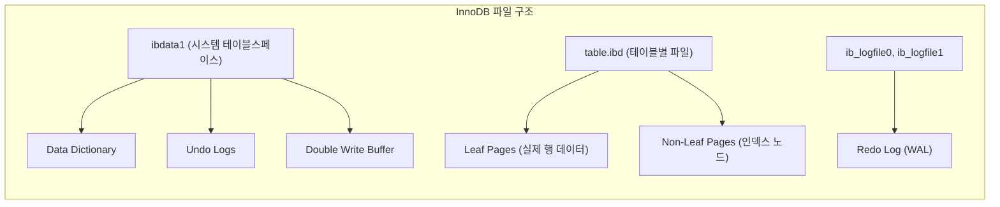

#### PostgreSQL Heap 구조

PostgreSQL은 힙(Heap) 기반으로 데이터를 저장한다. 테이블 파일은 8KB 페이지(블록)로 구성되며, 인덱스와 테이블이 완전히 분리된 구조이다. MVCC를 위해 동일 테이블 내에 여러 버전의 튜플을 함께 저장하는 것이 InnoDB와 가장 큰 차이점이다. 이 방식은 별도의 Undo Log가 필요 없지만, 오래된 버전 데이터를 주기적으로 청소하는 VACUUM 작업이 필수적이다.

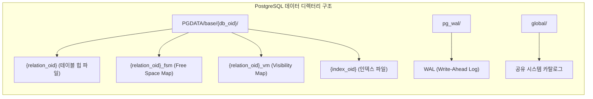

#### Oracle Tablespace

Oracle은 테이블스페이스 → 세그먼트 → 익스텐트 → 데이터 블록의 4단계 계층 구조로 저장 공간을 관리한다. 이 계층 구조는 수십 TB 규모의 데이터를 체계적으로 관리하기 위한 설계다. 각 계층을 별도로 관리함으로써 스토리지 할당, 압축, 암호화를 세밀하게 제어할 수 있다.

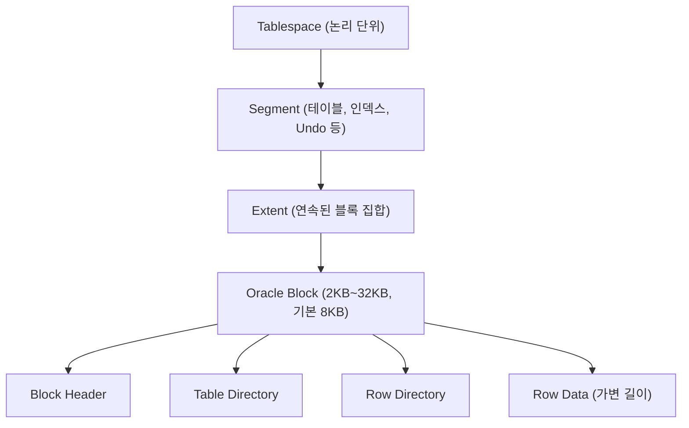

### 2.3 프로세스 모델

프로세스 모델의 차이는 연결 수가 증가할 때 가장 두드러진다. MySQL/MariaDB/SQL Server는 스레드 기반이므로 연결당 오버헤드가 작고 메모리를 공유하지만, 한 스레드의 버그가 전체 프로세스에 영향을 줄 수 있다. PostgreSQL은 연결마다 별도 프로세스를 생성하므로 격리성이 뛰어나지만, 연결 수가 수백~수천 개로 늘어나면 메모리 사용량이 급증한다. 이 때문에 PostgreSQL 운영 환경에서는 PgBouncer 같은 커넥션 풀러가 사실상 필수다.

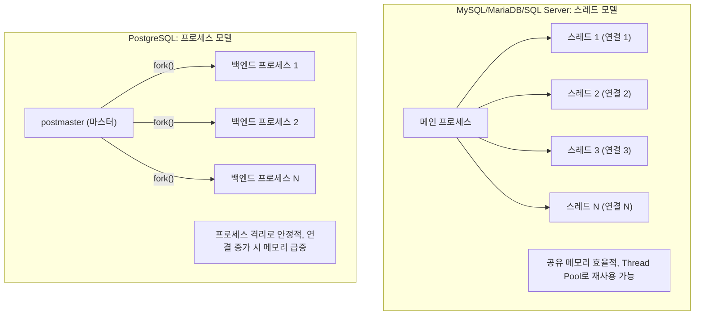

### 2.4 메모리 구조

각 RDBMS의 메모리 구조는 성능 튜닝의 핵심이다. MySQL의 Buffer Pool은 디스크 I/O를 줄이는 캐시 역할을 하며, 전체 메모리의 70~80%를 할당하는 것이 일반적이다. PostgreSQL은 Shared Buffers(전체 RAM의 25% 권장)와 함께 OS의 페이지 캐시를 적극 활용하는 독특한 이중 캐시 구조를 사용한다. Oracle의 SGA(System Global Area)는 인스턴스 전체에서 공유되며, PGA(Program Global Area)는 각 서버 프로세스가 독립적으로 사용한다.

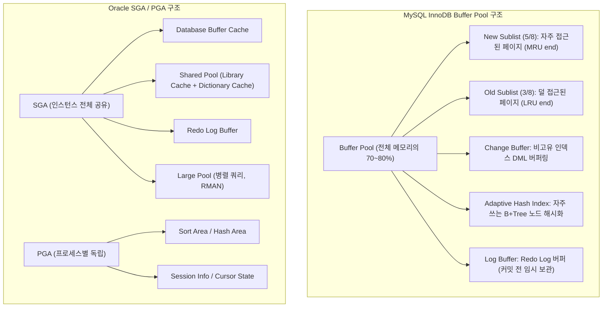

---

## 3. MVCC 구현 차이

MVCC(Multi-Version Concurrency Control)는 읽기와 쓰기가 서로를 차단하지 않도록 여러 버전의 데이터를 유지하는 방식이다. 각 RDBMS마다 이전 버전 데이터를 **어디에, 어떻게** 저장하느냐가 다르며, 이 차이가 VACUUM 필요성, Long-running transaction 영향, 가비지 수집 방식을 결정한다.

> **비유로 이해하기**: MVCC는 문서 버전 관리 시스템과 같다. 누군가 문서를 수정 중이어도 다른 사람은 이전 버전을 읽을 수 있다. MySQL InnoDB는 현재 버전만 메인 폴더에 두고 이전 버전은 별도 보관함(Undo Log)에 넣는다. PostgreSQL은 모든 버전을 같은 폴더에 두고 버전 번호로 구분한다. Oracle은 별도의 이전 버전 보관실(Undo Tablespace)을 운영한다.

### 3.1 MySQL/InnoDB — Undo Log 기반

InnoDB의 MVCC는 Undo Log를 참조하는 방식이다. 실제 테이블 페이지에는 최신 버전만 저장되고, 이전 버전은 Undo Log에 체인 형태로 보관된다. 트랜잭션이 시작될 때 Read View가 생성되고, 이 스냅샷을 기준으로 어느 버전이 보여야 하는지 결정한다. 예를 들어 트랜잭션 ID 95가 Read View를 생성했다면, 그보다 큰 트랜잭션 ID(96, 97...)가 만든 변경은 모두 Undo Chain을 따라가서 이전 버전으로 대체한다.

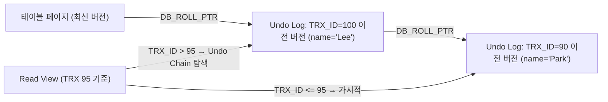

InnoDB MVCC의 장점은 최신 데이터가 테이블 페이지에 있어 현재 읽기 성능이 좋다는 것이다. 단점은 오래된 트랜잭션이 살아 있으면 Undo Log가 무한정 증가할 수 있다는 것이다. Long-running transaction은 Purge Thread가 Undo를 정리하지 못하게 막아 디스크 사용량 급증과 성능 저하를 유발한다.

### 3.2 PostgreSQL — Tuple Versioning

PostgreSQL은 Undo Log 없이 테이블 힙 자체에 모든 버전을 저장한다. 각 튜플(행)에 `xmin`/`xmax` 트랜잭션 ID를 기록하여 가시성을 판별한다. `xmin`은 이 튜플을 삽입한 트랜잭션 ID, `xmax`는 삭제하거나 갱신한 트랜잭션 ID다. `xmax=0`이면 아직 삭제되지 않은 현재 유효한 튜플이다.

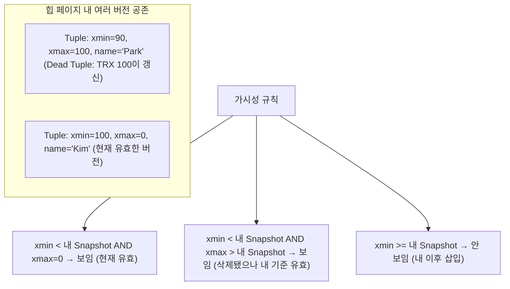

VACUUM이 Dead Tuple을 회수하기 전까지 디스크에 남아 있어 테이블 파일이 비대해지는 "Table Bloat" 현상이 발생할 수 있다. PostgreSQL 운영의 핵심 과제 중 하나가 autovacuum을 적절히 설정하는 것이다.

**VACUUM 핵심 파라미터:**

```sql
-- autovacuum 트리거 조건 (기본값)
autovacuum_vacuum_scale_factor = 0.2   -- 테이블의 20% 변경 시 실행
autovacuum_analyze_scale_factor = 0.1  -- 10% 변경 시 ANALYZE 실행

-- 대용량 테이블에서는 절대값 지정이 효율적
autovacuum_vacuum_threshold = 50       -- 최소 50건 변경 시
autovacuum_analyze_threshold = 50
```

### 3.3 Oracle — Undo Tablespace 기반

Oracle은 별도의 Undo Tablespace에 이전 버전 데이터를 저장한다. 구조적으로는 InnoDB의 Undo Log와 유사하지만 Tablespace 단위로 관리되어 더 체계적이다. Oracle에서 SELECT는 SCN(System Change Number) 기반으로 일관성을 보장한다. 쿼리 시작 시의 SCN을 기준으로, 그보다 늦게 커밋된 변경은 Undo에서 되돌려서 읽는다.

Oracle Undo의 독특한 점은 `UNDO_RETENTION` 파라미터로 이전 버전 보존 기간을 설정할 수 있다는 것이다. 이 기간이 지난 Undo는 자동으로 만료되어 재사용된다. 단, Undo 공간이 부족하면 "ORA-01555: snapshot too old" 오류가 발생한다.

### 3.4 MVCC 방식 종합 비교

| 항목 | MySQL/InnoDB | PostgreSQL | Oracle |
|---|---|---|---|
| 이전 버전 저장 위치 | Undo Log Segment | 테이블 힙 내부 | Undo Tablespace |
| 현재 버전 위치 | 테이블 페이지 | 테이블 힙 | 테이블 블록 |
| 가비지 수집 | Purge Thread (자동) | VACUUM (주기적) | Undo 자동 만료 (UNDO_RETENTION) |
| Table Bloat 위험 | 낮음 | 높음 (VACUUM 필수) | 낮음 |
| Long-running 트랜잭션 영향 | Undo 무한 증가 | Dead Tuple 누적 | "ORA-01555: snapshot too old" |
| 버전 이력 유지 기간 | 트랜잭션 종료까지 | VACUUM 실행 전까지 | UNDO_RETENTION 설정값 |

---

## 4. 인덱스 차이

### 4.1 MySQL / InnoDB 인덱스

InnoDB의 가장 큰 특징은 Primary Key 자체가 클러스터드 인덱스(Clustered Index)라는 점이다. B+Tree의 리프 노드에 실제 행 데이터가 PK 순서로 정렬 저장된다. 이 때문에 PK 기반 조회와 범위 스캔은 극히 빠르다. 반면 Secondary Index의 리프 노드에는 인덱스 키와 함께 PK 값이 저장된다. Secondary Index로 데이터를 조회하면 먼저 Secondary Index를 탐색해 PK를 얻고, 다시 Clustered Index를 탐색하는 "이중 탐색(Double Lookup)"이 발생한다.

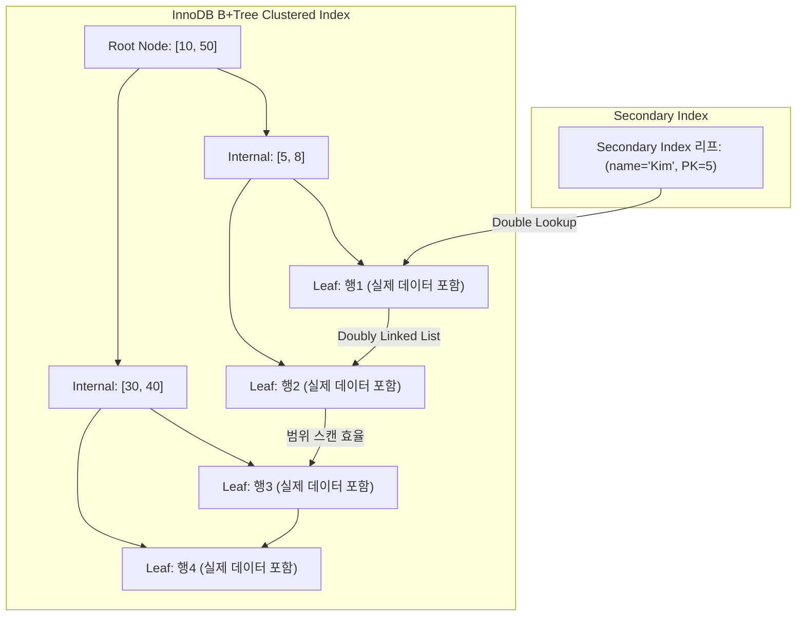

**커버링 인덱스(Covering Index)** 는 Secondary Index에 필요한 컬럼을 모두 포함시켜 Double Lookup을 회피하는 기법이다. EXPLAIN의 Extra에 `Using index`가 표시되면 커버링 인덱스가 적용된 것이다.

```sql
-- 커버링 인덱스 예시: name, age를 함께 인덱싱
CREATE INDEX idx_name_age ON users(name, age);

-- name, age만 SELECT하면 Clustered Index 재탐색 없이 처리됨
-- Extra: Using index (커버링 인덱스 사용)
SELECT name, age FROM users WHERE name = 'Kim';
```

**핵심**: InnoDB에서 PK 선택은 매우 중요하다. PK가 없거나 UUID처럼 무작위 값이면 클러스터드 인덱스 삽입 시 페이지 분할(Page Split)이 자주 발생해 성능이 저하된다. 가능하면 자동 증가(AUTO_INCREMENT) 정수를 PK로 사용하는 것이 좋다.

**지원 인덱스 타입:**

| 타입 | 엔진 | 용도 |
|---|---|---|
| B+Tree | InnoDB, MyISAM | 기본, 범위/동등 검색 |
| Hash | Memory | 동등 검색만 가능, 범위 불가 |
| Full-Text | InnoDB, MyISAM | 자연어 전문 검색 |
| Spatial (R-Tree) | InnoDB, MyISAM | 지리정보 검색 |

### 4.2 PostgreSQL 인덱스

PostgreSQL은 가장 다양한 인덱스 타입을 지원하며, 사용자 정의 인덱스 타입도 추가 가능하다. 특히 JSONB, 배열, 전문 검색에 최적화된 GIN 인덱스와 지리정보에 최적화된 GiST 인덱스가 MySQL 대비 강력한 차별점이다.

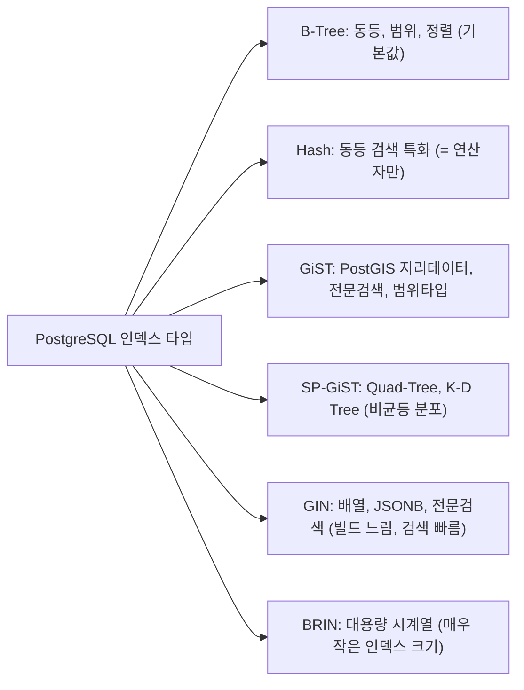

**Partial Index**는 PostgreSQL의 강력한 기능이다. 조건을 만족하는 행만 인덱싱하여 인덱스 크기를 줄이고 유지 비용을 낮춘다.

```sql
-- 활성 사용자만 인덱싱 (전체 사용자의 10%만 활성이라면 인덱스 크기 90% 절감)
CREATE INDEX idx_active_users ON users(email)
WHERE is_active = TRUE AND deleted_at IS NULL;

-- 소문자 변환 결과를 인덱싱 (함수 기반 인덱스)
CREATE INDEX idx_lower_email ON users(lower(email));
SELECT * FROM users WHERE lower(email) = 'kim@example.com'; -- 인덱스 사용
```

### 4.3 Oracle 인덱스

Oracle은 Bitmap Index가 핵심 차별점이다. 카디널리티(선택도)가 낮은 컬럼(성별, 상태 코드 등)에 비트 벡터를 생성하여 AND/OR 연산을 비트 연산으로 처리한다. DW/OLAP 환경에서 매우 효과적이지만, DML이 빈번한 OLTP에서는 Lock 경합이 심해 사용하면 안 된다.

| 타입 | 설명 | 적합한 경우 |
|---|---|---|
| B-Tree | 기본 인덱스, 고 카디널리티 | 대부분의 일반 쿼리 |
| Bitmap | 낮은 카디널리티 컬럼 | DW/OLAP, 성별·상태 코드 등 |
| Function-Based | 표현식 결과를 인덱싱 | `UPPER(name)` 검색 |
| Reverse Key | B-Tree 키를 뒤집어 저장 | RAC 환경의 우측 편향 방지 |
| Index-Organized Table (IOT) | 테이블 자체가 B-Tree | PK 기반 접근이 대부분인 경우 |

### 4.4 인덱스 타입 비교 표

| 인덱스 타입 | MySQL | PostgreSQL | Oracle | MariaDB | SQL Server |
|---|---|---|---|---|---|
| B-Tree | ✓ | ✓ | ✓ | ✓ | ✓ |
| Hash | ✓(Memory) | ✓ | - | ✓(Memory) | - |
| Clustered | ✓(InnoDB PK) | - (별도 설정) | IOT | ✓(InnoDB PK) | ✓ |
| Bitmap | - | - | ✓ | - | ✓(CS) |
| GIN/GiST | - | ✓ | - | - | - |
| BRIN | - | ✓ | - | - | - |
| Spatial | ✓ | ✓(PostGIS) | ✓ | ✓ | ✓ |
| Full-Text | ✓ | ✓ | ✓ | ✓ | ✓ |
| Partial | - | ✓ | - | - | ✓(Filtered) |

---

## 5. 트랜잭션 / 격리 수준

### 5.1 기본 격리 수준

각 RDBMS의 기본 격리 수준은 성능과 일관성 사이의 트레이드오프를 반영한다. MySQL/MariaDB의 REPEATABLE READ는 Gap Lock으로 Phantom Read까지 방지한다는 점에서 이례적으로 강한 기본값이다. PostgreSQL과 Oracle은 READ COMMITTED를 기본으로 하여 동시성을 높인다.

| 데이터베이스 | 기본 격리 수준 | 이유 |
|---|---|---|
| MySQL/InnoDB | REPEATABLE READ | Gap Lock으로 Phantom Read 방지 |
| MariaDB | REPEATABLE READ | MySQL 호환 |
| PostgreSQL | READ COMMITTED | 일반적인 OLTP 성능/안전성 균형 |
| Oracle | READ COMMITTED | 오래된 기본값 유지 |
| SQL Server | READ COMMITTED | 기본; RCSI 활성화 시 성능 향상 |

### 5.2 격리 수준별 문제 현상

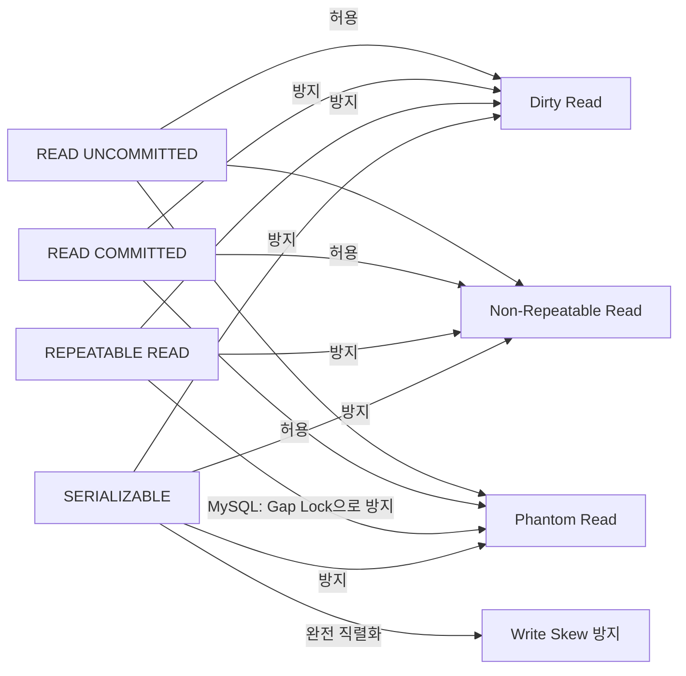

### 5.3 MySQL Gap Lock

MySQL REPEATABLE READ에서는 Gap Lock을 사용하여 Phantom Read를 방지한다. Gap Lock은 특정 범위의 "틈새(gap)"에 삽입 자체를 막는 잠금으로, 실제 존재하는 행이 아닌 키 범위에 걸린다는 점이 특징이다. 이 잠금은 데드락 발생 가능성을 높이고 동시 삽입 성능을 저하시키므로, 불필요하다면 READ COMMITTED로 격리 수준을 낮추는 것을 고려해야 한다.

```sql
-- 세션 1: amount 100~200 구간에 Gap Lock 획득
BEGIN;
SELECT * FROM orders WHERE amount BETWEEN 100 AND 200 FOR UPDATE;

-- 세션 2: Gap Lock 범위 안으로 삽입 시도 → 대기
INSERT INTO orders (amount) VALUES (150); -- 블로킹됨

-- 세션 1이 COMMIT하면 세션 2의 INSERT 실행됨
COMMIT;
```

### 5.4 PostgreSQL SSI (Serializable Snapshot Isolation)

PostgreSQL은 SERIALIZABLE 격리 수준에서 SSI를 구현한다. 잠금 없이 의존성 그래프를 추적하여 직렬화 이상을 감지하면 한 트랜잭션을 롤백한다. 기존의 잠금 기반 SERIALIZABLE과 달리 읽기가 쓰기를 차단하지 않아 동시성이 높다.

SSI가 방지하는 대표적 현상은 "Write Skew"다. 두 트랜잭션이 각각 잔액 합계를 읽고 동시에 서로 다른 계좌에서 출금하면, 잠금 기반으로는 감지되지 않지만 SSI는 이 의존성 사이클을 감지하여 한 트랜잭션을 롤백한다.

### 5.5 SQL Server RCSI

SQL Server는 기본적으로 잠금 기반이지만, Read Committed Snapshot Isolation(RCSI)을 활성화하면 tempdb에 버전을 저장하여 읽기-쓰기 충돌을 없앨 수 있다. 프로덕션 SQL Server 환경에서는 RCSI 활성화가 성능에 크게 도움이 된다.

```sql
-- RCSI 활성화 (서비스 중단 없이 가능)
ALTER DATABASE MyDB SET READ_COMMITTED_SNAPSHOT ON;
```

### 5.6 격리 수준 지원 비교

| 격리 수준 | MySQL | PostgreSQL | Oracle | MariaDB | SQL Server |
|---|---|---|---|---|---|
| READ UNCOMMITTED | ✓ | ✓(RC로 처리) | - | ✓ | ✓ |
| READ COMMITTED | ✓ | ✓ | ✓ | ✓ | ✓ |
| REPEATABLE READ | ✓(기본) | ✓ | - | ✓(기본) | ✓ |
| SERIALIZABLE | ✓(Lock 기반) | ✓(SSI) | ✓(Lock 기반) | ✓ | ✓ |
| Snapshot | - | ✓(기본 RR 동작) | ✓(별도 지원) | - | ✓(RCSI) |

---

## 6. 복제 방식

### 6.1 MySQL 복제

MySQL의 복제는 Binary Log(Binlog)를 기반으로 한다. Binlog에 모든 데이터 변경사항을 기록하고, Replica 서버가 이를 읽어 재실행(replay)하는 방식이다. 기본은 비동기 복제로 Source가 커밋 즉시 반환하며 Replica의 처리를 기다리지 않는다. 이 방식은 성능은 높지만 Source 장애 시 복제 지연만큼 데이터 유실이 발생할 수 있다.

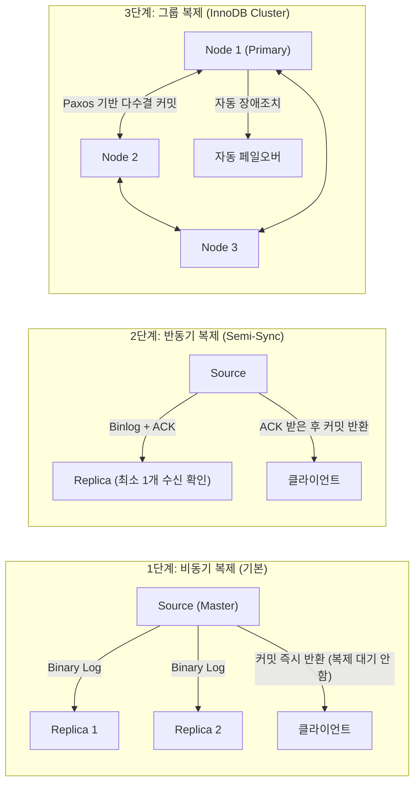

**MySQL 복제 포맷:**
- `STATEMENT`: SQL 문 그대로 기록 (비결정적 함수에서 불일치 위험)
- `ROW`: 변경된 행 데이터 기록 (안전하지만 볼륨 큼)
- `MIXED`: 기본은 STATEMENT, 비결정적인 경우 ROW 자동 전환

### 6.2 PostgreSQL 복제

PostgreSQL의 물리 복제는 WAL(Write-Ahead Log) 스트림을 Standby 서버로 전송한다. Standby는 WAL을 적용하여 Primary와 동일한 상태를 유지한다. Hot Standby 모드에서는 Standby가 읽기 전용 쿼리를 처리할 수 있어 읽기 부하 분산에 활용된다.

PostgreSQL 논리 복제(Logical Replication)는 특정 테이블만 선택적으로 복제할 수 있고, 스키마 버전이 다른 서버 간에도 복제가 가능하다. 이 기능은 무중단 메이저 버전 업그레이드에 활용된다.

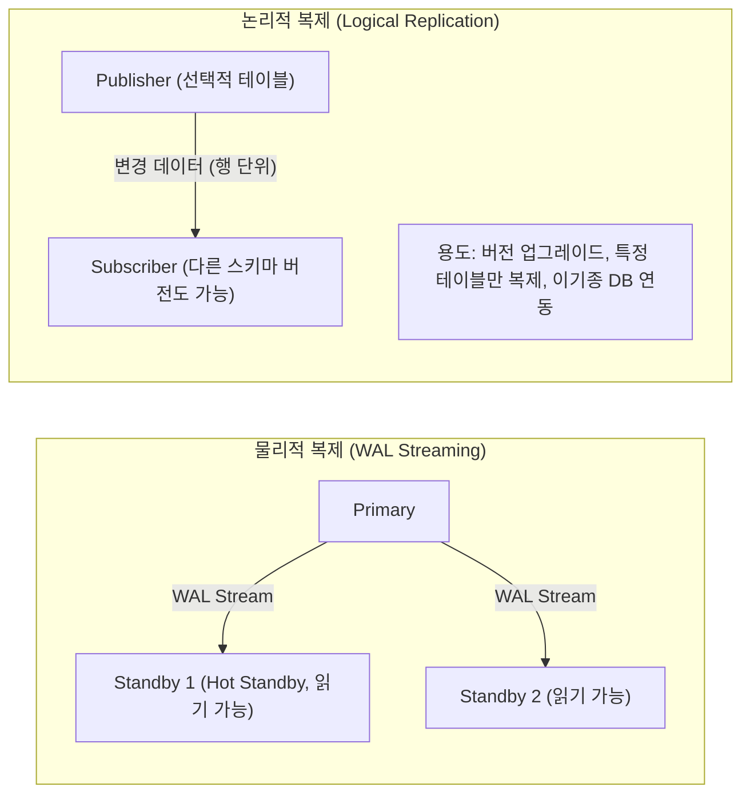

### 6.3 Oracle Data Guard / GoldenGate

Oracle Data Guard는 Primary DB의 Redo Log를 Standby DB로 전송하여 동기화한다. Physical Standby는 블록 단위로 Primary와 동일한 복사본을 유지하고, Logical Standby는 SQL로 변환하여 적용하므로 Standby에서 다른 인덱스나 구조를 가질 수 있다. Active Data Guard(추가 라이선스 필요)는 Standby를 읽기 전용으로 열어 읽기 부하를 분산한다.

### 6.4 복제 방식 비교

| 항목 | MySQL | PostgreSQL | Oracle | MariaDB | SQL Server |
|---|---|---|---|---|---|
| 기본 복제 방식 | Binlog (비동기) | WAL 스트리밍 | Data Guard | Binlog | Always On AG |
| 동기 복제 | Semi-Sync, Group Replication | synchronous_commit | Data Guard Sync | Semi-Sync | Synchronous Commit |
| 논리 복제 | Binlog (Row) | Logical Replication | LogMiner/GoldenGate | ✓ | Transactional Replication |
| 자동 장애조치 | InnoDB Cluster/MHA | Patroni/Repmgr | Data Guard FSFO | Galera Cluster | Always On FCI |

---

## 7. JSON 지원

### 7.1 MySQL JSON 타입

MySQL 5.7부터 네이티브 JSON 타입을 지원한다. 내부적으로 Binary JSON 포맷으로 저장되어 전체 행을 파싱하지 않고 특정 키만 빠르게 접근할 수 있다. 다만 JSON 컬럼 자체에 직접 인덱스를 생성할 수 없고, Generated Column을 거쳐 우회해야 한다는 한계가 있다.

JSON 데이터를 많이 다룬다면 MySQL보다 PostgreSQL의 JSONB가 더 적합하다. MySQL JSON은 단순 저장/조회에는 충분하지만, 복잡한 JSON 쿼리와 인덱싱 전략에서 PostgreSQL에 뒤진다.

```sql
-- MySQL JSON 기본 사용
CREATE TABLE events (
    id INT PRIMARY KEY,
    data JSON
);

INSERT INTO events VALUES (1, '{"user": "Kim", "action": "login"}');

-- JSON 경로 조회 (두 방식 동일)
SELECT data->>'$.user' AS user_name FROM events;
SELECT JSON_EXTRACT(data, '$.action') FROM events;

-- 부분 업데이트 (MySQL 8.0+: 전체 컬럼 재기록 없이 특정 키만 변경)
UPDATE events SET data = JSON_SET(data, '$.action', 'logout') WHERE id = 1;

-- JSON 인덱스 우회: Generated Column 활용
ALTER TABLE events
    ADD COLUMN user_name VARCHAR(100) GENERATED ALWAYS AS (data->>'$.user') STORED,
    ADD INDEX idx_user (user_name);
```

**핵심**: MySQL JSON의 핵심 한계는 첫째 JSON 컬럼에 직접 인덱스 불가(Generated Column 우회 필요), 둘째 CHECK 제약으로 스키마 강제 불가(저장 시 유효성만 검사), 셋째 PostgreSQL의 `@>` 포함 연산자 같은 고급 연산자 부재다.

### 7.2 PostgreSQL JSONB

PostgreSQL은 `json`(텍스트 저장)과 `jsonb`(바이너리 파싱 후 저장) 두 타입을 지원한다. 실무에서는 거의 항상 `jsonb`를 사용한다. `jsonb`는 저장 시 파싱하여 키 순서를 정렬하고 중복 키를 제거한 바이너리로 저장하므로, 조회 시 파싱이 필요 없고 GIN 인덱스를 직접 생성할 수 있다.

GIN 인덱스는 JSON 내의 모든 키와 값을 역인덱스 구조로 저장하므로, 어떤 키나 값을 기준으로 검색해도 인덱스를 활용할 수 있다. 이 점이 MySQL의 Generated Column 방식과 근본적으로 다른 PostgreSQL의 강점이다.

```sql
-- JSONB 기본 사용
CREATE TABLE events (
    id SERIAL PRIMARY KEY,
    data JSONB
);

INSERT INTO events VALUES (1, '{"user": "Kim", "tags": ["auth", "web"]}');

-- JSONB 전용 연산자
SELECT * FROM events WHERE data ? 'user';                  -- 키 존재 여부
SELECT * FROM events WHERE data @> '{"user": "Kim"}';      -- 포함 여부
SELECT * FROM events WHERE data->'tags' ? 'auth';          -- 배열 원소 포함

-- GIN 인덱스: JSON 내 모든 키/값에 대한 인덱스 (하나의 인덱스로 모든 키 검색)
CREATE INDEX idx_data_gin ON events USING GIN (data);

-- jsonpath 쿼리 (PostgreSQL 12+)
SELECT jsonb_path_query(data, '$.tags[*]') FROM events;

-- JSON Schema 검증 (PostgreSQL 16+)
SELECT jsonb_matches_schema(
    '{"type": "object", "properties": {"user": {"type": "string"}}}',
    '{"user": "Kim"}'
);
```

**핵심**: JSONB + GIN 인덱스 조합은 스키마리스 데이터를 다루는 매우 강력한 방법이다. 단, GIN 인덱스는 빌드가 느리고 삽입 성능에 영향을 주므로, 쓰기가 매우 빈번한 테이블에서는 신중하게 적용해야 한다.

### 7.3 JSON 지원 비교

| 기능 | MySQL | PostgreSQL | Oracle | MariaDB | SQL Server |
|---|---|---|---|---|---|
| 네이티브 JSON 타입 | ✓(5.7+) | ✓(json/jsonb) | ✓(21c 네이티브) | ✓ | ✓ |
| JSON 직접 인덱싱 | - (Generated Col) | ✓(GIN) | ✓(JSON Search) | - | ✓(Computed Col) |
| JSON 경로 쿼리 | JSON_EXTRACT | jsonpath | JSON_VALUE | JSON_EXTRACT | JSON_VALUE |
| JSON Schema 검증 | - | ✓(16+) | ✓ | - | - |
| JSON → 관계형 분해 | JSON_TABLE | json_to_recordset | JSON_TABLE | JSON_TABLE | OPENJSON |

---

## 8. 확장성 (Extensibility)

### 8.1 MySQL 확장성

MySQL의 핵심 확장 포인트는 스토리지 엔진 교체 가능성이다. 테이블 단위로 다른 엔진을 사용할 수 있어 용도별 최적화가 가능하다. 그러나 새로운 데이터 타입, 연산자, 인덱스 접근법을 추가하는 것은 PostgreSQL과 달리 불가능하다.

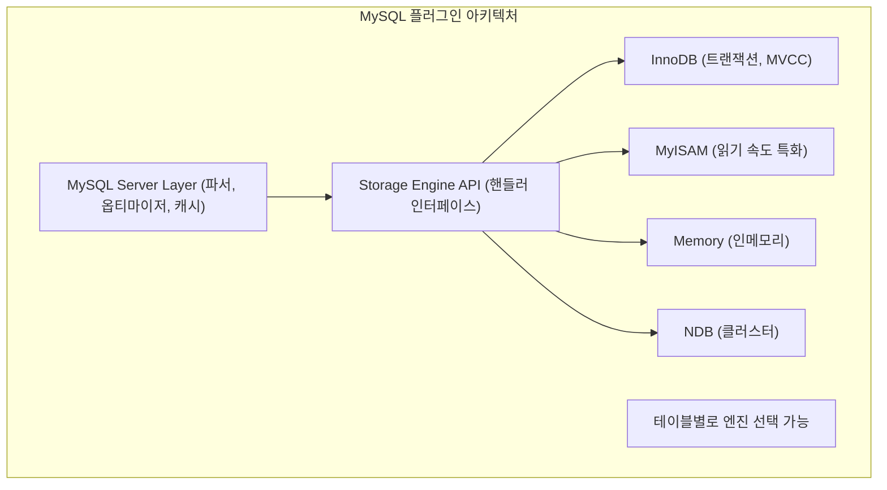

### 8.2 PostgreSQL 확장 시스템

PostgreSQL의 Extension 시스템은 다섯 RDBMS 중 가장 강력하다. SQL만으로 새로운 타입, 연산자, 인덱스 접근법, 함수 언어를 추가할 수 있다. 이 개방성이 PostGIS(지리정보), pgvector(AI 임베딩), TimescaleDB(시계열) 같은 강력한 확장 생태계를 만들었다.

```sql
-- 주요 Extension 설치 예시
CREATE EXTENSION postgis;            -- 지리정보 처리
CREATE EXTENSION pg_trgm;            -- 유사 문자열 검색 (LIKE 최적화)
CREATE EXTENSION pgvector;           -- 벡터 유사도 검색 (AI/ML 임베딩)
CREATE EXTENSION pg_stat_statements; -- 쿼리 통계 수집

-- 커스텀 데이터 타입 생성
CREATE TYPE mood AS ENUM ('sad', 'ok', 'happy');
CREATE TABLE person (current_mood mood);

-- Python으로 함수 작성 가능
CREATE EXTENSION plpython3u;
CREATE FUNCTION pymax(a integer, b integer) RETURNS integer AS $$
    return max(a, b)
$$ LANGUAGE plpython3u;
```

**주요 Extension 목록:**

| Extension | 기능 |
|---|---|
| PostGIS | 지리정보(GIS) 데이터 처리 |
| pg_trgm | 트라이그램 기반 유사 문자열 검색 |
| pgvector | 벡터 유사도 검색 (AI/ML 임베딩) |
| TimescaleDB | 시계열 데이터 최적화 |
| Citus | 분산 PostgreSQL (샤딩) |
| pg_partman | 파티션 자동 관리 |
| pgcrypto | 암호화 함수 |

### 8.3 Oracle 확장성

Oracle은 PL/SQL 생태계와 내장 미들웨어 기능이 강점이다. 패키지, 프로시저, 함수, 트리거의 체계적인 관리, 데이터베이스 내장 메시지 큐(Advanced Queuing), 파티셔닝(별도 유료 옵션), Oracle Text(전문 검색), Oracle Spatial(공간 데이터) 등이 하나의 RDBMS 안에 통합되어 있다. 단, 파티셔닝을 포함한 많은 고급 기능이 별도 라이선스 비용이 필요하다.

---

## 9. 성능 특성

### 9.1 읽기 중심 워크로드

단순 PK 조회에서는 InnoDB의 Clustered Index와 Oracle의 버퍼 캐시 최적화 덕분에 MySQL과 Oracle이 매우 빠르다. 복잡한 분석 쿼리에서는 PostgreSQL의 병렬 쿼리, CTE 최적화, 윈도우 함수가 MySQL보다 훨씬 강하다. Oracle은 병렬 실행, Result Cache, 머티리얼라이즈드 뷰 자동 새로 고침 등 분석 워크로드를 위한 최고 수준의 기능을 갖추고 있다.

**PostgreSQL 병렬 쿼리 설정:**

```sql
-- 병렬 쿼리 활성화 (기본값)
SET max_parallel_workers_per_gather = 4;

-- 대용량 집계: Gather Node가 4개 worker를 병렬 실행 후 머지
SELECT department, AVG(salary), COUNT(*)
FROM employees
GROUP BY department;
```

### 9.2 쓰기 중심 워크로드

단건 INSERT/UPDATE 처리에서는 네 RDBMS 모두 WAL(또는 Redo Log) 순차 쓰기 덕분에 높은 처리량을 달성한다. 대량 Bulk Load에서는 각 DB 전용 도구(MySQL: `LOAD DATA INFILE`, PostgreSQL: `COPY`, Oracle: SQL*Loader)를 사용하면 일반 INSERT 대비 10배 이상 빠르다.

**WAL 동기화 설정 (쓰기 성능 vs 내구성 트레이드오프):**

| 설정 | MySQL | PostgreSQL | Oracle |
|---|---|---|---|
| 최고 내구성 (기본) | innodb_flush_log_at_trx_commit=1 | synchronous_commit=on | 기본값 |
| 1초 지연 허용 | =2 (약 1초마다 flush) | =off (비동기) | ASYNC commit |
| 대량 적재 시 | =0 (성능 최대, 크래시 시 최대 1초 유실) | =off | NOLOGGING |

### 9.3 동시성 처리

모든 MVCC 지원 DB(InnoDB, PostgreSQL, Oracle)에서 SELECT는 UPDATE를 기다리지 않는다. 이것이 전통적 잠금 방식(MyISAM) 대비 가장 큰 장점이다. 같은 행을 동시에 갱신하는 경우에는 순차적 처리가 불가피하지만, MVCC 덕분에 읽기는 전혀 방해받지 않는다.

### 9.4 대용량 데이터 처리

| 기능 | MySQL | PostgreSQL | Oracle | SQL Server |
|---|---|---|---|---|
| 테이블 파티셔닝 | ✓(제한적) | ✓(선언적, 강력) | ✓(엔터프라이즈) | ✓ |
| 병렬 쿼리 | ✓(8.0+, 제한적) | ✓(강력) | ✓(최강) | ✓ |
| 컬럼형 스토리지 | ✗ | - | ✓(In-Memory Col) | ✓(Columnstore) |
| 인메모리 테이블 | Memory 엔진 | - | ✓(In-Memory) | ✓(Hekaton) |

---

## 10. 운영 / 관리

### 10.1 백업 / 복구 방식

백업 전략은 RTO(목표 복구 시간)와 RPO(목표 복구 시점)에 따라 결정된다. 논리 백업은 이식성이 높지만 대용량에서 느리다. 물리 백업은 빠르지만 같은 버전과 OS에서만 복구된다. PITR(Point-In-Time Recovery)은 WAL/Binlog를 활용해 특정 시각으로 복구한다.

**MySQL 백업 전략:**

```bash
# 1. 논리 백업 (mysqldump): 이식성 높지만 대용량에서 느림
mysqldump -u root -p --single-transaction --routines --triggers \
    --all-databases > backup.sql
# --single-transaction: InnoDB 트랜잭션으로 일관성 보장 (서비스 중단 없음)

# 2. 물리 백업 (Percona XtraBackup): 핫 백업, 빠른 복구
xtrabackup --backup --target-dir=/backup/
xtrabackup --prepare --target-dir=/backup/   # 복구 준비 (Redo 적용)
xtrabackup --copy-back --target-dir=/backup/ # 데이터 파일 복원

# 3. Binary Log 기반 PITR (특정 시각으로 복구)
mysqlbinlog --start-datetime="2026-05-01 12:00:00" \
            --stop-datetime="2026-05-01 13:00:00" \
            binlog.000001 | mysql -u root -p
```

**핵심**: MySQL 백업에서 `--single-transaction` 없이 mysqldump를 실행하면 InnoDB 테이블은 일관성을 잃는다. 운영 환경에서는 항상 이 옵션을 사용하거나 XtraBackup을 사용해야 한다.

**PostgreSQL 백업 전략:**

```bash
# 1. pg_dump (논리 백업): 선택적 복구 가능
pg_dump -Fc -f backup.dump mydb    # 커스텀 포맷 (압축 + 병렬 복구 가능)
pg_restore -d mydb backup.dump     # 복구

# 2. pg_basebackup + WAL 아카이빙 (물리 백업 + PITR)
pg_basebackup -D /backup/base -Ft -z -Xs -P

# postgresql.conf: WAL 아카이빙 설정
archive_mode = on
archive_command = 'cp %p /archive/%f'

# PITR 복구 시 recovery.conf 설정
restore_command = 'cp /archive/%f %p'
recovery_target_time = '2026-05-01 13:00:00'
```

### 10.2 모니터링 도구

| 도구 | 대상 DB | 설명 |
|---|---|---|
| **Performance Schema** | MySQL/MariaDB | 내장 진단 데이터, 쿼리 통계 |
| **sys schema** | MySQL | Performance Schema 뷰 모음 |
| **pg_stat_statements** | PostgreSQL | 쿼리별 실행 통계 Extension |
| **pg_activity** | PostgreSQL | top 유사 실시간 모니터링 |
| **AWR (Automatic Workload Repository)** | Oracle | 성능 스냅샷, Top SQL |
| **ASH (Active Session History)** | Oracle | 1초 단위 활성 세션 샘플링 |
| **Percona Monitoring and Management (PMM)** | MySQL/PG | 오픈소스 통합 모니터링 |
| **Prometheus + postgres_exporter** | PostgreSQL | 메트릭 수집·시각화 |

```sql
-- PostgreSQL 핵심 모니터링 쿼리

-- 느린 쿼리 Top 10 (pg_stat_statements Extension 필요)
SELECT query, calls, mean_exec_time, total_exec_time
FROM pg_stat_statements
ORDER BY mean_exec_time DESC LIMIT 10;

-- 현재 블로킹 쿼리 확인
SELECT pid, wait_event_type, wait_event, query
FROM pg_stat_activity
WHERE wait_event_type = 'Lock';

-- 테이블별 Dead Tuple 현황 (VACUUM 필요 여부 판단)
SELECT schemaname, relname, n_live_tup, n_dead_tup,
       last_autovacuum, last_autoanalyze
FROM pg_stat_user_tables
ORDER BY n_dead_tup DESC;
```

### 10.3 업그레이드 편의성

PostgreSQL의 메이저 버전 업그레이드는 `pg_upgrade` 도구를 사용하거나 논리 복제를 활용한 무중단 업그레이드가 가능하다. 논리 복제 방식은 신버전 서버에 실시간 동기화 후 레플리케이션 지연이 0에 가까워지면 트래픽을 전환하는 방식으로, 다운타임을 수 초~분 수준으로 줄일 수 있다.

| 데이터베이스 | 메이저 업그레이드 방법 | 다운타임 |
|---|---|---|
| **MySQL** | In-place(5.7→8.0), 복잡 | 필요 (최소화 가능) |
| **PostgreSQL** | pg_upgrade 또는 논리 복제 | 논리 복제 시 수 초~분 |
| **Oracle** | DBUA(DB Upgrade Assistant) | 최소화 기법 다양 |
| **MariaDB** | mysql_upgrade 실행 | 필요 |
| **SQL Server** | In-place 가능 | 상대적으로 편리 |

---

## 11. 비용

### 11.1 라이선스 비용

| 데이터베이스 | 무료 에디션 | 유료 에디션 | 연간 비용(개략) |
|---|---|---|---|
| **MySQL** | Community Edition(GPL) | MySQL Enterprise | $10,000~/년 |
| **PostgreSQL** | 완전 무료 (PostgreSQL License) | - (지원 계약 별도) | $0 |
| **Oracle** | Express Edition(XE, 제한적) | Standard One/Enterprise | $10,000~$50,000+/CPU |
| **MariaDB** | Community Edition(GPL) | MariaDB Enterprise | $7,000~/년 |
| **SQL Server** | Developer(비상용)/Express(제한) | Standard/Enterprise | $1,418~$15,123/코어 |

**Oracle Enterprise 주요 유료 옵션:**

| 옵션 | 기능 | 추가 비용 |
|---|---|---|
| Partitioning | 테이블 파티셔닝 | $11,500/Named User |
| Advanced Compression | 압축 스토리지 | $11,500/Named User |
| Active Data Guard | Standby 읽기 + PITR | $11,500/Named User |
| Real Application Clusters | RAC 클러스터링 | $23,000/Named User |
| Diagnostics & Tuning Pack | AWR, ASH, SQL Tuning Advisor | $11,500/Named User |

Oracle의 함정은 기본 Enterprise 라이선스 외에 AWR, ASH 같은 DBA 필수 도구조차 별도 비용이라는 점이다. 실무에서 Oracle을 제대로 운영하려면 기본 라이선스의 2~3배 비용이 들기도 한다.

### 11.2 클라우드 매니지드 서비스

클라우드에서는 라이선스 비용이 시간당 과금에 포함된다. AWS 기준으로 MySQL과 PostgreSQL은 거의 동일한 비용이며, Oracle과 SQL Server는 약 2배 비싸다.

| 서비스 | 월 비용 (db.r6g.large 기준) | 특이사항 |
|---|---|---|
| RDS MySQL | 약 $350/월 | Aurora MySQL이 5배 성능 주장 |
| RDS PostgreSQL | 약 $350/월 | Aurora PostgreSQL이 3배 성능 주장 |
| RDS Oracle SE2 | 약 $680/월 | 라이선스 포함 |
| RDS SQL Server SE | 약 $680/월 | 라이선스 포함 |
| Aurora MySQL | 약 $350/월 + 스토리지 | 6개 복사본 자동 분산 |
| Aurora PostgreSQL | 약 $350/월 + 스토리지 | 최대 15개 읽기 전용 복제본 |

---

## 12. 실무 선택 가이드

### 12.1 데이터베이스 선택 의사결정

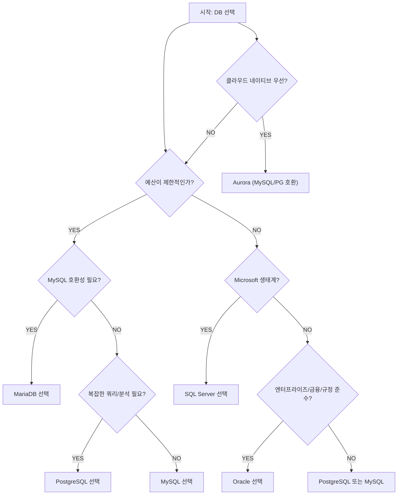

### 12.2 워크로드별 추천

#### 스타트업 / 소규모 서비스

**추천: PostgreSQL 또는 MySQL**

PostgreSQL은 완전 무료 라이선스에 강력한 기능(JSON, 윈도우 함수, CTE, 확장)을 갖추고 있어 신규 프로젝트에 가장 적합하다. 데이터 정합성 면에서도 더 엄격한 SQL 표준을 준수한다. MySQL은 단순 CRUD 앱에 충분하며, 레퍼런스와 호스팅 지원이 더 광범위하다. Aurora MySQL로 마이그레이션도 용이하다.

#### 복잡한 쿼리 / 분석 (OLAP 혼합)

**추천: PostgreSQL**

PostgreSQL은 고급 윈도우 함수(LEAD, LAG, NTILE, PERCENT_RANK), CTE 최적화, 병렬 쿼리, 파티션 프루닝, 강력한 Full-Text Search, GIN 인덱스(배열, JSONB 검색)에서 MySQL보다 월등히 앞선다.

```sql
-- PostgreSQL 강점: 윈도우 함수 + CTE 조합
WITH monthly_sales AS (
    SELECT
        date_trunc('month', created_at) AS month,
        SUM(amount) AS total,
        LAG(SUM(amount)) OVER (ORDER BY date_trunc('month', created_at)) AS prev_month
    FROM orders
    GROUP BY 1
)
SELECT month, total,
       ROUND((total - prev_month) / prev_month * 100, 2) AS growth_pct
FROM monthly_sales;
```

#### 엔터프라이즈 / 금융권

**추천: Oracle Database**

Oracle은 수십 년간의 엔터프라이즈 검증, Data Guard를 통한 무중단 고가용성, RAC 스케일아웃, 정밀한 보안/감사, 규정 준수(SOX, PCI-DSS, HIPAA) 지원, 강력한 PL/SQL 생태계를 제공한다. 매우 높은 라이선스 비용과 Oracle 전문 DBA 인력이 필요하며, 벤더 종속 위험을 감수해야 한다.

#### .NET / Microsoft 환경

**추천: SQL Server**

Azure 통합, .NET Entity Framework 완벽 지원, SSRS/SSAS/SSIS 통합 BI 스택, Always On Availability Groups, T-SQL의 강력한 기능이 강점이다. Columnstore Index(OLAP 최적화), In-Memory OLTP(Hekaton), R/Python 인-데이터베이스 실행 같은 SQL Server 고유 기능도 있다.

#### MySQL 호환 + 커뮤니티

**추천: MariaDB**

Oracle 의존성 없이 MySQL과 높은 호환성을 유지한다. Galera Cluster(동기 멀티마스터), Aria 스토리지 엔진(MyISAM 개선판), ColumnStore(분석용 컬럼 스토리지)가 차별점이다. MySQL 8.0+의 일부 기능은 미지원이므로 호환성을 확인해야 한다.

---

## 13. 종합 비교 표

### 13.1 핵심 기능 비교

| 기능 | MySQL 8.0 | PostgreSQL 16 | Oracle 21c | MariaDB 10.11 | SQL Server 2022 |
|---|---|---|---|---|---|
| **라이선스** | GPL/상용 | PostgreSQL(BSD) | 상용 | GPL | 상용 |
| **ACID 지원** | ✓(InnoDB) | ✓ | ✓ | ✓(InnoDB) | ✓ |
| **기본 격리수준** | REPEATABLE READ | READ COMMITTED | READ COMMITTED | REPEATABLE READ | READ COMMITTED |
| **MVCC** | Undo Log | Tuple Version | Undo Tablespace | Undo Log | MSSQL Versioning |
| **클러스터드 인덱스** | ✓(PK) | 별도 설정 | IOT | ✓(PK) | ✓ |
| **파티셔닝** | ✓(제한) | ✓(강력) | ✓(옵션 유료) | ✓ | ✓ |
| **윈도우 함수** | ✓(8.0+) | ✓ | ✓ | ✓(10.2+) | ✓ |
| **CTE (WITH)** | ✓(8.0+) | ✓ | ✓ | ✓(10.2+) | ✓ |
| **JSON 지원** | ✓ | ✓(JSONB+GIN) | ✓(21c 네이티브) | ✓ | ✓ |
| **GIS/공간 데이터** | ✓ | ✓(PostGIS 강력) | ✓(Oracle Spatial) | ✓ | ✓ |
| **병렬 쿼리** | ✓(제한) | ✓(강력) | ✓(최강) | ✓(제한) | ✓ |
| **DDL 트랜잭션** | - (자동 커밋) | ✓ | - (자동 커밋) | - | ✓ |

### 13.2 고가용성 / 복제 비교

| 기능 | MySQL | PostgreSQL | Oracle | MariaDB | SQL Server |
|---|---|---|---|---|---|
| **스트리밍 복제** | Binlog | WAL | Data Guard | Binlog | Always On |
| **동기 복제** | Semi-Sync/Group | sync_commit | DG Sync | Semi-Sync/Galera | Sync Commit |
| **자동 Failover** | InnoDB Cluster | Patroni/Repmgr | DG + Observer | Galera/MHA | Always On FCI |
| **멀티마스터** | Group Replication | BDR (3rd party) | RAC | Galera | - |

### 13.3 PostgreSQL만의 고유 강점

PostgreSQL이 다른 RDBMS와 차별화되는 핵심 기능은 네 가지로 요약된다. 첫째, 인덱스 다양성(GIN, GiST, BRIN, Partial, Expression Index)이다. 둘째, Extension 생태계(PostGIS, pgvector, TimescaleDB 등)로 전문 데이터 타입 지원이 가능하다. 셋째, DDL 트랜잭션으로 마이그레이션 스크립트 롤백이 가능하다. 넷째, 완전 오픈소스 라이선스로 어떤 용도로든 자유롭게 사용할 수 있다.

### 13.4 운영 복잡도 비교

| 항목 | MySQL | PostgreSQL | Oracle | MariaDB | SQL Server |
|---|---|---|---|---|---|
| **초기 설정 난이도** | 낮음 | 낮음-중간 | 높음 | 낮음 | 낮음-중간 |
| **DBA 전문성 요구** | 낮음-중간 | 중간 | 높음 | 낮음-중간 | 중간-높음 |
| **문서/커뮤니티** | 풍부 | 풍부 | 공식 문서 최강 | 중간 | 풍부 |
| **인력 수급** | 매우 쉬움 | 쉬움 | 전문 DBA 필요 | 쉬움 | 중간 |
| **클라우드 지원** | 광범위 | 광범위 | 제한적 | 일부 | Azure 중심 |

---

<details class="extreme-scenario-details">
<summary class="extreme-scenario-summary">
<span class="extreme-scenario-icon">🔥</span>
<span class="extreme-scenario-label">극한 시나리오 — 클릭하여 펼치기</span>
<span class="extreme-scenario-toggle"></span>
</summary>
<div class="extreme-scenario-body">

<div class="extreme-scenario-content" markdown="1">

### 시나리오 1: 일 1억 건 트랜잭션 처리 (결제 시스템)

초당 1,200건 이상의 결제 트랜잭션을 처리해야 하는 환경을 가정한다. MySQL InnoDB는 Row-level Lock과 MVCC 덕분에 쓰기 충돌을 최소화하면서 높은 처리량을 달성할 수 있다. `innodb_buffer_pool_size`를 전체 메모리의 75%로 설정하고, `innodb_flush_log_at_trx_commit=1`로 내구성을 보장하면서 `innodb_io_capacity`를 SSD에 맞게 조정한다.

이 규모에서 PostgreSQL은 연결당 프로세스 모델로 인해 수천 개의 동시 연결을 직접 처리하기 어렵다. PgBouncer로 연결 풀링을 앞단에 두고, `max_connections=500` 이하로 유지해야 한다. PostgreSQL 16의 병렬 커밋과 개선된 WAL 처리로 성능 차이는 줄었지만, 이 규모에서는 벤치마크를 반드시 수행해야 한다.

### 시나리오 2: VACUUM 폭주로 PostgreSQL 서비스 중단

대용량 배치 처리 후 수천만 건의 Dead Tuple이 쌓이면 autovacuum이 폭주하여 I/O를 독점할 수 있다. 증상은 쿼리 응답 시간 급증과 `pg_stat_activity`에서 `autovacuum: VACUUM` 프로세스가 장기 실행 중인 것이다.

응급 처치는 해당 테이블에 수동 VACUUM ANALYZE를 실행하되, `VACUUM (ANALYZE, VERBOSE, PARALLEL 4)`로 병렬 처리를 활용한다. 재발 방지를 위해 `autovacuum_vacuum_cost_delay`를 줄이고 `autovacuum_max_workers`를 늘려 autovacuum이 더 자주, 더 적극적으로 실행되도록 조정한다.

### 시나리오 3: MySQL Long-running Transaction으로 Undo 폭증

트랜잭션을 시작해 두고 수 시간 동안 열어 두면 InnoDB Purge Thread가 Undo Log를 정리하지 못한다. 이때 테이블 업데이트가 많으면 ibdata1(또는 undo tablespace)이 수십 GB로 팽창한다. `information_schema.INNODB_TRX`를 조회하여 장기 실행 트랜잭션을 찾아 KILL한다.

```sql
-- 1시간 이상 실행 중인 트랜잭션 찾기
SELECT trx_id, trx_started, trx_query,
       TIMESTAMPDIFF(MINUTE, trx_started, NOW()) AS duration_min
FROM information_schema.INNODB_TRX
WHERE TIMESTAMPDIFF(MINUTE, trx_started, NOW()) > 60
ORDER BY trx_started ASC;
```

### 시나리오 4: Oracle "ORA-01555: snapshot too old"

UNDO_RETENTION보다 오래 걸리는 쿼리가 실행 중에 필요한 Undo 블록이 덮어쓰여 발생한다. 응급 처치는 `UNDO_RETENTION`을 늘리고 `GUARANTEE` 옵션을 활성화하는 것이다. 근본적 해결은 쿼리를 최적화하거나 Undo Tablespace 크기를 충분히 늘리는 것이다.

---
</div>
</div>
</details>

## 15. 실무에서 자주 하는 실수

### 실수 1: MySQL에서 PK 없는 테이블 생성

PK가 없으면 InnoDB는 내부적으로 6바이트 hidden row ID를 클러스터드 인덱스로 사용한다. 이 컬럼은 사용자가 접근할 수 없고, 복제 환경에서 row-based replication 시 정확한 행 식별이 불가능해 복제 불일치가 발생할 수 있다. 모든 테이블에 명시적 PK를 정의해야 한다.

### 실수 2: PostgreSQL에서 VACUUM 비활성화

`autovacuum = off`로 설정하거나 특정 테이블에 `autovacuum_enabled = false`를 설정하면 Dead Tuple이 무한 축적되어 결국 Table Bloat로 쿼리 성능이 급감한다. 부득이하게 비활성화했다면 수동으로 주기적 VACUUM을 스케줄해야 한다.

### 실수 3: Oracle에서 SELECT * 통계 목적으로 실행

Oracle에서 테이블 전체 스캔을 통해 데이터를 확인하려는 목적으로 SELECT * ... WHERE ROWNUM <= 100을 사용하는 것은 일반적이지만, 대용량 테이블에서는 Library Cache에 캐시된 실행 계획의 ROWNUM 처리 방식에 주의해야 한다. ORDER BY 없는 ROWNUM 쿼리는 반환 순서가 보장되지 않는다.

### 실수 4: MySQL에서 utf8 문자셋 사용

MySQL의 `utf8`은 이름과 달리 실제로 3바이트 UTF-8이다. 4바이트 이모지나 일부 한자가 저장되지 않아 데이터 유실이 발생한다. 반드시 `utf8mb4`와 `utf8mb4_unicode_ci` 또는 `utf8mb4_0900_ai_ci`를 사용해야 한다.

```sql
-- 올바른 문자셋 설정
CREATE DATABASE mydb CHARACTER SET utf8mb4 COLLATE utf8mb4_unicode_ci;
CREATE TABLE users (name VARCHAR(100)) CHARACTER SET utf8mb4;
```

### 실수 5: PostgreSQL에서 SERIAL 대신 BIGSERIAL 미사용

`SERIAL`은 `INT`(최대 21억)를 사용한다. 트래픽이 높은 테이블에서는 수년 내 ID 소진이 발생할 수 있다. 처음부터 `BIGSERIAL`(최대 922경)을 사용하거나 PostgreSQL 10+의 `GENERATED ALWAYS AS IDENTITY`를 사용하는 것이 안전하다.

---

## 정리

RDBMS 선택에서 "최고의 데이터베이스"는 존재하지 않는다. 워크로드, 팀 역량, 예산, 생태계를 종합적으로 고려해야 한다.

- **PostgreSQL**: 기능, 표준 준수, 확장성, 비용 모든 면에서 균형 잡힌 선택. 신규 프로젝트라면 우선 고려.
- **MySQL**: 단순 웹 앱, 레거시 호환, 광범위한 호스팅 지원 시 유효.
- **Oracle**: 고가용성, 엔터프라이즈 지원, 레거시 PL/SQL 자산이 중요한 대기업/금융.
- **MariaDB**: MySQL 대체를 원하지만 Oracle 의존성을 피하고 싶을 때.
- **SQL Server**: Microsoft 생태계, Azure, .NET 환경에서 가장 자연스러운 선택.

클라우드 시대에는 Aurora(MySQL/PostgreSQL 호환)나 AlloyDB(PostgreSQL 호환)도 충분히 실용적인 대안이다. 스타트업이라면 PostgreSQL + RDS/Cloud SQL로 시작하여 성장에 따라 Aurora나 Citus(분산 PostgreSQL)로 전환하는 경로를 추천한다.
