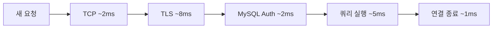
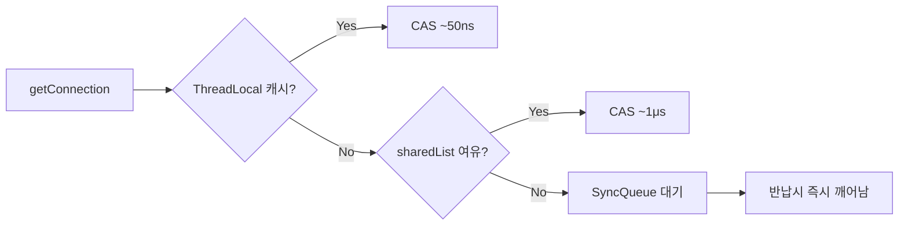
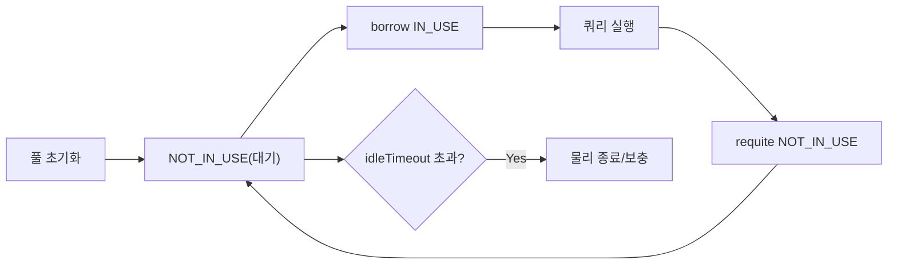
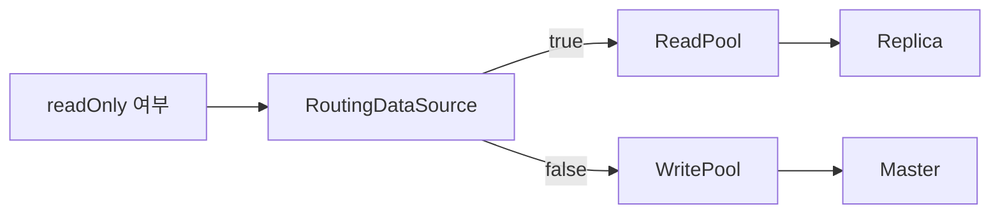

"커넥션 풀 쓰면 빠르죠." — 이 한 줄은 면접에서 0점이다. 왜 커넥션 하나를 여는 데 10ms가 걸리는지, HikariCP가 내부에서 어떤 자료구조로 락 없이 커넥션을 건네는지, 풀 사이즈를 왜 스레드 수로 맞추면 안 되는지를 설명할 수 있어야 한다. 이 글은 소스 코드 수준까지 파고든다.

> **비유**: DB 커넥션은 공항 수속 카운터와 같다. 탑승객(요청)이 올 때마다 공항 건물을 새로 짓고(매번 TCP 연결), 여권 심사 라인을 새로 설치하고(TLS), 직원을 새로 고용하는(DB 인증) 것이 "풀 없는 연결"이다. 커넥션 풀은 카운터를 상시 운영하는 것이다. 탑승객은 열린 카운터에 바로 선다. 비행기가 뜨면(쿼리 완료) 직원은 카운터를 닫지 않고 다음 탑승객을 기다린다.

---

## 1. 왜 커넥션을 재사용해야 하는가

### TCP 3-way Handshake + TLS + MySQL 인증의 실제 비용

커넥션 하나를 처음 열 때 무슨 일이 일어나는지 네트워크 레이어부터 추적한다.

```
[클라이언트]                       [MySQL 서버]

── TCP 3-way Handshake ──────────────────────────
  SYN        →
             ←  SYN-ACK
  ACK        →
                                   (약 1 RTT, 평균 0.5~2ms)

── TLS 1.2 Handshake ────────────────────────────
  ClientHello →
              ← ServerHello + Certificate
  ClientKeyExchange + ChangeCipherSpec →
              ← Finished
                                   (약 2 RTT, 평균 5~10ms)
              ※ TLS 1.3은 1 RTT로 줄었지만 여전히 존재

── MySQL 핸드셰이크 프로토콜 ──────────────────────
  Server → Client : Initial Handshake Packet
                    (서버 버전, 랜덤 salt, 지원 기능 플래그)
  Client → Server : Handshake Response Packet
                    (사용자명, SHA1(password XOR salt))
  Server → Client : OK_Packet 또는 ERR_Packet
                                   (약 1 RTT, 평균 1~3ms)

── 세션 초기화 ──────────────────────────────────
  SET character_set_client = utf8mb4
  SET character_set_connection = utf8mb4
  SET character_set_results = utf8mb4
  SET time_zone = '+09:00'
                                   (약 1~2ms)

총합: 약 8~17ms (같은 데이터센터 내, LAN 1ms RTT 기준)
     약 30~100ms (클라우드 리전 간, RTT 10~30ms 기준)
```

이 비용이 왜 치명적인가.

```
TPS 1,000 + 평균 응답시간 목표 50ms + 매번 새 커넥션:

커넥션 생성 비용 = 10ms (낙관적)
실제 쿼리 실행 = 5ms
세션 정리/종료 = 1ms
합계 = 16ms → 쿼리보다 연결 비용이 3배

초당 1,000개 커넥션 생성 시 DB 서버가 받는 부하:
  - accept() 시스템 콜 × 1,000
  - SSL 핸드셰이크 × 1,000 (RSA 연산 포함)
  - 인증 쿼리 (mysql.user 테이블 조회) × 1,000
  - 세션 메모리 할당/해제 × 1,000 (스레드당 256KB~1MB)

결론: DB 서버 CPU의 60~80%가 연결 처리에 소진되어
      실제 쿼리를 처리할 여력이 없어진다.
```



커넥션 풀은 B~D 단계를 최초 한 번만 수행하고 이후 요청에서 재사용한다. `getConnection()` 비용이 **10ms → 0.01ms** 미만으로 1,000배 개선된다.

---

## 2. HikariCP 내부 구조 — 왜 가장 빠른가

### 2-1. ConcurrentBag: 락 없는 커넥션 대여의 비밀

HikariCP의 핵심은 `com.zaxxer.hikari.util.ConcurrentBag`이다. 일반적인 커넥션 풀은 `LinkedBlockingQueue` 같은 자료구조를 쓰는데, 여기에는 구조적 문제가 있다.

```
LinkedBlockingQueue 문제:
  1. offer() / poll() 시 ReentrantLock 획득 필요
  2. 고부하에서 스레드들이 락 경쟁 → 컨텍스트 스위칭 폭발
  3. 락 홀더가 OS에 의해 선점되면 모든 대기 스레드가 블록

ConcurrentBag 설계 목표:
  → 같은 스레드가 돌려준 커넥션을 우선 재사용
  → CAS(Compare-And-Swap) 연산으로 락 없는 상태 변경
  → 락이 필요한 경우는 정말로 대기해야 할 때만
```

ConcurrentBag의 내부 구조를 단계별로 해부한다.

```java
// ConcurrentBag 핵심 코드 (단순화)
public class ConcurrentBag<T extends IConcurrentBagEntry> {

    // ① 전체 커넥션 목록 (모든 스레드가 공유)
    private final CopyOnWriteArrayList<T> sharedList;

    // ② 스레드별 커넥션 캐시 (ThreadLocal — 핵심!)
    private final ThreadLocal<List<Object>> threadList;

    // ③ 대기 중인 스레드에게 알림
    private final SynchronousQueue<T> handoffQueue;

    // ④ 커넥션 대기자 수 (AtomicInteger)
    private final AtomicInteger waiters;

    public T borrow(long timeout, TimeUnit timeUnit) {
        // ─── 1단계: ThreadLocal 캐시 먼저 확인 ─────────────────
        final List<Object> list = threadList.get();
        for (int i = list.size() - 1; i >= 0; i--) {
            final Object entry = list.remove(i);
            final T bagEntry = weakThreadLocals ? ((WeakReference<T>) entry).get() : (T) entry;
            // STATE_NOT_IN_USE → STATE_IN_USE 로 CAS 변경
            if (bagEntry != null
                && bagEntry.compareAndSet(STATE_NOT_IN_USE, STATE_IN_USE)) {
                return bagEntry; // 락 없이 즉시 반환!
            }
        }

        // ─── 2단계: 전체 sharedList 순회 ───────────────────────
        final int waiting = waiters.incrementAndGet();
        try {
            for (T bagEntry : sharedList) {
                if (bagEntry.compareAndSet(STATE_NOT_IN_USE, STATE_IN_USE)) {
                    // 다른 대기자가 있으면 새 커넥션 생성 시도 신호
                    if (waiting > 1) {
                        listener.addBagItem(waiting - 1);
                    }
                    return bagEntry;
                }
            }
            // ─── 3단계: 실제로 대기 (마지막 수단) ─────────────────
            listener.addBagItem(waiting);
            timeout = timeUnit.toNanos(timeout);
            do {
                final long start = currentTime();
                // SynchronousQueue: 다른 스레드가 반납하면 즉시 깨어남
                final T bagEntry = handoffQueue.poll(timeout, NANOSECONDS);
                if (bagEntry == null
                    || bagEntry.compareAndSet(STATE_NOT_IN_USE, STATE_IN_USE)) {
                    return bagEntry;
                }
                timeout -= elapsedNanos(start);
            } while (timeout > 10_000L);
            return null;
        } finally {
            waiters.decrementAndGet();
        }
    }

    public void requite(T bagEntry) {
        // STATE_IN_USE → STATE_NOT_IN_USE
        bagEntry.setState(STATE_NOT_IN_USE);

        // 대기 스레드가 있으면 handoffQueue로 직접 전달
        for (int i = 0; waiters.get() > 0; i++) {
            if (bagEntry.getState() != STATE_NOT_IN_USE
                || handoffQueue.offer(bagEntry)) {
                return;
            } else if ((i & 0xff) == 0xff) {
                parkNanos(MICROSECONDS.toNanos(10));
            } else {
                Thread.yield();
            }
        }

        // 대기자 없으면 ThreadLocal에 저장 (다음에 이 스레드가 재사용)
        final List<Object> threadLocalList = threadList.get();
        if (threadLocalList.size() < 50) {
            threadLocalList.add(weakThreadLocals
                ? new WeakReference<>(bagEntry) : bagEntry);
        }
    }
}
```

이 설계가 주는 이점을 정량화하면 다음과 같다.

```
ThreadLocal 히트 시나리오 (가장 일반적):
  - http-nio-8080-exec-1 스레드가 커넥션 A를 반납
  - 같은 스레드의 다음 요청 → ThreadLocal에서 A를 꺼냄
  - CAS 한 번만 수행 → ~50ns

sharedList 순회 시나리오:
  - CAS 실패 가능성 있지만 락 없음
  - 최악 N번 CAS 시도 → 여전히 수 μs 수준

SynchronousQueue 대기 시나리오:
  - 실제로 커넥션이 없을 때만 도달
  - 반납 즉시 대기 스레드에게 직접 전달 (Exchanger 패턴)
```



### 2-2. FastList — 범위 검사 없는 ArrayList

HikariCP는 `Statement`와 `ResultSet`을 추적하기 위해 `FastList`를 사용한다. Java의 `ArrayList`는 `get(index)` 시 `Objects.checkIndex()`로 범위 검사를 수행하는데, 이 검사가 HotSpot JIT의 인라이닝을 방해한다.

```java
// FastList 핵심 — 범위 검사 제거
public final class FastList<T> implements List<T> {

    private Object[] elementData;
    private int size;

    // 표준 ArrayList: Objects.checkIndex(index, size) 호출
    // FastList: 검사 없이 직접 접근
    @Override
    @SuppressWarnings("unchecked")
    public T get(int index) {
        return (T) elementData[index]; // bounds check 없음
    }

    // remove(Object) — 역순 탐색 (Statement는 보통 역순으로 닫힘)
    @Override
    public boolean remove(Object element) {
        for (int i = size - 1; i >= 0; i--) {
            if (element == elementData[i]) { // equals() 아닌 == 비교
                final int numMoved = size - i - 1;
                if (numMoved > 0) {
                    System.arraycopy(elementData, i + 1, elementData, i, numMoved);
                }
                elementData[--size] = null;
                return true;
            }
        }
        return false;
    }
}
```

`==` 비교 (참조 동등성)를 쓰는 이유는 `Statement` 객체는 동일 인스턴스를 다시 닫으므로 `equals()`의 오버헤드가 불필요하기 때문이다.

### 2-3. ProxyConnection — 진짜 close()를 가로채는 방법

애플리케이션이 `connection.close()`를 호출해도 물리적 소켓이 닫히지 않는 이유는 HikariCP가 `Connection` 인터페이스를 래핑한 `ProxyConnection`을 반환하기 때문이다.

```java
// HikariCP 소스 중 ProxyConnection
public abstract class ProxyConnection implements Connection {

    protected final ProxyFactory proxyFactory;
    protected final PoolEntry poolEntry; // 실제 커넥션 보유

    // ─── close() 오버라이드 ─────────────────────────────────────
    @Override
    public final void close() throws SQLException {
        // ① Statement/ResultSet 열린 것 모두 닫기
        closeStatements();

        // ② 풀에 반납 (소켓 종료 안 함)
        if (delegate != ClosedConnection.CLOSED_CONNECTION) {
            leakTask.cancel();              // 누수 감지 타이머 취소
            try {
                if (isCommitStateDirty && !isAutoCommit) {
                    // 커밋/롤백 안 한 채로 반납 시도 → 강제 롤백
                    delegate.rollback();
                    lastAccess = currentTime();
                }
            } finally {
                delegate = ClosedConnection.CLOSED_CONNECTION;
                // PoolEntry를 통해 ConcurrentBag.requite() 호출
                poolEntry.recycle(lastAccess);
            }
        }
    }

    // ─── 실제 커넥션 접근은 delegate로 위임 ───────────────────
    @Override
    public PreparedStatement prepareStatement(String sql) throws SQLException {
        return PROXY_FACTORY.getProxyPreparedStatement(
            this,
            delegate.prepareStatement(sql) // 실제 MySQL Connection에 위임
        );
    }
}
```

`ProxyConnection`은 Javassist/ByteBuddy 없이 순수 Java로 생성된다. 이것이 DBCP2(리플렉션 프록시 사용)보다 빠른 또 다른 이유다.

### 2-4. 커넥션 생명주기 전체 흐름



각 상태 전환에서 HikariCP가 하는 일을 구체적으로 설명한다.

```
STATE_NOT_IN_USE → STATE_IN_USE (borrow):
  1. ConcurrentBag.borrow() 호출
  2. keepalive 검사 (keepaliveTime 경과 시 isValid() 호출)
  3. maxLifetime 검사 (초과 시 evict 후 새 커넥션 반환)
  4. ProxyConnection 래퍼 생성
  5. leakDetectionThreshold 타이머 시작

STATE_IN_USE → STATE_NOT_IN_USE (requite):
  1. ProxyConnection.close() 감지
  2. 미커밋 트랜잭션이면 rollback()
  3. lastAccess 타임스탬프 기록
  4. ConcurrentBag.requite() 호출
  5. 대기 스레드 있으면 handoffQueue로 직접 전달

maxLifetime 초과 시:
  1. ScheduledExecutorService가 주기적으로 검사
  2. maxLifetime에 ±2.5% jitter 추가 (모든 커넥션이 동시에 교체되는 것 방지)
  3. 해당 커넥션을 evict 상태로 표시
  4. 반납 시 풀에 돌아오지 않고 물리 종료
  5. 새 커넥션 생성해 풀에 추가
```

---

## 3. HikariCP 설정 완전 가이드

### 3-1. Spring Boot YAML 설정

```yaml
spring:
  datasource:
    url: jdbc:mysql://localhost:3306/mydb
           ?useSSL=true
           &requireSSL=true
           &serverTimezone=Asia/Seoul
           &characterEncoding=UTF-8
           &useUnicode=true
           &rewriteBatchedStatements=true  # batch insert 최적화
           &cachePrepStmts=true            # PreparedStatement 캐싱
           &prepStmtCacheSize=250
           &prepStmtCacheSqlLimit=2048
    username: ${DB_USERNAME}
    password: ${DB_PASSWORD}
    driver-class-name: com.mysql.cj.jdbc.Driver

    hikari:
      # ── 풀 크기 ──────────────────────────────────────────────
      maximum-pool-size: 10
      # minimum-idle을 maximum-pool-size와 같게 → 고정 크기 풀
      # HikariCP 공식 권장: 가변 풀은 idle 커넥션 추가/제거 비용이 발생
      minimum-idle: 10

      # ── 타임아웃 ──────────────────────────────────────────────
      connection-timeout: 3000     # 3초 — 기본 30초는 너무 길다
                                   # 풀 고갈 시 30초 대기는 연쇄 장애 유발
      idle-timeout: 600000         # 10분 — minimum-idle과 같으면 무의미
      max-lifetime: 1800000        # 30분 — DB wait_timeout보다 반드시 짧게
                                   # AWS NLB idle timeout(350s)보다도 짧게

      keepalive-time: 30000        # 30초마다 유휴 커넥션 ping
                                   # NLB/방화벽의 idle 연결 끊기 방어

      # ── 유효성 검사 ───────────────────────────────────────────
      # connection-test-query: SELECT 1  ← JDBC4 이전 드라이버용
      # MySQL Connector/J 5.1.15+ 는 JDBC4 지원 → isValid() 자동 사용
      # isValid()는 SQL 파싱/실행 없이 드라이버 내부에서 처리 → 더 빠름
      validation-timeout: 5000

      # ── 누수 감지 ─────────────────────────────────────────────
      leak-detection-threshold: 5000   # 5초 이상 미반납 시 스택트레이스 로그
                                       # 0이면 비활성화 (운영에서는 필수 활성화)

      # ── 식별 및 초기화 ────────────────────────────────────────
      pool-name: HikariPool-OrderService  # Micrometer 메트릭 태그로 사용됨
      connection-init-sql: |
        SET NAMES utf8mb4 COLLATE utf8mb4_unicode_ci
      # schema: mydb  # 초기 USE mydb

      # ── 읽기 전용 최적화 ──────────────────────────────────────
      # read-only: false  # AbstractRoutingDataSource로 제어할 때는 false
```

### 3-2. Java Config (멀티 DataSource 필요 시)

```java
@Configuration
public class HikariConfig {

    @Bean
    @Primary
    public DataSource dataSource() {
        HikariConfig config = new HikariConfig();
        config.setJdbcUrl("jdbc:mysql://localhost:3306/mydb");
        config.setUsername("user");
        config.setPassword("pass");

        // 풀 설정
        config.setMaximumPoolSize(10);
        config.setMinimumIdle(10);
        config.setConnectionTimeout(3_000);
        config.setMaxLifetime(1_800_000);
        config.setKeepaliveTime(30_000);
        config.setLeakDetectionThreshold(5_000);
        config.setPoolName("HikariPool-Main");

        // PreparedStatement 캐싱 (커넥션 수준)
        config.addDataSourceProperty("cachePrepStmts", "true");
        config.addDataSourceProperty("prepStmtCacheSize", "250");
        config.addDataSourceProperty("prepStmtCacheSqlLimit", "2048");
        config.addDataSourceProperty("useServerPrepStmts", "true");  // 서버사이드 PS

        return new HikariDataSource(config);
    }
}
```

---

## 4. 풀 사이즈 결정 — "클수록 좋다"는 틀렸다

### 4-1. 공식 유도 과정

HikariCP 작성자 Brett Wooldridge의 논문 "About Pool Sizing"을 추적한다.

```
핵심 통찰: 동시에 의미있게 실행될 수 있는 쿼리 수는
          DB 서버의 CPU 코어 수로 상한이 결정된다.

DB 서버 CPU = 8코어라면:
  동시에 실행 가능한 쿼리 = 8개
  나머지는 OS 스케줄러 큐에서 대기 (CPU 경쟁)

그런데 쿼리는 항상 CPU만 쓰지 않는다:
  - 디스크 I/O 대기 (HDD: 수 ms, SSD: 수십~수백 μs)
  - 네트워크 I/O 대기 (클라이언트에 결과 전송)
  - 락 대기 (InnoDB row lock)

I/O 대기 중에는 CPU가 놀고 있다 → 다른 쿼리가 CPU를 쓸 수 있다!

결론:
  최적 풀 크기 = (CPU 코어 수 × 2) + 유효 디스크 스핀들 수

  × 2 이유: I/O 대기 시간 동안 다른 커넥션이 CPU 사용 가능
  + 스핀들: HDD는 seek time(5~10ms)이 길어 더 많은 동시 I/O 가능
            SSD는 seek time이 거의 없어 스핀들 수 = 1로 간주
```

### 4-2. 반직관적 진실: 풀이 클수록 처리량이 감소할 수 있다

```
실험: DB 서버 8코어, 커넥션 수별 처리량 (TPS)

커넥션  5개 → TPS 320  (CPU 활용 낮음)
커넥션 10개 → TPS 480  (최적 근처)
커넥션 17개 → TPS 490  (최적 - 이론값 (8*2)+1)
커넥션 50개 → TPS 460  (컨텍스트 스위칭 오버헤드 시작)
커넥션 100개 → TPS 380 (경쟁 폭발)
커넥션 200개 → TPS 200 (OS 스케줄러 포화)

원인 분석 (커넥션 과다 시):
  1. CPU 컨텍스트 스위칭: 200 스레드 → 200 PCB 관리
     → L1/L2 캐시 반복 무효화 → 캐시 미스 폭발
  2. InnoDB 버퍼풀 경쟁: 동시 접근자 증가 → mutex 경쟁
  3. 네트워크 버퍼: 소켓 버퍼가 커넥션 수에 비례해 메모리 소비
  4. MySQL thread cache: max_connections 초과 시 thread 재생성 비용
```


### 4-3. 실전 계산 예시

```java
/**
 * Little's Law 기반 계산:
 * N = λ × W
 * N: 필요 커넥션 수
 * λ: 초당 요청 수 (TPS)
 * W: 평균 커넥션 보유 시간 (초)
 */
public class PoolSizeCalculator {

    public static int calculate(int targetTps, int avgQueryMs, int dbCpuCores) {
        // Little's Law
        double littleLaw = targetTps * (avgQueryMs / 1000.0);

        // HikariCP 공식 (SSD 기준 spindle=1)
        int hikariFormula = (dbCpuCores * 2) + 1;

        // 두 값 중 작은 것을 시작점으로
        // (큰 것은 반드시 부하 테스트로 검증)
        return (int) Math.min(littleLaw, hikariFormula);
    }

    public static void main(String[] args) {
        // 시나리오: TPS=500, 평균 쿼리 20ms, DB 8코어
        int poolSize = calculate(500, 20, 8);
        // Little's Law: 500 × 0.02 = 10
        // HikariCP 공식: (8×2)+1 = 17
        // → 10 (보수적 시작, 부하 테스트 후 조정)
        System.out.println("권장 풀 크기: " + poolSize);
    }
}
```

---

## 5. 커넥션 유효성 검사 — connectionTestQuery vs isValid()

### 5-1. connectionTestQuery의 문제

```yaml
# 나쁜 설정 (JDBC4 드라이버에서)
hikari:
  connection-test-query: SELECT 1
```

이 설정이 왜 느린지를 MySQL 실행 경로로 추적한다.

```
SELECT 1 실행 경로:
  1. 네트워크: 클라이언트 → MySQL 서버로 패킷 전송
  2. MySQL 파서: "SELECT 1" 렉싱/파싱 → AST 생성
  3. 옵티마이저: 실행 계획 수립 (trivial하지만 단계 존재)
  4. 실행 엔진: 상수 평가 → "1" 반환
  5. 네트워크: 결과 패킷 클라이언트로 전송

총 소요: 1~5ms (RTT 포함)
커넥션 획득 시마다 실행 → 초당 1,000 TPS면 초당 1,000회 SELECT 1
```

### 5-2. isValid()가 더 나은 이유

```java
// MySQL Connector/J의 isValid() 구현 (단순화)
@Override
public boolean isValid(int timeout) throws SQLException {
    if (isClosed()) return false;

    try {
        // JDBC4부터 드라이버가 자체 ping 메커니즘 제공
        // MySQL의 경우 COM_PING 패킷 사용
        pingInternal(true, timeout * 1000);
        return true;
    } catch (Throwable t) {
        return false;
    }
}

// COM_PING: MySQL 바이너리 프로토콜의 경량 핑
// 0x0e 커맨드 바이트 하나만 전송
// MySQL 서버: 파싱/옵티마이징 없이 OK_Packet 즉시 반환
// 소요 시간: 약 0.1~0.5ms (SELECT 1의 1/10)
```

HikariCP는 JDBC4 호환 드라이버(`Connection.isValid()` 지원)가 있으면 자동으로 `isValid()`를 사용하고 `connection-test-query`는 무시한다. MySQL Connector/J 5.1.15 이상은 JDBC4 호환이므로 `connection-test-query` 설정 자체가 불필요하다.

```java
// HikariCP 내부 유효성 검사 로직
boolean isConnectionAlive(final Connection connection) {
    try {
        setNetworkTimeout(connection, validationTimeout);
        final int validationSeconds = (int) Math.max(1L, MILLISECONDS.toSeconds(validationTimeout));

        if (isUseJdbc4Validation) {
            // JDBC4: isValid() 사용 (COM_PING)
            return connection.isValid(validationSeconds);
        }

        // JDBC4 미지원 시 connectionTestQuery 실행
        try (Statement statement = connection.createStatement()) {
            if (isNetworkTimeoutSupported != TRUE) {
                setQueryTimeout(statement, validationSeconds);
            }
            statement.execute(config.getConnectionTestQuery());
        }
        return true;
    } catch (Exception e) {
        lastConnectionFailure.set(e);
        return false;
    }
}
```

---

## 6. 커넥션 풀 구현체 비교 — 왜 HikariCP가 이겼나

### 6-1. 아키텍처 비교

```
┌─────────────────────────────────────────────────────────────┐
│                    DBCP2 (Apache)                           │
│  - GenericObjectPool 기반 (범용 오브젝트 풀)                  │
│  - AbandonedObjectPool로 누수 감지 (별도 스캔 스레드)          │
│  - 커넥션 대여: LinkedBlockingDeque + ReentrantLock           │
│  - 검증: LIFO 순서 (가장 최근 반납된 것 먼저)                  │
│  - 오버헤드: 리플렉션 기반 Statement 추적                     │
│  - 장점: 성숙도, 안정성, 검증된 이력                          │
│  - 단점: 고부하에서 락 경쟁, 리플렉션 비용                     │
├─────────────────────────────────────────────────────────────┤
│                 Tomcat JDBC Pool                             │
│  - Tomcat에서 DBCP의 고부하 문제 해결 목적으로 개발            │
│  - FairBlockingQueue: 공정 락 (FIFO 보장)                    │
│  - 비동기 커넥션 생성 지원                                    │
│  - Interceptor 체인으로 확장 가능                             │
│  - 장점: Tomcat과의 통합, 비동기 지원                         │
│  - 단점: HikariCP보다 여전히 느림, 설정 복잡                  │
├─────────────────────────────────────────────────────────────┤
│                    HikariCP                                  │
│  - ConcurrentBag: ThreadLocal + CAS (락 최소화)              │
│  - FastList: 범위 검사 없는 Statement 추적                    │
│  - ProxyConnection: 순수 Java 프록시 (리플렉션 없음)           │
│  - 커넥션 생성: 전용 스레드풀에서 비동기                       │
│  - 유휴 커넥션 교체에 jitter 추가 (동시 교체 방지)             │
│  - 장점: 업계 최고 성능, Spring Boot 기본 채택                │
│  - 단점: 설정 옵션이 적음 (의도적 단순화)                     │
└─────────────────────────────────────────────────────────────┘
```

### 6-2. 벤치마크 데이터

```
HikariCP 공식 벤치마크 (JMH, 32스레드):
Operation      HikariCP   DBCP2    Tomcat JDBC
getConnection  13μs       34μs     55μs
close          7μs        12μs     18μs
Statement      21μs       47μs     88μs

HikariCP이 2~4배 빠른 이유 요약:
  1. ConcurrentBag의 ThreadLocal 히트 → 락 없는 경로
  2. FastList → 범위 검사 JIT 인라이닝 방해 제거
  3. ProxyConnection → 리플렉션 없는 직접 위임
  4. 코드 전체에 @SuppressWarnings("unchecked") 최적화
     (제네릭 캐스팅 오버헤드 제거)
```

---

## 7. Spring 트랜잭션과 커넥션 — ThreadLocal 바인딩

### 7-1. 하나의 트랜잭션 = 하나의 커넥션이 보장되는 방법

`@Transactional`이 붙은 메서드를 호출하면 Spring은 어떻게 같은 커넥션을 유지하는가.

```java
// Spring의 DataSourceTransactionManager.doBegin() 핵심 로직
@Override
protected void doBegin(Object transaction, TransactionDefinition definition) {
    DataSourceTransactionObject txObject = (DataSourceTransactionObject) transaction;
    Connection con = null;

    try {
        if (!txObject.hasConnectionHolder()
            || txObject.getConnectionHolder().isSynchronizedWithTransaction()) {

            // ① 풀에서 커넥션 획득
            Connection newCon = obtainDataSource().getConnection();

            // ② ThreadLocal에 바인딩
            // TransactionSynchronizationManager는 내부적으로
            // Map<DataSource, ConnectionHolder> 를 ThreadLocal로 보관
            txObject.setConnectionHolder(new ConnectionHolder(newCon), true);
        }

        // ③ 트랜잭션 설정
        con = txObject.getConnectionHolder().getConnection();
        Integer previousIsolationLevel = DataSourceUtils.prepareConnectionForTransaction(con, definition);
        if (definition.isReadOnly()) {
            con.setReadOnly(true);  // AbstractRoutingDataSource 라우팅 힌트
        }
        con.setAutoCommit(false);  // 트랜잭션 시작

        // ④ TransactionSynchronizationManager에 등록
        if (txObject.isNewConnectionHolder()) {
            TransactionSynchronizationManager.bindResource(
                obtainDataSource(),
                txObject.getConnectionHolder()  // DataSource → ConnectionHolder 매핑
            );
        }
    } catch (Throwable ex) {
        // 실패 시 커넥션 즉시 반납
        releaseConnection(con, obtainDataSource());
        throw ex;
    }
}
```

```java
// DataSourceUtils.getConnection() — 항상 같은 커넥션 반환
public static Connection getConnection(DataSource dataSource) throws CannotGetJdbcConnectionException {
    try {
        return doGetConnection(dataSource);
    } catch (SQLException ex) {
        throw new CannotGetJdbcConnectionException("Failed to obtain JDBC Connection", ex);
    }
}

public static Connection doGetConnection(DataSource dataSource) throws SQLException {
    // ① ThreadLocal에서 현재 스레드의 커넥션 조회
    ConnectionHolder conHolder = (ConnectionHolder)
        TransactionSynchronizationManager.getResource(dataSource);

    if (conHolder != null && (conHolder.hasConnection()
        || conHolder.isSynchronizedWithTransaction())) {
        // ② 이미 바인딩된 커넥션 있으면 재사용 (새로 풀에서 안 꺼냄)
        conHolder.requested();
        if (!conHolder.hasConnection()) {
            logger.debug("Fetching resumed JDBC Connection from DataSource");
            conHolder.setConnection(fetchConnection(dataSource));
        }
        return conHolder.getConnection();
    }

    // ③ ThreadLocal에 없으면 풀에서 새로 획득
    logger.debug("Fetching JDBC Connection from DataSource");
    Connection con = fetchConnection(dataSource);

    if (TransactionSynchronizationManager.isSynchronizationActive()) {
        // 트랜잭션 동기화 활성화 시 ThreadLocal에 등록
        ConnectionHolder holderToUse = conHolder;
        if (holderToUse == null) {
            holderToUse = new ConnectionHolder(con);
        } else {
            holderToUse.setConnection(con);
        }
        holderToUse.requested();
        TransactionSynchronizationManager.registerSynchronization(
            new ConnectionSynchronization(holderToUse, dataSource));
        holderToUse.setSynchronizedWithTransaction(true);
        if (holderToUse != conHolder) {
            TransactionSynchronizationManager.bindResource(dataSource, holderToUse);
        }
    }
    return con;
}
```


이 구조 덕분에 같은 트랜잭션 내에서 여러 Repository 메서드를 호출해도 **항상 동일한 커넥션**을 사용한다. 커넥션이 두 개가 생기면 BEGIN한 트랜잭션이 다른 커넥션에는 적용되지 않아 ACID가 깨진다.

### 7-2. PROPAGATION별 커넥션 사용 방식

```java
@Service
public class OrderService {

    @Transactional  // 커넥션 A 획득 → ThreadLocal 바인딩
    public void createOrder(OrderRequest req) {
        orderRepository.save(new Order(req));  // 커넥션 A 사용

        // REQUIRED (기본): 기존 트랜잭션 참여
        // → 동일 커넥션 A 사용, 별도 커넥션 없음
        inventoryService.decrease(req.getProductId());

        // REQUIRES_NEW: 새 트랜잭션 시작
        // → 커넥션 A를 잠시 suspend, 커넥션 B 획득
        // → 최소 풀 크기 = 동시 중첩 트랜잭션 수 이상이어야 함!
        auditService.log(req);  // 내부에 REQUIRES_NEW라면
    }
}

// REQUIRES_NEW 시 커넥션 흐름:
// 1. createOrder: 커넥션 A 획득 (ThreadLocal[DataSource] = A)
// 2. auditService.log 진입 시:
//    a. 기존 커넥션 A suspend (ThreadLocal에서 제거, 별도 저장)
//    b. 커넥션 B 획득 (ThreadLocal[DataSource] = B)
//    c. 새 트랜잭션 BEGIN
// 3. auditService.log 완료 시:
//    a. 커넥션 B commit/rollback
//    b. 커넥션 B 풀에 반납
//    c. 커넥션 A restore (ThreadLocal[DataSource] = A)
// 4. createOrder 완료: 커넥션 A commit → 풀에 반납
//
// 풀 크기가 1이면? → B 획득 불가 → ConnectionTimeout → 데드락!
```

---

## 8. OSIV (Open Session In View) — 보이지 않는 커넥션 낭비

### 8-1. OSIV가 켜지면 커넥션이 언제 반납되는가

```yaml
# application.yml 기본값
spring:
  jpa:
    open-in-view: true  # ← Spring Boot 기본값 (경고 로그 발생)
```

```
OSIV ON (open-in-view: true):
  ┌─ HTTP 요청 시작 ─────────────────────────────────────────┐
  │                                                          │
  │  OpenEntityManagerInViewInterceptor.preHandle()          │
  │    → EntityManager 생성                                  │
  │    → 커넥션 풀에서 커넥션 획득 ← 여기서 이미 획득!        │
  │                                                          │
  │  Controller → Service (@Transactional)                   │
  │    → 실제 DB 쿼리 수행                                   │
  │                                                          │
  │  Service 종료 → 트랜잭션 종료                             │
  │    → 커넥션은 아직 반납 안됨!                             │
  │                                                          │
  │  Controller → View/JSON 직렬화                           │
  │    → Lazy Loading 발생 가능 (EntityManager 열려있음)      │
  │    → 이 시점에도 커넥션 점유 중                           │
  │                                                          │
  │  OpenEntityManagerInViewInterceptor.afterCompletion()    │
  │    → 커넥션 반납 ← 응답 완료 후에야 반납                  │
  └─ HTTP 응답 완료 ─────────────────────────────────────────┘
```

```
OSIV OFF (open-in-view: false):
  ┌─ HTTP 요청 시작 ────────────────────────────────────────┐
  │  Controller → Service (@Transactional)                  │
  │    → 커넥션 획득 (풀에서)                               │
  │    → DB 쿼리 수행                                       │
  │    → 트랜잭션 완료 → 커넥션 즉시 반납 ← 빠른 반납!      │
  │  Controller → View/JSON 직렬화                          │
  │    → Lazy Loading 불가 (LazyInitializationException)    │
  │    → DTO로 미리 변환 필요                               │
  └─ HTTP 응답 완료 ────────────────────────────────────────┘
```

### 8-2. OSIV와 풀 고갈의 관계

```
시나리오: TPS 100, 평균 응답시간 500ms, 풀 크기 10

OSIV ON:
  커넥션 점유 시간 = HTTP 응답 완료까지 = 500ms
  필요 커넥션 = 100 TPS × 0.5s = 50개
  풀 크기 10 → 즉시 고갈! ConnectionTimeout 폭발

OSIV OFF:
  커넥션 점유 시간 = 트랜잭션 완료까지 = 50ms (쿼리만)
  필요 커넥션 = 100 TPS × 0.05s = 5개
  풀 크기 10 → 여유 있음

결론: OSIV ON + 트래픽 증가 = 풀 고갈의 전형적 패턴
     운영 환경에서는 open-in-view: false 권장
```

```java
// OSIV OFF 시 대응: Service에서 DTO 변환 완료
@Service
@Transactional(readOnly = true)
public class OrderQueryService {

    public OrderDetailDto getOrderDetail(Long orderId) {
        Order order = orderRepository.findById(orderId)
            .orElseThrow(OrderNotFoundException::new);

        // 트랜잭션 내에서 Lazy Loading 모두 해결
        List<OrderItemDto> items = order.getOrderItems().stream()
            .map(item -> new OrderItemDto(
                item.getProduct().getName(),  // Lazy Loading 여기서 해결
                item.getQuantity(),
                item.getPrice()
            ))
            .collect(toList());

        return new OrderDetailDto(order.getId(), order.getStatus(), items);
        // 이 시점에 트랜잭션 종료 → 커넥션 즉시 반납
    }
}
// Controller에서는 DTO만 받아 직렬화 → Lazy Loading 없음
```

---

## 9. 커넥션 풀 장애 패턴 완전 해부

### 9-1. 풀 고갈 (Pool Exhaustion)


```java
// 나쁜 패턴: 트랜잭션 안에서 외부 HTTP 호출
@Transactional
public OrderResult createOrder(OrderRequest request) {
    Order order = orderRepository.save(new Order(request));
    // ← 커넥션 점유 중

    // 외부 결제 API: 수백 ms ~ 수 초 소요
    // 이 시간 동안 커넥션을 놓지 않음
    PaymentResult payment = paymentClient.charge(request.getAmount());

    order.complete(payment);
    return OrderResult.from(order);
    // ← 여기서야 커넥션 반납
}

// 좋은 패턴: 외부 호출 분리
public OrderResult createOrder(OrderRequest request) {
    // 1단계: 외부 호출 (커넥션 없음)
    PaymentResult payment = paymentClient.charge(request.getAmount());

    // 2단계: DB 작업만 트랜잭션 안에서
    return saveOrderWithPayment(request, payment);
}

@Transactional
public OrderResult saveOrderWithPayment(OrderRequest req, PaymentResult payment) {
    Order order = orderRepository.save(new Order(req));
    order.complete(payment);
    return OrderResult.from(order);
    // 커넥션 보유 시간 = 수 ms (INSERT + UPDATE 만)
}
```

### 9-2. 커넥션 누수 (Connection Leak)

```java
// 누수 패턴 1: finally 블록 누락
public void badQuery() throws SQLException {
    Connection conn = dataSource.getConnection();
    Statement stmt = conn.createStatement();
    ResultSet rs = stmt.executeQuery("SELECT * FROM orders WHERE amount > 10000");
    processResults(rs);
    conn.close(); // 예외 발생 시 실행 안 됨
}

// 누수 패턴 2: 예외 분기에서 누락
public void worseQuery() throws SQLException {
    Connection conn = dataSource.getConnection();
    try {
        // 특정 조건에서 예외 발생
        if (someCondition()) throw new BusinessException("오류");
        conn.close(); // 예외 시 실행 안 됨
    } catch (BusinessException e) {
        // conn.close() 여기서도 없음 → 누수!
        throw e;
    }
}

// 올바른 패턴: try-with-resources
public void goodQuery() throws SQLException {
    try (Connection conn = dataSource.getConnection();
         Statement stmt = conn.createStatement();
         ResultSet rs = stmt.executeQuery("SELECT * FROM orders WHERE amount > 10000")) {
        processResults(rs);
    }
    // AutoCloseable: 예외 발생 시에도 close() 자동 호출
    // close() 순서: rs → stmt → conn (역순)
}
```

```yaml
# 누수 감지 설정 (필수)
hikari:
  leak-detection-threshold: 5000  # 5초 이상 반납 안된 커넥션 → 스택트레이스 출력
```

```
누수 감지 로그 예시:
2026-05-01 14:32:11 WARN  HikariPool-Main - Connection leak detection triggered
for connection com.mysql.cj.jdbc.ConnectionImpl@3fa1c64 on thread
http-nio-8080-exec-7, stack trace follows

java.lang.Exception: Apparent connection leak detected
    at com.zaxxer.hikari.HikariDataSource.getConnection(HikariDataSource.java:128)
    at com.example.service.OrderService.badQuery(OrderService.java:67)
    at com.example.controller.OrderController.create(OrderController.java:34)
    ...

→ OrderService.java:67 이 누수 발생 지점
```

```java
// 누수 감지가 동작하는 원리
// HikariCP 내부: ProxyLeakTaskFactory
class ProxyLeakTask implements Runnable {

    private final long leakDetectionThreshold;
    private final WeakReference<Connection> connectionRef;
    private final Exception exception; // 커넥션 획득 시점의 스택트레이스

    @Override
    public void run() {
        // leakDetectionThreshold ms 후에 이 태스크가 실행됨
        // 이 시점에도 커넥션이 반납 안됐으면 → 누수로 판단
        Connection connection = connectionRef.get();
        if (connection != null) {
            logger.warn("Connection leak detection triggered for {} ...",
                connection, exception);
        }
    }
}

// getConnection() 시 ScheduledExecutorService에 등록:
// scheduledFuture = executorService.schedule(leakTask, leakDetectionThreshold, ms)
// close() 시: leakTask.cancel() → 정상 반납은 태스크 취소됨
```

### 9-3. REQUIRES_NEW 데드락

```java
// 데드락 시나리오 (maximumPoolSize=1일 때)
@Service
@Transactional  // 커넥션 A 획득
public class OrderService {

    @Autowired
    private AuditService auditService;

    public void createOrder(OrderRequest request) {
        orderRepository.save(new Order(request)); // 커넥션 A 사용

        // AuditService.log()는 REQUIRES_NEW → 커넥션 B 필요
        // 그러나 풀에 커넥션이 없음 → connectionTimeout 대기
        // createOrder는 이 대기가 끝나야 반납 → 영원히 대기
        auditService.log(request);
    }
}

@Service
public class AuditService {
    @Transactional(propagation = Propagation.REQUIRES_NEW)
    public void log(OrderRequest request) {
        auditRepository.save(new AuditLog(request));
    }
}

// 해결: maximumPoolSize >= 중첩 트랜잭션 깊이 + 1
// 또는 REQUIRES_NEW → REQUIRES 변경 (같은 커넥션 사용)
// 또는 비동기 처리 @Async + @Transactional
```

### 9-4. 서서히 죽는 누수 패턴

```
서서히 죽는 누수 타임라인:

09:00 - 배포 완료. 풀 10/10 정상. active=0
        특정 입력값(amount=null)에서 예외 분기 → close() 누락
        해당 요청은 하루 100건 중 5건 정도

12:00 -누적 누수 15건 → active=5 (idle=5)
        모니터링: "정상 범위"로 오판 (active가 오르면 "바쁜 것"으로 보임)

18:00 - 누적 누수 45건 → active=9 (idle=1)
        응답 지연 시작 (커넥션 대기 발생)

21:00 - 누적 누수 60건 → active=10 (idle=0)
        모든 요청 ConnectionTimeout → 전체 장애

재시작 → active=0 → 일시 해소 → 원인 파악 지연 (내일 또 발생)

방어 체계:
  1. leak-detection-threshold: 5000 → 로그에서 코드 라인 즉시 확인
  2. Grafana: hikaricp_connections_active > 8 (80%) → Slack 알림
  3. 통합 테스트: @AfterEach에서 active connection count = 0 검증
  4. 코드 리뷰: try-with-resources 없는 getConnection() → 리뷰 블로킹
```

---

## 10. 커넥션 모니터링 — Micrometer + Grafana

### 10-1. 필수 메트릭 등록

```xml
<!-- pom.xml -->
<dependency>
    <groupId>org.springframework.boot</groupId>
    <artifactId>spring-boot-starter-actuator</artifactId>
</dependency>
<dependency>
    <groupId>io.micrometer</groupId>
    <artifactId>micrometer-registry-prometheus</artifactId>
</dependency>
```

```yaml
management:
  endpoints:
    web:
      exposure:
        include: health, metrics, prometheus
  metrics:
    tags:
      application: ${spring.application.name}
      env: ${spring.profiles.active:local}
    distribution:
      percentiles-histogram:
        hikaricp.connections.acquire: true  # 히스토그램 활성화
```

### 10-2. 핵심 메트릭 해설

```
메트릭명                              설명                  임계값 권장
─────────────────────────────────────────────────────────────────
hikaricp_connections_active          현재 사용 중           >80% → 경고
hikaricp_connections_idle            대기 중               <20% → 경고
hikaricp_connections_pending         대기 스레드 수         >0 → 즉시 경보
hikaricp_connections_timeout_total   획득 타임아웃 횟수     >0 → 긴급
hikaricp_connections_acquire_ms      획득 소요 시간         p99>100ms → 경고
hikaricp_connections_creation_ms     커넥션 생성 시간       (비정상 증가 시)
hikaricp_connections_usage_ms        커넥션 사용 시간       (슬로우 쿼리 지표)
hikaricp_connections_max             최대 풀 크기           (설정값 확인)
```

```java
// 커스텀 모니터링 + 자동 알림
@Component
@Slf4j
public class HikariPoolHealthMonitor {

    private final HikariDataSource dataSource;
    private final MeterRegistry meterRegistry;

    public HikariPoolHealthMonitor(DataSource dataSource, MeterRegistry meterRegistry) {
        // LazyConnectionDataSourceProxy 등 래퍼가 있을 수 있으므로 unwrap
        this.dataSource = unwrapHikari(dataSource);
        this.meterRegistry = meterRegistry;
        registerCustomMetrics();
    }

    private void registerCustomMetrics() {
        // 풀 포화도 게이지 (0.0 ~ 1.0)
        Gauge.builder("hikaricp.pool.saturation",
                this, HikariPoolHealthMonitor::getSaturation)
            .description("HikariCP pool saturation (active/max)")
            .tag("pool", dataSource.getPoolName())
            .register(meterRegistry);
    }

    private double getSaturation() {
        HikariPoolMXBean bean = dataSource.getHikariPoolMXBean();
        int max = dataSource.getMaximumPoolSize();
        return max > 0 ? (double) bean.getActiveConnections() / max : 0;
    }

    @Scheduled(fixedDelay = 10_000)
    public void logPoolStats() {
        HikariPoolMXBean pool = dataSource.getHikariPoolMXBean();
        int active = pool.getActiveConnections();
        int idle = pool.getIdleConnections();
        int pending = pool.getThreadsAwaitingConnection();
        int total = pool.getTotalConnections();
        int max = dataSource.getMaximumPoolSize();

        log.info("[HikariCP:{}] active={}/{} idle={} pending={}",
            dataSource.getPoolName(), active, max, idle, pending);

        if (pending > 0) {
            log.warn("[HikariCP ALERT] {} threads waiting for connection! "
                + "active={}/{}", pending, active, max);
        }
        if ((double) active / max > 0.9) {
            log.warn("[HikariCP WARN] Pool saturation {}%! Consider increasing pool size.",
                (int) (100.0 * active / max));
        }
    }

    private HikariDataSource unwrapHikari(DataSource ds) {
        if (ds instanceof HikariDataSource h) return h;
        try {
            return ds.unwrap(HikariDataSource.class);
        } catch (SQLException e) {
            throw new IllegalStateException("DataSource is not HikariCP", e);
        }
    }
}
```

### 10-3. Grafana 대시보드 쿼리

```promql
# 풀 포화도 (0~100%)
100 * hikaricp_connections_active{application="order-service"}
    / hikaricp_connections_max{application="order-service"}

# 커넥션 획득 p99 (ms)
histogram_quantile(0.99,
    rate(hikaricp_connections_acquire_ms_bucket{application="order-service"}[5m]))

# 타임아웃 발생률
rate(hikaricp_connections_timeout_total{application="order-service"}[1m])

# 커넥션 사용 시간 p95 (슬로우 쿼리 인디케이터)
histogram_quantile(0.95,
    rate(hikaricp_connections_usage_ms_bucket{application="order-service"}[5m]))
```

```
Grafana 알림 정책:
  Severity  조건                                          채널
  ────────  ────────────────────────────────────────────  ──────
  CRITICAL  timeout_total 증가율 > 0/m                   PagerDuty
  CRITICAL  pending > 0 (3분 지속)                       PagerDuty
  WARNING   saturation > 80%                             Slack #alert
  WARNING   acquire p99 > 100ms                          Slack #alert
  INFO      active > 50% (트렌드 모니터링)                Slack #ops
```

---

## 11. 멀티 데이터소스 — AbstractRoutingDataSource 완전 구현

### 11-1. Read/Write 분리 아키텍처



### 11-2. AbstractRoutingDataSource 구현

```java
// 1. 라우팅 키 열거형
public enum DataSourceType {
    WRITE, READ
}

// 2. 컨텍스트 홀더 (ThreadLocal)
public class DataSourceContextHolder {

    private static final ThreadLocal<DataSourceType> contextHolder
        = new InheritableThreadLocal<>();

    public static void setDataSourceType(DataSourceType type) {
        contextHolder.set(type);
    }

    public static DataSourceType getDataSourceType() {
        return contextHolder.get();
    }

    public static void clear() {
        contextHolder.remove();
    }
}

// 3. 라우팅 DataSource
public class RoutingDataSource extends AbstractRoutingDataSource {

    @Override
    protected Object determineCurrentLookupKey() {
        // @Transactional(readOnly=true) 또는 명시적 컨텍스트
        boolean isReadOnly = TransactionSynchronizationManager.isCurrentTransactionReadOnly();

        DataSourceType explicit = DataSourceContextHolder.getDataSourceType();
        if (explicit != null) {
            return explicit;  // 명시적 설정 우선
        }
        return isReadOnly ? DataSourceType.READ : DataSourceType.WRITE;
    }
}

// 4. DataSource 설정
@Configuration
public class MultiDataSourceConfig {

    @Bean
    @ConfigurationProperties("spring.datasource.write.hikari")
    public HikariDataSource writeDataSource() {
        HikariDataSource ds = new HikariDataSource();
        ds.setJdbcUrl("jdbc:mysql://master:3306/mydb");
        ds.setMaximumPoolSize(10);
        ds.setPoolName("WritePool");
        ds.setReadOnly(false);
        return ds;
    }

    @Bean
    @ConfigurationProperties("spring.datasource.read.hikari")
    public HikariDataSource readDataSource() {
        HikariDataSource ds = new HikariDataSource();
        ds.setJdbcUrl("jdbc:mysql://replica:3306/mydb");
        ds.setMaximumPoolSize(30);  // 읽기 부하가 3배 많다고 가정
        ds.setPoolName("ReadPool");
        ds.setReadOnly(true);
        return ds;
    }

    @Bean
    public DataSource routingDataSource(
            HikariDataSource writeDataSource,
            HikariDataSource readDataSource) {

        RoutingDataSource routing = new RoutingDataSource();

        Map<Object, Object> targets = new HashMap<>();
        targets.put(DataSourceType.WRITE, writeDataSource);
        targets.put(DataSourceType.READ, readDataSource);

        routing.setTargetDataSources(targets);
        routing.setDefaultTargetDataSource(writeDataSource);
        routing.afterPropertiesSet();

        return routing;
    }

    // LazyConnectionDataSourceProxy: 트랜잭션 시작 전에 DataSource 결정
    // (없으면 @Transactional 진입 시 결정 → readOnly 플래그 반영 안됨)
    @Bean
    @Primary
    public DataSource dataSource(DataSource routingDataSource) {
        return new LazyConnectionDataSourceProxy(routingDataSource);
    }
}

// 5. 사용 예시
@Service
public class ProductService {

    // readOnly=true → RoutingDataSource → ReadPool → 레플리카
    @Transactional(readOnly = true)
    public List<Product> findAll() {
        return productRepository.findAll();
    }

    // readOnly=false (기본) → RoutingDataSource → WritePool → 마스터
    @Transactional
    public Product save(ProductCreateRequest request) {
        return productRepository.save(new Product(request));
    }
}
```

### 11-3. LazyConnectionDataSourceProxy가 필요한 이유

```
문제: AbstractRoutingDataSource.determineCurrentLookupKey()는
     실제 커넥션이 처음 요청될 때 호출된다.

@Transactional(readOnly=true) 트랜잭션 시작 시:
  1. DataSourceTransactionManager.doBegin() 호출
  2. dataSource.getConnection() 호출
  3. 이 시점에 RoutingDataSource.determineCurrentLookupKey() 실행
  4. TransactionSynchronizationManager.isCurrentTransactionReadOnly() 확인
     → 문제: 아직 readOnly 플래그가 설정되기 전! → false 반환
     → WritePool로 라우팅됨 → 버그!

LazyConnectionDataSourceProxy가 해결하는 방법:
  1. getConnection() 즉시 실제 커넥션을 가져오지 않고 프록시 반환
  2. @Transactional의 readOnly, isolationLevel 설정 완료
  3. 실제 쿼리 실행 직전에 determineCurrentLookupKey() 호출
  → 이 시점엔 readOnly=true 설정이 완료됨 → ReadPool 정상 라우팅
```

### 11-4. 레플리케이션 지연 대응

```java
// 방금 쓴 데이터를 바로 읽어야 할 때 (replication lag 회피)
@Service
public class OrderService {

    @Transactional
    public OrderResult createOrder(OrderRequest request) {
        Order order = orderRepository.save(new Order(request));
        return OrderResult.from(order);
        // 여기서 마스터에 커밋됨
        // 레플리카 반영까지 수십 ms ~ 수 초 지연 가능
    }

    // 주문 생성 직후 즉시 조회 → 레플리카에서 읽으면 못 찾을 수 있음
    @Transactional(readOnly = true)
    public OrderResult getOrder(Long orderId) {
        // 레플리케이션 지연 위험 존재
        return orderRepository.findById(orderId)
            .map(OrderResult::from)
            .orElseThrow(OrderNotFoundException::new);
    }

    // 해결 1: 명시적 마스터 라우팅
    @Transactional(readOnly = true)
    public OrderResult getOrderFresh(Long orderId) {
        DataSourceContextHolder.setDataSourceType(DataSourceType.WRITE);
        try {
            return orderRepository.findById(orderId)
                .map(OrderResult::from)
                .orElseThrow(OrderNotFoundException::new);
        } finally {
            DataSourceContextHolder.clear();
        }
    }

    // 해결 2: 쓰기 직후 반환값을 재사용 (DB 재조회 자체를 피함)
    @Transactional
    public OrderResult createAndReturnOrder(OrderRequest request) {
        Order order = orderRepository.save(new Order(request));
        // 방금 저장한 order 객체를 바로 DTO로 변환 → 레플리카 조회 없음
        return OrderResult.from(order);
    }
}
```

---

## 12. 극한 시나리오

### 시나리오 1: AWS NLB + DB 재시작 새벽 장애

```
인프라 구성:
  앱 서버 → AWS NLB → RDS MySQL (Multi-AZ)

NLB 특성:
  - idle connection timeout = 350초 (기본, 변경 불가)
  - TCP RST를 클라이언트에 보내지 않고 그냥 끊어버림
  - HikariCP 소켓은 끊긴 사실을 모름

장애 시나리오:
  새벽 2시~6시: 트래픽 0 → 커넥션 모두 유휴 상태
  350초 경과 → NLB가 조용히 TCP 세션 종료
  06:00 첫 요청 → 죽은 커넥션으로 SELECT → "Broken pipe"

  HikariCP가 이를 감지하는 과정:
  1. ProxyConnection.prepareStatement() 호출
  2. 실제 MySQL 드라이버에 전달 → 소켓 write()
  3. OS: 소켓이 이미 닫혀 있음 → SIGPIPE / IOException
  4. HikariCP가 SQLException 감지 → 커넥션 evict
  5. 새 커넥션 생성 → 이번 요청은 실패 (첫 번째 요청만 실패)
  6. 이후 요청은 새 커넥션으로 정상 처리

  문제: 유휴 커넥션이 10개면 처음 10개 요청이 연속으로 실패!

방어 설정:
  keepalive-time: 30000    # 30초마다 COM_PING → NLB timeout 350초 이전에 유지
  max-lifetime: 300000     # 5분 (350초 이전에 커넥션 교체)
  connection-timeout: 3000 # 빠른 실패 (30초 대기 금지)
```

### 시나리오 2: Kubernetes HPA + 커넥션 폭발

```
초기 상태:
  Pod 10개 × 풀 크기 20 = DB 커넥션 200개
  RDS max_connections = 500 (db.r6g.xlarge)

트래픽 스파이크 → HPA 발동:
  Pod 10개 → 50개 (5분 내 스케일 아웃)
  커넥션: 50 × 20 = 1,000개

  RDS max_connections = 500 → 500개 초과 → "Too many connections" 오류!
  새 Pod들이 DB에 연결 자체를 못 함 → 기동 실패

해결 전략 1: Pod당 풀 크기 줄이기
  max_connections 500 × 80% / max_pod_count 50 = 8
  → 풀 크기 8로 설정

해결 전략 2: ProxySQL/RDS Proxy 도입
  Pod → ProxySQL(커넥션 멀티플렉싱) → RDS
  1,000개 앱 커넥션 → 실제 DB 커넥션 50개로 집약
  (트랜잭션이 없는 유휴 커넥션 재사용 가능)

해결 전략 3: minimum-idle 조정
  # 스케일 아웃 시 idle 커넥션 미리 만들지 않음
  minimum-idle: 2          # 유휴 커넥션 최소 2개만 유지
  maximum-pool-size: 10    # 요청 있을 때만 최대 10개까지 확장
  # 스케일 다운 시 idle-timeout으로 자동 반납
  idle-timeout: 60000      # 1분 (빠른 반납)
```

### 시나리오 3: 풀 고갈 → 커넥션 타임아웃 → 연쇄 장애

```
상황:
  connection-timeout = 30000 (기본 30초)
  Tomcat 스레드 200개
  풀 고갈 발생

연쇄 장애 메커니즘:
  1. 풀 고갈 → 모든 스레드가 30초씩 대기
  2. 30초 대기 중 새 요청이 쌓임 → 스레드 큐 적체
  3. 외부 서비스(이 API를 호출하는)도 timeout 대기
  4. 연쇄적으로 상위 서비스 스레드도 묶임
  5. 전체 시스템 "slow death"

빠른 실패(Fail Fast)의 중요성:
  connection-timeout = 3000 (3초로 변경)
  → 3초 만에 SQLException
  → 503 응답 즉시 반환
  → Circuit Breaker가 이를 감지하고 open state
  → 더 이상 요청 안 들어옴 → 풀 자연 회복

설정 조합:
  hikari:
    connection-timeout: 3000   # 빠른 실패

  # Resilience4j Circuit Breaker
  resilience4j:
    circuitbreaker:
      instances:
        orderService:
          sliding-window-size: 10
          failure-rate-threshold: 50
          wait-duration-in-open-state: 10s
```

### 시나리오 4: max-lifetime 미설정 + MySQL 버전 업그레이드

```
상황:
  max-lifetime: 1800000 (30분)
  MySQL 8.0으로 업그레이드 후 wait_timeout = 600 (10분)으로 DBA가 변경

문제:
  HikariCP max-lifetime = 30분
  MySQL wait_timeout = 10분

  10분 후: MySQL이 idle 커넥션 TCP 세션 강제 종료 (wait_timeout)
  30분 후까지: HikariCP는 이 커넥션이 유효하다고 생각
  11분~30분 사이 이 커넥션으로 쿼리 → "Communications link failure"

  keepalive-time이 있으면 방어되지만,
  keepalive 자체도 MySQL에서 보면 wait_timeout 초과 후엔 무의미
  (이미 서버가 세션을 종료했으면 keepalive ping도 실패)

올바른 규칙:
  max-lifetime < wait_timeout (MySQL) × 0.9  (10% 여유)
  keepalive-time < max-lifetime

  MySQL wait_timeout 변경 시 반드시 max-lifetime도 함께 변경!
  → 인프라 변경이 애플리케이션 설정과 연동됨을 IaC에 명시

  # MySQL 설정 확인 쿼리
  SHOW VARIABLES LIKE 'wait_timeout';     -- 기본 28800 (8시간)
  SHOW VARIABLES LIKE 'interactive_timeout';
```

---

## 13. 면접 포인트 5선

### Q1. HikariCP가 DBCP2보다 빠른 이유를 내부 구조로 설명하라

```
단순 답변 (불합격 수준):
  "ConcurrentBag 쓰고 바이트코드 최적화해서요."

심층 답변 (합격 수준):

  3가지 핵심 최적화가 있다.

  첫째, ConcurrentBag의 ThreadLocal 캐싱.
  스레드가 커넥션을 반납하면 ConcurrentBag.requite()에서
  ThreadLocal 리스트에 저장한다. 같은 스레드의 다음 getConnection()은
  ThreadLocal에서 먼저 찾아 CAS 한 번으로 획득한다.
  락 획득 → 컨텍스트 스위칭 → 락 해제 경로가 전혀 없다.
  반면 DBCP2는 GenericObjectPool의 LinkedBlockingDeque를
  ReentrantLock으로 보호하므로 모든 대여/반납에 락이 개입한다.

  둘째, FastList의 범위 검사 제거.
  Statement 추적에 표준 ArrayList를 쓰면 get()/remove() 시
  Objects.checkIndex()가 호출되어 JIT의 인라이닝을 방해한다.
  HikariCP의 FastList는 범위 검사 없이 직접 배열 접근하고,
  equals() 대신 == 비교로 Statement 제거를 처리한다.

  셋째, ProxyConnection의 순수 Java 구현.
  DBCP2는 리플렉션 기반 프록시로 Statement 메서드 호출을 가로채는데,
  리플렉션은 JIT 최적화 경계를 만들어 인라이닝을 막는다.
  HikariCP는 컴파일 타임에 생성된 ProxyConnection 클래스를 사용해
  리플렉션 없이 직접 위임한다.

  JMH 벤치마크에서 HikariCP가 DBCP2보다
  getConnection() 2.6배, Statement 실행 2.2배 빠른 근거가 여기에 있다.
```

### Q2. 풀 사이즈를 스레드 수와 같게 설정하면 안 되는 이유는?

```
단순 답변 (불합격):
  "DB가 느려진다고 하더라고요."

심층 답변 (합격):

  Tomcat 스레드 200개 = 풀 크기 200이라는 설정은
  "200개 쿼리를 동시에 실행하겠다"는 의미다.

  DB 서버 CPU가 8코어라면 동시에 실제 실행 가능한 쿼리는 8개다.
  나머지 192개는 OS 스케줄러 큐에서 CPU를 기다린다.
  여기서 3가지 문제가 발생한다.

  1) CPU 컨텍스트 스위칭:
     200 스레드를 8코어가 돌아가며 실행 → 초당 수천 번 컨텍스트 스위칭
     각 전환 시 L1/L2 캐시 무효화 → 캐시 미스 폭발
     실제 쿼리 처리보다 스케줄링에 더 많은 CPU 소비

  2) InnoDB 내부 경쟁:
     버퍼풀 LRU 리스트, 플러시 큐, 잠금 시스템은 내부 mutex로 보호됨
     200개가 동시 접근하면 mutex 경쟁이 폭발적으로 증가

  3) MySQL 메모리:
     커넥션당 thread_stack(1MB) + join_buffer + sort_buffer 할당
     200개 커넥션 → 최소 200MB + 쿼리 버퍼

  Brett의 공식: (core_count * 2) + spindle_count
  × 2인 이유: I/O 대기 중 CPU가 놀기 때문
  스핀들: SSD = 1, HDD = 실제 스핀들 수

  실측에서 8코어 DB에 커넥션 17개가 200개보다
  TPS가 1.4배 높게 나오는 것이 이 이론의 증거다.
```

### Q3. OSIV 설정이 커넥션 풀 고갈에 미치는 영향은?

```
단순 답변 (불합격):
  "OSIV 끄면 LazyInitializationException 나서 끄면 안 된다던데요."

심층 답변 (합격):

  open-in-view=true (Spring Boot 기본값)일 때
  OpenEntityManagerInViewInterceptor.preHandle()에서
  EntityManager가 생성되고, 이 EntityManager는 커넥션을
  요청이 완전히 끝날 때까지 반납하지 않는다.

  HTTP 요청 처리 시간이 500ms라면, @Transactional 메서드가
  50ms 만에 끝나도 나머지 450ms 동안 커넥션을 점유한다.
  TPS 100일 때 필요 커넥션 = 100 × 0.5 = 50개.
  풀 크기가 10이면 즉시 고갈된다.

  OSIV OFF 시 커넥션 점유 시간 = 트랜잭션 내 쿼리 실행 시간 = 50ms.
  필요 커넥션 = 100 × 0.05 = 5개. 풀 크기 10으로 여유있다.

  LazyInitializationException 문제는 Service 레이어에서
  DTO 변환을 완료하는 것으로 해결한다.
  Controller에 Entity를 넘기지 않고 DTO만 반환하면
  View/직렬화 단계에서 Lazy Loading이 일어날 이유가 없다.

  운영 환경 권장: open-in-view: false
  IDE 경고도 "Spring recommends setting this to false"로 안내한다.
```

### Q4. 하나의 @Transactional 메서드 안에서 여러 Repository를 호출해도 같은 커넥션을 쓰는 원리는?

```
심층 답변:

  TransactionSynchronizationManager가 ThreadLocal<Map<DataSource, ConnectionHolder>>를
  유지한다. 트랜잭션 시작 시 DataSourceTransactionManager.doBegin()에서
  풀에서 커넥션을 획득하고 이 맵에 바인딩한다.

  이후 모든 DataSourceUtils.getConnection(dataSource) 호출은
  먼저 ThreadLocal 맵을 조회한다. 이미 바인딩된 커넥션이 있으면
  새로 풀에서 꺼내지 않고 바인딩된 것을 반환한다.

  이렇게 해서 같은 스레드에서의 모든 DB 작업이
  트랜잭션 내에서 동일 커넥션, 동일 세션을 사용하게 된다.

  만약 새 커넥션이 생기면 BEGIN한 트랜잭션이 다른 세션에는 없으므로
  동일 트랜잭션 내 원자성이 깨진다.

  REQUIRES_NEW 시에만 새 커넥션을 사용하는데,
  이 경우 기존 커넥션을 suspend 상태로 ThreadLocal에서 꺼내두고
  새 커넥션을 획득한다. 중첩 트랜잭션 완료 후 기존 커넥션을 복원한다.
  이 때문에 REQUIRES_NEW 사용 시 풀 크기는 최대 중첩 깊이 + 1 이상이어야 한다.
```

### Q5. 커넥션 풀 고갈이 발생했을 때 즉각 대응과 근본 원인 분석 방법은?

```
즉각 대응 (운영 중 장애):

  1. DB 프로세스 리스트 확인
     SELECT id, user, host, db, command, time, state, info
     FROM information_schema.processlist
     WHERE command != 'Sleep'
     ORDER BY time DESC;
     → 오래 실행 중인 쿼리 발견 시: KILL QUERY {id}

  2. HikariCP 메트릭 확인
     hikaricp_connections_active, pending, timeout_total
     → pending > 0이면 풀 고갈 확정

  3. 빠른 실패 설정 (connection-timeout 단축)
     connection-timeout을 30000→3000으로 조정 (재배포 또는 runtime 변경)
     → Circuit Breaker가 빠르게 열려 풀 자연 회복

  4. 트래픽 줄이기 (필요 시)
     로드밸런서 가중치 조정, Circuit Breaker 강제 open

근본 원인 분석:

  원인 A — 슬로우 쿼리로 커넥션 장기 점유:
    - hikaricp_connections_usage_ms p99가 높으면 의심
    - slow query log 확인 (long_query_time=1초 이상)
    - EXPLAIN으로 풀스캔 확인 → 인덱스 추가

  원인 B — 트랜잭션 내 외부 API 호출:
    - 코드 리뷰: @Transactional 메서드 내 HTTP Client 호출 탐색
    - APM (Pinpoint, Datadog)에서 트랜잭션 내 외부 호출 추적

  원인 C — 커넥션 누수:
    - leak-detection-threshold 로그 확인
    - hikaricp_connections_active가 최대값에 붙어 내려오지 않음
    - 재시작하면 일시 해소되는 패턴

  원인 D — OSIV:
    - spring.jpa.open-in-view=true 확인
    - 커넥션 사용 시간이 응답 시간과 유사하면 OSIV 의심

  원인 E — 풀 크기 자체가 작음:
    - 트래픽 증가와 고갈 타이밍 일치 확인
    - Little's Law로 필요 커넥션 재계산
    - DB 서버 max_connections 여유 확인 후 풀 크기 증가
```

---

## 14. 실무 체크리스트

```
커넥션 풀 설정 점검 항목:

설정
  □ maximum-pool-size: (DB_CORE * 2 + 1) / 앱_인스턴스_수 로 계산
  □ minimum-idle: maximum-pool-size와 같게 (고정 풀 권장)
  □ connection-timeout: 3000~5000 (기본 30초는 위험)
  □ max-lifetime: MySQL wait_timeout의 90% 이하
  □ keepalive-time: NLB idle timeout 이하
  □ leak-detection-threshold: 5000 이상으로 활성화
  □ pool-name: 서비스명 포함 (모니터링 구분)

OSIV
  □ open-in-view: false (기본값 true 반드시 끄기)
  □ Service 레이어에서 DTO 변환 완료

트랜잭션
  □ @Transactional 메서드 내 외부 HTTP 호출 없음
  □ REQUIRES_NEW 사용 시 풀 크기 충분한지 확인
  □ try-with-resources 사용 (직접 JDBC 사용 시)

모니터링
  □ hikaricp_connections_pending > 0 알림 설정
  □ hikaricp_connections_timeout_total 증가 알림 설정
  □ pool saturation > 80% 경고 설정

멀티 DataSource
  □ LazyConnectionDataSourceProxy 적용 (readOnly 라우팅 정상화)
  □ 쓰기 후 즉시 읽기 시 replication lag 고려

---

## 면접 포인트

### Q1. 커넥션 풀 사이즈를 왜 "스레드 수 = 풀 사이즈"로 설정하면 안 되는가?

DB 쿼리 실행 시간의 대부분은 DB 서버의 I/O 대기다. 스레드 100개가 동시에 쿼리를 실행해도 DB 서버는 디스크 I/O와 CPU를 조율하며 처리한다. DB 서버 코어가 8개라면 동시에 의미 있게 처리할 수 있는 쿼리는 약 8~16개다. 풀 사이즈를 100으로 늘리면 100개의 커넥션이 DB 서버에서 대기 큐를 형성하고 컨텍스트 스위칭 오버헤드만 증가한다. HikariCP가 권장하는 공식은 `connections = (DB_CORE_COUNT * 2) + effective_spindle_count`다. 실제 최적값은 부하 테스트로 결정해야 한다.

### Q2. HikariCP가 ConcurrentBag을 사용하는 이유는? 일반 BlockingQueue 대비 어떤 장점이 있는가?

BlockingQueue는 커넥션 반환 시 큐 끝에 넣고, 대기 스레드가 앞에서 꺼낸다. 이 구조는 스레드 A가 반환한 커넥션을 스레드 B가 가져가므로 CPU 캐시가 무효화된다. ConcurrentBag은 `ThreadLocal` 캐시를 사용해 반환한 커넥션을 같은 스레드가 다시 가져갈 확률을 높인다. CPU L1/L2 캐시에 커넥션 관련 컨텍스트가 남아 있어 캐시 히트율이 높다. 대기 스레드에게는 `handoffQueue`를 통해 직접 전달해 불필요한 스레드 깨움을 줄인다. 결과적으로 락 경합 없이 O(1)에 가까운 커넥션 대여/반납을 달성한다.

### Q3. OSIV(Open Session In View)를 끄면 무슨 문제가 생기고, 어떻게 해결하는가?

OSIV가 켜져 있으면 HTTP 요청 시작부터 응답까지 영속성 컨텍스트와 커넥션이 열려 있다. 컨트롤러나 뷰에서 지연 로딩이 가능하지만, 커넥션이 API 응답 직전까지 점유된다. TPS가 높으면 커넥션 풀이 고갈된다. OSIV를 끄면 `@Transactional` 범위 밖에서 지연 로딩 시 `LazyInitializationException`이 발생한다. 해결책은 서비스 레이어 안에서 필요한 데이터를 모두 로딩하고 DTO로 변환해 반환하는 것이다. 컨트롤러는 DTO만 받으므로 영속성 컨텍스트가 필요 없다.

### Q4. 커넥션 누수(Connection Leak)를 운영 환경에서 어떻게 탐지하고 수정하는가?

`leak-detection-threshold`를 설정하면 HikariCP가 커넥션 대여 후 지정 시간(ms) 안에 반납되지 않으면 스택 트레이스를 로그로 출력한다. Micrometer의 `hikaricp_connections_active` 메트릭이 최대값에 고정된 채 내려오지 않으면 누수 의심이다. 재시작 후 일시 해소되는 패턴도 누수의 신호다. 원인은 주로 try-finally 없이 직접 커넥션을 사용하거나, `@Transactional` 내부에서 예외를 삼키고 커넥션을 반납하지 않는 경우다. JPA나 Spring JDBC를 사용하면 프레임워크가 반납을 보장한다.

### Q5. Little's Law로 필요 커넥션 수를 계산하는 방법은?

Little's Law: `L = λ × W`. L(평균 동시 요청 수) = λ(초당 요청 수) × W(평균 응답 시간). TPS=500, 평균 응답시간=100ms이면 동시 요청 L=50이다. 이 중 DB 쿼리 비율이 80%라면 동시 커넥션 필요량은 약 40개다. 여기에 여유율 20~30%를 더해 풀 사이즈를 50~55로 설정한다. 다만 `maximum-pool-size`는 DB 서버의 `max_connections` 한도와 전체 앱 인스턴스 수를 함께 고려해야 한다. 앱 인스턴스 5개 × 풀 사이즈 50 = 총 250 커넥션이 DB에 연결되므로 DB 서버 설정도 맞춰야 한다.
  □ ReadPool과 WritePool 크기 독립적으로 튜닝
```

---

커넥션 풀은 "알아서 동작하는 것"이 아니다. 잘못 설정된 `open-in-view`, 한 곳의 `conn.close()` 누락, 과도한 `maximumPoolSize`, `max-lifetime`과 `wait_timeout`의 불일치 — 이 넷 중 하나만으로도 트래픽이 조금만 몰리면 전체 시스템이 멈춘다. 원리를 이해하면 숫자의 의미가 보이고, 장애 발생 전에 경보가 들린다.
