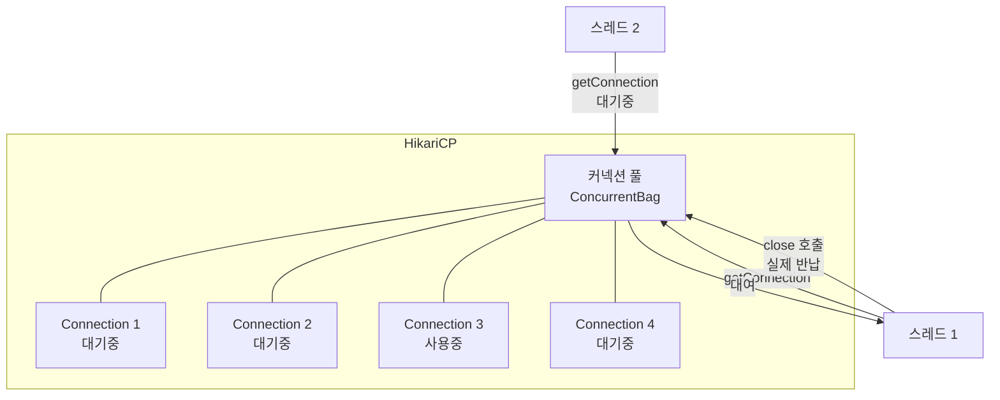
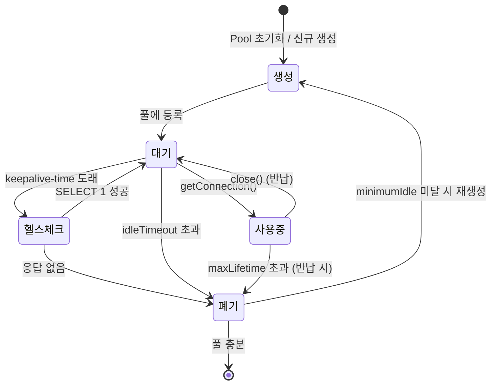
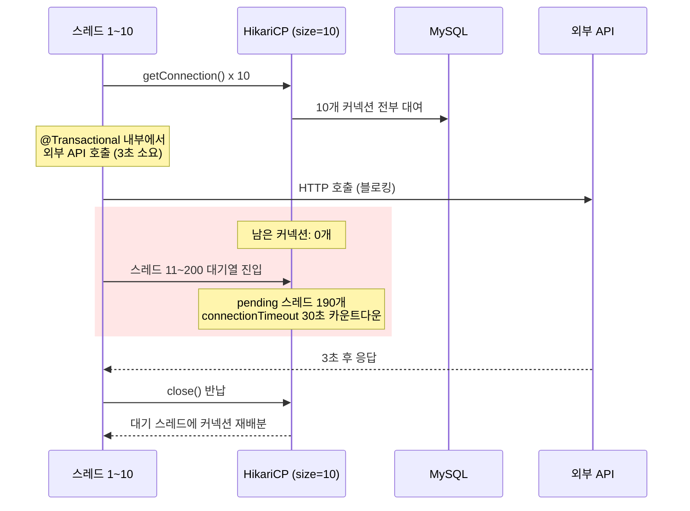
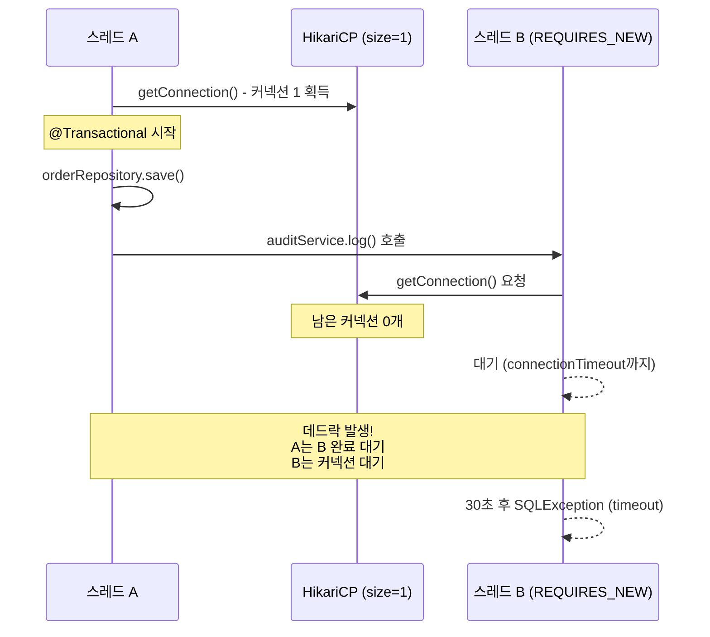

DB 커넥션을 맺는 것은 생각보다 비싸다. TCP 연결, 인증, 세션 초기화까지 수십~수백 밀리초가 걸린다. 매 요청마다 새 커넥션을 만들면 DB가 이 비용만으로 과부하에 걸린다. 커넥션 풀은 미리 만들어 놓은 커넥션을 재사용해 이 비용을 제거한다.

> **비유**: 택시 회사(커넥션 풀)가 차량(커넥션)을 미리 준비해두고 있다. 승객(요청)이 오면 대기 중인 차를 바로 배정한다. 목적지 도착 후 차는 회사로 돌아가(반납) 다음 승객을 기다린다. 차가 없으면 대기 또는 거절(타임아웃)한다.

---

## 커넥션 없이 매번 연결하면?

```
요청마다 새 커넥션 생성:
  1. 소켓 TCP 연결 (3-way handshake): ~1ms
  2. SSL 핸드셰이크: ~5ms
  3. DB 인증 (사용자/패스워드 검증): ~5ms
  4. 세션 초기화 (character set, timezone 등): ~1ms
  총: 약 10~50ms (네트워크 상황에 따라 더 길어짐)

  TPS 1,000일 때: 1,000번 × 50ms = 연결에만 초당 50초 소비 → 불가능

커넥션 풀 사용:
  미리 생성된 커넥션을 <1ms에 대여 → 실질적 비용 0
```

---

## HikariCP 동작 원리

Spring Boot 2.x+의 기본 커넥션 풀. "빠른 커넥션 풀" 표방.

> **비유:** HikariCP는 공항의 렌터카 카운터와 같습니다. 차량(커넥션)이 미리 세차·정비(초기화)된 상태로 주차장(ConcurrentBag)에 대기합니다. 고객(스레드)이 도착하면 서류 확인 없이 키만 건네주고(ThreadLocal 캐시), 반납 시 다음 고객에게 바로 넘깁니다. 차가 오래되면(maxLifetime) 신차로 교체하고, 녹슨 차(유효하지 않은 커넥션)는 정비 점검(keepalive-time)에서 걸러냅니다.



### 커넥션 생명주기

```
1. Pool 초기화 (minimumIdle개 커넥션 선제 생성)
2. getConnection(): 풀에서 대기 커넥션 반환
   → 없으면 최대 connectionTimeout까지 대기
   → 타임아웃 → SQLException 발생
3. 쿼리 실행
4. connection.close(): 실제 종료 아님 → 풀에 반납
5. 유휴 시간 > idleTimeout → 커넥션 닫고 풀에서 제거
6. 생존 시간 > maxLifetime → 커넥션 교체 (DB 서버 재연결 강제 종료 방어)
```



---

## HikariCP 설정

```yaml
spring:
  datasource:
    url: jdbc:mysql://localhost:3306/mydb?useSSL=false&serverTimezone=UTC
    username: myuser
    password: mypassword
    driver-class-name: com.mysql.cj.jdbc.Driver

    hikari:
      # 풀 크기
      maximum-pool-size: 10          # 최대 커넥션 수 (기본 10)
      minimum-idle: 5                # 유휴 커넥션 최소 유지 수
                                     # (maximum-pool-size와 같게 권장: 고정 풀)

      # 타임아웃
      connection-timeout: 30000      # 커넥션 획득 대기 시간 (ms) - 기본 30초
      idle-timeout: 600000           # 유휴 커넥션 유지 시간 (ms) - 기본 10분
      max-lifetime: 1800000          # 커넥션 최대 생존 시간 (ms) - 기본 30분
                                     # DB 서버 wait_timeout보다 짧게 설정!
      keepalive-time: 30000          # 유휴 커넥션 헬스체크 주기 (ms)

      # 연결 검증
      connection-test-query: SELECT 1  # JDBC4 미지원 드라이버용 (MySQL 불필요)
      validation-timeout: 5000         # 커넥션 유효성 검사 타임아웃

      # 풀 이름 (모니터링에서 구분)
      pool-name: HikariPool-OrderService

      # 초기화 쿼리 (세션 설정)
      connection-init-sql: "SET NAMES utf8mb4"
```

---

## 적정 풀 사이즈 계산

가장 많이 틀리는 부분이다. 풀이 크다고 좋은 게 아니다.

> **비유**: 식당 주방을 떠올려 보세요. 주방이 4명 정원인데 요리사를 20명 넣으면 서로 부딪히고 도마 교대하느라 요리 속도가 오히려 느려집니다. 4명이 번갈아 쉬면서 효율적으로 일하는 것이 최적입니다. 커넥션 풀도 마찬가지로, CPU 코어 수에 맞춰 **동시에 의미 있게 일할 수 있는 만큼만** 커넥션을 유지하는 것이 핵심입니다.

### HikariCP 공식 공식

```
최적 풀 크기 = (CPU 코어 수 × 2) + 유효 디스크 스핀들 수

예시: 4코어 서버, SSD(스핀들 1개)
  = (4 × 2) + 1 = 9 ≈ 10

직관적 설명:
  CPU가 4개 → 동시에 4개 쿼리 실행 가능
  나머지 스레드는 IO 대기 → 이 시간에 다른 커넥션이 CPU 사용
  너무 크면: 컨텍스트 스위칭 비용 증가, DB 서버 과부하
  너무 작으면: 커넥션 대기로 처리량 감소
```

### 실전 계산

```
시나리오: 4코어 서버, Spring Boot 앱, Tomcat 스레드 200개

잘못된 접근: 풀 크기 = 200 (스레드 수만큼)
  → DB 서버가 200개 동시 쿼리 처리 → 실제로는 더 느려짐

올바른 접근:
  DB 서버 CPU = 8코어
  최적 풀 크기 = (8 × 2) + 1 = 17 ≈ 20

  하지만 앱 서버가 3대라면:
  서버당 풀 크기 = 20 / 3 = 7 (반올림해서 7~10)
  총 DB 연결 = 7 × 3 = 21개 → DB 최적 처리량

TPS 기반 계산:
  목표 TPS = 1,000
  평균 쿼리 응답 시간 = 50ms
  필요 커넥션 = 1,000 × 0.05 = 50개
  (Little's Law: N = λ × W)
```

---

## 커넥션 풀 관련 장애 패턴

### 1. 커넥션 풀 고갈 (Pool Exhaustion)



```
증상:
  - HikariPool-1 - Connection is not available, request timed out after 30000ms
  - API 응답 지연 후 전체 다운

원인:
  1. 트랜잭션 내에서 외부 API 호출
  2. 트랜잭션을 닫지 않음 (예외 처리 누락)
  3. 풀 크기 대비 동시 요청 급증
  4. 느린 쿼리로 커넥션 오래 점유

진단:
  SELECT * FROM information_schema.processlist; -- MySQL
  → 커넥션 상태와 실행 쿼리 확인
```

```java
// 나쁜 패턴: 트랜잭션 안에서 외부 HTTP 호출
@Transactional
public OrderResult createOrder(OrderRequest request) {
    Order order = orderRepository.save(new Order(request));

    // ❌ 커넥션 점유 중에 외부 API 호출 (수백 ms ~ 수초)
    PaymentResult payment = paymentClient.charge(request.getAmount());

    order.complete(payment);
    return OrderResult.from(order);
}

// 좋은 패턴: 외부 호출을 트랜잭션 밖으로
public OrderResult createOrder(OrderRequest request) {
    // 1. 외부 API 먼저 호출 (커넥션 사용 안함)
    PaymentResult payment = paymentClient.charge(request.getAmount());

    // 2. DB 작업만 트랜잭션 안에서
    return createOrderWithPayment(request, payment);
}

@Transactional
public OrderResult createOrderWithPayment(OrderRequest request, PaymentResult payment) {
    Order order = orderRepository.save(new Order(request));
    order.complete(payment);
    return OrderResult.from(order);
}
```

### 2. 커넥션 누수 (Connection Leak)

```java
// 누수 발생: close() 호출 안 됨
public void badQuery() throws SQLException {
    Connection conn = dataSource.getConnection();
    Statement stmt = conn.createStatement();
    ResultSet rs = stmt.executeQuery("SELECT * FROM orders");
    // 예외 발생 시 close() 호출 안됨 → 커넥션 반납 안됨
    processResults(rs);
    conn.close();  // ← 예외 전에 닫아야 함
}

// 올바른 방법: try-with-resources
public void goodQuery() throws SQLException {
    try (Connection conn = dataSource.getConnection();
         Statement stmt = conn.createStatement();
         ResultSet rs = stmt.executeQuery("SELECT * FROM orders")) {
        processResults(rs);
    }  // 자동으로 close() 호출 (예외 발생 시에도)
}
```

```yaml
# 누수 감지 설정
hikari:
  leak-detection-threshold: 2000  # 2초 이상 반납 안된 커넥션 경고 로그
```

```
경고 로그 예시:
Connection leak detection triggered for
  com.mysql.cj.jdbc.ConnectionImpl@1234abcd on thread http-nio-8080-exec-5,
  stack trace follows
  ...
  at com.example.OrderService.createOrder(OrderService.java:45)
→ 해당 코드 라인 확인
```

### 3. 데드락 (Deadlock)

> **비유**: 좁은 골목에서 두 트럭이 마주 보고 진입한 상황입니다. A 트럭은 "B가 후진해줘야 내가 지나간다"고 기다리고, B 트럭도 "A가 먼저 비켜야 한다"고 기다립니다. 아무도 양보하지 않으면 둘 다 영원히 멈춰 있습니다. 커넥션 풀 데드락도 정확히 이 구조입니다.



```
커넥션 풀 데드락 (HikariCP):
  스레드 A: 커넥션 1 보유 → 커넥션 2 대기
  스레드 B: 커넥션 2 보유 → 커넥션 1 대기
  → 무한 대기

발생 조건:
  maximumPoolSize = 1 (단 하나의 커넥션)
  트랜잭션 A가 커넥션 1 사용 중
  트랜잭션 A 내부에서 새 트랜잭션 B 시작 (Propagation.REQUIRES_NEW)
  트랜잭션 B가 커넥션 1 대기 → 데드락

해결:
  maximumPoolSize를 2 이상으로 설정
  REQUIRES_NEW 사용 시 풀 크기 고려
```

```java
// 데드락 유발 패턴
@Service
@Transactional  // 커넥션 1 사용
public class OrderService {

    @Autowired
    private AuditService auditService;

    public void createOrder(OrderRequest request) {
        Order order = orderRepository.save(new Order(request));
        auditService.log(order);  // 내부에서 REQUIRES_NEW 트랜잭션 → 커넥션 2 필요!
    }
}

@Service
public class AuditService {
    @Transactional(propagation = Propagation.REQUIRES_NEW)  // 새 커넥션 필요
    public void log(Order order) {
        auditRepository.save(new AuditLog(order));
    }
}
```

---

## 모니터링

### Actuator + Prometheus

```yaml
management:
  endpoints:
    web:
      exposure:
        include: health, metrics, prometheus
  metrics:
    tags:
      application: ${spring.application.name}
```

```
주요 메트릭 (Prometheus):
hikaricp_connections_active      현재 사용 중인 커넥션 수
hikaricp_connections_idle        대기 중인 커넥션 수
hikaricp_connections_pending     커넥션 대기 중인 스레드 수 ← 이게 오르면 위험
hikaricp_connections_timeout_total  커넥션 획득 타임아웃 횟수 ← 이게 오르면 장애
hikaricp_connections_acquire_ms  커넥션 획득 소요 시간

Grafana 알림:
  hikaricp_connections_pending > 0 → 경고
  hikaricp_connections_timeout_total 증가 → 긴급
```

### 수동 모니터링

```java
@Component
public class HikariPoolMonitor {

    private final DataSource dataSource;

    @Scheduled(fixedDelay = 5000)
    public void logPoolStats() {
        if (dataSource instanceof HikariDataSource hikariDataSource) {
            HikariPoolMXBean pool = hikariDataSource.getHikariPoolMXBean();
            log.info("Pool stats - Active: {}, Idle: {}, Pending: {}, Total: {}",
                pool.getActiveConnections(),
                pool.getIdleConnections(),
                pool.getThreadsAwaitingConnection(),
                pool.getTotalConnections()
            );
        }
    }
}
```

---

## 멀티 데이터소스

```java
@Configuration
public class DataSourceConfig {

    @Bean
    @ConfigurationProperties("spring.datasource.write")
    public DataSource writeDataSource() {
        return DataSourceBuilder.create().build();
    }

    @Bean
    @ConfigurationProperties("spring.datasource.read")
    public DataSource readDataSource() {
        return DataSourceBuilder.create().build();
    }

    @Bean
    public DataSource routingDataSource(
            @Qualifier("writeDataSource") DataSource write,
            @Qualifier("readDataSource") DataSource read) {

        AbstractRoutingDataSource routing = new AbstractRoutingDataSource() {
            @Override
            protected Object determineCurrentLookupKey() {
                return TransactionSynchronizationManager.isCurrentTransactionReadOnly()
                    ? "read" : "write";
            }
        };

        routing.setTargetDataSources(Map.of("write", write, "read", read));
        routing.setDefaultTargetDataSource(write);
        return routing;
    }
}
```

```yaml
spring:
  datasource:
    write:
      jdbc-url: jdbc:mysql://master-db:3306/mydb
      hikari:
        maximum-pool-size: 10
        pool-name: WritePool
    read:
      jdbc-url: jdbc:mysql://replica-db:3306/mydb
      hikari:
        maximum-pool-size: 20  # 읽기 부하가 더 많으므로 크게
        pool-name: ReadPool
```

---

<details class="extreme-scenario-details">
<summary class="extreme-scenario-summary">
<span class="extreme-scenario-icon">🔥</span>
<span class="extreme-scenario-label">극한 시나리오 — 클릭하여 펼치기</span>
<span class="extreme-scenario-toggle"></span>
</summary>
<div class="extreme-scenario-body">

<div class="extreme-scenario-content" markdown="1">

### 시나리오 1: 트래픽 스파이크로 풀 고갈

```
상황: 프로모션으로 TPS 10배 급증
결과: 커넥션 풀 고갈 → connection timeout → API 500 오류

즉각 대응:
1. maximum-pool-size 임시 증가 (DB 서버 커넥션 한계 내에서)
2. 느린 쿼리 식별 및 킬 (KILL {process_id})
3. 로드밸런서에서 일부 트래픽 차단 (서킷 브레이커)

중기 대응:
1. 쿼리 최적화 (인덱스, 쿼리 튜닝)
2. 읽기 전용 레플리카 추가 + 읽기 분리
3. 자주 조회되는 데이터 Redis 캐싱
4. DB 앞에 PgBouncer/ProxySQL 같은 커넥션 풀러 추가
```

### 시나리오 2: DB 서버 재시작 후 커넥션 오류

```
문제: DB 서버가 재시작되면 기존 커넥션은 죽어있음
      그런데 HikariCP는 이 커넥션이 죽었는지 모름 → 사용 시 오류

설정으로 방어:
hikari:
  max-lifetime: 1800000      # 30분마다 커넥션 재생성
  keepalive-time: 30000      # 30초마다 유휴 커넥션에 ping
  connection-test-query: SELECT 1  # 사용 전 검증

DB 서버 설정 확인:
  wait_timeout=28800 (MySQL 기본: 8시간)
  → max-lifetime < wait_timeout 이어야 함
  → 권장: max-lifetime = 1800000 (30분) < wait_timeout
```

### 시나리오 3: 마이크로서비스 환경에서 DB 커넥션 폭증

```
문제: 서비스 인스턴스 50개 × 풀 크기 20 = 1,000개 DB 커넥션
      DB 서버 최대 커넥션 500개 → 연결 거부

해결:
1. 서비스당 풀 크기 줄이기
   → 인스턴스 50개 × 풀 10 = 500개

2. PgBouncer / ProxySQL 도입:
   앱 → ProxySQL(커넥션 멀티플렉싱) → DB
   1,000개 앱 커넥션 → 실제 DB 커넥션 50개로 압축

3. 서비스 계층별 DB 분리 (MSA):
   각 서비스가 자체 DB를 가져 총 커넥션 수 분산
```

### 시나리오 4: 커넥션 누수가 서서히 시스템을 죽이는 경우

```
상황:
  - 특정 예외 경로에서 connection.close()가 호출되지 않음
  - 평소에는 문제없지만, 특정 입력값에서만 예외 발생
  - 하루 10건 정도 → 10개 커넥션 누수 → 풀 전체 고갈까지 1일

타임라인:
  09:00  풀 10/10 정상
  12:00  누적 누수 3건 → 가용 7개 (아직 체감 없음)
  18:00  누적 누수 7건 → 가용 3개 (응답 지연 시작)
  21:00  누적 누수 10건 → 가용 0개 → 전체 장애

특히 위험한 이유:
  - leak-detection-threshold 설정이 없으면 로그조차 안 남음
  - 모니터링에서 active 커넥션만 보면 "사용 중"으로 보여 정상 판단
  - 재시작하면 일시적으로 해소되어 원인 파악 지연

방어:
  1. leak-detection-threshold: 2000 (필수 설정)
  2. hikaricp_connections_active 가 maximumPoolSize의 80% 이상이면 알림
  3. try-with-resources를 코드 리뷰 필수 항목으로 지정
  4. 통합 테스트에서 테스트 종료 후 active 커넥션 0 검증
```

### 시나리오 5: maxLifetime 미설정으로 새벽 장애

```
상황:
  - maxLifetime 기본값 30분 사용, DB 서버 wait_timeout=28800(8시간)
  - 하지만 DB 앞에 AWS NLB(Network Load Balancer)가 있음
  - NLB idle timeout = 350초 (약 6분)

문제 발생 과정:
  1. 새벽 2시~6시: 트래픽 0 → 모든 커넥션 유휴 상태
  2. NLB가 350초 유휴 연결을 끊음 (TCP RST)
  3. HikariCP는 이 사실을 모름 (소켓이 끊긴 걸 감지 못함)
  4. 06시 첫 요청 → 죽은 커넥션으로 쿼리 시도 → Connection reset 오류
  5. 연쇄적으로 여러 커넥션이 죽어있어 수십 건 오류 발생

방어:
  hikari:
    keepalive-time: 30000    # 30초마다 유휴 커넥션에 ping → NLB 유휴 감지 방지
    max-lifetime: 300000     # 5분 (NLB 350초보다 짧게) → 커넥션 선제 교체
    connection-test-query: SELECT 1  # JDBC4 미지원 시 사용 전 검증
```
</div>
</div>
</details>

