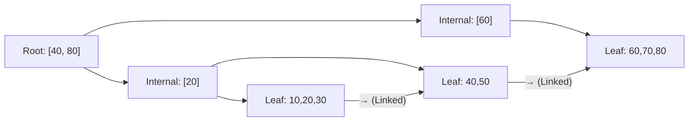
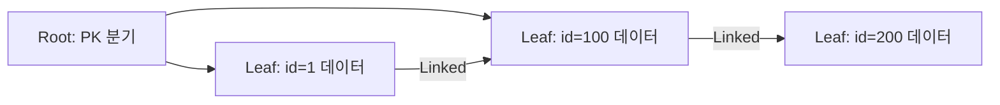
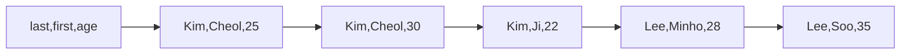

회원 테이블 1,000만 건에서 이메일 하나를 조회하는 데 5초가 걸렸다. 인덱스 하나를 추가했더니 3ms로 줄었다. 왜 이런 일이 벌어지는지, 단순히 "인덱스를 걸면 빠르다"는 수준을 넘어 B+Tree 내부 구조부터 InnoDB 클러스터드 인덱스 설계, JPA 환경에서의 실무 전략까지 모두 파헤친다. 면접에서 "왜 그렇게 동작하나요?"라는 질문에 막히지 않으려면 반드시 이 수준까지 알아야 한다.

---

## 1. 인덱스가 필요한 이유 — 디스크 I/O부터 이해하기

### CPU는 빠른데 왜 쿼리가 느린가?

DB 쿼리 성능의 병목은 거의 항상 **디스크 I/O**다. CPU 연산은 나노초 단위지만 HDD 랜덤 I/O는 수십 밀리초, SSD조차 수십~수백 마이크로초다. 10만 행을 풀스캔하면 수십만 번의 I/O가 발생한다.

InnoDB는 디스크를 **페이지(Page)** 단위로 읽는다. 기본 크기는 **16KB**다. 한 번의 I/O로 16KB를 통째로 읽기 때문에, 어디에 데이터가 있는지 알면 단 몇 번의 I/O로 원하는 데이터를 찾을 수 있다. 인덱스는 바로 이 "어디에 있는지"를 빠르게 찾아주는 자료구조다.

```
비유: 도서관에 책 100만 권이 있다.
- 인덱스 없음: 첫 번째 책부터 꺼내 하나하나 확인 → Full Table Scan
- 인덱스 있음: 검색 카탈로그에서 위치를 찾아 직접 꺼냄 → Index Scan
단, 카탈로그(인덱스)는 책이 추가/삭제될 때마다 갱신해야 한다.
읽기 속도 ↑ vs 쓰기 비용 ↑ 이 트레이드오프가 인덱스의 본질이다.
```

| 구분 | 인덱스 있음 | 인덱스 없음 |
|---|---|---|
| SELECT (검색) | 빠름 (B+Tree 탐색) | 느림 (Full Table Scan) |
| INSERT | 느림 (인덱스 갱신) | 빠름 |
| UPDATE | 느림 (인덱스 갱신) | 빠름 |
| DELETE | 느림 (인덱스 갱신) | 빠름 |
| 디스크 공간 | 추가 필요 | 없음 |

---

## 2. B+Tree 내부 구조 — WHY B+Tree인가?

### B-Tree와의 결정적 차이

B-Tree는 내부 노드(Internal Node)와 리프 노드(Leaf Node) **모두에 실제 데이터를 저장**한다. 이 구조의 문제는 범위 검색이다. `WHERE id BETWEEN 30 AND 60`을 수행하면 id=30을 내부 노드에서 찾은 뒤, id=31을 찾으러 다시 루트부터 내려가야 한다. 매 레코드마다 트리 탐색을 반복한다.

B+Tree는 이 문제를 해결했다. **내부 노드에는 키 값만** 저장하고, **리프 노드에만 실제 데이터(또는 데이터 포인터)를 저장**한다. 그리고 리프 노드들을 **양방향 연결 리스트(Doubly Linked List)**로 연결했다. 범위 검색 시 시작점을 찾은 뒤 리프 레벨에서 선형으로 스캔하면 된다. 트리를 다시 올라갈 필요가 없다.



`WHERE id BETWEEN 30 AND 60`이라면:
1. 루트에서 30의 위치를 찾아 L1으로 이동 (트리 탐색: 2 I/O)
2. L1에서 30을 찾고, 연결 리스트를 따라 L2 → L3으로 이동 (선형 스캔)
3. 60을 만나면 종료

랜덤 I/O 없이 순차 I/O로 범위를 스캔하는 것이 핵심이다.

### Fanout과 트리 높이 — 왜 I/O가 3~4번이면 충분한가?

InnoDB 기본 페이지 크기 16KB에서 내부 노드 하나에 몇 개의 키를 저장할 수 있는지 계산해 보자.

- 키 크기: BIGINT 8바이트
- 자식 포인터: 6바이트
- 키+포인터 한 쌍: 14바이트
- 16KB / 14바이트 ≈ **1,170개** (이것이 Fanout)

Height-3 B+Tree 기준:
```
1,170 × 1,170 × (리프당 레코드 수) = 처리 가능 레코드 수
리프 페이지 16KB, 레코드 100바이트 → 리프당 약 160건
→ 1,170 × 1,170 × 160 = 약 2억 1,924만 건
```

2억 건짜리 테이블도 Height-3 B+Tree에서 **3번의 I/O**로 원하는 레코드를 찾는다. 이것이 인덱스가 극적인 성능 향상을 제공하는 이유다.

### 페이지 분할 (Page Split) 메커니즘

INSERT 시 B+Tree 리프 노드가 가득 차면 **페이지 분할**이 발생한다. 기존 페이지의 약 절반 레코드를 새 페이지로 이동하고, 새 페이지의 첫 번째 키를 부모 내부 노드에 올린다. 부모도 가득 차면 부모도 분할한다. 최악의 경우 루트까지 분할이 전파된다.

```
Before: [10, 20, 30, 40, 50] (꽉 찬 리프)
Insert: 35

After:
  [10, 20, 30] ← 기존 페이지
  [35, 40, 50] ← 새 페이지
  부모에 35 추가
```

**UUID PK가 치명적인 이유**: UUID는 무작위 값이므로 삽입 시마다 B+Tree 중간 어딘가에 끼어든다. 항상 페이지 분할이 발생한다. AUTO_INCREMENT는 항상 가장 오른쪽 리프에만 추가되므로 분할이 거의 없다. 대용량 테이블에서 UUID vs AUTO_INCREMENT의 INSERT TPS 차이는 수십 배에 달한다.

```java
// 나쁨: UUID PK → 페이지 분할 남발
@Entity
public class Order {
    @Id
    @GeneratedValue(generator = "uuid2")
    @GenericGenerator(name = "uuid2", strategy = "uuid2")
    private String id;  // 무작위값, 매번 페이지 분할
}

// 좋음: AUTO_INCREMENT → 오른쪽 리프에만 추가, 분할 최소
@Entity
public class Order {
    @Id
    @GeneratedValue(strategy = GenerationType.IDENTITY)
    private Long id;  // 순차 증가, 페이지 분할 없음
}
```

---

## 3. 클러스터드 인덱스 vs 세컨더리 인덱스 — InnoDB의 핵심

### 클러스터드 인덱스: 테이블 자체가 B+Tree다

InnoDB에서 가장 중요한 특성: **테이블 전체가 클러스터드 인덱스(B+Tree)로 저장**된다. PK가 B+Tree의 키이고, 리프 노드에 **실제 행 데이터 전체**가 저장된다. 별도의 "데이터 파일"이 없다. 테이블 = 클러스터드 인덱스다.

이 구조의 결과:
- PK 순서대로 물리적으로 데이터가 정렬된다
- `WHERE id = 42` → 3 I/O로 완료
- `WHERE id BETWEEN 100 AND 200` → 시작점 찾고 리프 연결 리스트 선형 스캔 → 순차 I/O
- **PK를 무작위 값으로 하면** → 삽입 시마다 중간 어딘가에 끼어들어 페이지 분할 연속 발생



PK가 없는 경우, InnoDB는 **내부 6바이트 Row ID**를 자동으로 클러스터드 인덱스 키로 사용한다. 이 컬럼은 사용자가 접근할 수 없다. Row-based Replication 환경에서 복제 슬레이브가 행을 식별할 수 없어 복제 불일치 버그가 생긴다. 모든 테이블에 명시적 PK를 정의해야 하는 이유다.

```java
// JPA에서 클러스터드 인덱스 = PK 설계
@Entity
@Table(name = "orders")
public class Order {
    @Id
    @GeneratedValue(strategy = GenerationType.IDENTITY)
    private Long orderId;  // InnoDB 클러스터드 인덱스 키

    @Column(nullable = false)
    private Long userId;

    @Column(nullable = false)
    private String status;

    @Column(nullable = false)
    private LocalDateTime createdAt;
}
```

### 세컨더리 인덱스: 리프에 PK가 저장된다

PK 이외의 모든 인덱스는 세컨더리 인덱스다. 세컨더리 인덱스의 리프 노드에는 **행 데이터가 아니라 PK 값이 저장**된다. 왜 이렇게 설계했을까?

만약 세컨더리 인덱스 리프에 실제 행의 물리적 주소(파일 offset)를 저장한다면, 페이지 분할이 발생할 때마다 행이 이동하고 **모든 세컨더리 인덱스가 가리키는 주소를 전부 갱신**해야 한다. 인덱스가 10개라면 페이지 분할마다 10개 인덱스를 모두 수정해야 한다. 대신 PK를 저장하면 행이 이동해도 PK는 변하지 않으므로 세컨더리 인덱스를 건드릴 필요가 없다.

**이중 조회(Double Lookup / PK Lookup)의 발생**:

```sql
-- 테이블: users(user_id PK, email, name, age)
-- 인덱스: idx_email(email)

SELECT name, age FROM users WHERE email = 'kim@example.com';
```

실행 경로:
1. `idx_email` B+Tree 탐색: `email = 'kim@example.com'` → 리프에서 `user_id = 42` 획득 (3 I/O)
2. 클러스터드 인덱스 B+Tree 재탐색: `user_id = 42` → 실제 행 (name, age) 획득 (3 I/O)
3. 총 6 I/O 발생


이 두 번째 탐색을 제거하는 방법이 바로 **커버링 인덱스**다.

```java
// JPA에서 세컨더리 인덱스 정의
@Entity
@Table(name = "users", indexes = {
    @Index(name = "idx_email", columnList = "email"),
    @Index(name = "idx_status_created", columnList = "status, createdAt")
})
public class User {
    @Id
    @GeneratedValue(strategy = GenerationType.IDENTITY)
    private Long userId;

    @Column(unique = true, nullable = false)
    private String email;

    private String name;
    private Integer age;
    private String status;
    private LocalDateTime createdAt;
}
```

---

## 4. 커버링 인덱스 — 랜덤 I/O를 원천 차단하는 방법

### 왜 랜덤 I/O를 피해야 하는가?

세컨더리 인덱스로 PK를 여러 개 획득한 뒤 클러스터드 인덱스를 조회하는 과정은 **랜덤 I/O**다. 예를 들어 `email LIKE 'kim%'`으로 1,000명의 user_id를 찾았다면, 이후 1,000명의 행을 클러스터드 인덱스에서 조회해야 한다. 각 행이 서로 다른 페이지에 있다면 최대 1,000번의 랜덤 I/O가 발생한다.

랜덤 I/O는 HDD에서는 특히 치명적이다 (seek time × 1,000). SSD도 순차 I/O보다 훨씬 비싸다. 커버링 인덱스는 이 랜덤 I/O를 아예 발생시키지 않는다.

### 커버링 인덱스의 동작 원리

쿼리가 필요로 하는 **모든 컬럼이 인덱스에 포함**되어 있으면, 세컨더리 인덱스의 리프 노드에서 곧바로 결과를 반환할 수 있다. 클러스터드 인덱스(본 테이블)를 전혀 건드리지 않는다.

InnoDB 세컨더리 인덱스 리프 노드에는 **(인덱스 컬럼, PK)** 가 저장된다. PK는 자동으로 포함된다. 따라서 PK와 인덱스 컬럼만 SELECT한다면 항상 커버링 인덱스가 적용된다.

```sql
-- 인덱스: idx_email_name ON users(email, name)
-- 리프 노드에 저장: (email, name, user_id←PK 자동포함)

-- 커버링 인덱스 적용 (Extra: Using index)
SELECT name FROM users WHERE email = 'kim@example.com';
-- name → 인덱스에 있음 ✓
-- user_id → 인덱스에 자동 포함 ✓
-- 클러스터드 인덱스 조회 없음

-- 커버링 인덱스 미적용 (Extra: 없음, PK 룩업 발생)
SELECT name, age FROM users WHERE email = 'kim@example.com';
-- age → 인덱스에 없음 ✗ → 클러스터드 인덱스 재조회 필요
```

EXPLAIN에서 `Extra: Using index`가 표시되면 커버링 인덱스가 동작 중이다. `Using index condition`(ICP)과 혼동하지 말것.

### JPA/Spring Data에서 커버링 인덱스 활용

JPA는 기본적으로 엔티티 전체를 로드하므로 커버링 인덱스를 활용하려면 **Projection** 또는 **네이티브 쿼리**를 사용해야 한다.

```java
// 방법 1: Interface Projection으로 필요한 컬럼만 조회
public interface UserEmailNameProjection {
    String getEmail();
    String getName();
    // age는 제외 → 커버링 인덱스 가능
}

@Repository
public interface UserRepository extends JpaRepository<User, Long> {
    // idx_email_name(email, name) 인덱스 존재 시 커버링 인덱스 적용
    List<UserEmailNameProjection> findByEmail(String email);
}

// 방법 2: @Query로 명시적 컬럼 선택
@Query("SELECT u.name FROM User u WHERE u.email = :email")
List<String> findNameByEmail(@Param("email") String email);

// 방법 3: 네이티브 쿼리로 EXPLAIN 검증 후 사용
@Query(value = """
    SELECT email, name FROM users WHERE email = :email
    """, nativeQuery = true)
List<Object[]> findEmailNameNative(@Param("email") String email);
```

```sql
-- EXPLAIN으로 커버링 인덱스 확인
EXPLAIN SELECT email, name FROM users WHERE email = 'kim@example.com';
-- Extra: Using index  ← 커버링 인덱스 동작 확인
```

### 커버링 인덱스 설계 전략

```java
// 자주 실행되는 쿼리: WHERE status = ? ORDER BY createdAt DESC
// SELECT userId, status, createdAt
// → 커버링 인덱스: (status, createdAt, userId)
//   단, userId는 PK이므로 세컨더리 인덱스에 자동 포함됨
//   실제로는 (status, createdAt)만 선언해도 커버링 가능

@Entity
@Table(name = "orders", indexes = {
    // WHERE status = ? ORDER BY createdAt → 이 인덱스로 커버링
    @Index(name = "idx_status_created", columnList = "status, createdAt")
    // SELECT에 userId(PK), status, createdAt만 있으면 PK룩업 없음
})
public class Order { ... }
```

---

## 5. Index Condition Pushdown (ICP) — 스토리지 엔진 레벨 필터링

### ICP가 없던 시절의 비효율

ICP(Index Condition Pushdown)는 MySQL 5.6에서 도입된 최적화다. 이것이 왜 필요한지 이해하려면 MySQL 아키텍처를 알아야 한다.

MySQL은 두 레이어로 구성된다:
- **MySQL Server Layer**: 옵티마이저, 파서, 실행 계획 수립
- **Storage Engine Layer**: 실제 데이터 읽기/쓰기 (InnoDB)

ICP 이전에는 스토리지 엔진이 인덱스를 이용해 행을 가져오면, MySQL Server Layer에서 추가 WHERE 조건을 필터링했다. 즉, 스토리지 엔진은 단순히 인덱스에 해당하는 행을 모두 올려주고, 서버 레이어에서 걸러냈다.

### ICP 동작 방식

ICP는 WHERE 조건의 일부를 **스토리지 엔진 레벨로 밀어 내린다**. 스토리지 엔진이 인덱스를 읽으면서 조건에 맞지 않는 행은 아예 가져오지 않는다. 불필요한 행을 서버 레이어로 올리지 않으므로 I/O와 네트워크 전송이 줄어든다.

```sql
-- 복합 인덱스: (zipcode, lastname, firstname)
-- 쿼리:
SELECT * FROM users
WHERE zipcode = '12345'
  AND lastname LIKE '%Kim'   -- 와일드카드가 뒤가 아닌 앞에 있어 인덱스 탐색 불가
  AND firstname = 'Cheol';

-- ICP 없음 (구버전):
-- 1. 스토리지 엔진: zipcode='12345' 에 해당하는 모든 행을 서버 레이어로 올림
--    예: zipcode='12345'인 행이 10,000건
-- 2. 서버 레이어: lastname LIKE '%Kim' AND firstname='Cheol' 필터링
--    결과: 50건
--    → 10,000건을 읽어 올렸다 → 9,950건은 낭비

-- ICP 있음 (MySQL 5.6+):
-- 1. 스토리지 엔진: zipcode='12345'를 인덱스에서 찾음
-- 2. 인덱스 레벨에서 lastname LIKE '%Kim' AND firstname='Cheol' 평가
--    → 조건 불만족 행은 아예 행 데이터를 읽지 않음
--    → 50건만 서버 레이어로 올림
-- EXPLAIN Extra: Using index condition
```

```java
// JPA에서 ICP 확인: 네이티브 쿼리로 EXPLAIN 실행
@Query(value = """
    EXPLAIN SELECT * FROM users
    WHERE zipcode = :zipcode
      AND lastname LIKE CONCAT('%', :lastName)
      AND firstname = :firstName
    """, nativeQuery = true)
List<Object[]> explainIcpQuery(
    @Param("zipcode") String zipcode,
    @Param("lastName") String lastName,
    @Param("firstName") String firstName
);
// Extra에 "Using index condition" 확인
```

ICP가 적용되면 EXPLAIN Extra에 `Using index condition`이 표시된다. rows 예측값도 감소한다. ICP는 자동으로 적용되며 `optimizer_switch='index_condition_pushdown=on'`으로 제어 가능하다.

---

## 6. 복합 인덱스 — 최좌선 접두사 규칙의 WHY

### B+Tree는 왜 왼쪽부터만 동작하는가?

복합 인덱스 `(A, B, C)`의 B+Tree는 **A를 기준으로 정렬, A가 같으면 B를 기준으로, B가 같으면 C를 기준으로** 정렬된다. 전화번호부처럼 성 → 이름 순서로 정렬된 것과 같다.

```
(A=1, B=10, C=100)
(A=1, B=10, C=200)
(A=1, B=20, C=50)
(A=2, B=5,  C=300)
(A=2, B=15, C=100)
```

`WHERE B = 10`만 조건으로 주면 어떻게 될까? B=10인 항목이 A=1일 때도, A=2일 때도 흩어져 있다. B+Tree에서 특정 B값을 찾으려면 A의 모든 값에 대해 탐색해야 한다 → 사실상 풀스캔과 다르지 않다.

`WHERE A = 1 AND C = 100`은? A=1인 구간을 찾을 수는 있지만, 그 안에서 C값은 B에 따라 정렬되어 있고 B가 없으므로 C=100을 특정할 방법이 없다. A 조건만 인덱스로 쓰고 C는 행 레벨 필터링이 된다.

```sql
-- 복합 인덱스: (last_name, first_name, age)

-- 인덱스 완전 활용: leftmost prefix 충족
SELECT * FROM employees WHERE last_name = 'Kim';
SELECT * FROM employees WHERE last_name = 'Kim' AND first_name = 'Cheol';
SELECT * FROM employees WHERE last_name = 'Kim' AND first_name = 'Cheol' AND age = 25;

-- 인덱스 부분 활용: A조건만 인덱스, C는 행필터
SELECT * FROM employees WHERE last_name = 'Kim' AND age = 25;

-- 인덱스 미사용: 첫 번째 컬럼 누락
SELECT * FROM employees WHERE first_name = 'Cheol';
SELECT * FROM employees WHERE age = 25;
```



### 범위 조건 이후 컬럼은 인덱스 탐색에서 제외된다

```sql
-- 인덱스: (age, status, name)

-- age는 범위 조건 → 이후 status, name은 인덱스 탐색 아닌 행 레벨 필터
SELECT * FROM users WHERE age > 20 AND status = 'active' AND name = 'Kim';
-- key_len 계산에서 age 부분만 포함됨

-- 올바른 설계: 등호 조건을 앞에, 범위를 뒤에
-- 인덱스: (status, name, age)
SELECT * FROM users WHERE status = 'active' AND name = 'Kim' AND age > 20;
-- status(등호), name(등호) → 인덱스 탐색
-- age > 20 → 범위 스캔으로 마무리
-- 훨씬 좁은 범위에서 스캔
```

```java
// JPA @Index 설계 원칙 반영
@Entity
@Table(name = "users", indexes = {
    // 등호 조건(status) → 범위 조건(createdAt) 순서
    @Index(name = "idx_status_created", columnList = "status, createdAt"),
    // 카디널리티 높은 컬럼(userId) 앞
    @Index(name = "idx_user_status", columnList = "userId, status")
})
public class User { ... }
```

### 복합 인덱스 컬럼 순서 결정 기준

1. **등호(=) 조건 컬럼을 앞에**: 범위 조건 이전에 등호 조건으로 최대한 좁힌다
2. **범위 조건 컬럼을 뒤에**: 범위 이후 컬럼은 인덱스 탐색 불가
3. **ORDER BY 컬럼을 마지막에**: filesort 없이 인덱스 순서 활용
4. **쿼리 패턴 > 카디널리티**: 실제 쿼리 WHERE 절 패턴이 최우선

```java
// 자주 실행되는 쿼리 패턴 분석 후 인덱스 설계
// Query: WHERE userId = ? AND status = 'PAID' ORDER BY createdAt DESC
// → (userId, status, createdAt) 복합 인덱스

@Repository
public interface OrderRepository extends JpaRepository<Order, Long> {
    // 위 인덱스 활용: userId(등호) → status(등호) → createdAt(정렬)
    List<Order> findByUserIdAndStatusOrderByCreatedAtDesc(Long userId, String status);
}
```

### Index Skip Scan (MySQL 8.0+) — 첫 컬럼 없이도 동작하는 예외

MySQL 8.0부터 도입된 Index Skip Scan은 복합 인덱스의 첫 번째 컬럼 조건 없이도 인덱스를 사용할 수 있다. 단, 첫 번째 컬럼의 **고유값 수(Cardinality)가 적을 때**만 효과적이다.

```sql
-- 복합 인덱스: (gender, age)
-- gender 고유값: 2개 (M, F)

-- gender 조건 없이 age만으로 검색
SELECT * FROM users WHERE age = 25;

-- Skip Scan 동작:
-- 1. gender의 모든 고유값 목록 가져옴: [M, F]
-- 2. gender=M AND age=25 → 범위 스캔
-- 3. gender=F AND age=25 → 범위 스캔
-- 4. 두 결과 합침
-- EXPLAIN Extra: Using index for skip scan

-- gender 고유값이 10,000개라면? → Skip Scan 비효율 → 옵티마이저가 미선택
```

---

## 7. 카디널리티와 선택도 — 왜 낮은 카디널리티 인덱스는 쓸모없는가?

### 선택도(Selectivity) 수식과 의미

```
선택도(Selectivity) = 고유값 수(Distinct Count) / 전체 행 수(Total Rows)
```

선택도가 1에 가까울수록 좋은 인덱스다. 선택도가 낮다면 인덱스를 타도 여전히 많은 행을 읽어야 하므로 오히려 랜덤 I/O만 증가할 수 있다.

```sql
-- 카디널리티 및 선택도 분석
SELECT
    'status'   AS col,
    COUNT(DISTINCT status)   AS distinct_cnt,
    COUNT(*)                 AS total,
    COUNT(DISTINCT status) / COUNT(*) AS selectivity
FROM orders
UNION ALL
SELECT 'user_id', COUNT(DISTINCT user_id), COUNT(*),
       COUNT(DISTINCT user_id) / COUNT(*) FROM orders
UNION ALL
SELECT 'email', COUNT(DISTINCT email), COUNT(*),
       COUNT(DISTINCT email) / COUNT(*) FROM users;

-- 결과 예시:
-- status:   0.000003  (3가지 값, 1,000만 행) → 단독 인덱스 비효율
-- user_id:  0.950000  (950만 명)             → 인덱스 매우 유효
-- email:    0.999999  (거의 유일)             → 인덱스 최적
```

### 옵티마이저는 인덱스 통계로 선택도를 추정한다

InnoDB는 `INFORMATION_SCHEMA.STATISTICS`와 `SHOW INDEX FROM table`의 **Cardinality** 값을 기반으로 인덱스 선택도를 추정한다. 이 값은 정확한 Count가 아니라 **샘플링 기반 추정값**이다.

```sql
-- 인덱스 카디널리티 확인
SHOW INDEX FROM orders;
-- Cardinality 컬럼: 추정 고유값 수 (샘플링 기반, 실제와 차이 가능)

-- innodb_stats_sample_pages: 통계 샘플링 페이지 수 (기본 8)
-- 값이 작으면 추정이 부정확 → ANALYZE TABLE로 재수집
SET GLOBAL innodb_stats_sample_pages = 50;  -- 더 정확한 통계

-- 대량 INSERT/DELETE 후 통계 수동 갱신 (필수)
ANALYZE TABLE orders;

-- MySQL 8.0+: 히스토그램으로 분포 정보까지 제공
ANALYZE TABLE orders UPDATE HISTOGRAM ON status WITH 10 BUCKETS;
-- 이제 옵티마이저가 status='PENDING'은 전체의 5%임을 알고
-- 인덱스 vs 풀스캔 비용을 더 정확히 계산
```

**실무 함정**: 대량 배치 작업 후 통계를 갱신하지 않으면 옵티마이저가 낡은 통계를 기반으로 잘못된 실행 계획을 수립한다. 배치 완료 후 `ANALYZE TABLE`을 자동 실행하도록 구성해야 한다.

---

## 8. Index Merge — 옵티마이저가 때로 피하는 이유

### Index Merge란?

하나의 쿼리에서 여러 인덱스를 동시에 사용하는 최적화다. 세 가지 방식이 있다:

- **Intersection**: 두 인덱스 결과의 교집합 (AND 조건)
- **Union**: 두 인덱스 결과의 합집합 (OR 조건)
- **Sort-Union**: Union인데 정렬이 필요한 경우

```sql
-- idx_status, idx_type 두 인덱스 존재 시
SELECT * FROM orders WHERE status = 'PAID' OR type = 'ONLINE';

-- Index Merge Union 동작:
-- 1. idx_status → status='PAID' PK 목록 획득
-- 2. idx_type → type='ONLINE' PK 목록 획득
-- 3. 두 PK 목록 합집합(Union) 후 클러스터드 인덱스에서 행 조회
-- EXPLAIN type: index_merge, Extra: Using union(idx_status, idx_type)
```

### 왜 옵티마이저가 Index Merge를 피할 때가 있는가?

Index Merge는 각 인덱스를 따로 스캔한 뒤 결과를 병합하는 **추가 연산**이 필요하다. 인덱스가 각각 많은 행을 반환한다면 합집합/교집합 연산 비용이 만만치 않다. 단일 복합 인덱스가 있다면 훨씬 효율적이다.

```sql
-- Index Merge보다 복합 인덱스가 더 효율적인 경우
-- 현재: idx_status, idx_created_at 두 개 별도 인덱스
SELECT * FROM orders WHERE status = 'PAID' AND created_at > '2026-01-01';
-- Index Merge Intersection 발생할 수 있음 (비효율)

-- 개선: (status, created_at) 복합 인덱스 하나로 통합
CREATE INDEX idx_status_created ON orders(status, created_at);
-- 단일 인덱스 범위 스캔, Index Merge 불필요
```

옵티마이저가 Index Merge를 선택하지 않도록 힌트를 줄 수도 있다:

```sql
-- Index Merge 비활성화 힌트
SELECT * FROM orders IGNORE INDEX (idx_status, idx_type)
WHERE status = 'PAID' OR type = 'ONLINE';

-- 또는 optimizer_switch로 전역 제어
SET optimizer_switch = 'index_merge=off';
```

---

## 9. Hash Index와 Adaptive Hash Index

### Hash Index: 왜 범위 검색이 안 되는가?

Hash Index는 키를 해시 함수에 통과시켜 버킷 번호를 계산하고 해당 버킷에서 값을 찾는다. 등호(=) 검색은 O(1)로 매우 빠르지만, **범위 검색이 불가능**한 근본적 이유가 있다.

```
hash('Kim')   = 버킷 #1542
hash('Lee')   = 버킷 #8901
hash('Park')  = 버킷 #3234
```

'Kim'과 'Lee' 사이의 값을 찾으려면 어느 버킷을 보면 될까? 알 방법이 없다. 해시 함수 결과와 원래 값의 순서 사이에는 아무런 관계가 없다. 범위 검색을 위해 모든 버킷을 스캔해야 한다면 Full Scan과 다르지 않다.

MySQL Memory 엔진은 Hash Index를 기본으로 사용한다:

```sql
-- Memory 엔진: Hash Index 사용 (범위 검색 불가)
CREATE TABLE session_cache (
    session_id VARCHAR(40) PRIMARY KEY,
    user_data  TEXT,
    expires_at DATETIME
) ENGINE=MEMORY;

-- 이 쿼리는 Hash Index 사용 (O(1))
SELECT * FROM session_cache WHERE session_id = 'abc123';

-- 이 쿼리는 Hash Index 미사용 → Full Scan
SELECT * FROM session_cache WHERE expires_at < NOW();
-- 범위 검색이 필요하면 USING BTREE 옵션으로 인덱스 변경
CREATE INDEX idx_expires ON session_cache(expires_at) USING BTREE;
```

| 특성 | Hash Index | B+Tree Index |
|---|---|---|
| 등호(=) 검색 | O(1) — 최빠름 | O(log n) |
| 범위 검색 | 불가능 | 가능 (리프 연결 리스트 활용) |
| 정렬(ORDER BY) | 불가능 | 가능 |
| LIKE 검색 | 불가능 | 접두사 매칭 가능 |
| 엔진 | Memory | InnoDB, MyISAM 등 |

### Adaptive Hash Index (AHI) — InnoDB의 자동 최적화

InnoDB에는 사용자가 명시적으로 만들 수 없는 특별한 Hash Index가 있다. **Adaptive Hash Index(AHI)**다. InnoDB가 자주 접근되는 B+Tree 페이지를 감지해 **내부적으로 자동으로 해시 인덱스를 구축**한다.

```
동일 B+Tree 페이지가 N번 이상 접근 → InnoDB가 해당 키에 대한 Hash Index 자동 생성
이후 동일 키 조회 시: B+Tree 탐색(3 I/O) → Hash 조회(1 I/O)로 단축
```

```sql
-- AHI 동작 상태 확인
SHOW ENGINE INNODB STATUS\G
-- 'INSERT BUFFER AND ADAPTIVE HASH INDEX' 섹션 확인

-- AHI 통계 조회
SELECT * FROM INFORMATION_SCHEMA.INNODB_METRICS
WHERE name LIKE 'adaptive_hash%';

-- 특정 워크로드(대량 쓰기, 랜덤 접근)에서 AHI가 오히려 부담될 수 있음
-- 비활성화 방법 (대부분은 켜두는 것이 좋음)
SET GLOBAL innodb_adaptive_hash_index = OFF;
```

---

## 10. Full-Text Index — 역색인 구조와 LIKE '%keyword%'의 한계

### 왜 LIKE '%keyword%'는 B+Tree를 사용할 수 없는가?

B+Tree는 **접두사 기반 정렬**이다. `LIKE 'Kim%'`처럼 앞부분이 고정되면 B+Tree에서 'Kim'이 시작되는 지점을 찾아 선형 스캔할 수 있다.

하지만 `LIKE '%Kim%'`은 앞부분이 무엇인지 알 수 없다. 'AKimB'도 매칭되고 'XKimY'도 매칭된다. B+Tree에서 이 패턴이 시작하는 위치를 특정할 방법이 없다. 전체 리프 노드를 순서대로 스캔해야 한다 → Full Table Scan과 동일한 비용.

```sql
-- B+Tree 인덱스 사용 가능: 접두사 고정
SELECT * FROM users WHERE name LIKE 'Kim%';   -- type: range

-- B+Tree 인덱스 사용 불가: 전방/양방 와일드카드
SELECT * FROM articles WHERE content LIKE '%database%';  -- type: ALL (Full Scan)
SELECT * FROM articles WHERE content LIKE '%데이터%';    -- type: ALL (Full Scan)
```

### Full-Text Index의 역색인 구조

Full-Text Index는 **역색인(Inverted Index)** 구조를 사용한다. 각 단어가 어떤 문서(행)에 등장하는지를 매핑한 자료구조다.

```
단어 → 문서(행) 목록

"database"  → [doc_id=1, doc_id=5, doc_id=12]
"index"     → [doc_id=1, doc_id=3, doc_id=12, doc_id=20]
"B+Tree"    → [doc_id=1, doc_id=7]
```

`MATCH(content) AGAINST('database index')`를 실행하면 역색인에서 "database"와 "index"가 포함된 문서 목록을 각각 찾아 합집합/교집합을 구한다. 전체 텍스트를 스캔하지 않는다.

```sql
CREATE TABLE articles (
    id      BIGINT AUTO_INCREMENT PRIMARY KEY,
    title   VARCHAR(500),
    content TEXT,
    -- 한국어 지원: ngram 파서 사용 (bigram 방식으로 분할)
    FULLTEXT INDEX ft_title_content (title, content) WITH PARSER ngram
);

-- innodb_ft_min_token_size=1 (한국어 1자도 인덱싱)
-- ngram_token_size=2 (기본 2글자 단위 분할)

-- 자연어 모드: 관련도 점수(relevance score) 기반 정렬
SELECT id, title,
       MATCH(title, content) AGAINST('데이터베이스 인덱스' IN NATURAL LANGUAGE MODE) AS score
FROM articles
WHERE MATCH(title, content) AGAINST('데이터베이스 인덱스' IN NATURAL LANGUAGE MODE)
ORDER BY score DESC
LIMIT 10;

-- Boolean 모드: 검색 연산자 사용 (AND/OR/NOT 등)
SELECT * FROM articles
WHERE MATCH(title, content) AGAINST('+인덱스 +B+Tree -해시' IN BOOLEAN MODE);
-- +필수 포함, -필수 제외, ""구문 검색

-- Query Expansion: 관련 단어 자동 확장 검색
SELECT * FROM articles
WHERE MATCH(title, content) AGAINST('인덱스' WITH QUERY EXPANSION);
```

```java
// JPA Full-Text Index 정의
@Entity
@Table(name = "articles")
public class Article {
    @Id
    @GeneratedValue(strategy = GenerationType.IDENTITY)
    private Long id;

    private String title;

    @Column(columnDefinition = "TEXT")
    private String content;
}

// Full-Text Index는 @Table의 indexes로 직접 정의 어려움
// Flyway 마이그레이션 스크립트로 관리 권장
```

```sql
-- V2__add_fulltext_index.sql (Flyway)
ALTER TABLE articles
ADD FULLTEXT INDEX ft_title_content (title, content) WITH PARSER ngram;
```

---

## 11. EXPLAIN 완전 분석 — type별 의미와 key_len 계산

### type 컬럼: 접근 방식의 우선순위

EXPLAIN에서 `type`은 인덱스 활용 방식을 나타내며, 왼쪽이 빠르고 오른쪽이 느리다:

```
system > const > eq_ref > ref > fulltext > ref_or_null > index_merge > unique_subquery > index_subquery > range > index > ALL
```

```sql
-- 1. system: 테이블에 행이 0~1개 (메타데이터 쿼리)
-- 2. const: PK 또는 UNIQUE 인덱스로 정확히 1건 조회
EXPLAIN SELECT * FROM users WHERE user_id = 42;
-- type: const (상수처럼 취급, 가장 빠름)

-- 3. eq_ref: JOIN에서 PK/UNIQUE 인덱스로 1건 매칭
EXPLAIN SELECT * FROM orders o JOIN users u ON o.user_id = u.user_id;
-- users 테이블 type: eq_ref (user_id가 PK)

-- 4. ref: Non-unique 인덱스로 여러 건 조회
EXPLAIN SELECT * FROM orders WHERE user_id = 42;
-- type: ref (user_id가 PK가 아닌 일반 인덱스)

-- 5. range: 인덱스 범위 스캔 (BETWEEN, >, <, IN, LIKE 'abc%')
EXPLAIN SELECT * FROM orders WHERE created_at BETWEEN '2026-01-01' AND '2026-03-31';
-- type: range

-- 6. index: 인덱스 풀스캔 (테이블 풀스캔보다 나음, 인덱스 트리 전체 스캔)
EXPLAIN SELECT user_id FROM orders;
-- type: index (커버링 인덱스지만 범위 없이 전체 스캔)

-- 7. ALL: Full Table Scan (최악, 인덱스 미사용)
EXPLAIN SELECT * FROM orders WHERE YEAR(created_at) = 2026;
-- type: ALL (함수 적용으로 인덱스 무력화)
```

### key_len 계산 — 복합 인덱스에서 몇 컬럼이 사용됐는지 파악

key_len은 **사용된 인덱스의 바이트 수**다. 복합 인덱스에서 몇 개 컬럼이 실제로 인덱스 탐색에 활용됐는지 파악할 수 있다.

```sql
-- 인덱스: (status VARCHAR(20) NOT NULL, user_id BIGINT NOT NULL, created_at DATETIME NOT NULL)
-- VARCHAR(20) utf8mb4: 20×4 + 2(길이 저장) = 82바이트
-- BIGINT NOT NULL: 8바이트
-- DATETIME NOT NULL: 8바이트

EXPLAIN SELECT * FROM orders WHERE status = 'PAID';
-- key_len: 82 → status만 사용

EXPLAIN SELECT * FROM orders WHERE status = 'PAID' AND user_id = 42;
-- key_len: 90 → status(82) + user_id(8) = 90

EXPLAIN SELECT * FROM orders WHERE status = 'PAID' AND user_id = 42 AND created_at > '2026-01-01';
-- key_len: 98 → status(82) + user_id(8) + created_at(8) = 98
```

NULL 허용 컬럼은 NULL 여부 저장을 위해 **1바이트 추가**:

```sql
-- status VARCHAR(20) NULL: 82 + 1 = 83바이트
-- BIGINT NULL: 8 + 1 = 9바이트
```

### rows와 filtered — 실제 작업량 추정

```sql
EXPLAIN SELECT * FROM orders
WHERE status = 'PAID'
  AND user_id = 42
  AND created_at > '2026-01-01';

-- rows: 500 → 인덱스 스캔으로 예상 500건 읽음
-- filtered: 20.00 → 그 중 WHERE 조건 모두 적용 후 약 20% = 100건 반환 예상
-- rows × (filtered / 100) = 500 × 0.20 = 100건이 실제 결과 예상
```

### EXPLAIN ANALYZE — 예측 vs 실제

```sql
-- EXPLAIN ANALYZE: 실제로 실행하고 예측 vs 실제 비교
EXPLAIN ANALYZE
SELECT * FROM orders
WHERE status = 'PAID' AND created_at > '2026-01-01'
ORDER BY created_at DESC
LIMIT 100;

-- 출력 예시:
-- -> Limit: 100 row(s) (actual time=1.2..1.5 rows=100 loops=1)
--     -> Filter: (orders.status = 'PAID') (actual time=1.1..1.4 rows=100 loops=1)
--         -> Index range scan on orders using idx_created_at (actual time=0.8..1.2 rows=5000 loops=1)
--            (estimated rows=500 actual rows=5000)  ← 예측 500, 실제 5000 → 통계 오래됨

-- actual rows >> estimated rows → ANALYZE TABLE로 통계 갱신 필요
ANALYZE TABLE orders;
```

```java
// Spring Boot에서 쿼리 실행 계획 로깅
@Component
public class QueryPlanLogger {

    @Autowired
    private EntityManager em;

    public void explainQuery(String sql, Map<String, Object> params) {
        Query q = em.createNativeQuery("EXPLAIN ANALYZE " + sql);
        params.forEach(q::setParameter);
        List<?> result = q.getResultList();
        result.forEach(row -> log.info("EXPLAIN: {}", row));
    }
}

// 또는 P6Spy / datasource-proxy로 슬로우 쿼리 자동 로깅
// application.yml
// spring.datasource.url: jdbc:p6spy:mysql://...
```

---

## 12. 인덱스가 동작하지 않는 패턴 — 코드 리뷰 체크리스트

### 패턴 1: 인덱스 컬럼에 함수 적용

```java
// 나쁨: JPQL에서 함수 적용 → 인덱스 무력화
@Query("SELECT o FROM Order o WHERE FUNCTION('YEAR', o.createdAt) = :year")
List<Order> findByYear(@Param("year") int year);
// 내부 SQL: WHERE YEAR(created_at) = 2026 → Full Table Scan

// 좋음: 범위 조건으로 변환
@Query("SELECT o FROM Order o WHERE o.createdAt >= :start AND o.createdAt < :end")
List<Order> findByDateRange(
    @Param("start") LocalDateTime start,
    @Param("end") LocalDateTime end
);
// 호출: findByDateRange(LocalDate.of(2026,1,1).atStartOfDay(),
//                       LocalDate.of(2027,1,1).atStartOfDay())
// 내부 SQL: WHERE created_at >= '2026-01-01' AND created_at < '2027-01-01' → range scan
```

### 패턴 2: 타입 불일치 — 암시적 형변환

```java
// 테이블: phone VARCHAR(20) NOT NULL
// 나쁨: Long 타입으로 전달 → VARCHAR 컬럼 전체를 숫자로 변환 → 인덱스 무력화
@Query("SELECT u FROM User u WHERE u.phone = :phone")
Optional<User> findByPhone(@Param("phone") Long phone);  // Long 타입!
// SQL: WHERE phone = 1012345678 → phone은 VARCHAR → 형변환 → Full Scan

// 좋음: String 타입으로 전달
Optional<User> findByPhone(String phone);
// SQL: WHERE phone = '010-1234-5678' → 인덱스 사용
```

### 패턴 3: LIKE 전방 와일드카드

```java
// 나쁨: %김 → B+Tree 탐색 불가
@Query("SELECT u FROM User u WHERE u.name LIKE %:keyword%")
List<User> searchByName(@Param("keyword") String keyword);
// 호출 시: searchByName("김") → LIKE '%김%' → Full Scan

// 좋음: 후방 와일드카드만 → 접두사 매칭
@Query("SELECT u FROM User u WHERE u.name LIKE :keyword%")
List<User> searchByNamePrefix(@Param("keyword") String keyword);
// LIKE '김%' → range scan

// 진짜 전문 검색이 필요하면: Full-Text Index 또는 Elasticsearch
```

### 패턴 4: OR 조건으로 인한 Index Merge 비효율

```java
// 나쁨: OR 조건으로 두 인덱스를 따로 스캔 후 합집합
@Query("SELECT o FROM Order o WHERE o.status = 'PAID' OR o.type = 'ONLINE'")
List<Order> findPaidOrOnline();

// 좋음: UNION ALL로 각 인덱스를 완전히 활용
@Query(value = """
    SELECT * FROM orders WHERE status = 'PAID'
    UNION ALL
    SELECT * FROM orders WHERE type = 'ONLINE' AND status != 'PAID'
    """, nativeQuery = true)
List<Order> findPaidOrOnlineOptimized();
```

### 패턴 5: JPA N+1과 인덱스의 관계

```java
// N+1 문제: orders 1건 조회 후 각 order마다 user 조회 → N번 추가 쿼리
// 인덱스가 있어도 N번의 PK 룩업이 발생
List<Order> orders = orderRepository.findAll();
orders.forEach(o -> System.out.println(o.getUser().getName()));
// SELECT * FROM orders (1번)
// SELECT * FROM users WHERE user_id = 1 (N번)

// 좋음: FETCH JOIN으로 한 번에
@Query("SELECT o FROM Order o JOIN FETCH o.user WHERE o.status = :status")
List<Order> findWithUser(@Param("status") String status);
// SELECT o.*, u.* FROM orders o JOIN users u ON o.user_id = u.user_id
// 인덱스 활용 + 단일 쿼리
```

---

## 13. 인덱스 설계 전략 — 실무 가이드

### 쓰기 증폭(Write Amplification) 이해

인덱스가 N개인 테이블에 1건 INSERT하면 B+Tree N개를 모두 갱신해야 한다. 이를 **쓰기 증폭**이라 한다. 인덱스 5개 테이블에 초당 10,000건 INSERT가 발생하면 초당 50,000번의 B+Tree 갱신이 일어난다.

```sql
-- 쓰기 많은 테이블: 인덱스 최소화
CREATE TABLE event_log (
    id         BIGINT AUTO_INCREMENT PRIMARY KEY,
    user_id    BIGINT NOT NULL,
    event_type VARCHAR(50) NOT NULL,
    payload    JSON,
    created_at DATETIME(3) DEFAULT NOW(3)
);
-- 조회 패턴이 user_id뿐이라면 인덱스 1개만
CREATE INDEX idx_user_id ON event_log(user_id);

-- 읽기 많은 테이블: 커버링 인덱스 등 공격적으로 설계
CREATE TABLE product (
    product_id  BIGINT AUTO_INCREMENT PRIMARY KEY,
    category_id BIGINT NOT NULL,
    price       DECIMAL(10,2) NOT NULL,
    status      VARCHAR(20) NOT NULL,
    name        VARCHAR(200) NOT NULL
);
CREATE INDEX idx_cat_price ON product(category_id, price);        -- 카테고리별 가격순
CREATE INDEX idx_status_cat ON product(status, category_id, price); -- 커버링 인덱스
```

### 미사용 인덱스 모니터링 및 제거

```sql
-- 한 번도 사용된 적 없는 인덱스 (Performance Schema)
SELECT object_schema, object_name, index_name
FROM performance_schema.table_io_waits_summary_by_index_usage
WHERE object_schema = 'mydb'
  AND index_name IS NOT NULL
  AND index_name != 'PRIMARY'
  AND count_read = 0
ORDER BY object_name, index_name;

-- sys 스키마로 간편하게 확인
SELECT * FROM sys.schema_unused_indexes WHERE object_schema = 'mydb';

-- 중복/중첩 인덱스 탐지 (idx_a가 idx_a_b의 접두사인 경우 idx_a는 불필요)
SELECT * FROM sys.schema_redundant_indexes WHERE table_schema = 'mydb';

-- 미사용 인덱스 제거 (주의: 서비스 시작 직후에는 아직 사용 안 됐을 수 있음)
-- 최소 1~2주 운영 후 확인할 것
ALTER TABLE orders DROP INDEX idx_unused_old;
```

### 인덱스 재구성 — 언제, 어떻게

페이지 분할이 빈번하거나 DELETE가 많으면 인덱스에 빈 공간(fragmentation)이 쌓인다. 실제 데이터보다 인덱스가 훨씬 커지고 스캔 효율이 떨어진다.

```sql
-- 단편화 확인
SELECT table_name,
       data_length,
       index_length,
       data_free,
       ROUND(data_free / (data_length + index_length) * 100, 2) AS frag_pct
FROM information_schema.tables
WHERE table_schema = 'mydb'
  AND data_free > 0
ORDER BY frag_pct DESC;

-- 온라인 인덱스 재구성 (서비스 중 가능, 락 없음)
ALTER TABLE orders ENGINE=InnoDB, ALGORITHM=INPLACE, LOCK=NONE;

-- 오프라인 재구성 (더 빠르지만 락 발생, 점검 시간에만 사용)
OPTIMIZE TABLE orders;
```

---

## 14. JPA @Index와 Spring 환경 실전

### JPA 인덱스 정의 방법

```java
// 방법 1: @Table의 indexes 속성
@Entity
@Table(name = "orders", indexes = {
    @Index(name = "idx_user_status", columnList = "userId, status"),
    @Index(name = "idx_created_at",  columnList = "createdAt"),
    @Index(name = "idx_status_created", columnList = "status, createdAt")
})
public class Order {
    @Id
    @GeneratedValue(strategy = GenerationType.IDENTITY)
    private Long orderId;

    @Column(nullable = false)
    private Long userId;

    @Column(nullable = false, length = 20)
    private String status;

    @Column(nullable = false)
    private LocalDateTime createdAt;
}

// 방법 2: @Column의 unique 속성 (UNIQUE 인덱스)
@Column(unique = true, nullable = false)
private String email;

// 방법 3: Flyway 마이그레이션으로 인덱스 관리 (운영 권장)
// V3__add_order_indexes.sql
// CREATE INDEX idx_user_status ON orders(user_id, status);
// CREATE INDEX idx_status_created ON orders(status, created_at);
```

### QueryDSL로 인덱스 친화적 쿼리 작성

```java
@Repository
@RequiredArgsConstructor
public class OrderQueryRepository {

    private final JPAQueryFactory queryFactory;

    // 인덱스 (status, createdAt) 활용
    // 등호 조건(status) → 범위 조건(createdAt) → 정렬(createdAt) 순서 일치
    public List<OrderSummary> findByStatusAndDate(
            String status, LocalDateTime from, LocalDateTime to, Pageable pageable) {

        return queryFactory
            .select(Projections.constructor(OrderSummary.class,
                order.orderId,
                order.status,
                order.createdAt))
            // 커버링 인덱스 가능: orderId(PK 자동포함) + status + createdAt = 인덱스 완전 포함
            .from(order)
            .where(
                order.status.eq(status),           // 등호 조건 먼저
                order.createdAt.between(from, to)   // 범위 조건 나중
            )
            .orderBy(order.createdAt.desc())
            .offset(pageable.getOffset())
            .limit(pageable.getPageSize())
            .fetch();
    }

    // Keyset Pagination으로 OFFSET 제거 (대용량 페이징)
    public List<OrderSummary> findAfterCursor(Long lastOrderId, int limit) {
        return queryFactory
            .select(Projections.constructor(OrderSummary.class,
                order.orderId, order.status, order.createdAt))
            .from(order)
            .where(order.orderId.lt(lastOrderId))  // PK < cursor → const 조회
            .orderBy(order.orderId.desc())
            .limit(limit)
            .fetch();
    }
}
```

### 슬로우 쿼리 자동 감지

```java
// datasource-proxy로 슬로우 쿼리 자동 로깅
@Configuration
public class DataSourceConfig {

    @Bean
    @ConfigurationProperties(prefix = "spring.datasource")
    public HikariDataSource originalDataSource() {
        return new HikariDataSource();
    }

    @Bean
    @Primary
    public DataSource dataSource(HikariDataSource originalDataSource) {
        SLF4JQueryLoggingListener listener = new SLF4JQueryLoggingListener();
        listener.setQueryLogEntryCreator(new DefaultQueryLogEntryCreator() {
            @Override
            protected void writeQueriesAndParameters(QueryInfo queryInfo, ExecutionInfo execInfo,
                                                      StringBuilder sb) {
                // 100ms 이상 쿼리만 로깅
                if (execInfo.getElapsedTime() > 100) {
                    super.writeQueriesAndParameters(queryInfo, execInfo, sb);
                    sb.append(" [SLOW QUERY: ").append(execInfo.getElapsedTime()).append("ms]");
                }
            }
        });
        return ProxyDataSourceBuilder
            .create(originalDataSource)
            .listener(listener)
            .build();
    }
}
```

---

## 15. 극한 시나리오

### 시나리오 1: 플래시 세일 — 초당 50,000건 INSERT에서 인덱스 7개 테이블이 다운되다

인기 콘서트 티켓 오픈. 초당 50,000건 주문 INSERT가 쏟아졌다. DB 응답 시간 10ms → 3초 → 타임아웃. 장애 분석 결과: 주문 테이블에 인덱스가 7개 있었다.

```
인덱스 7개 × 50,000 INSERT/s = 350,000번/s B+Tree 갱신
각 갱신마다 페이지 분할, 잠금 경쟁, InnoDB 버퍼 풀 오염
→ INSERT 대기 큐 폭발 → 커넥션 풀 고갈 → 서비스 다운
```

대응:
```sql
-- 1. 긴급: 미사용 인덱스 즉시 DROP
ALTER TABLE orders DROP INDEX idx_never_used_1;
ALTER TABLE orders DROP INDEX idx_never_used_2;

-- 2. 이벤트 기간: 쓰기 최소화를 위해 일부 인덱스 비활성화
-- (MyISAM에서만 직접 비활성화, InnoDB는 DROP 후 재생성)

-- 3. 근본 해결: 인덱스 수 최소화 + 배치 INSERT
-- 이벤트 중: INSERT IGNORE INTO order_queue (임시 버퍼)
-- 이벤트 후: 배치로 실제 테이블에 INSERT

-- 4. 플래시 세일용 별도 테이블 (인덱스 최소화)
CREATE TABLE flash_sale_order (
    order_id   BIGINT AUTO_INCREMENT PRIMARY KEY,  -- 클러스터드 인덱스 1개만
    user_id    BIGINT NOT NULL,
    product_id BIGINT NOT NULL,
    created_at DATETIME(3) DEFAULT NOW(3)
    -- 세컨더리 인덱스 없음: 쓰기 성능 극대화
);
-- 이벤트 종료 후 인덱스 추가 + 메인 테이블로 이관
```

### 시나리오 2: 1억 건 테이블에서 페이지네이션이 갈수록 느려지다

쇼핑몰 주문 목록. 처음에는 빠른데 마지막 페이지로 갈수록 응답이 느려진다.

```sql
-- 문제 패턴: OFFSET이 클수록 읽는 행이 증가
SELECT * FROM orders ORDER BY created_at DESC LIMIT 10 OFFSET 5000000;
-- → 5,000,010건을 읽어 앞 5,000,000건을 버리고 마지막 10건 반환
-- → 인덱스가 있어도 5,000,000건 접근은 피할 수 없음

-- 해결 1: Keyset Pagination (커서 기반)
-- 첫 페이지
SELECT order_id, created_at, status
FROM orders
ORDER BY created_at DESC, order_id DESC
LIMIT 10;
-- 결과: 마지막 row의 (created_at='2026-05-13 10:00:00', order_id=99990)

-- 다음 페이지
SELECT order_id, created_at, status
FROM orders
WHERE (created_at, order_id) < ('2026-05-13 10:00:00', 99990)
ORDER BY created_at DESC, order_id DESC
LIMIT 10;
-- 항상 10건만 읽음 → O(1) 복잡도

-- 해결 2: 지연 조인 (Deferred Join)
-- 커버링 인덱스로 PK만 먼저 추출, 이후 실제 행 조회
SELECT o.*
FROM orders o
INNER JOIN (
    SELECT order_id
    FROM orders
    ORDER BY created_at DESC
    LIMIT 5000000, 10
    -- 이 서브쿼리는 order_id만 → 커버링 인덱스 적용 가능
) sub ON o.order_id = sub.order_id;
```

### 시나리오 3: UUID PK 마이그레이션 — 테이블이 멈췄다

레거시 시스템 UUID PK 테이블에 일 300만 건 INSERT가 쌓이면서 페이지 분할이 폭발. 인덱스 단편화로 쿼리가 10배 느려졌다.

```sql
-- 현황 진단
SELECT table_name, data_length, index_length, data_free,
       ROUND(data_free / data_length * 100, 1) AS frag_pct
FROM information_schema.tables
WHERE table_name = 'legacy_orders';
-- frag_pct: 62% → 심각한 단편화

-- 임시 해결: 온라인 재구성 (서비스 중단 없음)
ALTER TABLE legacy_orders ENGINE=InnoDB, ALGORITHM=INPLACE, LOCK=NONE;
-- 수 시간 소요 가능, 진행 중에도 읽기/쓰기 허용

-- 근본 해결: UUID → BIGINT PK 마이그레이션
-- 1. 새 테이블 생성 (BIGINT PK)
CREATE TABLE orders_new (
    id         BIGINT AUTO_INCREMENT PRIMARY KEY,  -- 순차 PK
    uuid_ref   CHAR(36) NOT NULL,                  -- 기존 UUID는 참조용 일반 컬럼
    -- ... 나머지 컬럼
    UNIQUE INDEX idx_uuid (uuid_ref)
);

-- 2. 배치 복사 (pt-online-schema-change 또는 gh-ost 활용)
-- pt-osc: 복사 중 서비스 가능, 완료 후 테이블 스왑
pt-online-schema-change \
    --alter "ENGINE=InnoDB" \
    --execute D=mydb,t=legacy_orders

-- 3. 애플리케이션 코드 변경: UUID 참조 → BIGINT 참조
```

### 시나리오 4: 옵티마이저가 잘못된 인덱스를 선택하다

```sql
-- 상황: idx_status, idx_created_at 두 인덱스 존재
-- 쿼리:
SELECT * FROM orders WHERE status = 'COMPLETED' AND created_at > '2026-01-01';

-- EXPLAIN 결과:
-- key: idx_status (expected)
-- 하지만 실제로는 idx_created_at을 선택하는 경우 발생
-- 이유: 통계가 낡아 옵티마이저가 idx_created_at의 rows를 더 작게 추정

-- 해결 1: 통계 갱신
ANALYZE TABLE orders;
EXPLAIN SELECT * FROM orders WHERE status = 'COMPLETED' AND created_at > '2026-01-01';
-- 통계 갱신 후 올바른 인덱스 선택 확인

-- 해결 2: 히스토그램으로 분포 정보 제공
ANALYZE TABLE orders UPDATE HISTOGRAM ON status, created_at WITH 20 BUCKETS;

-- 해결 3: 인덱스 힌트 강제 (임시방편, 통계 수정이 근본 해결)
SELECT * FROM orders USE INDEX (idx_status)
WHERE status = 'COMPLETED' AND created_at > '2026-01-01';

-- 해결 4: 복합 인덱스로 통합 (최선)
CREATE INDEX idx_status_created ON orders(status, created_at);
DROP INDEX idx_status ON orders;
DROP INDEX idx_created_at ON orders;
```

---

## 16. 면접 포인트 5선

<details>
<summary>펼쳐보기</summary>


### Q1. B+Tree가 B-Tree보다 DB 인덱스에 적합한 이유는?

**핵심 답변**: 두 가지 이유다.

첫째, **범위 검색 효율**이다. B-Tree는 내부 노드에도 데이터가 있어 범위 검색 시 매 레코드마다 트리를 다시 탐색해야 한다. B+Tree는 리프 노드에만 데이터를 두고 리프를 연결 리스트로 연결했기 때문에, 시작점을 찾은 후 리프 레벨에서 순차적으로 스캔한다. 순차 I/O는 랜덤 I/O보다 HDD에서 수십 배, SSD에서도 수 배 빠르다.

둘째, **Fanout(분기 계수)**이다. B+Tree 내부 노드는 키 값만 저장하므로 페이지당 훨씬 많은 키를 저장할 수 있다. InnoDB 16KB 페이지 기준 약 1,170개 키 → Height-3 트리로 수억 건을 3번의 I/O로 탐색 가능하다.

### Q2. InnoDB 세컨더리 인덱스 리프에 왜 행 포인터가 아닌 PK를 저장하는가?

**핵심 답변**: **페이지 분할 시 유지보수 비용** 때문이다.

행의 물리적 위치(파일 offset)를 저장하면, 클러스터드 인덱스에서 페이지 분할이 발생해 행이 이동할 때마다 해당 행을 가리키는 **모든 세컨더리 인덱스**의 포인터를 업데이트해야 한다. 인덱스가 10개라면 페이지 분할 1회마다 10개 인덱스를 갱신해야 한다.

PK는 행이 이동해도 변하지 않는다. PK를 저장하면 페이지 분할이 일어나도 세컨더리 인덱스는 건드릴 필요가 없다. 대신 조회 시 "세컨더리 인덱스 → PK 획득 → 클러스터드 인덱스 재탐색"의 이중 조회(Double Lookup) 비용이 발생한다. 커버링 인덱스로 이 비용을 제거할 수 있다.

### Q3. 복합 인덱스에서 최좌선 접두사 규칙이 존재하는 이유를 B+Tree 구조로 설명하라.

**핵심 답변**: 복합 인덱스 `(A, B, C)`의 B+Tree는 **A로 정렬, A가 같으면 B로, B가 같으면 C로** 정렬된다.

`WHERE B = 10`만 조건으로 주면, B=10인 레코드가 A=1, A=2, A=3 구간에 분산되어 있다. B+Tree에서 B=10을 찾으려면 A의 모든 구간을 탐색해야 한다 → 사실상 Full Scan.

`WHERE A = 1 AND C = 100`은? A=1 구간은 찾을 수 있다. 하지만 그 안에서 레코드는 A, B, C 순서로 정렬되어 있고 B 조건이 없으므로, C=100을 특정할 위치가 없다. A 조건만 인덱스 탐색에 활용되고 C는 행 레벨 필터링이 된다.

이것이 B+Tree의 정렬 순서 때문에 발생하는 구조적 제약이다.

### Q4. 카디널리티가 낮은 컬럼(예: status, gender)에 인덱스가 비효율적인 이유는? 예외는?

**핵심 답변**: 선택도(selectivity = distinct/total) 때문이다.

`status` 컬럼에 값이 3가지(PAID, PENDING, CANCELLED)뿐이고 테이블이 1,000만 건이라면, `WHERE status = 'PAID'`로 약 333만 건이 반환된다. 인덱스로 333만 건의 PK를 획득한 뒤 각 PK마다 클러스터드 인덱스를 조회하면 **333만 번의 랜덤 I/O**가 발생한다. Full Table Scan(순차 I/O)이 오히려 빠르다.

예외 상황:
1. **복합 인덱스의 선두 컬럼**: `(status, createdAt)` 인덱스에서 status가 선두면 동일 status끼리 모여 있어 범위 스캔 가능
2. **극단적 분포**: status='CANCELLED'가 전체의 0.01%라면 이 값만 조회 시 인덱스 유효
3. **히스토그램 제공**: MySQL 8.0에서 히스토그램으로 분포 정보를 주면 옵티마이저가 정확히 판단

### Q5. EXPLAIN에서 "Using index"와 "Using index condition"의 차이는?

**핵심 답변**: 인덱스 접근 레이어가 다르다.

`Using index` = **커버링 인덱스**. 쿼리에 필요한 모든 컬럼이 인덱스에 있어 클러스터드 인덱스(본 테이블)를 전혀 건드리지 않는다. 인덱스 B+Tree만으로 결과 반환.

`Using index condition` = **Index Condition Pushdown(ICP)**. 인덱스로 일부 조건을 걸러내지만, 최종 행 데이터를 가져오기 위해 클러스터드 인덱스를 추가 조회한다. 단, WHERE 조건의 일부를 스토리지 엔진 레벨로 내려 불필요한 행을 서버 레이어로 올리기 전에 필터링한다. 여전히 본 테이블 접근은 발생.

정리:
- `Using index`: 클러스터드 인덱스 접근 없음 (최고 성능)
- `Using index condition`: 클러스터드 인덱스 접근 있음, 하지만 불필요 행 필터링 최적화
- 아무것도 없음: 인덱스 탐색 후 모든 조건을 서버 레이어에서 처리 (ICP 미적용)

---

## 정리: 인덱스 설계 체크리스트

```
[ ] 자주 실행되는 쿼리의 WHERE, JOIN ON, ORDER BY 컬럼 식별
[ ] 각 컬럼의 선택도(selectivity) 계산 → 0.1 미만 단독 인덱스 지양
[ ] 복합 인덱스 컬럼 순서: 등호(=) → 범위(>, <, BETWEEN) → ORDER BY
[ ] 커버링 인덱스 가능 여부 검토 (SELECT 컬럼까지 인덱스에 포함)
[ ] EXPLAIN으로 type, key, key_len, rows, Extra 확인
[ ] EXPLAIN ANALYZE로 예측 vs 실제 비교 (rows 차이 크면 ANALYZE TABLE)
[ ] 인덱스 무력화 패턴 점검: 함수 적용, 타입 불일치, LIKE '%', OR
[ ] sys.schema_unused_indexes 분기별 확인 → 미사용 인덱스 삭제
[ ] 쓰기 많은 테이블: 인덱스 수 최소화 (쓰기 증폭 방지)
[ ] 대량 변경 후 ANALYZE TABLE 실행 (통계 갱신)
[ ] UUID PK 사용 중이라면 페이지 분할 영향 모니터링
[ ] OFFSET 기반 페이지네이션 → Keyset Pagination 전환 검토
[ ] JPA 엔티티 @Table indexes 와 실제 DB 인덱스 일치 여부 확인
[ ] Flyway/Liquibase로 인덱스 변경 이력 관리
```

</details>
