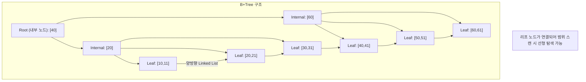
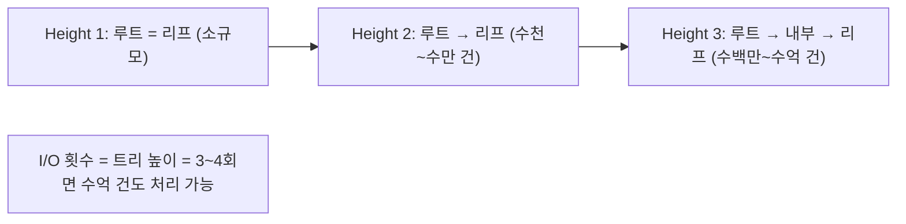
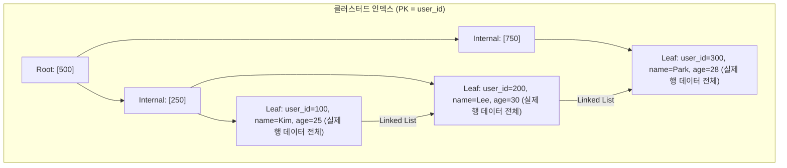
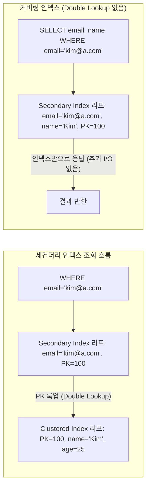
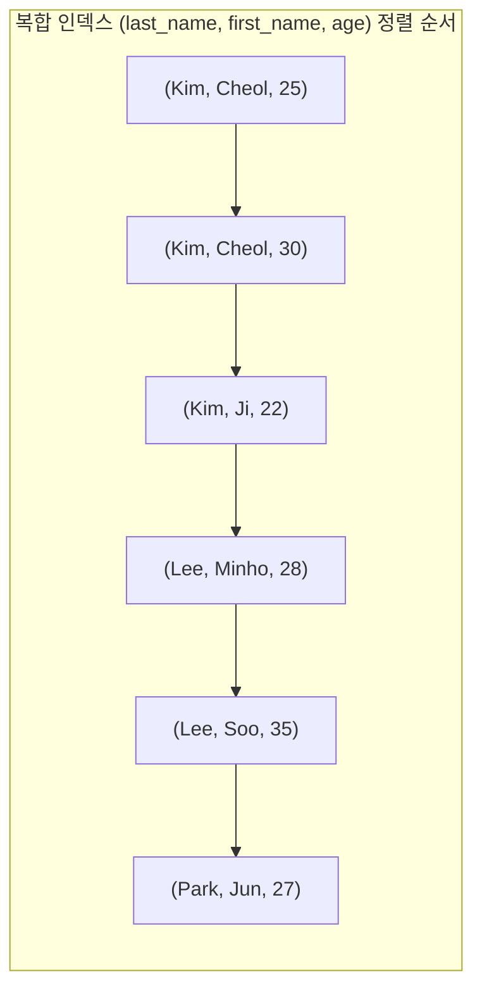

회원 테이블에 1,000만 건이 쌓였다. 특정 이메일 하나를 조회하는 쿼리가 5초 걸린다. 인덱스 하나 추가했더니 3ms로 떨어졌다. 왜 이런 차이가 나는지, 그리고 어떤 컬럼에 걸어야 하는지를 이 글에서 다룬다.

> **비유로 먼저 이해하기**: 인덱스는 책 뒷면의 색인(찾아보기)과 같다. 500페이지 책에서 "트랜잭션"이란 단어를 찾으려면 처음부터 다 읽거나(Full Table Scan), 색인에서 페이지 번호를 찾아 바로 펴면 된다(Index Scan). 인덱스는 정렬된 별도 자료구조이므로, 항목을 추가하거나 삭제할 때마다 이 자료구조도 갱신해야 한다. 색인이 많을수록 책을 수정할 때 모든 색인을 고쳐야 하듯, DB 인덱스도 읽기 속도와 쓰기 비용을 맞바꾸는 구조다.

데이터베이스 성능 튜닝의 핵심은 인덱스를 이해하고 올바르게 설계하는 것이다. 이 글에서는 MySQL InnoDB 기준으로 인덱스의 내부 구조부터 실무 설계 전략, 모니터링까지 모두 다룬다.

---

## 1. 인덱스란? 왜 필요한가?

인덱스(Index)는 데이터베이스 테이블의 특정 컬럼 값과 해당 행의 물리적 위치를 매핑하는 **별도의 자료구조**다. 인덱스가 없으면 MySQL은 테이블의 첫 번째 행부터 마지막 행까지 전부 읽어야 한다. 이를 Full Table Scan이라고 한다. 1,000만 건이면 디스크 I/O가 수십만 번 발생한다. 반면 같은 쿼리에 인덱스가 있으면 B+Tree를 3~4번의 I/O만으로 원하는 행을 찾는다.

인덱스는 **읽기 성능과 쓰기 성능을 맞바꾸는** 구조다. 무조건 많이 만든다고 좋은 것이 아니다.

| 구분 | 인덱스 있음 | 인덱스 없음 |
|---|---|---|
| SELECT (검색) | 빠름 | 느림 (Full Scan) |
| INSERT | 느림 (인덱스 갱신) | 빠름 |
| UPDATE | 느림 (인덱스 갱신) | 빠름 |
| DELETE | 느림 (인덱스 갱신) | 빠름 |
| 디스크 공간 | 추가 공간 필요 | 없음 |

---

## 2. B+Tree 구조 상세 설명

MySQL InnoDB는 대부분의 인덱스를 **B+Tree(B+ 트리)** 구조로 저장한다. B+Tree를 이해하면 왜 범위 검색이 빠른지, 왜 컬럼에 함수를 적용하면 인덱스를 못 쓰는지, 왜 복합 인덱스 컬럼 순서가 중요한지를 자연스럽게 이해할 수 있다.

### B-Tree vs B+Tree 차이

B-Tree는 모든 노드(내부 노드 + 리프 노드)에 실제 데이터 포인터가 있어 내부 노드에서도 데이터를 찾을 수 있다. 그러나 범위 검색 시 트리를 다시 올라갔다 내려가야 하는 비효율이 있다.

B+Tree는 **내부 노드에 키 값만** 저장하고, **리프 노드에만 실제 데이터**를 저장한다. 리프 노드들이 양방향 연결 리스트로 이어져 있어 범위 스캔이 매우 효율적이다. MySQL InnoDB가 이 구조를 채택했다.



리프 노드가 양방향 연결 리스트로 이어져 있어서, `WHERE id BETWEEN 30 AND 60` 같은 범위 쿼리를 수행할 때 리프 노드 레벨에서 선형으로 스캔할 수 있다.

### 페이지(블록) 단위 I/O

InnoDB는 디스크를 **페이지(Page)** 단위로 읽고 쓴다. 기본 페이지 크기는 **16KB**다. 내부 노드 페이지 하나에는 보통 수백~수천 개의 키가 들어간다. 리프 노드 페이지에는 실제 행 데이터가 들어가므로 더 적은 수의 레코드가 들어간다.

InnoDB 페이지 16KB 기준, 키가 8바이트(BIGINT) + 포인터 6바이트 = 14바이트라면 내부 노드 한 페이지에 약 1,170개 키가 저장된다. Height 3 트리에서는 `1170 × 1170 × (리프당 레코드 수)` 건을 3번의 I/O로 탐색할 수 있다. 실제로 Height 3~4 수준이면 수억 건 테이블도 10번 이하 I/O로 검색이 가능하다.

### 트리 높이와 성능



---

## 3. 클러스터드 인덱스 vs 세컨더리 인덱스

### 클러스터드 인덱스 (Clustered Index)

InnoDB에서 **Primary Key(기본키)가 곧 클러스터드 인덱스**다. 이는 가장 중요한 InnoDB 특성이다. 테이블의 실제 행 데이터가 PK 순서대로 **물리적으로 정렬되어** 저장된다. B+Tree의 리프 노드에 실제 행 데이터 전체가 저장되며, 테이블 전체가 하나의 B+Tree 구조다.

이 구조 때문에 PK 기반 조회와 범위 스캔은 매우 빠르다. 동시에 PK 값이 무작위로 증가하는 UUID 같은 경우 삽입 시마다 페이지 분할(Page Split)이 발생하여 성능이 저하된다. 가능하면 AUTO_INCREMENT 정수 PK를 사용하는 것이 좋다.



PK가 없는 경우 InnoDB는 내부적으로 6바이트 숨겨진 Row ID를 클러스터드 인덱스 키로 사용한다. 이 컬럼은 사용자가 접근할 수 없으며, 복제 환경에서 문제를 일으킬 수 있다.

### 세컨더리 인덱스 (Secondary Index)

PK 이외의 모든 인덱스는 세컨더리 인덱스다. 세컨더리 인덱스의 **리프 노드에는 실제 행 데이터 대신 PK 값이 저장**된다.

`SELECT name, age FROM users WHERE email = 'kim@example.com'` 쿼리가 실행되면 두 단계를 거친다. 먼저 `idx_email` 세컨더리 인덱스에서 이메일을 탐색하여 PK 값을 얻는다. 그 다음 획득한 PK 값으로 클러스터드 인덱스를 재탐색하여 실제 행(`name`, `age`)을 반환한다. 이 두 단계 조회를 **"PK 룩업(Double Lookup)"** 이라고 한다.



**핵심**: 세컨더리 인덱스를 통한 조회는 항상 두 번의 B+Tree 탐색이 발생한다. 커버링 인덱스(5장)를 적용하면 이 두 번째 탐색을 제거할 수 있다.

---

## 4. 인덱스 스캔 방식

MySQL 옵티마이저는 쿼리와 인덱스 구조에 따라 다양한 스캔 방식을 선택한다. EXPLAIN의 `type` 컬럼이 이 스캔 방식을 나타낸다.

### Full Table Scan (type: ALL)

인덱스가 없거나 옵티마이저가 풀스캔이 낫다고 판단할 때 발생한다. 소규모 테이블이나 전체 행의 대부분을 반환해야 할 때는 오히려 풀스캔이 효율적일 수 있다. 옵티마이저는 반환 행이 전체의 약 20~30% 이상이면 인덱스 대신 풀스캔을 선택하기도 한다.

### Index Range Scan (type: range)

B+Tree에서 시작 키를 찾은 후, 리프 노드 연결 리스트를 따라 범위 끝까지 스캔한다. 가장 일반적이고 효율적인 인덱스 사용 방식이다. `BETWEEN`, `>`, `<`, `IN`, `LIKE 'abc%'` 등에서 발생한다.

```sql
SELECT * FROM orders WHERE order_date BETWEEN '2026-01-01' AND '2026-03-31';
-- EXPLAIN type: range
-- B+Tree에서 2026-01-01을 찾은 후 리프 리스트를 따라 2026-03-31까지 선형 스캔
```

### Index Unique Scan (type: const / eq_ref)

PK 또는 UNIQUE 인덱스로 단 1건을 조회한다. B+Tree를 루트에서 리프까지 한 경로만 탐색하여 최대 1건만 반환한다. 가장 빠른 인덱스 접근 방식이다.

```sql
SELECT * FROM users WHERE user_id = 42; -- type: const
```

### Index Skip Scan (MySQL 8.0+)

복합 인덱스에서 **첫 번째 컬럼을 건너뛰고** 두 번째 컬럼부터 조건을 적용하는 방식이다. 첫 번째 컬럼의 고유값 수가 적을 때 효과적이다.

```sql
-- 복합 인덱스 (gender, age)가 있을 때
-- gender 조건 없이 age로만 검색
SELECT * FROM users WHERE age = 25;
-- MySQL 8.0+: Skip Scan으로 인덱스 활용 가능
-- 내부 동작: gender 고유값 목록(M, F) 각각에 대해 age=25 범위 스캔 후 합침
-- EXPLAIN Extra: Using index for skip scan
```

### Loose Index Scan

각 그룹의 첫 번째/마지막 레코드만 읽는 방식으로 인덱스를 성기게(loosely) 스캔한다. GROUP BY와 MIN/MAX 함수 조합에서 발생하며 EXPLAIN Extra에 `Using index for group-by`로 표시된다.

```sql
SELECT gender, MIN(age) FROM users GROUP BY gender;
-- (gender, age) 인덱스가 있으면 Loose Index Scan: 각 gender 그룹의 첫 행만 읽음
-- Extra: Using index for group-by
```

---

## 5. 커버링 인덱스 (Covering Index / Index Only Scan)

### 동작 원리

쿼리에 필요한 **모든 컬럼이 인덱스에 포함**되어 있으면, 클러스터드 인덱스(실제 행)를 조회하지 않고 인덱스만으로 결과를 반환할 수 있다. 이를 **커버링 인덱스** 또는 **Index Only Scan**이라고 한다.

커버링 인덱스가 적용되면 EXPLAIN의 Extra 컬럼에 `Using index`가 표시된다. `Using index condition`(Index Condition Pushdown)과 혼동하지 않도록 주의해야 한다.

```sql
-- 인덱스: idx_email_name ON users(email, name)

-- 커버링 인덱스 적용 가능: name이 인덱스에 있음
SELECT name FROM users WHERE email = 'kim@example.com';
-- EXPLAIN Extra: Using index (인덱스만으로 응답, 클러스터드 인덱스 조회 없음)

-- 커버링 인덱스 적용 불가: age가 인덱스에 없음
SELECT name, age FROM users WHERE email = 'kim@example.com';
-- EXPLAIN Extra: (없음) → PK 룩업 발생
```

### 왜 빠른가?

일반 세컨더리 인덱스 조회는 인덱스 B+Tree 탐색(3~4 I/O)에 더해 클러스터드 인덱스 B+Tree 재탐색(3~4 I/O 추가)이 발생하여 총 6~8 I/O가 필요하다. 커버링 인덱스는 인덱스 탐색(3~4 I/O)만으로 결과를 바로 반환하므로 절반 이하의 I/O로 처리된다. 특히 대용량 데이터에서 이 차이는 수십 배 성능 향상으로 나타날 수 있다.

### 커버링 인덱스 설계 예시

커버링 인덱스를 설계할 때는 WHERE 조건 컬럼뿐 아니라 SELECT 절의 컬럼도 인덱스에 포함시킨다. 단, 너무 많은 컬럼을 인덱스에 추가하면 인덱스 크기가 커져 쓰기 성능이 저하된다는 트레이드오프가 있다.

```sql
-- 자주 실행되는 쿼리
SELECT user_id, name, status FROM orders WHERE user_id = 100 AND status = 'PAID';

-- 커버링 인덱스: WHERE 조건 컬럼 + SELECT 컬럼 모두 포함
CREATE INDEX idx_user_status_name ON orders(user_id, status, name);
-- user_id, status: WHERE 조건 → 인덱스 탐색에 사용
-- name: SELECT 컬럼 → 커버링을 위해 추가
-- user_id는 PK이므로 InnoDB 세컨더리 인덱스에 자동 포함됨
```

**핵심**: 커버링 인덱스는 잘 활용하면 극적인 성능 향상을 제공하지만, SELECT 컬럼이 많을수록 인덱스 크기가 커져 쓰기 성능에 부담이 된다. 자주 실행되는 조회 쿼리에만 선별적으로 적용해야 한다.

---

## 6. 복합 인덱스 (Composite Index)

### 컬럼 순서의 중요성

복합 인덱스는 **지정한 컬럼 순서대로** B+Tree 키가 구성된다. 예를 들어 `(last_name, first_name, age)` 인덱스의 리프 노드는 first_name, last_name, age 순으로 정렬되며, 이 순서가 어떤 쿼리에서 인덱스를 활용할 수 있는지를 결정한다.



### 최좌선 접두사 규칙 (Leftmost Prefix Rule)

복합 인덱스 `(A, B, C)`는 왼쪽부터 연속된 컬럼 조합에서만 유효하다. 중간 컬럼을 건너뛰거나 첫 번째 컬럼 없이는 인덱스를 사용할 수 없다.

| 조건 | 인덱스 사용 여부 | 이유 |
|---|---|---|
| `WHERE A = ?` | 사용 가능 | 최좌선 접두사 충족 |
| `WHERE A = ? AND B = ?` | 사용 가능 | 최좌선 접두사 충족 |
| `WHERE A = ? AND B = ? AND C = ?` | 완전 활용 | 모든 컬럼 사용 |
| `WHERE A = ? AND C = ?` | A만 사용 | C는 B 없이 인덱스 탐색 불가 |
| `WHERE B = ?` | 사용 불가 | 첫 번째 컬럼 누락 |
| `WHERE C = ?` | 사용 불가 | 첫 번째 컬럼 누락 |

```sql
-- idx_name_age: (last_name, first_name, age)

-- 인덱스 활용 가능
SELECT * FROM employees WHERE last_name = 'Kim';
SELECT * FROM employees WHERE last_name = 'Kim' AND first_name = 'Cheol';
SELECT * FROM employees WHERE last_name = 'Kim' AND first_name = 'Cheol' AND age = 25;

-- 인덱스 활용 불가: 첫 번째 컬럼(last_name) 누락
SELECT * FROM employees WHERE first_name = 'Cheol';
SELECT * FROM employees WHERE age = 25;
```

### 범위 조건의 영향

복합 인덱스에서 **범위 조건(`>`, `<`, `BETWEEN`, `LIKE 'prefix%'`) 이후의 컬럼은 인덱스 탐색에 활용되지 않는다**. 범위 조건에서 인덱스 탐색이 끝나고, 이후 컬럼은 행 레벨에서 필터링된다.

```sql
-- 인덱스: (age, name, status)
SELECT * FROM users WHERE age > 20 AND name = 'Kim' AND status = 'active';
-- age > 20: 인덱스 Range Scan (인덱스 탐색 O)
-- name = 'Kim': 범위 조건 이후 → 인덱스 탐색 X, 행 레벨 필터링
-- status = 'active': 행 레벨 필터링

-- 올바른 인덱스 순서: 등호 조건을 앞에
-- 인덱스: (name, status, age)
SELECT * FROM users WHERE name = 'Kim' AND status = 'active' AND age > 20;
-- name: 인덱스 탐색 O (등호)
-- status: 인덱스 탐색 O (등호)
-- age > 20: 범위 스캔 → 여기서 인덱스 탐색 종료
```

**복합 인덱스 설계 원칙:**
1. 등호(=) 조건 컬럼을 앞에 배치
2. 범위 조건 컬럼을 뒤에 배치
3. ORDER BY / GROUP BY 컬럼을 마지막에 배치
4. 쿼리 패턴이 카디널리티보다 우선

### 카디널리티와 컬럼 순서

카디널리티(Cardinality)는 해당 컬럼의 고유값 수다. 일반적으로 카디널리티가 높은 컬럼(고유값 많음)을 앞에 배치하면 효율적이지만, **쿼리 패턴이 항상 최우선이다**.

```sql
-- 카디널리티 확인
SELECT
    COUNT(DISTINCT status) AS status_card,    -- 예: 3 (active, inactive, banned)
    COUNT(DISTINCT country) AS country_card,  -- 예: 50
    COUNT(DISTINCT user_id) AS user_id_card   -- 예: 1,000,000
FROM users;

-- 쿼리 패턴: WHERE user_id = ? AND status = ?
-- user_id(카디널리티 높음)를 앞에 배치
CREATE INDEX idx_good ON orders(user_id, status);
```

---

## 7. 인덱스가 동작하지 않는 경우

인덱스가 있어도 옵티마이저가 사용하지 않거나 사용할 수 없는 경우가 있다. 이런 패턴을 **인덱스 무력화(Index Suppression)**라고 한다. 성능 문제의 상당수가 이 패턴에서 비롯된다.

### 함수/연산 적용 시

인덱스 컬럼에 함수나 연산을 적용하면 B+Tree 탐색이 불가능해진다. 인덱스는 원래 컬럼 값으로 정렬되어 있는데, 함수 결과는 다른 값이기 때문이다.

```sql
-- 인덱스: idx_created_at ON orders(created_at)

-- 나쁨: 함수 적용 → 인덱스 무력화 → 풀 테이블 스캔
SELECT * FROM orders WHERE YEAR(created_at) = 2026;
SELECT * FROM orders WHERE DATE(created_at) = '2026-01-01';

-- 좋음: 범위 조건으로 변환 → 인덱스 사용
SELECT * FROM orders WHERE created_at >= '2026-01-01' AND created_at < '2027-01-01';
SELECT * FROM orders WHERE created_at >= '2026-01-01 00:00:00' AND created_at < '2026-01-02 00:00:00';

-- 나쁨: 산술 연산 적용
SELECT * FROM products WHERE price * 1.1 > 10000;

-- 좋음: 상수 쪽을 계산
SELECT * FROM products WHERE price > 10000 / 1.1;
```

**핵심**: 인덱스 컬럼을 조작하는 것이 아니라, 비교 대상(상수 쪽)을 조작해야 한다. 컬럼은 항상 "날 것" 그대로 두어야 인덱스를 활용할 수 있다.

### 타입 불일치 (암시적 형변환)

컬럼 타입과 비교값 타입이 다르면 MySQL이 암시적 형변환을 수행하는데, 이 과정에서 인덱스가 무력화될 수 있다. VARCHAR 컬럼을 숫자로 비교할 때가 특히 위험하다.

```sql
-- 테이블 정의: phone VARCHAR(20), 인덱스 존재

-- 나쁨: 정수로 비교 → VARCHAR 컬럼 전체를 숫자로 변환 → 인덱스 무력화
SELECT * FROM users WHERE phone = 01012345678;

-- 좋음: 문자열로 비교
SELECT * FROM users WHERE phone = '010-1234-5678';

-- INT 컬럼에 문자열 비교: 문자열이 숫자로 변환되어 OK
SELECT * FROM orders WHERE user_id = '100';  -- user_id가 INT이면 인덱스 사용 가능

-- 하지만 VARCHAR 컬럼에 정수 비교: 컬럼 전체가 형변환 → 인덱스 무력화
SELECT * FROM users WHERE phone = 1012345678;  -- phone이 VARCHAR이면 인덱스 무력화
```

### LIKE '%keyword'

B+Tree는 왼쪽부터 정렬되어 있으므로, 접두사가 `%`이면 어디서부터 탐색해야 할지 알 수 없어 풀스캔이 된다. 접두사 매칭(Prefix Matching)만 인덱스를 사용할 수 있다.

```sql
-- 인덱스 사용 가능: 접두사 매칭
SELECT * FROM users WHERE name LIKE 'Kim%';

-- 인덱스 사용 불가: 전방 와일드카드
SELECT * FROM users WHERE name LIKE '%Kim';
SELECT * FROM users WHERE name LIKE '%Kim%';
-- 해결책: FULLTEXT 인덱스 또는 Elasticsearch 같은 검색 엔진 도입
```

### OR 조건

OR로 연결된 조건이 서로 다른 인덱스를 사용해야 할 때 성능이 저하된다. MySQL은 Index Merge를 시도할 수 있지만, 두 인덱스를 각각 스캔 후 Union하는 방식은 효율이 낮다.

```sql
-- OR 조건: Index Merge 시도 (비효율적일 수 있음)
SELECT * FROM orders WHERE status = 'PAID' OR type = 'ONLINE';

-- UNION ALL로 분리: 각 인덱스를 완전히 활용
SELECT * FROM orders WHERE status = 'PAID'
UNION ALL
SELECT * FROM orders WHERE type = 'ONLINE' AND status != 'PAID';
```

### NOT, != 연산

부정 조건은 대부분의 행을 반환할 가능성이 높아 옵티마이저가 풀스캔을 선택한다. 가능하면 긍정 조건으로 바꿔 설계하는 것이 좋다.

```sql
-- 인덱스 활용 어려움: 부정 조건
SELECT * FROM orders WHERE status != 'CANCELLED';
SELECT * FROM orders WHERE status NOT IN ('CANCELLED', 'REFUNDED');

-- 가능하면 긍정 조건으로 대체
SELECT * FROM orders WHERE status IN ('PAID', 'PENDING', 'PROCESSING');
```

---

## 8. 인덱스 종류

### UNIQUE 인덱스

UNIQUE 인덱스는 컬럼 값의 유일성을 보장하면서 동시에 인덱스 역할을 한다. UNIQUE 제약과 인덱스가 결합된 형태다. 중복 값 삽입 시 즉시 오류가 발생한다. NULL은 UNIQUE 제약에서 예외로 처리되어 여러 NULL 값이 허용된다.

```sql
CREATE UNIQUE INDEX idx_unique_email ON users(email);

-- 또는 테이블 정의 시 (내부적으로 UNIQUE INDEX 생성)
CREATE TABLE users (
    user_id BIGINT PRIMARY KEY,
    email   VARCHAR(200) UNIQUE
);
```

### FULLTEXT 인덱스

자연어 전문 검색을 위한 역색인(Inverted Index) 구조의 인덱스다. B+Tree 인덱스로는 불가능한 `%keyword%` 패턴 검색을 지원한다. 한국어 검색을 위해서는 ngram 파서를 사용해야 한다.

```sql
CREATE TABLE articles (
    id      INT PRIMARY KEY,
    title   VARCHAR(500),
    content TEXT,
    FULLTEXT INDEX ft_idx (title, content) WITH PARSER ngram  -- 한국어 지원
);

-- 자연어 모드 검색
SELECT * FROM articles
WHERE MATCH(title, content) AGAINST('데이터베이스 인덱스' IN NATURAL LANGUAGE MODE);

-- Boolean 모드 검색 (+ 필수, - 제외)
SELECT * FROM articles
WHERE MATCH(title, content) AGAINST('+인덱스 -해시' IN BOOLEAN MODE);
```

### SPATIAL 인덱스

지리 공간 데이터를 위한 R-Tree 기반 인덱스다. B+Tree 대신 R-Tree 구조를 사용하며, 위도/경도, 다각형 등 2D 공간 데이터 검색에 특화되어 있다.

```sql
CREATE TABLE locations (
    id    INT PRIMARY KEY,
    name  VARCHAR(100),
    coord POINT NOT NULL,
    SPATIAL INDEX sp_idx (coord)
);

INSERT INTO locations VALUES (1, '서울시청', ST_GeomFromText('POINT(37.5665 126.9780)'));

SELECT name FROM locations
WHERE ST_Within(coord, ST_GeomFromText('POLYGON((...))'));
```

### Hash 인덱스와 Adaptive Hash Index

Memory 스토리지 엔진은 Hash 인덱스를 사용한다. 등호(=) 검색은 O(1)로 매우 빠르지만, 범위 검색과 정렬에는 사용할 수 없다.

InnoDB의 **Adaptive Hash Index(AHI)** 는 자주 접근되는 B+Tree 페이지에 대해 내부적으로 자동으로 해시 인덱스를 구축하여 성능을 향상시킨다. 사용자가 명시적으로 생성할 수 없으며 InnoDB가 자동 관리한다.

| 특성 | Hash Index | B+Tree Index |
|---|---|---|
| 등호(=) 검색 | O(1) — 매우 빠름 | O(log n) |
| 범위 검색 | 불가 | 가능 |
| 정렬 활용 | 불가 | 가능 |

---

## 9. 인덱스와 정렬/그룹핑

### ORDER BY + 인덱스 활용

인덱스는 이미 정렬된 순서로 데이터를 제공하므로, **적절한 인덱스가 있으면 별도 정렬(filesort) 없이** 결과를 반환할 수 있다. EXPLAIN Extra에 `Using filesort`가 없으면 인덱스 순서를 활용하고 있다는 의미다.

```sql
-- 인덱스: (status, created_at)

-- filesort 없음: WHERE + ORDER BY 컬럼이 복합 인덱스와 일치
SELECT * FROM orders WHERE status = 'PAID' ORDER BY created_at ASC;
SELECT * FROM orders WHERE status = 'PAID' ORDER BY created_at DESC; -- 역방향 스캔

-- filesort 발생: status 조건 없이 created_at만 정렬
SELECT * FROM orders ORDER BY created_at;

-- MySQL 8.0부터 혼합 방향 인덱스 지원
CREATE INDEX idx_mixed ON orders(status ASC, created_at DESC);
```

### GROUP BY + 인덱스 활용

GROUP BY와 집계 함수 조합에서 인덱스를 활용하면 Loose Index Scan이 적용되어 극적인 성능 향상이 가능하다.

```sql
-- 인덱스: (department, salary)

-- Loose Index Scan: 각 department 그룹의 첫/마지막 salary만 읽음
SELECT department, MAX(salary) FROM employees GROUP BY department;
-- EXPLAIN Extra: Using index for group-by

-- 임시 테이블 발생: GROUP BY 컬럼에 인덱스 없음
SELECT status, COUNT(*) FROM orders GROUP BY status;
-- EXPLAIN Extra: Using temporary; Using filesort
-- → idx_status 인덱스 추가로 해결
```

### filesort 회피 전략

`LIMIT`과 인덱스 정렬을 결합하면 매우 효율적인 페이지네이션이 가능하다. 그러나 OFFSET이 커지면 결국 많은 행을 읽어야 하므로 지연 조인(Deferred Join) 기법을 활용한다.

```sql
-- 빠름: created_at 인덱스 있으면 마지막 10개만 읽고 종료
SELECT * FROM orders ORDER BY created_at DESC LIMIT 10;

-- 느림: OFFSET 100000이면 100000개 행을 읽어 skip
SELECT * FROM orders ORDER BY created_at DESC LIMIT 100000, 10;

-- 빠른 방법: 지연 조인 (Deferred Join)
-- 서브쿼리는 커버링 인덱스로 order_id만 추출, 이후 실제 행 조회
SELECT o.* FROM orders o
INNER JOIN (
    SELECT order_id FROM orders ORDER BY created_at DESC LIMIT 100000, 10
) sub ON o.order_id = sub.order_id;
```

---

## 10. 인덱스 설계 실무 가이드

### 선택도(Selectivity) 계산

선택도는 인덱스의 효율성을 나타내는 지표다. 값이 1에 가까울수록 선택도가 높고 인덱스 효율이 좋다.

```
선택도 = 고유값 수(Distinct Values) / 전체 행 수(Total Rows)
```

```sql
-- 각 컬럼의 선택도 계산
SELECT
    COUNT(DISTINCT status) / COUNT(*) AS status_selectivity,
    COUNT(DISTINCT user_id) / COUNT(*) AS user_id_selectivity,
    COUNT(DISTINCT email) / COUNT(*) AS email_selectivity
FROM orders;

-- 결과 해석:
-- status: 0.000003 (3가지 값, 100만 행) → 단독 인덱스 비효율
-- user_id: 0.9500 (95만 명, 100만 행) → 인덱스 매우 효율적
-- email: 0.9999 (거의 유일) → 인덱스 최적
```

일반적으로 선택도 0.1(10%) 이상이면 인덱스가 효율적이다. `gender`, `boolean` 같은 컬럼 단독 인덱스는 대부분 비효율적이다. 단, 쿼리 패턴과 조건 조합에 따라 선택도가 낮아도 복합 인덱스의 일부로 활용될 수 있다.

### 인덱스 수와 쓰기 성능 트레이드오프

인덱스가 많을수록 INSERT/UPDATE/DELETE 비용이 증가한다. 인덱스 10개가 있는 테이블에 INSERT하면 10개의 B+Tree를 모두 갱신해야 한다. 쓰기가 많은 테이블(로그, 이벤트 등)에서는 인덱스 수를 최소화해야 한다.

```sql
-- 쓰기 위주 테이블: 인덱스 최소화
CREATE TABLE event_log (
    id         BIGINT AUTO_INCREMENT PRIMARY KEY,
    user_id    BIGINT,
    event_type VARCHAR(50),
    created_at DATETIME DEFAULT NOW()
);
-- 주로 user_id로만 조회한다면 단일 인덱스만
CREATE INDEX idx_user_id ON event_log(user_id);

-- 읽기 위주 테이블: 다양한 인덱스 허용
CREATE INDEX idx_category_price ON products(category_id, price);
CREATE INDEX idx_status_created ON products(status, created_at);
```

실무 권장 사항: 테이블당 인덱스 5~6개 이하 유지, 사용되지 않는 인덱스는 제거, 자주 변경되는 컬럼에는 인덱스 최소화.

---

## 11. 인덱스 모니터링

### EXPLAIN 핵심 컬럼 분석

EXPLAIN은 쿼리를 실행하지 않고 실행 계획을 보여준다. 가장 먼저 `type`이 `ALL`(풀 스캔)인지 확인하고, `Extra`에 `Using filesort`나 `Using temporary`가 있으면 인덱스 최적화 기회다.

```sql
EXPLAIN SELECT * FROM orders o
JOIN users u ON o.user_id = u.user_id
WHERE o.status = 'PAID' AND u.country = 'KR'
ORDER BY o.created_at DESC
LIMIT 100;
```

| 컬럼 | 의미 |
|---|---|
| `type` | 접근 방식 (system > const > eq_ref > ref > range > index > ALL) |
| `key` | 실제 사용된 인덱스. NULL이면 인덱스 미사용 |
| `key_len` | 사용된 인덱스 바이트 수 (복합 인덱스에서 몇 개 컬럼 사용했는지 파악) |
| `rows` | 예상 스캔 행 수 (작을수록 좋음) |
| `Extra: Using index` | 커버링 인덱스 활용 — 매우 좋음 |
| `Extra: Using filesort` | 추가 정렬 필요 — 인덱스 재검토 |
| `Extra: Using temporary` | 임시 테이블 사용 — 인덱스 재검토 |

### 미사용 인덱스 탐지

사용되지 않는 인덱스는 쓰기 성능만 저하시키는 부담이다. `sys.schema_unused_indexes`로 주기적으로 확인하고 제거해야 한다.

```sql
-- 미사용 인덱스 확인 (sys 스키마)
SELECT * FROM sys.schema_unused_indexes WHERE object_schema = 'mydb';

-- 중복 인덱스 탐지 (예: idx_a가 idx_a_b의 접두사인 경우)
SELECT * FROM sys.schema_redundant_indexes WHERE table_schema = 'mydb';

-- Performance Schema 직접 조회: 한 번도 읽힌 적 없는 인덱스
SELECT object_name, index_name
FROM performance_schema.table_io_waits_summary_by_index_usage
WHERE object_schema = 'mydb'
  AND index_name IS NOT NULL
  AND index_name != 'PRIMARY'
  AND count_read = 0
ORDER BY object_name, index_name;
```

### 인덱스 통계 갱신

```sql
-- 통계 업데이트 (대량 변경 후 필수)
ANALYZE TABLE orders;
ANALYZE TABLE users, products;  -- 여러 테이블 동시 가능

-- 특정 테이블만 더 정밀한 통계 수집
ALTER TABLE orders STATS_SAMPLE_PAGES = 50;
ANALYZE TABLE orders;

-- 인덱스 카디널리티 확인 (Cardinality 값이 실제와 크게 다르면 ANALYZE 필요)
SHOW INDEX FROM orders;
```

---

<details class="extreme-scenario-details" ontoggle="if(this.open){var ad=this.querySelector('.extreme-scenario-ad');if(ad&&!ad.dataset.loaded){ad.dataset.loaded='1';(adsbygoogle=window.adsbygoogle||[]).push({});}}">
<summary class="extreme-scenario-summary">
<span class="extreme-scenario-icon">🔥</span>
<span class="extreme-scenario-label">극한 시나리오 — 클릭하여 펼치기</span>
<span class="extreme-scenario-toggle"></span>
</summary>
<div class="extreme-scenario-body">
<div class="extreme-scenario-ad" style="text-align:center; margin-bottom:1.5em;">
<ins class="adsbygoogle"
     style="display:block"
     data-ad-client="ca-pub-7225106491387870"
     data-ad-slot="0000000000"
     data-ad-format="auto"
     data-full-width-responsive="true"></ins>
</div>
<div class="extreme-scenario-content" markdown="1">

### 시나리오 1: 1억 건 주문 테이블 페이지네이션 성능 저하

상품 목록 페이지가 사용자가 많아지면서 점점 느려진다. `LIMIT 10 OFFSET 5000000` 패턴이 원인이다. OFFSET이 클수록 옵티마이저는 500만 건을 읽어 버린 후 마지막 10개를 반환한다. 인덱스가 있어도 이 500만 건의 접근은 피할 수 없다.

해결책은 Keyset Pagination(커서 기반 페이징)이다. 이전 페이지의 마지막 `id`를 커서로 사용하면 항상 LIMIT 10건만 읽는다.

```sql
-- 문제: OFFSET이 클수록 점점 느려짐
SELECT * FROM orders ORDER BY id DESC LIMIT 10 OFFSET 5000000;

-- 해결: Keyset Pagination
-- 첫 페이지
SELECT * FROM orders ORDER BY id DESC LIMIT 10;
-- 다음 페이지 (이전 페이지 마지막 id = 9999990)
SELECT * FROM orders WHERE id < 9999990 ORDER BY id DESC LIMIT 10;
-- 항상 LIMIT 10만 읽음 → O(1) 페이징
```

### 시나리오 2: 인덱스가 있는데 풀 스캔이 발생하는 경우

주문 상태별 조회 쿼리에 `idx_status`가 있는데 EXPLAIN에서 `type: ALL`이 나온다. 원인은 데이터 분포다. `status='completed'`가 전체의 95%라면 옵티마이저는 인덱스가 비효율적이라고 판단하고 풀스캔을 선택한다.

이 경우 실제로 자주 조회되는 값이 `status='pending'`(5%)이라면 힌트로 인덱스를 강제하거나, 히스토그램으로 분포 정보를 옵티마이저에게 제공한다.

```sql
-- 데이터 분포 확인
SELECT status, COUNT(*), COUNT(*) / SUM(COUNT(*)) OVER() * 100 AS pct
FROM orders GROUP BY status;
-- pending: 5%, processing: 0.1%, completed: 94.9%

-- 히스토그램으로 분포 정보 제공 (MySQL 8.0+)
ANALYZE TABLE orders UPDATE HISTOGRAM ON status WITH 10 BUCKETS;

-- 이제 옵티마이저가 'pending'은 5%임을 알고 인덱스를 선택
EXPLAIN SELECT * FROM orders WHERE status = 'pending';
```

### 시나리오 3: 배치 INSERT 후 인덱스 성능 저하

야간 배치로 1,000만 건을 INSERT했더니 다음 날 인덱스 스캔이 오히려 풀스캔보다 느려졌다. B+Tree 페이지 분할이 대규모로 발생하여 인덱스가 단편화(Fragmentation)된 것이다.

`innodb_online_alter_log_max_size` 한도 내에서 `OPTIMIZE TABLE`로 인덱스를 재구성하거나, 배치 INSERT 전에 인덱스를 비활성화했다가 완료 후 재활성화하는 방식을 고려한다.

```sql
-- 인덱스 단편화 확인
SELECT table_name, data_free, data_length
FROM information_schema.tables
WHERE table_schema = 'mydb' AND table_name = 'orders';

-- 인덱스 재구성 (서비스 중 가능, 온라인 DDL)
ALTER TABLE orders ENGINE=InnoDB, ALGORITHM=INPLACE, LOCK=NONE;

-- 또는 (더 빠르지만 락 발생)
OPTIMIZE TABLE orders;
```

---
</div>
</div>
</details>

## 13. 실무에서 자주 하는 실수

### 실수 1: 복합 인덱스 컬럼 순서를 잘못 설계

`WHERE user_id = ? ORDER BY created_at DESC` 쿼리에 `INDEX(created_at, user_id)`를 만들면 거의 효과가 없다. `user_id` 조건이 먼저이므로 `INDEX(user_id, created_at)`으로 만들어야 WHERE 필터링과 ORDER BY를 모두 인덱스로 처리할 수 있다.

### 실수 2: PK 없는 테이블 생성

PK가 없으면 InnoDB는 내부 6바이트 Row ID를 클러스터드 인덱스로 사용한다. 이 컬럼은 사용자가 접근할 수 없고, Row-based Replication에서 정확한 행 식별이 불가능해 복제 불일치가 발생할 수 있다. 모든 테이블에 명시적 PK를 정의해야 한다.

### 실수 3: UUID를 PK로 사용

UUID는 무작위 값이므로 삽입 시마다 B+Tree 중간 페이지에 삽입이 발생하여 페이지 분할(Page Split)이 빈번하게 일어난다. 쓰기 성능이 크게 저하되고 인덱스 단편화도 심해진다. UUID가 필요하다면 별도 컬럼에 두고, PK는 AUTO_INCREMENT BIGINT를 사용하는 것이 좋다.

### 실수 4: 인덱스가 있는데 SELECT * 사용

`SELECT *`는 인덱스에 없는 컬럼도 포함하므로 커버링 인덱스가 적용되지 않는다. 필요한 컬럼만 명시적으로 지정하고, 그 컬럼들을 인덱스에 포함시키면 PK 룩업 없이 인덱스만으로 응답할 수 있다.

### 실수 5: 사용되지 않는 인덱스 방치

인덱스를 추가하면서 이전 인덱스를 삭제하지 않거나, 쿼리 패턴이 바뀌었는데 인덱스를 정리하지 않으면 쓰기 성능만 저하된다. `sys.schema_unused_indexes`를 분기마다 확인하고 미사용 인덱스를 제거하는 습관이 필요하다.

---

## 정리: 인덱스 설계 체크리스트

- 자주 실행되는 쿼리의 WHERE, JOIN, ORDER BY 컬럼 파악
- 선택도(Selectivity) 계산 → 낮은 컬럼 단독 인덱스 지양
- 복합 인덱스: 등호(=) 조건 컬럼 앞, 범위 조건 컬럼 뒤, ORDER BY 컬럼 마지막
- 커버링 인덱스 가능 여부 검토 → SELECT 컬럼까지 인덱스에 포함
- EXPLAIN으로 `type=ALL`, `Extra=Using filesort/temporary` 확인
- 인덱스 무력화 패턴 점검 (함수 적용, 형변환, `LIKE '%'`, OR)
- `sys.schema_unused_indexes`로 미사용 인덱스 주기적 삭제
- 대량 변경 후 `ANALYZE TABLE`로 통계 갱신
- 쓰기가 많은 테이블은 인덱스 수 최소화
- `EXPLAIN ANALYZE`로 실제 실행 계획과 예상 계획 비교
