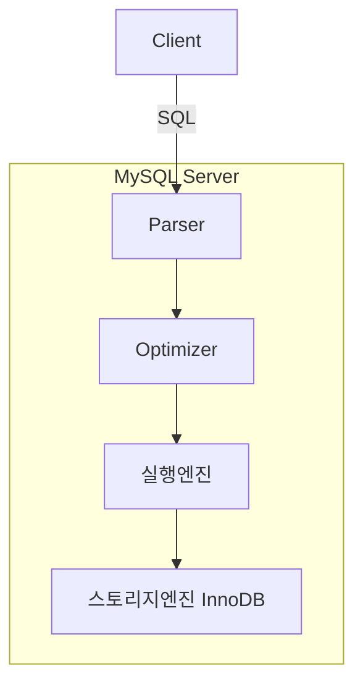
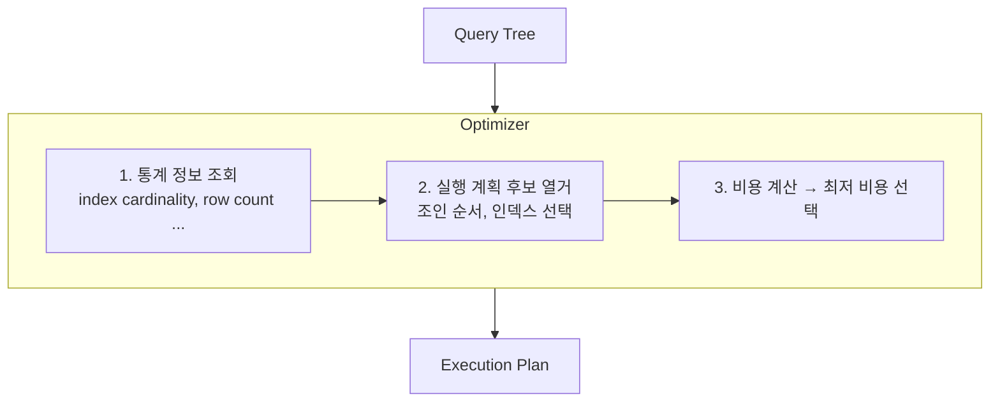
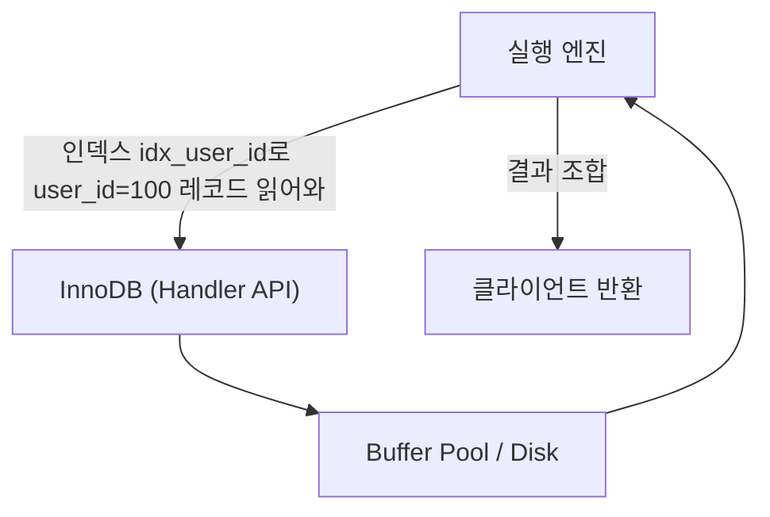
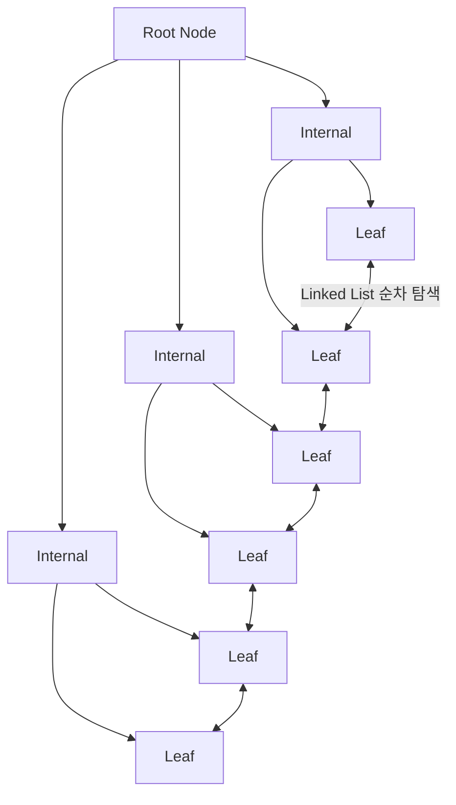
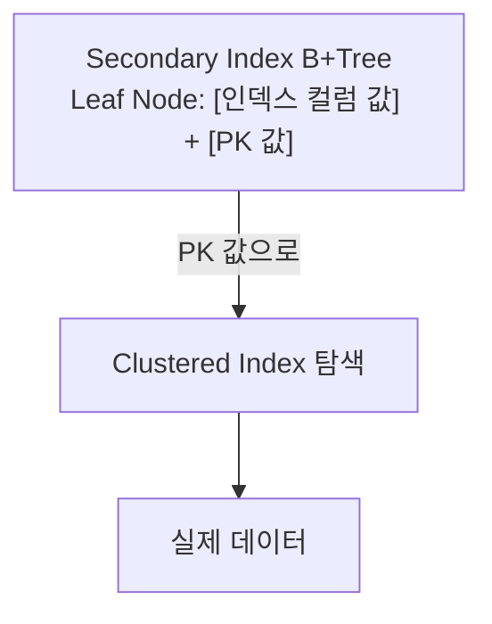
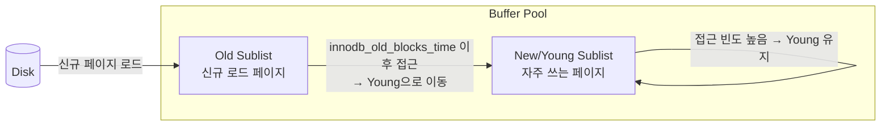
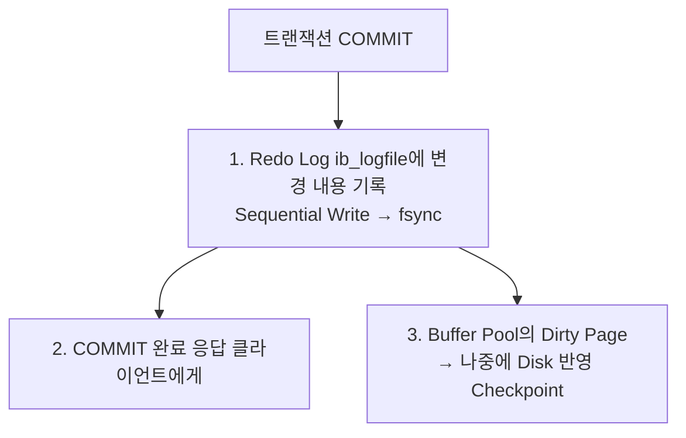
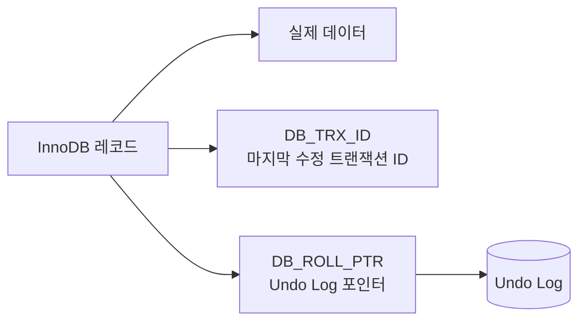
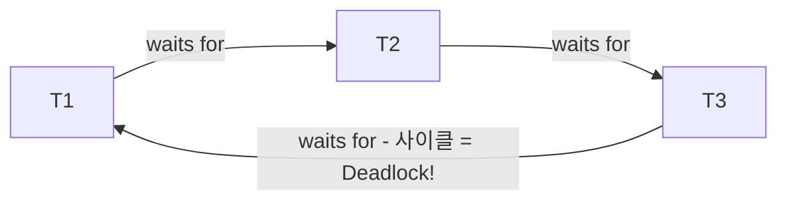
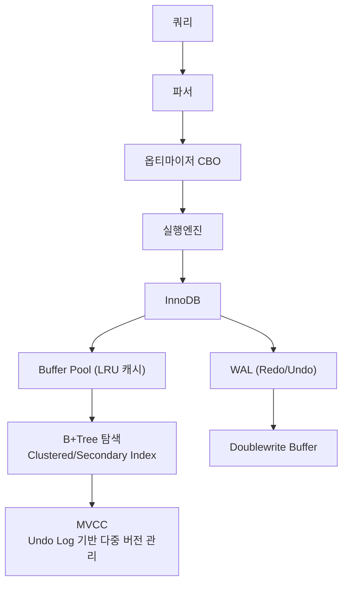

운영 중인 서비스에서 갑자기 특정 쿼리가 10배 느려졌다. 코드는 그대로인데 왜일까? 통계가 오래되어 옵티마이저가 잘못된 실행 계획을 선택했거나, Buffer Pool이 가득 차 디스크 I/O가 폭발한 것일 수 있다. DB 내부 동작 원리를 모르면 이런 상황에서 무엇을 봐야 할지조차 모른다. 이 글에서는 MySQL/InnoDB를 기준으로 쿼리 하나가 처리되는 전 과정을 파고든다.

> **비유로 먼저 이해하기**: DB는 거대한 도서관이다. 사서(옵티마이저)가 요청을 받으면 어느 서가(인덱스)를 먼저 뒤질지 계획을 짜고, 자주 찾는 책은 데스크 근처(Buffer Pool)에 꺼내 놓아 매번 서고 깊숙이 들어가지 않아도 된다. 무언가 수정했다면 변경 일지(WAL)에 먼저 기록하고 나중에 실제 서가에 반영한다.

<br>

## 1. 쿼리 실행 과정



### 1-1. Parser (파서)

클라이언트가 보낸 SQL 문자열을 받아 **Lexical Analysis(어휘 분석)** 후 **Parse Tree**를 생성한다.

- SQL 문법 오류(`Syntax Error`)는 이 단계에서 잡힌다.
- 키워드, 테이블명, 컬럼명, 리터럴을 토큰으로 분리
- Parse Tree → Query Tree로 변환

### 1-2. Preprocessor (전처리기)

- 테이블/컬럼 존재 여부, 접근 권한 검증
- `*` 를 실제 컬럼 목록으로 확장
- 뷰(View) 정의를 실제 테이블 참조로 치환

### 1-3. Optimizer (옵티마이저)

MySQL의 두뇌. 동일한 결과를 얻는 여러 실행 계획 중 **최소 비용**의 계획을 선택한다.



**옵티마이저 종류:**
- **Rule-Based Optimizer(RBO):** 규칙 기반. 오래된 방식.
- **Cost-Based Optimizer(CBO):** MySQL이 사용하는 방식. `information_schema.STATISTICS`에 저장된 통계 정보 기반으로 비용 계산.

통계 정보가 오래되면 옵티마이저가 잘못된 판단을 할 수 있다 → `ANALYZE TABLE` 로 갱신.

### 1-4. 실행 엔진 (Query Execution Engine)

옵티마이저가 생성한 실행 계획을 **Handler API**를 통해 스토리지 엔진에 명령을 내린다.



### 1-5. 스토리지 엔진

실제 데이터 저장/조회를 담당하는 플러그인 구조의 컴포넌트. MySQL은 스토리지 엔진을 교체 가능한 아키텍처(Pluggable Storage Engine)를 채택하고 있다.

<br>

## 2. 스토리지 엔진: InnoDB vs MyISAM

| 항목 | InnoDB | MyISAM |
|------|--------|--------|
| 트랜잭션 | O (ACID) | X |
| 외래 키 | O | X |
| 락 단위 | Row-level Lock | Table-level Lock |
| 클러스터드 인덱스 | O | X |
| MVCC | O | X |
| 크래시 복구 | Redo Log 기반 자동 복구 | 수동 복구 필요 |
| Full-Text 인덱스 | O (5.6+) | O |
| 용도 | OLTP, 일반 웹 서비스 | 읽기 전용, 로그성 |

### InnoDB 파일 구조

```
ibdata1 (시스템 테이블스페이스)
  ├── Data Dictionary
  ├── Undo Log (일부)
  └── Doublewrite Buffer

테이블명.ibd (파일 per 테이블)
  ├── B+Tree 인덱스 데이터
  └── 실제 Row 데이터 (클러스터드 인덱스에 포함)

ib_logfile0, ib_logfile1 (Redo Log)
```

### MyISAM 파일 구조

```
테이블명.frm  → 테이블 구조 정의
테이블명.MYD  → 실제 데이터 (MYData)
테이블명.MYI  → 인덱스 (MYIndex)
```

MyISAM은 데이터와 인덱스가 분리 → 인덱스에서 데이터 위치(오프셋)를 가져와 .MYD 파일에서 데이터를 읽는다.

<br>

## 3. 인덱스 구조: B+Tree

### B+Tree 개요



**핵심 특징:**
- 모든 실제 데이터(또는 포인터)는 **Leaf Node**에만 존재
- Leaf Node들은 **이중 연결 리스트**로 연결 → Range Scan에 유리
- Internal Node는 탐색 경로만 제공 (Key 값)
- 트리 높이가 낮아 탐색 효율 O(log N)

**B+Tree vs B-Tree:**
- B-Tree: Internal Node에도 데이터 저장 → 범위 검색 비효율
- B+Tree: Leaf Node에만 데이터 → 범위 검색 최적화, DB에서 선호

### 클러스터드 인덱스 (Clustered Index)

InnoDB의 테이블은 **그 자체가 클러스터드 인덱스**다. PK 값을 기준으로 데이터가 물리적으로 정렬 저장된다.

```
PK=1 [데이터 전체]
PK=2 [데이터 전체]
PK=3 [데이터 전체]
   ...
PK=N [데이터 전체]
```

- PK로 조회 시 인덱스 탐색 한 번으로 데이터까지 바로 획득
- PK가 없으면 InnoDB가 내부 `rowid`를 생성해 클러스터드 인덱스로 사용
- PK가 UUID처럼 무작위면 페이지 분할(Page Split)이 잦아 성능 저하

### 논클러스터드 인덱스 (Non-Clustered Index / Secondary Index)



Secondary Index의 Leaf Node는 데이터 주소 대신 **PK 값**을 저장한다.

따라서 Secondary Index로 조회 시 **2번의 B+Tree 탐색**이 발생한다 (Secondary Index → Clustered Index). 이를 **Bookmark Lookup** 또는 **Key Lookup**이라 한다.

<br>

## 4. 인덱스 스캔 방식

### 4-1. Range Scan

인덱스의 특정 범위를 순차적으로 탐색한다.

```sql
SELECT * FROM orders WHERE created_at BETWEEN '2024-01-01' AND '2024-12-31';
```

```
B+Tree Leaf 탐색
  ├── 시작 지점: '2024-01-01' 위치를 B+Tree로 탐색
  └── 이후: Linked List를 따라 '2024-12-31' 까지 순차 스캔
```

- `EXPLAIN` 의 `type`: `range`
- 인덱스 컬럼에 함수/연산 적용 시 Range Scan 불가 → Full Table Scan

### 4-2. Index Only Scan (Covering Index)

쿼리에서 필요한 컬럼이 모두 인덱스에 포함되어 있을 때, **Clustered Index 탐색 없이** 인덱스만으로 결과를 반환한다.

```sql
-- idx_user_order(user_id, order_id, amount) 인덱스가 있다면
SELECT user_id, order_id, amount FROM orders WHERE user_id = 100;
-- → 인덱스만으로 처리 가능 (Clustered Index 접근 없음)
```

```
EXPLAIN 출력:
Extra: Using index  ← Covering Index 동작 중
```

**장점:** Disk I/O 대폭 감소, 특히 대용량 테이블에서 효과 극적.

### 4-3. Covering Index 설계 전략

```
인덱스: (컬럼A, 컬럼B, 컬럼C)

쿼리: SELECT 컬럼A, 컬럼B, 컬럼C FROM t WHERE 컬럼A = ?
→ Covering Index O

쿼리: SELECT 컬럼A, 컬럼B, 컬럼D FROM t WHERE 컬럼A = ?
→ 컬럼D가 인덱스에 없으므로 Bookmark Lookup 발생
```

### 4-4. Prefix Index 주의사항

`VARCHAR` 컬럼에 앞 N자리로만 인덱스 생성 시 Covering Index 불가.

```sql
CREATE INDEX idx_email ON users (email(20));  -- 앞 20자만 인덱스
-- email 전체 값이 인덱스에 없으므로 Covering Index 안 됨
```

<br>

## 5. Buffer Pool 동작 원리

Buffer Pool은 InnoDB의 메모리 캐시. 디스크 I/O를 최소화하기 위해 데이터 페이지(기본 16KB)를 메모리에 캐싱한다.



### LRU (Least Recently Used) 알고리즘

InnoDB는 **변형된 LRU**를 사용한다. 단순 LRU는 Full Table Scan 시 자주 쓰는 페이지가 모두 밀려나는 문제가 있다.

**Midpoint Insertion Strategy:**
- Buffer Pool을 Young Sublist(5/8)와 Old Sublist(3/8)로 분리
- 새 페이지는 Old Sublist의 head에 삽입
- `innodb_old_blocks_time`(기본 1000ms) 이후 재접근 시 Young으로 승격
- Full Scan 등의 일회성 접근은 Old에만 머물다 교체 → Hot Page 보호

### Change Buffer

Secondary Index의 변경 사항(INSERT, UPDATE, DELETE)을 Buffer Pool의 **Change Buffer** 영역에 임시 저장한다. 해당 인덱스 페이지가 Buffer Pool에 없을 때 사용.

```
INSERT INTO t (user_id, name) VALUES (100, 'Kim');
  │
  ├── Clustered Index: 즉시 Buffer Pool에 적용
  │
  └── Secondary Index(user_id): 페이지가 Buffer Pool에 없으면
        → Change Buffer에 기록 (Disk I/O 지연)
        → 나중에 해당 페이지가 Buffer Pool에 올라올 때 병합(Merge)
```

**효과:** 랜덤 I/O → Sequential I/O 변환으로 성능 향상.

<br>

## 6. WAL (Write-Ahead Logging)

**"로그를 먼저 쓰고, 데이터를 나중에 쓴다"**는 원칙. 장애 발생 시 데이터 복구를 보장한다.



### Redo Log

- 크래시 후 **재실행(Redo)** 을 위한 로그
- 순차 쓰기(Sequential Write)라 빠름
- 고정 크기 순환 구조 (ib_logfile0, ib_logfile1)
- `innodb_flush_log_at_trx_commit` 설정으로 동기화 타이밍 조절

```
innodb_flush_log_at_trx_commit:
  0 → 매 초 flush (성능 최대, 내구성 최소 - 1초치 손실 가능)
  1 → 매 COMMIT 마다 flush (기본값, ACID 완전 보장)
  2 → 매 COMMIT 마다 OS buffer에 쓰기, 매 초 fsync (중간)
```

### Undo Log

- 트랜잭션 **롤백** 및 **MVCC**를 위한 로그
- 변경 전 데이터(Before Image)를 저장
- `ibdata1` 또는 별도 Undo Tablespace에 저장
- MVCC에서 구 버전 데이터를 제공하는 데 사용

```
UPDATE users SET name='Kim' WHERE id=1;

Undo Log: {id=1, name='Lee'}  ← 롤백 시 이 값으로 복원
Redo Log: {id=1, name='Kim'}  ← 크래시 후 재적용
```

### Doublewrite Buffer

InnoDB의 **Partial Page Write** 문제를 해결한다.

```
문제: 16KB 페이지를 쓰다 크래시 발생 → 일부만 쓰인 Torn Page
      Redo Log로도 복구 불가 (원본이 깨졌으므로)

해결:
  1. Dirty Page를 Doublewrite Buffer(공유 테이블스페이스)에 먼저 Sequential Write
  2. 성공 후 실제 데이터 파일에 쓰기
  3. 크래시 시 Doublewrite Buffer에서 복구
```

**성능 영향:** 추가 쓰기가 발생하지만 Sequential Write라 오버헤드 약 5~10%.

<br>

## 7. MVCC (Multi-Version Concurrency Control)

**읽기 작업에 락을 걸지 않고** 데이터의 여러 버전을 유지해 동시성을 높이는 메커니즘.



### MVCC 동작 예시

```
초기 상태: users(id=1, name='Lee')

T1 (trx_id=100): BEGIN;
T2 (trx_id=101): BEGIN; UPDATE users SET name='Kim' WHERE id=1; COMMIT;

T1이 SELECT * FROM users WHERE id=1; 실행:
  ├── 현재 레코드: name='Kim' (trx_id=101)
  ├── T1의 trx_id=100 < 101 (T2는 T1 시작 이후에 커밋)
  └── Read View 기준 → Undo Log 에서 이전 버전 조회 → name='Lee' 반환
```

### Read View

트랜잭션 시작 시 생성되는 스냅샷.

```
Read View = {
  trx_ids: [현재 활성 트랜잭션 ID 목록],
  up_limit_id: min(trx_ids),  // 이것보다 작으면 항상 보임
  low_limit_id: max(trx_ids) + 1  // 이것 이상이면 항상 안 보임
}
```

**가시성 판단 규칙:**
- `DB_TRX_ID < up_limit_id` → 보임 (이미 커밋된 데이터)
- `DB_TRX_ID >= low_limit_id` → 안 보임 (이후 시작된 트랜잭션)
- 그 사이 → `trx_ids` 목록 확인

**REPEATABLE READ:** 트랜잭션 시작 시 Read View 생성, 이후 같은 Read View 재사용.
**READ COMMITTED:** 매 쿼리 실행마다 새 Read View 생성.

<br>

## 8. 트랜잭션 격리 수준

```
격리 수준 (낮음 → 높음)
READ UNCOMMITTED
READ COMMITTED
REPEATABLE READ    ← MySQL InnoDB 기본값
SERIALIZABLE
```

### 8-1. READ UNCOMMITTED

다른 트랜잭션이 커밋하지 않은 데이터도 읽는다.

```
T1: UPDATE users SET balance=900 WHERE id=1;  -- 아직 COMMIT 안 함
T2: SELECT balance FROM users WHERE id=1;     -- 900 읽음 (Dirty Read)
T1: ROLLBACK;  -- T2는 존재하지 않았던 값 900을 읽은 셈
```

**발생 문제:** Dirty Read (더티 리드)

### 8-2. READ COMMITTED

커밋된 데이터만 읽는다. 매 쿼리마다 새 Read View 생성.

```
T1: BEGIN;
T1: SELECT name FROM users WHERE id=1;  -- 'Lee'

T2: UPDATE users SET name='Kim' WHERE id=1; COMMIT;

T1: SELECT name FROM users WHERE id=1;  -- 'Kim'  ← 같은 트랜잭션인데 다른 값!
```

**발생 문제:**
- Non-Repeatable Read (반복 불가 읽기): 같은 쿼리가 다른 값 반환
- Phantom Read: 집계 함수 결과가 달라짐

### 8-3. REPEATABLE READ (InnoDB 기본)

트랜잭션 시작 시 Read View를 고정. MVCC를 활용해 같은 데이터를 반복 조회해도 동일한 결과 보장.

```
T1: BEGIN;  -- Read View 생성
T1: SELECT name FROM users WHERE id=1;  -- 'Lee'

T2: UPDATE users SET name='Kim' WHERE id=1; COMMIT;

T1: SELECT name FROM users WHERE id=1;  -- 'Lee' (Read View 고정)
T1: COMMIT;
```

**InnoDB의 Phantom Read 방지:** InnoDB는 REPEATABLE READ에서도 Next-Key Lock으로 Phantom Read를 방지한다 (표준 SQL과 차이).

**발생 가능한 문제 (SELECT FOR UPDATE 등):**
```sql
-- T1
SELECT * FROM orders WHERE user_id=1 FOR UPDATE;  -- 현재 시점 실제 데이터 읽기
-- T2가 새 레코드 삽입 후 커밋
-- T1의 다음 SELECT FOR UPDATE에서 T2의 행이 보일 수 있음 (Phantom Read)
```

### 8-4. SERIALIZABLE

모든 읽기에 공유 락(S Lock)을 건다. 완전한 직렬화 실행 보장.

```
T1: SELECT * FROM users WHERE id=1;  -- S Lock 획득
T2: UPDATE users SET name='Kim' WHERE id=1;  -- X Lock 대기 (T1의 S Lock과 충돌)
```

**특징:**
- Dirty Read, Non-Repeatable Read, Phantom Read 모두 방지
- 동시성 최저, 데드락 가능성 최고
- OLTP 환경에서는 거의 사용하지 않음

### 격리 수준별 문제 발생 정리

| 격리 수준 | Dirty Read | Non-Repeatable Read | Phantom Read |
|----------|-----------|---------------------|--------------|
| READ UNCOMMITTED | 발생 | 발생 | 발생 |
| READ COMMITTED | 방지 | 발생 | 발생 |
| REPEATABLE READ | 방지 | 방지 | 발생(InnoDB는 방지) |
| SERIALIZABLE | 방지 | 방지 | 방지 |

<br>

## 9. Deadlock 감지 메커니즘

### Wait-For Graph

InnoDB는 트랜잭션 간 락 대기 관계를 **Wait-For Graph**로 관리한다.



**감지 방법:** 락 요청 시마다 Wait-For Graph에 엣지 추가 → **DFS(깊이 우선 탐색)** 으로 사이클 탐지.

### Deadlock 발생 시 처리

사이클 탐지 시 **Victim 선택** → Victim 트랜잭션 롤백:

```
Victim 선택 기준:
  ├── 변경한 Undo Log 크기가 작은 트랜잭션 (롤백 비용 최소)
  └── innodb_deadlock_detect=ON (기본값) 시 자동 감지/롤백
```

**Deadlock 로그 확인:**
```sql
SHOW ENGINE INNODB STATUS;
-- LATEST DETECTED DEADLOCK 섹션 확인
```

### 데드락 예방 패턴

```
나쁜 예:
  T1: LOCK A → LOCK B
  T2: LOCK B → LOCK A  ← 순서 다름 → 데드락 가능

좋은 예:
  T1: LOCK A → LOCK B  (항상 A→B 순서)
  T2: LOCK A → LOCK B  (동일 순서 → 데드락 없음)
```

**락 획득 순서를 애플리케이션 전체에서 일관되게 유지하는 것이 핵심.**

<br>

## 10. 실행 계획 분석 (EXPLAIN)

```sql
EXPLAIN SELECT * FROM orders o
  JOIN users u ON o.user_id = u.id
  WHERE o.created_at > '2024-01-01';
```

### 주요 컬럼 해석

| 컬럼 | 의미 | 좋은 값 | 나쁜 값 |
|------|------|---------|---------|
| `type` | 접근 방식 | `const`, `ref`, `range` | `ALL` (Full Scan) |
| `key` | 사용 인덱스 | 인덱스명 | `NULL` |
| `rows` | 예상 검색 행 수 | 작을수록 좋음 | 수백만 |
| `Extra` | 추가 정보 | `Using index` | `Using filesort`, `Using temporary` |

### type 컬럼 상세

```
접근 효율 (좋음 → 나쁨):
  system > const > eq_ref > ref > range > index > ALL

const   : PK 또는 Unique 인덱스로 단일 행 조회
          WHERE id = 1

eq_ref  : 조인에서 Unique 인덱스로 단일 행 매칭
          JOIN ON a.id = b.id (b.id가 PK)

ref     : Non-Unique 인덱스로 복수 행 조회
          WHERE user_id = 100 (일반 인덱스)

range   : 인덱스 범위 스캔
          WHERE created_at BETWEEN ... AND ...

index   : 인덱스 Full Scan (전체 인덱스 순회)

ALL     : Full Table Scan (최악)
```

### Extra 컬럼 주요 값

```
Using index          → Covering Index (베스트)
Using where          → 스토리지 엔진이 가져온 후 서버에서 필터링
Using filesort       → 정렬 인덱스 없음 → 추가 정렬 작업 발생 (주의)
Using temporary      → 임시 테이블 사용 (GROUP BY, ORDER BY 불일치 시) (주의)
Using index condition→ Index Condition Pushdown(ICP) 적용
```

### 실행 계획 최적화 체크리스트

```
1. type = ALL 이 있으면 인덱스 추가 검토
2. Extra에 Using filesort / Using temporary 있으면 인덱스 조정
3. rows 값이 실제 결과보다 크게 어긋나면 ANALYZE TABLE 실행
4. key = NULL 이면 인덱스 미사용 원인 파악 (함수 적용? 암묵적 형변환?)
5. 조인 순서가 비효율적이면 STRAIGHT_JOIN 또는 인덱스 조정
```

**암묵적 형변환 주의:**
```sql
-- users.phone 컬럼이 VARCHAR인데
WHERE phone = 01012345678  -- 숫자로 비교 → 인덱스 사용 불가!
WHERE phone = '01012345678'  -- 문자열로 비교 → 인덱스 사용 가능
```

<br>

<details class="extreme-scenario-details" ontoggle="if(this.open){var ad=this.querySelector('.extreme-scenario-ad');if(ad&&!ad.dataset.loaded){ad.dataset.loaded='1';(adsbygoogle=window.adsbygoogle||[]).push({});}}">
<summary class="extreme-scenario-summary">
<span class="extreme-scenario-icon">🔥</span>
<span class="extreme-scenario-label">극한 시나리오 — 클릭하여 펼치기</span>
<span class="extreme-scenario-toggle"></span>
</summary>
<div class="extreme-scenario-body">
<div class="extreme-scenario-ad" style="text-align:center; margin-bottom:1.5em;">
<ins class="adsbygoogle"
     style="display:block"
     data-ad-client="ca-pub-7225106491387870"
     data-ad-slot="0000000000"
     data-ad-format="auto"
     data-full-width-responsive="true"></ins>
</div>
<div class="extreme-scenario-content" markdown="1">

### 쿼리가 갑자기 10배 느려진 경우

운영 중에 특정 쿼리가 갑자기 느려지는 가장 흔한 원인은 통계 정보 만료다. 대량 INSERT/DELETE/UPDATE 후 통계가 오래되면 옵티마이저가 잘못된 실행 계획을 선택한다. `EXPLAIN`으로 `type=ALL`이 보이거나 `rows` 추정값이 실제와 크게 다르다면 먼저 `ANALYZE TABLE`을 실행한다.

```sql
-- 1단계: 실행 계획 확인
EXPLAIN SELECT * FROM orders WHERE user_id = 100;

-- 2단계: rows 추정값이 비정상적으로 크면 통계 갱신
ANALYZE TABLE orders;

-- 3단계: 통계 갱신 후 재확인
EXPLAIN SELECT * FROM orders WHERE user_id = 100;

-- 4단계: 여전히 느리면 Buffer Pool 상태 확인
SHOW ENGINE INNODB STATUS;
-- Buffer pool hit rate 확인: 999/1000 미만이면 메모리 부족
```

> **핵심**: 쿼리 성능 저하의 3대 원인은 통계 만료(ANALYZE TABLE), Buffer Pool 부족(메모리 증설 또는 innodb_buffer_pool_size 조정), 인덱스 단편화(OPTIMIZE TABLE)다.

### Buffer Pool이 가득 찬 경우

Buffer Pool 크기가 데이터 크기보다 훨씬 작으면 캐시 히트율이 떨어지고 랜덤 I/O가 폭발한다. Full Table Scan이 발생하면 대량의 페이지가 Old Sublist로 밀려들어 Hot Page를 축출하는 캐시 오염이 생긴다.

```sql
-- Buffer Pool 히트율 확인
SELECT
  (1 - (innodb_buffer_pool_reads / innodb_buffer_pool_read_requests)) * 100
    AS hit_rate_pct
FROM information_schema.GLOBAL_STATUS
WHERE variable_name IN ('Innodb_buffer_pool_reads', 'Innodb_buffer_pool_read_requests');
-- 99% 미만이면 메모리 부족 의심

-- 현재 Buffer Pool 사용 현황
SHOW STATUS LIKE 'Innodb_buffer_pool%';
```

히트율이 95% 미만이면 `innodb_buffer_pool_size`를 가용 메모리의 70~80%까지 늘리는 것을 검토한다. 단, Full Table Scan이 원인이라면 인덱스 추가가 근본 해결책이다.

### 장시간 트랜잭션으로 Undo Log 폭증

트랜잭션이 수십 분 이상 열려 있으면 Undo Log가 계속 쌓여 스토리지를 잠식한다. 다른 트랜잭션이 이전 버전 데이터를 계속 참조해야 하므로 Undo Log를 정리하지 못한다.

```sql
-- 오래된 트랜잭션 확인
SELECT trx_id, trx_started, trx_state,
       TIMESTAMPDIFF(SECOND, trx_started, NOW()) AS duration_sec,
       trx_query
FROM information_schema.INNODB_TRX
ORDER BY trx_started ASC;

-- Undo Log 크기 확인
SELECT name, subsystem, count, type, comment
FROM information_schema.INNODB_METRICS
WHERE name LIKE '%undo%';
```

`duration_sec`이 300초(5분)를 넘는 트랜잭션이 있다면 즉시 원인을 파악하고, 필요하면 `KILL` 명령으로 강제 종료한다. 배치 처리 시에는 트랜잭션을 작게 나눠서 커밋하는 습관이 중요하다.

---
</div>
</div>
</details>

## 실무에서 자주 하는 실수

### 1. ANALYZE TABLE 누락 후 성능 저하 방치

대량 데이터 변경 후 통계를 갱신하지 않아 옵티마이저가 잘못된 계획을 선택한다. 배치 작업 후에는 반드시 `ANALYZE TABLE`을 실행하거나, `innodb_stats_auto_recalc=ON`으로 자동 갱신을 설정한다.

### 2. innodb_buffer_pool_size 기본값 사용

MySQL 기본값은 128MB로 운영 환경에는 턱없이 작다. 데이터베이스 전용 서버라면 가용 메모리의 70~80%를 Buffer Pool에 할당해야 한다. 메모리 16GB 서버라면 `innodb_buffer_pool_size = 12G`가 적절하다.

### 3. UUID를 PK로 사용해 페이지 분할 폭증

UUID v4는 완전 랜덤이므로 InnoDB 클러스터드 인덱스에 삽입할 때 B+Tree 중간에 계속 끼어들어 페이지 분할이 빈번해진다. Snowflake ID나 UUID v7(시간순 정렬)을 사용하면 순차 삽입이 보장되어 페이지 분할이 최소화된다.

### 4. SELECT FOR UPDATE를 남발해 데드락 유발

여러 트랜잭션이 동일한 레코드 집합에 서로 다른 순서로 `SELECT FOR UPDATE`를 실행하면 데드락이 발생한다. 락 획득 순서를 애플리케이션 전체에서 일관되게 유지해야 한다. 또한 `SELECT FOR UPDATE`는 MVCC를 우회해 실제 최신 데이터를 읽으므로, 스냅샷 읽기로 충분한 경우에는 일반 SELECT를 사용한다.

### 5. innodb_flush_log_at_trx_commit=0으로 내구성 포기

성능을 위해 `innodb_flush_log_at_trx_commit=0`으로 설정하면 서버 크래시 시 최대 1초치 데이터가 손실될 수 있다. 금융, 주문 등 데이터 무결성이 중요한 서비스에서는 반드시 기본값인 `1`을 유지해야 한다.

---

## 정리

MySQL/InnoDB의 핵심 동작 원리를 요약하면:



B+Tree 구조 이해 → 인덱스 설계, MVCC 이해 → 트랜잭션 설계, WAL 이해 → 내구성/성능 트레이드오프. 이 세 가지가 DB를 제대로 다루는 핵심이다.
