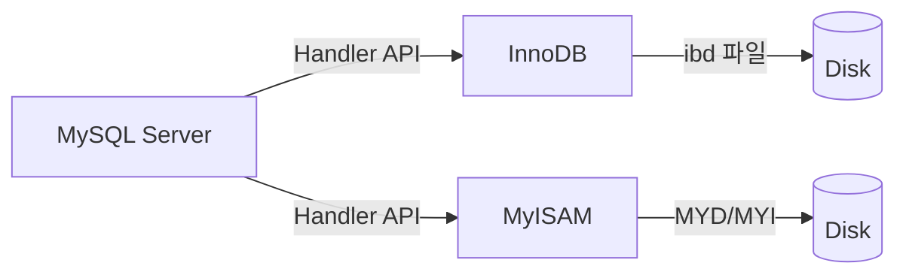
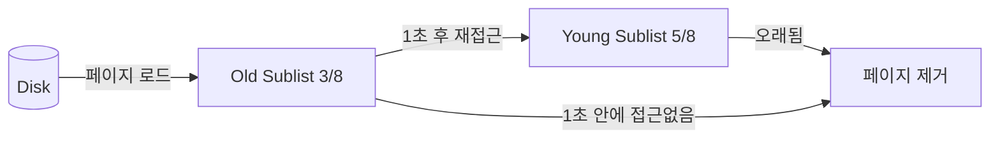
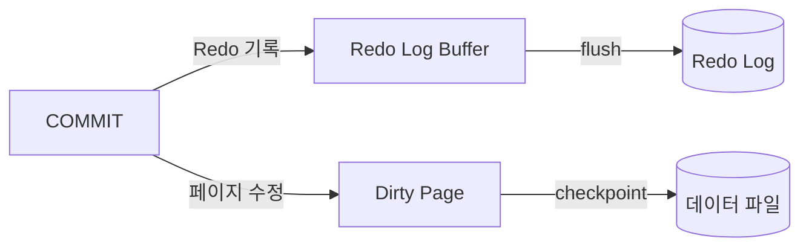
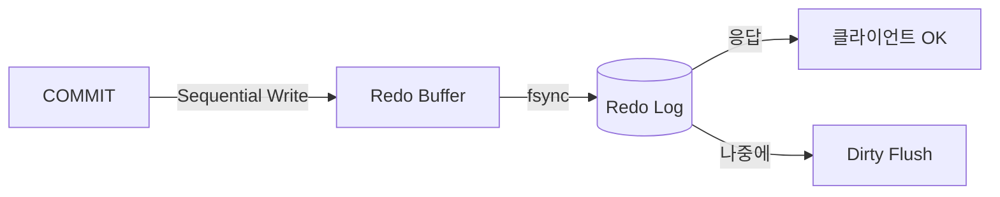
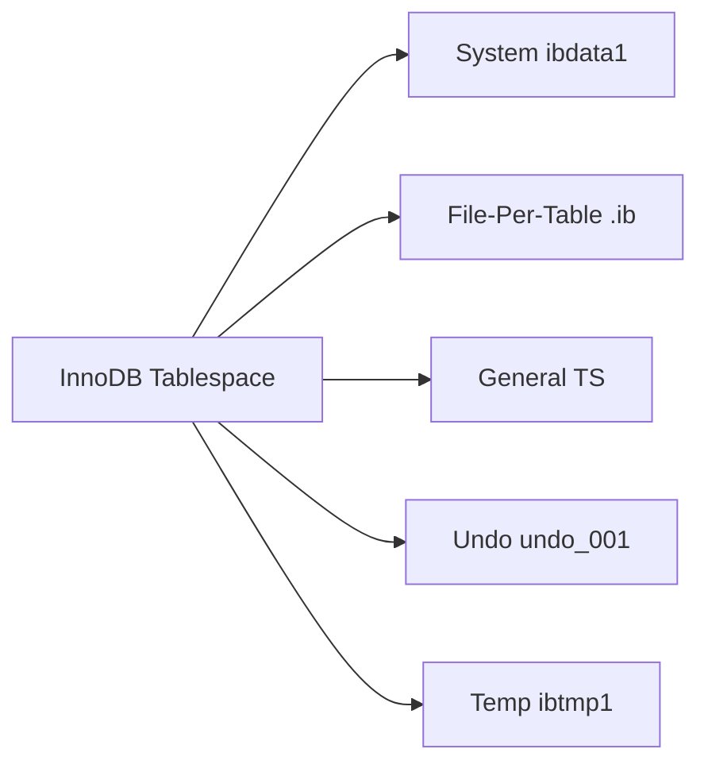
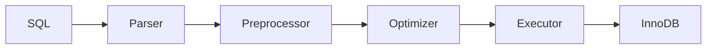
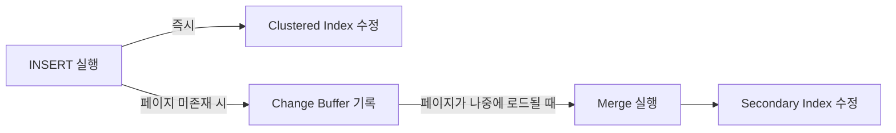
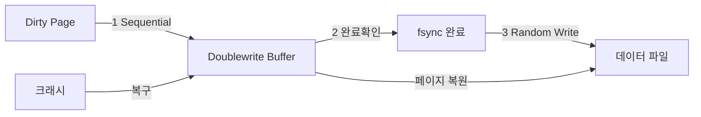
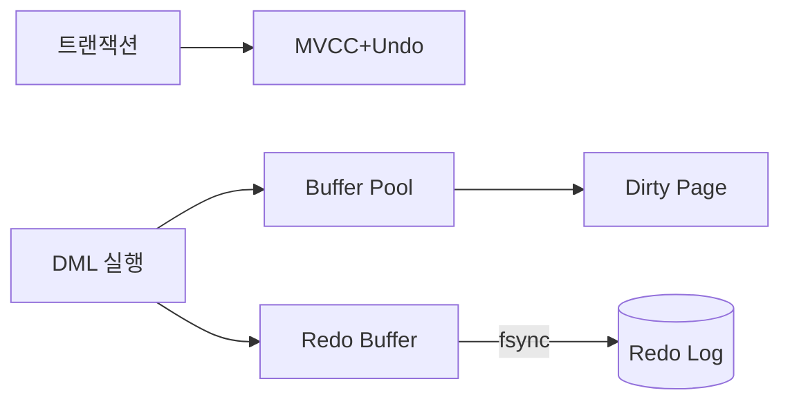
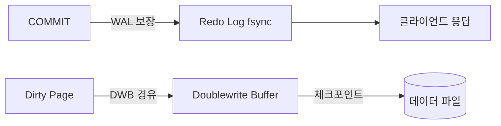

프로덕션 장애 상황을 상상해 보자. 트래픽이 평소와 같은데 특정 쿼리의 p99 레이턴시가 갑자기 500ms에서 5초로 튀었다. 코드는 배포된 것이 없다. DBA를 불러 `SHOW ENGINE INNODB STATUS`를 보니 Buffer Pool 히트율이 87%로 떨어져 있고, History list length가 1,200,000이다. 원인은 배치 작업이 트랜잭션을 닫지 않은 채 3시간째 돌고 있어 Undo Log가 폭증했고, Purge 스레드가 따라가지 못해 MVCC 체인이 비대해진 것이다. InnoDB 내부를 모르면 이 상황에서 무엇을 봐야 할지조차 모른다.

이 글은 MySQL InnoDB의 물리적 구조부터 메모리 관리, 트랜잭션 처리까지 "왜(WHY)" 중심으로 깊이 파고든다. Java/Spring 환경에서 JPA와 JDBC를 사용할 때 어떻게 연결되는지도 함께 다룬다.

<br>

## 1. 스토리지 엔진: InnoDB vs MyISAM

스토리지 엔진은 MySQL 서버와 분리된 플러그인 구조다. 같은 SQL을 받아도 엔진에 따라 데이터를 저장하고 잠금을 처리하는 방식이 완전히 다르다.



### 1-1. 핵심 차이 비교

| 항목 | InnoDB | MyISAM | 차이의 이유 |
|------|--------|--------|------------|
| 트랜잭션 | O (ACID) | X | Redo/Undo Log 유무 |
| 외래 키 | O | X | 참조 무결성 엔진 지원 여부 |
| 락 단위 | **Row-level Lock** | **Table-level Lock** | 클러스터드 인덱스 구조 차이 |
| 클러스터드 인덱스 | O | X | 데이터 저장 방식 근본 차이 |
| MVCC | O | X | Undo Log 체인 유무 |
| 크래시 복구 | Redo Log 자동 복구 | 수동 복구 필요 | WAL 구현 여부 |
| 풀텍스트 인덱스 | O (5.6+) | O | - |
| COUNT(*) 성능 | 느림 (MVCC 때문) | 빠름 (메타데이터 저장) | MVCC 오버헤드 |

**WHY InnoDB가 Row-level Lock을 쓸 수 있는가?**

MyISAM은 인덱스와 데이터 파일이 분리되어 있어 특정 행의 위치가 고정되지 않는다. 따라서 행 단위로 잠금하려면 테이블 전체를 잠가야 한다. 반면 InnoDB는 PK 기반 클러스터드 인덱스에 데이터가 내장되어 있어 인덱스 레코드 자체에 락을 건다. 이것이 Row-level Lock을 가능하게 하는 물리적 근거다.

**WHY MyISAM COUNT(*)가 빠른가?**

MyISAM은 행 수를 메타데이터로 별도 저장한다. `COUNT(*)`는 파일 헤더를 읽으면 된다. InnoDB는 MVCC로 인해 트랜잭션마다 "보이는 행"이 다르기 때문에 메타데이터로 행 수를 보관할 수 없다. 매번 MVCC 가시성을 확인하며 실제로 세야 한다.

### 1-2. MyISAM 파일 구조 (왜 크래시에 취약한가)

```
테이블명.frm   → 테이블 정의 (구조)
테이블명.MYD   → 실제 데이터 (MYData)
테이블명.MYI   → 인덱스 트리 (MYIndex)
```

데이터(.MYD)와 인덱스(.MYI)가 별도 파일이다. 쓰기 중 크래시가 발생하면 둘 사이 정합성이 깨진다. Redo Log가 없으므로 `myisamchk` 도구로 수동 복구해야 한다.

### 1-3. InnoDB 파일 구조

```
ibdata1 (시스템 테이블스페이스)
  ├── Data Dictionary (테이블/인덱스 메타)
  ├── Undo Log Segment (일부, 별도 설정 가능)
  └── Doublewrite Buffer

테이블명.ibd (파일 per 테이블, innodb_file_per_table=ON)
  ├── Clustered Index (PK + 실제 Row 데이터)
  └── Secondary Index B+Tree

ib_logfile0, ib_logfile1 (Redo Log, 순환 구조)
undo_001, undo_002 (Undo Tablespace, MySQL 8.0+)
```

<br>

## 2. InnoDB 페이지 구조 — 16KB의 비밀

InnoDB는 데이터를 **페이지(Page)** 단위로 읽고 쓴다. 기본 크기는 **16KB**다. 디스크에서 1바이트를 읽더라도 16KB 페이지 전체를 Buffer Pool로 올린다.

**WHY 16KB인가?**

운영체제 I/O의 최소 단위(섹터)는 보통 512B~4KB다. 16KB는 이 단위를 수배 묶어 I/O 횟수를 줄이면서도 너무 크지 않아 낭비가 적은 균형점이다. `innodb_page_size` 설정으로 4KB~64KB까지 조정 가능하다.

### 2-1. 페이지 물리적 레이아웃

```
┌────────────────────────────────────────┐  ← 0 (38 bytes)
│          File Header                   │  FIL_PAGE_SPACE_OR_CHKSUM
│  space_id, page_no, prev/next page     │  FIL_PAGE_PREV / FIL_PAGE_NEXT
│  LSN, page_type, flush_LSN             │  페이지를 연결하는 이중 링크드 리스트
├────────────────────────────────────────┤  ← 38 (56 bytes)
│          Page Header                   │  PAGE_N_DIR_SLOTS, PAGE_HEAP_TOP
│  슬롯 수, Heap Top, 레코드 수 등       │  PAGE_N_RECS, PAGE_LAST_INSERT
├────────────────────────────────────────┤  ← 94 (13 bytes)
│     Infimum Record (가상 최솟값)       │  항상 존재, 논리적 경계
├────────────────────────────────────────┤
│     Supremum Record (가상 최댓값)      │  항상 존재, 논리적 경계
├────────────────────────────────────────┤
│                                        │
│          User Records                  │  실제 행 데이터 (heap 방식)
│          (아래로 자람)                 │
│                                        │
│─ ─ ─ ─ ─ 여유 공간(Free Space) ─ ─ ─ │
│                                        │
│          Page Directory                │  위에서 아래로 자람
│  (슬롯 배열, 바이너리 서치용)          │  4~8개 레코드마다 1개 슬롯
├────────────────────────────────────────┤  ← 16376 (8 bytes)
│          File Trailer                  │  FIL_PAGE_END_LSN_OLD_CHKSUM
│  체크섬 + LSN (무결성 검증)            │  Page Header의 LSN과 일치해야 정상
└────────────────────────────────────────┘  ← 16384 (16KB)
```

### 2-2. Infimum / Supremum Record

모든 InnoDB 페이지에는 실제 데이터가 아닌 두 개의 **가상 레코드**가 있다.

- **Infimum**: 페이지 내 모든 레코드보다 작은 가상 최솟값. 범위 락의 시작점.
- **Supremum**: 페이지 내 모든 레코드보다 큰 가상 최댓값. Next-Key Lock의 상한선.

**WHY 필요한가?**

Gap Lock과 Next-Key Lock을 구현하기 위해서다. "이 페이지에서 가장 큰 키보다 큰 범위"를 잠글 때 Supremum을 사용한다. 물리적으로 존재하지 않는 범위에 논리적 잠금을 걸 수 있게 해주는 가상의 앵커다.

### 2-3. Page Directory — 바이너리 서치를 위한 색인

Page Directory는 페이지 내 레코드를 4~8개 단위로 그룹핑하고, 각 그룹의 마지막 레코드 오프셋을 슬롯으로 저장한다.

```
Page Directory:
  slot[0] → Infimum 오프셋
  slot[1] → 4번째 레코드 오프셋
  slot[2] → 8번째 레코드 오프셋
  ...
  slot[N] → Supremum 오프셋
```

페이지 내에서 특정 키를 찾을 때 슬롯 배열로 **바이너리 서치**를 먼저 하고, 해당 그룹 내에서 선형 탐색한다. 레코드가 수백 개여도 O(log n) + 상수 탐색으로 빠르게 찾는다.

### 2-4. File Trailer — 체크섬 무결성 보장

File Trailer의 체크섬은 File Header의 체크섬과 반드시 일치해야 한다. 페이지를 읽을 때 InnoDB가 이 두 값을 비교한다. 불일치 시 **Partial Write(찢어진 쓰기)**가 발생했다고 판단하고 Doublewrite Buffer에서 복구한다.

<br>

## 3. Buffer Pool 심층 분석

Buffer Pool은 InnoDB의 메모리 캐시다. 크기는 `innodb_buffer_pool_size`로 설정하며, **물리 메모리의 70~80%** 할당이 권장된다.



### 3-1. LRU 리스트: Young / Old 서브리스트

단순 LRU를 쓰면 Full Table Scan이 발생할 때 수백만 페이지가 순식간에 캐시를 채워 기존 Hot Page를 모두 밀어낸다. InnoDB는 이를 **Midpoint Insertion Strategy**로 방어한다.

**구조:**
- Buffer Pool = **Young Sublist (5/8)** + **Old Sublist (3/8)**
- 새 페이지는 항상 Old Sublist의 **Head**에 삽입
- `innodb_old_blocks_time`(기본 1000ms) 이후 다시 접근되면 → Young Sublist Head로 승격
- 1000ms 안에 다시 접근되면 → Old에 머묾 (승격 안 함)

**WHY Old Sublist가 필요한가?**

Full Table Scan은 수백만 페이지를 한 번씩만 읽는다. 이 페이지들이 Old에 들어왔다가 1초 내로 다시 읽히지 않으면 그냥 쫓겨난다. Young에 올라가지 않으므로 실제 자주 쓰이는 Hot Page(Young에 있는 페이지)를 보호한다. 이것이 Old Sublist의 존재 이유다.

**WHY 1000ms인가?**

테이블 스캔의 특성상 연속된 I/O는 보통 1초 안에 같은 페이지를 재방문한다. 1초를 넘기면 "반복 접근 패턴 없음"으로 판단한다. `innodb_old_blocks_time=0`으로 설정하면 Old 보호 없이 동작한다(테스트 환경에서만 사용).

### 3-2. Dirty Page Flushing — 체크포인트 메커니즘



Buffer Pool에서 수정된 페이지(Dirty Page)는 즉시 디스크에 쓰이지 않는다. 커밋 시점에는 Redo Log만 디스크에 기록하고, Dirty Page는 나중에 **체크포인트** 시점에 플러시된다.

**Fuzzy Checkpoint 동작:**

1. InnoDB는 Redo Log가 일정 비율 차면 Dirty Page를 디스크로 내려쓰기 시작
2. `innodb_max_dirty_pages_pct`(기본 75%)를 초과하면 적극적으로 플러시
3. `innodb_io_capacity`(기본 200 IOPS) 설정에 따라 플러시 속도 조절

**WHY Dirty Page를 즉시 안 쓰는가?**

16KB 페이지를 커밋마다 매번 디스크에 쓰면 Random Write가 폭발한다. Redo Log는 Sequential Write로 변경 내용만 기록하므로 수십 배 빠르다. Dirty Page 플러시는 배치로 모아서 처리한다.

### 3-3. Java/JPA에서 Buffer Pool 확인

```java
// Spring JDBC로 Buffer Pool 히트율 모니터링
@Component
public class InnoDbMetrics {
    @Autowired
    private JdbcTemplate jdbcTemplate;

    public double getBufferPoolHitRate() {
        // read_requests = 전체 페이지 요청 수
        // reads = 디스크에서 실제로 읽은 수 (캐시 미스)
        String sql = """
            SELECT
              (1 - SUM(CASE WHEN variable_name = 'Innodb_buffer_pool_reads'
                            THEN variable_value ELSE 0 END) /
                   SUM(CASE WHEN variable_name = 'Innodb_buffer_pool_read_requests'
                            THEN variable_value ELSE 0 END)) * 100 AS hit_rate
            FROM information_schema.GLOBAL_STATUS
            WHERE variable_name IN (
              'Innodb_buffer_pool_reads',
              'Innodb_buffer_pool_read_requests'
            )
            """;
        Double rate = jdbcTemplate.queryForObject(sql, Double.class);
        return rate != null ? rate : 0.0;
        // 99% 미만이면 Buffer Pool 부족 신호
    }
}
```

```java
// application.yml (HikariCP + Buffer Pool 관계)
spring:
  datasource:
    hikari:
      maximum-pool-size: 20        # 커넥션 수 = 동시 Buffer Pool 접근자 수
      connection-timeout: 3000
  jpa:
    properties:
      hibernate:
        jdbc:
          batch_size: 50           # 배치 INSERT → Buffer Pool 부하 최소화
        order_inserts: true
        order_updates: true
```

<br>

## 4. Redo Log (WAL) — 왜 먼저 로그를 쓰는가

**Write-Ahead Logging(WAL)**: 데이터 파일을 수정하기 전에 반드시 로그를 먼저 기록해야 한다는 원칙.

### 4-1. WAL의 존재 이유



**WAL 없는 세상:**
- 커밋 때마다 16KB 데이터 페이지를 디스크에 써야 한다.
- 데이터 파일은 여러 위치에 분산 → **Random Write** 발생.
- Random Write는 HDD 기준 Sequential Write보다 100배 이상 느리다.
- SSD에서도 Random Write는 Write Amplification을 유발한다.

**WAL 있는 세상:**
- Redo Log는 항상 로그 파일 끝에 Append → **Sequential Write**만 발생.
- 커밋 응답을 보낸 후 Dirty Page는 나중에 배치로 플러시.
- 크래시가 나도 Redo Log를 재실행(Redo)하면 커밋된 데이터 복구 가능.

### 4-2. Redo Log 물리 구조

```
ib_logfile0 (512MB 기본, 순환)
ib_logfile1 (512MB)

  [LSN=1000] [LSN=1001] ... [LSN=9999] [순환 → LSN=10000...]

  ↑ checkpoint_lsn               ↑ current_lsn
  (여기까지 데이터 파일에 반영됨)  (현재 기록 위치)
```

Redo Log는 **순환 구조**다. `checkpoint_lsn` 이전 구간은 재사용 가능하다. Redo Log가 꽉 차면 InnoDB는 강제로 체크포인트를 발생시켜 Dirty Page를 플러시하고 공간을 확보한다. 이때 I/O 스파이크가 발생한다.

**WHY innodb_log_file_size를 크게 설정해야 하는가?**

로그 파일이 작으면 자주 꽉 차고, 강제 체크포인트가 자주 발생해 I/O 스파이크가 반복된다. 대용량 쓰기 워크로드에서는 1~4GB로 설정한다. MySQL 8.0.30+에서는 `innodb_redo_log_capacity`로 단일 설정.

### 4-3. Redo Log Buffer → OS Buffer → Disk 경로

```
애플리케이션 UPDATE 실행
    ↓
Redo Log Buffer (메모리, innodb_log_buffer_size 기본 16MB)
    ↓ (언제 flush하는가?)
OS Page Cache (커널 버퍼)
    ↓ fsync()
Redo Log File (disk)
```

`innodb_flush_log_at_trx_commit` 설정이 이 경로를 제어한다:

| 값 | 동작 | 내구성 | 성능 | 사용 시나리오 |
|----|------|--------|------|-------------|
| 0 | 매 초 OS buffer flush + fsync | 1초치 손실 가능 | 최고 | 개발/비중요 데이터 |
| 1 | 커밋마다 OS buffer flush + fsync | ACID 완전 보장 | 기본 | 운영(금융/주문) |
| 2 | 커밋마다 OS buffer flush, 매 초 fsync | OS 크래시 시 1초 손실 | 중간 | 읽기 중심 서비스 |

### 4-4. Group Commit 최적화

```
T1 COMMIT ─┐
T2 COMMIT ─┤─→ Redo Log Buffer에 묶음 → 한 번에 fsync
T3 COMMIT ─┘
```

동시에 여러 트랜잭션이 커밋하면 InnoDB는 Redo Log 버퍼에 모인 항목을 **한 번의 fsync()로 묶어서** 처리한다. IOPS를 줄이면서도 각 트랜잭션의 커밋 내구성을 보장한다.

**Java에서 Group Commit 효과 측정:**

```java
// 단건 INSERT vs 배치 INSERT 성능 비교
@Service
@Transactional
public class OrderService {

    // 안티패턴: 트랜잭션 10000개 → fsync 10000번
    public void saveOrdersBad(List<Order> orders) {
        for (Order order : orders) {
            orderRepository.save(order); // 각각 커밋
        }
    }

    // 권장: 배치 트랜잭션 → Group Commit 활성화
    @Transactional(propagation = Propagation.REQUIRES_NEW)
    public void saveOrdersBatch(List<Order> chunk) {
        orderRepository.saveAll(chunk); // 한 트랜잭션, 한 번의 fsync
    }

    // Hibernate 배치 설정 필요:
    // spring.jpa.properties.hibernate.jdbc.batch_size=100
    // spring.jpa.properties.hibernate.order_inserts=true
}
```

### 4-5. Crash Recovery 시나리오

서버가 비정상 종료된 후 MySQL이 기동될 때:

```
1. Redo Log 스캔 (checkpoint_lsn ~ last_lsn)
2. 커밋된 트랜잭션 → Redo (데이터 파일에 재적용)
3. 커밋 안 된 트랜잭션 → Undo Log로 Rollback
4. 정상 서비스 재개
```

**WHY 커밋 안 된 트랜잭션을 Undo로 되돌리는가?**

Redo Log에 기록된 변경이 있다는 것은 Buffer Pool에 Dirty Page가 있었다는 의미다. 해당 Dirty Page 일부가 체크포인트 도중 이미 디스크에 쓰였을 수 있다. 크래시 후 재기동 시 이 데이터는 "커밋 안 된 더티 데이터"다. Undo Log로 롤백해야 ACID의 Atomicity가 보장된다.

<br>

## 5. Undo Log — MVCC와 롤백의 기반

Undo Log는 "변경 전 데이터(Before Image)"를 저장한다. 두 가지 목적으로 사용된다:

1. **롤백(Rollback)**: 트랜잭션 실패 시 이전 상태 복원
2. **MVCC**: 다른 트랜잭션이 스냅샷 시점의 데이터를 읽을 수 있게 제공

### 5-1. Rollback Segment 구조

```
Rollback Segment (128개, MySQL 8.0)
  └── Undo Log Segment
        └── Undo Page (16KB 페이지)
              ├── Undo Log Record (UPDATE: before image)
              ├── Undo Log Record (INSERT: PK만 기록, rollback 시 DELETE)
              └── Undo Log Record (DELETE: before image + 삭제 마크)
```

**WHY Rollback Segment를 여러 개 두는가?**

단일 Rollback Segment는 동시 트랜잭션이 많아지면 경합이 생긴다. 128개로 분산해 각 트랜잭션이 다른 세그먼트를 사용하면 락 경합을 줄인다.

### 5-2. MVCC 버전 체인

```
InnoDB 레코드 숨겨진 컬럼:
  DB_TRX_ID   (6 bytes): 이 행을 마지막으로 수정한 트랜잭션 ID
  DB_ROLL_PTR (7 bytes): Undo Log 레코드를 가리키는 포인터
  DB_ROW_ID   (6 bytes): PK 없을 때 자동 생성되는 내부 ID

버전 체인:
  현재 레코드 (TRX_ID=300, name='Park')
       ↓ DB_ROLL_PTR
  Undo Log (TRX_ID=200, name='Kim')
       ↓ 이전 ROLL_PTR
  Undo Log (TRX_ID=100, name='Lee')
       ↓
  (끝)
```

### 5-3. MVCC 동작 시나리오

```
초기: users(id=1, name='Lee')

T1 (trx_id=100): BEGIN
T2 (trx_id=101): BEGIN
T2: UPDATE users SET name='Kim' WHERE id=1
    → 현재 레코드: name='Kim', TRX_ID=101
    → Undo Log에 {name='Lee', TRX_ID=100} 기록
T2: COMMIT

T3 (trx_id=102): BEGIN
T3: UPDATE users SET name='Park' WHERE id=1
    → 현재 레코드: name='Park', TRX_ID=102
    → Undo Log에 {name='Kim', TRX_ID=101} 기록
T3: COMMIT

T1: SELECT name FROM users WHERE id=1
    → T1의 Read View: up_limit_id=100 (T1 시작 시 최소 활성 TRX)
    → 현재 레코드 TRX_ID=102 > T1의 up_limit_id
    → Undo Log 따라가기: TRX_ID=101 > 100 → 계속
    → Undo Log 따라가기: TRX_ID=100 = T1 → 'Lee' 반환
```

**WHY 읽기가 락을 안 거는가?**

Undo Log에 버전 체인이 있으므로 "나의 스냅샷 시점 이전 버전"을 직접 읽을 수 있다. 쓰기 트랜잭션이 현재 레코드를 수정 중이어도 Undo Log에서 이전 버전을 가져오면 된다. 읽기와 쓰기가 서로 블로킹하지 않는 이유다.

### 5-4. Purge Thread — Undo Log 정리

MVCC를 위해 Undo Log를 영원히 보관할 수는 없다. **Purge Thread**가 주기적으로 더 이상 필요 없는 Undo Log를 삭제한다.

"더 이상 필요 없는" 기준: 모든 활성 트랜잭션 중 가장 오래된 Read View보다 오래된 버전.

```
활성 Read View 최솟값 = TRX_ID 50
→ TRX_ID 50 이전의 Undo Log는 어떤 트랜잭션도 안 읽는다
→ Purge 가능
```

**장시간 트랜잭션의 위험:**

```java
// 극한 시나리오: 배치가 트랜잭션을 닫지 않은 채 3시간 실행
@Transactional
public void dangerousBatch() {
    // 이 트랜잭션이 살아 있는 동안
    // 다른 모든 UPDATE/DELETE의 Undo Log가 쌓여도
    // Purge Thread가 정리 못 함!
    for (int i = 0; i < 10_000_000; i++) {
        processItem(i); // 커밋 없이 계속
    }
}

// 올바른 패턴: 청크 단위 커밋
@Service
public class SafeBatchService {
    @Autowired
    private SafeBatchService self; // self injection for @Transactional

    public void safeBatch(List<Long> ids) {
        Lists.partition(ids, 1000).forEach(chunk ->
            self.processChunk(chunk) // 1000건마다 새 트랜잭션
        );
    }

    @Transactional(propagation = Propagation.REQUIRES_NEW)
    public void processChunk(List<Long> chunk) {
        chunk.forEach(this::processItem);
    }
}
```

```sql
-- Undo Log 폭증 모니터링
SELECT name, count, type
FROM information_schema.INNODB_METRICS
WHERE name = 'trx_rseg_history_len'; -- History list length 확인
-- 100,000 초과 시 즉각 조치 필요

-- 오래된 트랜잭션 찾기
SELECT trx_id,
       trx_started,
       TIMESTAMPDIFF(MINUTE, trx_started, NOW()) AS minutes,
       trx_query
FROM information_schema.INNODB_TRX
ORDER BY trx_started ASC
LIMIT 10;
```

<br>

## 6. Tablespace 구조 — 왜 File-Per-Table이 기본인가

### 6-1. Tablespace 종류



**System Tablespace (ibdata1):**
- Data Dictionary, Change Buffer, Doublewrite Buffer 포함
- 한 번 커지면 줄일 수 없음 (큰 단점)
- 여러 테이블이 하나의 파일을 공유 → 단일 테이블 Drop 시 공간 반환 불가

**File-Per-Table (.ibd):**
- 테이블마다 별도 .ibd 파일
- `innodb_file_per_table=ON` (MySQL 5.7+ 기본)
- `DROP TABLE` 시 .ibd 파일 삭제 → OS에 즉시 공간 반환
- `OPTIMIZE TABLE` 등 테이블 단위 작업 용이

**WHY File-Per-Table이 기본인가?**

System Tablespace 방식에서 대용량 테이블을 삭제하면 ibdata1 파일 내부에 빈 공간이 생기지만 파일 크기는 줄지 않는다. 디스크 용량이 늘어난 것처럼 보여도 실제로는 OS에 반환되지 않는다. File-Per-Table은 이 문제를 해결한다.

**General Tablespace:**
- 여러 테이블을 하나의 별도 파일에 그룹핑
- 특정 디스크나 경로에 테이블 그룹을 몰 수 있음
- SSD와 HDD를 분리 운영할 때 활용

```sql
-- General Tablespace 활용 예시 (SSD 전용)
CREATE TABLESPACE fast_ts
  ADD DATAFILE '/mnt/ssd/fast_ts.ibd'
  ENGINE = InnoDB;

CREATE TABLE hot_data (
  id BIGINT PRIMARY KEY AUTO_INCREMENT,
  payload JSON
) TABLESPACE fast_ts;
```

<br>

## 7. Row Format — 행이 실제로 어떻게 저장되는가

InnoDB는 네 가지 Row Format을 지원한다. 선택에 따라 저장 방식과 성능이 달라진다.

### 7-1. Row Format 비교

| Format | 특징 | 권장 용도 |
|--------|------|----------|
| REDUNDANT | 옛날 형식, 각 컬럼 오프셋 전체 저장 | 하위 호환만 |
| COMPACT | 오프셋을 차분으로 저장, 공간 효율↑ | 일반 용도 |
| DYNAMIC | MySQL 5.7+ 기본, 가변길이 완전 외부화 | 권장 |
| COMPRESSED | DYNAMIC + zlib 압축 | 읽기 중심 대용량 |

### 7-2. COMPACT vs DYNAMIC 핵심 차이

**COMPACT 행 레이아웃:**

```
┌──────────────┬────────────┬──────────────┬─────────┬──────────┐
│ 가변길이 컬럼 │ Null 비트맵 │ Record Header │ 고정 컬럼│ 가변 컬럼│
│ 오프셋 목록  │            │  (5 bytes)   │  값들   │  값들    │
└──────────────┴────────────┴──────────────┴─────────┴──────────┘
```

- VARCHAR, TEXT, BLOB이 768 bytes를 넘으면 앞 768 bytes는 인라인 저장, 나머지는 오버플로우 페이지에
- 768 bytes 접두어가 항상 인라인에 남는다

**DYNAMIC 행 레이아웃:**

```
┌──────────────┬────────────┬──────────────┬─────────┬──────────────┐
│ 가변길이 컬럼 │ Null 비트맵 │ Record Header │ 고정 컬럼│ 포인터(20 B) │
│ 오프셋 목록  │            │  (5 bytes)   │  값들   │ → 외부 페이지 │
└──────────────┴────────────┴──────────────┴─────────┴──────────────┘
```

- 큰 칼럼이 오버플로우 시 인라인에 768 bytes 접두어를 두지 않고 **20 bytes 포인터만** 남김
- 주 행 페이지에 더 많은 행이 들어감 → 페이지당 행 수 증가 → B+Tree 높이 감소

**WHY DYNAMIC이 권장되는가?**

COMPACT에서 TEXT 컬럼이 있는 테이블은 768 bytes 접두어 때문에 페이지당 저장 행 수가 줄어든다. DYNAMIC은 포인터(20 bytes)만 인라인에 두므로 주 페이지 공간 낭비가 없다. 대용량 TEXT/BLOB 컬럼이 있는 테이블에서 페이지당 행 수가 크게 증가해 B+Tree 높이가 낮아진다.

### 7-3. Overflow Page (오버플로우 페이지)

```
주 데이터 페이지 (16KB)
  └── row: id=1, name='Kim', content=(포인터)
                                        ↓
                              오버플로우 페이지 1 (16KB)
                                content의 앞 16380 bytes
                                        ↓
                              오버플로우 페이지 2 (16KB)
                                나머지 bytes
```

오버플로우 페이지는 B+Tree 바깥에 위치한 별도 페이지다. 따라서 오버플로우 컬럼을 읽을 때마다 **추가 I/O**가 발생한다. `SELECT *` 대신 필요한 컬럼만 조회하면 불필요한 오버플로우 페이지 I/O를 피할 수 있다.

```java
// JPA: SELECT * 방지 — Projection 활용
public interface OrderSummary {
    Long getId();
    String getStatus();
    BigDecimal getAmount();
    // description TEXT 컬럼은 제외 → 오버플로우 페이지 I/O 없음
}

@Repository
public interface OrderRepository extends JpaRepository<Order, Long> {
    // 오버플로우 컬럼(description) 제외하고 조회
    List<OrderSummary> findByUserId(Long userId);
}
```

<br>

## 8. 쿼리 실행 파이프라인 — Parser → Optimizer → Executor

### 8-1. 전체 파이프라인



### 8-2. Parser (파서)

**Lexical Analysis(어휘 분석)**: SQL 문자열을 토큰으로 분리.

```
"SELECT id, name FROM users WHERE age > 20"
→ [SELECT] [id] [,] [name] [FROM] [users] [WHERE] [age] [>] [20]
```

**Syntax Analysis(구문 분석)**: 토큰을 Parse Tree로 변환. 이 단계에서 문법 오류가 잡힌다.

**Preprocessor(전처리)**: 의미론적 검증.
- 테이블/컬럼 존재 여부 확인
- `*`를 실제 컬럼 목록으로 확장
- 뷰(View)를 실제 테이블로 치환
- 접근 권한 확인

### 8-3. Cost-Based Optimizer (비용 기반 옵티마이저)

MySQL은 **Cost-Based Optimizer(CBO)**를 사용한다. 동일한 결과를 얻는 여러 실행 계획을 생성하고, 각 계획의 비용을 추정해 최솟값을 선택한다.

**비용 추정에 사용하는 통계:**

```sql
-- 테이블 통계 (information_schema.STATISTICS)
-- 컬럼 카디널리티: 값의 고유한 수 (높을수록 인덱스 효율적)
SELECT
  table_name,
  index_name,
  column_name,
  cardinality -- 예상 고유 값 수
FROM information_schema.STATISTICS
WHERE table_schema = 'mydb'
  AND table_name = 'orders';

-- 통계 갱신
ANALYZE TABLE orders;

-- 자동 갱신 설정
-- innodb_stats_auto_recalc = ON (기본값)
-- 테이블의 10% 이상 변경 시 자동으로 통계 갱신
```

**비용 계산 요소:**

```
Full Table Scan 비용 = rows × row_evaluate_cost + I/O_read_cost
Index Range Scan 비용 = 예상 rows × key_compare_cost + lookup_cost
```

**WHY 통계가 잘못되면 잘못된 실행 계획이 나오는가?**

옵티마이저는 실제 데이터를 보지 않는다. 통계(카디널리티, 행 수 추정값)만 본다. 대량 INSERT 후 통계를 갱신하지 않으면 옵티마이저가 "이 테이블에는 1000행이 있다"고 착각하고 인덱스 대신 Full Scan을 선택할 수 있다.

```java
// Spring 배치 후 통계 갱신 패턴
@Service
public class BatchLoadService {
    @Autowired
    private JdbcTemplate jdbcTemplate;

    @Transactional
    public void bulkLoad(List<Product> products) {
        // 대량 INSERT
        jdbcTemplate.batchUpdate(
            "INSERT INTO products (id, name, price) VALUES (?, ?, ?)",
            products, 500,
            (ps, product) -> {
                ps.setLong(1, product.getId());
                ps.setString(2, product.getName());
                ps.setBigDecimal(3, product.getPrice());
            }
        );
    }

    // 배치 완료 후 통계 갱신 (트랜잭션 밖에서)
    public void refreshStats() {
        jdbcTemplate.execute("ANALYZE TABLE products");
        log.info("InnoDB statistics refreshed for products table");
    }
}
```

### 8-4. Optimizer Hint — 옵티마이저 강제 제어

```java
// Spring Data JPA에서 힌트 사용
@Repository
public interface ProductRepository extends JpaRepository<Product, Long> {

    // 특정 인덱스 강제 사용
    @Query(value = """
        SELECT /*+ INDEX(p idx_category_price) */
               p.id, p.name, p.price
        FROM products p
        WHERE p.category_id = :categoryId
          AND p.price < :maxPrice
        """, nativeQuery = true)
    List<ProductProjection> findByCategoryWithHint(
        @Param("categoryId") Long categoryId,
        @Param("maxPrice") BigDecimal maxPrice
    );
}
```

### 8-5. Executor — Handler API

실행 엔진은 **Handler API**를 통해 스토리지 엔진과 통신한다. 스토리지 엔진이 InnoDB든 MyISAM이든 동일한 인터페이스로 호출한다.

주요 Handler 메서드:
- `ha_index_read_map()`: 인덱스로 특정 키 읽기
- `ha_index_next()`: 다음 인덱스 레코드 읽기
- `ha_rnd_next()`: 테이블 Full Scan 다음 행
- `ha_write_row()`: 행 INSERT
- `ha_update_row()`: 행 UPDATE

<br>

## 9. Adaptive Hash Index — InnoDB가 자동으로 만드는 해시 인덱스

B+Tree는 항상 루트 → 내부 노드 → 리프 순으로 탐색한다. 동일한 리프 페이지를 반복 조회하면 매번 이 경로를 밟는 것은 낭비다.

### 9-1. AHI 동작 원리


InnoDB는 **특정 인덱스 패턴이 자주 사용된다고 판단**하면 자동으로 해당 패턴에 대한 해시 인덱스를 Buffer Pool 안에 구축한다.

**AHI가 생성되는 조건:**
- 같은 인덱스 컬럼 + 같은 값으로 반복 조회 (17회 이상)
- 버퍼 풀에 해당 페이지가 상주
- `innodb_adaptive_hash_index=ON` (기본값)

**효과:**
- B+Tree 루트→리프 탐색 3~5 I/O → 해시 조회 O(1)로 단축
- OLTP 환경에서 단순 PK/Unique Key 조회 성능 30~50% 향상

### 9-2. AHI 모니터링 및 비활성화 시나리오

```sql
-- AHI 사용 현황 확인
SHOW ENGINE INNODB STATUS;
-- 출력 중 Hash Index 섹션:
-- Hash table size 553279, node heap has 1 buffer(s)
-- 0.00 hash searches/s, 0.00 non-hash searches/s

-- AHI 효율 확인
SELECT
  variable_name,
  variable_value
FROM information_schema.GLOBAL_STATUS
WHERE variable_name IN (
  'Innodb_adaptive_hash_searches',
  'Innodb_adaptive_hash_searches_btree'
);
-- searches / (searches + searches_btree) = 히트율
```

**AHI를 비활성화해야 하는 경우:**
- Range Scan 위주 워크로드 (해시는 범위 검색 불가)
- 스캔 패턴이 매우 다양해 해시가 자주 무효화됨
- AHI 구축/무효화 오버헤드가 이익보다 클 때

```sql
-- 런타임 비활성화 (재시작 불필요)
SET GLOBAL innodb_adaptive_hash_index = OFF;
```

<br>

## 10. Change Buffer — 보조 인덱스 업데이트 지연의 비밀

### 10-1. 왜 Change Buffer가 필요한가

테이블에 Secondary Index가 있을 때 `INSERT INTO orders (user_id, amount) VALUES (100, 9900)`을 실행한다고 가정하자.

**Clustered Index(PK) 업데이트**: PK 순서로 정렬되어 있으므로, 해당 페이지가 Buffer Pool에 있다. → 즉시 메모리 수정.

**Secondary Index(user_id) 업데이트**: `user_id=100`이 속하는 인덱스 페이지가 현재 Buffer Pool에 없다면?

```
없는 경우 옵션 A: 디스크에서 페이지 로드 → 수정 → 더티 페이지
  → 랜덤 I/O 발생, 느림

옵션 B (Change Buffer): 변경 내용만 Change Buffer에 기록
  → 나중에 해당 페이지가 Buffer Pool에 올라올 때 병합(Merge)
  → 랜덤 I/O 지연, 성능 향상
```



### 10-2. Change Buffer 대상 연산

- **Insert Buffer** (원래 이름, INSERT 전용이었으나 확장됨)
- **Delete Buffer**: DELETE mark 연산
- **Purge Buffer**: 실제 DELETE 연산

DML 유형별 Change Buffer 적용 조건:
- `INSERT`: Secondary Index 페이지가 Buffer Pool에 없을 때
- `DELETE`: 삭제 마크(Delete Mark) 연산이 대상 페이지 없을 때
- `UPDATE`: 삭제 마크 + 재삽입으로 분리해 각각 적용

### 10-3. Merge 프로세스

Change Buffer에 쌓인 변경은 다음 상황에서 Secondary Index 페이지와 합쳐진다:

1. 해당 Secondary Index 페이지가 읽기 요청으로 Buffer Pool에 로드될 때
2. Change Buffer가 가득 찰 때 (Background 강제 Merge)
3. 서버 정상 종료 시 전체 Merge

**WHY Merge 시 성능이 잠깐 느려지는가?**

Merge는 Change Buffer에 쌓인 랜덤 I/O를 실제로 처리하는 시점이다. 읽기 요청이 폭발하거나 Change Buffer가 가득 차면 Merge가 집중적으로 발생해 I/O 스파이크가 생긴다.

### 10-4. Change Buffer 모니터링

```sql
SHOW ENGINE INNODB STATUS;
-- INSERT BUFFER AND ADAPTIVE HASH INDEX 섹션:
-- Ibuf: size 1, free list len 0, seg size 2, 0 merges
-- merged operations: insert 0, delete mark 0, delete 0
-- discarded operations: insert 0, delete mark 0, delete 0

-- Change Buffer 크기 설정 (Buffer Pool 대비 %)
-- innodb_change_buffer_max_size = 25 (기본, 최대 50)
```

**Change Buffer가 효과 없는 경우:**
- Secondary Index 페이지가 항상 Buffer Pool에 있는 경우 (소규모 테이블)
- `UNIQUE` 인덱스: 유일성 확인을 위해 반드시 페이지를 읽어야 하므로 Change Buffer 미적용

<br>

## 11. Doublewrite Buffer — 찢어진 페이지(Torn Page) 방어

### 11-1. 왜 필요한가

InnoDB 페이지는 16KB다. OS의 기본 블록 크기는 보통 4KB다. 16KB 페이지를 쓰는 동안 크래시가 발생하면 4KB 단위로 쓰이는 과정에서 중간에 멈출 수 있다.

```
16KB 페이지 쓰기:
  4KB 쓰기 완료 ✓
  4KB 쓰기 완료 ✓
  [CRASH HERE]
  4KB 미완료 ✗
  4KB 미완료 ✗

결과: 앞 8KB는 새 버전, 뒤 8KB는 이전 버전 → Torn Page
```

**WHY Redo Log로 Torn Page를 복구할 수 없는가?**

Redo Log는 "이 페이지에 이 변경을 적용하라"는 명령이다. 명령을 적용하려면 **원본 페이지가 온전해야 한다**. 원본이 이미 찢겨 있으면 Redo를 적용해도 올바른 결과가 나오지 않는다.

### 11-2. Doublewrite Buffer 동작

```
1. Dirty Page를 Doublewrite Buffer에 Sequential Write
   (System Tablespace의 연속 공간 → 빠른 Sequential I/O)

2. Doublewrite Buffer 쓰기 완료 (fsync)

3. 실제 데이터 파일(.ibd)의 해당 위치에 Random Write

4. 크래시 발생 시:
   - 데이터 파일 페이지가 손상됐으면 Doublewrite Buffer에서 복원
   - Doublewrite Buffer에서 복원 후 Redo Log 적용
```



### 11-3. 성능 영향과 비활성화

추가 쓰기가 발생하지만 **Sequential Write**이므로 실제 오버헤드는 **5~10%** 수준이다.

SSD나 NVMe처럼 Torn Write를 하드웨어 수준에서 방어하는 스토리지에서는 비활성화 가능:

```sql
-- MySQL 8.0.20+ 에서 Doublewrite 비활성화 (NVMe SSD 환경)
-- my.cnf
innodb_doublewrite = OFF

-- 또는 테이블스페이스 단위로 비활성화
ALTER TABLESPACE ts1 AUTOEXTEND_SIZE=0;
```

**운영 환경에서는 특별한 이유 없으면 ON 유지를 권장한다.**

<br>

## 12. 쿼리 실행 계획 분석 (EXPLAIN)

### 12-1. EXPLAIN 기본 사용

```java
// Spring에서 EXPLAIN 자동화 (개발 환경)
@Component
@Profile("dev")
public class QueryExplainer {
    @Autowired
    private JdbcTemplate jdbcTemplate;

    public void explainQuery(String sql, Object... params) {
        List<Map<String, Object>> result =
            jdbcTemplate.queryForList("EXPLAIN " + sql, params);
        result.forEach(row -> {
            log.info("type={}, key={}, rows={}, Extra={}",
                row.get("type"),
                row.get("key"),
                row.get("rows"),
                row.get("Extra"));
        });
    }
}
```

### 12-2. 주요 컬럼 해석

| 컬럼 | 의미 | 좋은 값 | 주의 값 |
|------|------|---------|--------|
| `type` | 접근 방식 | const, ref, range | ALL (Full Scan) |
| `key` | 사용 인덱스 | 인덱스명 | NULL (미사용) |
| `key_len` | 인덱스 사용 길이 | 복합 인덱스 전체 활용 | 일부만 |
| `rows` | 예상 검색 행 수 | 결과 수와 근사 | 과도하게 큰 값 |
| `filtered` | rows 중 조건 통과 % | 100에 가까울수록 | 낮을수록 비효율 |
| `Extra` | 부가 정보 | Using index | Using filesort, Using temporary |

### 12-3. type 컬럼 상세

```
성능 순서 (좋음 → 나쁨):
system > const > eq_ref > ref > range > index > ALL

const   : PK/Unique로 단 1행 조회. WHERE id = 1
          → 옵티마이저가 상수로 처리, 조인에서 상수 치환

eq_ref  : 조인 시 Unique Index로 정확히 1행 매칭
          → SELECT * FROM a JOIN b ON a.id = b.a_id (b.a_id UNIQUE)

ref     : Non-Unique Index 사용, 여러 행 반환 가능
          → WHERE user_id = 100 (일반 인덱스)

range   : 인덱스 범위 스캔
          → WHERE created_at BETWEEN '2024-01-01' AND '2024-12-31'

index   : 인덱스 Full Scan (전체 인덱스 순회)
          → 데이터보다 작지만 여전히 비쌈

ALL     : 테이블 Full Scan. 인덱스 전혀 미사용
```

### 12-4. Extra 컬럼 상세

```
Using index          → Covering Index. Clustered Index 접근 없음 (최고)
Using where          → 스토리지 엔진에서 가져온 후 서버 레이어에서 필터링
Using index condition→ Index Condition Pushdown (ICP). 스토리지 엔진에서 필터링
Using filesort       → 정렬에 인덱스를 못 씀. 별도 정렬 단계 발생 (주의)
Using temporary      → GROUP BY/ORDER BY 처리에 임시 테이블 사용 (주의)
Using MRR            → Multi-Range Read. 랜덤 I/O를 순서대로 배치 처리
```

**WHY Using filesort가 느린가?**

인덱스는 이미 정렬된 구조다. 인덱스를 활용하면 정렬 없이 순서대로 읽으면 된다. 하지만 `ORDER BY` 컬럼에 인덱스가 없으면 결과를 메모리(sort_buffer_size)에 올려 퀵소트한 뒤 반환한다. 결과가 크면 디스크 임시 파일까지 사용한다.

```java
// JPA에서 인덱스를 활용한 정렬
@Entity
@Table(name = "orders", indexes = {
    // (user_id, created_at) 복합 인덱스 → WHERE user_id + ORDER BY created_at 커버
    @Index(name = "idx_user_created", columnList = "user_id, created_at DESC")
})
public class Order {
    @Id
    @GeneratedValue(strategy = GenerationType.IDENTITY)
    private Long id;

    private Long userId;
    private LocalDateTime createdAt;
    private BigDecimal amount;
}

// 이 쿼리는 Using filesort 없이 인덱스 순서 그대로 반환
// SELECT * FROM orders WHERE user_id = ? ORDER BY created_at DESC
List<Order> findByUserIdOrderByCreatedAtDesc(Long userId);
```

<br>

## 13. B+Tree 인덱스 구조와 InnoDB 적용

### 13-1. Clustered Index — 테이블 자체가 인덱스다

InnoDB에서 테이블 = Clustered Index다. PK를 키로 행 전체 데이터가 B+Tree Leaf Node에 저장된다.

```
Clustered Index B+Tree:

Internal Node: [PK=100 | PK=200 | PK=300]
                  ↓           ↓          ↓
Leaf Node:  [PK=1..99] [PK=100..199] [PK=200..299]
             완전한 행    완전한 행      완전한 행
             데이터 포함  데이터 포함    데이터 포함

Leaf Node들은 이중 연결 리스트로 연결
→ Range Scan: 시작 Leaf를 B+Tree로 찾고, 링크드 리스트로 순회
```

**WHY PK는 AUTO_INCREMENT를 권장하는가?**

UUID v4 같은 랜덤 값을 PK로 쓰면 새 행이 B+Tree의 **중간에** 삽입된다. 해당 Leaf Node가 가득 차면 **Page Split**이 발생한다:

```
Page Split:
  기존 페이지 [1, 3, 5, 7, 9] → 새 PK=6 삽입
  분할: [1, 3, 5] [6, 7, 9]
  → 빈 공간 50% 낭비 + Internal Node 업데이트 + 추가 I/O
```

AUTO_INCREMENT는 항상 가장 큰 값을 삽입하므로 B+Tree의 **오른쪽 끝 Leaf**에만 추가된다. Page Split이 최소화된다.

### 13-2. Secondary Index — PK를 통한 2단계 탐색

```
Secondary Index(user_id) Leaf Node:
  [user_id=100, PK=5001]
  [user_id=100, PK=5002]
  [user_id=101, PK=3001]

조회: SELECT * FROM orders WHERE user_id = 100
1단계: Secondary Index → PK 목록 획득 [5001, 5002]
2단계: PK 5001로 Clustered Index 탐색 → 실제 행 데이터
       PK 5002로 Clustered Index 탐색 → 실제 행 데이터
```

**이 "이중 탐색"을 피하는 방법이 Covering Index다.**

```java
// JPA Covering Index 설계
@Entity
@Table(name = "orders", indexes = {
    // (user_id, status, amount): 세 컬럼 모두 인덱스에 있음
    @Index(name = "idx_covering",
           columnList = "user_id, status, amount")
})
public class Order { ... }

// 이 쿼리는 Covering Index — Clustered Index 접근 0회
@Query("SELECT o.userId, o.status, o.amount FROM Order o WHERE o.userId = :uid")
List<Object[]> findSummaryByUser(@Param("uid") Long uid);
// EXPLAIN Extra: Using index
```

<br>

## 14. 트랜잭션 격리 수준과 MVCC

### 14-1. Read View 생성 시점

| 격리 수준 | Read View 생성 시점 | 특징 |
|----------|--------------------|----|
| READ UNCOMMITTED | 없음 | Undo Log 미사용, 가장 최신 버전 직접 읽기 |
| READ COMMITTED | **매 쿼리마다** | 커밋된 최신 버전 반영 |
| REPEATABLE READ | **트랜잭션 첫 읽기 시** | 스냅샷 고정 |
| SERIALIZABLE | 모든 읽기에 S Lock | MVCC 없이 잠금으로 구현 |

### 14-2. Read Committed vs Repeatable Read 비교

```java
// Spring @Transactional 격리 수준 설정
@Service
public class InventoryService {

    // READ_COMMITTED: 매 쿼리마다 최신 커밋 반영
    // 실시간 재고 확인처럼 최신성이 중요할 때
    @Transactional(isolation = Isolation.READ_COMMITTED)
    public int checkLiveStock(Long productId) {
        return productRepository.findStockById(productId);
    }

    // REPEATABLE_READ (기본): 트랜잭션 동안 스냅샷 고정
    // 재고 차감 → 결제 → 주문 생성 일관성 보장
    @Transactional(isolation = Isolation.REPEATABLE_READ)
    public void processOrder(Long productId, int quantity) {
        Product product = productRepository.findByIdWithLock(productId);
        // 위 시점 Read View 고정
        // 다른 트랜잭션이 stock을 변경해도 이 트랜잭션은 같은 값을 봄
        if (product.getStock() < quantity) {
            throw new InsufficientStockException();
        }
        product.decreaseStock(quantity);
        // SELECT FOR UPDATE 사용해야 실제 최신값 보장
    }
}
```

### 14-3. InnoDB의 Phantom Read 방지 — Next-Key Lock

REPEATABLE READ에서 표준 SQL은 Phantom Read가 발생할 수 있다. InnoDB는 **Next-Key Lock**으로 이를 방지한다.

```sql
-- T1: REPEATABLE READ
SELECT * FROM orders WHERE amount BETWEEN 100 AND 200 FOR UPDATE;
-- → InnoDB가 100~200 범위 + Gap에 Next-Key Lock 설정
--   (100 이상 200 이하 레코드들의 Row Lock + Gap Lock)

-- T2: 이 범위에 INSERT 시도
INSERT INTO orders (amount) VALUES (150);
-- → T1의 Gap Lock에 막혀 대기
-- → T1이 끝나야 T2가 진행
-- → Phantom Row 삽입 차단!
```

<br>

## 15. 면접 포인트 5개 — 심층 WHY 답변

<details>
<summary>펼쳐보기</summary>


### Q1. InnoDB의 MVCC는 어떻게 동작하며, 왜 읽기가 쓰기를 블로킹하지 않는가?

**표면 답변:** 각 행에 DB_TRX_ID, DB_ROLL_PTR 컬럼이 숨겨져 있고 Undo Log로 이전 버전을 읽는다.

**깊은 답변:** MVCC의 핵심은 "읽기가 현재 레코드를 수정 중인 트랜잭션과 경합할 필요가 없다"는 것이다. 쓰기 트랜잭션(T2)이 행을 수정하면 현재 레코드를 새 버전으로 교체하고, 이전 버전을 Undo Log에 체인으로 연결한다. 읽기 트랜잭션(T1)은 자신의 Read View 스냅샷 기준으로 Undo Log 체인을 거슬러 올라가 "내가 봐야 하는 버전"을 찾는다. T2가 현재 레코드를 잠그고 있어도 T1은 Undo Log에서 읽으면 되므로 블로킹이 없다. 대가는 Undo Log 공간 사용과 Purge Thread 부하다.

**극한 시나리오:** 트랜잭션 T1이 30분째 열려 있다. 그 사이 T2~T100이 같은 행을 100번 업데이트했다. T1이 SELECT할 때 Undo Log 체인을 100 hop 거슬러 올라가야 한다. History list length가 폭증하고, Purge Thread가 T1이 살아 있는 한 그 이전 Undo를 지우지 못한다. 이것이 장기 트랜잭션이 Undo 폭증의 원인이 되는 메커니즘이다.

### Q2. WAL이 없다면 어떤 문제가 발생하는가? Redo Log와 Undo Log의 역할 차이는?

**깊은 답변:**

WAL 없이 데이터 파일에 직접 쓰면 커밋마다 16KB 페이지 전체를 여러 위치에 Random Write해야 한다. HDD에서 Random Write는 Sequential Write보다 100배 이상 느리다. SSD도 Write Amplification이 크다. WAL은 변경 내용을 로그 파일 끝에 Sequential Append만 하고, Dirty Page 플러시는 나중에 배치로 처리한다.

Redo Log와 Undo Log의 역할:
- **Redo Log**: "커밋된 변경을 재실행"한다. 크래시 후 복구 시 데이터 파일에 반영 안 된 커밋을 재적용한다. "Durability" 보장의 근거.
- **Undo Log**: "커밋 안 된 변경을 되돌린다." 롤백 시 Before Image로 복원하고, MVCC에서 구 버전 데이터를 제공한다. "Atomicity" 보장의 근거.

**극한 시나리오:** `innodb_flush_log_at_trx_commit=2`로 설정한 서버에서 OS 커널 패닉이 발생했다. OS 버퍼에 있던 Redo Log가 디스크에 못 썼으므로 마지막 1초치 커밋이 손실된다. 금융 서비스에서 이 설정은 ACID 위반이다.

### Q3. Buffer Pool의 Old Sublist는 왜 필요하고, Full Table Scan이 캐시를 망치지 않는 이유는?

**깊은 답변:**

단순 LRU에서 Full Table Scan이 발생하면 수백만 페이지가 순서대로 캐시에 들어오며 기존 Hot Page(자주 쓰는 페이지)를 모두 밀어낸다. 스캔이 끝나면 새로 들어온 페이지는 다시 쓰이지 않으므로 Hot Page만 잃은 셈이다.

InnoDB의 해결책은 Buffer Pool을 Young(5/8)과 Old(3/8)로 나누는 것이다. 새 페이지는 **Old Head에 삽입**된다. `innodb_old_blocks_time`(1000ms) 이내에 다시 접근되지 않으면 Old에서 쫓겨난다. Full Scan의 순차 접근은 보통 1초 안에 같은 페이지를 다시 읽지 않으므로 Old에서만 맴돌다 사라진다. Young의 Hot Page는 보호된다.

**극한 시나리오:** `mysqldump`로 전체 백업을 실행했다. 이 작업은 모든 테이블을 Full Scan한다. Old Sublist가 없었다면 Buffer Pool 전체가 덤프용 페이지로 오염되어 백업 후 서비스 레이턴시가 급격히 상승했을 것이다. Old Sublist 덕분에 백업 중에도 서비스 성능이 유지된다.

### Q4. Doublewrite Buffer는 왜 필요하며, SSD 환경에서 비활성화해도 되는가?

**깊은 답변:**

InnoDB 페이지는 16KB, OS 블록은 4KB다. 16KB 쓰기는 내부적으로 4개의 4KB 쓰기다. 중간에 크래시가 나면 일부 블록만 새 버전, 나머지는 이전 버전인 **Torn Page**가 된다. Torn Page에 Redo Log를 적용하면 올바른 결과가 나오지 않는다. 복구가 불가능하다.

Doublewrite Buffer는 Dirty Page를 데이터 파일에 쓰기 전에 System Tablespace의 연속 공간에 Sequential Write한다. 이 Sequential Write는 OS 입장에서 단일 대용량 I/O라 Torn Write 확률이 거의 없다. 데이터 파일에 Torn Page가 생겨도 Doublewrite Buffer에서 정상 페이지를 복원할 수 있다.

**SSD 환경에서 비활성화:** 현대 NVMe SSD는 전원 손실 보호(Power Loss Protection, PLP)를 하드웨어로 지원한다. 쓰기 단위를 원자적으로 처리해 Torn Write가 발생하지 않는다. MySQL 8.0.20+에서 `innodb_doublewrite=OFF`로 비활성화하면 약 5~10% 쓰기 성능이 향상된다. 단, PLP가 없는 일반 SSD에서는 비활성화 금지다.

### Q5. InnoDB에서 PK를 UUID로 쓰면 왜 느려지는가? 해결책은?

**깊은 답변:**

InnoDB의 Clustered Index는 PK 순서로 데이터가 물리적으로 정렬된 B+Tree다. AUTO_INCREMENT PK는 항상 가장 큰 값을 삽입하므로 B+Tree의 가장 오른쪽 Leaf에만 추가된다. 이미 95% 가득 찬 페이지에 INSERT하므로 Page Split은 최소화된다.

UUID v4는 완전 랜덤이다. 새 UUID는 B+Tree 어딘가의 중간에 삽입된다. 해당 Leaf가 가득 차면 Page Split이 발생한다:
1. 페이지를 절반으로 분할
2. 분할 정보를 Internal Node에 반영
3. 페이지 내 여유 공간 50%로 감소 (공간 낭비)
4. 삽입이 반복될수록 B+Tree 전체에 걸쳐 Fragmentation 심화

**해결책:**

```java
// 방법 1: ULID (시간순 정렬 + 랜덤성)
// github.com/f4b6a3/ulid-creator
import com.github.f4b6a3.ulid.UlidCreator;

@Entity
public class Order {
    @Id
    @Column(columnDefinition = "CHAR(26)")
    private String id = UlidCreator.getUlid().toString();
}

// 방법 2: UUID v7 (Java 21+에서 지원 검토 중, 외부 라이브러리 활용)
// UUID v7은 타임스탬프 기반 → 시간순 정렬 보장

// 방법 3: Snowflake ID (Twitter 방식, 시간 + 머신 ID + 시퀀스)
@Component
public class SnowflakeIdGenerator {
    private final long machineId;
    private long sequence = 0L;
    private long lastTimestamp = -1L;

    public synchronized long nextId() {
        long timestamp = System.currentTimeMillis();
        if (timestamp == lastTimestamp) {
            sequence = (sequence + 1) & 4095L;
            if (sequence == 0) {
                while (timestamp <= lastTimestamp)
                    timestamp = System.currentTimeMillis();
            }
        } else {
            sequence = 0L;
        }
        lastTimestamp = timestamp;
        return ((timestamp - 1609459200000L) << 22)
             | (machineId << 12)
             | sequence;
    }
}

// 방법 4: 분산 환경 아니라면 AUTO_INCREMENT가 가장 단순하고 효과적
@Id
@GeneratedValue(strategy = GenerationType.IDENTITY)
private Long id;
```

**극한 시나리오:** 초당 10,000건 INSERT가 발생하는 서비스에서 UUID v4를 PK로 쓰면 Page Split이 초당 수백 회 발생한다. `SHOW ENGINE INNODB STATUS`에서 Page Split 카운터가 폭증하고, `innodb_data_written`이 예상보다 3~5배 높아진다. OPTIMIZE TABLE을 해도 INSERT 패턴을 바꾸지 않는 한 근본 해결이 안 된다.

<br>

## 16. 극한 시나리오 — 실무 장애 대응

### 시나리오 1: 쿼리 응답 시간이 갑자기 10배 증가

**원인 분석 순서:**

```sql
-- 1단계: 현재 실행 중인 느린 쿼리 확인
SELECT id, user, time, state, info
FROM information_schema.PROCESSLIST
WHERE time > 5
ORDER BY time DESC;

-- 2단계: InnoDB 전체 상태 확인
SHOW ENGINE INNODB STATUS;
-- 주요 섹션:
-- BUFFER POOL: hit rate 확인 (999/1000 미만이면 메모리 부족)
-- ROW OPERATIONS: 초당 읽기/쓰기 수
-- TRANSACTIONS: 대기 중 트랜잭션, 오래된 트랜잭션

-- 3단계: 문제 쿼리의 실행 계획 확인
EXPLAIN FORMAT=TREE
SELECT ...;
-- type=ALL이면 Full Scan, rows가 비정상적으로 크면 통계 문제

-- 4단계: 통계 갱신
ANALYZE TABLE orders;

-- 5단계: Buffer Pool 히트율 확인
SELECT
  (Innodb_buffer_pool_read_requests - Innodb_buffer_pool_reads)
  / Innodb_buffer_pool_read_requests * 100 AS hit_rate
FROM (
  SELECT
    SUM(IF(variable_name='Innodb_buffer_pool_read_requests', variable_value, 0))
      AS Innodb_buffer_pool_read_requests,
    SUM(IF(variable_name='Innodb_buffer_pool_reads', variable_value, 0))
      AS Innodb_buffer_pool_reads
  FROM information_schema.GLOBAL_STATUS
  WHERE variable_name IN (
    'Innodb_buffer_pool_read_requests', 'Innodb_buffer_pool_reads')
) t;
```

```java
// Spring Actuator + Micrometer로 Buffer Pool 히트율 자동 모니터링
@Component
public class InnoDbHealthIndicator implements HealthIndicator {
    @Autowired
    private JdbcTemplate jdbcTemplate;

    @Override
    public Health health() {
        double hitRate = getBufferPoolHitRate();
        if (hitRate < 95.0) {
            return Health.down()
                .withDetail("buffer_pool_hit_rate", hitRate)
                .withDetail("recommendation",
                    "Increase innodb_buffer_pool_size or add index")
                .build();
        }
        return Health.up()
            .withDetail("buffer_pool_hit_rate", hitRate)
            .build();
    }

    private double getBufferPoolHitRate() {
        // 구현 생략 (섹션 3-3 참고)
        return 99.5;
    }
}
```

### 시나리오 2: Undo Log 폭증으로 디스크가 가득 참

```sql
-- History list length 폭증 확인
SHOW ENGINE INNODB STATUS;
-- Trx id counter XXXXX
-- Purge done for trx's n:o < YYYYY undo n:o < 0 state: running but idle
-- History list length: 1500000  ← 위험 수준

-- 원인 트랜잭션 찾기
SELECT
  trx_id,
  trx_started,
  TIMESTAMPDIFF(MINUTE, trx_started, NOW()) AS running_minutes,
  trx_rows_locked,
  trx_rows_modified,
  LEFT(trx_query, 200) AS query_preview
FROM information_schema.INNODB_TRX
WHERE TIMESTAMPDIFF(MINUTE, trx_started, NOW()) > 5
ORDER BY trx_started ASC;

-- 강제 종료 (마지막 수단)
KILL QUERY <connection_id>;  -- 쿼리만 종료
KILL <connection_id>;        -- 연결 자체 종료, 트랜잭션 롤백
```

```java
// Spring에서 트랜잭션 타임아웃 설정
@Transactional(timeout = 30) // 30초 초과 시 자동 롤백
public void processWithTimeout() {
    // 장기 실행 위험 로직
}

// application.yml
spring:
  jpa:
    properties:
      jakarta:
        persistence:
          lock:
            timeout: 5000  # 락 대기 5초 제한
      hibernate:
        transaction:
          timeout: 30      # 트랜잭션 30초 제한
```

### 시나리오 3: 대용량 배치 INSERT 후 성능 저하

```java
// 문제 있는 패턴: 트랜잭션 하나에 100만 건
@Transactional
public void badBulkInsert(List<Product> products) {
    // 100만 건을 한 트랜잭션에 → Redo Log 폭증, 롤백 불가
    productRepository.saveAll(products);
}

// 올바른 패턴: 청크 단위 처리
@Service
public class ChunkedBulkService {
    @Autowired
    private ChunkedBulkService self;

    @Autowired
    private JdbcTemplate jdbcTemplate;

    public void safeBulkInsert(List<Product> products) {
        // 1000건씩 청크
        List<List<Product>> chunks = Lists.partition(products, 1000);

        for (List<Product> chunk : chunks) {
            self.insertChunk(chunk); // 독립 트랜잭션
        }

        // 배치 완료 후 통계 갱신
        jdbcTemplate.execute("ANALYZE TABLE products");
    }

    @Transactional(propagation = Propagation.REQUIRES_NEW)
    public void insertChunk(List<Product> chunk) {
        jdbcTemplate.batchUpdate(
            "INSERT INTO products (name, price, stock) VALUES (?, ?, ?)",
            chunk, chunk.size(),
            (ps, p) -> {
                ps.setString(1, p.getName());
                ps.setBigDecimal(2, p.getPrice());
                ps.setInt(3, p.getStock());
            }
        );
    }
}
```

<br>

## 정리 — InnoDB 핵심 메커니즘 연결





InnoDB의 모든 메커니즘은 하나의 목표를 향한다: **빠르면서도 안전하게**. WAL은 Sequential Write로 속도를 내면서 Durability를 보장한다. Buffer Pool은 랜덤 I/O를 메모리로 흡수한다. MVCC는 락 없이 동시성을 높인다. Doublewrite는 Torn Page에서 데이터를 지킨다. Change Buffer는 Secondary Index의 랜덤 I/O를 지연시켜 배치로 처리한다.

이 내부 구조를 이해하면 다음을 판단할 수 있다:

- `innodb_buffer_pool_size`를 왜 RAM의 70~80%로 설정하는가
- `innodb_log_file_size`를 크게 해야 쓰기 성능이 좋아지는 이유
- `ANALYZE TABLE`이 왜 갑자기 느려진 쿼리를 고치는가
- 장기 트랜잭션이 왜 전체 서비스에 영향을 미치는가
- UUID PK가 왜 대규모에서 문제가 되는가

도서관 비유로 다시 연결하면: Doublewrite Buffer는 "중요한 책을 서고에 넣기 전 임시 보관함에 복사본을 먼저 만드는 것"이고, Change Buffer는 "자주 안 가는 서가의 업무는 해당 서가에 갈 때 몰아서 처리하는 것"이다. 각 메커니즘의 "WHY"를 알면 설정 하나하나가 이유 있는 선택이 된다.

</details>
