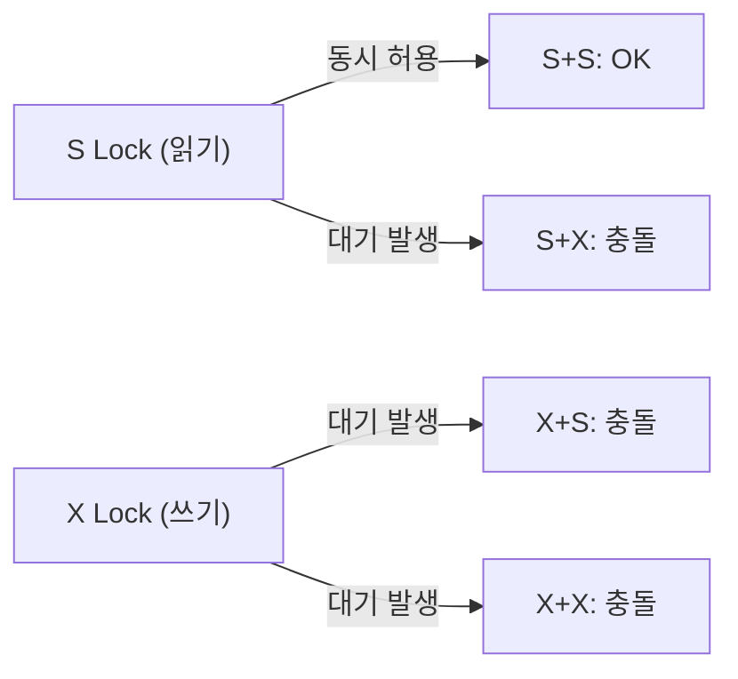
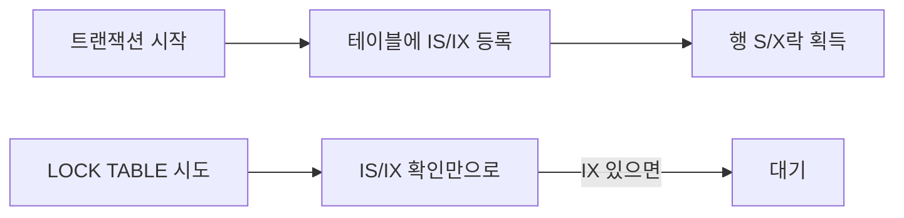
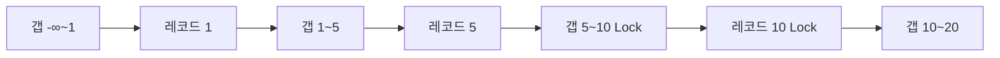
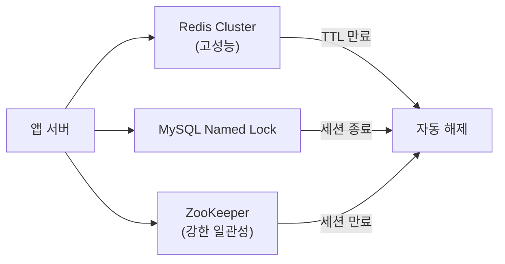

재고 1개짜리 상품에 10만 명이 동시에 주문을 쏟아냈다. 락 설계가 잘못되면 재고는 음수가 되고, 너무 강하면 시스템은 멈춰버린다. 락은 정합성과 성능 사이의 균형이다. 이 글에서는 InnoDB가 내부적으로 락을 어떻게 구현하는지부터, 데드락 탐지 알고리즘, 분산 락까지 시니어 개발자 수준으로 정리한다.

> **비유로 먼저 이해하기**: 공용 화장실 칸을 생각해보자. S락(공유 락)은 여러 명이 동시에 볼 수 있는 유리 칸이다. X락(배타 락)은 한 명만 들어갈 수 있는 일반 칸이다. 의향 락(IS/IX)은 화장실 입구에 붙은 표지판이다. "누군가 안에 있다"는 사실을 알리기 위해, 안에 들어가기 전에 표지판을 먼저 달아야 한다. 표지판만 확인하면 전체 칸을 하나씩 열어볼 필요가 없다.

<br>

## 1. 락이 왜 두 종류인가: S락과 X락의 존재 이유

### 읽기와 쓰기의 비대칭성

락이 하나만 있다면 어떻게 될까. `SELECT` 할 때도 전용 락을 걸면 동시 읽기가 불가능해진다. 웹 서비스의 트래픽 대부분은 읽기다. 쓰기 도중에도 읽기를 허용하면 처리량이 폭발적으로 오른다. 이것이 S락과 X락을 분리한 근본 이유다.

| 요청 조합 | 호환 여부 | 이유 |
|-----------|-----------|------|
| S vs S | 호환 (동시 읽기 가능) | 읽기끼리는 데이터를 변경하지 않으므로 충돌 없음 |
| S vs X | 충돌 (X 대기) | 읽는 도중 쓰기가 발생하면 dirty read 또는 비일관성 |
| X vs S | 충돌 (S 대기) | 쓰는 도중 읽기를 허용하면 중간 상태가 노출됨 |
| X vs X | 충돌 (X 대기) | 두 쓰기가 겹치면 최종 결과를 보장할 수 없음 |



**내부 구현 관점**: InnoDB는 각 인덱스 레코드에 락 비트맵을 유지한다. S락은 공유 카운터를 증가시키고, X락은 전용 플래그를 세팅한다. S카운터가 0이 아니면 X락을 획득할 수 없고, X플래그가 켜져 있으면 S카운터도 증가할 수 없다.

<br>

## 2. 의향 락(Intention Lock): 왜 테이블 락과 행 락이 공존할 수 있는가

### 문제 상황: 테이블 락 확인의 비용

트랜잭션 A가 특정 행에 X락을 걸고 있다. 트랜잭션 B가 `LOCK TABLE t WRITE`로 테이블 전체를 잠그려 한다. B는 "A가 어떤 행이라도 락을 갖고 있는지" 확인해야 한다. 행이 100만 개라면 100만 개를 순회해야 할까? 이것이 의향 락이 존재하는 이유다.

### IS(Intention Shared) / IX(Intention Exclusive)

```
규칙:
  행 S락 획득 전 → 테이블에 IS락을 먼저 획득
  행 X락 획득 전 → 테이블에 IX락을 먼저 획득

테이블 락 호환성 매트릭스:
      IS    IX    S     X
IS    O     O     O     X
IX    O     O     X     X
S     O     X     O     X
X     X     X     X     X
```



**핵심 WHY**: IX락이 테이블에 등록되어 있으면, B는 행을 하나씩 검사하지 않고 즉시 "누군가 행을 쓰고 있다"는 사실을 안다. 의향 락은 테이블 락과 행 락 사이의 다리 역할을 한다. 의향 락끼리는 항상 호환되므로 오버헤드가 없다.

**Java/JPA에서의 의향 락**: 개발자가 직접 다루지 않는다. `@Lock(PESSIMISTIC_WRITE)`이 `SELECT FOR UPDATE`를 실행하는 순간, InnoDB가 자동으로 테이블에 IX락을 등록하고 행에 X락을 건다.

<br>

## 3. InnoDB 락 세분화: 어떤 범위를 잠그는가

### 3-1. Record Lock: 인덱스에 건다, 레코드에 건다는 착각

"행 락"이라고 말하지만 InnoDB는 실제로 **인덱스 레코드**에 락을 건다. 이 차이가 중요하다.

```sql
-- 테이블: users(id PK, email UNIQUE, name)
SELECT * FROM users WHERE id = 5 FOR UPDATE;
```

```
인덱스 구조 (B+Tree):
  1 → 2 → 3 → 4 → [5: X Lock] → 6 → 7 → 8

id=5 인덱스 슬롯에만 X락. 나머지는 자유.
```

**인덱스 없는 열 조건의 재앙**: 인덱스가 없으면 어떻게 될까.

```sql
-- name에 인덱스 없음
SELECT * FROM users WHERE name = 'Kim' FOR UPDATE;
```

InnoDB는 `name='Kim'`인 행을 찾기 위해 클러스터 인덱스(PK)를 Full Scan한다. 스캔 과정에서 지나치는 모든 인덱스 레코드에 Next-Key Lock이 걸린다. 사실상 테이블 전체 락이다. **인덱스 설계가 락 범위를 결정한다.**

```java
// 안전: PK로 조회
@Lock(LockModeType.PESSIMISTIC_WRITE)
@Query("SELECT u FROM User u WHERE u.id = :id")
Optional<User> findByIdForUpdate(@Param("id") Long id);

// 위험: 인덱스 없는 컬럼 조건 → 테이블 전체 락
@Lock(LockModeType.PESSIMISTIC_WRITE)
@Query("SELECT u FROM User u WHERE u.name = :name")
Optional<User> findByNameForUpdate(@Param("name") String name); // 절대 이렇게 하지 말 것
```

### 3-2. Gap Lock: 팬텀 리드를 막는 유령 방어막

갭 락은 존재하지 않는 행 사이의 공간에 건다. 새 행의 삽입을 막아 팬텀 리드를 방지한다.

```sql
-- id: 1, 5, 10, 20이 존재한다고 가정
SELECT * FROM orders WHERE id BETWEEN 5 AND 10 FOR UPDATE;
```

```
잠기는 범위:
  (1, 5] 갭   → id=5 레코드
  (5, 10] 갭  → id=10 레코드

다른 트랜잭션이 id=7로 INSERT 시도 → 차단됨
이유: (5, 10) 갭에 Gap Lock이 걸려 있기 때문
```

**갭 락이 없는 세계(READ COMMITTED)에서는**:

```sql
-- 트랜잭션 A: REPEATABLE READ
SELECT * FROM orders WHERE amount > 1000; -- 3건 반환

-- 트랜잭션 B: 동시에 INSERT
INSERT INTO orders (amount) VALUES (1500); -- 갭 락 없으면 성공

-- 트랜잭션 A: 동일 쿼리 재실행
SELECT * FROM orders WHERE amount > 1000; -- 4건 반환 → 팬텀 리드!
```

REPEATABLE READ에서 갭 락이 B의 삽입을 막아 팬텀 리드를 차단한다. READ COMMITTED는 갭 락을 사용하지 않아 동시성이 높지만 팬텀 리드가 허용된다.

**갭 락의 역설**: 갭 락끼리는 호환된다. 두 트랜잭션이 같은 갭에 갭 락을 동시에 가질 수 있다. 하지만 둘 다 그 갭에 INSERT하려 하면 데드락이 된다. 이것이 의외로 많이 발생하는 데드락 패턴이다.

```java
// 데드락 유발 패턴
// T1: DELETE WHERE id=5 (없는 행) → Gap Lock (1,10)
// T2: DELETE WHERE id=7 (없는 행) → Gap Lock (1,10) 획득 성공 (갭 락 호환)
// T1: INSERT id=6 → (1,10) 갭 Lock 대기
// T2: INSERT id=8 → (1,10) 갭 Lock 대기 → Deadlock!
```

### 3-3. Next-Key Lock: InnoDB의 기본 락 단위

넥스트 키 락 = Record Lock + 앞쪽 Gap Lock. InnoDB REPEATABLE READ에서 모든 `SELECT FOR UPDATE`와 `SELECT FOR SHARE`는 기본적으로 넥스트 키 락을 사용한다.

```sql
-- id: 1, 5, 10, 20이 존재
-- (-∞, 1], (1, 5], (5, 10], (10, 20], (20, +∞)
-- 이것이 InnoDB가 나누는 락 구간(interval)

SELECT * FROM t WHERE id = 10 FOR UPDATE;
-- 잠기는 구간: (5, 10] → Record Lock on 10 + Gap Lock (5, 10)
```



**최적화 예외 케이스**: 등치 검색(=)에서 마지막 레코드를 찾으면 갭 락이 오른쪽으로 이동한다.

```sql
-- id=10이 존재하는 경우
SELECT * FROM t WHERE id = 10 FOR UPDATE;
-- Record Lock on 10 + Gap Lock (10, 20)
-- 이유: 10을 정확히 찾았으므로 (5,10) 왼쪽 갭은 불필요

-- id=10이 존재하지 않는 경우
SELECT * FROM t WHERE id = 10 FOR UPDATE;
-- Gap Lock (5, 20)만 걸림 (Record Lock 없음, 레코드가 없으므로)
```

**Java 코드와 락 범위 매핑**:

```java
@Entity
@Table(name = "orders")
public class Order {
    @Id
    @GeneratedValue(strategy = GenerationType.IDENTITY)
    private Long id;

    @Column(nullable = false)
    private Long userId;

    @Column(nullable = false)
    private Integer amount;
}

public interface OrderRepository extends JpaRepository<Order, Long> {

    // PK 등치: Record Lock + Gap Lock(우측)만
    @Lock(LockModeType.PESSIMISTIC_WRITE)
    @Query("SELECT o FROM Order o WHERE o.id = :id")
    Optional<Order> findByIdForUpdate(@Param("id") Long id);

    // 범위: 범위 내 모든 Next-Key Lock
    @Lock(LockModeType.PESSIMISTIC_WRITE)
    @Query("SELECT o FROM Order o WHERE o.userId = :userId AND o.amount > :minAmount")
    List<Order> findForUpdate(@Param("userId") Long userId,
                              @Param("minAmount") Integer minAmount);
}
```

### 3-4. INSERT 의향 락: 동일 갭 동시 삽입 허용

갭 락은 INSERT 자체를 막는다. 하지만 서로 다른 위치에 삽입하는 두 트랜잭션은 왜 서로 막지 않을까. INSERT 의향 락(Insert Intention Lock) 덕분이다.

```
T1: INSERT id=6 → Insert Intention Lock on (5,10)
T2: INSERT id=8 → Insert Intention Lock on (5,10)

Insert Intention Lock끼리는 삽입 위치가 다르면 호환됨 → 동시 진행 가능
But: Gap Lock이 있으면 Insert Intention Lock을 획득할 수 없음 → 대기
```

**호환성 매트릭스 (락 종류별)**:

| | Gap | Insert Intention | Record | Next-Key |
|--|--|--|--|--|
| Gap | 호환 | 충돌 | 호환 | 호환 |
| Insert Intention | 충돌 | 호환(위치 다르면) | 호환 | 충돌 |
| Record | 호환 | 호환 | 충돌(X vs X) | 충돌 |
| Next-Key | 호환 | 충돌 | 충돌 | 충돌 |

<br>

## 4. 비관적 락: 선점하고 작업하기

### WHY: 언제 비관적 락을 선택해야 하는가

충돌 감지를 커밋 시점으로 미루면(낙관적 락) 충돌이 많을수록 재시도 비용이 폭발한다. 100명이 같은 재고를 동시에 차감하면 99명이 재시도하고, 그 중 98명이 또 실패한다. O(N²) 쿼리가 DB를 짓누른다. 충돌이 확실하다면 처음부터 막는 것이 낫다. 그것이 비관적 락이다.

### SELECT FOR UPDATE vs SELECT FOR SHARE

```sql
-- FOR UPDATE: X락. 다른 트랜잭션의 읽기(FOR SHARE 포함)를 차단
-- 재고 차감, 잔액 변경 등 반드시 쓰기가 뒤따르는 경우
SELECT * FROM products WHERE id = 1 FOR UPDATE;

-- FOR SHARE (= LOCK IN SHARE MODE): S락. 쓰기만 차단, 읽기는 허용
-- 부모 레코드 존재 확인 후 자식 INSERT 등, 읽기 후 다른 것을 쓰는 경우
SELECT * FROM categories WHERE id = 1 FOR SHARE;
```

**NOWAIT / SKIP LOCKED**: MySQL 8.0+, Java 21 이후 실무에서 자주 등장한다.

```sql
-- NOWAIT: 락을 즉시 획득 못하면 에러 반환 (대기 없음)
SELECT * FROM orders WHERE id = 1 FOR UPDATE NOWAIT;

-- SKIP LOCKED: 락된 행 건너뛰고 나머지만 반환 (작업 큐 구현에 사용)
SELECT * FROM tasks WHERE status = 'PENDING' LIMIT 10 FOR UPDATE SKIP LOCKED;
```

```java
// JPA에서 SKIP LOCKED: 분산 작업 큐
public interface TaskRepository extends JpaRepository<Task, Long> {

    @Lock(LockModeType.PESSIMISTIC_WRITE)
    @QueryHints({
        @QueryHint(name = "jakarta.persistence.lock.timeout", value = "-2") // SKIP LOCKED
    })
    @Query("SELECT t FROM Task t WHERE t.status = 'PENDING' ORDER BY t.createdAt")
    List<Task> findPendingTasksSkipLocked(Pageable pageable);
}
```

> `lock.timeout = -2`는 Hibernate의 SKIP LOCKED 힌트다. `-1`은 NOWAIT이다.

### JPA @Lock 전체 옵션과 매핑

```java
@Entity
@Table(name = "products")
public class Product {

    @Id
    @GeneratedValue(strategy = GenerationType.IDENTITY)
    private Long id;

    private String name;
    private int stock;
    private BigDecimal price;
}

public interface ProductRepository extends JpaRepository<Product, Long> {

    // PESSIMISTIC_WRITE: SELECT ... FOR UPDATE (X락)
    @Lock(LockModeType.PESSIMISTIC_WRITE)
    @Query("SELECT p FROM Product p WHERE p.id = :id")
    Optional<Product> findByIdWithXLock(@Param("id") Long id);

    // PESSIMISTIC_READ: SELECT ... FOR SHARE (S락)
    @Lock(LockModeType.PESSIMISTIC_READ)
    @Query("SELECT p FROM Product p WHERE p.id = :id")
    Optional<Product> findByIdWithSLock(@Param("id") Long id);

    // PESSIMISTIC_FORCE_INCREMENT: FOR UPDATE + @Version 강제 증가
    // 연관 엔티티 변경을 버전으로 추적할 때 사용
    @Lock(LockModeType.PESSIMISTIC_FORCE_INCREMENT)
    @Query("SELECT p FROM Product p WHERE p.id = :id")
    Optional<Product> findByIdWithForceVersion(@Param("id") Long id);
}
```

### 재고 차감 완전 구현

```java
@Service
@RequiredArgsConstructor
@Slf4j
public class StockService {

    private final ProductRepository productRepository;

    @Transactional
    public void decreaseStock(Long productId, int quantity) {
        // 1. FOR UPDATE로 X락 획득 (다른 트랜잭션 동시 진행 차단)
        Product product = productRepository.findByIdWithXLock(productId)
                .orElseThrow(() -> new EntityNotFoundException("상품 없음: " + productId));

        // 2. 비즈니스 검증 (락 보유 상태에서 안전하게 수행)
        if (product.getStock() < quantity) {
            throw new InsufficientStockException(
                "재고 부족. 현재: " + product.getStock() + ", 요청: " + quantity
            );
        }

        // 3. 상태 변경 (더티 체킹으로 자동 UPDATE)
        product.decreaseStock(quantity);

        // 트랜잭션 종료 시:
        // UPDATE products SET stock = ? WHERE id = ?  → 실행
        // COMMIT                                       → X락 해제
    }
}
```

**실행 SQL 추적**:

```sql
-- Step 1
SELECT p.id, p.name, p.stock, p.price
FROM products p
WHERE p.id = ?
FOR UPDATE;

-- Step 2 (트랜잭션 종료 직전 더티 체킹)
UPDATE products
SET stock = ?, name = ?, price = ?
WHERE id = ?;

-- COMMIT → FOR UPDATE 락 해제
```

### 타임아웃 설정: 무한 대기 방지

```java
public interface ProductRepository extends JpaRepository<Product, Long> {

    @Lock(LockModeType.PESSIMISTIC_WRITE)
    @QueryHints({
        @QueryHint(
            name = "jakarta.persistence.lock.timeout",
            value = "3000"  // 3초. 초과 시 LockTimeoutException
        )
    })
    @Query("SELECT p FROM Product p WHERE p.id = :id")
    Optional<Product> findByIdWithXLockTimeout(@Param("id") Long id);
}
```

**application.yml 전역 설정**:

```yaml
spring:
  jpa:
    properties:
      jakarta:
        persistence:
          lock:
            timeout: 5000  # 전역 락 타임아웃 5초
```

**NOWAIT를 JPA 힌트로 적용**:

```java
@Lock(LockModeType.PESSIMISTIC_WRITE)
@QueryHints({
    @QueryHint(name = "jakarta.persistence.lock.timeout", value = "-1") // NOWAIT
})
@Query("SELECT p FROM Product p WHERE p.id = :id")
Optional<Product> findByIdNowait(@Param("id") Long id);
```

### 네이티브 SQL로 잠금 (JPA 우회)

```java
@Repository
public class ProductNativeRepository {

    @PersistenceContext
    private EntityManager em;

    public Product findForUpdateNative(Long id) {
        // 네이티브 쿼리 직접 실행
        List<Product> result = em.createNativeQuery(
            "SELECT * FROM products WHERE id = ? FOR UPDATE NOWAIT",
            Product.class
        )
        .setParameter(1, id)
        .getResultList();

        return result.isEmpty() ? null : result.get(0);
    }

    public Product findForUpdateSkipLocked(Long id) {
        List<Product> result = em.createNativeQuery(
            "SELECT * FROM products WHERE id = ? FOR UPDATE SKIP LOCKED",
            Product.class
        )
        .setParameter(1, id)
        .getResultList();

        return result.isEmpty() ? null : result.get(0);
    }
}
```

<br>

## 5. 낙관적 락: 충돌을 커밋 직전에 감지하기

### WHY: CAS 패턴과 낙관적 락의 연결

CPU의 CAS(Compare-And-Swap) 명령어를 생각해보자. "현재 값이 예상 값과 같으면 새 값으로 교체한다. 다르면 실패를 반환한다." 낙관적 락은 DB 버전 컬럼으로 같은 원리를 구현한다.

```
CAS 원리:
  compareAndSwap(expected=5, new=6)
  → 현재 값이 5면 6으로 교체, 성공
  → 현재 값이 5가 아니면 실패

낙관적 락 원리:
  UPDATE ... SET version=6 WHERE id=1 AND version=5
  → affected rows = 1: 성공 (다른 트랜잭션이 변경하지 않음)
  → affected rows = 0: 실패 (다른 트랜잭션이 이미 version을 바꿈)
```

**DB 락 없이 정합성을 보장하는 원리**: S락도 X락도 사용하지 않는다. 대신 모든 트랜잭션이 동시에 읽고, 쓸 때만 충돌 여부를 검사한다. 충돌이 드물면 대부분 성공하고 DB 락 오버헤드가 없다.

### @Version의 내부 동작 단계별 분석

```java
@Entity
@Table(name = "articles")
public class Article {

    @Id
    @GeneratedValue(strategy = GenerationType.IDENTITY)
    private Long id;

    private String title;

    @Lob
    private String content;

    @Version
    private Long version;  // JPA가 관리. 직접 변경 금지.
}
```

```
초기 상태: { id=1, title='제목', content='내용', version=3 }

─── T1 시작 ─────────────────────────────────────────────────
T1: SELECT id, title, content, version FROM articles WHERE id=1
    → { title='제목', content='내용', version=3 } 로딩

─── T2 시작 (동시) ──────────────────────────────────────────
T2: SELECT ... WHERE id=1
    → { title='제목', content='내용', version=3 } 로딩

─── T1 커밋 ──────────────────────────────────────────────────
T1: article.setContent('T1의 수정 내용')
T1: COMMIT →
    UPDATE articles
    SET content='T1의 수정 내용', version=4  ← version+1
    WHERE id=1 AND version=3               ← 읽을 때 version
    affected rows = 1 → 성공
    DB: { version=4 }

─── T2 커밋 시도 ────────────────────────────────────────────
T2: article.setTitle('T2의 수정 제목')
T2: COMMIT →
    UPDATE articles
    SET title='T2의 수정 제목', version=4   ← version+1
    WHERE id=1 AND version=3               ← 읽을 때 version
    affected rows = 0 → 실패!
    → JPA: OptimisticLockException 발생
    → Spring: OptimisticLockingFailureException으로 변환
```

### 재시도 전략 3가지

```java
@Service
@RequiredArgsConstructor
@Slf4j
public class ArticleService {

    private final ArticleRepository articleRepository;

    // ── 전략 1: 단순 재시도 (충돌 적은 경우) ──────────────────────────
    public void updateArticleV1(Long id, String newContent) {
        int maxRetry = 3;
        for (int attempt = 1; attempt <= maxRetry; attempt++) {
            try {
                updateArticleInternal(id, newContent);
                return;
            } catch (OptimisticLockingFailureException e) {
                log.warn("낙관적 락 충돌. attempt={}/{}", attempt, maxRetry);
                if (attempt == maxRetry) {
                    throw new ConcurrentModificationException("수정 충돌. 다시 시도해주세요.", e);
                }
            }
        }
    }

    // ── 전략 2: 지수 백오프 재시도 (충돌 중간 정도인 경우) ────────────
    public void updateArticleV2(Long id, String newContent) {
        int maxRetry = 5;
        long baseDelayMs = 50;

        for (int attempt = 1; attempt <= maxRetry; attempt++) {
            try {
                updateArticleInternal(id, newContent);
                return;
            } catch (OptimisticLockingFailureException e) {
                if (attempt == maxRetry) {
                    throw new ConcurrentModificationException("수정 충돌 반복", e);
                }
                long delay = baseDelayMs * (1L << (attempt - 1)); // 50, 100, 200, 400, 800ms
                log.warn("낙관적 락 충돌. attempt={}, delay={}ms", attempt, delay);
                try {
                    Thread.sleep(delay);
                } catch (InterruptedException ie) {
                    Thread.currentThread().interrupt();
                    throw new RuntimeException("인터럽트 발생", ie);
                }
            }
        }
    }

    // ── 전략 3: Spring Retry (@Retryable) ─────────────────────────────
    @Retryable(
        retryFor = OptimisticLockingFailureException.class,
        maxAttempts = 3,
        backoff = @Backoff(delay = 100, multiplier = 2.0)
    )
    @Transactional
    public void updateArticleV3(Long id, String newContent) {
        Article article = articleRepository.findById(id)
                .orElseThrow(() -> new EntityNotFoundException("게시글 없음: " + id));
        article.setContent(newContent);
        // 커밋 시 version 체크
    }

    @Transactional
    private void updateArticleInternal(Long id, String newContent) {
        Article article = articleRepository.findById(id)
                .orElseThrow(() -> new EntityNotFoundException("게시글 없음: " + id));
        article.setContent(newContent);
    }
}
```

**build.gradle에 Spring Retry 의존성**:

```gradle
implementation 'org.springframework.retry:spring-retry'
implementation 'org.springframework:spring-aspects'

// @EnableRetry 추가
@SpringBootApplication
@EnableRetry
public class Application { ... }
```

### @Version 없이 수동 버전 관리 (레거시 DB 대응)

```java
@Modifying
@Query("""
    UPDATE Article a
    SET a.content = :content,
        a.version = a.version + 1
    WHERE a.id = :id
      AND a.version = :version
    """)
int updateWithVersionCheck(
        @Param("id") Long id,
        @Param("content") String content,
        @Param("version") Long version);

// 서비스 레이어
@Transactional
public void updateManually(Long id, String content) {
    Article article = articleRepository.findById(id)
            .orElseThrow();

    int updated = articleRepository.updateWithVersionCheck(
            id, content, article.getVersion()
    );

    if (updated == 0) {
        throw new OptimisticLockingFailureException(
            "버전 충돌: id=" + id + ", version=" + article.getVersion()
        );
    }
}
```

### OPTIMISTIC_FORCE_INCREMENT: 연관 엔티티 변경을 버전으로 추적

```java
// 주문(Order)의 상품(OrderItem)이 추가되어도 Order의 version을 올리고 싶을 때
public interface OrderRepository extends JpaRepository<Order, Long> {

    @Lock(LockModeType.OPTIMISTIC_FORCE_INCREMENT)
    @Query("SELECT o FROM Order o WHERE o.id = :id")
    Optional<Order> findByIdForceVersion(@Param("id") Long id);
}

// Order의 필드를 변경하지 않아도 COMMIT 시 version+1 강제 실행
// SELECT ... → OrderItem 추가 → UPDATE order SET version=n+1 WHERE version=n
```

**언제 사용하는가**: 집계 루트(Order)의 버전으로 자식 엔티티(OrderItem) 변경을 감시해야 할 때. 분산 캐시에서 Order가 캐싱된 경우, version 변경으로 캐시 무효화 트리거를 만들 수 있다.

<br>

## 6. 데드락: InnoDB가 어떻게 탐지하고 어떻게 복구하는가

### 데드락 발생 조건 (Coffman 4조건)

데드락은 4가지 조건이 동시에 충족될 때 발생한다.

```
1. 상호 배제: 하나의 락은 한 트랜잭션만 보유
2. 점유 대기: 락을 보유한 채 다른 락을 기다림
3. 비선점: 락을 강제로 빼앗을 수 없음 (InnoDB는 하나를 롤백해 해결)
4. 순환 대기: T1→T2→T3→T1 형태의 락 대기 사이클
```

```
고전적 데드락: 계좌 이체 교차 요청

T1 (A→B):                    T2 (B→A):
LOCK account_id=1 (X락) ──┐  LOCK account_id=2 (X락) ──┐
작업 중...                  │  작업 중...                  │
                            │                              │
LOCK account_id=2 (X락) ←──┘  LOCK account_id=1 (X락) ←──┘
(T2가 보유 → 대기)              (T1이 보유 → 대기)

순환 대기: T1은 T2가 가진 락을 기다리고, T2는 T1이 가진 락을 기다림
```

### InnoDB 데드락 탐지: Wait-For Graph DFS

InnoDB는 트랜잭션 간의 "대기 관계"를 유향 그래프(Wait-For Graph, WFG)로 관리한다.

```
WFG:
  T1 → T2 (T1이 T2를 기다림)
  T2 → T1 (T2가 T1을 기다림)
  → 사이클 발견 → 데드락!

탐지 알고리즘:
  1. 새 트랜잭션이 락 대기 진입 시 WFG에 간선 추가
  2. DFS로 사이클 탐색
  3. 사이클 발견 시 "희생자(victim)" 선정
     → 언두 로그 양이 적은(롤백 비용 작은) 트랜잭션을 롤백
  4. 희생자에게 ERROR 1213: Deadlock found 반환
```

**`innodb_deadlock_detect` 설정**:

```sql
-- MySQL 5.7.15+ 기본값: ON
-- OFF로 설정하면 WFG 탐지 비용 0, 하지만 데드락 시 타임아웃까지 대기
SET GLOBAL innodb_deadlock_detect = ON;

-- 데드락 탐지 비용: 트랜잭션 수 × 락 대기 수의 함수
-- 매우 높은 동시성(10만 TPS)에서는 탐지 자체가 병목이 될 수 있음
-- → 이 경우 OFF + innodb_lock_wait_timeout 설정 병행
SET GLOBAL innodb_lock_wait_timeout = 5; -- 5초 대기 후 자동 롤백
```

### SHOW ENGINE INNODB STATUS 읽기

```sql
SHOW ENGINE INNODB STATUS;
```

```
------------------------
LATEST DETECTED DEADLOCK
------------------------
2026-05-13 09:00:00 0x7f12345

*** (1) TRANSACTION:
TRANSACTION 12345, ACTIVE 0 sec starting index read
MySQL thread id 101, query id 5001 localhost app_user updating
UPDATE products SET stock = 9 WHERE id = 1
*** (1) HOLDS THE LOCK(S):
RECORD LOCKS space id 100 page no 3 n bits 72 index PRIMARY
of table `shop`.`products` trx id 12345 lock_mode X locks rec but not gap
*** (1) WAITING FOR THIS LOCK TO BE GRANTED:
RECORD LOCKS space id 101 page no 3 n bits 72 index PRIMARY
of table `shop`.`orders` trx id 12345 lock_mode X locks rec but not gap

*** (2) TRANSACTION:
TRANSACTION 12346, ACTIVE 0 sec starting index read
*** (2) HOLDS THE LOCK(S):
RECORD LOCKS ... index PRIMARY of table `shop`.`orders` lock_mode X
*** (2) WAITING FOR THIS LOCK TO BE GRANTED:
RECORD LOCKS ... index PRIMARY of table `shop`.`products` lock_mode X

*** WE ROLL BACK TRANSACTION (2)
```

**읽는 법**:
- `HOLDS THE LOCK(S)`: 현재 보유 중인 락
- `WAITING FOR THIS LOCK`: 기다리는 락
- `WE ROLL BACK TRANSACTION (2)`: InnoDB가 트랜잭션 2를 희생자로 선정해 롤백

### 데드락 해결: 락 획득 순서 고정

```java
@Service
@RequiredArgsConstructor
public class TransferService {

    private final AccountRepository accountRepository;

    @Transactional
    public void transfer(Long fromId, Long toId, BigDecimal amount) {
        // 핵심: 항상 작은 id 먼저 잠금 → 순환 대기 불가능
        Long firstId = Math.min(fromId, toId);
        Long secondId = Math.max(fromId, toId);

        Account first = accountRepository.findByIdForUpdate(firstId)
                .orElseThrow(() -> new EntityNotFoundException("계좌 없음: " + firstId));
        Account second = accountRepository.findByIdForUpdate(secondId)
                .orElseThrow(() -> new EntityNotFoundException("계좌 없음: " + secondId));

        // 실제 from/to 방향에 따라 처리
        Account from = fromId.equals(firstId) ? first : second;
        Account to = fromId.equals(firstId) ? second : first;

        if (from.getBalance().compareTo(amount) < 0) {
            throw new InsufficientBalanceException("잔액 부족: " + from.getBalance());
        }

        from.withdraw(amount);
        to.deposit(amount);

        // T1(A→B): LOCK A(id=1) → LOCK B(id=2)
        // T2(B→A): LOCK A(id=1) → LOCK B(id=2) ← 같은 순서!
        // 순환 대기 없음 → 데드락 없음
    }
}
```

### Spring에서 데드락 재시도

```java
@Configuration
@EnableRetry
public class RetryConfig { }

@Service
@Slf4j
public class OrderService {

    @Retryable(
        retryFor = { DeadlockLoserDataAccessException.class, CannotAcquireLockException.class },
        maxAttempts = 3,
        backoff = @Backoff(delay = 50, multiplier = 1.5)
    )
    @Transactional
    public void processOrder(Long orderId) {
        // 데드락 희생자가 되면 DeadlockLoserDataAccessException 발생
        // → @Retryable이 자동으로 최대 3회 재시도
    }

    @Recover
    public void recoverFromDeadlock(DeadlockLoserDataAccessException e, Long orderId) {
        log.error("데드락 재시도 모두 실패. orderId={}", orderId, e);
        throw new OrderProcessingException("주문 처리 실패. 잠시 후 재시도해주세요.", e);
    }
}
```

<br>

## 7. 락 에스컬레이션: InnoDB는 왜 하지 않는가

### SQL Server의 락 에스컬레이션

SQL Server는 행 락이 5000개를 초과하면 자동으로 테이블 락으로 승격(escalation)한다. 이유는 메모리다. 행 락 하나는 96바이트를 차지한다. 5000개 × 96B = 480KB. 테이블 락은 단 하나의 구조로 표현된다.

```
SQL Server 락 에스컬레이션:
  행 락 5000개 → 자동 테이블 락으로 대체
  → 메모리 절약
  → 하지만 다른 트랜잭션의 테이블 접근 전면 차단
  → 예측 불가능한 블로킹 발생
```

### InnoDB가 에스컬레이션을 하지 않는 이유

InnoDB는 행 락을 비트맵으로 인덱스 페이지에 저장한다. 별도의 락 구조체를 힙에 할당하지 않는다. 비트맵 방식이므로 행 락 1개와 100만 개의 메모리 차이가 SQL Server처럼 선형 증가하지 않는다.

```
InnoDB 락 저장 구조:
  인덱스 페이지 내부에 lock bitmap 포함
  → 행 락 추가 = 비트 하나 세팅 (O(1), 추가 메모리 없음)
  → 에스컬레이션 없어도 메모리 안전
```

**트레이드오프**: 인덱스 없는 전체 스캔에서 FOR UPDATE를 쓰면 InnoDB는 모든 행에 넥스트 키 락을 걸고도 에스컬레이션하지 않는다. 테이블 락과 동등한 효과지만 락 매니저 관점에서 비용은 그대로다. 이것이 인덱스 설계가 락 성능에 직결되는 이유다.

<br>

## 8. AUTO_INCREMENT 락: bulk insert 성능의 비밀

### innodb_autoinc_lock_mode의 3단계

AUTO_INCREMENT 컬럼이 있는 테이블에 INSERT할 때 InnoDB는 어떻게 유일한 값을 보장하는가.

```
모드 0 (traditional):
  INSERT 문 전체 동안 테이블 수준 AUTO-INC 락 보유
  → 완벽한 연속성
  → 동시 INSERT 직렬화 → 처리량 최악

모드 1 (consecutive, MySQL 5.x 기본값):
  단순 INSERT(행 수 확정)는 경량 뮤텍스로 처리, 즉시 해제
  LOAD DATA INFILE 등 행 수 불확정 INSERT는 AUTO-INC 락
  → 단일 문 내 연속성 보장, 전체 연속성 미보장

모드 2 (interleaved, MySQL 8.0 기본값):
  모든 INSERT에서 경량 뮤텍스만 사용
  → 최고 동시성, bulk insert 성능 최대화
  → AUTO_INCREMENT 값이 중간에 건너뛸 수 있음
  → 바이너리 로그 STATEMENT 모드와 호환 안 됨 (ROW 모드 사용 필요)
```

```sql
-- 현재 설정 확인
SHOW VARIABLES LIKE 'innodb_autoinc_lock_mode';

-- 설정 변경 (my.cnf)
[mysqld]
innodb_autoinc_lock_mode = 2
binlog_format = ROW  -- 모드 2는 ROW 바이너리 로그 필요
```

**Java에서 AUTO_INCREMENT 전략 선택**:

```java
@Entity
public class Order {

    // IDENTITY: 각 INSERT 후 DB에서 생성된 ID 조회 (JDBC getGeneratedKeys)
    // 배치 INSERT 불가 (각 INSERT를 개별 실행해야 ID를 알 수 있음)
    @Id
    @GeneratedValue(strategy = GenerationType.IDENTITY)
    private Long id;
}

@Entity
public class Product {

    // SEQUENCE: DB 시퀀스 사용. 배치 INSERT 가능. PostgreSQL 권장.
    // MySQL에서는 시뮬레이션 테이블 사용 (hibernate_sequence)
    @Id
    @GeneratedValue(strategy = GenerationType.SEQUENCE,
                    generator = "product_seq")
    @SequenceGenerator(name = "product_seq",
                       sequenceName = "product_sequence",
                       allocationSize = 50) // DB를 50씩 미리 확보
    private Long id;
}
```

> `innodb_autoinc_lock_mode=2`는 IDENTITY 전략의 동시 INSERT 성능을 높인다. 단, AUTO_INCREMENT 값의 연속성에 의존하는 비즈니스 로직(ex: "마지막 주문 번호 + 1"로 식별)은 위험해진다.

<br>

## 9. 네임드 락 (User-Level Lock): DB 서버 레벨 분산 락

### 개념: 레코드가 아닌 이름을 잠근다

```sql
-- 락 획득 (최대 10초 대기, 0이면 즉시 반환)
SELECT GET_LOCK('payment:user:100', 10);
-- 반환: 1(성공), 0(타임아웃), NULL(오류)

-- 락 상태 확인
SELECT IS_FREE_LOCK('payment:user:100');  -- 1: 사용 가능, 0: 사용 중
SELECT IS_USED_LOCK('payment:user:100');  -- 사용 중이면 connection_id 반환

-- 락 해제
SELECT RELEASE_LOCK('payment:user:100');
-- 반환: 1(성공), 0(현재 세션이 보유하지 않음), NULL(없음)

-- 현재 세션의 모든 네임드 락 해제
SELECT RELEASE_ALL_LOCKS();
```

**레코드 락과의 근본적 차이**:

```
레코드 락:                       네임드 락:
  트랜잭션과 수명 연동              트랜잭션과 독립
  COMMIT/ROLLBACK 시 자동 해제     명시적 RELEASE_LOCK 필요
  InnoDB 엔진 관리                 MySQL 서버 레벨 관리
  인덱스 기반                      임의 문자열 기반
  재진입 가능                      재진입 불가 (MySQL 8.0 이전)
```

### 완전한 Java/Spring 구현

```java
// 락 전용 Repository (별도 DataSource 사용)
public interface NamedLockRepository extends JpaRepository<LockEntity, Long> {

    @Query(value = "SELECT GET_LOCK(:name, :timeoutSeconds)", nativeQuery = true)
    Integer getLock(@Param("name") String name,
                    @Param("timeoutSeconds") int timeoutSeconds);

    @Query(value = "SELECT RELEASE_LOCK(:name)", nativeQuery = true)
    Integer releaseLock(@Param("name") String name);

    @Query(value = "SELECT IS_FREE_LOCK(:name)", nativeQuery = true)
    Integer isFreeLock(@Param("name") String name);
}

// 범용 Named Lock 템플릿
@Component
@RequiredArgsConstructor
@Slf4j
public class NamedLockTemplate {

    private final NamedLockRepository namedLockRepository;

    public <T> T executeWithLock(String lockName, int timeoutSeconds, Supplier<T> action) {
        acquireLock(lockName, timeoutSeconds);
        try {
            return action.get();
        } finally {
            releaseLock(lockName);
        }
    }

    public void executeWithLock(String lockName, int timeoutSeconds, Runnable action) {
        executeWithLock(lockName, timeoutSeconds, () -> {
            action.run();
            return null;
        });
    }

    private void acquireLock(String lockName, int timeoutSeconds) {
        Integer result = namedLockRepository.getLock(lockName, timeoutSeconds);
        if (result == null || result != 1) {
            throw new LockAcquisitionFailedException(
                "락 획득 실패: name=" + lockName + ", timeout=" + timeoutSeconds + "s"
            );
        }
        log.debug("Named lock 획득: {}", lockName);
    }

    private void releaseLock(String lockName) {
        Integer result = namedLockRepository.releaseLock(lockName);
        if (result == null || result != 1) {
            log.warn("Named lock 해제 이상: name={}, result={}", lockName, result);
        } else {
            log.debug("Named lock 해제: {}", lockName);
        }
    }
}
```

### 별도 DataSource 설정 (커넥션 고갈 방지)

```
왜 별도 DataSource가 필요한가:

트랜잭션 + 네임드 락을 같은 커넥션으로 사용하면:
  1. 트랜잭션 시작 → 커넥션 A 할당
  2. GET_LOCK() → 커넥션 A에서 실행
  3. 트랜잭션 커밋 → 커넥션 A 풀에 반납
  4. 하지만 GET_LOCK은 커넥션 A가 살아있는 한 유지
  5. 다음 요청이 커넥션 A를 재사용하면 락이 예상치 못하게 이미 걸려있음

→ 네임드 락 전용 커넥션 풀을 별도로 운영해야 한다.
```

```java
@Configuration
public class DataSourceConfig {

    @Bean
    @Primary
    @ConfigurationProperties("spring.datasource.main")
    public DataSource mainDataSource() {
        return DataSourceBuilder.create().build();
    }

    @Bean
    @Qualifier("lockDataSource")
    @ConfigurationProperties("spring.datasource.lock")
    public DataSource lockDataSource() {
        return DataSourceBuilder.create().build();
    }

    // 락 전용 EntityManagerFactory
    @Bean
    @Qualifier("lockEntityManagerFactory")
    public LocalContainerEntityManagerFactoryBean lockEntityManagerFactory(
            @Qualifier("lockDataSource") DataSource lockDataSource,
            JpaVendorAdapter jpaVendorAdapter) {
        LocalContainerEntityManagerFactoryBean factory =
                new LocalContainerEntityManagerFactoryBean();
        factory.setDataSource(lockDataSource);
        factory.setJpaVendorAdapter(jpaVendorAdapter);
        factory.setPackagesToScan("com.example.lock");
        return factory;
    }
}
```

```yaml
# application.yml
spring:
  datasource:
    main:
      url: jdbc:mysql://localhost:3306/shop
      hikari:
        maximum-pool-size: 20
    lock:
      url: jdbc:mysql://localhost:3306/shop
      hikari:
        maximum-pool-size: 5   # 락 전용 풀은 작게
        connection-timeout: 3000
```

### 결제 중복 방지 실전 예제

```java
@Service
@RequiredArgsConstructor
@Slf4j
public class PaymentService {

    private final NamedLockTemplate namedLockTemplate;
    private final PaymentRepository paymentRepository;
    private final ExternalPaymentGateway paymentGateway;

    public PaymentResult processPayment(Long userId, Long orderId, BigDecimal amount) {
        // 사용자+주문 조합으로 락 이름 생성 (충분히 고유해야 함)
        String lockName = "payment:" + userId + ":" + orderId;

        return namedLockTemplate.executeWithLock(lockName, 10, () -> {
            // 이 블록은 동시에 하나의 스레드만 실행 보장

            // 중복 결제 검사
            if (paymentRepository.existsByUserIdAndOrderId(userId, orderId)) {
                throw new DuplicatePaymentException("이미 처리된 결제: orderId=" + orderId);
            }

            // 외부 PG 호출 (트랜잭션 밖, 네임드 락 안)
            String pgTransactionId = paymentGateway.charge(amount);

            // DB 기록
            return savePaymentRecord(userId, orderId, amount, pgTransactionId);
        });
    }

    @Transactional
    protected PaymentResult savePaymentRecord(Long userId, Long orderId,
            BigDecimal amount, String pgTransactionId) {
        Payment payment = Payment.builder()
                .userId(userId)
                .orderId(orderId)
                .amount(amount)
                .pgTransactionId(pgTransactionId)
                .status(PaymentStatus.COMPLETED)
                .build();
        return PaymentResult.from(paymentRepository.save(payment));
    }
}
```

<br>

## 10. 분산 락: Redis vs DB Advisory vs ZooKeeper

### 왜 단일 DB 락으로는 부족한가

```
단일 DB 락의 한계:
  App1 ──→ MySQL (락 획득)
  App2 ──→ MySQL (대기)   ← 같은 DB, 같은 서버이므로 작동

  App1 ──→ MySQL-Primary (락 획득)
  App2 ──→ MySQL-Replica (락 시도)   ← 다른 인스턴스! 락 공유 안 됨

  App1 ──→ MySQL (락 획득)
  App2 ──→ Redis  ← 아예 다른 저장소, 동기화 없음
```

수평 확장된 환경에서 DB 락은 같은 DB 인스턴스를 공유하는 서버들 사이에서만 유효하다.

### Redis 분산 락: Redisson 구현

```java
// build.gradle
implementation 'org.redisson:redisson-spring-boot-starter:3.25.0'
```

```java
@Service
@RequiredArgsConstructor
@Slf4j
public class DistributedLockService {

    private final RedissonClient redissonClient;
    private final StockRepository stockRepository;

    public void decreaseStockWithRedisLock(Long productId, int quantity) throws InterruptedException {
        String lockKey = "lock:product:" + productId;
        RLock lock = redissonClient.getLock(lockKey);

        // tryLock(대기시간, 락 만료시간, 단위)
        // 락 만료시간: 서버 장애 시 락이 영원히 걸리는 것 방지
        boolean acquired = lock.tryLock(3, 5, TimeUnit.SECONDS);

        if (!acquired) {
            throw new LockAcquisitionFailedException("Redis 락 획득 실패: " + lockKey);
        }

        try {
            // 락 획득 후 비즈니스 로직
            processStockDecrease(productId, quantity);
        } finally {
            // 반드시 해제. 단, 현재 스레드가 보유한 경우에만.
            if (lock.isHeldByCurrentThread()) {
                lock.unlock();
            }
        }
    }

    // AOP 기반 분산 락 (어노테이션으로 깔끔하게)
    @DistributedLock(key = "'product:' + #productId", waitTime = 3, leaseTime = 5)
    @Transactional
    public void decreaseStockWithAnnotation(Long productId, int quantity) {
        processStockDecrease(productId, quantity);
    }

    @Transactional
    private void processStockDecrease(Long productId, int quantity) {
        Product product = stockRepository.findById(productId)
                .orElseThrow();
        product.decreaseStock(quantity);
    }
}
```

**커스텀 `@DistributedLock` AOP 구현**:

```java
@Target(ElementType.METHOD)
@Retention(RetentionPolicy.RUNTIME)
public @interface DistributedLock {
    String key();                    // SpEL 표현식
    long waitTime() default 3;       // 락 획득 대기 시간(초)
    long leaseTime() default 5;      // 락 보유 최대 시간(초)
    TimeUnit timeUnit() default TimeUnit.SECONDS;
}

@Aspect
@Component
@RequiredArgsConstructor
@Slf4j
public class DistributedLockAspect {

    private final RedissonClient redissonClient;
    private final SpelExpressionParser parser = new SpelExpressionParser();

    @Around("@annotation(distributedLock)")
    public Object around(ProceedingJoinPoint joinPoint, DistributedLock distributedLock)
            throws Throwable {

        String lockKey = resolveKey(joinPoint, distributedLock.key());
        RLock lock = redissonClient.getLock(lockKey);

        log.debug("분산 락 시도: {}", lockKey);
        boolean acquired = lock.tryLock(
                distributedLock.waitTime(),
                distributedLock.leaseTime(),
                distributedLock.timeUnit()
        );

        if (!acquired) {
            throw new LockAcquisitionFailedException("분산 락 획득 실패: " + lockKey);
        }

        try {
            log.debug("분산 락 획득: {}", lockKey);
            return joinPoint.proceed();
        } finally {
            if (lock.isHeldByCurrentThread()) {
                lock.unlock();
                log.debug("분산 락 해제: {}", lockKey);
            }
        }
    }

    private String resolveKey(ProceedingJoinPoint joinPoint, String keyExpression) {
        MethodSignature signature = (MethodSignature) joinPoint.getSignature();
        StandardEvaluationContext context = new StandardEvaluationContext();

        String[] paramNames = signature.getParameterNames();
        Object[] args = joinPoint.getArgs();
        for (int i = 0; i < paramNames.length; i++) {
            context.setVariable(paramNames[i], args[i]);
        }

        return "distributed_lock:" + parser.parseExpression(keyExpression).getValue(context, String.class);
    }
}
```

### Redlock 알고리즘: 단일 Redis의 단점 극복

단일 Redis 노드가 장애나면 분산 락이 풀린다. Redis 창시자 Antirez가 제안한 Redlock은 N개의 독립 Redis 노드를 사용한다.

```
Redlock 알고리즘 (N=5 노드):
  1. 현재 시각 T1 기록
  2. 5개 노드 모두에 순서대로 락 획득 시도 (각각 짧은 타임아웃)
  3. 3개(과반수) 이상에서 획득 성공 AND 경과 시간 < 락 유효시간
     → 락 획득 성공
  4. 성공 시 실제 유효시간 = 설정 유효시간 - 경과시간
  5. 실패 시 획득한 모든 노드에서 즉시 해제
```

```java
// Redisson은 Redlock을 RedissonRedLock으로 지원
@Bean
public RedissonClient redissonClient1() { ... }
@Bean
public RedissonClient redissonClient2() { ... }
@Bean
public RedissonClient redissonClient3() { ... }

RLock lock1 = redissonClient1.getLock("anyKey");
RLock lock2 = redissonClient2.getLock("anyKey");
RLock lock3 = redissonClient3.getLock("anyKey");

RedissonRedLock redLock = new RedissonRedLock(lock1, lock2, lock3);
redLock.tryLock(3, 5, TimeUnit.SECONDS);
```

### 3가지 분산 락 비교

| 항목 | Redis (Redisson) | DB Advisory Lock | ZooKeeper |
|------|-----------------|-----------------|-----------|
| 성능 | 최고 (인메모리) | 중간 | 중간 |
| 내구성 | 낮음 (메모리) | 높음 (디스크) | 높음 |
| 페일오버 | Redlock 필요 | DB HA 그대로 | 자동 |
| 구현 난이도 | 쉬움 (Redisson) | 중간 | 어려움 |
| 추가 인프라 | Redis 클러스터 | 없음 | ZK 앙상블 |
| 락 만료 | TTL 자동 | 세션 종료 시 | 세션 만료 |
| 재진입 | 지원 | 미지원 (MySQL) | 지원 |
| 적합 규모 | 대규모 | 소~중규모 | 대규모 |



**선택 가이드**:
- Redis: 초당 수천 건 이상의 락, 인프라 여유 있음
- DB Advisory Lock: 소~중규모, 추가 인프라 없이 구현
- ZooKeeper: 강한 일관성(CAP에서 CP)이 요구되는 금융 시스템

<br>

## 11. Spring @Transactional과 락의 조합

### 트랜잭션 경계가 락 범위를 결정한다

```java
// 잘못된 예: @Transactional 없이 락 획득
// @Lock은 반드시 @Transactional 안에서 동작해야 함
// 트랜잭션 없으면 락 획득 즉시 해제됨
public Product findAndLock(Long id) {
    return productRepository.findByIdWithXLock(id).orElseThrow(); // 의미 없는 락
}

// 올바른 예
@Transactional  // 트랜잭션이 살아있는 동안 X락 유지
public void processWithLock(Long id) {
    Product product = productRepository.findByIdWithXLock(id).orElseThrow();
    // ... 이 메서드가 끝날 때까지 X락 유지
}
```

**트랜잭션 전파와 락 상호작용**:

```java
@Service
public class OuterService {

    @Transactional
    public void outerMethod() {
        // T1 시작
        productRepository.findByIdWithXLock(1L); // T1에서 X락 획득

        innerService.innerMethod(); // REQUIRES_NEW → 새 트랜잭션 T2 시작

        // T2에서 같은 레코드 X락 시도 → T1의 X락과 충돌 → 데드락!
    }
}

@Service
public class InnerService {

    @Transactional(propagation = Propagation.REQUIRES_NEW)
    public void innerMethod() {
        productRepository.findByIdWithXLock(1L); // 같은 레코드 X락 시도
    }
}
```

**같은 세션 내 데드락은 어떻게 발생하나**: REQUIRES_NEW는 새 트랜잭션이지만 같은 JDBC 커넥션을 사용한다면 내부적으로 다른 트랜잭션이다. MySQL은 트랜잭션 ID가 다르면 별개로 취급한다. 이 경우 교착상태가 된다.

### 락 타임아웃과 전역 설정

```java
@Configuration
public class JpaConfig {

    @Bean
    public HibernatePropertiesCustomizer lockTimeoutCustomizer() {
        return hibernateProperties -> {
            // 락 타임아웃 (밀리초)
            hibernateProperties.put("jakarta.persistence.lock.timeout", 5000);
            // 쿼리 타임아웃 (밀리초)
            hibernateProperties.put("jakarta.persistence.query.timeout", 10000);
        };
    }
}
```

```java
// 메서드별 오버라이드
@Transactional
public void processWithTimeout(Long id) {
    Map<String, Object> properties = new HashMap<>();
    properties.put("jakarta.persistence.lock.timeout", 2000); // 2초

    Product product = entityManager.find(
        Product.class, id,
        LockModeType.PESSIMISTIC_WRITE,
        properties
    );
    // ...
}
```

### EntityManager 직접 제어

```java
@Repository
@RequiredArgsConstructor
public class ProductLockRepository {

    @PersistenceContext
    private final EntityManager em;

    public Product findWithLock(Long id, LockModeType lockMode, int timeoutMs) {
        Map<String, Object> hints = Map.of(
            "jakarta.persistence.lock.timeout", timeoutMs
        );
        return em.find(Product.class, id, lockMode, hints);
    }

    public void refreshWithLock(Product product) {
        // 이미 로딩된 엔티티에 락 추가
        em.refresh(product, LockModeType.PESSIMISTIC_WRITE);
    }

    public void lockOnly(Product product) {
        // 락만 획득, 데이터 다시 읽지 않음
        em.lock(product, LockModeType.PESSIMISTIC_WRITE);
    }
}
```

<br>

## 12. 극한 시나리오 분석

### 시나리오 1: 인기 상품 재고 소진 (10만 TPS)

```
상황: 한정판 신발 1000켤레. 10만 명이 동시 구매.

비관적 락 적용 시:
  T=0: 10만 개 요청 → 10만 스레드 경쟁
  T=0~?: 1000번째 트랜잭션까지 순서대로 처리
  T=?: 1001번째부터 재고 부족 예외
  문제: 10만 스레드가 줄을 서면 스레드 풀 고갈

해결: SKIP LOCKED + 작업 큐
```

```java
// 작업 큐 방식: 요청을 큐에 넣고 consumer가 순서대로 처리
@Service
public class FlashSaleService {

    private final BlockingQueue<PurchaseRequest> queue = new ArrayBlockingQueue<>(100_000);

    // 요청 수신 (비동기)
    public CompletableFuture<PurchaseResult> requestPurchase(PurchaseRequest request) {
        queue.offer(request);
        return request.getFuture();
    }

    // 단일 컨슈머 스레드 (또는 소수)
    @Scheduled(fixedDelay = 1)
    @Transactional
    public void processQueue() {
        PurchaseRequest request = queue.poll();
        if (request == null) return;

        try {
            Product product = productRepository.findByIdWithXLock(request.getProductId())
                    .orElseThrow();

            if (product.getStock() <= 0) {
                request.getFuture().complete(PurchaseResult.soldOut());
                return;
            }

            product.decreaseStock(1);
            request.getFuture().complete(PurchaseResult.success());
        } catch (Exception e) {
            request.getFuture().completeExceptionally(e);
        }
    }
}
```

### 시나리오 2: 갭 락 데드락 (흔한 실수)

```
상황: id=5, 10이 존재. 두 트랜잭션이 동시에 중간에 삽입.

T1: DELETE FROM t WHERE id = 7 (없는 행)
    → Gap Lock 획득: (5, 10)
T2: DELETE FROM t WHERE id = 8 (없는 행)
    → Gap Lock 획득: (5, 10) ← 갭 락 호환이므로 성공!

T1: INSERT INTO t VALUES (6)
    → Insert Intention Lock on (5, 10) 시도
    → T2의 Gap Lock과 충돌 → 대기
T2: INSERT INTO t VALUES (9)
    → Insert Intention Lock on (5, 10) 시도
    → T1의 Gap Lock과 충돌 → 대기

→ 순환 대기 → Deadlock!
```

**진단**: `SHOW ENGINE INNODB STATUS`에서 "gap lock" 키워드 발견.

**해결**:

```java
// READ COMMITTED로 격리 수준 낮춤 (갭 락 없음, 팬텀 리드 허용)
@Transactional(isolation = Isolation.READ_COMMITTED)
public void deleteAndInsert(Long deleteId, Long insertId) {
    repository.deleteById(deleteId);  // 갭 락 없음
    repository.save(new Entity(insertId));  // 삽입 성공
}

// 또는: 범위 쿼리 대신 PK 조회로 락 범위 최소화
@Transactional
public void safeOperation(Long id) {
    // 범위 쿼리 대신 PK 등치 쿼리
    Optional<Entity> entity = repository.findById(id); // 갭 락 최소화
}
```

### 시나리오 3: 비관적 락 + 외부 API = 커넥션 점유 폭탄

```
잘못된 설계:
  트랜잭션 시작
  → FOR UPDATE (X락 획득)
  → 외부 결제 API 호출 (3~30초 소요)
  → COMMIT (락 해제)

결과:
  DB 커넥션: 30초 점유
  X락: 30초 유지 → 다른 모든 요청 30초 대기
  커넥션 풀: 30개 커넥션이 모두 외부 API 대기 → 신규 요청 실패
```

```java
// 올바른 설계: 외부 호출을 트랜잭션 밖으로
@Service
public class PaymentService {

    @Transactional  // (1) DB 상태만 읽기
    public OrderInfo prepareOrder(Long orderId) {
        return orderRepository.findById(orderId).orElseThrow();
        // 여기서 트랜잭션 종료 → 락 없음
    }

    // (2) 트랜잭션 없이 외부 API 호출
    public String chargePayment(OrderInfo order) {
        return paymentGateway.charge(order.getAmount()); // DB 락 없음
    }

    @Transactional  // (3) 결과만 저장
    public void saveResult(Long orderId, String pgTxId) {
        Order order = orderRepository.findByIdForUpdate(orderId).orElseThrow();
        // FOR UPDATE는 여기서만, 짧게
        order.complete(pgTxId);
    }
}
```

### 시나리오 4: 낙관적 락 재시도 폭풍

```
100명이 version=0인 같은 행을 동시에 읽음
T=0: 100개 SELECT (version=0 로딩)
T=1: T1 UPDATE 성공 (version 0→1). T2~T100: 99개 실패
T=2: T2~T100 재시도 → T2 UPDATE (version 1→2) 성공. 98개 실패
T=3: ...
총 쿼리: 100 + 99 + 98 + ... + 1 = 5050 번 (원래 100번에서 50배 폭증!)
```

```java
// 해결: 충돌률 임계치 기반 동적 전략 전환
@Component
public class AdaptiveLockStrategy {

    private final AtomicLong successCount = new AtomicLong(0);
    private final AtomicLong failureCount = new AtomicLong(0);

    public LockModeType chooseLockMode() {
        long success = successCount.get();
        long failure = failureCount.get();
        long total = success + failure;

        if (total < 100) return LockModeType.OPTIMISTIC; // 샘플 부족

        double failureRate = (double) failure / total;

        if (failureRate > 0.2) {
            return LockModeType.PESSIMISTIC_WRITE; // 충돌 20% 이상
        }
        return LockModeType.OPTIMISTIC;
    }

    public void recordSuccess() { successCount.incrementAndGet(); }
    public void recordFailure() { failureCount.incrementAndGet(); }
}
```

### 시나리오 5: SELECT FOR UPDATE 인덱스 없는 조건

```
// 테이블: users(id PK, name VARCHAR(50))
// name에 인덱스 없음

SELECT * FROM users WHERE name = 'Kim' FOR UPDATE;

InnoDB 실행 계획:
  1. 클러스터 인덱스(PK) Full Scan
  2. 모든 행을 하나씩 읽으며 name='Kim' 필터
  3. 스캔한 모든 행에 Next-Key Lock 설정

결과: 테이블의 모든 행 + 모든 갭이 잠김
     = 사실상 테이블 락
     = name='Lee' 조회도 차단
```

```java
// EXPLAIN으로 락 범위 예측
// type=ALL → 풀스캔 → 전체 테이블 락 위험
@Repository
public class DiagnosticsRepository {

    @PersistenceContext
    private EntityManager em;

    // 인덱스 사용 확인 후 락 쿼리 실행
    public void safeForUpdate(String name) {
        // Step 1: EXPLAIN 확인 (개발 단계)
        // EXPLAIN SELECT * FROM users WHERE name = 'Kim' FOR UPDATE
        // → type이 ref 또는 eq_ref이어야 안전

        // Step 2: 인덱스 추가 후 실행
        em.createNativeQuery(
            "SELECT * FROM users WHERE name = ? FOR UPDATE"
        ).setParameter(1, name).getResultList();
    }
}
```

<br>

## 13. 면접 포인트 5선

### Q1. InnoDB에서 갭 락(Gap Lock)이 왜 존재하는가?

**표면 답**: 팬텀 리드 방지.

**WHY 깊게**: REPEATABLE READ에서 `SELECT WHERE amount > 1000`을 두 번 실행하면 결과가 같아야 한다. 두 번째 SELECT 사이에 다른 트랜잭션이 amount=1500인 행을 INSERT하면 결과가 달라진다. 이것이 팬텀 리드다.

갭 락은 인덱스 레코드 사이의 구간에 "삽입 금지" 표시를 한다. `amount > 1000` 범위의 갭에 락이 걸리면 다른 트랜잭션의 INSERT가 차단된다. 두 SELECT의 결과가 동일해진다.

**극한 시나리오**: READ COMMITTED로 격리 수준을 낮추면 갭 락이 없다. 팬텀 리드가 발생하지만 동시 INSERT 처리량이 크게 올라간다. Amazon Aurora 같은 고성능 OLTP 시스템이 READ COMMITTED를 권장하는 이유가 여기 있다. 팬텀 리드가 비즈니스적으로 허용되면 갭 락 없이 더 높은 처리량을 얻을 수 있다.

```sql
-- 세션별 격리 수준 변경
SET SESSION TRANSACTION ISOLATION LEVEL READ COMMITTED;
```

---

### Q2. 데드락 탐지와 innodb_deadlock_detect=OFF의 트레이드오프는?

**표면 답**: OFF하면 탐지 비용이 없어진다.

**WHY 깊게**: InnoDB의 WFG(Wait-For Graph) 탐지는 락 대기 진입 시마다 DFS를 수행한다. 트랜잭션 N개, 대기 간선 M개이면 O(N × M) 비용이다. 초당 10만 트랜잭션에서 락 경합이 높으면 탐지 자체가 mutex 병목이 된다.

`innodb_deadlock_detect=OFF`로 설정하면 WFG 유지 비용이 0이 된다. 대신 데드락 발생 시 `innodb_lock_wait_timeout`(기본 50초) 만료까지 기다린다. 이 타임아웃을 3~5초로 낮추면 "탐지 없이 타임아웃 롤백" 방식으로 데드락을 해소할 수 있다.

**적용 조건**: 데드락이 발생해도 빠른 타임아웃 재시도로 충분히 처리 가능한 시스템, 또는 데드락 자체가 설계로 방지된 시스템.

```sql
-- 타임아웃 롤백으로 데드락 대응
SET GLOBAL innodb_deadlock_detect = OFF;
SET GLOBAL innodb_lock_wait_timeout = 3;  -- 3초 후 자동 롤백
```

---

### Q3. 낙관적 락에서 @Version 컬럼을 Long 타입으로 써야 하는 이유는?

**표면 답**: 범위가 넓어서.

**WHY 깊게**: `int`(2^31 = 약 21억)로도 충분해 보인다. 하지만 JPA 명세에서 `@Version`은 `int`, `Integer`, `long`, `Long`, `short`, `Short`, `Timestamp`를 지원한다. `int`를 사용하면 오버플로우 시(21억 번 수정 후) 음수가 된다. JPA는 이를 처리하지 않는다.

더 중요한 이유: Hibernate는 버전 비교를 `WHERE version = ?`로 처리한다. `Long`과 `Integer`는 SQL에서 숫자 비교이므로 오버플로우만 아니라면 동일하다. 그러나 `Timestamp` 버전은 밀리초 정밀도 부족과 NTP 시간 역진으로 충돌 미탐지 버그가 생길 수 있다. `Long` 순번이 가장 안전하다.

```java
@Version
private Long version;  // 권장

// 이것은 사용하지 말 것
@Version
private Timestamp version;  // NTP 시간 역진으로 버전이 줄어들 수 있음
```

---

### Q4. `SELECT FOR UPDATE`와 `SELECT FOR SHARE`는 언제 구분해야 하는가?

**표면 답**: FOR UPDATE는 쓰기 예정, FOR SHARE는 읽기 후 다른 작업.

**WHY 깊게**: 외래 키 참조 무결성이 핵심 사용 사례다. 자식 테이블에 INSERT할 때 부모 행이 삭제되지 않도록 보장하려면 부모에 S락이 필요하다.

```sql
-- 부모 category 존재 확인 후 자식 product 삽입
BEGIN;
SELECT * FROM categories WHERE id = 10 FOR SHARE;  -- S락: 다른 읽기 허용
-- 이 시점에 다른 T가 categories id=10을 DELETE FOR UPDATE 시도 → 차단
INSERT INTO products (category_id, name) VALUES (10, '신상품');
COMMIT;
```

FOR UPDATE를 쓰면 부모를 읽는 다른 모든 트랜잭션도 차단된다(불필요한 경합). FOR SHARE는 "읽기는 허용, 쓰기(부모 삭제)만 차단"이므로 더 세밀하다.

**또 다른 사용 사례**: 두 테이블의 합계를 계산하고 결과를 세 번째 테이블에 쓸 때, 두 소스 테이블은 FOR SHARE(읽는 동안 변경 방지), 세 번째 테이블은 일반 INSERT.

---

### Q5. InnoDB가 SQL Server와 달리 락 에스컬레이션을 하지 않는 이유와 그 결과는?

**표면 답**: 비트맵 기반 락 저장 방식 때문.

**WHY 깊게**: SQL Server는 락을 힙의 별도 구조체로 관리한다. 행 락 하나 = 96바이트 할당. 100만 행 락 = 96MB. 메모리 임계치(기본 WorkMem의 40%)를 넘으면 테이블 락으로 자동 에스컬레이션한다.

InnoDB는 락을 B+Tree 인덱스 페이지의 비트맵에 직접 기록한다. 16KB 페이지당 수백 개의 락 비트가 이미 페이지 안에 있다. 행 락 100만 개가 생겨도 페이지가 이미 메모리에 있으면 추가 메모리 할당이 없다.

**결과의 역설**: 에스컬레이션이 없으므로 InnoDB는 "범위가 넓어도 행 락을 유지한다." 인덱스 없는 FOR UPDATE가 테이블 전체 레코드에 넥스트 키 락을 걸어도 InnoDB는 이를 테이블 락으로 바꾸지 않는다. 개발자는 이를 "행 락이니 안전하다"고 착각한다. EXPLAIN으로 풀스캔 여부를 반드시 확인해야 한다.

<br>

## 14. 세 가지 락 전략 비교 정리

| 항목 | 비관적 락 | 낙관적 락 | 네임드 락 |
|------|-----------|-----------|-----------|
| 충돌 감지 시점 | 읽기 시 (선제) | 쓰기 시 (사후) | 읽기 시 (선제) |
| DB S/X락 사용 | O (레코드/갭) | X (버전 비교) | X (세션 수준) |
| 데드락 가능성 | 높음 | 없음 | 낮음 |
| 충돌 많은 환경 | 효율적 | 재시도 폭풍 | 효율적 |
| 충돌 적은 환경 | 오버헤드 | 최고 성능 | 오버헤드 |
| 재시도 로직 | 불필요 | 필수 | 불필요 |
| 팬텀 리드 방지 | O (갭 락) | X | X |
| 분산 환경 | 단일 DB 한계 | 적합 | MySQL 종속 |
| 락 대상 | 인덱스 레코드 | 없음 | 임의 문자열 |
| 트랜잭션 연동 | 자동 해제 | 자동 검사 | 수동 해제 |
| JPA 지원 | @Lock | @Version | 네이티브 쿼리 |

**실전 선택 가이드**:

```
충돌 예상 빈도?
  ├─ 높음 (재고, 잔액, 좌석)
  │    ├─ 단일 레코드 → 비관적 락 (SELECT FOR UPDATE)
  │    └─ 여러 테이블/외부 리소스 → 네임드 락 또는 분산 락
  │
  └─ 낮음 (게시글, 프로필, 설정)
       ├─ 단순 수정 → 낙관적 락 (@Version)
       └─ 복잡한 집계 루트 → OPTIMISTIC_FORCE_INCREMENT
```

| 시나리오 | 전략 | 이유 |
|----------|------|------|
| 콘서트 좌석 예매 | 비관적 락 + NOWAIT | 중복 예매 절대 불가, 즉시 실패 반환 |
| 게시글 수정 | 낙관적 락 + 재시도 | 개인 데이터, 충돌 드묾 |
| 한정판 재고 차감 | 비관적 락 + 작업 큐 | 고경합, 스레드 풀 보호 |
| 사용자 포인트 적립 | 낙관적 락 | 사용자별 독립, 충돌 거의 없음 |
| 결제 중복 방지 | 네임드 락 | 외부 API 포함 복잡한 트랜잭션 경계 |
| 배치 작업 중복 | 네임드 락 또는 Redis | 프로세스 간 동기화 |
| 마이크로서비스 간 | Redis Redlock | 다중 서버 환경 |

<br>

## 15. 실무에서 자주 하는 실수

**실수 1: 트랜잭션 안에서 외부 API 호출**

외부 결제 API(3~30초)를 `@Transactional` 메서드 안에 넣는다. FOR UPDATE 락이 30초간 유지되고 커넥션 풀이 고갈된다. 트랜잭션을 DB 작업만으로 최소화하고 외부 호출은 밖으로 꺼내야 한다.

**실수 2: 인덱스 없는 컬럼에 FOR UPDATE**

`WHERE status = 'PENDING' FOR UPDATE`. status에 인덱스가 없으면 사실상 테이블 전체 락이다. EXPLAIN으로 반드시 확인하고, 필요하면 인덱스를 추가한 뒤 락 쿼리를 실행한다.

**실수 3: 낙관적 락 예외를 잡지 않음**

`@Version`을 붙이고 `OptimisticLockingFailureException` 처리를 빠뜨린다. 충돌 시 예외가 컨트롤러까지 올라가 500 에러가 된다. 재시도 또는 사용자 안내 로직이 반드시 필요하다.

**실수 4: 네임드 락 RELEASE 누락**

```java
// 위험
lockRepository.getLock("key", 10);
doWork(); // 예외 발생
lockRepository.releaseLock("key"); // 실행 안 됨 → 세션 종료까지 락 유지

// 안전
try {
    lockRepository.getLock("key", 10);
    doWork();
} finally {
    lockRepository.releaseLock("key"); // 예외 발생해도 실행
}
```

**실수 5: 여러 테이블을 다른 순서로 잠금**

서비스 A: `users` → `orders` 순. 서비스 B: `orders` → `users` 순. 교착상태 발생. 프로젝트 전체에서 테이블 락 획득 순서를 규칙으로 정하고 코드 리뷰로 강제한다.

**실수 6: `@Lock` 없이 `@Transactional`만으로 충분하다는 착각**

```java
@Transactional
public void decrease(Long id) {
    Product p = repository.findById(id).orElseThrow();
    // 이 시점에 다른 트랜잭션도 같은 값을 읽음!
    p.setStock(p.getStock() - 1);
    // LOST UPDATE 발생 가능
}
```

`@Transactional`은 원자성과 격리성을 보장하지만, REPEATABLE READ에서도 SELECT는 잠금 없이 스냅샷 읽기를 한다. FOR UPDATE 없이 읽으면 다른 트랜잭션과 경쟁 발생.

<br>

## 정리

락은 정합성과 성능의 트레이드오프다. InnoDB가 인덱스에 락을 거는 이유, 갭 락이 팬텀 리드를 막는 이유, 데드락을 WFG로 탐지하는 이유를 이해하면 장애가 났을 때 "왜"를 설명할 수 있다.

```
핵심 원칙:
  1. 락은 최소 범위로, 최단 시간 동안
  2. 인덱스 없으면 락 범위가 테이블 전체
  3. 락 순서를 일관되게 → 데드락 예방
  4. 외부 I/O를 트랜잭션 밖으로 → 커넥션 보호
  5. 낙관적 락 충돌률이 높으면 비관적 락으로 전환
  6. 분산 환경에서 DB 락 대신 Redis 또는 ZooKeeper
```

락 없이 해결할 수 있다면 그것이 최선이다. `UPDATE stock = stock - 1 WHERE id = ? AND stock > 0`처럼 원자적 SQL 하나로 끝나는 경우도 많다. 락은 꼭 필요한 곳에, 가장 좁은 범위로, 가장 짧은 시간 동안 사용하는 것이 원칙이다.
