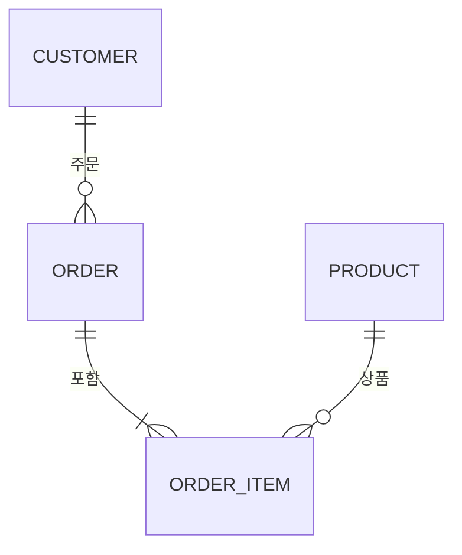
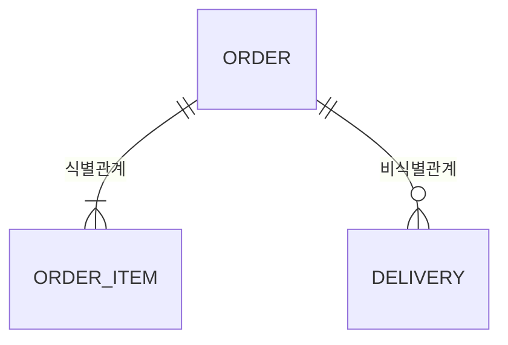

## 비유로 시작하기

건물을 지을 때 세 단계가 있습니다. 먼저 건축가가 **개념 스케치**(어떤 건물을 지을지)를 그립니다. 그다음 **설계 도면**(방 배치, 크기)을 만듭니다. 마지막으로 **시공 도면**(콘크리트 두께, 배선 위치)을 작성합니다.

DB 모델링도 동일하게 세 단계로 진행됩니다.

---

## 모델링 3단계


---

## 개념적 모델링

**"무엇을 저장해야 하는가"**를 정의합니다. 기술적 세부사항 없이 비즈니스 관점에서 엔티티와 관계를 식별합니다.

### 이커머스 시스템 예시

```
엔티티 식별:
- 고객 (Customer)
- 상품 (Product)
- 카테고리 (Category)
- 주문 (Order)
- 리뷰 (Review)
- 장바구니 (Cart)

관계 식별:
- 고객은 여러 주문을 한다 (1:N)
- 주문에는 여러 상품이 포함된다 (N:M)
- 상품은 하나의 카테고리에 속한다 (N:1)
- 고객은 상품에 리뷰를 남긴다 (N:M)
```

---

## 논리적 모델링

**"어떤 속성을 가지고, 어떤 관계인가"**를 상세히 정의합니다. DBMS에 독립적입니다.

### ERD (Entity-Relationship Diagram)



---

## 관계 유형

> **비유**: 관계 유형은 사람 간의 관계와 같습니다. **1:1**은 주민등록증과 사람의 관계(한 사람에 하나의 주민등록증), **1:N**은 부모와 자녀의 관계(한 부모가 여러 자녀를 가짐), **N:M**은 SNS 친구 관계(여러 사람이 서로 여러 명과 친구)입니다. 관계를 파악할 때 "A 하나가 B를 몇 개 가질 수 있는가?"를 양방향으로 물어보면 됩니다.

### 1:1 (일대일)

한 엔티티가 다른 엔티티 하나와만 연결됩니다.

```sql
-- 사용자와 사용자 프로필 (자주 조회되지 않는 정보 분리)
CREATE TABLE users (
    user_id BIGINT PRIMARY KEY,
    email VARCHAR(255) UNIQUE NOT NULL,
    created_at DATETIME NOT NULL
);

CREATE TABLE user_profiles (
    user_id BIGINT PRIMARY KEY,  -- FK이자 PK (식별 관계)
    bio TEXT,
    avatar_url VARCHAR(500),
    website VARCHAR(200),
    FOREIGN KEY (user_id) REFERENCES users(user_id)
);
```

언제 분리하나:
- 조회 빈도가 다를 때 (users는 항상 조회, profiles는 마이페이지에서만)
- 보안상 민감 정보 분리 (주민번호, 결제정보)
- 선택적 정보 (없는 경우가 많을 때 NULL 컬럼보다 별도 테이블이 나음)

### 1:N (일대다)

가장 흔한 관계. 부모-자식 구조.

```sql
CREATE TABLE departments (
    dept_id BIGINT PRIMARY KEY,
    name VARCHAR(100) NOT NULL
);

CREATE TABLE employees (
    emp_id BIGINT PRIMARY KEY,
    name VARCHAR(100) NOT NULL,
    dept_id BIGINT NOT NULL,  -- FK: N 쪽에 FK 위치
    FOREIGN KEY (dept_id) REFERENCES departments(dept_id)
);
```

### N:M (다대다)

반드시 **연결 테이블(Junction Table)**을 통해 구현합니다.

```sql
-- 학생과 수업의 N:M 관계
CREATE TABLE students (
    student_id BIGINT PRIMARY KEY,
    name VARCHAR(100)
);

CREATE TABLE courses (
    course_id BIGINT PRIMARY KEY,
    title VARCHAR(200)
);

-- 연결 테이블: 수강 (enrollment)
CREATE TABLE enrollments (
    student_id BIGINT,
    course_id BIGINT,
    enrolled_at DATETIME NOT NULL DEFAULT CURRENT_TIMESTAMP,
    grade CHAR(2),  -- 연결 테이블도 자체 속성을 가질 수 있음
    PRIMARY KEY (student_id, course_id),
    FOREIGN KEY (student_id) REFERENCES students(student_id),
    FOREIGN KEY (course_id) REFERENCES courses(course_id)
);
```

---

## 식별 관계 vs 비식별 관계

> **비유**: **식별 관계**는 호텔 객실 번호와 같습니다. "305호"라는 번호는 "3층"이라는 부모 정보 없이는 의미가 없습니다(3층 + 05호 = 305호). 반면 **비식별 관계**는 택배 송장번호와 주문의 관계입니다. 택배는 자체 송장번호(PK)로 독립적으로 추적되며, 어떤 주문에서 나왔는지는 참조 정보(FK)일 뿐입니다.



### 식별 관계 (Identifying Relationship)

자식 엔티티의 기본키에 부모의 FK가 포함됩니다. 부모 없이 자식이 존재할 수 없습니다.

```sql
-- 주문 항목은 주문 없이 존재할 수 없음
CREATE TABLE order_items (
    order_id BIGINT,
    item_seq INT,  -- 주문 내 순서
    product_id BIGINT,
    quantity INT,
    PRIMARY KEY (order_id, item_seq),  -- 복합 PK에 부모 ID 포함
    FOREIGN KEY (order_id) REFERENCES orders(order_id) ON DELETE CASCADE
);
```

장점: 데이터 무결성 강함, 부모 삭제 시 자식도 자동 삭제

### 비식별 관계 (Non-Identifying Relationship)

자식 엔티티가 자체 PK를 가집니다. 부모와 독립적으로 존재 가능합니다.

```sql
-- 주문과 배송: 배송은 주문과 독립적으로 관리
CREATE TABLE deliveries (
    delivery_id BIGINT PRIMARY KEY AUTO_INCREMENT,  -- 자체 PK
    order_id BIGINT NOT NULL,  -- FK만, PK에 미포함
    tracking_number VARCHAR(100),
    status VARCHAR(50),
    FOREIGN KEY (order_id) REFERENCES orders(order_id)
);
```

실무에서는 **비식별 관계 + 대리키(Surrogate Key)**가 일반적으로 더 유연합니다.

---

## 물리적 모델링

> **비유**: 논리적 모델링이 "3층 건물, 각 층 4개 방, 엘리베이터 1대"라는 설계도면이라면, 물리적 모델링은 "벽돌 두께 20cm, 배관 PVC 50mm, 엘리베이터 현대 600kg"처럼 실제 자재와 규격을 정하는 시공 도면입니다. 데이터 타입은 자재 선택, 인덱스는 복도와 계단 배치, 파티션은 층별 분리에 해당합니다.

**"실제 DBMS에서 어떻게 구현할까"**를 결정합니다. 인덱스, 파티션, 데이터 타입, 기본값을 정합니다.

### 물리적 설계 예시

```sql
CREATE TABLE orders (
    order_id BIGINT UNSIGNED AUTO_INCREMENT PRIMARY KEY COMMENT '주문 ID',
    order_number VARCHAR(30) NOT NULL COMMENT '주문번호 (ORD-20260501-000001)',
    customer_id BIGINT UNSIGNED NOT NULL COMMENT '고객 ID',
    status TINYINT NOT NULL DEFAULT 1 COMMENT '1:대기 2:결제완료 3:배송중 4:완료 5:취소',
    total_amount DECIMAL(15, 2) NOT NULL DEFAULT 0.00 COMMENT '총 금액',
    shipping_address JSON COMMENT '배송지 정보',
    ordered_at DATETIME NOT NULL DEFAULT CURRENT_TIMESTAMP COMMENT '주문일시',
    updated_at DATETIME NOT NULL DEFAULT CURRENT_TIMESTAMP ON UPDATE CURRENT_TIMESTAMP,

    -- 인덱스
    UNIQUE KEY uk_order_number (order_number),
    INDEX idx_customer_id (customer_id),
    INDEX idx_status_ordered_at (status, ordered_at),  -- 복합 인덱스
    INDEX idx_ordered_at (ordered_at)

) ENGINE=InnoDB
  DEFAULT CHARSET=utf8mb4
  COLLATE=utf8mb4_unicode_ci
  COMMENT='주문 테이블'
  PARTITION BY RANGE (YEAR(ordered_at)) (
    PARTITION p2024 VALUES LESS THAN (2025),
    PARTITION p2025 VALUES LESS THAN (2026),
    PARTITION p2026 VALUES LESS THAN (2027),
    PARTITION p_future VALUES LESS THAN MAXVALUE
  );
```

### 데이터 타입 선택 기준

| 데이터 | 권장 타입 | 이유 |
|--------|---------|------|
| PK | BIGINT UNSIGNED AUTO_INCREMENT | 충분한 범위, 부호 없음 |
| 금액 | DECIMAL(15,2) | 부동소수점 오류 없음 |
| 상태값 | TINYINT 또는 ENUM | 저장 공간 최소화 |
| 긴 텍스트 | TEXT | VARCHAR 최대 65535byte 제한 |
| JSON 데이터 | JSON | MySQL 5.7.8+ 기본 지원, 유효성 검증 |
| 날짜시간 | DATETIME | TIMESTAMP는 2038년 문제 |
| 이메일 | VARCHAR(255) | RFC 5321 최대 256자 |

---

## 계층형 구조 설계

카테고리처럼 트리 구조를 DB에 저장하는 방법입니다.

### 인접 목록 (Adjacency List) - 가장 단순

```sql
CREATE TABLE categories (
    category_id BIGINT PRIMARY KEY,
    parent_id BIGINT,  -- 루트는 NULL
    name VARCHAR(100),
    FOREIGN KEY (parent_id) REFERENCES categories(category_id)
);

-- 데이터 예시
INSERT INTO categories VALUES
(1, NULL, '전자제품'),
(2, 1, '컴퓨터'),
(3, 1, '스마트폰'),
(4, 2, '노트북'),
(5, 2, '데스크탑');

-- 특정 노드의 모든 하위 카테고리 조회 (재귀 CTE)
WITH RECURSIVE category_tree AS (
    SELECT category_id, parent_id, name, 0 AS depth
    FROM categories WHERE category_id = 1  -- 루트
    UNION ALL
    SELECT c.category_id, c.parent_id, c.name, ct.depth + 1
    FROM categories c
    JOIN category_tree ct ON c.parent_id = ct.category_id
)
SELECT * FROM category_tree ORDER BY depth, name;
```

### 클로저 테이블 (Closure Table) - 조회 성능 최적화

```sql
-- 모든 조상-자손 관계를 저장
CREATE TABLE category_closure (
    ancestor_id BIGINT,
    descendant_id BIGINT,
    depth INT,
    PRIMARY KEY (ancestor_id, descendant_id)
);

-- 특정 노드의 모든 하위 조회 (JOIN 한 번)
SELECT c.* FROM categories c
JOIN category_closure cc ON c.category_id = cc.descendant_id
WHERE cc.ancestor_id = 1 AND cc.depth > 0;
```

---

## 실무 설계 패턴

### Soft Delete (논리 삭제)

```sql
ALTER TABLE products
ADD COLUMN deleted_at DATETIME NULL DEFAULT NULL,
ADD COLUMN is_deleted TINYINT(1) NOT NULL DEFAULT 0;

-- 삭제 (실제 DELETE 없음)
UPDATE products SET deleted_at = NOW(), is_deleted = 1 WHERE product_id = 1;

-- 조회 (삭제된 것 제외)
SELECT * FROM products WHERE is_deleted = 0;

-- 인덱스 (조회 성능)
CREATE INDEX idx_is_deleted ON products (is_deleted);
```

### 이력 테이블 (Audit Table)

```sql
CREATE TABLE product_price_history (
    history_id BIGINT PRIMARY KEY AUTO_INCREMENT,
    product_id BIGINT NOT NULL,
    old_price DECIMAL(15, 2),
    new_price DECIMAL(15, 2),
    changed_by BIGINT COMMENT '변경한 사용자 ID',
    changed_at DATETIME NOT NULL DEFAULT CURRENT_TIMESTAMP,
    INDEX idx_product_id (product_id)
);

-- 트리거로 자동 기록
CREATE TRIGGER product_price_audit
AFTER UPDATE ON products
FOR EACH ROW
BEGIN
    IF OLD.price != NEW.price THEN
        INSERT INTO product_price_history
            (product_id, old_price, new_price, changed_at)
        VALUES (NEW.product_id, OLD.price, NEW.price, NOW());
    END IF;
END;
```

---


## 극한 시나리오

### 시나리오: 대용량 주문 테이블 설계

MAU 1000만, 일 주문 100만 건 → 연간 3.6억 건

```sql
-- 파티션 + 아카이빙 전략
-- 1. 최근 1년: Hot 파티션 (SSD)
-- 2. 1~3년: Warm 파티션 (HDD)
-- 3. 3년 이상: Archive 테이블로 이동

-- 파티션 관리 (매년 새 파티션 추가)
ALTER TABLE orders ADD PARTITION (
    PARTITION p2027 VALUES LESS THAN (2028)
);

-- 오래된 파티션 아카이브
ALTER TABLE orders EXCHANGE PARTITION p2023
WITH TABLE orders_archive_2023;
```

### 시나리오: 조회 성능 병목 해결

```sql
-- 문제: 이 쿼리가 3초 걸림
SELECT * FROM orders o
JOIN customers c ON o.customer_id = c.customer_id
WHERE o.status = 2 AND o.ordered_at > '2026-01-01'
ORDER BY o.ordered_at DESC LIMIT 20;

-- EXPLAIN 분석 → customer_id, status 인덱스 없음

-- 해결: 복합 인덱스 추가
CREATE INDEX idx_status_ordered_at ON orders (status, ordered_at);
-- 0.02초로 단축
```

### 시나리오: N:M 관계 연결 테이블이 괴물로 성장

```
문제:
  - 상품-태그 N:M 관계 → product_tags 연결 테이블
  - 초기: 상품 1만 × 태그 50 → 50만 행 (쾌적)
  - 1년 후: 상품 500만 × 태그 2,000 → 1억 행
  - 태그 기반 상품 검색 쿼리가 5초 이상 소요

원인 분석:
  - 연결 테이블에 인덱스가 (product_id, tag_id)만 존재
  - "tag_id = 123인 상품 목록" 쿼리는 tag_id 선두 인덱스가 없어 풀스캔
  - 태그별 상품 수 편차 극심 (인기 태그 1개에 100만 상품)

해결:
  1. 역방향 인덱스 추가: INDEX idx_tag_product (tag_id, product_id)
  2. 인기 태그는 별도 캐시 (Redis Sorted Set)
  3. 연결 테이블 파티션 (tag_id 해시 기반)
  4. 비활성 상품-태그 관계 주기적 아카이빙
```

### 시나리오: 계층형 카테고리 깊이 폭발

```
문제:
  - 인접 목록 방식으로 카테고리 관리
  - 운영팀이 카테고리를 10단계 깊이로 생성
  - 재귀 CTE로 전체 트리 조회 → 재귀 깊이 제한(MySQL 기본 1000)에는 안 걸리지만
  - 매 페이지 로딩마다 재귀 쿼리 실행 → 200ms 소요

해결:
  1. 클로저 테이블 전환: 조회 O(1) JOIN으로 단축
  2. 카테고리 깊이 제한 (비즈니스 규칙: 최대 5단계)
  3. 카테고리 트리를 Redis에 캐시 (변경 시에만 갱신)
  4. Materialized Path 방식 병행: path = "/1/3/7/15" 로 LIKE 검색 지원
```

---
## 실무에서 자주 하는 실수

### 실수 1: 모든 관계를 식별 관계로 설계

```
문제:
  - 식별 관계를 남용하면 복합 PK가 3~4단계 전파
  - 예: 회사 → 부서 → 팀 → 사원
  - 사원 PK = (company_id, dept_id, team_id, emp_seq)
  - JOIN할 때마다 4개 컬럼을 전부 명시해야 함

영향:
  - 인덱스 크기 폭증 (4개 컬럼 복합 인덱스)
  - 리팩토링 시 PK 변경이 전체 하위 테이블로 전파
  - ORM 매핑이 극도로 복잡해짐 (@EmbeddedId 중첩)

원칙:
  - 비식별 관계 + 대리키(AUTO_INCREMENT)를 기본으로 사용
  - 식별 관계는 "부모 없이 자식이 의미 없는 경우"에만 적용
    (예: 주문-주문항목, 게시글-댓글)
```

### 실수 2: NULL 허용 컬럼 남용

```
문제:
  - 빠른 개발을 위해 대부분 컬럼을 NULL 허용으로 설정
  - 시간이 지나면 "이 NULL은 미입력인지, 해당없음인지, 0인지" 구분 불가

실제 사례:
  - discount_rate DECIMAL NULL
  - NULL = 할인 없음? 할인율 미정? 무료?
  - 코드에서 NULL 체크 누락 → NullPointerException

원칙:
  - 기본은 NOT NULL + DEFAULT 값 지정
  - NULL이 명확한 비즈니스 의미를 가질 때만 허용
  - NULL 허용 시 반드시 COMMENT에 "NULL = 미설정" 등 의미 명시
```

### 실수 3: 이력/로그 테이블에 FK 거는 실수

```
문제:
  - order_history 테이블에 order_id FK 설정
  - 주문 삭제 시 → FK 제약으로 삭제 불가 또는 CASCADE로 이력까지 삭제

원인:
  - 이력 테이블은 "그 시점의 스냅샷"이므로 원본과 독립적이어야 함
  - FK가 있으면 원본 데이터 정리(아카이빙, 삭제)가 불가능

원칙:
  - 이력/감사(audit) 테이블에는 FK를 걸지 않음
  - 대신 컬럼명과 COMMENT로 참조 관계를 문서화
  - 이력 테이블은 INSERT-only (UPDATE/DELETE 없음) 원칙
```

### 실수 4: VARCHAR 크기를 대충 잡는 실수

```
문제:
  - 이름: VARCHAR(500), 이메일: VARCHAR(1000), 주소: VARCHAR(2000)
  - "넉넉하게 잡자"는 심리 → InnoDB 행 크기 65,535byte 제한에 걸림
  - 여러 VARCHAR(2000) 컬럼이 있으면 테이블 생성 자체가 실패

원칙:
  - 이름: VARCHAR(100), 이메일: VARCHAR(255), 전화번호: VARCHAR(20)
  - 실제 데이터 최대 길이 + 20~30% 여유로 설정
  - 길이가 가변적이면 TEXT 타입 사용 (별도 페이지에 저장)
```

---

## 왜 데이터 모델링이 중요한가?

잘못된 모델은 나중에 고치기 매우 비싸다. 컬럼 하나를 추가하려고 수억 건 테이블에 `ALTER TABLE`을 실행하면 운영 중단이 발생한다. 초기 모델이 잘못되면 ① 불필요한 JOIN 증가 ② 인덱스 설계 한계 ③ 정규화/역정규화 판단 실수로 이어진다. 모델링은 기능 개발 전에 가장 신중하게 검토해야 하는 단계다.

---

## 실무에서 자주 하는 실수

**실수 1: 상태값을 숫자(0,1,2)로만 관리**
`status = 1`이 무엇을 의미하는지 코드 없이 알 수 없다. 새 상태 추가 시 숫자 충돌과 오해가 생긴다. `VARCHAR`로 `'PENDING'`, `'APPROVED'`, `'REJECTED'`처럼 의미 있는 문자열을 사용하거나 ENUM 타입을 쓴다. ENUM은 순서가 의미를 갖지 않는 경우에만 쓴다.

**실수 2: 모든 것을 하나의 테이블에 욱여넣기**
`users` 테이블에 주소, 결제수단, 설정, 통계 컬럼을 모두 넣는다. NULL 컬럼이 늘어나고 행이 넓어져 I/O 비효율이 생긴다. 논리적으로 별개의 개념은 1:1 관계 테이블로 분리한다.

**실수 3: 복합 의미를 하나의 컬럼에 저장**
`note = "배송지:서울, 색상:빨강, 사이즈:L"` 처럼 문자열로 여러 속성을 구겨 넣는다. 나중에 조건 검색이 불가능하고 파싱 로직이 퍼진다. 속성이 다양하고 동적이라면 EAV 패턴이나 JSONB 컬럼을 고려한다.

**실수 4: created_at, updated_at 컬럼 누락**
초기에 안 넣으면 나중에 대용량 테이블에 추가하기 힘들다. 모든 테이블에 기본으로 포함시키는 것을 팀 컨벤션으로 정해야 한다. 소프트 삭제가 필요하면 `deleted_at`도 함께.

**실수 5: 외래 키 제약 미설정**
애플리케이션 레벨에서만 참조 무결성을 보장하고 DB 제약을 안 건다. 다이렉트 DB 접근, 마이그레이션 실수, 배치 작업 버그로 고아 데이터가 쌓인다. 성능 우려로 FK를 빼는 경우라면 최소한 논리적 FK를 문서화하고 정기적으로 일관성을 검증해야 한다.

---

## 면접 포인트

<details>
<summary>펼쳐보기</summary>


**Q1. ERD 설계 시 가장 중요하게 보는 것은?**
① 엔티티와 관계의 카디널리티(1:1, 1:N, N:M) ② 각 엔티티의 식별자 전략 ③ NULL 허용 여부와 그 이유 ④ 자주 사용되는 접근 패턴(어떤 JOIN이 빈번한가). N:M 관계는 중간 연결 테이블로 풀어야 하며, 연결 테이블 자체에 의미 있는 속성(수량, 날짜 등)이 생기면 독립 엔티티가 된다.

**Q2. 소프트 삭제(Soft Delete)의 장단점은?**
장점: 삭제 데이터 복구 가능, 감사 로그 유지. 단점: `WHERE deleted_at IS NULL` 조건을 모든 쿼리에 추가해야 하며 누락 시 버그 발생, 인덱스 효율 저하, 유니크 제약이 복잡해짐. 법적 보존 의무가 없다면 물리 삭제 + 별도 히스토리 테이블이 더 깔끔한 경우가 많다.

**Q3. 대리 키(Surrogate Key) vs 자연 키(Natural Key)?**
자연 키(주민번호, 이메일)는 변경 시 모든 참조를 수정해야 한다. 대리 키(AUTO_INCREMENT, UUID)는 의미 없지만 불변이며 조인이 단순하다. 실무에서는 대리 키를 기본 키로 쓰고, 자연 키에 UNIQUE 제약을 거는 방식이 안전하다.

**Q4. UUID를 기본 키로 쓸 때 문제점은?**
UUID v4는 완전 무작위라 InnoDB 클러스터드 인덱스 삽입 시 페이지 분할이 빈번하게 발생한다. 쓰기 성능이 AUTO_INCREMENT 대비 크게 떨어진다. UUID v7(시간 순 정렬) 또는 ULID를 사용하면 삽입 순서가 단조 증가해 이 문제를 피할 수 있다.

**Q5. 이력 테이블 설계 시 고려할 점은?**
① 어떤 변경을 추적할 것인가(전체 vs 특정 컬럼) ② 저장 방식(전체 스냅샷 vs 델타) ③ 조회 패턴(특정 시점 상태 복원, 변경 감사) ④ 보존 기간과 파티셔닝 전략. Debezium + Kafka CDC로 DB 변경을 실시간 스트리밍하는 방식도 현대적인 대안이다.

</details>
