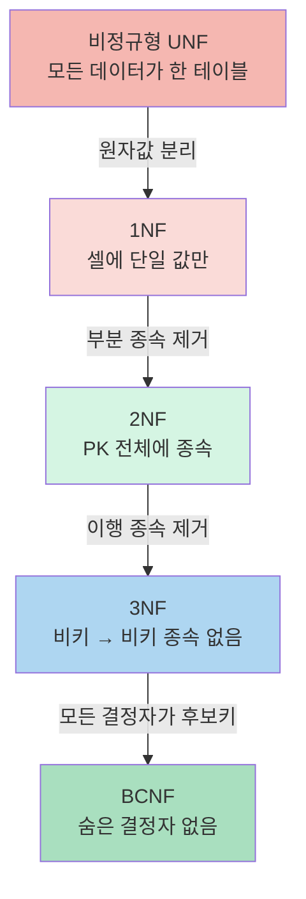
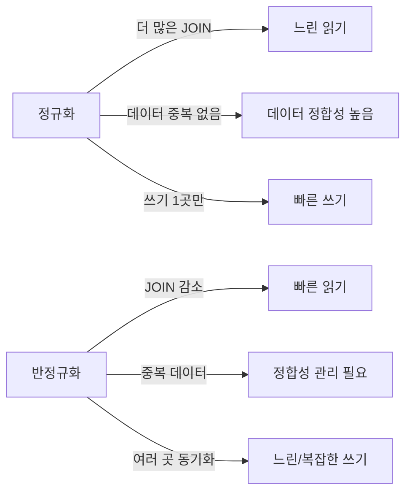
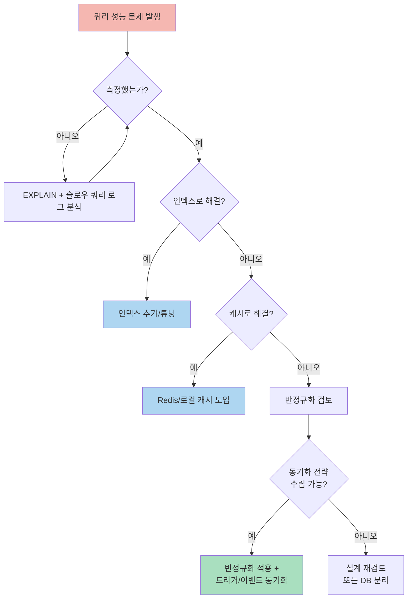

## 비유로 시작하기

이사할 때 짐 정리를 생각해보세요. 처음에는 모든 것을 한 상자에 넣으면 찾기 편합니다. 하지만 물건이 많아지면 카테고리별로 분류해야 합니다. 그런데 너무 세분화하면 "양말을 찾으려면 5개의 서랍을 확인해야 해" 문제가 생깁니다.

정규화는 **데이터베이스 테이블을 체계적으로 분리하여 데이터 중복을 제거하고 정합성을 높이는 과정**입니다. 반정규화는 **성능을 위해 의도적으로 중복을 허용**하는 것입니다.

---

## 정규화가 필요한 이유



정규화되지 않은 테이블의 문제점을 먼저 보겠습니다.

**비정규화 테이블 예시**:

| 주문ID | 고객ID | 고객명 | 고객이메일 | 상품ID | 상품명 | 가격 | 수량 |
|--------|--------|--------|-----------|--------|--------|------|------|
| 1 | 100 | 김철수 | kim@ex.com | P1 | 노트북 | 1000000 | 1 |
| 1 | 100 | 김철수 | kim@ex.com | P2 | 마우스 | 30000 | 2 |
| 2 | 200 | 이영희 | lee@ex.com | P1 | 노트북 | 1000000 | 1 |

**문제**:
- **삽입 이상**: 상품을 등록하려면 주문이 있어야 함
- **삭제 이상**: 주문 1을 삭제하면 고객 100의 이메일 정보가 사라짐
- **수정 이상**: 노트북 가격 변경 시 해당하는 모든 행을 수정해야 함 (일부만 수정되면 정합성 깨짐)

---

## 제1정규형 (1NF)

> **비유**: 우편함에 편지를 넣을 때, 한 칸에 한 통만 넣어야 합니다. 한 칸에 편지 3통을 구겨 넣으면 어떤 편지가 누구 것인지 구분할 수 없습니다. 1NF는 "한 칸(셀)에 한 값만"이라는 가장 기본적인 정리 규칙입니다.

**규칙**: 모든 컬럼의 값이 원자값(Atomic)이어야 합니다. 즉, 하나의 셀에 여러 값이 없어야 합니다.

**1NF 위반 예시**:

| 주문ID | 고객명 | 상품목록 |
|--------|--------|---------|
| 1 | 김철수 | 노트북, 마우스, 키보드 |

**1NF 적용 후**:

| 주문ID | 고객명 | 상품 |
|--------|--------|------|
| 1 | 김철수 | 노트북 |
| 1 | 김철수 | 마우스 |
| 1 | 김철수 | 키보드 |

**또 다른 위반**: 전화번호를 하나의 컬럼에 여러 개 저장

```sql
-- 위반
tel VARCHAR(100) -- "010-1234-5678, 02-1234-5678"

-- 해결
CREATE TABLE customer_phones (
    customer_id BIGINT,
    phone_number VARCHAR(20),
    phone_type VARCHAR(10),  -- MOBILE, HOME, OFFICE
    PRIMARY KEY (customer_id, phone_number)
);
```

---

## 제2정규형 (2NF)

> **비유**: 학교 출석부를 생각해보세요. 출석부에는 (반, 번호) 조합으로 학생을 식별합니다. 그런데 출석부에 "담임 선생님 이름"이 적혀 있다면, 이 정보는 "반"만 알면 되는데 굳이 (반, 번호) 전체에 묶여 있습니다. 반이 같은 학생 30명에 담임 이름이 30번 반복됩니다. 2NF는 "출석부에는 출석 정보만, 담임 정보는 반 목록표에 따로 적어라"는 규칙입니다.

**규칙**: 1NF를 만족하면서, **부분 함수 종속을 제거**합니다. 복합 기본키에서 일부 키에만 종속되는 컬럼이 없어야 합니다.

**2NF 위반 예시** (기본키: 주문ID + 상품ID):

| 주문ID | 상품ID | 수량 | 상품명 | 고객ID |
|--------|--------|------|--------|--------|
| 1 | P1 | 2 | 노트북 | 100 |

- `수량`: (주문ID, 상품ID) 모두에 종속 → 완전 함수 종속 (OK)
- `상품명`: 상품ID에만 종속 → **부분 함수 종속** (위반)
- `고객ID`: 주문ID에만 종속 → **부분 함수 종속** (위반)

**2NF 적용 후**:

```sql
-- 주문 테이블 (주문ID → 고객ID)
CREATE TABLE orders (
    order_id BIGINT PRIMARY KEY,
    customer_id BIGINT
);

-- 주문상품 테이블 (주문ID + 상품ID → 수량)
CREATE TABLE order_items (
    order_id BIGINT,
    product_id BIGINT,
    quantity INT,
    PRIMARY KEY (order_id, product_id)
);

-- 상품 테이블 (상품ID → 상품명, 가격)
CREATE TABLE products (
    product_id BIGINT PRIMARY KEY,
    product_name VARCHAR(200),
    price DECIMAL(15, 2)
);
```

---

## 제3정규형 (3NF)

> **비유**: 택배 송장에 "보내는 사람 → 보내는 사람 주소 → 보내는 사람 우편번호"가 적혀 있습니다. 우편번호는 주소가 결정하지, 보내는 사람이 직접 결정하는 게 아닙니다. 이렇게 "A → B → C"로 이어지는 간접 종속(이행 종속)이 있으면, 주소가 바뀔 때 우편번호도 함께 바꿔야 하는데 놓치기 쉽습니다. 3NF는 "중간 다리(B)를 별도 테이블로 분리하라"는 규칙입니다.

**규칙**: 2NF를 만족하면서, **이행 함수 종속을 제거**합니다. 기본키가 아닌 컬럼이 다른 비기본키 컬럼을 결정하면 안 됩니다.

**3NF 위반 예시**:

| 직원ID | 부서ID | 부서명 | 부서장 |
|--------|--------|--------|--------|
| E1 | D1 | 개발팀 | 박팀장 |
| E2 | D1 | 개발팀 | 박팀장 |

- 직원ID → 부서ID (OK)
- 부서ID → 부서명, 부서장
- 따라서: 직원ID → 부서ID → 부서명 (**이행 종속**, 위반)

**3NF 적용 후**:

```sql
CREATE TABLE employees (
    employee_id BIGINT PRIMARY KEY,
    name VARCHAR(100),
    department_id BIGINT
);

CREATE TABLE departments (
    department_id BIGINT PRIMARY KEY,
    department_name VARCHAR(100),
    manager VARCHAR(100)
);
```

---

## BCNF (Boyce-Codd Normal Form)

> **비유**: 병원 진료 예약 시스템을 생각해보세요. (환자, 진료과목)으로 예약을 식별합니다. 그런데 "김 교수는 내과만 진료한다"는 규칙이 있습니다. 즉 교수가 진료과목을 결정합니다. 교수는 후보키가 아닌데 다른 컬럼을 결정하는 "숨은 보스"입니다. BCNF는 "결정권을 가진 컬럼은 반드시 후보키여야 한다. 숨은 보스를 허용하지 않는다"는 규칙입니다.

**규칙**: 3NF보다 강화. 모든 결정자가 후보키여야 합니다.

**BCNF 위반 예시**:

| 학생 | 과목 | 교수 |
|------|------|------|
| 홍길동 | 데이터베이스 | 김교수 |
| 홍길동 | 알고리즘 | 이교수 |

- 기본키: (학생, 과목)
- 교수 → 과목 (교수는 하나의 과목만 담당)
- 교수는 후보키가 아닌데 과목을 결정 → 위반

```sql
-- BCNF 분해
CREATE TABLE professor_course (
    professor VARCHAR(100) PRIMARY KEY,
    course VARCHAR(100)
);

CREATE TABLE student_professor (
    student VARCHAR(100),
    professor VARCHAR(100),
    PRIMARY KEY (student, professor)
);
```

---

## 4NF, 5NF

**4NF**: 다치 종속(Multi-valued Dependency) 제거
**5NF**: 조인 종속(Join Dependency) 제거

실무에서는 3NF 또는 BCNF까지 적용하는 경우가 대부분입니다.

---

## 반정규화 (Denormalization)

### 반정규화가 필요한 이유

정규화된 테이블은 JOIN이 많아져 성능이 저하될 수 있습니다.

```sql
-- 정규화된 상태: 주문 목록 조회
SELECT o.order_id, c.customer_name, c.email,
       p.product_name, oi.quantity, p.price
FROM orders o
JOIN customers c ON o.customer_id = c.customer_id
JOIN order_items oi ON o.order_id = oi.order_id
JOIN products p ON oi.product_id = p.product_id
WHERE o.customer_id = 100;
-- 4개 테이블 JOIN → 대용량에서 느림
```

### 반정규화 기법

#### 1. 컬럼 중복 (Column Duplication)

```sql
-- order_items에 product_name, price 복사
ALTER TABLE order_items
ADD COLUMN product_name VARCHAR(200),
ADD COLUMN unit_price DECIMAL(15, 2);

-- 이제 JOIN 없이 조회 가능
SELECT order_id, product_name, unit_price, quantity
FROM order_items
WHERE order_id = 1;
```

주문 시점의 가격이 상품 가격 변경에 영향받지 않는다는 **비즈니스 요구사항**도 충족합니다.

#### 2. 집계 컬럼 추가 (Derived Column)

```sql
-- orders 테이블에 총 금액 미리 계산
ALTER TABLE orders
ADD COLUMN total_amount DECIMAL(15, 2);

-- 주문 생성 시 집계값 함께 저장
-- (매 조회마다 SUM() 계산 불필요)
```

#### 3. 테이블 합치기 (Table Merging)

자주 JOIN되는 1:1 관계 테이블을 합칩니다.

```sql
-- 분리된 경우
SELECT u.id, u.name, up.avatar_url, up.bio
FROM users u
JOIN user_profiles up ON u.id = up.user_id;

-- 합친 경우 (1:1 관계이므로)
SELECT id, name, avatar_url, bio
FROM users;
```

#### 4. 이력 테이블 (Summary Table)

통계/집계용 별도 테이블을 만들어 주기적으로 집계합니다.

```sql
-- 매일 집계하는 요약 테이블
CREATE TABLE daily_sales_summary (
    date DATE PRIMARY KEY,
    total_orders INT,
    total_revenue DECIMAL(20, 2),
    avg_order_value DECIMAL(15, 2)
);

-- 대시보드에서 수억 건 orders 테이블 집계 대신 이 테이블 조회
SELECT * FROM daily_sales_summary
WHERE date BETWEEN '2026-01-01' AND '2026-01-31';
```

---

## 성능 vs 정합성 트레이드오프



---

## 실무 판단 기준



```
정규화 유지:
✓ 데이터 정합성이 최우선 (금융, 의료)
✓ 쓰기 작업이 많음 (트랜잭션 시스템)
✓ 데이터 변경이 자주 발생
✓ 시스템이 복잡하지 않아 JOIN 비용 감당 가능

반정규화 적용:
✓ 읽기 성능이 중요 (대시보드, 리포트)
✓ 읽기:쓰기 비율이 100:1 이상
✓ 특정 쿼리가 성능 병목임이 측정됨
✓ 데이터 동기화 로직을 관리할 수 있음

황금 규칙:
"먼저 정규화하고, 성능 문제가 측정되면 반정규화하라"
성능 문제 없이 미리 반정규화하는 것은 조기 최적화의 오류
```

---

<details class="extreme-scenario-details">
<summary class="extreme-scenario-summary">
<span class="extreme-scenario-icon">🔥</span>
<span class="extreme-scenario-label">극한 시나리오 — 클릭하여 펼치기</span>
<span class="extreme-scenario-toggle"></span>
</summary>
<div class="extreme-scenario-body">

<div class="extreme-scenario-content" markdown="1">

### 시나리오: 반정규화 후 데이터 불일치

```
문제:
- orders 테이블에 customer_name 복사 (반정규화)
- 고객이 이름을 변경
- orders 테이블의 이름은 갱신하지 않음

결과: DB에 같은 고객이 두 가지 이름으로 존재

해결책 1: 트리거로 자동 동기화
CREATE TRIGGER update_customer_name
AFTER UPDATE ON customers
FOR EACH ROW
UPDATE orders SET customer_name = NEW.name
WHERE customer_id = NEW.id;

해결책 2: 이벤트 기반 동기화 (주문 시점 이름은 변경 안 함)
→ 사실 주문 시점의 고객명이 맞을 수 있음 (법적 기록)
→ 반정규화 전에 비즈니스 요구사항을 명확히 해야 함
```

### 시나리오: 과도한 정규화로 JOIN 지옥

```
상황:
  - 이커머스 주문 조회 API
  - 3NF를 철저히 적용 → 주문 목록 1건 조회에 7개 테이블 JOIN
    orders → order_items → products → categories
    → customers → addresses → regions
  - 데이터 100만 건 → 조회 3초, 1000만 건 → 12초

결과:
  - API 응답 SLA(200ms) 위반
  - DB CPU 90% → 다른 서비스까지 영향

해결 순서:
  1단계: 인덱스 최적화 → 12초 → 2초 (커버링 인덱스)
  2단계: 자주 조회되는 조합에 반정규화
         → order_items에 product_name, category_name 복사
         → 7 JOIN → 3 JOIN → 0.3초
  3단계: 주문 목록 전용 조회 테이블(CQRS Read Model) 도입
         → JOIN 0개 → 0.02초

교훈:
  정규화는 "정합성 보장"이 목적이지 "성능"이 목적이 아님
  읽기 성능이 중요한 곳에서는 반정규화가 정답
```

### 시나리오: 트리거 동기화 폭주

```
상황:
  - 반정규화 후 트리거로 데이터 동기화 설정
  - customers 테이블 UPDATE → 5개 테이블에 트리거 전파
  - 관리자가 고객 10만 명의 등급을 일괄 UPDATE

결과:
  1. UPDATE customers SET grade = 'VIP' WHERE ... (10만 건)
  2. 트리거 10만 × 5개 = 50만 건 추가 UPDATE 발생
  3. 트랜잭션 로그(binlog) 폭증 → 디스크 풀
  4. 레플리카 지연 30분 → 읽기 분리 서비스 장애

방어:
  1. 대량 UPDATE 시 트리거 비활성화 후 수동 동기화
  2. 트리거 대신 비동기 이벤트(Kafka/RabbitMQ)로 동기화
  3. 트리거 전파 깊이를 1단계로 제한 (트리거가 트리거를 호출하지 않도록)
  4. 반정규화 대상을 최소화 (정말 필요한 컬럼만)
```

---
</div>
</div>
</details>

## 실무에서 자주 하는 실수

### 실수 1: 정규화 단계를 건너뛰기

```
문제:
  - 비정규형에서 바로 3NF를 적용하려다 종속성을 놓침
  - "어차피 3NF가 목표니까 1NF, 2NF는 생략하자"

실제 사례:
  - 복합 PK (order_id, product_id)에서 product_name이 product_id에만 종속
  - 2NF 위반을 인식하지 못한 채 3NF를 적용했다고 착각
  - 결과: 상품명 중복 저장 → 상품명 변경 시 불일치

원칙:
  - 1NF → 2NF → 3NF 순서대로 단계별 적용
  - 각 단계에서 "이 정규형의 위반 사항이 남아있는가?" 확인 후 다음 단계
```

### 실수 2: 성능 측정 없이 미리 반정규화

```
문제:
  - "JOIN이 많으면 느리다"는 선입견으로 설계 단계부터 반정규화
  - 실제로는 적절한 인덱스만 있으면 3~4개 JOIN은 1ms 미만

실제 사례:
  - 모든 테이블에 관련 데이터를 복사해둠
  - 상품 가격 변경 시 orders, order_items, carts, wishlists 4곳 수정
  - 동기화 코드 버그로 cart의 가격만 갱신 안 됨
  - 고객이 장바구니 가격과 결제 가격이 다르다고 CS 접수

원칙:
  "먼저 정규화하고, 성능 문제가 측정되면 그때 반정규화하라"
  EXPLAIN ANALYZE로 실제 실행 계획을 확인하고 병목을 특정한 후에 적용
```

### 실수 3: JSON 컬럼으로 정규화 회피

```
문제:
  - 정규화가 귀찮아서 관련 데이터를 JSON 컬럼에 통째로 저장
  - 예: orders 테이블에 items JSON 컬럼으로 주문 항목 전부 저장

초기에는 편리함:
  SELECT order_id, items FROM orders WHERE order_id = 1;
  → {"items": [{"name": "노트북", "qty": 1}, {"name": "마우스", "qty": 2}]}

문제 발생 시점:
  - "마우스를 주문한 모든 고객" 조회 → JSON 내부 검색 → 풀스캔
  - "상품별 주문 수량 집계" → JSON_TABLE로 파싱 → 극도로 느림
  - JSON 스키마 강제 불가 → 잘못된 형식 데이터 유입

원칙:
  - 구조화된 데이터(항목, 속성 목록)는 정규화된 테이블로 분리
  - JSON은 비정형/반정형 데이터에만 사용 (배송지 상세, 메타데이터 등)
  - JSON을 쓰더라도 자주 검색하는 필드는 Generated Column + 인덱스 활용
```

### 실수 4: 반정규화 후 동기화 책임자 미지정

```
문제:
  - 반정규화로 customer_name을 orders 테이블에 복사
  - "누가 동기화를 보장하는가?"를 결정하지 않음
  - 트리거? 애플리케이션 코드? 배치 작업?

결과:
  - 개발자 A: "트리거로 하겠지"
  - 개발자 B: "서비스 레이어에서 하겠지"
  - 실제: 아무도 안 함 → 6개월 후 10만 건 불일치 발견

원칙:
  - 반정규화 적용 시 반드시 문서화할 항목:
    1. 원본 테이블과 복사 컬럼
    2. 동기화 방식 (트리거 / 이벤트 / 배치)
    3. 동기화 실패 시 감지 방법
    4. 담당 팀/담당자
```
