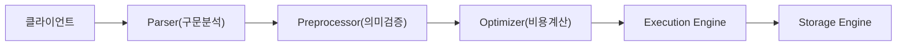
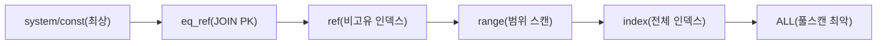
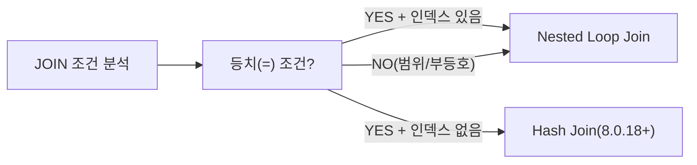
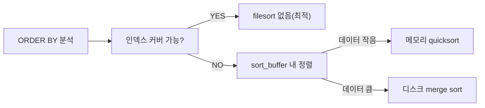

인덱스를 분명히 걸었는데 EXPLAIN을 보니 Full Table Scan이다. 옵티마이저가 인덱스보다 풀스캔이 더 빠르다고 판단한 것이다. 왜 그런 선택을 했는지 이해하지 못하면 힌트를 줄 수도, 통계를 갱신할 수도 없다.

> **비유**: 옵티마이저는 내비게이션이다. 목적지(결과)는 동일하지만 경로(실행 계획)는 수백 가지다. 내비게이션이 실시간 교통 정보(통계)를 보고 최단 시간 경로를 선택하듯, 옵티마이저는 테이블 통계를 보고 최저 비용 계획을 선택한다. 교통 정보가 3일 전 데이터라면 내비게이션은 막힌 도로를 안내한다. 옵티마이저가 잘못된 계획을 선택하는 원인 80%가 바로 이 **통계 부정확** 문제다.

---

## 1. 쿼리 실행 파이프라인 내부 구조

MySQL이 SQL 한 줄을 받아 결과를 돌려주기까지 다섯 단계를 거친다. 각 단계는 독립 모듈이며, 앞 단계의 출력이 다음 단계의 입력이 된다. 이 흐름을 이해하면 특정 에러가 어느 단계에서 발생하는지, 옵티마이저가 왜 그 선택을 했는지 직관적으로 파악할 수 있다.



### 1-1. Parser: 구문 분석과 AST 생성

SQL 문자열을 **렉서(Lexer)**가 토큰으로 쪼개고, **파서(Parser)**가 문법 규칙에 따라 **AST(Abstract Syntax Tree)**로 조립한다.

```
SELECT * FROM users WHERE id = 1
  → 토큰: [SELECT] [*] [FROM] [users] [WHERE] [id] [=] [1]
  → AST:
      SelectStatement
        ├── SelectList: [*]
        ├── FromClause: [users]
        └── WhereClause: [EqExpr: id, 1]
```

이 단계에서 중요한 점이 두 가지 있다. 첫째, **테이블이나 컬럼 존재 여부를 확인하지 않는다**. 문법 검사만 한다. `SELECT * FROM nonexistent_table`은 파서를 통과한다. 둘째, 파서가 거부하는 쿼리는 무조건 `ERROR 1064 (42000): You have an error in your SQL syntax`를 반환한다.

JPA를 사용하는 Spring 애플리케이션에서 `@Query`의 JPQL이 SQL로 변환될 때도 이 파이프라인을 그대로 통과한다. Hibernate가 생성한 SQL이 잘못되면 파서 단계에서 바로 예외가 던져진다.

### 1-2. Preprocessor: 의미론적 검증

AST를 받아 **테이블 존재 여부**, **컬럼 존재 여부**, **사용자 권한**을 확인한다. `SELECT *`를 실제 컬럼 목록으로 확장하고, 뷰(View)를 정의 쿼리로 전개한다.

```sql
-- 뷰 정의
CREATE VIEW active_users AS
    SELECT id, name FROM users WHERE status = 'active';

-- 이 쿼리를 실행하면
SELECT * FROM active_users WHERE name LIKE 'Kim%';

-- Preprocessor가 내부적으로 전개
SELECT id, name FROM users WHERE status = 'active' AND name LIKE 'Kim%';
```

뷰를 쿼리로 전개할 때 **조건이 병합**된다는 점이 중요하다. 이 병합 덕분에 뷰에 걸린 인덱스가 외부 쿼리 조건에도 활용될 수 있다. `ERROR 1146 (42S02): Table doesn't exist` 같은 에러는 이 단계의 산물이다.

### 1-3. Optimizer: 최적 실행 계획 선택 (핵심)

검증된 AST를 받아 **가능한 모든 실행 계획을 열거**하고, 각각의 **예상 비용(cost)**을 계산해 최저 비용 계획을 선택한다. 어떤 인덱스를 사용할지, 어떤 순서로 테이블을 JOIN할지, 서브쿼리를 어떻게 변환할지 모두 이 단계에서 결정된다. 이 글의 핵심이다.

### 1-4. Execution Engine: 핸들러 API 호출

옵티마이저가 만든 실행 계획을 **스토리지 엔진 핸들러 API**를 호출하며 실행한다. JOIN, 정렬, 집계 같은 고수준 연산을 처리하면서 스토리지 엔진에게 레코드를 요청한다. 실행 엔진은 스토리지 엔진 종류를 몰라도 된다. `handler::index_read()`, `handler::rnd_next()` 같은 통일된 인터페이스로만 통신한다.

**WHY**: 이 아키텍처 덕분에 InnoDB, MyISAM, RocksDB 등 다양한 스토리지 엔진을 플러그인처럼 교체할 수 있다. JPA `@Table(name="...")` 어노테이션이 어떤 DB를 쓰든 동일하게 작동하는 원리와 유사하다.

### 1-5. Storage Engine: 물리 데이터 접근

실제 데이터를 디스크에서 읽거나 쓰는 작업을 담당한다. InnoDB가 기본값이며, ACID 트랜잭션과 MVCC를 지원한다. **클러스터드 인덱스(Clustered Index)** 구조 때문에 PK 조회가 매우 빠르다.

```java
// Spring Data JPA - findById()는 내부적으로 PK 클러스터드 인덱스 활용
// → Optimizer는 type=const 계획 선택 → 1 I/O로 처리
Optional<User> user = userRepository.findById(1L);
```

---

## 2. 비용 기반 옵티마이저(CBO) vs 규칙 기반(RBO)

### 2-1. 규칙 기반 옵티마이저(RBO)의 한계

RBO는 "인덱스가 있으면 항상 인덱스를 쓴다", "고유 인덱스가 비고유 인덱스보다 우선이다" 같은 **고정 규칙**을 따른다. 규칙에 순위가 있고, 가장 높은 순위의 규칙이 적용된다.

문제는 데이터 분포를 전혀 고려하지 않는다는 점이다. 테이블에 3건이 있어도, 3억 건이 있어도 같은 규칙을 적용한다. 100만 건 중 95만 건이 `status='active'`인 상황에서 `WHERE status='active'` 조건에 인덱스를 사용하면 오히려 느려진다. RBO는 이를 감지하지 못한다.

Oracle이 9i까지 RBO를 지원했고 이후 CBO로 완전 전환했다. MySQL은 처음부터 CBO를 사용한다.

### 2-2. 비용 기반 옵티마이저(CBO) 동작 원리

CBO는 가능한 실행 계획을 열거하고 각각의 **예상 비용**을 계산해 최소 비용 계획을 선택한다. 비용은 내부 단위로 표현되며, `mysql.server_cost`와 `mysql.engine_cost` 시스템 테이블에 저장된다.

```sql
-- 비용 단위 확인
SELECT cost_name, default_value, current_value
FROM mysql.server_cost;
```

| 비용 항목 | 기본값 | 의미 |
|---|---|---|
| `row_evaluate_cost` | 0.1 | 레코드 하나 WHERE 조건 평가 |
| `key_compare_cost` | 0.05 | 인덱스 키 비교 |
| `memory_temptable_create_cost` | 1.0 | 인메모리 임시 테이블 생성 |
| `disk_temptable_create_cost` | 20.0 | 디스크 임시 테이블 생성 |
| `memory_temptable_row_cost` | 0.1 | 인메모리 임시 테이블 행 삽입 |
| `disk_temptable_row_cost` | 0.5 | 디스크 임시 테이블 행 삽입 |

```sql
SELECT cost_name, default_value, current_value
FROM mysql.engine_cost;
```

| 비용 항목 | 기본값 | 의미 |
|---|---|---|
| `io_block_read_cost` | 1.0 | 디스크 블록 읽기 |
| `memory_block_read_cost` | 0.25 | 버퍼풀에서 블록 읽기 |

`io_block_read_cost=1.0`과 `memory_block_read_cost=0.25`의 비율(4:1)을 보면 디스크가 메모리보다 4배 비싸다고 가정한다. 실제로는 100배~10,000배 차이지만, 버퍼풀 히트율을 고려한 타협값이다. SSD 환경에서 이 값을 조정하면 더 정확한 계획이 나올 수 있다.

**CBO의 한계**: 계획 열거는 지수적으로 증가한다. 테이블 7개 JOIN이면 7! = 5040가지 순서가 있다. MySQL은 `optimizer_search_depth`(기본 62)로 탐색 깊이를 제한하고, **Greedy Search** 알고리즘으로 휴리스틱하게 최적 순서를 탐색한다.

```sql
-- 탐색 깊이 조정 (테이블이 많을 때 최적화 시간 단축)
SET optimizer_search_depth = 4;  -- 4개까지만 완전 탐색
```

---

## 3. 통계 정보: 옵티마이저의 눈

통계 정보는 CBO의 핵심 입력이다. 옵티마이저는 실제 데이터를 전수 스캔하지 않고 **통계 정보**만 보고 비용을 추정한다. 통계가 부정확하면 옵티마이저도 틀린 계획을 선택한다.

### 3-1. 카디널리티(Cardinality)와 선택도(Selectivity)

**카디널리티**는 해당 인덱스(컬럼)의 유니크 값 수다. **선택도**는 `카디널리티 / 전체 행 수`다.

```sql
-- 인덱스 카디널리티 확인
SELECT
    INDEX_NAME,
    COLUMN_NAME,
    CARDINALITY,
    SEQ_IN_INDEX
FROM information_schema.STATISTICS
WHERE TABLE_SCHEMA = 'shop' AND TABLE_NAME = 'orders'
ORDER BY INDEX_NAME, SEQ_IN_INDEX;
```

100만 건 테이블 예시:

| 컬럼 | 카디널리티 | 선택도 | 인덱스 효과 |
|---|---|---|---|
| `gender` | 2 | 0.000002 | 거의 없음 |
| `status` | 5 | 0.000005 | 거의 없음 |
| `user_id` | 80,000 | 0.08 | 보통 |
| `email` | 999,500 | 0.9995 | 매우 높음 |

**WHY 옵티마이저는 선택도가 낮은 인덱스를 무시하는가?**

`gender='M'` 조건이 전체 행의 50%를 반환한다고 예상하면, 인덱스를 통해 50만 개의 PK를 읽고 50만 번의 랜덤 I/O로 실제 데이터 페이지에 접근해야 한다. 페이지 하나에 평균 100개의 레코드가 있다면 50만 번 랜덤 I/O 대신 풀 테이블 스캔으로 5,000번의 순차 I/O가 훨씬 싸다. 옵티마이저가 정확히 이 계산을 한다.

```java
// JPA에서 이 쿼리는 인덱스를 사용하지 않는 것이 맞다
// EXPLAIN에서 type=ALL 이어도 정상
@Query("SELECT u FROM User u WHERE u.gender = :gender")
List<User> findByGender(@Param("gender") String gender);

// 이 쿼리는 인덱스 필수 (email은 카디널리티 높음)
@Query("SELECT u FROM User u WHERE u.email = :email")
Optional<User> findByEmail(@Param("email") String email);
```

### 3-2. 히스토그램(Histogram): MySQL 8.0+

카디널리티는 유니크 값 수만 알지, **값 분포**를 모른다. `status` 컬럼의 카디널리티가 5라도 각 값이 균등하게 20%씩인지, 하나가 98%를 차지하는지 모른다.

MySQL 8.0이 히스토그램을 도입한 이유가 바로 이것이다. 히스토그램은 **값 분포 정보**를 버킷(bucket) 단위로 저장한다.

```sql
-- 히스토그램 수집 (테이블 잠금 없이 실행 가능)
ANALYZE TABLE orders UPDATE HISTOGRAM ON status WITH 10 BUCKETS;
ANALYZE TABLE orders UPDATE HISTOGRAM ON amount WITH 100 BUCKETS;

-- 히스토그램 조회
SELECT
    COLUMN_NAME,
    JSON_PRETTY(HISTOGRAM) AS histogram_json
FROM information_schema.COLUMN_STATISTICS
WHERE TABLE_NAME = 'orders' AND TABLE_SCHEMA = 'shop'\G

-- 히스토그램 삭제
ANALYZE TABLE orders DROP HISTOGRAM ON status;
```

```
히스토그램 예시 출력 (status 컬럼):
{
  "buckets": [
    ["completed", 0.92],   -- 92% 비율
    ["pending",   0.05],   -- 5%
    ["failed",    0.02],   -- 2%
    ["refunded",  0.01]    -- 1%
  ],
  "data-type": "string",
  "null-values": 0.0
}
```

히스토그램이 있으면 옵티마이저는 `WHERE status='failed'` 조건이 전체의 2%만 반환한다고 정확히 추정한다. 이 2%에 대해서는 인덱스를 사용하는 것이 풀스캔보다 훨씬 빠르므로 올바른 계획이 선택된다. 히스토그램이 없었다면 평균 20%로 추정해 인덱스를 무시했을 것이다.

```java
// 이 쿼리는 히스토그램 없이 풀스캔될 수 있음
@Query("SELECT o FROM Order o WHERE o.status = 'failed'")
List<Order> findFailedOrders();

// 히스토그램 수집 후 인덱스 사용으로 전환됨
// ANALYZE TABLE orders UPDATE HISTOGRAM ON status WITH 10 BUCKETS;
```

### 3-3. 통계 수집 메커니즘

InnoDB는 통계를 **무작위 페이지 샘플링**으로 수집한다. `innodb_stats_persistent_sample_pages`(기본 20)개의 페이지를 무작위로 읽어 통계를 추정한다.

```sql
-- 통계 관련 설정 확인
SHOW VARIABLES LIKE 'innodb_stats%';

-- 글로벌 샘플 페이지 수 증가 (정확도 향상)
SET GLOBAL innodb_stats_persistent_sample_pages = 100;

-- 특정 테이블만 더 많은 샘플 사용
ALTER TABLE orders STATS_SAMPLE_PAGES = 200;

-- 자동 통계 갱신 (테이블 행의 10% 이상 변경 시 자동 재계산)
SHOW VARIABLES LIKE 'innodb_stats_auto_recalc';

-- 통계 수동 재수집 (서비스 영향 거의 없음)
ANALYZE TABLE users, orders, order_items;

-- 테이블 통계 현황
SELECT
    TABLE_NAME,
    TABLE_ROWS,
    AVG_ROW_LENGTH,
    DATA_LENGTH,
    INDEX_LENGTH,
    CREATE_TIME,
    UPDATE_TIME
FROM information_schema.TABLES
WHERE TABLE_SCHEMA = 'shop'
ORDER BY DATA_LENGTH DESC;
```

**EXPLAIN ANALYZE로 통계 정확도 진단**:

```sql
EXPLAIN ANALYZE
SELECT * FROM orders WHERE user_id = 100 AND status = 'completed';
```

출력에서 `rows=50`인데 `actual rows=5000`이면 통계가 100배 오차다. 이 경우 즉시 `ANALYZE TABLE orders`를 실행해야 한다.

---

## 4. EXPLAIN 완전 분석

`EXPLAIN`은 옵티마이저가 선택한 실행 계획을 보여준다. 쿼리를 실제 실행하지 않아 부담이 없다. `EXPLAIN ANALYZE`는 실제 실행 후 추정값과 실제값을 비교해 보여준다(MySQL 8.0.18+).

```java
// Spring에서 EXPLAIN을 직접 실행해 계획 로깅
@Repository
public class QueryAnalyzer {

    @PersistenceContext
    private EntityManager em;

    public String explainQuery(String sql) {
        return (String) em.createNativeQuery("EXPLAIN FORMAT=TREE " + sql)
                          .getSingleResult();
    }
}
```

### 4-1. type 컬럼: 접근 방법

`type` 컬럼은 테이블 데이터에 어떻게 접근하는지를 나타내며 성능의 직접 지표다.



**`system`**: 테이블에 행이 0~1개. 통계에서 바로 답을 낸다. 실질적으로 볼 일이 거의 없다.

**`const`**: PRIMARY KEY 또는 UNIQUE KEY를 **상수 값**과 `=` 비교. 결과가 최대 1건임이 보장되므로 옵티마이저가 이 결과를 상수로 취급해 다른 테이블 처리 시 활용한다.

```sql
EXPLAIN SELECT * FROM users WHERE id = 1;
-- type = const
-- rows = 1, Extra = (없음)

-- JPA: findById()는 내부적으로 이 패턴
// userRepository.findById(1L) → type=const, 1 I/O
```

**`eq_ref`**: JOIN 시 드리븐 테이블의 PK 또는 UNIQUE KEY로 조인. 드라이빙 테이블 행마다 드리븐 테이블에서 정확히 1건이 매칭된다. JOIN 중 가장 효율적인 접근 방법이다.

```sql
EXPLAIN SELECT u.name, o.total
FROM orders o
JOIN users u ON o.user_id = u.id   -- u: eq_ref (u.id는 PK)
WHERE o.status = 'pending';
```

**WHY eq_ref가 const보다 낮은가?** `const`는 쿼리 전체에서 단 1번만 접근하지만, `eq_ref`는 드라이빙 테이블 행 수만큼 반복 접근하기 때문이다. 그래도 접근당 정확히 1건이므로 매우 효율적이다.

**`ref`**: UNIQUE가 아닌 일반 인덱스를 `=` 조건으로 사용. 동일한 키에 여러 행이 있을 수 있다.

```sql
-- orders.user_id에 일반 인덱스 있을 때
EXPLAIN SELECT * FROM orders WHERE user_id = 100;
-- type = ref (user_id는 UNIQUE가 아니므로 여러 주문이 있을 수 있음)
```

**`range`**: 인덱스의 특정 범위를 스캔. `BETWEEN`, `>`, `<`, `IN`, `LIKE 'abc%'`에서 발생. 범위가 좁을수록 효율적이다.

```sql
EXPLAIN SELECT * FROM orders
WHERE created_at BETWEEN '2025-01-01' AND '2025-12-31';
-- type = range

-- range 스캔에서 중요: 범위 내 행이 전체의 20~30% 넘으면
-- 옵티마이저가 ALL로 전환할 수 있음
```

**`index`**: 인덱스 전체를 스캔. 데이터 페이지 접근 없이 인덱스만 읽지만 전체를 읽는다. `ALL`보다는 낫지만 인덱스가 작을 때만 의미 있다.

```sql
-- 커버링 인덱스로 ORDER BY 처리할 때 type=index 발생
EXPLAIN SELECT id, status FROM orders ORDER BY status;
-- INDEX (status) 존재 시: type=index, Extra=Using index
```

**`ALL`**: 풀 테이블 스캔. 테이블 전체 데이터 페이지를 순차 읽기. 수백만 건 이상에서 반드시 원인을 파악해야 한다.

```sql
-- 컬럼에 함수 → 인덱스 무력화 → type=ALL
EXPLAIN SELECT * FROM users WHERE YEAR(created_at) = 2025;
-- type = ALL (인덱스 무용지물)

-- 묵시적 형변환 → type=ALL
EXPLAIN SELECT * FROM orders WHERE user_id = '100';  -- user_id INT지만 문자열 비교
-- type = ALL
```

### 4-2. possible_keys와 key 컬럼

`possible_keys`는 옵티마이저가 고려한 **후보 인덱스 목록**이다. `key`는 실제 선택된 인덱스다.

```
possible_keys = idx_user_id, idx_status_created
key = idx_user_id
```

이 경우 옵티마이저가 두 인덱스를 검토했지만 `idx_user_id`를 선택했다. `idx_status_created`가 더 효율적이라고 생각한다면 힌트를 사용한다.

**`key = NULL`**: 인덱스를 전혀 사용하지 않는다는 의미다. `possible_keys`도 NULL이면 적절한 인덱스가 없는 것이고, `possible_keys`에 값이 있지만 `key = NULL`이면 옵티마이저가 풀스캔이 더 싸다고 판단한 것이다.

### 4-3. key_len 컬럼: 복합 인덱스 활용도 진단

`key_len`은 사용된 인덱스의 바이트 수다. 복합 인덱스에서 **몇 개 컬럼이 실제 사용됐는지** 역산할 수 있다.

```sql
-- 복합 인덱스 (user_id INT, status VARCHAR(20), created_at DATETIME)
-- user_id INT: 4바이트
-- status VARCHAR(20) UTF8MB4: 20*4+2 = 82바이트 (NULL 가능시 +1)
-- created_at DATETIME: 8바이트

EXPLAIN SELECT * FROM orders WHERE user_id = 100 AND status = 'pending';
-- key_len = 4 + 82 = 86 → user_id + status 두 컬럼 사용

EXPLAIN SELECT * FROM orders WHERE user_id = 100;
-- key_len = 4 → user_id 한 컬럼만 사용

-- key_len으로 복합 인덱스 중 몇 컬럼이 사용됐는지 판별
```

**WHY key_len이 중요한가?** 복합 인덱스 `(a, b, c)`에서 `WHERE a=1 AND c=3` 조건이면 `b`를 건너뛰므로 `c`는 인덱스로 사용되지 않는다. key_len을 보면 이를 즉시 파악할 수 있다.

### 4-4. ref 컬럼

인덱스와 비교하는 값이 무엇인지 보여준다. `const`이면 상수와 비교, 테이블 컬럼 이름이면 해당 컬럼 값과 비교(JOIN 조건).

```sql
EXPLAIN SELECT * FROM orders o
JOIN users u ON o.user_id = u.id
WHERE u.id = 100;

-- orders 행: ref = const (u.id=100이 상수로 처리됨)
-- users 행: type=const, ref=const
```

### 4-5. rows와 filtered 컬럼

`rows`는 옵티마이저 추정 접근 행 수다. `filtered`는 그 중 WHERE 조건을 통과하는 비율(%)이다.

**실제 처리 행 수 = rows × filtered / 100**

```sql
EXPLAIN SELECT * FROM orders
WHERE user_id = 100 AND status = 'completed';
```

```
rows = 500, filtered = 20.00
→ 실제 처리 행 수 추정: 500 × 0.20 = 100건
```

JOIN에서 드라이빙 테이블의 `rows × filtered / 100`이 드리븐 테이블 접근 횟수가 된다. 이 값이 크면 드리븐 테이블에 인덱스가 반드시 필요하다.

### 4-6. Extra 컬럼 전체 분석

Extra 컬럼은 실행 계획의 추가 정보를 담는다. 여러 값이 동시에 나타날 수 있다.

**긍정적 신호:**

| Extra 값 | 의미 | WHY 좋은가 |
|---|---|---|
| `Using index` | 커버링 인덱스 | 데이터 파일 접근 없음, 인덱스만으로 응답 |
| `Using index condition` | ICP 적용 | 스토리지 엔진에서 조건 사전 평가, 불필요한 행 필터링 |
| `Using MRR` | Multi-Range Read | 랜덤 I/O → 순차 I/O 변환 |

**주의 신호:**

| Extra 값 | 의미 | 해결 방법 |
|---|---|---|
| `Using filesort` | 별도 정렬 필요 | ORDER BY 컬럼에 인덱스 추가 |
| `Using temporary` | 임시 테이블 생성 | GROUP BY/DISTINCT 컬럼 인덱스 추가 |
| `Using join buffer (hash join)` | Hash Join 사용 | JOIN 컬럼에 인덱스 추가 |
| `Using join buffer (BNL)` | Block Nested Loop | JOIN 컬럼에 인덱스 추가 (8.0 이전) |

```sql
-- Using temporary + Using filesort 동시 발생 최악의 케이스
EXPLAIN SELECT department, COUNT(*) FROM employees
GROUP BY department ORDER BY COUNT(*) DESC;
-- 해결: (department) 인덱스 추가 → Using index for group-by로 전환

-- Using index (커버링 인덱스) 최선의 케이스
-- INDEX (user_id, status, created_at) 존재 시
EXPLAIN SELECT user_id, status, created_at FROM orders WHERE user_id = 100;
-- Extra: Using index (데이터 파일 접근 전혀 없음)
```

### 4-7. EXPLAIN ANALYZE 심층 분석 (MySQL 8.0.18+)

`EXPLAIN ANALYZE`는 쿼리를 **실제 실행**하고 각 단계의 추정값과 실제값을 함께 출력한다.

```sql
EXPLAIN ANALYZE
SELECT u.name, SUM(o.total) AS total_amount
FROM users u
JOIN orders o ON u.id = o.user_id
WHERE u.grade = 'VIP'
GROUP BY u.id, u.name
ORDER BY total_amount DESC
LIMIT 10\G
```

```
-> Limit: 10 row(s)  (cost=4521.3 rows=10)
                     (actual time=89.123..89.127 rows=10 loops=1)
  -> Sort: total_amount DESC  (cost=4521.3 rows=1234)
                               (actual time=89.120..89.121 rows=10 loops=1)
    -> Table scan on <temporary>  (cost=4196.2 rows=1234)
                                   (actual time=89.100..89.109 rows=1234 loops=1)
      -> Aggregate using temporary table  (actual time=89.001..89.089 rows=1234 loops=1)
        -> Nested loop inner join  (cost=3250.1 rows=9461)
                                    (actual time=0.234..82.341 rows=9461 loops=1)
          -> Index lookup on u using idx_grade (grade='VIP')  (cost=123.4 rows=1234)
                                                               (actual time=0.123..1.234 rows=1234 loops=1)
          -> Index lookup on o using idx_user_id (user_id=u.id)  (cost=2.13 rows=7)
                                                                   (actual time=0.065..0.066 rows=7 loops=1234)
```

**읽는 방법:**
- `cost=X rows=Y`: 옵티마이저 추정값
- `actual time=S..E rows=R loops=L`: 실제 실행 결과
- `actual time` 앞 숫자: 첫 행까지 걸린 시간(ms)
- `actual time` 뒷 숫자: 마지막 행까지 걸린 시간(ms)
- `loops`: 해당 단계 실행 횟수

핵심 진단 포인트:
1. `rows` 추정 vs `actual rows` 실제 차이가 10배 이상이면 `ANALYZE TABLE`
2. `actual time`이 특정 단계에 집중되어 있으면 그 단계가 병목
3. `Using temporary` + 높은 `actual time`이면 인덱스로 GROUP BY 처리 검토

### 4-8. EXPLAIN FORMAT=JSON / TREE

```sql
-- FORMAT=TREE: 계층적 구조, 가장 직관적 (MySQL 8.0.16+)
EXPLAIN FORMAT=TREE
SELECT * FROM orders o JOIN users u ON o.user_id = u.id
WHERE u.grade = 'VIP' AND o.total > 100000\G

-- FORMAT=JSON: 비용 정보 포함, 스크립트 파싱에 적합
EXPLAIN FORMAT=JSON
SELECT * FROM orders WHERE user_id = 100\G
```

JSON 포맷에는 `cost_info` 필드에 각 단계의 상세 비용이 포함된다. 특정 단계가 전체 비용의 대부분을 차지하면 그 단계를 최적화해야 한다.

---

## 5. 인덱스 선택 알고리즘

### 5-1. 인덱스 후보 결정 과정

옵티마이저가 인덱스를 선택하는 과정:


1. WHERE 절, JOIN 조건에서 인덱스를 사용할 수 있는 조건 추출
2. 각 조건에 해당하는 인덱스를 `possible_keys`로 수집
3. 각 인덱스 사용 시 예상 비용 계산 (통계 + I/O 비용 + CPU 비용)
4. 풀 테이블 스캔 비용 계산
5. 가장 낮은 비용의 계획 선택

### 5-2. 복합 인덱스에서 컬럼 순서의 중요성

복합 인덱스 `(a, b, c)`는 `a` 기준으로 정렬되고, 같은 `a` 내에서 `b` 기준으로 정렬되고, 같은 `a, b` 내에서 `c` 기준으로 정렬된다. **가장 좌측 컬럼부터 연속적으로만 사용 가능하다** (Left-Most Prefix Rule).

```sql
-- INDEX (user_id, status, created_at) 가정

-- 인덱스 풀 활용 (user_id, status 모두 사용)
SELECT * FROM orders WHERE user_id = 100 AND status = 'pending';
-- key_len = sizeof(user_id) + sizeof(status)

-- 인덱스 부분 활용 (user_id만 사용, status 스킵 불가)
SELECT * FROM orders WHERE user_id = 100 AND created_at > '2025-01-01';
-- key_len = sizeof(user_id) 만 (status를 건너뛰면 created_at 사용 불가)

-- 인덱스 미사용
SELECT * FROM orders WHERE status = 'pending';
-- possible_keys = NULL (user_id가 없으면 복합 인덱스 사용 불가)
```

**WHY Left-Most Prefix Rule이 적용되는가?**

B-Tree 인덱스 구조를 생각하면 이해된다. `(user_id, status)` 복합 인덱스의 B-Tree는 `(1, 'active')`, `(1, 'pending')`, `(2, 'active')` 순으로 정렬된다. `user_id=100`으로 검색하면 연속된 범위를 찾을 수 있다. 하지만 `status='pending'`만으로 검색하면 이 값이 모든 user_id에 산재해 있어 연속 범위를 찾을 수 없다.

```java
// JPA에서 복합 인덱스 설계
@Entity
@Table(name = "orders", indexes = {
    // 동등 조건(user_id) → 범위 조건(created_at) 순서
    @Index(name = "idx_user_created", columnList = "user_id, created_at"),
    // 동등 조건(status) → 정렬(created_at) 순서
    @Index(name = "idx_status_created", columnList = "status, created_at")
})
public class Order {
    @Id @GeneratedValue
    private Long id;

    @Column(name = "user_id")
    private Long userId;

    @Column(name = "status")
    private String status;

    @Column(name = "created_at")
    private LocalDateTime createdAt;

    @Column(name = "total")
    private BigDecimal total;
}
```

### 5-3. 커버링 인덱스(Covering Index)

쿼리가 필요로 하는 **모든 컬럼이 인덱스에 포함**된 경우, 데이터 파일(클러스터드 인덱스)에 접근하지 않고 인덱스만으로 응답한다. Extra에 `Using index`가 표시된다.

```sql
-- INDEX (user_id, status, total) 생성
CREATE INDEX idx_user_status_total ON orders(user_id, status, total);

-- 이 쿼리는 커버링 인덱스 적용 (user_id, status, total 모두 인덱스에 있음)
EXPLAIN SELECT user_id, status, total FROM orders WHERE user_id = 100;
-- Extra: Using index (데이터 파일 접근 0번)

-- SELECT *은 커버링 인덱스 불가 (인덱스에 없는 컬럼이 있음)
EXPLAIN SELECT * FROM orders WHERE user_id = 100;
-- Extra: (없음) → 데이터 파일 접근 발생
```

**WHY 커버링 인덱스가 극적으로 빠른가?**

일반 인덱스 스캔은 인덱스에서 PK를 찾고, PK로 클러스터드 인덱스(데이터 파일)에서 실제 행을 읽는 **2단계 I/O**다. 커버링 인덱스는 인덱스 레이어에서 모든 것을 해결해 **1단계 I/O**로 끝난다. 특히 Secondary Index는 크기가 작아 버퍼풀 히트율이 높으므로 실질적으로는 메모리에서 처리된다.

```java
// JPA에서 커버링 인덱스를 활용한 Projection
@Query("SELECT new com.example.OrderSummary(o.userId, o.status, o.total) " +
       "FROM Order o WHERE o.userId = :userId")
List<OrderSummary> findSummaryByUserId(@Param("userId") Long userId);
// → 커버링 인덱스 활용 가능 (인덱스에 포함된 컬럼만 SELECT)
```

### 5-4. Index Merge Optimization

여러 인덱스를 동시에 사용해 결과를 합치는 최적화다. OR 조건에서 각 조건에 적합한 인덱스가 따로 있을 때 적용된다.

```sql
-- user_id에 idx_user, status에 idx_status 존재
EXPLAIN SELECT * FROM orders WHERE user_id = 100 OR status = 'pending';
-- type: index_merge
-- Extra: Using union(idx_user, idx_status); Using where
```

Index Merge는 두 인덱스 결과를 합집합(Union) 또는 교집합(Intersection) 처리한다. 그러나 대용량에서는 UNION ALL이 더 예측 가능하고 빠를 수 있다.

---

## 6. JOIN 최적화 내부 동작

### 6-1. Nested Loop Join (NLJ)

MySQL의 기본 JOIN 알고리즘이다. 드라이빙(outer) 테이블의 각 행에 대해 드리븐(inner) 테이블을 탐색한다.

```
for each row R1 in driving_table:
    for each row R2 in driven_table where join_condition(R1, R2):
        output (R1, R2)
```

드리븐 테이블에 인덱스가 있으면 inner loop가 인덱스 탐색이 된다. 드라이빙 테이블 행이 1,000건이고 드리븐 테이블에서 인덱스로 평균 5건을 찾으면 총 5,000번의 인덱스 탐색이다. 드리븐 테이블에 인덱스가 없으면 1,000번의 풀 테이블 스캔이 되어 매우 느려진다.

**WHY 작은 결과셋을 드라이빙 테이블로 선택하는가?**

드라이빙 테이블 행 수 × 드리븐 테이블 접근 비용이 전체 비용이다. 드라이빙 테이블이 작을수록 드리븐 테이블 접근 횟수가 줄어든다. 옵티마이저는 이를 계산해 `rows × filtered`가 더 적은 테이블을 드라이빙으로 선택한다.

```sql
-- 실행 계획에서 위에 있는 테이블이 드라이빙 테이블
EXPLAIN SELECT u.name, o.total
FROM users u                          -- 1번 테이블 = 드라이빙 후보
JOIN orders o ON u.id = o.user_id     -- 2번 테이블 = 드리븐 후보
WHERE u.grade = 'VIP';               -- grade 조건으로 users가 줄어듦
-- → users를 드라이빙으로 선택 (grade 조건 후 소수만 남음)
```

### 6-2. Block Nested Loop Join (BNL) - MySQL 8.0.18 이전

드리븐 테이블에 인덱스가 없을 때 NLJ의 성능 문제를 완화한다. 드라이빙 테이블의 행들을 `join_buffer`에 모아 드리븐 테이블을 한 번만 읽어 버퍼와 비교한다.

```
버퍼에 드라이빙 테이블 행 N개 적재
드리븐 테이블 풀스캔 1번 → 버퍼의 N개와 비교
→ 드리븐 테이블 풀스캔 횟수 = ceil(driving_rows / join_buffer_size)
```

`join_buffer_size`가 크면 버퍼에 더 많은 행을 담아 드리븐 테이블 스캔 횟수를 줄인다.

### 6-3. Hash Join (MySQL 8.0.18+)

MySQL 8.0.18부터 BNL을 대체하는 Hash Join이 도입됐다. 드리븐 테이블에 인덱스가 없는 등치 JOIN(`=`)에서 BNL보다 훨씬 빠르다.

```
1. Build Phase: 드라이빙 테이블로 해시 테이블 생성
   hash(join_key) → row data 매핑
2. Probe Phase: 드리븐 테이블 각 행을 해시 테이블에서 탐색
   O(1) 해시 조회로 매칭 확인
```

```sql
-- Hash Join 확인 (Extra에 표시됨)
EXPLAIN SELECT *
FROM orders o JOIN products p ON o.product_id = p.id
WHERE p.category = 'electronics';
-- Extra: Using join buffer (hash join) (product_id 인덱스 없을 때)

-- Hash Join 강제 사용
SELECT /*+ HASH_JOIN(o p) */ *
FROM orders o JOIN products p ON o.product_id = p.id;

-- Hash Join 메모리 조정 (해시 테이블이 메모리 초과 시 디스크 스필)
SET SESSION join_buffer_size = 8 * 1024 * 1024;  -- 8MB

-- Hash Join 비활성화 (NLJ 강제)
SELECT /*+ NO_HASH_JOIN(o p) */ *
FROM orders o JOIN products p ON o.product_id = p.id;
```

**WHY Hash Join은 범위/부등호 조건에 사용되지 않는가?**

해시 함수는 `hash(a) = hash(b)` 즉 등치 비교만 가능하다. `o.amount > p.price` 같은 범위 조건은 해시 테이블에서 탐색할 수 없어 NLJ를 사용해야 한다.



### 6-4. JOIN 순서 최적화

옵티마이저는 테이블 n개의 JOIN에서 n! 가지 순서를 탐색한다. n=4면 24가지, n=8이면 40,320가지다. `optimizer_search_depth`로 탐색 깊이를 제한한다.

```sql
-- JOIN 순서 확인 (EXPLAIN 출력 순서가 JOIN 순서)
EXPLAIN SELECT *
FROM a JOIN b ON a.id = b.a_id
       JOIN c ON b.id = c.b_id
       JOIN d ON c.id = d.c_id;
-- EXPLAIN id=1인 행들의 순서가 실제 JOIN 순서

-- 강제로 특정 테이블을 드라이빙으로 고정
SELECT /*+ LEADING(a b c d) */ *
FROM a JOIN b ON a.id = b.a_id
       JOIN c ON b.id = c.b_id
       JOIN d ON c.id = d.c_id;
```

```java
// JPA에서 JOIN 쿼리 작성 시 주의
// fetch join은 드리븐 테이블 크기에 주의
@Query("SELECT o FROM Order o JOIN FETCH o.user u JOIN FETCH o.items i " +
       "WHERE o.status = :status")
List<Order> findWithUserAndItems(@Param("status") String status);
// → EXPLAIN으로 JOIN 순서와 인덱스 사용 확인 필수
```

---

## 7. 서브쿼리 최적화

### 7-1. Materialization (구체화)

서브쿼리 결과를 **임시 테이블**에 저장하고, 그 임시 테이블에 자동으로 해시 인덱스를 생성해 외부 쿼리와 조인한다. 서브쿼리가 반복 실행되지 않아 효율적이다.

```sql
-- 원래 쿼리
SELECT * FROM orders
WHERE user_id IN (
    SELECT id FROM users WHERE grade = 'VIP'
);

-- 옵티마이저 내부 처리 (Materialization)
-- 1. VIP 사용자 id 목록을 임시 테이블 <subq>에 저장
-- 2. orders와 <subq>를 INNER JOIN으로 처리
-- EXPLAIN: select_type = MATERIALIZED

EXPLAIN SELECT * FROM orders
WHERE user_id IN (SELECT id FROM users WHERE grade = 'VIP');
-- id=1: PRIMARY, table=orders
-- id=2: MATERIALIZED, table=users
```

**WHY Materialization이 유리한가?**

서브쿼리가 독립적으로 실행 가능하고, 외부 쿼리의 각 행에 대해 반복 실행되는 경우 Materialization이 한 번만 실행하고 재사용하므로 효율적이다. 서브쿼리 결과가 작을 때 특히 유효하다.

### 7-2. Semi-join 최적화 전략

`IN (subquery)` 또는 `EXISTS (subquery)` 패턴에서 중복 없이 매칭 여부만 확인한다. MySQL은 다음 세 가지 전략을 선택적으로 적용한다.

**FirstMatch**: 드리븐 서브쿼리에서 매칭되는 첫 번째 행을 찾으면 즉시 다음으로 이동. 중복 결과를 만들지 않는다.

```sql
-- EXISTS 패턴에 자주 적용
SELECT * FROM orders o
WHERE EXISTS (
    SELECT 1 FROM order_items oi
    WHERE oi.order_id = o.id AND oi.product_id = 100
);
-- EXPLAIN Extra: FirstMatch(o) 표시 가능
```

**LooseScan**: 서브쿼리의 인덱스에서 각 유니크 값의 대표 행만 스캔. GROUP BY 없이 DISTINCT 효과를 낸다.

**Duplicate Weedout**: 세미조인을 일반 조인으로 처리한 뒤 중복을 임시 테이블로 제거.

```sql
-- 세미조인 전략 제어
SELECT /*+ SEMIJOIN(@subq MATERIALIZATION, FIRSTMATCH) */ *
FROM orders
WHERE user_id IN (
    SELECT /*+ QB_NAME(subq) */ id FROM users WHERE grade = 'VIP'
);

-- 세미조인 비활성화 (비상용)
SET optimizer_switch = 'semijoin=off';
```

### 7-3. 스칼라 서브쿼리 vs 상관 서브쿼리 주의점

```java
// 나쁜 패턴: 상관 서브쿼리 (행마다 서브쿼리 실행)
@Query(value = "SELECT o.*, " +
    "(SELECT u.name FROM users u WHERE u.id = o.user_id) AS user_name " +
    "FROM orders o WHERE o.status = 'pending'", nativeQuery = true)
List<Object[]> findPendingWithUserName();
// → 주문 수가 10만개면 서브쿼리가 10만번 실행됨

// 좋은 패턴: JOIN으로 변환
@Query("SELECT o, u.name FROM Order o JOIN o.user u WHERE o.status = :status")
List<Object[]> findPendingWithUserName(@Param("status") String status);
// → 한 번의 JOIN으로 처리
```

### 7-4. Derived Table Merge (파생 테이블 병합)

FROM 절 서브쿼리(파생 테이블)를 메인 쿼리로 병합해 임시 테이블 생성을 피한다.

```sql
-- 원래 쿼리
SELECT * FROM (
    SELECT id, name, grade FROM users WHERE grade = 'VIP'
) AS vip
WHERE name LIKE 'Kim%';

-- 옵티마이저가 내부적으로 병합
SELECT id, name, grade FROM users
WHERE grade = 'VIP' AND name LIKE 'Kim%';
-- EXPLAIN에 파생 테이블이 사라짐
```

병합이 불가능한 경우 (임시 테이블 강제 생성):
- 서브쿼리에 `GROUP BY`, `HAVING`, `AGGREGATE FUNCTION` 포함
- 서브쿼리에 `UNION` 포함
- 서브쿼리에 `LIMIT` 포함
- `DISTINCT` + 집계 함수 조합

```sql
-- 병합 불가: 임시 테이블 생성됨
SELECT * FROM (
    SELECT user_id, COUNT(*) AS cnt FROM orders GROUP BY user_id
) AS user_cnt
WHERE cnt > 10;
-- EXPLAIN: select_type = DERIVED, Extra: Using temporary
```

---

## 8. ORDER BY, GROUP BY, LIMIT 최적화

### 8-1. ORDER BY: filesort vs 인덱스 정렬

ORDER BY를 인덱스로 처리하면 별도 정렬이 필요 없다. 이를 위해 **WHERE 조건 컬럼 + ORDER BY 컬럼이 동일한 복합 인덱스에 포함**되어야 한다.



```sql
-- INDEX (user_id, created_at DESC) 생성
CREATE INDEX idx_user_created_desc ON orders(user_id, created_at DESC);

-- 인덱스로 ORDER BY 처리 (filesort 없음)
EXPLAIN SELECT * FROM orders
WHERE user_id = 100 ORDER BY created_at DESC LIMIT 10;
-- Extra: (없음) → 인덱스 순서대로 바로 반환

-- filesort 발생 (WHERE와 ORDER BY 컬럼이 다른 인덱스)
EXPLAIN SELECT * FROM orders
WHERE status = 'pending' ORDER BY created_at;
-- Extra: Using filesort
-- 해결: INDEX (status, created_at) 추가

-- ASC/DESC 혼합 정렬 (MySQL 8.0+ 인덱스에서 가능)
CREATE INDEX idx_user_amt ON orders(user_id ASC, total DESC);
EXPLAIN SELECT * FROM orders
WHERE user_id = 100 ORDER BY total DESC;
-- Extra: (없음) → 인덱스 순서 그대로 활용
```

**filesort의 두 가지 알고리즘:**

1. **Two-pass (2-pass) sort**: 정렬 키와 PK만 버퍼에 올려 정렬 후, PK로 다시 데이터 접근. 큰 레코드에 유리하지만 2번 I/O.
2. **Single-pass sort**: 정렬 키 + 모든 SELECT 컬럼을 버퍼에 올려 한 번에 정렬. I/O는 1번이지만 버퍼 사용량 증가.

`max_length_for_sort_data`(기본 4096바이트)보다 SELECT 컬럼 합계가 크면 Two-pass로 전환된다.

```sql
-- filesort 메모리 부족 시 디스크 임시 파일 사용 (매우 느림)
SHOW VARIABLES LIKE 'sort_buffer_size';  -- 기본 256KB
SET SESSION sort_buffer_size = 16 * 1024 * 1024;  -- 16MB로 증가

-- filesort 힌트로 메모리 크기 쿼리별 지정
SELECT /*+ SET_VAR(sort_buffer_size = 16777216) */ *
FROM orders ORDER BY total_amount DESC LIMIT 100;
```

```java
// JPA에서 ORDER BY 최적화
// 잘못된 패턴: 페이지마다 정렬이 변경되면 인덱스 활용 어려움
@Query("SELECT o FROM Order o WHERE o.userId = :uid ORDER BY o.createdAt DESC")
Page<Order> findByUserIdOrderByCreatedAtDesc(
    @Param("uid") Long uid, Pageable pageable);
// → INDEX(user_id, created_at DESC) 있으면 filesort 없음

// 정렬 기준이 동적으로 바뀌는 경우 Sort 컬럼마다 인덱스 필요
```

### 8-2. GROUP BY 최적화

**루스 인덱스 스캔(Loose Index Scan)**: 인덱스에서 각 그룹의 첫/마지막 값만 빠르게 읽는다. `MIN()`, `MAX()` 집계에 최적화되어 있으며 Extra에 `Using index for group-by`로 표시된다.

```sql
-- INDEX (user_id, created_at) 존재
-- Loose Index Scan 적용 조건: GROUP BY 컬럼이 인덱스 선두, MIN/MAX 집계
EXPLAIN SELECT user_id, MIN(created_at), MAX(created_at)
FROM orders GROUP BY user_id;
-- Extra: Using index for group-by (루스 인덱스 스캔)
-- 동작: 각 user_id의 첫 항목(MIN)과 마지막 항목(MAX)만 읽음

-- Tight Index Scan: COUNT(*)처럼 모든 행이 필요한 경우
EXPLAIN SELECT user_id, COUNT(*)
FROM orders GROUP BY user_id;
-- Extra: Using index (타이트 인덱스 스캔)
-- 동작: 인덱스 전체를 순서대로 읽으며 카운트
```

**루스 인덱스 스캔 적용 조건:**
1. `GROUP BY` 컬럼이 인덱스의 **선두 컬럼**부터 연속으로 일치
2. `WHERE` 없거나 인덱스 선두 컬럼의 `=` 조건만 있음
3. `SELECT` 목록이 `GROUP BY` 컬럼과 `MIN()`/`MAX()` 집계만 포함

인덱스를 활용할 수 없으면 **Using temporary; Using filesort** 조합이 발생한다. GROUP BY 컬럼에 인덱스를 추가하거나, 쿼리를 재구성해야 한다.

```java
// JPA에서 GROUP BY 최적화
@Query("SELECT o.status, COUNT(o), SUM(o.total) " +
       "FROM Order o WHERE o.userId = :uid GROUP BY o.status")
List<Object[]> findStatsByUser(@Param("uid") Long uid);
// → INDEX(user_id, status) 있으면 효율적
// → INDEX(user_id, status, total) 이면 커버링 인덱스 가능
```

### 8-3. LIMIT 최적화와 Deep Pagination 문제

`LIMIT n`은 충분한 행을 찾으면 즉시 중단해 전체 처리를 피한다. 그러나 `OFFSET`이 커지면 성능이 급격히 저하된다.

```sql
-- 문제: OFFSET 100000이면 100010개를 읽고 100000개를 버림
EXPLAIN SELECT * FROM orders ORDER BY id LIMIT 10 OFFSET 100000;
-- rows = 100010 (OFFSET 포함해서 읽어야 함)

-- 해결 1: Keyset Pagination (커서 기반)
-- 이전 페이지 마지막 id=100000이면
SELECT * FROM orders WHERE id > 100000 ORDER BY id LIMIT 10;
-- rows = 10 (항상 일정)

-- 해결 2: 지연 조인 (Deferred Join) - 필요한 PK만 먼저 페이지네이션
SELECT o.* FROM orders o
JOIN (
    SELECT id FROM orders ORDER BY id LIMIT 10 OFFSET 100000
) AS paged ON o.id = paged.id;
-- 내부 서브쿼리: 인덱스만으로 id 페이지네이션 (커버링 인덱스)
-- 외부 쿼리: 10개 id로만 실제 데이터 조회
```

```java
// Spring Data JPA에서 커서 기반 페이지네이션
@Query("SELECT o FROM Order o WHERE o.id > :lastId ORDER BY o.id ASC")
List<Order> findNextPage(@Param("lastId") Long lastId, Pageable pageable);

// 사용
List<Order> page1 = orderRepo.findNextPage(0L, PageRequest.of(0, 20));
Long cursor = page1.get(page1.size() - 1).getId();
List<Order> page2 = orderRepo.findNextPage(cursor, PageRequest.of(0, 20));
```

---

## 9. 옵티마이저 힌트 완전 가이드

힌트는 옵티마이저가 잘못된 계획을 선택할 때 사용하는 **최후의 수단**이다. 힌트를 적용하면서 동시에 근본 원인(통계 부정확, 인덱스 부재, 데이터 편향)을 반드시 함께 해결해야 한다.

### 9-1. 인덱스 힌트 (레거시, MySQL 5.0+)

```sql
-- USE INDEX: 후보 인덱스를 지정된 것으로 제한 (강제 아님, 여전히 풀스캔 가능)
SELECT * FROM orders USE INDEX (idx_user_id)
WHERE user_id = 100;

-- FORCE INDEX: 지정 인덱스를 강제 사용 (풀스캔보다 인덱스가 비싸도 강제)
SELECT * FROM orders FORCE INDEX (idx_created_at)
WHERE created_at >= '2025-01-01';

-- IGNORE INDEX: 특정 인덱스 배제
SELECT * FROM orders IGNORE INDEX (idx_status)
WHERE status = 'pending';

-- FOR JOIN / FOR ORDER BY / FOR GROUP BY: 특정 목적으로만 힌트 적용
SELECT * FROM orders USE INDEX FOR ORDER BY (idx_created_at)
WHERE user_id = 100 ORDER BY created_at;
```

### 9-2. 옵티마이저 힌트 (MySQL 8.0+ 권장)

주석 `/*+ ... */` 형태로 SELECT 직후에 삽입한다. 레거시 인덱스 힌트보다 더 세밀한 제어가 가능하며 복잡한 쿼리에서 특정 테이블에만 적용할 수 있다.

```sql
-- 인덱스 사용 강제 (테이블 별명 사용 가능)
SELECT /*+ INDEX(o idx_user_id) */
    o.id, o.total
FROM orders o WHERE o.user_id = 100;

-- 인덱스 스캔 강제 (전체 인덱스 스캔)
SELECT /*+ INDEX_SCAN(o idx_status) */
    o.status, COUNT(*)
FROM orders o GROUP BY o.status;

-- 인덱스 병합 강제
SELECT /*+ INDEX_MERGE(o idx_user_id, idx_status) */
    *
FROM orders o WHERE o.user_id = 100 OR o.status = 'pending';

-- JOIN 순서 고정 (u를 드라이빙 테이블로)
SELECT /*+ LEADING(u o) */
    u.name, o.total
FROM users u JOIN orders o ON u.id = o.user_id
WHERE u.grade = 'VIP';

-- JOIN 알고리즘 강제
SELECT /*+ HASH_JOIN(u o) */
    u.name, o.total
FROM users u JOIN orders o ON u.id = o.user_id;

SELECT /*+ NO_HASH_JOIN(u o) */  -- Hash Join 금지
    u.name, o.total
FROM users u JOIN orders o ON u.id = o.user_id;

-- 서브쿼리 전략 지정
SELECT /*+ SEMIJOIN(@sub MATERIALIZATION) */
    *
FROM users
WHERE id IN (
    SELECT /*+ QB_NAME(sub) */
        user_id FROM orders WHERE total > 100000
);

-- 세션 변수를 해당 쿼리에만 임시 적용 (세션 변수 변경 없음)
SELECT /*+ SET_VAR(sort_buffer_size=16777216) */
    *
FROM orders ORDER BY total DESC LIMIT 1000;

-- 쿼리 타임아웃 (밀리초 단위, 초과 시 ER_QUERY_TIMEOUT)
SELECT /*+ MAX_EXECUTION_TIME(5000) */
    *
FROM orders WHERE user_id = 100;

-- BKA(Batched Key Access) 활성화: NLJ에서 MRR 결합
SELECT /*+ BKA(o) */
    *
FROM users u JOIN orders o ON u.id = o.user_id;
```

### 9-3. STRAIGHT_JOIN

JOIN 순서를 SQL 작성 순서대로 강제한다. 개별 테이블 힌트보다 간단하지만 유연성이 떨어진다.

```sql
-- SELECT 직후 STRAIGHT_JOIN: 이후 모든 JOIN에 순서 강제
SELECT STRAIGHT_JOIN u.name, o.total, p.name
FROM users u                         -- 1번 (드라이빙)
JOIN orders o ON u.id = o.user_id    -- 2번
JOIN products p ON o.product_id = p.id  -- 3번
WHERE u.grade = 'VIP';

-- LEADING 힌트가 더 세밀한 제어 가능 (권장)
SELECT /*+ LEADING(u o p) */ u.name, o.total, p.name
FROM users u
JOIN orders o ON u.id = o.user_id
JOIN products p ON o.product_id = p.id
WHERE u.grade = 'VIP';
```

### 9-4. optimizer_switch로 최적화 기능 제어

```sql
-- 현재 활성화된 최적화 옵션 확인
SHOW VARIABLES LIKE 'optimizer_switch'\G

-- 주요 옵션들
SET optimizer_switch = 'mrr=on';              -- Multi-Range Read
SET optimizer_switch = 'mrr_cost_based=on';   -- MRR 비용 기반 결정
SET optimizer_switch = 'semijoin=on';         -- 세미조인 최적화
SET optimizer_switch = 'materialization=on';  -- Materialization
SET optimizer_switch = 'loosescan=on';        -- LooseScan
SET optimizer_switch = 'firstmatch=on';       -- FirstMatch
SET optimizer_switch = 'duplicateweedout=on'; -- Duplicate Weedout
SET optimizer_switch = 'condition_fanout_filter=on';  -- 조건 팬아웃 필터
SET optimizer_switch = 'derived_merge=on';    -- 파생 테이블 병합
SET optimizer_switch = 'hash_join=on';        -- Hash Join (8.0+)
SET optimizer_switch = 'skip_scan=on';        -- Index Skip Scan (8.0+)

-- 특정 쿼리에만 적용 (힌트 방식)
SELECT /*+ SKIP_SCAN(o idx_user_status) */
    *
FROM orders o WHERE o.status = 'pending';
```

---

## 10. 흔한 안티패턴과 해결

### 10-1. 인덱스 컬럼에 함수 적용 (가장 흔한 실수)

컬럼에 함수를 적용하면 인덱스는 변환된 값을 모르므로 사용할 수 없다.

```sql
-- 나쁨: 인덱스 무력화
SELECT * FROM users WHERE YEAR(created_at) = 2025;
SELECT * FROM users WHERE MONTH(created_at) = 12;
SELECT * FROM users WHERE LEFT(email, 5) = 'admin';
SELECT * FROM orders WHERE CAST(user_id AS CHAR) = '100';
SELECT * FROM users WHERE LOWER(name) = 'kim';
SELECT * FROM orders WHERE DATE(created_at) = '2025-01-01';

-- 좋음: 함수 없이 범위 조건으로 변환
SELECT * FROM users
WHERE created_at >= '2025-01-01' AND created_at < '2026-01-01';

SELECT * FROM users
WHERE created_at >= '2025-12-01' AND created_at < '2026-01-01';

SELECT * FROM users WHERE email LIKE 'admin%';

SELECT * FROM orders WHERE user_id = 100;  -- INT 그대로

-- LOWER 우회: 함수 기반 인덱스 (MySQL 8.0+)
CREATE INDEX idx_name_lower ON users ((LOWER(name)));
SELECT * FROM users WHERE LOWER(name) = 'kim';  -- 이제 인덱스 사용!

-- DATE 함수 우회: 범위 조건
SELECT * FROM orders
WHERE created_at >= '2025-01-01 00:00:00'
  AND created_at < '2025-01-02 00:00:00';
```

```java
// JPA에서 함수 사용 주의
// 나쁨: created_at 인덱스 무력화
@Query("SELECT u FROM User u WHERE YEAR(u.createdAt) = :year")
List<User> findByYear(@Param("year") int year);

// 좋음: 범위 조건으로 변환
@Query("SELECT u FROM User u WHERE u.createdAt BETWEEN :start AND :end")
List<User> findByCreatedAtBetween(
    @Param("start") LocalDateTime start,
    @Param("end") LocalDateTime end);

// 호출 시
LocalDateTime start = LocalDateTime.of(2025, 1, 1, 0, 0);
LocalDateTime end = LocalDateTime.of(2026, 1, 1, 0, 0);
userRepo.findByCreatedAtBetween(start, end);
```

### 10-2. 묵시적 형변환

컬럼 타입과 비교 값의 타입이 다르면 MySQL이 자동 형변환을 시도하며 인덱스가 무력화된다.

```sql
-- 테이블: user_id INT, phone VARCHAR(20)

-- 나쁨: INT 컬럼을 문자열과 비교 → 문자열→INT 변환 후 비교
-- → 인덱스 미사용은 아니지만 경고: 비교 결과가 예상과 다를 수 있음
SELECT * FROM orders WHERE user_id = '100abc';  -- '100abc' → 100으로 변환

-- 나쁜 케이스: VARCHAR 컬럼을 INT와 비교 → 인덱스 무력화
SELECT * FROM users WHERE phone = 01012345678;  -- 정수로 취급
-- → phone 전체를 INT로 변환해야 해서 인덱스 사용 불가

-- 좋음: 타입 일치
SELECT * FROM orders WHERE user_id = 100;
SELECT * FROM users WHERE phone = '01012345678';
```

```java
// JPA/JDBC에서 타입 주의
// 나쁨: Long을 String 컬럼과 비교
@Query("SELECT u FROM User u WHERE u.phone = :phone")
Optional<User> findByPhone(@Param("phone") String phone);

// 올바른 타입으로 바인딩
userRepo.findByPhone("01012345678");  // String으로 전달 필수
// userRepo.findByPhone(1012345678L);  // Long 전달은 잘못됨
```

### 10-3. LIKE '%keyword' 패턴 (앞 와일드카드)

B-Tree 인덱스는 앞 와일드카드(`%keyword`)를 처리할 수 없다. 인덱스는 왼쪽에서 오른쪽으로 비교하기 때문이다.

```sql
-- 나쁨: 앞 와일드카드 → 풀 테이블 스캔
SELECT * FROM products WHERE name LIKE '%전화기';
-- type = ALL

-- 좋음: 뒷 와일드카드 → 인덱스 range 스캔
SELECT * FROM products WHERE name LIKE '삼성%';
-- type = range

-- 앞 와일드카드가 필요한 경우 해결책:
-- 1. Full-Text Index 사용 (FULLTEXT 검색)
CREATE FULLTEXT INDEX ft_name ON products(name);
SELECT * FROM products WHERE MATCH(name) AGAINST('전화기' IN BOOLEAN MODE);

-- 2. 역방향 저장 컬럼 + 인덱스 (끝 검색이 필요할 때)
ALTER TABLE products ADD COLUMN name_reverse VARCHAR(200)
    AS (REVERSE(name)) STORED;
CREATE INDEX idx_name_reverse ON products(name_reverse);
SELECT * FROM products WHERE name_reverse LIKE REVERSE('%전화기');
-- = WHERE name_reverse LIKE '기화전%' → range 스캔 가능
```

### 10-4. NULL 처리와 인덱스

NULL은 인덱스에 저장된다(InnoDB). `IS NULL` 조건은 인덱스를 사용할 수 있다.

```sql
-- NULL 인덱스 확인
EXPLAIN SELECT * FROM users WHERE deleted_at IS NULL;
-- type = ref (deleted_at에 인덱스가 있으면)

EXPLAIN SELECT * FROM users WHERE deleted_at IS NOT NULL;
-- type = range (NULL이 아닌 범위)

-- 주의: COALESCE, IFNULL 적용 시 인덱스 무력화
EXPLAIN SELECT * FROM users WHERE COALESCE(deleted_at, '2000-01-01') > '2025-01-01';
-- type = ALL (함수 적용으로 인덱스 무력화)

-- 좋음: IS NOT NULL + 추가 조건으로 처리
EXPLAIN SELECT * FROM users
WHERE deleted_at IS NOT NULL AND deleted_at > '2025-01-01';
```

### 10-5. OR 조건과 인덱스

```sql
-- 인덱스가 각각 있을 때 OR은 Index Merge 가능
EXPLAIN SELECT * FROM orders
WHERE user_id = 100 OR status = 'pending';
-- type = index_merge (상황에 따라 ALL 가능)

-- UNION ALL이 더 안정적 (각 조건이 완전히 독립적인 인덱스 사용)
SELECT * FROM orders WHERE user_id = 100
UNION ALL
SELECT * FROM orders WHERE status = 'pending' AND user_id != 100;

-- IN은 OR보다 효율적 (같은 컬럼의 다중 값)
SELECT * FROM orders WHERE status IN ('pending', 'processing', 'shipped');
-- type = range (인덱스의 여러 포인트를 range로 처리)
-- NOT IN은 인덱스 활용도가 낮음에 주의
```

### 10-6. SELECT * 와 커버링 인덱스

```java
// 나쁨: SELECT * 는 커버링 인덱스 불가
@Query("SELECT o FROM Order o WHERE o.userId = :uid")
List<Order> findByUserId(@Param("uid") Long uid);
// → 모든 컬럼 로딩, 인덱스 후 데이터 파일 접근 필수

// 좋음: 필요한 컬럼만 Projection으로 조회
public interface OrderSummary {
    Long getId();
    String getStatus();
    BigDecimal getTotal();
}

@Query("SELECT o FROM Order o WHERE o.userId = :uid")
List<OrderSummary> findSummaryByUserId(@Param("uid") Long uid);
// INDEX(user_id, status, total, id)이면 커버링 인덱스 가능
```

---

## 11. Index Skip Scan (MySQL 8.0.13+)

복합 인덱스의 선두 컬럼이 WHERE에 없어도 인덱스를 활용하는 최적화다.

```sql
-- INDEX (gender, created_at) 존재
-- gender가 WHERE에 없어도 Skip Scan 가능
EXPLAIN SELECT * FROM users WHERE created_at > '2025-01-01';
-- Extra: Using index for skip scan

-- Skip Scan 동작:
-- gender='M'과 gender='F' 두 케이스로 분리해 각각 created_at 범위 스캔
-- → 효과적인 조건: 선두 컬럼 카디널리티가 낮을 때 (M/F 2가지)
-- → 비효과적인 조건: 선두 컬럼 카디널리티가 높을 때 (user_id처럼 유니크에 가까울수록)

-- Skip Scan 강제/비활성화
SELECT /*+ SKIP_SCAN(u idx_gender_created) */
    * FROM users WHERE created_at > '2025-01-01';

SELECT /*+ NO_SKIP_SCAN(u) */
    * FROM users WHERE created_at > '2025-01-01';
```

---

## 12. Index Condition Pushdown (ICP)

ICP는 인덱스 스캔 중 WHERE 조건을 **스토리지 엔진 레이어**에서 먼저 평가해 불필요한 데이터 행 접근을 줄이는 기법이다.

**ICP 없을 때:**
1. 스토리지 엔진: 인덱스 범위 스캔으로 행의 PK 목록 수집
2. 서버 레이어: PK로 실제 데이터 행 읽기 (랜덤 I/O)
3. 서버 레이어: WHERE 조건 평가, 조건 불통과 시 버림

**ICP 있을 때:**
1. 스토리지 엔진: 인덱스 범위 스캔 중 인덱스에 있는 컬럼의 WHERE 조건 바로 평가
2. 조건 통과한 행만 서버 레이어로 반환 (데이터 파일 접근 최소화)

```sql
-- INDEX (last_name, first_name)
-- ICP: first_name 조건을 스토리지 엔진에서 먼저 평가
EXPLAIN SELECT * FROM employees
WHERE last_name = 'Kim' AND first_name LIKE '%su';
-- Extra: Using index condition
-- → last_name='Kim'으로 인덱스 범위 탐색하면서
--   동시에 first_name LIKE '%su' 조건을 인덱스에서 평가
--   통과한 행만 실제 데이터 파일 접근

-- ICP 비활성화
SET optimizer_switch = 'index_condition_pushdown=off';
```

---

## 13. Multi-Range Read (MRR)

Secondary Index를 통한 데이터 조회는 랜덤 I/O가 발생한다. MRR은 이를 순차 I/O로 변환한다.

```
일반 Secondary Index 스캔:
  인덱스에서 PK 발견 → 즉시 데이터 파일 랜덤 접근 → 다음 인덱스 항목 ...
  → 랜덤 I/O 패턴 (HDD에서 매우 느림)

MRR 적용:
  인덱스 범위 전체 스캔 → PK 목록 수집 → PK를 물리 순서로 정렬
  → 정렬된 순서로 데이터 파일 접근 (순차 I/O에 가까워짐)
```

```sql
-- MRR 활성화 확인
SHOW VARIABLES LIKE 'optimizer_switch';
-- mrr=on, mrr_cost_based=on 확인

EXPLAIN SELECT * FROM orders WHERE user_id BETWEEN 100 AND 1000;
-- Extra: Using MRR (표시되는 경우)

-- MRR 읽기 버퍼 크기
SET SESSION read_rnd_buffer_size = 8 * 1024 * 1024;  -- 8MB
```

SSD 환경에서는 랜덤 I/O 비용이 HDD보다 훨씬 낮아 MRR 효과가 줄어들 수 있다. `mrr_cost_based=on`이면 옵티마이저가 비용을 계산해 MRR 적용 여부를 결정한다.

---

## 14. 슬로우 쿼리 분석 실무

### 14-1. slow_query_log 설정

```sql
-- 동적 활성화 (서버 재시작 불필요)
SET GLOBAL slow_query_log = ON;
SET GLOBAL slow_query_log_file = '/var/log/mysql/slow.log';
SET GLOBAL long_query_time = 1;                    -- 1초 이상 기록
SET GLOBAL log_queries_not_using_indexes = ON;     -- 인덱스 미사용 쿼리도 기록
SET GLOBAL log_slow_admin_statements = ON;         -- 관리 쿼리도 기록
SET GLOBAL log_slow_extra = ON;                    -- 8.0.14+: 추가 정보 기록

-- my.cnf에 영구 설정
-- [mysqld]
-- slow_query_log = 1
-- slow_query_log_file = /var/log/mysql/slow.log
-- long_query_time = 1
-- log_queries_not_using_indexes = 1
```

슬로우 로그 항목 분석:
```
# Time: 2025-05-13T10:23:45.123456Z
# User@Host: app[app] @ localhost []
# Query_time: 3.456789   Lock_time: 0.000123
# Rows_sent: 10   Rows_examined: 1000000
SET timestamp=1747129425;
SELECT * FROM orders WHERE status = 'pending' ORDER BY created_at DESC LIMIT 10;
```

`Rows_examined=1,000,000`에 `Rows_sent=10`이면 효율이 1/100,000이다. 인덱스 추가로 극적 개선이 가능하다.

### 14-2. pt-query-digest 활용

```bash
# 쿼리 패턴별 집계 (총 실행 시간 기준 내림차순)
pt-query-digest /var/log/mysql/slow.log

# 최근 1시간치만 분석
pt-query-digest --since 3600 /var/log/mysql/slow.log

# 특정 DB만 분석
pt-query-digest --filter '$event->{db} eq "shop"' /var/log/mysql/slow.log

# 특정 쿼리 패턴만 분석
pt-query-digest --filter '$event->{fingerprint} =~ /SELECT.*orders/' \
    /var/log/mysql/slow.log
```

출력에서 핵심 지표:
- `Response time`: 총 실행 시간 기여도 (이게 높은 것부터 처리)
- `Calls`: 실행 횟수
- `R/Call`: 평균 응답 시간
- `Rows examine`: 평균 스캔 행 수

**단순히 가장 느린 쿼리가 아니라 Response time (실행 횟수 × 평균 시간)이 가장 큰 쿼리를 먼저 처리해야 전체 DB 부하가 줄어든다.**

### 14-3. Performance Schema 활용

```sql
-- 총 지연 시간 기준 TOP 쿼리 (sys 스키마)
SELECT
    query,
    exec_count,
    total_latency,
    avg_latency,
    rows_examined_avg,
    tmp_disk_tables,
    full_scans
FROM sys.statement_analysis
ORDER BY total_latency DESC
LIMIT 20;

-- 사용되지 않는 인덱스 (삭제 후보)
SELECT * FROM sys.schema_unused_indexes
WHERE object_schema = 'shop';

-- 중복 인덱스
SELECT * FROM sys.schema_redundant_indexes
WHERE table_schema = 'shop';

-- 현재 실행 중인 쿼리와 잠금 대기
SELECT
    r.trx_id AS waiting_trx_id,
    r.trx_mysql_thread_id AS waiting_thread,
    r.trx_query AS waiting_query,
    b.trx_id AS blocking_trx_id,
    b.trx_mysql_thread_id AS blocking_thread,
    b.trx_query AS blocking_query
FROM information_schema.INNODB_LOCK_WAITS w
JOIN information_schema.INNODB_TRX b ON b.trx_id = w.blocking_trx_id
JOIN information_schema.INNODB_TRX r ON r.trx_id = w.requesting_trx_id;

-- I/O 통계 (어떤 테이블이 I/O를 많이 일으키는가)
SELECT
    file_summary.FILE_NAME,
    file_summary.COUNT_READ,
    file_summary.COUNT_WRITE,
    ROUND(file_summary.SUM_NUMBER_OF_BYTES_READ / 1024 / 1024, 2) AS read_mb,
    ROUND(file_summary.SUM_NUMBER_OF_BYTES_WRITE / 1024 / 1024, 2) AS write_mb
FROM performance_schema.file_summary_by_instance file_summary
ORDER BY SUM_NUMBER_OF_BYTES_READ DESC
LIMIT 10;
```

---

## 극한 시나리오

### 시나리오 1: 초당 5만 쿼리, ORDER BY 하나가 서버 다운 직전

결제 플랫폼에서 `SELECT * FROM orders WHERE user_id=? ORDER BY created_at DESC LIMIT 10` 쿼리가 초당 50,000회 실행된다. 주문이 5억 건에 달하자 CPU 99%, 응답시간 30초로 급등했다.

```sql
-- 1단계: EXPLAIN ANALYZE로 원인 파악
EXPLAIN ANALYZE
SELECT * FROM orders WHERE user_id = 12345 ORDER BY created_at DESC LIMIT 10\G
```

```
-> Limit: 10 row(s)  (cost=45234.1 rows=10)
                     (actual time=3421.234..3421.567 rows=10 loops=1)
  -> Sort: orders.created_at DESC  (cost=45234.1 rows=450123)
                                    (actual time=3421.230..3421.231 rows=10 loops=1)
    -> Index lookup on orders using idx_user_id (user_id=12345)
       (cost=45234.1 rows=450123)
       (actual time=0.234..3200.123 rows=450123 loops=1)
```

원인: `user_id` 단일 인덱스만 있어 450,123건을 읽은 후 filesort. 정렬 후 10건만 반환.

```sql
-- 2단계: 복합 인덱스 온라인 추가 (서비스 무중단)
ALTER TABLE orders
    ADD INDEX idx_user_created_desc (user_id, created_at DESC),
    ALGORITHM=INPLACE, LOCK=NONE;

-- 3단계: 인덱스 추가 후 EXPLAIN ANALYZE 재확인
EXPLAIN ANALYZE
SELECT * FROM orders WHERE user_id = 12345 ORDER BY created_at DESC LIMIT 10\G
```

```
-> Limit: 10 row(s)  (cost=12.5 rows=10)
                     (actual time=0.123..0.145 rows=10 loops=1)
  -> Index lookup on orders using idx_user_created_desc
     (user_id=12345), with index condition: (orders.created_at is not null)
     (cost=12.5 rows=10)
     (actual time=0.120..0.140 rows=10 loops=1)
```

결과: 3,421ms → 0.145ms (23,593배 개선). 인덱스 순서대로 10건만 읽고 즉시 반환.

```java
// JPA 엔티티 인덱스 반영
@Entity
@Table(name = "orders", indexes = {
    @Index(name = "idx_user_created_desc",
           columnList = "user_id ASC, created_at DESC")
})
public class Order {
    // ...
}

// Repository 쿼리 (filesort 없음)
@Query("SELECT o FROM Order o WHERE o.userId = :uid " +
       "ORDER BY o.createdAt DESC")
List<Order> findRecentByUser(@Param("uid") Long uid, Pageable pageable);
```

### 시나리오 2: 야간 배치 5천만 건 INSERT 후 아침에 모든 쿼리 30초

새벽 2시 배치로 `order_items` 테이블에 5,000만 건을 INSERT했다. 오전 9시 서비스 오픈 직후 모든 쿼리가 30초 이상 소요되어 타임아웃이 터졌다.

```sql
-- 1단계: 통계 이상 진단
EXPLAIN ANALYZE
SELECT * FROM order_items WHERE order_id = 1000\G
-- rows=10 (추정) vs actual rows=98000 (실제) → 9,800배 오차

-- 2단계: 즉각 조치 (통계 재수집, 1~2분 소요)
ANALYZE TABLE order_items;
ANALYZE TABLE orders;
ANALYZE TABLE users;

-- 3단계: 재확인
EXPLAIN ANALYZE
SELECT * FROM order_items WHERE order_id = 1000\G
-- rows=95000 (추정) vs actual rows=98000 (실제) → 오차 3% 이내, 정상

-- 4단계: 재발 방지
ALTER TABLE order_items STATS_SAMPLE_PAGES = 200;

-- 배치 완료 후 자동으로 ANALYZE 실행하도록 배치 스크립트에 추가
-- (Spring Batch: JobExecutionListener.afterJob() 에서 실행)
```

```java
// Spring Batch JobListener에서 배치 후 통계 자동 재수집
@Component
public class AnalyzeTableListener implements JobExecutionListener {

    @Autowired
    private JdbcTemplate jdbcTemplate;

    @Override
    public void afterJob(JobExecution jobExecution) {
        if (jobExecution.getStatus() == BatchStatus.COMPLETED) {
            jdbcTemplate.execute("ANALYZE TABLE order_items");
            jdbcTemplate.execute("ANALYZE TABLE orders");
            log.info("Statistics updated after batch job");
        }
    }
}
```

### 시나리오 3: 히스토그램으로 데이터 편향 해결

`orders.status` 컬럼에 `completed` 99.5%, `refunded` 0.4%, `fraud` 0.1% 분포다. `WHERE status='fraud'` 조건이 풀스캔으로 실행되어 환불 감지 서비스가 응답 불가 상태가 됐다.

```sql
-- 문제 진단
EXPLAIN SELECT * FROM orders WHERE status = 'fraud';
-- type = ALL (풀스캔!)
-- 원인: 카디널리티만 보면 status 인덱스 선택도가 낮아보임
-- 실제로는 'fraud'가 0.1%이므로 인덱스가 효과적인데도 무시

-- 해결 1: 히스토그램 수집
ANALYZE TABLE orders UPDATE HISTOGRAM ON status WITH 20 BUCKETS;

-- 히스토그램 확인
SELECT COLUMN_NAME,
       JSON_PRETTY(HISTOGRAM) AS dist
FROM information_schema.COLUMN_STATISTICS
WHERE TABLE_NAME = 'orders' AND COLUMN_NAME = 'status'\G
-- 'fraud': 0.001 (0.1%) → 옵티마이저가 이 비율로 비용 재계산

-- 히스토그램 수집 후 재확인
EXPLAIN SELECT * FROM orders WHERE status = 'fraud';
-- type = ref (인덱스 사용으로 전환!)

-- 해결 2: 즉각 임시 힌트 (히스토그램 수집 전)
SELECT /*+ INDEX(o idx_status) */ *
FROM orders o WHERE o.status = 'fraud';
```

```java
// 히스토그램 수집을 주기적으로 실행 (데이터 분포 변화에 대응)
@Scheduled(cron = "0 0 3 * * *")  // 매일 새벽 3시
public void updateHistograms() {
    jdbcTemplate.execute(
        "ANALYZE TABLE orders UPDATE HISTOGRAM ON status WITH 20 BUCKETS"
    );
    jdbcTemplate.execute(
        "ANALYZE TABLE orders UPDATE HISTOGRAM ON amount WITH 100 BUCKETS"
    );
    log.info("Histogram updated");
}
```

### 시나리오 4: N+1 문제가 슬로우 로그를 삼킨 날

JPA 서비스에서 슬로우 로그를 보니 특정 쿼리가 분당 200,000번 실행되고 있었다. 개별 쿼리는 각각 10ms지만 총 실행 시간이 DB 전체 용량의 70%를 차지했다.

```sql
-- 슬로우 로그에서 발견
# Query_time: 0.010  Rows_sent: 1  Rows_examined: 1
SELECT * FROM users WHERE id = 12345;
-- 이 쿼리가 분당 200,000번 실행 (N+1 문제)
```

```java
// 원인: 주문 목록 조회 후 각 주문의 user를 개별 조회
@Query("SELECT o FROM Order o WHERE o.status = 'pending'")
List<Order> findPendingOrders();

// 서비스 레이어
List<Order> orders = orderRepo.findPendingOrders();  // 쿼리 1번
for (Order order : orders) {
    User user = order.getUser();  // Lazy Loading → 쿼리 N번 발생!
    System.out.println(user.getName());
}

// 해결 1: fetch join으로 한 번에 조회
@Query("SELECT o FROM Order o JOIN FETCH o.user WHERE o.status = :status")
List<Order> findPendingWithUser(@Param("status") String status);

// 해결 2: EntityGraph 사용
@EntityGraph(attributePaths = {"user"})
@Query("SELECT o FROM Order o WHERE o.status = :status")
List<Order> findPendingWithUser(@Param("status") String status);

// 해결 3: BatchSize 설정 (N+1 → N/batch_size+1 로 감소)
@BatchSize(size = 100)
@ManyToOne(fetch = FetchType.LAZY)
private User user;
```

---

## 면접 포인트 5개 (심층 WHY 답변)

<details>
<summary>펼쳐보기</summary>


### Q1. 인덱스가 있는데 옵티마이저가 무시하는 이유는?

**핵심 답변**: 옵티마이저는 "인덱스 사용 비용 < 풀스캔 비용"일 때만 인덱스를 선택한다.

**WHY 인덱스가 오히려 비쌀 수 있는가?**

Secondary Index 스캔은 두 단계 I/O다. 먼저 인덱스 B-Tree에서 조건에 맞는 PK 목록을 수집하고, 각 PK로 클러스터드 인덱스(데이터 파일)에서 실제 행을 읽는다. 이때 PK들이 물리 디스크에서 여러 페이지에 흩어져 있으면 **랜덤 I/O**가 발생한다. 반면 풀 테이블 스캔은 모든 페이지를 **순차 I/O**로 읽는다. 결과 행이 전체의 20~30%를 초과하면 랜덤 I/O 누적 비용이 순차 I/O보다 비싸질 수 있다.

**구체적 원인 4가지:**

1. **선택도 부족**: `WHERE gender='M'`이 전체 50%를 반환 예상 → 인덱스보다 풀스캔이 저렴
2. **함수/형변환**: `WHERE YEAR(created_at)=2025` → 인덱스 컬럼이 변환되어 B-Tree 탐색 불가
3. **통계 부정확**: 실제 100만 건인데 통계는 10만 건으로 추정 → 비용 계산 오류
4. **히스토그램 부재**: `status` 컬럼 값 분포를 몰라 평균 선택도로 잘못 계산

**진단 방법**: `EXPLAIN ANALYZE`에서 추정 `rows`와 실제 `actual rows` 비교. 10배 이상 차이면 `ANALYZE TABLE` 실행 후 재확인.

### Q2. CBO가 실행 계획을 결정하는 내부 과정은?

**핵심 답변**: 가능한 실행 계획을 열거하고 각각의 I/O 비용 + CPU 비용을 계산해 최소 비용을 선택한다.

**WHY 비용 모델이 완벽하지 않은가?**

비용 계산은 **통계 기반 추정**이기 때문이다. 실제 데이터를 전수 스캔하지 않고 샘플링된 통계로 추정한다. 이 추정에는 세 가지 한계가 있다.

첫째, **데이터 분포 편향**: 히스토그램 없이 균등 분포로 가정한다. `status='fraud'`가 0.1%임을 모르면 평균 20%로 가정해 인덱스 효과를 과소평가한다.

둘째, **조건 독립 가정**: `WHERE a=1 AND b=2` 조건에서 a와 b가 상관관계가 있어도 독립으로 계산한다. 실제 `a=1`이면 99%가 `b=2`인 경우 옵티마이저는 이를 모른다.

셋째, **버퍼풀 예측 불확실**: 버퍼풀 히트율은 쿼리 패턴에 따라 동적으로 변한다. 옵티마이저는 현재 버퍼풀 상태를 보지 않고 정적 비율로 추정한다.

**극한 시나리오**: 테이블 10개 JOIN의 경우 10! = 3,628,800가지 순서가 있다. MySQL은 `optimizer_search_depth`로 탐색을 제한해 전수 탐색 대신 Greedy Search로 최적에 근사하는 계획을 선택한다. 이 때문에 JOIN이 많아질수록 옵티마이저가 최적이 아닌 계획을 선택할 가능성이 높아진다.

### Q3. EXPLAIN에서 가장 먼저 봐야 하는 것은?

**핵심 답변**: `type` → `key` → `rows × filtered` → `Extra` 순서로 확인한다.

**WHY 이 순서인가?**

`type`은 데이터 접근 방식이다. `ALL`이면 그 자체로 위험 신호다. `key=NULL`이면 인덱스가 없거나 옵티마이저가 풀스캔을 선택했다는 의미다. `rows × filtered / 100`은 실제 처리 행 수 추정값으로, 이 값이 크면 인덱스나 조건 최적화가 필요하다. `Extra`의 `Using filesort`와 `Using temporary`는 추가 정렬/임시 테이블 비용을 의미한다.

**실전 진단 체크리스트:**
```
1. type=ALL → 즉시 원인 파악 (함수 적용? 형변환? 통계 부정확?)
2. key=NULL but possible_keys 있음 → 옵티마이저가 풀스캔 선택, 힌트 검토
3. rows 매우 큼 → 카디널리티 확인, ANALYZE TABLE
4. Extra: Using filesort → ORDER BY 컬럼 인덱스 추가
5. Extra: Using temporary → GROUP BY/DISTINCT 컬럼 인덱스 추가
6. key_len 확인 → 복합 인덱스 몇 컬럼이 실제 사용됐는지 역산
```

**EXPLAIN ANALYZE 추가 확인:**
- `estimated rows` vs `actual rows` 10배 이상 차이 → `ANALYZE TABLE`
- 특정 노드의 `actual time`이 전체의 90% 이상 → 그 단계가 병목

### Q4. Hash Join과 NLJ의 차이와 선택 기준은?

**핵심 답변**: NLJ는 드리븐 테이블에 인덱스가 있을 때 최적, Hash Join은 인덱스 없는 등치 JOIN에서 BNL보다 훨씬 빠르다.

**WHY Hash Join이 등치 JOIN에서만 사용 가능한가?**

해시 함수의 특성 때문이다. `hash(a) = hash(b)` 즉 동일한 값만 같은 해시 버킷에 들어간다. `a > b` 같은 범위 조건은 범위 내 모든 해시 값을 나열해야 해서 해시 테이블로 효율적 탐색이 불가능하다. 범위 조건에는 NLJ(인덱스 range 스캔)가 유일한 선택이다.

**비용 비교:**

| 시나리오 | NLJ with Index | Hash Join | BNL |
|---|---|---|---|
| 인덱스 있는 등치 JOIN | O(n log m) 최적 | 불필요한 해시 생성 | 적용 안됨 |
| 인덱스 없는 등치 JOIN | O(n × m) 최악 | O(n + m) 최적 | O(n × m / buffer) |
| 범위 JOIN | O(n × range_size) | 적용 불가 | 적용 안됨 |

**극한 시나리오**: 드라이빙 테이블이 메모리에 들어가지 않으면 Hash Join은 디스크에 스필(spill)한다. `join_buffer_size`를 늘리거나, 드라이빙 테이블 크기를 줄이는 WHERE 조건을 추가해야 한다.

```sql
-- Hash Join이 디스크 스필 중인지 확인
SELECT * FROM performance_schema.events_statements_history_long
WHERE sql_text LIKE '%JOIN%' AND (digest_text LIKE '%hash%');
```

### Q5. 통계 부정확으로 잘못된 실행 계획이 나올 때 최선의 대응은?

**핵심 답변**: `ANALYZE TABLE` → 히스토그램 수집 → 필요 시 힌트 순서로 대응한다.

**WHY 힌트를 마지막에 쓰는가?**

힌트는 옵티마이저의 자율성을 박탈한다. 데이터 분포가 변해도 힌트는 변하지 않으므로 나중에 역효과가 날 수 있다. 예를 들어 처음에는 `FORCE INDEX (idx_status)`가 맞았지만 6개월 후 데이터 분포가 바뀌어 풀스캔이 더 빠른 상황이 되어도 힌트 때문에 계속 인덱스를 사용한다.

**단계별 대응:**

```sql
-- 1단계: 통계 재수집 (근본 해결, 1분 내 효과)
ANALYZE TABLE orders;

-- 2단계: 히스토그램으로 분포 정보 추가 (분포 편향 해결)
ANALYZE TABLE orders UPDATE HISTOGRAM ON status WITH 20 BUCKETS;

-- 3단계: 샘플 페이지 수 증가 (정확도 향상)
ALTER TABLE orders STATS_SAMPLE_PAGES = 200;

-- 4단계: 힌트 (위 세 단계 후에도 문제 남을 때만)
SELECT /*+ INDEX(o idx_status) */ * FROM orders o WHERE o.status = 'fraud';

-- 5단계: 인덱스 재설계 (장기적 해결)
-- 히스토그램 없이도 옵티마이저가 올바른 선택을 하도록
-- 선택도 높은 컬럼을 복합 인덱스에 포함
```

**극한 시나리오**: 카나리 배포로 신규 코드를 5% 트래픽에 적용 중 슬로우 쿼리가 발생했다. 해당 쿼리만 힌트로 즉각 대응하고, 동시에 히스토그램 수집 후 힌트를 제거하는 2단계 핫픽스를 적용한다. 힌트를 영구적으로 남기지 않는 것이 원칙이다.

---

## 실무 튜닝 체크리스트

슬로우 쿼리 발견 시 체계적 접근:

**1단계: 문제 식별**
- `sys.statement_analysis`에서 `total_latency` TOP 20 추출
- `Rows_examined / Rows_sent` 비율 100 이상인 쿼리 우선
- `full_scans`, `tmp_disk_tables` 높은 쿼리 집중

**2단계: EXPLAIN 분석**
- `type=ALL` 즉시 원인 파악
- `key=NULL`인데 `possible_keys` 있으면 옵티마이저 선택 이해
- `Using filesort`, `Using temporary` 존재 여부 확인

**3단계: 통계 확인 및 갱신**
- `EXPLAIN ANALYZE`로 추정 rows vs 실제 rows 비교
- 10배 이상 차이면 `ANALYZE TABLE` 실행
- 데이터 편향이 의심되면 히스토그램 수집

**4단계: 인덱스 최적화**
- WHERE 절 컬럼에 함수/형변환 적용 여부 확인
- 복합 인덱스 컬럼 순서: 등치 조건 → 범위 조건 → ORDER BY
- 커버링 인덱스 가능성 검토 (SELECT 컬럼을 인덱스에 포함)

**5단계: 쿼리 리팩토링**
- `SELECT *` → 필요한 컬럼만 명시
- Deep Pagination → Keyset Pagination
- 상관 서브쿼리 → JOIN 변환
- OR 조건 → UNION ALL 분리

**6단계: 힌트 (최후 수단)**
- 1~5단계 후에도 문제 남을 때만 힌트 적용
- 힌트 적용 후 데이터 분포 변화 모니터링 일정 수립
- 주석으로 힌트 이유와 날짜 기록

```sql
-- 힌트에 반드시 이유와 날짜 주석 추가
SELECT /*+ INDEX(o idx_status)
           -- 2025-05-13: status 히스토그램 없을 때 풀스캔 발생
           -- 히스토그램 수집 후 이 힌트 제거 예정 (담당: 김개발)
       */
    *
FROM orders o WHERE o.status = 'fraud';
```

**7단계: 아키텍처 레벨**
- 단일 서버 최적화 한계 도달 시 Read Replica 분산
- 집계 쿼리 → 사전 계산 Summary Table
- 대용량 테이블 → Range/List Partitioning
- 캐시 레이어(Redis) 도입으로 반복 쿼리 차단

</details>
