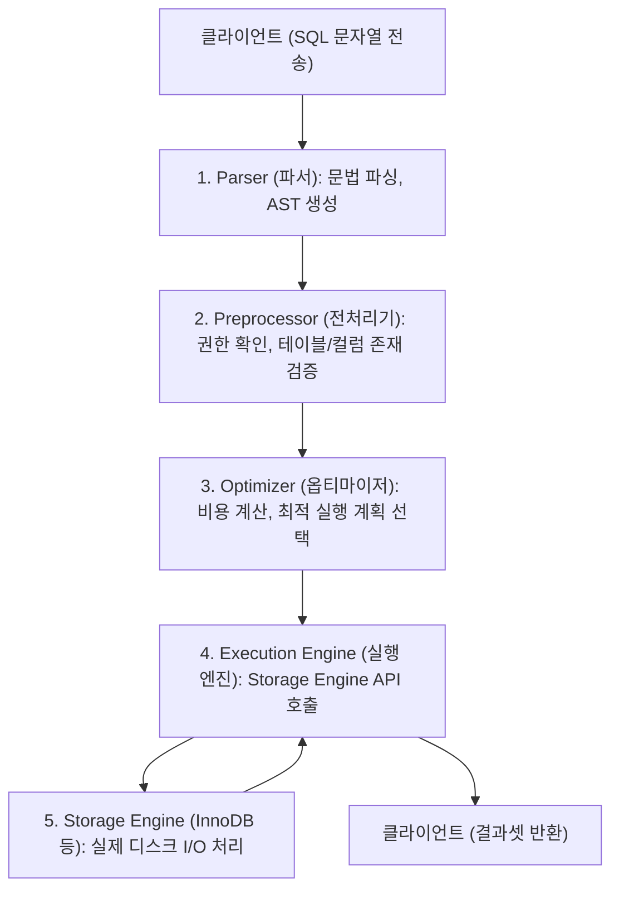
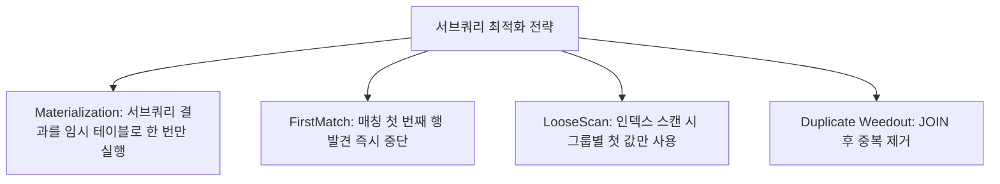

인덱스를 분명히 걸었는데 EXPLAIN을 보니 Full Table Scan이다. 옵티마이저가 인덱스보다 풀스캔이 더 빠르다고 판단한 것이다. 왜 그런 선택을 했는지 이해하지 못하면 힌트를 줄 수도, 통계를 갱신할 수도 없다.

> **비유로 먼저 이해하기**: 옵티마이저는 내비게이션과 같다. 목적지(원하는 결과)는 같아도 경로(실행 계획)는 여러 가지다. 내비게이션이 실시간 교통 정보(통계)를 보고 가장 빠른 길을 안내하듯, 옵티마이저는 테이블 통계를 보고 가장 비용이 낮은 실행 계획을 선택한다. 교통 정보가 오래됐거나 잘못됐다면 내비게이션도 이상한 길을 안내한다. 옵티마이저가 잘못된 실행 계획을 선택하는 이유 대부분이 바로 이 "통계 부정확" 문제다.

MySQL이 SQL을 받아 결과를 돌려주기까지, 내부에서는 생각보다 많은 일이 일어난다. 그 핵심에는 **옵티마이저(Optimizer)**가 있다. 같은 결과를 내는 쿼리라도 실행 방법은 수백 가지가 될 수 있고, 옵티마이저는 그중 가장 비용이 낮은 방법을 선택한다. 이 글에서는 쿼리가 실행되는 전체 흐름부터 옵티마이저의 내부 동작, EXPLAIN 분석, 최적화 기법, 그리고 실무 튜닝 체크리스트까지 완전히 정리한다.

---

## 1. 쿼리 실행 흐름 전체

MySQL에서 SQL 쿼리 하나가 결과로 돌아오기까지 다섯 단계를 거친다. 각 단계는 독립적인 역할을 수행하며, 앞 단계의 출력이 다음 단계의 입력이 된다. 이 흐름을 이해하면 왜 특정 에러가 발생하는지, 왜 옵티마이저가 특정 선택을 하는지를 직관적으로 파악할 수 있다.



### 1-1. Parser (파서)

SQL 문자열을 받아 문법적으로 올바른지 검사하고 **AST(Abstract Syntax Tree)**를 생성한다. 예를 들어 `SELECT * FROM users WHERE id = 1`은 `SELECT`, `*`, `FROM`, `users`, `WHERE`, `id`, `=`, `1`의 토큰으로 분리된 후 트리 구조로 표현된다.

문법 오류가 있으면 이 단계에서 `ERROR 1064 (42000): You have an error in your SQL syntax` 메시지를 반환한다. 중요한 점은 이 단계에서는 테이블이나 컬럼이 실제로 존재하는지 확인하지 않는다는 것이다. 문법 검사만 담당한다.

### 1-2. Preprocessor (전처리기)

AST를 받아 **의미론적 검증**을 수행한다. 테이블, 컬럼, 함수가 실제로 존재하는지 확인하고, 사용자의 접근 권한을 검사한다. 또한 `SELECT *`를 실제 컬럼 목록으로 확장하고, 뷰(View)를 실제 쿼리로 전개한다.

권한 부족이나 존재하지 않는 테이블 참조 오류는 이 단계에서 발생한다. `ERROR 1146 (42S02): Table 'mydb.users' doesn't exist` 같은 에러가 전처리기의 산물이다.

### 1-3. Optimizer (옵티마이저)

이 글의 핵심 단계다. 검증된 AST를 받아 **가장 비용이 낮은 실행 계획**을 선택한다. 어떤 인덱스를 사용할지, 어떤 순서로 테이블을 JOIN할지, 서브쿼리를 어떻게 최적화할지 결정한다. 자세한 내용은 이후 섹션에서 다룬다.

### 1-4. Execution Engine (실행 엔진)

옵티마이저가 만든 실행 계획을 **스토리지 엔진 API(handler API)를 호출**하며 실행한다. JOIN, 정렬, 집계 등 고수준 연산을 처리하며, 스토리지 엔진은 레코드 단위로 데이터를 올려준다. 실행 엔진은 스토리지 엔진이 InnoDB인지 MyISAM인지 모르고 통일된 핸들러 API로만 통신한다.

### 1-5. Storage Engine (스토리지 엔진)

실제 데이터가 디스크에 어떻게 저장되고 읽히는지를 담당한다. MySQL의 스토리지 엔진은 플러그인 방식이어서 테이블마다 다른 엔진을 선택할 수 있다.

- **InnoDB**: 트랜잭션, MVCC, 외래 키, 클러스터드 인덱스 지원 (기본값)
- **MyISAM**: 트랜잭션 없음, 풀텍스트 인덱스
- **Memory**: 인메모리 테이블

---

## 2. 옵티마이저란?

### 2-1. 비용 기반 옵티마이저 (CBO)

MySQL 5.x 이후 MySQL은 **CBO(Cost-Based Optimizer)**를 사용한다. CBO는 가능한 실행 계획들을 열거하고, 각각의 예상 비용(cost)을 계산해 가장 낮은 비용의 계획을 선택한다. 비용은 내부 단위로 표현되며, `mysql.server_cost`와 `mysql.engine_cost` 시스템 테이블에 저장된다.

비용 단위를 이해하는 것이 중요하다. `io_block_read_cost`(1.0)와 `memory_block_read_cost`(0.25)의 비율을 보면 디스크 I/O가 메모리 접근보다 4배 비싸다고 설정되어 있다. 실제 하드웨어에서는 그 차이가 훨씬 크지만(100배~1000배), 이 값을 환경에 맞게 조정하면 옵티마이저가 더 정확한 계획을 선택하도록 유도할 수 있다.

```sql
-- 비용 단위 확인 및 조정
SELECT * FROM mysql.server_cost;
SELECT * FROM mysql.engine_cost;
```

| 비용 항목 | 기본값 | 의미 |
|---|---|---|
| `row_evaluate_cost` | 0.1 | 레코드 하나 평가 비용 |
| `key_compare_cost` | 0.05 | 인덱스 키 비교 비용 |
| `memory_temptable_create_cost` | 1.0 | 인메모리 임시 테이블 생성 |
| `disk_temptable_create_cost` | 20.0 | 디스크 임시 테이블 생성 (20배 비쌈) |
| `io_block_read_cost` | 1.0 | 디스크 블록 읽기 |
| `memory_block_read_cost` | 0.25 | 버퍼풀에서 블록 읽기 |

### 2-2. 규칙 기반 옵티마이저 (RBO) vs CBO

RBO는 "인덱스가 있으면 무조건 인덱스를 사용한다" 같은 고정 규칙을 따른다. 데이터가 100건이든 1억 건이든 규칙이 동일하게 적용되어 비효율적인 경우가 많다. 예를 들어 테이블에 행이 3건뿐이라도 인덱스 스캔을 선택하는데, 이 경우 풀 테이블 스캔이 더 빠를 수 있다.

CBO는 실제 데이터 분포와 통계 정보를 바탕으로 최적 경로를 탐색한다. 같은 쿼리라도 데이터 분포에 따라 다른 실행 계획을 선택한다. MySQL의 현재 옵티마이저가 여기에 해당한다.

| 구분 | RBO (Rule-Based) | CBO (Cost-Based) |
|---|---|---|
| 판단 기준 | 미리 정해진 규칙 | 통계 기반 비용 계산 |
| 통계 의존 | 없음 | 높음 |
| 유연성 | 낮음 | 높음 |
| 단점 | 데이터 분포 무시 | 통계 부정확 시 잘못된 계획 |

---

## 3. 옵티마이저가 고려하는 비용 요소

### 3-1. I/O 비용 (디스크 읽기)

가장 큰 비용 요소다. 디스크에서 데이터를 읽는 행위는 메모리 접근보다 수십~수천 배 느리다. 옵티마이저는 각 실행 계획에서 몇 개의 디스크 블록을 읽어야 하는지 추정하여 비용을 계산한다.

풀 테이블 스캔은 테이블의 모든 데이터 페이지를 순차적으로 읽는다. 인덱스 스캔은 인덱스 페이지를 읽은 후 실제 행 데이터 페이지를 읽는 랜덤 I/O가 발생한다. 버퍼풀에 이미 올라온 페이지는 I/O 없이 메모리에서 접근하므로 훨씬 빠르다.

옵티마이저는 `innodb_buffer_pool_size` 대비 테이블 크기를 고려해 페이지가 버퍼풀에 있을 가능성도 추정한다. 작은 테이블은 항상 버퍼풀에 있다고 가정하여 I/O 비용을 낮게 계산한다.

### 3-2. CPU 비용 (비교, 정렬)

레코드 조건 평가(WHERE 절 비교 연산), 정렬(ORDER BY, GROUP BY), 집계 함수 연산(SUM, COUNT, AVG), 해시 테이블 생성(Hash Join) 등이 CPU 비용에 포함된다. 일반적으로 I/O 비용에 비해 CPU 비용은 작지만, 대용량 정렬이나 복잡한 집계에서는 무시할 수 없다.

### 3-3. 통계 정보 (Statistics)

옵티마이저는 실제 데이터를 전부 읽지 않고, **통계 정보**를 바탕으로 비용을 추정한다. 통계가 부정확하면 옵티마이저도 잘못된 판단을 내린다.

테이블 통계와 인덱스 카디널리티가 핵심이다. **카디널리티(Cardinality)**는 인덱스의 선택도를 나타낸다. `CARDINALITY / TABLE_ROWS`가 1에 가까울수록 선택도가 높아 인덱스 효과가 크다.

```sql
-- 테이블 통계 확인
SELECT
    TABLE_NAME,
    TABLE_ROWS,       -- 추정 행 수
    AVG_ROW_LENGTH,   -- 평균 행 길이 (바이트)
    DATA_LENGTH,      -- 데이터 크기
    INDEX_LENGTH      -- 인덱스 크기
FROM information_schema.TABLES
WHERE TABLE_SCHEMA = 'mydb';

-- 인덱스 카디널리티 확인
SELECT
    TABLE_NAME,
    INDEX_NAME,
    COLUMN_NAME,
    CARDINALITY  -- 인덱스의 유니크 값 추정 수
FROM information_schema.STATISTICS
WHERE TABLE_SCHEMA = 'mydb'
ORDER BY TABLE_NAME, INDEX_NAME;
```

예: 100만 건 테이블에서
- `gender` 컬럼 (M/F 2가지): 카디널리티 ≈ 2 → 선택도 낮음 → 인덱스 효과 거의 없음
- `email` 컬럼 (거의 유니크): 카디널리티 ≈ 100만 → 선택도 높음 → 인덱스 매우 효과적

### 3-4. ANALYZE TABLE의 역할

통계 정보는 자동으로 갱신되지만, 대량 INSERT/DELETE/UPDATE 후에는 통계가 부정확해질 수 있다. InnoDB는 기본적으로 무작위 8페이지(innodb_stats_sample_pages)를 샘플링하여 통계를 추정한다. 이 샘플 수가 너무 적으면 통계가 실제와 크게 다를 수 있다.

```sql
-- 통계 재수집 (서비스 영향 거의 없음)
ANALYZE TABLE users;
ANALYZE TABLE orders, products;  -- 여러 테이블 동시 가능

-- 특정 테이블만 더 많은 샘플 사용 (정확도 향상)
ALTER TABLE users STATS_SAMPLE_PAGES = 50;

-- 자동 통계 갱신 확인 (테이블 행의 10% 이상 변경 시 자동 재계산)
SHOW VARIABLES LIKE 'innodb_stats_auto_recalc';
```

**핵심**: `EXPLAIN ANALYZE`로 추정 rows와 실제 actual rows의 차이가 10배 이상이면 `ANALYZE TABLE`을 실행해야 한다는 신호다.

---

## 4. 실행 계획 (EXPLAIN) 완전 분석

`EXPLAIN`은 옵티마이저가 선택한 실행 계획을 보여주는 핵심 도구다. 쿼리를 실제로 실행하지 않고 계획만 보여주므로 부담 없이 사용할 수 있다. 반면 `EXPLAIN ANALYZE`는 쿼리를 실제 실행하여 추정값과 실제값을 함께 보여준다.

```sql
EXPLAIN SELECT u.name, COUNT(o.id) AS order_count
FROM users u
LEFT JOIN orders o ON u.id = o.user_id
WHERE u.created_at >= '2025-01-01'
GROUP BY u.id
ORDER BY order_count DESC
LIMIT 10;
```

### 4-1. type 컬럼 (가장 중요)

`type` 컬럼은 테이블 접근 방법을 나타내며 성능을 직접적으로 반영한다. 성능 순서는 좋음에서 나쁨 순이다.


**`const`**: PRIMARY KEY 또는 UNIQUE KEY를 상수와 비교. 결과가 최대 1건으로 매우 빠르다.

```sql
EXPLAIN SELECT * FROM users WHERE id = 1; -- type = const (id는 PK)
```

**`eq_ref`**: JOIN 시 드리븐 테이블의 PK 또는 UNIQUE KEY로 JOIN. JOIN되는 행마다 정확히 1건 매칭된다.

```sql
EXPLAIN SELECT * FROM orders o JOIN users u ON o.user_id = u.id;
-- u 테이블: eq_ref
```

**`ref`**: UNIQUE가 아닌 인덱스를 동등 조건으로 사용. 여러 행이 매칭될 수 있다.

```sql
EXPLAIN SELECT * FROM orders WHERE status = 'pending'; -- type = ref (status가 일반 인덱스일 때)
```

**`range`**: 인덱스의 특정 범위만 스캔. `BETWEEN`, `>`, `<`, `IN`, `LIKE 'abc%'` 등에서 발생한다.

```sql
EXPLAIN SELECT * FROM orders WHERE created_at BETWEEN '2025-01-01' AND '2025-12-31'; -- type = range
```

**`ALL`**: 풀 테이블 스캔. 수백만 건 테이블에서 `ALL`은 반드시 검토해야 한다.

```sql
-- 컬럼에 함수 적용 → 인덱스 사용 불가 → type = ALL
EXPLAIN SELECT * FROM users WHERE YEAR(created_at) = 2025;
```

### 4-2. Extra 컬럼 주요값

**`Using index` (긍정적)**: 커버링 인덱스 사용. 데이터 파일 접근 없이 인덱스만으로 응답한다.

**`Using temporary` (주의)**: GROUP BY, ORDER BY, DISTINCT 처리를 위해 임시 테이블을 생성한다. 메모리 또는 디스크에 임시 테이블이 만들어지므로 느려진다.

**`Using filesort` (주의)**: ORDER BY를 인덱스가 아닌 별도 정렬 알고리즘으로 처리한다. 인메모리 또는 디스크 정렬이 발생한다.

**`Using index condition` (긍정적)**: Index Condition Pushdown(ICP) 적용. 스토리지 엔진 레이어에서 조건을 미리 평가하여 불필요한 레코드 읽기를 줄인다.

```sql
-- GROUP BY 컬럼에 인덱스가 없으면 임시 테이블 + filesort
EXPLAIN SELECT status, COUNT(*) FROM orders GROUP BY status;
-- Extra: Using temporary; Using filesort → 복합 인덱스 (status) 추가로 해결
```

### 4-3. 주요 컬럼 정리

- **`rows`**: 옵티마이저 추정 접근 행 수 (낮을수록 좋음)
- **`filtered`**: 조건에 의해 필터링되고 남을 비율(%). `rows * filtered / 100`이 실제 처리 행 수
- **`key`**: 실제 선택된 인덱스. `NULL`이면 인덱스 미사용
- **`key_len`**: 사용된 인덱스의 바이트 수. 복합 인덱스에서 몇 개 컬럼이 사용됐는지 추론 가능

### 4-4. EXPLAIN ANALYZE (MySQL 8.0+)

`EXPLAIN ANALYZE`는 쿼리를 **실제 실행**하고 추정값과 실제 통계를 함께 반환한다. 추정(`rows`)과 실제(`actual rows`)의 차이가 크면 통계 부정확의 신호다.

```sql
EXPLAIN ANALYZE
SELECT u.name, COUNT(o.id)
FROM users u
LEFT JOIN orders o ON u.id = o.user_id
WHERE u.created_at >= '2025-01-01'
GROUP BY u.id;
```

출력에서 핵심적으로 봐야 할 항목은 `cost`(옵티마이저 추정 비용), `rows`(추정 행 수), `actual time`(실제 소요 시간), `actual rows`(실제 행 수)다. `rows=1520`인데 `actual rows=15200`이라면 통계가 10배 오차를 가지고 있다는 의미다.

### 4-5. EXPLAIN FORMAT=JSON / TREE

`FORMAT=JSON`은 더 상세한 비용 정보를 포함하며 스크립트로 파싱하기 좋다. `FORMAT=TREE`(MySQL 8.0.16+)는 계층적 트리 구조로 실행 계획을 직관적으로 보여준다.

```sql
EXPLAIN FORMAT=TREE
SELECT * FROM users u JOIN orders o ON u.id = o.user_id WHERE u.id = 100\G
-- 결과:
-- -> Nested loop inner join  (cost=4.25 rows=3)
--     -> Rows fetched before execution  (cost=0.00 rows=1)
--     -> Index lookup on o using idx_user_id (user_id=100)  (cost=3.26 rows=3)
```

---

## 5. 옵티마이저 최적화 기법

### 5-1. 서브쿼리 최적화

**Materialization (구체화)**은 서브쿼리 결과를 임시 테이블에 저장해 반복 실행을 방지한다. 외부 쿼리가 임시 테이블에 자동 생성된 인덱스로 조인한다. EXPLAIN의 `select_type`에 `MATERIALIZED`가 표시된다.

**Semi-join 최적화**는 `IN (subquery)` 또는 `EXISTS (subquery)` 패턴에서 중복 없이 매칭 여부만 확인하는 최적화다. 전통적인 INNER JOIN처럼 카르테시안 곱이 발생하지 않는다.



```sql
-- Semi-join 적용 패턴
SELECT * FROM orders o
WHERE EXISTS (
    SELECT 1 FROM order_items oi WHERE oi.order_id = o.id AND oi.product_id = 100
);
-- EXPLAIN select_type에 MATERIALIZED 또는 FirstMatch 표시
```

### 5-2. JOIN 최적화

**Nested Loop Join (NLJ)**은 가장 기본적인 JOIN 방법이다. 드라이빙 테이블의 각 행에 대해 드리븐 테이블을 탐색한다. 드리븐 테이블에 인덱스가 있을 때 매우 효율적이다. 드라이빙 테이블 행 수 × 드리븐 테이블 접근 비용이 전체 비용이 된다.

드리븐 테이블의 조인 컬럼에 인덱스가 없으면 MySQL 8.0.18 이전에는 Block Nested Loop(BNL), 이후에는 **Hash Join**으로 처리된다.

Hash Join은 드라이빙 테이블로 해시 테이블을 빌드하고, 드리븐 테이블의 각 행을 해시 테이블에서 탐색한다. 인덱스 없는 JOIN에서 BNL보다 훨씬 빠르며, 등치 JOIN(`=`)에서만 사용 가능하다.

```sql
-- Hash Join 강제 사용 (MySQL 8.0.18+)
SELECT /*+ HASH_JOIN(u o) */ *
FROM users u JOIN orders o ON u.id = o.user_id;
-- Extra: Using join buffer (hash join)

-- JOIN 버퍼 크기 조정 (Hash Join 메모리)
SET SESSION join_buffer_size = 4 * 1024 * 1024;  -- 4MB
```

**JOIN 순서 최적화**: 옵티마이저는 테이블이 n개일 때 n! 가지 JOIN 순서 중 비용이 낮은 것을 선택한다. 작은 테이블(또는 조건으로 많이 줄어드는 테이블)을 드라이빙 테이블로 선택하는 것이 일반적으로 최적이다.

### 5-3. Derived Table Merge (파생 테이블 병합)

FROM 절의 서브쿼리(파생 테이블)를 메인 쿼리로 병합해 불필요한 임시 테이블을 제거한다. 아래 두 쿼리는 옵티마이저 내부에서 동일하게 처리된다.

```sql
-- 원래 쿼리 (파생 테이블 포함)
SELECT * FROM (
    SELECT id, name FROM users WHERE grade = 'VIP'
) AS vip_users
WHERE name LIKE 'Kim%';

-- 옵티마이저가 내부적으로 Merge하여 실행
SELECT id, name FROM users
WHERE grade = 'VIP' AND name LIKE 'Kim%';
```

`LIMIT`, `UNION`, `GROUP BY` 등이 포함된 서브쿼리는 결과가 순서에 의존하므로 병합되지 않고 임시 테이블이 생성된다. 이런 서브쿼리 안에 필터 조건이 있으면 반드시 서브쿼리 안에 WHERE를 넣어야 한다.

### 5-4. Index Condition Pushdown (ICP)

ICP는 인덱스 스캔 중 WHERE 조건을 스토리지 엔진 레이어에서 먼저 평가해 불필요한 레코드 읽기를 줄이는 기법이다.

ICP 없이는 스토리지 엔진이 인덱스 범위 내 레코드를 모두 읽어 서버 레이어에 올린 후 WHERE 조건을 평가한다. ICP가 있으면 스토리지 엔진이 인덱스를 읽는 중에 WHERE 조건을 미리 평가하여, 조건을 통과한 레코드만 서버 레이어에 올린다. 대용량 테이블에서 필터율이 높은 쿼리의 성능을 크게 향상시킨다.

```sql
-- 복합 인덱스 (last_name, first_name)이 있을 때
-- ICP: first_name LIKE '%su' 조건을 스토리지 엔진에서 먼저 평가
EXPLAIN SELECT * FROM users
WHERE last_name = 'Kim' AND first_name LIKE '%su';
-- Extra: Using index condition
```

### 5-5. Multi-Range Read (MRR)

Secondary Index를 통한 데이터 조회에서 발생하는 랜덤 I/O를 순차 I/O로 전환한다. 인덱스에서 PK 목록을 먼저 수집하고, PK를 물리적 저장 순서로 정렬한 후 순서대로 데이터 파일에 접근한다. 이 방식은 SSD에서는 효과가 크지 않을 수 있지만 HDD 환경에서 큰 성능 향상을 제공한다.

```sql
-- MRR 활성화 확인
SHOW VARIABLES LIKE 'optimizer_switch';
-- mrr=on, mrr_cost_based=on 확인

EXPLAIN SELECT * FROM orders WHERE user_id BETWEEN 100 AND 200;
-- Extra: Using MRR (표시될 경우)
```

### 5-6. ORDER BY 최적화

ORDER BY는 인덱스를 활용하면 filesort 없이 처리할 수 있다. WHERE 절과 ORDER BY 절이 같은 복합 인덱스를 사용하는 것이 핵심이다.

```sql
-- 복합 인덱스 (user_id, created_at)이 있으면 WHERE + ORDER BY 모두 인덱스로 처리
SELECT * FROM orders WHERE user_id = 100 ORDER BY created_at;
-- Extra: (없음) → 인덱스 순서로 정렬 없이 반환

-- filesort 발생: WHERE와 ORDER BY가 다른 인덱스
SELECT * FROM orders WHERE status = 'done' ORDER BY created_at;
-- 복합 인덱스 (status, created_at) 필요

-- filesort 알고리즘: sort_buffer_size가 충분하면 메모리 정렬
SHOW VARIABLES LIKE 'sort_buffer_size';  -- 기본 256KB
SET SESSION sort_buffer_size = 4 * 1024 * 1024;  -- 4MB로 증가
```

### 5-7. GROUP BY 최적화

**루스 인덱스 스캔(Loose Index Scan)**: 인덱스에서 각 그룹의 첫/마지막 값만 읽어 처리한다. EXPLAIN Extra에 `Using index for group-by`로 표시된다.

```sql
-- (user_id, status) 복합 인덱스 존재 시
EXPLAIN SELECT user_id, MIN(created_at), MAX(created_at)
FROM orders GROUP BY user_id;
-- Extra: Using index for group-by (루스 인덱스 스캔)
```

인덱스를 쓸 수 없을 때는 임시 테이블 + filesort가 발생한다. EXPLAIN Extra에 `Using temporary; Using filesort`가 함께 표시되면 GROUP BY 컬럼에 인덱스 추가를 검토해야 한다.

### 5-8. LIMIT 최적화와 Deep Pagination

`LIMIT`은 충분한 행을 찾으면 즉시 중단할 수 있어 전체 처리를 피한다. 그러나 `OFFSET`이 커지면 결국 버려질 행을 모두 읽어야 하므로 성능이 점점 저하된다. Keyset Pagination(커서 기반)으로 전환하면 이 문제를 해결할 수 있다.

```sql
-- 나쁨: OFFSET이 클수록 버려지는 행이 많아 점점 느려짐
-- 100000번째 페이지: 100만 행을 읽고 마지막 10개만 반환
SELECT * FROM orders ORDER BY id LIMIT 10 OFFSET 100000;

-- 좋음: Keyset Pagination (커서 기반)
-- 이전 페이지의 마지막 id를 커서로 사용 → 항상 LIMIT 10만 읽음
SELECT * FROM orders WHERE id > :last_id ORDER BY id LIMIT 10;
```

---

## 6. 옵티마이저 힌트

힌트는 옵티마이저가 잘못된 실행 계획을 선택할 때 사용하는 최후 수단이다. 힌트로 고친 문제는 근본 원인(통계 부정확, 인덱스 부재)을 함께 해결해야 한다. 힌트만 적용하고 방치하면 데이터가 변해도 힌트가 남아 역효과가 날 수 있다.

### 6-1. 인덱스 힌트 (레거시 방식)

```sql
-- USE INDEX: 후보 목록 제한 (강제 아님)
SELECT * FROM orders USE INDEX (idx_user_id, idx_status) WHERE user_id = 100;

-- FORCE INDEX: 풀 테이블 스캔보다 인덱스를 강제 우선
SELECT * FROM orders FORCE INDEX (idx_created_at) WHERE created_at >= '2025-01-01';

-- IGNORE INDEX: 특정 인덱스 배제
SELECT * FROM orders IGNORE INDEX (idx_status) WHERE status = 'pending';
```

### 6-2. 옵티마이저 힌트 (MySQL 8.0+ 권장)

주석 형태 `/*+ ... */`로 SELECT 직후에 삽입하는 방식이 공식 권장이다. 인덱스 힌트보다 더 세밀한 제어가 가능하다.

```sql
-- 인덱스 사용 강제
SELECT /*+ INDEX(o idx_user_id) */ * FROM orders o WHERE user_id = 100;

-- JOIN 순서 고정 (users를 드라이빙 테이블로)
SELECT /*+ LEADING(u o) */ * FROM users u JOIN orders o ON u.id = o.user_id;

-- JOIN 알고리즘 지정
SELECT /*+ HASH_JOIN(u o) */ * FROM users u JOIN orders o ON u.id = o.user_id;

-- 서브쿼리 전략 지정 (Materialization 강제)
SELECT /*+ SEMIJOIN(@subq MATERIALIZATION) */ *
FROM users WHERE id IN (
    SELECT /*+ QB_NAME(subq) */ user_id FROM orders WHERE total > 10000
);

-- 해당 쿼리에만 변수 적용 (세션 변수 변경 없음)
SELECT /*+ SET_VAR(sort_buffer_size = 16777216) */ *
FROM orders ORDER BY total_amount;

-- 쿼리 타임아웃 (밀리초 단위)
SELECT /*+ MAX_EXECUTION_TIME(3000) */ * FROM big_table;
```

### 6-3. STRAIGHT_JOIN

JOIN 순서를 SQL 작성 순서대로 강제한다. `LEADING` 힌트보다 오래된 방법이지만 여전히 사용된다. 옵티마이저가 JOIN 순서를 계속 잘못 선택할 때 빠른 임시 해결책으로 유용하다.

```sql
-- u → o 순서로 JOIN 강제 (옵티마이저가 반대 순서를 선택할 때 사용)
SELECT STRAIGHT_JOIN u.name, o.total
FROM users u
JOIN orders o ON u.id = o.user_id
WHERE u.grade = 'VIP';
```

---

## 7. 옵티마이저가 잘못된 실행 계획을 선택하는 경우

### 7-1. 통계 정보 부정확

가장 흔한 원인이다. 대량의 데이터 변경 후 통계가 갱신되지 않으면 옵티마이저가 잘못된 cardinality를 참고한다.

```sql
-- 증상: EXPLAIN ANALYZE에서 추정 rows와 actual rows의 차이가 10배 이상
-- 해결: 통계 재수집
ANALYZE TABLE orders;

-- 더 많은 샘플 페이지로 정확도 향상
ALTER TABLE orders STATS_SAMPLE_PAGES = 100;
```

### 7-2. 데이터 편향 (Skew)

특정 값이 극도로 많이 존재하는 경우 카디널리티 통계가 전체 평균이므로 부정확하다. 예를 들어 `status` 컬럼에 `done`이 99%, `pending`이 1%라면, 통계상 카디널리티가 낮아 보여 옵티마이저가 인덱스 대신 풀 스캔을 선택할 수 있다. 실제로는 `pending` 조건이면 인덱스가 훨씬 빠르다.

```sql
-- 데이터 분포 확인
SELECT status, COUNT(*) FROM orders GROUP BY status;

-- 특정 값에 대해 인덱스 강제
SELECT /*+ INDEX(o idx_status) */ * FROM orders o WHERE status = 'pending';
```

### 7-3. 함수/형변환으로 인한 인덱스 무력화

컬럼에 함수를 적용하면 인덱스를 사용할 수 없다. 함수가 적용된 결과는 인덱스에 저장된 값과 다르기 때문이다. 이것이 가장 흔하게 발생하는 인덱스 무력화 패턴이다.

```sql
-- 나쁨: 컬럼에 함수 적용 → 인덱스 사용 불가 → 풀 테이블 스캔
SELECT * FROM users WHERE YEAR(created_at) = 2025;
SELECT * FROM users WHERE LEFT(email, 5) = 'admin';
SELECT * FROM orders WHERE CAST(total AS CHAR) = '10000';

-- 좋음: 범위 조건으로 변환 → 인덱스 사용 가능
SELECT * FROM users WHERE created_at >= '2025-01-01' AND created_at < '2026-01-01';
SELECT * FROM users WHERE email LIKE 'admin%';
SELECT * FROM orders WHERE total = 10000;

-- 묵시적 형변환 주의: user_id가 INT인데 문자열로 비교 → 인덱스 무력화
SELECT * FROM orders WHERE user_id = '100';  -- 나쁨
SELECT * FROM orders WHERE user_id = 100;    -- 좋음
```

### 7-4. OR 조건으로 인한 인덱스 비효율

OR로 연결된 조건이 서로 다른 인덱스를 사용해야 할 때 성능이 저하된다. MySQL 8.0+는 Index Merge Optimization으로 개선됐지만, UNION ALL로 분리하면 더 명확하게 각 인덱스를 활용할 수 있다.

```sql
-- 성능 이슈 가능: OR 조건
SELECT * FROM orders WHERE user_id = 100 OR status = 'pending';

-- 권장: UNION ALL로 분리 (각각 인덱스 완전 활용)
SELECT * FROM orders WHERE user_id = 100
UNION ALL
SELECT * FROM orders WHERE status = 'pending' AND user_id != 100;
```

---

## 8. 슬로우 쿼리 분석 실무

### 8-1. slow_query_log 설정

슬로우 쿼리 로그는 성능 문제를 찾는 첫 번째 도구다. `long_query_time` 이상 걸린 쿼리를 기록하며, `log_queries_not_using_indexes`를 함께 활성화하면 인덱스를 사용하지 않는 빠른 쿼리도 잡아낼 수 있다.

```sql
-- 동적 활성화 (서버 재시작 불필요)
SET GLOBAL slow_query_log = ON;
SET GLOBAL slow_query_log_file = '/var/log/mysql/slow.log';
SET GLOBAL long_query_time = 1;                    -- 1초 이상 쿼리 기록
SET GLOBAL log_queries_not_using_indexes = ON;     -- 인덱스 미사용 쿼리도 기록
SET GLOBAL log_slow_admin_statements = ON;         -- 관리용 명령도 기록
```

슬로우 쿼리 로그의 `Rows_examined / Rows_sent` 비율이 100 이상이면 비효율적인 쿼리다. 10만 행을 읽어 1행을 반환하는 쿼리는 인덱스 추가로 수천 배 빠르게 만들 수 있다.

### 8-2. pt-query-digest 활용

Percona Toolkit의 `pt-query-digest`는 슬로우 쿼리 로그를 패턴별로 집계하여 **총 실행 시간 기준 TOP 쿼리**를 찾는다. 단순히 가장 느린 쿼리가 아니라, 빈번하게 실행되어 전체 시간을 가장 많이 잡아먹는 쿼리를 찾아야 실질적인 성능 개선이 가능하다.

```bash
# 쿼리 패턴별 집계 (총 실행 시간 기준 정렬)
pt-query-digest /var/log/mysql/slow.log

# 최근 1시간치만 분석
pt-query-digest --since 3600 /var/log/mysql/slow.log

# 특정 데이터베이스만 분석
pt-query-digest --filter '$event->{db} eq "mydb"' /var/log/mysql/slow.log
```

출력에서 `Response time`이 높은 쿼리가 개선 우선순위다. `Rows examine` 대비 `Rows sent` 비율도 함께 확인한다.

### 8-3. Performance Schema 활용

MySQL 5.6+에서 기본 활성화된 Performance Schema와 sys 스키마를 활용하면 슬로우 쿼리 로그 없이도 쿼리 통계를 실시간으로 조회할 수 있다.

```sql
-- 쿼리별 실행 통계 (총 지연 시간 기준 상위 20개)
SELECT
    query,
    exec_count,
    total_latency,
    avg_latency,
    rows_examined_avg,
    tmp_disk_tables,    -- 디스크 임시 테이블 발생 여부
    full_scans          -- 풀 테이블 스캔 횟수
FROM sys.statement_analysis
ORDER BY total_latency DESC
LIMIT 20;

-- 사용되지 않는 인덱스 찾기 (삭제 검토 대상)
SELECT * FROM sys.schema_unused_indexes WHERE object_schema = 'mydb';

-- 중복 인덱스 찾기
SELECT * FROM sys.schema_redundant_indexes WHERE table_schema = 'mydb';

-- 락 대기 분석 (현재 블로킹 쿼리 찾기)
SELECT
    r.trx_id AS waiting_trx_id,
    r.trx_query AS waiting_query,
    b.trx_id AS blocking_trx_id,
    b.trx_query AS blocking_query
FROM information_schema.innodb_lock_waits w
JOIN information_schema.innodb_trx b ON b.trx_id = w.blocking_trx_id
JOIN information_schema.innodb_trx r ON r.trx_id = w.requesting_trx_id;
```

---

<details class="extreme-scenario-details" ontoggle="if(this.open){var ad=this.querySelector('.extreme-scenario-ad');if(ad&&!ad.dataset.loaded){ad.dataset.loaded='1';(adsbygoogle=window.adsbygoogle||[]).push({});}}">
<summary class="extreme-scenario-summary">
<span class="extreme-scenario-icon">🔥</span>
<span class="extreme-scenario-label">극한 시나리오 — 클릭하여 펼치기</span>
<span class="extreme-scenario-toggle"></span>
</summary>
<div class="extreme-scenario-body">
<div class="extreme-scenario-ad" style="text-align:center; margin-bottom:1.5em;">
<ins class="adsbygoogle"
     style="display:block"
     data-ad-client="ca-pub-7225106491387870"
     data-ad-slot="0000000000"
     data-ad-format="auto"
     data-full-width-responsive="true"></ins>
</div>
<div class="extreme-scenario-content" markdown="1">

### 시나리오 1: 초당 10,000 쿼리에서 인덱스 하나로 서비스 중단

결제 시스템에서 `SELECT * FROM orders WHERE user_id = ? ORDER BY created_at DESC LIMIT 10` 쿼리가 초당 10,000회 실행되는 상황을 가정한다. 초기에는 문제없지만 주문 데이터가 수억 건으로 늘어나면서 쿼리가 점점 느려지기 시작한다.

원인은 `user_id` 단일 인덱스만 있어 인덱스로 user_id 필터링 후 `created_at` 정렬을 위한 filesort가 발생하는 것이다. 해결책은 `(user_id, created_at)` 복합 인덱스로 교체하는 것이다. 이 인덱스는 WHERE + ORDER BY를 모두 처리하여 filesort를 완전히 제거한다.

```sql
-- 기존 인덱스 (filesort 발생)
-- INDEX (user_id)

-- 개선된 복합 인덱스 (filesort 제거)
ALTER TABLE orders
    ADD INDEX idx_user_created (user_id, created_at DESC),
    ALGORITHM=INPLACE, LOCK=NONE;
```

### 시나리오 2: 배치 처리 후 통계 폭주

야간 배치로 5,000만 건을 INSERT한 다음 날 아침, 전날까지 1초 이내에 처리되던 쿼리들이 30초 이상 걸리기 시작한다. EXPLAIN ANALYZE를 실행하면 추정 rows가 실제의 1/100 수준임을 확인할 수 있다. 이는 대량 INSERT 후 통계가 갱신되지 않은 전형적인 증상이다.

```sql
-- 증상 진단
EXPLAIN ANALYZE SELECT * FROM orders WHERE user_id = 100;
-- estimated rows=50 vs actual rows=5000 → 100배 오차

-- 즉시 조치: 핵심 테이블 통계 재수집
ANALYZE TABLE orders, order_items, users;

-- 재발 방지: 샘플 페이지 수 증가
ALTER TABLE orders STATS_SAMPLE_PAGES = 100;
```

### 시나리오 3: 히스토그램으로 데이터 편향 해결

`status` 컬럼에 `completed`가 98%, `failed`가 2%인 상황에서 `WHERE status = 'failed'` 조건 쿼리가 풀 스캔으로 실행된다. 카디널리티 통계만으로는 2%/98% 분포를 알 수 없어 옵티마이저가 인덱스 효과가 낮다고 판단한다.

MySQL 8.0의 히스토그램을 사용하면 이 분포 정보를 명시적으로 수집할 수 있다.

```sql
-- 히스토그램 수집 (데이터 분포 통계 추가)
ANALYZE TABLE orders UPDATE HISTOGRAM ON status WITH 10 BUCKETS;

-- 히스토그램 확인
SELECT * FROM information_schema.COLUMN_STATISTICS
WHERE TABLE_NAME = 'orders' AND COLUMN_NAME = 'status'\G

-- 결과: failed 값이 2% 분포임을 옵티마이저가 파악 → 인덱스 선택 가능성 높아짐
```

---
</div>
</div>
</details>

## 10. 실무 쿼리 튜닝 체크리스트

아래 8단계는 슬로우 쿼리를 발견했을 때부터 해결까지의 체계적인 접근법이다. 각 단계를 순서대로 진행하되, 힌트 적용(7단계)은 근본 원인을 해결한 후에도 문제가 남아 있을 때만 사용한다.

**단계 1: 문제 식별**

슬로우 쿼리 로그에서 `Rows_examined / Rows_sent` 비율이 100 이상인 쿼리를 찾는다. `pt-query-digest`로 총 실행 시간 기준 TOP 쿼리 목록을 추출하고, `sys.statement_analysis`에서 `full_scans`와 `tmp_disk_tables`가 높은 쿼리를 우선 처리한다.

**단계 2: EXPLAIN 분석**

`EXPLAIN`으로 실행 계획을 확인한다. `type`에 `ALL` 또는 `index`가 있는지, `Extra`에 `Using filesort`, `Using temporary`가 있는지 확인한다. `EXPLAIN ANALYZE`로 추정치와 실제값 차이가 10배 이상이면 `ANALYZE TABLE`을 먼저 실행한다.

**단계 3: 인덱스 검토**

WHERE 절 컬럼에 인덱스가 있는지, 컬럼에 함수/형변환이 적용됐는지 확인한다. 복합 인덱스 컬럼 순서(동등 조건 컬럼을 앞에, 범위 조건 컬럼을 뒤에)와 커버링 인덱스 가능 여부를 검토한다.

**단계 4: 쿼리 리팩토링**

```sql
-- SELECT * → 필요한 컬럼만 지정
-- OR 조건 → UNION ALL로 분리
-- Deep Pagination OFFSET → Keyset Pagination (WHERE id > :cursor)
-- 서브쿼리 → JOIN으로 변환 검토 (또는 반대)
-- IN 절에 수백 개 이상의 값 → 임시 테이블 + JOIN으로 대체
```

**단계 5: 인덱스 추가/변경**

```sql
-- 온라인 인덱스 추가 (서비스 중단 없음 - MySQL 5.6+)
ALTER TABLE orders
    ADD INDEX idx_user_status_created (user_id, status, created_at),
    ALGORITHM=INPLACE, LOCK=NONE;

-- 복합 인덱스 컬럼 순서 원칙:
-- 1. 동등 조건(=) 컬럼 먼저
-- 2. 범위 조건 컬럼 다음
-- 3. ORDER BY/GROUP BY 컬럼 마지막
-- WHERE user_id = ? AND status = ? ORDER BY created_at
-- → INDEX (user_id, status, created_at)
```

**단계 6: 설정 튜닝**

```sql
SET GLOBAL sort_buffer_size = 4 * 1024 * 1024;  -- filesort 성능 향상 (4MB)
SET GLOBAL join_buffer_size = 4 * 1024 * 1024;  -- Hash Join 성능 향상 (4MB)
-- InnoDB Buffer Pool은 물리 메모리의 50~80% 권장 (가장 중요)
```

**단계 7: 힌트 적용 (최후 수단)**

통계 부정확으로 잘못된 인덱스 선택 시, 힌트로 인덱스를 강제한다. 단, 근본 원인(통계 갱신, 인덱스 재설계)과 함께 적용해야 한다.

```sql
SELECT /*+ INDEX(o idx_user_id) */ * FROM orders o WHERE user_id = 100;
SELECT /*+ LEADING(small large) */ * FROM small JOIN large ON small.id = large.fk_id;
```

**단계 8: 아키텍처 검토**

단일 서버 최적화의 한계에 도달했다면 아키텍처 변경을 고려한다. 읽기 부하는 레플리카(Replica)로 분산하고, 자주 조회되는 결과는 Redis/Memcached로 캐시한다. 집계 쿼리가 많다면 요약 테이블(Summary Table)을 사전 계산하고, 테이블이 수억 건을 초과하면 파티셔닝 또는 샤딩을 검토한다.

---

## 실무에서 자주 하는 실수

### 실수 1: ANALYZE TABLE 없이 힌트만 추가

통계가 부정확한 상태에서 힌트만 추가하면 임시방편에 불과하다. 배치 처리나 대량 데이터 이동 후에는 반드시 `ANALYZE TABLE`을 실행하고, 그래도 문제가 남아 있을 때 힌트를 추가해야 한다.

### 실수 2: 복합 인덱스 컬럼 순서 무시

`WHERE status = 'pending' AND user_id = 100` 조건에 `INDEX (user_id, status)`가 있어도 제대로 활용된다. 그러나 `ORDER BY created_at`까지 인덱스로 처리하려면 `INDEX (user_id, status, created_at)` 순서가 되어야 한다. 범위 조건 컬럼 뒤의 컬럼들은 ORDER BY에 활용되지 않는다.

### 실수 3: SELECT * 사용으로 커버링 인덱스 효과 소멸

`SELECT *`를 사용하면 인덱스에 없는 컬럼도 포함되므로 커버링 인덱스가 적용되지 않는다. 필요한 컬럼만 명시적으로 지정하고, 그 컬럼들을 인덱스에 포함시키면 데이터 파일 접근 없이 인덱스만으로 응답할 수 있다.

### 실수 4: OR 조건에서 인덱스 효과 과신

`WHERE user_id = 100 OR email = 'kim@example.com'`처럼 서로 다른 컬럼의 OR 조건은 Index Merge가 적용되더라도 두 인덱스 결과의 합집합 처리 비용이 발생한다. 데이터 양이 많다면 UNION ALL로 분리하는 것이 더 확실하다.

### 실수 5: Long-running 트랜잭션 방치

트랜잭션을 시작하고 오랫동안 유지하면 InnoDB Purge Thread가 Undo Log를 정리하지 못해 디스크가 증가한다. 또한 Row Lock을 오래 보유하여 다른 쿼리들의 대기가 길어진다. 애플리케이션 코드에서 트랜잭션 범위를 최소화하고, `information_schema.INNODB_TRX`로 장기 실행 트랜잭션을 주기적으로 모니터링해야 한다.

---

## 정리

옵티마이저를 완전히 이해하면 단순히 인덱스를 추가하는 것을 넘어, 데이터 분포와 실행 계획의 상관관계를 파악하고 쿼리와 스키마를 함께 설계할 수 있게 된다.

핵심 습관 세 가지를 권장한다. 첫째, `EXPLAIN ANALYZE`를 생활화하여 추정값과 실제값 차이를 항상 확인한다. 둘째, 슬로우 쿼리 로그를 정기적으로 검토하여 `pt-query-digest`로 총 실행 시간 TOP 쿼리를 파악한다. 셋째, 대량 데이터 변경 후에는 `ANALYZE TABLE`로 통계를 최신 상태로 유지한다. 이 세 가지만 철저히 지켜도 MySQL 성능 문제의 대부분을 사전에 예방할 수 있다.
