단일 MySQL 서버가 감당할 수 있는 쓰기 TPS 한계에 도달했다. 읽기는 레플리카로 분산했지만 쓰기 병목은 해결되지 않는다. 수직 확장(더 좋은 서버)도 한계가 왔다. 다음 선택지가 샤딩이다.

> **비유로 먼저 이해하기**: 샤딩은 도서관 분관과 같다. 본관 하나에 책이 너무 많아지면 강남 분관, 강북 분관을 만들어 지역별로 나눠 보관한다. 어느 분관에 가야 하는지 안내(샤드 라우팅)만 잘 되어 있으면 이용자는 불편함이 없다. 파티셔닝은 본관 내부에서 층별로 책을 나누는 것이고, 샤딩은 아예 건물을 여러 채로 짓는 것이다.

## 샤딩이란?

**샤딩(Sharding)**은 하나의 데이터셋을 여러 개의 독립적인 데이터베이스 서버(샤드, Shard)에 수평으로 분산하여 저장하는 기법이다. 파티셔닝이 단일 서버 내부에서 데이터를 물리적으로 나누는 것과 달리, 샤딩은 **서버 자체를 여러 대로 늘려** 저장 용량과 처리 능력을 선형으로 확장한다.

파티셔닝과 샤딩의 핵심 차이를 구조적으로 이해하는 것이 중요하다. 파티셔닝은 하나의 서버 안에서 테이블을 물리적으로 분리하므로 CPU, 메모리, 디스크를 여전히 하나의 서버가 공유한다. 반면 샤딩은 각 샤드가 독립된 서버이므로 자원을 완전히 분리한다.

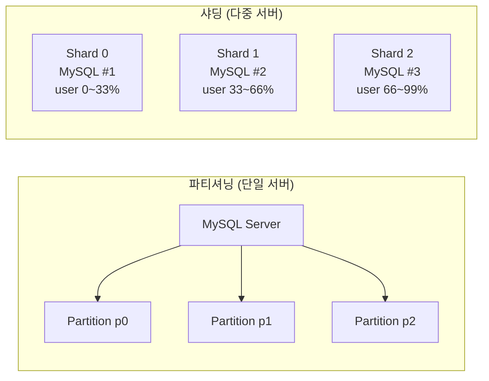

> **핵심**: 파티셔닝은 하나의 서버 안에서 데이터를 나누는 것이고, 샤딩은 서버 자체를 여러 대로 늘리는 것이다. 샤딩에서는 각 샤드가 독립된 CPU, 메모리, 디스크를 가진다.

### 파티셔닝과의 핵심 차이

| 항목 | 파티셔닝 | 샤딩 |
|------|---------|------|
| 분산 단위 | 단일 서버 내 파티션 | 별개의 서버(샤드) |
| 확장 방향 | 수직 확장 보완 | 수평 확장 |
| 투명성 | DB가 자동 처리 | 애플리케이션 또는 미들웨어가 처리 |
| 크로스 쿼리 | 옵티마이저가 처리 | 애플리케이션에서 수동 집계 |
| 외래키 | 제약 있음 | 실질적으로 불가 |
| 구현 복잡도 | 낮음 | 높음 |

---

## 왜 샤딩이 필요한가?

### 단일 DB 서버의 한계

단일 서버는 하드웨어 물리 한계가 명확하다. 쓰기 처리량의 경우 MySQL 단일 서버는 하드웨어에 따라 다르지만 수만 TPS 수준이며, 대형 서비스는 수십만에서 수백만 TPS를 요구한다. 디스크 측면에서도 단일 서버 SSD는 수십 TB 수준인 반면 대형 서비스는 수백 TB에서 수 PB 데이터를 다뤄야 한다. 메모리(Buffer Pool)가 데이터 크기를 감당하지 못하면 랜덤 I/O가 폭증하고, MySQL max_connections 한계로 동시 연결 수십만 요청을 처리할 수 없다.

수직 확장(Scale-Up)은 한계가 명확하고 비용이 지수적으로 증가한다. 샤딩은 수평 확장(Scale-Out)으로 이 문제를 해결한다.

### 샤딩 도입 시점 판단

샤딩은 최후의 수단이다. 도입 전에 더 단순한 방법들을 모두 시도해야 한다. 인덱스 최적화와 쿼리 튜닝만으로도 수십 배의 성능 향상이 가능하고, 읽기 복제와 캐싱은 대부분의 읽기 부하를 해결한다. 파티셔닝은 단일 서버 내 대용량 테이블 관리에 효과적이다.

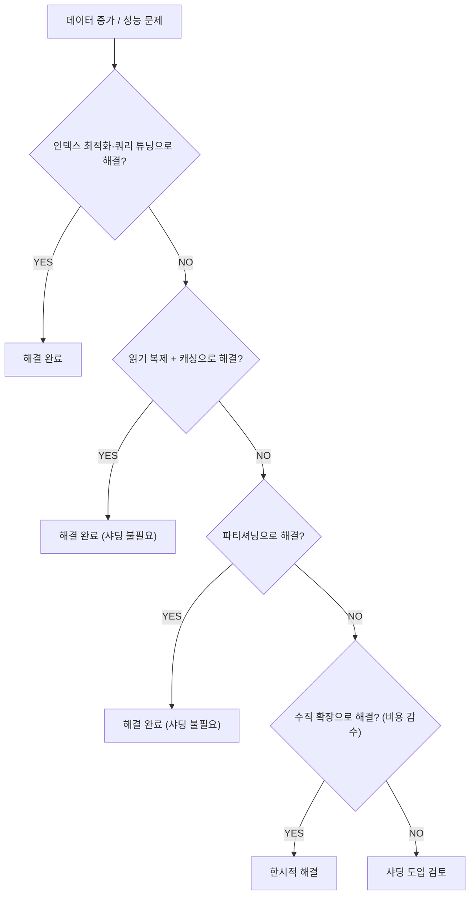

---

## 샤딩 전략

### Range-based Sharding

샤드 키의 값 범위를 기준으로 데이터를 분배한다. user_id 1부터 1000만까지는 Shard 0, 1000만1부터 2000만까지는 Shard 1과 같이 명확한 경계를 가진다. 라우팅 로직이 단순하고 범위 쿼리가 특정 샤드 내에서 완결될 수 있다는 장점이 있다.

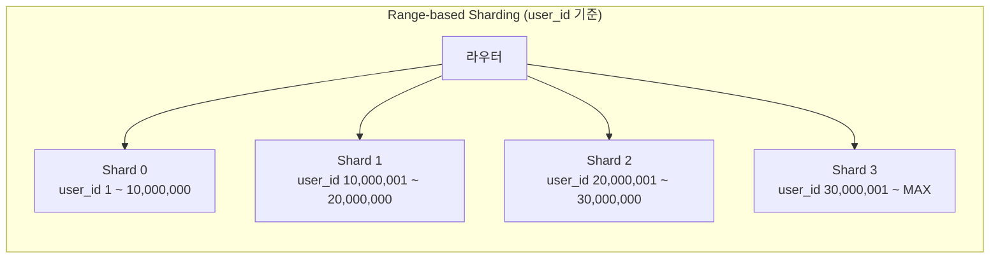

**단점 — 핫스팟(Hot Spot) 문제**

신규 가입자는 항상 높은 user_id를 받으므로 마지막 샤드(Shard 3)에 모든 신규 쓰기가 집중된다. 나머지 샤드는 읽기 위주로 한산해지고, 시간 기반 Range의 경우 가장 최근 파티션이 현재 쓰기를 독점한다. 대응책으로 샤드 프리스플릿(Pre-splitting, 미리 빈 샤드를 할당)이나 핫 샤드 감지 후 자동 분할을 사용한다.

### Hash-based Sharding

샤드 키에 해시 함수를 적용하여 샤드를 결정한다. `shard_id = hash(user_id) % num_shards` 공식으로 데이터를 균등하게 분포시키므로 핫스팟 문제가 적다.

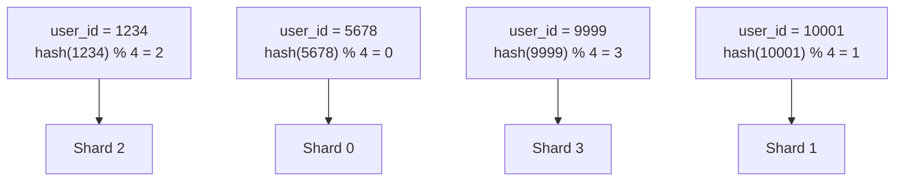

**단점 — 노드 추가/제거 시 대규모 재분배**

단순 모듈러 해싱의 치명적 단점은 샤드 수가 바뀔 때 나타난다. 샤드 3개에서 4개로 증가하면 `hash(x) % 3`에서 `hash(x) % 4`로 공식이 바뀌므로 거의 모든 데이터가 잘못된 샤드에 위치하게 된다. 전체 데이터 재분배가 필요하며 이는 사실상 다운타임이나 대규모 마이그레이션을 의미한다. 이 문제를 해결하는 것이 **Consistent Hashing**이다.

### Consistent Hashing

Consistent Hashing은 노드(샤드) 추가/제거 시 최소한의 데이터만 이동하도록 설계된 해시 기법이다. 해시 공간을 원형 링으로 표현하고(0 ~ 2^32-1), 각 샤드 노드를 해시하여 링 위에 배치한다. 각 키도 해시하여 링 위에 배치한 뒤, 키는 링에서 시계 방향으로 가장 가까운 노드에 저장된다.

노드를 추가하면 전체 데이터의 1/N만 이동하면 된다. 예를 들어 N0, N1, N2가 있을 때 N3을 N0과 N1 사이에 추가하면, N1이 담당하던 범위 중 일부만 N3으로 이동한다. 나머지 데이터는 변경이 없다. 반면 단순 모듈러 해싱은 전체 데이터의 약 75%가 이동해야 한다.

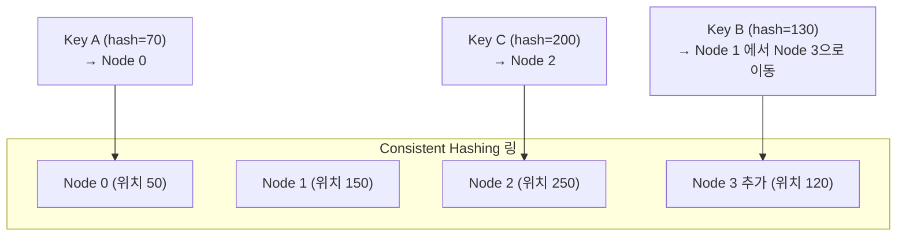

> **핵심**: Consistent Hashing에서 노드 추가 시 전체 데이터의 1/N만 이동한다. 단순 모듈러 해싱은 거의 전체 데이터가 재배치된다.

#### 가상 노드 (Virtual Nodes)

단순 Consistent Hashing은 노드 수가 적을 때 링 위의 배치가 불균등하여 특정 노드에 데이터가 집중될 수 있다. 이를 해결하기 위해 **가상 노드(Virtual Node, VNode)**를 사용한다.

실제 노드 3개(N0, N1, N2)가 있을 때 각 노드에 100개의 가상 노드를 할당한다. 링 위에는 N0_vn1, N1_vn47, N2_vn91과 같이 300개의 점이 배치되며, 모두 실제 노드에 매핑된다. 이를 통해 링 위 분포가 균등해지고 노드별 부하도 균등해진다. 또한 고성능 서버에는 200개, 저성능 서버에는 100개의 가상 노드를 할당하여 성능 비율대로 부하를 분배할 수 있다.

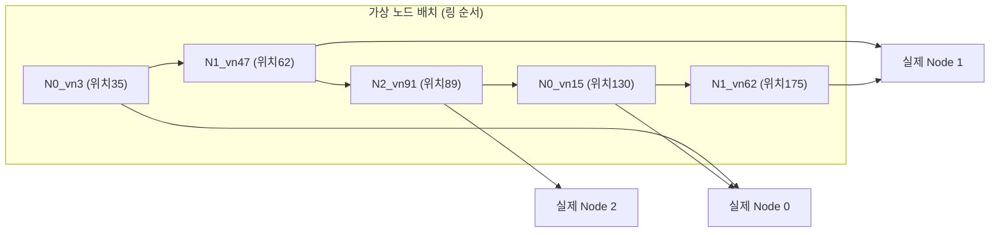

### Directory-based Sharding

별도의 **라우팅 테이블(Lookup Table)**에 각 키가 어느 샤드에 있는지 기록한다.

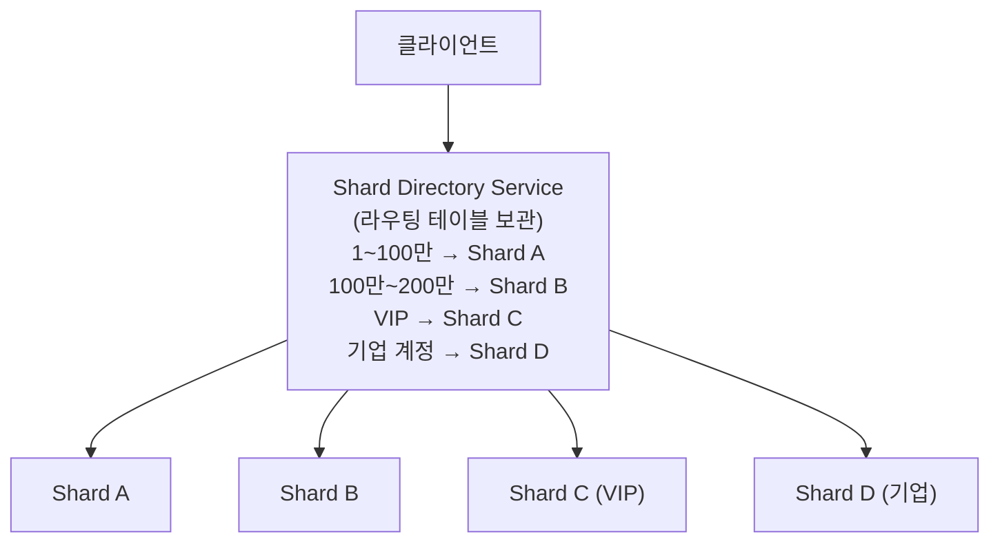

샤딩 로직이 완전히 유연하며 언제든지 라우팅 테이블을 변경하여 데이터를 재배치할 수 있고, VIP나 기업 계정 같은 특수 조건에 맞는 커스텀 배치가 가능하다. 단, 라우팅 테이블이 단일 장애점(SPOF)이 되고, 모든 쿼리에 라우팅 조회가 추가되므로 레이턴시가 증가한다. 라우팅 서비스 자체를 HA 구성해야 한다.

### Geographic Sharding

사용자의 지리적 위치를 기준으로 샤드를 배치한다. 데이터 주권(Data Sovereignty) 규제 준수에 필수적이다.

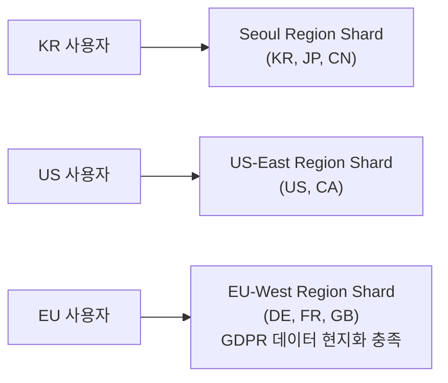

---

## 샤드 키(Shard Key) 설계 원칙

샤드 키는 샤딩의 성패를 결정한다. 잘못된 샤드 키는 핫스팟, 크로스 샤드 쿼리 폭증, 재샤딩 비용 등을 초래한다.

좋은 샤드 키는 다섯 가지 조건을 갖춰야 한다. 첫째, **높은 카디널리티**다. 값의 종류가 많아야 균등 분배가 가능하다. gender(M/F)는 샤드 2개만 의미 있지만 user_id는 수천만 종류다. 둘째, **균등한 데이터 분포**다. country_code처럼 KR이 90%를 차지하면 KR 샤드에 집중되므로 hash(user_id)처럼 균등 분포를 보장해야 한다. 셋째, **쿼리 패턴과의 정합성**으로 대부분의 쿼리가 샤드 키를 포함해야 크로스 샤드 쿼리를 최소화한다. 넷째, **변경 불가**로 한번 할당된 샤드 키 값은 변경할 수 없으므로 user_id나 UUID 같은 불변 식별자를 사용한다. 다섯째, **조인 지역성(Join Locality)**으로 자주 함께 조회되는 데이터가 같은 샤드에 있어야 한다. orders와 order_items를 모두 customer_id로 샤딩하면 고객의 전체 주문 내역이 단일 샤드에 존재한다.

---

## 크로스 샤드 쿼리 문제

샤딩의 가장 큰 단점은 여러 샤드에 걸친 쿼리가 복잡해진다는 것이다.

### JOIN 문제

단일 DB에서는 `SELECT u.name, o.amount FROM users u JOIN orders o ON u.user_id = o.user_id`가 DB가 알아서 처리한다. 샤딩 환경에서는 같은 user_id로 샤딩된 경우에만 같은 샤드에 위치하므로 JOIN이 가능하다. 다른 키로 샤딩되면 JOIN이 불가하다. 해결책으로는 동일 샤드 키 사용, 비정규화(orders에 user_name 중복 저장), 애플리케이션 레벨 JOIN(각 샤드에서 개별 조회 후 메모리에서 병합), 공유 차원 테이블(작은 참조 테이블은 모든 샤드에 복제)이 있다.

### 집계 쿼리 문제

전체 사용자 수 같은 크로스 샤드 집계는 각 샤드에서 병렬로 부분 집계 후 애플리케이션에서 합산하는 **Scatter-Gather** 패턴을 사용한다. 모든 샤드에 동시에 쿼리를 보내고(Scatter), 결과를 받아 합산한다(Gather).

아래 코드는 `parallelStream()`으로 모든 샤드에 동시에 COUNT 쿼리를 보내고, `.sum()`으로 결과를 합산한다. 샤드가 많을수록 전체 응답 시간이 단일 샤드 응답 시간에 수렴하는 것이 Scatter-Gather 패턴의 핵심이다.

```java
// 전체 사용자 수 집계 — 크로스 샤드 집계
@Service
@RequiredArgsConstructor
public class UserStatsService {

    private final List<DataSource> shards; // 샤드별 DataSource 목록

    public long getTotalUserCount() {
        // 모든 샤드에서 COUNT 조회 후 합산
        return shards.parallelStream()
            .mapToLong(shard -> {
                try (Connection conn = shard.getConnection();
                     PreparedStatement ps = conn.prepareStatement(
                         "SELECT COUNT(*) FROM users")) {
                    ResultSet rs = ps.executeQuery();
                    rs.next();
                    return rs.getLong(1);
                } catch (SQLException e) {
                    throw new RuntimeException(e);
                }
            })
            .sum();
    }
}
```

> **핵심**: Scatter-Gather 패턴은 모든 샤드에 병렬로 쿼리를 보내고 결과를 합산한다. 샤드 수가 늘어도 전체 응답 시간은 크게 늘지 않는다. 단, 가장 느린 샤드가 전체 응답 시간을 결정한다.

---

## 크로스 샤드 트랜잭션

단일 DB에서는 ACID 트랜잭션이 보장되지만, 샤딩 환경에서는 여러 샤드에 걸친 트랜잭션이 필요할 때 문제가 복잡해진다.

### 2PC (Two-Phase Commit)

트랜잭션 코디네이터(TC)가 모든 샤드에게 준비(Prepare)를 요청하고, 모두 OK 응답을 받으면 커밋(Commit)을 지시하는 방식이다. 이론적으로 완전한 원자성을 보장하지만, TC 장애 시 모든 샤드가 PREPARED 상태로 블로킹되고 레이턴시가 2번의 네트워크 왕복만큼 증가한다. 하나의 샤드라도 응답이 없으면 전체가 블로킹된다는 가용성 문제도 있다.

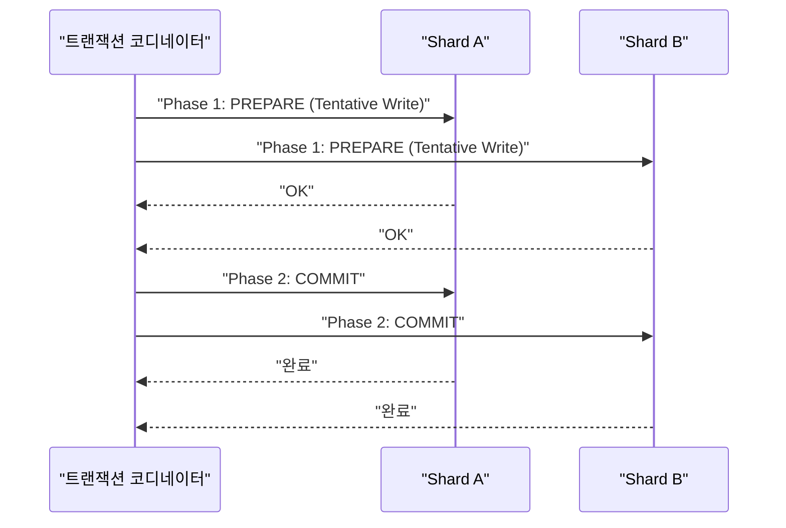

### Saga 패턴

2PC 대신 각 샤드에서 로컬 트랜잭션을 순차적으로 실행하고, 실패 시 이전 단계를 보상(Compensating Transaction)한다. 가용성이 높고 블로킹이 없다는 장점이 있지만, 최종 일관성(Eventual Consistency)만 보장되고 보상 로직이 복잡하다.

주문 생성 시나리오를 예로 들면, Step 1에서 Order 샤드에 주문을 PENDING 상태로 생성하고, Step 2에서 Inventory 샤드에서 재고를 차감하고, Step 3에서 Payment 샤드에서 결제를 처리하고, Step 4에서 Order 샤드에서 주문을 CONFIRMED로 확정한다. Step 3에서 결제 실패 시 Inventory 재고를 복구하고 Order를 취소하는 보상 트랜잭션이 실행된다.

아래 코드는 Spring 이벤트 기반 Choreography Saga 구현이다. 각 단계가 로컬 트랜잭션으로 처리되고, 성공 시 다음 단계를 이벤트로 트리거하며, 실패 시 보상 이벤트를 발행한다. `@EventListener`와 `@Transactional`을 조합하여 각 샤드에서 독립적으로 실행되는 로컬 트랜잭션을 보장한다.

```java
// Saga 패턴 예시 (Spring + 이벤트 기반)
@Service
@RequiredArgsConstructor
public class OrderSaga {

    private final OrderShardRepository orderRepo;
    private final InventoryShardRepository inventoryRepo;
    private final PaymentShardRepository paymentRepo;
    private final ApplicationEventPublisher eventPublisher;

    @Transactional  // Order 샤드 로컬 트랜잭션
    public Order createOrder(CreateOrderCommand cmd) {
        Order order = orderRepo.save(Order.pending(cmd));
        // 이벤트 발행 → Inventory 샤드에서 비동기 처리
        eventPublisher.publishEvent(new OrderCreatedEvent(order.getId(), cmd.items()));
        return order;
    }

    @EventListener
    @Transactional  // Inventory 샤드 로컬 트랜잭션
    public void handleOrderCreated(OrderCreatedEvent event) {
        try {
            inventoryRepo.decreaseStock(event.orderId(), event.items());
            eventPublisher.publishEvent(new StockReservedEvent(event.orderId()));
        } catch (InsufficientStockException e) {
            // 보상 트랜잭션: 주문 취소
            eventPublisher.publishEvent(new OrderCancelledEvent(event.orderId(), "재고 부족"));
        }
    }

    @EventListener
    @Transactional  // Order 샤드 보상 트랜잭션
    public void handleOrderCancelled(OrderCancelledEvent event) {
        orderRepo.updateStatus(event.orderId(), OrderStatus.CANCELLED, event.reason());
    }
}
```

> **핵심**: Saga 패턴은 크로스 샤드 트랜잭션의 현실적인 대안이다. 2PC의 블로킹 문제를 피하는 대신, 중간 상태가 잠깐 노출되는 최종 일관성을 수용한다. 보상 트랜잭션 로직을 반드시 구현해야 한다.

---

## 리밸런싱 (샤드 분할/병합)

샤드가 증가하면서 데이터 재분배가 필요하다.

### 샤드 분할

Range-based 샤딩에서 Shard 0이 user_id 1 ~ 1000만을 담당하다가 부하가 증가하면, Shard 0a(1 ~ 500만)와 Shard 0b(500만1 ~ 1000만)로 분할한다. 무중단 분할은 Shard 0의 복제본에서 Shard 0b용 데이터 복사를 시작하고, CDC(Change Data Capture)로 바이너리 로그를 실시간 동기화한 뒤, 동기화 완료 후 라우터에서 해당 범위를 Shard 0b로 전환하고, 마지막으로 Shard 0에서 이전된 데이터를 삭제하는 순서로 진행한다.

### Consistent Hashing에서의 리밸런싱

N0, N1, N2가 있을 때 N3을 N1과 N2 사이에 추가하면, K_c가 N2에서 N3으로 이동하는 것만 필요하다. 전체의 약 1/4만 이동한다.

---

## 실무 아키텍처

### 애플리케이션 레벨 샤딩

애플리케이션이 직접 샤드 라우팅을 담당하는 방식이다. `ShardRouter`가 샤드 키를 해시하여 어느 DataSource로 연결할지 결정하고, `ShardedUserRepository`가 적절한 샤드에 쿼리를 보낸다.

`AbstractRoutingDataSource`는 Spring의 내장 기능으로, `determineCurrentLookupKey()`가 반환하는 키에 따라 DataSource를 선택한다. `ShardContextHolder`는 ThreadLocal로 현재 스레드의 샤드 키를 저장하고, AOP(`@Sharded`)로 메서드 진입 시 자동으로 샤드 키를 설정한다. SpEL 표현식을 사용하므로 메서드 인자에서 유연하게 샤드 키를 추출할 수 있다.

```java
// 샤드 라우터 구현
@Component
public class ShardRouter {

    private final List<DataSource> shards;
    private final int shardCount;

    public ShardRouter(List<DataSource> shards) {
        this.shards = shards;
        this.shardCount = shards.size();
    }

    public DataSource getShardFor(long shardKey) {
        int shardIndex = (int) (Math.abs(shardKey) % shardCount);
        return shards.get(shardIndex);
    }

    public DataSource getShardFor(String shardKey) {
        int hash = Math.abs(shardKey.hashCode());
        return shards.get(hash % shardCount);
    }

    // 전체 샤드에 분산 실행 (Scatter-Gather)
    public <T> List<T> executeOnAllShards(Function<DataSource, List<T>> query) {
        return shards.parallelStream()
            .flatMap(shard -> query.apply(shard).stream())
            .collect(Collectors.toList());
    }
}

// 샤딩된 Repository
@Repository
@RequiredArgsConstructor
public class ShardedUserRepository {

    private final ShardRouter shardRouter;

    public User findById(long userId) {
        DataSource shard = shardRouter.getShardFor(userId);
        return new JdbcTemplate(shard)
            .queryForObject(
                "SELECT * FROM users WHERE user_id = ?",
                USER_ROW_MAPPER, userId);
    }

    public void save(User user) {
        DataSource shard = shardRouter.getShardFor(user.getUserId());
        new JdbcTemplate(shard)
            .update("INSERT INTO users (user_id, name, email) VALUES (?, ?, ?)",
                user.getUserId(), user.getName(), user.getEmail());
    }

    // 크로스 샤드 집계
    public long countAll() {
        return shardRouter.executeOnAllShards(shard ->
            List.of(new JdbcTemplate(shard)
                .queryForObject("SELECT COUNT(*) FROM users", Long.class)))
            .stream().mapToLong(Long::longValue).sum();
    }
}
```

> **핵심**: `ShardContextHolder`는 ThreadLocal로 요청 스레드에 샤드 키를 바인딩한다. `finally` 블록에서 반드시 `clear()`를 호출해야 스레드 풀 재사용 시 이전 요청의 샤드 키가 오염되지 않는다.

### 미들웨어 샤딩

애플리케이션 코드 변경 없이 미들웨어가 샤딩을 처리한다.

#### Vitess

YouTube에서 MySQL 스케일링을 위해 개발한 오픈소스 미들웨어다. 애플리케이션은 MySQL 프로토콜로 VTGate에 연결하면 되고, 샤딩 로직은 VTGate와 VTTablet이 처리한다.

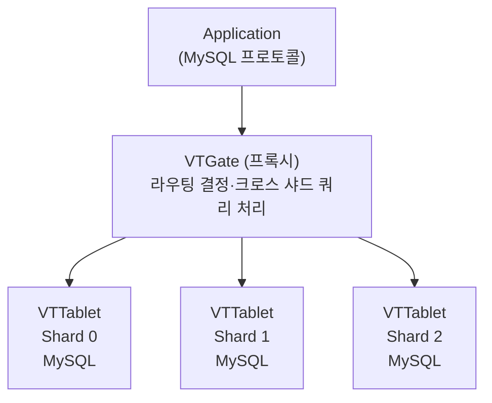

크로스 샤드 JOIN을 VTGate에서 처리하고, 온라인 스키마 변경(gh-ost 통합), Kubernetes 친화적 운영을 지원한다.

#### ProxySQL

SQL 패턴 기반으로 라우팅 규칙을 설정한다.

```sql
-- ProxySQL 라우팅 규칙 예시 (SQL 파싱)
INSERT INTO mysql_query_rules
  (rule_id, active, match_pattern, destination_hostgroup, apply)
VALUES
  (1, 1, '^SELECT.*WHERE user_id BETWEEN 1 AND 10000000', 10, 1),
  (2, 1, '^SELECT.*WHERE user_id BETWEEN 10000001 AND 20000000', 20, 1);
```

### 미들웨어 vs 애플리케이션 레벨 비교

| 항목 | 애플리케이션 레벨 | 미들웨어 (Vitess/ProxySQL) |
|------|----------------|--------------------------|
| 구현 복잡도 | 높음 | 낮음 (코드 변경 최소) |
| 유연성 | 매우 높음 | 미들웨어 기능에 종속 |
| 크로스 샤드 쿼리 | 직접 구현 | 미들웨어가 처리 |
| 성능 | 직접 최적화 가능 | 미들웨어 오버헤드 |
| 운영 복잡도 | 낮음 | 높음 (미들웨어 관리) |
| 트랜잭션 | 직접 제어 | 제한적 |

---

## 글로벌 유니크 ID 생성

샤딩 환경에서는 각 샤드가 독립적인 `AUTO_INCREMENT`를 사용하므로 ID 충돌이 발생한다. 전역적으로 유니크한 ID가 필요하다.

### Snowflake ID

Twitter가 개발한 64비트 분산 ID 생성 알고리즘이다. 앞 41비트는 밀리초 단위 타임스탬프(약 69년 사용 가능), 다음 10비트는 데이터센터+서버 식별자(최대 1024대), 마지막 12비트는 같은 밀리초 내 시퀀스 번호(최대 4096/ms)로 구성된다. DB 없이 각 서버가 독립적으로 생성할 수 있고, 시간순 정렬이 가능하며, 초당 400만 개 이상 생성 가능하다.

아래 구현에서 `synchronized`로 동시성을 보장하고, 같은 밀리초 내 시퀀스가 소진되면 다음 밀리초까지 대기하는 `waitNextMillis()`를 사용한다. 시계가 뒤로 가는(clock backwards) 경우는 예외를 던져 ID 충돌을 방지한다.

```java
// Snowflake ID 생성기 구현
@Component
public class SnowflakeIdGenerator {

    private static final long EPOCH = 1609459200000L; // 2021-01-01T00:00:00Z
    private static final long WORKER_ID_BITS  = 10L;
    private static final long SEQUENCE_BITS   = 12L;
    private static final long MAX_WORKER_ID   = ~(-1L << WORKER_ID_BITS);  // 1023
    private static final long MAX_SEQUENCE    = ~(-1L << SEQUENCE_BITS);   // 4095
    private static final long WORKER_SHIFT    = SEQUENCE_BITS;             // 12
    private static final long TIMESTAMP_SHIFT = SEQUENCE_BITS + WORKER_ID_BITS; // 22

    private final long workerId;
    private long lastTimestamp = -1L;
    private long sequence      = 0L;

    public SnowflakeIdGenerator(@Value("${app.worker-id}") long workerId) {
        if (workerId > MAX_WORKER_ID || workerId < 0) {
            throw new IllegalArgumentException("Worker ID must be between 0 and " + MAX_WORKER_ID);
        }
        this.workerId = workerId;
    }

    public synchronized long nextId() {
        long now = System.currentTimeMillis();

        if (now < lastTimestamp) {
            throw new RuntimeException("Clock moved backwards");
        }

        if (now == lastTimestamp) {
            sequence = (sequence + 1) & MAX_SEQUENCE;
            if (sequence == 0) {
                // 같은 밀리초 내 시퀀스 소진 → 다음 밀리초 대기
                now = waitNextMillis(lastTimestamp);
            }
        } else {
            sequence = 0L;
        }

        lastTimestamp = now;

        return ((now - EPOCH) << TIMESTAMP_SHIFT)
             | (workerId       << WORKER_SHIFT)
             | sequence;
    }

    private long waitNextMillis(long lastTs) {
        long ts = System.currentTimeMillis();
        while (ts <= lastTs) ts = System.currentTimeMillis();
        return ts;
    }
}
```

> **핵심**: Snowflake ID는 시간순 정렬이 가능하므로 B-Tree 인덱스에서 순차 삽입이 일어나 UUID v4 대비 인덱스 단편화가 훨씬 적다. Worker ID 관리와 NTP 시계 동기화가 전제 조건이다.

### UUID v4 vs Snowflake 비교

| 항목 | UUID v4 | Snowflake | UUID v7 |
|------|---------|-----------|---------|
| 크기 | 128비트 | 64비트 | 128비트 |
| 시간순 정렬 | 불가 | 가능 | 가능 (앞 48비트) |
| 인덱스 단편화 | 심각 | 최소 | 낮음 |
| 구현 복잡도 | 매우 낮음 | 중간 (워커ID 관리) | 낮음 |
| 라이브러리 지원 | 내장 | 직접 구현 | 증가 중 |

---

## 샤딩 vs 읽기 복제 vs 캐싱 — 의사결정 트리

성능 문제가 발생했을 때 바로 샤딩을 선택하면 안 된다. 단계별로 더 단순한 해결책을 시도해야 한다.

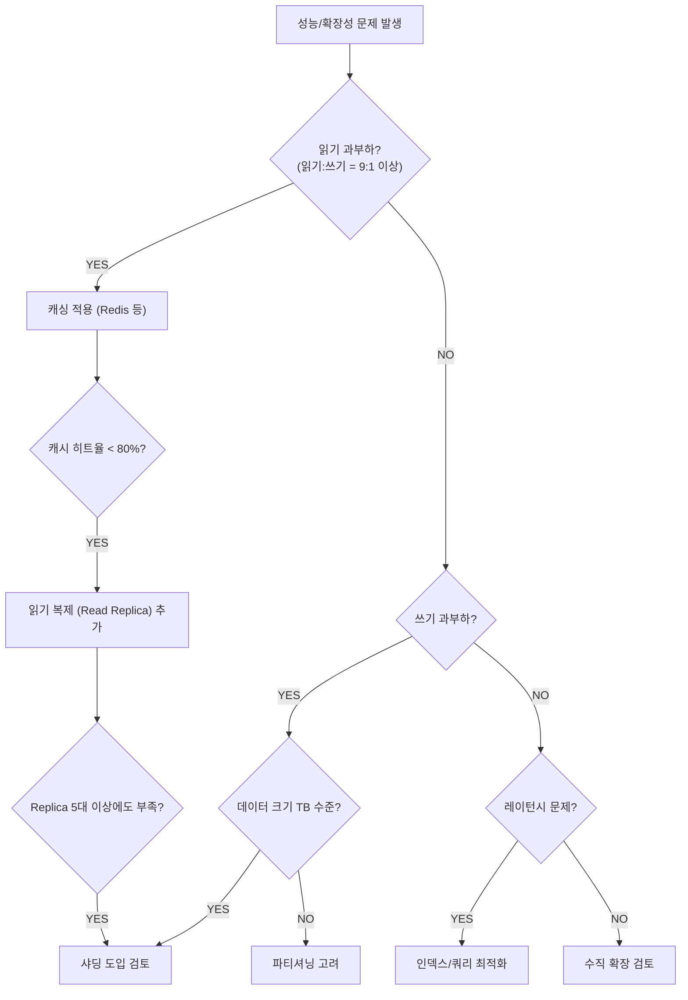

### 각 전략의 적합한 상황

| 전략 | 적합한 상황 | 구현 비용 | 일관성 |
|------|------------|---------|-------|
| 캐싱 (Redis) | 동일 데이터 반복 읽기, 갱신이 드문 경우 | 낮음 | 최종 일관성 |
| 읽기 복제 | 읽기 트래픽이 쓰기의 수 배 이상, 분석 쿼리 분리 | 낮음 | 복제 지연 허용 |
| 파티셔닝 | 시계열 데이터, 단일 서버 내 대용량 테이블 | 낮음~중간 | DB 투명 처리 |
| 샤딩 | 단일 서버 쓰기 한계, 수십 TB 이상 데이터 | 매우 높음 | 복잡한 보장 필요 |

---

## Spring 애플리케이션 샤딩 통합 예시

### AbstractRoutingDataSource 활용

Spring의 `AbstractRoutingDataSource`를 활용하면 코드 변경 없이 샤드 라우팅을 투명하게 처리할 수 있다. `ShardContextHolder`가 ThreadLocal로 현재 요청의 샤드 키를 저장하고, `determineCurrentLookupKey()`가 이를 읽어 적절한 DataSource를 선택한다. `@Sharded` AOP 어노테이션은 SpEL 표현식으로 메서드 인자에서 샤드 키를 자동 추출하므로, 서비스 레이어는 샤딩을 의식하지 않아도 된다.

```java
// 샤드 컨텍스트 홀더
public class ShardContextHolder {
    private static final ThreadLocal<Integer> SHARD_KEY = new ThreadLocal<>();

    public static void setShardKey(int shardKey) { SHARD_KEY.set(shardKey); }
    public static Integer getShardKey()          { return SHARD_KEY.get(); }
    public static void clear()                   { SHARD_KEY.remove(); }
}

// 라우팅 DataSource
@Configuration
public class ShardDataSourceConfig {

    @Bean
    public DataSource routingDataSource(
            @Qualifier("shard0") DataSource shard0,
            @Qualifier("shard1") DataSource shard1,
            @Qualifier("shard2") DataSource shard2,
            @Qualifier("shard3") DataSource shard3) {

        Map<Object, Object> targetDataSources = new HashMap<>();
        targetDataSources.put(0, shard0);
        targetDataSources.put(1, shard1);
        targetDataSources.put(2, shard2);
        targetDataSources.put(3, shard3);

        AbstractRoutingDataSource routing = new AbstractRoutingDataSource() {
            @Override
            protected Object determineCurrentLookupKey() {
                Integer shardKey = ShardContextHolder.getShardKey();
                if (shardKey == null) {
                    throw new IllegalStateException("샤드 키가 설정되지 않았습니다.");
                }
                return Math.abs(shardKey) % 4;  // 4개 샤드
            }
        };
        routing.setTargetDataSources(targetDataSources);
        routing.setDefaultTargetDataSource(shard0);
        return routing;
    }
}

// 샤딩 AOP — @Sharded 어노테이션으로 자동 샤드 선택
@Target(ElementType.METHOD)
@Retention(RetentionPolicy.RUNTIME)
public @interface Sharded {
    String keyExpression(); // SpEL 표현식
}

@Aspect
@Component
@RequiredArgsConstructor
public class ShardingAspect {

    private final ExpressionParser parser = new SpelExpressionParser();

    @Around("@annotation(sharded)")
    public Object routeToShard(ProceedingJoinPoint pjp, Sharded sharded) throws Throwable {
        // SpEL로 메서드 인자에서 샤드 키 추출
        MethodSignature sig = (MethodSignature) pjp.getSignature();
        EvaluationContext ctx = new StandardEvaluationContext();
        String[] paramNames = sig.getParameterNames();
        Object[] args = pjp.getArgs();
        for (int i = 0; i < paramNames.length; i++) {
            ctx.setVariable(paramNames[i], args[i]);
        }
        Integer shardKey = parser.parseExpression(sharded.keyExpression())
                                 .getValue(ctx, Integer.class);
        ShardContextHolder.setShardKey(shardKey);
        try {
            return pjp.proceed();
        } finally {
            ShardContextHolder.clear();
        }
    }
}

// 사용 예시
@Service
public class UserService {

    @Sharded(keyExpression = "#userId")
    public User getUser(long userId) {
        return userRepository.findById(userId);  // 자동으로 올바른 샤드에 연결
    }

    @Sharded(keyExpression = "#user.userId")
    public User createUser(User user) {
        return userRepository.save(user);
    }
}
```

> **핵심**: `finally` 블록의 `ShardContextHolder.clear()`는 반드시 실행되어야 한다. 스레드 풀에서 스레드가 재사용될 때 이전 요청의 샤드 키가 남아 있으면 잘못된 샤드에 쿼리가 실행된다.

---

<details class="extreme-scenario-details">
<summary class="extreme-scenario-summary">
<span class="extreme-scenario-icon">🔥</span>
<span class="extreme-scenario-label">극한 시나리오 — 클릭하여 펼치기</span>
<span class="extreme-scenario-toggle"></span>
</summary>
<div class="extreme-scenario-body">

<div class="extreme-scenario-content" markdown="1">

### 핫 샤드 발생 시 대응

특정 샤드의 CPU가 70%를 넘고 다른 샤드 평균의 2배 이상이면 핫 샤드로 판단한다. 단기 대응으로는 핫 샤드에 Read Replica를 추가하여 읽기 쿼리를 분산한다. 중기 대응으로는 핫 샤드를 2개로 분할하거나, Consistent Hashing이라면 해당 샤드의 가상 노드 수를 감소시킨다.

근본 원인이 **Celebrity Problem**(팔로워 1000만 명인 인플루언서의 게시물 조회 폭발)이라면 해당 사용자의 데이터를 전용 샤드에 격리하거나 CDN/캐시 레이어로 DB 부하를 차단한다. 샤드 키 선택 자체가 오류라면 재샤딩을 검토해야 한다.

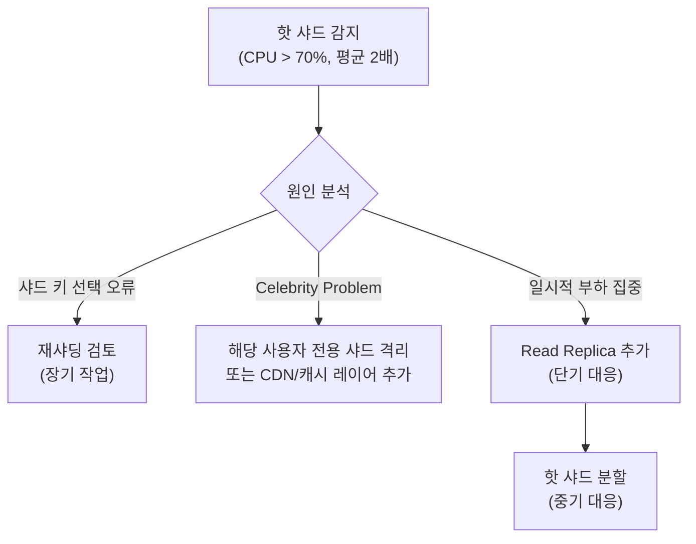

### 샤드 장애 시 가용성

각 샤드는 Primary-Replica 구성으로 고가용성을 확보한다. Primary 장애 시 MHA 또는 Orchestrator가 수 초 내에 장애를 감지하고, 자동 Failover로 Replica를 Primary로 승격하며, 라우터가 새 Primary 주소로 연결을 업데이트한다. 짧은 다운타임(수 초~수십 초) 후 정상화된다. RPO(Recovery Point Objective)는 복제 지연만큼의 데이터 손실이 가능하고, RTO(Recovery Time Objective)는 자동 Failover 기준 30초~2분이다.

### 다운타임 없는 샤드 추가 마이그레이션

샤드 4개에서 8개로 확장할 때 무중단으로 진행하는 절차다.

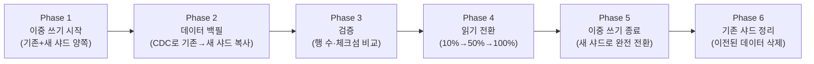

Phase 4에서 읽기 트래픽을 점진적으로(10% → 50% → 100%) 이전하므로 문제 발생 시 즉시 롤백이 가능하다.

---
</div>
</div>
</details>

## 실무에서 자주 하는 실수

### 1. 샤딩을 너무 일찍 도입

쿼리 최적화나 캐싱으로 해결 가능한 수준에서 샤딩을 도입하면 운영 복잡도만 극단적으로 늘어난다. 단일 서버가 쓰기 TPS 한계에 도달하기 전까지는 샤딩은 과잉이다.

### 2. 잘못된 샤드 키 선택

email, status, country_code처럼 카디널리티가 낮거나 특정 값에 집중되는 컬럼을 샤드 키로 선택하면 핫스팟이 불가피하다. 한번 선택한 샤드 키는 변경이 매우 어려우므로 초기 설계가 중요하다.

### 3. ShardContextHolder.clear() 누락

ThreadLocal을 사용하는 `ShardContextHolder`에서 `clear()`를 누락하면 스레드 풀에서 스레드가 재사용될 때 이전 요청의 샤드 키가 오염된다. `finally` 블록에서 반드시 호출해야 한다.

### 4. 크로스 샤드 트랜잭션을 2PC로 처리

2PC는 TC 장애 시 모든 샤드가 블로킹되는 문제가 있다. 고가용성이 중요한 서비스에서는 Saga 패턴으로 전환하고 최종 일관성을 수용하는 것이 실용적이다.

### 5. Snowflake workerId 중복 할당

여러 인스턴스에서 같은 workerId를 사용하면 같은 밀리초에 동일한 ID가 생성된다. Kubernetes Pod 번호, ZooKeeper 시퀀스, Redis 발급 등의 방법으로 workerId를 유니크하게 관리해야 한다.

---

## 정리

샤딩은 강력하지만 운영 복잡도가 극단적으로 높아지는 기법이다. 도입 전 반드시 다음 순서를 확인해야 한다.

1. **쿼리/인덱스 최적화** — 가장 먼저, 비용 없이 수십 배 성능 향상 가능
2. **캐싱** — Redis로 읽기 부하의 80~90%를 흡수
3. **읽기 복제** — 쓰기는 Primary, 읽기는 Replica로 분산
4. **파티셔닝** — 단일 서버 내 대용량 테이블 관리
5. **수직 확장** — 더 큰 서버로 교체 (한시적 해결)
6. **샤딩** — 위 모든 방법이 한계에 도달했을 때

샤딩을 선택했다면 Consistent Hashing으로 리밸런싱 비용을 최소화하고, 샤드 키를 신중하게 설계하고, 크로스 샤드 트랜잭션을 Saga 패턴으로 처리하는 것이 실무에서 검증된 조합이다.
