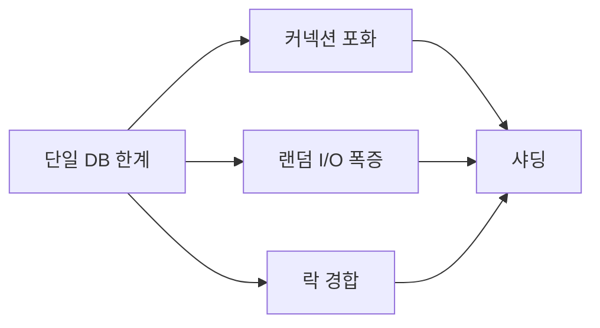
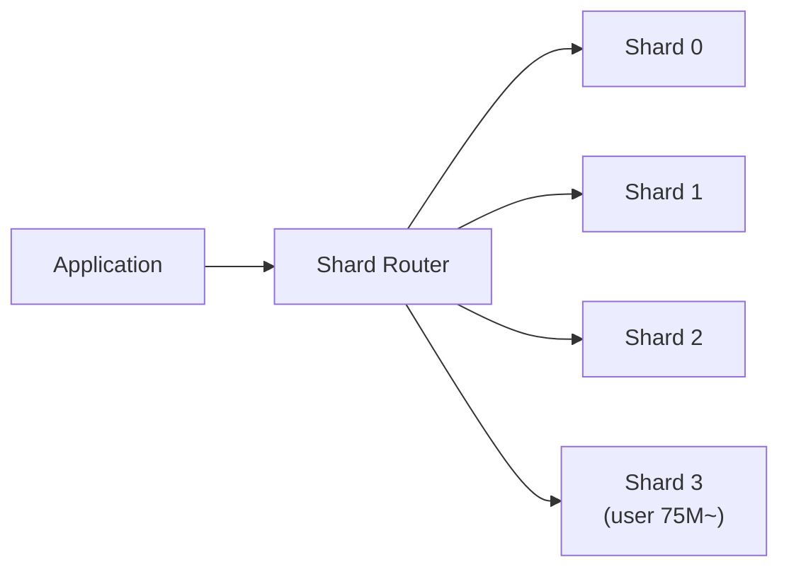
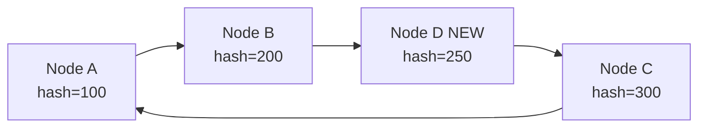
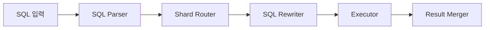
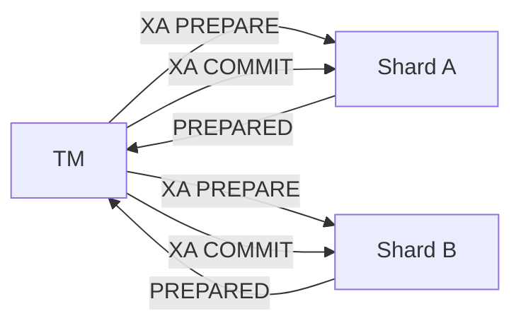
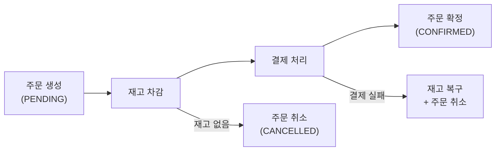
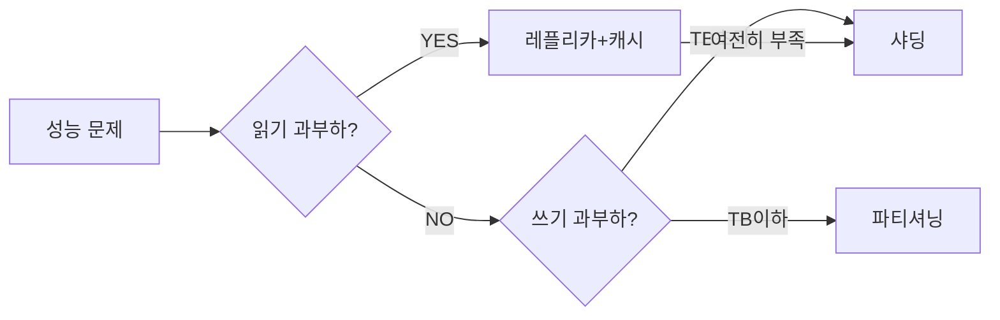

단일 MySQL 서버가 쓰기 TPS 한계에 부딪혔다. 읽기는 레플리카로 분산했지만 INSERT/UPDATE는 여전히 Primary 한 대가 감당한다. 수직 확장(더 좋은 서버)은 이미 96코어 / 384GB RAM 머신이라 더 올라갈 곳이 없다. 선택지가 샤딩밖에 남지 않은 순간, 대부분의 팀은 "샤딩이 뭔지는 알겠는데 어디서부터 시작하냐"는 막막함에 빠진다.

> **비유로 먼저 이해하기**: 샤딩은 도서관 분관 네트워크다. 본관 하나에 책이 너무 많아지면 강남 분관, 강북 분관, 인천 분관을 열어 지역별로 나눠 보관한다. 어느 분관에 가야 하는지 안내(샤드 라우팅)만 잘 되어 있으면 이용자는 불편함이 없다. 파티셔닝은 본관 내부에서 1층은 소설, 2층은 과학으로 나누는 것이고, 샤딩은 아예 건물을 여러 채로 짓는 것이다. 건물이 분리되면 엘리베이터(DB 커넥션)도, 전기(CPU)도, 창고(디스크)도 각자 독립된다.

---

## 1. 왜 단일 DB 서버는 벽에 부딪히는가

샤딩을 이해하려면 먼저 단일 서버가 왜 한계를 맞는지 내부 메커니즘부터 이해해야 한다.

### 1-1. 커넥션 한계: 파일 디스크립터와 스레드 오버헤드

MySQL은 클라이언트 커넥션마다 **전용 OS 스레드** 하나를 생성한다(기본 스레딩 모델). 스레드는 스택 메모리를 기본 1MB 예약하므로, 커넥션 10만 개 = 스레드 10만 개 = 100GB 스택만으로 메모리가 고갈된다. 여기에 컨텍스트 스위칭 오버헤드까지 더해지면 커넥션 1만 개만 넘어도 CPU가 실제 쿼리 처리보다 스케줄링에 더 많은 시간을 쓴다.

`max_connections=100000`으로 올려도 OS의 `ulimit -n` (파일 디스크립터 수)와 `vm.max_map_count` 제한을 함께 올리지 않으면 커넥션 자체가 실패한다. 결국 PgBouncer/ProxySQL 같은 커넥션 풀러로 버티다가 한계를 맞는다.

### 1-2. 버퍼 풀 한계: 데이터가 메모리를 초과하는 순간

InnoDB의 Buffer Pool은 자주 쓰는 페이지(16KB)를 메모리에 캐싱한다. 데이터가 Buffer Pool에 들어갈 때는 쿼리가 메모리 속도로 처리된다. 그런데 데이터가 Buffer Pool 크기를 초과하면 필요한 페이지를 디스크에서 읽어와야 한다.

NVMe SSD라도 순차 읽기는 7GB/s, **랜덤 읽기는 1M IOPS** 수준이다. 반면 메모리는 200GB/s를 넘는다. 랜덤 I/O가 폭증하면 레이턴시가 마이크로초에서 밀리초 단위로 치솟는다. 1TB 데이터에서 Buffer Pool이 32GB라면, 워킹 셋(실제로 자주 쓰는 데이터)이 32GB를 초과하는 순간부터 I/O 병목이 시작된다.

### 1-3. 쓰기 락 경합: InnoDB 락 아키텍처의 한계

InnoDB는 인덱스 레코드에 **행 수준 락(Row Lock)**을 건다. 다음 시나리오를 생각해보자.

- 주문 테이블에 분당 100만 건 INSERT가 발생한다.
- PK가 `AUTO_INCREMENT`라 모든 쓰기가 인덱스 B-Tree의 **맨 오른쪽 리프 페이지** 한 곳에 집중된다.
- InnoDB의 `innodb_autoinc_lock_mode=1`(기본) 상태에서 AUTO_INCREMENT 락이 INSERT마다 경합한다.
- 단일 페이지에 대한 **Page Latch** 경합이 폭증한다.

결과: CPU는 넉넉하고 디스크 여유도 있는데 TPS가 수만에서 멈춘다. 병목이 락 경합이기 때문이다. 이 문제는 서버를 아무리 키워도 근본적으로 해결되지 않는다.

### 1-4. 수직 확장의 비용 곡선

| 스펙 | 예시 가격(월) | TPS 증가 |
|------|-------------|--------|
| 8코어 64GB | $500 | 기준 |
| 32코어 256GB | $3,000 (6배) | 약 3배 |
| 96코어 768GB | $15,000 (30배) | 약 6배 |

비용은 30배 늘었지만 TPS는 6배밖에 늘지 않는다. 수직 확장은 **수익체감의 법칙**이 적용된다. 반면 샤딩은 서버 N대 추가 시 이론상 N배 TPS가 가능하다. 물론 크로스 샤드 오버헤드가 있지만, 올바르게 설계하면 거의 선형으로 스케일된다.



---

## 2. 샤딩이란 무엇인가: 파티셔닝과의 정밀 비교

### 2-1. 파티셔닝: 단일 서버 내 물리 분리

MySQL PARTITION BY RANGE는 **단일 서버 안**에서 데이터를 여러 파일로 쪼갠다. 쿼리 플래너가 파티션 프루닝(Partition Pruning)으로 불필요한 파티션을 건너뛴다. 그러나 CPU, RAM, 네트워크 인터페이스는 여전히 하나다.

```sql
CREATE TABLE orders (
    id         BIGINT NOT NULL,
    created_at DATE   NOT NULL,
    amount     DECIMAL(12,2)
)
PARTITION BY RANGE (YEAR(created_at)) (
    PARTITION p2023 VALUES LESS THAN (2024),
    PARTITION p2024 VALUES LESS THAN (2025),
    PARTITION p2025 VALUES LESS THAN (2026)
);
```

`WHERE created_at >= '2025-01-01'`이면 p2023, p2024를 스킵한다. 하지만 서버 디스크가 꽉 차거나 TPS 한계에 도달하면 파티셔닝은 무력하다.

### 2-2. 샤딩: 서버 자체를 분리

샤딩은 파티셔닝의 개념을 서버 경계 밖으로 가져간 것이다. 각 샤드(Shard)는 완전히 독립된 MySQL 인스턴스로 자체 CPU, RAM, 디스크, 커넥션 풀을 가진다.



| 항목 | 파티셔닝 | 샤딩 |
|------|---------|------|
| 분산 단위 | 단일 서버 내 파티션 | 독립 서버(샤드) |
| 확장 방향 | 스토리지/I/O 분산 | 수평 확장(CPU/RAM/디스크 모두) |
| 라우팅 주체 | DB 옵티마이저 | 앱/미들웨어 |
| 크로스 쿼리 | 옵티마이저가 처리 | 앱에서 Scatter-Gather |
| 외래키 제약 | 제한적 허용 | 사실상 불가 |
| 구현 복잡도 | 낮음 | 매우 높음 |
| 적합 상황 | 시계열/대용량 테이블 | 서버 자체 한계 돌파 |

---

## 3. 샤딩 전략: Range vs Hash vs Directory

### 3-1. Range-based Sharding: 범위 분할의 단순함과 함정

가장 직관적인 방법이다. 샤드 키의 값 범위로 샤드를 결정한다.

```
Shard 0: user_id  1 ~ 25,000,000
Shard 1: user_id  25,000,001 ~ 50,000,000
Shard 2: user_id  50,000,001 ~ 75,000,000
Shard 3: user_id  75,000,001 ~ 100,000,000
```

Java/Spring 구현:

```java
@Component
public class RangeShardRouter {

    // 각 샤드의 최소 user_id 경계
    private static final long[] SHARD_BOUNDARIES = {
        0L, 25_000_001L, 50_000_001L, 75_000_001L
    };
    private final List<DataSource> shards;

    public RangeShardRouter(List<DataSource> shards) {
        this.shards = shards;
    }

    public DataSource route(long userId) {
        // 이진 탐색으로 경계 찾기 O(log N)
        int lo = 0, hi = SHARD_BOUNDARIES.length - 1, idx = 0;
        while (lo <= hi) {
            int mid = (lo + hi) / 2;
            if (SHARD_BOUNDARIES[mid] <= userId) {
                idx = mid;
                lo = mid + 1;
            } else {
                hi = mid - 1;
            }
        }
        return shards.get(idx);
    }
}
```

**장점**: 라우팅 로직 단순, 범위 쿼리(`WHERE user_id BETWEEN 1 AND 1000`)가 단일 샤드 내에서 완결된다.

**치명적 단점 — 핫 파티션(Hot Partition) 문제**

서비스가 성장하면서 신규 가입자 user_id는 계속 증가한다. 즉, **모든 신규 쓰기가 항상 마지막 샤드에 집중**된다. user_id가 1억을 넘으면 Shard 3이 포화되고 Shard 0~2는 읽기만 처리하는 냉동 창고가 된다.

시간 기반 Range(created_at)는 더 심각하다. 오늘 날짜에 해당하는 파티션 하나가 모든 현재 쓰기를 독점한다.

**대응책**: 핫 샤드를 감지하면 해당 범위를 선제적으로 추가 분할하는 **Pre-splitting** 전략을 사용한다. MongoDB의 chunk 자동 분할이 대표적이다.

### 3-2. Hash-based Sharding: 균등 분배와 모듈러의 함정

```
shard_index = hash(user_id) % num_shards
```

해시 함수가 균등한 분포를 만들기 때문에 핫스팟이 줄어든다. 하지만 **모듈러 해싱(% N)은 노드 수 변경 시 재앙이 된다**.

샤드가 3개일 때 `hash(x) % 3 = 2`인 키가, 샤드가 4개가 되면 `hash(x) % 4 = 1`이 될 수 있다. 샤드 수가 바뀌면 **전체 데이터의 약 (N-1)/N**이 잘못된 샤드에 위치하게 되어 전체 재분배가 필요하다. 샤드 3개 → 4개: 75% 데이터가 이동해야 한다.

```java
// 단순 모듈러 — 노드 추가 시 75% 재배치 발생
public int simpleHash(long userId, int numShards) {
    return (int) (Math.abs(userId) % numShards);
}

// 문제: numShards가 3→4로 바뀌면
// hash(1000) % 3 = 1 → hash(1000) % 4 = 0  // 다른 샤드!
// hash(2000) % 3 = 2 → hash(2000) % 4 = 3  // 다른 샤드!
// hash(3000) % 3 = 0 → hash(3000) % 4 = 0  // 같은 샤드 (운 좋음)
```

이 문제를 근본적으로 해결하는 것이 **Consistent Hashing**이다.

### 3-3. Consistent Hashing: 최소 재배치의 수학적 원리

#### 해시 링의 구조

Consistent Hashing은 해시 공간을 0 ~ 2^32-1의 **원형 링**으로 표현한다. 각 샤드 노드를 해시하여 링 위의 점에 배치한다. 각 키도 해시하여 링 위에 배치한 뒤, **시계 방향으로 가장 가까운 노드**에 배정된다.

```
링 위 배치 (0 ~ 2^32-1, 시계방향):
  0 ────── Node A (hash=100) ────── Node B (hash=200) ────── Node C (hash=300) ────── 2^32
         ↑                       ↑                         ↑
      Key X(hash=50)          Key Y(hash=150)          Key Z(hash=250)
       → Node A               → Node B                  → Node C
```

#### 노드 추가 시 이동량

Node A, B, C가 있을 때 Node D를 B와 C 사이(hash=250)에 추가하면:

- Node C의 책임 범위 `(200, 300]`에서 `(200, 250]`이 Node D로 넘어간다.
- 이동하는 데이터: **전체의 1/N** (N=4이면 25%)
- 단순 모듈러 해싱의 75%와 비교하면 압도적 차이



#### 가상 노드(Virtual Node)의 역할

노드가 3~5개일 때 링 위의 배치가 불균등하면 특정 노드가 전체 데이터의 40~50%를 담당하는 불균형이 생긴다. **가상 노드(VNode)**는 이 문제를 해결한다.

실제 노드 3개(N0, N1, N2)에 각각 100개의 가상 노드를 할당한다. 링 위에는 300개의 점이 분산 배치되고, 각 점은 실제 노드로 매핑된다. 300개가 고르게 분포하면 각 노드의 데이터 점유율은 약 33%로 수렴한다.

추가로 고성능 서버에는 VNode 200개, 저성능 서버에는 VNode 100개를 배정하면 **성능에 비례한 부하 분산**도 가능하다.

```java
import java.util.SortedMap;
import java.util.TreeMap;
import java.security.MessageDigest;

@Component
public class ConsistentHashRouter {

    private final SortedMap<Long, DataSource> ring = new TreeMap<>();
    private static final int VIRTUAL_NODES = 150;

    public ConsistentHashRouter(List<DataSource> nodes) {
        for (int i = 0; i < nodes.size(); i++) {
            DataSource node = nodes.get(i);
            for (int v = 0; v < VIRTUAL_NODES; v++) {
                long hash = md5Hash("node-" + i + "-vnode-" + v);
                ring.put(hash, node);
            }
        }
    }

    public DataSource route(long key) {
        if (ring.isEmpty()) throw new IllegalStateException("No shards available");
        long hash = md5Hash(String.valueOf(key));
        // 해당 해시값 이상의 첫 번째 노드(시계방향)
        SortedMap<Long, DataSource> tail = ring.tailMap(hash);
        // tail이 비어있으면 링을 한 바퀴 돌아 첫 번째 노드
        long nodeHash = tail.isEmpty() ? ring.firstKey() : tail.firstKey();
        return ring.get(nodeHash);
    }

    private long md5Hash(String input) {
        try {
            MessageDigest md = MessageDigest.getInstance("MD5");
            byte[] digest = md.digest(input.getBytes());
            // 앞 8바이트를 long으로 변환
            long hash = 0;
            for (int i = 0; i < 8; i++) {
                hash = (hash << 8) | (digest[i] & 0xFF);
            }
            return hash;
        } catch (Exception e) {
            throw new RuntimeException(e);
        }
    }

    // 노드 추가 — 기존 데이터의 1/N만 이동 필요
    public void addNode(DataSource node, int nodeIndex) {
        for (int v = 0; v < VIRTUAL_NODES; v++) {
            long hash = md5Hash("node-" + nodeIndex + "-vnode-" + v);
            ring.put(hash, node);
        }
        // ring에 추가된 후, 새 노드가 담당할 범위의 데이터를 기존 노드에서 마이그레이션
    }
}
```

### 3-4. Directory-based Sharding: 완전한 유연성, SPOF 위험

별도의 **라우팅 테이블(Shard Directory)**에 각 키가 어느 샤드에 있는지 직접 기록한다. 해시 함수 없이 임의 배치가 가능하다.

```sql
-- 라우팅 테이블 예시
CREATE TABLE shard_directory (
    tenant_id    BIGINT PRIMARY KEY,
    shard_id     TINYINT NOT NULL,
    shard_host   VARCHAR(64),
    migrating_to TINYINT NULL  -- 마이그레이션 중인 목적지 샤드
);

INSERT INTO shard_directory VALUES
    (1001, 0, 'shard0.db.internal', NULL),   -- 일반 사용자
    (9999, 4, 'shard4-vip.db.internal', NULL), -- VIP 전용 샤드
    (8888, 5, 'shard5-corp.db.internal', NULL); -- 기업 전용 샤드
```

```java
@Component
@RequiredArgsConstructor
public class DirectoryShardRouter {

    private final JdbcTemplate directoryDb;
    // 로컬 캐시: 매 요청마다 DB 조회 방지
    private final LoadingCache<Long, ShardInfo> cache = Caffeine.newBuilder()
        .maximumSize(100_000)
        .expireAfterWrite(5, TimeUnit.MINUTES)
        .build(this::loadShardInfo);

    public DataSource route(long tenantId) {
        ShardInfo info = cache.get(tenantId);
        return resolveDataSource(info.shardHost());
    }

    private ShardInfo loadShardInfo(long tenantId) {
        return directoryDb.queryForObject(
            "SELECT shard_id, shard_host FROM shard_directory WHERE tenant_id = ?",
            (rs, n) -> new ShardInfo(rs.getInt("shard_id"), rs.getString("shard_host")),
            tenantId
        );
    }
}
```

**장점**: VIP/기업 테넌트를 전용 샤드에 배치하는 등 완전한 커스텀 배치, 마이그레이션 중 `migrating_to` 컬럼으로 점진적 전환 가능.

**단점**: 라우팅 테이블 서비스가 **SPOF(Single Point of Failure)**가 된다. 캐시를 통해 조회 레이턴시를 줄이더라도 캐시 미스 시 DB 조회가 발생한다. 라우팅 서비스 자체를 Active-Active HA 구성해야 한다.

---

## 4. 샤드 키 설계: 가장 중요한 결정

샤드 키 선택은 샤딩의 성패를 가르는 **돌이킬 수 없는 결정**이다. 잘못 선택하면 전체 재샤딩이라는 수백만 달러짜리 마이그레이션 프로젝트가 기다린다.

### 4-1. 좋은 샤드 키의 5가지 조건

**① 높은 카디널리티(Cardinality)**

값의 종류가 많아야 균등 분배가 가능하다. `gender`(M/F/기타 = 3가지)는 샤드 3개 이상을 만들 수 없다. `user_id`는 수천만~수억 가지다.

```
gender    → 카디널리티 3   → 샤드 키로 사용 불가
country   → 카디널리티 ~200  → 한국에 90% 집중되면 hot shard
email     → 카디널리티 매우 높음, but 쿼리에 거의 안 씀 → 비효율
user_id   → 카디널리티 수억, 균등 분포 → 이상적
```

**② 균등한 데이터 분포**

카디널리티가 높아도 값이 편향되면 핫스팟이 생긴다. `created_at`은 최근 날짜에 쓰기가 몰린다. `user_id`는 순서대로 생성되므로 range sharding 시 마지막 샤드에 몰린다. `hash(user_id)`는 균등 분포를 강제한다.

**③ 쿼리 패턴과의 정합성**

쿼리의 WHERE 조건에 샤드 키가 없으면 모든 샤드를 Scatter-Gather해야 한다. 애플리케이션에서 가장 많이 실행되는 쿼리를 분석하고, 그 WHERE 조건에 포함된 컬럼을 샤드 키로 선택한다.

```sql
-- 이 쿼리가 90%라면 → user_id가 샤드 키여야 한다
SELECT * FROM orders WHERE user_id = ?

-- 이 쿼리가 90%라면 → tenant_id가 샤드 키여야 한다
SELECT * FROM orders WHERE tenant_id = ? AND created_at >= ?
```

**④ 불변성(Immutability)**

샤드 키 값이 변경되면 데이터를 새 샤드로 이동해야 한다. 실시간 서비스에서 이는 사실상 불가능에 가깝다. `email`은 사용자가 변경할 수 있다. `user_id`는 한번 발급하면 변경하지 않는다.

**⑤ 조인 지역성(Join Locality)**

자주 함께 조회되는 테이블은 같은 샤드 키로 샤딩해야 한다. `orders`와 `order_items` 모두 `customer_id`로 샤딩하면, 특정 고객의 주문과 주문 상품이 항상 같은 샤드에 존재한다.

```java
// 올바른 설계: customer_id로 orders와 order_items를 같이 샤딩
// → 두 테이블이 항상 같은 샤드 → 로컬 JOIN 가능
DataSource shard = router.route(customerId);
JdbcTemplate jdbcTemplate = new JdbcTemplate(shard);
List<OrderDetail> result = jdbcTemplate.query(
    """
    SELECT o.id, o.amount, oi.product_id, oi.quantity
    FROM orders o
    JOIN order_items oi ON o.id = oi.order_id
    WHERE o.customer_id = ?
    """,
    ORDER_DETAIL_ROW_MAPPER, customerId
);
```

### 4-2. 핫스팟(Hot Spot) 발생 메커니즘

**Celebrity Problem**: 팔로워 1000만 명인 인플루언서가 게시물을 올리면 조회 트래픽이 해당 user_id 샤드에 폭발적으로 집중된다. user_id 기반 해시 샤딩을 사용해도 특정 유명인 user_id가 항상 같은 샤드로 라우팅되므로 그 샤드만 과부하가 된다.

대응책:
1. 해당 사용자 데이터를 전용 격리 샤드로 이동 (Directory-based sharding)
2. 핫 데이터를 CDN/Redis로 오프로드하여 DB 접근 자체를 차단
3. 샤드 키에 랜덤 접미사 추가(`user_id + "_" + random(0,9)`)로 물리적 분산 — 단, 조회 시 10개 샤드 모두 조회 필요

---

## 5. 크로스 샤드 쿼리: Scatter-Gather와 비정규화

### 5-1. 왜 샤드 간 JOIN이 불가능한가

단일 DB의 JOIN은 DB 엔진이 두 테이블 데이터를 같은 메모리 공간에서 처리하므로 네트워크 오버헤드가 없다. 샤딩 환경에서 `users` 테이블이 user_id 기반 샤딩, `products` 테이블이 product_id 기반 샤딩이면, 두 테이블의 데이터는 **서로 다른 서버에 존재**한다. 네트워크를 통해 한쪽 결과를 가져와 메모리에서 조인해야 한다.

데이터 규모가 크면 이 네트워크 전송 비용이 엄청나다. 10만 명의 user 데이터를 Shard 0에서 Shard 1로 전송해서 JOIN하는 것은 실시간 서비스에서는 불가능하다.

### 5-2. Scatter-Gather 패턴

모든 샤드에 병렬로 쿼리를 날리고, 결과를 애플리케이션에서 병합한다. 핵심은 **병렬 실행**이다. 순차적으로 N개 샤드를 조회하면 레이턴시가 N배지만, 병렬이면 가장 느린 샤드의 응답 시간에 수렴한다.

```java
@Service
@RequiredArgsConstructor
public class ScatterGatherService {

    private final List<DataSource> shards;
    private final ExecutorService executor =
        Executors.newFixedThreadPool(Runtime.getRuntime().availableProcessors() * 2);

    // 전체 사용자 수 집계
    public long getTotalUserCount() {
        List<CompletableFuture<Long>> futures = shards.stream()
            .map(shard -> CompletableFuture.supplyAsync(() -> {
                try (Connection conn = shard.getConnection();
                     PreparedStatement ps = conn.prepareStatement(
                         "SELECT COUNT(*) FROM users")) {
                    ResultSet rs = ps.executeQuery();
                    rs.next();
                    return rs.getLong(1);
                } catch (SQLException e) {
                    throw new RuntimeException("Shard query failed", e);
                }
            }, executor))
            .toList();

        return futures.stream()
            .mapToLong(f -> {
                try { return f.get(3, TimeUnit.SECONDS); }
                catch (Exception e) { throw new RuntimeException("Scatter-gather timeout", e); }
            })
            .sum();
    }

    // 크로스 샤드 페이지네이션 — 각 샤드에서 TOP K 가져와 머지 후 전체 TOP K
    public List<Order> getTopOrdersByAmount(int topK) {
        List<CompletableFuture<List<Order>>> futures = shards.stream()
            .map(shard -> CompletableFuture.supplyAsync(() ->
                queryTopOrders(shard, topK), executor))
            .toList();

        return futures.stream()
            .flatMap(f -> {
                try { return f.get(3, TimeUnit.SECONDS).stream(); }
                catch (Exception e) { throw new RuntimeException(e); }
            })
            // 전체 결과를 금액 역순 정렬 후 상위 K개
            .sorted(Comparator.comparing(Order::getAmount).reversed())
            .limit(topK)
            .toList();
    }
}
```

> **주의**: 크로스 샤드 페이지네이션은 오프셋이 커질수록 비효율적이다. `LIMIT 100 OFFSET 10000`이면 모든 샤드에서 10100건을 가져와 머지 후 100건만 쓴다. 커서 기반 페이지네이션으로 전환하거나, 검색 쿼리는 Elasticsearch로 분리하는 것이 실무 패턴이다.

### 5-3. 비정규화 전략: 데이터 중복을 의도적으로 허용

크로스 샤드 JOIN을 없애는 가장 확실한 방법은 **필요한 데이터를 같은 테이블에 중복 저장**하는 것이다.

```java
// 정규화된 설계 → 크로스 샤드 JOIN 필요
// orders 테이블: user_id 기반 샤딩
// users 테이블: user_id 기반 샤딩 (같은 샤드라 다행)
// 하지만 products: product_id 기반 샤딩 (다른 샤드!)

// 비정규화: orders에 필요한 product 정보를 중복 저장
@Entity
@Table(name = "orders")
public class Order {
    @Id
    private Long id;
    private Long customerId;    // 샤드 키

    // 비정규화: product 정보 중복 저장 → JOIN 불필요
    private Long productId;
    private String productName;   // products 테이블에서 복사
    private String productSku;    // products 테이블에서 복사
    private BigDecimal unitPrice; // 주문 시점 가격 (변경 불가)

    private Integer quantity;
    private BigDecimal totalAmount;
}
```

products.productName이 변경되면 이미 생성된 orders의 productName은 업데이트하지 않는 것이 원칙이다. 주문 시점의 상품명/가격을 보존해야 하는 비즈니스 요건과도 일치한다.

### 5-4. 글로벌 테이블(Global/Broadcast Table)

조회는 빈번하지만 변경이 드문 소규모 참조 데이터는 **모든 샤드에 동일하게 복제**한다. 국가 코드, 카테고리, 통화 환율 같은 데이터가 대상이다.

```java
@Service
@RequiredArgsConstructor
public class GlobalTableSyncService {

    private final List<DataSource> allShards;

    // 글로벌 테이블 변경 시 모든 샤드에 동기 반영
    @Transactional
    public void updateCategory(Category category) {
        // 모든 샤드에 동일한 UPDATE 실행
        allShards.parallelStream().forEach(shard -> {
            new JdbcTemplate(shard).update(
                "INSERT INTO categories (id, name, parent_id) VALUES (?, ?, ?) " +
                "ON DUPLICATE KEY UPDATE name = ?, parent_id = ?",
                category.getId(), category.getName(), category.getParentId(),
                category.getName(), category.getParentId()
            );
        });
    }
}
```

ShardingSphere에서는 이를 **브로드캐스트 테이블(Broadcast Table)**로 설정하면 자동 복제된다.

```yaml
# ShardingSphere broadcast table 설정
spring:
  shardingsphere:
    rules:
      sharding:
        broadcast-tables:
          - categories
          - country_codes
          - currencies
```

---

## 6. 분산 ID 생성: Snowflake, UUID v7, 시퀀스 서비스

샤딩 환경에서 각 샤드가 독립적인 `AUTO_INCREMENT`를 사용하면 Shard 0의 user_id=1과 Shard 1의 user_id=1이 충돌한다. 전역 유니크 ID 생성 전략이 필수다.

### 6-1. Snowflake 알고리즘: 내부 구조 완전 해부

Twitter가 2010년에 발표한 64비트 분산 ID 생성 알고리즘이다.

```
63        22 21      12 11         0
┌──────────┬───────────┬────────────┐
│timestamp │ machine ID│  sequence  │
│ 41 bits  │  10 bits  │  12 bits   │
└──────────┴───────────┴────────────┘
```

- **Timestamp (41비트)**: `currentTimeMillis - EPOCH`. 2^41ms ≈ 69년. EPOCH를 서비스 시작일로 설정하면 2090년대까지 사용 가능.
- **Machine ID (10비트)**: 데이터센터(5비트) + 서버(5비트). 최대 1024개 노드.
- **Sequence (12비트)**: 같은 밀리초 내 순번. 최대 4096/ms. 초당 409만 6천 개.

```java
@Component
public class SnowflakeIdGenerator {

    // 2024-01-01T00:00:00Z 를 기준 에포크로 사용
    private static final long EPOCH           = 1704067200000L;
    private static final long WORKER_BITS     = 10L;
    private static final long SEQUENCE_BITS   = 12L;

    private static final long MAX_WORKER_ID   = ~(-1L << WORKER_BITS);   // 1023
    private static final long MAX_SEQUENCE    = ~(-1L << SEQUENCE_BITS); // 4095

    private static final long WORKER_SHIFT    = SEQUENCE_BITS;                  // 12
    private static final long TIMESTAMP_SHIFT = SEQUENCE_BITS + WORKER_BITS;    // 22

    private final long workerId;
    private long lastTimestamp = -1L;
    private long sequence      = 0L;

    public SnowflakeIdGenerator(@Value("${app.snowflake.worker-id}") long workerId) {
        if (workerId < 0 || workerId > MAX_WORKER_ID) {
            throw new IllegalArgumentException(
                "Worker ID must be between 0 and " + MAX_WORKER_ID + ", got: " + workerId);
        }
        this.workerId = workerId;
    }

    public synchronized long nextId() {
        long now = currentTimeMillis();

        // NTP 시계 역행 감지 — ID 중복 방지
        if (now < lastTimestamp) {
            long drift = lastTimestamp - now;
            if (drift <= 5) {
                // 5ms 이하의 역행은 대기로 해결
                now = waitUntil(lastTimestamp);
            } else {
                // 5ms 초과 역행은 장애 신호 — 즉시 실패
                throw new ClockMovedBackwardsException(
                    "Clock moved backwards by " + drift + "ms. lastTs=" + lastTimestamp);
            }
        }

        if (now == lastTimestamp) {
            sequence = (sequence + 1) & MAX_SEQUENCE;
            if (sequence == 0) {
                // 같은 밀리초에 4096개 모두 소진 → 다음 밀리초 대기
                now = waitUntil(lastTimestamp);
            }
        } else {
            // 새 밀리초 시작 → 시퀀스 리셋
            sequence = 0L;
        }

        lastTimestamp = now;

        return ((now - EPOCH)  << TIMESTAMP_SHIFT)
             | (workerId       << WORKER_SHIFT)
             | sequence;
    }

    private long waitUntil(long target) {
        long current = currentTimeMillis();
        while (current <= target) {
            current = currentTimeMillis();
        }
        return current;
    }

    protected long currentTimeMillis() {
        return System.currentTimeMillis();
    }
}
```

**Worker ID 관리가 핵심 위험 요소다.** 여러 인스턴스가 동일한 Worker ID를 사용하면, 같은 밀리초에 동일한 ID가 생성된다. Kubernetes 환경에서 해결책:

```java
@Configuration
public class SnowflakeConfig {

    @Bean
    public SnowflakeIdGenerator snowflakeIdGenerator(
            @Value("${HOSTNAME:pod-0}") String hostname) {
        // Pod hostname이 "orders-deployment-7d8f9b-pod-3" 형태일 때
        // 마지막 숫자를 worker ID로 사용 (단순한 경우)
        // 실제 운영에서는 Redis나 ZooKeeper로 워커 ID를 원자적으로 발급
        long workerId = acquireWorkerIdFromRedis(hostname);
        return new SnowflakeIdGenerator(workerId);
    }

    private long acquireWorkerIdFromRedis(String hostname) {
        // Redis INCR으로 원자적 발급, TTL 설정으로 인스턴스 종료 시 반환
        // SET worker:hostname hostname NX EX 3600
        // INCR global:worker:counter → 워커 ID로 사용
        throw new UnsupportedOperationException("Redis worker ID registry 구현 필요");
    }
}
```

### 6-2. UUID v7: 시간 정렬 가능한 UUID

UUID v4는 완전 랜덤이라 B-Tree 인덱스에서 **페이지 단편화(Page Fragmentation)**를 유발한다. 랜덤 INSERT는 B-Tree의 임의 위치에 삽입되므로 기존 페이지를 분리(Page Split)하는 일이 잦다.

UUID v7은 앞 48비트가 밀리초 타임스탬프다. 시간순으로 생성되므로 B-Tree의 **오른쪽 끝에 순차 삽입**된다. Page Split이 최소화되고 인덱스 단편화가 크게 줄어든다.

```java
// Java 21+ UUID v7 구현 예시 (java.util.UUID는 v4까지만 지원)
// 외부 라이브러리 없이 직접 구현
public class UuidV7 {

    private static long lastMs = 0;
    private static int seqHi  = 0; // 12비트 시퀀스 상위
    private static int seqLo  = 0; // 62비트 시퀀스 하위

    public static synchronized UUID generate() {
        long ms = System.currentTimeMillis();

        if (ms > lastMs) {
            lastMs = ms;
            seqHi  = 0;
            seqLo  = 0;
        } else {
            // 같은 밀리초 내 시퀀스 증가
            seqLo++;
            if (seqLo > 0x3FFF) { // 14비트 소진
                seqLo = 0;
                seqHi++;
            }
        }

        // 128비트 UUID v7 구성
        // bits 0-47  : timestamp (48비트)
        // bits 48-51 : version=7 (4비트)
        // bits 52-63 : seq_hi (12비트)
        // bits 64-65 : variant=10 (2비트)
        // bits 66-127: seq_lo (62비트, 나머지는 랜덤)
        long msb = (ms << 16) | (0x7000L) | (seqHi & 0x0FFF);
        long lsb = (0x8000_0000_0000_0000L) | ((long) seqLo << 48)
                 | (ThreadLocalRandom.current().nextLong() & 0x0000_FFFF_FFFF_FFFFL);

        return new UUID(msb, lsb);
    }
}
```

### 6-3. ID 생성 방식 비교

| 방식 | 크기 | 시간 정렬 | 인덱스 단편화 | 구현 복잡도 | 초당 생성량 |
|------|------|---------|------------|-----------|-----------|
| AUTO_INCREMENT | 8B | 가능(단일 서버) | 최소 | 없음 | DB 한계 |
| UUID v4 | 16B | 불가 | 심각 | 없음 | 무제한 |
| UUID v7 | 16B | 가능 | 낮음 | 낮음 | 무제한 |
| Snowflake | 8B | 가능 | 최소 | 중간 | 409만/초/노드 |
| DB Sequence 서비스 | 8B | 가능 | 최소 | 높음 | DB 한계 |

---

## 7. ShardingSphere: SQL 파이프라인 내부 동작

Apache ShardingSphere는 Java 애플리케이션의 DataSource를 가로채 투명하게 샤딩을 처리하는 미들웨어다. 애플리케이션은 단일 DataSource를 사용하는 것처럼 코드를 작성하고, ShardingSphere가 내부적으로 SQL을 분석하여 올바른 샤드로 라우팅한다.

### 7-1. SQL 처리 파이프라인



**① SQL Parser**: SQL 문자열을 AST(Abstract Syntax Tree)로 파싱한다. WHERE 절에서 샤드 키 조건을 추출한다.

```sql
-- 입력 SQL
SELECT * FROM orders WHERE customer_id = 12345 AND status = 'PAID'
-- Parser가 추출: customer_id = 12345 → 샤드 키 값 확인
```

**② Shard Router**: 샤딩 규칙과 샤드 키 값으로 대상 샤드를 결정한다.

```
customer_id = 12345
hash(12345) % 4 = 1
→ 라우팅 대상: Shard 1
```

**③ SQL Rewriter**: 실제 샤드의 테이블명으로 SQL을 재작성한다.

```sql
-- 재작성된 SQL (ShardingSphere 내부)
SELECT * FROM orders_1 WHERE customer_id = 12345 AND status = 'PAID'
--                  ↑ 샤드 1의 물리 테이블명
```

**④ Executor**: 대상 샤드에 병렬로 SQL을 실행한다. 크로스 샤드 쿼리라면 여러 샤드에 동시 실행한다.

**⑤ Result Merger**: 각 샤드의 결과를 병합한다. ORDER BY가 있으면 각 샤드의 정렬된 결과를 머지소트로 합친다. GROUP BY는 집계를 재계산한다. LIMIT는 각 샤드에서 `LIMIT offset+count`를 실행한 후 최종 슬라이싱한다.

### 7-2. ShardingSphere 설정 (Spring Boot)

```yaml
spring:
  datasource:
    driver-class-name: org.apache.shardingsphere.driver.ShardingSphereDriver
    url: jdbc:shardingsphere:classpath:shardingsphere.yaml

# shardingsphere.yaml
mode:
  type: Standalone

dataSources:
  shard0:
    dataSourceClassName: com.zaxxer.hikari.HikariDataSource
    jdbcUrl: jdbc:mysql://shard0.db.internal:3306/appdb
    username: app
    password: ${DB_PASSWORD}
  shard1:
    dataSourceClassName: com.zaxxer.hikari.HikariDataSource
    jdbcUrl: jdbc:mysql://shard1.db.internal:3306/appdb
    username: app
    password: ${DB_PASSWORD}
  shard2:
    dataSourceClassName: com.zaxxer.hikari.HikariDataSource
    jdbcUrl: jdbc:mysql://shard2.db.internal:3306/appdb
    username: app
    password: ${DB_PASSWORD}
  shard3:
    dataSourceClassName: com.zaxxer.hikari.HikariDataSource
    jdbcUrl: jdbc:mysql://shard3.db.internal:3306/appdb
    username: app
    password: ${DB_PASSWORD}

rules:
  - !SHARDING
    tables:
      orders:
        actualDataNodes: shard${0..3}.orders_${0..3}
        tableStrategy:
          standard:
            shardingColumn: customer_id
            shardingAlgorithmName: orders_hash_mod
        keyGenerateStrategy:
          column: id
          keyGeneratorName: snowflake
      order_items:
        actualDataNodes: shard${0..3}.order_items_${0..3}
        tableStrategy:
          standard:
            shardingColumn: customer_id  # orders와 동일한 샤드 키 → 로컬 JOIN 가능
            shardingAlgorithmName: orders_hash_mod

    # 브로드캐스트 테이블: 모든 샤드에 복제
    broadcastTables:
      - categories
      - country_codes

    shardingAlgorithms:
      orders_hash_mod:
        type: HASH_MOD
        props:
          sharding-count: 4

    keyGenerators:
      snowflake:
        type: SNOWFLAKE
        props:
          worker-id: ${WORKER_ID:0}
```

### 7-3. 실제 사용 예시 (코드 변경 없음)

```java
// ShardingSphere 적용 후 코드 — 단일 DB처럼 사용
@Repository
@RequiredArgsConstructor
public class OrderRepository {

    private final JdbcTemplate jdbcTemplate; // ShardingSphere DataSource 주입됨

    public Order findById(long orderId, long customerId) {
        // ShardingSphere가 customer_id를 보고 자동으로 올바른 샤드에 라우팅
        return jdbcTemplate.queryForObject(
            "SELECT * FROM orders WHERE id = ? AND customer_id = ?",
            ORDER_ROW_MAPPER, orderId, customerId
        );
    }

    // 크로스 샤드 쿼리 — ShardingSphere가 자동으로 Scatter-Gather
    public long countAllOrders() {
        // ShardingSphere가 모든 샤드에 COUNT 실행 후 합산
        return jdbcTemplate.queryForObject(
            "SELECT COUNT(*) FROM orders", Long.class
        );
    }

    // 같은 샤드의 두 테이블 JOIN — customer_id 동일 샤드 키라 로컬 JOIN
    public List<OrderDetail> findOrderWithItems(long customerId, long orderId) {
        return jdbcTemplate.query(
            """
            SELECT o.id, o.amount, oi.product_id, oi.quantity
            FROM orders o JOIN order_items oi ON o.id = oi.order_id
            WHERE o.customer_id = ? AND o.id = ?
            """,
            ORDER_DETAIL_ROW_MAPPER, customerId, orderId
        );
    }
}
```

---

## 8. AbstractRoutingDataSource: Spring 네이티브 샤딩

ShardingSphere 없이 Spring 기본 기능만으로 샤딩을 구현하려면 `AbstractRoutingDataSource`를 활용한다.

### 8-1. 전체 구현

```java
// 1) 샤드 컨텍스트 — ThreadLocal로 현재 스레드의 샤드 키 저장
public class ShardContext {

    private static final ThreadLocal<Integer> SHARD_INDEX = new InheritableThreadLocal<>();

    public static void set(int shardIndex)  { SHARD_INDEX.set(shardIndex); }
    public static Integer get()             { return SHARD_INDEX.get(); }
    public static void clear()              { SHARD_INDEX.remove(); }
}

// 2) 라우팅 DataSource
public class ShardingDataSource extends AbstractRoutingDataSource {

    private final int shardCount;

    public ShardingDataSource(Map<Object, Object> targetDataSources, int shardCount) {
        this.shardCount = shardCount;
        setTargetDataSources(targetDataSources);
        afterPropertiesSet();
    }

    @Override
    protected Object determineCurrentLookupKey() {
        Integer shardIndex = ShardContext.get();
        if (shardIndex == null) {
            // 샤드 키 없으면 기본 샤드 0 사용 (글로벌 테이블 읽기 등)
            return 0;
        }
        return shardIndex;
    }
}

// 3) DataSource 빈 구성
@Configuration
public class ShardDataSourceConfig {

    private static final int SHARD_COUNT = 4;

    @Bean
    @Primary
    public DataSource shardingDataSource(
            @Qualifier("ds0") DataSource ds0,
            @Qualifier("ds1") DataSource ds1,
            @Qualifier("ds2") DataSource ds2,
            @Qualifier("ds3") DataSource ds3) {

        Map<Object, Object> targets = new LinkedHashMap<>();
        targets.put(0, ds0);
        targets.put(1, ds1);
        targets.put(2, ds2);
        targets.put(3, ds3);

        return new ShardingDataSource(targets, SHARD_COUNT);
    }

    @Bean("ds0")
    public DataSource dataSource0() {
        HikariConfig config = new HikariConfig();
        config.setJdbcUrl("jdbc:mysql://shard0.db.internal:3306/appdb");
        config.setMaximumPoolSize(20);
        return new HikariDataSource(config);
    }
    // ds1, ds2, ds3 동일 패턴...
}

// 4) 샤드 라우팅 유틸
@Component
public class ShardResolver {

    private static final int SHARD_COUNT = 4;

    public int resolveIndex(long shardKey) {
        return (int) (Math.abs(shardKey) % SHARD_COUNT);
    }

    public void setContext(long shardKey) {
        ShardContext.set(resolveIndex(shardKey));
    }
}

// 5) AOP: @ShardedBy 어노테이션으로 자동 라우팅
@Target(ElementType.METHOD)
@Retention(RetentionPolicy.RUNTIME)
public @interface ShardedBy {
    String value(); // SpEL: "#userId", "#order.customerId"
}

@Aspect
@Component
@RequiredArgsConstructor
public class ShardRoutingAspect {

    private final ShardResolver shardResolver;
    private final ExpressionParser parser = new SpelExpressionParser();

    @Around("@annotation(shardedBy)")
    public Object around(ProceedingJoinPoint pjp, ShardedBy shardedBy) throws Throwable {
        long shardKey = extractShardKey(pjp, shardedBy.value());
        shardResolver.setContext(shardKey);
        try {
            return pjp.proceed();
        } finally {
            ShardContext.clear(); // 반드시 클리어 — 스레드 풀 오염 방지
        }
    }

    private long extractShardKey(ProceedingJoinPoint pjp, String expression) {
        MethodSignature sig = (MethodSignature) pjp.getSignature();
        StandardEvaluationContext ctx = new StandardEvaluationContext();
        String[] names = sig.getParameterNames();
        Object[] args  = pjp.getArgs();
        for (int i = 0; i < names.length; i++) ctx.setVariable(names[i], args[i]);
        return parser.parseExpression(expression).getValue(ctx, Long.class);
    }
}

// 6) 서비스 레이어 — 샤딩을 전혀 의식하지 않음
@Service
@RequiredArgsConstructor
public class OrderService {

    private final OrderRepository orderRepository;

    @ShardedBy("#customerId")
    public Order getOrder(long customerId, long orderId) {
        return orderRepository.findByIdAndCustomerId(orderId, customerId);
    }

    @ShardedBy("#order.customerId")
    @Transactional
    public Order createOrder(Order order) {
        return orderRepository.save(order);
    }
}
```

---

## 9. 크로스 샤드 트랜잭션: XA 2PC vs Saga

### 9-1. XA 2PC의 내부 동작과 한계

XA(eXtended Architecture) 2PC는 분산 트랜잭션 표준 프로토콜이다. 트랜잭션 매니저(TM)가 **준비(Prepare) → 커밋(Commit)** 두 단계로 원자성을 보장한다.

```
Phase 1 (Prepare):
  TM → Shard A: "XA PREPARE tx-1234"  → Shard A: "PREPARED" (redo log 기록)
  TM → Shard B: "XA PREPARE tx-1234"  → Shard B: "PREPARED" (redo log 기록)

Phase 2 (Commit):
  TM → Shard A: "XA COMMIT tx-1234"
  TM → Shard B: "XA COMMIT tx-1234"
```



**왜 실무에서 2PC를 피하는가**

1. **TM 장애 시 무한 블로킹**: Phase 1 완료 후 TM이 크래시하면 Shard A, B는 PREPARED 상태로 락을 잡은 채 무한 대기한다. TM이 복구될 때까지 해당 행은 완전히 잠긴다.

2. **성능 저하**: 2번의 네트워크 왕복 + 2번의 fsync(redo log 플러시). 레이턴시가 단일 트랜잭션의 3~5배.

3. **가용성 침해**: 하나의 샤드라도 네트워크 파티션이 발생하면 전체 트랜잭션이 실패(블로킹).

4. **CAP 이론**: 2PC는 일관성(C)과 가용성(A) 중 일관성을 선택한다. 샤딩 환경은 분산 시스템이므로 파티션 허용(P)이 필수다.

### 9-2. Saga 패턴: 최종 일관성으로 가용성 확보

Saga는 각 샤드에서 **로컬 트랜잭션**을 순차 실행하고, 실패 시 이전 단계를 **보상 트랜잭션(Compensating Transaction)**으로 되돌리는 패턴이다. 블로킹이 없고 가용성이 높다. 단, 중간 상태가 잠깐 노출되는 **최종 일관성(Eventual Consistency)**을 수용해야 한다.



```java
// Choreography Saga — 이벤트 기반으로 각 서비스가 자율적으로 반응
@Service
@RequiredArgsConstructor
public class OrderSagaOrchestrator {

    private final OrderShardRepository    orderRepo;
    private final InventoryShardRepository inventoryRepo;
    private final PaymentShardRepository   paymentRepo;
    private final ApplicationEventPublisher events;

    // Step 1: Order 샤드 로컬 트랜잭션
    @Transactional
    public Long startOrderSaga(CreateOrderCommand cmd) {
        Order order = Order.pending(cmd.customerId(), cmd.productId(), cmd.quantity());
        Long orderId = orderRepo.save(order);
        events.publishEvent(new OrderCreatedEvent(orderId, cmd.customerId(),
                                                   cmd.productId(), cmd.quantity()));
        return orderId;
    }

    // Step 2: Inventory 샤드 로컬 트랜잭션
    @EventListener
    @Transactional
    public void onOrderCreated(OrderCreatedEvent event) {
        try {
            inventoryRepo.reserve(event.productId(), event.quantity()); // 재고 예약
            events.publishEvent(new StockReservedEvent(event.orderId(), event.customerId()));
        } catch (InsufficientStockException ex) {
            // 보상: 주문 취소
            events.publishEvent(new OrderCompensationEvent(
                event.orderId(), event.customerId(), "재고 부족: " + ex.getMessage()));
        }
    }

    // Step 3: Payment 샤드 로컬 트랜잭션
    @EventListener
    @Transactional
    public void onStockReserved(StockReservedEvent event) {
        try {
            paymentRepo.charge(event.customerId(), orderRepo.getAmount(event.orderId()));
            events.publishEvent(new PaymentCompletedEvent(event.orderId(), event.customerId()));
        } catch (PaymentFailedException ex) {
            // 보상: 재고 복구 + 주문 취소
            events.publishEvent(new StockCompensationEvent(event.orderId()));
            events.publishEvent(new OrderCompensationEvent(
                event.orderId(), event.customerId(), "결제 실패: " + ex.getMessage()));
        }
    }

    // Step 4: Order 샤드 — 최종 확정
    @EventListener
    @Transactional
    public void onPaymentCompleted(PaymentCompletedEvent event) {
        orderRepo.confirm(event.orderId()); // CONFIRMED 상태로 전환
    }

    // 보상 트랜잭션: 주문 취소
    @EventListener
    @Transactional
    public void onOrderCompensation(OrderCompensationEvent event) {
        orderRepo.cancel(event.orderId(), event.reason());
    }

    // 보상 트랜잭션: 재고 복구
    @EventListener
    @Transactional
    public void onStockCompensation(StockCompensationEvent event) {
        Long productId = orderRepo.getProductId(event.orderId());
        Integer quantity = orderRepo.getQuantity(event.orderId());
        inventoryRepo.restore(productId, quantity);
    }
}
```

**Saga의 실제 위험: 멱등성(Idempotency) 보장**

이벤트 브로커(Kafka, RabbitMQ)는 At-Least-Once 전달을 보장한다. 동일 이벤트가 두 번 전달되면 재고가 두 번 차감된다. 각 보상 트랜잭션은 멱등하게 설계해야 한다.

```java
// 멱등 보상 트랜잭션: saga_events 테이블로 중복 방지
@Transactional
public void onOrderCreated(OrderCreatedEvent event) {
    // 이미 처리된 이벤트인지 확인
    if (sagaEventRepository.exists(event.eventId())) {
        log.warn("Duplicate saga event ignored: {}", event.eventId());
        return;
    }
    sagaEventRepository.markProcessed(event.eventId());

    // 실제 처리 로직...
    inventoryRepo.reserve(event.productId(), event.quantity());
    events.publishEvent(new StockReservedEvent(event.orderId(), event.customerId()));
}
```

### 9-3. 왜 최종 일관성이 종종 더 나은 선택인가

2PC의 강한 일관성은 **모든 샤드가 동시에 응답할 수 있을 때만** 성립한다. 샤딩 환경은 분산 네트워크 위에 있으므로 파티션이 항상 발생할 수 있다. CAP 이론에서 P(파티션 허용)는 포기할 수 없으므로, CA 중 하나를 선택해야 한다.

대부분의 비즈니스 요건을 분석하면 **강한 일관성이 필수인 경우는 생각보다 드물다**. 주문이 1~2초 동안 PENDING 상태로 보여도 최종적으로 CONFIRMED/CANCELLED가 된다면 비즈니스 요건을 충족하는 경우가 많다. 반면 2PC로 인한 다운타임은 즉각적인 매출 손실이다.

---

## 10. 리밸런싱: 온라인 재샤딩

서비스가 성장하면서 샤드 수를 늘려야 하는 시점이 온다. 이를 **재샤딩(Resharding)** 또는 **리밸런싱(Rebalancing)**이라 한다.

### 10-1. Double-Write 전략

가장 안전한 무중단 재샤딩 방법이다. 기존 샤드와 새 샤드에 동시에 쓰면서 점진적으로 읽기를 전환한다.

```
Phase 1 — 새 샤드 준비:
  기존 샤드에서 스냅샷 복사 → 새 샤드로 대량 이관
  CDC(Change Data Capture)로 바이너리 로그 실시간 동기화

Phase 2 — Double-Write 활성화:
  모든 쓰기를 기존 + 새 샤드 양쪽에 동시 실행

Phase 3 — 읽기 전환:
  10% 읽기 → 새 샤드
  50% 읽기 → 새 샤드
  100% 읽기 → 새 샤드 (새 샤드가 Primary가 됨)

Phase 4 — 기존 샤드 정리:
  새 샤드에서 읽기 완전 전환 확인 후 기존 샤드의 이전된 범위 데이터 삭제
  Double-Write 비활성화
```

```java
@Component
@RequiredArgsConstructor
public class DoubleWriteRouter {

    private final DataSource oldShard;
    private final DataSource newShard;

    @Value("${sharding.double-write.enabled:false}")
    private boolean doubleWriteEnabled;

    @Value("${sharding.new-shard.read-percentage:0}")
    private int newShardReadPercentage; // 0 → 100 점진적 전환

    public void write(long customerId, Runnable writeOperation) {
        if (doubleWriteEnabled && isNewShardRange(customerId)) {
            // 기존 샤드에 쓰기
            executeOnShard(oldShard, writeOperation);
            // 새 샤드에도 쓰기 (실패해도 기존 샤드 쓰기는 성공 처리)
            try {
                executeOnShard(newShard, writeOperation);
            } catch (Exception e) {
                log.error("New shard write failed for customerId={}, alerting", customerId, e);
                // 알림 발송 — 새 샤드 쓰기 실패는 모니터링 대상
            }
        } else {
            executeOnShard(oldShard, writeOperation);
        }
    }

    public DataSource routeRead(long customerId) {
        if (isNewShardRange(customerId)
                && ThreadLocalRandom.current().nextInt(100) < newShardReadPercentage) {
            return newShard; // 점진적으로 새 샤드로 읽기 전환
        }
        return oldShard;
    }

    private boolean isNewShardRange(long customerId) {
        // 새 샤드로 이전할 범위 정의
        return customerId % 8 >= 4; // 예: 기존 4 샤드 → 신규 4 샤드 추가
    }

    private void executeOnShard(DataSource shard, Runnable op) {
        ShardContext.set(/* shard index */0);
        try {
            op.run();
        } finally {
            ShardContext.clear();
        }
    }
}
```

### 10-2. Shadow Traffic 검증

새 샤드로 완전 전환하기 전에 **Shadow Traffic**으로 검증한다. 실제 요청을 기존 샤드에서 처리하면서, 동일한 요청을 새 샤드에도 비동기로 실행하여 결과를 비교한다.

```java
@Component
@RequiredArgsConstructor
public class ShadowTrafficValidator {

    private final ExecutorService shadowExecutor =
        Executors.newFixedThreadPool(4);

    public <T> T executeWithShadow(
            Supplier<T> primaryQuery,
            Supplier<T> shadowQuery,
            BiConsumer<T, T> comparator) {

        // Primary 실행 (실제 응답)
        T primaryResult = primaryQuery.get();

        // Shadow 비동기 실행 (결과 무시, 비교만)
        shadowExecutor.submit(() -> {
            try {
                T shadowResult = shadowQuery.get();
                comparator.accept(primaryResult, shadowResult);
            } catch (Exception e) {
                log.error("Shadow query failed", e);
                meterRegistry.counter("shadow.error").increment();
            }
        });

        return primaryResult; // Primary 결과만 반환
    }
}
```

---

## 11. 샤딩 vs 읽기 레플리카 vs 파티셔닝 vs NoSQL

### 11-1. 각 전략의 해결 범위

| 문제 | 읽기 레플리카 | 파티셔닝 | 샤딩 | NoSQL |
|------|------------|---------|------|-------|
| 읽기 TPS 과부하 | 해결 | 부분 | 해결 | 해결 |
| 쓰기 TPS 과부하 | 미해결 | 미해결 | 해결 | 해결 |
| 디스크 용량 한계 | 미해결 | 미해결 | 해결 | 해결 |
| 커넥션 포화 | 부분 | 미해결 | 해결 | 해결 |
| JOIN 복잡한 쿼리 | 가능 | 가능 | 어려움 | 불가/어려움 |
| ACID 트랜잭션 | 가능 | 가능 | 어려움 | 제한적 |
| 구현 복잡도 | 낮음 | 낮음 | 매우 높음 | 중간 |

### 11-2. 의사결정 흐름



### 11-3. 언제 NoSQL이 샤딩보다 나은가

RDBMS 샤딩은 **기존 관계형 스키마를 유지하면서 수평 확장**하는 것이 목표다. 처음부터 관계형 모델이 필요하지 않다면 NoSQL이 더 단순하다.

- **DynamoDB**: 파티션 키를 지정하면 자동 샤딩. 관리 불필요. 하지만 쿼리 패턴이 파티션 키에 고정.
- **Cassandra**: Consistent Hashing 기반 자동 분산. Write-heavy 워크로드에 최적. 하지만 JOIN, 트랜잭션 없음.
- **MongoDB**: 자동 청크 분할 및 밸런싱. 하지만 다중 문서 트랜잭션은 오버헤드.

이미 MySQL 기반 서비스가 운영 중이고, 복잡한 JOIN과 ACID 트랜잭션이 필수라면 RDBMS 샤딩이 현실적인 선택이다. 새로운 서비스라면 처음부터 DynamoDB나 Cassandra로 시작하는 것이 운영 부담이 적다.

---

## 12. 극한 시나리오

### 시나리오 1: 핫 샤드 폭발 — 인플루언서 라이브 방송

인플루언서 A(팔로워 500만)가 라이브 방송을 시작하는 순간, A의 user_id가 매핑된 Shard 2의 CPU가 95%로 치솟는다. 다른 샤드는 30% 수준이다.

**즉각 대응(분 단위)**:
1. Redis에 A의 최근 게시물 캐시 (DB 조회 차단)
2. Shard 2에 Read Replica 즉시 추가, 읽기 트래픽을 Replica로 전환
3. Shard 2의 Connection Pool 크기를 일시적으로 증가

**중기 대응(시간~일 단위)**:
1. Directory-based sharding으로 A를 전용 샤드(shard-vip)로 격리
2. A의 피드를 Fan-out 방식으로 미리 계산하여 Redis에 저장
3. 다음 라이브 방송 예정자 목록을 사전에 모니터링하고 선제적 격리

**근본 원인이 샤드 키 설계 오류인 경우**: user_id 해시가 균등하지 않음이 밝혀지면 전체 재샤딩 계획 수립.

### 시나리오 2: 샤드 1 디스크 장애 — 데이터 유실 가능성

Shard 1 Primary의 NVMe가 부분 장애. 일부 쓰기가 손실될 수 있는 상황.

**즉각 대응**:
1. 라우터가 Shard 1 Primary를 헬스체크 실패로 감지 → Replica로 Failover (30초 내)
2. 애플리케이션은 Shard 1 Replica에 연결 지속
3. 운영팀: Primary 서버 격리, 디스크 교체 후 Replica에서 데이터 재동기화

**RPO/RTO 계산**:
- RPO: Replica 복제 지연이 1초였다면 최대 1초 데이터 손실 가능
- RTO: Orchestrator 자동 Failover 기준 30초~2분

**예방책**:
- 각 샤드를 Primary + Replica 2개 구성 (semi-sync replication)
- `rpl_semi_sync_master_wait_for_slave_count=1`로 최소 1개 Replica에 동기 복제 확인 후 커밋 응답

### 시나리오 3: Snowflake Worker ID 충돌 — ID 중복 발생

배포 스크립트 오류로 Pod 3개가 모두 worker_id=0으로 기동된다. 같은 밀리초에 동일한 Snowflake ID가 생성될 수 있다.

**즉각 대응**:
1. ID 중복 감지 쿼리 실행: `SELECT id, COUNT(*) FROM orders GROUP BY id HAVING COUNT(*) > 1`
2. 중복이 발견되면 해당 레코드 롤백 및 수동 재처리
3. worker_id=0 Pod 전체 즉시 재기동 (올바른 worker_id 할당 후)

**근본 해결책**:
```java
// Redis를 이용한 원자적 Worker ID 발급
@PostConstruct
public void init() {
    String script = """
        local id = redis.call('INCR', 'snowflake:worker:counter')
        if id > 1023 then
            return redis.error_reply('Worker ID exhausted')
        end
        redis.call('SET', 'snowflake:worker:' .. KEYS[1], id, 'EX', 86400)
        return id
        """;
    Long workerId = redisTemplate.execute(
        new DefaultRedisScript<>(script, Long.class),
        List.of(hostname)
    );
    this.workerId = workerId;
}

@PreDestroy
public void cleanup() {
    // 종료 시 Worker ID 반환
    redisTemplate.delete("snowflake:worker:" + hostname);
}
```

---

## 13. 면접 포인트 5선

### Q1. 단일 DB 서버가 한계에 부딪히는 메커니즘을 설명하고, 샤딩이 이를 어떻게 해결하는지 설명하라.

**A.** 단일 서버의 한계는 세 가지 메커니즘에서 온다.

첫째, **커넥션 포화**: MySQL은 커넥션당 OS 스레드를 생성한다. 커넥션 1만 개 = 스레드 1만 개 = 컨텍스트 스위칭 오버헤드 폭증. 커넥션 풀러(ProxySQL)로 완화하지만 근본 해결이 안 된다.

둘째, **Buffer Pool 초과**: InnoDB Buffer Pool이 데이터 전체를 담지 못하면 랜덤 I/O가 폭증한다. NVMe도 메모리에 비해 200배 이상 느리다.

셋째, **락 경합**: AUTO_INCREMENT INSERT는 B-Tree 맨 오른쪽 리프 페이지와 Page Latch에 집중 경합한다. 서버를 아무리 키워도 해결 안 된다.

샤딩은 이 세 문제를 물리적으로 분리하여 해결한다. N개 샤드 = N개 독립 커넥션 풀 + N개 독립 Buffer Pool + N배로 분산된 락 경합.

### Q2. Consistent Hashing은 왜 모듈러 해싱보다 노드 추가/제거 시 우월한가?

**A.** 모듈러 해싱(`hash(key) % N`)은 N이 바뀌면 거의 모든 키의 매핑이 변경된다. N=3→4이면 약 75%의 데이터가 새 샤드로 이동해야 한다. 이는 사실상 전체 데이터 마이그레이션이다.

Consistent Hashing은 해시 공간을 원형 링(0 ~ 2^32)으로 모델링한다. 노드와 키 모두 링 위에 배치하고, 키는 시계 방향으로 가장 가까운 노드에 배정된다. 노드가 추가되면 새 노드와 그 이전 노드 사이의 키만 이동한다. N개 노드 중 하나 추가 시 **전체의 1/N**만 이동한다.

가상 노드(VNode)를 각 실제 노드에 150개씩 배정하면 링 위 분포가 균등해져 노드 간 부하 불균형 문제도 해결된다. Cassandra, DynamoDB, Redis Cluster가 이 방식을 사용한다.

### Q3. 샤드 키를 user_id로 선택했는데 특정 사용자(인플루언서)로 인한 핫스팟이 발생했다. 어떻게 해결하는가?

**A.** user_id 해시 샤딩은 균등 분산을 보장하지만, **데이터 접근 빈도**의 편향까지 보장하지는 않는다. 팔로워 1000만 명인 인플루언서의 user_id는 항상 같은 샤드로 라우팅되므로 그 샤드에 조회가 집중된다. Celebrity Problem이다.

단계별 해결책:
1. **즉각적(분~시간)**: 핫 데이터를 Redis에 캐싱하여 DB 접근 자체를 차단.
2. **중기적(일~주)**: Directory-based sharding으로 해당 사용자를 전용 격리 샤드로 이동. 라우팅 테이블에서 해당 user_id의 샤드 매핑을 전용 샤드로 변경.
3. **장기적**: Fan-out on Write 모델로 전환. 인플루언서가 게시물을 올리면 팔로워들의 피드 테이블에 미리 복사. 조회 시 DB 접근 없이 자신의 피드 테이블만 읽음.

### Q4. 샤딩 환경에서 크로스 샤드 트랜잭션이 필요할 때 XA 2PC 대신 Saga를 선택하는 이유는?

**A.** XA 2PC는 이론적 원자성을 보장하지만 세 가지 치명적 문제가 있다.

첫째, **코디네이터 장애 시 무한 블로킹**: Phase 1 완료 후 코디네이터가 다운되면 모든 샤드는 PREPARED 락을 잡은 채 무한 대기한다. 코디네이터 복구 전까지 해당 데이터는 완전히 잠긴다.

둘째, **성능**: 2번의 네트워크 왕복 + 각 샤드에서 redo log fsync = 단일 트랜잭션의 3~5배 레이턴시.

셋째, **CAP 이론**: 분산 시스템에서 파티션 허용(P)은 필수이므로, C(일관성)와 A(가용성) 중 선택해야 한다. 2PC는 C를 선택하여 A를 희생한다. 하나의 샤드가 응답 없으면 전체 트랜잭션 실패.

Saga는 각 단계를 로컬 트랜잭션으로 처리하므로 블로킹이 없다. 실패 시 보상 트랜잭션으로 이전 단계를 되돌린다. 최종 일관성을 수용하는 대신 가용성을 확보한다. 대부분의 비즈니스 로직(주문, 결제, 배송)은 최종 일관성으로도 충분하다.

### Q5. 재샤딩(Resharding) 시 무중단으로 진행하는 방법을 단계별로 설명하라.

**A.** 4 샤드 → 8 샤드 확장을 무중단으로 진행하는 Double-Write 전략:

**Phase 1 — 새 샤드 준비 (다운타임 없음)**
mysqldump 또는 XtraBackup으로 기존 샤드의 스냅샷을 새 샤드로 복사. MySQL 바이너리 로그를 CDC로 실시간 추적하여 복사 중 발생한 변경사항을 새 샤드에 적용.

**Phase 2 — Double-Write 활성화 (다운타임 없음)**
새 샤드가 기존 샤드와 완전히 동기화되면, 모든 쓰기를 기존 샤드와 새 샤드 양쪽에 동시 실행. 애플리케이션은 여전히 기존 샤드에서 읽기.

**Phase 3 — 점진적 읽기 전환 (다운타임 없음)**
새 샤드의 읽기 비중을 10% → 30% → 70% → 100%로 서서히 증가. 각 단계에서 에러율, 레이턴시를 모니터링. 문제 발생 시 즉시 롤백(기존 샤드로 100% 복원).

**Phase 4 — 정리 (다운타임 없음)**
새 샤드 읽기 100% 확인 후 Double-Write 비활성화. 기존 샤드에서 이전된 범위의 데이터 삭제. Consistent Hashing이라면 새 노드의 VNode만 링에 추가하면 전체의 1/N만 이동하여 과정이 훨씬 단순해진다.

Shadow Traffic을 활용하면 Phase 3 이전에 새 샤드의 응답 정확성을 미리 검증할 수 있다.

---

## 14. 정리

샤딩은 **단일 서버의 물리적 한계**를 넘기 위한 수평 확장 기법이다. 쿼리 최적화 → 캐싱 → 읽기 레플리카 → 파티셔닝 → 수직 확장을 모두 소진한 후에야 선택해야 한다. 도입하는 순간 운영 복잡도가 극적으로 증가하기 때문이다.

샤딩을 결정했다면 네 가지를 반드시 올바르게 해야 한다.

1. **샤드 키**: 카디널리티 높고, 쿼리 패턴과 일치하고, 불변이며, 조인 지역성을 확보하는 컬럼. 잘못된 선택은 전체 재샤딩을 부른다.

2. **노드 관리**: Consistent Hashing + Virtual Node로 리밸런싱 비용을 최소화한다.

3. **분산 ID**: Snowflake(DB 없이 초당 400만 이상, 시간 정렬 가능) 또는 UUID v7(시간 정렬, 인덱스 단편화 낮음)으로 전역 유니크 ID를 보장한다.

4. **트랜잭션**: 크로스 샤드 트랜잭션은 Saga 패턴 + 멱등성 보장으로 가용성을 희생하지 않으면서 최종 일관성을 달성한다.

---

## 면접 포인트

### Q1. 샤딩 키 선택 시 가장 중요한 기준은 무엇인가? 잘못 선택했을 때의 결과는?

좋은 샤드 키의 조건은 네 가지다. ① 카디널리티가 높아 균등 분산이 가능할 것 ② 쿼리 패턴의 WHERE 조건에 항상 포함될 것 ③ 변경되지 않는 불변 컬럼일 것 ④ 관련 데이터를 같은 샤드에 모아 JOIN 지역성을 확보할 것. 잘못 선택하면 특정 샤드에 데이터가 집중되는 핫스팟이 발생하고, 크로스 샤드 쿼리가 증가하며, 최악의 경우 전체 재샤딩(모든 데이터를 새 키 기준으로 재분배)이 필요하다. 재샤딩은 서비스 중단 없이 수행하기가 매우 어렵다.

### Q2. Consistent Hashing이 일반 Hash Modulo 방식보다 리밸런싱에 유리한 이유는?

일반 해시 모듈로 방식(`hash(key) % N`)은 샤드 수 N이 변하면 거의 모든 키의 배정이 바뀐다. 4→5 샤드 변경 시 이론적으로 80%의 데이터가 이동한다. Consistent Hashing은 해시 공간을 원형 링으로 모델링한다. 노드 추가 시 새 노드와 그 이전 노드 사이의 키만 이동한다. N개 노드 중 1개 추가 시 전체의 1/N만 이동한다. 가상 노드(VNode)를 각 노드에 150개씩 배정하면 링 위 분포가 균등해져 노드 간 부하 불균형 문제도 해결한다. Cassandra, DynamoDB, Redis Cluster가 이 방식을 사용한다.

### Q3. 크로스 샤드 트랜잭션에서 XA 2PC 대신 Saga 패턴을 선택하는 이유는?

XA 2PC는 코디네이터 장애 시 모든 샤드가 PREPARED 상태로 무한 블로킹된다. 또한 2번의 네트워크 왕복과 각 샤드에서 redo log fsync가 필요해 단일 트랜잭션 대비 3~5배 레이턴시가 발생한다. CAP 이론 관점에서 2PC는 일관성(C)을 선택해 가용성(A)을 희생한다. Saga는 각 단계를 로컬 트랜잭션으로 처리하므로 블로킹이 없다. 실패 시 보상 트랜잭션으로 이전 단계를 되돌린다. 최종 일관성을 수용하는 대신 가용성을 확보한다. 대부분의 비즈니스 로직(주문, 결제, 배송)은 최종 일관성으로 충분하다.

### Q4. 분산 ID 생성에서 Snowflake 알고리즘의 구조와 DB 시퀀스 대비 장점은?

Snowflake ID는 64비트 정수로 구성된다: 1비트(부호) + 41비트(밀리초 타임스탬프) + 10비트(워커 ID) + 12비트(시퀀스 번호). 타임스탬프가 상위 비트에 위치하므로 시간 순 정렬이 가능하고 인덱스 단편화가 낮다. 워커마다 독립 생성하므로 단일 장애점이 없으며 초당 약 400만 개를 생성할 수 있다. DB 시퀀스는 단일 DB 의존으로 병목이 발생하고 샤딩 환경에서 전역 유니크 보장이 어렵다. UUID v4는 완전 무작위라 정렬 불가능하고 InnoDB 클러스터드 인덱스 삽입 시 페이지 분할이 빈번하다.

### Q5. 재샤딩(Resharding)을 무중단으로 진행하는 Double-Write 전략의 단계를 설명하라.

4단계로 진행한다. Phase 1: 새 샤드를 기존 샤드의 스냅샷으로 초기화하고 CDC로 실시간 동기화한다. Phase 2: 동기화 완료 후 Double-Write를 활성화해 모든 쓰기를 기존·새 샤드 양쪽에 동시 실행한다. 읽기는 여전히 기존 샤드에서 한다. Phase 3: 새 샤드 읽기 비중을 10% → 30% → 70% → 100%로 점진적으로 증가시키며 에러율·레이턴시를 모니터링한다. 문제 발생 시 기존 샤드로 즉시 롤백한다. Phase 4: 새 샤드 읽기 100% 확인 후 Double-Write를 비활성화하고 기존 샤드에서 이전된 데이터를 삭제한다.

ShardingSphere는 SQL 파싱 → 라우팅 → SQL 재작성 → 실행 → 결과 머지 파이프라인으로 이 복잡성을 상당 부분 추상화해준다. 하지만 내부 동작을 이해하지 못한 채 ShardingSphere에만 의존하면, 문제가 발생했을 때 디버깅이 불가능해진다. 원리를 이해하고 도구를 사용하는 것이 핵심이다.
