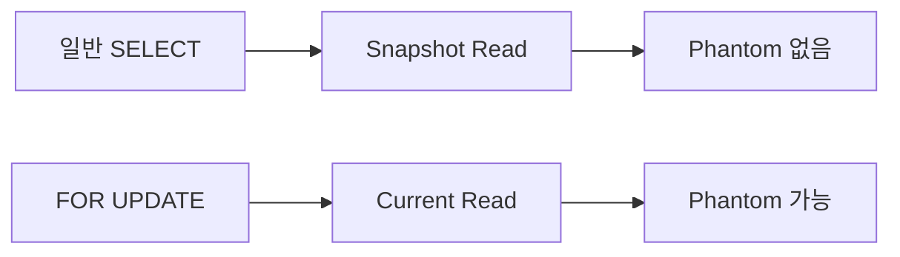
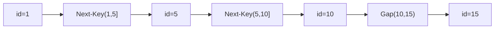
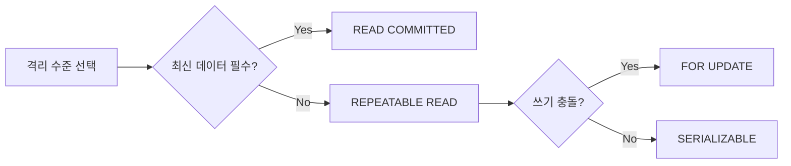

계좌 이체 도중 잔액을 조회하면 어떤 값이 보여야 하는가? 격리 수준이 낮으면 존재하지 않는 돈을 보거나, 방금 있던 돈이 사라지거나, 없던 행이 유령처럼 나타난다. 이 글은 ACID의 내부 보장 메커니즘부터 InnoDB MVCC의 Undo Log 체인, Read View 가시성 알고리즘, Gap Lock, 데드락 감지 알고리즘, PostgreSQL SSI까지 격리 수준 전체를 한 번에 완전히 정복한다.

> **비유:** 트랜잭션 격리 수준은 도서관 열람실 칸막이다. 칸막이 없음(READ UNCOMMITTED)은 옆 사람이 연필로 쓰는 중간 내용도 보인다. 투명 칸막이(READ COMMITTED)는 옆 사람이 제출한 완성본만 보인다. 유리벽(REPEATABLE READ)은 내가 앉은 시점 이후의 변경은 전혀 안 보인다. 완전 밀폐 부스(SERIALIZABLE)는 한 번에 한 명만 입장한다.

<br>

## 1. ACID — 트랜잭션 4대 원칙의 내부 보장 메커니즘

ACID는 트랜잭션이 안전하게 수행되기 위한 4가지 속성이다. 각각이 **어떤 내부 구조로 보장되는지**를 이해해야 면접에서 제대로 답할 수 있다.

### 1-1. Atomicity (원자성) — Undo Log로 보장

**"전부 성공하거나 전부 실패"** — 절반만 실행된 상태는 존재하지 않는다.

> **비유:** 비행기 예매는 좌석 확보 + 결제가 하나다. 결제만 성공하고 좌석이 안 잡히는 상태는 절대 없어야 한다.

**내부 보장 메커니즘:**

InnoDB는 모든 변경 전에 **Undo Log**에 이전 값을 기록한다. ROLLBACK이 발생하면 Undo Log를 역순으로 읽어 모든 변경을 되돌린다. 프로세스가 죽어도 재시작 시 Undo Log로 미완료 트랜잭션을 롤백한다.

```java
@Transactional
public void transfer(Long fromId, Long toId, BigDecimal amount) {
    Account from = accountRepository.findById(fromId).orElseThrow();
    Account to   = accountRepository.findById(toId).orElseThrow();

    // 1. from 계좌 차감 → Undo Log에 "from.balance = 원래값" 기록
    from.withdraw(amount);

    // 2. 여기서 RuntimeException 발생 시
    //    → @Transactional이 rollback 호출
    //    → Undo Log 역순 적용 → from 계좌 원상복구
    if (to.isClosed()) {
        throw new AccountClosedException("수신 계좌 폐쇄");
    }

    // 3. to 계좌 입금 → Undo Log에 "to.balance = 원래값" 기록
    to.deposit(amount);
    // 4. 커밋 → Undo Log는 나중에 Purge 스레드가 삭제
}
```

### 1-2. Consistency (일관성) — 제약 조건 검사로 보장

**"트랜잭션 전후로 DB 무결성 제약이 유지된다"** — 총 잔액은 이체 전후 동일해야 한다.

> **비유:** 은행 시스템에서 A가 1만 원을 이체하면 A는 -1만 원, B는 +1만 원이다. 총액은 항상 같아야 한다.

**내부 보장 메커니즘:**

DB 엔진이 커밋 시점에 CHECK 제약, FOREIGN KEY 제약, UNIQUE 제약을 검사한다. 위반 시 전체 트랜잭션을 롤백한다. 애플리케이션 레벨에서도 비즈니스 규칙(잔액 >= 0 등)을 검증해야 한다.

```java
// JPA 제약 위반 시 트랜잭션 전체 롤백
@Entity
public class Account {
    @Column(nullable = false)
    private BigDecimal balance;

    public void withdraw(BigDecimal amount) {
        // 비즈니스 규칙: 잔액은 0 이상
        if (this.balance.compareTo(amount) < 0) {
            throw new InsufficientBalanceException("잔액 부족");
        }
        this.balance = this.balance.subtract(amount);
    }
}
```

### 1-3. Isolation (격리성) — 락과 MVCC로 보장

**"동시에 실행되는 트랜잭션들이 서로 간섭하지 않는다"** — 격리 수준에 따라 허용하는 이상 현상 범위가 달라진다.

**내부 보장 메커니즘 2가지:**

| 방식 | 원리 | 사용 DB |
|------|------|---------|
| **락 기반** | 읽기/쓰기 전 락 획득, 트랜잭션 종료 시 해제 | 전통적 RDBMS |
| **MVCC** | 행의 여러 버전을 동시 보관, 트랜잭션마다 자신의 시점 버전 조회 | MySQL InnoDB, PostgreSQL |

MVCC의 핵심: **읽기가 쓰기를 차단하지 않고, 쓰기가 읽기를 차단하지 않는다.** 동시성이 크게 향상된다.

### 1-4. Durability (지속성) — Redo Log + WAL로 보장

**"커밋된 트랜잭션은 장애가 발생해도 유지된다"**

> **비유:** 은행이 "이체 완료" 문자를 보낸 순간, 그 직후 정전이 발생해도 이체 기록은 반드시 살아있어야 한다.

**내부 보장 메커니즘:**

InnoDB는 커밋 전에 반드시 **Redo Log(WAL: Write-Ahead Log)** 에 변경 내용을 기록한다. 메모리의 버퍼 풀에 있는 더티 페이지가 디스크에 아직 내려가지 않아도, Redo Log가 디스크에 fsync되면 커밋이 완료된다. 재시작 시 Redo Log를 재실행해 커밋된 변경을 복구한다.

```
커밋 순서:
  1. Undo Log 기록 (롤백용)
  2. 데이터 변경 (버퍼 풀)
  3. Redo Log 기록 + fsync  ← 이 시점부터 Durability 보장
  4. 커밋 완료 응답
  5. (비동기) 버퍼 풀 → 데이터 파일 flush (Checkpoint)
```

| 속성 | 내부 보장 메커니즘 | 위반 시 결과 |
|------|------------------|-------------|
| **Atomicity** | Undo Log 기반 롤백 | 반쪽 커밋으로 데이터 불일치 |
| **Consistency** | 커밋 시점 제약 검사 | 외래키 위반, 음수 잔액 |
| **Isolation** | MVCC + Lock | Dirty/Phantom Read |
| **Durability** | Redo Log (WAL) + fsync | 장애 후 데이터 유실 |

<br>

## 2. 읽기 이상 현상 3가지 — 구체적 Java 코드로

### 2-1. Dirty Read — 롤백될 데이터를 읽는다

커밋되지 않은 변경을 다른 트랜잭션이 읽는 현상.

> **비유:** 친구가 메모장에 연필로 "오늘 저녁은 내가 낼게"라고 써놨다. 내가 그걸 보고 지갑을 안 챙겼는데, 친구가 지우개로 지웠다.

```java
// READ UNCOMMITTED 격리 수준에서 발생
// T1: 계좌 잔액을 1000 → 5000으로 수정하고 커밋하지 않음
@Transactional(isolation = Isolation.READ_UNCOMMITTED)
public void depositUncommitted(Long accountId) {
    Account account = accountRepository.findById(accountId).orElseThrow();
    account.setBalance(BigDecimal.valueOf(5000)); // 미커밋 상태
    // 아직 commit() 안 함 — 다른 트랜잭션이 5000을 읽을 수 있음
}

// T2: 5000을 읽고 출금 시도
@Transactional(isolation = Isolation.READ_UNCOMMITTED)
public void withdrawBasedOnDirtyRead(Long accountId) {
    Account account = accountRepository.findById(accountId).orElseThrow();
    // 실제 잔액은 1000인데 5000을 읽음 → Dirty Read!
    BigDecimal balance = account.getBalance(); // 5000 읽음
    account.withdraw(BigDecimal.valueOf(3000)); // 3000 출금
    // T1이 롤백되면 실제 잔액은 1000 → 3000 출금이 불가능한 출금
}
```

**SQL 타임라인:**

```
시각  T1 (잔액 수정)                  T2 (잔액 조회)
 1    UPDATE account SET bal=5000
      WHERE id=1;  -- 미커밋
 2                                     SELECT bal FROM account
                                       WHERE id=1;
                                       → 5000 (Dirty Read!)
 3    ROLLBACK;
      -- 잔액 1000으로 복원
 4                                     -- T2는 존재하지 않는
                                       -- 5000 기반으로 이미 출금
```

### 2-2. Non-Repeatable Read — 같은 행을 두 번 읽었는데 달라진다

같은 트랜잭션 안에서 같은 행을 두 번 조회했는데, 중간에 다른 트랜잭션이 커밋하여 결과가 달라지는 현상.

> **비유:** 마트에서 재고 10개를 확인하고 계산대로 걸어가는 사이에 직원이 물건을 5개 치워버렸다. 같은 매장, 같은 물건인데 결과가 다르다.

```java
// READ COMMITTED에서 Non-Repeatable Read 발생
@Transactional(isolation = Isolation.READ_COMMITTED)
public void checkAndReserve(Long productId, int quantity) {
    Product product = productRepository.findById(productId).orElseThrow();
    int firstRead = product.getStock(); // 1차 읽기: 10개

    // 이 시점에 T2가 재고를 10 → 3으로 UPDATE하고 COMMIT

    // 같은 트랜잭션, 같은 엔티티인데 EntityManager refresh 시
    entityManager.refresh(product);
    int secondRead = product.getStock(); // 2차 읽기: 3개 (달라짐!)

    // firstRead != secondRead → Non-Repeatable Read
    if (firstRead != secondRead) {
        log.warn("Non-Repeatable Read 감지: {} → {}", firstRead, secondRead);
    }
}
```

**SQL 타임라인:**

```
시각  T1 (READ COMMITTED)              T2 (재고 수정)
 1    BEGIN;
      SELECT stock FROM product
      WHERE id=1;
      → 10
 2                                     BEGIN;
                                       UPDATE product
                                       SET stock=3 WHERE id=1;
                                       COMMIT;
 3    SELECT stock FROM product
      WHERE id=1;
      → 3  (Non-Repeatable Read!)
```

### 2-3. Phantom Read — 없던 행이 나타나거나 있던 행이 사라진다

같은 트랜잭션 안에서 같은 범위 쿼리를 실행했는데, 중간에 다른 트랜잭션이 INSERT/DELETE를 커밋하여 결과 집합이 달라지는 현상.

> **비유:** 방 안에 3명이 있는 걸 확인하고 문을 잠갔는데, 다시 세어보니 4명이다. 벽을 통과한 유령처럼 새 행이 나타났다.

```java
// REPEATABLE READ + SELECT FOR UPDATE 조합에서 Phantom Read 발생
@Transactional(isolation = Isolation.REPEATABLE_READ)
public void phantomReadDemo() {
    // 1차 범위 조회: 잔액 > 1,000,000인 VIP 고객 수
    long firstCount = accountRepository.countByBalanceGreaterThan(
        BigDecimal.valueOf(1_000_000)
    ); // → 5명

    // 이 시점에 T2가 잔액 2,000,000인 신규 고객 INSERT + COMMIT

    // 2차 범위 조회 (일반 SELECT → MVCC 스냅샷)
    long secondCount = accountRepository.countByBalanceGreaterThan(
        BigDecimal.valueOf(1_000_000)
    ); // → 5명 (MVCC로 Phantom Read 방지됨)

    // SELECT FOR UPDATE → 현재 데이터 읽기 (current read)
    List<Account> vipAccounts = accountRepository
        .findByBalanceGreaterThanForUpdate(BigDecimal.valueOf(1_000_000));
    // → 6명! Phantom Read 발생 (FOR UPDATE는 스냅샷 무시)
}
```

| 이상 현상 | 방지하려면 | 영향 단위 | 구체적 원인 |
|----------|----------|----------|-----------|
| Dirty Read | READ COMMITTED 이상 | 단일 행 | 미커밋 변경 노출 |
| Non-Repeatable Read | REPEATABLE READ 이상 | 단일 행 (UPDATE/DELETE) | 커밋된 수정 노출 |
| Phantom Read | SERIALIZABLE (또는 Gap Lock) | 행 집합 (INSERT/DELETE) | 커밋된 삽입/삭제 노출 |

<br>

## 3. 4가지 격리 수준 — 구체적 SQL 타임라인

SQL 표준은 4단계 격리 수준을 정의한다. 위로 갈수록 동시성이 높고, 아래로 갈수록 정합성이 강하다.

| 격리 수준 | Dirty Read | Non-Repeatable Read | Phantom Read | 동시성 |
|---------|-----------|-------------------|-------------|-------|
| READ UNCOMMITTED | 발생 | 발생 | 발생 | 최고 |
| READ COMMITTED | **방지** | 발생 | 발생 | 높음 |
| REPEATABLE READ | **방지** | **방지** | 발생 (InnoDB는 대부분 방지) | 보통 |
| SERIALIZABLE | **방지** | **방지** | **방지** | 최저 |

### 3-1. READ UNCOMMITTED — 미커밋 데이터까지 보인다

커밋되지 않은 변경도 즉시 보인다. 실무에서는 거의 사용하지 않는다.

```java
@Transactional(isolation = Isolation.READ_UNCOMMITTED)
public BigDecimal getApproximateBalance(Long accountId) {
    // 통계 근사치 집계 등 극히 제한된 상황에서만 사용
    // Dirty Read 가능성을 알고 의도적으로 허용하는 경우
    return accountRepository.findById(accountId)
        .map(Account::getBalance)
        .orElse(BigDecimal.ZERO);
}
```

**SQL 타임라인 (Dirty Read 발생):**

```
시각  T1 (잔액 증가, 미커밋)              T2 (READ UNCOMMITTED)
 1    BEGIN;
      UPDATE account
      SET balance = 5000
      WHERE id = 1;
      -- 아직 COMMIT 안 함
 2                                        BEGIN;
                                          SELECT balance FROM account
                                          WHERE id = 1;
                                          → 5000 (Dirty Read!)
 3    ROLLBACK;
      -- 잔액 1000으로 복원됨
 4                                        -- T2는 실재하지 않는
                                          -- 5000을 기반으로 로직 실행
```

### 3-2. READ COMMITTED — 커밋된 것만 보인다

커밋된 데이터만 읽는다. Oracle, PostgreSQL의 기본값.

```java
@Transactional(isolation = Isolation.READ_COMMITTED)
public List<Order> getLatestOrders(Long userId) {
    // 최신 커밋 데이터 필요, 약간의 Non-Repeatable Read 허용
    // 뉴스 피드, 실시간 대시보드에 적합
    return orderRepository.findByUserIdOrderByCreatedAtDesc(userId);
}
```

**SQL 타임라인 (Non-Repeatable Read 발생):**

```
시각  T1 (READ COMMITTED)              T2 (재고 수정)
 1    BEGIN;
 2    SELECT stock FROM product
      WHERE id = 1;
      → 100
 3                                     BEGIN;
                                       UPDATE product
                                       SET stock = 50
                                       WHERE id = 1;
                                       COMMIT;
 4    SELECT stock FROM product
      WHERE id = 1;
      → 50 (Non-Repeatable Read!)
      -- 같은 트랜잭션, 같은 쿼리, 다른 결과
 5    COMMIT;
```

**내부 원리 (MVCC):** READ COMMITTED는 **SELECT를 실행할 때마다 새 Read View를 생성**한다. T2가 커밋하면 T1의 다음 SELECT는 T2의 변경을 포함한 새 Read View를 생성하므로 50을 읽는다.

### 3-3. REPEATABLE READ — 스냅샷을 유지한다 (MySQL 기본값)

트랜잭션 시작 시점의 스냅샷 기준으로 읽는다. MySQL InnoDB 기본값.

```java
@Transactional(isolation = Isolation.REPEATABLE_READ)
public void generateReport(Long userId) {
    // 1차 조회
    List<Order> firstRead = orderRepository.findByUserId(userId);
    // → 10건

    // 이 사이 T2가 ORDER 2건 INSERT + COMMIT

    // 2차 조회 (MVCC 스냅샷 → T2 변경 안 보임)
    List<Order> secondRead = orderRepository.findByUserId(userId);
    // → 10건 (동일, Non-Repeatable Read 방지)

    // 보고서 생성 중 데이터가 바뀌지 않음을 보장
    assert firstRead.size() == secondRead.size();
}
```

**SQL 타임라인 (Non-Repeatable Read 방지):**

```
시각  T1 (REPEATABLE READ)             T2 (재고 수정)
 1    BEGIN;
      -- Read View 생성: min_trx_id=100, m_ids=[100]
 2    SELECT stock FROM product
      WHERE id = 1;
      → 100 (Undo Log 체인에서 가시성 판단)
 3                                     BEGIN; (trx_id=101)
                                       UPDATE product
                                       SET stock = 50
                                       WHERE id = 1;
                                       COMMIT;
 4    SELECT stock FROM product
      WHERE id = 1;
      → 100 (기존 Read View 재사용 → T2 변경 안 보임)
      -- T2의 trx_id=101 >= max_trx_id → 안 보임
 5    COMMIT;
```

**내부 원리 (MVCC):** REPEATABLE READ는 **트랜잭션의 첫 SELECT에서만 Read View를 생성**하고 이후에는 재사용한다. T2가 커밋해도 기존 Read View 기준으로 Undo Log를 타고 이전 버전을 읽는다.

### 3-4. SERIALIZABLE — 완전한 직렬 실행

모든 SELECT를 암묵적으로 `SELECT ... FOR SHARE`로 처리한다. 완전한 직렬 실행을 보장하지만 동시성이 가장 낮다.

```java
@Transactional(isolation = Isolation.SERIALIZABLE)
public void monthlyClosing(YearMonth period) {
    // 모든 SELECT가 암묵적으로 LOCK IN SHARE MODE
    // 다른 트랜잭션의 INSERT/UPDATE/DELETE와 충돌 → 대기 또는 데드락
    List<Transaction> allTxns = transactionRepository
        .findByPeriod(period); // → 암묵적 S Lock
    BigDecimal total = allTxns.stream()
        .map(Transaction::getAmount)
        .reduce(BigDecimal.ZERO, BigDecimal::add);
    closingRepository.save(new ClosingResult(period, total));
}
```

**내부 원리:** MySQL SERIALIZABLE은 락 기반 구현이다. 모든 읽기에 Shared Lock을 건다. 다른 트랜잭션이 해당 행에 쓰기 시도 시 충돌 → 대기. PostgreSQL은 SSI 알고리즘으로 락 없이 구현한다(후술).

<br>

## 4. MVCC 내부 구조 완전 분해 — InnoDB

InnoDB가 높은 동시성과 반복 읽기 일관성을 동시에 달성하는 핵심이 MVCC다.

> **비유:** MVCC는 구글 Docs의 버전 히스토리다. 누군가 문서를 수정해도 "5분 전 버전" 을 볼 수 있다. InnoDB도 행의 여러 버전을 동시에 보관하고, 트랜잭션마다 자신의 시점 버전을 읽는다.

### 4-1. Undo Log 체인 — 버전 히스토리의 실체

행이 변경될 때마다 이전 버전을 Undo Log에 기록한다. 행은 `DB_TRX_ID`와 `DB_ROLL_PTR`이라는 숨겨진 컬럼을 가진다.

```
실제 데이터 페이지 (현재 버전):
  ┌─────────────────────────────────────────────────────┐
  │ id=1 │ name='Kim' │ bal=5000 │ trx_id=300 │ roll_ptr ──┐
  └─────────────────────────────────────────────────────┘  │
                                                            │
Undo Log 세그먼트 (이전 버전들):                            ▼
  ┌─────────────────────────────────────────────────────┐
  │ id=1 │ name='Kim' │ bal=3000 │ trx_id=200 │ roll_ptr ──┐
  └─────────────────────────────────────────────────────┘  │
                                                            ▼
  ┌─────────────────────────────────────────────────────┐
  │ id=1 │ name='Lee' │ bal=1000 │ trx_id=100 │ roll_ptr=NULL
  └─────────────────────────────────────────────────────┘

→ 체인: 현재 → trx_id=200 버전 → trx_id=100 버전(최초)
→ 트랜잭션은 자신의 Read View에 맞는 버전을 찾을 때까지 체인을 타고 내려간다
```

**Undo Log 생성 과정:**

```
UPDATE account SET balance=5000 WHERE id=1 (trx_id=300 실행):

1. 현재 행 (balance=3000, trx_id=200) 을 Undo Log에 복사
2. 현재 행의 trx_id = 300 으로 변경
3. 현재 행의 roll_ptr = Undo Log의 복사본 주소
4. 현재 행의 balance = 5000 으로 변경

ROLLBACK 시:
  Undo Log에서 이전 값 (balance=3000) 복원
  roll_ptr, trx_id 원복
```

**Purge 스레드:** 어떤 활성 트랜잭션도 참조하지 않는 Undo Log 버전은 백그라운드 Purge 스레드가 삭제한다. 장기 트랜잭션이 오래된 스냅샷을 유지하면 Purge가 지연되어 Undo Log가 무한히 쌓인다(극한 시나리오에서 상세 설명).

### 4-2. Read View — 가시성 판단의 핵심

트랜잭션이 **첫 번째 SELECT**를 실행할 때 생성되는 스냅샷. "내가 볼 수 있는 버전의 범위"를 정의한다.

```
Read View 구조 (T1이 SELECT 실행 시점, trx_id=250):
  ┌──────────────────────────────────────────────────┐
  │ creator_trx_id = 250  (이 Read View를 만든 트랜잭션) │
  │ m_ids          = [220, 235, 250]  (활성 트랜잭션 목록) │
  │ min_trx_id     = 220  (m_ids 중 최솟값)           │
  │ max_trx_id     = 251  (다음에 부여될 trx_id)       │
  └──────────────────────────────────────────────────┘
```

**가시성 판단 알고리즘 (행의 trx_id = X):**

```
행의 trx_id = X 일 때:

CASE 1: X == creator_trx_id
  → 내가 변경한 행 → 보임

CASE 2: X < min_trx_id
  → Read View 생성 이전에 커밋 완료 → 보임

CASE 3: X >= max_trx_id
  → Read View 생성 이후에 시작된 트랜잭션 → 안 보임

CASE 4: min_trx_id <= X < max_trx_id
  IF X NOT IN m_ids:
    → Read View 생성 시점에 이미 커밋 완료 → 보임
  IF X IN m_ids:
    → Read View 생성 시점에 아직 활성 → 안 보임
    → roll_ptr 따라 Undo Log의 이전 버전으로 이동
    → 이전 버전의 trx_id로 다시 판단 (재귀)
```

**실전 예제:**

```
Read View: creator=250, m_ids=[220, 235, 250], min=220, max=251

행 버전 체인:
  현재: trx_id=240  (m_ids에 없음 → 커밋 완료 → 보임!)
  이전: trx_id=235  (m_ids에 있음 → 활성 → 안 보임)
  최초: trx_id=180  (< min_trx_id → 커밋 완료 → 보임)

→ T1은 trx_id=240 버전을 읽는다
```

### 4-3. READ COMMITTED vs REPEATABLE READ — Read View 생성 시점의 차이

```java
// CASE 1: READ COMMITTED — SELECT마다 새 Read View
@Transactional(isolation = Isolation.READ_COMMITTED)
public void readCommittedDemo(Long id) {
    // SELECT #1 → Read View 생성 (trx_id=250, m_ids=[250])
    Account acc1 = accountRepository.findById(id).orElseThrow();
    // → bal=1000

    // T2가 bal=2000으로 UPDATE + COMMIT (trx_id=260)

    // SELECT #2 → 새 Read View 생성 (trx_id=250, m_ids=[250])
    //   trx_id=260 의 행: 260 < max_trx_id(새 기준), m_ids에 없음 → 보임!
    entityManager.refresh(acc1);
    // → bal=2000 (Non-Repeatable Read)
}

// CASE 2: REPEATABLE READ — 첫 SELECT에서만 Read View 생성
@Transactional(isolation = Isolation.REPEATABLE_READ)
public void repeatableReadDemo(Long id) {
    // SELECT #1 → Read View 생성 (trx_id=250, m_ids=[250], max=251)
    Account acc1 = accountRepository.findById(id).orElseThrow();
    // → bal=1000

    // T2가 bal=2000으로 UPDATE + COMMIT (trx_id=260)

    // SELECT #2 → 기존 Read View 재사용 (max_trx_id=251)
    //   trx_id=260 의 행: 260 >= max_trx_id(251) → 안 보임!
    //   Undo Log 따라 이전 버전 (trx_id=240 등) 탐색
    entityManager.refresh(acc1);
    // → bal=1000 (Repeatable Read 보장)
}
```

<br>

## 5. MySQL REPEATABLE READ의 숨겨진 진실 — Snapshot Read vs Current Read

MySQL REPEATABLE READ는 SELECT 방식에 따라 동작이 완전히 다르다. 이 차이를 모르면 재고 차감 같은 실무 로직에서 치명적 버그가 발생한다.

### 5-1. Snapshot Read (스냅샷 읽기) — MVCC 사용

일반 SELECT는 MVCC 스냅샷을 사용한다. **락을 걸지 않고**, Read View 기준으로 Undo Log에서 버전을 읽는다.

```java
// Snapshot Read: MVCC 스냅샷 사용, 락 없음
@Transactional(isolation = Isolation.REPEATABLE_READ)
public int getStock(Long productId) {
    // SELECT * FROM product WHERE id = ?
    // → MVCC 스냅샷 읽기, 트랜잭션 시작 시점의 값
    return productRepository.findById(productId)
        .map(Product::getStock)
        .orElse(0);
}
```

### 5-2. Current Read (현재 읽기) — 실제 최신 데이터

`SELECT FOR UPDATE`, `SELECT FOR SHARE`, `UPDATE`, `DELETE`, `INSERT`는 **현재 데이터를 읽는다**. MVCC 스냅샷을 무시하고 실제 최신 버전을 읽으며, 필요한 락을 건다.

```java
// Current Read: 최신 데이터, X Lock 획득
@Transactional(isolation = Isolation.REPEATABLE_READ)
public void decreaseStock(Long productId, int qty) {
    // SELECT * FROM product WHERE id = ? FOR UPDATE
    // → 최신 데이터 읽기, X Lock 획득
    Product product = productRepository.findByIdWithLock(productId)
        .orElseThrow();
    // 이제 다른 트랜잭션은 이 행에 접근 불가 (커밋까지 대기)
    product.decreaseStock(qty);
}
```

### 5-3. Phantom Read 발생 조건 — Snapshot Read와 Current Read 혼용

```java
@Transactional(isolation = Isolation.REPEATABLE_READ)
public void phantomReadMixedDemo() {
    // ① Snapshot Read: 주문 3건 조회 (T2 INSERT 이전 스냅샷)
    long count1 = orderRepository.countByAmountGreaterThan(1000L);
    // → 3건

    // 이 시점에 T2: INSERT INTO orders (amount) VALUES (5000); COMMIT;

    // ② Snapshot Read: 여전히 3건 (MVCC가 Phantom Read 차단)
    long count2 = orderRepository.countByAmountGreaterThan(1000L);
    // → 3건 (정상)

    // ③ Current Read: 최신 데이터 조회 → Phantom Row 보임!
    List<Order> orders = orderRepository
        .findByAmountGreaterThanForUpdate(1000L);
    // → 4건! (Phantom Read 발생)
}
```

```
WHY: FOR UPDATE는 current read → T2가 커밋한 5000원 주문이 보임
     일반 SELECT는 snapshot read → T2 변경이 Read View 밖이라 안 보임
```

**정리:**



<br>

## 6. Gap Lock과 Next-Key Lock — Phantom Read 방지 메커니즘

InnoDB REPEATABLE READ에서 Current Read(FOR UPDATE)의 Phantom Read를 막는 메커니즘이 Gap Lock이다.

> **비유:** Gap Lock은 주차장에서 빈 자리 양쪽에 콘을 세워놓는 것이다. 이미 차가 있는 자리(레코드)와 빈 자리(Gap) 모두에 락을 건다.

### 6-1. Gap Lock — 인덱스 사이의 간격을 잠근다

인덱스 레코드 **사이의 간격**에 거는 락. INSERT를 차단하여 Phantom Row 삽입을 막는다.

```sql
-- 인덱스: id = 1, 5, 10, 15

-- T1: id 5~10 범위 FOR UPDATE
SELECT * FROM users WHERE id BETWEEN 5 AND 10 FOR UPDATE;

-- 걸리는 락:
--   Record Lock: id=5, id=10
--   Gap Lock: (1, 5), (5, 10)

-- T2: id=7 삽입 시도 → Gap Lock (5, 10) 에 의해 차단!
INSERT INTO users (id, name) VALUES (7, 'New');  -- 대기
```

**Gap Lock은 레코드가 없는 구간에도 적용된다.**

```sql
-- id = 5, 10 사이에 실제 데이터가 없어도
-- BETWEEN 5 AND 10 실행 시 (5, 10) Gap에 락
SELECT * FROM users WHERE id BETWEEN 5 AND 10 FOR UPDATE;
-- id=7 INSERT → 대기 (Gap이 비어있어도 Gap Lock 적용)
```

### 6-2. Next-Key Lock — Record Lock + Gap Lock의 조합

**Next-Key Lock = Record Lock + 앞쪽 Gap Lock**

InnoDB REPEATABLE READ에서 인덱스 범위 쿼리 시 기본으로 적용된다.

```
인덱스 값: ..., 1, 5, 10, 15, ...

BETWEEN 5 AND 10 FOR UPDATE 실행 시 Next-Key Lock:

  구간        락 종류
  (-∞, 1]    : 해당 없음
  (1, 5]     : Next-Key Lock (Gap(1,5) + Record Lock on 5)
  (5, 10]    : Next-Key Lock (Gap(5,10) + Record Lock on 10)
  (10, 15]   : Gap Lock on (10,15) — 범위 끝 이후 삽입 방지

결과:
  id=3 INSERT → Gap(1,5) 락 → 차단
  id=7 INSERT → Gap(5,10) 락 → 차단
  id=12 INSERT → Gap(10,15) 락 → 차단
  id=5, 10 UPDATE → Record Lock → 차단
```



### 6-3. 인덱스가 없을 때의 재앙

```java
// name 컬럼에 인덱스가 없는 경우
@Query("SELECT a FROM Account a WHERE a.ownerName = :name FOR UPDATE")
List<Account> findByOwnerNameForUpdate(@Param("name") String name);
```

```sql
-- 인덱스 없는 컬럼에 FOR UPDATE → Full Table Scan
-- → 테이블의 모든 레코드 + 모든 Gap에 락
-- → 사실상 테이블 전체 락!

SELECT * FROM account WHERE owner_name = 'Kim' FOR UPDATE;
-- owner_name에 인덱스 없음 → 전체 행 X Lock + 전체 Gap Lock
-- → 모든 INSERT/UPDATE/DELETE 차단 → 성능 재앙
```

**해결:**
- `FOR UPDATE`를 사용하는 WHERE 조건 컬럼에는 반드시 인덱스 생성
- `EXPLAIN`으로 실행 계획 확인: `Using index` 여부 체크

```sql
EXPLAIN SELECT * FROM account WHERE owner_name = 'Kim' FOR UPDATE;
-- type=ALL (Full Scan) → 인덱스 없음 → 위험
-- type=ref (Index Scan) → 정상
```

### 6-4. Lost Update 문제 — REPEATABLE READ가 못 막는 것

MVCC는 읽기 일관성을 보장하지만, **Lost Update(갱신 손실)** 는 막지 못한다.

> **비유:** 두 사람이 같은 구글 문서를 동시에 다운로드 → 각자 수정 → 마지막에 저장한 사람의 변경만 살아남는다. 먼저 저장한 사람의 변경은 사라진다.

```java
// REPEATABLE READ에서 Lost Update 발생
// 재고: 10개

// T1
@Transactional(isolation = Isolation.REPEATABLE_READ)
public void orderT1(Long productId) {
    Product p = productRepository.findById(productId).orElseThrow();
    // stock = 10 (Snapshot Read)
    int newStock = p.getStock() - 3; // 10 - 3 = 7
    p.setStock(newStock);
    // COMMIT → stock = 7
}

// T2 (동시 실행)
@Transactional(isolation = Isolation.REPEATABLE_READ)
public void orderT2(Long productId) {
    Product p = productRepository.findById(productId).orElseThrow();
    // stock = 10 (Snapshot Read, T1 커밋 전이라 10 보임)
    int newStock = p.getStock() - 5; // 10 - 5 = 5
    p.setStock(newStock);
    // COMMIT → stock = 5 (T1의 -3이 사라짐! Lost Update)
}
// 실제 재고: 2개여야 하는데 5개로 기록됨
```

**해결책 1: SELECT FOR UPDATE (비관적 락)**

```java
@Transactional
public void orderWithLock(Long productId, int qty) {
    // SELECT ... FOR UPDATE → X Lock 획득 → T2는 T1 커밋까지 대기
    Product p = productRepository.findByIdWithLock(productId).orElseThrow();
    if (p.getStock() < qty) throw new InsufficientStockException();
    p.setStock(p.getStock() - qty);
}

// JPA Repository
@Lock(LockModeType.PESSIMISTIC_WRITE)
@Query("SELECT p FROM Product p WHERE p.id = :id")
Optional<Product> findByIdWithLock(@Param("id") Long id);
```

**해결책 2: 원자적 UPDATE (가장 빠름)**

```java
// JPA @Modifying으로 원자적 UPDATE
@Modifying
@Query("UPDATE Product p SET p.stock = p.stock - :qty " +
       "WHERE p.id = :id AND p.stock >= :qty")
int decreaseStock(@Param("id") Long id, @Param("qty") int qty);

// 서비스
@Transactional
public void order(Long productId, int qty) {
    int updated = productRepository.decreaseStock(productId, qty);
    if (updated == 0) {
        throw new InsufficientStockException("재고 부족 또는 동시 주문 충돌");
    }
}
```

**해결책 3: 낙관적 락 (@Version)**

```java
@Entity
public class Product {
    @Id
    private Long id;
    private int stock;

    @Version  // UPDATE 시 version 자동 증가, 충돌 시 OptimisticLockException
    private Long version;
}

@Transactional
public void orderWithOptimisticLock(Long productId, int qty) {
    try {
        Product p = productRepository.findById(productId).orElseThrow();
        p.setStock(p.getStock() - qty);
        // 커밋 시: UPDATE product SET stock=?, version=version+1
        //          WHERE id=? AND version=? → 다른 트랜잭션이 이미 수정했으면 0 rows
        productRepository.save(p);
    } catch (OptimisticLockingFailureException e) {
        // 재시도 로직
        throw new StockConflictException("재고 충돌, 재시도 필요");
    }
}
```

<br>

## 7. 데드락 — 감지 알고리즘과 실전 해결

### 7-1. 데드락 발생 메커니즘

> **비유:** 도로 교차로에서 A차가 B 방향으로 가려면 B차가 비켜야 하고, B차가 A 방향으로 가려면 A차가 비켜야 한다. 둘 다 상대를 기다리며 영원히 멈춰있다.

```sql
-- T1
BEGIN;
UPDATE orders SET status='DONE' WHERE id=1;  -- X Lock on id=1 획득
-- 다음으로 id=2 잠금 시도

-- T2 (동시)
BEGIN;
UPDATE orders SET status='DONE' WHERE id=2;  -- X Lock on id=2 획득
-- 다음으로 id=1 잠금 시도

-- 이후
-- T1: id=2 대기 (T2 보유)
-- T2: id=1 대기 (T1 보유)
-- → 데드락!
```

### 7-2. InnoDB 데드락 감지 알고리즘 — Wait-For Graph

InnoDB는 **Wait-For Graph** (대기 그래프)를 유지한다. 잠금 대기가 발생할 때마다 그래프에 엣지를 추가하고, **사이클이 감지되면 즉시 데드락으로 판단**한다.

```
Wait-For Graph:
  T1 → T2 (T1이 T2가 보유한 락을 기다림)
  T2 → T1 (T2가 T1이 보유한 락을 기다림)
  → 사이클 T1 → T2 → T1 감지 → 데드락!

InnoDB 선택 기준:
  가장 비용이 적은 트랜잭션 롤백
  (변경한 행 수, Undo Log 크기 등으로 비용 계산)
  → 보통 더 적은 작업을 한 트랜잭션이 희생양
```

**데드락 발생 시 에러:**
```
ERROR 1213 (40001): Deadlock found when trying to get lock;
try restarting transaction
```

### 7-3. 데드락 로그 읽기

```sql
-- 데드락 정보 조회
SHOW ENGINE INNODB STATUS;
```

```
LATEST DETECTED DEADLOCK
-------------------------
2026-05-13 10:30:01 0x7f8b4c001700
*** (1) TRANSACTION:
TRANSACTION 1001, ACTIVE 0 sec starting index read
mysql tables in use 1, locked 1
LOCK WAIT 2 lock struct(s), heap size 1136, 1 row lock(s)
MySQL thread id 42, OS thread handle 139..., query id 1234
UPDATE orders SET status='DONE' WHERE id=2  ← T1이 기다리는 쿼리

*** (1) HOLDS THE LOCK(S):
RECORD LOCKS space id 123 page no 5 n bits 72 index PRIMARY
of table `mydb`.`orders` trx id 1001 lock_mode X locks rec but not gap
Record lock, heap no 2 PHYSICAL RECORD: n_fields 3  ← id=1 보유

*** (1) WAITING FOR THIS LOCK TO BE GRANTED:
RECORD LOCKS space id 123 page no 5 n bits 72 index PRIMARY
of table `mydb`.`orders` trx id 1001 lock_mode X locks rec but not gap
Record lock, heap no 3  ← id=2 대기

*** (2) TRANSACTION:  ← T2 정보 (생략)

*** WE ROLL BACK TRANSACTION (2)  ← T2 롤백 결정
```

**로그 해석 포인트:**
- `HOLDS THE LOCK(S)`: 현재 보유 중인 락
- `WAITING FOR THIS LOCK`: 기다리는 락
- `WE ROLL BACK TRANSACTION (N)`: 희생양 결정

### 7-4. 데드락 방지 전략

```java
@Service
public class OrderService {

    // 전략 1: 항상 같은 순서로 락 획득 (작은 ID부터)
    @Transactional
    public void processOrders(Long id1, Long id2) {
        Long first  = Math.min(id1, id2);
        Long second = Math.max(id1, id2);

        // 항상 작은 ID부터 락 → 데드락 구조 원천 차단
        Order o1 = orderRepository.findByIdWithLock(first).orElseThrow();
        Order o2 = orderRepository.findByIdWithLock(second).orElseThrow();
        o1.complete();
        o2.complete();
    }

    // 전략 2: 트랜잭션을 짧게 유지
    @Transactional
    public void quickUpdate(Long orderId) {
        // 외부 API 호출, 파일 I/O 등을 트랜잭션 밖으로
        Order order = orderRepository.findByIdWithLock(orderId).orElseThrow();
        order.complete(); // 최소한의 작업만
        // 즉시 커밋 → 락 보유 시간 최소화
    }

    // 전략 3: 데드락 발생 시 재시도
    @Retryable(
        value = {DeadlockLoserDataAccessException.class},
        maxAttempts = 3,
        backoff = @Backoff(delay = 100, multiplier = 2)
    )
    @Transactional
    public void orderWithRetry(Long productId, int qty) {
        // 데드락 발생 시 최대 3회 재시도
        decreaseStock(productId, qty);
    }
}
```

**innodb_lock_wait_timeout 설정:**

```sql
-- 기본값: 50초 (기다리다 타임아웃)
SHOW VARIABLES LIKE 'innodb_lock_wait_timeout';

-- 운영에서는 더 짧게 (빠른 실패, 빠른 재시도)
SET GLOBAL innodb_lock_wait_timeout = 10;

-- 스프링: DataSource 설정에서
-- spring.datasource.hikari.connection-timeout=5000
```

<br>

## 8. PostgreSQL vs MySQL — SSI vs Gap Lock

같은 SQL 표준을 구현했지만 내부 동작 방식이 근본적으로 다르다.

### 8-1. 핵심 차이 비교

| 항목 | MySQL InnoDB | PostgreSQL |
|------|-------------|-----------|
| 기본 격리 수준 | REPEATABLE READ | READ COMMITTED |
| MVCC 구현 | Undo Log (행 내 버전 체인) | Heap tuple 다중 버전 |
| Phantom Read 방지 | Next-Key Lock (Gap Lock) | SSI 알고리즘 |
| SERIALIZABLE 구현 | 모든 SELECT에 S Lock | SSI (락 없음) |
| Gap Lock | 있음 | 없음 |
| 데드락 감지 | Wait-For Graph (즉시) | 즉시 감지 후 롤백 |
| 읽기-쓰기 충돌 | 읽기가 쓰기 차단 안 함 (MVCC) | 읽기가 쓰기 차단 안 함 (MVCC) |

### 8-2. PostgreSQL SSI (Serializable Snapshot Isolation)

PostgreSQL은 **락 없이 SERIALIZABLE을 구현**한다. 트랜잭션 간의 **읽기-쓰기 의존성(rw-dependency)** 을 추적하고, 위험한 패턴이 발견되면 한 트랜잭션을 롤백한다.

> **비유:** SSI는 CCTV 감시다. 실제로 충돌을 막는 게 아니라 사후에 충돌 패턴을 감지하고 되돌린다. Gap Lock은 물리적 바리케이드다.

```
SSI 의존성 추적:

시나리오: 의사 - 당직 스케줄 문제
  의사 A: 당직 중인 의사가 있으면 당직 포기
  의사 B: 당직 중인 의사가 있으면 당직 포기
  (둘 다 상대방이 당직이라고 읽고 자신은 포기 → 결국 당직 없음)

T1: SELECT count(*) FROM duty WHERE on_duty=true; → 1 (B가 당직)
T2: SELECT count(*) FROM duty WHERE on_duty=true; → 1 (A가 당직)
T1: DELETE FROM duty WHERE doctor='A';
T2: DELETE FROM duty WHERE doctor='B';

의존성 그래프:
  T1 ─(rw)→ T2 (T1이 읽은 행을 T2가 수정)
  T2 ─(rw)→ T1 (T2가 읽은 행을 T1이 수정)
  → 사이클 감지 → T2 롤백 → 직렬화 오류

ERROR: could not serialize access due to concurrent update
```

**PostgreSQL SSI의 장단점:**

```
장점:
  락 경합 없음 → 높은 처리량
  Gap Lock처럼 INSERT를 선제적으로 막지 않음
  읽기 전용 트랜잭션은 추적 불필요 → 오버헤드 최소

단점:
  직렬화 충돌 시 트랜잭션 재시도 필요
  rw-dependency 추적 메모리 오버헤드
  max_pred_locks_per_transaction 설정 필요
```

### 8-3. 같은 코드, 다른 동작

```java
// MySQL InnoDB (기본: REPEATABLE READ)와
// PostgreSQL (기본: READ COMMITTED)에서 동작 차이

@Transactional
// MySQL: REPEATABLE READ → 트랜잭션 내 일관된 읽기
// PostgreSQL: READ COMMITTED → SELECT마다 최신 커밋 읽기
public void behavior() {
    List<Order> first  = orderRepository.findAll(); // 10건
    // T2: INSERT 1건 + COMMIT
    List<Order> second = orderRepository.findAll();
    // MySQL: 10건 (REPEATABLE READ 스냅샷)
    // PostgreSQL: 11건 (READ COMMITTED, 최신 커밋 반영)
}
```

**마이그레이션 시 필수 체크:**
- MySQL → PostgreSQL 이전 시 `READ COMMITTED`와 `REPEATABLE READ` 동작 차이 검증
- PostgreSQL의 `REPEATABLE READ`는 MySQL과 같음 (첫 SELECT에서 스냅샷 생성)
- PostgreSQL의 `SERIALIZABLE`은 SSI로 추가 재시도 로직 필요

<br>

## 9. Spring @Transactional isolation 완전 가이드

### 9-1. JDBC Connection.setTransactionIsolation() 매핑

Spring의 `@Transactional(isolation = ...)` 은 결국 JDBC의 `Connection.setTransactionIsolation()` 을 호출한다.

```java
// Spring 내부 동작 (DataSourceTransactionManager 기준)
public class DataSourceTransactionManager {
    protected void doBegin(Object transaction, TransactionDefinition definition) {
        Connection con = getConnection();
        // isolation 설정이 DEFAULT가 아니면 JDBC에 전달
        if (definition.getIsolationLevel() != TransactionDefinition.ISOLATION_DEFAULT) {
            con.setTransactionIsolation(definition.getIsolationLevel());
            // Isolation.READ_COMMITTED → Connection.TRANSACTION_READ_COMMITTED (2)
            // Isolation.REPEATABLE_READ → Connection.TRANSACTION_REPEATABLE_READ (4)
            // Isolation.SERIALIZABLE → Connection.TRANSACTION_SERIALIZABLE (8)
        }
        con.setAutoCommit(false);
    }
}
```

**Spring Isolation → JDBC 상수 매핑:**

| Spring | 값 | JDBC 상수 |
|--------|---|----------|
| `Isolation.DEFAULT` | -1 | DB 기본값 사용 |
| `Isolation.READ_UNCOMMITTED` | 1 | `TRANSACTION_READ_UNCOMMITTED` |
| `Isolation.READ_COMMITTED` | 2 | `TRANSACTION_READ_COMMITTED` |
| `Isolation.REPEATABLE_READ` | 4 | `TRANSACTION_REPEATABLE_READ` |
| `Isolation.SERIALIZABLE` | 8 | `TRANSACTION_SERIALIZABLE` |

### 9-2. 격리 수준별 Spring 실전 패턴

```java
@Service
@RequiredArgsConstructor
public class BankService {

    private final AccountRepository accountRepository;
    private final TransactionHistoryRepository historyRepository;

    // 1. READ COMMITTED: 실시간 잔액 조회 (최신 값 우선)
    @Transactional(
        isolation = Isolation.READ_COMMITTED,
        readOnly = true
    )
    public BigDecimal getCurrentBalance(Long accountId) {
        // Non-Repeatable Read 허용 → 최신 잔액 반영
        return accountRepository.findById(accountId)
            .map(Account::getBalance)
            .orElseThrow(() -> new AccountNotFoundException(accountId));
    }

    // 2. REPEATABLE READ: 월말 정산 리포트 (일관된 스냅샷)
    @Transactional(
        isolation = Isolation.REPEATABLE_READ,
        readOnly = true,
        timeout = 300  // 5분 제한 (Undo Log 폭증 방지)
    )
    public MonthlyReport generateMonthlyReport(YearMonth period) {
        // 여러 번 조회해도 항상 같은 스냅샷 기준
        List<Account> accounts = accountRepository.findAll();
        List<Transaction> txns = historyRepository.findByPeriod(period);
        return new MonthlyReport(accounts, txns);
    }

    // 3. SERIALIZABLE: 계좌 개설 (중복 방지 필수)
    @Transactional(isolation = Isolation.SERIALIZABLE)
    public Account openAccount(String ownerId, String accountNumber) {
        // 같은 계좌번호 중복 체크 + 생성을 원자적으로
        if (accountRepository.existsByAccountNumber(accountNumber)) {
            throw new DuplicateAccountException(accountNumber);
        }
        return accountRepository.save(new Account(ownerId, accountNumber));
    }

    // 4. REPEATABLE READ + FOR UPDATE: 안전한 이체
    @Transactional(isolation = Isolation.REPEATABLE_READ)
    public void transfer(Long fromId, Long toId, BigDecimal amount) {
        // 항상 작은 ID부터 락 획득 (데드락 방지)
        Long first  = Math.min(fromId, toId);
        Long second = Math.max(fromId, toId);

        Account a1 = accountRepository.findByIdWithLock(first).orElseThrow();
        Account a2 = accountRepository.findByIdWithLock(second).orElseThrow();

        Account from = (a1.getId().equals(fromId)) ? a1 : a2;
        Account to   = (a1.getId().equals(toId))   ? a1 : a2;

        from.withdraw(amount);
        to.deposit(amount);
    }
}
```

### 9-3. Propagation과 격리 수준의 상호작용 — 함정

```java
@Service
public class OuterService {

    @Transactional(isolation = Isolation.READ_COMMITTED)
    public void outerMethod() {
        // READ_COMMITTED 트랜잭션 시작
        innerService.innerMethod();
        // 주의: innerMethod가 같은 트랜잭션에 참여하면
        //       SERIALIZABLE 설정이 무시됨!
    }
}

@Service
public class InnerService {

    // REQUIRED (기본): 기존 트랜잭션에 참여 → 외부 격리 수준 사용
    @Transactional(isolation = Isolation.SERIALIZABLE)
    public void innerMethod() {
        // 실제로는 READ_COMMITTED로 동작! (경고 로그 발생)
        // Spring이 기존 트랜잭션 감지 → 격리 수준 변경 불가
    }

    // 해결: REQUIRES_NEW로 새 트랜잭션 시작
    @Transactional(
        isolation = Isolation.SERIALIZABLE,
        propagation = Propagation.REQUIRES_NEW
    )
    public void innerMethodIsolated() {
        // 완전히 새 Connection, 새 트랜잭션 → SERIALIZABLE 적용
        // 주의: 외부 트랜잭션과 별개로 커밋/롤백됨
    }
}
```

**Spring이 격리 수준 충돌 시 처리:**

```java
// AbstractPlatformTransactionManager 내부
if (definition.getIsolationLevel() != TransactionDefinition.ISOLATION_DEFAULT) {
    Integer currentIsolationLevel = ...;
    if (!definition.getIsolationLevel().equals(currentIsolationLevel)) {
        // 기존 트랜잭션의 격리 수준과 다르면 경고 (예외 아님!)
        // 기존 격리 수준 그대로 사용
        logger.warn("Participating transaction with definition [" +
            definition + "] specifies isolation level which is effectively " +
            "ignored for an existing transaction");
    }
}
```

### 9-4. readOnly = true의 동작

```java
@Transactional(readOnly = true)
public List<Account> findAll() {
    // 1. MySQL: SET SESSION TRANSACTION READ ONLY 실행
    //    → Flush 스킵 (더티 체킹 안 함) → 성능 향상
    //    → 실수로 write 시도 시 예외
    // 2. HikariCP: 읽기 전용 Connection 획득 가능
    //    (읽기 레플리카 라우팅 등에 활용)
    // 3. JPA: flush mode = NEVER → 영속성 컨텍스트 flush 안 함
    return accountRepository.findAll();
}
```

<br>

## 10. 극한 시나리오

### 10-1. 재고 -1개 버그 — MVCC의 함정

```
시나리오: 재고 1개, 동시 주문 2건

잘못된 코드 (MVCC만 믿음):
  T1: SELECT stock = 1 (Snapshot Read)
  T2: SELECT stock = 1 (Snapshot Read, T1 커밋 전)
  T1: UPDATE stock = 1 - 1 = 0, COMMIT
  T2: UPDATE stock = 1 - 1 = 0, COMMIT
      (UPDATE는 Current Read → T1 커밋 이후 0을 실제 읽음)
      → stock = 0 (T1 차감 유실) 또는 stock = -1 (더블 차감)

WHY: SELECT는 스냅샷, UPDATE의 WHERE 계산은 현재값
     두 트랜잭션 모두 stock=1을 스냅샷으로 읽고
     각자 "1-1=0"으로 UPDATE하면 마지막 커밋이 이김
```

```java
// 틀린 코드
@Transactional
public void wrongOrder(Long productId, int qty) {
    Product p = productRepository.findById(productId).orElseThrow(); // Snapshot!
    if (p.getStock() < qty) throw new InsufficientStockException();
    p.setStock(p.getStock() - qty); // Lost Update 위험
}

// 올바른 코드 #1: SELECT FOR UPDATE
@Transactional
public void correctOrderPessimistic(Long productId, int qty) {
    Product p = productRepository.findByIdWithLock(productId).orElseThrow();
    // X Lock 획득 → T2는 T1 커밋까지 대기 → 직렬화 처리
    if (p.getStock() < qty) throw new InsufficientStockException();
    p.setStock(p.getStock() - qty);
}

// 올바른 코드 #2: 원자적 UPDATE (성능 최고)
@Transactional
public void correctOrderAtomic(Long productId, int qty) {
    int updated = productRepository.decreaseStockSafe(productId, qty);
    if (updated == 0) throw new InsufficientStockException("재고 부족 또는 충돌");
}

// 올바른 코드 #3: @Version 낙관적 락
@Transactional
@Retryable(DeadlockLoserDataAccessException.class)
public void correctOrderOptimistic(Long productId, int qty) {
    try {
        Product p = productRepository.findById(productId).orElseThrow();
        if (p.getStock() < qty) throw new InsufficientStockException();
        p.setStock(p.getStock() - qty);
        productRepository.save(p); // version 불일치 시 OptimisticLockingFailureException
    } catch (OptimisticLockingFailureException e) {
        throw new StockConflictException("동시 주문 충돌, 재시도 필요");
    }
}
```

### 10-2. Undo Log 폭증 — 장기 트랜잭션의 재앙

```
상황: T1이 REPEATABLE READ로 30분째 실행 중
  T1 시작: trx_id = 1000

  30분 동안:
    T1001 ~ T50000: 49,000건의 UPDATE 실행
    각 UPDATE마다 Undo Log 생성

  문제:
    T1의 Read View: min_trx_id = 1000
    → T1001~T50000의 Undo Log는 T1이 볼 수 있음
    → Purge 스레드가 삭제 불가
    → Undo Log 무한 증가
    → innodb_undo_tablespace 꽉 참
    → DB 전체 쓰기 불가 → 장애!

  실측 예시:
    트랜잭션 1건당 UPDATE 100바이트
    초당 1000건 UPDATE × 1800초 = 180만 건
    180만 × 100바이트 = 180MB (Undo Log)
    고트래픽에서는 수 GB까지 폭증 가능
```

```java
// 잘못된 코드: 대량 배치를 단일 트랜잭션
@Transactional(isolation = Isolation.REPEATABLE_READ)
public void wrongBatch() {
    List<Account> all = accountRepository.findAll(); // 100만 건!
    all.forEach(a -> a.applyInterest(0.03));
    // 100만 건 읽는 동안 Undo Log 폭증
}

// 올바른 코드: 청크 단위 처리
public void correctBatch() {
    int page = 0, size = 1000;
    while (true) {
        int updated = accountService.processChunk(page++, size);
        if (updated == 0) break;
    }
}

@Transactional  // 청크마다 별도 트랜잭션 → Purge 가능
public int processChunk(int page, int size) {
    List<Account> chunk = accountRepository.findAll(
        PageRequest.of(page, size)
    ).getContent();
    if (chunk.isEmpty()) return 0;
    chunk.forEach(a -> a.applyInterest(0.03));
    return chunk.size();
}
```

```sql
-- 장기 트랜잭션 모니터링
SELECT
    trx_id,
    trx_started,
    TIMESTAMPDIFF(MINUTE, trx_started, NOW()) AS running_minutes,
    trx_state,
    LEFT(trx_query, 100) AS current_query,
    trx_rows_locked,
    trx_rows_modified
FROM information_schema.innodb_trx
WHERE TIMESTAMPDIFF(MINUTE, trx_started, NOW()) > 5
ORDER BY trx_started;
```

### 10-3. 데드락 폭풍 — 격리 수준 상향이 만든 재앙

```
상황: 온라인 쇼핑몰, 플래시 세일
  격리 수준을 REPEATABLE READ → SERIALIZABLE로 상향

  SERIALIZABLE: 모든 SELECT에 S Lock
  → 재고 조회 SELECT → S Lock 획득
  → 재고 차감 UPDATE → S Lock ↔ X Lock 충돌 → 대기
  → 수천 트랜잭션 동시 S Lock → UPDATE 전원 대기
  → innodb_lock_wait_timeout 초과 → 대량 롤백
  → 재시도 폭풍 → DB CPU 100% → 서비스 장애

교훈:
  격리 수준은 가능한 낮게 유지
  필요한 쿼리에만 선택적으로 FOR UPDATE 사용
  SERIALIZABLE은 배치/마감 등 특수 목적에만
```

```java
// 잘못된 접근: 전역 SERIALIZABLE
@Transactional(isolation = Isolation.SERIALIZABLE)
public void flashSaleOrder(Long productId, int qty) {
    // 수천 TPS에서 S Lock 폭탄 → 서비스 장애
    Product p = productRepository.findById(productId).orElseThrow();
    if (p.getStock() < qty) throw new InsufficientStockException();
    p.setStock(p.getStock() - qty);
}

// 올바른 접근: 원자적 UPDATE로 락 없이 해결
@Transactional
public void flashSaleOrderCorrect(Long productId, int qty) {
    // 락 없이 원자적 차감 → 수천 TPS 처리 가능
    int updated = productRepository.decreaseStock(productId, qty);
    if (updated == 0) {
        throw new SoldOutException("품절 또는 재고 부족");
    }
    // 주문 이력 기록 (별도 INSERT는 충돌 없음)
}
```

### 10-4. Phantom Read가 비즈니스 로직을 망가뜨리는 시나리오

```java
// 시나리오: 쿠폰 발급 한도 체크
// "선착순 100명" 쿠폰

@Transactional(isolation = Isolation.REPEATABLE_READ)
public void issueCoupon(Long userId, Long couponId) {
    // 1. 현재 발급 수 조회 (Snapshot Read)
    long issuedCount = couponRepository.countByCouponId(couponId);
    // → 99명

    // 이 시점에 T2~T102가 동시에 같은 코드 실행
    // T2: issuedCount=99 → 100 미만 → 발급
    // T3: issuedCount=99 → 100 미만 → 발급
    // ...
    // 결과: 스냅샷이 모두 99를 보여 101명 이상 발급!

    // 2. 한도 체크
    if (issuedCount >= 100) {
        throw new CouponSoldOutException();
    }

    // 3. 발급
    couponRepository.save(new CouponIssue(userId, couponId));
}

// 해결: 원자적 카운트 증가 + 조건부 처리
@Transactional
public void issueCouponCorrect(Long userId, Long couponId) {
    // DB 레벨 원자적 처리
    int updated = couponRepository.incrementIfUnderLimit(couponId, 100);
    if (updated == 0) throw new CouponSoldOutException();
    couponRepository.save(new CouponIssue(userId, couponId));
}

// Repository
@Modifying
@Query("UPDATE Coupon c SET c.issuedCount = c.issuedCount + 1 " +
       "WHERE c.id = :id AND c.issuedCount < :limit")
int incrementIfUnderLimit(@Param("id") Long id, @Param("limit") int limit);
```

<br>

## 11. 면접 포인트 5가지 — WHY 기반 심층 답변

### Q1. MySQL InnoDB REPEATABLE READ에서 Phantom Read가 발생하는 경우와 발생하지 않는 경우를 구분하고, 그 이유를 설명하라.

**답변:**

REPEATABLE READ에서 Phantom Read 발생 여부는 **읽기 방식**에 따라 갈린다.

- **일반 SELECT (Snapshot Read)**: MVCC Read View를 사용한다. 트랜잭션 시작 시 생성된 Read View를 트랜잭션 내내 재사용하므로, 중간에 다른 트랜잭션이 INSERT해도 해당 행의 trx_id가 max_trx_id 이상이어서 "안 보임" 판정 → Phantom Read 없음.

- **SELECT FOR UPDATE / SELECT FOR SHARE (Current Read)**: MVCC 스냅샷을 무시하고 최신 실제 데이터를 읽는다. 그 대신 Gap Lock + Next-Key Lock으로 Phantom Row 삽입을 차단한다. 그러나 FOR UPDATE 실행 이전에 이미 커밋된 INSERT는 Gap Lock 범위 밖에서 들어올 수 있어 Phantom Read 가능성이 있다.

**결론:** MVCC(Snapshot)가 Phantom Read를 막지만, Current Read는 Gap Lock이 막는다. 두 방식이 혼용될 때 (1차에 일반 SELECT, 2차에 FOR UPDATE) Phantom Read가 발생한다.

### Q2. MVCC에서 READ COMMITTED와 REPEATABLE READ는 어떻게 내부적으로 다른가?

**답변:**

둘 다 동일하게 Undo Log 기반 MVCC를 사용하지만, **Read View를 언제 생성하느냐**가 다르다.

- **READ COMMITTED**: SELECT를 실행할 때마다 새 Read View를 생성한다. 새 Read View의 m_ids는 그 시점의 활성 트랜잭션 목록이므로, 그 사이 커밋된 트랜잭션은 m_ids에서 빠져 "보임" 판정 → Non-Repeatable Read 발생.

- **REPEATABLE READ**: 트랜잭션의 **첫 번째 SELECT에서만** Read View를 생성하고 이후 모든 SELECT에서 같은 Read View를 재사용한다. 중간에 커밋된 트랜잭션의 trx_id가 max_trx_id 이상이므로 "안 보임" 판정 → Non-Repeatable Read 방지.

**핵심 내부 코드:** InnoDB 소스에서 `consistent_read_row()` 함수가 Read View를 조회하고, `ReadView::changes_visible()` 함수가 가시성을 판단한다.

### Q3. Lost Update가 REPEATABLE READ에서 발생하는 이유와 해결책 3가지를 설명하라.

**답변:**

**발생 이유:** REPEATABLE READ의 일반 SELECT는 MVCC Snapshot Read를 사용한다. T1과 T2가 동시에 같은 행을 읽으면 두 트랜잭션 모두 같은 스냅샷 값(예: stock=10)을 읽는다. 이후 각각 UPDATE를 하면 마지막 커밋이 앞선 커밋의 변경을 덮어쓴다(Last Write Wins). MVCC는 읽기 일관성을 보장하지만 쓰기 충돌을 보장하지 않는다.

**해결책:**
1. **SELECT FOR UPDATE (비관적 락)**: 첫 읽기부터 X Lock 획득 → T2는 T1 커밋까지 대기 → 직렬화. 충돌이 잦고 데이터 정합성이 최우선일 때.
2. **원자적 UPDATE**: `UPDATE ... SET stock = stock - 1 WHERE stock >= 1` → DB가 원자적으로 처리 → Lock 없이 충돌 방지. 성능 최고.
3. **@Version 낙관적 락**: version 컬럼으로 충돌 감지 → `OptimisticLockingFailureException` → 재시도. 충돌이 드물고 재시도 비용이 낮을 때.

### Q4. PostgreSQL SERIALIZABLE과 MySQL SERIALIZABLE의 근본적 차이는?

**답변:**

- **MySQL SERIALIZABLE**: 락 기반 구현. 모든 SELECT에 암묵적 Shared Lock. 다른 트랜잭션의 UPDATE가 해당 행에 접근하려면 S Lock이 해제될 때까지 대기. 충돌이 없어도 락을 선점 → 동시성 저하 심각.

- **PostgreSQL SERIALIZABLE (SSI)**: 락 없는 구현. 트랜잭션 간 rw-dependency(읽기-쓰기 의존성)를 추적. 사이클(직렬화 이상) 감지 시 충돌 트랜잭션을 롤백. 충돌이 없으면 락 없이 자유롭게 실행 → 처리량 유지. 단, 충돌 시 재시도 필요.

**실용적 차이:** MySQL SERIALIZABLE은 "충돌을 막는다"(Preventive). PostgreSQL SSI는 "충돌을 감지한다"(Detective). MySQL은 락 대기, PostgreSQL은 재시도가 오버헤드.

### Q5. Spring @Transactional(isolation=SERIALIZABLE)을 내부 메서드에 설정했는데 적용이 안 되는 이유는?

**답변:**

두 가지 레이어의 문제가 있다.

**문제 1 — Spring 트랜잭션 참여:** `REQUIRED` Propagation(기본값)에서 내부 메서드는 이미 시작된 외부 트랜잭션에 참여한다. 이미 `READ_COMMITTED` Connection이 열린 상태에서 격리 수준을 바꿀 수 없다. Spring은 경고 로그만 출력하고 외부 격리 수준을 그대로 사용한다.

**문제 2 — JDBC Connection 제약:** JDBC 스펙상 트랜잭션이 시작된 Connection의 격리 수준을 중간에 바꾸는 것은 드라이버마다 다르게 동작한다. 대부분은 예외를 던지거나 무시한다.

**해결책:** `propagation = Propagation.REQUIRES_NEW`로 새 Connection, 새 트랜잭션을 시작해야 `isolation = Isolation.SERIALIZABLE`이 적용된다. 단, 외부 트랜잭션과 독립적으로 커밋/롤백되므로 데이터 정합성 설계에 주의해야 한다.

<br>

## 12. 정리 — 격리 수준 선택 기준



**격리 수준 선택 가이드:**

| 상황 | 권장 격리 수준 | 이유 |
|------|-------------|------|
| 실시간 대시보드, 뉴스 피드 | READ COMMITTED | 최신 데이터 우선, Non-Repeatable Read 허용 |
| 주문 처리, 재고 차감 | REPEATABLE READ + FOR UPDATE | 일관성 + 쓰기 충돌 방지 |
| 보고서 생성, 정합성 집계 | REPEATABLE READ (readOnly) | 스냅샷 일관성, 락 없음 |
| 월말 마감, 원장 정리 | SERIALIZABLE | 절대적 정합성, 낮은 TPS |
| 고TPS 재고 차감 | REPEATABLE READ + 원자적 UPDATE | 락 없이 충돌 방지, 최고 성능 |

**핵심 3원칙:**

1. **MVCC는 읽기 충돌은 막지만, 쓰기 충돌(Lost Update)은 막지 않는다.** "읽고 나서 쓰는" 패턴에는 반드시 FOR UPDATE나 원자적 UPDATE가 필요하다.

2. **격리 수준은 전역보다 쿼리 단위로 선택하라.** SERIALIZABLE 전역 적용은 플래시 세일 같은 고TPS 상황에서 서비스 장애를 일으킨다.

3. **장기 트랜잭션은 Undo Log 폭증을 일으킨다.** 배치는 청크 단위로 커밋하고, readOnly + timeout을 반드시 설정하라.

---

격리 수준은 **"얼마나 많은 이상 현상을 허용하고 대신 동시성을 얻을 것인가"** 의 트레이드오프다. MySQL InnoDB의 REPEATABLE READ는 MVCC와 Next-Key Lock의 조합으로 대부분의 OLTP 워크로드에서 최적의 균형을 제공한다. 그러나 재고 차감, 쿠폰 발급 같은 "읽고 나서 쓰는" 패턴에서는 MVCC만으로는 안전하지 않다는 사실을 반드시 기억해야 한다. 격리 수준 설정보다 쿼리 설계와 락 전략이 더 중요하다.
