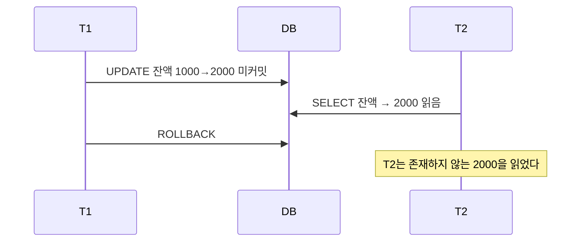
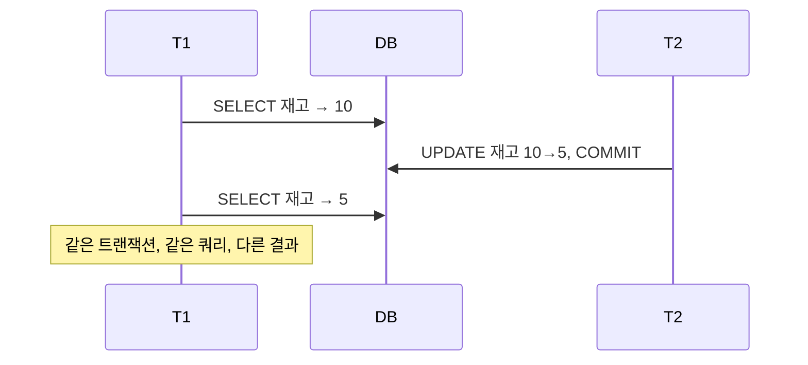
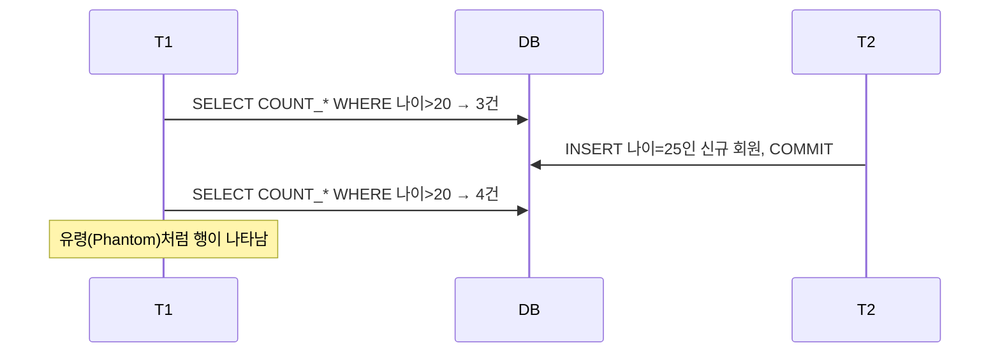
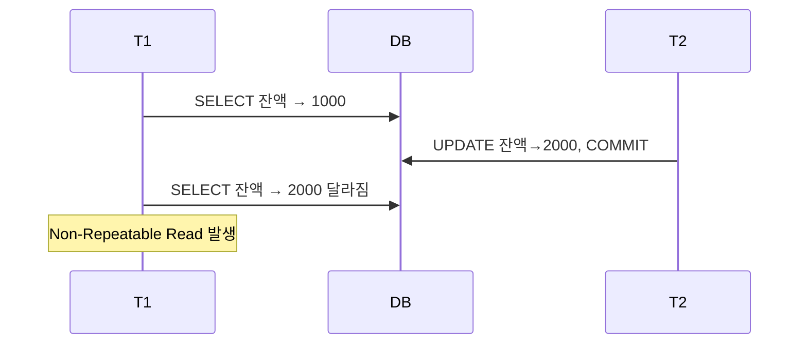
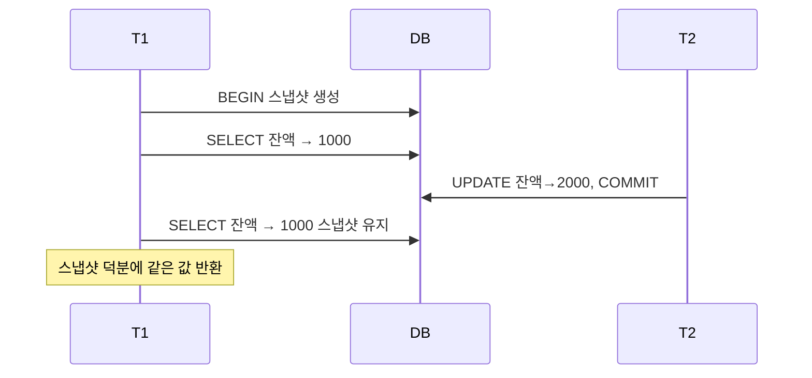
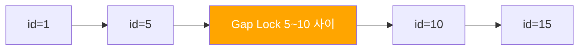
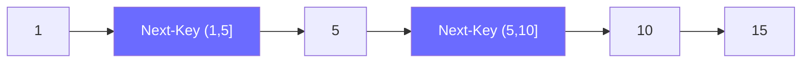

은행에서 잔액을 조회하는 순간, 다른 트랜잭션이 동시에 입금과 출금을 하고 있다. 격리 수준이 낮으면 존재하지도 않는 돈을 보거나, 방금 있던 돈이 사라지거나, 없던 행이 갑자기 나타난다. 이 글은 트랜잭션의 ACID부터 MySQL InnoDB의 MVCC 내부 구조, 그리고 Spring 설정까지 격리 수준 전체를 완전히 정리한다.

> **비유:** 트랜잭션 격리 수준은 도서관 열람실 칸막이와 같다. 칸막이가 없으면(READ UNCOMMITTED) 옆 사람이 연필로 적는 중간 내용도 보인다. 칸막이가 생기면(READ COMMITTED) 옆 사람이 제출한 결과물만 본다. 유리벽이 생기면(REPEATABLE READ) 내 조회 시점 이후 변경은 안 보인다. 완전 차단(SERIALIZABLE)이면 한 번에 한 명만 입장한다.

<br>

## 1. ACID — 트랜잭션의 4대 원칙

### 개념

ACID는 트랜잭션이 안전하게 수행되기 위한 4가지 속성이다. 격리 수준은 이 중 **I(Isolation)** 를 얼마나 엄격하게 보장할지를 결정한다.

> **비유 (Atomicity):** 비행기 표 예매는 좌석 확보 + 결제가 하나다. 결제만 되고 좌석이 안 잡히면 절대 안 된다. 전부 성공하거나 전부 실패해야 한다.

> **비유 (Consistency):** 은행 계좌의 총액은 이체 전후로 같아야 한다. A에서 1만 원이 빠지면 B에 1만 원이 반드시 더해져야 한다.

> **비유 (Isolation):** 두 사람이 동시에 같은 구글 문서를 편집할 때 충돌을 막는 잠금 장치다. 내 작업이 끝나기 전엔 상대방이 내 임시 수정본을 볼 수 없다.

> **비유 (Durability):** 은행이 "이체 완료"를 알린 순간, 그 다음 초에 전원이 나가도 이체 기록은 남아있어야 한다.

| 속성 | 의미 | 위반 시 결과 |
|------|------|-------------|
| **Atomicity** (원자성) | 트랜잭션은 전부 성공 또는 전부 실패 | 반쪽 커밋으로 데이터 불일치 |
| **Consistency** (일관성) | 트랜잭션 전후로 DB 무결성 제약 유지 | 외래키 위반, 음수 잔액 |
| **Isolation** (격리성) | 동시 트랜잭션이 서로 간섭하지 않음 | Dirty/Phantom Read 발생 |
| **Durability** (지속성) | 커밋된 데이터는 장애에도 유지 | 장애 후 데이터 유실 |

<br>

## 2. 격리 수준이 없으면 생기는 3가지 문제

### 2-1. Dirty Read

커밋되지 않은 데이터를 다른 트랜잭션이 읽는 현상.



> **비유:** 친구가 메모장에 연필로 "오늘 저녁은 내가 낼게"라고 써놨다. 내가 그걸 보고 지갑을 안 챙겼는데, 친구가 지우개로 지웠다.

1️⃣ T1이 잔액을 1000 → 2000으로 수정하고 커밋하지 않는다
2️⃣ T2가 잔액을 조회해 2000을 읽는다
3️⃣ T1이 롤백한다 → 잔액은 다시 1000
4️⃣ T2는 실재하지 않는 2000을 기반으로 로직을 실행했다

### 2-2. Non-Repeatable Read

같은 트랜잭션 안에서 같은 행을 두 번 읽었는데 결과가 다른 현상.



> **비유:** 마트에서 재고를 확인하고 계산대로 걸어가는 사이에 직원이 물건을 치워버렸다. 분명히 10개 있었는데 계산대에서 5개라고 나온다.

### 2-3. Phantom Read

같은 트랜잭션 안에서 같은 범위 쿼리를 두 번 실행했는데 처음엔 없던 행이 나타나거나 있던 행이 사라지는 현상.



> **비유:** 방 안에 사람이 3명인 걸 확인하고 문을 잠갔는데, 다시 세어보니 4명이다. 벽을 통과한 유령이 나타난 것처럼 새 행이 생겼다.

| 이상 현상 | 원인 | 영향받는 단위 |
|----------|------|-------------|
| Dirty Read | 미커밋 데이터 노출 | 단일 행 |
| Non-Repeatable Read | 커밋된 수정 노출 | 단일 행 (UPDATE/DELETE) |
| Phantom Read | 커밋된 삽입/삭제 노출 | 범위 (INSERT/DELETE) |

<br>

## 3. 4가지 격리 수준

SQL 표준은 4단계 격리 수준을 정의한다. 위로 갈수록 동시성이 높고 아래로 갈수록 정합성이 강하다.

| 격리 수준 | Dirty Read | Non-Repeatable Read | Phantom Read |
|---------|-----------|-------------------|-------------|
| READ UNCOMMITTED | 발생 | 발생 | 발생 |
| READ COMMITTED | 방지 | 발생 | 발생 |
| REPEATABLE READ | 방지 | 방지 | 발생 (InnoDB는 방지) |
| SERIALIZABLE | 방지 | 방지 | 방지 |

### 3-1. READ UNCOMMITTED

커밋되지 않은 변경도 즉시 보인다. 실무에서는 거의 사용하지 않는다.

```sql
SET TRANSACTION ISOLATION LEVEL READ UNCOMMITTED;
```

**언제 쓰는가:** 데이터 정합성보다 성능이 극단적으로 중요한 통계 집계, 근사치 카운트 등에서 드물게 사용.

### 3-2. READ COMMITTED

커밋된 데이터만 읽는다. Oracle, PostgreSQL의 기본값. Non-Repeatable Read와 Phantom Read는 여전히 발생한다.



**적합한 상황:** 읽기 일관성보다 최신 데이터가 더 중요한 경우 (뉴스 피드, 실시간 통계 대시보드).

### 3-3. REPEATABLE READ

MySQL InnoDB의 기본값. 트랜잭션 시작 시점의 스냅샷을 기준으로 읽는다. 같은 행을 두 번 읽어도 항상 같은 값이 보인다.

> **비유:** 사진을 찍어두고 그 사진만 본다. 실물이 변해도 사진은 그대로다. InnoDB는 MVCC로 이 스냅샷을 구현한다.



**InnoDB의 추가 보장:** Next-Key Lock으로 Phantom Read도 대부분 방지한다 (SQL 표준보다 강력).

### 3-4. SERIALIZABLE

모든 SELECT를 암묵적으로 `SELECT ... FOR SHARE`로 처리. 완전한 직렬 실행을 보장하지만 동시성이 가장 낮다.

```sql
-- SERIALIZABLE에서는 아래 두 SELECT가 동일하게 동작
SELECT * FROM orders WHERE amount > 1000;
SELECT * FROM orders WHERE amount > 1000 LOCK IN SHARE MODE;
```

**언제 쓰는가:** 금융 계좌 원장 마감, 재무제표 생성 등 절대적 일관성이 필요한 배치 작업.

<br>

## 4. MySQL InnoDB MVCC 내부 구조

InnoDB가 REPEATABLE READ를 높은 동시성으로 구현하는 핵심 메커니즘이 MVCC다.

> **비유:** MVCC는 구글 Docs의 버전 히스토리다. 누군가 문서를 수정해도 이전 버전을 볼 수 있다. DB는 행의 여러 버전을 동시에 보관하고, 트랜잭션마다 자신의 시점에 맞는 버전을 읽는다.

### 4-1. Undo Log

행이 변경될 때마다 이전 버전을 Undo Log에 기록한다. 이 로그가 MVCC의 기반이다.

```
실제 데이터 페이지:
  [id=1 | name='Kim' | trx_id=100 | roll_ptr ──────────────┐]
                                                             │
Undo Log:                                                    ▼
  [id=1 | name='Lee' | trx_id=50  | roll_ptr ──────────────┐]
                                                             │
  [id=1 | name='Park' | trx_id=10 | roll_ptr=null          ◀┘]

→ 각 행은 이전 버전을 가리키는 포인터(roll_ptr)로 연결된 체인을 형성
```

1️⃣ UPDATE가 실행되면 현재 행의 이전 값을 Undo Log에 복사한다
2️⃣ 현재 행의 `trx_id`를 새 트랜잭션 ID로, `roll_ptr`을 Undo Log 주소로 설정한다
3️⃣ ROLLBACK 시 Undo Log에서 이전 값을 복원한다
4️⃣ 모든 트랜잭션이 이전 버전을 참조하지 않으면 Purge 스레드가 Undo Log를 삭제한다

### 4-2. Read View

트랜잭션이 `BEGIN` 할 때 생성되는 스냅샷. "내가 볼 수 있는 버전의 범위"를 정의한다.

```
Read View 구조:
  creator_trx_id : 이 Read View를 만든 트랜잭션 ID (예: 200)
  m_ids          : 활성 트랜잭션 ID 목록 (예: [190, 195, 200])
  min_trx_id     : m_ids 중 최솟값 (예: 190)
  max_trx_id     : 다음 트랜잭션에 부여될 ID (예: 201)

가시성 판단 규칙 (행의 trx_id = X):
  X < min_trx_id            → 커밋 완료, 보임
  X >= max_trx_id           → Read View 이후 시작, 안 보임
  min_trx_id <= X < max_trx_id:
    X가 m_ids에 없음         → 커밋 완료, 보임
    X가 m_ids에 있음         → 아직 활성, 안 보임 (Undo Log에서 이전 버전 탐색)
```

**READ COMMITTED vs REPEATABLE READ의 차이:**

```
READ COMMITTED:
  SELECT를 실행할 때마다 새 Read View 생성
  → 항상 최신 커밋 데이터를 반영
  → Non-Repeatable Read 발생

REPEATABLE READ:
  트랜잭션 첫 번째 SELECT에서만 Read View 생성
  → 트랜잭션 전체에서 동일 스냅샷 유지
  → Non-Repeatable Read 방지
```

<br>

## 5. Gap Lock과 Next-Key Lock — Phantom Read 방지

### Gap Lock

인덱스 레코드 사이의 **간격(Gap)** 에 거는 락. INSERT를 차단해 Phantom Read를 방지한다.



```sql
-- T1: id가 5~10 사이 범위 조회
SELECT * FROM users WHERE id BETWEEN 5 AND 10 FOR UPDATE;

-- T2: id=7 삽입 시도 → Gap Lock에 의해 차단
INSERT INTO users (id, name) VALUES (7, 'New');  -- 대기!
```

Gap Lock은 **레코드가 없는 곳**에도 적용된다. 범위 쿼리에서 빈 구간에도 락이 걸린다.

### Next-Key Lock

**Record Lock + Gap Lock** 의 조합. InnoDB REPEATABLE READ에서 기본으로 동작한다.

```
인덱스: 1, 5, 10, 15

Next-Key Lock 구간 (BETWEEN 5 AND 10 실행 시):
  (-∞, 1]   : 미해당
  (1, 5]    : Record Lock on 5 + Gap (1,5)
  (5, 10]   : Record Lock on 10 + Gap (5,10)
  (10, 15]  : 미해당 (범위 밖)

→ 5와 10에 Record Lock, (1,5) (5,10) 구간에 Gap Lock
→ id=3, 7, 9 INSERT 모두 차단 → Phantom Read 방지
```



### 인덱스가 없을 때의 위험

```sql
-- name 컬럼에 인덱스가 없는 경우
SELECT * FROM users WHERE name = 'Kim' FOR UPDATE;
```

인덱스가 없으면 Full Table Scan → **테이블의 모든 레코드와 모든 Gap에 락** 이 걸린다. 사실상 테이블 락과 동일하다. 락을 거는 쿼리에는 반드시 인덱스가 있어야 한다.

<br>

## 6. PostgreSQL vs MySQL 격리 수준 비교

두 DB는 같은 SQL 표준을 구현했지만 내부 동작 방식이 다르다.

| 항목 | MySQL InnoDB | PostgreSQL |
|------|-------------|-----------|
| 기본 격리 수준 | REPEATABLE READ | READ COMMITTED |
| MVCC 구현 | Undo Log 기반 | MVCC + Visibility Map |
| Phantom Read 방지 | Next-Key Lock으로 대부분 방지 | SERIALIZABLE SSI 알고리즘 |
| SERIALIZABLE 구현 | 모든 읽기에 S Lock | SSI (Serializable Snapshot Isolation) |
| 갭 락 | 있음 (Gap Lock, Next-Key Lock) | 없음 (SSI로 대체) |
| 데드락 감지 | 즉시 감지 후 롤백 | 즉시 감지 후 롤백 |

### PostgreSQL SERIALIZABLE SSI

PostgreSQL은 락 없이 SERIALIZABLE을 구현한다. 트랜잭션 간의 의존성 그래프를 추적하고, 사이클이 생기면 그 중 하나를 롤백한다.

```
읽기-쓰기 의존성 추적:
  T1이 읽은 행을 T2가 수정   → T1 →(rw)→ T2
  T2가 읽은 행을 T1이 수정   → T2 →(rw)→ T1
  사이클 감지 (T1→T2→T1)   → 하나를 롤백
```

**결과:** PostgreSQL SERIALIZABLE은 락 경합이 없어 MySQL보다 처리량이 높지만, 직렬화 충돌 시 재시도가 필요하다.

### MySQL에서 Phantom Read가 발생하는 예외 케이스

MVCC와 Next-Key Lock이 함께 동작하지 않는 틈에서 Phantom Read가 발생할 수 있다.

```sql
-- T1
BEGIN;
SELECT * FROM orders WHERE amount > 1000;  -- 3건 조회 (스냅샷)

-- T2
INSERT INTO orders (amount) VALUES (2000);  COMMIT;

-- T1: MVCC라면 여전히 3건
SELECT * FROM orders WHERE amount > 1000;  -- 3건 (정상)

-- T1: 하지만 SELECT FOR UPDATE는 현재 데이터를 읽음
SELECT * FROM orders WHERE amount > 1000 FOR UPDATE;  -- 4건! Phantom Read 발생
```

`FOR UPDATE`나 `LOCK IN SHARE MODE`는 MVCC 스냅샷이 아닌 현재 데이터를 읽기 때문에 REPEATABLE READ에서도 Phantom Read가 발생할 수 있다.

<br>

## 7. Spring @Transactional isolation 설정

### 기본 사용법

```java
@Service
public class OrderService {

    // 기본값: DB 설정에 따름 (MySQL = REPEATABLE READ)
    @Transactional
    public void processOrder(Long orderId) { }

    // READ COMMITTED: 최신 데이터 읽기, 비교적 높은 동시성
    @Transactional(isolation = Isolation.READ_COMMITTED)
    public List<Order> getRecentOrders() { }

    // REPEATABLE READ: 트랜잭션 내 일관된 읽기 보장
    @Transactional(isolation = Isolation.REPEATABLE_READ)
    public void generateReport() { }

    // SERIALIZABLE: 완전한 직렬 처리 (성능 최저)
    @Transactional(isolation = Isolation.SERIALIZABLE)
    public void closingProcess() { }
}
```

### 격리 수준별 적합한 상황

```java
// 1. READ COMMITTED: 실시간 대시보드, 통계 집계
@Transactional(isolation = Isolation.READ_COMMITTED)
public DashboardStats getDashboard() {
    // 약간의 불일치 허용, 최신값 필요
    return statsRepository.aggregateAll();
}

// 2. REPEATABLE READ: 재고 확인 후 주문 처리
@Transactional(isolation = Isolation.REPEATABLE_READ)
public void placeOrder(Long productId, int quantity) {
    Product product = productRepository.findById(productId);
    // 이 트랜잭션 안에서 재고가 다시 바뀌어 보이지 않음을 보장
    if (product.getStock() < quantity) {
        throw new InsufficientStockException();
    }
    product.decreaseStock(quantity);
}

// 3. SERIALIZABLE: 월말 정산, 원장 마감
@Transactional(isolation = Isolation.SERIALIZABLE)
public void monthlySettlement(YearMonth period) {
    // 절대적 일관성 필요, 다른 트랜잭션이 끼어들 수 없음
    settlementRepository.closeAll(period);
}
```

### 주의사항: propagation과의 조합

```java
@Service
public class OuterService {

    @Transactional(isolation = Isolation.READ_COMMITTED)
    public void outerMethod() {
        innerService.innerMethod();  // 이미 트랜잭션 안에 있음
    }
}

@Service
public class InnerService {

    // REQUIRES_NEW가 아니면 외부 트랜잭션의 격리 수준을 따름
    // outer가 READ_COMMITTED이면 inner의 SERIALIZABLE 설정이 무시됨
    @Transactional(isolation = Isolation.SERIALIZABLE)
    public void innerMethod() { }
}
```

**실무 주의:** Spring은 트랜잭션이 이미 시작된 상태에서 다른 격리 수준으로 참여할 수 없다. 격리 수준을 바꾸려면 `propagation = Propagation.REQUIRES_NEW`로 새 트랜잭션을 시작해야 한다.

<br>

## 8. 극한 시나리오

### 8-1. 재고 차감 동시성 — 격리 수준별 결과

```
시나리오: 재고 1개, 동시 주문 2건

REPEATABLE READ (MVCC):
  T1: BEGIN, SELECT stock=1 (스냅샷 생성)
  T2: BEGIN, SELECT stock=1 (스냅샷 생성)
  T1: UPDATE stock=0, COMMIT
  T2: UPDATE stock=0, COMMIT
  결과: stock=-1 (두 트랜잭션 모두 성공, 재고 음수!)

  이유: MVCC는 SELECT를 스냅샷으로 읽지만,
        UPDATE는 실제 현재값을 수정하기 때문

해결책: SELECT ... FOR UPDATE 사용
  T1: SELECT stock=1 FOR UPDATE (X Lock 획득)
  T2: SELECT stock=1 FOR UPDATE (T1 커밋까지 대기)
  T1: UPDATE stock=0, COMMIT (Lock 해제)
  T2: SELECT stock=0 → 재고 부족 예외
  결과: 정확히 1건만 성공
```

```java
@Transactional
public void decreaseStock(Long productId, int quantity) {
    // MVCC SELECT 는 안전하지 않음 — FOR UPDATE 필수
    Product product = productRepository.findByIdForUpdate(productId)
            .orElseThrow(() -> new IllegalArgumentException("상품 없음"));

    if (product.getStock() < quantity) {
        throw new InsufficientStockException("재고 부족: " + product.getStock());
    }
    product.setStock(product.getStock() - quantity);
}
```

```sql
-- 또는 원자적 UPDATE 한 방으로 해결 (락 없이 가장 빠름)
UPDATE product
SET stock = stock - ?
WHERE id = ? AND stock >= ?;
-- affected rows = 0 이면 재고 부족
```

### 8-2. 데드락 — REPEATABLE READ에서 더 빈번한 이유

```
시나리오: 두 트랜잭션이 서로 다른 순서로 같은 두 행을 수정

T1: UPDATE orders SET status='DONE' WHERE id=1  → X Lock on id=1
T2: UPDATE orders SET status='DONE' WHERE id=2  → X Lock on id=2
T1: UPDATE orders SET status='DONE' WHERE id=2  → id=2 대기 (T2 보유)
T2: UPDATE orders SET status='DONE' WHERE id=1  → id=1 대기 (T1 보유)
→ Deadlock!

InnoDB 감지 방식:
  대기 그래프에서 사이클 발견 즉시
  더 작은 트랜잭션(비용 기준)을 골라 롤백
  → ERROR 1213: Deadlock found
```

**데드락 방지 3원칙:**

1️⃣ 항상 같은 순서로 자원 획득 (id 오름차순 등)

2️⃣ 트랜잭션을 짧게 유지 (락 보유 시간 최소화)

3️⃣ 타임아웃 설정으로 무한 대기 방지

```java
@Transactional
public void processOrders(Long id1, Long id2) {
    // 항상 작은 ID부터 락 획득 → 데드락 구조 원천 차단
    Long first  = Math.min(id1, id2);
    Long second = Math.max(id1, id2);

    Order o1 = orderRepository.findByIdForUpdate(first).orElseThrow();
    Order o2 = orderRepository.findByIdForUpdate(second).orElseThrow();

    o1.complete();
    o2.complete();
}
```

### 8-3. 장기 트랜잭션이 Undo Log를 폭발시키는 시나리오

```
상황: T1이 REPEATABLE READ로 10분째 실행 중

T1 시작 시점 trx_id = 500

그 동안:
  T501 ~ T9000 : 수천 건의 UPDATE 실행
  각 UPDATE마다 Undo Log 생성

문제:
  T1의 Read View가 trx_id=500 스냅샷을 유지하므로
  T501~T9000의 Undo Log를 Purge할 수 없음
  → Undo Log 무한 증가 → 디스크 사용량 폭발
  → innodb_undo_tablespace 꽉 참 → DB 장애
```

**실무 규칙:**

- 장기 OLAP 쿼리에 REPEATABLE READ 사용 금지
- 배치에서 대량 읽기 시 `READ COMMITTED` 사용
- `information_schema.innodb_trx`로 오래된 트랜잭션 모니터링

```sql
-- 10분 이상 실행 중인 트랜잭션 감지
SELECT trx_id, trx_started, trx_state, trx_query
FROM information_schema.innodb_trx
WHERE TIMESTAMPDIFF(MINUTE, trx_started, NOW()) > 10;
```

<br>

## 9. 면접 포인트

### Q1. MySQL InnoDB의 기본 격리 수준은 무엇이고, Phantom Read를 어떻게 방지하는가?

**핵심 답변:** REPEATABLE READ. SQL 표준에서 REPEATABLE READ는 Phantom Read를 허용하지만, InnoDB는 Next-Key Lock(Record Lock + Gap Lock)으로 인덱스 범위에 락을 걸어 Phantom Row의 삽입을 막는다. 단, `SELECT FOR UPDATE`는 MVCC 스냅샷이 아닌 현재 데이터를 읽으므로 이 조합에서는 Phantom Read가 발생할 수 있다.

### Q2. MVCC에서 READ COMMITTED와 REPEATABLE READ의 차이는?

**핵심 답변:** 둘 다 Undo Log 기반의 스냅샷을 사용한다. 차이는 Read View 생성 시점이다. READ COMMITTED는 SELECT마다 새 Read View를 만들어 항상 최신 커밋 데이터를 본다. REPEATABLE READ는 트랜잭션의 첫 SELECT에서 한 번만 Read View를 만들어 이후에도 동일 스냅샷을 유지한다.

### Q3. 격리 수준을 높이면 성능이 왜 낮아지는가?

**핵심 답변:** 격리 수준이 높을수록 더 많은 락(Gap Lock, S Lock)을 보유하는 시간이 길어진다. SERIALIZABLE은 모든 SELECT에 S Lock을 걸어 쓰기 트랜잭션과 충돌한다. 또한 Lock wait가 증가하고 데드락 가능성도 높아진다.

### Q4. Dirty Read가 실무에서 왜 위험한가?

**핵심 답변:** 롤백될 수 있는 데이터를 기반으로 비즈니스 로직을 실행하기 때문이다. 결제 시스템에서 Dirty Read로 잔액 2000원을 읽고 출금했는데 원래 트랜잭션이 롤백되면, 실제 잔액이 1000원인데 2000원을 출금하는 결과가 된다.

### Q5. Gap Lock이 없으면 어떤 문제가 생기는가?

**핵심 답변:** 범위 조회 후 같은 범위를 다시 조회할 때 중간에 INSERT된 행이 보이는 Phantom Read가 발생한다. 예를 들어 `WHERE id BETWEEN 5 AND 10`으로 3건을 읽은 후 다른 트랜잭션이 id=7을 삽입하면, 같은 쿼리에서 4건이 나온다. Gap Lock은 이 범위 내 INSERT를 차단해 이를 방지한다.

### 실무에서 자주 하는 실수

```
실수 1: REPEATABLE READ를 믿고 SELECT 후 UPDATE
  → SELECT는 스냅샷, UPDATE는 현재값 → 재고 음수 발생
  → 해결: SELECT FOR UPDATE 또는 원자적 UPDATE

실수 2: 장기 트랜잭션 방치
  → Undo Log 누적 → 디스크 폭발
  → 해결: 트랜잭션 시간 제한, 페이지 단위 처리

실수 3: FOR UPDATE 쿼리에 인덱스 누락
  → 전체 테이블 Gap Lock → 사실상 테이블 락
  → 해결: WHERE 조건 컬럼에 인덱스 확인 필수

실수 4: Spring @Transactional 중첩 시 격리 수준 무시
  → 내부 메서드의 isolation 설정이 무시됨
  → 해결: REQUIRES_NEW propagation으로 새 트랜잭션 시작
```

<br>

## 정리

```
격리 수준 선택 기준:

READ UNCOMMITTED   → 사용 금지 (특수 통계 근사치 외)
READ COMMITTED     → 최신 데이터 필요, 동시성 우선 (Oracle 기본값)
REPEATABLE READ    → 트랜잭션 내 일관성 필요 (MySQL 기본값, 권장)
SERIALIZABLE       → 절대적 정합성 필요 배치 (금융 마감 등)

핵심 구조:
  MVCC (Undo Log + Read View) → 읽기 성능 보장
  Next-Key Lock               → Phantom Read 방지
  두 메커니즘의 조합           → InnoDB가 REPEATABLE READ에서
                                 Phantom Read까지 방지하는 비결
```

격리 수준은 동시성과 정합성의 트레이드오프다. 기본값인 REPEATABLE READ는 대부분의 상황에서 충분하지만, 재고 차감처럼 "읽고 나서 쓰는" 패턴은 MVCC만으로는 안전하지 않다. `SELECT FOR UPDATE`나 원자적 UPDATE로 보완해야 한다. 격리 수준 설정보다 쿼리 설계가 더 중요하다는 점을 기억하자.

---

## 왜 격리 수준이 중요한가? (vs 단순 락)

단순히 모든 것을 SERIALIZABLE로 설정하면 동시성이 0에 가까워진다. 격리 수준은 "얼마나 많은 이상 현상(anomaly)을 허용하고 대신 동시성을 얻을 것인가"의 트레이드오프다. RDBMS 기본값인 REPEATABLE READ(MySQL InnoDB)나 READ COMMITTED(PostgreSQL)는 대부분의 OLTP 워크로드에서 최적의 균형이다. 격리 수준을 높이거나 낮출 때는 그 영향을 정확히 이해하고 결정해야 한다.

---

## 실무에서 자주 하는 실수

**실수 1: 재고 차감에 MVCC만 믿기**
`SELECT stock ... WHERE id = 1` → 애플리케이션에서 계산 → `UPDATE stock = ?` 패턴을 REPEATABLE READ에서 사용한다. 두 트랜잭션이 동시에 같은 재고를 읽고 각각 차감하면 한 번의 차감만 반영된다. `SELECT FOR UPDATE`나 원자적 `UPDATE stock = stock - 1 WHERE stock > 0`을 사용해야 한다.

**실수 2: READ UNCOMMITTED를 성능 최적화라고 오해**
Dirty Read가 발생해 롤백된 트랜잭션의 데이터를 읽을 수 있다. 실시간 통계 대시보드 등 일부 허용 가능한 경우를 제외하고 운영 코드에서는 절대 사용하지 않는다.

**실수 3: 격리 수준을 전역으로 낮춰서 성능 문제를 해결하려 함**
특정 쿼리의 락 경합 문제를 격리 수준 전체를 낮추는 것으로 해결하려 한다. 의도치 않은 Dirty Read나 Non-repeatable Read 문제가 전체 시스템에 퍼진다. 세션 레벨로 필요한 경우에만 `SET SESSION TRANSACTION ISOLATION LEVEL`을 사용한다.

**실수 4: 장기 트랜잭션으로 MVCC 언두 로그 폭증**
보고서 생성, 대량 배치를 단일 트랜잭션으로 감싸 수십 분간 유지한다. 그 사이 모든 변경 버전을 언두 로그에 보존해야 해서 스토리지가 폭증하고 퍼지 스레드가 지연된다. 배치는 청크 단위로 커밋하거나 읽기 전용 레플리카에서 실행한다.

**실수 5: PostgreSQL의 기본값이 READ COMMITTED임을 간과**
MySQL InnoDB 기본값은 REPEATABLE READ다. PostgreSQL 기본값은 READ COMMITTED다. 같은 코드를 두 DB에서 실행할 때 Non-repeatable Read 동작이 달라진다. DB 마이그레이션 시 반드시 격리 수준 동작 차이를 검증해야 한다.
