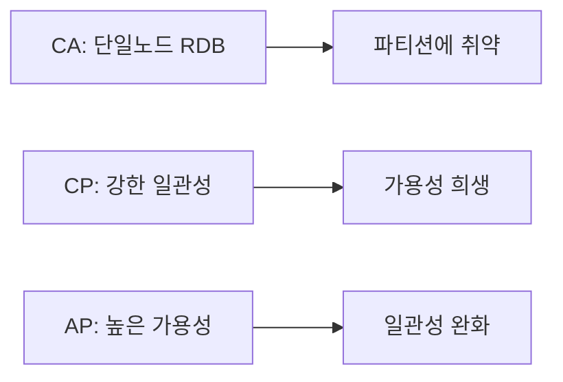
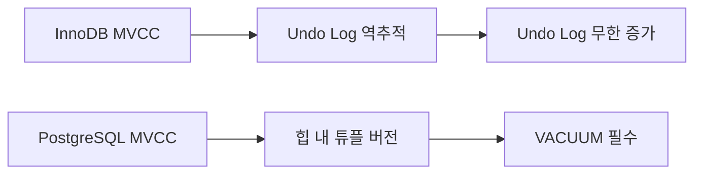
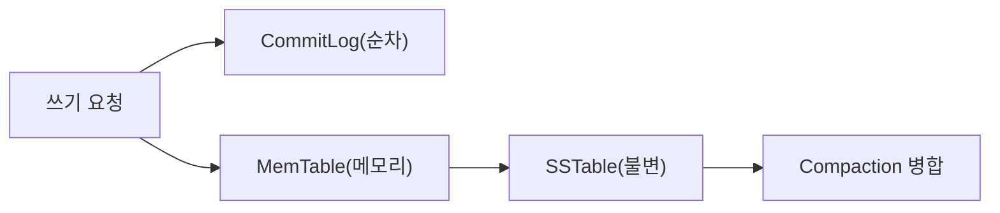
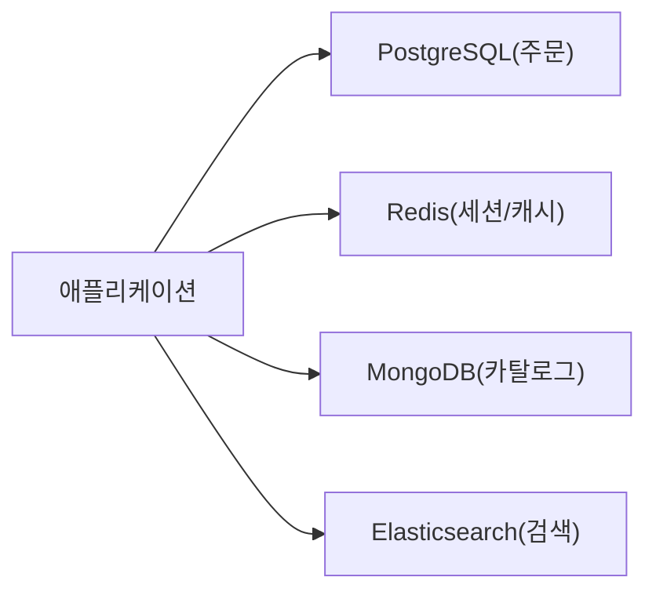
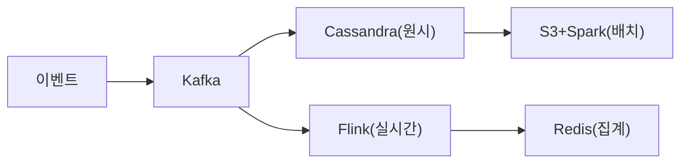
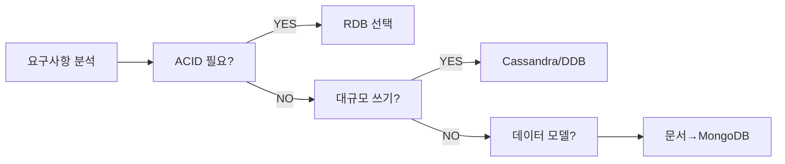

> **비유로 먼저 이해하기**: DB 선택은 집을 짓는 것과 같다. RDB는 설계도(스키마)를 먼저 그려야 하는 철근 콘크리트 건물이다. 구조가 견고하고 내부 이동이 자유롭지만, 벽을 뚫기(스키마 변경)는 쉽지 않다. NoSQL은 레고 블록이다. 원하는 형태로 빠르게 쌓을 수 있지만, 빌딩을 지으려면 기초(데이터 모델링)를 잘못 잡으면 무너진다. 어떤 집이 더 좋은가가 아니라, **어떤 집에 살 것인가**를 먼저 결정해야 한다.

DB 선택은 기술적 판단인 동시에 비즈니스적 판단이다. 잘못된 선택은 수년 뒤 마이그레이션 공사로 이어진다. 이 글은 요구사항 분석부터 CAP 정리, 데이터 모델 비교, 각 DB의 내부 메커니즘, 폴리글랏 영속성 전략, 그리고 마이그레이션까지 — 시니어 개발자가 실제 현장에서 DB를 고를 때 필요한 모든 판단 근거를 담는다.

---

## 1. DB 선택의 시작점 — 요구사항 분석 프레임워크

### 1.1 기술 스택을 먼저 고르는 함정

많은 팀이 "요즘 MongoDB를 많이 쓴다더라", "Redis가 빠르다더라"는 이유로 DB를 먼저 정하고 아키텍처를 거기에 맞춘다. 이것은 순서가 완전히 거꾸로다. **DB는 요구사항의 결과물이지, 출발점이 아니다.**

올바른 순서는 다음과 같다.

```
요구사항 분석 → 데이터 특성 파악 → 접근 패턴 정의 → DB 후보 선정 → 검증
```

DB를 먼저 고르면 요구사항을 DB에 맞추게 되고, 이는 필연적으로 불필요한 복잡도와 성능 문제를 낳는다.

### 1.2 요구사항 분석 5축

좋은 DB 선택을 위해 반드시 답해야 할 5가지 질문이 있다.

**1축: 읽기/쓰기 비율(Read/Write Ratio)**

읽기가 압도적으로 많은가(예: 뉴스 피드, 상품 목록), 쓰기가 많은가(예: 로그, 이벤트 스트림), 혼합인가(예: 주문 처리)에 따라 최적화 전략이 달라진다. 읽기가 많으면 인덱스와 캐싱이, 쓰기가 많으면 LSM 트리 기반 DB(Cassandra, RocksDB)나 WAL 최적화가 유리하다.

**2축: 일관성 요구 수준(Consistency Level)**

은행 이체처럼 절대적 정확성이 필요한가, 소셜 피드 좋아요처럼 수초의 지연이 허용되는가? 일관성 수준은 CAP 정리와 직결되며, 선택한 일관성 수준이 DB 후보를 절반으로 줄인다.

**3축: 데이터 관계 복잡도(Relationship Complexity)**

엔티티 간 관계가 복잡하고 임의 조회(ad-hoc query)가 필요한가? 아니면 접근 패턴이 단순하고 고정적인가? 관계가 복잡할수록 RDB의 JOIN이 강점을 발휘하고, 패턴이 고정적일수록 NoSQL의 비정규화가 유리하다.

**4축: 확장 요구사항(Scale Requirements)**

수직 확장(서버 사양 올리기)으로 충분한가, 수평 확장(서버 대수 늘리기)이 필요한가? 데이터 크기가 단일 노드 한계를 넘어설 것인가? 대부분의 서비스는 RDB의 수직 확장으로 충분히 처리 가능한 규모다.

**5축: 스키마 변경 빈도(Schema Evolution)**

초기 스타트업처럼 요구사항이 빠르게 바뀌는가, 은행처럼 스키마가 수년간 고정적인가? 빠른 스키마 변경이 필요하면 유연한 스키마의 NoSQL이 개발 속도를 높여준다.

### 1.3 요구사항 → DB 후보 매핑

| 요구사항 패턴 | 우선 고려 DB | 이유 |
|---|---|---|
| 복잡한 관계 + 임의 쿼리 | PostgreSQL, MySQL | JOIN, SQL의 표현력 |
| 높은 쓰기 처리량 + 시계열 | Cassandra, InfluxDB | LSM 트리, 쓰기 최적화 |
| 세션/캐시/실시간 카운터 | Redis | 메모리 속도, 자료구조 |
| 유연한 문서 + 중간 규모 | MongoDB | 유연한 스키마, 풍부한 쿼리 |
| 글로벌 분산 + 관리 부담 없음 | DynamoDB | 완전 관리형, 자동 샤딩 |
| 관계망 탐색 | Neo4j, Amazon Neptune | 그래프 탐색 알고리즘 |
| 전문 검색 | Elasticsearch | 역색인, 텍스트 분석 |

---

## 2. CAP 정리 — 이론이 아닌 실전 판단 도구

### 2.1 CAP 정리의 의미

CAP 정리(Brewer's theorem, 2000)는 분산 시스템에서 다음 세 가지 속성을 동시에 모두 만족할 수 없다는 이론이다.

- **C (Consistency)**: 모든 노드가 동일한 시점에 동일한 데이터를 본다
- **A (Availability)**: 노드 일부가 장애여도 모든 요청에 응답한다
- **P (Partition Tolerance)**: 네트워크 파티션(노드 간 통신 단절)이 발생해도 계속 동작한다

핵심은 이것이다. **네트워크 파티션은 실제로 발생한다.** 클라우드 환경에서 네트워크 단절은 연간 수차례 발생하는 현실이다. 따라서 P는 선택이 아닌 필수다. 결국 CA vs CP vs AP의 선택이 된다.



### 2.2 CP 시스템 — 일관성을 절대 타협하지 않는 경우

CP 시스템은 네트워크 파티션 발생 시 응답을 거부(timeout)하더라도 일관된 데이터를 보장한다.

**언제 CP를 선택하는가?**

- 은행 계좌 이체: A 계좌에서 100만 원이 빠져나갔는데 B 계좌에 입금이 보이지 않으면 치명적이다
- 재고 관리: 동일 상품이 두 번 판매되면 실제 손실이 발생한다
- 예약 시스템: 같은 좌석이 두 사람에게 예약되면 안 된다

CP를 지향하는 DB 예시: HBase, Zookeeper, etcd, MongoDB(w:majority 설정 시)

**실제 동작**: CP 시스템에서 파티션이 발생하면, 과반수 노드와 통신할 수 없는 소수 노드는 쓰기를 거부하고 읽기도 stale 응답을 피하기 위해 에러를 반환한다. 가용성을 희생해 일관성을 지킨다.

### 2.3 AP 시스템 — 일관성보다 가용성을 선택하는 경우

AP 시스템은 네트워크 파티션 중에도 응답을 계속 반환한다. 대신 노드마다 다른 값을 볼 수 있다(Eventual Consistency).

**언제 AP를 선택하는가?**

- SNS 피드: 팔로워가 A에겐 새 게시물이 보이고 B에겐 아직 안 보여도 수초 뒤 동기화되면 충분하다
- 좋아요 수: 1,234개와 1,235개 중 어느 것을 보여줘도 비즈니스에 영향 없다
- 쇼핑몰 상품 조회: 재고 수량이 수초 지연되어도 대부분 허용된다

AP를 지향하는 DB 예시: Cassandra, DynamoDB, CouchDB, Riak

**최종 일관성(Eventual Consistency)의 의미**: 쓰기가 성공하면 결국(eventually) 모든 노드가 해당 값을 갖게 된다. "언제까지"는 시스템 설정에 따라 수십 ms에서 수초까지 달라진다.

### 2.4 PACELC — CAP을 넘어선 실전 모델

CAP 정리는 파티션 발생 시에만 적용된다. 파티션이 없을 때도 지연(Latency)과 일관성(Consistency) 사이의 트레이드오프가 존재한다. PACELC 모델은 이를 확장한다.

- **Partition 발생 시**: A(Availability) vs C(Consistency) 선택
- **Else(정상 상태)**: L(Latency) vs C(Consistency) 선택

예를 들어 DynamoDB는 파티션 시 AP, 정상 시 EL(낮은 지연 우선) 성향이다. PostgreSQL은 파티션 시 CP, 정상 시 EC(일관성 우선) 성향이다.

---

## 3. 데이터 모델 비교 — 구조가 성능을 결정한다

### 3.1 관계형 모델 (Relational)

RDB의 핵심은 **정규화(Normalization)** 와 **JOIN** 이다. 데이터를 중복 없이 최소 단위로 분리하고, 필요한 시점에 JOIN으로 조합한다.

**정규화의 장점**: 데이터 무결성 보장, 중복 최소화, 업데이트 이상 현상 방지

**JOIN의 작동 원리**: MySQL InnoDB 기준, Nested Loop Join이 기본이다. 옵티마이저가 비용 기반으로 Hash Join, Merge Join을 선택하기도 한다. 인덱스가 잘 설계된 경우 JOIN 비용은 매우 낮다.

```java
// JPA를 이용한 관계형 모델 조회
@Entity
public class Order {
    @Id @GeneratedValue
    private Long id;

    @ManyToOne(fetch = FetchType.LAZY)
    @JoinColumn(name = "user_id")
    private User user;

    @OneToMany(mappedBy = "order", cascade = CascadeType.ALL)
    private List<OrderItem> items;
}

// JPQL JOIN FETCH로 N+1 문제 해결
public List<Order> findOrdersWithItems(Long userId) {
    return em.createQuery(
        "SELECT DISTINCT o FROM Order o " +
        "JOIN FETCH o.user " +
        "JOIN FETCH o.items i " +
        "JOIN FETCH i.product " +
        "WHERE o.user.id = :userId", Order.class)
        .setParameter("userId", userId)
        .getResultList();
}
```

### 3.2 문서 모델 (Document)

MongoDB의 문서 모델은 **비정규화(Denormalization)** 를 기본으로 한다. 관련 데이터를 한 문서 안에 내장(embedding)하거나, 참조(referencing)로 연결한다.

**Embedding vs Referencing 판단 기준**:

| 기준 | Embedding 선택 | Referencing 선택 |
|---|---|---|
| 접근 패턴 | 항상 함께 조회 | 독립적으로 조회 |
| 데이터 크기 | 소형 (< 16MB) | 대형 또는 무한 증가 |
| 업데이트 빈도 | 낮음 | 높음 (공유 데이터) |
| 중복 허용 여부 | 허용 | 허용 불가 |

```java
// Spring Data MongoDB — 내장 방식 (Embedding)
@Document(collection = "orders")
public class Order {
    @Id
    private String id;
    private String userId;
    private List<OrderItem> items; // 내장 — 주문과 항목은 항상 함께 조회

    @Data
    public static class OrderItem {
        private String productId;
        private String productName; // 비정규화 — 조회 시 JOIN 불필요
        private int quantity;
        private BigDecimal price;
    }
}

// MongoTemplate을 이용한 조회
public List<Order> findByUserId(String userId) {
    Query query = new Query(Criteria.where("userId").is(userId));
    return mongoTemplate.find(query, Order.class);
}
```

**내장 방식의 WHY**: 단일 문서 조회로 완결되므로 네트워크 왕복(round trip)이 1회다. RDB에서 Order + OrderItem + Product를 JOIN하는 것과 달리, MongoDB는 단일 도큐먼트 fetch로 끝난다. 단, 상품 정보가 바뀌면 모든 주문 문서의 productName을 업데이트해야 하는 비용이 발생한다.

### 3.3 키-값 모델 (Key-Value)

Redis, DynamoDB의 기본 모델이다. 키로 값을 조회하는 O(1) 접근이 가장 빠르다. 임의 쿼리(ad-hoc query)는 지원하지 않거나 매우 제한적이다.

```java
// Spring Data Redis — 세션 저장
@RedisHash("sessions")
public class UserSession {
    @Id
    private String sessionId;
    private Long userId;
    private String role;

    @TimeToLive
    private Long expiration = 1800L; // 30분 TTL
}

public interface UserSessionRepository
    extends CrudRepository<UserSession, String> {}
```

**키-값의 WHY**: 메모리 상의 해시 테이블(정확히는 Redis의 dict 구조)에서 O(1)으로 값을 찾는다. 디스크 I/O가 없고 파싱 오버헤드가 최소화된다. 초당 수십만 건의 처리가 가능한 이유다.

### 3.4 와이드 컬럼 모델 (Wide-Column)

Cassandra, HBase가 대표적이다. 행(Row)마다 다른 컬럼을 가질 수 있으며, 시계열 데이터나 이벤트 로그에 적합하다.

Cassandra의 테이블 구조는 RDB와 다르다. **파티션 키(Partition Key)** 가 데이터의 물리적 위치를 결정하고, **클러스터링 키(Clustering Key)** 가 파티션 내 정렬 순서를 결정한다.

```sql
-- Cassandra CQL: 시계열 이벤트 테이블
CREATE TABLE user_events (
    user_id UUID,
    event_time TIMESTAMP,
    event_type TEXT,
    payload TEXT,
    PRIMARY KEY (user_id, event_time)  -- user_id: 파티션키, event_time: 클러스터링키
) WITH CLUSTERING ORDER BY (event_time DESC);
```

**WHY**: 파티션 키로 데이터를 해시하여 특정 노드로 라우팅한다. 클러스터링 키로 정렬된 데이터는 SSTable에 연속 저장되어 범위 스캔이 효율적이다. 이 설계 덕분에 특정 사용자의 최근 이벤트 조회는 단일 파티션 스캔으로 끝난다.

### 3.5 그래프 모델 (Graph)

관계 자체가 일급 객체(First-class Citizen)인 데이터 모델이다. 소셜 네트워크("친구의 친구"), 추천 시스템, 사기 탐지에 특화된다.

RDB에서 "3단계 친구 관계" 조회는 3번의 자기 JOIN이 필요하고, 깊이가 늘어날수록 폭발적으로 복잡해진다. 그래프 DB는 이를 간단한 traversal 쿼리로 처리한다.

```cypher
-- Neo4j Cypher: 3단계 친구 추천
MATCH (me:User {id: 'user123'})-[:FRIEND*1..3]->(recommended:User)
WHERE NOT (me)-[:FRIEND]->(recommended)
  AND me <> recommended
RETURN DISTINCT recommended.name, recommended.id
LIMIT 20
```

---

## 4. RDB 심층 분석 — 강점과 한계

### 4.1 ACID의 실제 의미

ACID는 RDB의 핵심 가치 제안이다. 각 속성이 어떻게 구현되는지를 이해해야 "왜 RDB를 선택하는가"에 답할 수 있다.

**Atomicity(원자성)**: Undo Log(InnoDB) 또는 MVCC 버전 체인(PostgreSQL)으로 구현된다. 트랜잭션 도중 실패하면 Undo Log를 역으로 적용하여 이전 상태로 복원한다.

**Consistency(일관성)**: FK 제약, UNIQUE 제약, CHECK 제약, Trigger가 도메인 무결성을 강제한다. 애플리케이션 코드가 아닌 DB 레이어에서 규칙을 집행하므로 어떤 경로로 접근해도 규칙이 적용된다.

**Isolation(격리성)**: MVCC(Multi-Version Concurrency Control)로 구현된다. 읽기와 쓰기가 서로를 블로킹하지 않는다. 격리 수준(READ COMMITTED, REPEATABLE READ 등)에 따라 보이는 데이터 버전이 달라진다.

**Durability(지속성)**: WAL(Write-Ahead Log)로 구현된다. 커밋 전 반드시 로그가 디스크에 fsync된다. 서버가 크래시되어도 WAL을 재생하면 커밋된 데이터는 손실 없이 복구된다.

```java
// Spring @Transactional — ACID 보장
@Service
@Transactional
public class TransferService {

    public void transfer(Long fromId, Long toId, BigDecimal amount) {
        Account from = accountRepo.findById(fromId)
            .orElseThrow(() -> new AccountNotFoundException(fromId));
        Account to = accountRepo.findById(toId)
            .orElseThrow(() -> new AccountNotFoundException(toId));

        if (from.getBalance().compareTo(amount) < 0) {
            throw new InsufficientBalanceException();
        }

        // 두 UPDATE가 하나의 트랜잭션 — 둘 다 성공하거나 둘 다 롤백
        from.debit(amount);
        to.credit(amount);
        // 메서드 종료 시 자동 커밋, 예외 발생 시 자동 롤백
    }
}
```

### 4.2 복잡한 쿼리와 옵티마이저

RDB의 비용 기반 옵티마이저(CBO)는 통계 정보를 바탕으로 수백 가지 실행 계획 중 최적을 선택한다. 이 능력이 임의 쿼리(ad-hoc query)에서 NoSQL 대비 압도적인 강점이다.

```sql
-- RDB에서 자유롭게 가능한 복잡 쿼리
SELECT
    u.name,
    COUNT(o.id) AS order_count,
    SUM(o.total_amount) AS total_spent,
    AVG(r.rating) AS avg_rating
FROM users u
    LEFT JOIN orders o ON u.id = o.user_id
        AND o.created_at >= '2026-01-01'
    LEFT JOIN reviews r ON u.id = r.user_id
WHERE u.created_at >= '2025-01-01'
GROUP BY u.id, u.name
HAVING COUNT(o.id) >= 3
ORDER BY total_spent DESC
LIMIT 100;
```

이 쿼리를 MongoDB에서 실행하려면 다단계 aggregation pipeline을 작성해야 하고, 여러 컬렉션에 걸친 $lookup(JOIN)은 성능이 크게 저하된다. RDB를 선택하는 핵심 이유다.

### 4.3 MySQL vs PostgreSQL — 내부 구현 차이

두 DB는 모두 오픈소스 RDB이지만 내부 구조가 상당히 다르다.

**MVCC 구현 방식**

MySQL InnoDB는 Undo Log 방식이다. 최신 버전만 데이터 파일에 저장하고, 이전 버전은 Undo Log에 기록한다. 트랜잭션이 오래된 버전을 읽어야 할 때 Undo Log를 역추적한다. 장점: 데이터 파일 크기가 작다. 단점: 오래된 트랜잭션이 있으면 Undo Log가 무한히 커질 수 있다(UNDO_HISTORY 문제).

PostgreSQL은 Tuple Versioning 방식이다. 모든 버전을 힙 파일에 함께 저장한다. 각 튜플에 xmin(삽입 트랜잭션 ID), xmax(삭제 트랜잭션 ID)를 기록한다. 장점: Undo 추적이 필요 없어 읽기가 단순하다. 단점: 오래된 버전이 파일에 쌓여 VACUUM 없이는 공간이 반환되지 않는다.



**JSON 지원 차이**

MySQL 5.7+는 JSON 타입을 지원하지만 JSON 컬럼에 대한 인덱스는 Generated Column을 거쳐야 한다. PostgreSQL은 json(텍스트 저장)과 jsonb(바이너리 저장) 두 타입을 지원하며, jsonb는 GIN 인덱스를 직접 적용할 수 있어 JSON 필드 검색이 월등히 빠르다.

```sql
-- PostgreSQL jsonb + GIN 인덱스
CREATE TABLE events (
    id SERIAL PRIMARY KEY,
    payload JSONB
);

CREATE INDEX idx_payload ON events USING GIN (payload);

-- JSON 필드로 빠른 조회
SELECT * FROM events WHERE payload @> '{"type": "purchase", "amount": 10000}';
```

**확장 시스템**

PostgreSQL의 확장(Extension) 생태계는 MySQL 대비 압도적이다. PostGIS(지리정보), pgvector(벡터 검색), TimescaleDB(시계열), pg_partman(파티셔닝 자동화) 등이 있어 용도에 따라 DB 기능을 수술적으로 확장할 수 있다. MySQL의 플러그인 시스템은 이보다 제한적이다.

**언제 MySQL, 언제 PostgreSQL인가?**

| 상황 | MySQL 선택 | PostgreSQL 선택 |
|---|---|---|
| 팀 역량 | MySQL 숙련 팀 | PostgreSQL 숙련 팀 |
| 워크로드 | 단순 OLTP, 높은 삽입/조회 | 복잡한 쿼리, JSONB, 지리정보 |
| 호환성 | 레거시 PHP/MySQL 연동 | 최신 스택, 표준 SQL 준수 |
| 클라우드 | Aurora MySQL | Aurora PostgreSQL, RDS PG |
| 확장 필요 | 플러그인으로 충분 | Extension 생태계 필요 |

---

## 5. MongoDB 심층 분석 — 내부 엔진의 이해

### 5.1 WiredTiger 스토리지 엔진

MongoDB 3.2 이후 기본 스토리지 엔진은 WiredTiger다. WiredTiger는 B+Tree 기반이며 문서 수준(Document-Level) 잠금을 지원한다. MongoDB 2.x 시절의 전역 잠금(Global Lock)과 비교하면 동시성이 크게 향상되었다.

**WiredTiger의 주요 특징**:

- **Snappy/Zstd 압축**: 데이터 파일을 기본적으로 Snappy로 압축하여 디스크 사용량을 30~60% 절감한다
- **체크포인트(Checkpoint)**: 60초마다 또는 2GB 데이터가 변경될 때마다 메모리의 변경 내용을 디스크에 체크포인트로 기록한다
- **저널(Journal)**: WAL과 유사하게 모든 변경을 저널 파일에 먼저 기록한다. 체크포인트 사이에 크래시가 발생해도 저널 재생으로 복구한다

```java
// Spring Data MongoDB — 집계 파이프라인
@Repository
public class OrderAnalyticsRepository {

    @Autowired
    private MongoTemplate mongoTemplate;

    public List<UserSpendingStats> analyzeUserSpending(LocalDate from) {
        Aggregation agg = Aggregation.newAggregation(
            Aggregation.match(
                Criteria.where("createdAt").gte(from.atStartOfDay())
            ),
            Aggregation.group("userId")
                .count().as("orderCount")
                .sum("totalAmount").as("totalSpent")
                .avg("totalAmount").as("avgOrderValue"),
            Aggregation.sort(Sort.Direction.DESC, "totalSpent"),
            Aggregation.limit(100)
        );

        return mongoTemplate.aggregate(agg, "orders", UserSpendingStats.class)
            .getMappedResults();
    }
}
```

### 5.2 복제와 Oplog

MongoDB 복제 집합(Replica Set)은 Primary 1개, Secondary 여러 개로 구성된다. 변경 사항은 Oplog(Operations Log)를 통해 Secondary에 비동기 복제된다.

**Oplog의 핵심**: Oplog는 제한 크기 컬렉션(Capped Collection)으로, 크기를 초과하면 오래된 항목부터 덮어쓴다. Oplog 크기가 너무 작으면 Secondary가 뒤처질 때 복구 불가능한 상태(Stale Secondary)가 된다. 프로덕션에서 Oplog 크기는 24시간치 이상의 변경량을 수용하도록 설정해야 한다.

**쓰기 우려 수준(Write Concern)**: `{w: "majority"}`로 설정하면 과반수 노드에 복제 완료 후 승인을 반환하여 데이터 손실을 방지한다. `{w: 1}`은 Primary에만 쓰고 바로 승인 — 빠르지만 Primary 장애 시 데이터 손실 가능성이 있다.

```java
// MongoDB WriteConcern 설정
MongoClientSettings settings = MongoClientSettings.builder()
    .writeConcern(WriteConcern.MAJORITY.withJournal(true))
    .readPreference(ReadPreference.secondaryPreferred())
    .build();
```

### 5.3 샤딩 — 샤드 키 선택이 전부다

MongoDB 샤딩은 샤드 키(Shard Key)로 데이터를 분산한다. 잘못된 샤드 키 선택은 핫 파티션(특정 샤드에 트래픽 집중)을 유발하여 성능이 오히려 악화된다.

**좋은 샤드 키의 조건**:

1. 높은 카디널리티: 값의 종류가 많아야 여러 샤드에 고루 분산된다
2. 균등 분포: 특정 값으로 집중되지 않아야 한다
3. 쿼리 패턴 부합: 가장 많이 사용하는 쿼리 필터를 포함해야 targeted query가 가능하다

```javascript
// 나쁜 샤드 키 예시 — 단조 증가하는 타임스탬프
sh.shardCollection("orders", { createdAt: 1 })
// 결과: 항상 최신 샤드에만 쓰기 집중 (Hot Shard)

// 좋은 샤드 키 예시 — hashed + 복합 키
sh.shardCollection("orders", { userId: "hashed", createdAt: 1 })
// 결과: userId 해시로 균등 분산, createdAt으로 범위 쿼리 지원
```

---

## 6. Redis 심층 분석 — 캐시를 넘어선 주 데이터베이스

### 6.1 Redis의 자료구조

Redis는 단순한 키-값 저장소가 아니다. 다양한 자료구조를 지원하며, 각 자료구조가 특정 문제를 O(1) 또는 O(log N)으로 해결한다.

| 자료구조 | 명령어 | 시간 복잡도 | 사용 사례 |
|---|---|---|---|
| String | GET/SET | O(1) | 세션, 캐시, 카운터 |
| Hash | HGET/HSET | O(1) | 사용자 프로필 필드 |
| List | LPUSH/RPOP | O(1) | 메시지 큐, 작업 대기열 |
| Set | SADD/SMEMBERS | O(1) per element | 태그, 유니크 방문자 |
| Sorted Set | ZADD/ZRANGE | O(log N) | 리더보드, 스코어 기반 정렬 |
| HyperLogLog | PFADD/PFCOUNT | O(1) | 근사 유니크 카운트 |
| Stream | XADD/XREAD | O(1) | 이벤트 스트림, 로그 |
| Bitmap | SETBIT/BITCOUNT | O(1) per op | 일별 접속 여부, 기능 플래그 |

```java
// Spring Data Redis — 다양한 자료구조 활용
@Service
public class LeaderboardService {

    @Autowired
    private RedisTemplate<String, String> redisTemplate;

    private final String LEADERBOARD_KEY = "leaderboard:2026";

    // Sorted Set으로 실시간 리더보드
    public void updateScore(String userId, double score) {
        redisTemplate.opsForZSet()
            .add(LEADERBOARD_KEY, userId, score);
    }

    // 상위 10명 조회 — O(log N + 10)
    public Set<ZSetOperations.TypedTuple<String>> getTop10() {
        return redisTemplate.opsForZSet()
            .reverseRangeWithScores(LEADERBOARD_KEY, 0, 9);
    }

    // 특정 사용자의 순위 — O(log N)
    public Long getUserRank(String userId) {
        return redisTemplate.opsForZSet()
            .reverseRank(LEADERBOARD_KEY, userId);
    }
}
```

### 6.2 영속성 — RDB 스냅샷과 AOF

Redis의 영속성은 두 가지 메커니즘으로 제공된다.

**RDB(Redis Database) 스냅샷**: 설정한 조건(예: 60초 내 1000개 변경)을 충족하면 전체 메모리를 포크(fork)하여 백그라운드에서 스냅샷을 디스크에 저장한다. 빠른 재시작과 작은 파일 크기가 장점이다. 단점은 마지막 스냅샷 이후 데이터는 손실될 수 있다.

**AOF(Append-Only File)**: 모든 쓰기 명령을 로그 파일에 순차 기록한다. `fsync` 정책에 따라 매 명령(`always`), 매 초(`everysec`), OS 판단(`no`)으로 나뉜다. `everysec`가 성능과 내구성의 균형점으로 가장 많이 쓰인다.

**프로덕션 권장 설정**: RDB + AOF 혼용. 재시작 시 AOF로 복구(더 완전한 데이터), 백업은 RDB 스냅샷 사용.

```yaml
# Redis 영속성 설정 (redis.conf)
save 3600 1       # 1시간 내 1개 변경 시 스냅샷
save 300 100      # 5분 내 100개 변경 시 스냅샷
save 60 10000     # 1분 내 10000개 변경 시 스냅샷

appendonly yes
appendfsync everysec

# AOF 재작성으로 파일 크기 관리
auto-aof-rewrite-percentage 100
auto-aof-rewrite-min-size 64mb
```

### 6.3 Redis가 주 데이터베이스가 되는 경우

Redis를 단순 캐시가 아닌 주 저장소로 사용하는 시나리오가 있다.

**실시간 리더보드**: Sorted Set의 원자적 ZADD/ZRANGE는 수백만 사용자의 실시간 순위를 MySQL로는 불가능한 속도(< 1ms)로 처리한다.

**세션 저장소**: TTL 내장 지원, 해시로 필드별 접근, 분산 환경에서 중앙 세션 관리 — Redis가 정확히 이 요구에 맞는다.

**Rate Limiting**: INCR + EXPIRE 조합으로 슬라이딩 윈도우 Rate Limiter를 Lua 스크립트로 원자적으로 구현할 수 있다.

```java
// Redis Lua 스크립트를 이용한 원자적 Rate Limiting
@Service
public class RateLimiter {

    @Autowired
    private StringRedisTemplate redisTemplate;

    private static final String RATE_LIMIT_SCRIPT =
        "local key = KEYS[1] " +
        "local limit = tonumber(ARGV[1]) " +
        "local window = tonumber(ARGV[2]) " +
        "local current = redis.call('INCR', key) " +
        "if current == 1 then " +
        "  redis.call('EXPIRE', key, window) " +
        "end " +
        "if current > limit then " +
        "  return 0 " +
        "end " +
        "return 1";

    public boolean isAllowed(String userId, int limit, int windowSeconds) {
        String key = "rate:" + userId + ":" + (System.currentTimeMillis() / (windowSeconds * 1000L));
        Long result = redisTemplate.execute(
            new DefaultRedisScript<>(RATE_LIMIT_SCRIPT, Long.class),
            Collections.singletonList(key),
            String.valueOf(limit),
            String.valueOf(windowSeconds)
        );
        return Long.valueOf(1L).equals(result);
    }
}
```

### 6.4 Redis Streams — 경량 메시지 큐

Redis 5.0에 추가된 Streams는 Kafka와 유사한 소비자 그룹(Consumer Group) 기반의 메시지 처리를 지원한다. 소규모 이벤트 스트리밍에서 Kafka의 복잡성 없이 사용할 수 있다.

```java
// Spring Data Redis Streams
@Service
public class EventStreamService {

    @Autowired
    private StringRedisTemplate redisTemplate;

    public void publishEvent(String streamKey, Map<String, String> event) {
        redisTemplate.opsForStream()
            .add(streamKey, event);
    }

    @StreamListener(target = "user-events")
    public void handleUserEvent(MapRecord<String, String, String> record) {
        String eventType = record.getValue().get("type");
        // 이벤트 처리 로직
        redisTemplate.opsForStream()
            .acknowledge("user-events-group", record);
    }
}
```

---

## 7. Cassandra 심층 분석 — 쓰기 최적화의 극한

### 7.1 LSM 트리 — 왜 Cassandra는 쓰기가 빠른가

Cassandra는 B+Tree 대신 LSM 트리(Log-Structured Merge Tree)를 사용한다. 이것이 초당 수만 건의 쓰기를 처리할 수 있는 핵심 이유다.

**LSM 트리 쓰기 경로**:

1. 쓰기 요청이 들어오면 먼저 디스크의 CommitLog에 순차 기록(fsync)
2. 동시에 메모리의 MemTable에 저장
3. MemTable이 임계 크기(기본 32MB)를 넘으면 디스크에 SSTable로 flush
4. 여러 SSTable이 쌓이면 백그라운드 Compaction으로 병합

**왜 빠른가**: 모든 쓰기가 순차 디스크 I/O(CommitLog)와 메모리 쓰기(MemTable)로 처리된다. B+Tree처럼 랜덤 I/O로 페이지를 찾아 업데이트하는 과정이 없다. SSD에서 순차 I/O는 랜덤 I/O 대비 10~100배 빠르다.



### 7.2 일관성 조정 — QUORUM의 수학

Cassandra는 일관성 수준을 쿼리마다 조정할 수 있다. 이것이 "Tunable Consistency"다.

| 일관성 수준 | 의미 | 지연 | 내구성 |
|---|---|---|---|
| ONE | 1개 노드 응답으로 성공 | 최저 | 낮음 |
| QUORUM | 과반수(N/2+1) 응답 | 중간 | 강함 |
| ALL | 모든 노드 응답 | 최고 | 최강 |
| LOCAL_QUORUM | 로컬 DC 과반수 | 낮음(지역) | 강함(지역) |

**QUORUM의 수학**: 복제 계수(RF=3)에서 QUORUM은 2다. 쓰기를 QUORUM(2), 읽기를 QUORUM(2)으로 설정하면 쓰기 2 + 읽기 2 = 4 > 복제 계수 3이므로, 반드시 최신 데이터를 포함한 노드에서 읽게 된다. 이것이 Strong Consistency를 보장하는 수학적 근거다.

```java
// Java Cassandra Driver — 일관성 수준 설정
CqlSession session = CqlSession.builder()
    .withConfigLoader(DriverConfigLoader.fromString(
        "datastax-java-driver.basic.request.consistency = LOCAL_QUORUM"
    ))
    .build();

// 중요한 읽기는 QUORUM, 일반 읽기는 ONE
PreparedStatement criticalRead = session.prepare(
    SimpleStatement.builder("SELECT * FROM accounts WHERE id = ?")
        .setConsistencyLevel(ConsistencyLevel.QUORUM)
        .build()
);
```

### 7.3 Cassandra 안티패턴

**ALLOW FILTERING 사용**: 파티션 키 없이 쿼리하면 전체 클러스터 스캔이 발생한다. 이는 Cassandra에서 치명적인 성능 문제다. 접근 패턴에 맞게 테이블을 처음부터 설계해야 한다.

**대형 파티션**: 단일 파티션에 수백만 개의 행이 쌓이면 해당 노드에 부하가 집중된다. 시간 버킷(예: `partition_key = user_id + year_month`)으로 파티션을 분할해야 한다.

---

## 8. DynamoDB 심층 분석 — 완전 관리형 NoSQL

### 8.1 파티션 키와 정렬 키 설계

DynamoDB의 성능은 파티션 키(Partition Key) 설계에 달려 있다. 파티션 키는 데이터를 어느 파티션(물리 스토리지)에 저장할지 결정한다.

**핫 파티션 방지 전략**:

```java
// 나쁜 설계: status를 파티션 키로 사용
// "PENDING" 상태가 80%면 해당 파티션만 과부하
PutItemRequest bad = PutItemRequest.builder()
    .tableName("orders")
    .item(Map.of(
        "status", AttributeValue.fromS("PENDING"),  // 카디널리티 낮음!
        "orderId", AttributeValue.fromS(UUID.randomUUID().toString())
    ))
    .build();

// 좋은 설계: userId를 파티션 키, orderId를 정렬 키
PutItemRequest good = PutItemRequest.builder()
    .tableName("orders")
    .item(Map.of(
        "userId", AttributeValue.fromS(userId),     // 높은 카디널리티
        "orderId", AttributeValue.fromS(orderId),   // 정렬키로 범위 쿼리
        "status", AttributeValue.fromS("PENDING"),
        "createdAt", AttributeValue.fromS(Instant.now().toString())
    ))
    .build();
```

### 8.2 Single-Table Design

DynamoDB의 고급 패턴은 하나의 테이블에 여러 엔티티를 저장하는 Single-Table Design이다. JOIN이 없으므로 관련 데이터를 동일 파티션에 배치하여 단일 쿼리로 조회한다.

```java
// Single-Table Design 예시
// PK: USER#userId, SK: PROFILE — 사용자 프로필
// PK: USER#userId, SK: ORDER#orderId — 사용자 주문
// PK: ORDER#orderId, SK: ITEM#itemId — 주문 항목

// 사용자와 해당 사용자의 모든 주문을 단일 쿼리로 조회
QueryRequest queryRequest = QueryRequest.builder()
    .tableName("app-table")
    .keyConditionExpression("PK = :pk AND begins_with(SK, :skPrefix)")
    .expressionAttributeValues(Map.of(
        ":pk", AttributeValue.fromS("USER#" + userId),
        ":skPrefix", AttributeValue.fromS("ORDER#")
    ))
    .build();
```

### 8.3 GSI/LSI — 추가 접근 패턴 지원

기본 키 이외의 접근 패턴은 GSI(Global Secondary Index) 또는 LSI(Local Secondary Index)로 처리한다.

**GSI**: 완전히 다른 파티션 키와 정렬 키로 인덱스 생성. 쓰기 비용 2배(원본 + 인덱스)이지만 다양한 접근 패턴을 지원한다.

**LSI**: 같은 파티션 키, 다른 정렬 키. 동일 파티션 내에서만 쿼리 가능. 테이블 생성 시에만 추가 가능.

```java
// GSI를 이용한 상태별 주문 조회
QueryRequest gsiQuery = QueryRequest.builder()
    .tableName("orders")
    .indexName("status-createdAt-index")  // GSI
    .keyConditionExpression("#s = :status AND createdAt BETWEEN :from AND :to")
    .expressionAttributeNames(Map.of("#s", "status"))
    .expressionAttributeValues(Map.of(
        ":status", AttributeValue.fromS("PENDING"),
        ":from", AttributeValue.fromS("2026-05-01T00:00:00Z"),
        ":to", AttributeValue.fromS("2026-05-13T23:59:59Z")
    ))
    .build();
```

---

## 9. 폴리글랏 영속성 — 여러 DB를 함께 쓰는 전략

### 9.1 왜 폴리글랏 영속성인가

하나의 시스템이 다양한 데이터 요구사항을 갖는 것은 자연스럽다. 전자상거래 시스템을 예로 들면:

- 상품 카탈로그: 빠른 검색, 유연한 속성 → Elasticsearch + MongoDB
- 주문/결제: 강한 일관성, 트랜잭션 → PostgreSQL
- 세션/장바구니: 빠른 읽기/쓰기, TTL → Redis
- 상품 추천: 관계 탐색 → Neo4j 또는 DynamoDB



### 9.2 데이터 동기화 — 이중 쓰기와 CDC

폴리글랏 영속성의 가장 큰 과제는 여러 DB 간 데이터 일관성 유지다.

**이중 쓰기(Dual Write)의 위험**:

```java
// 위험한 이중 쓰기 패턴
@Transactional
public void updateProduct(Product product) {
    productRepository.save(product);        // PostgreSQL 저장
    elasticsearchClient.index(product);     // Elasticsearch 색인
    // PostgreSQL은 성공했으나 ES가 실패하면? → 불일치 발생
}
```

**CDC(Change Data Capture)로 안전하게 동기화**:

CDC는 DB의 변경 로그(binlog, WAL)를 읽어 다른 시스템에 전파한다. PostgreSQL → Debezium → Kafka → Elasticsearch 파이프라인이 대표적이다. DB 트랜잭션이 커밋된 이후에만 이벤트가 발행되므로 이중 쓰기 실패 문제가 없다.

```java
// Debezium + Kafka 기반 CDC 소비자
@KafkaListener(topics = "postgres.public.products")
public void handleProductChange(ProductChangeEvent event) {
    switch (event.getOperation()) {
        case "c", "u" ->  // create, update
            elasticsearchClient.index(i -> i
                .index("products")
                .id(event.getAfter().getId())
                .document(event.getAfter())
            );
        case "d" ->  // delete
            elasticsearchClient.delete(d -> d
                .index("products")
                .id(event.getBefore().getId())
            );
    }
}
```

### 9.3 분산 트랜잭션 — Saga 패턴

여러 DB에 걸친 트랜잭션은 2PC(Two-Phase Commit)로 처리할 수 있지만, 성능과 가용성 문제로 실제로는 Saga 패턴을 주로 사용한다.

Saga는 각 로컬 트랜잭션을 순서대로 실행하고, 실패 시 보상 트랜잭션(compensating transaction)을 역순으로 실행한다.

```java
// Choreography 방식 Saga
@Service
public class OrderSaga {

    // 1단계: 주문 생성 (PostgreSQL)
    @Transactional
    public void createOrder(OrderRequest request) {
        Order order = orderRepository.save(new Order(request));
        eventPublisher.publish(new OrderCreatedEvent(order.getId()));
    }

    // 2단계: 재고 차감 (MongoDB) — OrderCreatedEvent 수신
    @EventListener
    public void reserveInventory(OrderCreatedEvent event) {
        try {
            inventoryService.reserve(event.getOrderId());
            eventPublisher.publish(new InventoryReservedEvent(event.getOrderId()));
        } catch (InsufficientInventoryException e) {
            // 보상 트랜잭션: 주문 취소
            eventPublisher.publish(new OrderCancelledEvent(event.getOrderId()));
        }
    }
}
```

---

## 10. 마이그레이션 전략 — RDB에서 NoSQL로

### 10.1 마이그레이션이 필요한 신호

- 단일 테이블에 수십억 건의 행 → 쿼리 응답 시간 증가
- 스키마 변경이 수십 테이블에 영향 → 배포 위험 증가
- 특정 엔티티가 JSON 컬럼으로만 저장 → 이미 문서 모델로 운영 중

마이그레이션 자체보다 마이그레이션이 필요하지 않게 초기 설계를 잘 하는 것이 훨씬 중요하다.

### 10.2 단계별 마이그레이션 전략

**Phase 1: 이중 쓰기(Dual Write)**

새로운 데이터는 RDB와 NoSQL 양쪽에 쓴다. 읽기는 RDB에서만 한다. 이 기간 동안 NoSQL 데이터의 정합성을 검증한다.

**Phase 2: 읽기 전환**

일부 읽기를 NoSQL로 전환하고 나머지는 RDB에서 유지한다. 결과를 비교하여 일관성을 확인한다.

**Phase 3: 읽기 완전 전환**

모든 읽기를 NoSQL로 전환한다. RDB는 fallback으로만 사용한다.

**Phase 4: 쓰기 전환 및 RDB 폐기**

NoSQL로만 쓰고, 역사 데이터를 배치로 마이그레이션한 후 RDB를 폐기한다.

```java
// 읽기 전환 패턴 — Feature Flag 기반
@Service
public class UserRepository {

    @Autowired
    private JpaUserRepository jpaRepo;

    @Autowired
    private MongoUserRepository mongoRepo;

    @Autowired
    private FeatureFlags featureFlags;

    public Optional<User> findById(Long id) {
        if (featureFlags.isEnabled("read-from-mongodb")) {
            Optional<User> mongoResult = mongoRepo.findById(id.toString());
            // 불일치 감지 (섀도우 읽기)
            Optional<User> jpaResult = jpaRepo.findById(id);
            if (!mongoResult.equals(jpaResult)) {
                log.warn("Data inconsistency detected for userId: {}", id);
                metrics.increment("migration.inconsistency");
            }
            return mongoResult;
        }
        return jpaRepo.findById(id);
    }
}
```

---

## 11. 안티패턴 — 잘못된 선택의 패턴

### 11.1 "확장이 필요하니 NoSQL" — 가장 흔한 실수

**현실**: 대부분의 서비스는 PostgreSQL 단일 노드(최신 서버 기준 초당 수만 TPS)로 충분하다. Twitter, GitHub, Shopify 모두 수억 사용자 규모에서도 RDB를 핵심 DB로 유지한다. 수평 확장이 필요한 규모에 이르기 전에 인덱스 최적화, 읽기 복제본, 파티셔닝으로 충분히 처리할 수 있다.

**잘못된 판단**: "언젠가 크게 성장할 테니 처음부터 Cassandra로"
**올바른 판단**: "현재 트래픽에서 RDB가 병목인가를 측정하고, 실제 병목이 확인되면 전환을 검토한다"

### 11.2 JOIN이 없으면 RDB가 낭비다 — 또 다른 실수

단순한 키-값 조회만 있다는 이유로 NoSQL을 선택하면, 나중에 "이 데이터로 분석 쿼리를 해야 한다"는 요구사항이 나왔을 때 난처해진다. RDB는 단순 조회에서도 충분히 빠르며(인덱스 사용 시 O(log N)), 미래 요구사항 변화에 유연하게 대응한다.

### 11.3 MongoDB를 RDB처럼 쓰기 — 문서 모델의 오용

```javascript
// 안티패턴: 모든 컬렉션을 분리하고 $lookup으로 JOIN
db.orders.aggregate([
    { $lookup: { from: "users", localField: "userId", foreignField: "_id", as: "user" } },
    { $lookup: { from: "products", localField: "items.productId", foreignField: "_id", as: "products" } }
]);
// 이렇게 쓸 거라면 PostgreSQL이 훨씬 낫다
```

MongoDB를 선택했다면 접근 패턴에 맞게 비정규화하고, $lookup 사용을 최소화해야 한다. 그렇지 않으면 RDB의 JOIN 보다 느리고 복잡한 코드가 된다.

### 11.4 Redis를 유일한 영속 저장소로 사용

Redis는 메모리 크기가 데이터 크기를 제한한다. 메모리가 가득 차면 eviction 정책에 따라 데이터가 사라진다. 영속성(AOF/RDB)이 있어도 DRAM 특성상 데이터 손실 위험이 디스크 기반 DB보다 높다. 손실 허용이 불가능한 데이터는 Redis만 사용하면 안 된다.

---

## 12. 의사결정 매트릭스 — 워크로드별 권장 DB

| 워크로드 유형 | 1순위 | 2순위 | 선택 이유 |
|---|---|---|---|
| 금융 트랜잭션 | PostgreSQL | MySQL | ACID, 강한 일관성, 복잡 쿼리 |
| 사용자 세션 | Redis | DynamoDB | 메모리 속도, TTL, 원자적 연산 |
| 상품 카탈로그 | MongoDB | PostgreSQL | 유연한 스키마, 유연한 속성 |
| 시계열 이벤트 로그 | Cassandra | InfluxDB | LSM, 쓰기 최적화, 시간 기반 파티셔닝 |
| 전문 검색 | Elasticsearch | PostgreSQL(FTS) | 역색인, 형태소 분석 |
| 소셜 그래프 | Neo4j | PostgreSQL(재귀 CTE) | 그래프 탐색 알고리즘 |
| 글로벌 분산 서비스 | DynamoDB | Cassandra | 완전 관리형, 자동 샤딩 |
| 실시간 순위 | Redis | PostgreSQL | Sorted Set O(log N) |
| 대용량 배치 분석 | BigQuery | Redshift | 컬럼 스토리지, MPP |
| API 응답 캐시 | Redis | Memcached | 메모리 속도, TTL |

---

## 13. 극한 시나리오 — 규모가 선택을 바꾼다

### 시나리오 1: 1,000만 사용자 서비스의 DB 선택

Day 1 스타트업이 처음부터 Cassandra를 도입하는 것은 오버엔지니어링이다. 올바른 경로는 다음과 같다.

**Phase 0 (MAU 0→10만)**: PostgreSQL 단일 노드. 스키마를 자유롭게 변경하고 빠르게 반복한다. 쿼리 최적화, 인덱스 설계에 집중한다.

**Phase 1 (MAU 10만→100만)**: PostgreSQL 읽기 복제본 추가. 읽기 부하의 80%를 복제본으로 분산. 핫 데이터에 Redis 캐시 레이어 추가.

**Phase 2 (MAU 100만→500만)**: 수직 확장(고사양 서버). 테이블 파티셔닝(날짜, 사용자 ID 기반). PgBouncer로 연결 풀링. 분석 쿼리를 별도 데이터 웨어하우스로 분리.

**Phase 3 (MAU 500만→1,000만)**: 기능별 DB 분리(마이크로서비스 + 폴리글랏). 핵심 도메인은 PostgreSQL 유지. 트래픽 집중 도메인(피드, 알림)만 선별적으로 Cassandra/DynamoDB 전환.

### 시나리오 2: 실시간 분석 DB — 초당 100만 이벤트 수집

게임 행동 분석, IoT 센서 데이터처럼 초당 수십만~수백만 이벤트를 수집하고 실시간으로 집계해야 하는 상황이다.

**수집 레이어**: Kafka(버퍼링) → Cassandra(원시 이벤트 저장)

WHY Cassandra: LSM 트리로 초당 수십만 쓰기 처리. 파티션 키를 `device_id + date`로 설계하면 기기별 날짜별 쿼리가 효율적. Compaction이 백그라운드에서 동작하여 쓰기 경로에 영향 없음.

**분석 레이어**: Cassandra → Flink(스트림 처리) → Redis(실시간 집계 결과)

WHY Redis: 집계 결과(카운터, 합계)를 Sorted Set, Hash에 저장. 대시보드 쿼리는 Redis에서 < 1ms 응답.

**배치 분석 레이어**: Cassandra → S3(Parquet) → Spark → Redshift(쿼리)



### 시나리오 3: 소셜 그래프 — "친구 추천" 시스템

LinkedIn의 "2촌 네트워크", Facebook의 "알 수도 있는 사람" 같은 기능은 수억 노드의 그래프 탐색이 필요하다.

**소규모 (노드 < 1억)**: Neo4j. Cypher 쿼리로 수 홉 탐색, 그래프 알고리즘(PageRank, Betweenness Centrality) 내장. 단일 서버에서 수억 관계까지 처리 가능.

**대규모 (노드 > 1억)**: Facebook은 실제로 TAO(The Associations and Objects)라는 자체 그래프 저장 시스템을 MySQL 기반으로 구축했다. 이유는 그래프 DB가 이 규모에서 단일 노드 한계를 넘기 때문이다.

실용적인 대안: DynamoDB의 Single-Table Design으로 그래프 관계를 모델링하고, 탐색 깊이 제한(BFS 2~3홉)으로 현실적인 성능을 확보한다.

```java
// DynamoDB로 그래프 관계 모델링
// PK: USER#userId, SK: FRIEND#friendId → 팔로우 관계
// PK: USER#userId, SK: FOLLOWER#followerId → 팔로워 관계

// 2홉 친구 추천 — DynamoDB + 애플리케이션 레이어 처리
public Set<String> getFriendRecommendations(String userId) {
    // 1홉: 내 친구들
    Set<String> myFriends = getFriends(userId);

    // 2홉: 친구의 친구 (병렬 조회)
    return myFriends.parallelStream()
        .flatMap(friendId -> getFriends(friendId).stream())
        .filter(candidateId -> !myFriends.contains(candidateId))
        .filter(candidateId -> !candidateId.equals(userId))
        .collect(Collectors.toSet());
}
```

### 시나리오 4: 글로벌 다중 지역 배포

서울, 미국 동부, 유럽에 각각 사용자가 있고, 각 지역 사용자는 < 50ms 응답이 필요한 상황이다.

**선택**: DynamoDB Global Tables 또는 Cassandra 다중 DC 배포

DynamoDB Global Tables는 최대 5개 리전에 자동 복제하며, 각 리전이 로컬 쓰기를 처리한다. 충돌(같은 레코드가 두 리전에서 동시에 수정) 발생 시 "last writer wins" 정책을 적용한다. 관리 부담이 거의 없어 팀 규모가 작을 때 최선이다.

Cassandra는 `LOCAL_QUORUM` 일관성으로 각 리전이 독립적으로 쓰기를 처리하고 비동기 복제한다. 운영 복잡도가 높지만 일관성 수준을 세밀하게 조정할 수 있다.

---

## 14. 면접 포인트 — 시니어가 답해야 하는 수준

<details>
<summary>펼쳐보기</summary>


### 면접 포인트 1: "CAP 정리에서 CA 시스템은 존재하는가?"

**표면적 답**: "파티션 내성을 포기한 CA 시스템은 이론적으로 존재하지만 실용적이지 않다."

**시니어 답변**: CA 시스템은 네트워크 파티션이 절대 발생하지 않는다는 가정에서만 성립한다. 단일 노드 RDB는 사실상 CA다. 파티션 가능성이 없으니 P를 희생해도 문제없다. 그러나 분산 시스템에서 네트워크 단절은 피할 수 없는 물리적 현실이다. AWS 리전 간 통신, 데이터센터 내 스위치 장애, NIC 오류 등이 연간 발생한다. 따라서 분산 시스템에서 P는 선택이 아닌 전제이며, 실질적 선택은 CP vs AP다. PACELC 모델은 파티션이 없을 때도 Latency vs Consistency 트레이드오프가 있음을 명시한다.

### 면접 포인트 2: "MongoDB는 왜 JOIN이 느린가?"

**표면적 답**: "$lookup은 인메모리 해시 조인을 수행하며 인덱스를 효율적으로 활용하지 못한다."

**시니어 답변**: RDB의 JOIN은 옵티마이저가 통계 정보를 기반으로 Nested Loop Join, Hash Join, Merge Join 중 최적을 선택하며, 인덱스와 결합하여 최소한의 I/O로 처리한다. MongoDB의 $lookup은 각 문서에 대해 지정된 컬렉션을 순차 조회하며, 내부적으로 동등 조건에만 최적화되어 있다. 또한 MongoDB는 샤딩 환경에서 $lookup이 쿼리 대상 컬렉션의 모든 샤드에 접근해야 하므로 성능이 더 악화된다. 근본 원인은 MongoDB의 설계 철학이 "단일 컬렉션 내 완결" 이기 때문이다. 따라서 MongoDB 사용 시 접근 패턴에 맞게 데이터를 내장(embedding)하여 $lookup 자체를 피하는 것이 올바른 설계다.

### 면접 포인트 3: "Redis의 싱글 스레드가 왜 빠른가?"

**표면적 답**: "컨텍스트 스위칭이 없고 락 경합이 없어 빠르다."

**시니어 답변**: Redis의 메인 명령 처리 스레드는 단일 스레드다. 이것이 빠른 이유는 세 가지다. 첫째, 모든 데이터가 메모리에 있으므로 디스크 I/O 대기가 없다. 둘째, 단일 스레드이므로 뮤텍스, 세마포어 등의 동기화 비용이 제로다. 셋째, epoll 기반 이벤트 루프로 수만 개의 소켓을 단일 스레드에서 처리한다(I/O Multiplexing). Redis 6.0부터는 I/O 스레드(읽기/쓰기)는 멀티스레드화했으나, 명령 실행은 여전히 단일 스레드다. 이로써 다중 코어에서 네트워크 I/O를 병렬화하면서도 명령의 원자성은 보장한다.

### 면접 포인트 4: "Cassandra 읽기가 쓰기보다 느린 이유는?"

**표면적 답**: "여러 SSTable을 병합해서 읽어야 하므로 읽기 증폭이 발생한다."

**시니어 답변**: Cassandra의 읽기 경로는 MemTable → Row Cache(선택) → Key Cache → Bloom Filter → SSTable 순으로 진행된다. Bloom Filter는 특정 키가 해당 SSTable에 없음을 확률적으로 확인한다(False Positive는 있지만 False Negative는 없다). 그러나 동일 키의 데이터가 여러 SSTable에 분산되어 있으면 모두 읽고 타임스탬프로 최신 버전을 선택해야 한다. 이것이 읽기 증폭(Read Amplification)이다. Compaction이 SSTable 수를 줄여 읽기 성능을 향상시키지만, Compaction은 CPU와 I/O를 소비한다. LEVELED Compaction은 읽기 성능이 더 좋고, SIZE_TIERED는 쓰기 성능이 더 좋다. 워크로드에 맞는 Compaction 전략 선택이 중요하다.

### 면접 포인트 5: "언제 RDB 대신 NoSQL을 선택하는가?"

**표면적 답**: "확장이 필요할 때, 스키마가 자주 바뀔 때, 고처리량 쓰기가 필요할 때."

**시니어 답변**: 질문 자체를 재구성해야 한다. "NoSQL이 더 나은가"가 아니라 "이 워크로드의 어떤 특성이 특정 DB를 더 유리하게 만드는가"를 물어야 한다. NoSQL을 선택하는 실질적 근거는 세 가지다. 첫째, 접근 패턴이 완전히 고정적이고 관계가 단순하여 JOIN이 불필요한 경우 — 문서 DB가 개발 생산성을 높인다. 둘째, 단일 노드 RDB의 물리적 한계(수십 TB, 초당 수십만 TPS)를 실제로 측정하여 초과한 경우 — 이때 수평 확장 DB가 필요하다. 셋째, 데이터 특성이 관계형 모델과 근본적으로 맞지 않는 경우 — 그래프 데이터라면 그래프 DB, 순수 시계열이라면 시계열 DB. 반대로 "요즘 NoSQL이 트렌드라서", "나중에 커지면 확장이 어려울 것 같아서" 같은 근거는 NoSQL 선택을 정당화하지 못한다.

---

## 15. 인덱스 전략 — RDB와 NoSQL의 차이

### 15.1 RDB 인덱스의 원리

RDB의 인덱스는 대부분 B+Tree다. B+Tree는 균형 트리이므로 어떤 값을 찾아도 O(log N) 탐색이 보장된다. 리프 노드가 연결 리스트로 이어져 있어 범위 스캔도 효율적이다.

**복합 인덱스의 좌측 선두 원칙**: `(a, b, c)`로 생성된 복합 인덱스는 `a`, `(a, b)`, `(a, b, c)` 조건에는 사용되지만, `b`나 `c` 단독 조건에는 사용되지 않는다. 인덱스의 정렬 순서가 왼쪽 컬럼부터 결정되기 때문이다.

```java
// JPA에서 복합 인덱스 선언
@Entity
@Table(indexes = {
    @Index(name = "idx_user_created", columnList = "userId, createdAt DESC"),
    @Index(name = "idx_status_amount", columnList = "status, totalAmount")
})
public class Order {
    @Id @GeneratedValue
    private Long id;

    @Column(name = "userId", nullable = false)
    private Long userId;

    @Column(name = "status", nullable = false)
    private String status;

    @Column(name = "totalAmount", nullable = false)
    private BigDecimal totalAmount;

    @Column(name = "createdAt", nullable = false)
    private LocalDateTime createdAt;
}
```

**커버링 인덱스(Covering Index)**: 쿼리에 필요한 모든 컬럼이 인덱스에 포함되어 있으면 테이블 접근(Table Access) 없이 인덱스만으로 쿼리를 완결할 수 있다. 디스크 I/O가 대폭 줄어 성능이 크게 향상된다.

```sql
-- 커버링 인덱스 예시
CREATE INDEX idx_covering ON orders (userId, status, totalAmount, createdAt);

-- 이 쿼리는 인덱스만으로 처리 가능 (테이블 접근 없음)
SELECT status, SUM(totalAmount), COUNT(*)
FROM orders
WHERE userId = 12345
GROUP BY status;
```

### 15.2 MongoDB 인덱스 전략

MongoDB도 기본적으로 B-Tree 인덱스를 사용한다. 그러나 문서 기반이므로 배열 필드와 중첩 필드에 대한 인덱스가 추가로 지원된다.

**멀티키 인덱스(Multikey Index)**: 배열 필드에 인덱스를 생성하면 배열의 각 요소마다 인덱스 항목이 생성된다. 내장된 배열 요소로 조회가 빠르지만, 배열이 크면 인덱스 크기가 폭발적으로 증가한다.

**텍스트 인덱스**: `$text` 연산자를 위한 전문 검색 인덱스. 형태소 분석은 언어별로 제한적이어서 한국어 형태소 분석이 필요하면 Elasticsearch가 더 적합하다.

```java
// Spring Data MongoDB 인덱스 선언
@Document(collection = "products")
@CompoundIndex(name = "idx_category_price", def = "{'category': 1, 'price': -1}")
public class Product {
    @Id
    private String id;

    @Indexed
    private String category;

    private BigDecimal price;

    @TextIndexed
    private String description;

    private List<String> tags; // 배열 — 자동으로 멀티키 인덱스 대상
}

// 텍스트 검색
public List<Product> searchByText(String keyword) {
    TextCriteria textCriteria = TextCriteria.forDefaultLanguage().matching(keyword);
    Query query = TextQuery.queryText(textCriteria).sortByScore();
    return mongoTemplate.find(query, Product.class);
}
```

### 15.3 Redis 인덱스 — 자료구조가 인덱스다

Redis는 별도 인덱스 개념이 없다. 대신 자료구조 자체가 인덱스 역할을 한다. Sorted Set의 score 기반 정렬이 B+Tree 인덱스의 범위 스캔과 동일한 역할을 한다.

```java
// Redis Sorted Set을 인덱스로 활용
@Service
public class ProductIndexService {

    @Autowired
    private RedisTemplate<String, String> redisTemplate;

    private static final String PRICE_INDEX = "products:price-index";

    // 상품 등록 시 가격 인덱스 갱신
    public void indexProduct(String productId, double price) {
        redisTemplate.opsForZSet().add(PRICE_INDEX, productId, price);
    }

    // 가격 범위로 상품 조회 — O(log N + M)
    public Set<String> findByPriceRange(double minPrice, double maxPrice) {
        return redisTemplate.opsForZSet()
            .rangeByScore(PRICE_INDEX, minPrice, maxPrice);
    }
}
```

---

## 16. 운영 관점 — 프로덕션에서 고려해야 할 것들

### 16.1 RDB 운영 핵심 지표

RDB를 운영할 때 지속적으로 모니터링해야 할 지표가 있다.

**슬로우 쿼리 로그**: MySQL은 `slow_query_log = ON`, `long_query_time = 1`로 1초 이상 쿼리를 기록한다. PostgreSQL은 `log_min_duration_statement = 1000`으로 설정한다. 주기적으로 `EXPLAIN ANALYZE`로 실행 계획을 분석하고 인덱스를 보강해야 한다.

**Lock Wait**: `INFORMATION_SCHEMA.INNODB_TRX`로 오래 실행 중인 트랜잭션을 확인한다. 긴 트랜잭션은 Undo Log를 오래 유지하여 MVCC 오버헤드를 높이고, Lock 경합을 유발한다.

**버퍼 풀 히트율**: InnoDB `innodb_buffer_pool_size`가 데이터 크기의 70~80%일 때 최적이다. 히트율이 95% 미만이면 디스크 I/O가 증가하고 있다는 신호다.

```java
// Spring Boot Actuator + Micrometer로 DB 메트릭 수집
@Configuration
public class DataSourceMetricsConfig {

    @Bean
    public MeterRegistryCustomizer<MeterRegistry> metricsCommonTags() {
        return registry -> registry.config()
            .commonTags("application", "order-service", "env", "production");
    }
}

// HikariCP 커넥션 풀 메트릭 자동 수집
// hikaricp.connections.active, hikaricp.connections.pending,
// hikaricp.connections.timeout 등이 자동 등록됨
```

### 16.2 MongoDB 운영 핵심 지표

**WiredTiger 캐시 사용률**: WiredTiger 캐시(기본: 시스템 메모리의 50%)가 80% 이상이면 Eviction이 빈번하게 발생하여 성능이 저하된다. `db.serverStatus().wiredTiger.cache`로 확인한다.

**Oplog 창 크기**: Oplog가 가득 차서 오래된 항목이 덮어써지면 Secondary가 Primary와 동기화를 잃는다. `rs.printReplicationInfo()`로 Oplog 창 크기(시간)를 확인하고, 최소 24시간 이상 유지되도록 크기를 설정한다.

**인덱스 선택도(Selectivity)**: `db.collection.explain("executionStats").find(query)`로 실행 계획을 확인한다. `totalDocsExamined / nReturned` 비율이 높으면 인덱스가 비효율적이다. 이상적으로는 1에 가까워야 한다.

### 16.3 Redis 운영 핵심 지표

**메모리 사용률**: `INFO memory`로 `used_memory`와 `maxmemory`를 비교한다. 80% 이상이면 Eviction이 시작된다. `maxmemory-policy`에 따라 LRU, LFU 또는 무작위로 키가 제거된다. 중요한 데이터는 `noeviction`으로 설정하되 OOM 위험을 모니터링해야 한다.

**Keyspace Hit Rate**: `keyspace_hits / (keyspace_hits + keyspace_misses)`가 캐시 효율이다. 95% 미만이면 캐시 전략을 재검토한다.

**AOF 재작성 지연**: AOF 파일이 너무 커지면 재작성(BGREWRITEAOF) 중 지연이 발생한다. 자동 재작성 임계값(`auto-aof-rewrite-percentage`, `auto-aof-rewrite-min-size`)을 적절히 설정한다.

```yaml
# Redis 운영 모니터링 설정 (application.yml)
spring:
  redis:
    host: ${REDIS_HOST}
    port: 6379
    timeout: 2000ms
    lettuce:
      pool:
        max-active: 50
        max-idle: 20
        min-idle: 5
        max-wait: 1000ms

management:
  metrics:
    export:
      prometheus:
        enabled: true
  endpoints:
    web:
      exposure:
        include: health, metrics, prometheus
```

---

## 17. 정리 — DB 선택의 체계적 접근



DB 선택은 결국 다음 세 가지 질문으로 귀결된다.

**1. 이 데이터는 트랜잭션 무결성이 필요한가?** 필요하면 RDB. 은행, 재고, 예약 — ACID 없이는 비즈니스가 성립하지 않는다.

**2. 접근 패턴이 단순하고 고정적인가, 복잡하고 변동적인가?** 단순 고정이면 키-값 또는 문서 DB가 유리하다. 복잡하고 임의 쿼리가 필요하면 RDB의 SQL이 불가결하다.

**3. 현재 RDB가 실측된 병목인가?** 측정 없이 확장성 문제를 가정하지 마라. 대부분의 서비스는 잘 최적화된 PostgreSQL 단일 노드로 수백만 사용자를 처리할 수 있다.

이 세 질문에 데이터 기반으로 답할 수 있다면, DB 선택에서 실수할 가능성은 크게 줄어든다. 트렌드가 아닌 요구사항이 DB를 결정해야 한다.

</details>
