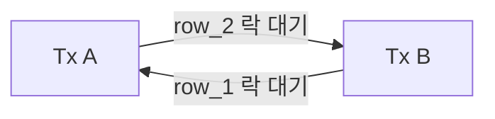
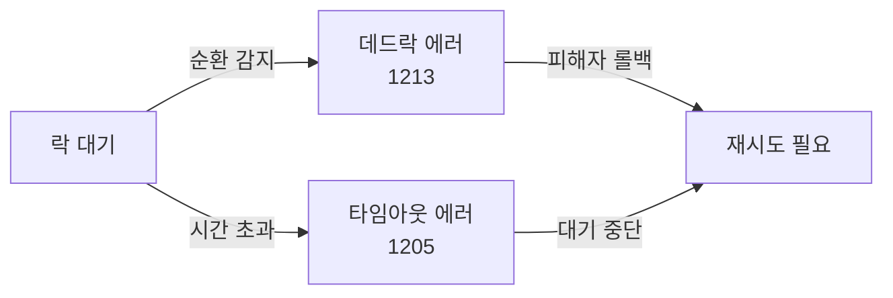
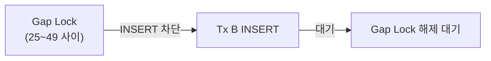
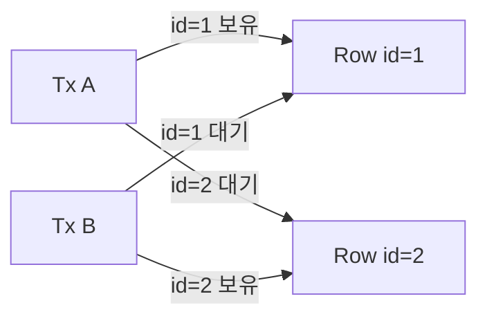
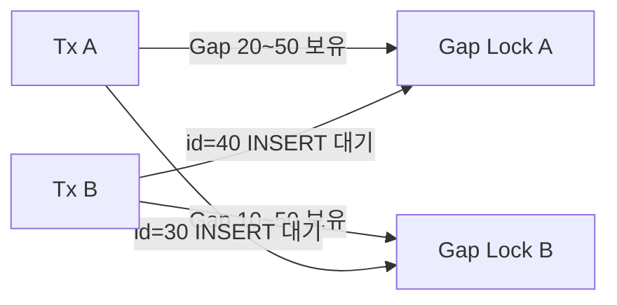
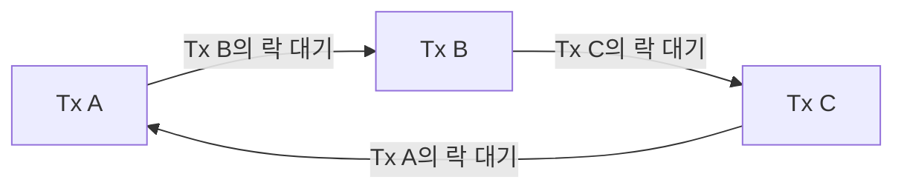
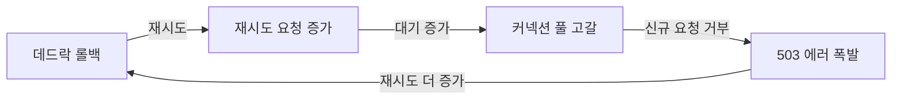

두 트랜잭션이 서로 상대방이 가진 락을 기다리며 영원히 멈춘다. 데드락은 단순히 느린 게 아니라 **완전히 멈추는** 상태다. 잘못 설계된 시스템에서 데드락은 초당 수백 건씩 터지며 전체 서비스를 마비시킨다. 이 글에서는 데드락이 왜 발생하는지 물리 구조 수준으로 파고들고, InnoDB의 탐지 알고리즘, 실전 재현 시나리오, 예방 전략, Spring/JPA 재시도 패턴까지 전부 다룬다.

> **비유로 먼저 이해하기**: 교차로에서 차 두 대가 서로 반대 방향에서 진입해 교차로 한 칸을 각각 차지했다. 앞으로 가려면 상대방이 비켜줘야 하는데, 상대방도 같은 상황이다. 경찰(운영체제 또는 DB 엔진)이 개입해 한 대를 강제로 후진시키지 않으면 교통은 영원히 막힌다. 데드락은 자원 순환 대기다.

<br>

## 1. 데드락이란? — Coffman 4가지 조건

데드락은 1971년 Coffman 등이 정의한 **4가지 조건이 동시에 성립할 때**만 발생한다. 하나라도 깨면 데드락은 불가능하다.

### 1-1. Coffman 4조건

**1) 상호 배제(Mutual Exclusion)**
자원은 한 번에 하나의 트랜잭션만 점유할 수 있다. InnoDB의 X락이 정확히 이 조건이다. X락이 걸린 행은 다른 트랜잭션이 읽거나 쓸 수 없다.

**2) 점유 대기(Hold and Wait)**
이미 자원을 점유한 채로 다른 자원을 기다린다. 트랜잭션 A가 row_1에 X락을 건 상태로 row_2의 X락을 기다리는 상황이다.

**3) 비선점(No Preemption)**
점유된 자원을 외부에서 강제로 빼앗을 수 없다. 락을 자발적으로 해제(COMMIT/ROLLBACK)하지 않는 한 다른 트랜잭션이 뺏을 수 없다.

**4) 순환 대기(Circular Wait)**
A→B→C→A 형태로 대기가 순환한다. 이것이 데드락의 본질이다.



> **핵심 인사이트**: 4가지 조건 중 "순환 대기"만 방지해도 데드락은 발생하지 않는다. 락 획득 순서를 전역적으로 고정하면 순환이 원천 차단된다. 뒤에서 상세히 다룬다.

### 1-2. 데드락 vs 락 타임아웃의 차이

많은 개발자가 혼동한다. 둘은 근본적으로 다르다.

| 구분 | 데드락 | 락 타임아웃 |
|------|--------|-------------|
| 원인 | 순환 대기 | 단방향 장기 대기 |
| 해소 | DB가 자동 감지→피해자 롤백 | 대기 시간 초과→에러 반환 |
| 에러 코드 | `ERROR 1213 (40001)` | `ERROR 1205 (HY000)` |
| 예측 가능성 | 어려움 (순환 감지 필요) | 쉬움 (시간 기준) |
| innodb_deadlock_detect | 관련 있음 | 관련 없음 |



<br>

## 2. InnoDB 락 메커니즘 — 데드락의 씨앗

InnoDB의 락 구조를 모르면 데드락을 이해할 수 없다. 데드락의 90%는 Gap Lock과 Next-Key Lock에서 나온다.

### 2-1. Record Lock — 인덱스 레코드에 건다

InnoDB는 **테이블 행(row)이 아니라 인덱스 레코드**에 락을 건다. 인덱스가 없으면 클러스터드 인덱스 전체에 락이 걸린다 — 사실상 테이블 락이다.

```sql
-- idx_order_id가 있을 때: order_id=100 레코드 하나에만 X락
UPDATE orders SET status = 'DONE' WHERE order_id = 100;

-- 인덱스가 없을 때: 클러스터드 인덱스 전체 풀스캔 → 모든 행에 X락
UPDATE orders SET status = 'DONE' WHERE note = 'urgent';
```

> **실전 함정**: 조건 컬럼에 인덱스가 없으면 WHERE 절로 1건을 업데이트해도 테이블 전체가 잠긴다. 데드락 발생률이 폭발적으로 오른다.

### 2-2. Gap Lock — 존재하지 않는 행도 잠근다

Gap Lock은 인덱스 레코드 사이의 **간격(gap)**에 걸리는 락이다. REPEATABLE READ 격리 수준에서 Phantom Read를 막기 위해 도입됐다.

```sql
-- orders 테이블의 order_id: 10, 20, 30, 50, 100 이 존재

-- Tx A: order_id 25~49 범위에 Gap Lock 획득
SELECT * FROM orders WHERE order_id BETWEEN 25 AND 49 FOR UPDATE;

-- Tx B: 이 범위 안에 INSERT → Gap Lock에 막혀 대기
INSERT INTO orders (order_id, ...) VALUES (35, ...); -- 대기!
```



Gap Lock의 특징: Gap Lock끼리는 **서로 호환된다**. 두 트랜잭션이 같은 범위에 Gap Lock을 걸 수 있다. 문제는 INSERT가 끼어들 때다.

### 2-3. Next-Key Lock — Record Lock + Gap Lock의 조합

Next-Key Lock은 `(이전 레코드, 현재 레코드]` 범위를 잠그는 InnoDB의 기본 락이다. REPEATABLE READ의 기본 설정이다.

```
order_id 값:  10   20   30   50   100
Next-Key Lock: (-∞,10] (10,20] (20,30] (30,50] (50,100] (100,+∞)
```

범위 검색 하나가 여러 Next-Key Lock을 획득한다. 이것이 데드락의 가장 흔한 원인이다.

### 2-4. Insert Intention Lock — INSERT 전용 Gap Lock

INSERT가 실행되기 직전, 해당 gap에 **Insert Intention Lock**을 걸려 한다. 같은 gap 안에서도 삽입 위치가 다르면 서로 호환된다. 하지만 기존 Gap Lock과는 충돌한다.

| 기존 락 \ 신규 락 | Gap Lock | Insert Intention |
|------------------|----------|------------------|
| Gap Lock | 호환 | **충돌** |
| Insert Intention | **충돌** | 호환 |

이 충돌 구조가 INSERT 데드락을 만드는 핵심이다.

<br>

## 3. 데드락 발생 시나리오 — 실제 SQL로 재현

### 3-1. 패턴 1: 교차 업데이트 데드락 (가장 고전적)

가장 흔하면서 가장 이해하기 쉬운 패턴이다. 두 트랜잭션이 두 행을 반대 순서로 업데이트한다.

**테이블 셋업:**
```sql
CREATE TABLE accounts (
    id      BIGINT PRIMARY KEY,
    balance DECIMAL(15,2) NOT NULL
);
INSERT INTO accounts VALUES (1, 10000.00), (2, 20000.00);
```

**데드락 재현:**

| 시간 | Tx A | Tx B |
|------|------|------|
| T1 | `BEGIN;` | `BEGIN;` |
| T2 | `UPDATE accounts SET balance = balance - 1000 WHERE id = 1;` ← id=1 X락 획득 | |
| T3 | | `UPDATE accounts SET balance = balance - 1000 WHERE id = 2;` ← id=2 X락 획득 |
| T4 | `UPDATE accounts SET balance = balance + 1000 WHERE id = 2;` ← id=2 X락 대기 | |
| T5 | | `UPDATE accounts SET balance = balance + 1000 WHERE id = 1;` ← id=1 X락 대기 |
| T6 | **순환 대기 감지 → Tx B 롤백(피해자)** | |



**근본 원인**: 락 획득 순서가 A는 1→2, B는 2→1이다. 순환 대기가 만들어진다.

**해결책**: 애플리케이션에서 항상 작은 id부터 업데이트한다.
```java
// 반드시 id 오름차순으로 정렬 후 업데이트
List<Long> ids = Arrays.asList(fromId, toId);
Collections.sort(ids);
for (Long id : ids) {
    accountRepository.updateBalance(id, ...);
}
```

### 3-2. 패턴 2: Gap Lock 데드락

REPEATABLE READ에서 범위 검색 + INSERT가 만나면 발생한다. 실무에서 많이 마주치는 패턴이다.

**테이블 셋업:**
```sql
CREATE TABLE products (
    id       BIGINT PRIMARY KEY,
    category VARCHAR(50),
    price    DECIMAL(10,2),
    INDEX idx_category (category)
);
INSERT INTO products VALUES (10, 'A', 100), (20, 'A', 200), (50, 'A', 300);
```

**데드락 재현:**

| 시간 | Tx A | Tx B |
|------|------|------|
| T1 | `BEGIN;` | `BEGIN;` |
| T2 | `SELECT * FROM products WHERE category = 'A' AND id BETWEEN 25 AND 45 FOR UPDATE;` ← Gap Lock(20~50) 획득 | |
| T3 | | `SELECT * FROM products WHERE category = 'A' AND id BETWEEN 15 AND 35 FOR UPDATE;` ← Gap Lock(10~50) 획득 |
| T4 | `INSERT INTO products VALUES (30, 'A', 150);` ← Tx B의 Gap Lock에 막혀 Insert Intention Lock 대기 | |
| T5 | | `INSERT INTO products VALUES (40, 'A', 250);` ← Tx A의 Gap Lock에 막혀 Insert Intention Lock 대기 |
| T6 | **순환 대기 → 데드락** | |



**근본 원인**: Gap Lock끼리는 호환되어 둘 다 획득했지만, 상대방 Gap 안에 INSERT하려 할 때 Insert Intention Lock이 충돌한다.

**해결책 옵션:**
1. `READ COMMITTED` 격리 수준 사용 → Gap Lock 비활성화
2. `innodb_locks_unsafe_for_binlog=ON` (구버전, 권장하지 않음)
3. 범위 검색 대신 정확한 인덱스 조건 사용
4. 삽입 순서를 단방향으로 고정

### 3-3. 패턴 3: INSERT 데드락 (Duplicate Key + Gap Lock)

유니크 인덱스가 있을 때 동시 INSERT가 일으키는 데드락이다. 가장 파악하기 어렵다.

**테이블 셋업:**
```sql
CREATE TABLE user_coupons (
    id       BIGINT PRIMARY KEY AUTO_INCREMENT,
    user_id  BIGINT NOT NULL,
    coupon   VARCHAR(50) NOT NULL,
    UNIQUE KEY uk_user_coupon (user_id, coupon)
);
```

**데드락 재현:**

| 시간 | Tx A | Tx B | Tx C |
|------|------|------|------|
| T1 | `BEGIN;` | `BEGIN;` | `BEGIN;` |
| T2 | `INSERT INTO user_coupons (user_id, coupon) VALUES (1, 'SUMMER');` ← 성공, X락 보유 | | |
| T3 | | `INSERT INTO user_coupons (user_id, coupon) VALUES (1, 'SUMMER');` ← Duplicate Key 감지 → S락 대기 | `INSERT INTO user_coupons (user_id, coupon) VALUES (1, 'SUMMER');` ← S락 대기 |
| T4 | `ROLLBACK;` ← X락 해제 | | |
| T5 | | S락 획득 → X락(Insert Intention) 요청 | S락 획득 → X락(Insert Intention) 요청 |
| T6 | | Tx C의 S락으로 인해 X락 대기 | Tx B의 S락으로 인해 X락 대기 |
| T7 | **Tx B와 Tx C 데드락** | | |

**근본 원인**: Tx A 롤백 후 B와 C가 둘 다 S락을 획득한다. 각자 X락으로 업그레이드하려 할 때 상대방의 S락이 방해한다.

**해결책:**
```sql
-- INSERT IGNORE: 중복 시 에러 없이 무시
INSERT IGNORE INTO user_coupons (user_id, coupon) VALUES (1, 'SUMMER');

-- INSERT ... ON DUPLICATE KEY UPDATE: 중복 시 업데이트
INSERT INTO user_coupons (user_id, coupon, created_at)
VALUES (1, 'SUMMER', NOW())
ON DUPLICATE KEY UPDATE created_at = VALUES(created_at);

-- 또는 SELECT 후 없을 때만 INSERT (애플리케이션 레벨 중복 방지)
```

### 3-4. 패턴 4: 외래 키 데드락

외래 키 체크도 락을 생성한다. 부모-자식 관계가 데드락을 일으킨다.

```sql
CREATE TABLE parent (id BIGINT PRIMARY KEY, val INT);
CREATE TABLE child  (id BIGINT PRIMARY KEY, parent_id BIGINT,
                     FOREIGN KEY (parent_id) REFERENCES parent(id));
```

| 시간 | Tx A | Tx B |
|------|------|------|
| T1 | `DELETE FROM parent WHERE id = 1;` ← parent row에 X락 + child gap에 S락 | |
| T2 | | `INSERT INTO child (id, parent_id) VALUES (100, 2);` ← 정상 진행 |
| T3 | | `DELETE FROM parent WHERE id = 2;` ← parent row에 X락 + child gap에 S락 필요 |
| T4 | `INSERT INTO child (id, parent_id) VALUES (200, 1);` ← Tx B가 보유한 child gap S락과 충돌 | |
| T5 | **데드락** | |

<br>

## 4. InnoDB 데드락 감지 메커니즘 — Wait-for Graph

InnoDB는 데드락을 어떻게 자동으로 찾아내는가. 핵심은 **Wait-for Graph(WFG)** 알고리즘이다.

### 4-1. Wait-for Graph 구조

WFG는 방향 그래프다.
- **노드**: 트랜잭션
- **간선**: `A → B` 의미 = A가 B가 보유한 락을 기다림

데드락 = WFG에 **사이클이 존재**함.



이 그래프에서 A→B→C→A 사이클이 존재 → 데드락.

### 4-2. 사이클 탐지 알고리즘

InnoDB는 새 락 대기가 발생할 때마다 WFG에 사이클이 생겼는지 DFS(깊이 우선 탐색)로 확인한다.

```
새 대기 추가 시:
1. 새 간선 A → B 추가
2. B에서 DFS 시작
3. 방문 중 A를 다시 만나면 → 사이클 = 데드락 감지
4. 피해자(Victim) 선정 → 롤백
```

**피해자 선정 기준**: InnoDB는 **롤백 비용이 가장 적은 트랜잭션**을 피해자로 선택한다. 변경 행 수, undo log 크기 등을 기준으로 한다. `innodb_deadlock_detect=ON`일 때만 동작한다.

### 4-3. innodb_deadlock_detect 설정

```sql
-- 데드락 감지 활성화 여부 (기본값: ON)
SHOW VARIABLES LIKE 'innodb_deadlock_detect';

-- 끄면? 락 타임아웃(innodb_lock_wait_timeout)으로만 해소
-- 트랜잭션 수가 매우 많을 때 성능 향상 목적으로 끄기도 함
SET GLOBAL innodb_deadlock_detect = OFF;
SET GLOBAL innodb_lock_wait_timeout = 3; -- 3초 타임아웃으로 대체
```

> **주의**: `innodb_deadlock_detect=OFF`로 끄면 감지가 없어 데드락이 타임아웃까지 대기한다. 트랜잭션이 매우 짧고 고속인 시스템에서만 고려한다. 일반적인 서비스에서는 ON이 안전하다.

### 4-4. 성능 고려사항

WFG 사이클 탐지는 O(V+E) 복잡도다. 동시 트랜잭션 수가 많을수록 오버헤드가 커진다. MySQL 8.0에서는 락 대기 시스템이 개선되어 탐지 성능이 크게 향상됐다.

<br>

## 5. SHOW ENGINE INNODB STATUS 분석법

데드락이 발생하면 InnoDB는 마지막 데드락 정보를 메모리에 보관한다. 이것을 읽는 법을 알아야 한다.

### 5-1. 명령어 실행

```sql
SHOW ENGINE INNODB STATUS\G
```

출력 중 `LATEST DETECTED DEADLOCK` 섹션을 찾는다.

### 5-2. 실제 출력 해석

```
------------------------
LATEST DETECTED DEADLOCK
------------------------
2026-05-14 09:23:15 0x7f1234abcd00

*** (1) TRANSACTION:
TRANSACTION 421938, ACTIVE 0 sec starting index read
mysql tables in use 1, locked 1
LOCK WAIT 3 lock struct(s), heap size 1136, 2 row lock(s)
MySQL thread id 101, OS thread handle 139..., query id 8823 localhost root updating

UPDATE accounts SET balance = balance - 1000 WHERE id = 2
                                                        ↑
                                            Tx A가 id=2 업데이트 시도 중

*** (1) HOLDS THE LOCK(S):
RECORD LOCKS space id 35 page no 3 n bits 72 index PRIMARY
 of table `test`.`accounts` trx id 421938 lock_mode X locks rec but not gap
Record lock, heap no 2 PHYSICAL RECORD:
 0: len 8; hex 0000000000000001; asc ;;
                              ↑
                        id=1 레코드에 X락 보유

*** (1) WAITING FOR THIS LOCK TO BE GRANTED:
RECORD LOCKS space id 35 page no 3 n bits 72 index PRIMARY
 of table `test`.`accounts` trx id 421938 lock_mode X locks rec but not gap waiting
Record lock, heap no 3 PHYSICAL RECORD:
 0: len 8; hex 0000000000000002; asc ;;
                              ↑
                        id=2 레코드 X락 대기 중

*** (2) TRANSACTION:
TRANSACTION 421939, ACTIVE 0 sec starting index read
...
UPDATE accounts SET balance = balance - 1000 WHERE id = 1

*** (2) HOLDS THE LOCK(S):
... id=2 레코드에 X락 보유 ...

*** (2) WAITING FOR THIS LOCK TO BE GRANTED:
... id=1 레코드 X락 대기 중 ...

*** WE ROLL BACK TRANSACTION (2)
                          ↑
                  피해자: Tx B 롤백
```

### 5-3. 해석 포인트 5가지

**1) HOLDS THE LOCK(S)**: 현재 보유 중인 락. 이것이 상대방을 막는 원인이다.

**2) WAITING FOR THIS LOCK TO BE GRANTED**: 지금 대기 중인 락. 무엇 때문에 막혔는지 알 수 있다.

**3) lock_mode X locks rec but not gap**: Record Lock만(Gap Lock 없음). `lock_mode X`는 Next-Key Lock이다.

**4) PHYSICAL RECORD의 hex 값**: 인덱스 키 값이다. `hex 0000000000000001` = id=1.

**5) WE ROLL BACK TRANSACTION (N)**: 피해자가 된 트랜잭션 번호.

### 5-4. performance_schema로 실시간 모니터링

`SHOW ENGINE INNODB STATUS`는 마지막 데드락 하나만 보여준다. 실시간 락 대기는 `performance_schema`를 쓴다.

```sql
-- 현재 락 대기 상황 전체 조회
SELECT
    r.trx_id            AS waiting_trx,
    r.trx_query         AS waiting_query,
    b.trx_id            AS blocking_trx,
    b.trx_query         AS blocking_query,
    l.lock_table,
    l.lock_index,
    l.lock_mode
FROM
    information_schema.innodb_lock_waits   w
    JOIN information_schema.innodb_trx     r ON r.trx_id = w.requesting_trx_id
    JOIN information_schema.innodb_trx     b ON b.trx_id = w.blocking_trx_id
    JOIN information_schema.innodb_locks   l ON l.lock_id = w.requested_lock_id;

-- MySQL 8.0+: performance_schema 사용
SELECT
    t.THREAD_ID,
    t.PROCESSLIST_INFO  AS current_query,
    w.OBJECT_NAME       AS locked_table,
    w.LOCK_MODE,
    w.LOCK_STATUS
FROM
    performance_schema.data_lock_waits  dlw
    JOIN performance_schema.data_locks   w  ON w.ENGINE_LOCK_ID = dlw.REQUESTING_ENGINE_LOCK_ID
    JOIN performance_schema.threads      t  ON t.THREAD_ID = dlw.REQUESTING_THREAD_ID;
```

<br>

## 6. 데드락 예방 전략

### 6-1. 전략 1: 락 획득 순서 고정 (가장 효과적)

Coffman 조건 중 "순환 대기"를 없앤다. 모든 트랜잭션이 동일한 순서로 자원을 요청하면 순환이 불가능하다.

```java
// 나쁜 예: 호출 순서가 다를 수 있음
public void transfer(Long fromId, Long toId, BigDecimal amount) {
    Account from = accountRepo.findByIdWithLock(fromId); // X락 획득 순서 비결정적
    Account to   = accountRepo.findByIdWithLock(toId);
    from.withdraw(amount);
    to.deposit(amount);
}

// 좋은 예: 항상 작은 ID 먼저 락 획득
public void transfer(Long fromId, Long toId, BigDecimal amount) {
    Long firstId  = Math.min(fromId, toId);
    Long secondId = Math.max(fromId, toId);
    Account first  = accountRepo.findByIdWithLock(firstId);
    Account second = accountRepo.findByIdWithLock(secondId);

    Account from = firstId.equals(fromId) ? first : second;
    Account to   = firstId.equals(toId)   ? first : second;
    from.withdraw(amount);
    to.deposit(amount);
}
```

### 6-2. 전략 2: 트랜잭션을 최대한 짧게

트랜잭션이 오래 유지될수록 락도 오래 유지된다. 외부 API 호출, 복잡한 계산, 파일 I/O는 트랜잭션 밖으로 빼낸다.

```java
// 나쁜 예: 외부 API 호출이 트랜잭션 안에 있음
@Transactional
public void processOrder(Long orderId) {
    Order order = orderRepo.findByIdWithLock(orderId); // X락 획득
    PaymentResult result = externalPaymentApi.pay(order); // 외부 API (수백 ms)
    order.confirm(result);
    // 외부 API 응답 기다리는 동안 X락 유지 → 다른 트랜잭션 대기
}

// 좋은 예: 외부 API를 트랜잭션 밖에서 먼저 호출
public void processOrder(Long orderId) {
    Order order = orderRepo.findById(orderId).orElseThrow();
    PaymentResult result = externalPaymentApi.pay(order); // 락 없이 외부 호출
    confirmOrderInTransaction(orderId, result); // 트랜잭션은 DB 작업만
}

@Transactional
private void confirmOrderInTransaction(Long orderId, PaymentResult result) {
    Order order = orderRepo.findByIdWithLock(orderId); // X락은 짧게만
    order.confirm(result);
}
```

### 6-3. 전략 3: 인덱스 최적화

인덱스 없는 조건 → 테이블 전체 락 → 데드락 폭발. 인덱스는 데드락 예방에도 직결된다.

```sql
-- 실행 계획으로 락 범위 확인
EXPLAIN SELECT * FROM orders WHERE status = 'PENDING' AND created_at > NOW() - INTERVAL 1 HOUR FOR UPDATE;

-- type이 ALL(풀스캔)이면 모든 행에 락 → 반드시 인덱스 추가
-- type이 ref, range이면 필요한 행에만 락
ALTER TABLE orders ADD INDEX idx_status_created (status, created_at);
```

### 6-4. 전략 4: 격리 수준 조정

Gap Lock은 REPEATABLE READ에서만 발생한다. 팬텀 리드가 허용되는 비즈니스 로직이라면 READ COMMITTED로 낮춰 Gap Lock을 없앤다.

```sql
-- 세션 레벨 격리 수준 변경
SET SESSION TRANSACTION ISOLATION LEVEL READ COMMITTED;

-- 글로벌 설정 (my.cnf)
[mysqld]
transaction-isolation = READ-COMMITTED
```

```java
// Spring: 특정 메서드만 READ_COMMITTED
@Transactional(isolation = Isolation.READ_COMMITTED)
public List<Product> getAvailableProducts() {
    return productRepo.findByStatus("ACTIVE");
}
```

### 6-5. 전략 5: SELECT FOR UPDATE 범위 최소화

```sql
-- 나쁜 예: 범위 검색으로 불필요한 Gap Lock
SELECT * FROM inventory WHERE category_id = 5 FOR UPDATE;

-- 좋은 예: 정확한 PK로 필요한 행만 락
SELECT * FROM inventory WHERE id IN (101, 102, 103) FOR UPDATE;
```

<br>

## 7. 극한 시나리오 — 데드락 폭풍이 서비스를 마비시키는 과정

> 이 시나리오는 2020년대 실제 대규모 서비스에서 보고된 패턴을 재구성한 것이다.

### 7-1. 상황 설정: 선착순 한정 판매

온라인 쇼핑몰에서 오전 10시 정각, 인기 상품 1000개를 선착순 판매한다. 100만 명이 동시 접속한다.

### 7-2. 데드락 폭풍 진행 과정

**1단계 — 락 경쟁 시작 (T+0초)**

```
100만 요청 → 서버 수백 대에 분산
각 서버의 스레드: BEGIN → SELECT inventory WHERE product_id=X FOR UPDATE
                  → UPDATE inventory SET stock = stock - 1 WHERE product_id=X
```

**2단계 — 데드락 연쇄 (T+0.1초)**

```
주문은 보통 여러 테이블을 업데이트:
  1. UPDATE inventory SET stock = stock - 1 WHERE product_id = X
  2. INSERT INTO orders (user_id, product_id, ...) VALUES (...)
  3. UPDATE user_point SET point = point - 1000 WHERE user_id = Y

서버 A: inventory(X) → user_point(Y1) 순서
서버 B: user_point(Y2) → inventory(X) 순서  ← 실수로 다른 순서 사용

→ 서버 A와 B 사이에 교차 업데이트 데드락 발생
```

**3단계 — 피해자 롤백 폭발 (T+0.2초)**

```
InnoDB: 데드락 감지 → 피해자 롤백
피해자 트랜잭션: 재시도 → 다시 경쟁 → 다시 데드락
재시도 폭풍(Retry Storm) 시작
```

**4단계 — 커넥션 풀 고갈 (T+1초)**



**5단계 — 전체 서비스 마비 (T+3초)**

```
재시도 폭풍 → 커넥션 풀 고갈 → 신규 요청 거부
→ 타임아웃 → 클라이언트 재시도 → 요청 더 증가
→ Thundering Herd로 완전 마비
```

### 7-3. 복구 전략

**즉각 조치:**
1. 트래픽 차단 또는 큐잉(Rate Limiting)
2. `KILL <thread_id>`로 장기 대기 트랜잭션 강제 종료
3. 재고 테이블에 대한 접근 직렬화(Redis 분산 락으로 전환)

**근본 해결:**
```java
// Redis 분산 락으로 재고 차감 직렬화
@Service
public class InventoryService {
    private final RedissonClient redisson;

    public boolean reserveStock(Long productId, int quantity) {
        RLock lock = redisson.getLock("inventory:lock:" + productId);
        try {
            // 3초 대기, 5초 점유
            if (!lock.tryLock(3, 5, TimeUnit.SECONDS)) {
                throw new StockReservationException("락 획득 실패");
            }
            return processReservation(productId, quantity);
        } catch (InterruptedException e) {
            Thread.currentThread().interrupt();
            throw new StockReservationException("인터럽트 발생");
        } finally {
            if (lock.isHeldByCurrentThread()) lock.unlock();
        }
    }
}
```

<br>

## 8. Spring/JPA 환경에서의 데드락 처리

### 8-1. 데드락 에러 감지

Spring은 `CannotAcquireLockException`으로 데드락을 래핑한다.

```java
try {
    orderService.createOrder(request);
} catch (CannotAcquireLockException e) {
    // 데드락 또는 락 타임아웃
    log.warn("Lock acquisition failed: {}", e.getMessage());
    throw new RetryableException("잠시 후 다시 시도해주세요");
} catch (DeadlockLoserDataAccessException e) {
    // 데드락 피해자로 선정됨 (CannotAcquireLockException의 하위 클래스)
    log.warn("Deadlock detected, transaction rolled back");
    throw new RetryableException("데드락 발생, 재시도 중");
}
```

에러 계층:
```
DataAccessException
└── TransientDataAccessException
    └── ConcurrencyFailureException
        └── CannotAcquireLockException
            └── DeadlockLoserDataAccessException  ← 데드락 피해자
```

### 8-2. @Retryable로 자동 재시도

```java
// build.gradle
implementation 'org.springframework.retry:spring-retry'
implementation 'org.springframework:spring-aspects'

// 설정
@Configuration
@EnableRetry
public class RetryConfig {}
```

```java
@Service
public class OrderService {

    @Retryable(
        value = { CannotAcquireLockException.class,
                  DeadlockLoserDataAccessException.class },
        maxAttempts = 3,
        backoff = @Backoff(
            delay = 100,        // 첫 대기 100ms
            multiplier = 2.0,   // 지수 백오프: 100 → 200 → 400ms
            random = true       // 랜덤 jitter로 Thundering Herd 방지
        )
    )
    @Transactional
    public OrderResult createOrder(CreateOrderRequest request) {
        // 데드락이 발생해도 최대 3회 재시도
        Account account = accountRepo.findByIdWithLock(request.getAccountId());
        Inventory inv   = inventoryRepo.findByProductIdWithLock(request.getProductId());
        // ...
        return OrderResult.success(order);
    }

    @Recover
    public OrderResult recoverFromDeadlock(CannotAcquireLockException e,
                                           CreateOrderRequest request) {
        // 3회 모두 실패 시 실행
        log.error("Order failed after max retries: {}", request, e);
        alertService.sendAlert("주문 처리 실패 (데드락)", request);
        throw new OrderProcessingException("주문을 처리할 수 없습니다. 잠시 후 다시 시도해주세요.");
    }
}
```

### 8-3. 재시도 시 주의사항

재시도는 반드시 **멱등(Idempotent)**해야 한다.

```java
// 나쁜 예: 재시도 시 중복 처리
@Retryable(...)
@Transactional
public void processPayment(Long orderId) {
    paymentRepo.save(new Payment(orderId, amount)); // 재시도 시 중복 저장!
}

// 좋은 예: 멱등 키로 중복 방지
@Retryable(...)
@Transactional
public void processPayment(Long orderId, String idempotencyKey) {
    if (paymentRepo.existsByIdempotencyKey(idempotencyKey)) {
        return; // 이미 처리됨
    }
    Payment payment = new Payment(orderId, amount, idempotencyKey);
    paymentRepo.save(payment);
}
```

### 8-4. Optimistic Lock으로 데드락 회피

데드락 자체를 없애는 근본적 접근법이다. 비관적 락(X락) 대신 버전 필드로 충돌을 감지한다.

```java
@Entity
public class Inventory {
    @Id
    private Long id;

    private Integer stock;

    @Version                  // Optimistic Lock 버전 필드
    private Long version;
}

@Service
public class InventoryService {

    @Retryable(
        value = ObjectOptimisticLockingFailureException.class,
        maxAttempts = 5,
        backoff = @Backoff(delay = 50, random = true)
    )
    @Transactional
    public void decreaseStock(Long productId, int quantity) {
        Inventory inv = inventoryRepo.findById(productId).orElseThrow();
        if (inv.getStock() < quantity) throw new InsufficientStockException();
        inv.setStock(inv.getStock() - quantity);
        // JPA flush 시 버전 불일치 → ObjectOptimisticLockingFailureException
        // → @Retryable 재시도
    }
}
```

**Optimistic Lock이 적합한 경우:**
- 충돌 빈도가 낮은 경우 (읽기 > 쓰기)
- 짧은 연산
- 재시도 허용

**Pessimistic Lock이 적합한 경우:**
- 충돌 빈도가 높은 경우 (재고 차감 등)
- 재시도 비용이 큰 경우
- 정확한 직렬화가 필요한 경우

### 8-5. 데드락 모니터링 설정

```java
// DataSource 레벨에서 데드락 통계 수집
@Aspect
@Component
public class DeadlockMonitorAspect {

    private final MeterRegistry meterRegistry;
    private final Counter deadlockCounter;

    public DeadlockMonitorAspect(MeterRegistry meterRegistry) {
        this.meterRegistry = meterRegistry;
        this.deadlockCounter = Counter.builder("db.deadlock.count")
            .description("데드락 발생 횟수")
            .register(meterRegistry);
    }

    @Around("@annotation(Transactional)")
    public Object monitorDeadlock(ProceedingJoinPoint pjp) throws Throwable {
        try {
            return pjp.proceed();
        } catch (DeadlockLoserDataAccessException e) {
            deadlockCounter.increment(
                Tags.of("method", pjp.getSignature().toShortString())
            );
            throw e;
        }
    }
}
```

```sql
-- MySQL 서버 레벨 데드락 통계 (누적)
SHOW GLOBAL STATUS LIKE 'Innodb_deadlocks';

-- 출력 예:
-- Variable_name    | Value
-- Innodb_deadlocks | 1423
```

<br>

## 9. 데드락 디버깅 체크리스트

데드락이 발생했을 때 체계적으로 원인을 찾는 순서다.

### 체크리스트

**1) 데드락 로그 수집**
```sql
-- 마지막 데드락 상세 정보
SHOW ENGINE INNODB STATUS\G

-- 데드락 상세 로깅 활성화
SET GLOBAL innodb_print_all_deadlocks = ON;
-- /var/log/mysql/error.log 에 모든 데드락 기록됨
```

**2) 관련 쿼리 확인**

INNODB STATUS의 `HOLDS THE LOCK`과 `WAITING FOR` 섹션에서 쿼리 식별 → 어떤 테이블, 어떤 인덱스, 어떤 락 모드인지 확인.

**3) 실행 계획 점검**
```sql
EXPLAIN SELECT ... FOR UPDATE;
-- type=ALL → 인덱스 추가 필요
-- key=NULL → 인덱스 미사용
```

**4) 트랜잭션 순서 분석**

두 트랜잭션이 같은 테이블의 행들을 **다른 순서**로 접근하는지 확인.

**5) 격리 수준 확인**
```sql
SELECT @@transaction_isolation;
-- REPEATABLE-READ → Gap Lock 활성화 → 범위 쿼리 주의
```

**6) 락 대기 시간 확인**
```sql
SHOW VARIABLES LIKE 'innodb_lock_wait_timeout'; -- 기본 50초
```


<br>

## 10. 면접 포인트 5선

<details>
<summary>펼쳐보기</summary>

**Q1. 데드락이 발생하는 4가지 필요충분조건(Coffman 조건)을 설명하고, 실무에서 가장 쉽게 깨트릴 수 있는 조건이 무엇인지 말해주세요.**

A. 상호 배제(Mutual Exclusion), 점유 대기(Hold and Wait), 비선점(No Preemption), 순환 대기(Circular Wait)의 4가지 조건이 모두 성립해야 데드락이 발생합니다. 실무에서 가장 쉽게 깨트릴 수 있는 조건은 **순환 대기**입니다. 모든 트랜잭션이 자원을 항상 동일한 전역 순서(예: PK 오름차순)로 획득하도록 강제하면, 순환 구조 자체가 만들어지지 않아 데드락이 원천 차단됩니다. 반면 상호 배제를 없애면 데이터 정합성이 깨지고, 비선점을 없애면 롤백이 임의로 발생해 일관성 보장이 어렵습니다.

---

**Q2. InnoDB의 Gap Lock이 데드락을 일으키는 원리를 설명해주세요. 언제 Gap Lock이 활성화되고, 어떻게 비활성화할 수 있나요?**

A. Gap Lock은 REPEATABLE READ 격리 수준에서 인덱스 레코드 사이 **간격**에 걸리는 락입니다. Gap Lock끼리는 서로 호환되어 두 트랜잭션이 같은 범위에 동시에 Gap Lock을 걸 수 있습니다. 문제는 INSERT 시 생성되는 **Insert Intention Lock**이 기존 Gap Lock과 충돌한다는 점입니다. 트랜잭션 A가 gap(20~50)에 Gap Lock을 보유하고 INSERT(35)를 시도할 때, 트랜잭션 B도 같은 gap에 Gap Lock을 보유하고 INSERT(40)를 시도하면 서로 상대방의 Gap Lock에 막혀 순환 대기가 형성됩니다. Gap Lock을 비활성화하려면 격리 수준을 `READ COMMITTED`로 낮추면 됩니다. 이 경우 팬텀 리드가 허용되므로 비즈니스 요건을 먼저 확인해야 합니다.

---

**Q3. InnoDB가 데드락을 자동으로 감지하는 내부 메커니즘(Wait-for Graph)을 설명하고, 피해자 선정 기준을 말해주세요.**

A. InnoDB는 **Wait-for Graph(WFG)** 라는 방향 그래프를 내부적으로 유지합니다. 각 트랜잭션이 노드이고, "A가 B의 락을 기다린다"는 관계가 A→B 방향 간선입니다. 새 락 대기가 발생할 때마다 WFG에 간선을 추가하고 DFS로 사이클 존재 여부를 탐지합니다. 사이클이 발견되면 데드락이 확정되고, InnoDB는 **롤백 비용이 가장 적은 트랜잭션**을 피해자(Victim)로 선정합니다. 피해자 선정 기준은 주로 변경한 행의 수와 Undo Log 크기입니다. `innodb_deadlock_detect=ON`일 때만 이 메커니즘이 동작하며, 끄면 `innodb_lock_wait_timeout` 만료로만 해소됩니다.

---

**Q4. Spring @Transactional 환경에서 데드락이 발생했을 때 재시도 전략을 구현하는 방법을 설명해주세요. 재시도 구현 시 반드시 주의해야 할 점은?**

A. Spring Retry의 `@Retryable` 어노테이션으로 구현합니다. `value`에 `DeadlockLoserDataAccessException.class`와 `CannotAcquireLockException.class`를 지정하고, `backoff`에 지수 백오프와 랜덤 jitter를 설정합니다. jitter는 재시도가 동시에 몰려 Thundering Herd 문제가 발생하는 것을 막습니다. **가장 중요한 주의사항은 재시도 로직이 멱등(Idempotent)해야 한다는 점**입니다. 재시도 시 중복 처리(결제 중복, 주문 중복)가 발생하면 데드락보다 더 큰 문제가 됩니다. 멱등 키(idempotency key)를 사용하거나, DB 유니크 제약으로 중복을 차단해야 합니다. `@Recover` 메서드에서는 최대 재시도 횟수 초과 시 사용자에게 명확한 안내와 알림을 제공해야 합니다.

---

**Q5. "데드락이 자주 발생한다"는 장애 리포트를 받았을 때, 어떤 순서로 원인을 파악하고 해결하겠습니까?**

A. 다음 순서로 접근합니다.

**1단계 — 데이터 수집**: `SET GLOBAL innodb_print_all_deadlocks = ON`으로 모든 데드락을 에러 로그에 기록하고, `SHOW ENGINE INNODB STATUS`로 마지막 데드락 상세 정보를 확인합니다. `SHOW GLOBAL STATUS LIKE 'Innodb_deadlocks'`로 누적 발생 빈도를 파악합니다.

**2단계 — 쿼리 식별**: INNODB STATUS의 HOLDS/WAITING 섹션에서 관련 SQL과 락 타입(Record Lock인지 Gap Lock인지)을 확인합니다.

**3단계 — 실행 계획 점검**: `EXPLAIN ... FOR UPDATE`로 인덱스 사용 여부를 확인합니다. Full Scan이라면 인덱스 추가가 우선입니다.

**4단계 — 패턴 분류**: 교차 업데이트(락 순서 고정), Gap Lock(격리 수준 낮추기 또는 정확한 인덱스 조건), INSERT 중복(INSERT IGNORE/ON DUPLICATE KEY) 중 어느 패턴인지 분류합니다.

**5단계 — 수정 및 검증**: 수정 후 스테이징에서 재현 테스트를 실행하고, 프로덕션 배포 후 `Innodb_deadlocks` 카운터가 감소하는지 모니터링합니다.

</details>

<br>

---

**관련 포스트:**
- [DB 락 완전 정복: InnoDB 내부 메커니즘부터 분산 락까지](/db/db-locks/)
- [트랜잭션 격리 수준 완전 정복 — MVCC 내부 구조부터 Spring 실전까지](/db/db-transaction-isolation/)
